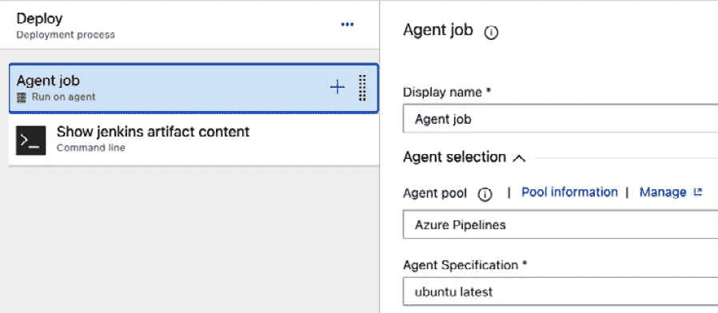

# 6

# 集成测试、安全任务和其他工具

现在我们已经学习了构建和发布流水线的基础知识，是时候了解如何通过其他工具扩展 Azure Pipelines，以执行更多任务，并能够在内置功能之外增加额外的功能了。本章结束时，你将具备超越基础的技能，能够包括任务来提高构建中产生代码的质量，部署前发现漏洞，并使用来自其他仓库的源代码和来自其他位置的完整工件。

在本章中，我们将讨论以下主题：

+   理解 Azure DevOps 的可扩展性模型

+   为你的构建包含自动化测试

+   提高代码质量

+   与 Jenkins 集成以进行工件和发布流水线管理

# 技术要求

为了完成本章内容，你需要某些扩展。首先，让我们了解**Azure DevOps 可扩展性模型**以及如何访问这些扩展。你可以在 GitHub 仓库中找到本章的代码，链接为 [`github.com/PacktPublishing/Implementing-CI-CD-Using-Azure-Pipelines/tree/main/ch06`](https://github.com/PacktPublishing/Implementing-CI-CD-Using-Azure-Pipelines/tree/main/ch06)。

## 理解 Azure DevOps 的可扩展性模型

Azure DevOps 及其子服务提供了多个默认包含的功能，但你可以使用扩展来定制和扩展你的体验，这些扩展可以使用标准技术（如 HTML、JavaScript 和 CSS）开发。

所有子服务背后都有一个非常灵活的模型，你可以通过市场上由个人和知名第三方组织发布的**扩展**来增强该模型。如果你没有找到需要的功能，你也可以创建自己的扩展并发布。

扩展的目的是简化可重用任务的封装，使用外部工具，甚至增强 Azure DevOps 的外观和感觉。对于 Azure Pipelines，你会找到以下扩展：

+   简化复杂和重复的任务

+   轻松使用常见的**基础设施即代码**（**IaC**）工具，如 Terraform 或 Ansible

+   与 SaaS 产品集成以提高代码质量和安全性

+   促进部署任务到如 Azure 和亚马逊 Web 服务等云服务提供商

你可以访问 Visual Studio Marketplace for Azure DevOps，网址是 [`marketplace.visualstudio.com/azuredevops`](https://marketplace.visualstudio.com/azuredevops)。

以下截图展示了它的样子：


图 6.1 – Azure DevOps 的 Visual Studio 市场

每个 marketplace 扩展列表都会显示扩展的名称、发布者、是否经过认证、评分、安装次数和价格。有些是免费的，而其他一些则可能需要付费。你可以通过名称、类别或标签来查找这些扩展，方便找到你需要的内容。

## 安装代码质量评估工具 SonarQube

在 marketplace 中搜索 SonarQube 并点击列表查看其详细信息。或者，你可以访问 [`marketplace.visualstudio.com/items?itemName=SonarSource.sonarqube`](https://marketplace.visualstudio.com/items?itemName=SonarSource.sonarqube)。

你应该看到类似于以下内容：


图 6.2 – Visual Studio Marketplace 上 SonarQube 扩展的列表

找到你想要的扩展后，点击 **免费获取** 或 **获取** 按钮。你将能够选择要安装的 Azure DevOps 组织（如果你有多个组织），如下图所示：


图 6.3 – 从 marketplace 安装 SonarQube 扩展

审核完权限和服务条款后，选择要安装的组织，点击 **安装** 按钮。安装扩展通常只需几秒钟，安装完成后，你可以选择继续前往 Azure DevOps 组织，或者返回 marketplace 查找更多扩展：


图 6.4 – SonarQube 扩展已安装

你可以在 [`github.com/PacktPublishing/Implementing-CI-CD-Using-Azure-Pipelines/tree/main/ch06`](https://github.com/PacktPublishing/Implementing-CI-CD-Using-Azure-Pipelines/tree/main/ch06) 找到本章的代码。

现在，我们已经完成了所有技术要求的设置，接下来让我们看看如何将自动化测试运行添加到你的构建管道中。

# 包括对构建的自动化测试

所有现代应用程序都需要某种形式的验证，以确保它们正确工作，无论有多少开发人员同时在代码上进行开发。这就是**自动化测试**的作用，它会在应用程序构建完成后立即执行，验证是否在做出更改时没有丧失质量或引入 bug。

有多种类型的测试，例如 **单元测试**、**集成测试** 和 **负载测试**，可以对应用程序执行。根据所使用的编程语言以及开发团队的偏好，还有许多自动化测试框架可供选择。

为什么自动化测试很重要？

自动化测试可以帮助你减少在应用程序发布中出现 BUG 的机会，通过在开发周期的早期阶段发现它们，同时减少测试团队执行验证的时间，并避免在重复任务上浪费人力，这些时间本可以用来开发应用程序中的更多功能和能力。

在本节中，你将学习如何使用**NUnit 测试框架**和在.NET Core 6.0 中创建的示例 C#.NET 应用程序集成单元测试的执行到你的构建流水线中。

我们假设你使用的是一个 Visual Studio 解决方案，其中包含一个`CalculusService`类库项目，测试项目已包含在内。以下是该类库项目中此类的示例代码：

```
namespace CalculusService
{
    public class Additions
    {
        public int Add(int number1, int number2)
        {
            return number1 + number2;
        }
    }
}
```

以下对应的单元测试定义在一个单独的测试项目中。确保你引用了`Nunit`、`NUnit3TestAdapter`和`NUnit.Analyzers` NuGet 包：

```
namespace CalculusService.Tests
{
    [TestFixture]
    public class AdditionsTests
    {
        private Additions additions;
        [SetUp]
        public void Setup()
        {
            additions = new Additions();
        }
        [TestCase(1, 2, 3)]
        [TestCase(2, 4, 6)]
        [TestCase(5, -10, -5)]
        public void TestAdd(int number1, int number2, int result)
        {
            Assert.That(result, Is.EqualTo(additions.Add(number1, number2)));
        }
    }
}
```

你需要使用 YAML 流水线，如下所示的代码片段，以构建和执行自动化测试：

```
trigger:
- main
pool:
  vmImage: 'windows-latest'
variables:
  solution: '**/*.sln'
  buildPlatform: 'Any CPU'
  buildConfiguration: 'Debug'
steps:
- task: NuGetToolInstaller@1
- task: NuGetCommand@2
  inputs:
    restoreSolution: '$(solution)'
- task: VSBuild@1
  inputs:
    solution: '$(solution)'
    msbuildArgs: '/p:PackageAsSingleFile=true /p:PackageLocation="$(build.artifactStagingDirectory)"'
    platform: '$(buildPlatform)'
    configuration: '$(buildConfiguration)'
- task: VSTest@2
  inputs:
    testSelector: 'testAssemblies'
    testAssemblyVer2: |
      **\*.Tests.dll
      !**\*TestAdapter.dll
      !**\obj\**
    codeCoverageEnabled: true
    platform: '$(buildPlatform)'
    configuration: '$(buildConfiguration)'
```

该流水线中最重要的部分是最后一步，它使用了`VSTest@2`任务。这是一个通用的现成任务，Azure Pipelines 中可用于运行单元和功能测试，支持多个测试框架，充分利用 Visual Studio 的 Test Explorer。设置`codeCoverageEnabled`属性为`true`也很重要，这样你就可以收集数据，指示应用程序中有多少代码被测试。

专业提示

配置`VSTest`任务并使用`testAssemblyVer2`属性时，确保提供一组模式列表，以便准确找到要执行测试的测试程序集。否则，你将遇到难以理解的错误。

执行单元测试并启用代码覆盖率后，你将在**概览**窗口中看到结果：


图 6.5 – 概览窗口中的测试和覆盖率结果

使用此任务的好处是它提供对自动发布测试结果和内置的 UI 报告的支持，这些功能已集成在 Azure Pipelines 中，如下所示的截图所示：


图 6.6 – Azure Pipelines 运行中包含的测试结果

`VSTest@2`任务还支持更高级的场景，比如在多个代理上并行执行测试，这在你有很多测试需要运行时非常有用，或者执行 UI 测试时，这需要在执行测试的代理中进行额外配置。

如果你的应用程序是使用其他编程语言构建的，你必须使用相应的测试运行器，并确保将结果发布为`PublishTestResults@2`任务支持的任何格式，以便能够导入并包含在 UI 中。

现在我们已经了解了如何以自动化方式运行测试，让我们学习如何提高代码质量。

# 提高代码质量

通常，开发人员太忙于关注代码质量，最终会利用各种自动化工具来确保自己编写的是最佳且最安全的应用程序。

在这个空间中有两个重要的区域需要了解：

+   **静态应用程序安全测试**：这可以帮助您检测代码中的漏洞

+   **软件组成分析**：这可以帮助您检测代码中引用的外部包和库中的漏洞

为什么要使用工具来提高代码质量？

开发人员和测试人员只能在有限的时间内尽力满足时间表并处理应用程序功能。提前引入这些工具可以帮助他们发现 bugs 和漏洞，否则这些问题在应用程序发布给最终用户时可能会造成很高的成本。

有许多知名的第三方工具可以用于扫描和评估代码质量。在本章中，我们将使用**SonarQube**，因为它是最流行且易于使用的工具之一。它允许开发人员确保通过识别 bugs 和安全漏洞、检测常见的反维护性模式和重复代码等来编写清晰的代码。

它提供不同的定价层级，从免费的 Community Edition 开始，本章中的示例将使用该版本。如果您希望在工具中获得更多的编程语言支持或高级漏洞检测，则需要付费版本。

Checkmarx、Veracode、OWASP、WhiteSource 和 HP Fortify 等都是可用的工具。比较这些工具超出了本书的范围，但您可以在网上找到很多比较。

按照以下步骤设置 SonarQube 分析您的代码：

1.  配置 SonarQube 项目。

1.  在 Azure DevOps 中创建到 SonarQube 的服务连接。

1.  创建一个 Azure pipeline 来分析您的代码。

我们将在接下来的章节中逐步介绍这些步骤。

## 配置 SonarQube 项目

在您的 SonarQube 实例中，通过选择**来自 Azure DevOps**选项，从向导中创建项目，如下图所示：


图 6.7 – 使用来自 Azure DevOps 选项在 SonarQube 中创建项目

如果这是您第一次设置与 Azure DevOps 的连接，SonarQube 会提示您提供**配置名称**、**Azure DevOps URL**和**个人访问令牌**的详细信息，以便它可以配置项目：


图 6.8 – 创建配置

然后，通过从可用列表中选择 Azure DevOps 项目并点击**设置所选** **代码库**按钮，在 SonarQube 侧选择要配置的 Azure DevOps 项目：


图 6.9 – 在 SonarQube 中选择 Azure DevOps 项目

完成此操作后，你就可以继续在 Azure DevOps 和管道端进行配置了。

## 在 Azure DevOps 中创建到 SonarQube 的服务连接

下一步是创建一个**服务连接**到 SonarQube 实例。这将允许 Azure Pipelines 使用 SonarQube 扩展并与 SonarQube 实例进行通信。

你可以通过选择`Sonar`来创建和管理服务连接，应该列出 SonarQube 选项：


图 6.10 – SonarQube 服务连接选项

下一步是在**Server Url**、**Token**、**Service connection name**和**Description (optional)**框中提供详细信息。除非你想分别为每个管道管理服务连接的访问权限，否则不要忘记勾选**Grant access permission to all pipelines**选项：


图 6.11 – SonarQube 的服务连接详情

重要提示

服务连接是定义与 Azure DevOps 外部服务通信所需凭证的简单且集中化的方式，避免了在各个地方输入凭证的需求。

## 创建一个 Azure Pipeline 来分析你的代码

下一步是将 SonarQube 扩展中的两个任务添加到你的构建管道中。让我们看一下以下管道：

```
pool:
  vmImage: 'windows-2019'
variables:
  solution: '**/*.sln'
  buildPlatform: 'Any CPU'
  buildConfiguration: 'Release'
steps:
- task: SonarQubePrepare@5
  inputs:
    SonarQube: 'SonarQube'
    scannerMode: 'MSBuild'
    projectKey: 'PacktAzureDevOps_SonarQubeIntegration_########'
- task: NuGetToolInstaller@1
- task: NuGetCommand@2
  inputs:
    restoreSolution: '$(solution)'
- task: VSBuild@1
  inputs:
    solution: '$(solution)'
    msbuildArgs: '/p:DeployOnBuild=true /p:WebPublishMethod=Package /p:PackageAsSingleFile=true /p:SkipInvalidConfigurations=true /p:PackageLocation="$(build.artifactStagingDirectory)"'
    platform: '$(buildPlatform)'
    configuration: '$(buildConfiguration)'
- task: SonarQubeAnalyze@5
```

`SonarQubePrepare`任务用于提供执行分析所需的上下文，必须提供 SonarQube 中的服务连接、扫描器模式和项目密钥。此任务必须在执行任何编译任务之前放置。

`SonarQubeAnalyze`任务负责执行安全扫描，必须放在所有编译代码的任务之后。它将使用自`SonarQubePrepare`任务执行以来收集的信息来执行所有必要的数据收集和分析，以进行安全扫描。如果未通过 SonarQube 项目中定义的条件，该任务将导致管道失败。

## 审查 SonarQube 分析结果

安全扫描的结果将在 SonarQube 门户中提供。根据项目的性质，你将获得不同的质量指标和改善代码的建议，如下图所示：


图 6.12 – SonarQube 分析结果

重要提示

可以使用`SonarQubePublish`任务在 Azure Pipeline 摘要中包含简短的摘要和完整报告的链接。然而，这仅适用于 SonarQube 的付费版本。

SonarQube 将为您提供有关代码中可能存在的错误、漏洞、安全热点、代码重复和其他问题的洞察，帮助开发者通过发现这些问题并提供修复建议来解决它们。

将这种类型的工具集成到您的管道中，能为开发者提供快速反馈回路，帮助他们在开发过程早期修复和缓解应用程序中的风险，避免在将应用部署到生产环境时发生代价高昂的错误。

Azure Pipelines 也可以用来协调在其他系统中创建的**工件**的部署，例如流行的 CI/CD 工具**Jenkins**。我们将在下一节详细介绍这一点。

# 与 Jenkins 集成以进行工件和发布管道

在本节中，我们将演示如何设置一个简单的示例，展示如何将 Azure Pipelines 与 Jenkins 连接，从而能够下载在 Jenkins 中生成的工件并通过发布管道进行部署。

**Jenkins 任务**类似于 Azure Pipeline，是一组自动化步骤，执行特定的操作并可以生成工件或执行部署。让我们来学习如何创建一个简单的 Jenkins 任务。

## 创建一个生成工件的 Jenkins 任务

这个场景假设我们在 Jenkins 服务器中有一个名为`PacktFamily`的项目，如下图所示：


图 6.13 – 带有 PackFamily 项目的 Jenkins 实例

在这个场景中，Jenkins 任务的配置非常简单，主要是为了演示如何在 Azure Pipelines 端下载一个工件。以下图显示了生成`artifact.txt`的构建步骤：


图 6.14 – Jenkins 任务中用于创建工件的构建步骤

以下图显示了`artifact.txt`的构建后操作：


图 6.15 – 发布 Jenkins 工件的构建后操作

Jenkins 任务的执行将生成一个可由 Azure Pipelines 下载的单一工件：


图 6.16 – Jenkins 任务结果与工件

现在我们有了一个 Jenkins 任务，接下来让我们学习如何将 Azure Pipelines 与它集成。

## 在 Azure DevOps 中创建 Jenkins 服务连接

这个过程类似于我们在*在 Azure DevOps 中创建 SonarQube 服务连接*一节中讨论的内容。在 Azure DevOps 的项目设置中，点击`Jenkins`并点击**下一步**：


图 6.17 – 新建服务连接对话框

提供**服务器 URL**、**用户名**、**密码**和**服务连接名称**的详细信息。如果需要，请不要忘记勾选**授予所有管道访问权限**框。最后，点击**验证并保存**按钮以继续：


图 6.18 – 新建 Jenkins 服务连接对话框

现在，我们可以继续创建一个使用工件的管道。

## 创建一个用于 Jenkins 工件的发布管道

现在，是时候配置发布管道了。你可以按照以下步骤进行：

1.  导航到**项目** | **管道** | **发布**，然后点击**新建发布管道**。你将有机会选择一个模板，如下图所示。我们将从**空作业**开始：


图 6.19 – 选择发布管道的模板

1.  点击**添加工件**小部件，然后选择**Jenkins**选项，你将能够使用之前创建的服务连接，选择在 Jenkins 中的项目，以便使用工件。只需选择与之前步骤中创建的名称匹配的服务连接，然后选择相应的**源（**作业**）**选项：


图 6.20 – 将 Jenkins 工件添加到发布管道

1.  你可以选择更改**源别名**详细信息，这将作为管道执行后下载工件的目录。当你有多个来自不同来源的工件时，这一点非常重要，可以避免在管道执行时文件被覆盖。在这种情况下，默认值将有效。

1.  完成此操作后，我们可以向**部署**阶段添加步骤，验证甚至打印出工件的内容。点击**部署**阶段中的**1 个作业，0 个任务**选项，将允许我们自定义管道。在此场景中，我们将使用 Linux 代理。点击**代理作业**选项，如下图所示，将使我们进入**代理选择**部分。现在，我们可以从**代理池**下拉菜单中选择**Azure Pipelines**，并从**代理规格**下拉菜单中选择**ubuntu latest**：



图 6.21 – 在部署阶段选择代理

1.  完成此操作后，点击**Agent Job**部分右侧的**+**按钮，查找并添加**命令行**任务。此任务可以在代理中执行自定义脚本，并会根据操作系统切换到适当的底层进程：


图 6.22 – 用于列出工件内容的命令行任务

让我们来看一下我们用来显示内容的脚本：

```
ls -la
cd _PacktFamily
ls -la
echo "Show content of file artifact.txt file:"
cat artifact.txt
```

这个脚本将执行以下操作：

+   列出当前目录的内容，这里应该是代理运行当前管道的地方

+   进入 Jenkins 构件下载的目录

+   列出当前目录的内容，这里应该是 Jenkins 构件被下载到的地方

+   打印出一个标签，表示将要显示的文件内容

+   打印 `artifact.txt` 文件的内容

1.  一旦你保存了管道并创建了一个发布来执行它，你应该能够看到它有效地从 Jenkins 下载了构件并列出了文件的内容，如下图所示：


图 6.23 – 管道下载 Jenkins 构件的日志

重要提示

**Azure Pipelines** 选项在 **代理选择** 部分提供了访问 Microsoft 托管代理的功能。这些代理由 Azure DevOps 平台管理，无需你管理底层基础设施。支持多个操作系统，不同版本的代理中也已安装不同的工具，以便于构建和部署应用程序。你还可以选择购买并行作业容量，以便同时运行多个作业。如果需要，你也可以在管道执行过程中安装这些代理所需的任何软件。只要记住，这些将增加执行时间。

到此为止，我们已经完成了本章内容。

# 总结

在本章中，我们了解了 Azure DevOps 的扩展性模型，以及扩展市场如何使我们轻松找到可以轻松集成到构建和发布管道中的额外功能。这将加速你创建构建和发布管道的能力，并将它们与其他工具集成。我们还学习了如何通过集成自动化测试和安全扫描来提高应用程序的质量，及时提醒开发人员在出现故障或漏洞时，从而减少寻找 bug、修复它们和减少安全风险所需的时间，在将应用程序部署到最终生产环境之前。然后，我们学习了如何集成 Azure Pipelines，从另一个 CI/CD 工具下载构件并用于部署，这在不同团队使用不同 CI/CD 工具的混合环境中非常有用。最后，我们了解了 Azure Pipelines 中可用的 Microsoft 托管代理的灵活性，这使得你能够实现你的 CI/CD 需求，而无需管理底层基础设施。

在下一章，我们将学习如何监控 Azure DevOps Pipelines，这是一个确保一切正常工作的重要任务，如果出现问题，我们能够获得所需的可见性，及时修复问题。
