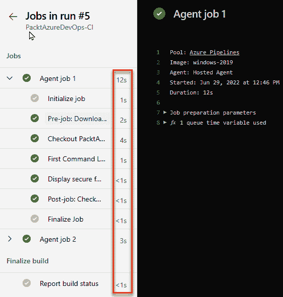
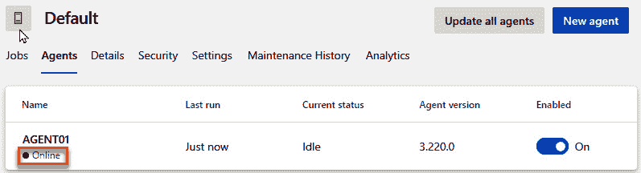

# 第七章：7

# 监控 Azure Pipelines

到目前为止，我们已经了解了使用 Azure Pipelines 进行 CI/CD 所需的大多数构建模块。在本章结束时，你将具备理解如何高效运行构建和发布流水线的操作能力，利用内置功能来衡量代理的健康状况，确保作业按时执行，并验证应用程序在部署后能够顺利运行。

在本章中，我们将涵盖以下主题：

+   理解监控概念

+   监控流水线任务及其性能

+   监控流水线代理

+   使用监控来衡量应用程序质量

但首先，让我们讨论一下本章的一些技术要求。

# 技术要求

要完成本章，你需要安装 *Microsoft 提供的构建质量检查* Marketplace 扩展。与上一章类似，在 Visual Studio Marketplace 中搜索该扩展，并将其安装到你的 Azure DevOps 组织中。你可以在[`marketplace.visualstudio.com/items?itemName=mspremier.BuildQualityChecks`](https://marketplace.visualstudio.com/items?itemName=mspremier.BuildQualityChecks)找到该扩展。在[`github.com/PacktPublishing/Implementing-CI-CD-Using-Azure-Pipelines/tree/main/ch07`](https://github.com/PacktPublishing/Implementing-CI-CD-Using-Azure-Pipelines/tree/main/ch07)中可以找到本章的代码。

既然我们已经讲解了技术要求，接下来让我们讨论在使用 Azure Pipelines 时你应该熟悉的监控概念。

# 理解监控概念

在使用 Azure Pipelines 时，有几个关键概念需要在考虑监控时牢记：

+   **流水线状态**：确保流水线始终在运行且没有问题，同时检查是否有构建失败、测试失败或部署过程中出现错误。

+   **代码质量指标**：这涉及验证代码覆盖率、代码复杂度和代码异味等指标，以便在部署应用程序之前发现潜在的性能或功能问题。

+   **安全漏洞**：这涉及评估和衡量应用程序代码、依赖项或流水线配置中的安全漏洞。这样有助于确保流水线的安全性，并避免在应用程序中引入安全风险。

+   **资源利用率**：这有助于确保构建和发布流水线不会过度消耗代理的 CPU 或内存，也不会让流水线执行过长时间，避免影响其运行其他作业的能力。

+   **部署健康状况**：这涉及监控已部署的应用程序，确保其正确运行，并且没有连接性、可用性或功能问题。

+   **发布周期时间**：这包括监控发布周期时间，确保应用程序部署按时进行，并且任何延迟都能被尽快识别和修复。发布周期时间是指从应用程序的初始开发阶段到其在生产环境中部署所需的时间。

这些概念对于最小化**检测时间**（**TTD**）、**缓解时间**（**TTM**）和**修复时间**（**TTR**）等度量至关重要，这些度量在行业中用来衡量按时交付应用程序以及修复/恢复任何可能发生的问题的能力。

在本章中，我们将重点介绍这些概念中的一些，首先从管道任务及其性能开始。

# 监控管道任务及其性能

本节将介绍两种监控任务和性能的方法：

+   使用管道的用户界面

+   使用仪表盘

让我们先深入了解用户界面。

## 使用管道的用户界面

关于管道、任务和工作流的**持续时间**的度量信息可以在整个用户界面中找到，以强调执行时间的重要性，如下图所示：


图 7.1 – 管道摘要中的持续时间度量

这些持续时间度量帮助你立即了解管道及其中所有任务的执行时长。你可以点击每个任务并查看单独的步骤时长，以判断是否有需要你审查并改善的任务，如下图所示：



图 7.2 – 任务中的持续时间度量

你总是要确保构建或发布管道的总执行时间尽可能小。这可以确保你能够更快速地发布软件，并将其更快速地部署到任何环境中。管道中的时间增加可能表明最近的更改引入了问题，你应该审查每个任务的执行时间，以确定增加是否是预期的并且有理由的，或者是否需要修复某些内容。

你还可以通过点击导航菜单中的**Pipelines**选项并切换到**Runs**标签页，查看所有管道的总执行时间，如下图所示。或者，你也可以使用筛选选项（在下图中突出显示）来查找特定的运行：


图 7.3 – 你的管道的经过时间

随着时间推移查看这些指标可能会变得乏味。为此，Azure Pipelines 为每个管道提供了一个**分析**视图，您可以通过点击以下截图中标记为*1*、*2*和*3*的元素来访问。首先，导航到**管道**。从最近运行的管道列表中，选择**UnitTests-YAML**：


图 7.4 – 所有管道的列表

接下来，打开**分析**选项卡：


图 7.5 – 访问管道的分析视图

一旦加载了**分析**视图，如以下截图所示，您将看到三个不同的报告，它们提供了管道的见解：


图 7.6 – 管道分析报告

每个报告提供不同的信息，这些信息是随时间聚合的，并且可以过滤以显示过去的 7 天、14 天、30 天或 180 天。如前面的截图所示，提供以下报告：

+   **管道通过率**：此报告显示管道执行的成功或失败随时间的变化

+   **测试通过率**：此报告显示单元测试随时间的结果，能够显示所有可能的测试结果，如通过、失败和未结论

+   **管道持续时间**：此报告显示管道的总持续时间及按持续时间排序的前 10 个步骤，如以下截图所示：


图 7.7 – 管道持续时间报告

您可以使用这些报告来确保您的管道健康且及时执行。建议定期频繁地修订这些报告，例如每周一次，以确保没有意外添加任何对管道执行时间有不利影响的内容。

## 使用仪表板

监控管道的另一种方式是通过 Azure DevOps 项目概览部分的**仪表板**功能。您可以使用多个可用小部件创建自定义仪表板，这些小部件显示不同的数据点，这些数据点对每个团队成员在宏观层面上非常有用，并且可以轻松快捷地访问。

Azure DevOps 包含三个开箱即用的 Azure Pipelines 小部件：

+   **构建历史**，它添加了一个瓷砖，显示构建的直方图，指示成功或失败，并提供每个构建的链接

+   **部署状态**，它添加了一个瓷砖，显示多个环境中部署状态和测试通过率的综合视图

+   **发布管道概览**，该功能添加了一个瓷砖，允许您查看和跟踪发布管道的状态

以下截图显示了一个名为**管道**的自定义仪表板，其中包含我们刚才讨论的所有小部件，显示来自不同管道的信息：


图 7.8 – 带小部件的自定义管道仪表板

你可以在[`learn.microsoft.com/en-us/azure/devops/report/dashboards/widget-catalog`](https://learn.microsoft.com/en-us/azure/devops/report/dashboards/widget-catalog)了解更多关于默认提供的小部件目录，并且你可以通过在 Visual Studio Marketplace 中搜索它们来找到更多小部件，搜索链接为[`marketplace.visualstudio.com/search?term=widgets&target=AzureDevOps`](https://marketplace.visualstudio.com/search?term=widgets&target=AzureDevOps)。

重要说明

另一个有效的监控管道的方式是通过**Azure Pipelines Microsoft Teams 应用**市场扩展，你可以在市场目录中找到它；点击后，它将带你进入**Microsoft App Source**商店。此应用是一个 Teams 应用，并且会安装在你的 Teams 租户中，安装过程超出了本书的范围。安装完成后，你可以配置订阅，以便在管道状态或审批时收到通知。

现在，让我们学习如何监控管道代理。

# 监控管道代理

在 Azure DevOps 中，管道代理提供了一些通用的报告功能。你可以通过点击**组织设置**来访问它们：


图 7.9 – 访问组织设置

一旦进入**组织设置**，你就可以在导航菜单中的**管道**部分访问**代理池**选项：


图 7.10 – 代理池

让我们逐一了解可用的报告。

## 作业运行

你可以使用每个代理池的**作业运行报告**，它将显示正在执行的作业的摘要，包括它们的 ID、管道名称、项目、代理规格、排队时间、等待时间和持续时间：


图 7.11 – 代理池中的作业报告

此报告中最相关的数据之一是**等待时间**，如前面的截图中所突出显示的。这是需要密切关注的指标。如果这个数字在作业之间开始增加，可能是需要购买并发性并添加额外代理的信号。

本节稍后会介绍如何购买并发性以及增加代理数量的方法。现在，让我们继续查看可用的报告。

## 代理状态

在代理池详情中，你会看到一个**代理**标签页，显示了每个正在运行的代理的详细信息，例如其名称、可用性、最后运行、当前状态、版本，并且可以启用/禁用它。

以下截图显示了一个不可用的或**离线**代理：


图 7.12 – 带离线代理的代理池

以下截图显示了一个可用的或**在线**代理：



图 7.13 – 具有在线代理的代理池

在使用代理池时，必须确保自托管的代理处于在线并启用状态。否则，如果没有可用的代理，管道作业将被排队并永远不会执行。

专业提示

始终设置代理作为服务运行。这将利用操作系统的服务管理器来确保代理的生命周期得到适当管理，同时在自动升级代理时也能改善体验。

## 代理作业

从之前的代理状态报告中，你还可以查看特定代理的**作业**报告，如下图所示：


图 7.14 – 代理作业报告

这对于判断某个特定代理是否存在异常行为或在运行作业时偶尔失败非常有用。在这种情况下，可能需要对代理进行版本升级，检查是否需要在代理中安装依赖工具，或者作为最后的手段，应该移除该代理及其运行所在的基础设施，并用新的代理替换它。

现在，让我们来看看代理池最重要的报告之一：分析报告。

## 分析报告

**分析**报告可以帮助我们了解代理池中代理的聚合使用情况，图表中显示了并发、排队作业和运行作业的情况，如下图所示：


图 7.15 – Azure Pipelines 代理池的分析报告

你会注意到该报告包含两个直方图——一个是**公共托管并发**，另一个是**私人托管并发**。公共并发指的是 Azure Pipelines 为公共项目提供的并发配额，默认为 10，并且无法更改。类似地，私有并发是针对私有项目的，你可以额外购买并发作业，或者利用每个 Microsoft Visual Studio Enterprise 订阅中包括的自托管管道代理。

该报告帮助我们了解何时需要更多代理，特别是当多个作业排队时。

如果作业排队的情况不频繁出现，可以忽略它，但当这种情况变得越来越常见时，我们必须考虑以下方面：

+   购买并发

+   增加可用代理

让我们首先讨论购买并发。

### 购买并发

向代理池添加并发适用于 Microsoft 托管和自托管代理，决定是否增加并发取决于你是否希望作业执行之间没有等待时间。这可以通过以下步骤实现：

1.  首先，按照下图所示，在组织层面设置账单：


图 7.16 – 为 Azure DevOps 组织设置账单

1.  点击**设置计费**按钮将打开一个对话框，你可以在其中将你的 Azure DevOps 组织与 Azure 订阅关联，这个订阅用于支付 Azure DevOps 中的服务费用。如果你有 Azure 订阅访问权限，选择它并点击**保存**：


图 7.17 – 选择现有的 Azure 订阅用于计费

需要提到的是，你登录的 Active Directory 租户用于查找你可以访问的 Azure 订阅并将其链接到组织。你必须是**项目汇总管理员组**的成员才能完成此步骤。

1.  如果你没有可用的 Azure 订阅，你将看到类似以下的消息：


图 7.18 – 为计费添加新的 Azure 订阅

1.  然后，你可以点击**新建 Azure 订阅**按钮，完成创建新订阅的步骤，并提供信用卡信息用于购买的计费。一旦计费配置完成，你就可以通过进入**项目设置**中的**并行作业**选项来购买并发执行。你可以根据需要增加/减少并行作业的数量：


图 7.19 – 购买并行作业

现在我们知道如何购买并发执行，我们来讨论如何增加可用代理的数量。

### 增加可用代理

对于微软托管的代理来说，购买额外的并发执行就是立即获得执行多个作业的能力所需要的，因为无需管理基础设施。

对于自托管代理，你有一些选项：

+   在*第一章*的*设置代理池*部分中讨论了一个选项，它需要手动将一个代理添加到代理池中。

+   另一个选项是使用**Azure 虚拟机规模集**池类型，这是一个在添加新代理池时可用的选项，如下图所示。这种类型的代理池会在需要时自动添加额外的代理，方法是每隔 5 分钟监控当前代理的状态和队列中作业的数量。你可以配置最大代理数量以及其他控制每个代理在池中处理方式的参数：


图 7.20 – Azure 虚拟机规模集代理池类型

**Azure 虚拟机规模集**代理池类型对于以下原因非常有用：

+   当你需要更多资源（例如 CPU 和内存）来执行作业，而不是使用微软托管的代理且你又不想管理底层基础设施时

+   为了简化这些代理的基础镜像如何维护，或每次执行任务后是否需要重新镜像代理，代理池类型将优雅地处理这些问题。

+   最后一个需要考虑的选项是在 Docker 容器中运行**自托管代理**，这使你可以在任何容器编排器中运行，例如你自己的自管理 Kubernetes 集群或云托管服务，如**Azure Kubernetes Service**（**AKS**）和 Amazon **Elastic Kubernetes Service**（**EKS**）。在这种情况下，你需要一个自定义实现，以根据 Azure DevOps REST API 中可用的指标来扩展代理的数量。

现在，我们已经学会了如何监控作业运行、代理状态和任务性能，并增加并发和代理数量，让我们了解如何在管道中使用监控。

# 使用监控来衡量应用程序质量

Azure Pipelines 提供了许多功能来衡量构建和发布管道的成功。首先，我们将学习如何通过衡量代码质量指标来提高单元测试结果的成功率。

## 代码质量指标

构建一个全面的单元测试管道包括分析单元测试运行框架产生的每个数据点以及在管道中执行这些任务的任务。然而，通常情况下，任务用来确定失败的指标存在局限性，除了实际执行的单元测试之外，其他因素可能也会被考虑在内。

例如，假设一个开发团队最近为一个已经开发多年的项目添加了单元测试，并且他们只是开始实施测试以实现自动化，减少手动测试的需求。

在这种情况下，通用做法是从少量自动化测试开始，并逐步增加测试数量。强制执行这一点的唯一方法是持续监控单元测试结果，并设置自动化门禁进行评估，以确保每次运行时测试数量都会增加。

假设你已经完成了前一章，接下来的任务将通过将其添加到单元测试构建管道的 YAML 文件末尾来实现此场景：

```
- task: BuildQualityChecks@8
  inputs:
    checkCoverage: true
    coverageFailOption: 'build'
    coverageType: 'blocks'
    forceCoverageImprovement: true
    coverageUpperThreshold: '80'
```

你可以在以下链接找到完整文件：[`github.com/PacktPublishing/Implementing-CI-CD-Using-Azure-Pipelines/blob/main/ch07/azure-pipelines.yml`](https://github.com/PacktPublishing/Implementing-CI-CD-Using-Azure-Pipelines/blob/main/ch07/azure-pipelines.yml)

让我们分解一下，理解这个任务的作用：

+   `checkCoverage: true` 选项启用需要代码覆盖率结果存在的策略。

+   接下来，`coverageFailOption: 'build'` 表示如果与上次构建相比，代码覆盖率没有增加，构建将会失败。

+   `coverageType: 'blocks'` 表示分析将基于代码块的数量进行。其他选项包括 `lines`、`branches` 和 `custom`。

+   `forceCoverageImprovement: true` 将强制要求代码覆盖率指标的值始终高于上次运行的值。

+   最后，`coverageUpperTreshold: '80'`是代码覆盖率提升的上限阈值。通常，你不会追求 100% 的代码覆盖率，因为这意味着每一行代码都有相关的测试，而在非常大的应用中，这可能不现实，因为这需要更多的开发时间。一旦达到此值，就不再强制要求进一步改进。

将此添加到之前配置的`UnitTests-YAML`管道，并且不做额外的更改，将导致执行失败，因为没有添加测试来增加代码覆盖率指标：


图 7.21 – 质量检查失败的构建

现在我们已经学习了如何使用代码质量指标来增强我们的管道，让我们看看如何改进部署。

## 部署健康

CI/CD 允许你自动化部署过程的每个方面，包括在应用部署后验证目标环境中的应用。这种场景提供了一种机制，确保不需要人工干预来验证新版本的应用是否按预期工作，且开发人员或环境配置未引入新的错误或漏洞。

让我们先看一个简单的场景。在这里，我们将考虑上一章中讨论过的 **Jenkins Artifacts** 发布管道，其中我们从 Jenkins 作业中部署了一个构件。

我们没有显式添加一个步骤来验证预期的`artifact.txt`文件是否已被复制并提供给代理。可以通过添加带有自定义脚本的命令行任务来解决这个问题，正如下面的截图所示：


图 7.22 – 验证发布管道中的任务

上面截图中的脚本适用于 Ubuntu 代理，并验证`_PacktFamily`目录中的`artifact.txt`文件是否存在；如果不存在，它将打印一条消息，指示文件未找到，并且将以返回代码`1`退出。由于任务始终期望返回代码`0`来表示成功，因此这将被视为一个错误。

我们来看另一个场景，比如部署一个 Web 应用或 Web API，在这种情况下，你可以编写脚本，发出 HTTP/HTTPS 请求到应用，等待响应，并验证响应代码和内容。

一个更好的场景是使用 UI 自动化测试框架，并在应用部署后将其作为发布管道的一部分执行，就像我们在上一章中探讨的单元测试一样。以下是一些可以考虑的 UI 自动化测试框架：

+   **开源**：

    +   **Appium**: [`github.com/appium/appium`](https://github.com/appium/appium)

    +   **Robot** **Framework**: [`robotframework.org/`](https://robotframework.org/)

    +   **Selenium**: [`www.selenium.dev/`](https://www.selenium.dev/)

+   **第三方**：

    +   **Cypress**: [`www.cypress.io/`](https://www.cypress.io/)

    +   **Sauce** **Labs**: [`saucelabs.com/`](https://saucelabs.com/)

    +   **Telerik Test** **Studio**: [`www.telerik.com/teststudio`](https://www.telerik.com/teststudio)

在更高级的场景中，您可以在 Azure Pipelines 中使用 **gates**，这使您能够引入自动化的控制点，根据所使用的任务评估已定义的条件。在使用发布管道时，gates 可用作部署前和部署后的条件，但在使用带有环境的多阶段管道时，gates 仅作为附加到环境的后置条件可用。

接下来，我们将通过 Azure Monitor 探索其中一个部署 gate。

## 与 Azure Monitor 的集成

**Azure Monitor** 是一个用于收集、分析和响应来自云端和本地环境日志与指标的监控解决方案。这可以帮助你了解应用程序和服务的性能，并提供手动或程序化响应需要关注的条件的能力，确保这些应用程序按预期工作。

Azure Pipelines 中的集成功能是通过一个 `AzureMonitor` 任务提供的，它允许你查询活动警报的规则，并确定应用程序新版本的部署是否触发了新的警报。

在本节中，您将使用一个现成的发布管道模板，轻松配置 Azure Monitor 任务。

为此，请执行以下步骤：

1.  创建一个新的发布管道，如下图所示：


图 7.23 – 创建新的发布管道

1.  在搜索字段中找到 `monitor`，然后点击 **应用** 按钮：


图 7.24 – 从模板创建新的发布管道

1.  您将得到一个阶段，如下图所示，您必须填写 **App Service 名称**、**应用程序洞察的资源组名称** 和 **应用程序洞察资源** **名称** 字段：


图 7.25 – 带有持续监控的 Azure App Service 部署

1.  最重要的一步是设置 `Availability_$(Release.DefinitionName)`、`FailedRequests_$(Release.DefinitionName)`、`ServerResponseTime_$(Release.DefinitionName)` 和 `ServerExceptions_$(Release.DefinitionName)`，并设定一些默认阈值。您可以使用这些默认值，调整它们，或者根据应用程序的需求创建新的警报定义：


图 7.26 – 应用洞察警报

1.  配置好这个阶段后，你可以切换到管道视图并点击**部署后条件**来配置门控，在这种情况下，应该已经启用了**查询 Azure Monitor** **警报**：


图 7.27 – 阶段中的发布管道部署后条件

1.  然后，你可以根据需要调整与部署门控相关的许多设置，包括所需的**Azure 订阅**和**资源组**名称，尤其是**评估前的延迟**：


图 7.28 – 查询 Azure Monitor 警报门控

1.  配置完成后，你可以依赖 Azure Pipelines 在部署步骤完成后执行门控，以验证监控警报是否已配置，并提供一个可视化指示器：


图 7.29 – 使用部署门控的成功发布

在完整的场景中，你需要将自动化测试与此发布管道结合起来，确保监控警报基于对最近部署的应用程序执行的测试进行评估。

1.  最后，你可以使用与之相应的第三方应用性能监控工具，并通过相应的市场扩展进行配置：

    +   **Dynatrace**: [`marketplace.visualstudio.com/items?itemName=AlmaToolBoxCE.DynatraceIntegration`](https://marketplace.visualstudio.com/items?itemName=AlmaToolBoxCE.DynatraceIntegration)

    +   **Datadog**: [`marketplace.visualstudio.com/items?itemName=Datadog.datadog-monitors`](https://marketplace.visualstudio.com/items?itemName=Datadog.datadog-monitors)

现在你已经了解了部署门控，我们已经进入本章的总结部分。让我们回顾一下到目前为止所学的内容。

# 总结

在本章中，你学习了关于在 CI/CD 项目中需要考虑的监控概念，以及如何监控你的管道任务、任务性能，如何使用图形小组件构建仪表板来理解随时间变化的行为，甚至如何与协作工具集成以获取实时通知。你还学习了如何监控作业运行、任务性能和代理，何时购买并发性，以及如何增加代理数量以确保管道及时执行。最后，你学习了如何通过利用代码质量指标、应用程序运行时检查和应用程序监控工具来衡量管道中的质量。

在下一章中，我们将学习如何使用 Azure Pipelines 自动化部署基础设施。
