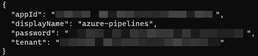

# 第八章：8

# 使用基础设施即代码进行基础设施配置

之前我们讨论了与构建、测试、打包和部署应用程序相关的 CI/CD 主题。在本章中，我们将学习如何使用自动化来配置部署目标及其配置过程，理解这种过程的好处，并在过程中提供一些提示和技巧。你将明白为什么在当前快速交付且要求高质量的时代，这一点至关重要，甚至是必需的。

在本章中，我们将深入探讨以下主题：

+   理解**基础设施即代码**（**IaC**）

+   使用**Azure 资源管理器**（**ARM**）**模板**

+   使用**AWS CloudFormation**

+   使用**Terraform**

让我们首先处理技术要求。

# 技术要求

根据你在本章中感兴趣的部分，你需要在工作站上安装以下软件。你可以在 GitHub 仓库 [`github.com/PacktPublishing/Implementing-CI-CD-Using-Azure-Pipelines/tree/main/ch08`](https://github.com/PacktPublishing/Implementing-CI-CD-Using-Azure-Pipelines/tree/main/ch08) 找到本章的代码。

## 安装 Azure 工具

Azure CLI 是一个跨平台命令行工具，用于连接 Microsoft Azure 并执行命令来创建、更新或销毁资源。根据你工作站的**操作系统**（**OS**），你可以选择适合的安装方法，详情请见 [`learn.microsoft.com/en-us/cli/azure/install-azure-cli`](https://learn.microsoft.com/en-us/cli/azure/install-azure-cli)。由于每个操作系统的安装指南不同，具体安装过程需要你自己完成。

安装完成后，运行 `az version` 命令，你会看到类似这样的响应：

```
PS C:\Users\user> az version
{
  "azure-cli": "2.48.1",
  "azure-cli-core": "2.48.1",
  "azure-cli-telemetry": "1.0.8",
  "extensions": {}
}
```

你可以选择任何你喜欢的文本编辑器来工作。然而，我们推荐使用**Visual Studio Code**（简称**VS Code**），因为它是社区中最流行的编辑器之一；它是免费的，并提供了大量社区支持的扩展，支持多种编程语言和工具，尤其是支持**ARM 模板**、**AWS CloudFormation**和**Terraform**，正如我们在接下来的章节中将看到的那样。

要安装 VS Code，请前往 [`code.visualstudio.com/`](https://code.visualstudio.com/)。在那里，你将看到根据你工作站的操作系统安装的选项。

此外，你还需要从 [`marketplace.visualstudio.com/items?itemName=msazurermtools.azurerm-vscode-tools`](https://marketplace.visualstudio.com/items?itemName=msazurermtools.azurerm-vscode-tools) 安装 ARM Tools VS Code 扩展。

## 安装 AWS 工具

AWS CLI 是一个跨平台的命令行工具，用于连接 **Amazon Web Services**（**AWS**）并执行命令来创建、更新或销毁资源。根据你的操作系统，安装指南可以在[`docs.aws.amazon.com/cli/latest/userguide/getting-started-install.xhtml`](https://docs.aws.amazon.com/cli/latest/userguide/getting-started-install.xhtml)找到。

安装完成后，在终端运行`aws --version`命令，你将看到类似以下的响应：

```
PS C:\Users\user> aws --version
aws-cli/2.11.18 Python/3.11.3 Windows/10 exe/AMD64 prompt/off
```

此外，你还必须安装 **AWS Toolkit** 的 VS Code 扩展，下载地址为[`marketplace.visualstudio.com/items?itemName=AmazonWebServices.aws-toolkit-vscode`](https://marketplace.visualstudio.com/items?itemName=AmazonWebServices.aws-toolkit-vscode)。

## 安装 Terraform 工具

Terraform CLI 是一个跨平台的命令行工具，用于执行各种子命令，如`plan`、`apply`或`destroy`，这些我们将在本章后续部分介绍。你可以按照[`developer.hashicorp.com/terraform/tutorials/azure-get-started/install-cli#install-terraform`](https://developer.hashicorp.com/terraform/tutorials/azure-get-started/install-cli#install-terraform)中的说明进行安装。安装完成后，在终端运行`terraform version`，你将看到类似以下的响应：

```
PS C:\Users\user> terraform version
Terraform v1.4.6
on windows_amd64
```

此外，你还可以从[`marketplace.visualstudio.com/items?itemName=HashiCorp.terraform`](https://marketplace.visualstudio.com/items?itemName=HashiCorp.terraform)安装 HashiCorp Terraform 的 VS Code 扩展。

## 安装 Terraform Marketplace 扩展

必须安装 **Terraform Marketplace 扩展**，适用于 Azure DevOps。你可以在[`marketplace.visualstudio.com/items?itemName=ms-devlabs.custom-terraform-tasks`](https://marketplace.visualstudio.com/items?itemName=ms-devlabs.custom-terraform-tasks)找到它。

## 访问 Azure 账户

你必须拥有一个 Azure 账户才能完成本章中的步骤。如果你没有账户，可以在[`azure.microsoft.com/en-us/free/`](https://azure.microsoft.com/en-us/free/)创建一个免费的账户。

## 访问 AWS 账户

你必须拥有一个 AWS 账户才能完成本章中的步骤。如果你没有账户，可以在[`aws.amazon.com/free`](https://aws.amazon.com/free)创建一个免费的账户。

现在我们已经处理了所有技术要求，接下来让我们一步步了解如何使用代码自动化基础设施。

# 理解基础设施即代码（IaC）

过去，基础设施通常是通过手动配置和记录的步骤以及/或脚本组合来完成的。这使得整个过程容易出错且速度较慢。

就像你对应用程序代码使用严格的流程一样，你也应该对基础设施采取相同的做法。这样做的目的是使部署过程可重复、不可变，减少错误的机会，并通过尽可能避免/消除人工干预，加速部署过程。

IaC 是一种将描述模型编写为代码并存储在源控制中的实践，该模型定义并部署运行应用程序和任何支持依赖项所需的所有基础设施。它可以包含网络配置、负载均衡器、虚拟机以及应用架构运行所需的任何其他应用程序或数据服务，适用于本地数据中心和云平台。

最好将这一切工作流程想象成如下所示：


图 8.1 – 融合 IaC 的 CI/CD

让我们现在开始使用 ARM 模板，并看看如何在 Microsoft Azure 云平台上进行操作。

# 使用 ARM 模板

ARM 模板是 Azure 中可用的 IaC 部署基础设施的选项之一，Microsoft 的云平台在全球多个地区提供。

微软还提供了其他工具，如 Azure CLI、Azure PowerShell 和一种更新的、特定领域的语言 Bicep，Bicep 使用声明式语法来部署资源。你还可以使用 Azure 门户，一个基于 Web 的 UI，提供访问你在 Azure 中的所有资源的功能，并允许你创建、更新和删除资源。

ARM 模板是具有以下结构的 JSON 文件：

```
{
  "$schema": "https://schema.management.azure.com/schemas/2019-04-01/deploymentTemplate.json#",
  "contentVersion": "",
  "apiProfile": "",
  "parameters": {  },
  "variables": {  },
  "functions": [  ],
  "resources": [  ],
  "outputs": {  }
}
```

ARM 模板可以定义必需和可选的输入**参数**、可以计算供模板中使用的**变量**、用户定义的**函数**（除了内置函数外，还可以在模板中使用），**资源**（定义要配置的一个或多个资源的所有属性）以及**输出**（可以包含从已部署资源中计算出来的属性或值）。ARM 模板还可以嵌套，以逻辑上分离你的服务。

在本节中，我们将专注于如何使用 Azure Pipelines 部署 ARM 模板，而不涉及如何创建它们的细节，因为这超出了本书的范围。

部署 ARM 模板的步骤如下：

1.  在 Azure 中创建服务主体

1.  创建 Azure 的服务连接

1.  创建 ARM 模板

1.  验证 ARM 模板

1.  部署 ARM 模板

让我们从在 Azure 中创建服务主体开始。

## 在 Azure 中创建服务主体

**服务主体**是 Azure 中的一种身份类型，由应用程序、服务和自动化工具使用，用于提供精细化控制，以根据角色访问资源并执行操作。

重要提示

本节假设你已经使用 `az` `login` 命令登录到 Azure。

我们可以通过以下 Azure CLI 命令创建一个服务主体：

```
az ad sp create-for-rbac -n azure-pipelines --role Contributor --scopes /subscriptions/<subscription-id>
```

你需要替换 `<subscription-id>`，它应该是来自 Azure 门户的类似 GUID 的值。将作用域设置为订阅级别在测试过程中是可以的，但在理想的设置中，你可能希望进一步限制它——比如说，限制到一个资源组：

```
/subscriptions/<subscription-id>/resourceGroups/<name>
```

一旦你执行这个命令，你应该会得到类似于以下的响应：



图 8.2 – 服务主体详情

您必须将服务主体详情视为密钥。这是敏感信息，提供对您的 Azure 环境的访问权限。您将需要这些信息来完成接下来的步骤。

现在，让我们看看如何使用服务主体创建 Azure 服务连接。

## 创建 Azure 服务连接

正如前几章所见，Azure Pipelines 中与外部服务集成需要一个服务连接。您可以通过以下步骤完成此操作：

1.  导航到**项目设置** | **管道** | **服务连接**，然后点击**新建服务** **连接**按钮：


图 8.3 – 新建服务连接

1.  在此，您将选择**Azure 资源管理器**选项并点击**下一步**按钮：


图 8.4 – 选择服务连接类型

1.  接下来，选择认证方法，使用**服务主体（手动）**选项，并点击**下一步**按钮：


图 8.5 – 为 Azure 服务连接选择认证方法

尽管上面的截图显示**服务主体（自动）**作为**推荐**，但这仅适用于刚开始使用 Azure 和 Azure Pipelines 的用户。当您有多个 Azure 订阅和资源组时，这种认证方法会使设置过程变得困难。

1.  下一步让您输入以下参数的详细信息：

    +   来自上一节的`appId`，如*图 8.2*所示

    +   来自上一节的`password`，如*图 8.2*所示

    +   来自上一节的`tenant`，如*图 8.2*所示

    +   `azure-packt-rg`

    一旦输入了所有这些值，您可以选择点击**验证并保存**按钮，这将测试是否可以建立到 Azure 的连接，并保存服务连接的详细信息。

现在我们已经有了服务连接，让我们继续创建一个 ARM 模板。

## 创建 ARM 模板

有许多方法可以创建 ARM 模板：

+   从头开始，通过参考文档 [`learn.microsoft.com/en-us/azure/azure-resource-manager/templates/quickstart-create-templates-use-visual-studio-code`](https://learn.microsoft.com/en-us/azure/azure-resource-manager/templates/quickstart-create-templates-use-visual-studio-code)

+   通过 Azure 门户，您可以在部署前从市场或现有资源组下载模板，具体操作可参考 [`learn.microsoft.com/en-us/azure/azure-resource-manager/templates/export-template-portal`](https://learn.microsoft.com/en-us/azure/azure-resource-manager/templates/export-template-portal)

+   修改现有的示例模板，链接：[`learn.microsoft.com/en-us/samples/browse/?expanded=azure&products=azure-resource-manager`](https://learn.microsoft.com/en-us/samples/browse/?expanded=azure&products=azure-resource-manager)

在本章中，为了简便，我们将使用一个修改版的现有示例，该示例部署了一个 Azure 应用服务资源。您可以在此链接找到模板：[`github.com/PacktPublishing/Implementing-CI-CD-Using-Azure-Pipelines/blob/main/ch08/azure/azuredeploy.json`](https://github.com/PacktPublishing/Implementing-CI-CD-Using-Azure-Pipelines/blob/main/ch08/azure/azuredeploy.json)

此 ARM 模板将部署两个资源：

+   一个 **Azure 应用服务计划**，它定义了定价层、操作系统以及其他平台级功能。

+   一个 **Azure 应用服务 web 应用**，它定义了应用程序级堆栈，如 PHP 运行时及版本。

现在让我们看看如何使用 Azure Pipelines 验证这个模板。

## 验证 ARM 模板

在您的构建或 CI 管道中，您应该考虑验证您的模板，以确保格式正确。为此，提供了 **ARM** 模板部署任务，如下所示的代码片段：

```
# ARM Template Validation
trigger:
- main
pool:
  vmImage: ubuntu-latest
steps:
- task: AzureResourceManagerTemplateDeployment@3
  inputs:
    deploymentScope: 'Resource Group'
    azureResourceManagerConnection: 'azure-packt-rg'
    subscriptionId: $(AzureSubscriptionId)
    action: 'Create Or Update Resource Group'
    resourceGroupName: 'packt'
    location: 'East US'
    templateLocation: 'Linked artifact'
    csmFile: 'azure/azuredeploy.json'
    deploymentMode: 'Validation'
```

重要提示

YAML 是一种非常严格的语言，区分空格和大小写。在处理 YAML 文件时，请确保使用一个能正确处理这些要求的编辑器，并确保在格式化内容时注意任何潜在问题。

让我们将其拆解为不同的参数：

+   `deploymentScope` 决定了此操作适用的层级。可能的值有 `Management Group`、`Resource Group` 和 `Subscription`。这些是 Azure 平台中的不同治理层次，模板遵循不同的架构。

+   `azureResourceManagerConnection` 是指向现有 `Azure` `Resource Manager` 类型服务连接的引用。

+   `subscriptionId` 是 Azure 订阅 ID 的 GUID 值。在这种情况下，您可以通过 `$(AzureSubscriptionId)` 表示法看到它作为变量引用。我们将在下一节中看到如何创建这个，*创建一个* *管道变量*。

+   `action` 表示将创建、更新或删除资源组。

+   `resourceGroupName` 是 Azure 目标中的资源组名称。如果操作设置为 `create` 或 `update` 且资源组不存在，它将由任务创建。

+   `location` 是任何现有的 Azure 区域，可用于部署。

+   `templateLocation` 表示 ARM 模板文件是作为 `Linked artifact` 还是 `URL of the file` 提供。在后者情况下，它必须是一个完全合格的 URL。

+   `csmFile` 是指向 ARM 模板文件的路径，当 `templateLocation = 'Linked artifact'` 设置时是必需的。否则，您将使用 `csmFileLink`。

+   最后，`deploymentMode` 表示如何处理部署。在这种情况下，`Validation` 值将仅执行文件格式验证。我们将在下一节讨论此属性接受的其他值。

## 创建流水线变量

要创建此任务中使用的变量，请执行以下任务：

1.  点击 Azure Pipelines 编辑页面上的**变量**按钮：


图 8.6 – 访问流水线变量

1.  点击**新变量**按钮定义您的第一个变量：


图 8.7 – 添加新变量

1.  然后，您继续分别填写 `AzureSubscriptionId` 和从 Azure 门户获取的订阅 ID。同时确保勾选**保持此值为秘密**选项，以便安全地存储它并确保在流水线执行过程中无法看到它。在此页面上点击**确定**会暂时存储该值：


图 8.8 – 带有秘密值的新变量

1.  在下一个页面上，您必须点击**保存**，以确保变量已存储在流水线中：


图 8.9 – 保存流水线变量

一旦完成所有设置，流水线应该能够成功运行并验证 ARM 模板。

重要提示

在第一次部署 ARM 模板时，必须确保相应的 Azure 资源提供程序已经在订阅中注册，否则会出现错误。对于本节中使用的模板，必须注册 `Microsoft.Web` 资源提供程序。您可以通过运行以下 Azure CLI 命令并等待其完成来实现此操作：

`az provider register –namespace` `Microsoft.Web --wait`

现在我们已经了解了如何验证模板，接下来让我们看看如何部署它。

## 部署 ARM 模板

从验证模式切换到部署模式需要将 `deploymentMode` 属性的值更改为 `Incremental` 或 `Complete`。

`Incremental` 部署模式告诉 ARM，如果模板中的资源不存在，则会创建这些资源；如果已存在，则会更新这些资源以匹配模板。资源组中未在模板中定义的其他资源将被忽略。

同样，如果使用 `Complete` 部署模式，ARM 会确保资源组仅包含模板中定义的资源，创建不存在的资源，更新现有资源以匹配，并删除模板中未定义的资源。

下面是它的样子：

```
# ARM Template Deployment
trigger:
- main
pool:
  vmImage: ubuntu-latest
steps:
- task: AzureResourceManagerTemplateDeployment@3
  inputs:
    deploymentScope: 'Resource Group'
    azureResourceManagerConnection: 'azure-packt-rg'
    subscriptionId: $(AzureSubscriptionId)
    action: 'Create Or Update Resource Group'
    resourceGroupName: 'packt'
    location: 'East US'
    templateLocation: 'Linked artifact'
    csmFile: 'azure/azuredeploy.json'
    deploymentMode: 'Incremental'
```

重要提示

`Complete` 部署模式必须谨慎使用，并确保您有严格的流程，确保资源仅通过模板创建。否则，可能会导致意外的破坏性结果，例如服务或应用程序停止工作或数据丢失。

一旦管道执行完毕，您可以在 Azure 门户中验证资源：


图 8.10 – 通过 Azure Pipelines 部署的 Azure 资源

如果您想了解更多信息，请访问[`aka.ms/arm-syntax`](https://aka.ms/arm-syntax)。现在，让我们看看如何在 AWS 中做类似的事情。

# 使用 AWS CloudFormation

**AWS CloudFormation**是一项服务，它允许您定义一个模板，描述一组将一起部署的资源，使用 JSON 或 YAML 语法。这些模板遵循 JSON 格式的结构：

```
{
  "AWSTemplateFormatVersion" : "version date",
  "Description" : "JSON string",
  "Metadata" : { template metadata },
  "Parameters" : { set of parameters },
  "Rules" : { set of rules },
  "Mappings" : { set of mappings },
  "Conditions" : { set of conditions },
  "Transform" : { set of transforms },
  "Resources" : { set of resources },
  "Outputs" : { set of outputs }
}
```

使用 AWS CloudFormation 部署包括以下步骤：

1.  使用 AWS CLI 创建 IAM 用户

1.  创建到 AWS 的服务连接

1.  创建 AWS CloudFormation 模板

1.  验证 AWS CloudFormation 模板

1.  部署 AWS CloudFormation 模板

让我们从讨论如何创建 IAM 用户开始。

## 使用 AWS CLI 创建 IAM 用户

**IAM 用户**是定义在 AWS 的**身份和访问管理**（**IAM**）服务中的用户，并提供精细化的访问控制，用于创建、更新或删除 AWS 中的资源，也用于授予/拒绝与其他服务交互的权限。

重要说明

本节假设您已经使用`aws` `configure`命令配置了您的 AWS 凭据。

执行以下命令：

```
aws iam create-group --group-name resources-admin
aws iam attach-group-policy --group-name resources-admin --policy-arn arn:aws:iam::aws:policy/AdministratorAccess
aws iam create-user --user-name azure-pipelines
aws iam add-user-to-group --group-name resources-admin --user-name azure-pipelines
aws iam create-access-key --user-name azure-pipelines
```

这些命令将执行以下操作：

1.  创建一个名为`resources-admin`的用户组

1.  为用户组附加安全策略

1.  创建一个名为`azure-pipelines`的用户

1.  将`azure-pipelines`用户添加到`resources-admin`用户组

1.  为`azure-pipelines`用户创建访问密钥

执行这些命令后，您应该会看到类似于以下截图的输出：


图 8.11 – `azure-pipelines`用户的 AWS 访问密钥

`AccessKeyId`和`SecretAccessKey`值将在下一步中使用。请确保将它们保存在安全的地方，因为它们提供了对 AWS 的编程访问权限。

重要

在此步骤中使用的`arn:aws:iam::aws:policy/AdministratorAccess`策略权限非常宽松。它提供了最高级别的 AWS 控制台访问权限。这不推荐在您的环境中使用。相反，您应该始终按照最小权限原则提供访问，并在需要时增加更多权限。

现在让我们看看如何从 Azure Pipelines 创建到 AWS 的服务连接。

## 创建到 AWS 的服务连接

如前几章所示，Azure Pipelines 中的外部服务集成需要服务连接，这可以在**项目设置**|**管道**|**服务连接**中完成，在此您将点击**新建服务连接**按钮并选择**AWS**选项：


图 8.12 – AWS 服务连接类型

下一步允许您输入以下详细信息：

+   `the AccessKeyId value` 来自前一步

+   `the SecretAccessKey value` 来自前一步

+   `aws-packt`

现在我们已经建立了服务连接，接下来让我们定义 AWS CloudFormation 模板。

## 创建 AWS CloudFormation 模板

你可以按照参考文档从头创建这些模板。可以从示例模板开始，或使用 AWS CloudFormation Designer，这是一个图形化工具，帮助你创建、可视化并修改模板，无需担心格式问题。欲了解更多信息，请访问 [`docs.aws.amazon.com/AWSCloudFormation/latest/UserGuide/template-guide.xhtml`](https://docs.aws.amazon.com/AWSCloudFormation/latest/UserGuide/template-guide.xhtml)。

在本章中，我们将使用一个修改版的现有示例，该示例通过 **弹性计算云** (**EC2**) 服务部署虚拟机。你可以在 [`github.com/PacktPublishing/Implementing-CI-CD-Using-Azure-Pipelines/blob/main/ch08/aws/template.json`](https://github.com/PacktPublishing/Implementing-CI-CD-Using-Azure-Pipelines/blob/main/ch08/aws/template.json) 找到该模板：

+   一个 EC2 密钥对 —— 用于连接到 Linux 实例的安全凭证集

+   一个 EC2 实例，依赖于密钥对，并使用 Amazon Linux OS 基础镜像

现在，让我们来看看如何验证模板。

## 验证 AWS CloudFormation 模板

在你的构建或 CI 管道中，你应该考虑验证你的模板，以确保格式正确。为此，AWS CLI 任务是可用的：

```
# AWS Cloud Formation Validation
trigger:
- main
pool:
  vmImage: ubuntu-latest
steps:
- task: AWSCLI@1
  inputs:
    awsCredentials: 'aws-packt'
    regionName: 'us-east-1'
    awsCommand: 'cloudformation'
    awsSubCommand: 'validate-template'
    awsArguments: '--template-body file://template.json'
```

让我们来逐步分析代码中的参数：

+   `awsCredentials` 是对服务连接的引用。

+   `regionName` 是任何可用的 AWS 区域。通常，你会将其设置为与模板部署所在的相同区域，以确保根据该区域中服务的可用性进行正确验证。

+   `awsCommand` 是 AWS CLI 中的顶级命令，提供 AWS CloudFormation 操作。

+   `awsSubcommand` 表示你想执行模板验证操作。

+   `awsArguments` 包含完成模板验证所需的选项。在这种情况下，由于文件被放置在仓库的根文件夹中，因此通过传递 `file:` 操作符读取文件内容并执行验证。

执行后，验证应该会显示如下截图中所示的消息：


图 8.13 – AWS CloudFormation 模板成功验证

如果出现错误，你会看到不同的消息和任务失败，如下图所示，其中故意输入错误的资源类型：

```
An error occurred (ValidationError) when calling the ValidateTemplate operation: Template format error: Unrecognized resource types: [AWS::EC2::KeyXXXPair]
```

现在我们知道如何验证模板了，让我们看看如何部署它。

## 部署 AWS CloudFormation 模板

部署 AWS CloudFormation 模板被称为创建 **AWS CloudFormation 堆栈**，它是 AWS 中的一项服务，允许您以逻辑方式对模板中的所有资源进行分组，并具有一些附加的好处，例如跟踪漂移、实施回滚策略以防出错，以及能够删除堆栈及其所有相关资源。

在 Azure Pipelines 中，您有两种选择来部署模板：

+   一个带有 `aws cloudformation` `create-stack` 命令的 AWS CLI 任务

+   使用 `Cloud Formation Create or Update Stack` 任务，如以下代码块所示：

    ```
    # AWS Cloud Formation Deployment
    trigger:
    - main
    pool:
      vmImage: ubuntu-latest
    steps:
    - task: CloudFormationCreateOrUpdateStack@1
      inputs:
        awsCredentials: 'aws-packt'
        regionName: 'us-east-1'
        stackName: 'packt'
        templateSource: 'file'
        templateFile: 'template.json'
        capabilityIAM: false
        capabilityNamedIAM: false
        onFailure: 'DELETE'
    ```

让我们分解前面的代码：

+   `awsCredentials` 是对服务连接的引用。

+   `regionName` 是任何可用的 AWS 区域。

+   `stackName` 是用于标识此堆栈的名称，必须在 AWS 控制台中唯一。

+   在这种情况下，`templateSource` 是 `file`；但是，它也可以是指向模板的 `url`，可能位于 Azure Pipelines 外部；`s3`，即 AWS 中的存储服务，您需要提供存储桶和对象键；或者 `usePrevious`，表示您希望使用现有堆栈中的模板。

+   `templateFile` 用于提供包含模板的文件位置，只有在 `file` 被设置为 `templateSource` 时才需要。

+   `capibilityIAM` 和 `capabilityNamedIAM` 参数设置为 `false`。这些是一些部署类型所需的附加属性，在这些部署中 IAM 改动会被应用。在本示例中使用的模板中，它们不是必需的。

+   最后，`onFailure` 属性指示如果出现问题时应如何处理堆栈。如果值为 `DELETE`，堆栈将被删除，任何可能已经成功部署的资源也将被删除。值为 `DO_NOTHING` 会停止应用模板，您将能够在 AWS 控制台中看到到目前为止发生的情况。最后，`ROLLBACK` 值是默认值，它会在应用模板之前回退任何更改。

部署成功完成后，您应该能够在 AWS 控制台中看到状态，如下图所示：


图 8.14 – AWS CloudFormation 堆栈成功部署

您还可以看到作为 CloudFormation 堆栈一部分部署的资源，如下图所示：


图 8.15 – AWS CloudFormation 堆栈资源

到目前为止，我们已经了解了针对 Azure 和 AWS 云平台特定的 IaC 功能；然而，这些仅适用于各自的平台。如果您希望以通用方式进行 IaC，并且面向多个目标类型——比如本地环境和其他云服务提供商，市场上还有其他工具可以完成这个任务。

其他一些基础设施即代码（IaC）工具包括 Ansible、Chef、Pulumi、Puppet、SaltStack 和 Terraform 等等。在本章中，我们将专注于**Terraform**，因为它是开源社区中最受欢迎的选择之一，因其多功能性和声明性特点。接下来让我们学习如何使用 Terraform 进行 IaC。

# 使用 Terraform

首先让我们了解 Terraform 是如何工作的，然后我们将学习如何在 Azure Pipelines 中使用它。

## Terraform 是如何工作的？

Terraform 是一个工具，允许你编写 IaC 并使用领域特定语言为云资源和本地资源定义资源。它通过提供商封装受支持目标的资源定义。

下图展示了 Terraform 的高层架构：


图 8.16 – Terraform 架构

它通过以下三个步骤进行工作：

1.  **写入**：你在模板中定义资源，以便在所需的目标上部署所有资源。可能有多个目标。

1.  **计划**：Terraform 创建执行计划，以确定需要进行哪些更改以匹配定义，计算操作的顺序并理解资源依赖关系。这可能意味着创建资源、更新资源或销毁资源。

1.  **应用**：一旦你同意计划，Terraform 就会按计划计算的顺序执行必要的操作。

Terraform 过程的一部分涉及计算目标的状态与计划的对比。这被称为**Terraform 状态文件**。该文件将包含关于资源、目标位置中的元数据以及它们的依赖关系的详细信息。

根据你使用的 Terraform 版本，你可能需要负责管理此文件的位置，或者使用内置功能来为你管理状态文件。

管理状态文件的位置在 Terraform 中至关重要。它可以通过**后端**配置存储在本地或远程。当你刚开始使用时，可能会使用**本地后端**；然而，随着配置的演进以支持多个环境，你将切换到**远程后端**。要了解更多关于远程后端的信息，请访问[`developer.hashicorp.com/terraform/language/settings/backends/remote`](https://developer.hashicorp.com/terraform/language/settings/backends/remote)。

重要说明

Terraform 按绝对值工作，这意味着它期望通过每次与当前状态文件进行比较来控制你在模板中定义的每个资源。这意味着环境中不应该在没有 Terraform 的情况下进行任何更改。否则，下次运行`terraform` `apply`命令时，这些更改将会丢失。

Terraform 有三个版本：

+   **开源**：免费、可下载，并且可以灵活地与你现有的源代码管理和 CI/CD 工具一起使用。

+   **云**：一种 SaaS 应用程序，允许你在稳定的远程环境中运行它，确保状态文件和机密的安全存储

+   **企业版**：允许你设置一个私有的 Terraform Cloud 实例或自托管的发行版，具有可自定义的资源限制和更严格的安全性。

现在让我们来看一下如何创建一个简单的 Terraform 模板。

## 创建一个 Terraform 模板

Terraform 模板通常采用被称为配置语法的伪 JSON 格式编写。所有文件都有 `.tf` 扩展名，通常你会有以下这些文件：

+   `providers.tf`：定义基础配置和要使用的提供程序

+   `main.tf`：模板的入口点——即你的起始点

+   `variables.tf`：定义将在模板中使用的值，这些值可以在规划/应用配置时被覆盖

+   `outputs.tf`：提取已部署资源的值

在本章中，我们将使用一组简单的模板，针对 Azure 云平台创建资源组，并使用 `azurerm` 后端。可以在 [`github.com/PacktPublishing/Implementing-CI-CD-Using-Azure-Pipelines/tree/main/ch08/terraform`](https://github.com/PacktPublishing/Implementing-CI-CD-Using-Azure-Pipelines/tree/main/ch08/terraform) 查看模板。

有关 Terraform 配置语言的更多详细信息，请访问 [`developer.hashicorp.com/terraform/language`](https://developer.hashicorp.com/terraform/language)。有关教程和培训资料，请访问 [`developer.hashicorp.com/tutorials/library?product=terraform`](https://developer.hashicorp.com/tutorials/library?product=terraform)。

现在我们已经学习了 Terraform 创建模板的基础知识，接下来让我们搭建一个管道来验证它们。

## 管理 Terraform 状态文件

在我们构建构建管道之前，需要确保 **状态文件** 已适当管理——在这种情况下，是远程管理。由于我们的模板将针对 Azure，因此我们需要为其设置相应的后端。

为此，你可以执行以下 Azure CLI 命令，登录后即可使用：

```
az group create --name tfstate --location eastus
az storage account create --name tfstate --resource-group tfstate --location eastus --sku Standard_LRS
az storage container create --name tfstate --account-name tfstate
```

这些命令执行以下操作：

+   在 `eastus` 区域的 Azure 中创建一个名为 `tfstate` 的资源组

+   在 `eastus` 区域的 `tfstate` 资源组中创建一个名为 `tfstate` 的 Azure 存储账户，使用 `Standard_LRS` 定价层

+   在 `tfstate` 存储账户中创建一个名为 `tfstate` 的 Blob 容器

重要

上述命令中的存储账户名称必须在全球范围内唯一，因此你需要调整这些命令中的名称以及任何后续部分，以确保一切正常工作。

现在我们已经设置好了状态文件管理，接下来让我们搭建一个管道来验证模板。

## 验证 Terraform 模板

在你的构建或 CI 管道中，你应该考虑验证你的模板，以确保格式正确。为此，Terraform Marketplace 扩展提供了相关任务：

```
# Terraform pipeline
trigger:
- main
pool:
  vmImage: ubuntu-latest
steps:
- task: TerraformInstaller@0
  displayName: 'install'
  inputs:
    terraformVersion: 'latest'
- task: TerraformTaskV4@4
  displayName: 'init'
  inputs:
    provider: 'azurerm'
    command: 'init'
    backendServiceArm: 'azure-packt-rg'
    backendAzureRmResourceGroupName: 'tfstate'
    backendAzureRmStorageAccountName: 'tfstate'
    backendAzureRmContainerName: 'tfstate'
    backendAzureRmKey: 'terraform.tfstate'
- task: TerraformTaskV4@4
  displayName: 'validate'
  inputs:
    provider: 'azurerm'
    command: 'validate'
```

现在，让我们解析一下这段代码：

+   `TerraformInstaller@0` 任务会在代理中安装 Terraform CLI（如果需要的话）。如果你需要确保模板使用特定版本的工具，则需要此任务。微软托管的代理通常会安装一个版本的 Terraform，但如果你想使用较旧或较新的版本，这个任务将允许你使用所需的版本。

+   `TerraformTask@4` 任务允许你运行任何 Terraform CLI 命令。对于第一个任务 `displayName: init`，它将相应地执行 `terraform init` 命令，并带有以下参数：

    +   `backendServiceArm` 表示要使用的 ARM 服务连接的名称

    +   `backendAzureRmResourceGroupName` 表示在 Azure 中将存储状态文件的资源组

    +   `backendAzureRmStorageAccountName` 表示将存储状态文件的 Azure 存储账户名称

    +   `backendAzureRmContainerName` 表示 Azure 存储账户中将存储状态文件的 blob 容器名称

    +   `backendAzureRmKey` 表示状态文件的名称

+   最后，最后一个任务 `displayName: validate` 将执行 `terraform` 的 `validate` 命令。

一旦管道运行，验证应该会成功完成，你应该会看到类似以下的验证任务消息：


图 8.17 – 成功的 Terraform 模板验证

现在我们已经学会了如何验证模板，接下来让我们继续使用 Terraform 部署资源。

## 部署 Terraform 模板

如前所述，使用 Terraform 部署资源是一个两步过程，需要你执行 `plan` 和 `apply` 命令：

```
# Terraform pipeline
trigger:
- main
pool:
  vmImage: ubuntu-latest
steps:
- task: TerraformInstaller@0
  displayName: 'install'
  inputs:
    terraformVersion: 'latest'
- task: TerraformTaskV4@4
  displayName: 'init'
  inputs:
    provider: 'azurerm'
    command: 'init'
    backendServiceArm: 'azure-packt-rg'
    backendAzureRmResourceGroupName: 'tfstate'
    backendAzureRmStorageAccountName: 'tfstate'
    backendAzureRmContainerName: 'tfstate'
    backendAzureRmKey: 'terraform.tfstate'
- task: TerraformTaskV4@4
  displayName: 'plan'
  inputs:
    provider: 'azurerm'
    command: 'plan'
    environmentServiceNameAzureRM: 'azure-packt-rg'
- task: TerraformTaskV4@4
  displayName: 'apply'
  inputs:
    provider: 'azurerm'
    command: 'apply'
    environmentServiceNameAzureRM: 'azure-packt-rg'
```

让我们解析一下这段代码：

+   `TerraformInstaller@0` 任务会在代理中安装 Terraform CLI（如果需要的话）

+   `TerraformTask@4` 任务与 `displayName: init` 一起初始化 Terraform，正如上一节所解释的那样

+   `TerraformTask@4` 任务与 `displayName: plan` 执行 `terraform plan` 命令，执行必要的比较并根据要进行的更改更新状态文件

+   `TerraformTask@4` 任务与 `displayName: apply` 执行 `terraform apply` 命令，并在 Azure 中执行必要的更改

本章涵盖了很多内容。让我们最后总结一下我们学到的知识。

# 总结

在本章中，我们学习了如何使用不同的工具来创建、更新和删除 Microsoft Azure 和 AWS 云平台上的资源。

我们学习了如何创建、验证和部署 ARM 模板，了解了 Azure 中服务主体的作用，以及使用自动化进行部署的安全考虑。

我们还学习了 AWS CloudFormation 模板和堆栈，如何从 Azure Pipelines 创建和更新它们。同时，我们也了解了 AWS 与 Azure 有类似的安全模型，并且学习了凭证的安全影响。

最后，我们了解了 Terraform 作为一种抽象语言，用于定义本地和云平台（如 Azure 和 AWS）的基础设施即代码（IaC），以及如何在 Azure Pipelines 中验证模板并使用它部署资源。

无论你选择使用哪种 IaC 工具，它们都很重要，因为它们可以让你做到以下几点：

+   拥有一个可重复且不可变的部署过程

+   加速部署

+   减少或消除在 Azure Pipelines 中部署时的错误

+   轻松从问题中恢复

+   将更多时间花在应用程序代码上

在下一章中，我们将把我们所学的内容结合起来，进行端到端管道构建和应用程序打包，以便将它们部署到不同的 Microsoft Azure 云平台服务上。

# 第三部分：真实场景中的 CI/CD

最后，在本书的最后部分，我们将整合到目前为止所学的一切，创建通常在现实世界中遇到的端到端场景，使用云平台，并通过一些最佳实践进行演练。

本部分包含以下章节：

+   *第九章*，*为 Azure 服务实现 CI/CD*

+   *第十章*，*为 AWS 实现 CI/CD*

+   *第十一章*，*通过使用 Flutter 自动化跨移动应用程序的 CI/CD*

+   *第十二章*，*导航 Azure Pipelines 中的常见陷阱与未来趋势*
