# 9

# 实现 Azure 服务的 CI/CD

在本章中，您将把迄今为止学到的所有知识应用于一个端到端的解决方案，部署一组应用程序，并将其从测试环境推广到生产环境。从最简单到最复杂的解决方案架构，本章展示了 Azure Pipelines 在处理 Azure 中应用程序的配置、部署和资源管理时的灵活性，无论涉及不同的服务和编程语言。

本章将涵盖以下主题：

+   介绍解决方案架构

+   构建和打包应用程序以及**基础设施即代码**（**IaC**）

+   创建环境

+   部署 Python 目录服务到**Azure Kubernetes 服务**（**AKS**）

+   部署 Node.js 购物车服务到**Azure 容器应用**（**ACA**）

+   部署 .NET 结账服务到**Azure 容器实例**（**ACI**）

+   将 Angular 前端应用部署到**Azure 应用服务**（**AAS**）

+   批准环境部署

让我们首先处理本章的技术要求。

# 技术要求

您需要准备好以下 GitHub 仓库的 URL，作为本章的基础：[`github.com/PacktPublishing/Implementing-CI-CD-Using-Azure-Pipelines/tree/main/ch09`](https://github.com/PacktPublishing/Implementing-CI-CD-Using-Azure-Pipelines/tree/main/ch09)。

和上一章一样，您必须拥有一个 Azure 账户才能完成本章中的步骤；如果您没有账户，可以在[`azure.microsoft.com/en-us/free/`](https://azure.microsoft.com/en-us/free/)创建一个免费的账户。

技术要求部分就到这里；现在我们开始本章内容。

# 入门

首先您需要做的是导入示例仓库；我们来开始吧。

## 导入示例仓库

您需要从 GitHub 导入本书所用的应用程序和 IaC 源代码，以便能够完成本章和下一章的端到端流水线。

您可以从**Azure Repos** | **文件**部分开始操作，在屏幕顶部的仓库下拉菜单中点击，然后选择**导入仓库**选项，具体操作如截图所示：

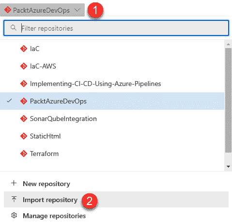

图 9.1 – 导入仓库

在**名称**字段中输入[`github.com/PacktPublishing/Implementing-CI-CD-Using-Azure-Pipelines.git`](https://github.com/PacktPublishing/Implementing-CI-CD-Using-Azure-Pipelines.git)，然后点击**导入**按钮：

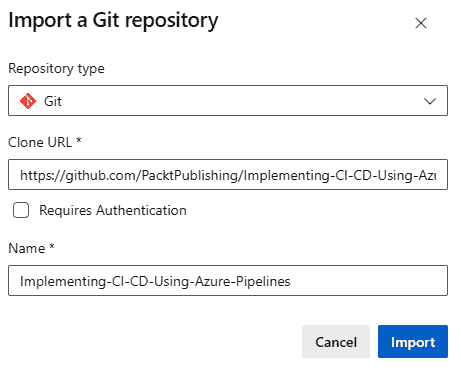

图 9.2 – 导入示例仓库

几分钟后，流程将完成，您将能够浏览仓库中的所有代码。您所需的一切都将在`e2e`目录中。

导入仓库后，我们来了解一下示例架构。

## 介绍解决方案架构

对于我们的示例架构，您将使用一个虚构的 Packt 商店，由四个不同的应用程序组成，代表了一个复杂的分布式架构，在这个架构中，使用不同编程语言的团队可以利用不同的 Azure 平台服务来交付他们的功能。

+   一个 Angular 前端应用程序，即商店的用户界面。

+   一个 Python 产品目录服务，作为 REST API 实现。

+   一个 Node.js 购物车服务，作为 REST API 实现。

+   一个 ASP.NET 结账服务，作为 REST API 实现。

以下解决方案图展示了一个网络商店的环境，其中每个应用程序独立地运行在不同的 Azure 服务中：

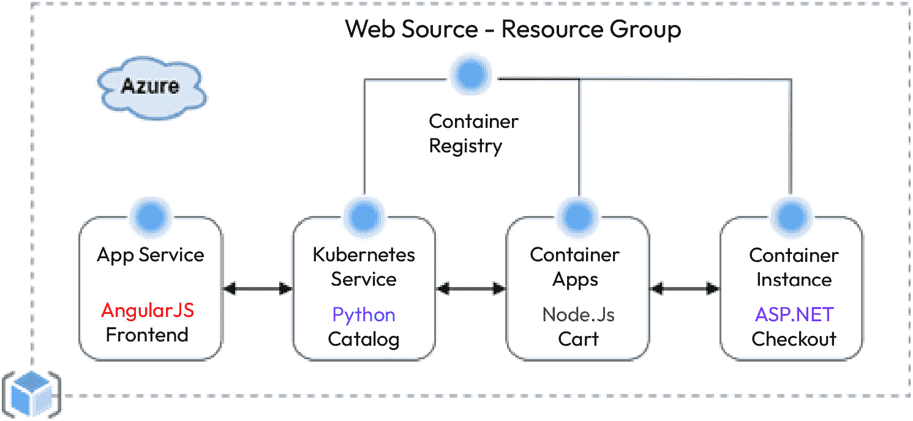

图 9.3 – 解决方案图

在本章稍后部分，您将为每个应用程序实施 Azure Pipeline，步骤如下：

1.  构建和打包应用程序及其相应的 IaC。

1.  将它们部署到测试环境中。

1.  将它们部署到生产环境中，包括手动审批检查。

以下图示展示了 CI/CD 过程：

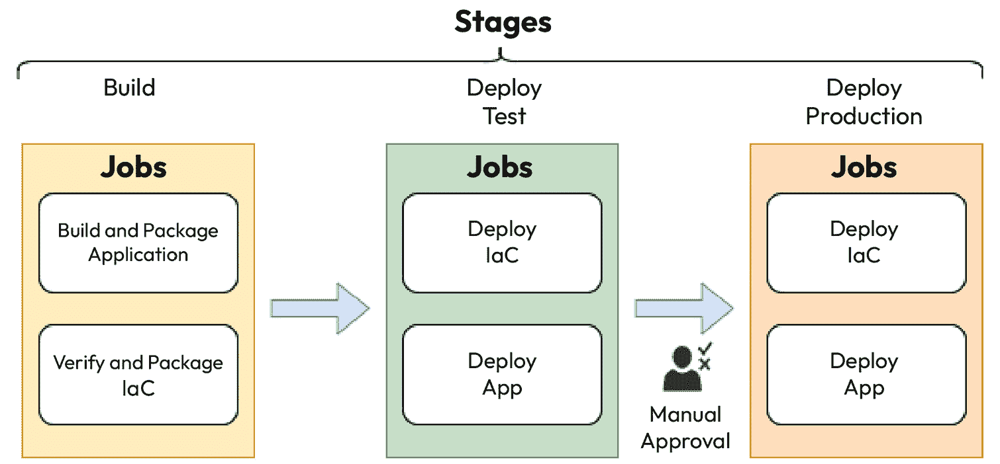

图 9.4 – CI/CD 端到端过程

重要提示

在本章中，应用程序中的代码细节将不会涉及，因为那与 CI/CD 无关。我们将重点介绍使 CI/CD 过程正常运行所需的 Azure Pipelines 的细节。

为了实现 CI/CD 过程，您将利用具有环境和模板的多阶段流水线：

+   **阶段**允许我们以逻辑方式封装所有需要一起发生的工作，并控制依赖关系，同时还提供并行执行工作的能力；这将帮助我们在需要时减少总时间。

+   **环境**与作业相关联，并允许我们添加额外的控制，例如本例中的手动审批，以确保部署只有在人工干预并批准后才会继续到生产环境。

+   **模板**在*第一章*中介绍；在这里，您将实践它们，展示如何使用模板来构建模块化和可重用的流水线。

让我们来看一下以下流水线定义；在您导入的`Implementing-CI-CD-Using-Azure-Pipeline`仓库中的`ch09/azure/azure-pipeline.yml`文件中创建此文件：

```
# Multi-Stage pipeline
trigger:
- main
pool:
  vmImage: ubuntu-latest
stages:
- stage: build
  displayName: Build
  jobs:
  - template: build-apps.yml
  - template: build-iac.yml
- stage: deployTest
  displayName: Deploy Test
  dependsOn: build
  jobs:
  - template: deploy.yml
    parameters:
      envName: test
- stage: deployProduction
  displayName: Deploy Production
  dependsOn: deployTest
  jobs:
  - template: deploy.yml
    parameters:
      envName: production
```

让我们分解这段代码：

+   `build`阶段没有依赖关系，包含来自`build-apps.yml`和`build-iac.yml`文件的模板中的工作。稍后您将在*构建和打包应用程序和* *基础设施即代码（IaC）*部分中查看这些内容。

+   `deployTest`阶段必须等待构建阶段完成，并将运行`deploy.yml`模板中的作业，传递一个`envName`参数，其值为`test`，以唯一标识此环境。

+   `deployProduction` 阶段会等待 `deployTest` 阶段完成，并使用相同的 `deploy.yml` 模板，传递一个名为 `envName` 的生产环境值。

该管道定义展示了模板的灵活性，以及将需要执行的工作拆分成更小部分的能力，这为团队根据其责任专注于管道的不同阶段提供了一种方式。

文件添加到仓库后，作为新管道添加并将其重命名为 `E2E-Azure`。为了使一切顺利运行，您还需要添加一些安全配置。

如果您之前没有重命名过管道，请点击 **最近运行的管道** 屏幕右侧的子菜单，如下图所示，然后重命名它：

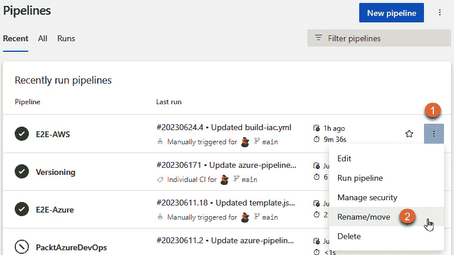

图 9.5 – 重命名管道

关于模板的小贴士

在使用 `job.template` 引用另一个文件中定义的模板时，请确保在引用该模板之前先创建该文件，并在文件中至少定义一个步骤。一个简单的实现方法是使用 `script` 任务运行 `echo` 命令，例如 `echo hello`。

现在让我们进入构建阶段。

# 构建和打包应用程序以及基础设施即代码（IaC）

该解决方案中的所有应用程序都支持容器化，这是一个标准的打包机制，包含所有操作系统依赖项，以使它们能够在多种不同的托管环境中运行，使得它们非常轻量且易于移植。

为了简化，仓库中包含一个 `docker-compose.yml` 文件，该文件便于处理由多个服务组成且必须同时运行的应用程序。

该文件定义了服务以及它们对应的 `Dockerfile` 的位置，`Dockerfile` 文件定义了容器的构建方式，以及其他一些内容，例如容器运行所需的端口或环境变量。

在本章中，`SUB_ID` 占位符是您可以访问的 Azure 订阅的 ID；请在适当的时候替换它。

在继续之前，您必须拥有一个可用的 **Azure 容器注册表**，供管道存储容器镜像。您可以使用以下 Azure CLI 命令轻松创建一个：

```
az acr create -n packtadocicd -g packt –sku Standard -l eastus –admin-enabled
```

我们还需要确保我们在 *第八章* 中 *创建 AWS 服务连接* 部分创建的服务主体具有管理此服务的用户访问权限；您可以通过在 PowerShell 窗口中运行以下命令来实现：

```
$id=az ad sp list –display-name azure-pipelines –query "[].id" -o tsv
az role assignment create –assignee-object-id $id –scope /subscriptions/build-apps.yml file, which will be used to build the application containers and push them to the Azure Container Registry.
To build and push the containers, you can use the Docker Compose task. However, this must be done as a two-step process; you must build the images first and then push them. To make the task easier to read, let’s first look at the build portion in the following YAML code:

```

parameters:

- name: azureSubscription

type: string

default: 'azure-packt-rg'

- name: azureContainerRegistry

type: string

default: '{"loginServer":"packtadocicd.azurecr.io", "id" : "/subscriptions/SUB_ID/resourceGroups/packt/providers/Microsoft.ContainerRegistry/registries/packtadocicd"}'

jobs:

- job: BuildAndPushContainers

displayName: 构建并推送容器

steps:

- task: DockerCompose@0

displayName: '构建容器'

inputs:

containerregistrytype: 'Azure 容器注册表'

azureSubscription: ${{parameters.azureSubscription}}

azureContainerRegistry: ${{parameters.azureContainerRegistry}}

dockerComposeFile: 'docker-compose.yml'

projectName: 'packt-store'

action: '构建服务'

additionalImageTags: '$(Build.BuildNumber)'

includeLatestTag: true

```

 Let’s break this code down:

*   The `azureSubscription` parameter is a reference to the Azure Resource Manager Service connection created in the previous chapter.
*   The `azureContainerRegistry` parameter is a little tricky; it is a JSON document that includes the `loginServer` and `id` properties related to the Container Registry resource in Azure.
*   The Docker Compose task with the `'Build Containers'` `displayName` uses the `docker-compose.yml` file to build container images locally in the agent, as indicated by the `action` property. Note the use of `additionalImageTags`, where you provide a predefined variable, `$(Build.BuildNumber)`, and set to `true` the `includeLatestTag` property; we will elaborate on this in the *Understanding container image* *tags* section.

With the images built, the next step is to push them to the registry, which is done with the same task, with just a change to the `action` property, as shown in the following code snippet:

```

- task: DockerCompose@0

displayName: '推送容器'

inputs:

containerregistrytype: 'Azure 容器注册表'

azureSubscription: ${{parameters.azureSubscription}}

azureContainerRegistry: ${{parameters.azureContainerRegistry}}

dockerComposeFile: 'docker-compose.yml'

projectName: 'packt-store'

action: '推送服务'

additionalImageTags: '$(Build.BuildNumber)'

includeLatestTag: true

```

 The Docker Compose task with `displayName` `'Push Containers'` uses the `docker-compose.yml` file to push the previously built container images to the Container Registry in Azure as indicated by the `action` property.
Remember that the two portions of YAML presented here are part of the `build-apps.yaml` file.
Now that we have covered how to build and push container images, let’s take a break to discuss how container image tags work and why they are important.
Understanding container image tags
Building a container is like compiling an application and packaging all its files into a ZIP archive that you can then use for deployment, along with all the OS dependencies needed for the application to run.
However, the result is called a container image and it is typically a complex artifact made up of multiple layers stored in a registry and is not manageable via the filesystem. For this reason, just like you would name a ZIP file based on a versioning convention to track when the artifact was generated, when working with containers, it is important to tag them.
The `latest` tag mentioned previously is a convention in the container world that allows you to retrieve the newest image available without specifying a specific tag. This is very helpful during development cycles for experimentation purposes.
Important note
Always tag your containers with a specific version number and deploy that version number across all your environments for proper traceability. The `latest` tag is only a convenience to easily pull the newest version of a container image and it should never be used for environment deployments, because it can be a reference to different builds depending on the date and time that you pull it.
Now that you understand the importance of container image tags, let’s see what you can use within Azure Pipelines to name them.
Understanding your pipeline build number
The `$(Build.BuildNumber)` predefined variable is a convenient way to get a unique label in every pipeline run to version your artifacts, and its default value is a timestamp and revision number with the format `YYYYMMDD.R`, where `YYYY` is the current year, `MM` is the month, `DD` is the day, and `R` is a sequential automatically incremented number.
If you don’t set your build name explicitly, it will use the following default format for your YAML pipelines:

```

name: $(Date:yyyyMMdd).$(Rev:r)

```

 This special notation will use the current date in the given format, automatically increase the number generated by the `$(Rev:r)` token, and reset it to `1` if the portion of text before it is changed.
Most organizations prefer to use semantic versioning for artifacts or APIs, which follows a `MAJOR.MINOR.PATCH` format, like `1.0.1`:

*   `MAJOR` changes indicate incompatible API changes
*   `MINOR` changes indicate that functionality is added with backward compatibility
*   `PATCH` changes indicate a bug fix without impact on functionality

If you need to use semantic versioning in your pipelines, an easy way to implement this is by adding `name` at the very top of your YAML file, as follows:

```

name: 1.0.$(Rev:r)

```

 Notice that in this case, you are responsible for increasing the `MAJOR` and `MINOR` portions of the name based on your code changes.
Important note
Always consider the implications of your pipeline build number, its format, and where you will be using it. This value can have adverse effects depending on where you use it.
Now that you have the container images available, let’s talk a bit about Helm, a tool you will be using to deploy applications in Kubernetes environments.
Understanding Helm
**Helm** is a package manager for Kubernetes. Typically, you take advantage of it to deploy third-party or open source applications into your Kubernetes clusters. The packages created with Helm are referred to as **Helm charts**.
Helm is also extremely useful for packaging your own applications, since they will likely have more than one manifest needed to configure all required components in Kubernetes, and Helm provides facilities to override parameters with ease.
For example, a simple Helm chart will contain the following files:
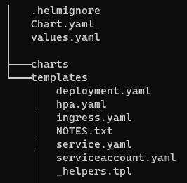

Figure 9.6 – Basic Helm chart contents
If you want to learn more about Helm, go to [`helm.sh/`](https://helm.sh/).
Validating Helm charts is not a trivial task; several options are available for this. Helm provides a basic `lint` command to accomplish this task, but it covers only basic format issues. In this book, you are using an open source tool called **kube-linter**, available as a Docker container. This will validate the YAML syntax of the Kubernetes manifests used to deploy the application and perform a series of best-practice checks. If you want to learn more about this tool, go to [`docs.kubelinter.io/`](https://docs.kubelinter.io/).
Now that you have learned about Helm, let’s work on the IaC.
Verifying and packaging IaC
You learned how to work with Azure Resource Manager templates in the previous chapter, so you need to validate the templates and publish them as artifacts to the pipeline.
To do this, you will create a `build-iac.yml` file in the repository and add the following seven segments to it (they have been separated in this section only to make it easier to read):

*   `azure-pipeline.yaml` file:

    ```

    parameters:

    - name: azureSubscription

    type: string

    default: 'azure-packt-rg'

    - name: resourceGroupName

    type: string

    default: 'packt'

    - name: location

    type: string

    default: '东部美国'

    ```

     *   **The jobs segment**: This segment groups all the subsequent segments that include only tasks:

    ```

    jobs:

    - job: VerifyAndPackageIaC

    displayName: 验证和打包基础设施即代码 (IaC)

    steps:

    ```

     *   **IaC catalog tasks segment**: This can be written as follows:

    ```

    - task: AzureResourceManagerTemplateDeployment@3

    displayName: '验证目录模板'

    inputs:

    deploymentScope: '资源组'

    azureResourceManagerConnection: ${{parameters.azureSubscription}}

    resourceGroupName: ${{parameters.resourceGroupName}}

    templateLocation: '关联的构件'

    csmFile: 'e2e/iac/azure/catalog/template.json'

    deploymentMode: '验证'

    location: ${{parameters.location}}

    - task: PublishPipelineArtifact@1

    displayName: '发布目录构件'

    inputs:

    targetPath: 'e2e/iac/azure/catalog'

    artifact: catalog-iac

    publishLocation: '管道'

    ```

    Let’s break it down:

    *   The `AzureResourceManagerTemplateDeployment@3` task is used to validate the ARM templates for the catalog application
    *   The `PublishPipelineArtifact@1` task is then used to publish the artifacts to be used for deployment *   **Catalog helm chart segment**: You can write this block as follows:

    ```

    - script: |

    docker run --rm -v $(pwd):/manifests stackrox/kube-linter lint /manifests --config /manifests/.kube-linter.yml

    displayName: 'Lint 目录 Helm 图表'

    workingDirectory: e2e/iac/helm-charts/catalog

    - task: HelmInstaller@1

    displayName: '安装 Helm'

    - task: HelmDeploy@0

    displayName: '打包目录 Helm 图表'

    inputs:

    command: package

    chartPath: e2e/iac/helm-charts/catalog

    destination: $(Build.ArtifactStagingDirectory)

    - task: PublishPipelineArtifact@1

    displayName: '发布目录 Helm 图表'

    inputs:

    targetPath: $(Build.ArtifactStagingDirectory)

    artifact: catalog-helm-chart

    publishLocation: '管道'

    ```

    Let’s break it down:

    *   The script task with `displayName` `'Lint Catalog Helm Chart'` performs a validation of the Helm chart
    *   The `HelmInstaller@1` task installs the Helm tool
    *   The `HelmDeploy@0` task is used to package the Helm chart *   **IaC cart tasks segment**: An example of this is as follows:

    ```

    - task: AzureResourceManagerTemplateDeployment@3

    displayName: '验证购物车模板'

    inputs:

    deploymentScope: '资源组'

    azureResourceManagerConnection: ${{parameters.azureSubscription}}

    resourceGroupName: ${{parameters.resourceGroupName}}

    templateLocation: '关联的构件'

    csmFile: 'e2e/iac/azure/cart/template.json'

    deploymentMode: '验证'

    location: ${{parameters.location}}

    - task: PublishPipelineArtifact@1

    displayName: '发布购物车构件'

    inputs:

    targetPath: 'e2e/iac/azure/cart'

    artifact: cart-iac

    publishLocation: '管道'

    ```

    Let’s break it down:

    *   The `AzureResourceManagerTemplateDeployment@3` task is used to validate the ARM templates for the cart application
    *   The `PublishPipelineArtifact@1` task is then used to publish the artifacts to be used for deployment *   **IaC checkout tasks segment**: This section looks like the following:

    ```

    - task: AzureResourceManagerTemplateDeployment@3

    displayName: '验证结账模板'

    inputs:

    deploymentScope: '资源组'

    azureResourceManagerConnection: ${{parameters.azureSubscription}}

    resourceGroupName: ${{parameters.resourceGroupName}}

    模板位置: '链接的工件'

    csm 文件: 'e2e/iac/azure/checkout/template.json'

    部署模式: '验证'

    位置: ${{parameters.location}}

    - 任务: PublishPipelineArtifact@1

    显示名称: '发布结账工件'

    inputs:

    目标路径: 'e2e/iac/azure/checkout'

    工件: checkout-iac

    发布位置: '管道'

    ```

    Let’s break it down:

    *   The `AzureResourceManagerTemplateDeployment@3` task is used to validate the ARM templates for the checkout application
    *   The `PublishPipelineArtifact@1` task is then used to publish the artifacts to be used for deployment *   **IaC frontend tasks segment**: Here is a sample of this part of the code:

    ```

    - 任务: AzureResourceManagerTemplateDeployment@3

    显示名称: '验证前端模板'

    inputs:

    部署范围: '资源组'

    azureResourceManagerConnection: ${{parameters.azureSubscription}}

    resourceGroupName: ${{parameters.resourceGroupName}}

    模板位置: '链接的工件'

    csm 文件: 'e2e/iac/azure/frontend/template.json'

    部署模式: '验证'

    位置: ${{parameters.location}}

    覆盖参数: '-catalogAppUrl catalogAppUrl.com -cartAppUrl cartAppUrl.com -checkoutAppUrl checkoutAppUrl.com'

    - 任务: PublishPipelineArtifact@1

    显示名称: '发布前端工件'

    inputs:

    目标路径: 'e2e/iac/azure/frontend'

    工件: frontend-iac

    发布位置: '管道'

    ```

    For simplicity, let’s break down what is happening:

    *   The `AzureResourceManagerTemplateDeployment@3` task is used to validate the ARM templates for the frontend application
    *   The `PublishPipelineArtifact@1` task is then used to publish the artifacts to be used for deployment 
That brings us to the end of the `build-iac.yaml` file; make sure you keep all the segments together in the same file.
Now that you have all the artifacts ready, let’s move on to create our environments.
Managing environments
In this section, you will learn about how to create environments and deploy to them.
Configuring environments
In this section, you will define the environments in Azure Pipelines, which will be logical representations of the deployment targets. This will allow us to add approval and checks to control how the pipeline advances from one stage to the next:

1.  You start by clicking on the **Environments** option under **Pipelines** in the main menu on the left, as follows:

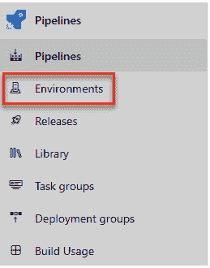

Figure 9.7 – Accessing the Environments option in the menu

1.  If you have no environments, you will see a screen like the following; click on **Create environment**:

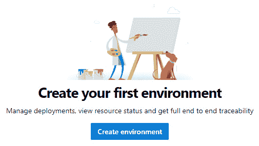

Figure 9.8 – Creating your first environment
Otherwise, you will see a **New environment** option in the top-right part of the screen above your existing environments.

1.  Once the pop-up screen shows up to create the new environment, enter `test` for `Test Environment` for **Description**, leave the **Resource** option as **None**, and click on the **Create** button, as shown here:

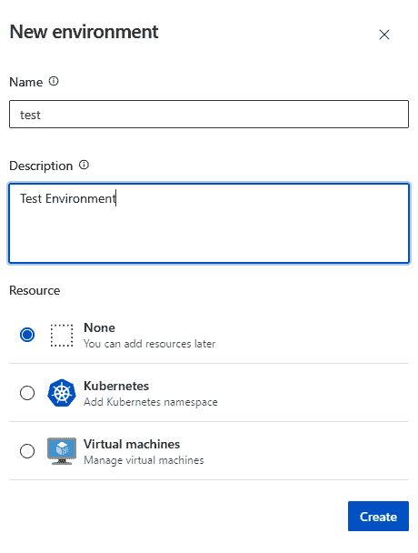

Figure 9.9 – Creating the test environment

1.  Repeat *steps 2 and 3* to create another environment using `production` for `Production Environment` for **Description**.
2.  With the two environments created, click on the **production** one in the list, as shown here:

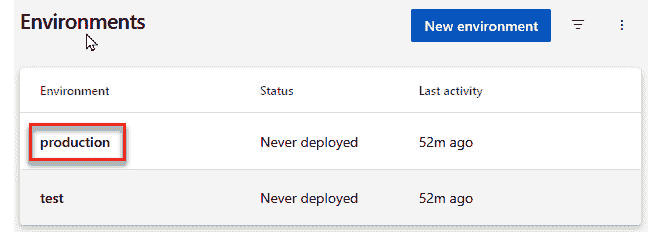

Figure 9.10 – Environments

1.  In the next screen, you are going to add an approval check, to ensure you can only deploy to production once a human indicates it is possible.

    For this, start by clicking on the ellipsis button in the top-right part of the screen and then on the **Approvals and checks** item, as shown here:

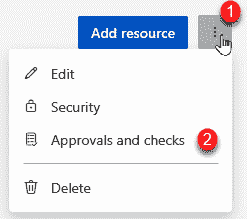

Figure 9.11 – Adding an environment approval gate

1.  Since no checks have been added yet, you should see a screen like the following; selecting **Approvals** will get us to the next step to complete the check configuration:

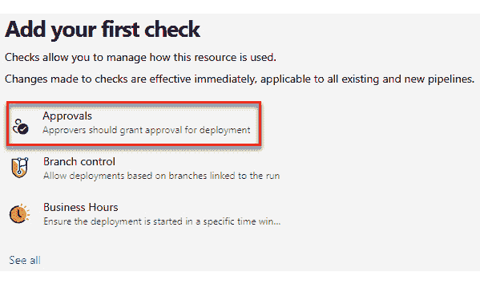

Figure 9.12 – Adding an approval check
In this form, provide the required approvers (it could be yourself initially). You can optionally provide instructions, such as manual steps to verify by the approver, and change **Timeout**. If you are the approver, you must make sure the **Allow approvers to approve their own runs** option is checked under **Advanced**. Finally, hit the **Create** button and you will be ready to move on to the next steps:
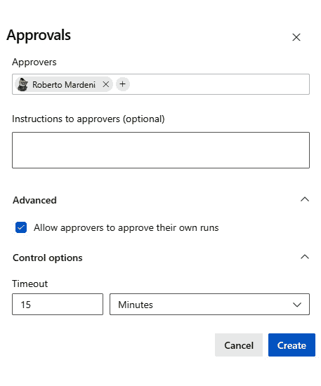

Figure 9.13 – Creating an approval check

1.  Lastly, you must also add permissions for each environment to allow them to be used in the **E2E-Azure** pipeline. Like before, click on the ellipsis option in the top-right part of the screen and click the **Security** option from the menu.

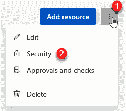

Figure 9.14 – Environment security settings

1.  Then click on the **+** button and search for the **E2E-Azure** pipeline to add the permissions; just click on the name to add it.

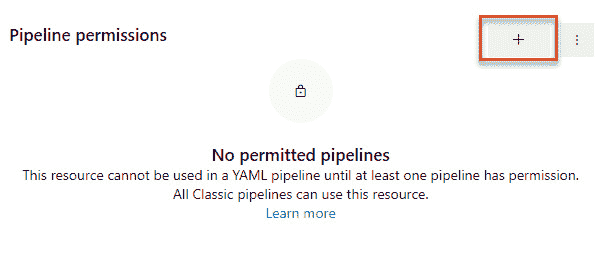

Figure 9.15 – Adding pipeline permissions to environment
A properly configured environment will look like the following:
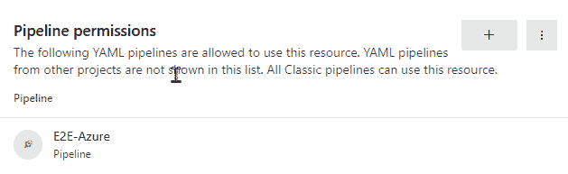

Figure 9.16 – Environment with pipeline permissions
Important
It is a good practice to create environments for all deployment stages; this allows us to be modular and templatize deployment steps, giving us the opportunity to add approvals or gates later if need be.
Now that you have our environments configured, let’s move on to the deployment steps.
Deploying to environments
You will deploy the environment by creating a `deploy.yml` file and start by adding the steps needed for AKS deployment and the Python catalog service.
The `deploy.yml` file will start with the following content; you will be adding to it in every section hereafter:

```

参数:

- 名称: envName

类型: 字符串

默认值: 'test'

- 名称: azureSubscription

类型: 字符串

默认值: 'azure-packt-rg'

- 名称: resourceGroupName

类型: 字符串

默认值: 'packt'

- 名称: 位置

类型: 字符串

默认值: '东部美国'

作业:

- 部署: deployment_${{ parameters.envName }}

显示名称: 部署到 ${{ parameters.envName }}

环境: ${{ parameters.envName }}

策略:

运行一次:

部署:

步骤:

```

 So far, you don’t have much in this file, but let’s break it down:

*   The `parameters` section defines all the values available for reuse within the pipeline definition. The only one being used from the main pipeline is the `envName` one, but this gives you the flexibility to change them when needed.
*   The `jobs` collection includes a new job type you haven’t used before called `deployment`, which allows us to implement different rollout strategies. For simplicity, here you will be using the `runOnce` strategy, but you can also use `canary` and `rolling` where appropriate. To learn more about these, go to [`learn.microsoft.com/en-us/azure/devops/pipelines/yaml-schema/jobs-deployment-strategy`](https://learn.microsoft.com/en-us/azure/devops/pipelines/yaml-schema/jobs-deployment-strategy).

Now, you can proceed with the first service deployment steps.
Deploying the Python catalog service to AKS
The deployment of the Python catalog service to Azure Kubernetes Service is performed as a two-phase process:

1.  Deploy the ARM template to create and configure the AKS cluster using IaC. Refer to *Chapter 8* for more information on how to do this.
2.  Deploy the application using the Helm chart provided in the repository.

In our `deploy.yml` file, you will add the following six steps:

1.  The `download` task `Download catalog iac` retrieves the pipeline artifact:

    ```

    - 下载: 当前

    显示名称: '下载目录 iac'

    工件: catalog-iac

    ```

     2.  The `AzureResourceGroupDeployment@2` task performs the AKS deployment:

    ```

    - 任务: AzureResourceGroupDeployment@2

    名称: catalogInfra

    显示名称: '部署目录基础设施'

    inputs:

    azureSubscription: ${{ parameters.azureSubscription }}

    动作: '创建或更新资源组'

    resourceGroupName: ${{ parameters.resourceGroupName }}

    位置: ${{ parameters.location }}

    模板位置: '链接的工件'

    csm 文件: '$(Pipeline.Workspace)/catalog-iac/template.json'

    覆盖参数: '-environmentName ${{ parameters.envName }}'

    部署模式: '增量'

    部署名称: 'catalog-$(Build.BuildNumber)'

    部署输出: 'catalogInfraOutputs'

    ```

    Notice that you are using the `deploymentOutputs` property to set the name of a variable that will contain the outputs generated in the ARM template; this will be needed later for the frontend deployment.

     3.  The `PowerShell@2` task parses out the cluster name from the output parameters of the ARM template deployment and makes it available as another variable for the duration of the job:

    ```

    - 任务: PowerShell@2

    显示名称: '获取 AKS 集群名称'

    inputs:

    目标类型: '内联'

    脚本: |

    $var=ConvertFrom-Json '$(catalogInfraOutputs)'

    $value=$var.clusterName.value

    Write-Host "AKS 集群名称: $value"

    Write-Host "##vso[task.setvariable variable=clusterName;]$value"

    ```

     4.  The `download` task `Download catalog helm chart` retrieves the artifact:

    ```

    - 下载: 当前

    显示名称: '下载目录 Helm 图表'

    工件: catalog-helm-chart

    ```

     5.  The `HelmInstaller@1` task installs Helm in the agent:

    ```

    - 任务: HelmInstaller@1

    显示名称: '安装 Helm'

    inputs:

    要安装的 Helm 版本: 3.11.3

    ```

     6.  The `HelmDeploy@0` task performs an `upgrade` command with the `install` option set to `true`; this will guarantee that, if it’s not found, it will be created:

    ```

    - 任务: HelmDeploy@0

    显示名称: 将目录应用部署到 AKS

    inputs:

    连接类型: 'Azure 资源管理器'

    azureSubscription: ${{ parameters.azureSubscription }}

    azureResourceGroup: ${{ parameters.resourceGroupName }}

    kubernetesCluster: $(clusterName)

    发布名称: catalog

    图表类型: 文件路径

    图表路径: "$(Pipeline.Workspace)/catalog-helm-chart/packt-store-catalog-1.0.0.tgz"

    覆盖值: 'image.tag=$(Build.BuildNumber)'

    command: upgrade

    install: true

    waitForExecution: true

    "##vso[task.setvariable variable=name;]value"

    ```

    This is called a `name` and `value`.

    If the variable does not exist before running the command, then it will be created and made available at runtime.

To learn more about how to work with variables in Azure Pipelines, go to [`learn.microsoft.com/en-us/azure/devops/pipelines/process/set-variables-scripts`](https://learn.microsoft.com/en-us/azure/devops/pipelines/process/set-variables-scripts).
Now let’s move on to the Node.js cart service.
Deploying a Node.js cart service to ACA
The deployment of the cart service to ACA is a bit simpler; it just requires the use of the `AzureResourceGroupDeployment@2` task after the artifact is downloaded:

```

- download: current

displayName: '下载购物车 iac'

artifact: cart-iac

- task: AzureResourceGroupDeployment@2

name: cartInfra

displayName: '部署购物车基础设施'

inputs:

azureSubscription: ${{ parameters.azureSubscription }}

action: '创建或更新资源组'

resourceGroupName: ${{ parameters.resourceGroupName }}

location: ${{ parameters.location }}

templateLocation: '链接的工件'

csmFile: '$(Pipeline.Workspace)/cart-iac/template.json'

overrideParameters: '-environmentName ${{ parameters.envName }} -containerTag "$(Build.BuildNumber)"'

deploymentMode: '增量'

deploymentName: 'cart-$(Build.BuildNumber)'

deploymentOutputs: 'cartInfraOutputs'

```

 Notice, in this case, the use of `overrideParameters` to pass in the value of the `containerTag` parameter using `BuildNumber`.
Next, you will add the deployment of the checkout service.
Deploying a .NET checkout service to ACI
The deployment of the checkout service is very similar to the ACA deployment; the only difference is the use of the ACI service instead. See the following steps:

```

- download: current

displayName: '下载结账 iac'

artifact: checkout-iac

- task: AzureResourceGroupDeployment@2

name: checkoutInfra

displayName: '部署结账基础设施'

inputs:

azureSubscription: ${{ parameters.azureSubscription }}

action: '创建或更新资源组'

resourceGroupName: ${{ parameters.resourceGroupName }}

location: ${{ parameters.location }}

templateLocation: '链接的工件'

csmFile: '$(Pipeline.Workspace)/checkout-iac/template.json'

overrideParameters: '-environmentName ${{ parameters.envName }} -containerTag "$(Build.BuildNumber)"'

deploymentMode: '增量'

deploymentName: 'checkout-$(Build.BuildNumber)'

deploymentOutputs: 'checkoutInfraOutputs'

```

 Just like you did in the Node.js deployment to ACA, in this section, you used `overrideParameters` to pass in the value of the `containerTag` parameter using `BuildNumber`.
Now let’s move on to the last application, the frontend.
Deploying an Angular frontend app to AAS
For the frontend application, there are a few more steps necessary because of the need to gather information before being able to use the ARM template.
You will be adding the following steps to `deploy.yaml`:

1.  The `download` task retrieves the frontend pipeline artifact:

    ```

    - download: current

    displayName: '下载前端 iac'

    artifact: frontend-iac

    ```

     2.  The `AzureCLI@2` task `Get Catalog App IP from AKS` is a script needed to retrieve the IP assigned to the exposed entry point of the catalog application. It uses the `az` CLI, the `kubectl` CLI, and the `jq` tool in Linux to parse out the information from Kubernetes. This is very specific to how this application was deployed. This script might not be reusable, but it is meant to show the flexibility of the tools if needed:

    ```

    - task: AzureCLI@2

    displayName: '从 AKS 获取目录应用程序 IP'

    inputs:

    azureSubscription: 'azure-packt-rg'

    scriptType: 'bash'

    scriptLocation: 'inlineScript'

    inlineScript: |

    az aks get-credentials -g ${{ parameters.resourceGroupName }} -n $(clusterName) --overwrite-existing

    ip=`kubectl get service catalog-packt-store-catalog -o json | jq ".status.loadBalancer.ingress[0].ip"`

    echo "目录应用程序 IP: $ip"

    echo «##vso[task.setvariable variable=catalogAppIp;]$ip"

    ```

     3.  The `PowerShell@2` task is used to parse out the fully qualified domain name contained in the output variables generated by the previous steps. It is used to deploy the catalog, cart, and checkout services:

    ```

    - task: PowerShell@2

    displayName: '设置应用程序 URL'

    inputs:

    targetType: 'inline'

    script: |

    # 设置目录应用程序 URL

    $value="http://" + $(catalogAppIp) + ":5050/"

    Write-Host "目录应用程序 URL: $value"

    Write-Host "##vso[task.setvariable variable=catalogAppUrl;]$value"

    # 设置购物车应用程序 URL

    $var=ConvertFrom-Json '$(cartInfraOutputs)'

    $value=$var.containerAppFqdn.value

    $value="https://" + $var.containerAppFqdn.value + "/"

    Write-Host "购物车应用程序 URL: $value"

    Write-Host "##vso[task.setvariable variable=cartAppUrl;]$value"

    # 设置结账应用程序 URL

    $var=ConvertFrom-Json '$(checkoutInfraOutputs)'

    $value="http://" + $var.containerFQDN.value + ":5015/"

    Write-Host "结账应用程序 URL: $value"

    Write-Host "##vso[task.setvariable variable=checkoutAppUrl;]$value"

    ```

     4.  The `AzureResourceGroupDeployment@2` task deploys the Azure App Service instance and provides all the information necessary for the service to pull in the image, including the given `BuildNumber` as the tag. There are also the application URLs necessary to be stored in the service for the application to work:

    ```

    - task: AzureResourceGroupDeployment@2

    name: frontendInfra

    displayName: '部署前端基础设施'

    inputs:

    azureSubscription: ${{ parameters.azureSubscription }}

    action: '创建或更新资源组'

    资源组名称: ${{ parameters.resourceGroupName }}

    位置: ${{ parameters.location }}

    模板位置: '链接的工件'

    csm 文件: '$(Pipeline.Workspace)/frontend-iac/template.json'

    覆盖参数: '-environmentName ${{ parameters.envName }} -containerTag "$(Build.BuildNumber)" -catalogAppUrl $(catalogAppUrl) -cartAppUrl $(cartAppUrl) -checkoutAppUrl $(checkoutAppUrl)'

    部署模式: '增量'

    部署名称: 'frontend-$(Build.BuildNumber)'

    部署输出: 'frontendInfraOutputs'

    ```

     5.  The `PowerShell@2` task `Get Frontend URL` then uses another script to parse the output of the ARM template deployment to provide it both in the logs and as a variable that could ultimately be used in additional steps, such as a web request to smoke test the endpoint. Alternatively, it could be used in automated test execution:

    ```

    - 任务: PowerShell@2

    显示名称: '获取前端网址'

    输入:

    目标类型: '内联'

    脚本: |

    # 获取前端应用网址

    $var=ConvertFrom-Json '$(frontendInfraOutputs)'

    $value=$var.frontendUrl.value

    Write-Host "前端网址: $value"

    Write-Host "##vso[task.setvariable variable=frontendAppUrl;]$value"

    ```

Wow, that was a lot of deployments, but you are not done! Once the test environment is complete, you get a chance to approve the continuation of deployment to production in the next section.
Approving environment deployments
With the deployment to the test environment complete, you should be able to see the pipeline in the **Waiting** state, as follows:
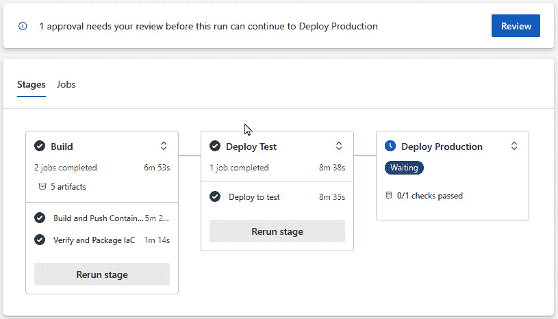

Figure 9.17 – Stage awaiting for checks
This will only look like this if you are the reviewer configured for the manual approval check. Click on the **Review** button and a new screen will pop up with **Reject** and **Approve** options and the ability to provide a comment, as shown here:
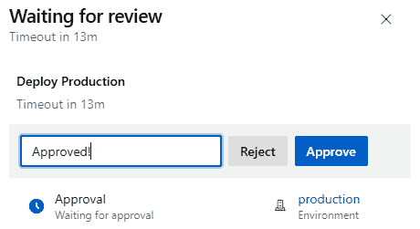

Figure 9.18 – Approving an environment check
If click the **Approve** button, the deployment will proceed. If you click the **Reject** button, the deployment will be canceled; also, if you don’t do anything and the timeout runs out, the pipeline will be canceled.
Now that you have completed all the deployments, it is worth pointing out what to do if you run into issues with deployments; let’s talk now about some of the typical ones.
Troubleshooting deployment issues
Creating a stable and reliable CI/CD pipeline takes time, especially when performing deployments to a cloud platform such as Azure. Let’s walk through some of the typical issues you can run into.
Issues deploying IaC
You used ARM templates to deploy the infrastructure to host the services that run the applications in Azure in this chapter, which means you are relying on that infrastructure to succeed before you can deploy the applications.
There are several situations in which the `AzureResourceGroupDeploment` task can fail:

*   **Internal server errors**: These can occur if the Azure region you are trying to deploy is suddenly going through capacity issues or undergoing maintenance, or even if the Azure Pipelines service is going through issues itself.

    *How to fix it*: Usually there is no recovery from this except for attempting to run the failed pipeline again. If the region in Azure becomes unavailable, you will have to wait until it becomes available again or target a different region for deployment as part of your disaster recovery strategy.

*   **Timeout**: The deployment took too long, which could have been caused by the pipeline agent or the Azure deployment. The default timeout for Microsoft-hosted agents is 60 minutes in the free tier and 360 minutes when paying for parallel jobs.

    *How to fix it*: You have a way to increase the timeout at the job level if required, but most likely there are other reasons why your deployment is failing. You will have to analyze the errors in the pipeline to find the root cause.

For other tips regarding deployments using ARM templates, head to [`learn.microsoft.com/en-us/azure/azure-resource-manager/templates/best-practices`](https://learn.microsoft.com/en-us/azure/azure-resource-manager/templates/best-practices).
Issues with scripts
Scripts used in your pipelines need to be written in an *idempotent* manner, meaning that for every command or task to execute properly, the script must verify whether the operation is required and whether the result code is what is expected. This approach ensures that a script only performs the operations required to reach the desired state and, in doing so, checks every step of the way whether the operation is indeed required. Not following this approach leads to brittle scripts (scripts that are easily broken), especially when interacting with Azure resources where the current state might not match the desired state.
To address this issue, always write your scripts in an idempotent way. Follow the `if-not-then` pattern for every operation.
Issues with Helm
Here are some issues commonly observed when working with Helm:

*   Helm is a very convenient tool, but you are still responsible for the proper formatting of each of the manifests and making sure that they conform with and are valid for the Kubernetes API of your cluster. In this chapter, you learned how to use **kube-linter** to validate your Helm charts, but this is only a tool, and as such it can fail to detect issues. This tool only validates against the latest stable Kubernetes API, and if your cluster is not running this version, the validation will not catch issues that will arise when performing a deployment.

    *How to fix it*: There are other open source tools that can validate against specific Kubernetes versions and perform different checks against your Kubernetes objects. A couple of examples are **kube-score** ([`kube-score.com/`](https://kube-score.com/)) and **Kubeconform** ([`github.com/yannh/kubeconform`](https://github.com/yannh/kubeconform)); put each of them to the test and evaluate which works better for your applications.

*   Another issue to expect with Helm is the deployment of Kubernetes objects and the underlying consequences of this in Azure, such as deploying additional services in the case of ingress controllers. This scenario entails the creation of other Azure resources that in turn can sometimes fail.

    *How to fix it*: If an operation failed due to a platform timeout or retriable error, there is nothing else to do but deploy again.

With this, we’ve finished the chapter. Let’s wrap it up.
Winding up
If you completed all the steps, you will have deployed test and production environments, so it is time to clean up! This is important because you have deployed many resources into Azure. Make sure to delete them if you do not want to keep paying for them. You can do this via the Azure portal or the following Azure CLI command:

```

az group delete -n packt -y

```

 If you missed anything or got stuck and are having trouble putting the entire solution together, the complete pipeline definitions can be found in the GitHub repository mentioned in the *Technical requirements* section; look in the `ch09/azure` directory, specifically the **complete** branch.
Now, let’s recap what we have learned in this chapter.
Summary
In this chapter, we took a complex solution and learned how to create CI/CD pipelines in a modular way, taking advantage of stages, environments, and templates. We also learned about adding checks throughout the stages of a pipeline. In this case, we added manual approval, but we saw that there are other controls that can be put in place to implement more complex scenarios. We learned briefly about containers and how building container-based applications with Docker Compose is easy and facilitates working with different programming languages at the same time in your pipelines; it also reduces the complexities of compiling and packaging them. We learned about semantic versioning and its applicability while learning about how build numbers can be used to tag or name artifacts from your pipelines, along with the importance of tracking artifacts. Lastly, we walked through the deployment of different services in Azure using ARM templates, learning about some of the intricacies of tying them together and the flexibility of pipelines to coordinate templates, regardless of the number of services to be deployed.
Now that we have learned how to build and deploy this complex solution to different Azure services, the next chapter will be about doing this using **Amazon Web** **Services** instead.

```
