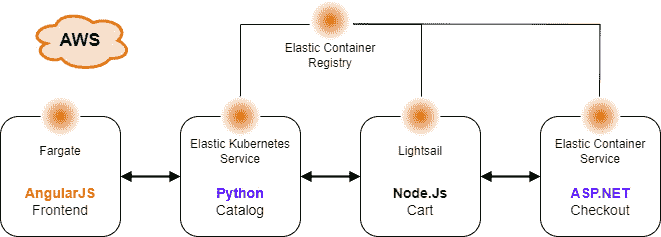
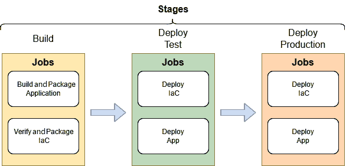
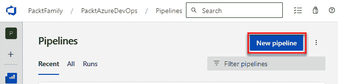
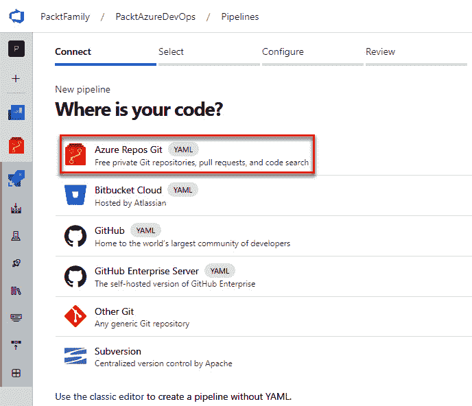
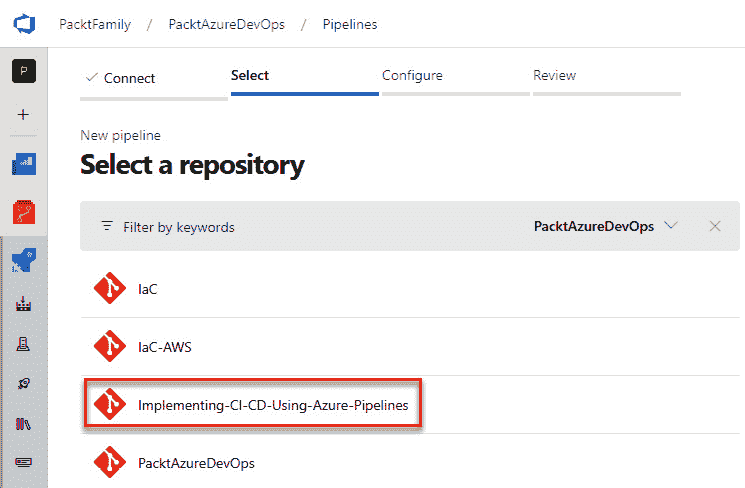
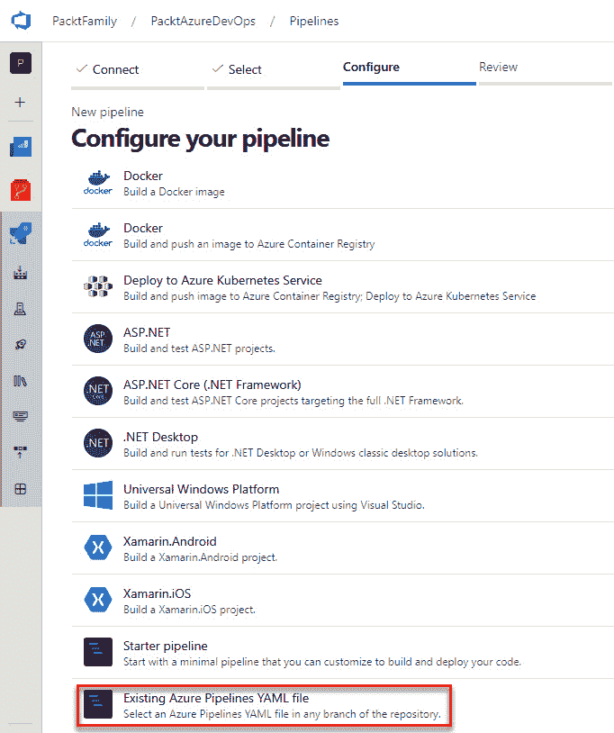
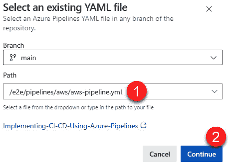

# 10

# 实施 AWS 的 CI/CD

在本章中，我们将构建一个端到端的解决方案，类似于上一章，但它将目标定向到**亚马逊 Web 服务**（**AWS**）云平台，部署相同的应用程序，并将它们从测试环境推广到生产环境。本章展示了 Azure Pipelines 的灵活性，可以根据你的环境需求进行适应，无论目的地如何，都能提供类似的 CI/CD 功能，并且能够控制整个过程。

我们将涵盖以下主题：

+   解释解决方案架构

+   构建并打包应用程序和 IaC

+   将 Python 目录服务部署到 **Elastic Kubernetes** **Service**（**EKS**）

+   将 Node.js 购物车服务部署到 **Fargate**

+   将 .NET 结账服务部署到 **Elastic Container** **Service**（**ECS**）

+   将 Angular 前端应用程序部署到**Lightsail**

在我们正式开始之前，先处理一些技术要求。

# 技术要求

你可以在 [`github.com/PacktPublishing/Implementing-CI-CD-Using-Azure-Pipelines/tree/main/ch10`](https://github.com/PacktPublishing/Implementing-CI-CD-Using-Azure-Pipelines/tree/main/ch10) 查找本章的代码。

要完成本章描述的任务，你将需要以下内容：

+   **访问 AWS 账户和服务连接**：假设你已经完成了*第八章*中的“访问 AWS 账户”和“创建 AWS 服务连接”部分。如果你跳过了这些步骤，请返回并完成这些步骤，以便能够完成本章内容。

+   **导入示例仓库**：同样假设你已经从 GitHub 导入了示例仓库。如果你还没有，请查看*第九章*了解如何完成此操作。

重要说明

如果在使用管道时遇到任何问题，请查看 **complete** 分支中的完整代码。

现在我们已经处理了技术要求，接下来让我们回顾一下解决方案架构。

# 解释解决方案架构

对于我们的解决方案，我们将使用与*第九章*相同的虚构的 Packt Store。然而，在本章中，它已被调整为托管在不同的 AWS 服务中：



图 10.1 – 解决方案架构图

我们将通过对每个应用程序执行以下步骤来实施 Azure Pipelines：

1.  构建并打包应用程序及其相应的 IaC。

1.  部署到测试环境。

1.  部署到生产环境。

1.  自动化环境部署检查。

下图展示了 CI/CD 过程：



图 10.2 – CI/CD 过程

在本章中，我们不会涉及应用程序代码的任何细节，因为这些内容与 CI/CD 无关。相反，我们将专注于使其正常工作的 Azure Pipelines 细节。

为了实现 CI/CD 流程，我们将利用多阶段管道、环境和模板，就像在上一章中所做的那样。让我们从以下 `ch10/aws/aws-pipeline.yml` 中的管道定义开始。这可以在我们导入的 `Implementing-CI-CD-Using-Azure-Pipeline` 仓库中找到：

```
# Multi-Stage pipeline
trigger:
- main
pool:
  vmImage: ubuntu-latest
stages:
- stage: build
  displayName: Build
  jobs:
  - template: build-apps.yml
  - template: build-iac.yml
- stage: deployTest
  displayName: Deploy Test
  dependsOn: build
  jobs:
  - template: deploy.yml
    parameters:
      envName: awstest
- stage: deployProduction
  displayName: Deploy Production
  dependsOn: deployTest
  jobs:
  - template: deploy.yml
    parameters:
      envName: awsproduction
```

如你所见，这个管道定义与我们在上一章使用的相同，因此它将以与上一章相同的方式工作。然而，`build-apps.yml`、`build-iac.yml` 和 `deploy.yml` 将有所不同。一旦文件被添加到仓库中，将其作为新管道添加，并重命名为 `E2E-AWS`。最后，我们还需要添加一些安全配置，使一切顺利进行，比如批准部署到不同环境，类似于我们在*第九章*中所做的。

让我们继续进行构建阶段。

# 构建和打包应用程序以及 IaC

本解决方案中的应用程序都是容器化的，正如我们在上一章中看到的那样。所以，在本章中，我们将逐步讲解如何构建并将容器镜像推送到 Amazon `docker-compose.yml` 文件。

请注意，`docker-compose.yml` 文件保持不变，这意味着使用容器构建应用程序可以提供灵活性，便于部署到多个目的地。

首先，让我们在 ECR 中创建所需的仓库。

## 创建 ECR 仓库

默认情况下，当你在 AWS 中创建账户时，会提供一个 ECR 注册表，但你需要负责为每个镜像创建相应的仓库。

我们可以通过以下 AWS CLI 命令轻松完成此操作：

```
aws ecr create-repository --repository-name packt-store-cart
aws ecr create-repository --repository-name packt-store-catalog
aws ecr create-repository --repository-name packt-store-checkout
aws ecr create-repository --repository-name packt-store-frontend
```

配置好这些后，让我们继续进行管道中的应用程序构建。

## 创建构建应用程序的作业

让我们创建 `e2e/pipelines/aws/build-apps.yml` 文件，文件内容如本节所述。我们已将其分为两个部分，便于阅读。

第一部分只是定义了参数、作业头和所需的唯一步骤。这使用了 `AWSShellScript@1` 任务来运行需要在 AWS CLI 上下文中执行的自定义脚本。此操作必须通过我们之前创建的服务连接与 AWS 进行身份验证：

```
parameters:
- name: awsConnection
  type: string
  default: ‹aws-packt'
- name: location
  type: string
  default: ‹us-east-1›
jobs:
- job: BuildAndPushContainers
  displayName: Build and Push Containers
  steps:
  - task: AWSShellScript@1
    displayName: 'Build and Push Containers'
    inputs:
      awsCredentials: ${{ parameters.awsConnection }}
      regionName: ${{ parameters.location }}
      failOnStandardError: false
      scriptType: 'inline'
      inlineScript: |
```

配置好后，让我们描述一下需要的自定义脚本，用于登录到 ECR、构建容器、标记并将它们推送到 ECR。脚本的内容必须与前面 YAML 中的 `inlineScript` 属性正确对齐，才能正常工作。这意味着所有行必须从此属性开始的列后面准确地缩进两个空格。本章仅以这种方式展示，便于阅读：

```
# Set variables for AWS Region and Account ID
L="${{ parameters.location }}»
ID=`aws sts get-caller-identity --query Account --output text`
# Login to ECR
aws ecr get-login-password | docker login --username AWS --password-stdin $ID.dkr.ecr.$L.amazonaws.com
# Build images with docker-compose
docker-compose build
# Tag and push images to ECR
declare -a services=("catalog" "cart" "checkout" "frontend")
declare -a tags=("$(Build.BuildNumber)" "latest")
for s in "${services[@]}"
do
  echo «Pushing images for $s"
  for t in «${tags[@]}"
  do
    docker tag packt-store-$s:latest $ID.dkr.ecr.$L.amazonaws.com/packt-store-$s:$t
    docker push $ID.dkr.ecr.$L.amazonaws.com/packt-store-$s:$t
  done
done
```

让我们逐步解析这段代码：

+   `L` 和 `ID` 变量代表 AWS 区域和 AWS 账户 ID，这两者在构建登录 ECR、标记镜像并将其推送到 ECR 的命令时都需要用到

+   登录 ECR 是一个两步操作：

    1.  从 ECR 服务获取登录令牌。

    1.  使用 `docker login` 命令，这样可以在接下来的步骤中使用 `docker` 和 `docker-compose` 工具。

+   镜像构建使用 `docker-compose build` 命令，在这个上下文中，它将使用仓库中的现有 `docker-compose.yaml` 文件

+   最后一步是对两个数组进行循环，定义服务名称和标签，用于应用 `docker tag` 和 `docker push` 命令

你可能会问为什么我们没有像在 *第九章* 中那样使用 `DockerCompose@0` 任务。原因在于这个任务支持的容器注册表类型和 ECR 在 AWS 中支持的认证机制。`DockerCompose@0` 任务支持 Azure 容器注册表和通用 Docker 注册表。对于后者，你可以使用 Docker 注册表服务连接，但 ECR 提供的授权令牌是短期有效的，只能维持 12 小时。这将迫使你定期更新服务连接。

相反，这种方法使用 `AWSShellScript@1` 任务和自定义脚本，利用现有的 AWS 服务连接，并在每次运行时协商一个新密码，在构建阶段将其存储在本地，避免了维护工作。

现在我们的容器镜像已经准备好，接下来让我们验证并打包基础设施即代码。

## 验证和打包 IaC

我们在前一章学会了如何使用 AWS CloudFormation 模板，现在，我们需要验证这些模板并将它们作为工件发布到管道中。

为此，我们将在仓库中创建一个 `build-iac.yml` 文件，并添加以下六个阶段：

1.  `aws-pipeline.yaml` 文件：

    ```
    parameters:
    - name: awsConnection
      type: string
      default: 'aws-packt'
    - name: region
      type: string
      default: 'us-east-1'
    ```

1.  **作业**：在这里，我们只添加以下各个阶段的标题，这些阶段都是一系列步骤，用于验证和发布部署每个应用程序所需的 IaC 工件：

    ```
    jobs:
    - job: VerifyAndPackageIaC
      displayName: Verify and Package IaC
      steps:
    ```

1.  **目录服务 IaC**：添加以下代码：

    ```
        - script: docker run --rm -v $(pwd):/manifests stackrox/kube-linter lint /manifests --config /manifests/.kube-linter.yml
          displayName: 'Lint Catalog Helm Chart'
          workingDirectory: e2e/iac/helm-charts/catalog
        - task: HelmInstaller@1
          displayName: 'Install Helm'
        - task: HelmDeploy@0
          displayName: 'Package Catalog Helm Chart'
          inputs:
            command: package
            chartPath: e2e/iac/helm-charts/catalog
            destination: $(Build.ArtifactStagingDirectory)
        - task: PublishPipelineArtifact@1
          displayName: 'Publish Catalog Helm Chart'
          inputs:
            targetPath: $(Build.ArtifactStagingDirectory)
            artifact: catalog-helm-chart
            publishLocation: 'pipeline'
    ```

    让我们来拆解一下：

    +   `displayName` 为 `'Lint Catalog Helm Chart'` 的脚本任务用于验证 Helm 图表

    +   `HelmInstaller@1` 任务安装 Helm 工具

    +   `HelmDeploy@0` 任务用于打包 Helm 图表

    +   然后使用 `PublishPipelineArtifact@1` 任务发布 Helm 图表工件，用于部署

1.  **购物车服务 IaC**：添加以下代码：

    ```
        - task: AWSCLI@1
          displayName: 'Validate CloudFormation cart'
          inputs:
              awsCredentials: ${{parameters.awsConnection}}
              regionName: ${{parameters.region}}
              awsCommand: 'cloudformation'
              awsSubCommand: 'validate-template'
              awsArguments: '--template-body file://e2e/iac/aws/cart/template.json'
        - task: PublishPipelineArtifact@1
          displayName: 'Publish Artifacts cart'
          inputs:
            targetPath: 'e2e/iac/aws/cart'
            artifact: cart-iac
            publishLocation: 'pipeline'
    ```

    让我们来拆解一下：

    +   使用 `AWSCLI@1` 任务验证 AWS CloudFormation 堆栈模板

    +   然后使用 `PublishPipelineArtifact@1` 任务发布 AWS CloudFormation 堆栈模板工件，用于部署

1.  **检出服务 IaC**：添加以下代码：

    ```
        - task: AWSCLI@1
          displayName: 'Validate CloudFormation checkout'
          inputs:
              awsCredentials: ${{parameters.awsConnection}}
              regionName: ${{parameters.region}}
              awsCommand: 'cloudformation'
              awsSubCommand: 'validate-template'
              awsArguments: '--template-body file://e2e/iac/aws/checkout/template.json'
        - task: PublishPipelineArtifact@1
          displayName: 'Publish Artifacts checkout'
          inputs:
            targetPath: 'e2e/iac/aws/checkout'
            artifact: checkout-iac
            publishLocation: 'pipeline'
    ```

    让我们来拆解一下：

    +   使用 `AWSCLI@1` 任务验证 AWS CloudFormation 堆栈模板

    +   然后使用`PublishPipelineArtifact@1`任务发布 AWS CloudFormation 堆栈模板工件，用于部署

1.  **前端应用程序 IaC**：需要添加的代码如下：

    ```
        - task: AWSCLI@1
          displayName: 'Validate CloudFormation frontend'
          inputs:
              awsCredentials: ${{parameters.awsConnection}}
              regionName: ${{parameters.region}}
              awsCommand: 'cloudformation'
              awsSubCommand: 'validate-template'
              awsArguments: '--template-body file://e2e/iac/aws/frontend/template.json'
        - task: PublishPipelineArtifact@1
          displayName: 'Publish Artifacts frontend'
          inputs:
            targetPath: 'e2e/iac/aws/frontend'
            artifact: frontend-iac
            publishLocation: 'pipeline'
    ```

    让我们分解一下：

    +   `AWSCLI@1`任务用于验证 AWS CloudFormation 堆栈模板

    +   然后使用`PublishPipelineArtifact@1`任务发布 AWS CloudFormation 堆栈模板工件，用于部署

在完成我们的 IaC 工件构建阶段后，我们可以继续进行环境部署。

# 管理环境

在本节中，我们将学习如何创建环境并将 IaC 和应用程序部署到这些环境中。首先，让我们配置我们的环境。

## 配置环境

如我们在*第九章*中所做的，你需要创建两个名为`awstest`和`awsproduction`的环境，以完成本章内容。一旦你创建了这两个环境，我们就可以继续进行部署。

## 部署到环境

我们将通过创建一个`deploy.yml`文件来部署这两个环境，并开始添加每个应用程序所需的步骤。此文件将以以下内容开始；我们将在后续的每一部分中继续添加内容：

```
parameters:
- name: envName
  type: string
  default: 'test'
- name: awsConnection
  type: string
  default: 'aws-packt'
- name: location
  type: string
  default: 'us-east-1'
- name: containerTag
  type: string
  default: '$(Build.BuildNumber)'
```

`parameters`部分定义了在流水线定义中可以重用的所有值，其中`envName`是从主流水线中使用的唯一一个值，但这使你在需要时可以灵活地更改它们。

`jobs`集合包括`deployment`任务类型，它允许我们实现不同的部署策略：

```
jobs:
- deployment: deployment_${{ parameters.envName }}
  displayName: Deploy to ${{ parameters.envName }}
  environment: ${{ parameters.envName }}
  strategy:
    runOnce:
      deploy:
        steps:
```

为了简化操作，在此我们使用`runOnce`策略，但你也可以根据需要使用`canary`和`rolling`策略。设置好之后，让我们继续进行应用程序部署。

### 将 Python 目录服务部署到 EKS

最近，部署到 EKS 变得越来越复杂。为了简化操作，AWS 推荐使用**eksctl**，这是一个由**WeaveWorks**创建的开源 CLI 工具。它是一个用于在 EKS 上创建集群的简单 CLI 工具，使用**Go**语言编写，并且遵循最佳实践，利用 CloudFormation 模板。它负责创建或更新集群、添加节点组及其他中介任务，等待集群准备就绪，这些任务本来需要你自己编写脚本来完成。要了解更多关于 eksctl 的信息，请访问[`eksctl.io`](https://eksctl.io)。

从此部分开始的每个段落都将左对齐。但是，在`deploy.yml`文件中，它们必须与最后一个`steps:`指令对齐，以确保从相同的位置开始。

让我们添加以下三步：

+   `download`任务用于检索目录 Helm 图表流水线工件：

    ```
    - download: current
      displayName: 'Download catalog helm chart'
      artifact: catalog-helm-chart
    ```

+   `HelmInstaller@1`任务在代理上安装 Helm：

    ```
    - task: HelmInstaller@1
      displayName: 'Install Helm'
      inputs:
        helmVersionToInstall: 3.11.3
    ```

+   `AWSShellScript@1`任务用于协调在自定义脚本中执行的一系列步骤，同时使用现有的 AWS 服务连接：

    ```
    - task: AWSShellScript@1
      displayName: 'Deploy catalog iac and container'
      inputs:
        awsCredentials: ${{ parameters.awsConnection }}
        regionName: ${{ parameters.location }}
        arguments: '${{ parameters.envName }}-catalog ${{ parameters.location }} ${{ parameters.containerTag }}'
        disableAutoCwd: true
        workingDirectory: '$(Pipeline.Workspace)/cart-iac'
        failOnStandardError: true
        scriptType: 'inline'
        inlineScript: |
          # Confirm Parameters
          echo "SERVICE_NAME: $1"
          echo "AWS_REGION: $2"
          echo "CONTAINER_TAG: $3"
          # Install EKSCTL
          ARCH=amd64
          PLATFORM=$(uname -s)_$ARCH
          curl -sLO "https://github.com/weaveworks/eksctl/releases/latest/download/eksctl_$PLATFORM.tar.gz"
          tar -xzf eksctl_$PLATFORM.tar.gz -C /tmp && rm eksctl_$PLATFORM.tar.gz
          sudo mv /tmp/eksctl /usr/local/bin
          # Create Cluster
          eksctl create cluster -n $1 --version 1.27 -t t3.large -m 1 -M 2 --full-ecr-access
          # Retrieve AWS Account ID
          AWSACCOUNTID=`aws sts get-caller-identity --query Account --output text`
          # Deploy Catalog App to EKS
          helm upgrade --install --set image.tag=${{ parameters.containerTag }},image.repository=$AWSACCOUNTID.dkr.ecr.${{ parameters.location }}.amazonaws.com/packt-store-catalog --wait catalog $(Pipeline.Workspace)/catalog-helm-chart/packt-store-catalog-1.0.0.tgz
          CATALOG_HOSTNAME=`kubectl get service catalog-packt-store-catalog -o json | jq -r ".status.loadBalancer.ingress[0].hostname"`
          CATALOG_URL="http://$CATALOG_HOSTNAME:5050/"
          echo "Catalog URL: $CATALOG_URL"
          echo "##vso[task.setvariable variable=CatalogUrl;]$CATALOG_URL"
    ```

    脚本执行如下操作：

    +   安装`eksctl`工具

    +   创建一个简单的 EKS 集群

    +   安装目录 Helm 图表

    +   检索为目录服务创建的 AWS 弹性负载均衡器的主机名

    +   设置一个环境变量 `CatalogUrl`，并使用正确格式化的目录服务 URL，用于前端部署

或者，你可以将自定义脚本存储在仓库中的 shell 脚本文件中，使用 `filePath` 选项为 `scriptType` 属性，并在 `filePath` 属性中提供文件的路径。有关更多详细信息，请参考 [`docs.aws.amazon.com/vsts/latest/userguide/awsshell.xhtml`](https://docs.aws.amazon.com/vsts/latest/userguide/awsshell.xhtml)。

既然目录服务已经完成配置，现在是时候继续处理购物车服务了。

### 将 Node.js 购物车服务部署到 Lightsail

购物车服务将被部署到 Lightsail 服务，它是 AWS 管理的计算资源，用于运行容器。

以下步骤将帮助你完成部署：

1.  `download` 任务检索目录 Helm 图表管道工件：

    ```
    - download: current
      displayName: 'Download cart iac'
      artifact: cart-iac
    ```

1.  `CloudFormationCreateOrUpdateStack@1` 任务创建运行服务所需的基础设施。购物车服务的 URL 将自动解析，并作为环境变量提供，在这种情况下是 `CartUrl` 变量：

    ```
    - task: CloudFormationCreateOrUpdateStack@1
      displayName: 'Create cart stack'
      inputs:
        awsCredentials: ${{ parameters.awsConnection }}
        regionName: ${{ parameters.location }}
        stackName: '${{ parameters.envName }}-cart'
        templateSource: 'file'
        templateFile: '$(Pipeline.Workspace)/cart-iac/template.json'
        onFailure: 'DELETE'
        captureStackOutputs: 'asVariables'
        captureAsSecuredVars: false
    ```

1.  `AWSShellScript@1` 任务通过执行以下操作来进行应用部署：

    1.  将服务连接到 `packt-store-cart` 私有注册表

    1.  使用相应的容器版本创建部署

    1.  通过检查其状态等待部署完成

    让我们看看用于实现此操作的代码。你会注意到，代码已经分成了几个部分，方便理解：

    +   以下几行简单地将参数输出到控制台，以确认它们的值，确保管道在运行时正确：

        ```
        - task: AWSShellScript@1
          displayName: 'Deploy cart container'
          inputs:
            awsCredentials: ${{ parameters.awsConnection }}
            regionName: ${{ parameters.location }}
            arguments: '${{ parameters.envName }}-cart ${{ parameters.location }} ${{ parameters.containerTag }}'
            disableAutoCwd: true
            workingDirectory: '$(Pipeline.Workspace)/cart-iac'
            failOnStandardError: true
            scriptType: 'inline'
            inlineScript: |
              # Confirm Parameters
              echo "SERVICE_NAME: $1"
              echo "AWS_REGION: $2"
              echo "CONTAINER_TAG: $3"
        ```

    +   添加私有注册表访问需要执行 CLI 命令并等待属性更新，以确认主 ARN 已被分配。这需要每 5 秒执行一次 CLI 命令来检查：

        ```
              # Add Private Registry Access
              aws lightsail update-container-service --service-name $1 --region $2 --private-registry-access file://private-registry-access.json
              echo "Waiting for container service to be ready..."
              principal_arn=""
              until [ "$principal_arn" != "" ]
              do
                  sleep 5
                  principal_arn=`aws lightsail get-container-services --service-name $1 --region $2 --query "containerServices[0].privateRegistryAccess.ecrImagePullerRole.principalArn" --output text`
              done
              echo ""
              echo "Principal ARN: $principal_arn"
        ```

    +   应用 **弹性容器策略**（**ECR**）需要删除任何现有的策略，然后设置新的策略：

        ```
              # Apply ECR policy
              echo "Applying ECR policy..."
              sed "s|IamRolePrincipalArn|$principal_arn|g" ecr-policy-template.json > ecr-policy.json
              # redirect stderr to /dev/null to avoid error if policy does not exist
              aws ecr delete-repository-policy --repository-name packt-store-cart 2>/dev/null
              aws ecr set-repository-policy --repository-name packt-store-cart --policy-text file://ecr-policy.json
              # Wait until container service is ready for update
              state="UPDATING"
              until [ "$state" != "UPDATING" ]
              do
                  sleep 5
                  state=`aws lightsail get-container-services --service-name $1 --region $2 --query "containerServices[0].state" --output text`
              done
              echo ""
        ```

    +   前面的部分将每 5 秒执行一次 CLI 命令，等待 Lightsail 服务完成更新，然后我们才能继续执行。这是必要的，因为我们之前执行的 CLI 命令用于分配私有注册表访问权限，需要一段时间才能完成。这样可以确保在服务仍在更新时不会尝试创建部署。

    +   最后，在使用 CLI 命令创建部署并等待它在管道中完成时，确保任何需要服务运行的后续步骤不会失败：

        ```
              # Create Deployment
              account_id=`aws sts get-caller-identity --query "Account" --output text`
              sed "s|SERVICENAME|$1|g ; s|AWSACCOUNTID|$account_id|g ; s|AWSREGION|$2|g ; s|CONTAINERTAG|$3|g" deployment-template.json > deployment.json
              echo "Creating deployment..."
              aws lightsail create-container-service-deployment --service-name $1 --region $2 --cli-input-json file://deployment.json
              state="DEPLOYING"
              until [ "$state" != "DEPLOYING" ]
              do
                  sleep 5
                  state=`aws lightsail get-container-services --service-name $1 --region $2 --query "containerServices[0].state" --output text`
              done
              echo ""
              if [ "$state" == "RUNNING" ]
              then
                  echo "Deployment created successfully!"
              else
                  echo "Deployment failed!"
                  exit 1
              fi
        ```

既然我们已经完成了购物车服务的配置，接下来让我们继续处理结账服务。

### 将 .NET 结账服务部署到 ECS

为此，我们必须创建一个任务执行 IAM 角色。首先，让我们创建一个 `ecs-tasks-trust-policy.json` 文件，并填入以下内容：

```
{
  "Version": "2012-10-17",
  "Statement": [
    {
      "Sid": "",
      "Effect": "Allow",
      "Principal": {
        "Service": "ecs-tasks.amazonaws.com"
      },
      "Action": "sts:AssumeRole"
    }
  ]
}
```

以下命令将创建一个 IAM 角色，并附加运行私有注册表中容器镜像所需的策略：

```
aws iam create-role --role-name ecsTaskExecutionRole --assume-role-policy-document file://ecs-tasks-trust-policy.json
aws iam attach-role-policy --role-name ecsTaskExecutionRole --policy-arn arn:aws:iam::aws:policy/service-role/AmazonECSTaskExecutionRolePolicy
```

完成这些配置后，我们可以继续进行 `deploy.yml` 文件的内容：

1.  `download` 任务用于获取结账 IaC 管道工件：

    ```
    - download: current
      displayName: 'Download checkout iac'
      artifact: checkout-iac
    ```

1.  `CloudFormationCreateOrUpdateStack@1` 任务创建运行服务所需的基础设施：

    ```
    - task: CloudFormationCreateOrUpdateStack@1
      displayName: 'Create checkout stack'
      inputs:
        awsCredentials: ${{ parameters.awsConnection }}
        regionName: ${{ parameters.location }}
        stackName: '${{ parameters.envName }}-checkout'
        templateSource: 'file'
        templateFile: '$(Pipeline.Workspace)/checkout-iac/template.json'
        templateParametersSource: 'inline'
        templateParameters: '[{"ParameterKey":"ContainerTag","ParameterValue":"${{ parameters.containerTag }}"}]'
        onFailure: 'DELETE'
        captureStackOutputs: 'asVariables'
        captureAsSecuredVars: false
    ```

    结账服务的 URL 将通过此部署的输出提供，该输出会被自动解析并作为环境变量提供，在此例中为 `CheckoutUrl` 变量。

既然结账服务已完成，接下来是时候处理前端应用了。

### 将 Angular 前端部署到 Fargate

Angular 前端应用将部署到带有 Fargate 后端的 ECS 上，Fargate 是 AWS 提供的无服务器选项。此部署更为简化，因为它只需创建 CloudFormation 堆栈，其中包含要在模板中部署的容器定义。

让我们在 `deploy.yml` 文件中添加以下内容，并逐步演示：

1.  `download` 任务用于获取前端 IaC 管道工件：

    ```
    - download: current
      displayName: 'Download frontend iac'
      artifact: frontend-iac
    ```

1.  `CloudFormationCreateOrUpdateStack@1` 任务创建运行服务和部署应用所需的基础设施：

    ```
    - task: CloudFormationCreateOrUpdateStack@1
      displayName: 'Create frontend stack'
      inputs:
        awsCredentials: ${{ parameters.awsConnection }}
        regionName: ${{ parameters.location }}
        stackName: '${{ parameters.envName }}-frontend'
        templateSource: 'file'
        templateFile: '$(Pipeline.Workspace)/frontend-iac/template.json'
        templateParametersSource: 'inline'
        templateParameters: '[{"ParameterKey":"ContainerTag","ParameterValue":"${{ parameters.containerTag }}"}, {"ParameterKey":"CatalogUrl","ParameterValue":"$(CatalogUrl)"}, {"ParameterKey":"CartUrl","ParameterValue":"$(CartUrl)"}, {"ParameterKey":"CheckoutUrl","ParameterValue":"$(CheckoutUrl)"}]'
        onFailure: 'DELETE'
        captureStackOutputs: 'asVariables'
        captureAsSecuredVars: false
    ```

    注意在 `templateParameters` 属性中为模板提供参数时使用的不同符号。这是由于这些值在管道执行上下文中的可用方式。在向任务注入值时，管道参数和变量之间存在区别，并且它们的评估方式不同。`${{ parameters.name }}` 符号只会在编译时处理，在运行时开始之前。这是参数的典型用法，因为它们在运行时不应更改。

    `$(variable)` 符号在任务运行前会在运行时进行处理，这意味着它会在每个任务执行之前进行评估；通过执行所做的任何更改都会反映在其值中。这是变量的典型用法。欲了解更多内容，请阅读

    *了解变量语法*，详细信息请参阅官方文档 [`learn.microsoft.com/en-us/azure/devops/pipelines/process/variables`](https://learn.microsoft.com/en-us/azure/devops/pipelines/process/variables)。

完成所有配置后，最终通过添加管道使其生效。

# 添加管道

现在我们已经完成所有 YAML 文件，接下来是通过添加一个新的管道让一切生效。请按照以下步骤操作：

1.  在项目的 **Pipelines** 部分，点击 **New pipeline** 按钮，如下图所示：



图 10.3 – 添加管道

1.  选择 **Azure Repos Git** **YAML** 选项：



图 10.4 – 从 Azure Repos Git YAML 添加管道

1.  选择你创建流水线的仓库：



图 10.5 – 选择要添加 YAML 流水线的仓库

1.  然后，选择**现有的 Azure Pipelines YAML** **文件**选项：



图 10.6 – 选择现有的 Azure Pipelines YAML 文件选项

1.  最后，输入`/e2e/pipelines/aws/aws-pipeline.yml`，并点击**继续**：



图 10.7 – 选择现有的 YAML 文件

有了流水线后，你可以手动触发它或通过更改仓库来触发它。现在我们已经准备好了，让我们总结一下。

# 总结

如果你完成了所有这些步骤，那么你已经部署了测试和生产环境，接下来是清理工作！在整个章节中，你已经向 AWS 部署了许多资源，所以如果你不想继续为它们付费，请确保删除它们。你可以通过 AWS 控制台或以下 AWS CLI 命令来完成：

```
eksctl delete cluster -n test-catalog
aws cloudformation delete-stack --stack-name test-cart
aws cloudformation delete-stack --stack-name test-checkout
aws cloudformation delete-stack --stack-name test-frontend
eksctl delete cluster -n production-catalog
aws cloudformation delete-stack --stack-name production-cart
aws cloudformation delete-stack --stack-name production-checkout
aws cloudformation delete-stack --stack-name production-frontend
```

如果你错过了任何步骤或遇到问题，无法将整个解决方案整合在一起，可以在*技术要求*部分提到的 GitHub 仓库中找到流水线定义，这些定义位于`e2e/pipelines/aws`目录下的**complete**分支。

现在，让我们回顾一下本章中学到的内容。

# 总结

在本章中，我们学习了如何将容器化应用部署到 AWS 云中的不同服务。同时，我们了解了容器如何实现跨云服务商的可移植性，以及如何在同一生态系统内利用多个服务的能力。

接下来，我们学习了如何使用 AWS ECR 和私有仓库来管理所有容器镜像，并且虽然构建和推送这些容器的过程基于相同的`docker-compose`工具，但根据目标平台的不同，必须以不同的方式实现。

我们还学习了 eksctl CLI 工具，它使得在 AWS 中根据最佳实践更容易地配置和管理 EKS 集群，以及如何使用 Helm charts 将容器化应用部署到基于 Kubernetes 的服务，而不考虑底层基础设施。

最后，我们学习了如何使用 Fargate（无服务器）和 EC2（虚拟机）基础设施将应用部署到 ECS，两者的应用部署模型非常相似且简单。

在下一章，你将学习 **跨平台移动应用** 的 CI/CD。
