# 第十一章：使用 Flutter 自动化跨平台应用程序的 CI/CD

在上一章中，我们学习了如何创建一个管道来在 AWS 上部署一个容器化的 Web 应用程序。本章将深入探讨如何创建一个管道来自动化 Flutter 移动应用程序的 CI/CD。Flutter 是最著名的移动应用程序开发工具包。开发人员可以仅使用 Flutter 代码编写移动应用，而无需使用 Google 的 Kotlin 代码或 Apple 的 Swift 代码，Azure 管道可以构建并将 Flutter 代码部署到 Google 和 Apple 商店。这些商店是移动应用程序领域中使用最广泛的商店。在本章结束时，您将学会如何使用 YAML 创建一个管道，将 Flutter 应用程序部署到 Google Firebase、Google Play 控制台以及 Apple 环境中。

我们将涵盖以下主题：

+   解释解决方案架构

+   为 Flutter 实现 Google Firebase

+   为 Flutter 实现 Apple 环境

+   为 Flutter 实现 Google Play 控制台环境

+   应对常见挑战

# 技术要求

您可以在 [`github.com/PacktPublishing/Implementing-CI-CD-Using-Azure-Pipelines/tree/main/ch11`](https://github.com/PacktPublishing/Implementing-CI-CD-Using-Azure-Pipelines/tree/main/ch11) 找到本章的代码。

为完成本章中描述的任务，您需要执行以下操作：

+   按照 Firebase 官方指南中的说明创建 Firebase 账户并创建 Firebase 项目：[`firebase.google.com/docs/guides`](https://firebase.google.com/docs/guides)

+   按照官方 Flutter 指南中的说明设置 Flutter：[`docs.flutter.dev/get-started/install`](https://docs.flutter.dev/get-started/install)

+   从本书的 GitHub 仓库中下载 Flutter 代码示例：[`github.com/PacktPublishing/Implementing-CI-CD-Using-Azure-Pipelines`](https://github.com/PacktPublishing/Implementing-CI-CD-Using-Azure-Pipelines)

+   按照 Google 官方指南中的说明，通过 Google Play 控制台创建并设置您的应用：[`support.google.com/googleplay/android-developer/answer/9859152?hl=en`](https://support.google.com/googleplay/android-developer/answer/9859152?hl=en)

+   按照 Apple 官方指南中的说明，在 Apple Developer 中创建并设置您的应用：[`developer.apple.com/help/app-store-connect/create-an-app-record/add-a-new-app/`](https://developer.apple.com/help/app-store-connect/create-an-app-record/add-a-new-app/)

# 解释解决方案架构

以下是解决方案图，展示了在 Azure Pipelines 工作流中，如何构建 Flutter 代码并将其部署到 Google Firebase、Google Play 控制台和 Apple Store Connect：

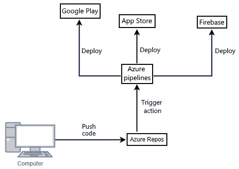

图 11.1 – 解决方案图

我们将为开发和生产环境中的 Flutter 创建三个流水线，如前图所示，因为移动应用程序需要在内部用户或客户环境（如 Google Firebase）中进行测试，然后再部署到 Google 和 Apple 商店的生产环境。解决方案图解如下步骤：

1.  开发人员在他们的机器上使用 Flutter 开发和测试移动应用程序，并将 Flutter 代码推送到 Azure Repos。

1.  在将 Flutter 代码上传到 Azure Repos 后，Azure Repos 将触发一个流水线来构建 Flutter 代码，并将 Flutter 应用程序部署到 Google Firebase。

1.  在使用 Google Firebase 测试 Flutter 应用程序后，开发人员将触发另一个流水线来构建 Flutter 代码，并将 Flutter 应用程序部署到 Google Play 商店。

1.  在 Google Play 商店上测试 Flutter 应用程序后，开发人员将触发另一个流水线来构建 Flutter 代码并将 Flutter 应用程序部署到 Apple Store Connect。

在构建我们的 Flutter 移动应用程序并将其部署到 Google 和 Apple 商店之前，我们需要生成并上传特定的安全文件。让我们接下来看看这些文件。

# 管理安全文件

在构建我们的 Flutter 移动应用程序并将其部署到 Google 和 Apple 商店之前，我们需要上传所有必需的文件，告诉 Google 和 Apple 商店你的身份，以便在接受移动应用程序之前检查你的开发者配置文件。要做到这一点，请转到**流水线** | **库** | **安全文件**部分，并上传以下安全文件以构建和部署 Flutter 应用程序：

+   根据提供的说明在[`developer.apple.com/help/account/create-certificates/create-developer-id-certificates`](https://developer.apple.com/help/account/create-certificates/create-developer-id-certificates)创建一个 Apple 证书文件 (`distribution.cer`)

+   根据[`developer.apple.com/help/account/manage-provisioning-profiles/create-an-app-store-provisioning-profile`](https://developer.apple.com/help/account/manage-provisioning-profiles/create-an-app-store-provisioning-profile)中的说明创建一个供应配置文件 (`Hello_Flutter_AppStore.mobileprovision`)

+   你可以从 Apple Store Connect 的[`appstoreconnect.apple.com/access/api`](https://appstoreconnect.apple.com/access/api)下载 API 密钥文件 (`AuthKey_XXXXXXX.p8`），如下截图所示：

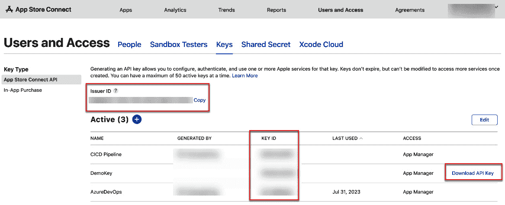

图 11.2 – 生成 API 密钥

上传这些文件后，你将看到类似以下的屏幕：

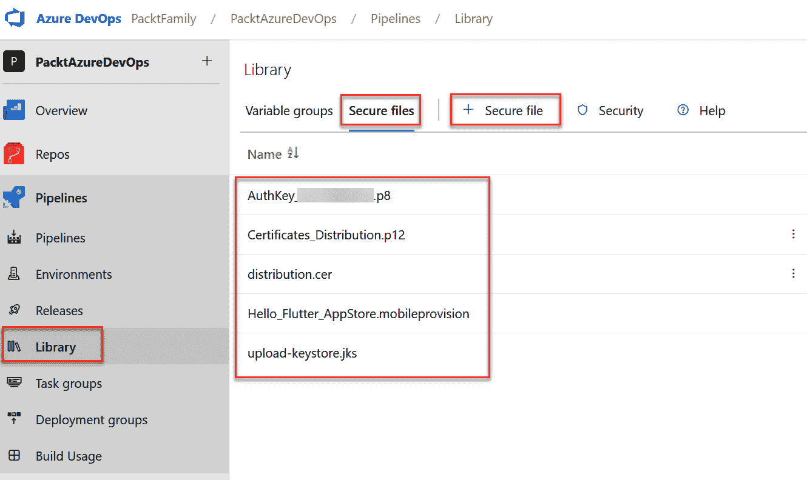

图 11.3 – 安全文件

以下步骤将向您展示如何为 Flutter 应用程序部署准备前述截图中显示的所有安全文件：

1.  `Certificates_Distribution.p12`）：对于 Mac，导航至 `distribution.cer`）以将其导出为另一种格式的文件，称为 `Certificates_Distribution.p12`。

1.  `upload-keystore.jks`）：运行以下命令以生成一个密钥库文件：

    ```
    keytool -genkey -v -keystore upload-keystore.jks -keyalg RSA -keysize 2048 -validity 10000 -alias upload
    ```

1.  使用 Azure DevOps 门户的 **Library** 选项创建一个秘密组：

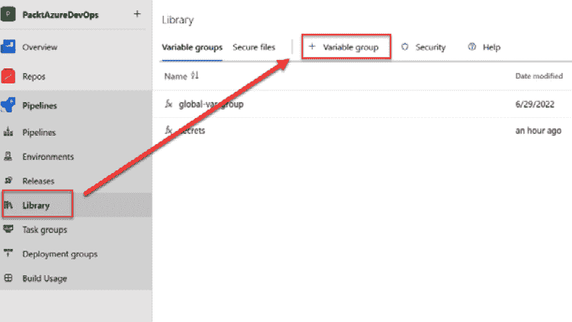

图 11.4 – 添加一个新的变量组

1.  为 Google Firebase、Google Play 控制台和 App Store 上的 Android 和 iOS 部署创建变量：

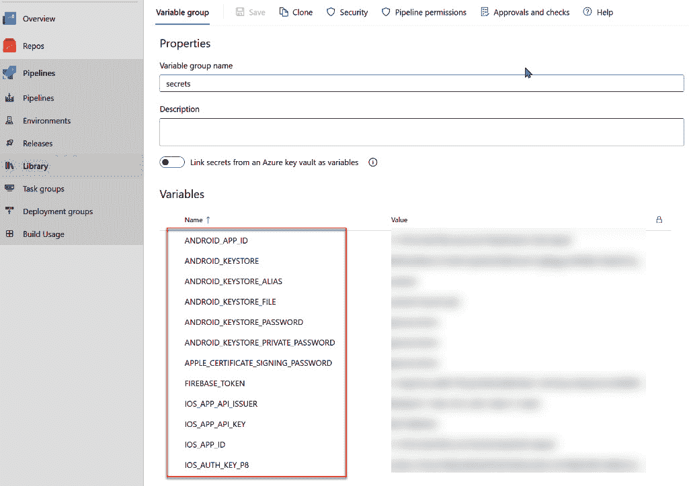

图 11.5 – 添加所有变量

让我们详细讨论一下这些变量：

+   **ANDROID_APP_ID**：导航到 Google Firebase 项目页面，您将找到 Android 项目的应用 ID：

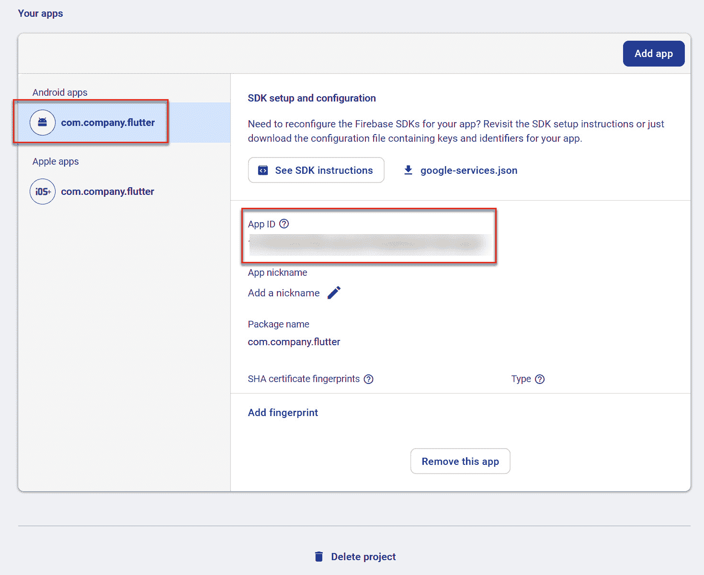

图 11.6 – Android 项目的应用 ID

+   `data.b64` 文件：

    ```
    keytool -genkey -v -keystore upload-keystore.jks -keyalg RSA -keysize 2048 -validity 10000 -alias upload
    upload.
    ```

+   `upload-keystore.jks`。这是一个**Java KeyStore**（**JKS**）文件，用于签署 Android 应用。

+   **ANDROID_KEYSTORE_PASSWORD**：在使用 *步骤 2* 中生成的密钥库文件时输入的密码。

+   **ANDROID_KEYSTORE_PRIVATE_PASSWORD**：使用密钥库文件时输入的密码。

+   **APPLE_CERTIFICATE_SIGNING_PASSWORD**：导出 P12 文件时的密码。

+   **FIREBASE_TOKEN**：运行以下命令以生成它，然后可以复制命令行结果中的 Firebase 令牌：

    ```
    .p8 extension:
    ```

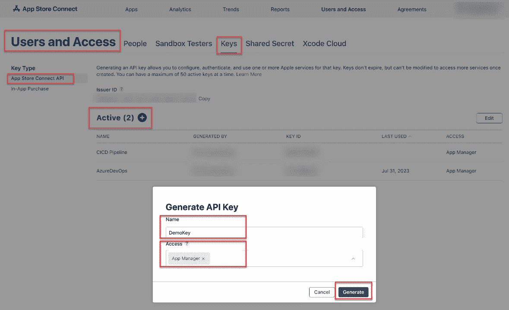

图 11.7 – 生成 API 密钥

1.  接下来，确定 Apple 应用部署所需的 **Issuer ID**、**KEY ID** 和 **API Key** 文件：

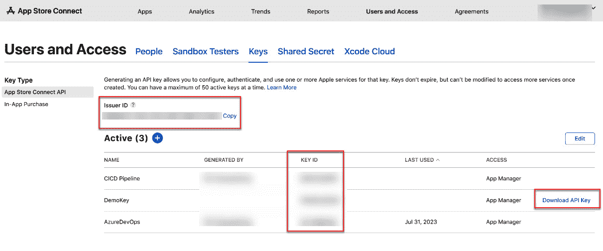

图 11.8 – 查找发行者 ID、密钥 ID 和 API KEY 文件

1.  运行以下命令将 `.p8` 文件转换为编码字符串，并将编码字符串的值复制到名为 **AUTH_KEY_P8** 的变量中：

    ```
    certutil -encode AuthKey_XXXX.p8 tmp.b64 && findstr /v /c:- tmp.b64 > data.b64
    ```

1.  对于 **IOS_APP_ID**，导航到 Google Firebase 项目页面，在您的 Apple 项目部分下可以找到 **App ID**：

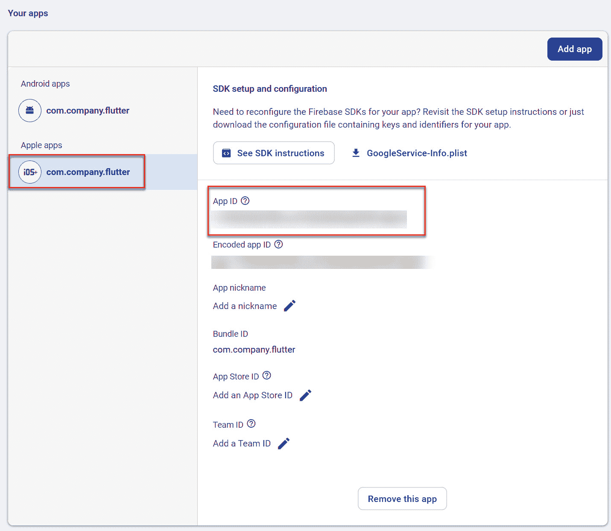

图 11.9 – Apple 项目的应用 ID

在准备好所有必需的变量和文件之后，您可以开始创建管道，以将 Flutter 应用构建并部署到 Google Firebase、Google Play 控制台和 App Store。然而，在学习如何实现之前，让我们先讨论一些用于将 Flutter 应用部署到 Google Firebase、Apple 环境和 Google Play 的关键任务。

# 在 Google Firebase、Apple 和 Google Play 控制台上部署 Flutter 应用所需的任务

这里是一些所需的关键任务：

+   **JavaToolInstaller@0** ([`learn.microsoft.com/en-us/azure/devops/pipelines/tasks/reference/java-tool-installer-v0?view=azure-pipelines`](https://learn.microsoft.com/en-us/azure/devops/pipelines/tasks/reference/java-tool-installer-v0?view=azure-pipelines)): 该包任务用于设置 Java 编译器。当你需要构建 Flutter 移动应用时，这是一个必需的包任务。

+   **Hey24sheep** ([`marketplace.visualstudio.com/items?itemName=Hey24sheep.flutter`](https://marketplace.visualstudio.com/items?itemName=Hey24sheep.flutter)): 该包任务用于设置 Flutter 编译器。当你需要构建 Flutter 移动应用时，这是一个必需的包任务。

+   **CopyFiles@2** ([`learn.microsoft.com/en-us/azure/devops/pipelines/tasks/reference/copy-files-v2?view=azure-pipelines&tabs=yaml`](https://learn.microsoft.com/en-us/azure/devops/pipelines/tasks/reference/copy-files-v2?view=azure-pipelines&tabs=yaml)): 该包任务用于运行命令以复制文件。

+   `工件`。

+   **Bash@3** ([`learn.microsoft.com/en-us/azure/devops/pipelines/tasks/reference/bash-v3?view=azure-pipelines`](https://learn.microsoft.com/en-us/azure/devops/pipelines/tasks/reference/bash-v3?view=azure-pipelines)): 该包任务用于在 Bash shell 脚本中运行命令。

+   **InstallAppleCertificate@2** ([`learn.microsoft.com/en-us/azure/devops/pipelines/tasks/reference/install-apple-certificate-v2?view=azure-pipelines`](https://learn.microsoft.com/en-us/azure/devops/pipelines/tasks/reference/install-apple-certificate-v2?view=azure-pipelines)): 该包任务用于安装 Apple 证书文件，这些文件用于验证 Flutter 应用程序，以便部署到 Apple Store Connect。

+   **InstallAppleProvisioningProfile@1** ([`learn.microsoft.com/en-us/azure/devops/pipelines/tasks/reference/install-apple-provisioning-profile-v1?view=azure-pipelines`](https://learn.microsoft.com/en-us/azure/devops/pipelines/tasks/reference/install-apple-provisioning-profile-v1?view=azure-pipelines)): 该包任务用于安装 Apple 配置文件文件，这个文件用于验证开发者，确保其开发的 Flutter 应用程序能够成功部署到 Apple Store Connect。

+   **AppStoreRelease@1** (https://marketplace.visualstudio.com/items?itemName=ms-vsclient.app-store#app-store-release): 该包任务用于将 Flutter 应用程序部署到 Apple Store Connect。

+   **AndroidSigning@3** ([`learn.microsoft.com/en-us/azure/devops/pipelines/tasks/reference/android-signing-v3?view=azure-pipelines`](https://learn.microsoft.com/en-us/azure/devops/pipelines/tasks/reference/android-signing-v3?view=azure-pipelines)): 该包任务用于在将 Android 包或 APK 文件部署到 Google Play 控制台之前进行签名。

+   **GooglePlayRelease@4** ([`marketplace.visualstudio.com/items?itemName=ms-vsclient.google-play`](https://marketplace.visualstudio.com/items?itemName=ms-vsclient.google-play))：此软件包任务用于将 Flutter 应用部署到 Google Play 控制台。

+   **DownloadSecureFile@1** ([`learn.microsoft.com/en-us/azure/devops/pipelines/tasks/reference/download-secure-file-v1?view=azure-pipelines`](https://learn.microsoft.com/en-us/azure/devops/pipelines/tasks/reference/download-secure-file-v1?view=azure-pipelines))：此软件包任务用于从 **Variable groups** 菜单的 **Secure files** 部分下载安全文件。在我们的例子中，它是一个签名文件，用于在将 Flutter 应用部署到 Google Play 控制台之前对其进行签名。

在下一节，你将学习如何为 Flutter 实现 Google Firebase。

# 为 Flutter 实现 Google Firebase

要在 **Android** 和 **iOS** 上将 Flutter 应用构建并部署到 Google Firebase，你需要使用上一节中讨论的任务。首先，我们将学习如何为 Android 创建一个构建和部署 Flutter 应用到 Google Firebase 的管道。

## 为 Android 创建 Google Firebase 管道

要创建 Android 管道，我们首先需要准备一个 Ubuntu 环境并安装 Flutter 编译器。之后，它会将你的代码构建成一个二进制文件并上传到 Google Firebase App Distribution。你可以按照以下步骤操作：

1.  创建一个名为 `azure-pipeline-for-firebase-android.yml` 的 Android 管道文件，并粘贴以下代码片段：

    +   YAML 文件的第一部分是为整个 Azure 管道准备所有变量。它还声明了构建该文件的操作系统，在此场景中为 Ubuntu：

        ```
        trigger: none
        pool:
          vmImage: "ubuntu-latest"
        variables:
          - group: secrets
          - name: androidReleaseDir
            value: $(build.artifactStagingDirectory)/flutter/hello_world/build/app/outputs/flutter-apk
          - name: apkFile
            value: $(androidReleaseDir)/app-release.apk
        ```

    +   这个任务是用于预先安装 Java 库，以构建你的代码：

        ```
        jobs:
          - job: android_deployment
            steps:
            - task: JavaToolInstaller@0
              inputs:
                versionSpec: '11'
                jdkArchitectureOption: 'x64'
                jdkSourceOption: 'PreInstalled'
        ```

    +   这个任务是用于预先安装 Flutter 编译器，以构建你的代码：

        ```
        - task: Hey24sheep.flutter.flutter-install.FlutterInstall@0
              displayName: 'Flutter Install'
              inputs:
                version: custom
                customVersion: 3.10.6
        ```

    +   这个任务是用于构建你的代码并创建 APK 文件：

        ```
        - task: Hey24sheep.flutter.flutter-build.FlutterBuild@0
              displayName: "Build APK"
              inputs:
                target: apk
                projectDirectory: "./flutter/hello_world"
                buildNumber: ""
        ```

    +   这个任务是用于签名 APK 文件，以允许 Android 手机启动你的应用：

        ```
        - task: AndroidSigning@3
              displayName: "Signing and aligning APK file(s) **/*.apk"
              inputs:
                apkFiles: "**/*.apk"
                apksign: true
                apksignerKeystoreFile: "upload-keystore.jks"
                apksignerKeystorePassword: "$(ANDROID_KEYSTORE_PRIVATE_PASSWORD)"
                apksignerKeystoreAlias: "$(ANDROID_KEYSTORE_ALIAS)"
                apksignerKeyPassword: "$(ANDROID_KEYSTORE_PASSWORD)"
        ```

    +   这个任务是将已签名的 APK 文件复制到制品目录，在上传到 Azure Pipelines 存储之前：

        ```
        - task: CopyFiles@2
              displayName: "Copy apk to artifact directory"
              inputs:
                contents: "**/*.apk"
                targetFolder: "$(build.artifactStagingDirectory)"
        ```

    +   这个任务是用于将已签名的 APK 文件发布到 Azure Pipelines 存储：

        ```
        - task: PublishBuildArtifacts@1
              displayName: "Publish signed apk as artifact"
              inputs:
                artifactName: "drop"
        ```

    +   这个任务是将已签名的 APK 文件从 Azure Pipelines 存储上传到 Google Firebase App Distribution，并让所有用户下载进行测试：

        ```
        - task: Bash@3
              displayName: "Upload to firebase app distribution"
              inputs:
                targetType: "inline"
                script: |
                  npm i -g firebase-tools
                  ls -la $(androidReleaseDir)
                  firebase appdistribution:distribute "$(apkFile)" \
                    --app "$(ANDROID_APP_ID)" \
                    --release-notes "Build Android From Azure Pipeline" \
                    --groups "beta-testers" \
                    --token "$(FIREBASE_TOKEN)"
        ```

1.  对于 Android，当管道构建成功时，你可以在 Google Firebase 的 **App Distribution** 部分看到结果：

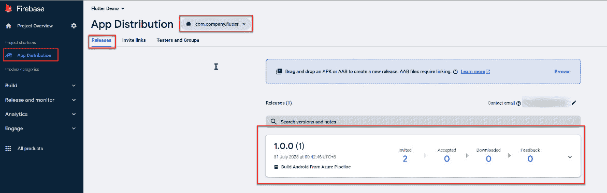

图 11.10 – Android 项目的应用分发

在下一节，我们将学习如何在 iOS 上完成此操作。

## 为 iOS 创建 Google Firebase 管道

要创建一个 iOS 管道，我们首先准备一个 macOS 环境并安装 Flutter 编译器。之后，它将把你的代码构建成二进制文件并上传到 Google Firebase 分发：

1.  创建一个名为 `azure-pipeline-for-firebase-ios.yml` 的管道文件，并粘贴以下代码片段：

    +   YAML 文件的第一部分用于准备将在整个 Azure 管道中使用的所有变量。它还声明了用于构建此文件的操作系统，即最新版本的 macOS：

        ```
        trigger: none
        pool:
          vmImage: "macos-latest"
        variables:
          - group: secrets
          - name: iosReleaseDir
            value: $(Build.SourcesDirectory)/flutter/hello_world/build/ios/ipa
          - name: ipaFile
            value: $(iosReleaseDir)/hello_world.ipa
          - name: rootPath
            value: $(System.DefaultWorkingDirectory)/flutter/hello_world
        ```

    +   该任务用于预安装用于构建代码的 Java 库：

        ```
        jobs:
          - job: ios_deployment
            steps:
            - task: JavaToolInstaller@0
              inputs:
                versionSpec: '11'
                jdkArchitectureOption: 'x64'
                jdkSourceOption: 'PreInstalled'
        ```

    +   该任务用于安装构建 iOS 应用程序所需的 Apple 证书：

        ```
        - task: InstallAppleCertificate@2
              displayName: "Install Apple cert dist p12"
              inputs:
                certSecureFile: "Certificates_Distribution.p12"
                certPwd: "$(APPLE_CERTIFICATE_SIGNING_PASSWORD)"
                keychain: "temp"
        ```

    +   该任务用于安装 Apple 配置文件，这对于构建 iOS 应用程序是必需的：

        ```
            - task: InstallAppleProvisioningProfile@1
              displayName: "Install Apple Mobile Provisioning Profile"
              inputs:
                provisioningProfileLocation: "secureFiles"
                provProfileSecureFile: "Hello_Flutter_AppStore.mobileprovision"
        ```

    +   该任务用于安装 Flutter 编译器以构建你的代码：

        ```
        - task: Hey24sheep.flutter.flutter-install.FlutterInstall@0
              displayName: 'Flutter Install'
              inputs:
                version: custom
                customVersion: 3.10.6
        ```

    +   该任务用于构建你的代码并创建 **iOS 应用商店包** (**IPA**) 文件：

        ```
            - task: Bash@3
              displayName: "Build IPA"
              inputs:
                targetType: "inline"
                script: |
                  flutter build ipa --export-options-plist=$(rootPath)/ios/Runner/ExportOptions.plist
                workingDirectory: $(rootPath)
        ```

    +   该任务用于将 IPA 文件上传到 Google Firebase 应用分发：

        ```
        - task: Bash@3
              displayName: "Upload to firebase app distribution"
              inputs:
                targetType: "inline"
                script: |
                  npm i -g firebase-tools
                  ls -la $(iosReleaseDir)
                  firebase appdistribution:distribute "$(ipaFile)" \
                    --app "$(IOS_APP_ID)" \
                    --release-notes "Build iOS From Azure Pipeline" \
                    --groups "beta-testers" \
                    --token "$(FIREBASE_TOKEN)"
        ```

1.  类似于 Android，当管道构建成功时，你可以在 Google Firebase 的 **App Distribution** 部分看到结果：

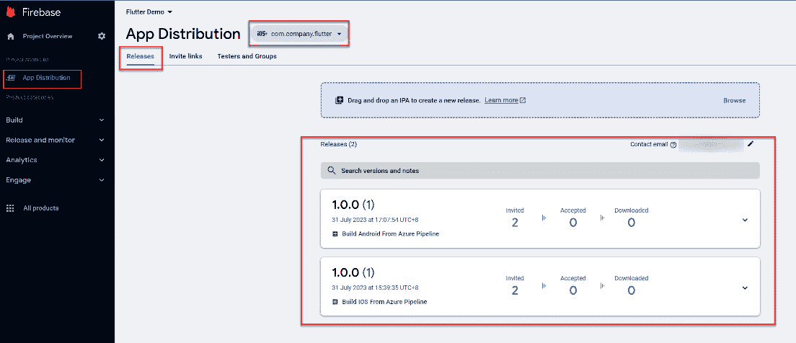

图 11.11 – Apple 项目的应用分发

本节讨论了如何在 Google Firebase 上构建和部署 Flutter 应用程序，以便在将其部署到 Google Play 控制台或应用商店之前进行测试。接下来，我们将讨论如何在 Apple Store Connect 上创建和部署 Flutter 应用程序。

# 为 Flutter 实现 Apple 环境

要在 Apple Store Connect 上构建和部署 Flutter 应用程序，你需要使用 Azure 管道中的各种任务，正如本章前面讨论的那样。为了减少移动应用程序部署过程所需的时间，有必要构建 Apple Store 部署管道。为此，你可以按照以下步骤操作：

1.  创建一个名为 `azure-pipeline-for-apple-store.yml` 的管道文件，并粘贴以下代码片段：

    +   YAML 文件的第一部分用于准备将在整个 Azure 管道中使用的所有变量。它还声明了用于构建此文件的操作系统，即最新版本的 macOS：

        ```
        trigger: none
        pool:
          vmImage: "macos-latest"
        variables:
          - group: secrets
          - name: iosReleaseDir
            value: $(Build.SourcesDirectory)/flutter/hello_world/build/ios/ipa
          - name: ipaFile
            value: $(iosReleaseDir)/hello_world.ipa
          - name: rootPath
            value: $(System.DefaultWorkingDirectory)/flutter/hello_world
        ```

    +   该任务用于预安装用于构建代码的 Java 库：

        ```
        jobs:
          - job: ios_to_apple_store
            steps:
            - task: JavaToolInstaller@0
              inputs:
                versionSpec: '11'
                jdkArchitectureOption: 'x64'
                jdkSourceOption: 'PreInstalled'
        ```

    +   该任务用于安装构建 iOS 应用程序所需的 Apple 证书：

        ```
            - task: InstallAppleCertificate@2
              displayName: "Install Apple cert dist p12"
              inputs:
                certSecureFile: "Certificates_Distribution.p12"
                certPwd: "$(APPLE_CERTIFICATE_SIGNING_PASSWORD)"
                keychain: "temp"
        ```

    +   该任务用于安装 Apple 配置文件，这对于构建 iOS 应用程序是必需的：

        ```
            - task: InstallAppleProvisioningProfile@1
              displayName: "Install Apple Mobile Provisioning Profile"
              inputs:
                provisioningProfileLocation: "secureFiles"
                provProfileSecureFile: "Hello_Flutter_AppStore.mobileprovision"
        ```

    +   该任务用于安装 Flutter 编译器以构建你的代码：

        ```
            - task: Hey24sheep.flutter.flutter-install.FlutterInstall@0
              displayName: 'Flutter Install'
              inputs:
                version: custom
                customVersion: 3.10.6
        ```

    +   该任务用于构建你的代码并创建一个 IPA 文件：

        ```
        - task: Bash@3
              displayName: "Build IPA"
              inputs:
                targetType: "inline"
                script: |
                  flutter build ipa --export-options-plist=$(rootPath)/ios/Runner/ExportOptions.plist
                workingDirectory: $(rootPath)
        ```

    +   该任务用于将签名的 IPA 文件上传到 Apple Store Connect：

        ```
        - task: AppStoreRelease@1
              displayName: "Upload to App Store Connect"
              inputs:
                authType: 'ApiKey'
                apiKeyId: '$(IOS_APP_API_KEY)'
                apiKeyIssuerId: '$(IOS_APP_API_ISSUER)'
                apiToken: '$(IOS_AUTH_KEY_P8)'
                releaseTrack: 'TestFlight'
                appIdentifier: 'com.company.flutter'
                appType: 'iOS'
                ipaPath: $(ipaFile)
                shouldSkipWaitingForProcessing: true
                shouldSkipSubmission: true
                appSpecificId: '$(IOS_APP_ID)'
        ```

1.  当管道构建成功时，你可以在 **App Store Connect** | **TestFlight** 标签页中看到结果：

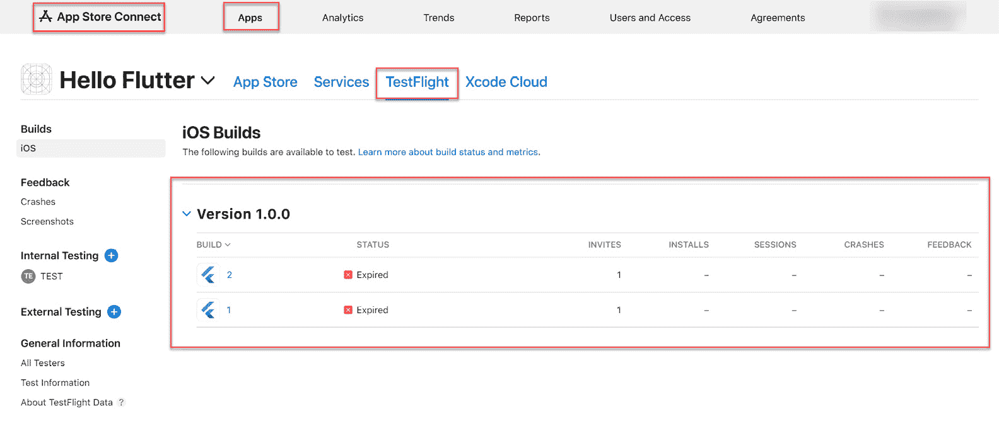

图 11.12 – App Store Connect 上的 TestFlight

在本节中，你学习了如何创建一个管道，以便在 Apple Store Connect 上构建和部署 Flutter 应用程序。在下一节中，你将学习如何在 Google Play 控制台上构建和部署 Flutter 应用程序。

# 为 Flutter 实现 Google Play 控制台

当你需要将应用程序上传到 Google Play 商店时，你可以创建一个 Azure 管道。Google Play 商店是一个 Android 应用程序市场，允许所有 Android 用户下载应用。按照以下步骤操作：

1.  创建一个名为`azure-pipeline-for-google-play-store.yml`的管道文件，并粘贴以下代码片段：

    +   YAML 文件的第一部分用于准备将在整个 Azure 管道中使用的所有变量。它还声明了用于构建该文件的操作系统，即 Ubuntu：

        ```
        trigger: none
        pool:
          vmImage: "ubuntu-latest"
        variables:
          - group: secrets
          - name: androidReleaseDir
            value: $(build.artifactStagingDirectory)/flutter/hello_world/build/app/outputs/bundle/release
          - name: aabFile
            value: $(androidReleaseDir)/app-release.aab
        ```

    +   这个任务是下载 keystore 文件，这是签署**Android 应用包**（**AAB**）文件所必需的，签署完成后可以将其上传到 Google Play 控制台：

        ```
        jobs:
          - job: android_to_google_play_store
            steps:
            - task: DownloadSecureFile@1
              displayName: "Download keystore file"
              name: "KeyStoreFile"
              inputs:
                secureFile: "upload-keystore.jks"
        ```

    +   这个任务是预先安装用于构建代码的 Java 库：

        ```
            - task: JavaToolInstaller@0
              inputs:
                versionSpec: '11'
                jdkArchitectureOption: 'x64'
                jdkSourceOption: 'PreInstalled'
        ```

    +   这个任务是安装 Flutter 编译器以构建你的代码：

        ```
            - task: Hey24sheep.flutter.flutter-install.FlutterInstall@0
              displayName: 'Flutter Install'
              inputs:
                version: custom
                customVersion: 3.10.6
        ```

    +   这个任务是用于在 AAB 文件中构建 Flutter 代码：

        ```
            - task: Hey24sheep.flutter.flutter-build.FlutterBuild@0
              displayName: "Build AAB"
              inputs:
                target: aab
                projectDirectory: "./flutter/hello_world"
                buildNumber: ""
        ```

    +   这个任务是将 AAB 文件从源文件夹复制到构建产物文件夹：

        ```
            - task: CopyFiles@2
              displayName: "Copy aab to artifact directory"
              inputs:
                contents: "**/*.aab"
                targetFolder: "$(build.artifactStagingDirectory)"
        ```

    +   这个任务是将已签名的 AAB 文件移到 Azure Pipelines 存储：

        ```
            - task: PublishBuildArtifacts@1
              displayName: "Publish signed AAB as artifact"
              inputs:
                artifactName: "drop"
        ```

    +   这个任务是将 AAB 文件上传到 Google Play 商店：

        ```
            - task: GooglePlayRelease@4
              displayName: "Upload to Google Play Store"
              inputs:
                serviceConnection: 'GooglePlayConsole'
                applicationId: 'com.company.flutter'
                action: 'SingleBundle'
                bundleFile: '$(aabFile)'
                track: 'internal'
                isDraftRelease: true
        ```

1.  当管道构建成功时，你可以在 Google Play 控制台查看结果：

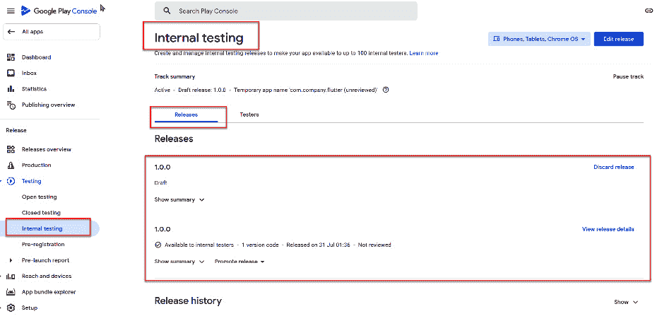

图 11.13 – 在 Google Play 控制台上的内部测试

在本节中，你学习了如何创建一个管道，使用 Google Play 控制台的内部测试来构建和部署 Flutter 应用程序。这将帮助你在完成管道设置后专注于应用程序开发。

# 解决常见挑战

在 Flutter 开发过程中，你可能会遇到一些常见问题，如果遵循一些最佳实践，这些问题是可以避免的。让我们讨论其中的一些：

+   `pubspec.yaml`：此文件包含你在 Flutter 开发中使用的依赖项的名称，例如数据库依赖项。

+   `pubspec.lock`：此文件包含你在 Flutter 开发中使用的依赖项的名称和版本。

确保你将`pubspec.lock`提交到 Azure Repos，因为如果你错过这一步，你会遇到错误。原因是你将获得一个新的`pubspec.lock`文件，其中包含与你在本地开发 Flutter 应用时所使用的依赖项版本不同的版本。

+   **处理平台特定代码**：Flutter 允许你编写平台特定的代码，但在 CI/CD 管道中管理这些代码可能会很棘手，特别是当你的应用程序具有自定义的特定平台模块或依赖项时。

    在 Azure Pipelines 中使用独立任务来处理特定平台的构建。例如，你可能会为 iOS 和 Android 构建设置不同的阶段或任务。确保每个平台所需的 SDK 和工具已经在你的 Azure Pipelines 环境中安装和配置好。

现在你已经为 Flutter 开发做好了充分准备，让我们总结一下这一章的内容。

# 总结

本章教你如何为 Flutter 应用程序创建构建管道。内容包括 Google Firebase 的管道——无论是 Android 还是 Apple。还涉及了 Apple Store Connect 和 Google Play Console 部署的管道。这将有助于减少开发人员在构建和部署 Flutter 应用程序时所需的手动命令时间。同时，这也帮助开发人员更专注于开发移动应用程序，因为你只需创建一次管道，让 Azure 管道自动构建你的代码并将应用程序部署到 Google Firebase、Apple Store Connect 和 Google Play Store。这将提升开发人员的生产力。

在上一章中，我们将学习在使用 Azure Pipelines 时需要避免的一些常见陷阱，并讨论该技术的潜在未来应用和趋势。
