# 第十二章：探索 Azure Pipelines 中的常见陷阱和未来趋势

在上一章中，我们学习了如何为移动应用程序创建管道。本章将教你如何避免常见错误，更重要的是，如何高效地高层次地解决和绕过这些错误。

我们还将讨论最佳实践，提供有关优化工作流以实现最大效率和可靠性的见解。这将帮助确保你的管道以其最大潜力运行。

最后，我们将探讨 Azure Pipelines 的未来。通过本章的学习，你将了解如何避免使用 Azure Pipelines 时的常见陷阱，如何通过最佳实践优化工作流，以及如何适应这个至关重要工具不断发展的未来。

本章将涵盖以下主题：

+   常见陷阱

+   最佳实践

+   未来趋势

# 常见陷阱

理解并主动解决 Azure Pipelines 中某些常见错误和问题是至关重要的。通过学习如何快速识别和解决这些问题，你可以节省宝贵的时间和资源。

在实际项目中，及时解决问题至关重要，以防止延误和昂贵的挫折，从而保持项目的进度，并将精力集中在其他关键方面。

让我们讨论一下这些常见错误的详细情况：

+   有时候，你可能会启动一个管道运行并看到它被排队。这可能是因为在 Microsoft 托管的代理或自托管的代理上没有可用的代理、并发性不足或代理需求未满足。你可以在看到管道中作业的状态后立即看到错误，如下图所示：

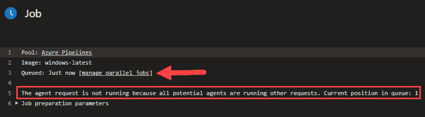

图 12.1 – 由于代理不可用而排队的作业

这可能表明必须购买额外的并行作业，以确保这些作业不被排队，如果你希望这些管道尽可能快地运行。

+   一个管道可能无法运行，因为你在 YAML 文件中输入了错误的分支进行过滤，或者禁用了触发器。你需要回到 YAML 文件中，检查 **branch** 部分下的值，以确保它们是正确的。

+   如果由于变量组或机密文件的访问权限问题，管道无法运行。为了解决此问题，请导航到 **Library** | **secrets** | **Variable group** | **Pipeline permissions**：

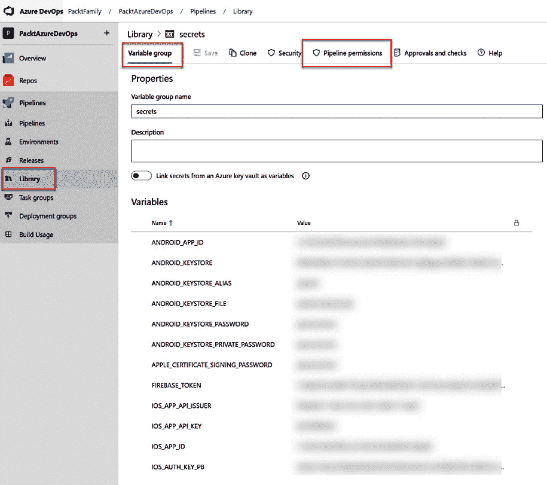

图 12.2 – 转到管道权限

然后，你可以执行以下操作之一：

+   为所有管道打开所有访问权限。此选项将允许所有管道访问变量组中的机密。如果所有管道都需要使用相同的机密，则应选择此选项：

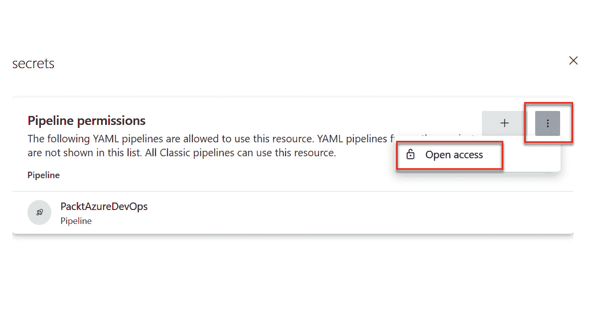

图 12.3 – 授予变量组开放访问权限

+   限制对选定管道的访问（推荐）：

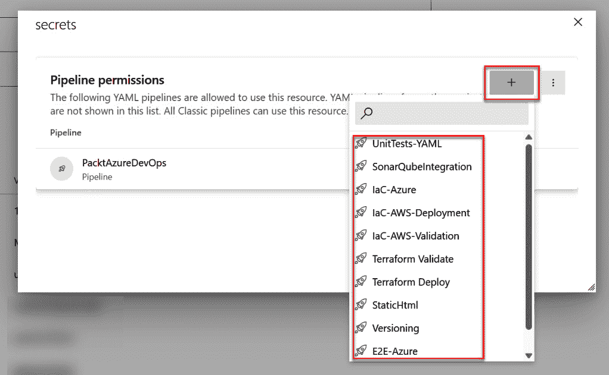

图 12.4 – 限制对变量组的权限，仅允许选定的管道访问

此选项将限制仅允许所需的管道访问秘密，因为否则，任何人都可以访问你的管道并使用你的秘密。

在本节中，你学到了如何避免常见错误，以及如何缓解这些错误。在下一节中，你将学到更多关于遵循最佳实践的内容。

# 最佳实践

遵循最佳实践的重要性在你遇到管道生命周期中的问题时会变得显而易见。它们不仅能帮助你的团队轻松维护管道，还能迅速识别并解决可能出现的任何问题。

以下是一些有助于团队轻松发现问题的实践：

+   使用 YAML 语法，而不是经典版本。YAML 可以在如 Azure Repos、GitHub 和 Bitbucket 等仓库中进行版本控制，这有助于跟踪 YAML 文件的更改，并在结合分支策略时逐步引入更改。更好的是，如果你想强制执行这一点，可以在组织或项目设置级别禁用创建经典构建管道。

+   当有许多任务在各个阶段重复时，将常见任务分离到单独的 YAML 文件中，并在主模板中引用这些文件。这样可以更轻松地维护或更改大规模多阶段配置中的管道行为。

+   如果你有长时间运行的作业，考虑创建更多的阶段。

+   保持管道简洁且聚焦，使用模板、阶段、作业和步骤。

+   构建大型和复杂应用程序的阶段可能需要更多的资源，以便更快地编译和打包。微软托管的代理运行在通用虚拟机上，Linux 和 Windows 系统的配置为双核 CPU、7 GB 内存和 14 GB SSD，macOS 系统为三核 CPU、14 GB 内存和 14 GB SSD。如果你需要提高构建性能，应该考虑使用自托管代理，这些代理运行在资源更多的虚拟机上。

+   考虑使用支持增量编译的编程语言。可以利用部分增量构建的应用程序项目只能托管在自托管代理中，从而确保每次构建后不会丢弃文件系统资源。

+   使用变量组来减少重复，当多个管道使用相同的值时。这使得你的管道更易于维护。

+   使用秘密值来处理私密值或密钥。导航至 **库** | **秘密** | **变量组**，点击锁定图标限制对变量的访问，如下截图所示：

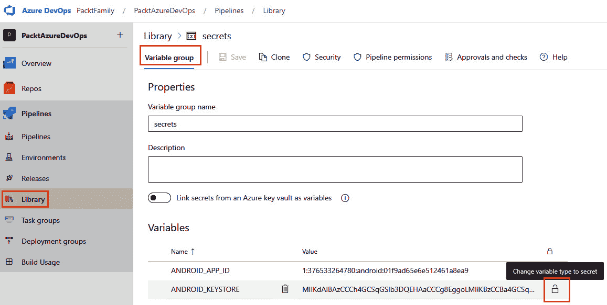

图 12.5 – 创建秘密变量

+   如果你有来自 Azure **密钥保管库**（**KV**）的变量，Azure 的 **密钥管理服务**（**KMS**）将加密并安全存储密钥。它会确保所有变量都是安全的。一旦完成，未经你允许，任何人都无法读取你的密钥。建议将所有来自 KV 的变量链接到变量组，如下所示：

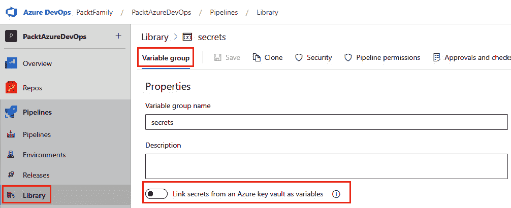

图 12.6 – 从 Azure KV 链接机密

+   考虑使用**最小权限原则**，这是一个安全概念，要求只授予用户执行工作所需的最少访问权限。该原则用于限制用户的访问权限，只允许他们进行完成工作所必需的操作，最小化恶意活动或意外损坏的风险，减少使用错误管道的风险。

+   若要调查失败管道的问题，你可以直接从管道中下载日志。只需按照以下步骤操作即可：

    1.  选择你需要下载日志的管道。

    1.  点击三个点的图标，然后**下载日志**：

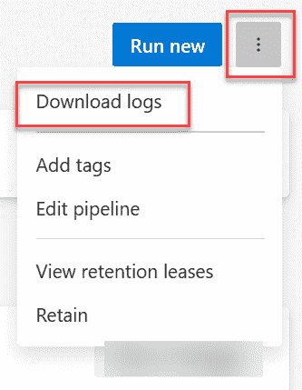

图 12.7 – 下载管道日志

+   如果你使用 `PublishBuildArtifacts@1`，并且需要检查工件，你可以直接从管道中下载工件，方法是按照以下步骤操作：

    1.  选择一个管道，并点击**相关**列中的值，**#** **已发布**：

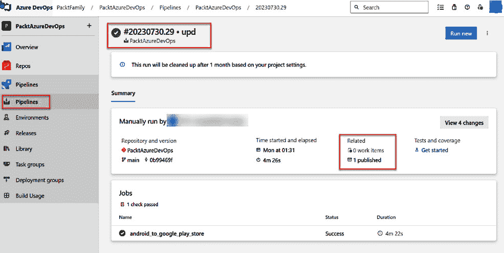

图 12.8 – 管道工件

1.  点击文件下载它：

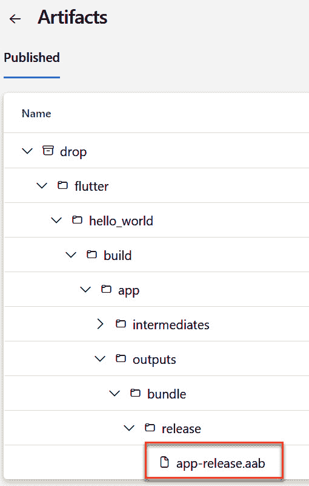

图 12.9 – 从工件下载文件

+   为了优化成本，你可以调整 **工件** 的保留策略，以减少存储大小：

    1.  转到**项目设置** | **设置**。

    1.  根据你的业务目标调整保留策略的参数。例如，如果你的业务计划要求仅保留 Azure 管道结果五天，以实现存储的成本优化，那么遵循此时间框架是非常必要的。保持数据的时间过长将导致额外的存储成本：

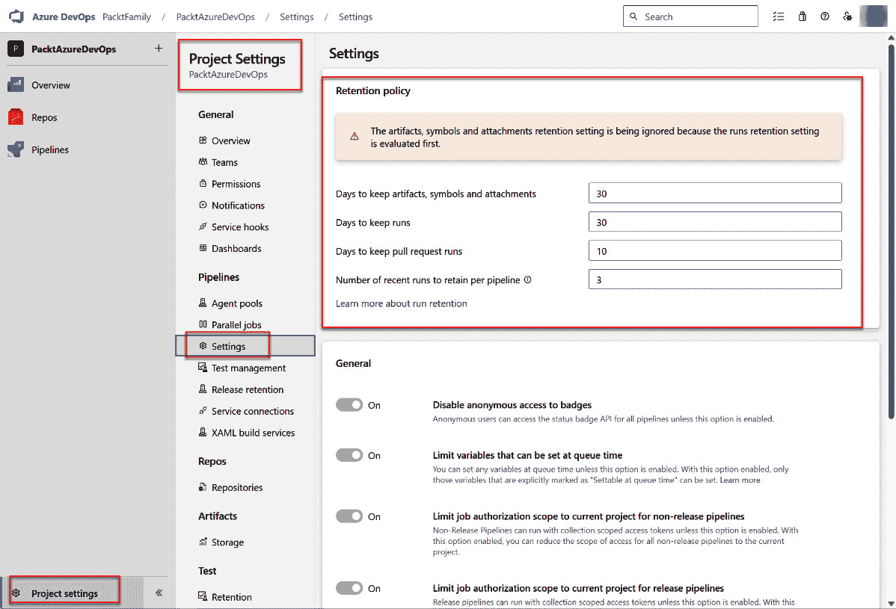

图 12.10 – 保留策略

+   考虑验证你有多少个并行作业。这将帮助你更好地了解你可以在管道的并行模式下运行多少个进程：

    1.  转到**项目设置** | **并行作业**。

    1.  你可以查看你所有代理的概览：

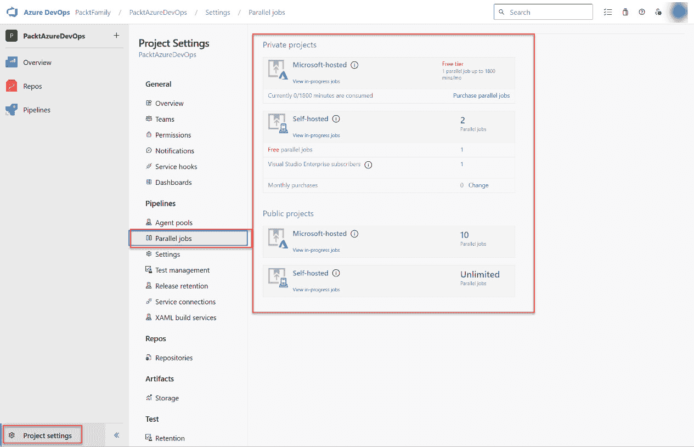

图 12.11 – 并行作业

在本节中，你学习了如何基于最佳实践优化 Azure 管道。在本章的最后一节中，你将了解更多关于 Azure 管道的未来发展。

# 未来趋势

Azure DevOps 是一个不断发展的产品，因此经常会推出新功能和新能力，通常是因为微软产品团队希望改进产品，或者是因为用户的需求。

让我们来看看与 Azure Pipelines 相关的一些最新功能：

+   改进 Azure Pipelines 任务的创作体验，以支持更新版本的 Node.js，并简化向新版本过渡的过程，使您和其他社区贡献者能够创建自己的扩展。

+   GitHub Advanced Security for Azure DevOps 是一套新的安全工具，旨在提升**DevSecOps**实践。其功能之一是能够扫描您的代码，以防止常见的漏洞场景，使用专门的任务来检测跨站脚本、SQL 或 XML 注入攻击等常见问题，这些问题开发者往往容易忽视。这些功能支持多种编程语言，并将不断发展，以在未来提供更多支持。

什么是 DevSecOps？

DevSecOps 是将 DevOps 和安全实践全面集成到软件开发生命周期中的一种方式，它促使团队紧密合作，将安全性融入开发过程的各个方面。这可以尽早减少和消除与代码和第三方依赖中的漏洞相关的风险。

+   缩小 YAML 管道与经典发布管理部署管道之间在 CD 场景中的功能差距。为改善检查功能，明年将发布几个新功能。

展望未来，还有其他功能将在您扩展 Azure Pipelines 使用时变得重要：

+   产品内推荐，强调在配置管道时围绕安全性的最佳实践

+   停用和移除不再支持的 Node.js 版本，这些版本包含在 Microsoft 托管和自托管版本的代理软件中

Azure DevOps 功能路线图可以在[`learn.microsoft.com/en-us/azure/devops/release-notes/features-timeline`](https://learn.microsoft.com/en-us/azure/devops/release-notes/features-timeline)查看，您可以在这里看到所有正在进行或计划在近期和长期发布的产品功能。如果某个功能正在开发中并计划发布，您将看到该功能的预计发布日期，包含其在云服务或产品服务器版中的可用性。您可以通过门户网站提出建议，从而影响产品的未来，正如下图所示：

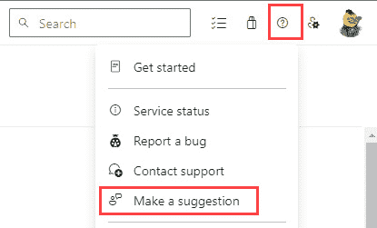

图 12.12 – 提出改进 Azure DevOps 的建议

现在我们已经看了一些 Azure Pipelines 的未来趋势，让我们总结一下。

# 总结

本章是你旅程中的一个关键步骤，使你能够自信并熟练地使用 Azure Pipelines。你现在更能识别并应对常见的陷阱和挑战，从而节省宝贵的资源并保持流畅的工作流程。

遵循最佳实践将帮助优化管道的功能，并增强团队协作，确保管道操作的高效性和可靠性。我们还展示了 Azure Pipelines 的未来发展，帮助你适应并在这个动态领域保持领先。

拥有本书中所获得的知识，你现在可以高效且精准地在 Azure Pipelines 环境中操作，将应用部署到不同的场景和需求中。

祝你在旅程中好运！
