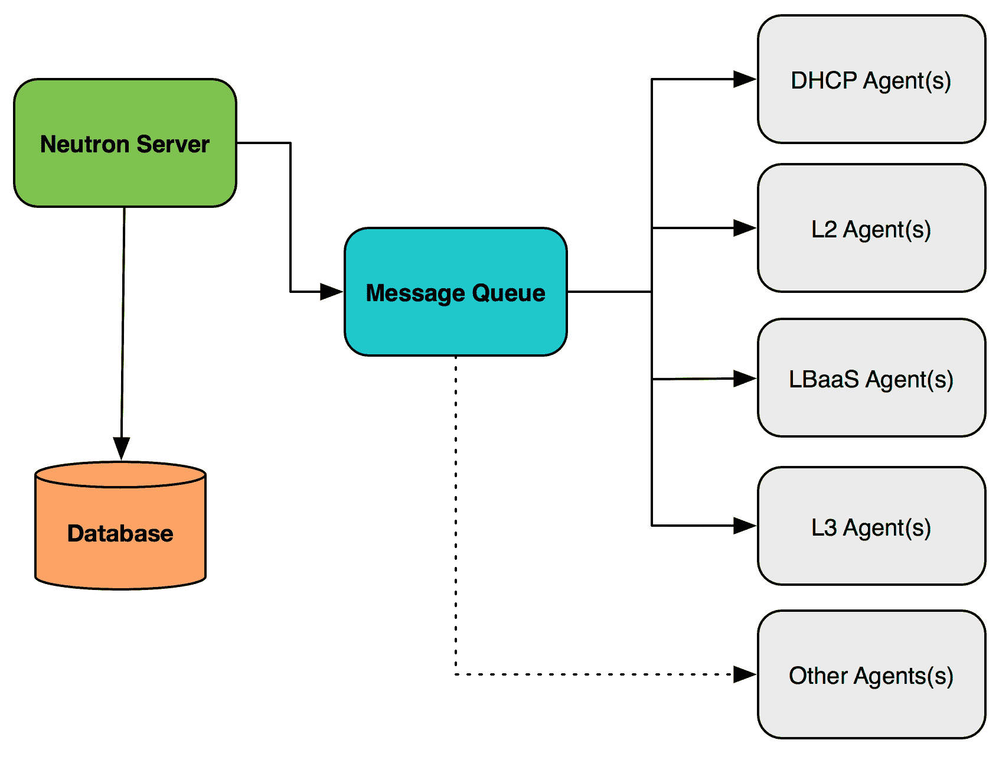
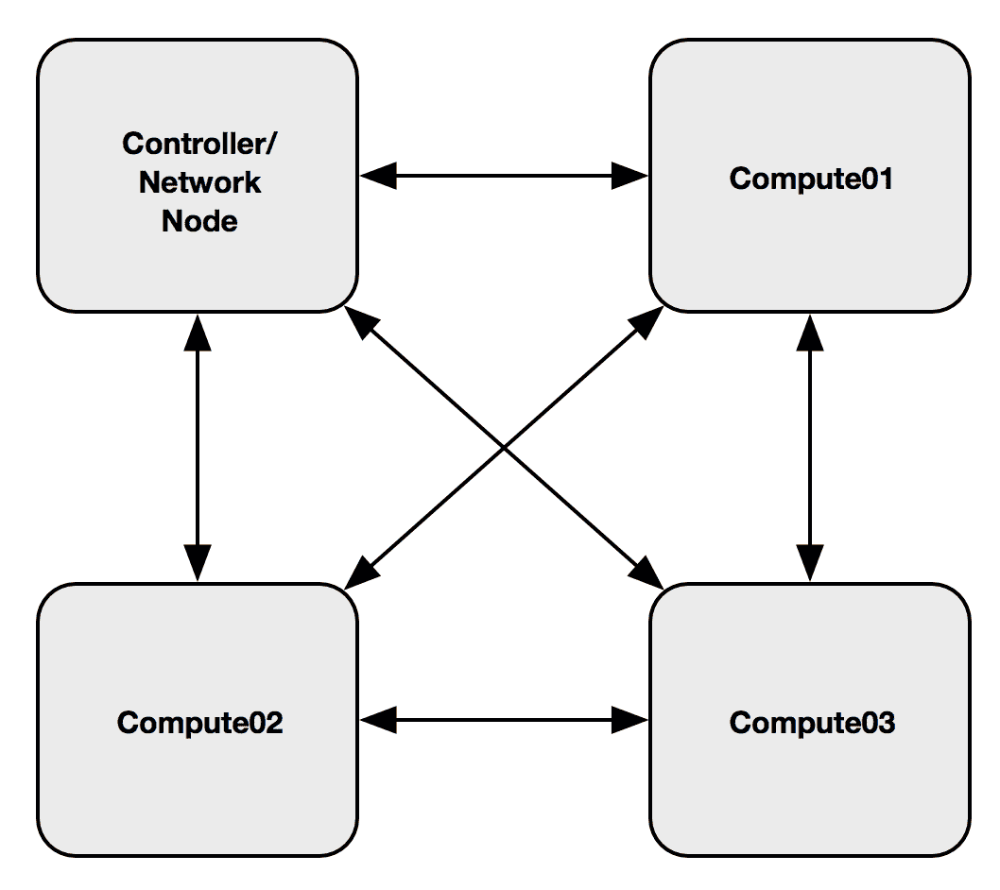
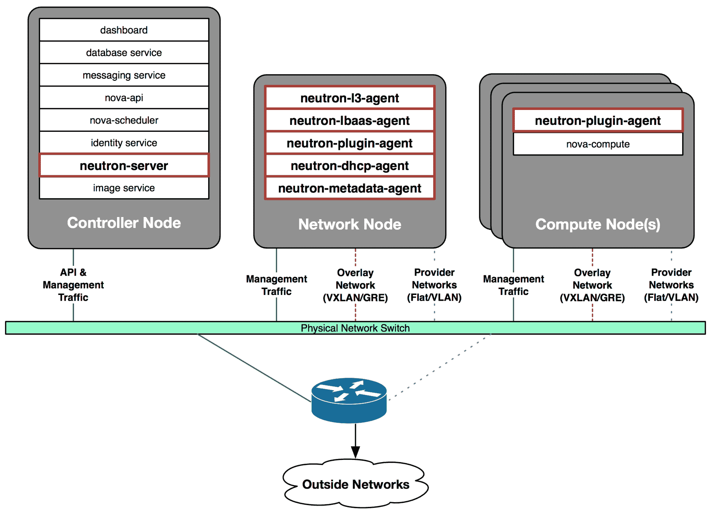
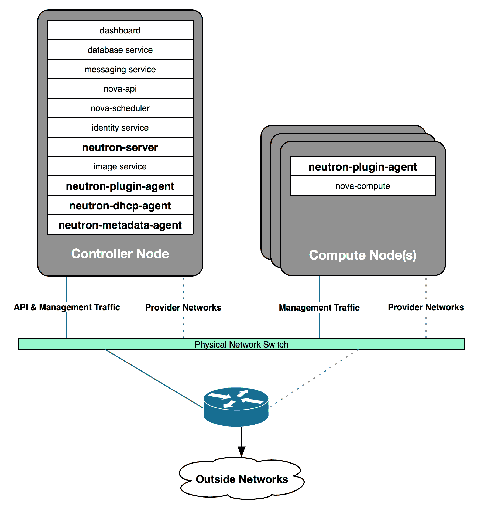
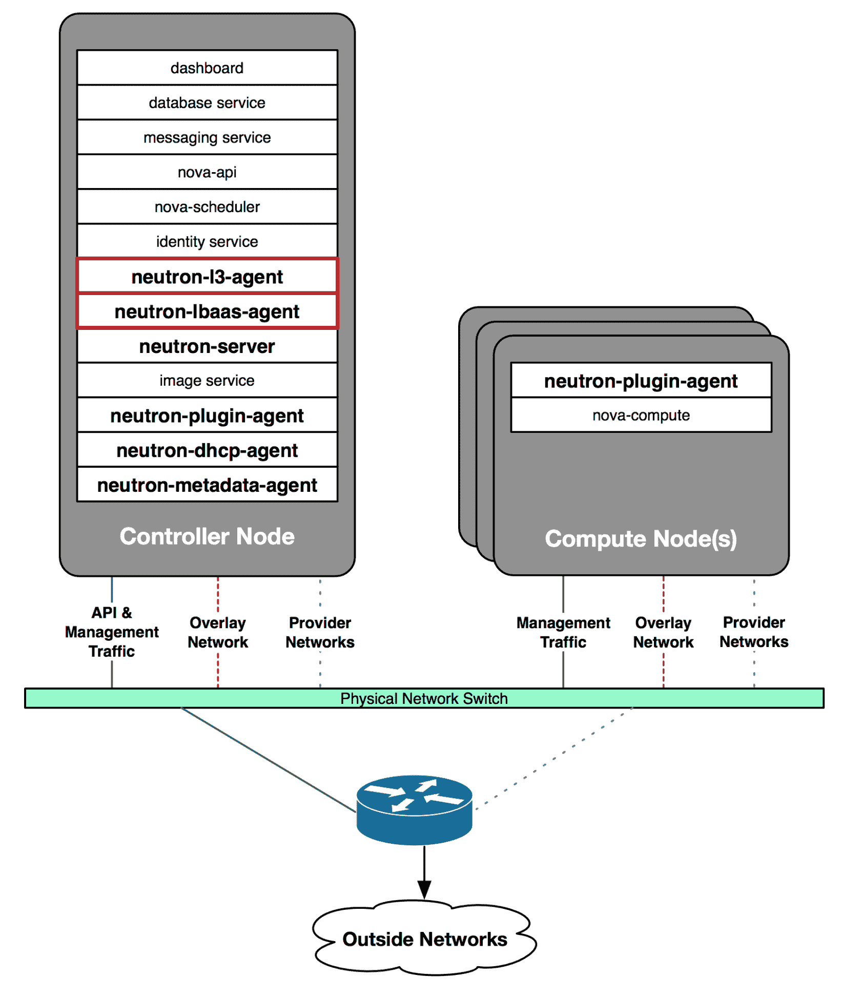

# OpenStack 网络简介

在今天的数据中心，网络由比以往更多的设备组成。服务器、交换机、路由器、存储系统和安全设备，这些曾经占据数据中心大片空间的设备现在作为虚拟机和虚拟网络设备存在。这些设备给传统的网络管理系统带来了巨大压力，因为它们无法提供可扩展和自动化的方法来管理下一代网络。用户现在期望更高的基础设施控制和灵活性，快速的资源配置，而这些正是 OpenStack 所承诺提供的。

本章将介绍 OpenStack 网络提供的许多功能，以及 OpenStack 支持的各种网络架构。涵盖的主题包括以下内容：

+   OpenStack 网络功能

+   物理基础设施要求

+   服务分离

# 什么是 OpenStack 网络？

OpenStack 网络是一个可插拔、可扩展的、基于 API 的系统，用于管理 OpenStack 基础云中的网络。与其他核心 OpenStack 组件一样，OpenStack 网络可以供管理员和用户使用，以增加现有数据中心资源的价值并最大化利用。

Neutron，作为 OpenStack 网络服务的项目名称，补充了其他核心 OpenStack 服务，如计算（Nova）、镜像（Glance）、身份（Keystone）、块存储（Cinder）、对象存储（Swift）和仪表盘（Horizon），共同提供完整的云解决方案。

OpenStack 网络为用户提供了一个应用程序可编程接口（API），并将请求传递给配置的网络插件进行额外处理。用户能够在云中定义网络连接，而云运营商则可以利用不同的网络技术来增强和驱动云服务。

OpenStack 网络服务可以分布在多个主机之间，以提供弹性和冗余，或者可以配置为在单个节点上运行。像许多其他 OpenStack 服务一样，Neutron 需要访问数据库以持久化存储网络配置。可以在此看到一个简化的架构示例：

图 1.1

在图 1.1 中，Neutron 服务器连接到一个数据库，该数据库存储着逻辑网络配置。Neutron 服务器可以接收用户和服务的 API 请求，并通过消息队列与代理进行通信。在典型环境中，网络代理会分布在控制节点和计算节点上，并在各自的节点上执行任务。

# OpenStack 网络功能

OpenStack 网络包括许多数据中心中常见的技术，包括交换、路由、负载均衡、防火墙和虚拟私人网络。

这些功能可以配置为利用开源或商业软件，提供给云操作员构建功能齐全且自包含的云网络栈所需的所有工具。OpenStack Networking 还为第三方厂商提供了一个框架，供其在此基础上构建并增强云的功能。

# 切换

**虚拟交换机**被定义为一种软件应用程序或服务，它在 OSI 模型的数据链路层（也称为第二层）连接虚拟机和虚拟网络。Neutron 支持多种虚拟交换平台，包括由 `bridge` 内核模块提供的 Linux 桥接和 Open vSwitch。Open vSwitch，也称为 OVS，是一个开源虚拟交换机，支持标准管理接口和协议，包括 NetFlow、SPAN、RSPAN、LACP 和 802.1q VLAN 标签。然而，许多这些功能并未通过 OpenStack API 提供给用户。除了 VLAN 标签之外，用户还可以使用 L2-in-L3 隧道协议（如 GRE 或 VXLAN）在软件中构建覆盖网络。虚拟交换机可以用于促进实例与 OpenStack 控制之外的设备之间的通信，这些设备包括硬件交换机、网络防火墙、存储设备、裸金属服务器等。

有关 Linux 桥接和 Open vSwitch 作为 OpenStack 切换平台的更多信息，请参阅 *第四章，* *使用 Linux 桥接的虚拟网络基础设施* 和 *第五章，* *使用 Open vSwitch 构建虚拟交换基础设施*。

# 路由

OpenStack Networking 通过使用 IP 转发、iptables 和网络命名空间提供路由和 NAT 功能。每个网络命名空间都有自己的路由表、接口和 iptables 进程，提供过滤和网络地址转换。通过利用网络命名空间将网络分开，可以避免用户创建的网络之间的子网重叠问题。在 Neutron 中配置路由器可以使实例与外部网络或云中的其他网络进行交互和通信。

有关在 OpenStack 中路由的更多信息，请参阅 *第十章，使用 Neutron 创建独立路由器*、* 第十一章，* *使用 VRRP 实现路由冗余*，以及 *第十二章，分布式虚拟路由器*。

# 负载均衡

**负载均衡即服务（LBaaS v2）** 最早在 OpenStack 的 Grizzly 版本中引入，提供了将客户端请求分发到多个实例或服务器的功能。用户可以创建监控器，设置连接限制，并为通过虚拟负载均衡器的流量应用持久化配置。OpenStack 网络提供了一个用于 LBaaS v2 的插件，该插件在开源参考实现中使用 HAProxy，但也有插件可管理来自第三方网络供应商的虚拟和物理负载均衡设备。

有关在 Neutron 中使用负载均衡器的更多信息，请参见 *第十三章，* *负载均衡流量到实例*。

# 防火墙

OpenStack 网络提供了两种 API 驱动的保护网络流量到实例的方法：安全组和 **防火墙即服务（FWaaS）**。安全组源于 nova-network，这是 OpenStack 的原始网络堆栈，内置于计算服务中，且基于亚马逊的 EC2 安全组。在 OpenStack 中使用安全组时，实例被放置在共享公共功能和规则集的组中。在参考实现中，安全组规则通过利用 iptables 或 OpenFlow 的驱动程序在实例端口级别实现。使用 FWaaS 构建的安全策略也在端口级别实现，但可以应用于路由器的端口以及实例。原始的 FWaaS v1 API 在 Neutron 路由器的命名空间中实现防火墙规则，但在 v2 API 中已移除该行为。

有关保护实例流量的更多信息，请参见 *第八章，管理安全组*。本书的范围不包括 FWaaS 的使用。

# 虚拟私人网络

**虚拟私人网络（VPN）** 扩展了一个私有网络，跨越公共网络如互联网。VPN 使计算机能够在公共网络上发送和接收数据，就像它直接连接到私有网络一样。当使用开源参考实现时，Neutron 提供了一组 API，允许用户从 Neutron 路由器创建基于 IPSec 的 VPN 隧道到远程网关。本书的范围不包括作为服务的 VPN 的使用。

# 网络功能虚拟化

**网络功能虚拟化（**NFV**）** 是一种网络架构概念，旨在将用于各种网络功能的网络设备虚拟化。这些功能包括入侵检测、缓存、网关、WAN 加速器、防火墙等。使用 SR-IOV 后，实例不再需要使用准虚拟化驱动程序或连接到主机中的虚拟桥。相反，实例会附加到与 NIC 中**虚拟功能**（**VF**）关联的 Neutron 端口，从而使实例能够直接访问 NIC 硬件。配置和实现 SR-IOV 与 Neutron 的结合超出了本书的范围。

# OpenStack 网络资源

OpenStack 使用户能够创建和配置网络与子网，并指示其他服务（如计算服务）将虚拟设备连接到这些网络上的端口。身份服务使云管理员能够将用户划分为不同的项目。OpenStack 网络支持项目拥有的资源，包括每个项目拥有多个私有网络和路由器。项目可以选择自己的 IP 地址方案，即使这些地址与其他项目的网络重叠，或者管理员可以对子网的大小和可分配地址进行限制。

OpenStack 中可以表达两种类型的网络：

+   **项目/租户网络**：由项目或管理员代表项目创建的虚拟网络。网络的物理细节对项目不公开。

+   **提供商网络**：一种虚拟网络，用于映射到物理网络。提供商网络通常是为了访问云外的物理网络资源，如网络网关和其他服务，通常映射到 VLAN。可以为项目提供对提供商网络的访问。

在 OpenStack 社区中，*项目*和*租户*这两个术语是可以互换使用的，前者是更新且更推荐的术语。

**项目网络** 提供项目内资源的连接。用户可以创建、修改和删除项目网络。每个项目网络通过 VLAN 或其他分段 ID 等边界与其他项目网络隔离。**提供商网络** 则提供对云外网络的连接，通常由云管理员创建和管理。

项目网络与提供商网络的主要区别在于网络配置过程中可见。提供商网络由管理员代表项目创建，可以专用于特定项目，或由部分项目共享，甚至所有项目共享。项目网络由项目创建，供其实例使用，不能与所有项目共享，但可以通过基于角色的访问控制（**RBAC**）策略与特定项目共享。创建提供商网络时，管理员可以提供普通用户无法获取的具体细节，包括网络类型、物理网络接口和网络分段标识符（如 VLAN ID 或 VXLAN VNI）。项目网络具有相同的属性，但用户无法指定它们，这些属性由 Neutron 自动确定。

这本书后面将详细介绍其他基础网络资源，但在此表格中进行了总结以供参考：

| **资源** | **描述** |
| --- | --- |
| 子网 | 用于分配创建在网络上的端口的 IP 地址块。 |
| 端口 | 将单个设备（例如虚拟实例的虚拟网络接口卡（vNIC））连接到虚拟网络的连接点。端口属性包括子网上的 MAC 地址和固定 IP 地址。 |
| 路由器 | 提供自服务网络和提供商网络之间路由的虚拟设备。 |
| 安全组 | 一组虚拟防火墙规则，控制端口级别的入站和出站流量。 |
| DHCP | 管理提供商和自服务网络上实例 IP 地址的代理。 |
| 元数据 | 在实例引导过程中向实例提供数据的服务。 |

# 虚拟网络接口

OpenStack 部署通常配置为使用 libvirt KVM/QEMU 驱动程序进行平台虚拟化。当实例首次启动时，OpenStack 为每个附加到实例的网络接口创建一个端口。在托管实例的计算节点上创建称为**tap 接口**的虚拟网络接口。tap 接口直接对应于客户实例内的网络接口，并具有 Neutron 创建的端口属性，包括 MAC 和 IP 地址。通过使用桥接，主机可以将客户实例暴露给物理网络。Neutron 允许用户通过在端口上定义特殊属性并将其附加到实例来指定标准 tap 接口的替代方案，如 Macvtap 和 SR-IOV。

# 虚拟网络交换机

OpenStack Networking 支持多种虚拟和物理交换机类型，并内置支持 Linux 桥接和 Open vSwitch 虚拟交换机。本书将涵盖这两种技术及其各自的驱动程序和代理。

在 OpenStack 网络环境中，*bridge* 和 *switch* 这两个术语常常可以互换使用，并且在本书中也将以相同的方式使用。

# 叠加网络

Neutron 支持叠加网络技术，这些技术可以在不对底层物理基础设施做太多修改的情况下，实现大规模的网络隔离。为了实现这一点，Neutron 利用 L2-in-L3 叠加网络技术，如 GRE、VXLAN 和 GENEVE。经过适当配置后，Neutron 会在云中的所有网络和计算节点之间建立点对点隧道，使用预定义的接口。这些点对点隧道构成了所谓的 **mesh network**（网状网络），其中每个主机都与其他主机相连。由一个结合了控制器和网络节点的节点，以及三个计算节点组成的云，将拥有一个完全网状的叠加网络，类似于图 1.2：

图 1.2

使用图 1.2 中所示的叠加网络，任何给定主机上实例或其他虚拟设备之间的流量将穿越每个底层主机上的第 3 层端点，而不考虑其下方的第 2 层网络。由于封装，可能需要 Neutron 路由器来促进不同项目网络之间的通信，以及与云外网络的通信。

# 虚拟可扩展局域网（VXLAN）

本书主要关注 VXLAN，这是一种叠加技术，帮助解决 VLAN 的可扩展性问题。VXLAN 将第 2 层以太网帧封装在第 4 层 UDP 数据包中，这些数据包可以在主机之间转发或路由。这意味着虚拟网络可以透明地跨越大规模网络扩展，而无需对终端主机进行任何修改。然而，在 OpenStack 网络环境中，VXLAN 网状网络通常仅在同一云中的节点之间构建。

与使用 VLAN ID 区分网络不同，VXLAN 使用 VXLAN 网络标识符（VNI）作为链路上的唯一标识符，这个链路可能承载成千上万甚至更多网络的流量。802.1q VLAN 头部支持最多 4,096 个唯一 ID，而 VXLAN 头部则支持大约 1600 万个唯一 ID。在 OpenStack 云中，虚拟机实例并不知道 VXLAN 被用来在主机之间转发流量。物理节点上的 VXLAN 隧道端点（VTEP）负责流量的封装和解封装，实例对此并不知情。

由于 VXLAN 网络流量被封装，许多网络设备在没有额外配置的情况下无法参与这些网络。结果，VXLAN 网络实际上与云中的其他网络隔离，并且需要使用 Neutron 路由器来为连接的实例提供访问。有关创建 Neutron 路由器的更多信息，请参见 *第十章，使用 Neutron 创建独立路由器*。

虽然在某些硬件上，VXLAN 的性能不如 VLAN 或平面网络，但在云网络架构中，VXLAN 的使用越来越普遍，尤其是在可扩展性和自助服务是主要驱动因素的情况下。如果你正在考虑在云中实现基于 VXLAN 的覆盖网络，应利用提供 VXLAN 卸载功能的较新网络硬件。

有关 VXLAN 封装工作原理的更多信息，请参阅 RFC 7348，详情见以下网址：[`tools.ietf.org/html/rfc7348`](https://tools.ietf.org/html/rfc7348)

# 通用路由器封装（GRE）

**GRE 网络**类似于 VXLAN 网络，其中一个实例到另一个实例的流量被封装并通过第 3 层网络发送。使用唯一的分段 ID 来区分来自其他 GRE 网络的流量。与使用 UDP 作为传输机制不同，GRE 使用 IP 协议 47。由于各种原因，随着 VXLAN 被 Open vSwitch 和 Linux Bridge 网络代理支持，使用 GRE 封装租户网络流量的做法已不再流行。

有关 GRE 封装工作原理的更多信息，请参阅 RFC 2784，详情见以下网址：[`tools.ietf.org/html/rfc278`](https://tools.ietf.org/html/rfc278)[4](https://tools.ietf.org/html/rfc278)

从 OpenStack 的 Pike 版本开始，Open vSwitch 机制驱动程序是唯一支持 GRE 的常用驱动程序。

# 通用网络虚拟化封装（GENEVE）

GENEVE 是一种新兴的覆盖技术，它类似于 VXLAN 和 GRE，旨在通过标准网络设备传输主机之间的分组，而无需修改客户端或主机应用程序。像 VXLAN 一样，GENEVE 使用独特的头部封装分组，并使用 UDP 作为其传输机制。GENEVE 利用了 VXLAN、NVGRE 和 STT 等多种覆盖技术的优势，并可能随着时间的推移取代这些技术。Open Virtual Networking（OVN）机制驱动程序依赖于 GENEVE 作为其覆盖技术，这可能会加速 GENEVE 在 OpenStack 后续版本中的采用。

# 准备物理基础设施

大多数 OpenStack 云由适合以下四类之一的物理基础设施节点组成：

+   **控制节点**：控制节点通常运行所有 OpenStack 组件的 API 服务，包括 Glance、Nova、Keystone、Neutron 等。此外，控制节点还运行数据库和消息服务器，通常也是通过 Horizon 仪表板管理云的入口点。大多数 OpenStack API 服务可以安装在多个控制节点上，并且可以负载均衡以扩展 OpenStack 控制平面。

+   **网络节点**：网络节点通常运行 DHCP 和元数据服务，并且在安装了 Neutron L3 代理时，也可以承载虚拟路由器。在较小的环境中，控制节点和网络节点的服务往往会合并到同一台服务器或一组服务器上。随着云规模的增长，大多数网络服务可以拆分到其他服务器上，或者为了优化性能，安装在独立的服务器上。

+   **计算节点**：计算节点通常运行如 KVM、Hyper-V 或 Xen 等虚拟化软件，或如 LXC 或 Docker 等容器软件。在某些情况下，计算节点还可能承载虚拟路由器，特别是当配置了分布式虚拟路由（DVR）时。在概念验证或测试环境中，控制、网络和计算节点的服务经常合并在同一台机器上。这在使用 DevStack（一个用于开发和测试 OpenStack 代码的软件包）时尤其常见。对于生产环境，不建议使用一体化安装。

+   **存储节点**：存储节点通常仅运行与存储相关的软件，如 Cinder、Ceph 或 Swift。存储节点通常不承载任何类型的 Neutron 网络服务或代理，本书将不讨论这一部分内容。

当 Neutron 服务分布在多个主机之间时，服务的布局通常类似于以下结构：

图 1.3

在图 1.3 中，Neutron API 服务 `neutron-server` 安装在控制节点上，而负责实现某些虚拟网络资源的 Neutron 代理则安装在专用的网络节点上。每个计算节点上都运行一个网络插件代理，负责在该主机上实现网络连接。Neutron 支持高可用的 API 服务，并具有共享的数据库后台，建议云操作员在可能的情况下对 Neutron API 服务进行流量负载均衡。应尽可能将多个 DHCP、元数据、L3 和 LBaaS 代理部署在独立的网络节点上。虚拟网络、路由器和负载均衡器可以被调度到一个或多个代理上，以提供在代理失败时的基本冗余。Neutron 甚至包括一个内置调度器，能够在检测到故障时重新调度某些资源。

# 配置物理基础设施

在开始安装 OpenStack 之前，必须配置物理网络基础设施，以支持操作云所需的网络。在生产环境中，这通常包括用于服务器管理和 API 流量的专用管理 VLAN，用于叠加网络流量的 VLAN，以及一个或多个将用于提供商和基于 VLAN 的项目网络的 VLAN。可以在单独的接口上配置这些网络，也可以将它们合并到一个接口上，具体取决于需求。

OpenStack 网络的参考架构定义了网络中至少四种不同类型的流量：

+   管理

+   API

+   外部

+   客户机

这些流量类型通常根据目的被分类为控制平面或数据平面，这些术语用于网络中描述流量的目的。在这种情况下，**控制平面**流量用于描述与管理、API 及其他非虚拟机相关的流量。**数据平面**流量则代表由虚拟机实例生成的或指向虚拟机实例的流量。

尽管在本书中我已将网络流量分配到专用接口，但并不需要这样做才能创建一个可操作的 OpenStack 云。事实上，许多管理员和发行版选择将多种流量类型合并到单一或绑定的接口上，使用 VLAN 标记。根据所选的部署模型，管理员可能将网络服务分布在多个节点上，或将它们集中到一个节点上。部署云的企业的安全要求通常会决定云的构建方式。接下来的章节将讨论各种网络和服务配置。

# 管理网络

**管理网络**，在某些发行版中也称为**内部网络**，用于主机之间的内部通信，如消息服务和数据库服务，可以视为控制平面的一部分。

所有主机将在此网络上进行相互通信。在许多情况下，可能会使用相同的接口来促进主机之间的镜像传输或其他带宽密集型流量。管理网络可以配置为专用接口上的隔离网络，或如下一节所述，与其他网络合并。

# API 网络

**API 网络**用于将 OpenStack API 暴露给云的用户和云内服务，并可以视为控制平面的一部分。API 服务的端点地址，如 Keystone、Neutron、Glance 和 Horizon，来自于 API 网络。

通常做法是利用单一接口和 IP 地址来访问 API 端点以及通过 SSH 访问主机本身。该配置的示意图将在本章后面提供。

尽管不是强制要求，但建议将管理和 API 流量与其他流量类型（如存储流量）物理分离，以避免可能影响操作稳定性的网络拥塞问题。

# 外部网络

**外部网络**是一个提供给 Neutron 路由器外部网络访问的提供商网络。一旦路由器被配置并连接到外部网络，该网络就成为实例和附加到路由器的其他网络资源的浮动 IP 地址的来源。外部网络中的 IP 地址应当是可路由的，并且可以被公司网络或互联网中的客户端访问。多个外部提供商网络可以通过 VLAN 进行分段，并通过同一个物理接口进行中继。Neutron 负责根据管理员提供的网络配置对 VLAN 进行标记。由于外部网络是由虚拟机使用的，它们可以视为数据平面的一部分。

# 客户网络

**客户网络**是专门为实例流量提供的网络。客户网络的选项包括仅限特定节点的本地网络、平面网络或 VLAN 标签网络，或通过 GRE、VXLAN 或 GENEVE 封装技术实现的虚拟覆盖网络。有关客户网络的更多信息，请参阅*第六章，使用 Neutron 构建网络*。由于客户网络为虚拟机提供连接，因此它们可以视为数据平面的一部分。

用于外部和客户网络的物理接口可以是专用接口，也可以是与其他类型流量共享的接口。每种方式都有其优缺点，后文将详细描述。在接下来的几章中，我将定义将在全书中使用的网络和 VLAN，以展示 OpenStack Networking 的各个组件。还将提供关于交换机端口、路由器或防火墙配置的一般信息。

# 物理服务器连接

每个主机所需的接口数量取决于云的用途、组织的安全性和性能要求以及硬件的成本和可用性。每个服务器只需要一个接口，控制面和数据面合并在同一个接口中，这样就足以支撑一个完全运行的 OpenStack 云。许多组织选择以这种方式部署云，尤其是在端口密度有限、环境仅用于测试或节点级别的网络故障不会产生影响的情况下。然而，如果可能的话，建议将控制流量和数据流量分配到多个接口上，以减少网络故障的可能性。

# 单一接口

对于使用单一接口的主机，所有进出实例的流量以及内部 OpenStack、SSH 管理和 API 流量都会穿越同一个物理接口。这种配置可能导致严重的性能损失，因为某个服务或虚拟机可能会消耗所有可用带宽。单一接口仅推荐用于非生产环境的云。

下表展示了多个 VLAN 下通过单一接口穿越的网络和服务：

| **服务/功能** | **目的** | **接口** | **VLAN** |
| --- | --- | --- | --- |
| SSH | 主机管理 | eth0 | 10 |
| APIs | 访问 OpenStack APIs | eth0 | 15 |
| 覆盖网络 | 用于在主机之间隧道化覆盖（VXLAN、GRE、GENEVE）流量 | eth0 | 20 |
| 客户机/外部网络 | 用于提供访问外部云资源和基于 VLAN 的项目网络 | eth0 | 多个 |

# 多个接口

为减少客户机流量对管理流量的影响，建议在多个物理接口之间进行流量隔离。至少应使用两个接口：一个作为专用接口处理管理和 API 流量（控制平面），另一个作为专用接口处理外部和客户机流量（数据平面）。可以使用额外的接口进一步隔离流量，例如存储流量。

下表展示了通过两个接口和多个 VLAN 的网络和服务：

| **服务/功能** | **目的** | **接口** | **VLAN** |
| --- | --- | --- | --- |
| SSH | 主机管理 | eth0 | 10 |
| APIs | 访问 OpenStack APIs | eth0 | 15 |
| 覆盖网络 | 用于在主机之间隧道化覆盖（VXLAN、GRE、GENEVE）流量 | eth1 | 20 |
| 客户机/外部网络 | 用于提供访问外部云资源和基于 VLAN 的项目网络 | eth1 | 多个 |

# 绑定

使用多个接口可以扩展为使用绑定而非单独的网络接口。以下是支持的常见绑定模式：

+   **模式 1（主动-备份）**：模式 1 绑定将绑定中的所有接口设置为备份状态，同时保持一个接口处于活动状态。当活动接口失败时，备份接口将替代它。故障切换时使用相同的 MAC 地址，以避免物理网络交换机出现问题。大多数交换机厂商支持模式 1 绑定，因为它不需要在交换机上进行特殊配置。

+   **模式 4（主动-主动）**：模式 4 绑定涉及使用 **聚合组**，该组中的所有接口共享相同的配置并组合成一个逻辑接口。接口通过 IEEE 802.3ad 链路聚合控制协议（LACP）进行聚合。流量根据物理节点和连接交换机或交换机的协商方法在链路上进行负载均衡。物理交换基础设施 *必须* 支持这种类型的绑定。尽管一些交换平台要求将 LACP 绑定的多个链路连接到同一交换机，但其他平台支持名为 **多机箱链路聚合（MLAG）** 的技术，该技术允许多个物理交换机被配置为一个逻辑交换机。这使得绑定的链路可以连接到多个交换机，提供硬件冗余，同时在正常操作条件下允许用户充分利用绑定的带宽，且无需对服务器配置进行额外更改。

Bonding 可以在 Linux 操作系统中通过诸如 iproute2、ifupdown 和 Open vSwitch 等工具进行配置。Bonded 接口的配置超出了 OpenStack 和本书的范围。

Bonding 配置在不同的 Linux 发行版之间差异很大。请参考你所使用的 Linux 发行版的相关文档以帮助配置 bonding。

以下表格演示了使用两个 bond 而非两个单独接口的情况：

| **服务/功能** | **目的** | **接口** | **VLAN** |
| --- | --- | --- | --- |
| SSH | 主机管理 | bond0 | 10 |
| APIs | 访问 OpenStack APIs | bond0 | 15 |
| 覆盖网络 | 用于在主机之间隧道覆盖（VXLAN, GRE, GENEVE）流量 | bond1 | 20 |
| 客户机/外部网络 | 用于提供对外部云资源的访问以及基于 VLAN 的项目网络 | bond1 | 多个 |

本书中将构建一个使用三种非 bonded 接口的环境：一个用于管理和 API 流量，一个用于基于 VLAN 的提供者或项目网络，另一个用于覆盖网络流量。以下接口和 VLAN ID 将被使用：

| **服务/功能** | **目的** | **接口** | **VLAN** |
| --- | --- | --- | --- |
| SSH 和 API | 主机管理和访问 OpenStack APIs | eth0 / ens160 | 10 |
| 覆盖网络 | 用于在主机之间隧道覆盖（VXLAN, GRE, GENEVE）流量 | eth1 / ens192 | 20 |
| 客户机/外部网络 | 用于提供对外部云资源的访问以及基于 VLAN 的项目网络 | eth2 / ens224 | 30,40-43 |

当环境在 VMware 中虚拟化时，接口名称可能与标准的 eth0、eth1、ethX 命名约定有所不同。表中提供的接口名称反映的是虚拟机中存在的控制节点和计算节点的接口命名约定，而不是裸机上的命名。

# 跨节点分离服务

像其他 OpenStack 服务一样，云操作员可以将 OpenStack 网络服务分布到多个节点。小型部署可能会使用单个节点来托管所有服务，包括网络、计算、数据库和消息服务。其他用户可能会发现使用专用的控制节点和专用的网络节点来处理通过软件路由器路由的客户机流量，并卸载 Neutron DHCP 和元数据服务会更有优势。以下部分描述了一些常见的服务部署模型。

# 使用单个控制节点

在由单个控制节点和一个或多个计算节点组成的环境中，控制节点通常负责处理所有网络服务和其他 OpenStack 服务，而计算节点严格提供计算资源。

以下图示展示了一个控制节点托管所有 OpenStack 管理和网络服务的情况，其中没有使用 Neutron 层 3 代理。使用两个物理接口来分离管理（控制平面）和实例（数据平面）网络流量：

图 1.3

上述图示反映了使用单一的合并控制/网络节点和一个或多个计算节点的配置，其中 Neutron 仅提供实例与外部网关设备之间的第二层连接。需要外部路由器来处理网络段之间的路由。

以下图示展示了一个控制节点承载所有 OpenStack 管理和网络服务，包括 Neutron L3 代理。三个物理接口用于提供独立的控制面和数据面：

图 1.4

上述图示反映了在使用 Neutron L3 代理的网络配置中，使用单一的合并控制/网络节点和一个或多个计算节点。使用 Neutron 创建的软件路由器驻留在控制节点上，处理连接的项目网络和外部提供商网络之间的路由。

# 使用专用网络节点

一个网络节点专门处理大部分或所有 OpenStack 网络服务，包括 L3 代理、DHCP 代理、元数据代理等。使用专用网络节点能提供额外的安全性和韧性，因为控制节点在网络和资源饱和方面的风险较小。一些 Neutron 服务，如 L3 和 DHCP 代理以及 Neutron API 服务，可以在多个节点之间进行扩展，以实现冗余和提高性能，尤其是在使用分布式虚拟路由器时。

以下图示展示了一个网络节点承载所有 OpenStack 网络服务，包括 Neutron L3、DHCP、元数据和 LBaaS 代理。然而，Neutron API 服务仍然安装在控制节点上。必要时，使用三个物理接口来提供独立的控制面和数据面：

图 1.5

本书中构建的环境将由五个主机构成，包括以下内容：

+   一个控制节点运行所有 OpenStack 网络服务和 Linux 桥接网络代理

+   一个计算节点运行 Nova 计算服务和 Linux 桥接网络代理

+   两个计算节点运行 Nova 计算服务和 Open vSwitch 网络代理

+   一个网络节点运行 Open vSwitch 网络代理和 L3 代理

如果你选择不完成接下来章节中描述的练习，则并非所有主机都是必需的。

# 总结

OpenStack Networking 提供了以虚拟化和可编程的方式创建和管理数据中心中不同技术的能力。如果内建的功能和参考实现不够，OpenStack Networking 的可插拔架构允许第三方商业和开源供应商提供额外的功能。构建云的组织的安全要求以及云的使用案例，最终将决定基础设施节点间服务的物理布局和分离。

要成功部署 Neutron 并充分利用它的所有功能，理解核心网络概念非常重要。在本书中，我们将介绍一些与 Neutron 相关的基础网络概念，并为部署实例打下基础。

在下一章中，我们将开始在 Ubuntu 16.04 LTS 操作系统上进行基于软件包的 OpenStack 安装。涉及的内容包括多个核心 OpenStack 项目的安装、配置和验证，其中包括身份认证、镜像、仪表盘和计算服务。基础 OpenStack 网络服务的安装与配置，包括 Neutron API，可以在*第三章，* *安装 Neutron*中找到。
