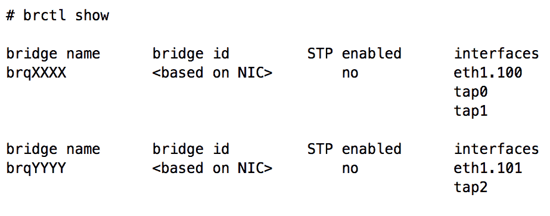

# 使用 Linux 桥接的虚拟网络基础设施

OpenStack 网络的核心功能之一是为运行在云中的实例提供端到端的网络连接。在 *第三章 安装 Neutron* 中，我们在云中的所有节点上安装了 Neutron API 服务和 ML2 插件。从本章开始，我们将介绍 Neutron 依赖的网络概念和架构，用于为实例和其他虚拟设备提供连接。

Neutron 的 ML2 插件允许 OpenStack 云通过使用机制驱动同时利用多种二层技术。在接下来的章节中，我们将介绍多种机制驱动，这些驱动扩展了 ML2 网络插件的功能，包括 Linux 桥接和 Open vSwitch 驱动。

在本章中，你将执行以下操作：

+   了解如何使用 Linux 桥接构建虚拟网络基础设施

+   通过虚拟桥接可视化流量流动

+   在主机上部署 Linux 桥接机制驱动和代理

# 使用 Linux 桥接驱动

Linux 桥接机制驱动支持一系列传统和覆盖网络技术，并支持以下类型的驱动：

+   Local

+   Flat

+   VLAN

+   VXLAN

当主机配置为使用 ML2 插件和 Linux 桥接机制驱动时，主机上的 Neutron 代理依赖于 `bridge`、`8021q` 和 `vxlan` 内核模块，以正确地将实例和其他网络资源连接到虚拟交换机。这些连接允许实例与云中其他网络资源进行通信。Linux 桥接机制驱动因其可靠性和易于故障排除而广受欢迎，但不支持一些高级 Neutron 功能，如分布式虚拟路由器。

在基于 Linux 桥接的网络实现中，有五种接口由 OpenStack 网络管理：

+   Tap 接口

+   物理接口

+   VLAN 接口

+   VXLAN 接口

+   Linux 桥接

**tap 接口**是由超管程序（如 QEMU/KVM）创建并使用，用于将虚拟机实例中的客操作系统与底层主机连接。这些虚拟接口对应主机内的网络接口。发送到主机上 tap 设备的以太网帧会被客操作系统接收，而从客操作系统接收到的帧则会注入到主机的网络栈中。

**物理接口**代表主机上与物理网络硬件相连的接口。物理接口通常标记为 `eth0`、`eth1`、`em0`、`em1` 等，具体取决于主机操作系统。

Linux 支持通过使用虚拟 VLAN 接口进行 802.1q VLAN 标记。可以使用 `iproute2` 命令或传统的 `vlan` 工具及 `8021q` 内核模块来创建 VLAN 接口。VLAN 接口通常标记为 `ethX.<vlan>`，并与其对应的物理接口 `ethX` 关联。

**VXLAN 接口**是一个虚拟接口，用于根据接口创建时配置的参数封装和转发流量，包括 VXLAN 网络标识符（**VNI**）和 VXLAN 隧道端点（VTEP）。VTEP 的功能是在 IP 网络中通过 IP 标头封装虚拟机实例流量。相同 VTEP 上的流量通过 VNI 提供的 ID 与其他 VXLAN 流量隔离。实例本身并不关心提供连接性的外部网络拓扑。

**Linux 桥接**是一个虚拟接口，用于连接多个网络接口。在 Neutron 中，一个桥接通常包括一个物理接口和一个或多个虚拟接口或 tap 接口。Linux 桥接是一种虚拟交换机形式。

# 可视化 Linux 桥接中的流量流动

要使以太网帧从虚拟机实例传输到物理网络上的设备，它将经过主机内部的三到四个设备：

| **网络类型** | **接口类型** | **接口名称** |
| --- | --- | --- |
| all | tap | tapN |
| all | bridge | brqXXXX |
| vxlan | vxlan | vxlan-z（其中 Z 是 VNI） |
| vlan | vlan | ethX.Y（其中 X 是物理接口，Y 是 VLAN ID） |
| flat, vlan | physical | ethX（其中 X 是接口） |

为了帮助理解 Neutron 如何使用 Linux 桥接，以下几个 Linux 桥接架构示例将在接下来的章节中提供。

# VLAN

假设一个 OpenStack 云由一个 `vlan` 提供者网络组成，分段 ID 为 100。三个实例已经连接到该网络。因此，`compute` 节点中的网络架构类似于以下内容：


图 4.1

在图 4.1 中，三个虚拟机实例通过各自的 tap 接口连接到名为 `brqXXXX` 的 Linux 桥接。当第一个实例启动并连接到网络时，Neutron 创建了桥接并创建了一个名为 `eth1.100` 的虚拟接口，并自动将该接口连接到桥接。`eth1.100` 接口绑定到物理接口 `eth1`。当实例的流量通过 Linux 桥接并向物理接口传输时，接口 `eth1.100` 会为该流量打上 VLAN 100 标签，并将其发送到 `eth1`。同样，进入实例的流量通过 `eth1` 进入时，`eth1.100` 会反向去除标签，并将流量发送到连接到桥接的相应实例。

使用`brctl show`命令，前述图示可以在 Linux CLI 中实现如下：


输出中的`bridge id`是基于虚拟 VLAN 接口的父 NIC 动态生成的。在此桥接中，父接口是`eth1`。

以`brq`前缀开头的`bridge name`是根据它所关联的 Neutron 网络的 ID 生成的。在 Linux 桥接架构中，每个网络使用其自己的桥接器。桥接器名称应在同一网络的节点之间保持一致。

在物理交换机上，执行此处所述网络配置所需的配置如下所示：

```
vlan 100
    name VLAN_100

interface Ethernet1/3
    description Provider_Interface_eth1
    switchport
    switchport mode trunk
    switchport trunk allowed vlan add 100
    no shutdown
```

当配置为中继端口时，提供者接口可以支持多个 VLAN 网络。如果需要多个 VLAN 网络，则会自动创建另一个 Linux 桥接器，其中包含一个独立的 VLAN 接口。新的虚拟接口`eth1.101`连接到新桥接器`brqYYYY`，如图 4.2 所示：


图 4.2

在`compute`节点上，前面的图示可以通过以下`brctl show`输出实现：



在物理交换机上，执行此处所述网络配置所需的配置如下所示：

```
vlan 100
    name VLAN_100 
vlan 101 
    name VLAN_101 

interface Ethernet1/3
    description Provider_Interface_eth1
    switchport
    switchport mode trunk
    switchport trunk allowed vlan add 100-101
    no shutdown 
```

# 扁平网络

Neutron 中的扁平网络描述的是一个*没有*VLAN 标记的网络。与 VLAN 网络不同，扁平网络要求与该网络关联的主机的物理接口直接连接到桥接器。这意味着每个物理接口只能存在一个*单一的*扁平网络。

图 4.3 演示了物理接口直接连接到 Neutron 管理的桥接器中的扁平网络场景：


图 4.3

在图 4.3 中，`eth1` 连接到名为`brqZZZZ`的桥接器，并且与三条对应于来宾实例的 tap 接口相连接。在这种情况下，实例流量不会进行 VLAN 标记。

在`compute`节点上，前面的图示可以通过以下`brctl show`输出实现：


在物理交换机上，执行此处所述网络配置所需的配置如下所示：

```
vlan 200
    name VLAN_200 

interface Ethernet1/3
    description Provider_Interface_eth1
    switchport
    switchport mode trunk
    switchport trunk native vlan 200 
    switchport trunk allowed vlan add 200
    no shutdown 
```

或者，接口也可以配置为接入端口：

```
interface Ethernet1/3
    description Provider_Interface_eth1
    switchport
    switchport mode access
    switchport access vlan 200
    no shutdown 
```

每个提供者接口仅支持一个扁平网络。当配置为带有本地 VLAN 的中继端口时，提供者接口可以支持一个扁平网络和多个 VLAN 网络。当配置为接入端口时，该接口只能支持一个扁平网络，任何试图为流量打标签的操作都将失败。

当创建多个扁平网络时，必须为每个扁平网络关联一个独立的物理接口。图 4.4 演示了为第二个扁平网络所需的第二个物理接口：


图 4.4

在 `compute` 节点上，使用两个物理接口来实现独立的平面网络，其 `brctl show` 输出如下所示：


在物理交换机上，支持此处所描述的网络配置的设置将类似于以下内容：

```
vlan 200
    name VLAN_200
vlan 201
    name VLAN_201 
 interface Ethernet1/3
    description Flat_Provider_Interface_eth1
    switchport
    switchport mode trunk
    switchport trunk native vlan 200
    switchport trunk allowed vlan add 200
    no shutdown 
interface Ethernet1/4
    description Flat_Provider_Interface_eth2
    switchport
    switchport mode trunk
    switchport trunk native vlan 201
    switchport trunk allowed vlan add 201
    no shutdown 
```

在这两个平面网络上，主机不会对穿越这些桥接的流量执行任何 VLAN 标记。连接到这两个桥接的实例需要路由器才能相互通信。由于每个平面网络需要唯一的接口，因此平面网络的可扩展性较差，在生产环境中并不常见。

# VXLAN

当创建 VXLAN 网络时，Neutron Linux 桥接代理使用 `iproute2` 用户空间工具创建相应的 VXLAN 接口，并将其连接到 Linux 桥接。VXLAN 接口会被编程，包含如 VNI 和本地 VTEP 地址等信息。

当配置了 L2 人口驱动程序时，Neutron 会用由实例的 MAC 地址及其相应的主机 VTEP 地址组成的静态条目预填充转发数据库。当实例中的数据包通过桥接时，主机会通过查阅转发表来决定如何转发数据包。如果找到相应的条目，Neutron 将通过相应的本地接口转发数据包，并相应地封装流量。要查看每个主机上的转发数据库表，请使用 `bridge fdb show` 命令。

# 使用覆盖网络时的潜在问题

使用覆盖网络技术时需要注意的一点是，封装数据包时添加的额外头部可能会导致数据包超过交换端口或接口的**最大传输单元（MTU）**。MTU 是网络中可以发送的最大数据包或帧的大小。使用 VXLAN 头部封装数据包可能会导致数据包大小超过默认的 1500 字节 MTU。超出 MTU 导致的连接问题会以奇怪的方式表现出来，包括通过 SSH 连接到实例时出现部分失败，或在实例之间传输大数据包失败等。为避免此问题，可以考虑将虚拟机实例中接口的 MTU 从 1500 字节降低到 1450 字节，以考虑 VXLAN 封装的开销，避免连接问题。

降低 MTU 的替代方法是增加用于 VTEP 的接口的 MTU。通常会在 VTEP 接口和相应的交换端口上设置 9000 字节的巨型 MTU，以避免需要在实例内部降低 MTU。增加 VTEP 接口的 MTU 还被证明能够在使用覆盖网络时提高网络吞吐量。

可以通过修改 DHCP 选项 `26`，将非标准 MTU 推送到 DHCP 租约中的实例。要配置较低的 MTU，请完成以下步骤：

1.  在`controller`节点上，修改`/etc/neutron/dhcp_agent.ini`中的 DHCP 配置文件，并指定自定义的`dnsmasq`配置文件：

```
[DEFAULT]
dnsmasq_config_file = /etc/neutron/dnsmasq-neutron.conf
```

1.  接下来，在`/etc/neutron/dnsmasq-neutron.conf`路径下创建自定义的`dnsmasq`配置文件，并添加以下内容：

```
dhcp-option-force=26,1450 
```

1.  保存并关闭文件。使用以下命令重启 Neutron DHCP 代理：

```
# systemctl restart neutron-dhcp-agent   
```

在运行 Linux 的实例内部，可以使用`ip link show <interface>`命令观察 MTU 值。

对`dnsmasq`配置的更改会影响所有网络，即使是 VLAN 网络上的实例也会受到影响。可以单独修改 Neutron 端口以避免这种影响。

# 本地

在 Neutron 中创建本地网络时，无法指定 VLAN ID，甚至无法指定物理接口。Neutron Linux 桥接代理将创建一个桥接器并仅将实例的 tap 接口连接到该桥接器。位于同一节点的同一本地网络中的实例将连接到同一桥接器，并可以自由相互通信。由于主机没有物理或虚拟 VLAN 接口连接到桥接器，因此实例之间的流量仅限于实例所在的主机。在不同主机上位于同一本地网络的实例之间无法相互通信。

图 4.5 展示了没有物理或虚拟 VLAN 接口连接到桥接器的情况：


图 4.5

在图 4.5 中，创建了两个本地网络及其各自的桥接器，`brqZZZZ`和`brqNNNN`。连接到同一桥接器的实例可以相互通信，但无法与桥接器外的其他实例通信。在使用本地网络时，没有机制允许不同桥接器或主机之间的实例通信。

某些应用架构可能要求在同一主机上部署多个实例，而无需跨主机通信。在这种情况下，使用本地网络可能会更合适，并且可以避免浪费宝贵的 VLAN ID 或 VXLAN 开销。

# 配置 ML2 网络插件

在您可以构建 OpenStack 云中的网络资源之前，必须定义并配置网络插件。ML2 插件提供了一个通用框架，允许多个驱动程序之间互操作。在本节中，我们将了解如何在`controller01`和`compute01`主机上配置 Linux 桥接 ML2 驱动程序和代理。

本书将讨论如何配置 Linux 桥接和 Open vSwitch 驱动程序以实现同时操作，但这可能不适合生产环境。为了简化操作，如果不需要分布式虚拟路由器，建议部署 Linux 桥接驱动程序。分布式虚拟路由器的配置和架构在*第十二章，分布式虚拟路由器*中有详细介绍。

# 配置桥接接口

在此安装中，物理网络接口`eth2`将作为**提供接口**用于 VLAN 和扁平网络。Neutron 将在初始网络配置完成后负责配置 VLAN 接口。

在`controller01`和`compute01`节点上，按照以下方式在`/etc/network/interfaces`文件中配置`eth2`接口：

```
auto eth2
iface eth2 inet manual 
```

关闭并保存文件，然后使用以下命令启用接口：

```
    # ip link set dev eth2 up
```

使用`ip link show dev eth2`命令确认接口处于`UP`状态。如果接口已经启动，它就可以在 Neutron 将创建和管理的桥接中使用。

因为该接口将用于桥接，所以不能直接将 IP 地址应用于该接口。如果`eth2`上应用了 IP 地址，一旦该接口被放入桥接中，它将变得不可访问。如果需要 IP 地址，请考虑将其移动到 Neutron 网络不需要的接口上。

# 配置覆盖接口

在此安装中，物理网络接口`eth1`将作为**覆盖接口**用于使用 VXLAN 的覆盖网络。Neutron 将在初始网络配置完成后负责配置 VXLAN 接口。

在`controller01`和`compute01`节点上，按照以下方式在`/etc/network/interfaces`文件中配置`eth1`接口：

```
auto eth1
iface eth1 inet static
    address 10.20.0.X/24 
```

使用下表来获取适当的地址，并根据需要替换`X`：

| **主机** | **地址** |
| --- | --- |
| `controller01` | 10.20.0.100 |
| `compute01` | 10.20.0.101 |

关闭并保存文件，然后使用以下命令启用接口：

```
    # ip link set dev eth1 up
```

使用`ip addr show dev eth1`命令确认接口处于`UP`状态并且地址已经设置。确保两个主机能够通过新配置的接口进行通信，通过从`controller01`节点 ping`compute01`来验证：


如果你在通过该接口进行通信时遇到任何问题，你*将会*在使用 OpenStack Networking 创建的 VXLAN 网络中遇到问题。所有问题应在继续之前解决。

# ML2 插件配置选项

上一章节已安装 ML2 插件，其配置文件位于`/etc/neutron/plugins/ml2/ml2_conf.ini`，必须配置该文件才能使用 OpenStack Networking 服务。`neutron-server`服务引用的 ML2 插件配置文件可能被多个代理引用，包括 Linux 桥接和 Open vSwitch 代理。特定代理的更改将在每个主机上的相应配置文件中进行。

`ml2_conf.ini`文件被分为多个配置区块，并包含以下常用选项：

```
[ml2]
...
type drivers = ...
mechanism drivers = ...
tenant_network_types = ...
extension_drivers = ... 

[ml2_type_flat]
...
flat_networks = ...

[ml2_type_vlan]
...
network_vlan_ranges = ...

[ml2_type_vxlan]
...
vni_ranges = ...
vxlan_group = ...

[securitygroup]
...
enable_security_group = ...
enable_ipset = ...
```

配置选项必须保留在适当的区块内，否则 Neutron 服务可能无法启动或正常运行。

# 类型驱动

类型驱动程序描述了可以由机制驱动程序创建和实现的网络类型。与 ML2 插件一起包含的类型驱动程序包括 `local`、`flat`、`vlan`、`gre`、`vxlan` 和 `geneve`。然而，并非所有机制驱动程序都能实现所有类型的网络。Linux 桥接驱动程序不支持 GENEVE 和 GRE 网络。

更新 `controller01` 节点上的 ML2 配置文件，并添加以下 `type_drivers`：

```
[ml2]
...
type_drivers = local,flat,vlan,vxlan
```

# 机制驱动程序

机制驱动程序负责实现由类型驱动程序描述的网络。与 ML2 插件一起包含的机制驱动程序包括 `linuxbridge`、`openvswitch` 和 `l2population`。

更新 `controller01` 节点上的 ML2 配置文件，并添加以下 `mechanism_drivers`：

```
[ml2]
...
mechanism_drivers = linuxbridge,l2population
```

Neutron Linux 桥接代理需要特定的配置选项，这将在本章后续部分讨论。

# 使用 L2 population 驱动程序

L2 population 驱动程序在 OpenStack 的 Havana 版本中引入，并与 ML2 插件一起发布。它使得在 OpenStack 构建的大型覆盖网络上，广播、组播和单播流量能够扩展。

L2 population 驱动程序的目标是通过在所有主机上预先填充桥接转发和 IP 邻居（ARP）表，从而抑制昂贵的交换学习行为。由于 Neutron 被视为用户创建的网络和实例的逻辑布局的可信来源，它可以轻松地用这些信息预填充包含 MAC 地址和目标 VTEP 的转发表。L2 population 驱动程序还在每个主机上实现了一个 ARP 代理，消除了在覆盖网络上广播 ARP 请求的需要。每个 `compute` 或 `network` 节点都能够拦截来自实例或路由器的 ARP 请求，并将响应代理给请求者。然而，L2 population 驱动程序确实有一些限制，稍后将在本章中讨论。

使用 L2 population 驱动程序的替代方案是依赖组播来在主机之间传播转发数据库信息。每个主机应配置为订阅一个在 OpenStack 之外配置的组播组。如果没有正确配置，可能会使用广播消息代替组播，这可能会导致网络上的不必要的干扰。组播的配置超出了本书的范围。

# 租户网络类型

`tenant_network_types` 配置选项描述了租户或项目可以创建的网络类型。当使用 Linux 桥接机制驱动程序时，支持的租户网络类型包括 `flat`、`vlan`、`local`、`vxlan` 和 `none`。

配置选项的值是按顺序排列的列表，如`vlan,vxlan`。在此示例中，当用户创建网络时，Neutron 会自动配置一个 VLAN 网络和 ID，无需用户交互。当所有可用的 VLAN ID 被分配完毕后，Neutron 将分配列表中的下一个类型的网络。在这种情况下，将分配一个 VXLAN 网络和 VNI。当任何列出网络类型的所有分段 ID 被分配完时，用户将无法再创建网络，并且系统会向用户呈现一个错误。

拥有`admin`角色的用户可以通过在网络创建过程中指定提供者属性来覆盖`tenant_network_types`的行为。

更新`controller`节点上的 ML2 配置文件，并将以下`tenant_network_types`配置添加到`[ml2]`部分：

```
[ml2]
...
tenant_network_types= vlan,vxlan
```

如果您希望更改`tenant_network_types`的值，请相应地编辑所有节点上的插件配置文件，并重启`neutron-server`服务。

# 扁平网络

`flat_networks`配置选项定义了支持使用未标记网络的接口，这些网络通常被称为本地 VLAN 或接入 VLAN。此选项要求指定提供者标签。**提供者标签**是一个任意标签或名称，映射到主机上的物理接口或桥接。稍后将在本章中详细讨论这些映射。

在以下示例中，`physnet1`接口已配置为支持一个扁平网络：

```
flat_networks = physnet1 
```

可以使用逗号分隔的列表定义多个接口：

```
flat_networks = physnet1,physnet2 
```

由于缺乏用于隔离同一接口上未标记流量的标识符，因此一个接口只能支持单一的扁平网络。

在此环境中，`flat_networks`选项可以保持*未配置*状态。

# 网络 VLAN 范围

`network_vlan_ranges`配置选项定义了当`tenant_network_types`为`vlan`时，项目网络在创建时将与哪些 VLAN 范围相关联。当可用 VLAN 数量达到零时，租户将无法再创建 VLAN 网络。

在以下示例中，VLAN ID `40`到`43`可用于租户网络分配：

```
network_vlan_ranges = physnet1:40:43 
```

可以通过使用逗号分隔的列表来分配不连续的 VLAN：

```
network_vlan_ranges = physnet1:40:43,physnet1:51:55
```

在此特定部署中，提供者标签`physnet1`将与 VLAN `40`到`43`一起使用。除非由拥有`admin`角色的用户覆盖，否则这些 VLAN 将在创建时自动分配到`vlan`网络。

更新`controller01`节点上的 ML2 配置文件，并将以下`network_vlan_ranges`添加到`[ml2_type_vlan]`部分：

```
[ml2_type_vlan]
...
network_vlan_ranges = physnet1:40:43
```

# VNI 范围

当创建 VXLAN 网络时，每个网络都会分配一个唯一的分段 ID，用于封装流量。当使用 Linux 桥接机制驱动程序时，创建各主机的相应 VXLAN 接口时会使用该分段 ID。

`vni_ranges` 配置选项是一个用逗号分隔的 ID 范围列表，用于在 `tunnel_type` 设置为 `vxlan` 时为项目网络分配可用范围。

在以下示例中，段划分 ID `1` 到 `1000` 被预留用于租户网络分配时使用：

```
vni_ranges = 1:1000 
```

`vni_ranges` 选项通过逗号分隔的列表支持非连续的 ID，如下所示：

```
vni_ranges = 1:1000,2000:2500 
```

更新 `controller01` 节点上的 ML2 配置文件，并将以下 `vni_ranges` 添加到 `[ml2_type_vxlan]` 部分：

```
[ml2_type_vxlan]
...
vni_ranges = 1:1000
```

VXLAN 头部中的 24 位 VNI 字段支持大约 1600 万个独特标识符。

# 安全组

`enable_security_group` 配置选项指示 Neutron 启用或禁用与安全组相关的 API 功能。该选项默认为 `true`。

`enable_ipset` 配置选项指示 Neutron 在使用 iptables 防火墙驱动程序时启用或禁用 `ipset` 扩展。使用 ipset 允许创建一次匹配整组地址的防火墙规则，而不是为每个地址单独创建规则，这使得查找比传统的线性查找更高效。该选项默认为 `true`。

如果在任何时候更新了 ML2 配置文件，则必须重新启动 `neutron-server` 服务及相应的 Neutron 代理，以使更改生效。

# 配置 Linux 桥接驱动程序和代理

Linux 桥接机制驱动程序包含在 ML2 插件中，并在 *第三章*，*安装 Neutron* 中进行安装。以下部分将引导您配置 OpenStack 网络以利用 Linux 桥接驱动程序和代理。

虽然 Linux 桥接和 Open vSwitch 代理及驱动程序可以在同一环境中共存，但不应在同一主机上同时安装和配置它们。

# 安装 Linux 桥接代理

要安装 Neutron Linux 桥接代理，请在 `controller01` 和 `compute01` 上执行以下命令：

```
# apt install neutron-plugin-linuxbridge-agent
```

如果系统提示覆盖现有配置文件，请在 `[default=N]` 提示符下输入 `N`。

# 更新 Linux 桥接代理配置文件

Linux 桥接代理使用位于 `/etc/neutron/plugins/ml2/linuxbridge_agent.ini` 的配置文件。最常见的选项如下：

```
[linux_bridge]
...
physical_interface_mappings = ... 

[vxlan]
...
enable_vxlan = ...
vxlan_group = ...
l2_population = ...
local_ip = ...
arp_responder = ... 
[securitygroup]
...
firewall_driver = ... 
```

# 物理接口映射

`physical_interface_mappings` 配置选项描述了一个人工标签到服务器物理接口的映射。当创建网络时，它们会关联一个接口标签，例如 `physnet1`。然后，`physnet1` 标签会通过 `physical_interface_mappings` 选项映射到一个物理接口，例如 `eth2`。以下示例中可以观察到此映射：

```
physical_interface_mappings = physnet1:eth2 
```

所选标签必须在预期处理由 Neutron 创建的特定网络流量的所有节点之间保持一致。然而，映射到标签的物理接口可能不同。当一个节点将`physnet1`映射到千兆接口，而另一个节点将`physnet1`映射到 10 千兆接口时，通常会观察到映射的差异。

允许多个接口映射，可以通过逗号分隔的列表将其添加到列表中：

```
physical_interface_mappings = physnet1:eth2,physnet2:bond2
```

在此安装中，`eth2`接口将作为物理网络接口使用，这意味着与`physnet1`关联的任何网络的流量将通过`eth2`。如果租户要创建 VLAN 网络，连接到`eth2`的物理交换机端口必须支持 802.1q VLAN 标记。

配置 Linux 桥接代理使用`physnet1`作为物理接口标签，并通过相应更新`controller01`和`compute01`上的 ML2 配置文件，将`eth2`作为物理网络接口：

```
[linux_bridge]
...
physical_interface_mappings = physnet1:eth2
```

# 启用 VXLAN

要启用对 VXLAN 网络的支持，`enable_vxlan`配置选项必须设置为`true`。在`Controller01`和`compute01`上相应地更新 ML2 配置文件中的`enable_vxlan`配置选项：

```
[vxlan]
...
enable_vxlan = true
```

# L2 人口

要启用对 L2 人口驱动程序的支持，`l2_population`配置选项必须设置为`true`。在`controller01`和`compute01`上相应地更新 ML2 配置文件中的`l2_population`配置选项：

```
[vxlan]
...
l2_population = true
```

L2 人口驱动程序的一个有用功能是其 ARP 响应器功能，有助于避免在覆盖网络中广播 ARP 请求。每个`compute`节点可以代理来自虚拟机的 ARP 请求并提供回复，所有这些都不会让流量离开主机。

要启用 ARP 响应器，请更新以下配置选项：

```
[vxlan]
...
arp_responder = true
```

然而，ARP 响应器与使用 Linux 桥接代理的系统上的`allowed-address-pairs`扩展存在已知的不兼容问题。Linux 桥接代理使用的`vxlan`内核模块在启用 ARP 响应器功能时不支持动态学习。因此，当 IP 地址在虚拟机之间迁移时，转发数据库可能不会更新目标主机的 MAC 地址和相应的 VTEP，因为 Neutron 未收到此更改的通知。如果需要`allowed-address-pairs`功能，我的建议是禁用 ARP 响应器，直到该行为发生变化。

# 本地 IP

`local_ip`配置选项指定了用于在主机之间建立覆盖网络的本地 IP 地址。有关覆盖网络架构的设计，请参考*第一章，OpenStack 网络介绍*。在本安装中，所有通过覆盖网络的来宾流量将通过本章前面配置的`eth1`接口跨越专用网络。

在`controller01`和`compute01`主机上的 ML2 配置文件的`[vxlan]`部分中相应更新`local_ip`配置选项：

```
[vxlan]
...
local_ip = 10.20.0.X
```

以下表格提供了需要在每个主机上配置的接口和地址。请根据需要替换`X`：

| **主机名** | **接口** | **IP 地址** |
| --- | --- | --- |
| `controller01` | eth1 | 10.20.0.100 |
| `compute01` | eth1 | 10.20.0.101 |

# 防火墙驱动程序

`firewall_driver`配置选项指示 Neutron 使用特定的防火墙驱动程序来实现安全组功能。根据使用的机制驱动程序，可能会配置不同的防火墙驱动程序。

更新`controller01`和`compute01`上的 ML2 配置文件，并在`[securitygroup]`部分的单行中定义适当的`firewall_driver`配置：

```
[securitygroup]
...
firewall_driver = iptables
```

如果你不想使用防火墙，并希望禁用安全组规则的应用，将`firewall_driver`设置为`noop`。

# 配置 DHCP 代理使用 Linux 桥接驱动程序

为了使 Neutron 能够正确地将 DHCP 命名空间接口连接到相应的网络桥接，`controller`节点上的 DHCP 代理必须配置为使用 Linux 桥接接口驱动程序。

在`controller`节点上，更新 Neutron DHCP 代理配置文件`/etc/neutron/dhcp_agent.ini`中的`interface_driver`配置选项，以使用 Linux 桥接接口驱动程序：

```
[DEFAULT]
...
interface_driver = linuxbridge
```

接口驱动程序将根据托管 DHCP 代理的节点上使用的插件代理而有所不同。

# 重启服务

某些服务必须重新启动才能使更改生效。以下服务应在`controller01`和`compute01`上重启：

```
     # systemctl restart neutron-linuxbridge-agent
```

以下服务应在`controller01`节点上重启：

```
     # systemctl restart neutron-server neutron-dhcp-agent 
```

# 验证 Linux 桥接代理

为了验证 Linux 桥接网络代理是否已正确登记，在`controller`节点上执行`openstack network agent list`命令：


`controller01`和`compute01`节点上的 Neutron Linux 桥接代理应在输出中显示，状态为`UP`。如果代理不在输出中，或状态为`DOWN`，你需要通过观察相应主机上的`/var/log/neutron/neutron-linuxbridge-agent.log`日志消息来排查代理连接问题。

# 概述

在本章中，我们发现了 Neutron 如何利用 Linux 桥接和虚拟接口为实例提供网络连接。Linux 桥接驱动程序支持多种不同的网络类型，包括带标签、无标签和覆盖网络，稍后的章节中，我将展示在这些网络上启动实例时，它们的不同之处。

在下一章中，你将学习 Linux 桥接与 Open vSwitch 实现之间的区别，并将逐步了解如何在两个额外的 `compute` 节点和一个专用于分布式虚拟路由功能的网络节点上安装 Open vSwitch 驱动程序和代理。
