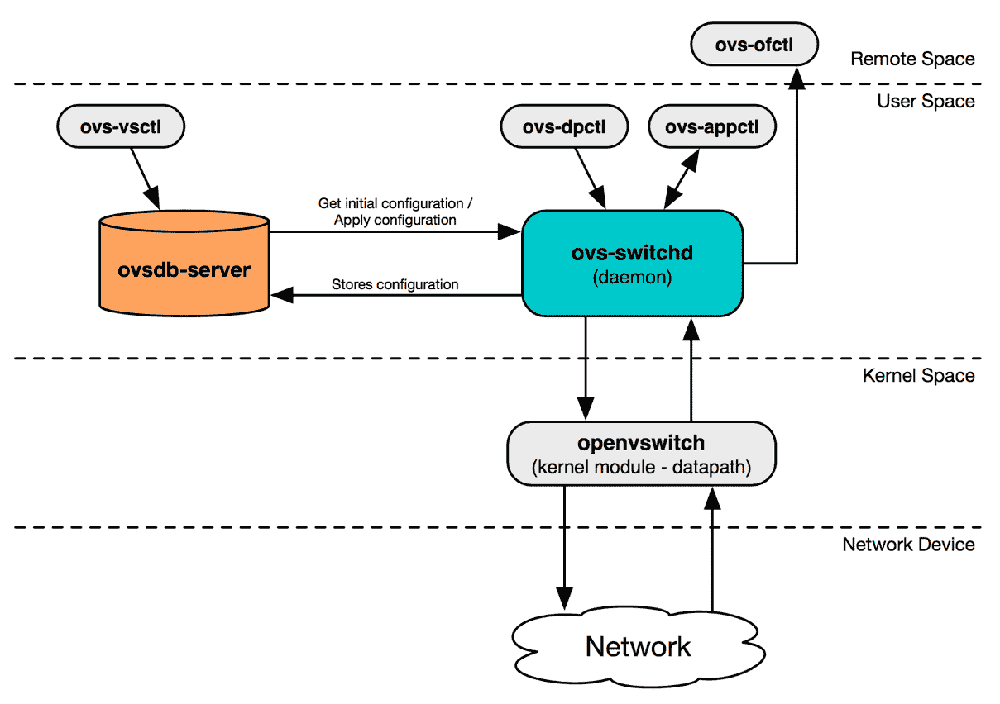

# 第五章：使用 Open vSwitch 构建虚拟交换基础设施

在 *第四章，使用 Linux 桥接的虚拟网络基础设施* 中，我们研究了 Linux 桥接机制驱动程序和代理如何使用不同类型的接口和 Linux 桥接构建虚拟网络基础设施。在本章中，你将了解 Open vSwitch 机制驱动程序及其相应的代理，该代理利用 Open vSwitch 作为虚拟交换技术，将实例和主机连接到物理网络。

在本章中，你将执行以下操作：

+   发现 Open vSwitch 如何用于构建虚拟网络基础设施

+   可视化虚拟交换机中的流量流动

+   在主机上部署 Open vSwitch 机制驱动程序和代理

# 使用 Open vSwitch 驱动程序

Open vSwitch 机制驱动程序支持多种传统和覆盖网络技术，并支持以下类型的驱动程序：

+   本地

+   扁平化

+   VLAN

+   VXLAN

+   GRE

在 OpenStack 网络中，Open vSwitch 作为一个软件交换机，使用虚拟网络桥接和流规则在主机之间转发数据包。尽管它能够支持许多技术和协议，但 OpenStack 网络仅利用 Open vSwitch 的一部分功能。

以下是 Open vSwitch 的三个主要组件：

+   **内核模块**：`openvswitch` 内核模块相当于硬件交换机中的 ASIC。它是交换机的数据平面，所有的数据包处理都发生在此处。

+   **vSwitch 守护进程**：`ovs-vswitchd` 守护进程是一个 Linux 进程，在每个物理主机的用户空间中运行，决定内核模块如何编程。

+   **数据库服务器**：OpenStack/Open vSwitch 实现使用每个物理主机上的本地数据库，称为**Open vSwitch 数据库服务器**（**OVSDB**），它维护虚拟交换机的配置。

上述组件的高级架构图可以在这里看到：



Neutron Open vSwitch 代理，`neutron-openvswitch-agent`，是一个服务，它通过 Open vSwitch 机制驱动程序在主机上配置，负责管理网络及相关接口的实施。该代理根据防火墙配置，将 tap 接口连接到 Open vSwitch 或 Linux 桥接，并使用 `ovs-vsctl` 和 `ovs-ofctl` 等工具，根据 `neutron-server` 服务提供的数据来编程流。

在基于 Open vSwitch 的网络实现中，有五种不同类型的虚拟网络设备，如下所示：

+   Tap 设备

+   Linux 桥接

+   虚拟以太网电缆

+   OVS 桥接

+   OVS 补丁端口

Tap 设备和 Linux 桥接在前一节中已有简要描述，并且它们在 Open vSwitch 网络中的使用保持不变。虚拟以太网 (**veth**) 电缆是模拟网络补丁电缆的虚拟接口。发送到 veth 电缆一端的以太网帧将被另一端接收，就像真实的网络补丁电缆一样。当 Neutron 在网络命名空间与 Linux 桥接之间建立连接时，或者将 Linux 桥接连接到 Open vSwitch 交换机时，它会利用 veth 电缆。

Neutron 将 DHCP 或路由器命名空间和实例使用的接口连接到 OVS 桥接端口。这些端口本身可以像物理交换机端口一样进行配置。Open vSwitch 维护关于连接设备的信息，包括 MAC 地址和接口统计数据。

Open vSwitch 内置了一种端口类型，模拟 Linux veth 电缆的行为，但经过优化以用于 OVS 桥接。当连接两个 Open vSwitch 桥接时，每个交换机上的一个端口会被保留作为 **patch 端口**。Patch 端口配置了与另一个交换机的 patch 端口相对应的对等名称。从图形上看，它像这样：


图 5.1

在前面的示意图中，两个 OVS 桥接通过每个交换机上的一个 patch 端口进行交叉连接。Open vSwitch 的 patch 端口用于将 Open vSwitch 桥接互联，而 Linux veth 接口用于将 Open vSwitch 桥接与 Linux 桥接连接，或将 Linux 桥接与其他 Linux 桥接连接。

# 基本的 OpenvSwitch 命令

Open vSwitch 包括可用于管理用户创建的虚拟交换机的实用工具，包括 OpenStack 网络代理创建的虚拟交换机。这些命令在故障排除时非常有用，尤其是在网络上不可避免地出现问题时。

# 基本命令

大多数 Open vSwitch 配置和故障排除可以通过以下命令完成：

+   `ovs-vsctl`：用于配置 `ovs-vswitchd` 数据库的工具

+   `ovs-ofctl`：用于监控和管理 OpenFlow 交换机的工具

+   `ovs-dpctl`：用于管理 Open vSwitch 数据路径的工具

+   `ovs-appctl`：用于查询和管理 Open vSwitch 守护进程的工具

# ovs-vsctl

`ovs-vsctl` 工具用于配置和查看 OVS 桥接/交换机操作。通过该工具，用户可以配置交换机上的端口，创建和删除虚拟交换机，创建绑定，并管理端口上的 VLAN 标记。

有用的命令包括以下内容：

+   `ovs-vsctl show`：打印交换机数据库配置的简要概览，包括端口、VLAN 等

+   `ovs-vsctl list-br`：打印已配置桥接的列表

+   `ovs-vsctl list-ports <bridge>`：打印指定桥接上的端口列表

+   `ovs-vsctl list interface`：打印接口列表及其统计数据和其他信息

# ovs-ofctl

`ovs-ofctl` 工具用于监控和管理 OpenFlow 交换机。Neutron Open vSwitch 代理使用 `ovs-ofctl` 来编程虚拟交换机上的流量，用以控制流量、执行 VLAN 标记、执行 NAT 等。

有用的命令包括以下内容：

+   `ovs-ofctl show <bridge>`：显示指定桥接器的 OpenFlow 特性、动作和端口描述。

+   `ovs-ofctl dump-flows <bridge> <flow>`：打印指定桥接器的流条目。如果指定了流，只会显示该流。

+   `ovs-ofctl dump-ports-desc <bridge>`：打印指定桥接器的端口统计信息，包括接口的状态、对等端和速度。

# ovs-dpctl

`ovs-dpctl` 工具用于管理和查询 Open vSwitch 数据路径。与 `ovs-ofctl` 不同，`ovs-dpctl` 显示的是由实际流量匹配的流。

有用的命令包括以下内容：

+   `ovs-dpctl dump-flows`：显示系统中所有流量的流表数据

# ovs-appctl

`ovs-appctl` 工具用于查询和管理 Open vSwitch 守护进程，包括 `ovs-vswitchd`、`ovs-controller` 等。

有用的命令包括以下内容：

+   `ovs-appctl bridge/dump-flows <bridge>`：转储指定桥接器上的 OpenFlow 流量

+   `ovs-appctl dpif/dump-flows <bridge>`：转储指定桥接器的数据路径流

+   `ovs-appctl ofproto/trace <bridge> <flow>`：显示给定流的完整流字段，包括匹配的规则和执行的动作

这些命令多数由 Neutron Open vSwitch 代理用于编程虚拟交换机，操作员也经常用它们来排查网络连接问题。强烈建议熟悉这些命令及其输出。

# 可视化 Open vSwitch 的流量

在使用 Open vSwitch 驱动时，为了让以太网帧从虚拟机实例传输到物理网络，它将经过多个不同的接口，包括以下内容：

| **网络类型** | **接口类型** | **接口名称** |
| --- | --- | --- |
| all | tap | tapN |
| all | bridge | qbrXXXX（仅与 iptables 防火墙驱动一起使用） |
| all | veth | `qvbXXXX`, `qvoXXXX`（仅与 iptables 防火墙驱动一起使用） |
| all | vSwitch | br-int |
| flat, vlan | vSwitch | br-ex（用户可配置） |
| vxlan, gre | vSwitch | br-tun |
| flat, vlan | patch | `int-br-ethX`, `phy-br-ethX` |
| vxlan, gre | patch | patch-tun, patch-int |
| flat, vlan | physical | ethX（X 为接口编号） |

Open vSwitch 桥接器 `br-int` 被称为 **集成桥**。集成桥是大多数虚拟设备连接的中心虚拟交换机，包括实例、DHCP 服务器、路由器等。当启用 Neutron 安全组并使用 iptables 防火墙驱动程序时，实例不会直接连接到集成桥。相反，实例连接到各个 Linux 桥接器，这些 Linux 桥接器通过 veth 电缆与集成桥交叉连接。

`openvswitch` 防火墙驱动程序是一个替代驱动程序，它通过 OpenFlow 规则实现安全组规则，但这超出了本书的范围。

Open vSwitch 桥接器 `br-ethX` 被称为 **提供者桥**。提供者桥通过连接的物理接口提供与物理网络的连接。提供者桥也通过虚拟补丁电缆与集成桥连接，该补丁电缆由补丁端口 `int-br-ethX` 和 `phy-br-ethX` 提供。

这里描述的架构的可视化表示可以在以下图表中看到：


图 5.2

在前面的图示中，实例通过各自的 tap 接口连接到单独的 Linux 桥接器。Linux 桥接器通过 **veth** 接口与 OVS 集成桥连接。集成桥上的 OpenFlow 规则决定了如何通过虚拟交换机转发流量。集成桥通过 OVS 补丁电缆连接到提供者桥。最后，提供者桥连接到物理网络接口，允许流量进出主机并进入物理网络基础设施。

在使用 Open vSwitch 驱动程序时，环境中的每个控制器、网络或计算节点都有自己的集成桥和提供者桥。跨节点的虚拟交换机通过物理网络有效地相互交叉连接。一个主机上可以配置多个提供者桥，但通常需要为每个提供者桥使用一个专用的物理接口。

# 标识虚拟交换机上的端口

使用 `ovs-ofctl show br-int` 命令，我们可以看到集成桥的逻辑表示。以下截图展示了使用此命令查看 `compute02` 上集成桥的交换机端口：


以下是前面截图中展示的组件：

+   端口号 1 被命名为`int-br-eth2`，是 OVS 补丁电缆的一端。另一端连接到提供者桥接器 `br-eth2`（未显示）。

+   端口号 2 被命名为 `patch-tun`，是 OVS 补丁电缆的一端。另一端连接到隧道桥 `br-tun`（未显示）。

+   端口号 3 被命名为 `qvo3de035cc-79`，对应 Neutron 端口 `3de035cc-79a9-4172-bb25-d4a7ea96325e`。

+   端口号 4 被命名为`qvoce30da31-3a`，对应的 Neutron 端口是`ce30da31-3a71-4c60-a350-ac0453b24d7d`。

+   端口号 5 被命名为 `qvoa943af89-8e`，对应的 Neutron 端口是 `` `a943af89-8e21-4b1d-877f-abe946f6e565.` ``

+   名为 `br-int` 的本地端口是 Open vSwitch 内部使用的，可以忽略。

以下截图以图形方式展示了交换机的配置：


图 5.3

# 确定与端口相关的本地 VLAN

每个连接到实例或其他网络资源的集成桥接器端口，都被分配到一个本地 VLAN，该 VLAN 属于该虚拟交换机。

每个主机上的 Open vSwitch 数据库都是独立的，与其他主机无关，且本地 VLAN 数据库与物理网络基础设施没有直接关系。在特定主机上的同一 Neutron 网络中的实例被放置在本地集成桥接器的同一 VLAN 中，但不同主机之间的 VLAN ID 不一定保持一致。也就是说，流规则将在每个主机上实现，将本地 VLAN ID 映射到与相应 Neutron 网络关联的 ID，从而允许跨共享 VLAN 进行主机之间的流量传输。本行为将在本章后续部分进行详细讨论。

使用 `ovs-vsctl show` 命令，你可以识别主机上所有虚拟交换机上所有端口的本地 VLAN 标签。以下截图展示了在 `compute02` 上运行该命令的效果：


集成桥接器上连接着三个接口，分别命名为 `qvoce30da31-3a`、`qvoa943af89-8e` 和 `qvo3de035cc-79`。其中两个接口位于同一网络，并处于同一个本地 VLAN 中。另一个接口 `qvoa943af89-8e` 则位于不同的网络中，因此属于不同的 VLAN。

本地 VLAN ID 是由本地 Open vSwitch 进程随机分配的，可能会在重启 `openvswitch-switch` 服务或重新启动后发生变化。

# 编程流规则

与 Linux 桥接架构不同，Open vSwitch 驱动程序不会使用主机上的 VLAN 接口来标记流量。相反，Open vSwitch 代理在虚拟交换机上编程流规则，指示如何在转发前处理通过交换机的流量。当流量经过虚拟交换机时，交换机上的流规则可以在转发流量前转换、添加或去除 VLAN 标签。此外，还可以添加流规则，丢弃匹配特定特征的流量。Open vSwitch 能执行对流量的其他类型操作，但这些操作超出了本书的范围。

使用`ovs-ofctl dump-flows <bridge>`命令，我们可以观察到当前在指定桥上编程的流。Open vSwitch 插件代理负责将 Neutron 数据库中关于网络的信息转换为 Open vSwitch 流，并在网络发生变化时持续维护这些流。

# VLAN 网络的流规则

在以下示例中，VLAN `40`和`42`代表数据中心中的两个网络。这两个 VLAN 已被中继到`controller`和`compute`节点，并且已经配置了使用这些 VLAN ID 的 Neutron 网络。

在物理交换机上，为了实现这里描述的网络配置，所需的配置大致如下：

```
vlan 40
    name VLAN_40
vlan 42
    name VLAN_42

interface Ethernet1/4
    description Provider_Interface_eth2
    switchport
    switchport mode trunk
    switchport trunk allowed vlan add 40,42
    no shutdown 
```

当配置为中继端口时，提供商接口可以支持多个 VLAN 网络。进入物理接口`eth2`的流量会由连接到的`br-eth2`桥上的流规则进行处理。流规则按照从高到低的优先级顺序进行处理。默认情况下，`ovs-ofctl`以虚拟交换机发送流条目的相同顺序返回流条目。使用`--rsort`，可以按照优先级顺序返回结果，从高到低，以匹配数据包处理的顺序：


为了提高可读性，`duration`和`cookie`字段已被移除。

前三条规则指定了一个特定的入站端口：

```
in_port="phy-br-eth2" 
```

根据图 5.3 中的示意图，流量通过物理接口`eth2`进入桥`br-eth2`时，使用的是端口 1，而不是名为`phy-br-eth2`的端口，因此前三条规则不适用。因此，流量将通过第四条规则转发到集成桥接器，其中没有指定特定的端口：


动作为`NORMAL`的流指示 Open vSwitch 充当学习交换机，这意味着流量将从除接收流量的端口以外的所有端口转发，直到交换机学习并更新其转发数据库。流量将从连接到集成桥接器的端口转发出去。

转发数据库，或 FDB 表，相当于物理交换机上的 CAM 或 MAC 地址表。这种学习行为类似于硬件交换机，它会将流量洪泛到所有端口，直到学习到正确的路径。

当流量从提供商桥接器`br-eth2`退出并进入集成桥接器`br-int`的端口 1 时，它会根据`br-int`上的流规则进行评估，如下所示：


立即需要关注的是检查来自`int-br-eth2`接口的流规则，因为流量正是从提供者桥接进入集成桥接。这里展示的第一条规则执行的操作是，当原始 VLAN ID（由`dl_vlan`值标识）为 42 时，将数据包的 VLAN ID 从其原始 VLAN 修改为在`compute`节点上的集成桥接本地 VLAN：


当带有 VLAN 42 标记的流量从物理网络发送到实例并通过提供者桥接转发到集成桥接时，VLAN 标签会从 42 修改为本地 VLAN 1。然后，该帧被转发到表 60 进行进一步处理，默认动作为 NORMAL。因此，该帧被转发到`br-int`上的一个端口，该端口连接到与目标 MAC 地址匹配的实例。

下一条规则在数据链路 VLAN 为`40`时执行类似操作，将其替换为本地 VLAN 2。如果流量匹配`drop`规则，意味着没有其他更高优先级的规则进入`int-br-eth2`，流量将被丢弃：


# 返回流量

从实例返回的流量通过集成桥接`br-int`时，可能会被各种流规则处理，这些规则用于抑制 ARP 和 MAC 欺骗。如果流量被允许，它将被转发到表 60 进行进一步处理，并最终转发到提供者桥接：


一旦流量到达提供者桥接`br-eth2`，它将按照以下方式由流规则处理：


如果这些规则看起来很熟悉，那是因为它们与我们之前展示的提供者桥接上的流规则相同。不过这一次，来自集成桥接连接到端口`phy-br-eth2`的流量将由这些规则处理。

提供者桥接上的第一条流规则检查以太网头部中的 VLAN ID，如果是`1`，则在将流量转发到物理接口之前将其修改为`42`。第二条规则在流量离开桥接之前将帧的 VLAN 标签从`2`修改为`40`。所有来自集成桥接的流量，若未标记为 VLAN `1`或`2`，则会被丢弃。

如果某个网络中没有实例或资源调度到该节点，则该网络的流规则不会存在于桥接上。每个节点上的 Neutron Open vSwitch 代理负责为相应节点上的虚拟交换机创建适当的流规则。

# 平面网络的流规则

Neutron 中的平面网络是未标记网络，这意味着在创建网络时，该网络没有与 802.1q VLAN 标签关联。然而，在内部，Open vSwitch 在编程虚拟交换机时，将平面网络与 VLAN 网络相似地处理。平面网络在 Open vSwitch 数据库中被分配一个本地 VLAN ID，就像 VLAN 网络一样，连接到同一集成桥接的同一平面网络中的实例将被置于相同的本地 VLAN 中。然而，VLAN 和平面网络之间存在一个差异，这可以通过在集成桥接和提供桥接上创建的流规则来观察。流量通过桥接时，局部 VLAN ID 被添加到以太网头部或从中去除，而不是将本地 VLAN ID 映射到物理 VLAN ID，反之亦然。

在物理交换机上，为了实现这里描述的网络配置，所需的配置将如下所示：

```
vlan 200
    name VLAN_200 

interface Ethernet1/4
    description Provider_Interface_eth2
    switchport
    switchport mode trunk
    switchport trunk native vlan 200
    switchport trunk allowed vlan add 200
    no shutdown
```

或者，接口也可以配置为接入端口：

```
interface Ethernet1/4
    description Provider_Interface_eth2
    switchport
    switchport mode access
    switchport access vlan 200
    no shutdown 
```

每个提供接口只支持一个平面网络。当配置为 trunk 端口并具有原生 VLAN 时，提供接口可以支持一个平面网络和多个 VLAN 网络。当配置为接入端口时，接口只能支持一个平面网络，任何尝试标记流量的行为将失败。

在这个例子中，Neutron 中已添加了一个没有 VLAN 标签的平面网络：


在物理交换机上，这个网络将对应于连接到 `compute02` 上的 `eth2` 端口的原生（未标记）VLAN。在这种情况下，原生 VLAN 为 200。已在网络 `MyFlatNetwork` 上启动了一个实例，导致以下虚拟交换机配置：


注意，关联到实例的端口已被分配了本地 VLAN ID 为 3，如 `tag` 值所示，即使它是平面网络。在集成桥接上，现在存在一条流规则，当传入的以太网帧没有设置 VLAN ID 时，会修改其 VLAN 头：


TCI 代表 **标签控制信息**，是 802.1q 头部的一个 2 字节字段。对于带有 802.1q 头部的数据包，此字段包含 VLAN 信息，包括 VLAN ID。对于没有 802.1q 头部的数据包，也称为未标记数据包，`vlan_tci` 值被设置为零（`0x0000`）。

结果是，平面网络上的传入流量被标记为 VLAN 3，并转发到连接到集成桥接并位于 VLAN 3 中的实例。

当实例的返回流量由提供桥接上的流规则处理时，本地 VLAN ID 会被去除，流量变为未标记：


未标记的流量随后被转发到物理接口 `eth2`，并由物理交换机处理。

# 覆盖网络的流规则

在 Neutron 的参考实现中，覆盖网络是使用 VXLAN 或 GRE 来封装主机之间的虚拟实例流量的网络。连接到覆盖网络的实例附加到集成桥，并使用映射到该网络的本地 VLAN，就像我们到目前为止讨论的其他网络类型一样。同一主机上的所有实例都连接到相同的本地 VLAN。

在此示例中，已创建一个覆盖网络，Neutron 自动分配了分段 ID 39。


无需对物理交换基础设施进行更改以支持此网络，因为流量将通过覆盖网络接口`eth1`进行封装并转发。

在`MyOverlayNetwork`网络上启动了一个实例，这导致了以下虚拟交换机配置：


请注意，虽然这是一个覆盖网络，与实例关联的端口已经分配了本地 VLAN ID 4。当一个实例向同一网络中的另一个实例或设备发送流量时，集成桥会将流量转发到隧道桥`br-tun`，在此会参考以下流量规则：


隧道桥上实现的流量规则是独特的，因为它们为每个目标 MAC 地址指定了一个**虚拟隧道端点**（VTEP），包括连接到网络的其他实例和路由器。此行为确保流量直接转发到目标所在的`compute`或`network`节点，而不是通过桥的所有端口转发。与之不匹配的流量会被丢弃。

在此示例中，目标 MAC 地址`fa:16:3e:f1:b0:49`的流量被转发到端口`vxlan0a140064`，正如我们在这里看到的，它被映射到一个隧道端点：


地址`10.20.0.100`是`controller01`的 VXLAN 隧道端点，MAC 地址`fa:16:3e:f1:b0:49`属于`MyOverlayNetwork`网络中的 DHCP 服务器。

返回流量首先会通过隧道桥上的流量规则处理，然后转发到集成桥，最后再转发到实例。

# 本地网络的流量规则

在 Open vSwitch 实现中，本地网络的行为类似于 Linux 桥接实现。局域网中的实例连接到集成桥，并能够与同一网络和本地 VLAN 中的其他实例进行通信。然而，对于本地网络，没有创建流量规则。

同一网络中实例之间的流量保持本地在虚拟交换机内，并且根据定义，它局限于实例所在的`compute`节点。这意味着，如果服务托管在其他节点上（例如 DHCP 和元数据服务），任何不在这些服务所在主机上的实例将无法访问这些服务。

# 配置 ML2 网络插件

本章的其余部分将专门提供有关安装和配置 Neutron Open vSwitch 代理以及 ML2 插件以便与 Open vSwitch 机制驱动程序一起使用的说明。在本书中，`compute02`、`compute03`和`snat01`将是唯一配置为与 Open vSwitch 一起使用的节点。

# 配置桥接接口

在本次安装中，物理网络接口`eth2`将作为**提供者接口**用于桥接目的。

在`compute02`、`compute03`和`snat01`上，在`/etc/network/interfaces`文件中配置`eth2`接口，如下所示：

```
auto eth2
iface eth2 inet manual 
```

关闭并保存文件，并使用以下命令启用接口：

```
    # ip link set dev eth2 up
```

由于该接口将用于桥接，无法直接将 IP 地址应用于该接口。如果`eth2`上应用了 IP 地址，一旦该接口被置于桥接中，它将变得无法访问。桥接将在本章稍后创建。

# 配置覆盖接口

在本次安装中，物理网络接口`eth1`将作为**覆盖接口**用于使用 VXLAN 的覆盖网络。对于 VXLAN 网络，这是 VXLAN 隧道终端（VTEP）的等效物。Neutron 将在初始网络配置完成后，负责配置 Open vSwitch 的某些方面。

在所有主机上，如果尚未完成，在`/etc/network/interfaces`文件中配置`eth1`接口：

```
auto eth1
iface eth1 inet static
  address 10.20.0.X/24 
```

使用以下表格来确定适当的地址。在适当的地方，将地址替换为`X`：

| **主机** | **地址** |
| --- | --- |
| `compute02` | 10.20.0.102 |
| `compute03` | 10.20.0.103 |
| `snat01` | 10.20.0.104 |

关闭并保存文件，并使用以下命令启用接口：

```
    # ip link set dev eth1 up
```

使用`ip addr show dev eth1`命令确认接口处于`UP`状态，并且地址已被设置。通过 ping `controller01`确保`compute02`可以通过新配置的接口进行通信：


对所有节点重复此过程。

如果您在通过此接口通信时遇到任何问题，您*将*遇到使用 OpenStack Networking 创建的 VXLAN 网络的问题。任何问题应在继续之前进行修复。

# ML2 插件配置选项

ML2 插件最初安装在*第三章，安装 Neutron，*中，并在上一章配置为支持 Linux 桥接机制驱动程序。它必须修改以支持 Open vSwitch 机制驱动程序。

# 机制驱动程序

机制驱动程序负责实现由类型驱动程序描述的网络。随 ML2 插件一起发布的机制驱动程序包括`linuxbridge`、`openvswitch`和`l2population`。

更新`controller01`上的 ML2 配置文件，并将`openvswitch`添加到机制驱动程序列表中：

```
[ml2] 
... 
mechanism_drivers = linuxbridge,l2population,openvswitch 
```

Neutron Open vSwitch 代理需要特定的配置选项，稍后将在本章中讨论。

# 平面网络

`flat_networks` 配置选项定义了支持使用无标签网络的接口，通常称为原生或接入 VLAN。此选项要求指定提供商标签。**提供商标签**是映射到主机上物理接口或桥接的任意标签或名称。关于这些映射的详细讨论将在本章稍后部分进行。

在以下示例中，`physnet1` 接口已配置为支持平面网络：

```
flat_networks = physnet1 
```

可以使用逗号分隔的列表定义多个接口：

```
flat_networks = physnet1,physnet2
```

由于缺乏用于隔离同一接口上无标签流量的标识符，因此一个接口只能支持单个平面网络。

在这种环境中，`flat_networks` 选项可以保持 *未配置*。

# 网络 VLAN 范围

`network_vlan_ranges` 配置选项定义了一个 VLAN 范围，当 `tenant_network_types` 为 `vlan` 时，项目网络将在创建时与这些 VLAN 相关联。当可用的 VLAN 数量为零时，租户将无法再创建 VLAN 网络。

在以下示例中，VLAN ID `40` 到 `43` 可用于租户网络分配：

```
network_vlan_ranges = physnet1:40:43 
```

可以使用逗号分隔的列表分配非连续的 VLAN：

```
network_vlan_ranges = physnet1:40:43,physnet1:51:55 
```

在此安装中，提供商标签 `physnet1` 将与 VLAN `40` 到 `43` 一起使用。这些 VLAN 会在创建时自动分配给 `vlan` 网络，除非被具有 `admin` 角色的用户覆盖。

如果 `[ml2_type_vlan]` 部分中尚未存在，更新 `controller` 节点上的 ML2 配置文件，并添加以下 `network_vlan_ranges`：

```
[ml2_type_vlan] 
... 
network_vlan_ranges = physnet1:40:43 
```

# 隧道 ID 范围

当创建 GRE 网络时，每个网络会分配一个唯一的分段 ID，用于封装流量。当流量穿越 Open vSwitch 隧道桥时，分段 ID 用于填充数据包封装头中的字段。对于 GRE 数据包，使用 `KEY` 头字段。

在 `[ml2_type_gre]` 下找到的 `tunnel_id_ranges` 配置选项是一个以逗号分隔的 ID 范围列表，表示当 `tunnel_type` 设置为 `gre` 时，可用于租户网络分配的 ID 范围。

在以下示例中，分段 ID 1 到 1,000 保留用于租户网络创建时的分配：

```
tunnel_id_ranges = 1:1000 
```

`tunnel_id_ranges` 选项支持使用逗号分隔的列表指定非连续的 ID 范围，如下所示：

```
tunnel_id_ranges = 1:1000,2000:2500 
```

本书中的练习不会配置 GRE 网络，因此 `tunnel_id_ranges` 可以保持 *未配置*。

# VNI 范围

当创建 VXLAN 网络时，每个网络会分配一个唯一的分段 ID，用于封装流量。

`vni_ranges` 配置选项是一个以逗号分隔的 ID 范围列表，表示当 `tunnel_type` 设置为 `vxlan` 时，可用于项目网络分配的 ID 范围。

在以下示例中，段号 1 到 1,000 被保留，用于在创建时分配给租户网络：

```
vni_ranges = 1:1000 
```

`vni_ranges`选项支持使用逗号分隔的列表表示非连续的 ID，如下所示：

```
vni_ranges = 1:1000,2000:2500 
```

如果`ml2_type_vxlan`部分中还没有，更新`controller`节点上的 ML2 配置文件，并添加以下`vni_ranges`：

```
[ml2_type_vxlan]
... 
vni_ranges = 1:1000 
```

VXLAN 头中的 24 位 VNI 字段支持最多约 1600 万个唯一标识符。

# 安全组

`enable_security_group`配置选项指示 Neutron 启用或禁用与安全组相关的 API 功能。此选项默认为`true`。

`enable_ipset`配置选项指示 Neutron 在使用`iptables_hybrid`防火墙驱动程序时启用或禁用`ipset`扩展。使用 ipset 允许创建防火墙规则，匹配一组地址，而不是为每个地址创建单独的规则，从而使查找比传统线性查找更高效。此选项默认为`true`。

如果 ML2 配置文件在任何时候被更新，必须重启`neutron-server`服务和相应的 Neutron 代理，才能使更改生效。

# 配置 Open vSwitch 驱动程序和代理

Open vSwitch 机制驱动程序包含在 ML2 插件中，已安装于*第三章，安装 Neutron*。以下各节将引导您配置 OpenStack Networking，以便您使用 Open vSwitch 驱动程序和代理。

虽然 Linux 桥接和 Open vSwitch 代理与驱动程序可以在同一环境中共存，但不应在同一主机上同时安装和配置它们。

# 安装 Open vSwitch 代理

要安装 Open vSwitch 代理，请在`compute02`、`compute03`和`snat01`上运行以下命令：

```
# apt install neutron-plugin-openvswitch-agent
```

依赖项，如 Open vSwitch 组件`openvswitch-common`和`openvswitch-switch`，将被安装。如果提示覆盖现有配置文件，在`[default=N]`提示符下输入`N`。

# 更新 Open vSwitch 代理配置文件

Open vSwitch 代理使用位于`/etc/neutron/plugins/ml2/openvswitch_agent.ini`的配置文件。常见的选项如下所示：

```
[agent] 
... 
tunnel_types = ...
l2_population = ... 
arp_responder = ...
enable_distributed_routing = ...

[ovs] 
... 
integration_bridge = ... 
tunnel_bridge = ...
local_ip = ...
bridge_mappings = ...

[securitygroup]
... 
firewall_driver = ... 
```

# 隧道类型

`tunnel_types`配置选项指定代理支持的隧道类型。两个可用选项为`gre`和/或`vxlan`。默认值为`None`，即禁用隧道。

更新`[agent]`部分的` tunnel_types`配置选项，适用于`compute02`、`compute03`和`snat01`上的 Open vSwitch 代理配置文件：

```
[agent] 
... 
tunnel_types = vxlan 
```

# L2 人口

要启用对 L2 population 驱动程序的支持，必须将 `l2_population` 配置选项设置为 `true`。在 `compute02`、`compute03` 和 `snat01` 上相应更新 Open vSwitch 代理配置文件中的 `l2_population` 配置选项：

```
[agent] 
... 
l2_population = true
```

L2 population 驱动程序的一个重要功能是其 ARP 响应器功能，它可以避免在覆盖网络中广播 ARP 请求。每个 `compute` 节点可以代理虚拟机的 ARP 请求并为其提供回复，所有这些操作都在主机内部完成，数据不会离开主机。

要启用 ARP 响应器，请更新以下配置选项：

```
[agent] 
... 
arp_responder = true 
```

默认的 `arp_responder` 配置是 `false`，在此环境中可以保持 *不变*。

# VXLAN UDP 端口

VXLAN 隧道端点之间的 UDP 流量默认端口因系统而异。互联网号码分配局（IANA）为 VXLAN 指定了 UDP 端口 4789，Open vSwitch 使用的是此默认端口。而 Linux 内核则使用 UDP 端口 8472 来处理 VXLAN。为了与使用 Linux 桥接机制驱动程序和 `vxlan` 内核模块的主机兼容，端口必须从其默认端口进行更改。

要更改端口号，请将以下配置选项从 4789 更新为 8472：

```
[agent] 
... 
vxlan_udp_port = 8472
```

在纯 Open vSwitch 环境中通常不需要此更改，但对于本书中描述的环境，则需要此更改。

# 集成桥

`integration_bridge` 配置选项指定了每个节点上使用的集成桥的名称。每个节点有一个集成桥，充当虚拟交换机，所有虚拟机 VIF（也称为 **虚拟网络接口**）都连接到该桥。集成桥的默认名称是 `br-int`，不应修改。

从 OpenStack Icehouse 版本开始，Open vSwitch 代理在第一次启动代理服务时会自动创建集成桥。您无需向集成桥添加接口，因为 Neutron 负责将网络设备连接到此虚拟交换机。

# 隧道桥

隧道桥是一个虚拟交换机，类似于集成桥和提供者桥，用于连接 GRE 和 VXLAN 隧道端点。此桥上存在流规则，负责在流量穿过桥时正确地封装和解封装租户流量。

`tunnel_bridge` 配置选项指定了隧道桥的名称。默认值为 `br-tun`，不应修改。由于 Neutron 会自动创建此桥，因此不需要手动创建。

# 本地 IP

`local_ip` 配置选项指定节点上用于构建主机之间覆盖网络的本地 IP 地址。参考 *第一章*，*OpenStack 网络入门*，以获取关于如何设计覆盖网络的想法。在这个安装过程中，通过我们之前在本章中配置的 `eth1` 接口，所有客户端流量将通过专用网络传输。

在 `compute02`、`compute03` 和 `snat01` 上相应地更新 Open vSwitch 代理配置文件中 `[vxlan]` 部分的 `local_ip` 配置选项：

```
[vxlan] 
... 
local_ip = 10.20.0.X 
```

下表提供了应在每个主机上配置的接口和地址。根据需要替换其中的 `X`：

| **主机名** | **接口** | **IP 地址** |
| --- | --- | --- |
| compute02 | eth1 | 10.20.0.102 |
| compute03 | eth1 | 10.20.0.103 |
| snat01 | eth1 | 10.20.0.104 |

# 桥接映射

`bridge_mappings` 配置选项描述了将人工标签映射到使用 Open vSwitch 创建的虚拟交换机的映射。与 Linux 桥接驱动程序不同，后者为每个网络配置单独的桥接，并且每个桥接具有自己的接口，Open vSwitch 驱动程序使用单个虚拟交换机，包含单个物理接口，并使用流规则必要时对流量进行标记。

创建网络时，它们与接口标签关联，例如 `physnet1`。然后，标签 `physnet1` 被映射到桥接 `br-eth1`，其中包含物理接口 `eth1`。标签到桥接接口的映射由 `bridge_mappings` 选项处理。此映射可以如下所示观察到：

```
bridge_mappings = physnet1:br-eth1 
```

所选标签必须在所有预期处理 Neutron 创建的给定网络流量的环境中的所有节点之间保持一致。但是，映射到标签的物理接口可能不同。通常情况下会观察到映射不同的情况，例如一个节点将 `physnet1` 映射到支持一千兆位的桥接口，而另一个节点将 `physnet1` 映射到支持十千兆位的桥接口。

可以允许多个桥接口映射，并可以使用逗号分隔的列表添加：

```
bridge_mappings = physnet1:br-eth1,physnet2:br-eth2
```

在此安装过程中，`physnet1` 将用作接口标签，并将映射到桥接 `br-eth2`。相应地更新 `compute02`、`compute03` 和 `snat01` 上的 Open vSwitch 代理配置文件：

```
[ovs]
...
bridge_mappings = physnet1:br-eth2
```

# 配置桥接口

要使用 Open vSwitch 配置桥接，使用 Open vSwitch 实用工具 `ovs-vsctl`。在 `compute02`、`compute03` 和 `snat01` 上创建桥接 `br-eth2`，如下所示：

```
    # ovs-vsctl add-br br-eth2
```

使用 `ovs-vsctl add-port` 命令将物理接口 `eth2` 添加到桥接口，例如：

```
    # ovs-vsctl add-port br-eth2 eth2
```

桥接配置应该在重新启动后保持持久化。然而，如果需要，桥接接口也可以在 `/etc/network/interfaces` 中配置，使用以下语法：

```
auto br-eth2 
allow-ovs br-eth2 
iface br-eth2 inet manual 
    ovs_type OVSBridge
    ovs_port seth2

allow-br-eth2 eth2 
iface eth2 inet manual 
    ovs_bridge br-eth2 
    ovs_type OVSPort 
```

请注意，连接到 `eth2` 的物理交换机端口必须支持 802.1q VLAN 标签，如果要创建任何类型的 VLAN 网络。在许多交换机上，交换机端口可以配置为中继端口。

# 防火墙驱动

`firewall_driver` 配置选项指示 Neutron 使用特定的防火墙驱动程序来提供安全组功能。可以根据正在使用的机制驱动程序配置不同的防火墙驱动程序。

更新 `compute02` 和 `compute03` 上的 ML2 配置文件，并在 `[securitygroup]` 部分的单行中定义合适的 `firewall_driver`：

```
[securitygroup] 
... 
firewall_driver = iptables_hybrid
```

`iptables_hybrid` 防火墙驱动程序使用 iptables 实现防火墙规则，并依赖于实例的 tap 接口与集成桥接之间使用 Linux 桥接。而 `openvswitch` 防火墙驱动程序则使用 OpenFlow 实现防火墙规则，不依赖于 Linux 桥接或 iptables。从 OpenStack Pike 版本开始，`openvswitch` 防火墙驱动程序尚未为生产环境准备好，因此不推荐使用。

如果不想使用防火墙，并希望禁用安全组规则的应用，可以将 `firewall_driver` 设置为 `noop`。

# 配置 DHCP 代理使用 Open vSwitch 驱动程序

为了让 Neutron 正确地将 DHCP 命名空间接口连接到适当的网络桥接，托管代理的节点上的 DHCP 代理必须配置为使用 Open vSwitch 接口驱动程序，如下所示：

```
[DEFAULT] 
... 
interface_driver = openvswitch 
```

在此环境中，DHCP 代理运行在 `controller01` 节点上，使用 Linux 桥接驱动程序和代理，且接口驱动程序已配置为与 Linux 桥接工作。此时无需更改。对于仅运行 Open vSwitch 的环境，确保根据需要配置接口驱动程序。

# 重启服务

现在，已经修改了相应的 OpenStack 配置文件以使用 Open vSwitch 作为网络驱动程序，必须启动或重启某些服务才能使更改生效。

应该在 `compute02`、`compute03` 和 `snat01` 上重新启动 Open vSwitch 网络代理：

```
# systemctl restart neutron-openvswitch-agent
```

以下服务应该在 `controller` 节点上重新启动：

```
# systemctl restart neutron-server
```

# 验证 Open vSwitch 代理

要验证 Open vSwitch 网络代理是否已正确注册，可以在 `controller` 节点上执行 `openstack network agent list` 命令：


`compute02`、`compute03` 和 `snat01` 上的 Open vSwitch 代理现在应该在输出中显示，并且状态为 `UP`。如果没有代理出现，或者状态为 `DOWN`，则需要通过查看各主机上 `/var/log/neutron/neutron-openvswitch-agent.log` 中的日志消息来排除代理连接问题。

# 总结

本章节我们在两个`compute`节点和一个专用的`network`节点上安装并配置了 Neutron Open vSwitch 机制驱动和代理，这将在以后用于分布式虚拟路由功能。计划安排在`compute02`和`compute03`上的实例将利用 Open vSwitch 虚拟网络组件，而在`compute01`和`controller01`上的网络服务则将利用 Linux 桥接。

Neutron 的 Linux 桥接和 Open vSwitch 驱动程序和代理都为将虚拟机实例连接到网络的同一问题提供了独特的解决方案。使用 Open vSwitch 依赖于流规则来确定如何处理环境内外的流量，并需要用户空间工具和内核模块来执行这些操作。另一方面，Linux 桥接则需要`8021q`和`bridge`内核模块，并依赖于主机上的 VLAN 和 VXLAN 接口来将实例桥接到物理网络。对于简单的环境，我建议使用 ML2 插件和 Linux 桥接机制驱动和代理，除非需要与 OpenFlow 控制器集成或使用第三方解决方案或插件。其他 Neutron 技术，如分布式虚拟路由器，仅在使用 Open vSwitch 驱动程序和代理时才可用。

在下一章节中，您将被引导完成创建不同类型网络的过程，以便为实例提供连接。无论是 Linux 桥接环境还是基于 Open vSwitch 的环境，创建网络的过程都是相同的，但基础网络实现会根据使用的驱动程序和代理而有所不同。
