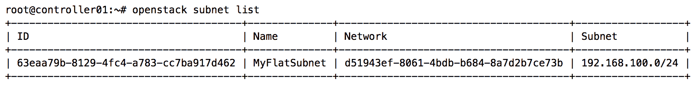

# 使用 Neutron 构建网络

在*第四章，使用 Linux 桥接创建虚拟网络基础设施*和 *第五章，使用 Open vSwitch 构建虚拟交换基础设施* 中，我们构建了一个虚拟交换基础设施，支持本书中讨论的 OpenStack Neutron 网络功能。在本章中，我们将在这个基础上构建网络资源，使其能够被实例使用。

在本章中，我将引导您完成以下任务：

+   使用 CLI 和仪表盘管理网络

+   使用 CLI 和仪表盘管理 IPv4 子网

+   管理子网池

+   创建端口

网络、子网和端口是 Neutron API 的核心资源，在*第三章，安装 Neutron* 中已介绍。这些核心资源与实例及其他虚拟网络设备之间的关系可以在以下章节中观察到。

# OpenStack 中的网络管理

OpenStack 可以通过多种方式进行管理，包括通过 Horizon 仪表盘、Neutron API 和 OpenStack CLI。由 `python-openstackclient` 包提供的命令行客户端，允许用户从与 Neutron API 接口的 shell 中执行命令。要进入 shell，请在连接到 `controller` 节点的终端中输入 `openstack`，如下所示：

```
root@controller01:~# openstack 
(openstack)
```

`openstack` shell 提供了自动完成和 `help` 命令，列出所有可用的命令。也可以直接通过 Linux 命令行使用 `openstack` 客户端来执行 OpenStack 相关的命令，如下所示：

```
# openstack network list
# openstack server create 
```

客户端提供了一些命令，帮助创建、修改和删除网络、子网以及端口。

随着时间的推移，`openstack` 客户端优于 `neutron` 客户端，但可能没有完全的命令一致性。应尽量减少使用 `neutron` 客户端。

所有 `openstack` 客户端命令可以通过使用 `--help` 标志来查看。本文中将讨论的与网络管理相关的主要命令列在下面的表格中：

| **网络命令** | **描述** |
| --- | --- |
| `network create` | 创建新的网络 |
| `network delete` | 删除网络 |
| `network show` | 显示网络详细信息 |
| `network list` | 列出网络 |
| `network set` | 设置网络属性 |
| `network unset` | 取消设置网络属性 |

无论您选择基于 Linux 桥接还是 Open vSwitch 的虚拟网络基础设施，创建、修改和删除网络和子网的过程都是相同的。然而，在幕后，将实例和其他资源连接到网络的过程有很大不同。

# 提供者网络和租户网络

有两类网络可以为实例和其他网络资源提供连接，包括虚拟路由器：

+   提供者网络

+   项目或租户网络，也称为自服务网络

在 Neutron 中创建的每个网络，无论是普通用户还是具有管理员角色的用户创建的，都具有描述该网络的提供者属性。描述网络的属性包括网络类型（如 flat、VLAN、GRE、VXLAN 或 local）、流量经过的物理网络接口以及网络的分段 ID。提供者网络与项目或租户网络之间的区别在于由谁或什么设置这些属性，以及它们在 OpenStack 中是如何管理的。

提供者网络只能由 OpenStack 管理员创建和管理，因为它们需要对物理网络基础设施的了解和配置。

OpenStack 管理员是指与 Keystone 中的 `admin` 角色相关联的用户。

当创建提供者网络时，管理员必须手动指定该网络的提供者属性。管理员需要对物理网络基础设施有一定的了解，可能还需要配置交换机端口以确保网络的正常运行。提供者网络允许由用户创建的虚拟机实例或虚拟路由器连接到它们。当提供者网络被配置为 Neutron 路由器的外部网络时，该网络被称为 **外部提供者网络**。提供者网络通常配置为 flat 或 VLAN 网络，并使用外部路由设备来正确地路由云中的流量。

自服务网络与提供者网络不同，由用户创建，通常与云中的其他网络隔离。由于无法配置物理基础设施，租户通常会在需要外部连接时将其网络连接到 Neutron 路由器。租户无法手动指定提供者属性，并且仅能创建管理员在 Neutron 配置文件中预定义的属性的网络。有关 Neutron 路由器配置和使用的更多信息，请参见 *第十章，使用 Neutron 创建独立路由器。*

# 在 CLI 中管理网络

要使用 OpenStack 客户端创建网络，请使用下面显示的 `network create` 命令：


`--share` 和 `--no-share` 参数用于分别将网络与所有其他项目共享，或限制网络仅限于拥有项目。默认情况下，网络不会被共享，仅能由拥有项目使用。Neutron 的 RBAC 功能可以用于在部分项目之间共享网络，相关内容将在 *第九章* 中讨论，*基于角色的访问控制*。

`--enable` 和 `--disable` 参数用于启用或禁用网络的管理状态。

`--availability-zone-hint` 参数用于定义应该创建网络的可用区。默认情况下，所有网络都放置在一个单一的可用区内，环境中的所有主机预计都具有为网络提供服务的能力。网络可用区是一个高级网络主题，将在*第十四章*，*高级网络主题*中涉及。

`--enable-port-security` 和 `--disable-port-security` 参数用于启用或禁用在给定网络中创建的任何端口的端口安全性。端口安全性指的是在 Neutron 端口上使用和支持安全组以及 MAC/ARP 过滤，将在*第八章*，*管理安全组*中进一步讨论。

`--qos-policy` 参数用于为网络中创建的任何端口设置 QoS 策略。质量服务扩展的配置和使用是一个高级主题，超出了本书的范围。

`--external` 和 `--internal` 参数用于指定网络是作为外部提供商网络（可以作为网关网络或浮动 IP 池使用），还是仅在云内部使用。网络的 `router:external` 属性的默认值为 `false` 或 `internal`。有关 Neutron 路由器的更多信息，请参阅*第十章*，*使用 Neutron 创建独立路由器*。

`--default` 和 `--no-default` 参数用于指定网络是否应作为云的默认外部网络，并且通常用于 Mitaka 中引入的网络自动分配功能。

Neutron 的网络自动分配功能需要 auto-allocated-topology、router、subnet_allocation 和 external-net 扩展。其中一些默认情况下没有启用。有关这些功能的更多信息，请参阅上游文档，[`docs.openstack.org/neutron/pike/admin/config-auto-allocation.html`](https://docs.openstack.org/neutron/pike/admin/config-auto-allocation.html)。

`--provider-network-type` 参数定义了正在创建的网络类型。可用的选项包括 flat、VLAN、local、GRE、geneve 和 VXLAN。要使网络类型生效，必须在 ML2 配置文件中启用相应的类型驱动程序，并且由启用的机制驱动程序支持。

`--provider-physical-network` 参数用于指定将用于通过主机转发流量的网络接口。此处指定的值对应于在 Neutron 代理配置文件中通过 `bridge_mappings` 或 `physical_interface_mappings` 选项定义的提供商标签。

`--provider-segment`参数用于指定与相应网络类型对应的唯一网络 ID。如果你创建的是 VLAN 类型的网络，则使用的值将对应于映射到该网络的 802.1q VLAN ID，并且应通过中继连接到主机。如果你创建的是 GRE 或 VXLAN 网络，则该值应为任意且唯一的整数；这个整数不会被任何其他相同类型的网络使用。该 ID 用于通过 GRE 键或 VXLAN 提供网络隔离。

GRE 和 VXLAN 网络的 VNI 头字段。当未指定`provider-segment`参数时，插件配置文件中指定的租户范围内会自动分配一个段。用户在创建网络时无法查看或指定段 ID。当项目可用范围内的所有可用 ID 耗尽时，用户将无法再创建此类型的网络。

`--tag` 和 `--no-tag` 参数用于为网络添加或移除标签。标签是应用于网络资源的标签，客户端可以使用这些标签进行过滤。

默认情况下，提供者属性只能由 Keystone 中具有管理员角色的用户设置。没有管理员角色的用户只能使用 Neutron 基于 ML2 和代理配置文件中设置的配置提供的值。

# 在 CLI 中创建平面网络

如果你回顾前面的章节，你会记得平面网络是一个没有进行 802.1q 标签化的网络。

创建平面网络的语法如下：

```
openstack network create
--provider-network-type flat
--provider-physical-network <provider-physical-network>
<name> 
```

以下是使用 OpenStack 客户端创建名为`MyFlatNetwork`的平面网络的示例。该网络将使用标记为`physnet1`的接口或桥接，并将在所有项目之间共享：


在前面的输出中，项目 ID 对应于执行了`network create`命令的用户所作用的管理员项目。由于网络是共享的，所有项目都可以创建使用`MyFlatNetwork`网络的实例和网络资源。

尝试使用相同的`provider-physical-network`名称`physnet1`创建额外的平面网络将导致错误，如下截图所示：


因为接口上只有一个未标记或本地 VLAN 可用，Neutron 无法创建第二个平面网络，并返回`Conflict`错误。鉴于这个限制，平面网络很少被使用，VLAN 网络更为常见。

# 在 CLI 中创建 VLAN 网络

VLAN 网络是 Neutron 将根据 802.1q 分段 ID 对流量进行标记的网络。用于创建 VLAN 网络的语法如下：

```
openstack network create
--provider-network-type vlan
--provider-physical-network <provider-physical-network>
--provider-segment <provider-segment>
<name> 
```

默认情况下，只有拥有管理员角色的用户才允许指定提供者属性。

在单个提供者接口上最多可以定义 4,096 个 VLAN，尽管其中一些可能会被物理交换平台保留用于内部使用。以下是使用 OpenStack 客户端创建名为 `MyVLANNetwork` 的 VLAN 网络的示例。

该网络将使用由 `physnet1` 表示的桥接器或接口，流量将被标记为 VLAN 标识符 300。结果输出如下：


要创建一个使用提供者接口的额外 VLAN 网络，只需指定一个不同的分段 ID。以下示例中，VLAN 301 用于新网络 MyVLANNetwork2。结果输出如下：


使用 VLAN 网络时，不要忘记将物理交换机端口接口配置为 trunk。此配置会因平台不同而有所不同，超出了本书的讨论范围。

# 在 CLI 中创建本地网络

当一个实例在本地网络上发送流量时，流量将保持在该实例及连接到相同桥接器和/或段的其他接口之间隔离。诸如 DHCP 和元数据之类的服务可能对本地网络中的实例不可用，尤其是当它们位于不同节点上时。

要创建一个本地网络，请使用以下语法：

```
openstack network create
--provider-network-type local
<name> 
```

使用 Linux 桥接驱动时，会为本地网络创建一个桥接器，但不会添加任何物理或标签接口。流量仅限于连接到桥接器的端口，并不会离开主机。使用 Open vSwitch 驱动时，实例会附加到集成桥接器，并且只能与同一本地 VLAN 中的其他实例进行通信。

# 在 CLI 中列出网络

要列出 Neutron 所知的网络，请使用 `openstack network list` 命令，如下图所示：


列表输出提供网络 ID、网络名称以及任何相关的子网。具有管理员角色的 OpenStack 用户可以看到所有网络，而普通用户只能看到共享网络和自己项目中的网络。

如果使用了标签，可以使用以下参数过滤结果：

+   `--tags <tag>`：列出所有具有指定标签的网络

+   `--any-tags <tag>`：列出所有具有任意指定标签的网络

+   `--not-tags <tag>`：排除所有具有指定标签的网络

+   `--not-any-tags <tag>`：排除所有具有指定标签的网络

# 在 CLI 中显示网络属性

要显示网络的属性，请使用 `openstack network show` 命令，如下所示：

```
openstack network show <network> 
```

前述命令的输出可以在以下截图中看到：


网络的各种属性可以在输出中看到，包括管理状态、默认 MTU、共享状态等。网络提供者属性对普通用户隐藏，只有具有管理员角色的用户才能查看。

# 在 CLI 中更新网络属性

有时，在网络创建后可能需要更新网络的属性。要更新网络，请使用以下 `openstack network set` 和 `openstack network unset` 命令：

```
openstack network set
[--name <name>]
[--enable | --disable]
[--share | --no-share]
[--description <description]
[--enable-port-security | --disable-port-security]
[--external | --internal]
[--default | --no-default]
[--qos-policy <qos-policy> | --no-qos-policy]
[--tag <tag>] [--no-tag]
<network>

openstack network unset
[--tag <tag> | --all-tag]
<network> 
```

`--name` 参数可用于更改网络的名称，ID 保持不变。

`--enable` 和 `--disable` 参数用于启用或禁用网络的管理状态。

`--share` 和 `--no-share` 参数分别用于将网络与所有其他项目共享，或将网络限制为仅限拥有项目使用。其他项目在共享网络中创建端口后，无法撤销该网络的共享状态，直到这些端口被删除。

`--enable-port-security` 和 `--disable-port-security` 参数用于启用或禁用从给定网络创建的任何端口上的端口安全性。端口安全性是指在 Neutron 端口上使用和支持安全组及 MAC/ARP 过滤功能，详情请参见 *第八章*，*管理安全组*。

`--external` 和 `--internal` 参数用于指定网络是否被视为外部提供者网络，该网络可以作为网关网络和浮动 IP 池使用，或者仅在云内部使用。网络的 `router:external` 属性的默认值为 false，即内部网络。

`--default` 和 `--no-default` 参数用于指定网络是否应作为云的默认外部网络。

`--qos-policy` 参数用于为网络中创建的任何端口设置 QoS 策略。

`--tag` 参数在与 set 命令一起使用时，会将指定的标签添加到网络上；与 unset 命令一起使用时，则会从网络中移除指定的标签。使用`--all-tag`与 unset 命令一起使用时，会从网络中移除所有标签。

提供者属性是网络创建后不能更改的属性之一。如果必须在网络创建后更改 `segmentation_id` 等提供者属性，则必须删除并重新创建网络。

# 在 CLI 中删除网络

要删除网络，请使用 `openstack network delete` 命令并指定网络的 ID 或名称：

```
openstack network delete <network> [<network> ...] 
```

要删除名为`MySampleNetwork`的网络，可以输入以下命令：

```
openstack network delete MySampleNetwork 
```

或者，您可以使用网络的 ID：

```
openstack network delete 3a342db3-f918-4760-972a-cb700d5b6d2c 
```

也可以同时删除多个网络，如下所示：

```
openstack network delete MySampleNetwork MyOtherSampleNetwork
```

只要实例、路由器、浮动 IP、负载均衡器虚拟 IP 和其他用户创建的端口所使用的端口被删除，Neutron 将成功删除网络。任何 Neutron 创建的端口（如用于 DHCP 名称空间的端口）将在网络被删除时自动删除。

# 在仪表盘中创建网络

网络可以在 Horizon 仪表板中创建，但创建方法可能会根据用户角色的不同而有所变化。具有管理员角色的用户可以代表其他项目创建网络并指定提供程序属性，而没有管理员角色的用户只能在各自项目内创建网络，并且具有通过 OpenStack 客户端可用的相同功能。两种方法将在以下章节中描述。

# 通过项目面板

用户可以通过仪表板中的项目标签页使用向导创建网络。要创建网络，请以演示项目中的用户身份登录并执行以下步骤：

1.  导航到 项目 | 网络 | 网络：


在前面的截图中，注意到当前定义的网络旁边没有可用的操作。即使这些网络是共享的，用户也不能修改它们，只有管理员才能进行修改。

1.  点击屏幕右上角的“创建网络”按钮。一个窗口将出现，允许你指定网络属性：


1.  在网络标签页中，你可以定义网络名称和管理状态（开启或关闭）。在仪表板中创建网络时，用户不需要在创建网络时创建子网。通过取消选中子网标签页中的“创建子网”复选框，可以完成网络创建过程：


本章后面将解释如何在仪表板中创建子网。

# 通过管理员面板

具有管理员角色的用户将在仪表板中看到额外的功能。仪表板左侧将显示管理员面板，允许管理员角色的用户操作其项目外的网络。作为云管理员在仪表板中创建网络时，请以管理员用户身份登录并执行以下步骤：

1.  导航到 管理 | 网络 | 网络：


1.  点击屏幕右上角的“创建网络”。一个向导将出现，允许你指定网络属性：


可以通过向导设置各种网络属性，包括网络类型、接口和分段 ID（如果适用）。其他选项包括将网络与项目关联、设置管理状态、启用共享、创建子网以及启用将网络用作 Neutron 路由器的外部网络。完成后，点击“创建网络”按钮以创建网络。

# OpenStack 中的子网管理

在 Neutron 中，子网是一个第 3 层对象，可以是使用无类域间路由（CIDR）表示法定义的 IPv4 或 IPv6 地址块。CIDR 是一种使用可变长度子网掩码（VLSM）分配 IP 地址的方法。子网与网络有直接关系，不能独立存在。

更多关于 CIDR 和 VLSM 的信息可以在 Wikipedia 上找到：[`en.wikipedia.org/wiki/Classless_Inter-Domain_Routing`](http://en.wikipedia.org/wiki/Classless_Inter-Domain_Routing)。

本章将讨论与子网管理相关的主要命令，列在以下表格中：

| **子网命令** | **描述** |
| --- | --- |
| `subnet create` | 创建子网 |
| `subnet delete` | 删除子网 |
| `subnet show` | 显示子网详细信息 |
| `subnet list` | 列出子网 |
| `subnet set` | 设置子网属性 |
| `subnet unset` | 取消设置子网属性 |
| `subnet pool create` | 创建子网池 |
| `subnet pool delete` | 删除子网池 |
| `subnet pool list` | 列出子网池 |
| `subnet pool set` | 设置子网池属性 |
| `subnet pool show` | 显示子网池详细信息 |
| `subnet pool unset` | 取消设置子网池属性 |

# 使用 IPv4 地址

以下是几个使用 CIDR 表示法描述的 IPv4 地址和子网的示例：

+   `192.168.100.50/24` 表示 IP 地址 `192.168.100.50`，其关联的路由前缀为 `192.168.100.0`，子网掩码为 `255.255.255.0`（即，24 个“1”位）。/24 的总地址数为 256 个，其中 254 个地址可用于使用。

+   `172.16.1.200/23` 表示 IP 地址 `172.16.0.200`，其关联的路由前缀为 `172.16.0.0`，子网掩码为 `255.255.254.0`（即，23 个“1”位）。/23 的总地址数为 512 个，其中 510 个地址可用于使用。

+   `10.0.10.4/22` 表示 IP 地址 `10.0.10.4`，其关联的路由前缀为 `10.0.8.0`，子网掩码为 `255.255.252.0`（即，22 个“1”位）。/22 的总地址数为 1,024 个，其中 1,022 个地址可用于使用。

并非每个子网中的地址都可用，因为第一个和最后一个地址通常分别被保留为网络地址和广播地址。因此，Neutron 不会将子网的第一个或最后一个地址分配给网络资源，包括实例。使用以下公式来确定在设计网络时子网中可用的总地址数。*x* 变量代表子网掩码中可用的主机位数：

```
2ˆx-2 = number of useable addresses in a subnet 
```

请记住，在创建子网时，提前规划非常重要，因为子网掩码或 CIDR 当前不是可更新的属性。当实例和其他资源消耗了子网中所有可用的 IP 地址时，设备将无法再添加到网络中。为了解决这个问题，需要创建一个新的子网并将其添加到现有网络中，或者需要创建一个全新的网络和子网。根据您的网络基础设施，这可能不是一个容易实现的变更。

VLSM 和 CIDR 在为 OpenStack 云设计网络时非常重要，并将在本章稍后讨论子网池的使用时发挥更重要的作用。

# 使用 IPv6 地址

IPv6 是 OpenStack 网络中的一等公民，但它是一个高级主题，本章将不讨论该内容。此处描述的所有与子网相关的命令在定义 IPv6 子网时行为类似，但可能需要额外的参数。

有关 Pike 中 IPv6 的更多信息，请参阅上游文档：[`docs.openstack.org/neutron/pike/admin/config-ipv6.html`](https://docs.openstack.org/neutron/pike/admin/config-ipv6.html)。

# 在 CLI 中创建子网

使用 OpenStack 客户端创建子网时，使用`subnet create`命令，如下所示：


`--project` 参数指定子网应与之关联的项目 ID，仅限具有管理员角色的用户使用。此项目应与父网络关联的项目相同。

`--project-domain` 参数指定子网应与之关联的项目域 ID，仅限具有管理员角色的用户使用（此功能不常用）。

`--subnet-pool` 参数指定子网将从中获取 CIDR 的池。

`--use-default-subnet-pool` 参数指示 Neutron 选择默认子网池以获取 CIDR。使用此参数需要首先创建至少一个子网池。

`--prefix-length` 参数指定从子网池分配子网时的前缀长度。

`--subnet-range` 参数指定要创建的子网的 CIDR 表示法。除非子网与子网池关联，否则此选项是必需的。

`--dhcp` 和 `--no-dhcp` 参数分别启用或禁用子网的 DHCP 服务。默认情况下，启用 DHCP。

网络操作不要求使用 DHCP。禁用 DHCP 仅意味着附加到子网的实例将不使用 DHCP 进行动态接口配置。相反，接口将需要手动配置或通过实例本身中的脚本或其他方法进行配置。无论 DHCP 是否启用，实例仍会在分配池范围内分配 IP 地址。

`--gateway` 参数定义了子网的网关地址。三个可选项包括 auto、none 或用户选择的 IP 地址。当子网连接到 Neutron 路由器的实例端时，路由器的接口将使用此处指定的地址进行配置。然后，该地址将作为子网中实例的默认网关。如果子网连接到 Neutron 路由器的外部端，则该地址用作路由器本身的默认网关。要查看此行为的实际效果，请参考 *第十章**，*使用 Neutron 创建独立路由器*。如果未指定网关，Neutron 将默认为 auto 并使用子网中的第一个可用地址。

`--ip-version` 参数指定了子网所表示的 IP 协议版本。可选项是 4（IPv4）和 6（IPv6）。默认值为 4。

`--ipv6-ra-mode` 参数定义了当使用 IPv6 时子网的路由器广告模式。可选项包括 `dhcpv6-stateful`、`dhcpv6-stateless` 和 `slaac`。

`--ipv6-address-mode` 参数定义了当使用 IPv6 时子网的地址模式。可选项包括 `dhcpv6-stateful`、`dhcpv6-stateless` 和 `slaac`。

不是所有的 `ipv6-ra-mode` 和 `ipv6-address-mode` 参数组合都是有效的。要查看有效和无效的用例，请参考 API 指南 [`docs.openstack.org/neutron/pike/admin/config-ipv6.html`](https://docs.openstack.org/neutron/pike/admin/config-ipv6.html)。有关 IPv6 的更多信息，请参阅附录。

`--network-segment` 参数指定了要与子网关联的网络段。

`--network` 参数指定了子网应关联的网络。多个子网可以与同一网络关联，只要子网范围不与同一网络中的其他子网重叠。

`--allocation-pool` 参数指定了子网中可以分配给端口的 IP 地址范围。IP 地址不能从单一范围中排除。然而，可以定义多个分配池来排除某些地址。例如，要从 `192.168.1.0/24` 中排除 `192.168.1.50-55`，需要使用以下语法：

```
openstack subnet create MyFlatNetwork
--subnet-range 192.168.1.0/24
--allocation-pool start=192.168.1.2,end=192.168.1.49
--allocation-pool start=192.168.1.56,end=192.168.1.254 
```

根据使用的网络类型，OpenStack 外部的设备可以与同一网络和子网中的实例共存。应定义分配池，以确保分配给实例的地址与 OpenStack 云外的设备不重叠。

`--dns-nameserver` 参数指定了子网的 DNS 名称服务器。此选项可以重复，以设置多个名称服务器。然而，默认情况下，每个子网的最大名称服务器数为五个，可以通过更新 `/etc/neutron/neutron.conf` 文件中的 `max_dns_nameservers` 配置选项来修改此值。

`--host-route`参数指定一个或多个静态路由，这些路由定义为目的地和下一跳对，并通过 DHCP 注入到实例的路由表中。此选项可以多次使用以指定多个路由。每个子网的默认最大路由数为 20，可以通过更新`/etc/neutron/neutron.conf`文件中的`max_subnet_host_routes`配置选项来修改此限制。

`--tag`和`--no-tag`参数用于将标签应用于子网或移除标签。标签是应用于网络资源的标记，客户端可以利用这些标签进行过滤。

名称参数指定子网的名称。虽然可以创建多个同名的子网，但建议子网名称保持唯一，以便于识别。

# 在 CLI 中创建子网

要展示此命令的操作效果，可以在`MyFlatNetwork`网络中创建一个具有以下特征的子网：

+   名称：`MyFlatSubnet`

+   网络协议：`IPv4`

+   子网：`192.168.100.0/24`

+   子网掩码：`255.255.255.0`

+   外部网关：`192.168.100.1`

+   DNS 服务器：`8.8.8.8, 8.8.4.4`

要创建子网并将其与`MyFlatNetwork`关联，请参考以下截图：


# 在 CLI 中列出子网

要列出现有子网，请使用`openstack subnet list`命令，如下所示：



默认情况下，命令输出提供每个可用子网的 ID、名称、CIDR 表示法以及关联的网络。具有管理员角色的用户可以看到所有子网，而普通用户则仅能看到他们所在项目的子网或与共享网络关联的子网。`openstack subnet list`命令也支持过滤器，用于缩小返回结果的范围。

如果使用了标签，可以使用以下参数对结果进行过滤：

+   `--tags <tag>`：列出所有具有指定标签的子网

+   `--any-tags <tag>`：列出所有具有任何指定标签的子网

+   `--not-tags <tag>`：排除所有具有指定标签的子网

+   `--not-any-tags <tag>`：排除所有具有任何指定标签的子网

通过使用`-h`或`--help`选项，可以查看更多详细信息。

# 在 CLI 中显示子网属性

要显示子网的属性，请使用`openstack subnet show`命令，如下所示：

```
openstack subnet show <subnet>
```

前述命令的输出可以在以下截图中查看：


# 在 CLI 中更新子网

要在 CLI 中更新子网，请使用`openstack subnet set`和`openstack subnet unset`命令，具体如下：

```
openstack subnet set
[--name <name>] [--dhcp | --no-dhcp]
[--gateway <gateway>]
[--description <description>] [--tag <tag>]
[--no-tag]
[--allocation-pool start=<ip-address>,end=<ip-address>]
[--no-allocation-pool]
[--dns-nameserver <dns-nameserver>]
[--no-dns-nameservers]
[--host-route destination=<subnet>,gateway=<ip-address>]
[--no-host-route] [--service-type <service-type>]
<subnet>

openstack subnet unset
[--allocation-pool start=<ip-address>,end=<ip-address>]
[--dns-nameserver <dns-nameserver>]
[--host-route destination=<subnet>,gateway=<ip-address>]
[--service-type <service-type>]
[--tag <tag> | --all-tag]
<subnet> 
```

`--name`参数指定子网更新后的名称。

`--dhcp`和`--no-dhcp`参数分别用于启用或禁用子网的 DHCP 服务。

依赖 DHCP 来获取或续订 IP 地址租约的实例，如果 DHCP 被禁用，可能会随着时间的推移失去网络连接。

`--gateway` 参数定义了子网的网关地址。更新子网时的两个可能选项包括无网关或用户选择的 IP 地址。

`--tag` 参数与 `set` 命令一起使用时，将指定的标签添加到子网中。与 `unset` 命令一起使用时，指定的标签将从子网中移除。使用 `--all-tag` 和 `unset` 命令一起使用时，将移除子网中的所有标签。

`--allocation-pool` 参数与 `set` 命令一起使用时，将指定的池添加到子网中。与 `unset` 命令一起使用时，指定的池将从子网中移除。

`--dns-nameserver` 参数与 `set` 命令一起使用时，将指定的 DNS 名称服务器添加到子网中。与 `unset` 命令一起使用时，指定的 DNS 名称服务器将从子网中移除。使用 `--no-name-servers` 将移除子网中的所有 DNS 名称服务器。

`--host-route` 参数与 `set` 命令一起使用时，将添加使用目标和下一跳对定义的指定静态路由。与 `unset` 命令一起使用时，将移除指定的路由。使用 `--no-host-route` 和 `set` 命令一起使用时，将从子网中移除所有主机路由。

`subnet` 参数指定正在修改的子网的名称。

# 在仪表盘中创建子网

子网可以在 Horizon 仪表盘中创建，但具体的方法可能根据用户的角色而有所不同。具有管理员角色的用户能够代表其他项目创建子网并指定一些普通用户无法使用的其他属性。没有管理员角色的用户只能在各自的项目中创建子网，并且具有通过 OpenStack 客户端可以使用的相同功能。以下章节将介绍这两种方法。

# 通过“项目”标签

用户可以通过仪表盘中的“项目”标签中的向导在创建网络时创建子网。他们还可以向现有网络添加新的子网。要创建网络和子网，登录为演示项目中的用户并执行以下步骤：

1.  导航到“项目”|“网络”|“网络”并点击“创建网络”按钮：


1.  点击“创建网络”将打开一个窗口，在该窗口中你可以指定网络和子网的详细信息：


1.  点击“子网”标签或“下一步”按钮将引导你到一个面板，在该面板中可以定义子网的详细信息，包括名称、网络地址和网关信息：


1.  最后，点击“子网详情”或“下一步”将引导你到一个面板，在该面板中可以定义其他子网详细信息，包括分配池、DNS 名称服务器和主机路由。输入这里显示的详细信息，并点击蓝色的“创建”按钮来完成网络和子网的创建：


在“操作”列下的菜单中提供了添加额外子网或完全删除网络的功能，如下图所示：


# 通过 Admin 标签

拥有管理员角色的用户会注意到仪表盘中提供了额外的功能。仪表盘左侧可以看到一个管理员面板，允许管理员角色的用户在其各自项目外部操作子网。

作为云管理员，在仪表盘中创建子网时，请以管理员用户身份登录并执行以下步骤：

1.  导航至 Admin | Network | Networks，然后点击您希望添加子网的网络名称：


1.  点击 MyVLANNetwork 会列出该网络的详细信息，包括关联的子网和端口，它们分别显示在不同的面板中：


1.  要向网络添加子网，请点击子网选项卡，并在右侧点击创建子网按钮：


1.  会弹出一个向导，允许您定义新子网的属性：


1.  点击“下一步”可以显示更多配置选项：


1.  点击蓝色的创建按钮，完成子网的创建。子网面板将相应更新：


# 管理子网池

子网池在 OpenStack 的 Kilo 版本中引入，它允许 Neutron 在创建子网时控制 IP 地址空间的分配。用户可以创建仅供其各自项目使用的子网池，或者管理员可以创建一个在多个项目之间共享的子网池。使用子网池有助于确保子网之间没有 IP 地址重叠，并使用户创建子网更加便捷。子网池非常适合与 Neutron 路由器连接的自服务网络，并且在已实现地址范围和 Neutron 的 BGP Speaker 功能的情况下非常理想。

BGP 代表边界网关协议（Border Gateway Protocol），是一种动态路由协议，用于在互联网上或自治系统内部路由流量。如需了解 Neutron 中 BGP Speaker 功能的更多信息，请参考上游文档，网址为 [`docs.openstack.org/neutron/pike/admin/config-bgp-dynamic-routing.html`](https://docs.openstack.org/neutron/pike/admin/config-bgp-dynamic-routing.html)。

# 创建子网池

创建子网池时，至少需要以下信息：

+   子网池前缀采用 CIDR 表示法

+   子网池名称

可以根据您的环境提供其他信息，并可使用 `openstack subnet pool create -h` 命令来确定。

为了演示此命令的实际操作，请创建一个具有以下特征的子网池：

+   名称：`MySubnetPool`

+   子网池 CIDR：`172.31.0.0/16`

要创建子网池，请参考以下截图：


子网池`MySubnetPool`现在可供使用，但只能由创建它的项目使用，因为`shared`为`False`。

默认前缀长度为 8，这不是理想设置，如果用户在创建子网时没有指定前缀长度，将会导致问题。强烈建议在创建子网池时设置默认前缀长度。

# 从池中创建子网

要从子网池`MySubnetPool`创建子网，请使用带有`--subnet-pool`参数的`openstack subnet create`命令。为了演示此命令的实际操作，请创建一个具有以下特征的子网：

+   名称：`MySubnetFromPool`

+   网络：`MyVLANNetwork2`

+   前缀长度：`28`

要创建子网，请参考以下截图：


如上图所示，子网的 CIDR 是从提供的子网池中划分出来的，所有其他属性都由 Neutron 自动确定。

在撰写本书时，以下错误可能会限制在创建子网时提供前缀长度时使用 OpenStack 客户端：[`bugs.launchpad.net/python-openstacksdk/+bug/1754062`](https://bugs.launchpad.net/python-openstacksdk/+bug/1754062)。如果发生错误，请尝试改用 Neutron 客户端。

# 删除子网池

要删除子网池，请使用`openstack subnet pool delete`命令，如下所示：

```
openstack subnet pool delete <subnet-pool> [<subnet-pool> ...] 
```

可以同时删除多个子网池。必须先删除引用子网池的现有子网，才能删除该子网池。

# 分配默认子网池

可以定义一个默认的子网池，允许用户在不指定前缀或子网池的情况下创建子网。在创建子网时，使用`--default-prefix-length`和`--default`参数，将子网池设置为特定网络的默认池。子网池也可以通过使用相同的参数进行更新，成为默认子网池。

以下命令演示了将`MySubnetPool`设置为默认子网池：

```
# openstack subnet pool set --default MySubnetPool 
```

成功执行前述命令后没有返回任何输出。

以下截图演示了使用默认子网池创建新子网：


如您所见，Neutron 自动从默认子网池中划分了一个/28 子网，并且在没有用户干预的情况下设置了基本属性。该子网现在可以附加到 Neutron 路由器上供实例使用。

# 在 OpenStack 中管理网络端口

在 Neutron 中，端口是虚拟网络接口与子网和网络之间的逻辑连接。端口可以与虚拟机实例、DHCP 服务器、路由器、防火墙、负载均衡器等关联。端口甚至可以仅为从子网中保留 IP 地址而创建。Neutron 将端口关系存储在 Neutron 数据库中，并通过网络插件和代理使用这些信息在物理或虚拟交换机层构建交换连接。

与端口管理相关的主要命令列在下表中：

| **端口命令** | **描述** |
| --- | --- |
| `port create` | 创建新端口 |
| `port delete` | 删除端口 |
| `port list` | 列出端口 |
| `port set` | 设置端口属性 |
| `port show` | 显示端口详细信息 |
| `port unset` | 取消端口属性 |

当在 OpenStack 中创建端口并与实例或其他虚拟网络设备关联时，它会绑定到托管实例或设备的相应节点上的 Neutron 代理。利用端口提供的详细信息，OpenStack 服务可以在主机上构建虚拟机接口（vif）或虚拟以太网接口（veth），以供虚拟机、网络命名空间或其他应用使用。

要检索所有 Neutron 端口的列表，请使用 `openstack port list` 命令，如下图所示：


具有管理员角色的用户将看到 Neutron 知道的所有端口，而普通用户仅能看到与其相应项目相关联的端口。

如果使用了标签，可以使用以下参数过滤结果：

+   `--tags <tag>`：列出所有具有给定标签的端口

+   `--any-tags <tag>`：列出具有任何给定标签的端口

+   `--not-tags <tag>`：排除具有所有给定标签的端口

+   `--not-any-tags <tag>`：排除具有任何给定标签的端口

使用 `openstack port show` 命令查看特定端口的详细信息：


上述截图中的端口属于一个接口，该接口在 DHCP 命名空间中使用，`device_owner` 为 `network:dhcp`。`network_id` 字段显示该网络为 `d51943ef-8061-4bdb-b684-8a7d2b7ce73b`，即我们在本章前面创建的 `MyFlatNetwork` 网络。

我们可以使用 `ip netns exec` 命令在 DHCP 命名空间内执行命令。如果你还记得，DHCP 命名空间可以通过前缀 `qdhcp-` 和相应的网络 ID 后缀来标识。在 `controller01` 节点上，运行 `ip addr` 命令以列出其接口及其详细信息：


在 DHCP 命名空间中，接口的 MAC 地址与端口的 `mac_address` 字段相对应，而接口的名称与 Neutron 端口的 `UUID` 的前 10 个字符相对应：


# 创建端口

通过手动创建 Neutron 端口，用户可以指定特定的固定 IP 地址、MAC 地址、安全组等。

要创建端口，请使用 `openstack port create` 命令，如下所示：

```
openstack port create
--network <network> [--description <description>]
[--device <device-id>]
[--mac-address <mac-address>]
[--device-owner <device-owner>]
[--vnic-type <vnic-type>] [--host <host-id>]
[--dns-name dns-name]
[--fixed-ip subnet=<subnet>,ip-address=<ip-address>]
[--binding-profile <binding-profile>]
[--enable | --disable] [--project <project>]
[--project-domain <project-domain>]
[--security-group <security-group> | --no-security-group]
[--qos-policy <qos-policy>]
[--enable-port-security | --disable-port-security]
[--allowed-address ip-address=<ip>[,mac-address=<mac>]]
[--tag <tag> | --no-tag]
<name>
```

创建后，端口可以与虚拟机实例或其他虚拟网络设备关联。它还可以用于在子网中保留一个 IP 地址。在下一章中，我们将探索多种方法来创建端口并将其与实例关联。

# 总结

本章为创建可供实例和其他虚拟及物理设备使用的网络和子网奠定了基础。可以使用 Horizon 仪表板和 OpenStack 命令行客户端来管理网络、子网和端口，但建议使用后者进行大多数管理任务。

有关网络、子网和端口属性的更多信息，以及如何使用 Neutron API 的指南，请参阅 OpenStack 维基：[`developer.openstack.org/api-ref/network/v2/index.html`](https://developer.openstack.org/api-ref/network/v2/index.html)。

在下一章，我们将学习创建实例并将其附加到网络的基础知识。本章中构建的一些网络将用于演示创建端口的过程，这些端口可以与实例连接，最终目标是实现端到端的连接。
