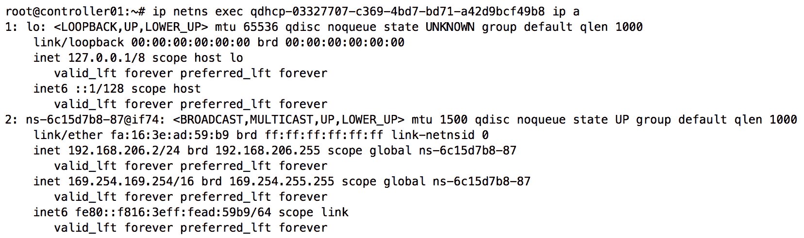
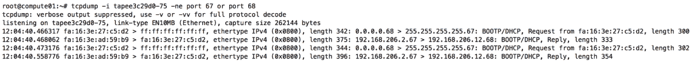

# 将实例附加到网络

在 *第六章，使用 Neutron 构建网络* 中，我们创建了多个可供云中项目使用的网络。在本章中，我们将创建居住在这些网络中的实例。

我将引导你完成以下任务：

+   创建并将实例附加到网络

+   向实例添加额外接口

+   演示 DHCP 和元数据服务

# 将实例附加到网络

使用 OpenStack 命令行客户端，实例可以通过几种方式附加到网络。实例首次创建时，可以通过 `openstack server create` 命令将其附加到一个或多个网络。正在运行的实例可以通过 `openstack server add port` 命令附加到更多的网络。以下章节将解释这两种方法。

如果你在跟着教程做，前几章中创建的网络都已被销毁并重新创建，名称和分段 ID 类似，但具有新的 ID 号。

# 在创建时将实例附加到网络

实例是通过 `openstack server create` 命令创建的，如下所示：

```
openstack server create
(--image <image> | --volume <volume>) --flavor <flavor>
[--security-group <security-group>]
[--key-name <key-name>]
[--property <key=value>]
[--file <dest-filename=source-filename>]
[--user-data <user-data>]
[--availability-zone <zone-name>]
[--block-device-mapping <dev-name=mapping>]
[--nic <net-id=net-uuid,v4-fixed-ip=ip-addr,v6-fixed-ip=ip-addr,port-id=port-uuid,auto,none>]
[--network <network>] [--port <port>]
[--hint <key=value>]
[--config-drive <config-drive-volume> | True]
[--min <count>] [--max <count>] [--wait]
<server-name>   
```

Nova 通过实例的虚拟接口（VIF）将实例连接到 `compute` 节点上的虚拟桥接器和交换机。每个 VIF 在数据库中都有一个对应的 Neutron 端口。

当使用 Open vSwitch 机制驱动程序和 Open vSwitch 防火墙驱动程序时，每个 VIF 插入到各自 `compute` 节点上的集成桥接器中。虚拟交换机端口会配置一个本地 VLAN ID，与 Neutron 端口和 VIF 关联的网络相对应。当使用 `iptables_hybrid` 防火墙驱动程序时，VIF 会连接到一个 Linux 桥接器，iptables 规则会应用于该桥接器。

当使用 Linux 桥接机制驱动程序时，每个 VIF 会连接到一个与关联网络相对应的 Linux 桥接器。每个网络都有一个相应的桥接器，用于在第二层隔离流量。

如果你需要复习这些概念，请参考 *第四章*，*使用 Linux 桥接构建虚拟交换基础设施*，以及 *第五章*，*使用 Open vSwitch 构建虚拟交换基础设施*。

# 指定网络

`openstack server create` 命令提供了 `--nic` 参数，用于指定要附加到实例的网络或端口。

用户可以通过使用 `net-id` 键，指定由网络 ID 标识的网络：

```
--nic net-id=<Network ID> 
```

在前面的例子中，Nova 与 Neutron API 交互，通过用户提供的网络 ID 创建端口。然后，Neutron 将端口的详细信息返回给 Nova，供实例使用。用户可以分别使用`v4-fixed-ip`和`v6-fixed-ip`键请求特定的未使用 IPv4 或 IPv6 地址，如下所示：

```
--nic net-id=<Network ID>,v4-fixed-ip=<ipv4 address>
--nic net-id=<Network ID>,v6-fixed-ip=<ipv6 address> 
```

# 指定端口

用户还可以使用 `port-id` 键，通过端口 ID 指定一个已经识别的端口，如下所示：

```
--nic port-id=<Port ID> 
```

在此示例中，Neutron 将现有端口与实例关联，并相应地设置该端口的`device_id`属性。以后可以使用这种方法将端口从实例中分离，并将其与新实例关联。可选项包括 auto、none 或现有端口的 ID。默认值为 auto。

# 附加多个接口

通过多次传递`--nic`参数，可以将多个网络接口附加到实例。实例中的接口随后可以按`eth0`、`eth1`、`eth2`等方式进行枚举，这取决于操作系统。

向实例附加多个网络接口被称为**多宿主**。当一个实例是多宿主时，Neutron 或实例本身无法知道哪个网络优先于另一个。当附加的网络和子网有各自的网关地址时，实例的路由表可能会填充多个默认路由。这种情况可能会对实例的连接性和路由行为造成严重影响。此配置在直接将实例连接到多个网络时非常有用，但在这种设计中应注意避免网络问题。

使用 virtio 驱动的网络和存储设备等准虚拟化设备是 PCI 设备。KVM 下的虚拟机实例当前限制为最多 32 个 PCI 设备。一些 PCI 设备对操作至关重要，包括主机桥、ISA/USB 桥、显卡和内存气球设备，因此最多可以使用 28 个 PCI 插槽。每个准虚拟化的网络或块设备使用一个插槽。这意味着用户在尝试将多达 20-25 个网络连接到实例时，可能会遇到问题，这取决于该实例的特性。

以下`openstack server create`命令演示了在创建实例时将实例连接到多个网络的基本过程：

```
openstack server create --flavor FLAVOR --image IMAGE \
--nic net-id=NETWORK1 \
--nic net-id=NETWORK2 \
--nic net-id=NETWORK3 \
<SERVER-NAME> 
```

在实例内部，第一张附加的网络接口卡（NIC）对应`NETWORK1`，第二张网络接口卡对应`NETWORK2`，依此类推。对于许多支持云的镜像，实例中的单一网络接口会通过 DHCP 自动上线。一旦实例启动，可能需要修改网络接口文件或在实例内使用`dhclient`命令来激活并配置其他网络接口。

# 向运行中的实例附加网络接口

使用`openstack server add port`或`openstack server add fixed ip`命令，可以将现有端口或新端口附加到运行中的实例。

`openstack server add port`命令可以如下使用：

```
openstack server add port <server> <port>
```

port 参数指定要附加到给定服务器的端口。该端口必须是当前未与任何其他实例或资源关联的端口，否则操作将失败。

`openstack server add fixed ip`命令可以如下使用：

```
openstack server add fixed ip
[--fixed-ip-address <ip-address>]
<server> <network> 
```

网络参数指定要附加到给定服务器的网络。将自动创建一个具有唯一 MAC 地址和来自指定网络的 IP 地址的新端口。

`--fixed-ip-address` 参数可用于指定给定网络中的特定 IP 地址，而不是依赖 Neutron 的自动分配。

虽然可以使用热插拔技术将额外的网络接口添加到运行中的实例，但这些接口可能需要在操作系统中进行配置才能使用。您可以使用 `dhclient` 命令通过 DHCP 配置新连接的接口，或手动配置接口文件。

# 分离网络接口

要从实例中分离接口，使用 `openstack server remove port` 或 `openstack server remove fixed ip` 命令，如下所示：

```
openstack server remove port <server> <port>
openstack server remove fixed ip <server> <ip-address> 
```

从实例中分离的接口将完全从 Neutron 端口数据库中移除。

从正在运行的实例中移除接口时需要小心，因为这可能导致实例内出现意外行为。

# 探索实例如何获取其地址

当创建网络并在子网中启用 DHCP 时，该网络将调度到环境中的一个或多个 DHCP 代理。在大多数环境中，DHCP 代理配置在 `controllers` 或专用的 `network` 节点上。在更高级的环境中，如使用网络段和叶/脊拓扑的环境中，DHCP 代理可能需要配置在 `compute` 节点上。

DHCP 代理负责为每个已调度到该代理的网络创建一个本地网络命名空间。然后，在命名空间内的虚拟接口上配置一个 IP 地址，并运行一个 `dnsmasq` 进程，监听网络上的 DHCP 请求。如果网络上已有一个 `dnsmasq` 进程并且添加了新子网，则会更新现有进程以支持该子网。

当子网未启用 DHCP 时，`dnsmasq` 进程不会启动。尽管如此，IP 地址仍然与实例内接口对应的 Neutron 端口关联。然而，在没有 DHCP 服务的情况下，用户必须通过控制台连接手动配置客户操作系统中接口的 IP 地址。

大多数实例依赖 DHCP 获取关联的 IP 地址。DHCP 遵循以下阶段：

+   DHCP 客户端发送一个 `DHCPDISCOVER` 广播包，请求 DHCP 服务器提供 IP 信息。

+   DHCP 服务器响应请求，发送一个 `DHCPOFFER` 包。该包包含发出请求的实例的 MAC 地址、IP 地址、子网掩码、租期和 DHCP 服务器的 IP 地址。一个 Neutron 网络可以同时调度到多个 DHCP 代理，每个 DHCP 服务器都可能响应一个 `DHCPOFFER` 包。然而，客户端只会接受第一个响应。

+   响应提供时，DHCP 客户端会向 DHCP 服务器发送一个`DHCPREQUEST`数据包，申请所提供的地址。

+   响应请求时，DHCP 服务器会向实例发出一个`DHCPACK`数据包或确认数据包。此时，IP 配置已完成。DHCP 服务器还会向实例发送其他 DHCP 选项，例如名称服务器、路由等。

与 DHCP 服务器相关联的网络命名空间以`qdhcp`为前缀，后跟完整的网络 ID。DHCP 命名空间仅存在于运行`neutron-dhcp-agent`服务的主机上。即便如此，网络必须被调度到 DHCP 代理上，才能在该主机上创建命名空间。在此示例中，DHCP 代理运行在`controller01`节点上。

要查看`controller01`节点上的命名空间列表，请使用如下命令：`ip netns list`


输出中列出的两个命名空间直接对应于存在子网并启用 DHCP 的两个网络：


在`qdhcp`命名空间内存在一个接口，用于连接命名空间和虚拟网络基础设施，适用于网络`MyVLANNetwork`：



在命名空间内的接口`ns-6c15d7b8-87`是`veth`接口的一个端点。分配给`ns-6c15d7b8-87`接口的 IP 地址`192.168.206.2/24`已由 Neutron 自动分配，并从子网的分配池中获取。

使用 Linux 桥接驱动时，接口的另一端，即对端，连接到与网络对应的桥接，并由`tap6c15d7b8-87`接口表示，如下截图所示：


在前面的截图中，标签为`brq7745a4a9-68`的桥接网络对应于网络`MyFlatNetwork`，通过连接到桥接的`untagged`接口`eth2`可以看出。接口`tapd1848f67-2e`是`veth`接口的另一端，连接到网络`MyFlatNetwork`的 DHCP 命名空间。

# 观察 DHCP 租约周期

在此示例中，将创建一个具有以下特征的实例：

+   名称：`TestInstance1`

+   Flavor: `tiny`

+   镜像: `cirros-0.4.0`

+   网络：`MyVLANNetwork`

+   计算节点：`compute01`

创建实例的命令如下：

```
openstack server create \ 
--image cirros-0.4.0 \ 
--flavor tiny \
--nic net-id=MyVLANNetwork \
--availability-zone nova:compute01 \
TestInstance1
```

可能在你的环境中没有`tiny` flavor，但可以创建并定义其配置为 1 vCPU、1 MB 内存和 1 GB 硬盘。

要观察实例请求 DHCP 租约，可以使用以下命令在与实例网络对应的 DHCP 网络命名空间内启动数据包捕获：

```
ip netns exec <namespace> tcpdump -i any -ne port 67 or port 68 
```

当实例启动时，它会发送广播数据包，DHCP 服务器将在命名空间内对其进行响应：


在前面的截图中，可以观察到 DHCP 租约周期的所有四个阶段。通过在`compute`节点的实例 tap 接口上执行捕获，也可以观察到类似的输出：



使用`dhcpdump`工具，我们可以观察到更详细的 DHCP 租约周期输出。要安装`dhcpdump`，在所有节点上执行以下命令：

```
# apt install dhcpdump 
```

在托管`MyVLANNetwork`网络的 DHCP 服务器的网络命名空间内，运行`dhcpdump`，如下所示：

```
root@controller01:~# ip netns exec qdhcp-03327707-c369-4bd7-bd71-a42d9bcf49b8 dhcpdump -i ns-6c15d7b8-87 
```

当客户端发出初始 DHCP 请求时，你将看到一个`DHCPDISCOVER`广播包：


然后，`DHCP`服务器将直接向实例发送一个`DHCPOFFER`单播包：


接下来，客户端将发送一个`DHCPREQUEST`广播包：


最后，DHCP 服务器将通过一个`DHCPACK`单播包确认请求：


# 排查 DHCP 问题

如果实例无法从 DHCP 获取其地址，可能有助于从网络中的不同位置进行数据包捕获，以查看请求或回复失败的原因。

使用`tcpdump`或`dhcpdump`，可以从以下位置捕获在 UDP 端口`67`和`68`上的 DHCP 请求和响应数据包：

+   在 DHCP 命名空间内

+   在`network`和/或`compute`节点的物理接口上

+   在实例的 tap 接口上

+   通过控制台在客户操作系统中

一旦识别出负责丢包的节点或接口，可能需要进一步调查。

# 探索实例如何检索其元数据

在*第三章*，《安装 Neutron》中，我们简要介绍了实例通过网络访问元数据的过程：通过路由器命名空间或 DHCP 命名空间的代理。后者将在以下部分中描述。

# DHCP 命名空间

实例通过[`169.254.169.254`](http://169.254.169.254)访问元数据，后跟与元数据版本对应的 URI，通常是`/latest`。当实例连接到不使用 Neutron 路由器作为网关的网络时，实例必须学会如何访问元数据服务。可以通过以下几种方式来实现：

+   在实例上手动设置路由

+   允许 DHCP 提供路由

当在 DHCP 配置文件`/etc/neutron/dhcp_agent.ini`中将`enable_isolated_metadata`设置为`True`时，每个 DHCP 命名空间会为运行在`controller`节点上的元数据服务提供代理。代理服务直接在端口`80`上监听，如下图所示：


在命名空间中使用`ps`命令，您可以看到与此监听器相关的进程是 Neutron 元数据代理：


# 添加到 169.254.169.254 的手动路由

在实例能够到达位于`169.254.169.254`的 DHCP 命名空间中的元数据服务之前，必须配置一条路由，使用 DHCP 命名空间接口作为下一跳，而不是实例的默认网关。

观察以下 DHCP 命名空间中的 IP 地址：


`169.254.169.254/16`已自动配置为命名空间内部接口的二级地址。要从`192.168.206.0/24`网络中的实例访问`169.254.169.254`，可以在来宾实例中使用以下`ip route`命令，设置`192.168.206.2`为下一跳：

```
# ip route add 169.254.169.254/32 via 192.168.206.2 
```

虽然这种方法可行，但将路由添加到每个实例的过程并不具有良好的扩展性，特别是当环境中存在多个 DHCP 代理时。一个网络可以调度到多个代理，而这些代理又有各自的命名空间和 IP 地址，且都在同一子网中。用户需要提前了解在其路由语句中使用的 IP 地址，而且该地址可能会发生变化。允许 DHCP 自动注入路由是推荐的方法，下一节将讨论这种方法。

# 使用 DHCP 注入路由

当`enable_isolated_metadata`设置为`True`并且子网的网关未设置或不是 Neutron 路由器时，DHCP 服务能够通过无类静态路由 DHCP 选项（也称为选项 121）注入到元数据服务的路由。

包括 Neutron 在内的多种任务所使用的可能 DHCP 选项，可以在 IANA 网站的以下 URL 找到：[`www.iana.org/assignments/bootp-dhcp-parameters/bootp-dhcp-parameters.xhtml`](https://www.iana.org/assignments/bootp-dhcp-parameters/bootp-dhcp-parameters.xhtml)。

一旦创建了连接到具有上述特征的子网的实例，观察通过 DHCP 传递给实例的以下路由：


元数据路由的下一跳地址是响应客户端初始 DHCP 请求的 DHCP 服务器的 IP 地址。如果环境中有多个 DHCP 代理并且相同的网络被调度到它们所有人，那么每个实例的下一跳地址可能会有所不同，因为任何一个 DHCP 服务器都可能响应该请求。

# 概述

在本章中，我演示了如何将实例连接到网络，并阐述了实例从 OpenStack 管理的 DHCP 服务器获取其 IP 地址的过程。我还向您展示了当实例连接到 VLAN 提供商网络时，如何访问元数据服务。本章中的相同示例可以应用于任何最近的 OpenStack 云以及许多不同的网络拓扑。

有关基于提供者网络的部署场景的更多详细信息，请参阅以下 OpenStack Pike 版本的上游文档，位置如下：

**Open vSwitch**：[`docs.openstack.org/neutron/pike/admin/deploy-ovs-provider.html`](https://docs.openstack.org/neutron/pike/admin/deploy-ovs-provider.html)

**Linux 桥接**：

[`docs.openstack.org/neutron/pike/admin/deploy-lb-provider.html`](https://docs.openstack.org/neutron/pike/admin/deploy-lb-provider.html)

在下一章中，我们将学习如何利用 Neutron 安全组功能为实例提供网络级安全。
