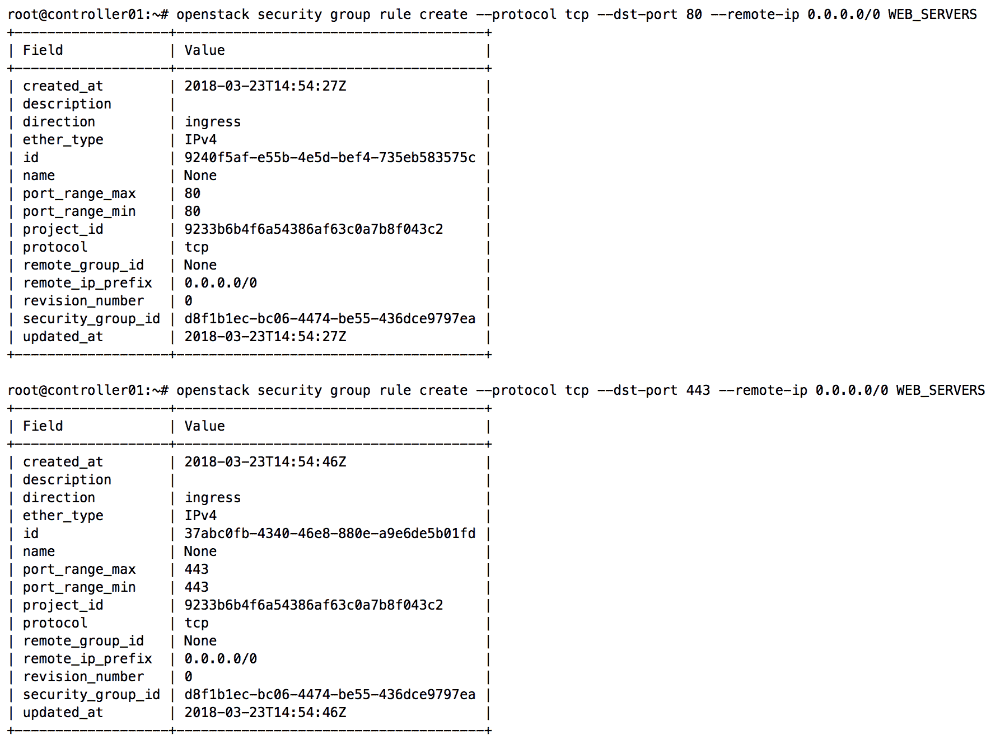
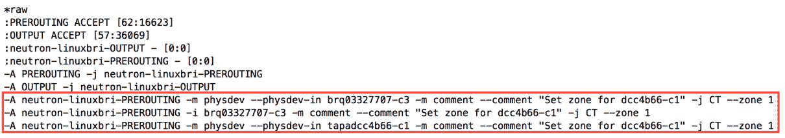

# 第八章：管理安全组

OpenStack 网络提供了两种不同的 API，用于实现网络流量过滤器。第一种 API，称为安全组 API，在实例端口级别提供基本的流量过滤。安全组规则在 iptables 中或作为 Open vSwitch 流规则在计算节点上实现，并过滤进入或离开 Neutron 端口的流量。第二种 API，称为防火墙即服务 API（FWaaS），也在端口级别实现过滤规则，但它将过滤能力扩展到路由器端口和其他除传统实例端口外的端口。

在本章中，我们将重点介绍安全组，并涵盖 Neutron 的一些基本安全功能，包括以下内容：

+   iptables 简介

+   创建和管理安全组

+   演示通过 iptables 的流量流动

+   配置端口安全

+   管理允许的地址对

由于在 Pike 和 Queens 版本的 OpenStack 中仍处于实验阶段，本书将不讨论 `openvswitch` 防火墙驱动。

# OpenStack 中的安全组

**安全组** 是一组网络访问规则，称为 **安全组规则**，它限制了实例可以发送或接收的流量类型。当使用基于 iptables 的驱动时，安全组规则会转换为 iptables 规则，并应用于托管实例的 `compute` 节点。每个 OpenStack 项目都提供了一个默认的安全组，用户可以在该项目中对其进行修改。OpenStack 网络提供了一个 API，用于创建、修改、应用和删除安全组及规则。

有多种方法可以将安全组应用于实例。例如，可以将一个或多个实例（通常具有相似的功能或角色）放入一个安全组中。安全组规则可以引用 IPv4 和 IPv6 主机以及网络，还可以引用其他安全组。通过在规则中引用特定的安全组，而不是特定的主机或网络，可以使用户免于指定单独的网络地址。Neutron 会根据数据库中的信息自动构建应用于主机的过滤规则。

安全组中的规则在计算节点的端口级别应用，如下图所示：


在前面的图示中，虚拟交换机中的端口属于三个安全组之一：WEB、DB 或 APP。当安全组发生变化时，例如添加或删除组内规则，`compute` 节点上的相应 iptables 规则会自动更新。

一些用户可能会使用安全组来描述应该应用于特定实例端口的某些类型的规则。例如，可以使用安全组来分类允许访问某个端口的多个主机或子网。可以将多个安全组应用于一个端口，并且所有在这些组中定义的规则都会应用到该端口。因为所有流量默认被拒绝，而安全组规则仅定义了通过端口的允许流量，所以不存在一个安全组中的规则与另一个安全组中规则相互冲突的情况。

以下示例演示了使用安全组对允许通过端口访问的流量进行分类：


当在 Neutron 中创建一个端口时，除非指定了特定的安全组，否则它会关联到默认的安全组。默认的安全组会丢弃所有入站流量，并允许所有出站流量通过该端口。可以向默认安全组添加或删除规则，以改变其行为。此外，基础的端口安全规则会应用到每个端口，禁止 IP、DHCP 和 MAC 地址欺骗。此行为可以更改，稍后在本章中会讨论。

# Iptables 介绍

Iptables 是 Linux 内置的防火墙，它允许系统管理员定义包含规则链的表，这些规则链决定了如何处理网络数据包。数据包通过在以下表中依次遍历链中的规则来进行处理：

+   **Raw**：这是一个默认的表，用于在其他任何表之前过滤数据包。它主要用于与连接跟踪相关的规则。

+   **Filter**：这是一个默认的表，用于过滤数据包。

+   **NAT**：这是一个默认的表，用于网络地址转换。

+   **Mangle**：这是一个默认的表，用于专门的数据包修改，不会被安全组 API 使用。

链中的规则可以导致跳转到另一个链，而后者又可以跳转到另一个链，如此循环。这种行为可以根据需要重复任意多级的嵌套。如果流量没有匹配子链中的规则，系统会记住跳转发生的地方，并返回该点继续处理。当启用 iptables 时，每个到达或离开接口的网络数据包至少会经过一个链。

有五个默认链，数据包的来源决定了最初会经过哪个链。这五个默认链包括：

+   **PREROUTING**：数据包将在做出路由决策之前进入此链。PREROUTING 链由 raw、mangle 和 NAT 表使用。

+   **输入**：当数据包要被本地传递到主机时使用。INPUT 链由 mangle 和 filter 表使用。

+   **FORWARD**: 所有路由过的并且不用于本地传递的数据包将通过此链路。FORWARD 链路被 mangle 和 filter 表使用。

+   **OUTPUT**: 主机本身发送的数据包将通过此链路。OUTPUT 链路被 raw、mangle、NAT 和 filter 表使用。

+   **POSTROUTING**: 路由决策已经做出后，数据包将进入此链路。POSTROUTING 链路被 mangle 和 NAT 表使用。

链路中的每条规则包含数据包可以匹配的标准。规则也可以包含目标，如另一个链路，或者结果，如 DROP 或 ACCEPT。当数据包通过链路时，会检查每条规则。如果规则不匹配数据包，则数据包传递到下一条规则。如果规则匹配数据包，则根据目标或结果执行规则指示的操作。

可能的结果包括以下内容：

+   **ACCEPT**: 数据包被接受并发送到应用程序进行处理

+   **DROP**: 数据包被静默丢弃

+   **REJECT**: 数据包被丢弃并向发送方发送错误消息

+   **LOG**: 数据包详细信息被记录

+   **DNAT**: 这会重写数据包的目标 IP

+   **SNAT**: 这会重写数据包的源 IP

+   **RETURN**: 处理返回到调用链路

ACCEPT、DROP 和 REJECT 结果常被 filter 表使用。常见的规则标准包括以下内容：

+   `-p <protocol>`: 匹配诸如 TCP、UDP、ICMP 等协议

+   `-s <ip_addr>`: 匹配源 IP 地址

+   `-d <ip_addr>`: 匹配目标 IP 地址

+   `--sport`: 匹配源端口

+   `--dport`: 匹配目标端口

+   `-I <interface>`: 匹配数据包进入的接口

+   `-o <interface>`: 匹配数据包退出的接口

Neutron 从用户那里抽象出安全组规则的实现，但了解其工作原理对于负责故障排除的操作员很重要。有关 iptables 的更多信息，请访问以下资源：

+   [`www.booleanworld.com/depth-guide-iptables-linux-firewall/`](https://www.booleanworld.com/depth-guide-iptables-linux-firewall/)

+   [`help.ubuntu.com/community/IptablesHowTo`](https://help.ubuntu.com/community/IptablesHowTo)

# 使用 ipset

在 Juno 之前的 OpenStack 版本中，为每个规则中引用的安全组创建了指数数量的 iptables 规则，这些规则对应于每个源和目标地址和端口对。这种行为导致 L2 代理性能差，并且存在虚拟机实例连接到虚拟桥但无法成功连接到网络的竞争条件。

从 Juno 版本开始，iptables 的 ipset 扩展被用于尝试通过创建地址和端口的组进行高效存储以减少所需的 iptables 规则数量。

如果没有 ipset，允许连接到端口 `80` 的 iptables 规则可能如下所示：

```
iptables -A INPUT -p tcp -d 1.1.1.1 --dport 80 -j RETURN
iptables -A INPUT -p tcp -d 2.2.2.2 --dport 80 -j RETURN
iptables -A INPUT -p tcp -d 3.3.3.3 --dport 80 -j RETURN
iptables -A INPUT -p tcp -d 4.4.4.4 --dport 80 -j RETURN 
```

上述代码中的匹配语法 `-d x.x.x.x` 表示“匹配目标地址为 `x.x.x.x` 的数据包”。为了允许所有四个地址，必须定义四条独立的 iptables 规则，每条规则包含一个独立的匹配规范。

或者，可以使用 `ipset` 和 `iptables` 命令的组合来实现相同的结果：

```
ipset -N webset iphash
ipset -A webset 1.1.1.1
ipset -A webset 2.2.2.2
ipset -A webset 3.3.3.3
ipset -A webset 4.4.4.4
iptables -A INPUT -p tcp -m set --match-set webset dst --dport 80 -j RETURN 
```

`ipset` 命令创建一个新的集合，名为 webset，其中包含四个地址。`iptables` 命令通过 `--m set --match-set webset dst` 引用该集合，表示“匹配目标地址与名为 webset 的集合中的某个条目相匹配的包”。

通过使用 ipset，只需一条规则即可完成之前需要四条规则才能完成的任务。虽然在这个例子中节省的规则很少，但随着实例被添加到安全组并且安全组规则配置的增多，规则的减少对性能和可靠性的影响会变得非常明显。

# 管理安全组

安全组可以通过 Neutron ReST API、OpenStack CLI 或 Horizon 仪表板进行管理。两种方法都提供了相当完整的体验，以下部分将详细讨论。

# 在 CLI 中管理安全组

在 OpenStack 命令行客户端中，可以使用多个命令来管理安全组。本章将讨论与安全组管理相关的主要命令，以下表格列出了这些命令：

| **安全组命令** | 描述 |
| --- | --- |
| `security group create` | 创建一个新的安全组 |
| `security group delete` | 删除安全组 |
| `security group list` | 列出安全组 |
| `security group rule create` | 创建一个新的安全组规则 |
| `security group rule delete` | 删除安全组规则 |
| `security group rule list` | 列出安全组规则 |
| `security group rule show` | 显示安全组规则详情 |
| `security group set` | 设置安全组属性 |
| `security group show` | 显示安全组详情 |
| `server add security group` | 向服务器添加安全组 |
| `server remove security group` | 从服务器中移除安全组 |

# 在 CLI 中创建安全组

要创建一个安全组，请使用 `openstack security group create` 命令，格式如下：

```
openstack security group create
[--description <description>]
[--project <project>]
[--project-domain <project-domain>]
<name> 
```

默认情况下，Neutron 中的安全组已预填充了两条出站规则，允许所有 IPv4 和 IPv6 的出站流量。默认情况下不允许入站流量。

# 在 CLI 中删除安全组

要删除一个安全组，请使用 `openstack security group delete` 命令，并指定安全组的 ID 或名称：

```
openstack security group delete <group> [<group> ...] 
```

要删除名为 `MySampleSecGrp` 的安全组，可以输入以下命令：

```
openstack security group delete MySampleSecGrp 
```

另外，你可以使用该安全组的 ID：

```
openstack security group delete f8ch3db3-e25b-4760-972a-cb700d9a73dc 
```

也可以同时删除多个安全组，如下所示：

```
openstack security group delete MySampleSecGrp MyOtherSampleSecGrp 
```

只要使用该安全组的端口在请求之前已经被删除，Neutron 将成功删除安全组。

# 在 CLI 中列出安全组

要获取安全组列表，请使用以下`openstack security group list`命令：

```
openstack security group list
[--project <project>]
[--project-domain <project-domain>] 
```

返回的输出包括与指定项目相关联的所有安全组的 ID、名称和描述。如果以具有管理员角色的用户身份运行，将列出所有项目的所有安全组。

# 在 CLI 中显示安全组的详细信息

要显示安全组的详细信息，请使用`openstack security group show`命令，如下所示：

```
openstack security group show <group>
```

可以指定安全组的名称或 ID。返回的输出包括描述、ID、名称、关联的项目 ID 以及安全组内的各个规则。

# 在 CLI 中更新安全组

要更新安全组的属性，请使用以下`openstack security group set`命令：

```
openstack security group set
[--name <new-name>]
[--description <description>]
<group> 
```

尝试修改默认安全组的名称会导致错误。

# 在 CLI 中创建安全组规则

要创建安全组规则，请使用以下`openstack security group rule create`命令：

```
openstack security group rule create
[--remote-ip<ip-address> | --remote-group <group>]
[--description <description>]
[--dst-port <port-range>]
[--icmp-type <icmp-type>]
[--icmp-code <icmp-code>]
[--protocol <protocol>]
[--ingress | --egress]
[--ethertype<ethertype>]
[--project <project>]
[--project-domain <project-domain>]
<group> 
```

`--remote-ip`参数是可选的，允许您指定规则适用的源地址或网络。地址或网络应使用 CIDR 格式定义。

`--remote-group`参数是可选的，允许您指定规则应适用于的安全组的名称或 ID，而不是单个 IP 地址或网络。例如，在创建允许 SQL 流量进入数据库服务器的规则时，您可以指定应用服务器所在安全组的 ID，而无需指定它们的单个 IP 地址。

`--description`参数用于为安全组规则添加描述。

`--dst-port`参数是可选的，允许您指定目标端口或端口范围，端口范围之间用冒号分隔，如 137:139\。此选项对于 TCP 和 UDP 协议是必需的。

`--icmp-type`和`--icmp-code`参数分别指定 ICMP 类型和代码，用于 ICMP IP 协议。在没有特定类型和代码的情况下允许整个 ICMP 协议可以满足大多数使用场景。

`--protocol`参数是可选的，允许您根据 IP 协议匹配流量。可能的选项包括 ah、dccp、egp、esp、gre、icmp、igmp、ipv6-encap、ipv6-frag、ipv6-icmp、ipv6-nonxt、ipv6-opts、ipv6-route、ospf、pgm、rsvp、sctp、tcp、udp、udplite、vrrp 或一个 IP 协议号[0-255]。默认值是 tcp。

`--ingress`参数表示该规则适用于传入流量，而`--egress`参数表示该规则适用于实例的传出流量。这两个参数是互斥的，意味着只能使用其中一个来描述规则的方向。如果未指定，默认方向为传入（ingress）。

`--ethertype`参数是可选的，允许你指定规则是适用于 IPv4 还是 IPv6 流量。

`--project`和`--project-domain`参数是可选的，可用于指定与创建规则的用户关联的其他项目和域。

`group`参数用于指定规则应该关联的安全组的名称或 ID。

# 在 CLI 中删除安全组规则

要删除安全组规则，请使用`openstack security group rule delete`命令，并指定安全组规则的 ID 或名称：

```
openstack security group rule delete <group> [<group> ...] 
```

要删除名为`MySampleSecGrpRule80`的安全组，可以输入以下命令：

```
openstack security group rule delete MySampleSecGrpRule80
```

也可以同时删除多个安全组，如下所示：

```
openstack security group delete MySampleSecGrpRuleTcp80 MySampleSecGrpRuleUDP123 
```

虽然可以删除默认安全组中的规则，但无法删除该安全组本身。

# 在 CLI 中列出安全组规则

要获取安全组规则及其关联的安全组的列表，请使用`openstack security group rule list`命令，如下所示：

```
openstack security group rule list
[--protocol <protocol>]
[--ingress | --egress] [--long]
[<group>] 
```

所有参数都是可选的，但可以用来过滤结果。返回的输出包括与作用域项目相关的所有安全组规则的 ID、协议、IP 范围、远程安全组和关联的安全组。如果指定`--long`，将提供标准输出中没有的附加详细信息，包括方向和以太类型。如果以管理员角色运行，所有项目中的所有安全组规则都将列出。

# 在 CLI 中显示安全组规则的详细信息

要显示安全组规则的详细信息，请使用`openstack security group rule show`命令，如下所示：

```
openstack security group rule show <group> 
```

# 将安全组应用于实例和端口

在 CLI 中将安全组应用于实例通常是在实例创建时完成，使用`openstack server create`命令，如下所示：

```
openstack server create
--flavor <FLAVOR_ID>
--image <IMAGE_ID>
--nic net-id=<NETWORK_ID>
--security-group <SECURITY_GROUP_ID>
INSTANCE_NAME 
```

通过使用`openstack port set`或`openstack server add security group`命令，也可以将安全组应用于正在运行的实例。以下示例演示了使用`openstack port set`命令将安全组应用于端口。

在此示例中，安全组将应用于端口，相关规则将立即生效：

```
openstack port set <PORT> --security-group <SECURITY_GROUP> 
```

一个端口可以同时关联多个安全组。要将多个安全组应用于端口，请在每个安全组之前使用`--security-group`参数，如下所示：

```
openstack port set <PORT>
--security-group <SECURITY_GROUP_1>
--security-group <SECURITY_GROUP_2>
--security-group <SECURITY_GROUP_3> 
```

以下示例演示了使用`openstack server add group`命令将安全组应用于实例：

```
openstack server add security group <INSTANCE> <SECURITY_GROUP> 
```

由于命令中不能指定端口，因此安全组将应用于与实例关联的所有端口。

# 在 CLI 中从实例和端口中移除安全组

要移除单个安全组，请使用`openstack server remove security group`命令，如以下示例所示：

```
openstack server remove security group <INSTANCE> <SECURITY_GROUP>
```

另外，您可以使用`openstack port unset`命令将安全组从端口中移除：

```
openstack port unset --security-group <SECURITY GROUP> <PORT>
```

要从端口中移除所有安全组，包括默认组，请使用带有`--no-security-group`参数的`openstack port set`命令，如下所示：

```
openstack port set --no-security-group <PORT> 
```

# 实施安全组规则

在以下示例中，创建了一个名为 WEB1 的实例，该实例作为 Web 服务器运行 Apache，监听端口 80 和 443。向 192.168.206.6:80 发起请求最终超时：


为了演示如何在计算节点上实现安全组规则，请注意以下 WEB_SERVERS 安全组：


以下截图展示了使用`openstack security group rule create`命令将两条安全组规则添加到 WEB_SERVERS 安全组。这些规则允许来自任何远程主机通过端口 80 和 443 的入站连接，CIDR 为 0.0.0.0/0：



使用`openstack server add security group`命令，可以将 WEB_SERVERS 安全组应用到 WEB1 实例，如下所示：


一旦安全组被应用到实例的相应端口，计算节点上会实施一系列的 iptables 规则和链。快速的连接性检查表明这些规则按预期工作：


# 逐步执行链

在 Linux 桥接和 Open vSwitch 环境中，使用 iptables 实施安全组规则的方式是类似的。在`compute01`上，作为本示例中的计算节点，运行 Linux 桥接代理并托管实例，显示通过 Neutron 代理应用的 iptables 规则，可以使用`iptables-save`或`iptables -L`命令观察到。

为了提高可读性，以下截图仅显示与实例相关的原始表和过滤器表中的规则。一些注释已被删除或缩短以适应页面：


首先，查询原始表（raw table）的 PREROUTING 链。在 PREROUTING 链中，我们可以找到将流量与实例接口和/或相关网络关联到特定 conntrack 区域的规则：



每个 Neutron 网络对应一个 conntrack 区域，这有助于在项目之间的地址空间重叠时区分流量。Conntrack 是连接跟踪系统的一部分，iptables 在执行有状态数据包检查时使用它。

接下来，网络流量可能会穿越过滤器表中的 INPUT 链，如下所示：

```
-A INPUT -j neutron-linuxbri-INPUT 
```

该规则跳转到一个名为 neutron-linuxbri-INPUT 的链，如下所示：

```
-A neutron-linuxbri-INPUT -m physdev 
--physdev-in tapadcc4b66-c1 
--physdev-is-bridged -j neutron-linuxbri-oadcc4b66-c 
```

该规则表示，流量通过 `tapadcc4b66-c1` 接口离开实例时，应转发到 `neutron-linuxbri-oadcc4b66-c` 链，如下所示：


`neutron-linuxbri-oadcc4b66-c` 链的规则规定，只有在客户端试图从 DHCP 服务器获取地址时，才允许外发的 DHCP 流量。默认情况下，实例不允许作为 DHCP 服务器，流量会被相应丢弃。规则还规定，标记为 RETURN 或 ESTABLISHED 的流量将被允许，但 INVALID 数据包将被丢弃。最后，任何不匹配的流量将被 `neutron-linuxbri-sg-fallback` 链中的规则丢弃。

Iptables 可能会根据目的地址以及是否本地化于节点来使用 INPUT 或 FORWARD 链处理流量。在大多数情况下，将使用 FORWARD 链。

如果流量已经通过了 INPUT 链，则会继续进入下图所示的 FORWARD 链：


第一条规则使 iptables 跳转到 neutron-filter-top 链。之后，iptables 跳转到 `neutron-linuxbri-local` 链进行进一步处理。因为该链中没有定义规则，所以 iptables 会返回到调用链 `neutron-filter-top`。一旦所有规则被处理完毕，iptables 会返回到之前的调用链，FORWARD。

FORWARD 链中接下来处理的规则如下：

```
-A FORWARD -j neutron-linuxbri-FORWARD 
```

上述规则使 iptables 跳转到下图所示的 `neutron-linuxbri-FORWARD` 链：


`-m` 标志后跟 `physdev` 是指示 iptables 使用一个扩展的 `packet matching` 模块，该模块支持绑定到桥接设备的设备。

请记住：当使用 Linux 桥接代理时，实例的 tap 接口会连接到以 brq-* 为前缀的网络桥接器。当使用 OVS 代理时，tap 接口连接到其自己的 Linux 桥接器，前缀为 qbr-*。

数据包将根据其通过接口的方向匹配两个规则之一。在任何情况下，iptables 都会跳转到 `neutron-linuxbri-sg-chain` 链，如下所示：


数据包的方向将再次决定匹配的规则。通过 `tapadcc4b66-c1` 接口流向实例的流量将由 `neutron-linuxbri-iadcc4b66-c` 链处理，如下所示：


安全组链的名称与其关联的 Neutron 端口的 UUID 的前 9 个字符对应。

在上述规则中，iptables 使用`state`模块来确定数据包的状态。结合连接追踪，iptables 能够跟踪连接并确定数据包的以下状态：INVALID、NEW、RELATED 或 ESTABLISHED。数据包的状态将决定采取相应的措施。未匹配任何规则的流量将被`neutron-linuxbri-sg-fallback`链丢弃：

```
-A neutron-linuxbri-sg-fallback -j DROP
```

通过`tapadcc4b66-c1`接口退出实例的流量将由`neutron-linuxbri-oadcc4b66-c`链按照以下方式处理：


第一个 UDP 规则允许实例在 UDP 端口 67 上发送`DHCPDISCOVER`和`DHCPREQUEST`广播包。所有其他流量将由`neutron-linuxbri-sadcc4b66-c`链按照以下方式处理：


上述规则防止实例进行 IP 和 MAC 地址欺骗。所有通过`tapadcc4b66-c1`接口的流量必须来自 IP 地址`192.168.206.6/32`和 MAC 地址`FA:16:3E:DC:D2:AB`。要允许来自其他 IP 或 MAC 地址的出站流量，请使用 Neutron 的`allowed-address-pairs`扩展，稍后本章将讨论该扩展。

后续处理包括防止 DHCP 欺骗并验证数据包状态，执行相应的操作。流量最终返回到`neutron-linuxbri-sg-chain`链，在此链中流量被允许通过：

```
-A neutron-linuxbri-sg-chain -j ACCEPT 
```

# 在仪表板中使用安全组

在 Horizon 仪表板中，安全组在“网络”标签下的“安全组”部分进行管理：


# 创建安全组

要创建安全组，请执行以下步骤。

点击屏幕右上角的“创建安全组”按钮。将弹出一个窗口，允许您创建安全组：


“名称”字段是必填项。当您准备好继续时，请点击蓝色的“创建安全组”按钮以创建安全组。

# 管理安全组规则

创建完成后，您将返回到“安全组”部分，您可以通过点击相应组的“管理规则”按钮来添加规则：


要删除规则，请点击相应安全组规则旁边的红色“删除规则”按钮。要添加规则，请点击右上角的“添加规则”按钮：


将弹出一个窗口，允许您创建规则。在规则列表中，您可以从预定义的协议列表中选择，或按照以下方式创建自定义规则：


向导允许您指定方向、端口或端口范围，以及远程网络或组。要完成规则创建过程，请点击蓝色的“添加”按钮。

# 将安全组应用于实例

要向实例应用安全组，请返回计算面板的实例部分。单击实例旁边操作菜单下的箭头，并选择编辑安全组：


将出现一个窗口，允许您向实例应用或移除安全组。点击组旁边的蓝色加号将其应用到实例。


单击后，组将移动到实例安全组列，如下截图所示：


单击蓝色保存按钮以应用更改到实例。

# 禁用端口安全

默认情况下，Neutron 对所有端口应用反欺骗规则，以确保不期望或不希望的流量不能从端口发出或通过。这包括禁止实例运行 DHCP 服务器或充当路由器的规则。要解决后者，可以使用`allowed-address-pairs`扩展来允许额外的 IP、子网和 MAC 地址通过端口。但是，可能需要额外的功能，这些功能无法通过`allowed-address-pairs`扩展解决。

在 OpenStack Kilo 版本中，为 ML2 插件引入了端口安全扩展，允许在端口上禁用所有数据包过滤。这包括防止 IP 和 MAC 欺骗以及安全组功能的默认规则。当部署用作路由器或负载均衡器的实例时，此扩展特别有用。端口安全扩展需要额外的配置，将在接下来的部分讨论。

# 配置 Neutron

要启用端口安全扩展，在`controller01`节点的`/etc/neutron/plugins/ml2/ml2_conf.ini`编辑 ML2 配置文件，并在`[ml2]`部分添加以下内容：

```
[ml2]
...
extension_drivers = port_security 
```

重启`neutron-server`服务以使更改生效：

```
# systemctl restart neutron-server 
```

您可以通过查看`openstack extension list`命令提供的扩展列表中的名称来验证是否已启用端口安全扩展，如下所示：


# 禁用网络上所有端口的端口安全

即使没有端口安全扩展，Neutron 也通过在每个端口上实施 DHCP、MAC 地址和 IP 地址欺骗规则来实现扩展的默认行为。端口安全扩展允许具有管理员角色的用户在单个端口或整个网络上禁用端口安全。在网络创建过程中，可以通过设置`--disable-port-security`参数来禁用连接到特定网络的所有端口上的端口安全：


创建端口并将其附加到网络时，其`port_security_enabled`属性将自动设置为`False`：


需要注意的是，当端口禁用端口安全性时，API 将不允许该端口与任何安全组关联。没有安全组规则意味着所有流量都可以进出端口。禁用端口安全性意味着任何过滤必须在虚拟机操作系统内实现。

# 修改单个端口的端口安全性

当端口安全性扩展启用时，可以通过在创建或更新端口时相应设置`port_security_enabled`属性来启用或禁用单个端口的端口安全性。

以下截图演示了如何更新端口以启用端口安全性：


启用端口安全性时，默认的防伪规则将应用到端口，安全组可以根据需要应用。禁用端口安全性将移除默认的防伪规则，并且该端口将不允许使用安全组。

# 允许的地址对

`allowed-address-pairs`扩展可以用来允许除端口关联的固定 IP 和 MAC 地址之外的额外 IP、子网和 MAC 地址作为源地址，用于流出端口或虚拟接口的流量。这在将实例视为路由设备或 VPN 集中器，或者在使用需要“漂浮”在多个实例之间的地址（例如`haproxy`和/或`keepalived`实现）时，尤其有用。

可以通过使用`openstack port show`命令，在每个端口的详细信息中找到现有的允许地址对。对于每个应该被允许的网络和/或 MAC 地址，应使用带有`--allowed-address`参数的`openstack port set`命令，如下所示：

```
openstack port set <port>
--allowed-address ip_address=<IP_ADDR>,mac-address=<MAC_ADDR>
```

MAC 地址值是可选的。如果未指定 MAC 地址，则使用端口的 MAC 地址。

可以同时为一个 Neutron 端口关联多个允许的地址对。要将多个允许的地址对应用到端口，只需指定多个`ip_address`和`mac_address`键值对，如下所示：

```
openstack port set <PORT>
--allowed-address ip-address=<IP_ADDR>,mac-address=<MAC_ADDR>
--allowed-address ip-address=<IP_ADDR>,mac-address=<MAC_ADDR>
...
--allowed-address ip-address=<IP_ADDR>,mac-address=<MAC_ADDR> 

```

要从端口中移除所有允许的地址对，请使用带有`--no-allowed-address`参数的`openstack port set`命令。

# 总结

安全组对于控制实例访问至关重要，允许用户创建入站和出站规则，基于特定的地址、端口、协议，甚至其他安全组，限制到达和离开实例的流量。默认安全组由 Neutron 为每个项目创建，允许所有出站通信并将入站通信限制在同一默认安全组中的实例之间。后续的安全组会进一步限制，只允许出站通信，并且不允许任何入站流量，除非用户进行修改。

安全组规则在计算节点上实现，并在流量进入或离开实例所属的虚拟网络接口时触发。用户可以在客户操作系统内实现额外的防火墙，但可能会发现同时管理两个地方的规则有些繁琐。许多组织仍然使用并依赖物理防火墙设备，在网络边缘提供额外的过滤，这可能意味着云用户和传统安全团队之间需要进行协调，以确保在所有位置都有适当的规则和措施到位。

在下一章中，我们将探讨在 Neutron 中实施基于角色的访问控制（RBAC），作为一种从 API 角度控制项目之间网络访问的方法。
