# 第九章：基于角色的访问控制

**基于角色的访问控制**（**RBAC**）策略框架使得操作员和用户能够为特定的项目或租户授予资源访问权限。在 RBAC 之前，Neutron 对项目之间网络共享采用了全有或全无的方式。如果一个网络被标记为共享，它将与所有项目共享。使用 Neutron RBAC API 构建的访问控制策略允许操作员和用户通过更细粒度的方式与一个或多个项目共享特定的网络资源。

从 OpenStack 的 Pike 版本开始，访问控制策略可以授予以下访问权限：

+   在网络上创建常规端口的权限

+   将路由器网关连接到网络

+   将 **服务质量**（**QoS**）策略权限绑定到网络或端口

本章将重点介绍 Neutron 中基于角色的访问控制的概念和实现，包括以下内容：

+   网络资源的基于角色的访问控制简要介绍

+   创建和管理访问控制策略

+   演示访问控制策略的使用

QoS 是一个高级网络话题，本书未涉及。

# 使用访问控制策略

管理 RBAC 策略的工作流程遵循标准的创建、读取、更新和删除（CRUD）模型，该模型在整个 Neutron API 中都在使用。可以使用 OpenStack 命令行接口来管理访问控制策略。从 OpenStack 的 Pike 版本开始，Horizon 对 RBAC 的支持尚未实现。然而，通过策略共享的资源可以在仪表板中使用。

# 在 CLI 中管理访问控制策略

在 openstack 命令行客户端中，可以使用多个命令来管理访问控制策略。本章将讨论与访问控制策略管理相关的主要命令，具体命令如下表所示：

| **基于角色的访问控制命令** | **描述** |
| --- | --- |
| `network rbac create` | 创建网络 RBAC 策略 |
| `network rbac delete` | 删除网络 RBAC 策略 |
| `network rbac list` | 列出网络 RBAC 策略 |
| `network rbac set` | 设置网络 RBAC 策略属性 |
| `network rbac show` | 显示网络 RBAC 策略详情 |

# 在 CLI 中创建访问控制策略

要创建访问控制策略，请使用以下 `openstack network rbac create` 命令：

```
openstack network rbac create
--type <type> --action <action>
--target-project <target-project>
[--target-project-domain <target-project-domain>]
[--project <project>]
[--project-domain <project-domain>]
<rbac-object> 
```

`--type` 参数允许您指定策略影响的对象类型。可能的选项包括 `network` 或 `qos_policy`。本章仅描述网络策略。

`--action` 参数允许您指定访问策略的操作。可能的选项包括 `access_as_external` 或 `access_as_shared`。前者允许将网络用作某些项目的外部网络，而后者允许将网络用作某些项目的共享网络。

`--target-project`参数指定将强制实施访问策略的目标项目。

`--target-project-domain`参数是可选的，允许你指定目标项目所属的域。

`--project`参数是可选的，允许你指定访问策略的所有者。

`--project-domain`参数是可选的，允许你指定所有者项目所属的域。

`rbac-object`参数指定策略应用的对象名称。如果类型是网络，则可能是网络名称或 ID；如果类型是 qos_policy，则是 QOS 策略 ID。

# 在 CLI 中删除访问控制策略

要删除访问控制策略，请使用`openstack network rbac delete`命令并指定 RBAC 对象的 ID，方法如下：

```
openstack network rbac delete <RBAC Policy> [<RBAC Policy> ...] 
```

也可以同时删除多个访问策略，方法如下：

```
openstack network rbac delete <RBAC Policy ID1> <RBAC Policy ID2> 
```

只要没有其他项目正在使用共享资源，Neutron 就会成功删除访问策略。

# 在 CLI 中列出访问控制策略

要获取访问控制策略的列表，请使用以下`openstack network rbac list`命令：

```
openstack network rbac list 
[--type <type>] [--action <action>]
```

结果可以按类型和操作进行过滤。返回的输出包括操作、ID、共享对象 ID 和共享对象类型。

# 在 CLI 中显示访问控制策略的详细信息

要显示访问策略的详细信息，请使用以下显示的`openstack network rbac show`命令：

```
openstack network rbac show <RBAC Policy> 
```

# 在 CLI 中更新访问控制策略

要更新访问策略的属性，请使用以下`openstack network rbac set`命令：

```
openstack network rbac set
[--target-project <target-project>]
[--target-project-domain <target-project-domain>]
<RBAC Policy> 
```

此命令允许你更改现有访问控制策略的目标项目和域。

# 将 RBAC 策略应用于项目

在创建 RBAC 策略之前，你需要有一个网络或 QoS 策略，想要在部分项目之间共享。在接下来的章节中，我们将创建项目、角色、用户和网络，我将演示访问控制策略如何限制项目之间共享资源的可见性和使用方式，相对于共享属性的默认行为。

# 创建项目和用户

使用 openstack 客户端，创建三个名为 ProjectA、ProjectB 和 ProjectC 的项目，如下所示：

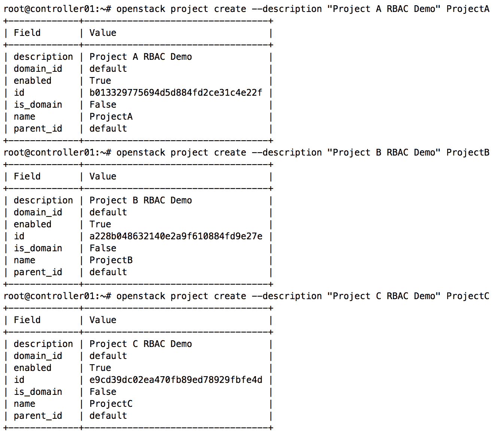

使用 openstack 客户端，创建一个名为`rbacdemo`的角色。然后，在每个项目中创建一个用户，并将`rbacdemo`角色应用到每个用户：

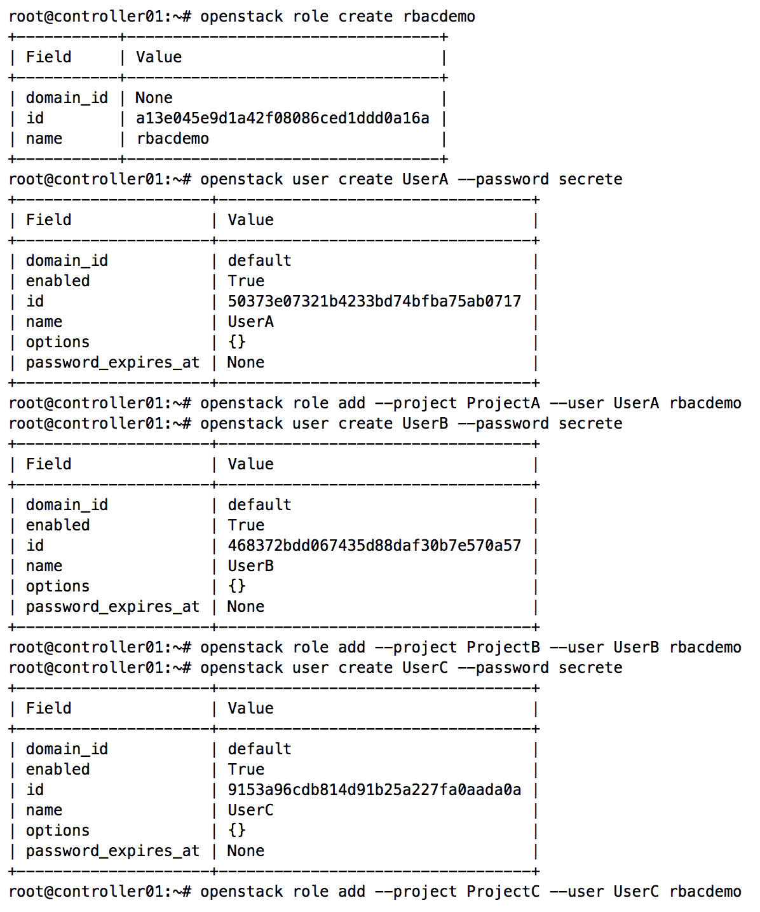

# 创建一个共享网络

使用 openstack 客户端，作为管理员用户创建一个名为`MySemiSharedNetwork`的网络和一个名为`MySemiSharedSubnet`的子网。这个网络将会在一些新创建的项目之间共享：

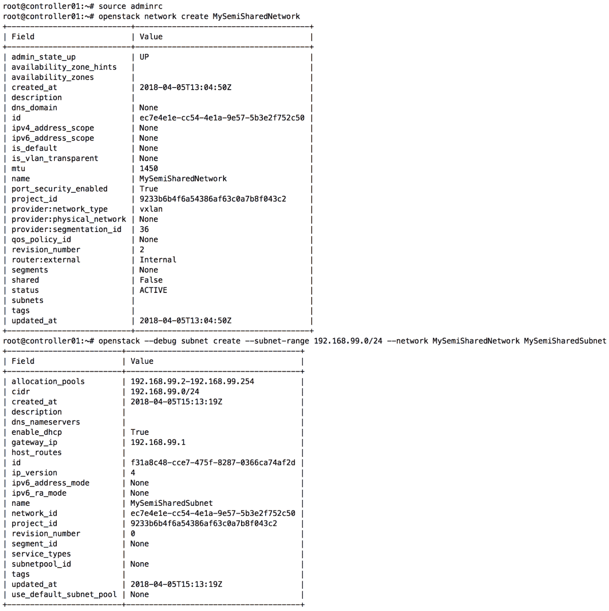

在网络详细信息中，可以看到网络的共享属性设置为`False`。在这种状态下，该网络只能由与拥有项目关联的用户使用。在这种情况下，拥有项目是管理员项目。如果将其设置为`True`，则该网络可以被所有项目使用，这是我们希望避免的情况。

# 创建策略

创建 RBAC 策略需要以下四个详细信息：

+   策略类型

+   目标项目

+   执行的操作

+   资源

默认情况下，在上一节中创建的`MySemiSharedNetwork`网络仅限于创建它的管理员项目使用。使用 openstack 客户端，创建一个新的 RBAC 策略，通过使用`access_as_shared`操作与`ProjectA`项目共享该网络，如下所示：

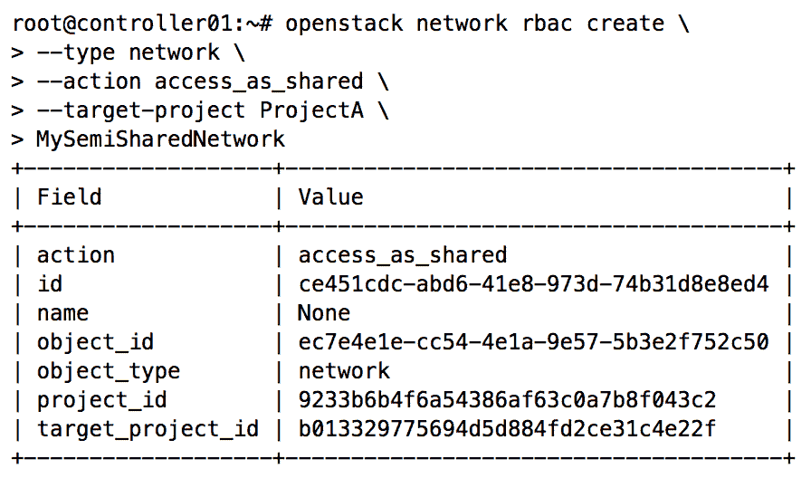

可以使用`openstack network rbac list`和/或`show`命令查看访问控制策略，如下所示：

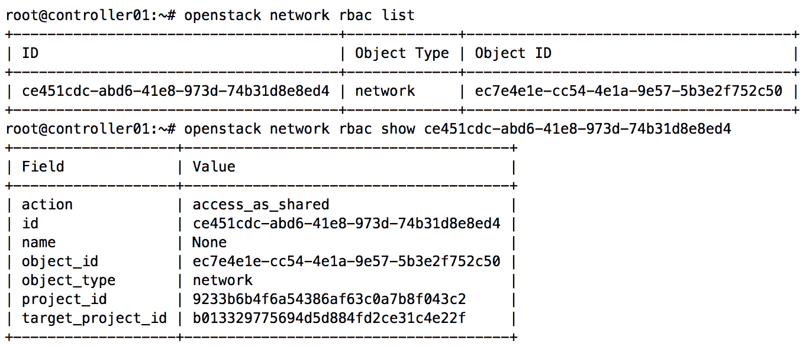

# 查看策略执行情况

作为 ProjectA 项目中的 UserA，`openstack network list`命令可以用来确认网络是否可用，如下所示：

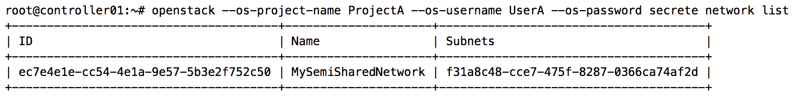

然而，`ProjectB`和`ProjectC`项目中的用户无法看到该网络：

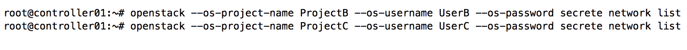

以`ProjectB`和`ProjectC`项目中的用户身份运行查询将返回无结果，且这些项目无法使用该网络。对于每个必须与之共享网络对象的项目，必须创建一个单独的策略。可以通过指定不同的项目来使用`openstack network rbac create`命令创建其他策略，但共享相同的网络资源。

# 为外部网络创建策略

外部网络用于将 Neutron 路由器连接到物理网络，并通过路由和浮动 IP 帮助提供进出项目的路由。当一个网络的外部属性被设置为`True`时，该网络将在所有项目中共享。访问策略可以用来将外部网络限制为某些项目的子集。创建外部网络策略的语法与上一节中展示的策略非常相似。不过，操作会从`access_as_shared`更改为`access_as_external`。

在此示例中，创建了一个名为`MySemiSharedExternalNetwork`的外部网络，使用 VLAN 31，目的是将其与部分项目共享。注意共享属性为`False`，且外部属性为内部，意味着它只能用于内部网络：

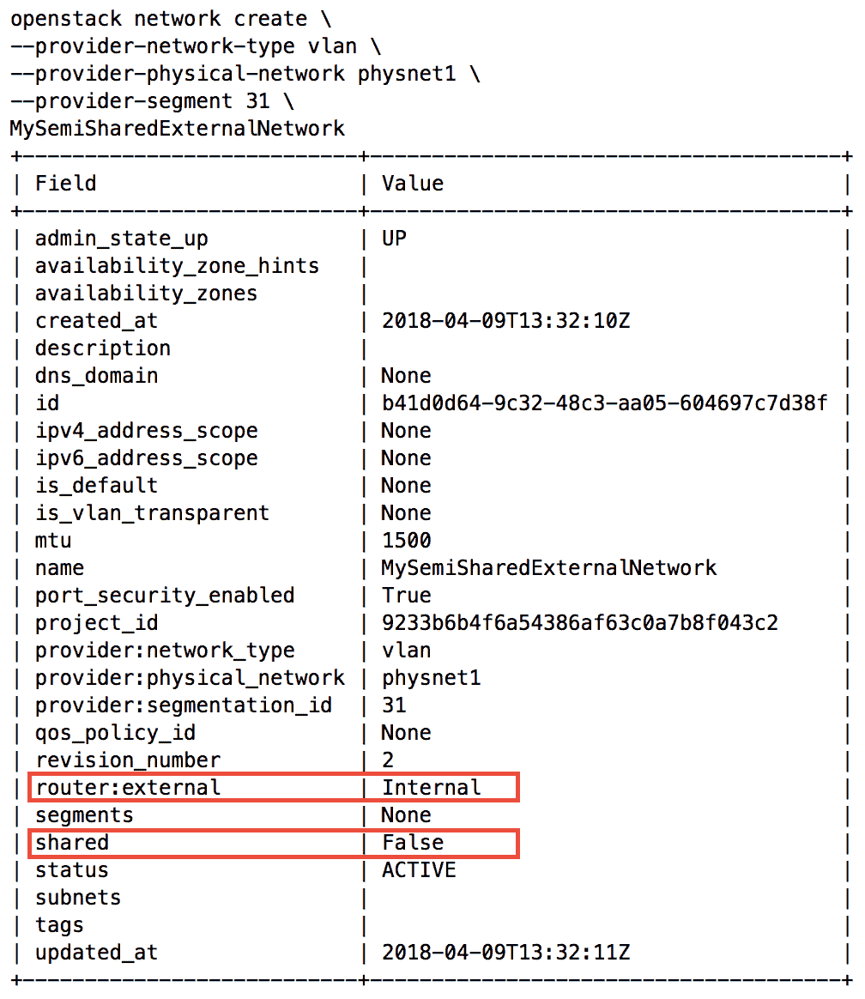

因此，当运行`openstack network list --external`时，该网络不会被列出，并且无法作为外部网络使用：

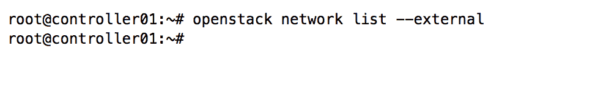

在此示例中，管理员用户创建了一个访问策略，将网络作为外部网络与 ProjectB 项目共享：

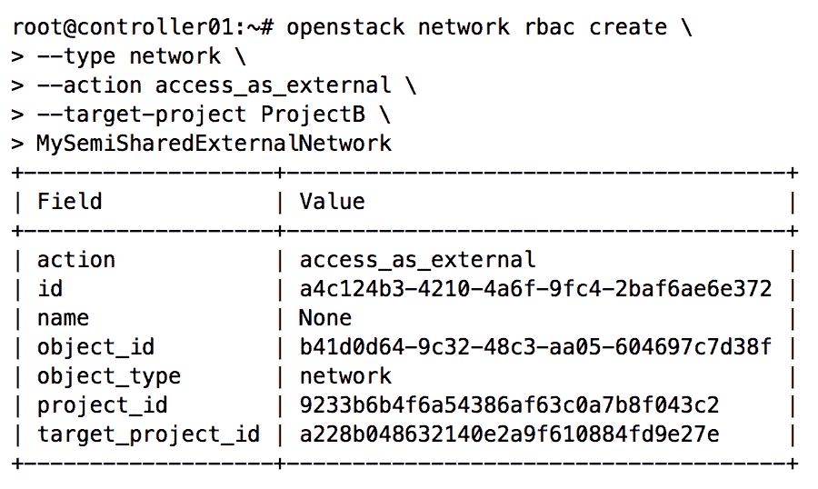

作为`UserB`在`ProjectB`项目中，我们可以使用`openstack network list --external`命令查看外部网络。该网络将反映其外部状态：

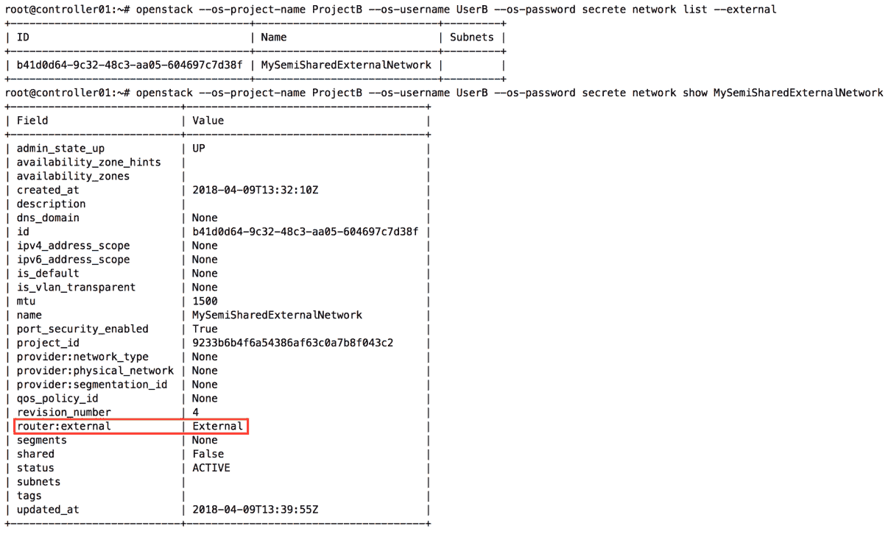

如果没有配置`shared_as_external`访问策略，其他项目将无法将该网络视为外部网络或使用它。

# 总结

由基于角色的访问控制框架创建和管理的访问控制策略允许操作员和用户为单个项目提供对某些网络资源的访问，而不是对所有项目。这种能力开启了过去不可用的网络设计选项，并提供了一种更安全的网络资源共享方法。

在下一章中，我们将探讨独立的 Neutron 路由器及其在为项目提供自服务网络中的作用。此外，我们还将查看浮动 IP 的配置和使用，以便为实例提供外部连接。高度可用和分布式虚拟路由器的配置将在后续章节中介绍。
