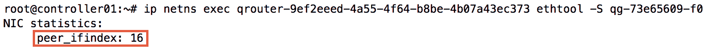
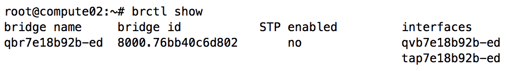
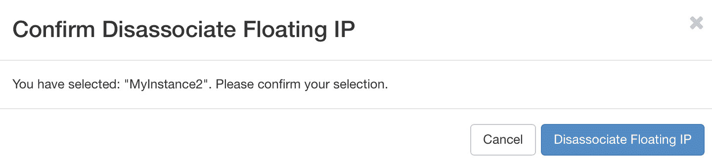

# 使用 Neutron 创建独立路由器

Neutron 使用户能够构建在用户创建的网络和外部网络之间提供连接的路由器。在参考实现中，Neutron L3 代理通过利用网络命名空间为云中的虚拟机实例提供 IP 路由和网络地址转换，从而提供隔离的路由实例。通过创建网络并将其附加到路由器，用户可以将连接的虚拟机实例及其应用程序暴露到互联网。

在 OpenStack 的 Juno 版本之前，用户只能构建作为网络堆栈中的单点故障的独立路由器。自从 Juno 及其之后版本引入了分布式虚拟路由器后，独立路由器现在被称为遗留路由器。尽管偏好可能是提供高可用性或分布式虚拟路由器来实现可靠性，但独立路由器提供了三种选项中最简单的实现。

在之前的章节中，我们探讨了提供者网络和自服务项目网络之间的区别，并演示了启动实例并将其连接到网络的过程。在本章中，我们将完成以下内容：

+   安装和配置 L3 代理

+   创建外部提供者网络

+   在 CLI 和 Horizon 仪表板中创建独立路由器

+   将路由器连接到外部网络和租户网络

+   启动实例

+   使用 Linux 桥接演示实例和命名空间的连接性

+   演示浮动 IP 提供的 SNAT 和 DNAT 功能

# 在云中路由流量

在参考实现中，Neutron 中创建的虚拟路由器作为网络命名空间存在，并驻留在运行 Neutron L3 代理服务的节点上。虚拟路由器通常连接到一个外部提供者网络和一个或多个项目网络。连接到这些网络的路由器接口可以如下识别：

+   qg：网关接口

+   qr：路由器接口

Neutron 路由器通过使用网络地址转换（NAT）为项目网络提供进出连接。以下图示展示了路由器命名空间如何连接到基于 Linux 桥接实现的多个桥接：


上述图示展示了 Neutron 路由器在基于 Linux 桥接的实现中如何连接到多个桥接。在基于 Open vSwitch 的实现中，路由器的接口直接连接到集成桥接。来自项目网络的流量通过 qr 接口路由到外部网络的 qg 接口。命名空间中的路由表决定流量的路由方式，iptables 规则决定流量是否需要转换。

更多关于创建和配置独立 Neutron 路由器的内容，以及它们如何连接到网络并为实例提供连接的示例，请参见本章后面的内容。

# 安装和配置 Neutron L3 代理

要安装 Neutron L3 代理，请在 `controller01` 节点上运行以下命令：

```
# apt install neutron-l3-agent 
```

Neutron 将 L3 代理配置存储在 `/etc/neutron/l3_agent.ini` 文件中。最常见的配置选项将在以下子节中介绍。

# 定义接口驱动程序

必须配置 Neutron L3 代理，使用与所选机制驱动程序相对应的接口驱动程序。在参考实现中，这可以是 Linux 桥接驱动程序或 Open vSwitch 驱动程序。在此环境中，linux 桥接驱动程序将安装在 `controller01` 上。

在 `controller01` 节点上，更新 Neutron L3 代理配置文件 `/etc/neutron/l3_agent.ini`，并为此特定环境指定以下 Linux 桥接接口驱动程序：

```
[DEFAULT]
...
interface_driver = linuxbridge
```

作为参考，以下配置可用于当 `network` 节点承载路由器并配置为 Open vSwitch 时：

```
[DEFAULT]
...
interface_driver = openvswitch 
```

# 启用元数据代理

当 Neutron 路由器作为实例的网关时，元数据请求将通过路由器代理，而不是 DHCP 服务器，并被转发到 Nova 元数据服务。此功能默认启用，可以通过将 `l3_agent.ini` 配置文件中的 `enable_metadata_proxy` 值设置为 `False` 并取消注释来禁用。在此环境中，保持默认的 `True` 值即可。

如果禁用了元数据代理，用户可能只能通过 config-drive 获取元数据。

# 设置代理模式

默认情况下，Neutron L3 代理以传统模式工作，这意味着 L3 代理部署在负责网络服务的集中节点上。`agent_mode` 的默认值为 `legacy`，并将在本章其余部分保持不变。

# 启用路由器服务插件

在 Neutron 接受与 Neutron 路由器相关的 API 命令之前，必须启用路由器服务插件。在 `controller01` 节点上，更新 Neutron API 服务器配置文件 `/etc/neutron/neutron.conf`，并将 `router` 添加到服务插件列表中，如下所示：

```
service_plugins = router 
```

`service_plugins` 配置选项可能已被禁用。删除前导的井号 (#) 来启用该选项。

# 在仪表板中启用路由器管理

可以使用 Horizon 仪表板来管理路由器，但必须首先启用此选项。

在 `controller01` 节点上，编辑 OpenStack 仪表板配置文件 `/etc/openstack-dashboard/local_settings.py`，然后找到 `OPENSTACK_NEUTRON_NETWORK` 配置选项。将 `enable_router` 字典的值从 `False` 更改为 `True`，如下所示：


关闭文件并继续进行下一节，重启服务。

# 重启服务

在对 Neutron L3 代理和 API 服务配置进行更改后，在`controller01`节点上执行以下命令以重启相应的服务：

```
# systemctl restart neutron-l3-agent neutron-server apache2 
```

验证代理是否正在运行：

```
# systemctl status neutron-l3-agent
```

服务应返回类似于以下的输出，并处于活动（运行）状态：


如果服务保持停止状态，请排查`/var/log/neutron/l3-agent.log`日志文件中可能指示的错误。

# 在 CLI 中管理路由器

Neutron 提供了一些命令，可用于创建和管理路由器。与路由器管理相关的主要命令包括以下内容：

| **路由器管理命令** | **描述** |
| --- | --- |
| `router create` | 创建一个路由器 |
| `router delete` | 删除一个或多个路由器 |
| `router set` | 设置路由器网关及其他属性 |
| `router unset` | 取消设置路由器网关及其他属性 |
| `router show` | 显示路由器详情 |
| `router list` | 列出路由器 |
| `router add port` | 使用现有端口向路由器添加接口 |
| `router add subnet` | 使用现有子网向路由器添加接口 |
| `router remove port` | 使用相应的端口 ID 从路由器中移除一个接口 |
| `router remove subnet` | 使用相应的子网 ID 从路由器中移除一个接口 |
| `network agent list` | 列出所有网络代理 |

# 在 CLI 中创建路由器

Neutron 中的路由器与项目相关联，且只能由与该项目相关的用户管理。与网络不同，路由器不能在项目之间共享。然而，共享网络可以附加到路由器，并可能在不同项目之间路由流量。具有管理员角色的用户可以在创建路由器过程中将路由器与其他项目关联。

要创建一个独立的路由器，请使用以下显示的`openstack router create`命令：

```
openstack router create
[--enable | --disable]
[--project <project>]
[--project-domain <project-domain>]
<name> 
```

路由器将被创建，但不会附加任何接口，并会立即被调度到 L3 代理。相应的网络命名空间应在托管该 L3 代理的节点上可见，可以使用`ip netnslist`命令找到它。

# 在 CLI 中列出路由器

要显示现有路由器的列表，请使用以下显示的`openstack router list`命令：

```
openstack router list
[--name <name>] [--enable | --disable] [--long]
[--project <project>]
[--project-domain <project-domain>]
[--agent <agent-id>] [--tags <tag>[,<tag>,...]]
[--any-tags <tag>[,<tag>,...]]
[--not-tags <tag>[,<tag>,...]]
[--not-any-tags <tag>[,<tag>,...]] 
```

可以根据名称、项目、管理员状态、计划代理和标签等过滤条件来缩小返回结果。

用户将仅能看到与其项目相关的路由器。以管理员角色执行时，Neutron 将返回所有项目中的所有路由器列表，除非指定了项目 ID。

# 在 CLI 中显示路由器属性

要显示路由器的属性，请使用以下显示的`openstack router show`命令：

```
openstack router show <router> 
```

返回的输出中包含管理员状态、外部网络、SNAT 状态和与路由器关联的项目 ID。两个附加属性，分布式（distributed）和高可用性（HA），用于标识路由器是否为分布式或高度可用。对于独立路由器，这两个属性将被设置为 False。

# 在 CLI 中更新路由器属性

要更新路由器的属性，请使用如下所示的 `openstack router set` 或 `openstack router unset` 命令：

```
openstack router set
[--name <name>] [--description <description>]
[--enable | --disable]
[--distributed | --centralized]
[--route destination=<subnet>,gateway=<ip-address>]
[--no-route] [--ha | --no-ha]
[--external-gateway <network>]
[--fixed-ip subnet=<subnet>,ip-address=<ip-address>]
[--enable-snat | --disable-snat] [--tag <tag>]
[--no-tag]
<router>

openstack router unset
[--route destination=<subnet>,gateway=<ip-address>]
[--external-gateway] [--tag <tag> | --all-tag]
<router>        
```

# 在 CLI 中处理路由器接口

独立的 Neutron 路由器有两种类型的接口：网关和内部。Neutron 路由器的网关接口类似于物理路由器的 WAN 接口。它是连接到上游设备的接口，提供与外部资源的连接。Neutron 路由器的内部接口类似于物理路由器的 LAN 接口。内部接口连接到项目网络，并通常作为这些网络中实例的网关或下一跳。

# 将内部接口附加到路由器

要创建一个内部路由器接口并将其附加到子网，请使用如下所示的 `openstack router add subnet` 命令：

```
openstack router add subnet <router> <subnet> 
```

`subnet` 参数表示要附加到路由器的子网名称或 ID。Neutron 在创建 `qr` 接口和相应端口时，将为路由器分配该子网的网关 IP。

要将现有端口直接附加到路由器，请使用如下所示的 `openstack router add port` 命令：

```
openstack router subnet add <router> <port> 
```

`port` 关键字表示要附加到路由器的端口名称或 ID。

Neutron 路由器在给定子网中只能有一个接口，但可以同时连接到多个子网。L3 代理负责将路由器命名空间中的接口连接到主机上的适当桥接器。

在 Neutron 中，一个网络可以包含多个子网。路由器必须连接到网络中的所有子网，以便正确地路由该网络的流量。确保不要使用此过程附加外部网络，因为这可能会对流量产生负面影响！

# 将网关接口附加到路由器

Neutron 路由器的外部接口被称为网关接口。一个路由器只能有一个网关接口。要作为可用于路由器网关接口的外部网络，提供者网络必须将路由器的外部属性设置为 True 或 External。

要将网关接口附加到路由器，请使用如下所示的 `openstack router set` 命令：

```
openstack router set --external-gateway <network> <router>
```

`<network>`&nbsp;参数表示要附加到路由器的作为网关网络的网络名称或 ID。Neutron 会从外部网络为路由器分配一个 IP 地址。默认情况下，Neutron 路由器会对所有没有浮动 IP 的实例流量执行源网络地址转换（SNAT）。NAT 和 SNAT 会在本章后面详细讲解。要禁用此功能，请在使用 `openstack router set`&nbsp;命令时使用 `--disable-snat`&nbsp;参数。

# 列出附加到路由器的接口

要列出附加到路由器的接口，请使用如下所示的 `openstack port list` 命令：

```
openstack port list --router <router> 
```

路由器&nbsp;参数表示路由器的名称或 ID。

# 删除内部接口

要从路由器中删除内部接口，请使用如下所示的 `openstack router remove port`&nbsp;或&nbsp;`openstack router remove subnet`&nbsp;命令：

```
openstack router remove port <router> <port>
openstack router remove subnet <router> <subnet> 
```

`<port>`&nbsp;参数表示要从路由器中删除的特定端口的名称或 ID，而 `<subnet>`&nbsp;参数表示要从路由器中删除的子网的名称或 ID。在这两种情况下，基于端口或子网删除接口将导致相应的 Neutron 端口从数据库中移除。

# 清除网关接口

不能通过 `openstack router remove` 命令删除路由器的网关接口。必须使用 `openstack router unset` 命令。

要清除路由器的网关，请使用如下所示的 `openstack router unset` 命令：

```
openstack router unset --external-gateway <router>
```

Neutron 会进行检查，如果路由器与浮动 IP 相关联，则无法清除网关接口。

# 在 CLI 中删除路由器

要删除路由器，请使用 `openstack router delete`&nbsp;命令并指定路由器的名称或 ID：

```
openstack router delete <router> [<router> ...] 
```

也可以同时删除多个路由器，方法如下：

```
openstack router delete <router1> <router2> 
```

只要删除了所有连接的端口或子网，并且所有浮动 IP 已被解除关联或删除，Neutron 就会成功删除路由器。

# 网络地址转换

网络地址转换，或称 NAT，是一种网络概念，最早于 1990 年代初期提出，旨在应对全球 IP 地址迅速枯竭的问题。在 NAT 出现之前，每个连接到互联网的主机都有一个唯一的 IP 地址。

独立路由器支持两种类型的 NAT：

+   一对一

+   多对一

一对一 NAT 是一种将一个 IP 地址直接映射到另一个 IP 地址的方法。常被称为静态 NAT，一对一 NAT 常用于将唯一的公共地址映射到私有地址主机。浮动 IP 利用了这种一对一 NAT 的概念。

多对一 NAT 是一种将多个地址映射到一个地址的方法。多对一 NAT 使用端口地址转换（PAT）。当浮动 IP 未分配时，Neutron 使用 PAT 提供对路由器后端实例的外部访问。

如需了解更多有关网络地址转换的信息，请访问以下维基百科页面：[`en.wikipedia.org/wiki/Network_address_translation`](http://en.wikipedia.org/wiki/Network_address_translation)。

# 浮动 IP 地址

自助服务项目网络，在附加到 Neutron 路由器时，通常使用该路由器作为其默认网关。默认情况下，当路由器接收到来自实例的流量并将其路由到上游时，路由器会执行端口地址转换，并将数据包的源地址修改为其自身的外部接口地址。当发生转换时，临时源端口会映射到原始客户端地址，并记录在一个表中，在响应数据包到达时会查阅该表。这确保了数据包能够被路由到上游并返回给路由器，在那里数据包会被修改并返回到发起连接的实例。Neutron 将这种行为称为源 NAT。

当用户需要直接访问实例时，可以使用浮动 IP 地址。OpenStack 中的浮动 IP 地址是一个一对一的静态 NAT，将外部网络的外部地址映射到项目网络中的内部地址。这种 NAT 方法允许实例能够从远程网络（如互联网）进行访问。浮动 IP 地址配置在路由器的外部接口上，该路由器作为实例的网关，负责根据数据包的方向修改数据包的源地址和目标地址。

# 浮动 IP 管理

OpenStack 命令行客户端提供了多个命令，用于创建和管理浮动 IP。与浮动 IP 相关的主要命令包括以下内容：

| **浮动 IP 命令** | **描述** |
| --- | --- |
| `floating ip create` | 创建一个浮动 IP |
| `floating ip delete` | 删除一个浮动 IP |
| `floating ip list` | 列出浮动 IP |
| `floating ip show` | 显示浮动 IP 详情 |
| `floating ip set` | 设置浮动 IP 属性 |
| `floating ipunset` | 取消设置浮动 IP 属性 |
| `floating ip pool list` | 列出浮动 IP 地址池 |
| `server add floating ip` | 将浮动 IP 地址添加到服务器 |
| `server remove floating ip` | 从服务器中移除浮动 IP 地址 |

# 在 CLI 中创建浮动 IP

如果你还记得前几章的内容，IP 地址并不会直接分配给实例。相反，IP 地址与 Neutron 端口相关联，并且该端口被逻辑地映射到一个实例或其他网络资源。

当浮动 IP 被创建时，除非与 Neutron 端口关联，否则它无法正常工作。要在 CLI 中创建浮动 IP，请使用以下 `openstack floating ip create` 命令：

```
openstack floating ip create
[--subnet <subnet>]
[--port <port>]
[--floating-ip-address <ip-address>]
[--fixed-ip-address <ip-address>]
[--description <description>]
[--project <project>]
[--project-domain <project-domain>]
<network> 
```

浮动 IP 地址只能在创建它们的项目中使用。管理员可以使用 `--project` 参数，以便指定与浮动 IP 关联的项目。

`--port` 参数是可选的，用于在创建时指定要与浮动 IP 关联的端口。

因为一个端口可能与多个 IP 地址关联，所以可能需要定义一个特定的固定 IP 来与浮动 IP 关联。使用 `--fixed-ip-address` 参数来指定应与浮动 IP 关联的固定 IP 地址。

在 OpenStack 的早期版本中，浮动 IP 是从外部网络的分配池中自动分配的。这种行为对于需要特定地址的用户来说很困难，特别是在上游的 NAT 或防火墙规则已经指定了特定的浮动 IP 地址的情况下。从 Kilo 版本开始，只要地址可用并且没有与其他项目关联，就可以使用指定的地址创建浮动 IP。通过此功能，用户可以指定特定的浮动 IP 地址，避免修改外部系统。

使用 `--floating-ip-address` 参数来指定从外部网络中选定的地址作为浮动 IP 使用。

# 在 CLI 中将浮动 IP 与端口关联

一旦浮动 IP 被创建，它可以由创建它的项目中的任何用户使用。要将浮动 IP 与实例关联，首先需要确定与实例固定 IP 关联的 Neutron 端口。

可以通过几种不同的方式来确定与实例的固定 IP 地址关联的端口 ID。最快的方法可能是使用 `openstack port list` 命令，并使用过滤器来缩小每个实例的端口范围。

例如，可以通过以下方式确定实例 ID 为 `3d577137-9658-4226-906e-88d3117e497e` 的端口：


一旦确定了端口 ID，就可以使用 `openstack floating ip set` 命令将浮动 IP 与端口关联：

```
openstack floating ip set --port <port>
[--fixed-ip-address <ip-address>]
<floating-ip> 
```

Neutron 使用指定端口的子网 ID 来确定要配置浮动 IP 地址和相应 NAT 规则的路由器。涉及的逻辑意味着，在使用浮动 IP 时，任何给定时间只能将一个独立的路由器附加到项目网络上，否则可能会发生意外结果。

# 在 CLI 中列出浮动 IP

要确定浮动 IP 与 Neutron 端口和地址的关联，可以使用如下所示的 `openstack floating ip list` 命令：

```
openstack floating ip list
[--network <network>] [--port <port>]
[--fixed-ip-address <ip-address>] [--long]
[--status <status>] [--project <project>]
[--project-domain <project-domain>]
[--router <router>]
```

返回的输出包括浮动 IP ID、固定 IP 地址、浮动 IP 地址和与浮动 IP 关联的端口 ID。所有参数都是可选的，并有助于过滤结果。

# 在 CLI 中显示浮动 IP 属性

要在 CLI 中显示浮动 IP 的属性，请使用以下显示的`openstack floating ip show`命令：

```
openstack floating ip show <floating-ip> 
```

返回的输出包括浮动 IP 地址以及关联的外部网络、固定 IP 地址、端口、项目和路由器 ID。

# 在 CLI 中解除浮动 IP 关联

要将浮动 IP 与端口解除关联，请使用以下显示的`openstack floating ip unset`命令：

```
openstack floating ip unset [--port] <floating-ip> 
```

将浮动 IP 与端口解除关联，使该浮动 IP 可供项目中的其他用户使用。

# 在 CLI 中删除浮动 IP

要删除浮动 IP，请使用以下显示的`openstack floating ip delete`命令：

```
openstack floating ip delete <floating-ip> [<floating-ip> ...] 
```

删除浮动 IP 会将该 IP 地址返回到外部网络分配池，之后它可以分配给其他项目并供其他网络资源使用，包括路由器和浮动 IP。

# 演示从实例到互联网的流量

本节专门介绍一个操作示例，利用本书至今讨论的基本 Neutron 概念。我将演示创建和连接独立的 Neutron 路由器到项目和外部提供者网络，以为实例提供网络连接。

将创建一个基于 VLAN 的提供者网络，并将其用作 Neutron 路由器的外部网关网络，而基于 VLAN 的项目网络将被创建并供实例使用。一个 Neutron 路由器将被创建，并用于将项目网络中的实例流量路由到互联网，同时浮动 IP 将被创建并用于为实例提供直接连接。

# 设置基础

在本演示中，Cisco 自适应安全设备（ASA）充当物理网络网关设备，并连接到互联网。以下网络将被使用：

| **VLAN 名称** | **VLAN ID** | **网络** |
| --- | --- | --- |
| GATEWAY_NET | 30 | 10.30.0.0/24 |
| PROJECT_NET | auto | 192.168.200.0/24 |

Cisco ASA 的内部接口已配置了 IP 地址 10.30.0.1/24，并位于 VLAN 30，将作为下一节中创建的外部提供者网络的网关。

以下图示是此演示中将构建的网络的逻辑图：


在上述图示中，Cisco ASA 充当了 OpenStack 云前端的外部网络设备。

# 创建外部提供者网络

为了为实例提供外部连接，必须将 Neutron 路由器连接到可以用作外部网络的提供者网络。

使用`openstack network create`命令，在管理员项目中创建一个提供者网络，具有以下属性：

+   名称：GATEWAY_NET

+   类型：VLAN

+   分段 ID：30

+   物理网络：physnet1

+   外部：True

以下截图显示了`openstack network create`命令的输出结果：


使用`openstack subnet create`命令，创建一个具有以下属性的子网：

+   名称：GATEWAY_SUBNET

+   网络：10.30.0.0

+   子网掩码：255.255.255.0

+   网关：10.30.0.1

+   DHCP：禁用

+   分配池：10.30.0.100 - 10.30.0.254

以下截图展示了`openstack subnet create`命令的输出结果：


# 创建 Neutron 路由器

使用`openstack router create`命令创建一个路由器，并指定以下属性：

+   名称：MyLegacyRouter

以下截图展示了`openstack router create`命令的输出结果：


# 将路由器连接到外部网络

将 Neutron 路由器连接到外部网络时，相应的网络必须将其`router:external`属性设置为`True`，以便作为外部网络使用。否则，命令将失败。之前创建的`GATEWAY_NET`网络满足此要求。

使用`openstack router set`命令，将路由器`MyLegacyRouter`连接到`GATEWAY_NET`网络：

```
openstack router set --external-gateway GATEWAY_NET MyLegacyRouter 
```

命令成功执行后不会返回输出。使用`openstack port list`命令，确定路由器的外部 IP 地址：


在本例中，分配给路由器外部接口的 IP 地址是`10.30.0.106`。

# 确定 L3 代理和命名空间

一旦网关接口添加完成，路由器将被调度到一个合适的 L3 代理。使用`openstack network agent list`命令，你可以确定路由器被调度到哪个 L3 代理：


在本例中，路由器被调度到`controller01`节点。在运行多个`L3`代理的环境中，一个独立的路由器可以调度到任何一个代理，但在任何给定时间只能调度到一个代理。

L3 代理负责创建一个网络命名空间，作为虚拟路由器。为了便于识别，命名空间的名称会包含路由器的 ID。可以使用`ip netns list`命令列出节点上的所有网络命名空间：


在各自的 qrouter 命名空间内，你会找到一个前缀为`qg`的接口。`qg`接口是路由器的网关或外部接口。Neutron 会自动从外部网络子网的分配池中为`qg`接口分配一个 IP 地址：


在上述截图中，IP 地址 10.30.0.106 已经在命名空间内部的外部接口上自动配置。

当使用 Open vSwitch 接口驱动程序时，`qg`接口直接连接到集成桥接。当使用 Linux 桥接接口驱动程序时，如本示例所示，`qg`接口是一个 veth 对的一端，另一端连接到主机上的 Linux 桥接。

使用 ethtool，我们可以确定主机上相应接口的对端索引。这对于排除网络命名空间内外的连接问题非常有用：



使用主机上的`ip link show`，可以通过在控制器上查找索引来找到相应的接口（对端索引 16）：


输出方便地显示了使用`link-netnsid`标识符的相应网络命名空间。在此示例中，对端接口位于 ID 为 3 的网络命名空间中，通常称为`qrouter-9ef2eeed-4a55-4f64-b8be-4b07a43ec373`。

`ip link show`中的 link-netnsid ID 应与`ip netns list`命令输出中提供的命名空间对应。

当使用 Linux 桥接接口驱动程序时，veth 接口连接到与此处显示的外部网络对应的桥接。


为了便于识别，桥接名称包括 Neutron 网络 ID 的前十个字符。此外，每个 veth 对的两端也包括与接口相关联的端口 ID 的前十个字符。

命名空间能够通过桥接与同一子网中的其他设备进行通信。桥中的另一个接口`eth2.30`在流量离开桥接并通过物理接口`eth2`时，会将流量标记为`VLAN 30`。

查看命名空间中的路由表。默认网关地址与外部提供者子网中`gateway_ip`属性定义的地址对应。在此例中，地址为`10.30.0.1`：


在此示例环境中，`10.30.0.1`已在 Cisco ASA 上配置，并将作为 Neutron 路由器出站流量的下一跳网关。

# 测试网关连接性

要测试从 Neutron 路由器的外部连接性，可以从路由器命名空间中 ping 边缘网关设备：


从路由器命名空间到物理网关设备的 ping 测试成功，表明物理和虚拟网络组件上的外部 VLAN 配置正确。

# 创建内部网络

在 admin 项目中，为实例创建一个内部网络。在此示范中，将创建一个具有以下属性的网络：

+   名称：PROJECT_NET

以下截图展示了`openstack network create`命令的结果输出：


请注意，Neutron 如何自动确定网络的类型、物理网络和分段 ID。由于执行`openstack network create`命令时未指定特定的提供者属性，Neutron 依赖插件配置文件中的配置来确定创建的网络类型。

在 ML2 配置文件中使用以下配置选项来确定网络类型、物理网络和分段 ID：

```
tenant_network_types = vlan,vxlan
network_vlan_ranges = physnet1:40:43
```

请记住，在此配置中，Neutron 将在创建网络之前消耗所有可用的 VLAN 分段 ID，然后才会转到 VXLAN 网络。

使用`openstack subnet create`命令，创建一个具有以下属性的子网：

+   名称：PROJECT_SUBNET

+   网络：192.168.200.0

+   子网掩码：255.255.255.0

+   网关：<auto>

+   DHCP 范围：<auto>

+   DNS Nameserver：8.8.8.8

输出应类似于以下内容：


# 将路由器连接到内部网络

使用`openstack router add subnet`命令，将`PROJECT_SUBNET`子网连接到`MyLegacyRouter`：

```
# openstack router add subnet MyLegacyRouter PROJECT_SUBNET 
```

如果命令成功，则不会提供任何输出。使用`openstack port list`命令，确定路由器的内部 IP：


在这个示例中，分配给路由器内部接口的 IP 地址是`192.168.200.1`。当在将路由器连接到子网时没有指定端口 ID 或 IP 地址时，分配给路由器内部接口的 IP 地址默认作为该子网的`gateway_ip`地址。

在路由器命名空间内，已添加一个前缀为`qr`的新接口。`qr`接口是路由器的内部接口：


使用 Open vSwitch 接口驱动时，接口直接连接到集成桥。使用 Linux 桥接口驱动时，如本示例所示，每个`qr`接口是 veth 对的一端，另一端连接到主机上的桥接：


为了便于识别，桥接名称包含了相应 Neutron 网络 ID 的前十个字符。此外，veth 对的每一端还包括与接口关联的 Neutron 端口 ID 的前十个字符。

路由器命名空间能够通过桥接与同一子网中的其他设备通信。桥接中的`eth2.43`接口在流量离开桥并传送到父接口`eth2`时，将流量标记为`VLAN 43`。

# 创建实例

创建两个具有以下特征的实例：

| **名称** | **网络** | **镜像** | **规格** | **主机** |
| --- | --- | --- | --- | --- |
| MyInstance1 | PROJECT_NET | cirros-0.4.0 | tiny | compute01 |
| MyInstance2 | PROJECT_NET | cirros-0.4.0 | tiny | compute02 |

如有需要，可以使用`openstack image list`命令来确定在*第二章*中下载的 CirrOS 镜像的 ID，*安装 OpenStack*：

使用以下`openstack server create`命令启动两个位于`PROJECT_NET`网络的`compute`节点上的实例：

```
openstack server create \
--flavor tiny \
--image cirros-0.4.0 \
--nic net-id=PROJECT_NET \
--availability-zone nova:compute01 \
MyInstance1

openstack server create \
--flavor tiny \
--image cirros-0.4.0 \
--nic net-id=PROJECT_NET \
--availability-zone nova:compute02 \
MyInstance2 
```

可以使用`openstack server list`命令返回实例列表及其 IP 地址：


在`compute01`上，已创建一个与`PROJECT_NET`网络对应的 Linux 桥接器。当连接到该桥接器时，我们可以找到一个`VLAN`接口和与`MyInstance1`对应的 tap 接口：


当使用 Linux 桥接代理时，桥接器对应于各个网络，且其名称将带有 brq 前缀。

在`compute02`上，我们可以找到与`MyInstance2`对应的 tap 接口，该接口连接到专用的 Linux 桥接器，并且与相应端口相连接：



当与`iptables_hybrid`防火墙驱动程序一起使用 Open vSwitch 代理时，桥接器对应于各个端口，且其名称将带有`qbr`前缀。这些桥接器仅用于克服 iptables 在 Open vSwitch 虚拟交换机中的限制。

# 验证实例连接性

当创建网络和子网并启用 DHCP 时，DHCP 代理将创建一个网络命名空间，作为该网络的 DHCP 服务器。在运行 Neutron DHCP 代理服务的主机上，可以使用`ip netns list`命令查看命名空间。为了便于识别，DHCP 命名空间的名称与其所服务的网络 ID 相对应：


在命名空间内，已创建一个以`ns`为前缀的接口，并从子网的分配池中分配了一个地址：


当配置一个 DHCP 代理以使用 Open vSwitch 接口驱动时，命名空间内的`ns`接口将直接连接到集成桥接器。当 DHCP 代理配置为使用 Linux 桥接接口驱动时，如本例所示，`ns`接口是 veth 对的一端，另一端连接到主机上的桥接器。通过相应的桥接器和 VLAN，命名空间能够与同一子网中的其他设备进行通信。

随着实例上线，它们会发送一个 DHCP 请求，由 DHCP 命名空间中的`dnsmasq`进程处理。命名空间内填充的 ARP 表确认实例在 VLAN 的第二层（Layer 2）中正常工作：


L2 人口驱动程序用于预填充 ARP 和转发表，以减少覆盖网络上的开销，并且可能无法提供这些网络中连接的准确图景。如果条目处于永久状态，则表示它已被静态编程，可能无法反映实际的可达性。

在你连接到实例之前，必须更新安全组规则，以允许 ICMP 和 SSH。*第八章，管理安全组*，更详细地讲解了安全组规则的实现和管理。为了测试连接性，请向应用于实例的安全组添加 ICMP 和 SSH 访问。使用以下命令确定这些实例的安全组：

```
# openstack port list --server MyInstance1 --long -c 'Security Groups' # openstack port list --server MyInstance2 --long -c 'Security Groups' 
```

输出可能类似于以下内容：


使用`openstack security group rule create`命令在相应的安全组内创建规则，允许入站的 ICMP 和 SSH：


使用 SSH 命令，从路由器或 DHCP 命名空间连接到实例`MyInstance1`。CirrOS 镜像内置了一个名为 cirros 的用户，密码为`gocubsgo`：


如下所示，观察实例内部的路由表：

```
$ ip r
default via 192.168.200.1 dev eth0
169.254.169.254 via 192.168.200.1 dev eth0
192.168.200.0/24 dev eth0  src 192.168.200.6 
```

`192.168.200.1`的默认网关是我们在本章之前创建的 Neutron 路由器。从实例中 ping 外部资源应该会成功，只要 Neutron 路由器存在外部连接：


# 观察默认的 NAT 行为

Neutron 路由器的默认行为是当流量从路由器的外部或网关接口离开时，对没有浮动 IP 的实例进行源地址转换（NAT）。

在`controller`节点上执行 eth2.43 接口的数据包捕获，该接口对应于`PROJECT_NET`网络，我们可以观察到从实例发出的 ICMP 流量，这些流量的源地址为实例的实际或固定 IP 地址，流量朝向路由器发送，回复也会引用相同的固定 IP 地址：


从`controller`节点上对应于`GATEWAY_NET`网络的 eth2.30 接口，我们可以观察到从实例发出的 ICMP 流量，这些流量已经通过路由器并以路由器的外部地址`10.30.0.106`为源地址：


查看路由器命名空间中的 iptables 链表可以看到负责此行为的 NAT 规则：


在此配置中，实例可以通过路由器与外部资源通信，只要实例发起连接。外部资源不能直接通过固定 IP 地址向实例发起连接。

# 分配浮动 IP

要从外部网络发起到 Neutron 路由器后面的实例的连接，必须配置浮动 IP 地址并将其与实例关联。在 OpenStack 中，浮动 IP 与对应实例接受连接的接口的 Neutron 端口相关联。

使用 `openstack port list` 命令，确定每个最近启动实例的端口 ID。该命令允许按设备或实例 ID 过滤结果，如下所示：


使用 `openstack floating ip create` 命令，创建一个浮动 IP 地址，并将其与名为 `MyInstance1` 的实例端口关联：


在创建时，浮动 IP 可能会显示为 DOWN 状态。一旦更改应用到网络，状态应显示为 ACTIVE。

从虚拟机操作系统内，验证实例是否仍能与外部资源通信：


在 `controller01` 节点上对 `eth2.30` 接口进行数据包捕获，我们可以观察到来自实例通过路由器的 ICMP 流量，其源 IP 对应浮动 IP 地址 `10.30.0.101`：


在路由器命名空间内，浮动 IP 已配置为 `qg` 接口的二级地址：


当浮动 IP 配置为 `qg` 接口的二级网络地址时，路由器能够响应来自上游网关设备及其他 Neutron 路由器或同一外部网络中设备的 ARP 请求。这样就可以通过浮动 IP 实现与实例的入站连接。

查看路由器命名空间内的 `iptables` 链，显示已经添加规则，将浮动 IP 和 `MyInstance1` 的固定 IP 进行 1:1 NAT 转换，反之亦然：


如果我们的客户端工作站能够路由到外部提供商网络，则可以通过浮动 IP 直接发起流量到实例：


# 重新分配浮动 IP

Neutron 提供了快速将浮动 IP 从实例或其他网络资源上解除关联，并与其他资源关联的能力。浮动 IP 的列表显示当前的关联情况：


使用 `openstack floating ip unset` 和 `openstack floating ip set` 命令，解除浮动 IP 与 `MyInstance1` 的关联，并将其与 `MyInstance2` 关联。解除关联可以在这里看到：


如果命令成功执行，则不会返回任何输出。`openstack floating ip list` 命令显示浮动 IP 不再与端口关联：


浮动 IP 仍然归创建它的项目所有，必须先删除该浮动 IP，才能将其分配给另一个项目。

使用`openstack floating ip set`命令，将浮动 IP 与`MyInstance2`的端口关联，如下图所示：


如果命令成功执行，将不会返回任何输出。观察路由器命名空间中的 iptables 规则，NAT 关系已被修改，`MyInstance2`的流量现在将显示为浮动 IP：


由于新的关联，尝试通过浮动 IP 进行 SSH 连接时，可能会在客户端机器上看到以下消息：


警告信息是一个很好的指示，表明流量正在被发送到不同的主机。清除冲突的密钥并登录到实例后，可以发现它是`MyInstance2`：


此时，我们已经成功地将两个实例部署在同一个虚拟路由器后，并通过浮动 IP 验证了实例之间的连通性。在下一部分，我们将探讨如何在 Horizon 仪表盘中完成相同的任务。

# 仪表盘中的路由器管理

在 Horizon 仪表盘中，路由器可以在“项目 | 网络 | 路由器”面板中创建和管理：


登录用户可以在此页面查看可用的路由器。

# 在仪表盘中创建路由器

从路由器页面，点击右上角的“创建路由器”以创建一个路由器。接下来会弹出一个向导，类似于下图所示：


输入路由器名称，选择其管理员状态，并选择适当的外部网络。点击蓝色的“创建路由器”按钮以完成操作。

# 在仪表盘中附加内部接口

要在仪表盘中将内部接口附加到路由器，请点击路由器以显示路由器详细信息页面，如下所示：


点击“接口”标签，显示路由器接口的详细信息：


点击“添加接口”按钮，弹出一个向导，允许你选择要添加的接口的详细信息：


从子网菜单中选择一个你希望连接到路由器的子网，并点击蓝色的提交按钮以附加接口。新附加的接口将在接口面板中显示，如下所示：


在将接口添加到路由器后，接口状态显示为“Down”是正常现象。Neutron 不会将接口标记为“Active”，直到代理完成任务。刷新仪表盘将相应更新状态。

# 在仪表盘中查看网络拓扑

在仪表盘中，用户可以查看基于 Neutron 管理的网络配置的网络逻辑拓扑。

点击项目|网络面板下的“网络拓扑”，查看我们之前创建的网络、路由器和实例的逻辑图：


将鼠标悬停在路由器图标上，会弹出显示有关路由器的详细信息，例如连接的端口、IP 地址和端口状态：


# 在仪表盘中将浮动 IP 与实例关联

仪表盘中的浮动 IP 在项目|计算面板中的实例页面上进行管理。点击希望将浮动 IP 分配给的实例旁边的操作栏菜单：


要分配浮动 IP，点击“关联浮动 IP”。此时会出现一个向导，允许你管理浮动 IP 的分配：


如果没有可分配的浮动 IP 地址，请点击加号 (+) 以创建一个。点击“关联”按钮将浮动 IP 与端口关联。

# 在仪表盘中取消关联浮动 IP

要在仪表盘中将浮动 IP 与实例取消关联，请点击对应实例的操作栏菜单，并选择“取消关联浮动 IP”：


将会弹出一条消息，提醒您有待处理的操作：



点击蓝色的“取消关联浮动 IP”按钮以继续执行操作。

尽管浮动 IP 已与实例取消关联，但它仍归项目所有，直到被删除之前不会返回到分配池。

# 总结

Neutron 路由器是 OpenStack 网络的核心组件，为用户提供灵活的网络设计，以最适合他们的应用程序。使用浮动 IP 使用户能够快速且通过编程方式为应用程序提供直接连接，同时通过使用网络地址转换（NAT）来节省有限的 IPv4 地址空间。

独立路由器容易实现，但在任何网络设计中都是单点故障。如果 L3 代理出现故障，所有分配给该代理的路由器可能会变得不可用或不可靠。在下一章中，我们将讨论 Neutron 如何通过虚拟路由冗余协议（VRRP）实现高可用性路由器，以解决传统独立路由器的许多不足之处。
