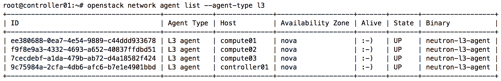
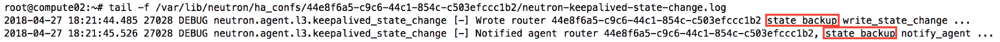

# 使用 VRRP 的路由冗余

在 OpenStack 的 Juno 版本中，Neutron 社区引入了实现路由高可用性的两种方法。本章重点介绍使用虚拟路由冗余协议（即 VRRP）来实现两个或多个 Neutron 路由器之间冗余的方法。关于使用分布式虚拟路由器（DVR）实现的高可用性，将在*第十二章*《分布式虚拟路由器》中讨论。

在上一章中，我们探讨了独立路由器的概念以及它们如何允许用户在项目网络和外部网络之间路由流量，并为用户管理的实例提供网络地址转换。在本章中，我们将覆盖以下内容：

+   使用 keepalived 和 VRRP 提供高可用性的路由

+   安装和配置额外的 L3 代理

+   演示创建和管理高可用性路由器

# 使用 keepalived 和 VRRP 提供冗余

Keepalived 是一个 Linux 软件包，为基于 Linux 的软件和基础设施提供负载均衡和高可用性。

虚拟路由冗余协议（VRRP）是一种首跳冗余协议，旨在通过允许两个或更多的路由器为网络的默认网关提供备份，从而提供高可用性。如果主用路由器发生故障，备份路由器将在短时间内接管该地址。VRRP 是一个开放标准，基于 Cisco 开发的专有热备份路由协议（HSRP）。

Neutron 使用 keepalived，进而利用 VRRP，为多个路由器命名空间提供故障转移。

# VRRP 组

使用 VRRP，可以将一组路由器配置为充当一个虚拟路由器。VRRP 组中的路由器选举一个主路由器作为活动网关设备，网络中的主机只需将虚拟路由器地址配置为其默认网关或下一跳地址。当发生故障切换时，组中的另一个路由器将接管路由工作，而网络中主机的配置保持不变。

VRRP 虚拟路由器不应与 Neutron 虚拟路由器混淆。前者代表一个逻辑实体，而后者实际上作为一个虚拟化的路由设备存在，通常实现为网络命名空间。

在下图中，路由器 A、路由器 B 和路由器 C 组成一个虚拟路由器。在此配置中，每个路由器都有自己的 IP 地址，而虚拟路由器有自己的 IP 地址。网络中的主机将虚拟路由器地址作为其默认网关：


在前面的图示中，作为主路由器的路由器 B 负责虚拟地址`192.168.1.1`，并为使用该地址作为网关的主机路由流量。主路由器通过多播地址`224.0.0.18`向组发送 VRRP 广告，广告中包括主路由器的优先级和状态。备份路由器使用多种定时器和配置选项来判断主路由器是否失败，并据此改变其状态。

组成虚拟路由器的路由器通过多播 IP 地址`224.0.0.18`和 IP 协议号 112 进行通信。该通信的网络设置是自动配置的，不受安全组规则的影响，且无法由用户或操作员进行管理。

# VRRP 优先级

VRRP 组中的路由器根据优先级选举主路由器。具有最高优先级的路由器被选为主路由器，而组中的其他路由器则担任备份角色。当主路由器未能向组发送其 VRRP 广告时，VRRP 组中的备份路由器将选举新的主路由器来替代失败的主路由器。

VRRP 优先级的范围是 0 到 255，255 为最高优先级。Neutron 为组中的每个路由器配置相同的优先级 50。由于路由器之间的优先级相同，因此在故障切换时，选举过程将回退到最高 IP 地址。也就是说，HA 接口上具有 IP 地址`192.168.1.200`的备份路由器将被选为主路由器，而具有 IP 地址`192.168.1.100`的路由器将被替换。

# VRRP 工作模式

VRRP 组中的路由器工作模式有两种：抢占模式和非抢占模式。

# 抢占模式

在抢占模式下，当主路由器发生故障时，它在重新加入组并且优先级高于新选举的主路由器时，会重新成为主路由器。

# 非抢占模式

在非抢占模式下，当 VRRP 组中的一个路由器成为主路由器时，它将在正常工作条件下继续作为主路由器工作。如果后来为一个备份路由器分配了更高的优先级，当前活动的主路由器将继续作为主路由器，直到它发生故障。

从 OpenStack Kilo 版本开始，Neutron 配置每个路由器以非抢占模式工作，尽管将来可能会有所变化。如果用于路由器间通信的 HA 网络发生故障，失败的主路由器可能无法检测到它已经故障。它仍然可以继续作为主路由器运行，即使另一个路由器已经被选为主路由器。路由器之间的连接丧失意味着所有路由器可能无法接收到 VRRP 广告。当连接恢复后，路由器可能会进行选举，选出一个主路由器。这种故障场景不常见，但在故障排查高可用路由器的问题时需要注意。

# VRRP 定时器

VRRP 中使用的定时器包括广告间隔定时器和抢占延迟定时器。

# 广告间隔定时器

VRRP 组中的主路由器会定期发送广告，发送间隔由广告间隔定时器设定，用以通知组中的其他路由器其运行正常。如果备份路由器在三倍于该间隔的时间内没有收到广告，它会认为自己是主路由器，并发送 VRRP 广告以启动新的主路由器选举流程。Neutron 中处于主路由器状态的路由器配置为每两秒发送一次广告。

# 抢占延迟定时器

当一个备份路由器收到优先级低于自身的广告时，它会在由抢占延迟定时器设定的时间内等待，然后发送 VRRP 广告以启动新的主路由器选举。这个延迟有助于路由器避免在网络波动的情况下，频繁地改变 VRRP 组成员的状态。由于 Neutron 路由器中没有启用抢占机制，因此不会配置这个定时器。

# 高可用路由器的网络配置

当创建一个高可用路由器时，Neutron 默认会创建一个由至少两个路由器命名空间组成的 VRRP 组。这些命名空间分布在多个运行 Neutron L3 代理的主机上，每个命名空间都会运行一个自动生成配置的 keepalived 服务。路由器之间的流量通过一个专用的网络接口进行传输，具体内容将在下一节讨论。

# 专用高可用网络

VRRP 组中的路由器通过专用的高可用网络相互通信。高可用路由器会自动配置一个以该接口为前缀的接口，该接口仅用于此通信。

在项目中第一次创建高可用路由器时，Neutron 会使用 CIDR `169.254.192.0/18` 配置一个网络和子网。所使用的网络类型基于默认项目网络类型。每个项目仅创建一个高可用网络，并且该网络会被该项目创建的所有高可用路由器使用。如果项目中的所有高可用路由器被删除，该高可用网络将保留，并且在该项目未来创建的所有其他高可用路由器中重新使用。

Neutron 为路由器之间的 VRRP 通信创建的网络实际上并不会分配给项目。因此，这些网络在 CLI 和 GUI 中对普通用户是隐藏的。然而，网络的名称反映了关联的项目，并被 L3 代理用于标识目的。在正常情况下，一个高可用网络应保持隐藏状态，且不应由用户或管理员修改。

# 限制

VRRP 利用虚拟路由器标识符（VRID）通过多播与使用相同 VRID 的其他路由器交换 VRRP 协议消息，以确定哪一个是主路由器。VRID 的长度为 8 位，有效范围为 1-255。由于每个项目使用一个单一的管理网络进行路由器之间的 VRRP 通信，每个项目的高可用路由器数量最多为 255 个。

# 虚拟 IP

VRRP 虚拟路由器具有一个虚拟 IP 地址，可以作为网络中主机的默认网关。主路由器拥有该 IP 地址，直到发生故障切换事件，此时备份路由器成为新的主路由器，并接管该 IP 和相关的路由职责。

由于 keepalived 的限制，Neutron HA 路由器并未完全遵循至此为止描述的 VRRP 网络规范。Neutron 为一个高可用路由器分配一个虚拟 IP，并且该虚拟 IP 仅在该组的主路由器上配置。在故障切换事件中，虽然该地址会在路由器之间进行切换，但它实际上并未作为任何网络的网关地址使用。随着高可用路由器的创建，一个新的虚拟 IP 地址将分配给相应的组。

默认情况下，Neutron 从`169.254.0.0/24`网络分配虚拟 IP 地址。如果高可用路由器的 VRID 为 5，则分配的虚拟 IP 将是`169.254.0.5`。在虚拟 IP 分配过程中使用 VRID 可以确保不同节点上的高可用路由器实例之间地址的一致性，而无需将其存储在数据库中。

Neutron 并不为每个连接的子网使用虚拟地址，而是通过在`keepalived 配置`文件中找到的`virtual_ipaddress_excluded`配置节来指定路由、地址及其各自的接口，这些内容将在路由器成为该组的主路由器时进行配置。同样，当路由器成为备份路由器时，接口配置将被移除。以下截图展示了将被修改的各种接口和路由：


本章稍后将详细讨论高可用路由器的 keepalived 配置文件。

这种行为的原因是因为 keepalived 服务对已配置的虚拟地址数量有限制（最多 20 个），这可能会人为地限制附加到 Neutron 路由器的子网数量。使用`virtual_ipaddress_excluded`是已知的解决该限制的变通方法。

# 确定主路由器

在以下截图中，一个没有连接任何网关或项目网络的高可用路由器被调度到三个 L3 代理上，这些 L3 代理运行在单一的`控制器`和两个计算节点上：


Neutron L3 代理通常安装在控制节点或网络节点上，但也可以安装在`计算`节点上。特别是在配置分布式虚拟路由器时，情况尤为如此。

在前面的示例中，一个路由器充当主路由器，其他两个则作为备份。HA 接口用于路由器之间的通信。任何时候，只有主路由器的 HA 接口上应该配置虚拟 IP 地址 `169.254.0.1`。

# 安装和配置额外的 L3 代理

要配置 HA 路由器，需要两个或更多 L3 代理。在前一章中，L3 代理已安装在 `controller01` 节点上。在所有剩余的 `compute` 节点上，运行以下命令安装 L3 代理：

```
# apt install neutron-l3-agent 
```

# 定义接口驱动

Linux 桥接和 Open vSwitch 机制驱动都支持 HA 路由器，且必须配置 Neutron L3 代理，以使用与所选机制驱动相对应的接口驱动。

在 `compute` 节点上更新 Neutron L3 配置文件 `/etc/neutron/l3_agent.ini`，并指定以下接口驱动之一：

在 `compute01` 上运行 Linux 桥接代理：

```
[DEFAULT]
...
interface_driver = linuxbridge 
```

在 `compute02` 上运行 Open vSwitch 代理：

```
[DEFAULT]
...
interface_driver = openvswitch 
```

# 设置代理模式

Neutron `L3` 代理将 HA 路由器视为传统路由器，因为许多用于独立路由器的相同机制也适用于 HA 路由器。因此，`agent_mode` 的默认值为 `legacy`，在本章余下部分应保持不变。

# 重启 Neutron L3 代理

在修改 Neutron L3 代理的配置后，在 `compute` 节点上执行以下命令重启代理：

```
# systemctl restart neutron-l3-agent 
```

服务重启后，额外的代理应会注册。使用以下 `openstack network agent list` 命令列出所有 L3 代理：

```
# openstack network agent list --agent-type l3 
```

输出应类似于以下内容：



如果输出中未按预期列出代理，请排查 `/var/log/neutron/l3-agent.log` 日志文件中可能指示的任何错误。

# 配置 Neutron

Neutron 使用默认设置来确定用户允许创建的路由器类型。此外，这些设置还指定了组成 VRRP 组的路由器数量、默认 HA 网络 CIDR 以及默认网络类型。

以下设置在 Neutron 配置文件 `/etc/neutron/neutron.conf` 中指定，仅需在运行 Neutron API 服务的主机上进行修改。在此环境中，`neutron-server` 服务运行在 `controller01` 节点上：

```
# Enable HA mode for virtual routers. (boolean value)
#l3_ha = false
#
# Maximum number of L3 agents which a HA router will be scheduled
# on. If it is to 0 then the router will be scheduled on every
# agent. (integer value)
#max_l3_agents_per_router = 3
#
# Subnet used for the l3 HA admin network. (string value)
#l3_ha_net_cidr = 169.254.192.0/18
#
# The network type to use when creating the HA network for an HA 
# router. By default or if empty, the first 'tenant_network_types'
# is used. This is helpful when the VRRP traffic should use a
# specific network which is not the default one. (string value)
#l3_ha_network_type =
# 
```

要将 HA 路由器设置为项目的默认路由器类型，请在 `neutron.conf` 中将 `l3_ha` 配置选项设置为 `True`。对于本演示，默认值 `False` 已足够。

设置值为 `False` 时，只有具有管理员角色的用户才能创建 HA 路由器。普通用户将被限制为默认路由器类型，在大多数情况下是独立路由器。

要设置虚拟路由器使用的最大 `L3` 代理数，请相应地设置 `max_l3_agents_per_router`。在本示范中，默认值已足够，这意味着将构建三个网络命名空间来组成 VRRP 虚拟路由器。

要修改用于 HA 路由器的网络类型，请更改 `l3_ha_network_type` 的值。默认情况下，使用的是默认项目网络类型，这对于本示范来说已足够。

如果默认项目网络类型为 vlan，VLAN 可能会比预期更快地消耗，因为每个项目可以为 HA 网络消耗一个 VLAN。

修改完成后，需在 `controller` 节点上重启 `neutron-server` 服务才能使更改生效。

# 使用高可用路由器

除少数例外，创建和管理高可用路由器与独立路由器没有区别。Neutron 的路由器管理命令在上一章中已经介绍，例外情况可以在以下章节找到。

# 创建高可用路由器

拥有管理员角色的用户可以使用 `--ha` 参数和如下所示的 `openstack router create` 命令创建高可用路由器：

```
openstack router create --ha ROUTER 
```

没有管理员角色的用户没有权限覆盖默认的路由器类型，也不能指定 `--ha` 参数。

# 删除高可用路由器

要删除高可用路由器，只需使用如下所示的 `openstack router delete` 命令：

```
openstack router delete ROUTER 
```

当项目中的所有 HA 路由器被删除后，用于路由器之间通信的 HA 网络会留下来。该网络将在稍后创建 HA 路由器时被重用。

# 解构高可用路由器

使用之前章节演示的概念，让我们一起完成高可用路由器的创建与解构。以下示例中，我以一个名为 `GATEWAY_NET` 的外部提供商网络和一个名为 `PROJECT_NET` 的项目网络开始：


使用带有 `--ha` 参数的 `openstack router create` 命令，我们可以创建一个名为 `MyHighlyAvailableRouter` 的 HA 路由器：


在创建 HA 路由器时，在最多三台运行 Neutron L3 代理的主机上创建了网络命名空间。在本示范中，L3 代理运行在 `controller01` 和两台计算节点上。

在下图中，可以在每个主机上观察到与 `MyHighlyAvailableRouter` 路由器对应的路由器命名空间：


在创建项目中的第一个 HA 路由器时，Neutron 自动创建了一个专门用于路由器间通信的网络，该网络使用 L3 代理配置文件中的 `l3_ha_net_cidr` 配置选项定义的网络：


HA 网络与项目没有直接关联，除了管理员外，其他人无法看到该网络，管理员能够看到所有网络。这里的输出展示了该网络的详细信息：


如你所见，`project_id` 字段为空，而 HA 网络的名称中包含了项目的 ID。该网络由 Neutron 用于将来该项目创建的所有 HA 路由器。

HA 网络使用默认的项目网络类型，并将消耗该类型的分段 ID。

路由器已经连接了一个网关和内部接口。使用 `openstack port list` 命令可以查看与路由器相关联的网关、内部和 HA 端口：


这三个 HA 端口是 Neutron 自动创建的，用于在分布在各个主机上的路由器命名空间之间进行通信。在网络命名空间内部，我们可以找到相应的接口：


在前面的截图中，`compute02` 上的路由器命名空间已被选为主路由器，这可以通过命名空间内 HA 接口配置的虚拟 IP `169.254.0.1/24` 得到验证。除了 HA 接口，`qg` 和 `qr` 接口只会在主路由器上完全配置。如果多个路由器拥有虚拟 IP，或者你看到 `qg` 和 `qr` 接口在多个路由器上都已完全配置，则可能会出现路由器之间的通信问题，特别是在 `HA` 网络上。

根据 Neutron 对 keepalived 的配置，虚拟 IP 并不作为网关地址使用，而是作为一个标准化的地址，用于在 VRRP 故障转移机制中切换到其他路由器。Neutron 不会将 `qg` 或 `qr` 接口上的地址视为虚拟 IP。虚拟 IP 与 `qg` 和 `qr` 接口应该仅在主路由器上配置并保持活动状态。

你可以使用 `openstack network agent list` 命令，结合 `--router` 和 `--long` 参数，来确定路由器调度到的代理，并查看给定代理的 HA 状态（如果适用）：


# 检查 keepalived 配置

Neutron 已在每个 qrouter 命名空间中配置了 keepalived，以便这些命名空间能够共同作为一个虚拟路由器。每个命名空间中都运行一个 keepalived 服务，并使用以下配置文件，该文件位于运行 `L3` 代理的基础主机上：

```
/var/lib/neutron/ha_confs/<router_id>/keepalived.conf
```

查看 `compute02` 上活动路由器的配置文件，可以看到当前正在使用的 keepalived 和 VRRP 配置：


# 执行故障转移

在正常情况下，一个节点不太可能发生故障，路由器故障切换的可能性也较低。可以通过手动重启托管活动路由器的节点或将其物理接口置于停用状态来重现故障场景。

故障切换操作会记录在路由器命名空间中的以下位置：

```
/var/lib/neutron/ha_confs/<router_id>/neutron-keepalived-state-change.log 
```

一旦检测到故障，可以在以下截图中看到一个路由器从备份状态切换到主状态的示例：


在上面的截图中，`compute01`上的路由器成为了新的主路由器。在日志中，通过`state_master`消息可以识别这一变化。一旦原主路由器恢复连接并检测到新主路由器被选举出来，它会转到备份状态，正如在此处看到的`state_backup`消息所示：



# 总结

高可用性路由器可以使用上一章讨论的相同路由器命令集进行创建和管理。Neutron L3 代理负责配置 VRRP 组中的路由器，路由器则根据其主备状态自行选举主路由器，并实现各自的 keepalived 配置。

虽然高可用性路由器（HA 路由器）提供了比独立路由器更高的冗余级别，但它们并非没有缺点。单一节点托管主路由器仍然是经过该路由器的流量瓶颈。此外，如果用于路由器之间专用 VRRP 流量的网络出现连接中断，路由器可能会发生脑裂现象。这会导致两个或多个路由器成为主路由器，并可能引发网络中的 ARP 和 MAC 抖动问题。连接跟踪在 Pike 版本中尚未实现，这意味着在故障切换事件中，实例之间的连接可能会中断。这些问题正在积极修复，并计划在 OpenStack 的未来版本中得到解决。

在下一章中，我们将探讨如何通过称为分布式虚拟路由器（DVR）技术，将虚拟路由器分布在`计算`节点上，并作为各自实例的网关。
