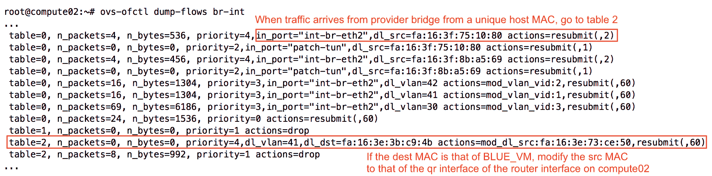
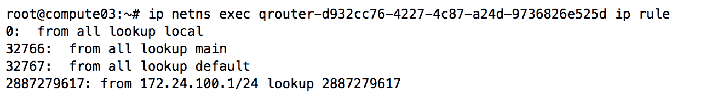

# 分布式虚拟路由器

在 OpenStack 的 Folsom 版本中引入 Neutron 之前，所有网络管理都内置于 Nova API 中，并被称为 nova-network。nova-network 提供了浮动 IP 功能，网络故障域仅限于单个计算节点 —— 这是早期版本 Neutron 所缺乏的功能。nova-network 已被弃用，并且其大部分功能已经在最新版本的 Neutron 中得到了实现和改进。在上一章中，我们通过使用 VRRP 提供高可用性的活动-待命路由器。在本章中，我们将讨论分布式虚拟路由器如何借鉴 nova-network 多主机模型的许多概念，以提供高可用性和更小的网络故障域，同时保留对 Neutron 提供的许多高级网络功能的支持。

传统路由器，包括独立路由器和活动-待命路由器，兼容多种机制驱动程序，包括 Linux 桥接和 Open vSwitch 驱动程序。而分布式虚拟路由器则需要 Open vSwitch，仅由 Open vSwitch 机制驱动程序和代理支持。其他驱动程序和代理，如 OVN 或 OpenContrail 的驱动程序，可能提供类似的分布式路由功能，但不在本书讨论范围之内。

# 在云中分布路由器

就像 nova-network 使用其多主机功能一样，Neutron 可以将虚拟路由器分布到计算节点，以便将故障域隔离到特定的计算节点，而不是集中式网络节点。通过消除集中式的 Layer 3 代理，之前在单一节点上执行的路由现在由计算节点本身处理。

传统路由使用集中式网络节点类似于以下图示：


在传统模型中，从蓝色虚拟机到位于不同网络中的红色虚拟机的流量会经过承载路由器的集中式网络节点。如果承载路由器的节点发生故障，实例之间或实例与外部网络之间的流量将被丢弃。

在本章中，我将讨论以下内容：

+   安装并配置额外的 L3 代理以支持分布式虚拟路由器

+   演示创建和管理分布式虚拟路由器

+   在同一路由器后面的网络之间进行路由

+   使用 SNAT 的出站连接

+   使用浮动 IP 的入站和出站连接

# 安装并配置 Neutron 组件

配置分布式虚拟路由器时，必须满足一些要求，包括以下内容：

+   ML2 插件

+   L2 人口机制驱动程序

+   Open vSwitch 机制驱动程序

+   在所有网络和计算节点上安装 Layer 3 代理

在本书构建的环境中，单一控制节点处理 OpenStack API 服务、DHCP 和元数据服务，并运行 Linux 桥接代理，用于独立路由器和高可用路由器（HA）。`compute01`运行 Linux 桥接代理，而`compute02`和`compute03`运行 Open vSwitch 代理。另一个节点`snat01`将运行 Open vSwitch 代理，并负责在使用分布式虚拟路由器时处理出站 SNAT 流量。

该配置的示意图如下：


尽管由于 ML2 核心插件的支持，节点之间可以混合使用驱动程序和代理，但这种设计在生产环境中并不常见。如果在使用分布式虚拟路由器的网络上部署，部署在`compute01`上的实例可能会遇到连接问题。

# 安装额外的 L3 代理

在`snat01`上运行以下命令以安装`L3`代理：

```
# apt install neutron-l3-agent
```

# 定义接口驱动程序

必须使用 Open vSwitch 和 Open vSwitch 机制驱动程序才能启用和使用分布式虚拟路由器。

更新`snat01`上`/etc/neutron/l3_agent.ini`中的 Neutron L3 代理配置文件，并指定以下接口驱动程序：

```
[DEFAULT]
...
interface_driver = openvswitch 
```

# 启用分布式模式

操作分布式虚拟路由器需要安装 ML2 插件，并且必须进行相应的配置。

更新`compute02`、`compute03`和`snat01`上的`/etc/neutron/plugins/ml2/openvswitch_agent.ini`中的 OVS 配置文件，以使 OVS 代理支持分布式虚拟路由和`L2`人口填充：

```
[agent]
...
enable_distributed_routing = True
l2_population = True 
```

# 设置代理模式

使用分布式虚拟路由器时，节点可以操作两种模式之一：`dvr`或`dvr_snat`。配置为`dvr_snat`模式的节点处理南北向 SNAT 流量，而`dvr`模式的节点处理南北向 DNAT（例如浮动 IP）流量以及实例之间的东西向流量。

运行 Open vSwitch 代理的计算节点处于 dvr 模式。集中式网络节点通常运行`dvr_snat`模式，并可能作为没有使用浮动 IP 的实例的网络单点故障。

Neutron 支持使用 VRRP 部署高可用的`dvr_snat`节点，但这超出了本书的范围。

在本书中，`snat01`节点将专门用于处理使用分布式虚拟路由器时的 SNAT 流量，因为`controller01`已经配置为 Linux 桥接代理，并且不适合作为 DVR 相关功能的主机。

在`snat01`节点上，通过修改 L3 代理配置文件中的`agent_mode`选项，将 L3 代理配置为运行`dvr_snat`模式：

```
[DEFAULT]
...
agent_mode = dvr_snat 
```

在`compute02`和`compute03`节点上，将 L3 代理从`legacy`模式修改为`dvr`模式：

```
[DEFAULT]
...
agent_mode = dvr 
```

在`snat01`、`compute02`和`compute03`节点上，将`handle_internal_only_routers`配置选项设置为`false`：

```
[DEFAULT]
...
handle_internal_only_routers = false 
```

# 配置 Neutron

Neutron 使用默认设置来确定用户允许创建的路由器类型以及应该在 L3 代理中部署的路由器数量。

以下默认设置已在`neutron.conf`配置文件中指定，且仅需在运行 Neutron API 服务的主机上修改。在此环境中，`neutron-server` 服务运行在 `controller01` 节点上。默认值如下所示：

```
# System-wide flag to determine the type of router
# that tenants can create.
# Only admin can override. (boolean value)
#
# router_distributed = false 
```

若要将分布式路由器设置为项目的默认路由器类型，请将 `router_distributed` 配置选项设置为 `true`。在本演示中，默认值 `false` 已足够。

一旦更改完成，在`controller01`上重启`neutron-server`服务以使更改生效：

```
# systemctl restart neutron-server 
```

# 重新启动 Neutron L3 和 Open vSwitch 代理

在对 Neutron L3 和 L2 代理的配置进行更改后，在`compute02`、`compute03` 和 `snat01` 上执行以下命令以重新启动相应的代理：

```
# systemctl restart neutron-l3-agent neutron-openvswitch-agent 
```

在服务重启后，额外的代理应该会登录。使用以下`openstack network agent list`命令返回所有 L3 代理的列表：

```
# openstack network agent list --agent-type="l3"
```

输出应类似于以下内容：


如果代理未按预期列出在输出中，请在相应节点的`/var/log/neutron/l3-agent.log`日志文件中排查可能的错误。

# 管理分布式虚拟路由器

除了一些例外，管理分布式路由器与管理独立路由器没有太大区别。Neutron 的路由器管理命令已在 *第十章*，*使用 Neutron 创建独立路由器* 中进行介绍。以下部分将介绍这些例外情况。

# 创建分布式虚拟路由器

拥有管理员角色的用户可以使用`openstack router create`命令的`--distributed`参数创建分布式虚拟路由器，示例如下：

```
openstack router create --distributed NAME 
```

没有管理员角色的用户受限于 Neutron 配置文件中 `router_distributed` 配置选项指定的路由器类型。用户无法覆盖默认路由器类型，也不能指定 `--distributed` 参数。

# 在实例之间路由东西向流量

在网络世界中，东西向流量传统上定义为服务器到服务器的流量。在 Neutron 中，涉及分布式虚拟路由器时，东西向流量是指位于同一项目中不同网络的实例之间的流量。在 Neutron 的传统路由模型中，不同网络之间的流量会经过位于集中式网络节点的虚拟路由器。而使用 DVR（分布式虚拟路由器）时，流量会绕过网络节点，直接在托管虚拟机实例的计算节点之间进行路由。

# 审查拓扑结构

从逻辑上讲，分布式虚拟路由器是一个连接两个或多个项目网络的单一路由器对象，如下图所示：


在下面的示例中，一个名为 `MyDistributedRouter` 的分布式虚拟路由器已经创建，并连接到两个项目网络：`BLUE_NET` 和 `RED_NET`。每个网络中的虚拟机实例使用各自的默认网关，通过相同的路由器将流量路由到另一个网络。虚拟机实例并不知道路由器的位置。

然而，揭开它的外壳，却会得出不同的结论。在以下示例中，蓝色虚拟机（VM）向红色虚拟机（VM）发送 ping，流量会按预期路由和转发：


对用户来说，连接两个网络的路由器是一个名为 `MyDistributedRouter` 的单一实体：


使用 `ip netns exec` 命令，我们可以看到每个计算节点和 `SNAT` 节点上的命名空间内的 `qr` 接口共享相同的接口名称、IP 地址和 MAC 地址：


在上面的截图中，`snat01` 和 `compute` 节点上与分布式路由器相对应的 qrouter 命名空间包含相同的 `qr-841d9818-bf` 和 `qr-d2ce8f82-d8` 接口及其地址，这些接口分别对应 `BLUE_NET` 和 `RED_NET` 网络。通过巧妙使用路由表和 Open vSwitch 流规则，可以使同一分布式路由器后面的实例之间的流量直接在计算节点之间路由。这个功能背后的技巧将在接下来的章节中讨论。

# 连接它

当分布式虚拟路由器通过 OpenStack `router add subnet` 或 `add port` 命令连接到子网时，路由器会被调度到所有在子网上托管端口并运行 Open vSwitch 代理的节点，包括任何托管 DHCP 或负载均衡器命名空间的控制器或网络节点，以及任何托管虚拟机实例的计算节点。L3 代理负责在每个节点上创建相应的 `qrouter` 网络命名空间，而 Open vSwitch 代理则将路由器接口连接到桥接器并配置适当的流规则。

# 分配路由器端口

如果没有采取适当的预防措施，将具有相同 IP 和 MAC 地址的端口分配到多个计算节点会在网络中产生重大问题。可以想象一个物理拓扑，如下图所示：


在大多数网络中，由多个具有相同 IP 和 MAC 地址的路由器连接到交换机的环境，会导致交换机不断学习和重新学习 MAC 地址在不同交换机端口上的位置。这种行为通常被称为 MAC 颤动，最终导致网络不稳定和不可靠。

虚拟交换机可能表现出相同的行为，无论分割类型如何，因为虚拟交换机可能会学习到 MAC 地址同时存在于计算节点的本地和远程位置，导致观察到与物理交换机相似的行为。

# 让它工作

为了解决这种预期的网络行为，Neutron 为每个计算节点分配了一个唯一的 MAC 地址，每当来自分布式虚拟路由器的流量离开节点时使用。以下截图显示了在此演示中为节点分配的唯一 MAC 地址：


Open vSwitch 流规则用于在流量离开具有分配给各自主机的唯一 MAC 地址的路由器接口时重写数据包的源 MAC 地址。在下图中，查看`compute02`提供者桥上的流量，演示了将非唯一`qr`接口 MAC 地址重写为分配给`compute02`的唯一 MAC 地址的过程：


同样地，当流量进入与本地虚拟机实例的 MAC 地址和分割 ID 匹配的计算节点时，源 MAC 地址从唯一源主机 MAC 地址重写为本地实例网关 MAC 地址：



因为 Layer 2 头重写发生在流量进入和离开虚拟机实例之前，实例对帧的更改是不知情的，并且正常运行。以下部分详细演示了这个过程。

# 演示实例间的流量

想象一个场景，不同网络中的虚拟机存在于两个不同的计算节点上，如下图所示：


从计算节点 A 上的蓝色虚拟机实例到计算节点 B 上的红色虚拟机实例的流量将首先从实例转发到其本地网关，通过集成桥到达路由器命名空间，如下图所示：


| **源 MAC** | **目的 MAC** | **源 IP** | **目的 IP** |
| --- | --- | --- | --- |
| 蓝色虚拟机 | 蓝色路由器接口 | 蓝色虚拟机 | 红色虚拟机 |

计算节点 A 上的路由器将从蓝色虚拟机到红色虚拟机的流量路由，将源 MAC 地址替换为其红色接口，目的 MAC 地址替换为红色虚拟机的 MAC 地址：

| **源 MAC** | **目的 MAC** | **源 IP** | **目的 IP** |
| --- | --- | --- | --- |
| 红色路由器接口 | 红色虚拟机 | 蓝色虚拟机 | 红色虚拟机 |

然后路由器将数据包发送回集成桥，随后转发到提供者桥，如下图所示：


当流量到达 ComputeA 的提供商桥时，会处理一系列流规则，导致源 MAC 地址从路由器的红色接口更改为主机的唯一 MAC 地址：

| **源 MAC** | **目的 MAC** | **源 IP** | **目的 IP** |
| --- | --- | --- | --- |
| 源主机（Compute A） | 红色虚拟机 | 蓝色虚拟机 | 红色虚拟机 |

然后，流量被转发到物理网络，并传送到 Compute B：


当流量到达 Compute B 时，会通过提供商桥进行转发。一个流规则会添加一个本地 VLAN 头，允许流量在转发到集成桥时进行匹配：


| **源 MAC** | **目的 MAC** | **源 IP** | **目的 IP** |
| --- | --- | --- | --- |
| 源主机（Compute A） | 红色虚拟机 | 蓝色虚拟机 | 红色虚拟机 |

在集成桥接器中，一个流规则会去掉本地 VLAN 标签，并将源 MAC 地址更改回路由器的红色接口地址。然后，数据包将被转发到红色虚拟机：


| **源 MAC** | **目的 MAC** | **源 IP** | **目的 IP** |
| --- | --- | --- | --- |
| 红色路由器接口 | 红色虚拟机 | 蓝色虚拟机 | 红色虚拟机 |

从红色虚拟机到蓝色虚拟机的返回流量经过相应的路由器和每个计算节点上的桥接器，沿着类似的路由路径。

# 集中式 SNAT

源 NAT，简称 SNAT，是指在数据包离开路由器接口时更改其源地址的方法。当 Neutron 路由器从外部网络分配到一个 IP 地址时，该 IP 将用于表示来自路由器后方虚拟机实例的流量，这些虚拟机没有浮动 IP。在 Neutron 中的所有路由器，无论是独立的、高可用的，还是分布式的，都支持 SNAT，并且在没有使用浮动 IP 时，会伪装来自路由器后方的流量。

默认情况下，处理 SNAT 的路由器是集中在单个节点上的，并且不可高可用，这会导致给定网络的单点故障。作为解决方法，可以配置多个节点处于`dvr_snat`模式。Neutron 支持利用 VRRP 来提供高可用的 SNAT 路由器，但该功能仍处于实验阶段，本书中不讨论。

# 查看拓扑结构

在这个 DVR SNAT 演示中，将使用以下提供商和项目网络：


使用-`-distributed`参数，创建了一个分布式虚拟路由器：


在这个环境中，主机`snat01`上的 L3 代理处于`dvr_snat`模式，并作为集中式`SNAT`节点。将路由器附加到项目网络`GREEN_NET`，会将该路由器调度到`snat01`主机：


当在`GREEN_NET`网络中启动实例时，路由器也会调度到相应的计算节点。

此时，`snat01`和`compute03`节点各自都有一个与`MyOtherDistributedRouter`路由器对应的`qrouter`命名空间。将路由器连接到外部网络后，会在`snat01`节点创建一个`snat`命名空间。现在，在`snat01`节点上，存在同一个路由器的两个命名空间——`snat`和`qrouter`：


这个配置可以通过以下图示表示：


`snat01`节点上的`qrouter`命名空间的配置与`compute03`节点上的`qrouter`命名空间相似。`snat`命名空间用于集中式 SNAT 服务。

在`snat01`节点上，查看`qrouter`命名空间内的接口：


与传统路由器的`qrouter`命名空间不同，即使路由器已连接到外部网络，`qrouter`命名空间中也没有`qg`接口。

然而，查看`snat`命名空间内的内容，我们可以找到`qg`接口，用于处理来自实例的出站流量：


除了`qg`接口之外，现在还有一个以`sg`为前缀的新接口。每个虚拟路由器会为它连接的每个内部网络配置一个`qr`接口和一个新的`sg`接口。`sg`接口用于在流量进行源 NAT 时作为额外的跳跃点，详细内容将在接下来的章节中解释。

# 使用路由策略数据库

当一个没有浮动 IP 的虚拟机实例向外部网络（如互联网）发送流量时，流量会进入计算节点上的本地`qrouter`命名空间，并被路由到集中式`network`节点上的`snat`命名空间。为了实现这个任务，`qrouter`命名空间内设置了特定的路由规则。

Linux 提供了一个由多个路由表和规则组成的路由策略数据库，允许基于目标和源地址、IP 协议、端口等进行智能路由。每个虚拟路由器连接的每个子网都有源路由规则。

在这个示例中，路由器连接到单个项目网络：`172.24.100.0/24`。查看`compute01`节点上`qrouter`命名空间中的主路由：


请注意，主路由表中没有默认路由。

在计算节点上，从`qrouter`命名空间中使用`ip rule`命令列出 Neutron 代理创建的额外路由表和规则：



`2887279617`号路由表是由 Neutron 创建的。查询额外的路由表后，找到默认路由：


从该输出中，我们可以看到 `172.24.100.11` 是默认网关地址，且对应于集中式节点中 `snat` 命名空间内的 `sq` 接口。当流量到达 `snat` 命名空间时，会执行源 NAT，并且流量会从 `qg` 接口路由出去。

# 跟踪数据包通过 SNAT 命名空间

在以下示例中，绿色虚拟机将流量发送到 `8.8.8.8`，一个 Google DNS 服务器：


| **源 MAC** | **目标 MAC** | **源 IP** | **目标 IP** |
| --- | --- | --- | --- |
| 绿色虚拟机 | 绿色路由器接口（`qr1`） | 绿色虚拟机 | `8.8.8.8`（Google DNS） |

当流量到达本地 qrouter 命名空间时，会查询主路由表。目标 IP `8.8.8.8` 并不匹配任何直接连接的子网，并且不存在默认路由。接下来会查询次级路由表，基于源接口找到匹配项。然后，路由器将流量从绿色虚拟机路由到 `SNAT` 命名空间的绿色接口 `sg1`，通过本章前面讨论的东西向路由机制：


| **源 MAC** | **目标 MAC** | **源 IP** | **目标 IP** |
| --- | --- | --- | --- |
| 绿色路由器接口（qr1） | 绿色 SNAT 接口（sg1） | 绿色虚拟机 | `8.8.8.8`（Google DNS） |

当流量进入 snat 命名空间时，它会被路由到 `qg` 接口。命名空间内的 `iptables` 规则会将源 IP 和 MAC 地址更改为 `qg` 接口的地址，以确保流量能够正确地路由回去：


| **源 MAC** | **目标 MAC** | **源 IP** | **目标 IP** |
| --- | --- | --- | --- |
| 外部 SNAT 接口（`qg`） | 物理默认网关 | 外部 SNAT 接口（`qg`） | `8.8.8.8`（Google DNS） |

当远程目标响应时，集中式网络节点和计算节点上的流规则与连接跟踪和 NAT 表中的数据相结合，确保响应能正确路由回绿色虚拟机，并且带有适当的 IP 和 MAC 地址。

# 通过分布式虚拟路由器的浮动 IP

在网络世界中，南北流量传统上被定义为客户端到服务器的流量。在 Neutron 中，涉及到分布式虚拟路由器时，南北流量指的是来自外部网络的流量，流向使用浮动 IP 的虚拟机实例，或反之亦然。

在传统模型中，所有来自外部客户端的流量都要通过托管有浮动 IP 路由器的集中式网络节点。使用 DVR 时，同样的流量避开了网络节点，直接路由到托管虚拟机实例的计算节点。此功能要求计算节点通过外部桥接直接连接到外部网络——这一配置直到现在仅见于托管独立路由器或高可用路由器的节点。

# 引入 FIP 命名空间

与 SNAT 流量不同，通过浮动 IP 与 DVR 的流量是在单独的计算节点上处理的，而不是在集中节点上处理。当浮动 IP 附加到虚拟机实例时，计算节点上的 L3 代理会创建一个新的`fip`命名空间，该命名空间对应于浮动 IP 所属的外部网络（如果该命名空间尚不存在）：


连接到同一外部网络的计算节点上的任何路由器命名空间都共享一个单一的 fip 命名空间，并通过 veth 对与该命名空间相连。veth 对被视为 fip 命名空间与各个 qrouter 命名空间之间的点对点链接，并使用公共的`169.254/16`链路本地地址空间作为`/31`网络进行寻址。由于命名空间之间的网络连接仅存在于节点内部，并且作为点对点链接使用，因此不需要 Neutron 项目网络分配。

在`qrouter`命名空间中，veth 对的一端具有前缀`rfp`，表示路由器到 FIP：


在`fip`命名空间内部，veth 对的另一端具有前缀`fpr`，表示 FIP 到路由器：


除了`fpr`接口外，FIP 命名空间内部还可以找到一个前缀为 fg 的新接口。`rfp`、`fpr`和`fg`接口将在接下来的部分中讨论。

# 追踪数据包通过 FIP 命名空间

当浮动 IP 分配给实例时，会发生以下几件事：

+   如果外部网络的 fip 命名空间在计算节点上不存在，则会创建一个。

+   计算节点上 qrouter 命名空间中的路由表已被修改。

以下部分演示了如何处理浮动 IP 的进出流量。

# 从具有浮动 IP 的实例发送流量

想象一个场景，其中浮动 IP`10.30.0.107`已经分配给下图所示的绿色虚拟机：


当`172.24.100.6`的绿色虚拟机实例向外部资源发送流量时，它首先到达本地`qrouter`命名空间：


| **源 MAC** | **目的 MAC** | **源 IP** | **目的 IP** |
| --- | --- | --- | --- |
| 绿色虚拟机 | 绿色 qr 接口 | 绿色虚拟机固定 IP（172.24.100.6） | 8.8.8.8（Google DNS） |

当流量到达本地 qrouter 命名空间时，会查询路由策略数据库，以便可以相应地路由流量。在将浮动 IP 关联到端口时，会在 qrouter 命名空间的路由表中添加一个源路由规则：


在具有更高优先级的 qrouter 命名空间中的主要路由表没有默认路由，因此`57481:`来自`172.24.100.6`的查找 16 规则被匹配。

查看引用的路由表 16，可以看到 fip 命名空间的 `fpr` 接口是从实例固定 IP 源发送流量的默认路由：


qrouter 命名空间执行将固定 IP 转换为浮动 IP 的 NAT 翻译，并将流量发送到 fip 命名空间，以下图所示：


| **源 MAC** | **目标 MAC** | **源 IP** | **目标 IP** |
| --- | --- | --- | --- |
| `rfp` 接口 | `fpr` 接口 | 绿色 VM 浮动 IP(`10.30.0.107`) | 8.8.8.8（Google DNS） |

一旦流量到达 `fip` 命名空间，它会通过 `fg` 接口转发到其默认网关：


| **源 MAC** | **目标 MAC** | **源 IP** | **目标 IP** |
| --- | --- | --- | --- |
| `fg` 接口 | 物理默认网关 | 绿色 VM 浮动 IP(`10.30.0.107`) | 8.8.8.8（Google DNS） |

# 将流量返回到浮动 IP

如果你还记得本章前面提到的，计算节点上的单个 `fip` 命名空间由连接到外部网络的该节点上的每个 `qrouter` 命名空间共享。就像独立或高可用路由器在其 `qg` 接口上有一个来自外部网络的 IP 地址一样，每个 `fip` 命名空间在其 `fg` 接口上也配置了来自外部网络的唯一 IP 地址。

在 `compute03` 上，IP 地址是 `10.30.0.113`：


与传统路由器不同，分布式路由器的 qrouter 命名空间无法直接连接到外部网络。然而，qrouter 命名空间仍然负责将固定 IP 转换为浮动 IP 的 NAT 操作。之后，流量被路由到 `fip` 命名空间，然后继续转发到外部网络。

# 使用代理 ARP

浮动 IP 被配置在 `qrouter` 命名空间的 `rfp` 接口上，但由于 `fip` 命名空间位于 `qrouter` 命名空间和外部网络之间，因此无法直接从外部网络的网关访问。

为了允许流量通过 `fip` 命名空间路由回 `qrouter` 命名空间，Neutron 依赖于代理 ARP 的使用。通过自动在 `fg` 接口上启用代理 ARP，`fip` 命名空间能够代表浮动 IP 响应来自上游网关设备的浮动 IP 的 ARP 请求。

当流量从网关设备路由到 `fip` 命名空间时，路由表会被查询，并且流量会被路由到相应的 `qrouter` 命名空间：


以下图演示了在这种情况下代理 ARP 是如何工作的：


`fg` 接口位于 `fip` 命名空间内，代表 `qrouter` 命名空间进行响应，因为 `qrouter` 并未直接连接到外部网络。通过使用单一的 `fip` 命名空间和代理 ARP，消除了为每个 `qrouter` 命名空间提供外部网络上自己 IP 地址的需求，从而减少了不必要的 IP 地址消耗，并使更多浮动 IP 可供虚拟机实例和其他网络资源使用。

# 总结

分布式虚拟路由器通过避免传统模型中出现的瓶颈和单点故障，对整个网络架构产生了积极影响。东西向和南北向流量可以在计算节点之间进行路由和转发，从而实现更高效、更具弹性的网络。SNAT 流量仅限于集中节点，但目前已经有高可用 SNAT 路由器处于实验状态，并将在 OpenStack 的未来版本中准备投入生产使用。

虽然分布式虚拟路由器有助于提供与 nova-network 的多主机能力一致的功能，但它们在操作上比较复杂，如果出现问题，相比独立路由器或高可用路由器，故障排除难度较大。

在下一章中，我们将介绍被称为负载均衡即服务（LBaaS）的高级网络服务及其参考架构，使用 `haproxy` 插件。LBaaS 允许用户创建和管理负载均衡器，这些负载均衡器可以在多个虚拟机实例之间分配工作负载。通过 Neutron API，用户可以快速扩展应用程序，同时提供弹性和高可用性。
