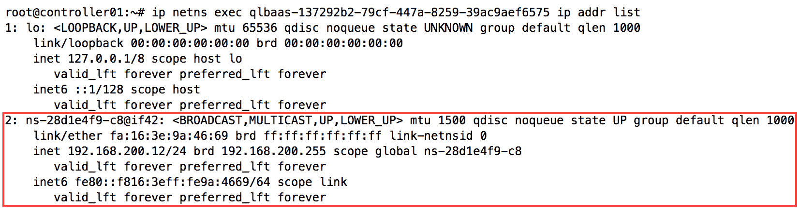
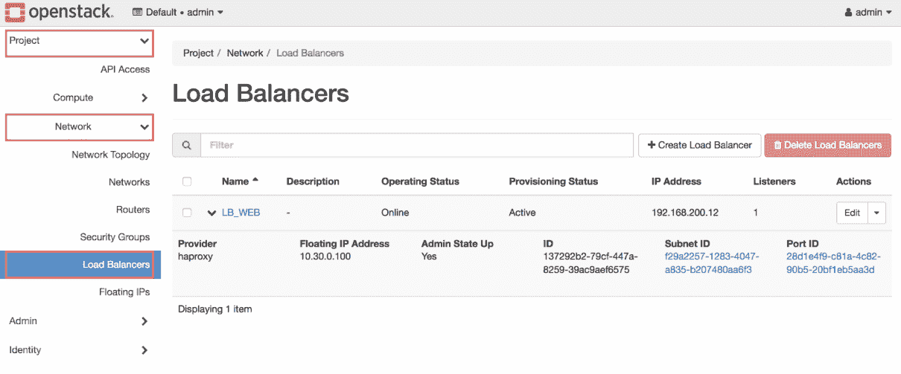

# 第十三章：将流量负载均衡到实例

Neutron 的负载均衡即服务（LBaaS v2）插件，允许用户将流量负载均衡到运行在云中虚拟实例上的应用程序。Neutron 提供一个 API 来管理负载均衡器、监听器、池、成员和健康检查器。

本章将介绍一些基本的负载均衡概念，包括以下内容：

+   监听器、池和池成员

+   负载均衡算法

+   健康检查器

+   会话保持

Neutron 使用驱动程序与硬件或软件负载均衡器进行交互。在 Pike 版本中，参考驱动程序在网络命名空间内部署 HAProxy。HAProxy 是一个免费的开源负载均衡器，适用于大多数基于 Linux 的操作系统。Octavia 是另一个兼容 LBaaS v2 API 的开源负载均衡解决方案。然而，Octavia 不使用网络命名空间，而是启动并管理一组虚拟机、容器或裸机服务器，这些服务器被称为 amphorae，充当负载均衡器。这样，Octavia 可以实现横向扩展和按需扩展。部署 Octavia 和其他第三方驱动程序（如 F5、Citrix、Radware 等供应商提供的驱动程序）是可能的，但超出了本书的范围。

本章将详细讲解以下内容：

+   将负载均衡器集成到网络中

+   安装并配置 LBaaS v2 代理

+   创建负载均衡器

+   演示流量负载均衡到实例

# 负载均衡基础

负载均衡器是一个表示虚拟 IP 的对象，并与 Neutron 端口相关联。虚拟 IP 通常暴露到互联网，并映射到域名，以提供对面向互联网的负载均衡服务的访问。虚拟 IP 也可以为仅限内部客户端的服务创建。流量将被分配到池成员之间，并为应用程序提供扩展性和弹性。

Neutron 中负载均衡器有四个主要组件：

+   池成员

+   池

+   健康检查器

+   监听器

池成员是一个层 4 对象，表示服务或应用程序的 IP 地址和监听端口。例如，一个池成员可能是一个 Web 服务器，配置的 IP 地址为 192.168.0.2，监听 TCP 端口 80。

池是一个池成员的集合，池成员通常提供相同的内容。由 Web 服务器组成的池可能类似于以下成员配置：

+   服务器 A:192.168.0.2:80

+   服务器 B:192.168.0.4:80

+   服务器 C:192.168.0.6:80

健康检查器是一个对象，表示对池成员进行健康检查操作，该操作按定义的间隔时间运行。当健康检查失败时，池成员会被标记为 DOWN，并从池中移除，直到其通过后续的检查。与此同时，流量将被引导到健康的成员。

监听器是一个对象，表示与虚拟 IP 相关联的 4 层端口，用于监听传入到 VIP 的连接。负载均衡器可以在多个端口上监听连接，每个端口由一个监听器定义。

下图演示了这些对象之间的关系：


# 负载均衡算法

在 LBaaS API 的版本 2 中，可以将以下负载均衡算法应用于池：

+   轮询

+   最少连接

+   源 IP

使用轮询算法时，负载均衡器会将每个新连接传递给下一个服务器。随着时间的推移，所有连接会均匀分配到所有被负载均衡的机器上。轮询是资源消耗最少的算法，但没有机制判断某台机器是否因连接过多而超负荷。为了避免池成员过载，所有成员在处理速度、连接速度和内存等方面应该相等。

使用最少连接算法时，负载均衡器将新连接传递给当前连接数最少的服务器。这被认为是一种动态算法，因为系统会追踪每个服务器的连接数，并据此平衡流量。性能更高的池成员可能会接收到更多流量，因为它们能更快地处理连接。

使用源 IP 算法时，所有来自相同源 IP 地址的连接都会被发送到同一个池成员。连接最初使用轮询算法进行平衡，然后通过表格追踪这些连接，以便后续来自相同 IP 地址的连接进行查找。该算法适用于需要客户端始终连接到同一服务器的应用场景，比如在线购物车，它会在本地 Web 服务器上存储会话信息。

# 监控

LBaaS v2 API 支持多种监控类型，包括 TCP、HTTP 和 HTTPS。TCP 监控测试连接到池成员的 4 层连通性，而 HTTP 和 HTTPS 监控基于 7 层 HTTP 状态码测试池成员的健康状况。

# 会话持久性

LBaaS v2 支持虚拟 IP 上的会话持久性。会话持久性是一种负载均衡方法，它强制相同协议的多个客户端请求被定向到同一个节点。此功能通常用于许多 Web 应用程序，它们不在池成员之间共享应用状态。

HAProxy 驱动程序支持的会话持久性类型包括以下几种：

+   `SOURCE_IP`

+   `HTTP_COOKIE`

+   `APP_COOKIE`

使用 `SOURCE_IP` 持久性类型会在后端池配置中为 HAProxy 配置以下设置：

```
stick-table type ip size 10k 
stick on src
```

客户端首次连接到虚拟 IP 时，HAProxy 会根据客户端的 IP 地址在粘性表中创建一条记录，并将来自相同 IP 地址的后续连接发送到同一个后端池成员。根据配置，粘性表中最多可以存在 10,000 条粘性记录。如果用户通过代理服务器连接，且该代理错误地将多个客户端识别为单一地址，可能会导致池成员之间的负载不均衡。

使用 `HTTP_COOKIE` 持久性类型将在后端池配置中为 HAProxy 配置以下设置：

```
cookie SRV insert indirect nocache 
```

客户端首次连接到虚拟 IP 时，HAProxy 会将连接平衡到下一个池成员。当池成员发送响应时，HAProxy 会在响应中注入一个名为 SRV 的 cookie，然后将其发送给客户端。SRV cookie 的值是一个唯一的服务器标识符。当客户端发送后续请求到虚拟 IP 时，HAProxy 会从请求头中剥离该 cookie，并直接将流量发送到 cookie 中标识的池成员。与源 IP 持久性方法相比，这种持久性方法更为推荐，因为它不依赖于客户端的 IP 地址。然而，它可能并不与所有客户端兼容。

使用 `APP_COOKIE` 持久性类型将在后端池配置中为 HAProxy 配置以下设置：

```
appsession <CookieName> len 56 timeout 3h 
```

当在后端配置中定义了应用程序 cookie 时，HAProxy 会检查服务器的响应，存储 cookie 的值在表中，并将其与服务器的标识符关联。最多会保留 cookie 值中的 56 个字符。在后续客户端连接时，HAProxy 会查找客户端请求中的 cookie。如果找到已知值，则客户端将被引导到与该值相关联的池成员。否则，将应用轮询负载均衡算法。当 cookie 长时间未被使用（超过三小时）时，HAProxy 会自动从内存中删除该 cookie。

# 将负载均衡器集成到网络中

在使用 HAProxy 驱动时，负载均衡器以单臂模式实现。在单臂模式下，负载均衡器不处于流向池成员的正常流量路径中。负载均衡器具有一个单一接口，用于处理来自客户端和池成员的进出流量。

以下是单臂模式下负载均衡器的逻辑图：


在上述图示中，负载均衡器配置为单臂模式，并与其所平衡流量的服务器处于同一子网中。

由于单臂模式下的负载均衡器不是池成员的网关，因此必须依赖源 NAT 来确保来自池成员的返回流量能通过负载均衡器返回到客户端。以下图示展示了流量的示例：


在上述示意图中，负载均衡器接收到来自客户端的请求并将其转发到 web1。负载均衡器将在转发请求到池成员之前修改请求的源 IP 为其自身的地址 192.168.200.12。这样可以确保池成员将响应发送回负载均衡器，然后负载均衡器将目标 IP 重写为客户端地址。如果服务器直接将响应发送到客户端，客户端将拒绝该数据包。

Neutron 配置 HAProxy 以向池成员发送`HTTP ``X-Forwarded-For`头，这样池成员可以看到原始客户端地址。如果没有这个头，所有流量将被标识为来自负载均衡器，这可能会扭曲应用程序报告数据和持久性设置。

除了单臂模式外，还可以使用路由模式和透明模式。在路由模式下，负载均衡器充当客户端和池成员之间的网关。大多数情况下，数据包的源地址无需更改，因为负载均衡器作为池成员的网关。

在透明模式下，负载均衡器充当配置有相同子网的两个 VLAN 之间的网络桥接。使用此模式可以让用户将负载均衡器引入网络，且对现有环境影响最小，因为池成员无需更改其网关。

当前没有办法更改基于 HAProxy 的负载均衡器如何集成到网络中。不过，某些第三方驱动可能不限于单臂模式，且可以在任何模式下工作。

# 网络命名空间

当使用 HAProxy 驱动时，Neutron 依赖于网络命名空间为每个负载均衡器提供单独的实例。每个负载均衡器都有一个对应的网络命名空间。负载均衡器在环境中被调度到 LBaaS v2 代理，这些代理负责创建相应的网络命名空间并进行适当的配置。用于负载均衡器的命名空间在`ip netns list`输出中以`qlbaas`为前缀。

# 安装 LBaaS v2

`neutron-lbaasv2-agent`服务通常在一个或多个网络节点上运行。在此环境中，服务将安装在`controller01`上。

在控制节点上执行以下命令，以安装 LBaaS v2 代理及其依赖项，包括 HAProxy：

```
# apt install neutron-lbaasv2-agent 
```

# 配置 Neutron LBaaS 代理服务

Neutron 将 LBaaS v2 代理配置存储在`/etc/neutron/lbaas_agent.ini`文件中。最常用的配置选项将在接下来的章节中讨论。

# 定义接口驱动

与之前安装的代理一样，Neutron LBaaS v2 代理必须配置为使用与所选网络驱动相对应的接口驱动。在此配置中，有两个选项：

+   Linux 桥接

+   Open vSwitch

更新控制节点上`/etc/neutron/lbaas_agent.ini`的 Neutron LBaaS 代理配置文件，使用以下驱动之一。

对于 Linux 桥接：

```
[DEFAULT]
...
interface_driver = linuxbridge 
```

对于 Open vSwitch：

```
[DEFAULT]
...
interface_driver = openvswitch 
```

本书中指定了控制节点运行 Linux 桥接代理。因此，LBaaS v2 代理应配置为使用 Linux 桥接接口驱动程序。

# 定义设备驱动程序

要管理负载均衡器，Neutron LBaaS v2 代理必须配置为使用提供 Neutron API 与负载均衡器编程之间接口的设备驱动程序。

更新位于`/etc/neutron/lbaas_agent.ini`的 Neutron LBaaS v2 代理配置文件节点，以使用 HAProxy 设备驱动程序：

```
[DEFAULT]
...
device_driver = neutron_lbaas.drivers.haproxy.namespace_driver.HaproxyNSDriver 
```

# 定义用户组

根据所使用的操作系统（包括本书中使用的 Ubuntu 16.04 LTS），可能需要将 LBaaS v2 代理配置为以某个用户组名称操作 HAProxy。在 `controller01` 节点上，使用以下配置更新 LBaaS v2 配置文件：

```
[haproxy]
...
user_group = haproxy 
```

# 配置 Neutron

除了配置 LBaaS 代理之外，在使用 API 创建 LBaaS 对象之前，Neutron 还必须配置为使用 LBaaS 服务插件和驱动程序。

# 定义服务插件

在 `controller01` 节点上，将 LBaaS v2 服务插件添加到 Neutron 配置文件 `/etc/neutron/neutron.conf` 中现有的 `service_plugins` 列表中：

```
[DEFAULT]
...
service_plugins = router,neutron_lbaas.services.loadbalancer.plugin.LoadBalancerPluginv2 
```

确保将插件附加到现有的插件列表中，而不是替换列表内容，以避免与 API 和现有网络对象发生问题。

# 定义服务提供者

自 OpenStack 的 Kilo 版本以来，许多高级服务配置选项已从主要的 Neutron 配置文件中移出，转而放入各自的文件中。在 controller01 节点上，创建或更新位于 `/etc/neutron/neutron_lbaas.conf` 的 Neutron LBaaS 配置文件，并为 LBaaS 定义 HAProxy 服务提供者驱动程序：

```
[service_providers] 
... 
service_provider = LOADBALANCERV2:Haproxy:neutron_lbaas.drivers.haproxy.plugin_driver.HaproxyOnHostPluginDriver:default 
```

# 更新数据库模式

在重启 Neutron API 服务器以提供 LBaaS API 之前，必须更新数据库模式，以支持负载均衡对象。

在 `controller01` 节点上，运行以下命令以执行数据库迁移：

```
# neutron-db-manage --subproject neutron-lbaas upgrade head 
```

# 重启 Neutron LBaaS 代理和 API 服务

一旦数据库迁移完成，必须重启 `neutron-lbaasv2-agent` 和 `neutron-server` 服务，以使更改生效。请在控制节点上执行以下命令以重启服务：

```
# systemctl restart neutron-server neutron-lbaasv2-agent 
```

使用 `openstack network agent list` 命令验证代理是否正在运行并已签到：


如果遇到任何问题，请务必在继续操作之前检查位于`/var/log/neutron/neutron-lbaasv2-agent.log`的 LBaaS v2 代理日志。

# 在 CLI 中管理负载均衡器

Neutron 提供了一些命令，用于创建和管理负载均衡目的的监听器、虚拟 IP、池、成员和健康监控器。然而，从 OpenStack 的 Pike 版本开始，负载均衡相关的命令在 openstack 客户端中不可用。相反，应使用 neutron 客户端或 API。

创建基本负载均衡器的工作流程如下：

+   创建负载均衡器对象

+   创建并关联池

+   创建并关联池成员（可选）

+   创建并关联健康检查器（可选）

+   创建并关联监听器

# 在 CLI 中管理负载均衡器

负载均衡器是占用 Neutron 端口并从子网分配 IP 作为虚拟 IP 的对象。以下命令用于在 CLI 中管理负载均衡器对象：

| **负载均衡器管理命令** | **描述** |
| --- | --- |
| `lbaas-loadbalancer-create` | 创建负载均衡器 |
| `lbaas-loadbalancer-delete` | 删除指定负载均衡器 |
| `lbaas-loadbalancer-list` | 列出属于指定租户的负载均衡器 |
| `lbaas-loadbalancer-list-on-agent` | 列出负载均衡器 v2 代理上的负载均衡器 |
| `lbaas-loadbalancer-show` | 显示指定负载均衡器的信息 |
| `lbaas-loadbalancer-stats` | 获取指定负载均衡器的统计信息 |
| `lbaas-loadbalancer-status` | 获取指定负载均衡器的状态 |
| `lbaas-loadbalancer-update` | 更新指定负载均衡器 |
| `lbaas-agent-hosting-loadbalancer` | 获取托管负载均衡器的 lbaas v2 代理 |

# 在 CLI 中创建负载均衡器

要创建负载均衡器，请使用以下命令：`neutron lbaas-loadbalancer-create`：

```
neutron lbaas-loadbalancer-create
[--tenant-id TENANT_ID]
[--description DESCRIPTION]
[--name NAME]
[--admin-state-down]
[--provider PROVIDER]
[--flavor FLAVOR]
[--vip-address VIP_ADDRESS]
VIP_SUBNET 
```

`--tenant-id`参数是可选的，可以用来将负载均衡器与非创建者的项目关联。

`--description`参数是可选的，可以用来为负载均衡器提供描述。

`--name`参数是可选的，可以用来为负载均衡器指定一个名称。

`--admin-state-down`参数是可选的，可以用来在创建时将负载均衡器设置为 DOWN 状态。

`--provider`参数是可选的，可以用来指定负载均衡器提供程序驱动程序，而不是使用默认的提供程序。此环境中的默认提供程序是 HAProxy。

`--vip-address`参数是可选的，可以用来指定 VIP 的特定 IP 地址。

`VIP_SUBNET`参数用于指定从中获取负载均衡器 VIP 的子网。

# 删除 CLI 中的负载均衡器

要删除负载均衡器，请使用以下命令：`neutron lbaas-loadbalancer-delete`：

```
neutron lbaas-loadbalancer-delete LOADBALANCER [LOADBALANCER...]
```

`LOADBALANCER`参数指定要删除的负载均衡器的名称或 ID。可以使用空格分隔的列表同时删除多个负载均衡器。

# 在 CLI 中列出负载均衡器

要列出所有负载均衡器，请使用以下命令：`neutron lbaas-loadbalancer-list`：

```
neutron lbaas-loadbalancer-list 
```

# 在 CLI 中显示负载均衡器详情

要显示负载均衡器的详细信息，请使用以下命令：`neutron lbaas-loadbalancer-show`：

```
neutron lbaas-loadbalancer-show LOADBALANCER 
```

`LOADBALANCER`参数指定要显示的负载均衡器的名称或 ID。

# 在 CLI 中显示负载均衡器统计信息

要显示负载均衡器的统计信息，请使用以下命令：`neutron lbaas-loadbalancer-stats`：

```
neutron lbaas-loadbalancer-stats LOADBALANCER  
```

`LOADBALANCER` 参数指定要显示的负载均衡器的名称或 ID。

# 在命令行界面（CLI）显示负载均衡器的状态

要显示负载均衡器的状态，使用如下命令：`neutron lbaas-loadbalancer-status`。

```
neutron lbaas-loadbalancer-status LOADBALANCER  
```

`LOADBALANCER` 参数指定要显示的负载均衡器的名称或 ID。

# 在 CLI 中更新负载均衡器

要更新负载均衡器的属性，使用如下命令：`neutron lbaas-loadbalancer-update`。

```
neutron lbaas-loadbalancer-update
[--description DESCRIPTION]
[--name NAME]
LOADBALANCER  
```

`--description` 参数是可选的，可用于更新负载均衡器的描述。

`--name` 参数是可选的，可用于更新负载均衡器的名称。

`LOADBALANCER` 参数指定要更新的负载均衡器的名称或 ID。

# 在 CLI 中管理池

池是一组设备，例如 Web 服务器，这些设备被组合在一起，用于接收和处理流量。当流量被发送到虚拟 IP 时，负载均衡器将请求发送到该池中的任何一台服务器。

以下命令用于在 CLI 中管理负载均衡器池：

| **池命令** | **描述** |
| --- | --- |
| `lbaas-pool-create` | 创建一个池 |
| `lbaas-pool-delete` | 删除指定池 |
| `lbaas-pool-list` | 列出属于指定租户的池 |
| `lbaas-pool-show` | 显示指定池的信息 |
| `lbaas-pool-update` | 更新指定池 |

# 在 CLI 中创建池

要创建池，使用如下命令：`neutron lbaas-pool-create`。

```
neutron lbaas-pool-create
[--tenant-id TENANT_ID]
[--description DESCRIPTION]
[--name NAME] --lb-algorithm
{ROUND_ROBIN,LEAST_CONNECTIONS,SOURCE_IP}
```

```
[--admin-state-down]
[--listener LISTENER]
[--loadbalancer LOADBALANCER] --protocol {HTTP,HTTPS,TCP}
[--session-persistence type=TYPE[,cookie_name=COOKIE_NAME]] 
```

`--tenant-id` 参数是可选的，可用于将池与除创建者之外的项目关联。指定的租户或项目 ID 应与相应的负载均衡器匹配。

`--description` 参数是可选的，可用于为池提供描述。

`--name` 参数是可选的，可用于为池设置名称。

`--lb-algorithm` 参数是必需的，用于指定分配流量到池成员时使用的负载均衡算法。可选的算法包括 `ROUND_ROBIN`、`LEAST_CONNECTIONS` 和 `SOURCE_IP`。

`--admin-state-down` 参数是可选的，可用于在创建池时将其设置为 DOWN 状态。

`--listener` 参数是可选的，用于将池与监听器关联。

`--loadbalancer` 参数是可选的，可用于指定关联的负载均衡器。

`--protocol` 参数是必需的，用于指定负载均衡协议。可选的协议包括 HTTP、HTTPS 和 TCP。

`--session-persistence` 参数是可选的，用于指定会话保持方法和/或 Cookie 类型。

# 在 CLI 中删除池

要删除池，使用如下命令：`neutron lbaas-pool-delete`。

```
neutron lbaas-pool-delete POOL [POOL ...] 
```

`POOL` 参数指定要删除的池的名称或 ID。可以通过空格分隔的列表一次删除多个池。

# 在 CLI 中列出池

要列出所有池，使用如下命令：`neutron lbaas-pool-list`。

```
neutron lbaas-pool-list  
```

# 在 CLI 中显示池的详细信息

要显示池的详细信息，请使用如下所示的 `neutron lbaas-pool-show` 命令：

```
neutron lbaas-pool-show POOL 
```

`POOL` 参数指定要显示的池的名称或 ID。

# 在 CLI 中更新池

要更新池，使用如下所示的 `neutron lbaas-pool-update` 命令：

```
neutron lbaas-pool-update
[--admin-state-up {True,False}]
[--session-persistence type=TYPE [,cookie_name=COOKIE_NAME]
| --no-session-persistence]
[--description DESCRIPTION]
[--name NAME]
[--lb-algorithm {ROUND_ROBIN,LEAST_CONNECTIONS,SOURCE_IP}]
POOL 
```

`--admin-state-up` 参数是可选的，可以用来更改池的状态。

`--session-persistence` 参数是可选的，用于修改会话持久性方法和/或 cookie 类型。

`--no-session-persistence` 参数是可选的，用于从池中移除会话持久性。

`--description` 参数是可选的，用于更新池的描述。

`--name` 参数是可选的，用于更新池的名称。

`--lb-algorithm` 参数是可选的，用于修改负载均衡算法，该算法用于在池成员之间分配流量。

`POOL` 参数指定要更新的池的名称或 ID。

# 在 CLI 中管理池成员

以下命令用于在 CLI 中管理池成员：

| **池成员命令** | **描述** |
| --- | --- |
| `lbaas-member-create` | 创建一个成员 |
| `lbaas-member-delete` | 删除给定成员 |
| `lbaas-member-list` | 列出属于给定池的成员 |
| `lbaas-member-show` | 显示给定成员的信息 |
| `lbaas-member-update` | 更新给定成员 |

# 在 CLI 中创建池成员

要创建池成员，使用如下所示的 `neutron lbaas-member-create` 命令：

```
neutron lbaas-member-create
[--tenant-id TENANT_ID]
[--name NAME]
[--weight WEIGHT]
[--admin-state-down]
--subnet SUBNET
--address ADDRESS
--protocol-port
PROTOCOL_PORT
POOL 
```

`--tenant-id` 参数是可选的，用于将池成员与创建者以外的项目关联。指定的租户或项目 ID 应该与相应的负载均衡器匹配。

`--name` 参数是可选的，用于设置池成员的名称。

`--weight` 参数允许您为池成员关联一个权重。设置后，池成员可能会比同池中的其他成员接收更多或更少的流量。例如，一个权重为 2 的池成员将接收比权重为 1 的池成员多两倍的流量。一个权重为 3 的池成员将接收比权重为 1 的池成员多三倍的流量，以此类推。

`--admin-state-down` 参数是可选的，可以在创建时将池成员设置为 DOWN 状态。

`--subnet` 参数是必需的，用于指定池成员的子网。

`--address` 参数是必需的，用于指定池成员的 IP 地址。IP 地址必须位于指定的子网 CIDR 范围内。

`--protocol-port` 参数是必需的，用于指定正在负载均衡的应用程序的监听端口。例如，如果您正在负载均衡 HTTP 流量，指定的监听端口将是 80。如果是 SSL 流量，指定的端口将是 443。在大多数情况下，关联池的 VIP 将使用相同的应用程序端口号。

`POOL` 参数是必需的，用于将池成员与指定的池关联。

# 删除池成员

要删除池成员，请使用如下的 `neutron lbaas-member-delete` 命令：

```
neutron lbaas-member-delete MEMBER [MEMBER ...] POOL 
```

`MEMBER` 参数指定要从指定池中删除的池成员的名称或 ID。可以使用空格分隔的列表同时删除多个池成员。

# 列出池成员

要获取特定池的池成员列表，请使用如下的 `neutron lbaas-member-list` 命令：

```
neutron lbaas-member-list POOL 
```

# 显示池成员详情

要显示池成员的详细信息，请使用如下的 `neutron lbaas-member-show` 命令：

```
neutron lbaas-member-showMEMBERPOOL 
```

`MEMBER` 参数表示指定池的成员 ID 或名称。

# 更新池成员

要更新池成员的属性，请使用如下的 `neutron lbaas-member-update` 命令：

```
neutron lbaas-member-update
[--admin-state-up {True,False}]
[--name NAME] [--weight WEIGHT]
MEMBER POOL 
```

`--admin-state-up` 参数是可选的，可以用来改变池成员的状态。

`--name` 参数是可选的，可以用来更新池成员的名称。

`--weight` 参数是可选的，可以用来更新池成员的权重。

`MEMBER` 参数是必需的，表示指定池的成员 ID 或名称。

# 在 CLI 中管理健康监控器

Neutron 中的 LBaaS 提供了监控池成员健康状态的能力，以确保应用程序的可用性。如果池成员处于不健康状态，Neutron 可以将该成员从轮询中移除，从而限制客户端与应用程序之间问题的影响。

以下命令用于在 CLI 中管理健康监控器：

| **健康监控器命令** | **描述** |
| --- | --- |
| `lbaas-healthmonitor-create` | 创建健康监控器 |
| `lbaas-healthmonitor-delete` | 删除指定的健康监控器 |
| `lbaas-healthmonitor-list` | 列出属于指定租户的健康监控器 |
| `lbaas-healthmonitor-show` | 显示指定健康监控器的信息 |
| `lbaas-healthmonitor-update` | 更新指定的健康监控器 |

# 在 CLI 中创建健康监控器

要创建健康监控器，请使用如下的 `neutron lbaas-healthmonitor-create` 命令：

```
neutron lbaas-healthmonitor-create
[--tenant-id TENANT_ID] --delay DELAY
[--name NAME] --timeout TIMEOUT
[--http-method HTTP_METHOD]
[--url-path URL_PATH] --max-retries MAX_RETRIES
[--expected-codes EXPECTED_CODES]
[--admin-state-down] 
--type {PING,TCP,HTTP,HTTPS} --pool
POOL                        
```

`--tenant-id` 参数是可选的，可以用来将健康监控器与创建者之外的项目关联。指定的租户或项目 ID 应与相应的负载均衡器匹配。

`--delay` 参数是必需的，用于指定每次发送给成员的健康检查之间的时间间隔（秒）。常见的起始值为 5 秒。

`--name` 参数是可选的，可以用来设置健康监控器的名称。

`--timeout` 参数是必需的，用于指定监控器等待建立连接的秒数。该值必须小于延迟值。

`--http-method` 参数是可选的，并且与 `--expected-codes` 和 `--url-path` 一起使用。它用于指定正在发出的 HTTP 请求类型。常见的类型包括 `GET` 和 `POST`。默认值是 `GET`。

`--url-path` 参数是可选的，与 `--expected-codes` 和 `--http-method` 一起使用。当指定时，系统将针对池成员执行由 `--http-method` 定义的 HTTP 请求。默认值为根路径或 /。

`--max-retries` 参数是必需的，用于指定在池成员被标记为 DOWN 之前允许的最大连续失败次数。常见的初始值是 3 次重试。

`--expected-codes` 参数是可选的，允许你指定 HTTP 状态码，这些状态码表示池成员在监视器向池成员的指定 URL 发送 HTTP 请求时工作正常。例如，如果向池成员发送一个 `GET` 请求，服务器预期返回 200 OK 状态，表示页面成功获取。如果列出了 200 作为预期代码，监视器会将池成员标记为 UP，池成员将能够接收连接。如果返回 500 状态码，可能表示服务器未能正确处理连接，健康监视器会将池成员标记为 DOWN 并暂时将其从池中移除。默认值是 200。

`--type` 参数是必需的，用于指定正在配置的监视器类型。四种类型包括以下内容：

+   PING：所有监视器类型中最简单的一种，PING 使用 ICMP 来确认与池成员的连接。

PING 类型不受 HAProxy 驱动程序支持，且表现与 TCP 监视器类型相同。

+   TCP：这指示负载均衡器向池成员发送一个 TCP SYN 数据包。在收到 SYN ACK 后，负载均衡器重置连接。这种类型的监视器通常称为半开 TCP 监视器。

+   HTTP：这指示监视器根据这里描述的 `expected_codes`、`url_path` 和 `http_method` 属性向池成员发起 HTTP 请求。

+   HTTPS：这指示监视器根据这里描述的 `expected_codes`、`url_path` 和 `http_method` 属性向池成员发起 HTTPS 请求。

`--pool` 参数是必需的，用于将健康监视器与指定池关联。每个池只能有一个健康监视器。

# 在 CLI 中删除健康监视器

要删除健康监视器，请使用如下所示的 `neutron lbaas-healthmonitor-delete` 命令：

```
neutron lbaas-healthmonitor-delete HEALTHMONITOR
```

`HEALTHMONITOR` 参数指定要删除的健康监视器的名称或 ID。可以使用以空格分隔的列表同时删除多个健康监视器。

# 在 CLI 中列出健康监视器

要获取健康监视器的列表，请使用如下所示的 `neutron lbaas-healthmonitor-list` 命令：

```
neutron lbaas-healthmonitor-list 
```

# 显示健康监视器详细信息

要显示健康监视器的详细信息，请使用如下所示的 `neutron lbaas-healthmonitor-show` 命令：

```
neutron lbaas-healthmonitor-show HEALTHMONITOR 
```

返回的详细信息包括延迟、预期代码、HTTP 方法、最大重试次数、池、超时、类型和 URL 路径。

# 更新健康监视器

要更新健康监控器的属性，请使用如下所示的`neutron lbaas-healthmonitor-update`命令：

```
neutron lbaas-healthmonitor-update
[--delay DELAY] [--name NAME]
[--timeout TIMEOUT]
[--http-method HTTP_METHOD]
[--url-path URL_PATH]
[--max-retries MAX_RETRIES]
[--expected-codes EXPECTED_CODES]
[--admin-state-up {True,False}]
HEALTHMONITOR 
```

可更新的属性包括延迟、期望的代码、HTTP 方法、最大重试次数、超时和 URL 路径。

# 在 CLI 中管理监听器

以下命令用于在 CLI 中管理监听器：

| **监听器命令** | **描述** |
| --- | --- |
| `lbaas-listener-create` | 创建一个监听器 |
| `lbaas-listener-delete` | 删除指定的监听器 |
| `lbaas-listener-list` | 列出属于指定租户的监听器 |
| `lbaas-listener-show` | 显示指定监听器的信息 |
| `lbaas-listener-update` | 更新指定的监听器 |

# 在 CLI 中创建监听器

要创建监听器，请使用下面显示的`neutron lbaas-listener-create`命令：

```
neutron lbaas-listener-create
[--tenant-id TENANT_ID]
[--description DESCRIPTION]
[--connection-limit CONNECTION_LIMIT]
[--default-pool DEFAULT_POOL]
[--admin-state-down]
[--name NAME]
[--default-tls-container-ref DEFAULT_TLS_CONTAINER_REF]
[--sni-container-refs SNI_CONTAINER_REFS [SNI_CONTAINER_REFS ...]]
[--loadbalancer LOADBALANCER] --protocol
{TCP,HTTP,HTTPS,TERMINATED_HTTPS}
--protocol-port PORT 
```

`--tenant-id`参数是可选的，可用于将监听器与非创建者的项目关联。指定的租户或项目 ID 应与相应的负载均衡器匹配。

`--description`参数是可选的，可用于为监听器提供描述。

`--connection-limit`参数是可选的，可用于限制每秒到监听器的连接数。默认值为无限制（-1）。

`--default-pool`参数是可选的，用于为监听器设置默认池。

`--admin-state-down`参数是可选的，可用于在创建时将监听器设置为 DOWN 状态。

`--name`参数是可选的，可用于为监听器设置名称。

`--loadbalancer`参数是可选的，可用于指定关联的负载均衡器。

`--protocol`参数是必需的，用于指定监听器的协议。选项包括`TCP`、`HTTP`、`HTTPS`和`TERMINATED_HTTPS`。

`--protocol-port`参数是必需的，用于指定监听器的端口。

# 在 CLI 中删除监听器

要删除负载均衡器，请使用下面显示的`neutron lbaas-loadbalancer-delete`命令：

```
neutron lbaas-listener-delete LISTENER [LISTENER ...] 
```

`LISTENER`参数指定要删除的监听器的名称或 ID。可以通过空格分隔的列表同时删除多个监听器。

# 在 CLI 中列出监听器

要列出所有监听器，请使用下面显示的`neutron lbaas-listener-list`命令：

```
neutron lbaas-listener-list  
```

# 在 CLI 中显示监听器详细信息

要显示监听器的详细信息，请使用下面显示的`neutron lbaas-listener-show`命令：

```
neutron lbaas-listener-show LISTENER  
```

`LISTENER`参数指定要显示的监听器的名称或 ID。

# 在 CLI 中更新监听器

要更新监听器的属性，请使用下面显示的`neutron lbaas-listener-update`命令：

```
neutron lbaas-listener-update
[--description DESCRIPTION]
[--connection-limit CONNECTION_LIMIT]
[--default-pool DEFAULT_POOL]
[--name NAME]
[--admin-state-up {True,False}]
LISTENER 
```

`--description`参数是可选的，可用于更新监听器的描述。

`--connection-limit`参数是可选的，可用于更新连接限制。

`--default-pool`参数是可选的，可用于更新监听器的默认池。

`--name`参数是可选的，可用于为监听器设置名称。

`--admin-state-up` 参数是可选的，可用于设置侦听器的状态。

`LISTENER` 参数指定要更新的侦听器的名称或 ID。

# 构建负载均衡器

为了演示在 Neutron 中创建和使用负载均衡器，本节专门讨论根据以下情景构建功能负载均衡器的过程：

“项目具有由路由器连接的简单 Neutron 网络架构，连接到外部提供者网络和内部租户网络。 用户希望在两个实例之间负载均衡 HTTP 流量，每个实例在端口 80 上运行 Web 服务器。 每个实例都配置有包含唯一服务器标识符的 index.html 页面。”

请求的拓扑结构示意图如下：


本演示假设已在环境中部署了两个名为 web1 和 web2 的实例，并连接到项目网络。 该网络连接到一个提供通过浮动 IP 的出站和入站访问的 Neutron 路由器。 可以使用早期章节中解释的概念来构建此拓扑结构。

要消除 Web 服务器的安装和配置，您可以通过使用实例上的 `SimpleHTTPServer` Python 模块来模仿其行为，如下所示：

```
ubuntu@web1:~$ echo "This is web1" > ~/index.html
ubuntu@web1:~$ sudo python -m SimpleHTTPServer 80
Serving HTTP on 0.0.0.0 port 80 ... 
```

在 `index.html` 文件中，重复上述命令以创建第二个实例，将 web1 替换为 web2。

# 创建负载均衡器

构建功能负载均衡器的第一步是首先创建负载均衡器对象。 使用 neutron 客户端，使用以下属性创建负载均衡器对象：

+   名称：`LB_WEB`

+   子网 ID：\<池成员的子网 ID\>

可以使用以下命令：

```
neutron lbaas-loadbalancer-create PROJECT_SUBNET --name LB_WEB 
```

输出结果将类似于以下内容：


创建负载均衡器时，OpenStack 分配一个称为虚拟 IP（VIP）的 IP 地址。 VIP 将由客户端用于访问负载平衡应用程序。 创建负载均衡器对象只是将流量负载均衡到实例的第一步。

# 创建池

池与负载均衡器关联，并表示接收发送到 VIP 的流量的一组实例的对象。 使用 neutron 客户端，使用以下属性创建池：

+   名称：`WEB_POOL`

+   负载均衡方法：`ROUND_ROBIN`

+   协议：HTTP

+   子网 ID：\<池成员所在的子网 ID\>

可以使用以下命令：

```
neutron lbaas-pool-create \ --lb-algorithm ROUND_ROBIN \ --protocol HTTP \ --loadbalancer LB_WEB \ --name POOL_WEB 
```

输出结果将类似于以下内容：


# 创建池成员

构建功能负载均衡器的下一步是创建并将池成员与池关联起来。 池成员是代表监听特定 IP 和端口的后端应用程序的对象。

在此环境中，有两个实例符合池中的使用条件：


使用 neutron 客户端，使用以下属性创建池成员：

| **名称** | **地址** | **端口** | **池** |
| --- | --- | --- | --- |
| web1 | 192.168.200.9 | 80 | `POOL_WEB` |
| web2 | 192.168.200.7 | 80 | `POOL_WEB` |

以下截图展示了创建第一个池成员的过程：


重复前面截图中所示的过程，创建第二个池成员，如下所示：


`neutron lbaas-member-list` 命令可以用来返回 `POOL_WEB` 池的池成员：


# 创建健康监控器

为了向客户端提供应用程序的高可用性，建议为池创建并应用健康监控器。没有监控器时，负载均衡器将继续向可能不可用的成员发送流量。

使用 `neutron lbaas-healthmonitor-create` 命令，创建一个具有以下属性的健康监控器：

+   名称：`MONITOR_WEB`

+   延迟：`5`

+   最大重试次数：`3`

+   超时：`4`

+   类型：`TCP`

+   池：`POOL_WEB`


# 创建一个监听器

创建功能负载均衡器的最后一步是创建监听器。使用`neutron lbaas-listener-create`命令，创建具有以下属性的监听器：

+   名称：`LISTENER_WEB`

+   端口：`80`

+   协议：`HTTP`

+   池：`POOL_WEB`


可以为每个负载均衡器创建多个监听器，使用户能够在同一个虚拟 IP 上为多个协议和应用程序平衡流量。

# LBaaS 网络命名空间

在运行 LBaaS v2 代理的主机上列出网络命名空间时，显示了一个与我们刚才创建的负载均衡器对应的网络命名空间：


命名空间内的 IP 配置揭示了一个与虚拟 IP 子网对应的接口：



Neutron 为每个由用户创建的负载均衡器创建一个特定的 HAProxy 配置文件。负载均衡器配置文件可以在运行 LBaaS v2 代理的主机的 `/var/lib/neutron/lbaas/v2/` 目录中找到。

由 Neutron 构建的此负载均衡器的配置文件可以在以下截图中看到：


# 确认负载均衡器功能

从 `qlbaas` 命名空间内，通过使用 curl 确认与 `web1` 和 `web2` 的直接连接：


通过连接到 VIP 地址，而不是单独的池成员，可以观察到默认的轮询负载均衡算法正在生效：


使用轮询负载均衡，每个连接在两个池成员之间均匀分配。

# 观察健康监控器

对`web1`的包捕获显示负载均衡器每 5 秒执行一次 TCP 健康检查：


在上面的输出中，负载均衡器每 5 秒发起一次连接，并执行健康监控程序规定的健康检查：“发出 GET 请求：对 /”。

为了观察监控程序将池成员从可用性中移除，停止 `web1` 上的 Web 服务，并观察 `web1` 上的包捕获及 `controller` 节点的日志：


在上面的输出中，Web 服务已停止，且拒绝连接到端口 `80`。在第三次失败后，负载均衡器将池成员标记为 `DOWN`：


当 `web1` 停机时，所有后续连接到 VIP 的请求都会发送到 `web2`：


在重启 `web1` 上的 Web 服务后，负载均衡器会在下次健康检查成功时将服务器重新加入池中：


# 外部连接到虚拟 IP

要外部连接到虚拟 IP，必须将浮动 IP 与 VIP 关联，因为虚拟 IP 存在于路由器后面的子网内，无法直接访问。

使用 `openstack floating ip create` 命令，分配一个浮动 IP 用于虚拟 IP：


从工作站到浮动 IP 的测试确认了外部对负载均衡器及其池成员的连接：


如果连接不成功，请确保安全组允许连接到端口 80。

# 仪表板中的负载均衡器管理

默认情况下，Horizon 中的负载均衡器管理面板（LBaaS 面板）未安装。要安装面板，请执行以下操作：

在控制节点上，安装 `python-neutron-lbaas-dashboard` 包：

```
# apt install python-neutron-lbaas-dashboard 
```

然后，更新 OpenStack 仪表板配置文件 `/etc/openstack-dashboard/local_settings.py` 以启用面板。在 `OPENSTACK_NEUTRON_NETWORK` 字典中搜索 `enable_lb`，并将值从 False 更改为 True：

```
OPENSTACK_NEUTRON_NETWORK = {
    'enable_router': True,
    'enable_quotas': False,
    'enable_ipv6': False,
    'enable_distributed_router': False,
    'enable_ha_router': False,
    'enable_lb': True,
    'enable_firewall': False,
    'enable_vpn': False,
    'enable_fip_topology_check': False,
} 
```

最后，重启 Apache 服务：

```
# systemctl restart apache2 
```

安装并激活面板后，可以通过点击屏幕左侧菜单中的 网络 | 负载均衡器 来在项目面板中管理负载均衡器：



在 Horizon 中，负载均衡器作为一个整体进行创建和管理，其中包括池、成员和监控器。这与 LBaaS v1 不同，在 LBaaS v1 中，成员和监控器可能会在各自的面板中分别管理。

# 在仪表板中创建负载均衡器

要创建负载均衡器，请执行以下步骤：

1.  在负载均衡器面板中点击“创建负载均衡器”按钮。将会出现一个向导，如下图所示：


1.  在负载均衡器详细信息面板中，您可以为负载均衡器输入名称、描述、IP 地址，并选择相应的子网以配置虚拟 IP：


1.  在监听器面板中，您可以为监听器输入名称、描述，并选择协议和端口：


1.  在池详细信息面板中，您可以为池输入名称、描述，并选择负载均衡方法：


1.  在池成员面板中，您可以选择将构成池的池成员：


1.  点击池成员旁边的“添加”按钮将其添加到池中：


1.  在监控器详细信息面板中，您可以设置监控类型、间隔、重试次数和超时值：


1.  一旦负载均衡器配置完成，点击蓝色的“创建负载均衡器”按钮以完成向导。负载均衡器将出现在负载均衡器列表中：


# 为负载均衡器分配浮动 IP

要在 Horizon 控制面板中为负载均衡器分配浮动 IP：

1.  点击负载均衡器旁边操作菜单下的箭头，选择关联浮动 IP：


1.  会弹出一个向导，允许您选择一个现有的浮动 IP 或选择一个网络以创建新的浮动 IP：


1.  选择浮动 IP 或网络后，点击蓝色的“关联”按钮，将浮动 IP 与负载均衡器的虚拟 IP 关联。

负载均衡器的详细信息将更新，以反映新的浮动 IP。

# 概述

负载均衡即服务（LBaaS）为用户提供了通过 Neutron API 程序化扩展应用程序的能力。用户可以将流量均衡到由多个应用服务器组成的池，并且可以通过使用智能健康监控器提供应用程序的高可用性。LBaaS v2 API 甚至支持使用由 Barbican（另一个 OpenStack 项目）管理的证书进行 SSL 卸载，以及证书捆绑和 SNI 支持。

HAProxy 驱动程序提供了可以满足基本负载均衡需求的功能，但可能不足以满足大多数生产环境的需求。负载均衡器并非高度可用，可能会在应用程序的网络架构中存在弱点。建议在生产级云环境中使用 Octavia 而非 HAProxy 驱动程序，并且它兼容 LBaaS v2 API。

有关 Octavia 以及如何实现它的更多信息，可以在以下网址找到：[`docs.openstack.org/octavia/pike/reference/introduction.html`](https://docs.openstack.org/octavia/pike/reference/introduction.html)。

在下一章中，我们将介绍一些其他高级的 Neutron 功能，包括 802.1q VLAN 标记（vlan-aware-vms）和 BGP 对等功能。
