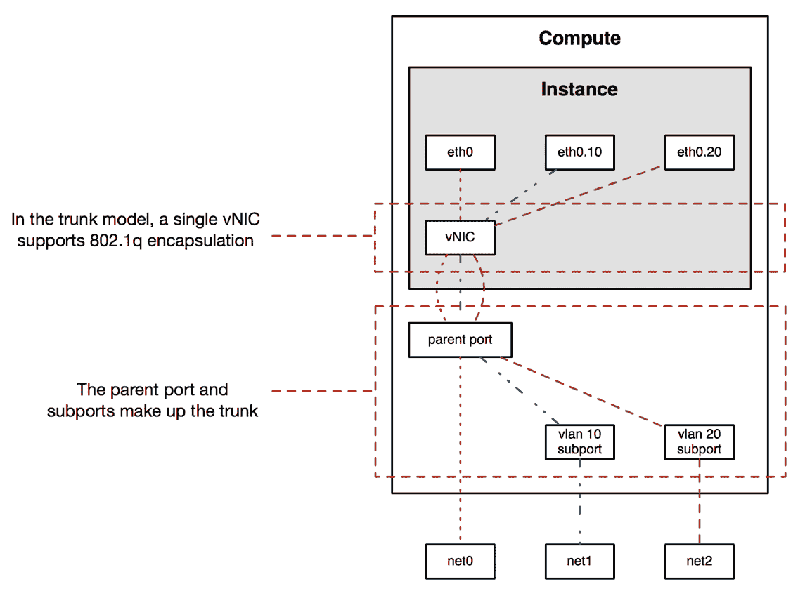
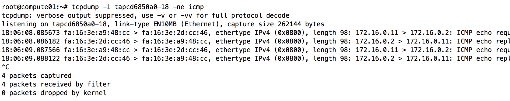

# 高级网络话题

OpenStack 网络提供了许多网络功能，使用户能够开发最佳支持其应用程序的拓扑。虽然本书重点介绍了 OpenStack 网络的许多核心功能，但某些用例有时需要高级功能。在本章中，我们将探讨一些高级的 OpenStack 网络功能，包括以下内容：

+   VLAN 感知虚拟机

+   BGP Speaker

+   网络可用性区域

# VLAN 感知虚拟机

VLAN 标记是一种方法，在以太网头部添加 VLAN 标签，以帮助区分通过同一接口传输的多个网络的流量。在本书中迄今为止描述的架构中，一个连接到多个网络的实例为每个网络都有一个相应的接口。这在小规模环境中有效，但 PCI 限制可能会限制可以附加到实例的接口数量。此外，当附加新网络时，热插拔接口到正在运行的虚拟机可能会产生意外结果。

以下图示化了每个网络一个虚拟网络接口卡（vNIC）的概念：


图 14.1

在图 14.1 中，一个单独的 vNIC 与 Neutron 端口关联。Neutron 通常根据各个 VLAN 网络的 `segmentation_id` 提供程序属性在虚拟交换机上执行 VLAN 标记。在这种情况下，实例不需要自行执行 VLAN 标记，任何来自实例的标记流量可能会被计算节点丢弃。

Neutron 的 trunk 服务插件允许 VLAN 感知的虚拟机实例在客户操作系统内标记流量，从而实现快速添加和移除网络子接口，并配置 **网络功能虚拟化（NFV）** 等高级用例。

# 配置 trunk 插件

trunk 服务插件首次出现在 OpenStack Networking 的 Newton 版本中，支持 Open vSwitch 和 Linux bridge ML2 机制驱动程序。其他驱动程序可能也得到支持，但不在本书的讨论范围内。

要安装 trunk 服务插件，请修改托管 Neutron API 服务的 `controller` 节点上的 Neutron 配置文件。在此环境中，API 服务运行在 `controller01` 上。将 `trunk` 添加到现有服务插件列表中，如下所示：

```
[DEFAULT]
...
service_plugins = router,
neutron_lbaas.services.loadbalancer.plugin.LoadBalancerPluginv2, trunk 
```

请确保将 `trunk` 添加到现有插件列表中，而不是替换列表内容，以避免与 API 和现有网络对象发生冲突。

关闭文件并重启 `neutron-server` 服务：

```
# systemctl restart neutron-server 
```

# 定义工作流

在 OpenStack 网络中引入了 trunking，带来了一些在将 trunk 附加到实例时需要的工作流相关概念。这些概念包括以下内容：

+   Trunk

+   父端口

+   子端口

Trunk 是将父端口与子端口绑定的对象。

父端口是附加到实例的端口，并代表客户操作系统中的 trunk 链接。该接口看起来像一个正常接口，并继承父端口的 MAC 和 IP 地址。通过客户操作系统内相关接口发送的任何流量都被视为未标记流量，并遵循正常的 Neutron 端口行为。

子端口与网络和子网关联，并且不会直接连接到实例。相反，子端口与 trunk 对象关联。可以在客户操作系统中使用子端口和网络的属性配置 VLAN 子接口，包括唯一的 MAC 地址、IP 地址和 802.1q VLAN 标签。通过子接口发送的流量会被客户操作系统标记，并通过父端口转发。

以下图示化展示了每个实例使用 802.1q VLAN 封装的一个 vNIC 概念：



图 14.2

在图 14.2 中，一个 vNIC 与一个父端口关联。父端口和多个子端口与 trunk 关联。实例可以使用 802.1q 封装标记流量，Neutron 代理会配置底层桥接器来支持这些标记流量。

在 OpenStack 中使用 trunk 时，应遵循以下工作流程：

1.  为 trunk 和子端口创建网络和子网

1.  创建 trunk

1.  向 trunk 添加子端口

1.  启动一个连接到 trunk 的实例

一旦实例处于活动状态，可以将更多子端口与 trunk 关联，并在实例中进行配置。

# 在 CLI 中管理 trunks

以下命令用于在 CLI 中管理 trunk 对象：

| **Trunk 管理命令** | **描述** |
| --- | --- |
| `network trunk create` | 创建一个 trunk。 |
| `network trunk delete` | 删除给定 trunk。 |
| `network trunk list` | 列出属于某个项目的 trunks。 |
| `network trunk set` | 更新给定 trunk 的属性。 |
| `network trunk show` | 显示给定 trunk 的详细信息。 |
| `network trunk unset` | 取消设置给定 trunk 的属性。 |

# 在 CLI 中创建 trunk

要创建一个 trunk，请使用如下所示的 `openstack network trunk create` 命令：

```
openstack network trunk create
[--description <description>]
--parent-port <parent-port>
[--subport <port=,segmentation-type=,segmentation-id=>]
[--enable | --disable]
[--project <project>]
[--project-domain <project-domain>]
<name> 
```

`--description` 参数是可选的，可以用于为 trunk 提供描述。

`--parent-port` 参数是必需的，用于将父端口与 trunk 关联。父端口是附加到实例上的端口，并在客户操作系统中充当 trunk。

`--subport` 参数是可选的，用于将子端口与 trunk 关联。子端口对应于客户操作系统中的 `802.1q` 子接口。如果没有指定子端口，则来自实例的所有标记流量将被丢弃。

`--project` 和 `--project-domain` 参数是可选的，可以用于将 trunk 与创建项目以外的项目和/或域关联。

`name` 参数是必需的，可用于指定 trunk 的名称。

# 在 CLI 中删除 trunks

要删除 trunk，请使用如下的 `openstack network trunk delete` 命令：

```
openstack network trunk delete <trunk> [<trunk> ...] 
```

`trunk` 参数指定要删除的 trunk 的名称或 ID。可以使用空格分隔的列表同时删除多个 trunks。

# 在 CLI 中列出 trunks

要列出所有负载均衡器，使用如下 `openstack network trunk list` 命令：

```
openstack network trunk list 
```

# 在 CLI 中显示 trunk 详细信息

要显示 trunk 的详细信息，请使用如下的 `openstack network trunk show` 命令：

```
openstack network trunk show <trunk> 
```

`trunk` 参数指定要显示的 trunk 的名称或 ID。

# 在 CLI 中更新 trunk

要更新 trunk 的属性，请使用如下的 `openstack network trunk set` 或 `openstack network trunk unset` 命令：

```
openstack network trunk set
[--name <name>]
[--description <description>]
[--subport <port=,segmentation-type=,segmentation-id=>]
[--enable | --disable]
<trunk>

openstack network trunk unset --subport <subport> <trunk> 
```

可以使用 `set` 和 `unset` 命令在不影响运行实例的情况下向 trunk 添加或删除子端口。

# 构建 trunk

为了演示在 OpenStack 网络中创建和使用 trunks，我配置了以下网络：


客户端实例将运行 Ubuntu 16.04 LTS 操作系统，并将连接到单个接口。

# 创建父端口

构建一个功能性 trunk 的第一步是首先创建父端口。父端口应与处理未标记流量的网络相关联，换句话说，就是原生 VLAN。使用 OpenStack 客户端，创建具有以下属性的端口：

+   名称：`parent0`

+   网络：`GREEN_NET`

可以使用以下命令：

```
openstack port create --network GREEN_NET parent0
```

输出将类似于以下内容：


# 创建子端口

子端口应与将在实例内使用 802.1q VLAN 封装进行标记的网络关联。子端口随后与 trunk 关联，并对应于客操作系统中的标记子接口。使用 OpenStack 客户端，创建具有以下属性的子端口：

+   名称：`child-p0c1`

+   网络：`RED_NET`

可以使用以下命令：

```
openstack port create --network RED_NET child-p0c1 
```

输出将类似于以下内容：


与其他端口一样，创建子端口时，Neutron 会动态分配一个 MAC 地址。然而，在实例内部创建 VLAN 子接口时，子接口可能会继承父接口的 MAC 地址。由于接口位于两个不同的网络中且 MAC 地址不会跨越 Layer 2 边界，因此这种行为是可以接受的。然而，从端口安全性角度来看，可能会存在问题。创建实例中的子接口时，您需要指定 Neutron 分配给子端口的 MAC 地址，或者使用父端口的相同 MAC 地址创建子端口。

# 创建 trunk

创建功能性 trunk 的最后一步是创建 trunk 对象并关联父端口和子端口。trunk 所需的信息包括名称、带有段信息的父端口和带有段信息的子端口。使用 OpenStack 客户端，创建一个具有以下属性的 trunk 对象：

+   名称: `trunk0`

+   父端口: `parent0`

+   子端口: `child-p0c1`

+   子端口 VLAN: `42`

可以使用以下命令：

```
openstack network trunk create \ --parent-port parent0 \ --subport port=child-p0c1,segmentation-type=vlan,segmentation-id=42 \ trunk0
```

输出将类似于以下内容：


# 启动带有 trunk 的实例

现在 trunk 已创建并与父端口和子端口关联，实例可以启动并仅附加到父端口。由于没有为子接口创建 VIF，因此在启动时不需要附加它们。Neutron 内部的逻辑将会把来自实例内子接口的流量与父接口关联。

以下 OpenStack 命令语法可以用于启动附加父端口的实例：

```
openstack server create \ --image <image> \ --flavor<flavor> \ --key-name <keypair name> \ --nic port-id=<parent port> \ <name> 
```


# 配置实例

启动后，实例应通过父端口的 IP 地址可用，并且如果路由正确设置，可以从命名空间或工作站访问。从相应的 `qdhcp` 命名空间内，确认与实例的连接：


使用 `ip addr list` 命令确认父端口的 IP 地址已通过 DHCP 配置，并且我们能够连接到实例，证明 trunk 的父端口上的流量是未标记的，并表现得像普通端口。

使用来自 `iproute2` 包的工具，我们可以使用以下子端口的属性配置子接口：

+   MAC 地址: `fa:16:3e:a9:48:cc`

+   VLAN ID: `42`

为了方便，可以使用 `ip link` 命令创建 802.1q VLAN 子接口。或者，在 Ubuntu 系统上，可以修改 `/etc/network/interfaces` 文件以进行持久的接口配置。

使用 `ip link add` 命令，创建子接口并使用以下命令修改 MAC 地址：

```
# ip link add link ens3 name ens3.42 type vlan id 42 # ip link set dev ens3.42 address fa:16:3e:a9:48:cc # ip link set ens3.42 up 
```

使用 `ip addr list` 命令，新的配置接口应处于 UP 状态并具有指定的 MAC 地址：


该接口尚未拥有 IP 地址，因此暂时无法确认连接性。IP 地址配置有两种可选方案：

+   DHCP

+   静态地址配置

要使用 DHCP，只需以 root 用户身份或使用 `sudo` 权限运行 `dhclient ens3.42` 命令。操作正常时，Neutron DHCP 服务器应返回分配的地址，并且接口会自动配置，如下所示：


动态或静态（但持久的）接口配置的具体实现将根据安装的来宾操作系统有所不同。

对`RED_NET`网络的 DHCP 服务器进行快速 ping 操作，证明来自实例接口的标记流量正确地穿越网络：


# 审查网络结构

在承载实例的`compute`节点上，使用`brctl show`查看桥接设备，未发现任何与实例内标记支持相关的独特配置：


然而，深入查看与子端口对应的`tap`接口，发现该接口已被配置为使用 VLAN ID 42，从父端口划分出的 VLAN 接口：


对与父端口关联的`tap`接口进行数据包捕获，可以看到流量从实例的子接口离开并通过父接口时，带有`802.1q VLAN ID 42`标记：


`compute`节点会去除`VLAN ID`，并将流量以未标记的形式通过与子端口关联的`tap`接口转发：



此时，正常的 Linux 桥接相关流量操作开始进行，流量通过前面本书中描述的物理网络基础设施转发。

当使用 Open vSwitch 网络代理时，可能会使用流规则而不是此处描述的方法。

# BGP 动态路由

BGP 动态路由使得能够将自服务 IPv4 和 IPv6 网络前缀广告发送给支持 BGP 的网络设备，包括许多物理和虚拟路由器以及防火墙设备。通过向 Neutron 路由器附加的自服务网络进行广告，可以避免使用浮动 IP。

BGP 发言人功能依赖于地址范围，并需要了解其操作以便正确部署。

BGP 动态路由由一个 Neutron API 服务插件组成，该插件实现了网络服务扩展，以及一个管理 BGP 对等会话的代理。云管理员通过 CLI 或 API 创建并配置 BGP 发言人，并手动将其调度到一个或多个运行代理的主机上。

下图展示了 BGP 代理与物理路由器的对等关系，该对等关系使得物理路由能够通过共同的提供商网络到达 Neutron 路由器后面的自服务网络：


# 前缀广告要求

BGP 动态路由将自服务网络的前缀和浮动 IP 地址的主机路由进行广告。广告自服务网络时，必须满足以下条件：

+   外部网络和自服务网络必须位于同一地址范围内。

+   Neutron 路由器必须在自服务子网中包含一个接口，并在外部提供商网络中包含一个网关。

+   BGP 发言人必须与连接到与 Neutron 路由器相同外部提供商网络的设备建立对等关系。

+   BGP 交换机的 `advertise_tenant_networks` 属性设置为 `True`。

广播浮动 IP 地址需要满足以下条件：

+   BGP 交换机必须与连接到与托管浮动 IP 的 Neutron 路由器相同外部提供商网络的设备建立对等连接。

+   BGP 交换机的 `advertise_floating_ip_host_routes` 属性设置为 `True`。

# 与分布式虚拟路由器的操作

在使用分布式虚拟路由器的部署中，BGP 交换机以不同的方式广播浮动 IP 地址和自服务网络。对于浮动 IP 地址，BGP 交换机将相应计算节点上的浮动 IP 代理网关广播为下一跳 IP 地址。对于使用 SNAT 的自服务网络，BGP 交换机将 DVR SNAT 节点广播为下一跳 IP 地址。这意味着，指向分布式虚拟路由器后面的自服务网络的流量必须经过一个 `network` 节点，而指向浮动 IP 的流量将绕过 `network` 节点。

# 配置 BGP 动态路由

BGP 动态路由插件首次在 OpenStack Networking 的 Mitaka 版本中引入，并支持 Neutron 提供的原生 L3 代理。

要安装 BGP 服务插件，请修改托管 Neutron API 服务的控制节点上的 Neutron 配置文件。在此环境中，API 服务在 `controller01` 上运行。按照如下所示，将 BGP 插件添加到现有服务插件列表中：

```
[DEFAULT]
...
service_plugins = router,
neutron_lbaas.services.loadbalancer.plugin.LoadBalancerPluginv2,
trunk,neutron_dynamic_routing.services.bgp.bgp_plugin.BgpPlugin 
```

确保将插件添加到现有插件列表中，而不是替换列表内容，以避免与 API 和现有网络对象出现问题。

# 安装代理

要安装 Neutron BGP 代理，请在 `controller01` 节点上运行以下命令：

```
# apt install neutron-bgp-dragent 
```

Neutron 将 BGP 代理配置存储在 `/etc/neutron/bgp_dragent.ini` 文件中。以下部分将介绍最常见的配置选项。

# 配置代理

编辑 BGP 代理配置文件，并根据需要将 `bgp_router_id` 值替换为相应控制节点的 IP 地址：

```
[bgp]
...
bgp_speaker_driver =
neutron_dynamic_routing.services.bgp.agent.driver.ryu.driver.RyuBgpDriver 
bgp_router_id = 10.10.0.100 
```

在此示例中，使用的是主机的管理 IP 地址。可以使用专门用于路由器广播的 IP 地址和接口，但超出了本书的范围。

# 重启服务

要使配置更改生效，请使用以下命令重启 `Neutron API` 服务和 `Neutron BGP` 代理：

```
# systemctl restart neutron-server neutron-bgp-dragent 
```

使用 OpenStack 客户端验证 BGP 代理是否已检查并准备好使用：


# 在 CLI 中管理 BGP 交换机

从 OpenStack 客户端的 Pike 版本开始，BGP 交换机相关的命令尚不可用。以下 neutron 客户端命令用于在 CLI 中管理 BGP 交换机对象：

| **BGP 交换机管理命令** | **描述** |
| --- | --- |
| `bgp-dragent-list-hosting-speaker` | 列出托管 BGP 交换机的动态路由代理。 |
| `bgp-dragent-speaker-add` | 向动态路由代理添加 BGP 说话人。 |
| `bgp-dragent-speaker-remove` | 从动态路由代理中移除 BGP 说话人。 |
| `bgp-peer-create` | 创建 BGP 对等体。 |
| `bgp-peer-delete` | 删除 BGP 对等体。 |
| `bgp-peer-list` | 列出 BGP 对等体。 |
| `bgp-peer-show` | 显示给定 BGP 对等体的信息。 |
| `bgp-peer-update` | 更新 BGP 对等体信息。 |
| `bgp-speaker-advertiseroute-list` | 列出由给定 BGP 说话人广告的路由。 |
| `bgp-speaker-create` | 创建 BGP 说话人。 |
| `bgp-speaker-delete` | 删除 BGP 说话人。 |
| `bgp-speaker-list` | 列出 BGP 说话人。 |
| `bgp-speaker-list-on-dragent` | 列出由动态路由代理托管的 BGP 说话人。 |
| `bgp-speaker-network-add` | 向 BGP 说话人添加网络。 |
| `bgp-speaker-network-remove` | 从 BGP 说话人中移除网络。 |
| `bgp-speaker-peer-add` | 向 BGP 说话人添加一个对等体。 |
| `bgp-speaker-peer-remove` | 从 BGP 说话人中移除对等体。 |
| `bgp-speaker-show` | 显示给定 BGP 说话人的信息。 |
| `bgp-speaker-update` | 更新 BGP 说话人信息。 |

请参考上游文档，了解如何配置用于 BGP 动态路由的地址范围和子网池。以下 URL 提供了演示 BGP 动态路由的工作示例：[`docs.openstack.org/neutron/pike/admin/config-bgp-dynamic-routing.html`](https://docs.openstack.org/neutron/pike/admin/config-bgp-dynamic-routing.html)。

# 网络可用区

网络可用区是一个逻辑构造，用于定义一组共享相似电力、网络和冷却系统的网络节点。网络资源可以调度到多个可用区，以确保在某个区域发生故障时，系统具有较高的可靠性。这类似于 Nova 可用区的工作方式，它们用于将计算节点分组，确保应用程序的组件不在同一故障域内。

# 配置网络可用区

Neutron 的可用区支持首次在 OpenStack Networking 的 Mitaka 版本中引入，并支持 Neutron 中包含的 DHCP 和 L3 代理。其他驱动程序可能被支持，但超出了本书的范围。

在本书所构建的环境中，Neutron L3 代理已安装在大多数节点上，以演示独立、高可用和分布式虚拟路由器。快速查看 Neutron 代理列表显示，它们都共享一个基于默认代理配置选项的公共可用区：


要修改特定 L3 代理的可用区，请编辑位于 `/etc/neutron/l3_agent.ini` 的相应代理配置文件，并按如下所示修改 `availability_zone` 配置选项：

```
[agent]
...
# Availability zone of this node (string value)
# availability_zone = nova
availability_zone = AZ1 
```

使用以下命令重新启动 L3 代理：

```
# systemctl restart neutron-l3-agent 
```

再次查看代理列表，反映了变化：


DHCP 代理也可以以类似方式与可用区关联。要修改特定 DHCP 代理的可用区，请编辑`/etc/neutron/dhcp_agent.ini`中的相应代理配置文件，并修改`availability_zone`配置选项，如下所示：

```
[agent]
...
# Availability zone of this node (string value)
# availability_zone = nova
availability_zone = AZ1 
```

使用以下命令重启`DHCP`代理：

```
# systemctl restart neutron-dhcp-agent
```

# 将路由器调度到可用区

在路由器创建过程中，可以将 Neutron 路由器定向到特定的可用区。使用`openstack router create`命令，我们可以通过`--availability-zone-hint`参数将路由器调度到可用区`AZ1`，如下面所示：


在将路由器连接到外部提供者网络`GATEWAY_NET`之后，我们可以看到路由器被调度到可用区`AZ1`中的`L3`代理：


将路由器调度到特定可用区并不能确保它会被调度到该区的 L3 代理，因为该指令更像是一个调度提示，而非明确的要求。Neutron 使用可用区提示进行最佳努力调度。如果需要，可以通过重复`--availability-zone-hint`参数来指定多个可用区。

# 将 DHCP 服务调度到可用区

给定网络的 DHCP 服务通常是被视为理所当然的，用户或操作员通过 API 无法直接看到或配置它。Neutron 已经使用以下配置选项在 Neutron 配置文件`/etc/neutron/neutron.conf`中将 DHCP 服务调度到多个 DHCP 代理：

```
# Number of DHCP agents scheduled to host a tenant network.
# If this number isgreaterthan 1, the scheduler automatically
# assigns multiple DHCP agents for a given tenant network,
# providing high availability for DHCP service.
# (integer value)
# dhcp_agents_per_network = 1 
```

当`dhcp_agents_per_network`大于`1`，且环境中存在多个 DHCP 代理时，Neutron 将自动将网络调度到多个`DHCP`代理，直到指定的值为止。使用带有`--availability-zone-hint`参数的`openstack network create`命令，我们可以建议调度器将`DHCP`服务分配到多个可用区，如下所示：

```
openstack network create network01
--availability-zone-hint AZ1
--availability-zone-hint AZ2 
```

将网络的 DHCP 服务调度到特定可用区并不能确保它会被调度到该区的 DHCP 代理，因为该指令更像是一个调度提示，而非明确的要求。Neutron 使用可用区提示进行最佳努力调度。如果需要，可以通过重复`--availability-zone-hint`参数来指定多个可用区。

有关使用网络可用区的更多信息，请参阅上游文档，网址：[`docs.openstack.org/neutron/pike/admin/config-az.html`](https://docs.openstack.org/neutron/pike/admin/config-az.html)。

# 总结

随着基于 OpenStack 的云工作负载的发展，OpenStack 网络功能也不断演进。VLAN 感知虚拟机、BGP 交换机和网络可用性区域只是 Neutron 在过去几个发布周期中引入的一些高级网络功能，未来的版本还将带来更多功能。将这些功能结合使用，可以为用户提供定义丰富网络拓扑的能力，并为云中的多种应用和工作负载提供高可用性。

OpenStack 网络的发布说明是查找最近发布的功能和现有功能的 bug 修复的绝佳来源。要查找给定版本的发布说明，请访问以下网址：[`docs.openstack.org/releasenotes/neutron/index.html`](https://docs.openstack.org/releasenotes/neutron/index.html)。
