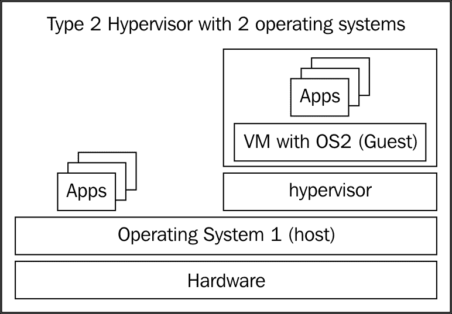
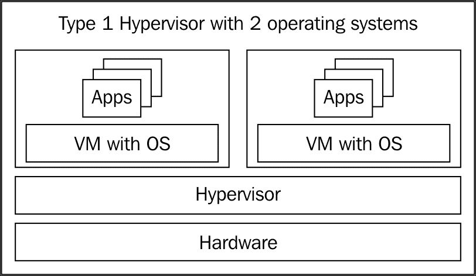
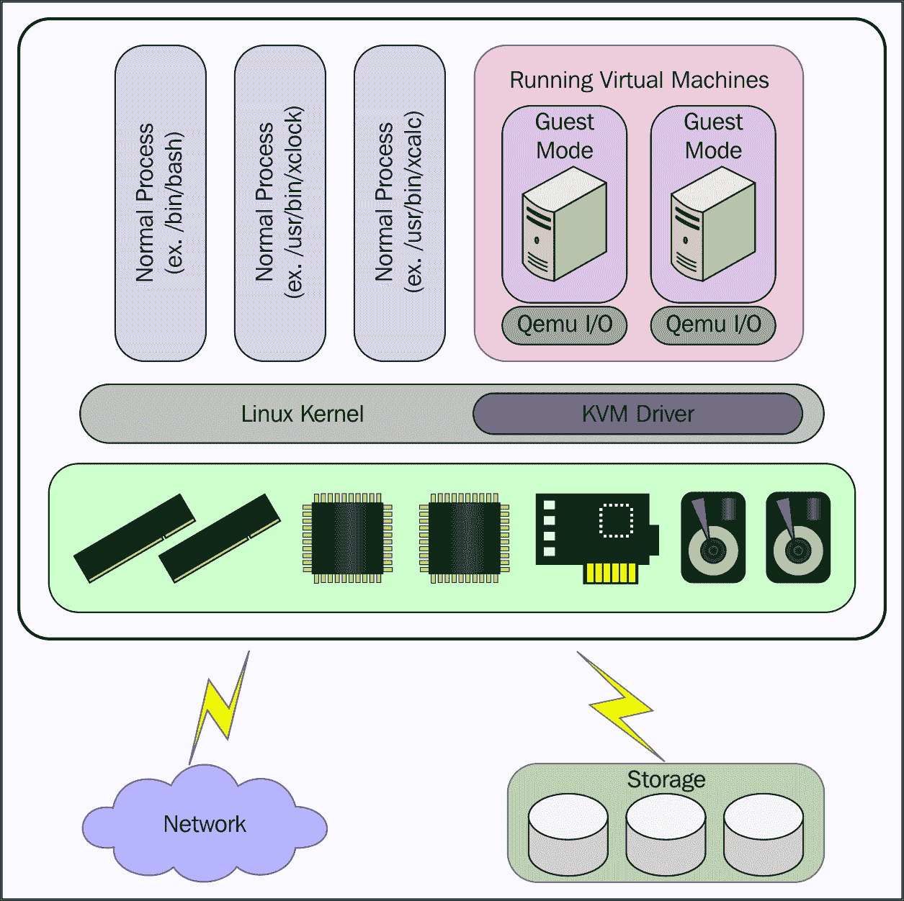
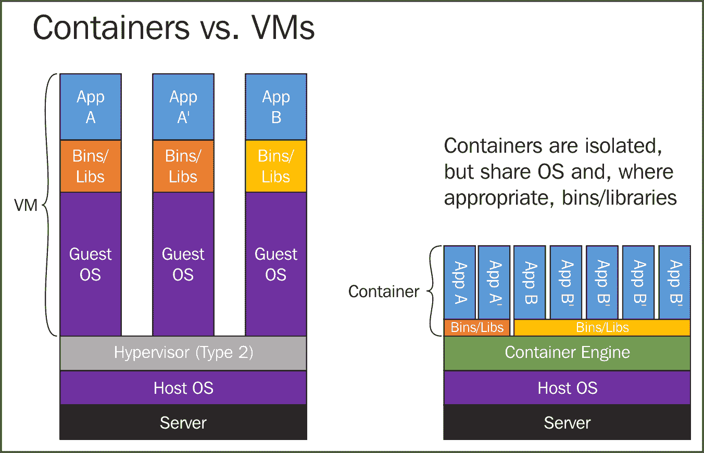

# 第一章 Proxmox VE 基础

**Proxmox 虚拟环境**（**PVE**）是一个成熟、完整、得到良好支持的企业级虚拟化环境，适用于服务器。它是一个开源工具——基于 Debian GNU/Linux 发行版——通过精心设计的 web 界面或命令行界面，管理容器、虚拟机、存储、虚拟化网络以及高可用性集群。

### 注意

开发人员在 2008 年发布了 Proxmox VE 的第一个稳定版本；四年后并经过八次版本更新，ZDNet 的 Ken Hess 大胆而又相当理性地宣布 Proxmox VE 为 *Proxmox：终极虚拟化管理程序* ([`www.zdnet.com/article/proxmox-the-ultimate-hypervisor/`](http://www.zdnet.com/article/proxmox-the-ultimate-hypervisor/))。四年后，PVE 已更新至 4.1 版本，至少在 90,000 个主机上使用，并且在 140 个国家拥有超过 500 家商业客户；其基于 web 的管理界面本身已翻译成 19 种语言。

本章探讨了 PVE 虚拟化管理程序特性的基础技术：**LXC**、**KVM** 和 **QEMU**。为此，我们将开发对虚拟机、容器及其适当使用的基本理解。

本章将涵盖以下主题：

+   Proxmox VE 简介

+   使用 PVE 进行虚拟化和容器化

+   Proxmox VE 虚拟机、KVM 和 QEMU

+   使用 PVE 和 LXC 进行容器化

# Proxmox VE 简介

使用 Proxmox VE，Proxmox Server Solutions GmbH ([`www.proxmox.com/en/about`](https://www.proxmox.com/en/about)) 为我们提供了一个企业级的、开源的 *类型* 2 *虚拟化管理程序*。稍后，您将了解一些使 Proxmox VE 成为强大企业候选项的功能。

+   Proxmox VE 的许可证非常有意地选择了 *GNU Affero 通用公共许可证（V3）* ([`www.gnu.org/licenses/agpl-3.0.html`](https://www.gnu.org/licenses/agpl-3.0.html))。在许多可用的自由和开源兼容许可证中，这是一个重要的选择，因为它“专门设计用于确保在网络服务器软件的情况下与社区的合作”。

+   PVE 主要通过集成的 web 界面、命令行本地管理或通过 SSH 进行管理。因此，您无需单独设置管理服务器及相关开销。通过这种方式，Proxmox VE 与 VMware 等供应商的替代企业虚拟化解决方案有了显著的区别。

+   Proxmox VE 实例/节点可以被纳入到 PVE 集群中，并通过统一的 web 界面进行集中管理。

+   Proxmox VE 提供了实时迁移——即将虚拟机或容器从一个集群节点迁移到另一个节点，而不会中断服务。这是 PVE 的一项独特功能，在竞争产品中并不常见。

| **功能** | **Proxmox VE** | **VMware vSphere** |
| --- | --- | --- |
| **硬件要求** | 灵活 | 严格遵守硬件兼容列表（HCL） |
| **集成管理界面** | 基于 Web 和 Shell（浏览器和 SSH） | 否。需要额外费用的专用管理服务器 |
| **简单的订阅结构** | 是的；基于每年高级支持票数和 CPU 插槽数量 | 不是 |
| **高可用性** | 是的 | 是的 |
| **虚拟机实时迁移** | 是的 | 是的 |
| **支持容器** | 是的 | 不是 |
| **虚拟机操作系统支持** | Windows 和 Linux | Windows、Linux 和 Unix |
| **社区支持** | 是的 | 不是 |
| **虚拟机快照** | 是的 | 是的 |

> *对比 Proxmox VE 和 VMware vSphere 的特性*

### 注意

有关完整的功能目录，请参见 Proxmox VE 数据表：[`www.proxmox.com/images/download/pve/docs/Proxmox-VE-Datasheet.pdf`](https://www.proxmox.com/images/download/pve/docs/Proxmox-VE-Datasheet.pdf)。

和它的竞争对手一样，PVE 也是一个虚拟机监控程序：典型的虚拟机监控程序是创建、运行、配置和管理虚拟机的软件，依据管理员或工程师的选择。

PVE 被称为类型 2 虚拟机监控程序，因为虚拟化层是建立在操作系统之上的。

作为一个类型 2 虚拟机监控程序，Proxmox VE 是建立在 Debian 项目上的。Debian 是一个以可靠性、安全性以及一个繁荣且致力于贡献的开发者社区而著称的 GNU/Linux 发行版。

类型 2 虚拟机监控程序，如 PVE，直接在操作系统上运行。在 Proxmox VE 的情况下，操作系统是 Debian；自 PVE 4.0 发布以来，底层操作系统一直是 Debian "Jessie"。

相比之下，类型 I 虚拟机监控程序（如 VMware 的 ESXi）直接运行在裸机上，而不需要操作系统的中介。它没有超出虚拟化管理和物理硬件管理的功能。

类型 I 虚拟机监控程序直接运行在硬件上，而不需要操作系统的中介。

### 注意

基于 Debian 的 GNU/Linux 发行版无疑是最受欢迎的桌面 GNU/Linux 发行版之一。

一个将 Debian 与其他竞争发行版区分开的特点是其发布政策：Debian 只有在其开发社区能够确保其*稳定性*、*安全性*和*可用性*时才会发布。

Debian 并不像其他一些发行版那样区分长期支持版本和常规版本。

相反，所有 Debian 版本在发布后的第一年都会收到强有力的支持和关键更新。（自 2007 年以来，Debian 每两年发布一次主要版本。Debian 8，*Jessie*，在 2015 年基本按时发布。）

Proxmox VE 对 Debian 的依赖证明了其对这些价值的承诺：在发布周期中，稳定性、安全性和可用性得到了保障，同时也能够支持尖端的功能。

PVE 通过三种开源技术提供其虚拟化功能，所有功能都通过统一的基于 Web 的界面进行管理：

+   LXC

+   KVM

+   QEMU

要理解这一基础如何为 Proxmox VE 服务，我们首先需要清楚理解虚拟化（或更具体地说，*硬件虚拟化*）与容器化（*操作系统虚拟化*）之间的关系。随着讨论的深入，它们各自的使用场景应该变得更加清晰。

# 使用 Proxmox VE 进行虚拟化

最终，容器化可以理解为一种虚拟化。然而，在此，我们首先通过对比虚拟机和容器的特点，概念上区分两者。

简单来说，虚拟化是一种技术，通过它我们可以提供功能齐全的计算资源，而不需要考虑资源的物理组织、位置或相对位置。

虚拟化技术使我们能够将一台物理计算机的资源与多个执行环境共享和分配。若没有上下文，虚拟化是一个模糊的术语。它涵盖了通过名为**虚拟机管理程序**的软件实现解决方案，将存储、网络、服务器、桌面环境甚至应用程序等资源从其具体硬件需求中抽象出来。

因此，虚拟化为我们提供了更多的灵活性、更多的功能，并且对我们的预算产生了显著的正面影响，这些通常仅通过我们现有的资源便可实现。

就 PVE 而言，虚拟化最常指将一个离散计算系统的所有方面从其硬件中抽象出来。在这个背景下，虚拟化是指创建一个虚拟机或 VM，它拥有自己的操作系统和应用程序。

虚拟机可以最初理解为一台具有与物理机器相同功能的计算机。同样，它也可以像物理硬件机器一样通过网络进行集成和通信。换句话说，从虚拟机内部，我们将无法感知与物理计算机的区别。

此外，虚拟机并没有与其物理对应物相同的物理占地面积。它依赖的硬件实际上是通过借用安装在物理机器上的主机硬件资源的软件提供的（或称**裸金属**）。

然而，虚拟机的软件组件，从应用程序到操作系统，与主机机器的组件是明显分开的。这个优势在分配物理空间用于资源时得以体现。

例如，我们可以有一台运行着 Web 服务器、数据库服务器、防火墙和日志管理系统的 PVE 服务器——这些都是作为离散的虚拟机存在。与其消耗四台物理机器的物理空间、资源和维护劳力，我们只需为单一的 Proxmox VE 服务器腾出物理空间，并根据需要配置合适的虚拟局域网。

在一篇名为*将服务器虚拟化投入实际*的白皮书中，AMD 很好地阐述了虚拟化对企业和开发人员的好处 ([`www.amd.com/Documents/32951B_Virtual_WP.pdf`](https://www.amd.com/Documents/32951B_Virtual_WP.pdf))：

**虚拟化的前五大商业好处：**

> *提高服务器利用率*
> 
> *提高服务水平*
> 
> *简化管理和提升安全性*
> 
> *降低硬件成本*
> 
> *减少设施成本*

**使用开发和测试环境进行虚拟化的好处：**

> *降低资本和空间需求*
> 
> *降低电力和冷却成本*
> 
> *通过更短的测试周期提高效率*
> 
> *更快的上市时间*

另外，让我们增加可移植性和封装性：独特的能力可以在不中断服务的情况下从一个 PVE 主机迁移实时虚拟机。

Proxmox VE 通过两种自由开源技术的组合使虚拟机的创建和控制成为可能：**基于内核的虚拟机**（或者**KVM**）和（**Quick Emulator (QEMU)**）。这些工具的集成称为**KVM-QEMU**。

## KVM

自 2007 年 2 月起，KVM 已成为 Linux 内核的一个重要部分。该内核模块允许 GNU/Linux 用户和管理员利用架构的硬件虚拟化扩展；对于我们的目的，这些扩展是 AMD 的**AMD-V**和 Intel 的**VT-X**，适用于 x86_64 架构。

要充分利用 Proxmox VE 的功能集，因此建议在支持 x86_64 架构且具有集成虚拟化扩展的 CPU 的机器上安装。有关 KVM 支持的完整 AMD 和 Intel 处理器列表，请访问 Intel 的 [`ark.intel.com/Products/VirtualizationTechnology`](http://ark.intel.com/Products/VirtualizationTechnology) 或 AMD 的 [`support.amd.com/en-us/kb-articles/Pages/GPU120AMDRVICPUsHyperVWin8.aspx`](http://support.amd.com/en-us/kb-articles/Pages/GPU120AMDRVICPUsHyperVWin8.aspx)。

## QEMU

QEMU 提供了一个仿真和虚拟化接口，用户可以通过脚本或其他方式进行控制。

可视化 KVM 和 QEMU 之间的关系

没有 Proxmox VE，我们基本上可以通过命令行定义硬件、创建虚拟磁盘，并启动和停止使用 QEMU 的虚拟化服务器。

或者，我们可以依赖于 QEMU 的各种 GUI 前端之一（各平台可用的 GUI 列表详见 [`wiki.qemu.org/Links#GUI_Front_Ends`](http://wiki.qemu.org/Links#GUI_Front_Ends)）。

当然，只有在你对 PVE 后台虚拟机定义过程感兴趣时，使用这些解决方案才是高效的。Proxmox VE 管理虚拟机本身通过其 API 管理 QEMU。

### 注意

从命令行管理 QEMU 可能会很繁琐。以下是一个从在 x86 Intel 机器上运行 Ubuntu 的 Raspberry Pi 架构的 Debian 重制版 Raspbian 的脚本中提取的行。当我们看到从 Proxmox VE 的管理界面管理虚拟机是多么简单时，我们会真诚地欣赏相对简单性：`qemu-system-arm -kernel kernel-qemu -cpu arm1176 -m 256 -M versatilepb -no-reboot -serial stdio -append "root=/dev/sda2 panic=1" -hda ./$raspbian_img -hdb swap`

如果您熟悉 QEMU 的仿真功能，可能需要注意的是，尽管它依赖于 QEMU，但我们不能通过 Proxmox VE 提供的工具和功能管理 *仿真*。从 Debian 提供的 bash shell 可能可以。但是，无法通过 PVE 的管理界面控制仿真。

## 使用 Proxmox VE 的 OS 虚拟化

**容器** 是另一种虚拟化类型。与 *OS 虚拟化* 同义，容器最近经历了复兴。与虚拟机相比，容器与主机操作系统共享操作系统组件，如库和二进制文件；而虚拟机则不会。

用图示对比虚拟机和容器

### 提示

**容器的优势**

这种安排可能使容器运行更轻便，并且占用更少的主机硬件资源。对于许多作者、专家和用户来说，容器在速度和效率方面也提供了显著优势。（然而，需要指出的是，随着内存和更强大的 CPU 等资源变得更便宜，这种优势将会减弱。）

从 Proxmox VE 4.0 版本开始，Proxmox VE 容器由 LXC 实现（在之前的 PVE 版本中是通过 OpenVZ 实现的）。LXC 是为 Proxmox VE 的最终利益服务的第三种基本技术。与 KVM 和 QEMU 类似，LXC（或 Linux 容器）是一种开源技术。它允许主机运行和管理员管理多个操作系统实例，作为单个物理主机上的隔离容器。因此，概念上，容器非常明确地代表一类虚拟化，而不是相对的概念。然而，对于理解 PVE，保持虚拟机和容器之间的清晰区分是有帮助的。

使用 Proxmox VE 的理想实现取决于我们区分并选择虚拟机解决方案和容器解决方案。

由于 Proxmox VE 容器与主机操作系统共享组件，在效率方面具有优势，本文将指导您在预期的客户机可以完全实现为 Debian *Jessie* 作为我们的 hypervisor 操作系统的情况下创建容器。

当我们的目标是运行微软 Windows 操作系统的客机时，Proxmox VE 容器便不再适用。在这种情况下，我们转而创建虚拟机。我们必须依赖虚拟机，因为 Debian 与 Linux 容器共享的操作系统组件是微软 Windows 操作系统无法使用的组件。

# 总结

在本章中，我们已熟悉为 Proxmox VE 提供基础功能的三种开源技术：LXC、KVM 和 QEMU，它们分别用于容器化和虚拟化。

在此过程中，我们理解到容器虽然是一种虚拟化方式，但其特性使它们与虚拟机有所不同。

这些差异在我们决定依赖哪种技术来为 Proxmox VE 提供虚拟服务器解决方案时将至关重要。

下一章将指导你完成首次 Proxmox VE 服务器的安装和配置。它将介绍 Proxmox VE 的硬件规格和安装方法，最后还会提供一份完整的 Proxmox 安装程序操作指南。

让我们继续前进，准备好我们的第一个 PVE 实例，我们将用它来托管容器和虚拟机。
