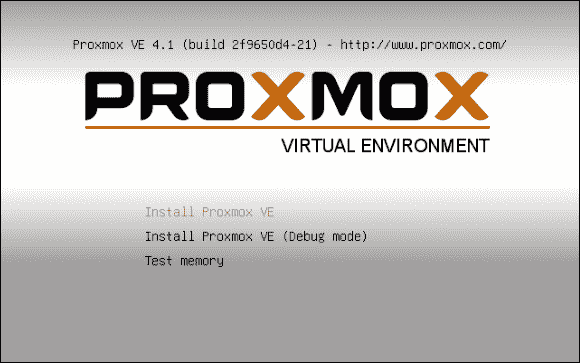

# 第二章：安装 Proxmox VE

本章是安装 Proxmox VE 到物理机的指南。完成本章后，您将拥有一个可供探索、实验，甚至可能用于生产的 PVE 服务器，具体取决于您的硬件配置。

在此过程中，本章将解释如何确定计算机硬件是否满足 PVE 的最小或最佳要求。本章还帮助我们确定配置是否最大化利用了 Intel 或 AMD 的虚拟化技术。最后，它将概述**Proxmox 安装程序**的预期，并解释如何启动并最终完成 Proxmox VE 系统的新安装和配置。

本章按顺序组织，从安装准备到启动新服务器：

+   Proxmox VE 的硬件要求与推荐配置

+   下载 Proxmox VE

+   确保启用了硬件虚拟化（或嵌套虚拟化）

+   准备 Proxmox VE 安装程序

+   完成 Proxmox VE 安装程序

### 注意事项

**裸金属**一词，在上一章中简要介绍，指的是没有安装操作系统或任何其他软件的物理计算机系统。

# Proxmox VE 的硬件要求与推荐配置

在开始安装前，请确保您的硬件至少符合 PVE 的最低硬件要求。

官方维基提供了用于评估和生产场景的推荐规格（[`www.proxmox.com/en/proxmox-ve/requirements`](https://www.proxmox.com/en/proxmox-ve/requirements)）。

然而，*用于评估*的规格有点模糊且相当有限；它们仅供测试使用。你会发现，按照这些要求可以帮助你熟悉安装过程和基于 Web 的管理界面。你甚至可以尝试运行一个单独的、最小的虚拟机和容器。*然而，如果你的目标和需求更为实质化，你很可能会因为这些规格而迅速感到沮丧*。

以下是 Proxmox VE 维基页面推荐的配置（[`pve.proxmox.com/wiki/Installation#Minimum_requirements.2C_for_evaluation`](https://pve.proxmox.com/wiki/Installation#Minimum_requirements.2C_for_evaluation)）用于 PVE（版本 4.1）最基本的测试：

| **组件** | **推荐配置** |
| --- | --- |
| CPU | 64 位（Intel EMT64 或 AMD64） |
| 主板 | 支持 Intel VT/AMD-V 的 CPU/主板（用于 KVM 完全虚拟化支持） |
| 内存 | 最少 1 GB RAM |
| 存储 | 1 个硬盘驱动器 |
| 网络接口 | 单个 NIC |

这个模糊且最小化的建议适合那些仅仅学习如何操作 PVE 基于 Web 的管理界面的人；或许仅仅创建虚拟机或 LXC 容器就足够了。尽管规格比较模糊，但它们提供了足够的信息，表明基于这些规格的机器不足以支持学习本教程中的内容。

另一方面，如果你打算完全虚拟化你的数据中心，使用 Wiki 上的生产服务器规格作为基准肯定是明智的；围绕这些规格构建的几台机器可以提供资源，不仅能跟随本教程学习，还能练习配置高可用集群。当你熟悉了 PVE，它们将准备好投入生产环境。

对于生产硬件，PVE Wiki 推荐至少使用双插槽或四插槽服务器（[`pve.proxmox.com/wiki/Installation#Recommended_system_requirements`](https://pve.proxmox.com/wiki/Installation#Recommended_system_requirements)）：

| **组件** | **推荐** |
| --- | --- |
| CPU | 64 位 Intel EMT64 或 AMD64。 |
| 主板 | 支持 Intel VT/AMD-V 的 CPU/主板（支持 KVM 完全虚拟化）。 |
| 存储 | 配备电池保护写缓存（BBU）或闪存保护的硬件 RAID（不支持软件 RAID）。高速硬盘：15k 转/分 SAS，Raid10 获得最佳效果。 |
| 内存 | 8 GB 内存不错，更多则更好（尽可能增加）。 |
| 网络接口卡 | 两个千兆网卡（用于绑定）—根据你首选的存储技术和集群设置，添加额外的网卡。 |
| 额外需求 | 隔离硬件（仅用于高可用性）。 |

如果你希望完全投入到本教程中，虽然教程没有涉及构建高可用系统或将 PVE 节点加入集群，但可以考虑以下配置：一台简单的 Intel 单六核或八核 CPU 配置，支持 Intel 虚拟化扩展的主板，以及一块 1 TB 硬盘（因此我们会限制使用 EXT3 或 EXT4 文件系统）。此外，你至少需要 8 GB 内存和一张与 Red Hat Enterprise Linux 兼容的网卡。

以下表格列出了构建机器所需的零件清单，这些机器不仅适合学习 Proxmox VE，还能在小型企业中投入使用：

| **组件** | **描述** |
| --- | --- |
| CPU | Intel Xeon E5-2620 v3 六核（6 核）2.40 GHz 处理器，Socket FCLGA2011（关于该处理器的更多信息请访问[`ark.intel.com/products/83352/Intel-Xeon-Processor-E5-2620-v3-15M-Cache-2_40-GHz`](http://ark.intel.com/products/83352/Intel-Xeon-Processor-E5-2620-v3-15M-Cache-2_40-GHz)）。 |
| 主板 | Supermicro ATX DDR4 LGA 2011 主板 X10SRL-F-O (查看规格：[`www.supermicro.com/products/motherboard/xeon/c600/x10srl-f.cfm`](http://www.supermicro.com/products/motherboard/xeon/c600/x10srl-f.cfm))。如需更多处理能力，请考虑 Supermicro 的 ATX X10DAL-I，它支持两个 Xeon CPU ([`www.supermicro.com/products/motherboard/Xeon/C600/X10DAL-i.cfm`](http://www.supermicro.com/products/motherboard/Xeon/C600/X10DAL-i.cfm))。 |
| RAM | Crucial 32 GB DDR4-2133 LRDIMM (CT6228561)。 (了解更多关于此产品的信息：[`www.crucial.com/usa/en/x10srl-f/CT6228561`](http://www.crucial.com/usa/en/x10srl-f/CT6228561)。) |
| 存储 | 1 TB Western Digital VelociRaptor WD1000DHTZ ([`www.wdc.com/wdproducts/library/SpecSheet/ENG/2879-701284.pdf`](http://www.wdc.com/wdproducts/library/SpecSheet/ENG/2879-701284.pdf))。 |

所描述的 DIY 妥协方案提供足够的 RAM 和 CPU 性能，可以同时托管多个虚拟服务器，包括虚拟机和容器，因此对于接下来的任务来说是令人满意的。

另外，可以考虑像联想或戴尔这样的制造商。例如，戴尔有至少三款完全可定制的服务器级机器，作为理想的起始点。按性能和多功能性递增的顺序，以下这些机架式服务器非常灵活，几乎是理想的解决方案。联想有类似的产品：

+   PowerEdge R330 服务器 ([`www.dell.com/us/business/p/poweredge-r330/pd#TechSpec`](http://www.dell.com/us/business/p/poweredge-r330/pd#TechSpec))

+   Poweredge R430 服务器 ([`www.dell.com/us/business/p/poweredge-r430/pd#TechSpec`](http://www.dell.com/us/business/p/poweredge-r430/pd#TechSpec))

+   PowerEdge R730 服务器 ([`www.dell.com/us/business/p/poweredge-r730/pd#TechSpec`](http://www.dell.com/us/business/p/poweredge-r730/pd#TechSpec))

一旦手头有主机系统，下载 Proxmox VE 的 ISO 格式镜像是实现功能性服务器的第一步。

# 下载 Proxmox VE

最新的 PVE 版本 4.1 可通过互联网通过种子或直接下载获取。完整的 ISO 文件约为 720 MB，最终应刻录到空白的 CD 或 DVD 中。

按照以下步骤下载种子文件：

1.  在浏览器中导航到[`www.proxmox.com/en/downloads/category/iso-images-pve`](https://www.proxmox.com/en/downloads/category/iso-images-pve)。

1.  查找**Proxmox VE 4.1 ISO 安装程序（BitTorrent）**子标题。

1.  点击灰色的**下载**按钮以开始下载过程。


种子下载

若要直接下载，请使用浏览器导航到相同页面，[`www.proxmox.com/en/downloads/category/iso-images-pve`](https://www.proxmox.com/en/downloads/category/iso-images-pve)，并查找**Proxmox VE 4.1 ISO 安装程序**子标题。点击灰色的**下载**按钮以开始下载。


直接下载

### 注意

请注意，如果你使用的是 OS X 或 GNU/Linux 工作站，你当然可以选择通过命令行使用`wget`（或`curl`）命令下载磁盘镜像。以下命令——在终端中输入——会将最新的 Proxmox VE 版本下载到 OS X 和 GNU/Linux 系统的`/tmp`目录。（截至 2015 年 12 月的详细信息；根据需要调整文件名）：`wget http://download.proxmox.com/iso/proxmox-ve_4.1-2f9650d4-21.iso -O /tmp/proxmox-ve_4.1-2f9650d4-21.iso`

# 验证下载的镜像

出于安全考虑并为了你的理智，确保检查下载的 PVE 镜像的`md5sum`值，确保它与[`download.proxmox.com/iso/MD5SUMS`](http://download.proxmox.com/iso/MD5SUMS)上的值匹配。例如，对于 Proxmox VE 4.1，`md5sum`值是`00358ebcfeea1e33977e1be0fa2e02d3`。

例如，对于 Ubuntu 用户，可以使用以下过程验证下载的 PVE 4.1 镜像是否正确。

在终端仿真器中输入以下命令：

```
    md5sum /tmp/proxmox-ve_4.1-2f9650d4-21.iso
```

响应应如下所示：

```
    00358ebcfeea1e33977e1be0fa2e02d3  /tmp/proxmox-ve_4.1-2f9650d4-21.iso
```

这个响应验证了`md5sum`值是否与在[`download.proxmox.com/iso/MD5SUMS`](http://download.proxmox.com/iso/MD5SUMS)提供的字符串值相对应。

最后，当下载完成并且`md5sum`值已验证后，将 ISO 写入空白 CD 或 USB 驱动器。

### 提示

创建 Proxmox VE 可启动 USB 驱动器的步骤，在你下载 ISO 后，可以在 Proxmox 文档的[`pve.proxmox.com/wiki/Install_from_USB_Stick`](https://pve.proxmox.com/wiki/Install_from_USB_Stick)中找到。

# 确保已安装硬件虚拟化扩展

接下来，你需要确保在目标 Proxmox VE 主机上启用了硬件虚拟化扩展。

假设机器上没有操作系统，可以通过 Ubuntu Desktop LiveCD 轻松检查。按照以下步骤操作：

1.  从[`www.ubuntu.com/download/desktop`](http://www.ubuntu.com/download/desktop)下载 Ubuntu LiveCD 镜像，并将其刻录到 DVD 中。

1.  从 Ubuntu LiveCD 启动新机器。（有关此过程的更多信息，请访问[`help.ubuntu.com/community/LiveCD#How-To_LiveCD_Ubuntu`](https://help.ubuntu.com/community/LiveCD#How-To_LiveCD_Ubuntu)。）

1.  一旦桌面完全可用，打开终端仿真器。

1.  对于基于 Intel 的系统，在终端仿真器中输入以下命令：`egrep -c '(vmx|svm)' /proc/cpuinfo`。

如果启用了硬件虚拟化扩展，正如预期的那样，此命令应简单地返回一个整数，该整数等于机器中的 CPU 核心数。如果命令返回 0，则必须在 Intel 系统的 EFI/BIOS 中启用硬件虚拟化扩展。

如果你的目标系统基于 AMD 技术，请使用以下命令来达到类似效果：`egrep -c ' lm ' /proc/cpuinfo`。如前所述，如果命令返回 0，则虚拟化扩展尚未启用。不过，希望该命令返回一个等于系统 CPU 核心数的整数；如果是这样，说明你的机器已经正确配置，可以使用硬件虚拟化技术。

## 启用硬件虚拟化扩展

如果你发现系统没有启用硬件虚拟化扩展，你必须在 EFI/BIOS 中启用它们。

如果你使用的是较新的硬件，请确保 EFI 中的**虚拟化技术**选项已启用；在大多数情况下，你可以在**高级 CPU 配置**下找到此设置。


在 EFI/BIOS 中启用硬件虚拟化技术

在没有 EFI 的机器上，你很可能会在 CMOS 设置工具中的**高级 BIOS 特性**下找到相应的设置项，**虚拟化技术**。

# 为 Proxmox VE 安装程序做准备

启用虚拟化扩展并准备好安装介质后，最好提前准备好 Proxmox 安装程序需要的信息。在 Proxmox 安装程序开始之前准备好以下信息，有助于确保配置过程中充分考虑各个方面，确保配置的准确性。

准备好充分考虑的响应，以便在安装程序提示时提供以下信息：

+   目标安装驱动器（驱动器上的现有数据将被永久删除）

+   root 用户的密码

+   管理员的电子邮件地址

+   国家

+   时区（以此格式表示：区域/城市，例如 Pacific/Honolulu）

+   键盘布局（基于地区）

+   是否使用 EXT3 或 EXT4 文件系统（或者如果你已配置了 RAID10 阵列的机器，请选择`zfs`）

+   新服务器的完全限定域名

+   将分配给 Proxmox VE 系统的固定 IP 地址

+   Internet 网关的 IP 地址

+   网络的子网掩码

+   你打算使用的 DNS 服务器的 IP 地址（仅一个）

### 注意

地区设置，如*时区*和*键盘布局*，不会影响 Proxmox VE 基于 Web 的管理界面的语言。

然而，当登录 Proxmox VE 4.1 的 Web 界面时，你将有机会从十九种语言中选择，包括波斯语、巴斯克语以及两种官方形式的挪威语：Bokmål 和 Nynorsk（[`www.proxmox.com/en/news/press-releases/proxmox-ve-3-4-released`](https://www.proxmox.com/en/news/press-releases/proxmox-ve-3-4-released)）。

对于命令行界面，你可以从 Debian 中可用的语言中进行选择。Debian Wiki 提供了明确的步骤，帮助你识别当前选择的语言并进行更改，网址为[`wiki.debian.org/ChangeLanguage`](https://wiki.debian.org/ChangeLanguage)。

# 安装 Proxmox VE

Proxmox 安装程序引导我们完成基本配置细节（就像 Debian 安装程序一样），包括目标安装驱动器、地区和键盘布局、root 用户凭据以及网络配置。

当安装程序引导我们输入这些信息时，它提供了清晰简洁的解释，告诉我们需要填写什么内容以及为何需要填写。

### 注意

开发者提供了一个完整安装过程的视频，已上传至 YouTube，地址为[`www.youtube.com/watch?v=ckvPt1Bp9p0`](https://www.youtube.com/watch?v=ckvPt1Bp9p0)（请注意，它是在 2011 年上传的，当时 Proxmox VE 基于 Debian 6）。

1.  要启动安装过程，请插入并从 Proxmox VE 安装媒体启动。

    ### 提示

    要从你准备好的 CD 或 USB 闪存驱动器启动，请打开计算机并仔细观察第一个屏幕的出现。大多数计算机在屏幕底部会显示“按 *F12* 选择启动设备”的提示，虽然时间很短。快速按下指定的键或键组合。

    几秒钟后，显示器应显示一个包含启动设备候选项的菜单。如果你将 Proxmox VE 镜像刻录到 CD 或 DVD，请指示计算机从光驱启动。否则，选择从你使用 ISO 文件创建的 USB 闪存驱动器启动。如果你的计算机不清楚如何更改启动选项，请查阅计算机或主板制造商的文档。有关入门的额外支持，请参阅[`www.debian.org/releases/stable/i386/ch03s06.html.en`](https://www.debian.org/releases/stable/i386/ch03s06.html.en)中的*在安装 Debian GNU/Linux 之前*。

    几秒钟后，安装程序应该会启动（如以下截图所示）。

    选择**安装 Proxmox VE**以启动安装程序。

    

1.  计算机现在将从安装媒体启动。

    启动 PVE 安装程序

    计算机将很快进入一个鼠标驱动的图形用户界面，开始收集信息。在安装程序真正开始工作之前，它会要求你同意**最终用户许可协议**（**EULA**）。如果你认为条款可以接受，请点击**我同意**以继续安装过程。

    

    同意最终用户许可协议（EULA）

1.  在下一个对话框中，系统会提示您选择一个安装目标硬盘。此外，该对话框提供了一个**选项**按钮，允许您选择最适合您需求的文件系统。如下面的截图所示，如果您只有一个硬盘，您只能选择**ext3**、**ext4**或**xfs**。否则，您可以选择**zfs**并指定 RAID 配置：

    选择存储设备并选择文件系统

    点击**下一步**进入下一个对话框：配置系统的区域设置。

1.  下一步，如下图所示，是配置您的**国家**、**时区**和**键盘布局**。

    使用 Proxmox VE 安装程序配置区域设置

    点击**下一步**以完成区域设置。

1.  使用下一个对话框设置并确认新系统 root 用户的密码。

    定义 root 用户的密码和电子邮件地址

    设置管理员电子邮件并点击**下一步**以继续安装和配置过程。

1.  接下来，配置网络，输入**主机名（FQDN）**（完全限定域名）、**IP 地址**、**DNS 服务器**、**子网掩码**和**网关**，如下所示：

    初始网络配置

    当您对网络配置感到满意时，点击**下一步**以提交配置并允许安装程序继续。

    

    PVE 安装中途

在确认提示后，安装开始。整个过程可能需要几分钟，在此期间，简短的演示将简要介绍 Proxmox VE 的功能，如前面的截图所示。

安装完成后，系统会提示您最后一次点击**下一步**。系统将开始关机并重启，可能会提示您移除安装介质：


安装后重启

当机器完成重启后，您的新 Proxmox VE 实例将准备就绪，可以投入使用：


重启完成后，Proxmox VE

### 提示

在第二章中，*安装 Proxmox VE*，我们将通过浏览器访问 Proxmox VE 的管理网页界面，输入控制台上显示的 URL 进行登录。

恭喜，您的企业级虚拟化管理程序已经安装完成，几乎可以投入使用；在我们开始使用 LXC 进行 PVE 容器之前，让我们先确保系统是最新的。

# 从命令行升级 PVE

在**登录：**提示符下，输入`root`并按*Enter*键；当出现密码提示时，输入您在安装过程中定义的 root 用户密码。

为了优化性能、最大化正常运行时间并保持系统安全，务必将软件补丁应用到 Proxmox VE。

假设你在决定是否订阅支持服务前正在熟悉 Proxmox VE，需要对软件仓库进行一些更改。

当 PVE 没有附加支持订阅时，更新和升级 PVE 时需要执行以下步骤：

1.  禁用企业仓库。

1.  添加一个名为`no-subscription`的新仓库。

1.  使用`apt`更新可用软件包的列表。

1.  如果存在升级，使用`apt`升级已安装的软件包。

1.  使用`apt`升级发行版。

## 禁用企业仓库

如果没有执行此步骤，`apt-get update`将失败，因为`apt`会尝试访问企业仓库。因此，我们将在仓库列表中注释掉企业仓库：

```
    sed -i.bak 's|deb https://enterprise.proxmox.com/debian jessie pve-  enterprise|\# deb https://enterprise.proxmox.com/debian jessie pve-  enterprise|' /etc/apt/sources.list.d/pve-enterprise.list  
```

## 启用非订阅者仓库

尽管这个仓库不适用于生产环境，**Proxmox GmbH**为非订阅用户提供了一个备用仓库。要启用它，请在`/etc/apt/sources.list.d/`中创建一个新文件，并将仓库信息写入其中：

```
    echo "deb http://download.proxmox.com/debian jessie pve-no-subscription" > /etc/apt/sources.list.d/pve-no-sub.list
```

### 提示

访问[`pve.proxmox.com/wiki/Package_repositories`](https://pve.proxmox.com/wiki/Package_repositories)以了解有关 Proxmox VE 软件包仓库的更多信息。

## 更新和升级 Proxmox VE

输入以下命令以获取仓库中可用软件包的新列表：

```
    apt-get update
```

更新完成后，使用`apt`获取系统的升级：

```
    apt-get upgrade -y
```

然后，尝试进行发行版升级：

```
    apt-get dist-upgrade -y
```

升级过程完成后，重新启动服务器以确保更改生效：

```
    shutdown -r now
```

# 总结

为了预见 PVE 安装过程，本章首先概述了如何下载 Proxmox VE ISO 文件。它基于 PVE 文档给出了硬件推荐，并提醒在目标机器上启用硬件虚拟化。接着，提供了启用 EFI 和 BIOS 扩展的简要指南。

为了完成准备工作，你需要规划如何响应 Proxmox 安装程序的配置提示。

接着，我们开始了安装过程，一步步通过 Proxmox 安装程序。

本章结束时，你应该拥有一个全新的 Proxmox VE 安装，准备开始进行第三章，*创建容器*。

在路径正确设置后，让我们开始从模板构建容器。
