# 第三章。创建容器

|   | *“单一操作系统中的容器更为高效，由于这种效率，它们支撑了云基础设施行业的未来，取代了虚拟机架构……效率要求容器直接运行在裸金属硬件上。虚拟机已经度过了它的十年。”* |   |
| --- | --- | --- |
|   | -- *Linux Journal，2013 年 6 月 7 日* |

([`www.linuxjournal.com/content/containers%E2%80%94not-virtual-machines%E2%80%94are-future-cloud`](http://www.linuxjournal.com/content/containers%E2%80%94not-virtual-machines%E2%80%94are-future-cloud))

|   | *“谷歌的一切都在容器中运行……我们每周启动超过 20 亿个容器。”* |   |
| --- | --- | --- |
|   | -- *Joe Beda，Google Cloud Platform 高级软件工程师，在 2014 年 Gluecon 大会上的演讲* |

([`www.enterprisetech.com/2014/05/28/google-runs-software-containers/`](http://www.enterprisetech.com/2014/05/28/google-runs-software-containers/))

|   | *“如果你在数据中心或云计算的 IT 圈子里，你可能已经听说过容器，尤其是 Docker，已经持续了一年多。随着 Docker 1.0 在 6 月发布，热潮变成了轰动。”* |   |
| --- | --- | --- |
|   | -- *ZDNET，2014 年 8 月 4 日* |

在第二章，*安装 Proxmox VE*中，我们一起完成了 Proxmox VE 的安装过程。

本章重点讲解如何从操作系统模板或虚拟设备模板创建容器。到本章结束时，我们将介绍如何获取模板并利用 Proxmox VE 从中派生 LXC 容器。在此过程中，我们将涵盖以下主题：

+   容器的优势，以及一个使用场景示例

+   登录 Proxmox VE 基于 Web 的管理界面

+   探索可以通过管理界面直接使用的操作系统模板和虚拟设备

+   通过基于 Web 的界面和命令行创建容器

+   从管理界面启动一个新容器

+   通过 PVE 控制台或基于 Web 的管理界面直接更改容器的状态

# 了解容器的优势

第一章，*Proxmox VE 基础知识*，通常介绍了 GNU/Linux 容器，并特别强调了它们与虚拟机的区别。本节详细阐述了容器的一些优势，并设想了一个理想的容器部署场景。

如果管理员可以在物理主机上运行 10-100 个虚拟机，那么她/他可以在同一主机上运行 100-1000 个容器，而不会显著影响性能 ([`computerpcdeal.com/servers-dell-poweredge/news_2014-06-17-05-30-07-224.html`](http://computerpcdeal.com/servers-dell-poweredge/news_2014-06-17-05-30-07-224.html))。

容器最初可以被视为非常轻量级的虚拟机，但具有更低的开销，并且提供简化部署的附加价值。

## Proxmox VE 和 LXC 的案例

容器是 FreeBSD 监狱（jails）的遗产，自从 2014 年 6 月 Docker 的崛起以来，容器享受到了复兴的浪潮，成为了计算领域专业人士中一个日益重要的文化标志。

需要牢记的是，Docker 最初依赖于 LXC，或者说 Linux 容器，这正是 Proxmox VE 自 4.0 版本以来用于容器化层的技术。

之前的版本实际上依赖于 OpenVZ，另一种开源容器技术。OpenVZ 以稳定性和可靠性著称；相比之下，直到最近，LXC 被描述为一种年轻的新兴技术，充满潜力，但仍显得不够成熟。

我们可以看到 LXC 快速增长的趋势，以下是 Google Trends 分析的截图，展示了 LXC 与 OpenVZ 的趋势对比：[`www.google.com/trends/explore#q=%2Fm%2F0crds9p%2C%20OpenVZ&cmpt=q&tz=Etc%2FGMT%2B5`](https://www.google.com/trends/explore#q=%2Fm%2F0crds9p%2C%20OpenVZ&cmpt=q&tz=Etc%2FGMT%2B5)。作为搜索词，OpenVZ 在 2006 年迎来急剧增长，并且其热度一直维持到大约 2009 年，然后开始下降。

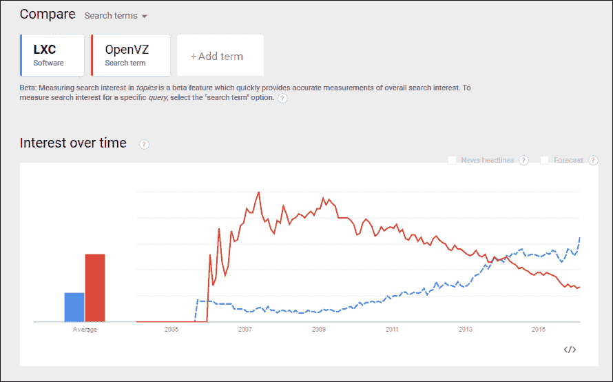

LXC 和 OpenVZ 在 Google Trends 上的兴趣变化

与此同时，LXC 的流行度缓慢增长，直到 2014 年——这一年 Docker 引发了容器界的一场轰动——LXC 超越了 OpenVZ。

随着容器复兴所带来的兴奋与焦虑，Proxmox VE 在 2015 年底转向 LXC 作为其容器化层也就不足为奇了；它是前沿技术，逐渐稳定，并得到了 IBM 和 Canonical 等公司贡献者的支持。

在此背景下，常常可以与容器化互换使用的术语包括 **操作系统虚拟化** 和 **虚拟私有服务器**。

欲了解有关容器历史的图解——从 Unix V7 开始并追溯到 2014 年的相关发展，请访问：[`pivotal.io/platform/infographic/moments-in-container-history`](http://pivotal.io/platform/infographic/moments-in-container-history)。

请注意，Proxmox VE 4.1 提供了可以将 OpenVZ 容器迁移到 LXC 的工具。欲了解更多信息，请访问 PVE 的 Wiki：[`pve.proxmox.com/wiki/Convert_OpenVZ_to_LXC`](https://pve.proxmox.com/wiki/Convert_OpenVZ_to_LXC)。

类似于虚拟机（VM），容器是一个隔离的实体；它可以独立重启，允许隔离的 root 访问，并且拥有独立的用户和组。

同样的隔离性也意味着可能拥有独立的 IP 地址、内存、进程、库和配置文件。

LXC 的特性集使其与完全虚拟化解决方案有所区别：

+   与完全虚拟化相比，LXC 容器化层所消耗的 CPU 资源将显著更少。

+   授权的容器用户可以更改任何配置文件，并在不干扰其他容器或 Proxmox VE 主机的情况下，在容器内安装额外的软件。

+   尽管容器彼此完全隔离，但它们与宿主机共享动态库，从而大大节省了内存。

+   大多数容器在几秒钟内完全启动，而虚拟机可能需要几分钟，在相同资源下。

+   因为所有容器都运行在宿主系统的操作系统内核上，所以容器的运行几乎没有开销。

+   每个容器的网络流量与其他容器的流量是隔离的；容器之间无法进行流量窃听。

+   防火墙可以在容器内部使用，路由操作也可以进行。

从实际角度来看，这些功能意味着，例如容器可以在不重启的情况下进行扩展，并且通常比虚拟机提供更高的服务效率和更好的性能。

值得注意的是，谨慎的专家现在认为，容器的著名性能优势和它们所需的较少资源正在逐渐减弱，特别是随着更强大的硬件以更低的价格进入市场。这里的论点是，完全虚拟化仍然有其位置，且容器的优势是相对的，前提是从硬件资源稀缺的角度来看待这一问题。

这一点是有事实依据的，但并不否定容器在许多情况下可以成为虚拟机的低成本替代方案，且不影响服务质量的论断。

考虑到之前阐述的优势，可以直接导致物理主机的使用寿命延长，并且具备灵活性，容器可以快速迁移到另一个物理主机，以便进行硬件维护；在某些威胁类型面前，安全性得到了提升；最后，LXC 拥有一个蓬勃发展的开发者和用户社区，是一个极好的支持资源，无论是否拥有 Proxmox VE 高级订阅。

### 提示

**容器安全**

第七章，*保护你的服务器*，将特别关注虚拟机的安全性。

虽然我们无疑处于容器革命的热潮中，但关于容器安全仍然存在一些悬而未决的问题，我们必须认真追问这些问题。LXC 文档在[`linuxcontainers.org/lxc/security/`](https://linuxcontainers.org/lxc/security/)中提供了一些见解。更多信息可以参考 SANS Institute 的资料，地址为[`www.sans.org/reading-room/whitepapers/linux/securing-linux-containers-36142`](https://www.sans.org/reading-room/whitepapers/linux/securing-linux-containers-36142)，最后，IBM 提供了一些明确的指导，地址为[`www.ibm.com/developerworks/library/l-lxc-security/`](http://www.ibm.com/developerworks/library/l-lxc-security/)。

然而，在完全虚拟化领域，已经有各种文件在致力于为虚拟机建立安全协议，无论厂商如何。这为我们提供了回应信息并发展对话的基础。

遗憾的是，这场革命仍然处于初期阶段，似乎还没有现成的操作系统级虚拟化标准可供使用。

这个非常独特的功能集应该激发我们立即为 LXC 容器设想一个代表性的应用案例；想象一下整个中学教育机构，再考虑它的各种计算机课程。对于这两种相关场景，硬件资源的整合潜力巨大。

计算机与信息通信技术专业的学生，例如，每个人都可以拥有自己独立的虚拟专用服务器，用于实验和完成引导性和独立的实践。他们每个人都有自己的虚拟专用服务器，用于实验、寻找灵感、完成评估，并实现他们的创新愿景。

此外，同一台物理硬件还可以为相关应用托管一个容器：

+   一个**学习管理系统**（**LMS**），如*Moodle*。

+   一个由网页应用程序提供的封闭社交网络，如*Elgg*（[`elgg.org/about.php`](https://elgg.org/about.php)）。

+   一个微型博客系统，如*GNU Social*（[`gnu.io/social/`](http://gnu.io/social/)）。

+   一个目录服务器，如*openLDAP*，提供跨平台的单点登录服务。

+   一个*Mahara*（[`mahara.org/`](https://mahara.org/)）的作品集系统。

+   一个网页过滤器和防火墙解决方案，不仅保护学生，还保护数据的完整性、利益相关者的机密性以及服务的可用性。

+   可以添加一个域控制器以提供更多的灵活性和功能（[`www.turnkeylinux.org/domain-controller`](https://www.turnkeylinux.org/domain-controller)）

容器有一个问题，它们并不是所有问题的解决方案。例如，LXC，PVE 容器背后的容器技术，仅支持 GNU/Linux 客体。

Proxmox VE 主机进一步限制了支持的容器 Linux 发行版。目前，以下是受支持的发行版和版本：

+   Debain (6, 7, 8)

+   CentOS 6

+   Ubuntu (12.04, 14.04, 15.04)

+   Archlinux

这是在充分确认 4.1 是 PVE 的一个非常近期版本的情况下提到的，而且很明显，Proxmox VE 将会在未来的每个月支持更多的发行版。

下一部分将介绍我们为在 PVE 上托管容器提供服务所需的第一步——获取容器模板。

我们将结束这一部分，并提醒大家，Proxmox VE 是一个企业级虚拟化平台，支持容器和完全虚拟化——正是因为两者在基础设施中都有各自的作用。

# 容器模板

模板是 LXC 容器（在 Proxmox VE 中简写为“CT”）的起点。模板有两种类型：**操作系统模板** 和 **设备模板**。

操作系统模板提供来自 GNU/Linux 发行版的最小软件包集合，以及系统库和脚本，用于启动和运行容器。它们旨在充分利用主机上运行的 GNU/Linux 内核。

除了基础工具，如 bash 解释器和实用程序外，操作系统模板通常不包含其他软件，如编译器或数据库管理系统（DBMS）。

与操作系统模板不同，虚拟设备是在 JeOS（足够操作系统）基础上构建的，旨在可靠、安全并高效地提供非常特定的服务。

虚拟设备可以提供通用功能，例如 LAMP 堆栈；也可以提供特定应用，例如 GitLab（[`about.gitlab.com/`](https://about.gitlab.com/)）；如 WordPress 或 Drupal 这样的 CMS；或者像 Observium（[`www.observium.org/`](http://www.observium.org/)）这样的基于 Web 的网络监控系统。

虚拟设备最吸引人的地方在于它们几乎无需配置或调优，用户可以轻松使用。

操作系统模板和虚拟设备都可以通过 Proxmox VE 管理界面获取。目前，所有可用的设备都由**TurnKeyGNU/Linux**提供；该平台提供超过 190 个设备，从 Web 应用到 SDK（软件开发工具包），以及用于监控网络活动、提供 LDAP 或域控制器等管理模板，还有更多其他功能。

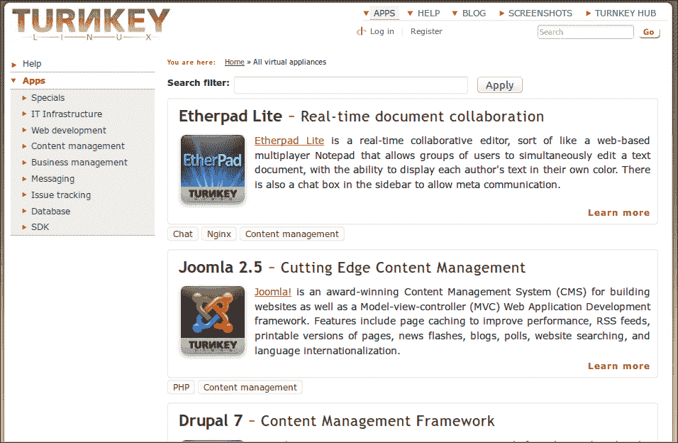

TurnKey GNU/Linux 设备库的网站

每个设备都基于相同版本的 Debian JeOS（称为 Turnkey GNU/Linux Core，Debian 8）构建，至少包括 shellinabox、OpenSSH 服务器和定制的 Webmin。

### 提示

**TurnKey GNU/Linux Core**

有关 TurnKey GNU/Linux Core 的更多信息，请访问 [`www.turnkeylinux.org/core`](http://www.turnkeylinux.org/core)。

# 下载模板

模板可以通过 Proxmox VE 管理界面直接获取，界面中提供了操作系统模板和虚拟设备模板。

在本节中，我们将登录到基于 Web 的管理界面，导航到服务器视图中的存储，并浏览可用模板列表。

### 注意

要跟随本教程，您的 Proxmox VE 主机必须能够访问互联网。

## 登录 Proxmox VE 的 Web 界面

开始之前，请从同一局域网内的工作站登录 Proxmox VE；使用 SSL/TLS 浏览器访问 Proxmox VE 实例的 IP 地址的 8006 端口。本文中的机器地址为 `192.168.1.80`；例如，要访问此机器，您可以直接在支持 JavaScript 的浏览器中访问 `https://192.168.1.80:8006`。

由于 PVE 使用自签名证书，浏览器会警告连接不可信。例如，Firefox 会显示类似以下窗口：

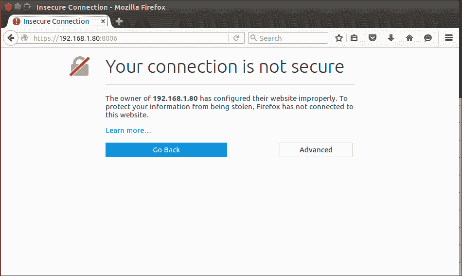

不安全连接对话框（在 Firefox 中）

Firefox 用户可以按如下方式继续操作：

1.  在 Firefox 中，选择**高级**，然后点击显示出来的**添加例外...**按钮继续。

1.  在弹出的**添加安全例外**对话框中，点击**确认安全例外**，并注意您可以选择通过勾选**永久存储此例外**复选框来永久存储此例外（此对话框在以下截图中显示）：

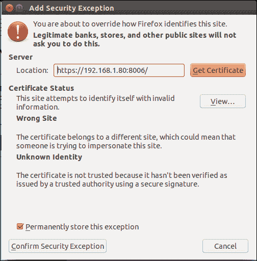

添加安全例外对话框（在 Firefox 中）

如果您使用 Google Chrome 访问管理界面，应该看到类似于以下截图的页面：

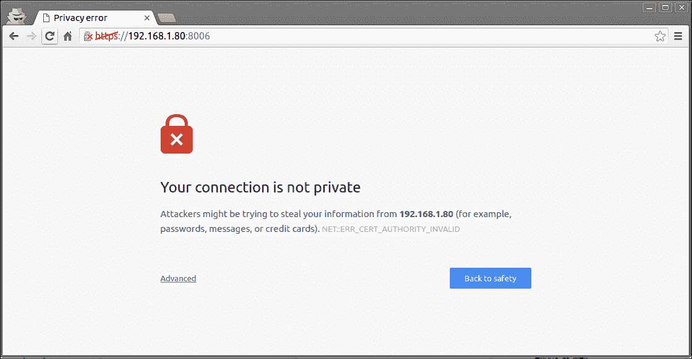

Google Chrome 中的隐私错误对话框

要忽略此（稍显不安的）警告：

1.  滚动到页面底部。

1.  点击**高级**。

1.  点击**继续访问 192.168.1.80**。

关于此链接，有两点需要注意：它被附加了“unsafe”提醒，表示这可能是一个安全风险，并且包含了针对 Chrome 用户的步骤。

无论使用哪种浏览器，都确保将`192.168.1.80`替换为您的 Proxmox VE 主机的 IP 地址。

### 注意

有关这些浏览器警告的解释，请参阅与 TLS/SSL 相关的自签名证书资源：

[`en.wikipedia.org/wiki/Self-signed_certificate`](http://en.wikipedia.org/wiki/Self-signed_certificate)

[`en.wikipedia.org/wiki/HTTPS`](http://en.wikipedia.org/wiki/HTTPS)

[`security.stackexchange.com/questions/8110/what-are-the-risks-of-self-signing-a-certificate-for-ssl`](http://security.stackexchange.com/questions/8110/what-are-the-risks-of-self-signing-a-certificate-for-ssl)

当页面完全加载后，使用用户名`root`和在第二章中设置的密码继续登录，*安装 Proxmox VE*。

选择名为**Linux PAM 标准认证**的**领域**。最后一个字段决定了 Web 界面的语言。选择您需要的语言，然后点击**登录**继续。

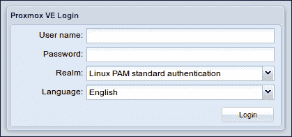

Proxmox VE Web 管理界面的登录对话框

成功登录后，您将首次看到 Proxmox VE 管理界面。

## 浏览可用的容器模板

在左侧栏中，靠近横幅的地方，选中的视图应该已经设置为**服务器视图**：

1.  在**服务器视图**下方直接展开资源树（数据中心节点）。在左侧框架的资源树底部会显示本地物理主机的存储，标记为**local**，后面跟着你的主机名；在下面的截图中，主机名为 `pve4`，存储节点仅标记为 local（`pve4`）。

1.  选择与服务器本地的存储节点；例如，在下面的截图中，选择**local (pve4)**：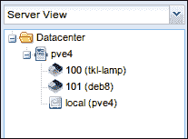

    服务器视图和资源树（展开显示本地（pve4））

1.  右侧框架将显示三个标签；**摘要**、**内容**和**权限**。

    选择**内容**标签，以显示**模板**按钮和**上传**按钮。

    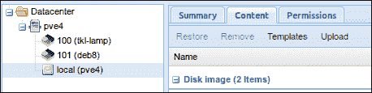

    PVE 节点的本地存储名为 pve4。截图显示本地存储（PVE4）的路径，以及模板和上传按钮的位置。

要浏览列表或下载通过 PVE 界面提供的操作系统模板和虚拟设备，按照以下步骤操作：

1.  点击**模板**标签。

1.  滚动浏览弹出的窗口，直到找到一个适合你兴趣的模板。

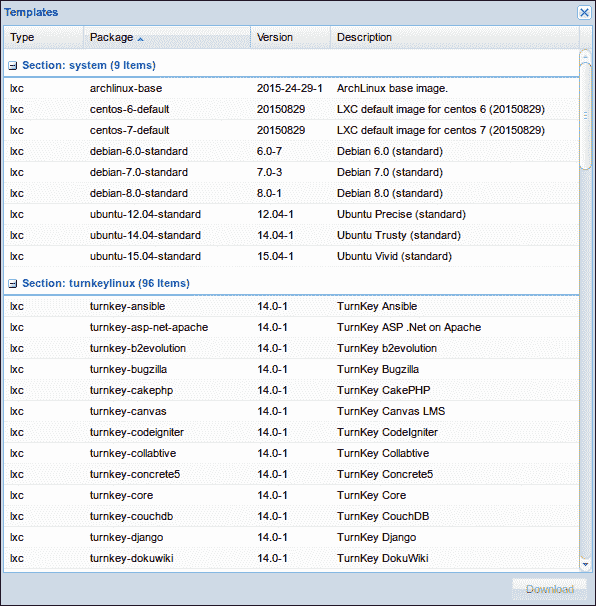

看一眼 Proxmox VE 界面中提供的几个容器模板

### 小贴士

**Turnkey GNU/Linux 设备库**

如果你决定想了解更多关于某个 Turnkey GNU/Linux 设备的信息，可以通过浏览器访问 [`www.turnkeylinux.org/all`](http://www.turnkeylinux.org/all)，查看每个设备的详细描述和功能列表。

## 下载容器

### 小贴士

在本章剩余部分，我将使用 Ubuntu 14.04 标准模板。虽然建议你跟着做，但也有许多有趣的模板可以作为起点。

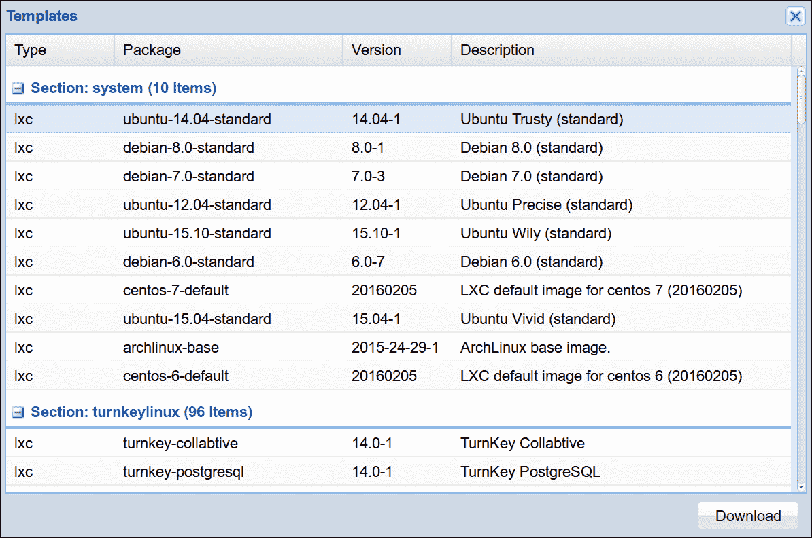

准备创建 Ubuntu 14.04.1 容器

一旦你选择了操作系统或设备模板：

1.  点击选择你的选择。

1.  点击**下载**按钮。

模板将保存在 PVE 的本地存储中，路径为 `/usr/share/vz/cache/templates/`。

### 小贴士

如果在 Web 界面中可用的模板列表似乎不完整，可以通过 PVE 主机的命令行刷新它。从本地登录到主机、通过 SSH 或使用 Web 界面提供的 noVNC 控制台来访问命令行界面。身份验证后，只需在提示符下输入 `pveam` 即可刷新模板列表。

现在模板已下载，可以从中创建容器。在下一节中，我们将配置并创建第一个模板。

# 从模板到容器

你可能注意到，当你在存储中高亮一个项目——ISO 或模板时，右侧框架顶部会出现**创建 CT**（容器）或**创建 VM**（虚拟机）的选项。要从模板创建容器，使用 Proxmox VE：

1.  至少准备好以下信息：

    +   root 用户的密码

    +   主机名称

    +   主机的空闲 IPv4 地址

    +   最大 RAM 数量

    +   CPU 数量

    +   虚拟硬盘（以 GB 为单位）的存储空间预期大小

    +   互联网网关的 IPv4 地址

    +   主机所在网络的适当子网掩码

1.  一旦确认了这些信息，从本地选择你要用于创建容器的模板。

1.  点击右上角的**创建 CT**按钮（参见下图）。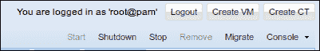

    创建 CT 和 VM 并显示在右上角

1.  点击**创建 CT**将启动**创建 LXC 容器**对话框，提供配置容器的图形界面。

    第一个标签是**常规**：

    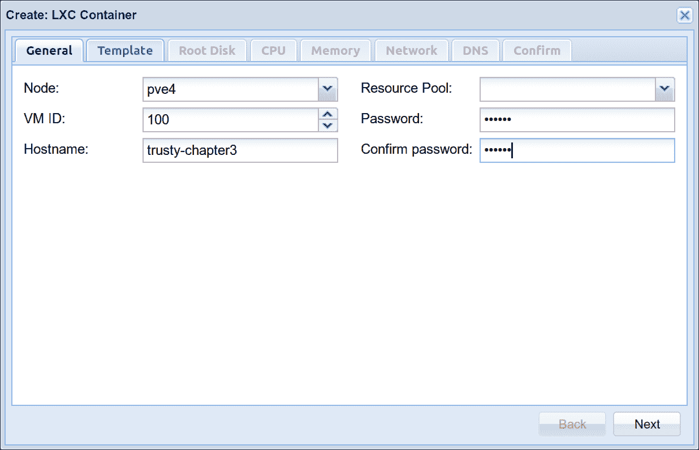

    容器创建对话框的“常规”标签

    使用此对话框定义主机名，并确认 root 用户的密码。VM ID 字段将在 Web 界面中自动填充并自动递增：第一个创建的虚拟机将具有默认**VM ID**为`100`，下一个为`101`，依此类推。

1.  点击**下一步**继续到**模板**标签，如下所示：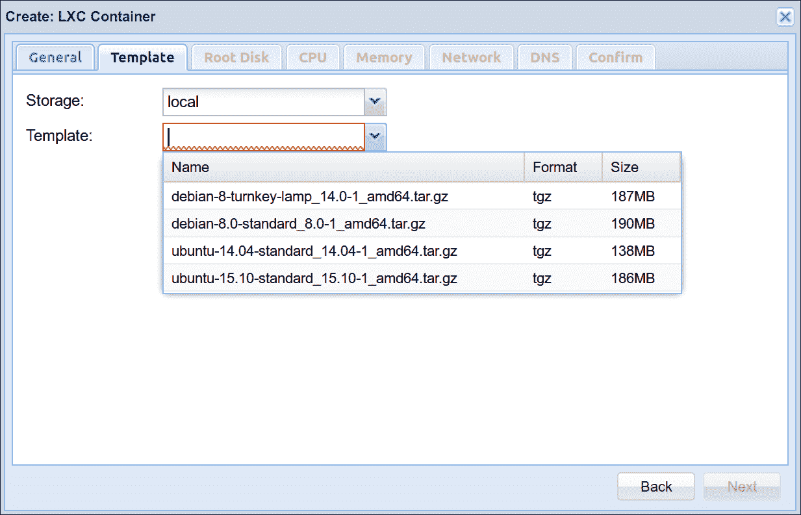

    容器创建对话框的“模板”标签

1.  为了继续本节内容，从下拉**模板**菜单中选择**Ubuntu-14.04-standard_14.04-1_amd64.tar.gz**并点击**下一步**以继续到**根磁盘**标签。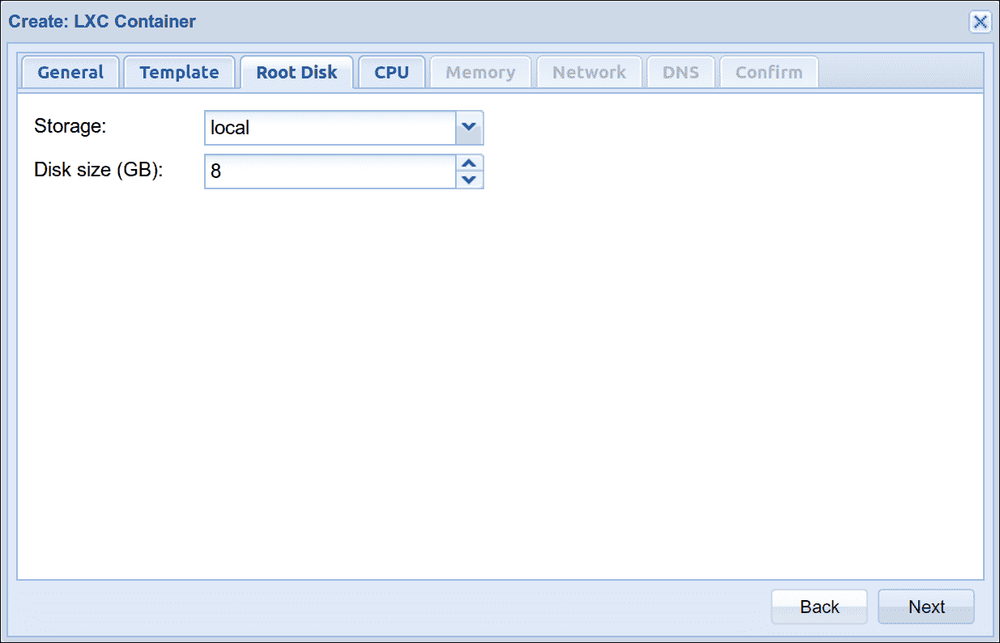

    容器创建对话框的**根磁盘**标签

    在此阶段，**存储**被定义为**本地**，并且没有可用的其他选项。定义容器虚拟磁盘的大小，以满足你的偏好（但请避免设置**磁盘大小**小于 4GB）。

1.  点击**Next**来为容器定义**CPU**限制和单位。为了本节内容的方便，我们保持这些设置为默认值。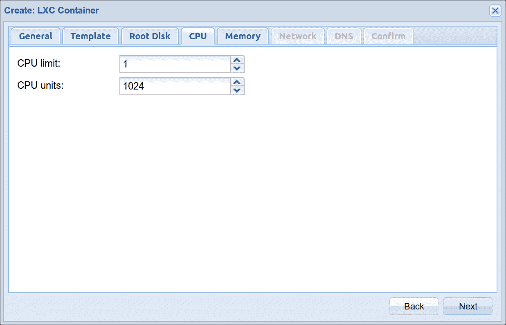

    容器创建对话框的**CPU**标签

1.  点击**下一步**来为容器配置**内存**。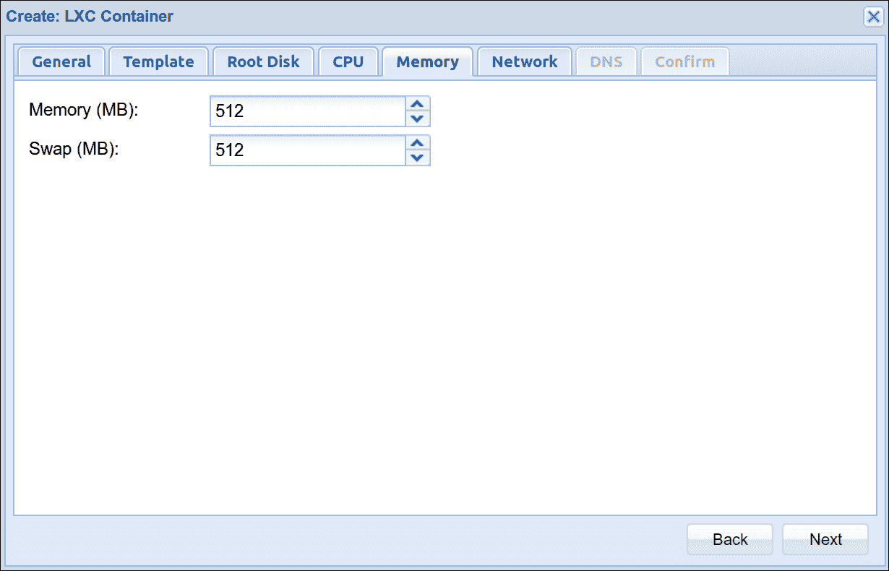

    容器创建对话框的“内存”标签

1.  再次强调，默认设置对我们来说是合适的，因此我们将从**内存**标签继续前进到**网络**标签：

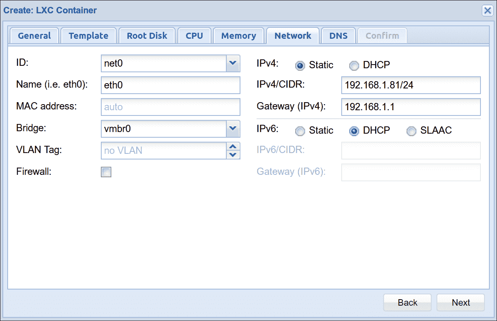

容器创建对话框的**网络**标签

**网络**标签假设你对容器所加入网络的配置有一定的了解。由于本例中 PVE 主机位于`192.168.1.80`，因此这个第一个容器的地址将是`192.168.1.81`，这是一个我确信不会与其他设备冲突的静态地址。右上角选择了静态地址，而非 DHCP。

确保在**IPv4/CIDR**字段中指明范围。在这种情况下，子网掩码是 255.255.255.0，因此 IP 地址后面加上`/24`。如果网络的正确子网掩码包含更多地址，如 255.255.0.0，只需替换为`/16`，例如。对于那些没有现成 CIDR 表示法的人，可以访问[`www.subnet-calculator.com/cidr.php`](http://www.subnet-calculator.com/cidr.php)来使用计算器。

对于我们的目的，**IPv6**并不重要；选择**DHCP**单选按钮，然后查看**网络**选项卡的左列。

**名称**指的是虚拟网络接口在容器内的显示方式；默认的**eth0**正是我们需要的。

**桥接**字段要求选择主机上的哪个桥接器来连接容器。在上面的截图中，`vmbr0`是默认且唯一的选择；我使用的机器只有一个 NIC，并且在主机中定义为`vmbr0`。

准备提交**网络**选项卡中的设置时，点击**下一步**以将容器指向 DNS 服务器。

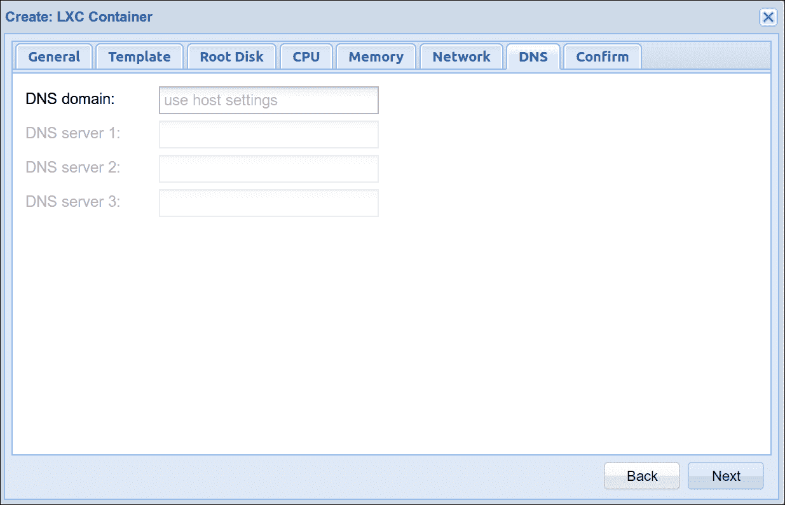

容器创建对话框的 DNS 选项卡

同样，在我的网络环境下，**DNS 域**字段设置为**使用主机设置**的默认设置非常合适。要查看并提交配置，请点击**下一步**。

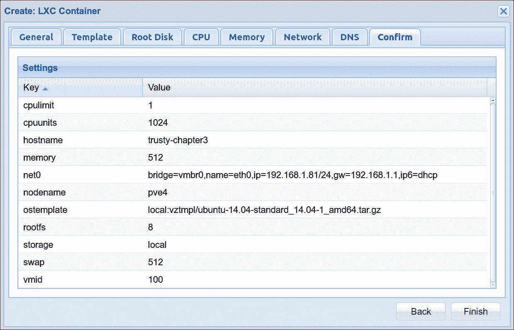

容器创建对话框中的确认选项卡

**确认**选项卡提供了配置摘要，并且可以再次查看一些配置决策。点击**返回**进行调整，或者点击**完成**开始容器创建任务。

一旦点击**完成**，配置对话框将关闭，并且浏览器中会弹出一个新窗口，提供观看 PVE 根据你的配置从模板构建 LXC 容器的机会：

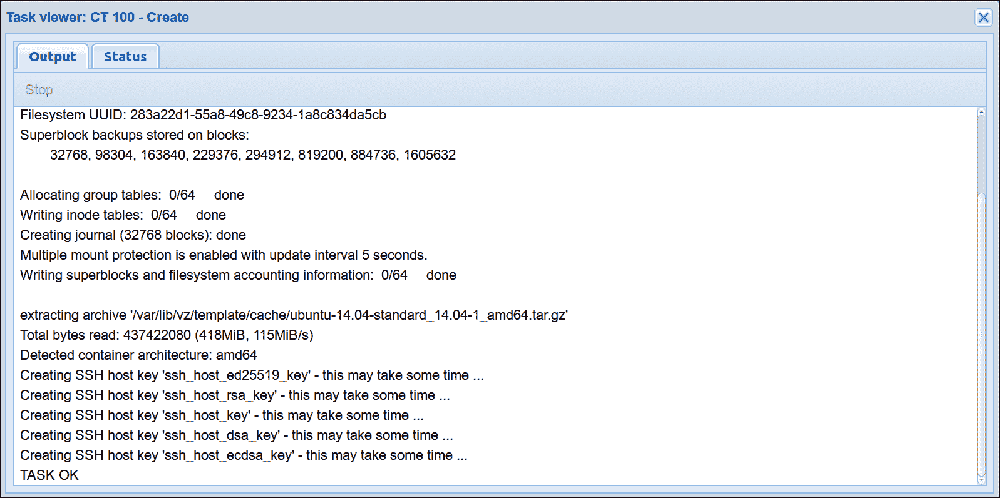

容器创建完成时，任务查看器的输出

当**任务查看器**窗口输出`TASK OK`时，容器已准备好使用。可以关闭**任务查看器**窗口。

### 注意

也可以通过使用 PVE 主机的命令行和`pct`创建命令，从模板创建容器。以下 bash 脚本演示了使用此命令创建一个几乎与通过基于网页的过程创建的容器相同的容器：

```
#!/bin/bash 
#### Set Variables #### 
$hostname="trusty-chapter3" 
$vmid="100" 
$template-path="/var/lib/vz/template/cache" 
$storage="local" 
$description="trusty container for Chapter 3" 
$template=" Ubuntu-14.04-standard_14.04-1_amd64.tar.gz" 
$ip="192.168.1.81/24" 
$nameserver="8.8.8.8" 
$ram="1024" 
$rootpw="changeme" 
$rootfs="4" 
$gateway="192.168.1.1" 
$bridge="vmbr0" 
$if="eth0" 
#### Execute pct create using variable substitution #### 
pct create $vmid \ 
  $template-path/$template \ 
  -description $description \ 
  -rootfs $rootfs \ 
  -hostname $hostname \ 
  -memory $ram \ 
  -nameserver $nameserver \ 
  -storage $storage \ 
  -password $rootpw \ 
  -net0 name=$if,ip=$ip,gw=$gateway,bridge=$bridge 
```

在大多数情况下，修改容器的配置和添加虚拟设备是通过网页界面轻松完成的。要编辑配置或添加设备：

1.  在界面左侧框架的**服务器**视图中选择容器。

1.  在右侧框架中，查看**开始**按钮下方的一组选项卡（如下面的截图所示）。

1.  将你想完成的任务与选项卡名称匹配。

1.  使用**添加**和**编辑**按钮进行所需的更改。

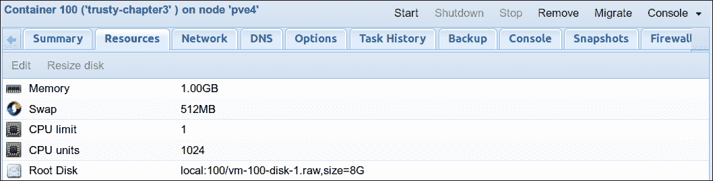

大多数容器配置更改可以通过 PVE Web 界面完成

下一部分是关于控制任意给定容器的状态；例如，如何启动和停止它。

# 启动和停止容器

要启动容器，选择左侧窗格中的容器；图标应该是黑色和灰色的，表示容器未运行。

1.  在下图中，我的容器的 VM ID 为**100**，名称为**trusty-chapter3**：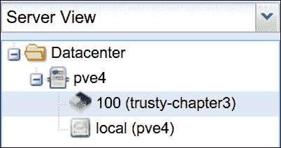

    已停止容器的图标

1.  在界面的右上角，点击**启动**按钮来启动容器：

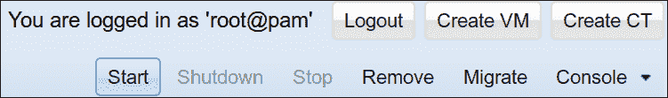

容器启动按钮

当容器启动过程完成时，界面左侧框架中的容器图标颜色发生变化；它现在应该是绿色、黑色和灰色，而不仅仅是黑色和灰色；图标上的绿色部分是一个快速的视觉标识，帮助区分正在运行的容器和已停止的容器。

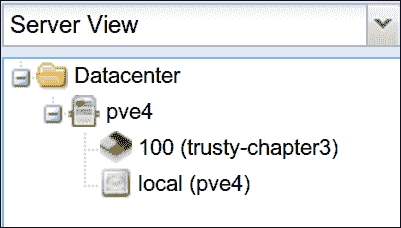

正在运行的容器图标是绿色、黑色和灰色的

在资源树的左侧框架中，选择正在运行的容器。

在屏幕的右侧，几个按钮变得可用：

+   点击**关机**将优雅地关闭容器

+   相比之下，**停止**按钮会突然停止容器

+   **迁移**允许我们在 Proxmox VE 集群节点之间移动容器，甚至是正在运行的容器，而不会导致任何服务中断或其他停机。

+   **删除**按钮将删除已停止的容器。请注意，如果容器没有备份，删除后无法恢复。

要暂停容器，请在 PVE Web 界面中选择容器的**备份**标签。点击**立即备份**，在弹出的对话框中，从**模式**下拉菜单中选择**暂停**。点击**备份**按钮以暂停容器并关闭对话框。

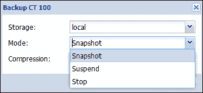

容器可以通过 PVE Web 界面暂停

## 使用命令行更改容器状态

容器的状态也可以通过 PVE 主机的命令行控制（无论是通过 SSH 会话、noVNC 控制台，还是登录到物理主机）。

要启动本章中描述的并分配了 VM ID 为 100 的容器，输入`pct start 100`。同样，使用`pct stop 100`也可以停止该容器。

模板可以通过 PVE 命令行或 Web 界面进行备份。要了解更多关于备份和恢复容器的信息，请访问 Proxmox Wiki：[`pve.proxmox.com/wiki/Linux_Container#Backup_container`](https://pve.proxmox.com/wiki/Linux_Container#Backup_container)。

## 访问容器

通过 Proxmox VE 提供的大多数操作系统模板，最初都配置为可以通过 noVNC 控制台进行访问，该控制台可以从管理网页界面启动，或通过 PVE 命令行界面进行访问。

这并不意味着没有安装 OpenSSH；事实上，我还没有见过没有安装 OpenSSH 服务器的模板。只是这些操作系统模板在启动时没有配置，使得 root 用户不能使用密码登录。（然而，TurnKey Linux 的设备可以通过 SSH 使用 root 账户和密码进行访问。）

### 提示

`pct enter`命令使得从 PVE 主机的命令行界面访问容器变得轻松。要进入本章开发的容器，我可以通过 SSH 访问 PVE 主机，例如，以 root 用户登录；然后，我可以在命令行中输入`pct enter`后跟容器的虚拟机 ID，在此案例中为`100`。只需在提示符下输入`pct enter 100`并按**Enter**键，即可进入容器的 Shell。

要通过**noVNC**控制台访问正在运行的容器，请在网页界面中选择正在运行的模板，然后选择浏览器右上角的**控制台**，从下拉菜单中选择**noVNC**。

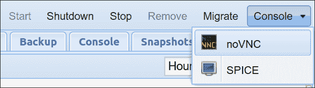

当选中一个已启动的容器时，控制台按钮会出现在页面的右上角。

或者，按照前面所述选择正在运行的模板，但不要点击**控制台**下拉菜单，而是选择容器的**控制台**选项卡。

如果你可以通过控制台访问终端，如下图所示，那么你就可以创建用户、安装软件包并进行其他配置更改，使容器符合你的需求。

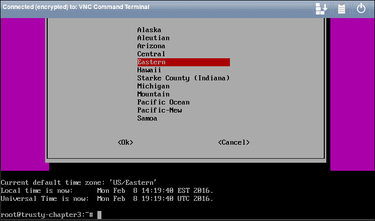

通过 noVNC 控制台会话重新配置 Ubuntu 容器的时区数据

如果控制台启动但仅显示黑屏和无响应的光标，请尝试按**Enter**键，查看是否出现登录提示。如果不起作用，可以考虑有些容器需要重启一次才能提示输入凭证；重启容器后，再次启动 noVNC 控制台。如果 noVNC 屏幕仍然是黑的，可以按**Enter**键强制出现提示。

### 注意

大多数容器都需要配置区域设置和时区。`dpkg-reconfigure locales`将引导你通过简短的对话框来确定 Debian 或 Ubuntu 容器上可用的区域设置。`dpkg-reconfigure tzdata`将引导你完成必要的步骤，以设置或重新配置 Debian 或 Ubuntu 容器的时区数据。

# 总结

本章详细介绍了从 LXC 模板开发容器的过程。我们探讨了 LXC 容器在 Proxmox VE 中的潜力，并概述了一个示例使用案例，该案例可以推广到其他情况，并展示了 Proxmox VE 容器的功能如何为组织的 IT 基础设施增加价值、灵活性和可扩展性。

在描述如何从模板派生容器后，我们探索了如何通过命令行和网页界面来操作容器的方法。

在第四章，*创建虚拟机*，我们将识别虚拟机相较于容器的优势，并探索一些使用案例。在本章的结尾，我们将演示如何通过 ISO 创建 Microsoft Windows 和 GNU/Linux 虚拟机。

结合我们目前对容器的了解，探索虚拟机在一个以容器化为核心的文化中所占的位置将是令人兴奋的。
