# 第四章。创建虚拟机

|   | *"...但是，如果抽象概念在 IT 领域如此普通，那是什么解释了近年来虚拟化越来越受到关注？这一趋势在数据中心中更加显著，自 2000 年代中期以来，虚拟化已经深深嵌入这些环境的开发战略中。而这种迷恋仍在增长……因此，这些设施已被虚拟服务器、虚拟网络、虚拟存储、虚拟设备和其他'V 技术'所包围，承诺从现实的束缚中解脱出来。"* |   |
| --- | --- | --- |
|   | -- *古斯塔沃·A·A·桑塔纳，《数据中心虚拟化基础》* |

在第三章中，*创建容器*，我们探讨了如何使用 Proxmox VE 创建、配置和控制 LXC 容器。在本章中，我们将重点介绍如何使用 Proxmox VE 创建和控制 KVM-QEMU 虚拟机。

在第一章中，我们对比了虚拟机和容器，*Proxmox VE 基础*，我们将借此机会深入探讨虚拟机相比容器仍然具备的一些优势，尽管显而易见地，我们正处于容器革命的浪潮中。同时，我们还将基于所学探索一些应用场景。

接下来，我们将讲解如何使用 Proxmox VE 从 ISO 镜像创建虚拟机。PVE 作为服务器虚拟化平台，因此我们将演示创建和配置两个虚拟机：第一个运行 Microsoft Windows 2012r2，第二个运行 Fedora Core 23 Server。

由于这两个操作系统都有图形用户界面组件，我们将抓住这个机会，探索更多 PVE 的功能，这在没有实际需求时我们可能不会涉及。

到了第四章的结尾，*创建虚拟机*，我们将涵盖使用 Proxmox VE 进行完全虚拟化的以下方面：

+   将 ISO 上传到 Proxmox VE 的本地存储

+   从 PVE Web 界面创建和配置虚拟机

+   使用 PVE Web 界面的控制台功能与虚拟机交互

+   重新配置虚拟机

+   控制虚拟机的状态

然而，首先我们将回顾并探讨硬件虚拟化在容器热潮中的持续作用。

# 虚拟机的特征区别

尽管容器在如此短的时间内确实取得了显著的进展，但虚拟机依然拥有显著的独特特点。例如：

+   虚拟机可以运行任何为主机架构设计的操作系统；例如，Android-x86、FreeBSD、Ubuntu、Windows Server，甚至桌面操作系统都可以在 Proxmox VE 主机上运行多个虚拟机，只要主机拥有足够的硬件资源。

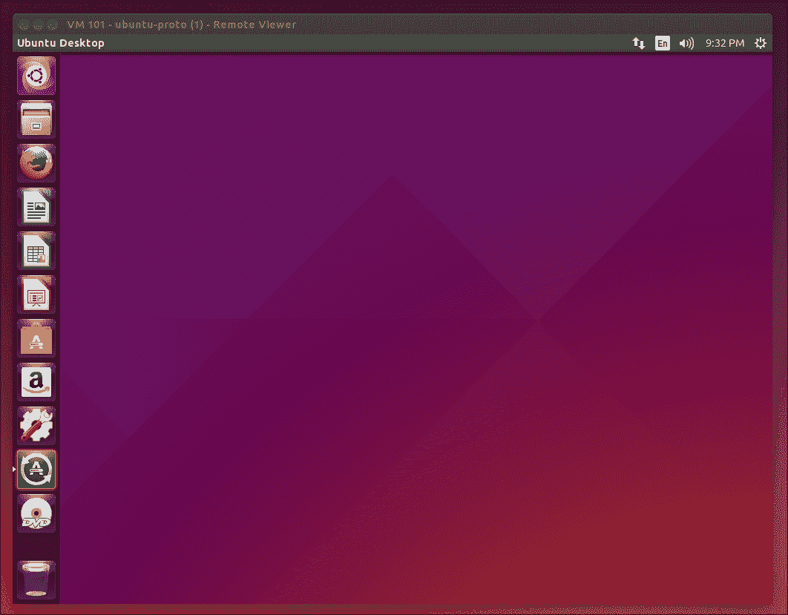

在 Proxmox VE 上托管的 Ubuntu 15.04 虚拟机，通过 PVE 的 Web 界面中的 SPICE 控制台选项访问

+   一台虚拟机可以托管多个容器；当我们寻找创意和聪明的数据中心解决方案时，我们需要始终意识到，操作系统虚拟化和系统虚拟化是互补的关系，而不是竞争或对立的关系。例如，虚拟机仍然提供比容器更彻底的隔离。

+   虚拟机和容器涉及不同的安全问题和方法。系统虚拟化的标准非常成熟且可自由获取，而操作系统虚拟化的安全性和标准化解决方案尚未成熟。

### 提示

我们将在第七章中更全面地讨论安全性和 PVE，*保护 Proxmox VE*。

系统虚拟化的区别特征表明，至少在当前，虚拟机比容器更具灵活性；例如，许多操作系统可以在单一的**虚拟化管理程序**上共存，如 Proxmox VE。而容器无法实现这一点。目前，这意味着纯容器仅在基于 GNU-/Linux 的主机上才会存在，而基于 Microsoft 的容器只能在基于 Microsoft 操作系统的主机上运行。因此，由 Proxmox VE 托管的容器需要主机操作系统共享 GNU/Linux 库和二进制文件。

尽管容器技术发展迅速，但随着 Windows Server 2016 的发布，这一限制可能会很快改变，Windows Server 2016 现已可以预览；微软已宣布计划将 Docker 集成到该产品中（[`zdnet.com/article/microsoft-to-add-virtualized-containers-non-server-mode-to-windows-server-2016/`](http://zdnet.com/article/microsoft-to-add-virtualized-containers-non-server-mode-to-windows-server-2016/)，访问时间：2015 年 6 月 1 日）。

### 注意

Docker 是一个开源的容器化解决方案，正在积极开发并且引起了广泛关注。简要调查表明，运行 Docker 的 Windows 主机可以运行 Linux 容器。一旦我们意识到 Docker 实际上只有在系统虚拟化层的支持下才能做到这一点（如 boot2docker [`github.com/boot2docker/boot2docker`](https://github.com/boot2docker/boot2docker)），这个反论点就很容易解决。

系统虚拟化在操作系统方面可能声称的灵活性，确实是有代价的：*虚拟机比容器需要更多的资源，并且有更多的开销*。

在接下来的部分，我们将探讨一些使系统虚拟化仍然具有吸引力的场景。

## 系统虚拟化的应用场景

从前面讨论的区别特征中，我们可以得出一些非常强大的使用案例。例如：

+   跨平台软件开发和测试

+   企业中跨平台系统的管理和运维

+   对遗留应用程序、系统或数据的依赖

+   新系统或政策部署的试验场

+   为 IT 和 ICT 学生提供的实验室

+   跨平台的生产力和一致性

这些场景突出了每个差异所带来的变化，特别是 Proxmox VE 支持的两种虚拟化形式——虚拟机和容器之间的差异。

本章自信地得出一个有根据的结论：容器和虚拟机（或操作系统虚拟化和系统虚拟化）是两种不同的工具，它们共同为数据中心及其工程师提供了强大的灵活性，并在（重）构建数据中心时提供了行使自由裁量权的机会。

让我们来看看使用 Proxmox VE 创建虚拟机的过程。

# 创建虚拟机

本节提供了虚拟机创建过程的抽象概述，从配置机器到操作系统的安装，再到最终控制其状态。

## 安装介质

在最佳情况下，计划用于新虚拟机的操作系统可以作为可下载的 ISO 文件。这单个文件旨在完美地代表整个 CD 或 DVD。在一些 GNU/Linux 发行版的情况下，完整的安装介质跨越多个 DVD。

通常，在这些情况下，会有一个网络安装（或 `netinst`）磁盘映像，提供足够的操作系统来驱动系统设备，安装程序，然后从在线仓库下载并安装所需的软件。

当操作系统作为 ISO 文件可用时，我们可以简单地将其下载到远程工作站，然后通过 PVE 的 Web 界面上传到 PVE 主机的本地存储，并继续创建虚拟机。

### 将 ISO 文件上传到 PVE 的本地存储

使用远程工作站处理 ISO 镜像有五个步骤。

1.  从 Web 下载 ISO 到本地工作站，并验证图像是否没有损坏或被篡改（请参阅 [`www.online-tech-tips.com/cool-websites/what-is-checksum/`](http://www.online-tech-tips.com/cool-websites/what-is-checksum/) 了解有关此过程的更多信息）。

1.  通过浏览器访问 Proxmox VE Web 界面（将浏览器指向 `https://<ip address>:8006`，其中 `<ip address>` 是 PVE 的 IP 地址）。

1.  在浏览器窗口的左侧窗格中，应该选择 **Server View**。在下拉菜单下方，应该可以看到一个名为 **Datacenter** 的文件夹。展开该文件夹以显示 PVE 主机，按主机名标记。再展开，显示该主机的本地存储，接着选择它的本地存储。例如，在下面的截图中，PVE 主机的主机名为 pve4，因此本地存储标记为 **local (pve4)**。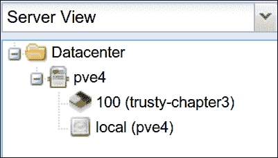

    导航到 PVE 节点的本地存储

1.  选择本地存储后，右侧窗格应显示三个标签：**摘要**、**内容**和**权限**。选择**内容**标签以显示右侧窗格中的两个按钮，**模板**和**上传**：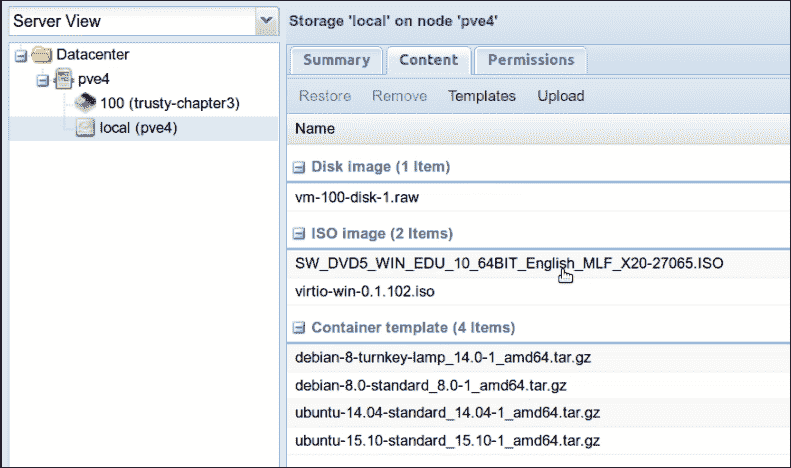

    本地存储

1.  为继续操作，请点击**上传**按钮。在弹出的对话框中，从名为**内容**的下拉菜单中选择**ISO 镜像**，然后点击**选择文件...**按钮，浏览工作站的文件系统以选择要上传到 PVE 主机的磁盘镜像文件。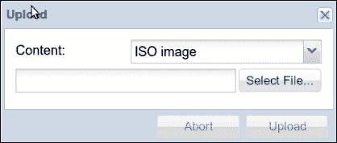

    上传对话框

### 注意

默认情况下，通过 Web 界面上传到 PVE 本地存储的 ISO 文件路径为 `/var/lib/template/iso`。请注意，文件也可以通过 `scp` 或 `sftp` 从工作站传输到该位置，前提是远程工作站上安装了相关工具。

在 PVE 可用安装介质的情况下，我们已准备好使用 Proxmox VE 的 Web 界面配置并创建虚拟机。下一部分将探讨这一过程。

## 准备虚拟机

我们通过在 PVE Web 界面的服务器视图中找到 Proxmox VE 实例的主机名和本地存储开始该过程。选择主机并点击页面右上角的**创建虚拟机**按钮，开始配置新虚拟机。

一个名为**创建：虚拟机**的对话框将出现在浏览器窗口中。此对话框用于为新虚拟机提供初步规格，包括硬件规格、操作系统类型以及 PVE 用来引用新虚拟机的名称。

从左到右，标签页如下：

+   常规

+   操作系统

+   CD/DVD

+   硬盘

+   CPU

+   内存

+   网络

+   确认

完成一个标签页后，可以通过点击下一个标签页或点击**下一步**按钮继续操作。

### 预期配置标签页

以下是我们可以从**创建：虚拟机**对话框中每个标签页中期待的简要概述。

#### 常规

在**常规**标签页中，定义了虚拟机的名称和 VM ID。请注意，"名称"字段指的不是虚拟机的主机名；主机名是在配置操作系统时定义的。此处的名称是 Proxmox VE 用来在 Web 界面中引用此虚拟机的名称。

在生产环境中，建议在命名方案上保持谨慎和系统化，就像在数据中心为主机命名一样。

在定义 VM ID 时，同样重要的是要保持严格的系统化。每个虚拟机和容器都必须分配一个唯一的数字，PVE 称之为 VM ID。虽然 Proxmox VE 会提供一个默认的 VM ID，但这是一个任意的系统，而不是一个由良好制定的政策所产生的有意识系统。

在大型生产环境中，考虑根据虚拟服务器的用途为虚拟机分配专用的 ID 范围（例如，虚拟机 ID 1000-2000 用于提供 Web 服务的虚拟机）。如果你的数据中心随着备份计划的系统化和虚拟服务器生命周期管理计划的建立而扩展，你会感激你这样做过。

#### 操作系统

**操作系统**选项卡提供了创建面向特定操作系统的虚拟机的一些支持。请注意，对于 GNU/Linux 发行版，基于内核版本有多个选项。

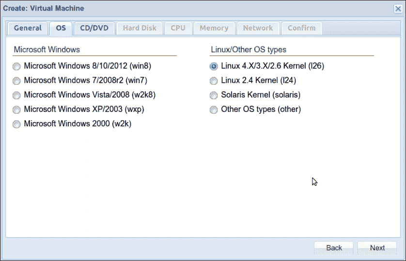

#### 光盘/CD/DVD

**光盘/CD/DVD**选项卡提供了指定用于安装操作系统的初始光盘镜像的机会；或者，我们可以指示 PVE 依赖本地光驱中的物理光盘。如果选择 ISO 镜像，系统会要求你从已上传到 Proxmox VE 的 ISO 文件中选择。

#### 硬盘

在**硬盘**选项卡中，我们可以定义为虚拟机分配的二级存储的大小。还有一个**总线/设备**字段，以及一个标记为**存储**的字段，用于指定存储虚拟磁盘的位置。为了本文的目的，我们将保持该字段为默认值**local**。

### 提示

有关虚拟存储的更多信息，请参阅第五章，*使用虚拟磁盘*。

#### CPU

**CPU**选项卡提供了定义 CPU 插槽数量的机会，还可以定义每个插槽使用的核心数。

#### 内存

**内存**选项卡提供了两种为虚拟机分配 RAM 的方法；我们可以选择一个固定的 MB 值，也可以在指定范围内自动分配 RAM。

#### 网络

在“网络”选项卡中，特别值得注意的是左列中提供的三种网络模式，以及右列中定义网络接口**模型**的机会。


在前面的截图中，虚拟机将配置为通过依赖 PVE 的桥接模式，表现得好像它直接连接到物理网络。相比之下，NAT（网络地址转换）模式将虚拟机连接到主机维护的孤立局域网，并且与物理网络完全隔离。

在相同的截图中，网络卡的模型设置为**Intel E1000**。性能不如我们从**virtio 半虚拟化**中获得的效果，但 Windows 操作系统的虚拟机可以即插即用，而 virtio 则需要额外的驱动程序。Intel E1000 以其兼容性突出，而 virtio 则提供更优越的性能。

### 提示

配置为 NAT 模式的虚拟机可以访问物理网络上的资源，但不能被 Proxmox VE 主机之外的资源看到或访问。

Proxmox VE 的网络模型复杂且非常灵活。要了解更多信息，请参见第六章，*网络与 Proxmox VE*，这是一个专门介绍 Proxmox VE 网络的章节。还可以访问[`pve.proxmox.com/wiki/Network_Model`](https://pve.proxmox.com/wiki/Network_Model)的维基页面。

#### 确认

**确认**标签提供了虚拟机配置的概览，供在创建虚拟机之前进行审核。

在此标签页中，出现了一个**完成**按钮，位置与其他标签页中的**下一步**按钮相同。要创建虚拟机，请点击**完成**按钮。

完成**创建：虚拟机**对话框后，虚拟机配置完成——这类似于构建了一台物理计算机，将其插电，打开电源，只开启足够长的时间以便将安装介质插入光驱，然后迫不及待地等待它重新开机以便安装操作系统。

### 提示

保持关注主机的硬件规格，并时刻注意随着虚拟机和容器在 PVE 主机上的积累，资源是如何分配的。

下一步是启动新创建的虚拟机并安装其操作系统。首先，让我们通过控制虚拟机的状态来了解步骤：启动、关闭和强制停止虚拟机。

### 控制虚拟机的状态

在此过程中的此时，刚创建的虚拟机以关机状态出现在**服务器视图**中：

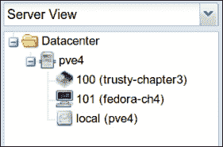

停止状态的虚拟机图标

在前面的截图中，主机上唯一的虚拟机的 VM ID 是 101，名称为`fedora-ch4`。停止的虚拟机通过一个显示黑色屏幕的监视器图标表示。

如果我们在左侧窗格中选择虚拟机，控制其状态的按钮将出现在右侧窗格，这正是我们在上一章中看到的容器操作：

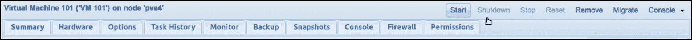

启动虚拟机

**启动**按钮将“开机”虚拟机，并开始启动过程。

### 注意

运行中的虚拟机通过一个带白色屏幕的监视器图标表示，这与停止状态的虚拟机图标在视觉上有所区别。

一旦启动，我们可以打开虚拟机的 noVNC 控制台，查看从 BIOS 选项到操作系统与用户的首次互动过程。这个工具同样适用于图形用户界面和命令行界面。


更改运行中虚拟机的状态

要优雅地停止虚拟机，请使用**关机**按钮，该按钮在启动后可用。或者，使用**停止**来强制关闭虚拟机。**重置**按钮将停止虚拟机，类似于硬件重置按钮的作用。

要销毁虚拟机，请首先确保虚拟机处于停止状态，然后按下**删除**按钮，系统会显示一个警告，告知该操作无法撤销。PVE 将提供**取消**选项，允许你重新考虑该操作，或者继续执行销毁虚拟机的操作。

### 从 PVE 命令行控制虚拟机

`qm`命令使我们能够通过 Proxmox VE 命令行界面控制虚拟机的状态。在接下来的示例中，所有更改将应用于 ID 为 101 的虚拟机：

+   `qm destroy 101`：销毁虚拟机并删除其所有已使用或拥有的存储卷

+   `qm reset 101`：重置虚拟机

+   `qm resume 101`：恢复虚拟机（如果它被暂停）

+   `qm shutdown 101`：关机虚拟机

+   `qm start 101`：启动虚拟机

+   `qm stop 101`：停止虚拟机

+   `qm suspend 101`：暂停虚拟机

### 注意

qm 命令提供对虚拟机的全面控制，从创建到销毁。欲了解更多信息，请访问手册页面：[`pve.proxmox.com/wiki/Manual:_qm`](https://pve.proxmox.com/wiki/Manual:_qm)。

在接下来的章节中，虚拟机创建和配置过程的概要和示意图将变得更加具体和详细，我们将应用所学内容来构建两个虚拟机：首先我们将介绍如何创建 Windows Server 2012r2 虚拟机，然后我们将创建一个 Fedora 23 Server 虚拟机。

# 练习创建虚拟机

在本节和下一节中，我们将演示整个虚拟机创建过程，从 ISO 镜像的获取，到虚拟机的配置，再到操作系统的安装。

首先，我们将通过微软 Windows Server 2012r2 系统的过程。随后，我们将介绍如何创建一个 Fedora 23 Server 虚拟机。

## 使用 Proxmox VE 虚拟化 Windows Server 2012r2

如果你想精确按照这里描述的安装过程进行操作，你将需要一个 Windows Server 2012r2 的 ISO 镜像，必要时可以使用现有的 DVD。如果你可以访问批量许可中心，你或许能够通过访问[`www.microsoft.com/Licensing/servicecenter/default.aspx`](https://www.microsoft.com/Licensing/servicecenter/default.aspx)从微软下载镜像文件。

写本文时，Windows Server 2012r2 可在微软的 TechNet 评估中心进行评估（评估期限为 180 天）：[`www.microsoft.com/en-us/evalcenter/evaluate-windows-server-2012-r2`](https://www.microsoft.com/en-us/evalcenter/evaluate-windows-server-2012-r2)。

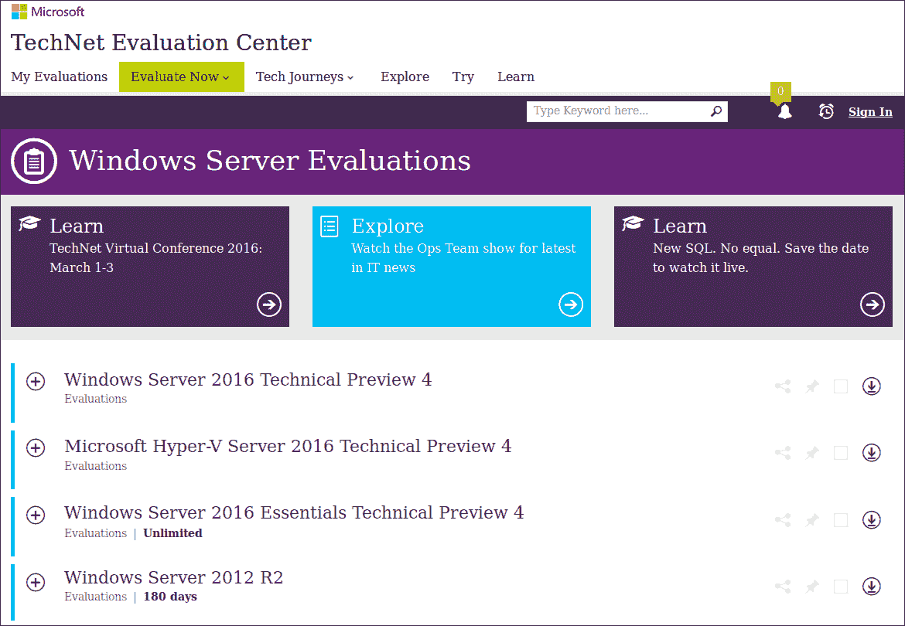

微软的 TechNet 评估中心

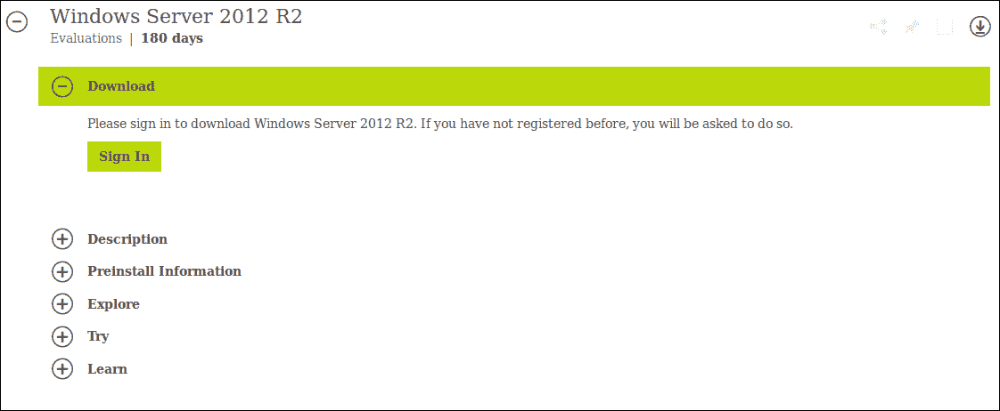

注册、登录并下载微软 Windows Server 2012r2

从与您的 Proxmox VE 服务器处于同一物理网络的工作站下载 ISO 文件，然后按照前一节中描述的方式，通过 Web 界面将映像上传到 PVE。

上传完成后，它应该会出现在本地存储的**内容**标签页中。

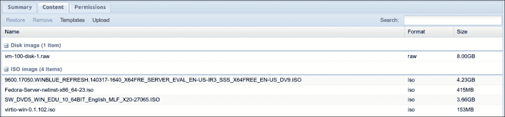

查看可用的映像文件

## 配置和创建虚拟机

要快速配置和创建 Windows Server 虚拟机，请按照以下步骤操作：

1.  首先，将 Microsoft Windows Server 从工作站上传到 Proxmox VE 服务器，如前所述。

1.  现在，操作系统安装介质已可供 PVE 使用，我们可以点击**创建虚拟机**按钮，启动如前所述的**创建：虚拟机**对话框。完成**常规**标签页中的字段，如以下截图所示：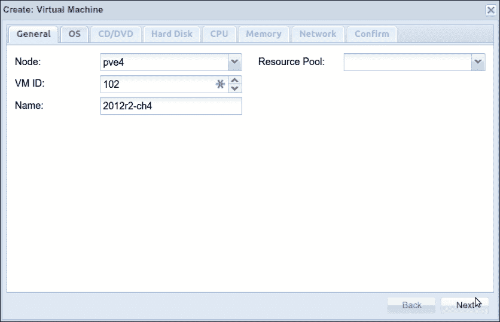

1.  通过点击**下一步**，进入对话框的**操作系统（OS）**标签页。该对话框的左侧栏包含了微软操作系统的选项。选择最上面的选项，**Microsoft Windows 8/Server 2012**，然后点击**下一步**继续到**CD/DVD**标签页。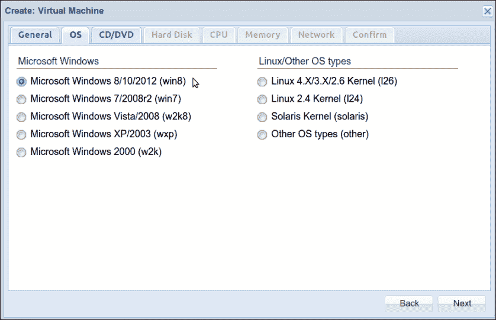

1.  在**CD/DVD**标签页中，选择顶部选项以选择 ISO 文件。将**存储**字段设置为本地，使用**ISO 映像**字段的下拉菜单选择已上传的 2012r2 映像。点击**下一步**继续。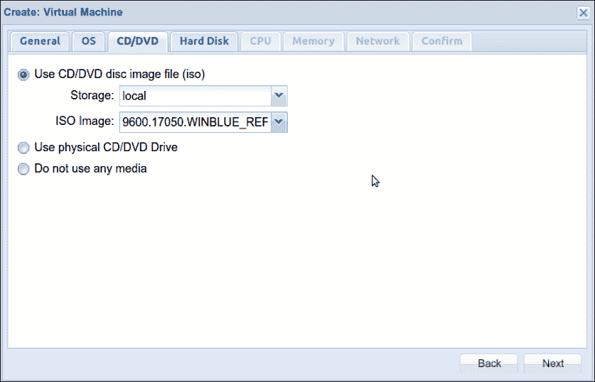

1.  在**硬盘**标签页，记住 Windows Server 2012r2 至少需要 32 GB 的存储。设置合适的磁盘大小，并确保**总线/设备**设置为**IDE**，避免选择**virtio**。将格式设置为**QEMU 映像格式（qcow2）**，然后点击**下一步**继续到**CPU**标签页。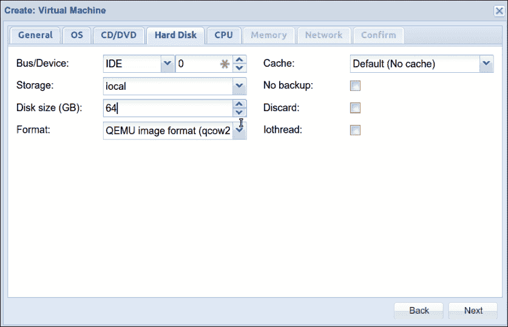

    ### 提示

    我们将在下一章中介绍**总线/设备（Bus/Device）**类型。

1.  在**CPU**标签页，配置要分配给虚拟机的插槽数和每个插槽的核心数。为了本练习的目的，我将**插槽**设置为`1`，并将核心数设置为`2`。**类型**字段应设置为**默认（kvm64）**。请记住，稍后我们可以根据需要更改 CPU 配置。点击**下一步**以配置虚拟机的内存。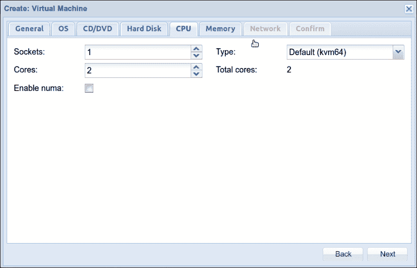

1.  Windows Server 2012r2 至少需要 512 MB 的内存。如以下截图所示，PVE 提供了固定内存大小或在指定范围内自动分配内存的选项。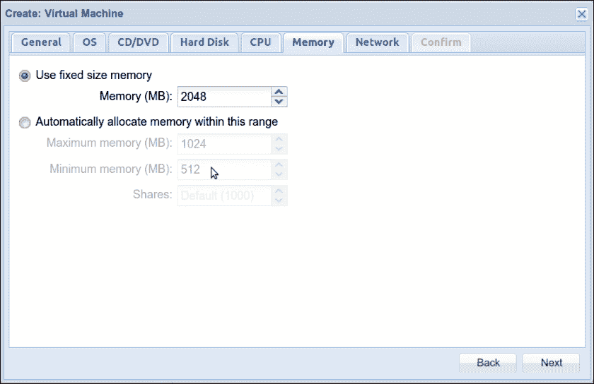

    出于本次练习的目的，已分配了固定的 2,048 MB 内存，理解这一设置稍后可以轻松更改。当内存调整到您希望的状态时，点击**下一步**以配置网络。

1.  如下截图所示，虚拟机的 IP 地址不能像容器那样预先配置：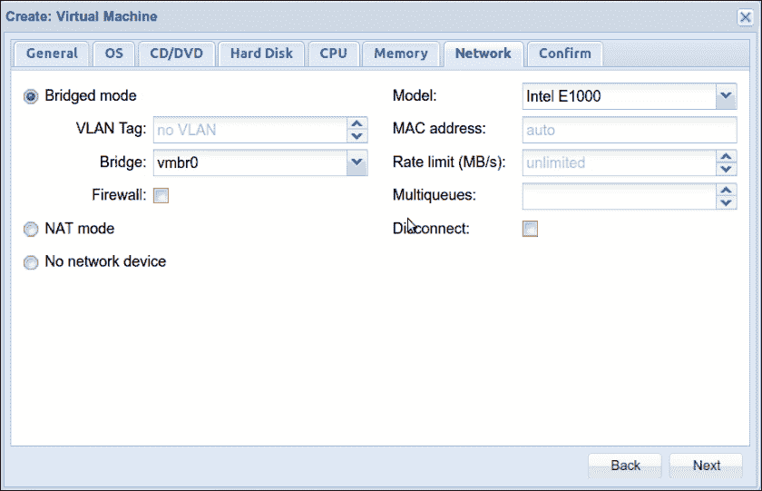

    如图所示，选择了**桥接模式**而不是**NAT 模式**。这一选择是故意做出的。在这种情况下，**NAT 模式**会阻止我们通过微软的远程桌面协议或远程服务器管理工具访问虚拟机的桌面。

    **桥接模式**提供了更多访问虚拟机的选择，因为它有点类似于将计算机连接到物理网络中的交换机。做出这个决策时需要考虑隔离性和安全性，尤其是在 Proxmox 防火墙禁用的情况下。

    ### 提示

    要了解有关 PVE 集成防火墙功能的更多信息，请访问 [`pve.proxmox.com/wiki/Proxmox_VE_Firewall#Enabling_firewall_for_qemu_guest_and_openvz_veth`](https://pve.proxmox.com/wiki/Proxmox_VE_Firewall#Enabling_firewall_for_qemu_guest_and_openvz_veth)。

    网络设置可以在虚拟机创建后随时重新配置。

    当**网络**选项卡配置到您满意的状态时，点击**下一步**以查看配置摘要并确认配置。

1.  最后一页标签为**确认**，提供了虚拟机配置的摘要，并可最终创建虚拟机。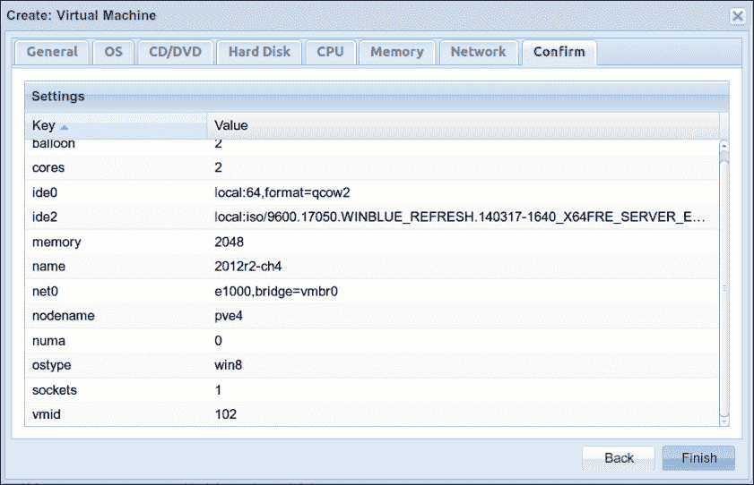

    点击**完成**按钮以确认配置并创建虚拟机，但您可以利用这个机会返回上一步并调整配置。

    请记住，许多这些设置即使在虚拟机创建和操作系统安装后仍可以更改，有时甚至无需重启计算机。

    在 30 秒内，新的虚拟机将在 Web 界面的左侧框架中出现。

    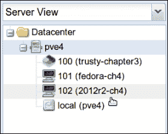

### 提示

**还有另一种方式**

请注意，在本章中，Windows Server 虚拟机的配置目的是为了让我们能够快速试用 Windows Server 虚拟化，使用的是 TechNet 试用版；该配置并未针对性能进行优化，因此不适合生产环境。理想情况下，在 Proxmox VE 中，生产就绪的 Windows Server 虚拟机应配置为利用半虚拟化技术；在 PVE 中，只需在两个选项卡上选择 **virtio**。在 **硬盘** 选项卡中，考虑选择 **virtio** 而不是 **IDE**；在 **网络** 选项卡中，考虑选择 **virtio** 而不是 Intel E1000。不过，这会让 Windows Server 的安装变得复杂，因为它不带有 virtio 驱动程序。因此，我们需要将驱动程序上传到 PVE 的 ISO 镜像，并在操作系统安装过程中早期就让 Windows Server 可用这些驱动。幸运的是，这一配置在 PVE 的维基中有详细文档，地址是 [`pve.proxmox.com/wiki/Windows_2012_guest_best_practices`](https://pve.proxmox.com/wiki/Windows_2012_guest_best_practices)。

### 提示

**下载示例代码**

您可以从 [`www.packtpub.com`](http://www.packtpub.com) 登录您的账户，下载本书的示例代码文件。如果您在其他地方购买了本书，可以访问 [`www.packtpub.com/support`](http://www.packtpub.com/support) 并注册以直接通过电子邮件获取文件。

您可以按照以下步骤下载代码文件：

1.  使用您的电子邮件地址和密码登录或注册我们的网站。

1.  将鼠标指针悬停在顶部的 **支持** 标签上。

1.  点击 **代码下载与勘误**。

1.  在 **搜索** 框中输入书名。

1.  选择您想要下载代码文件的书籍。

1.  从下拉菜单中选择您购买本书的地方。

1.  点击 **代码下载**。

### 提示

文件下载完成后，请确保使用最新版本的以下工具解压或提取文件夹：

+   WinRAR / 7-Zip for Windows

+   Zipeg / iZip / UnRarX for Mac

+   7-Zip / PeaZip for Linux

## 启动虚拟机并安装 Windows Server

在虚拟机配置好并可供使用后，在 web 界面的左上方的 **服务器视图** 中选择它。启动虚拟机就像之前描述的那样，简单地按下右侧面板上显示的启动按钮。

当虚拟机启动时，它的图标将从带黑屏的显示器变为带白屏的显示器。

要通过 noVNC 访问虚拟机的显示，点击 **控制台** 按钮；一个弹窗将会出现，允许您观看虚拟机从 Windows Server 2012r2 安装盘启动，并最终显示 **Windows 设置** 向导：

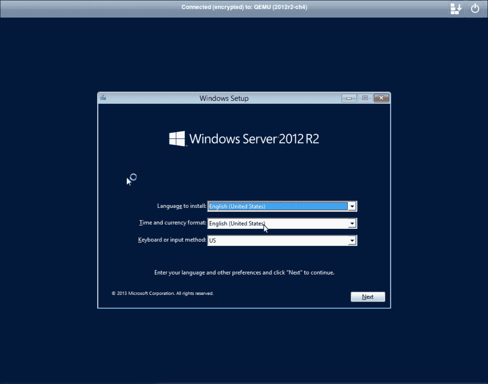

按照屏幕上的指示完成 Windows Server 2012r2 的安装和配置。

### 提示

支持安装此操作系统的资料可以在[`technet.microsoft.com/en-us/library/jj134246.aspx`](https://technet.microsoft.com/en-us/library/jj134246.aspx)查看。

一旦 Windows 安装对话框完成，安装将继续，机器将重启几次，直到准备好供用户登录。登录到服务器查看新的桌面。

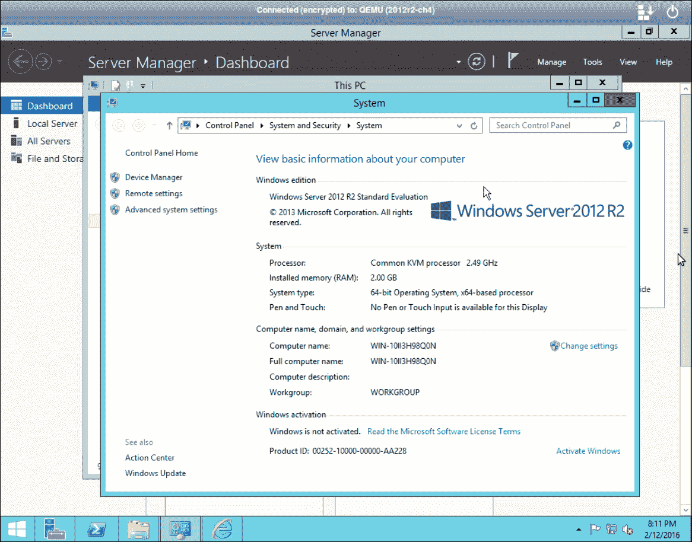

请注意，前面两张截图都有两个鼠标指针。一个是本地工作站的，另一个是通过 noVNC 访问的桌面的。这种情况比较尴尬且笨重。

### 提示

**noVNC**

noVNC 这个名字有些反直觉；事实上，noVNC 通过 VNC 协议提供远程桌面访问和桌面共享。

然而，noVNC 确实有所不同；它并不像通过配置客户端连接到运行 VNC 服务器的远程计算机，而是选择 noVNC 后，通过支持 HTML5 和 JavaScript 的浏览器弹出一个窗口，渲染由虚拟机提供的远程桌面。

有一个简单的解决方案，如果尚未启用，可以在虚拟机的**选项**标签中启用**使用平板电脑作为指针**：

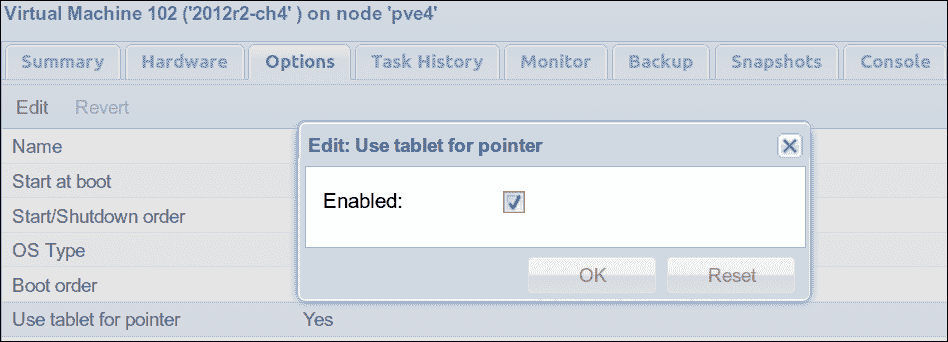

如果这样无法解决问题，请确保硬件标签上的**显示**字段设置为**默认**，而不是**SPICE**。

## 创建 Fedora 23 服务器虚拟机

在前面的章节中，我们详细介绍了用于 Windows Server 2012r2 的虚拟机配置。在本节中，我们将在之前的经验基础上，运用所学知识来构建一台运行 Fedora 23（服务器版）的服务器。创建这个虚拟机提供了一种简单的方式来练习使用虚拟网络接口卡和虚拟硬盘接口的准虚拟化。

1.  在[`www.tecmint.com/installation-of-fedora-23-server-and-administration-with-cockpit-tool/`](http://www.tecmint.com/installation-of-fedora-23-server-and-administration-with-cockpit-tool/)查看 Fedora 23 服务器的安装过程。

1.  从[`mirrors.rit.edu/fedora/fedora/linux/releases/23/Server/x86_64/iso/Fedora-Server-netinst-x86_64-23.iso`](http://mirrors.rit.edu/fedora/fedora/linux/releases/23/Server/x86_64/iso/Fedora-Server-netinst-x86_64-23.iso)下载 netinst ISO 文件。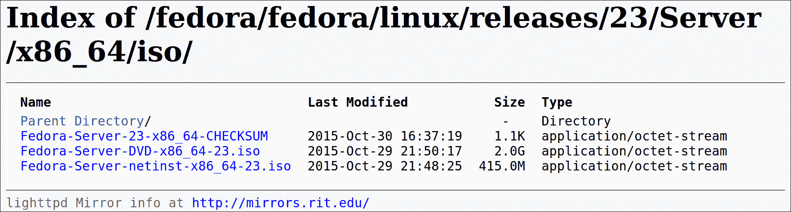

    下载 Fedora 23 的网络安装镜像

1.  登录 PVE 的 Web 界面。

1.  如前所述，将镜像上传到 PVE 的本地存储。

1.  点击**创建虚拟机**，就像我们为 Windows Server 2012r2 所做的那样。

1.  在**创建虚拟机**对话框的**常规**标签页中，给虚拟机取一个合适的名字；在以下截图中，使用了`fedora-ch4`，虚拟机被分配了 VM ID 101。接着进入**操作系统**标签页。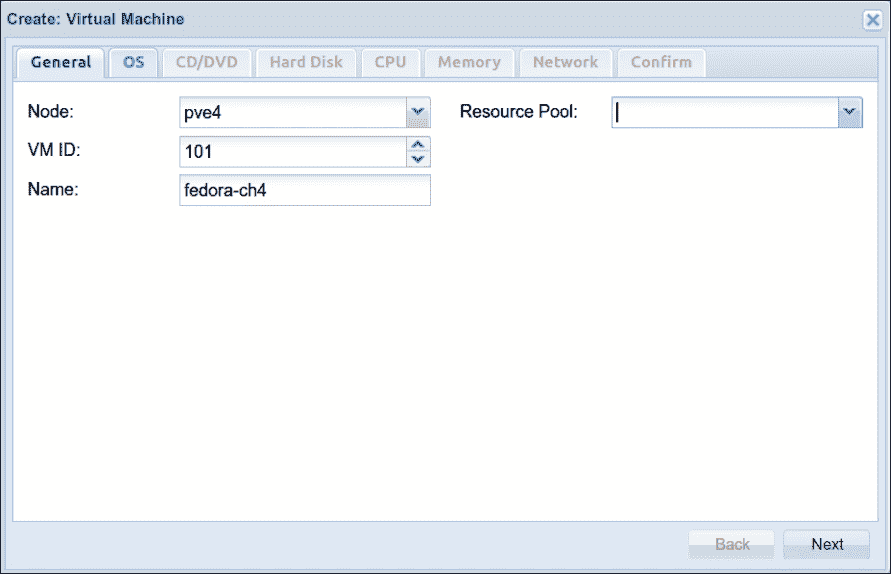

1.  在**操作系统**选项卡中，有四个选项不是针对 Microsoft Windows 的；对于 Fedora 23，选择**Linux 4.X/3.X/2.6 内核（I26）**单选按钮，然后继续进入**CD/DVD**选项卡。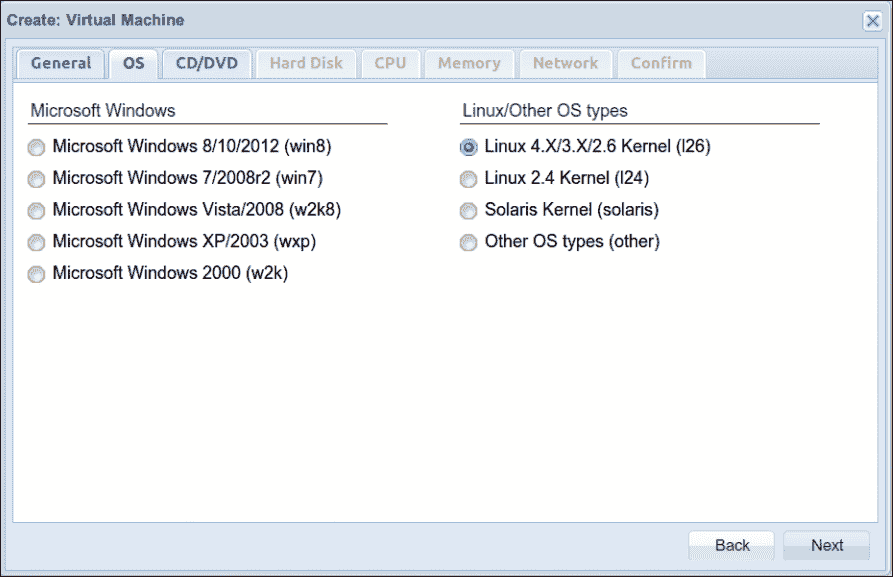

1.  在**CD/DVD**选项卡中选择第一个选项，选择**使用 CD/DVD 光盘镜像文件（iso）**单选按钮；在**存储**字段中选择**本地**，然后从**ISO 镜像**下拉菜单中选择在第 4 步上传的镜像文件：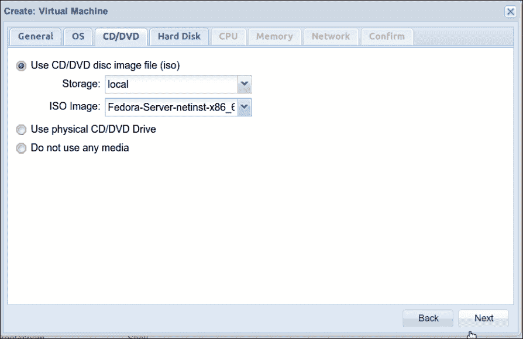

    在**CD/DVD**选项卡上选择 Fedora 安装磁盘

    进入**硬盘**选项卡，配置 Fedora Server 虚拟机的虚拟硬盘。

1.  在这台虚拟机上，我们将依赖半虚拟化来提高效率。在**硬盘**选项卡中，从**总线/设备**下拉菜单中选择**VIRTIO**。请注意，在下图中，**磁盘大小**字段已从默认的 32 GB 更改为 64 GB；请根据需要选择磁盘大小。完成后，继续进入**CPU**选项卡。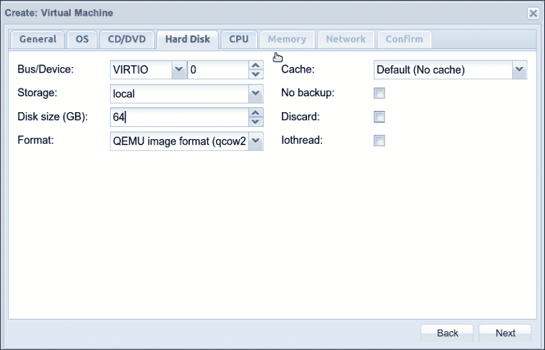

    配置虚拟磁盘

1.  我们将按照前面部分中创建 Windows Server 2012r2 虚拟机时的配置方式来配置**CPU**选项卡：分配 1 个插槽和 2 个核心，并在**类型**下拉菜单中选择**默认（KVM64）**。当**CPU**选项卡配置完成后，继续进入内存选项卡为虚拟机分配 RAM。

1.  在**内存**选项卡中根据需要调整。在下面的截图中，指定了一个固定大小的 1024 MB 内存。分配好内存后，继续进入**网络**选项卡。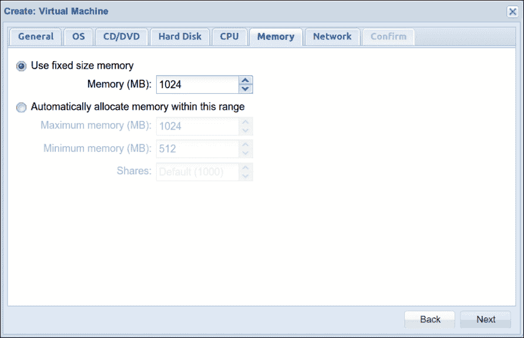

    在内存选项卡中为 Fedora 虚拟机分配 RAM

1.  在网络选项卡中，我们将配置 Fedora，使其可以被物理网络上的其他机器访问；就像我们为 Microsoft Server 所做的那样，选择**桥接模式**单选按钮。如果您的 PVE 主机只有一个网络接口，将**桥接**下拉菜单设置为`vmbr0`；否则，请根据需要选择一个适当的桥接。

    然后，在**网络**选项卡的右侧列中，选择**VirtIO（半虚拟化）**作为虚拟网络接口的**模型**。回顾一下，**Intel E1000**是我们最兼容的选择，而**virtio**则是性能最好的替代选项；这两者都被 Fedora Server 原生支持。

    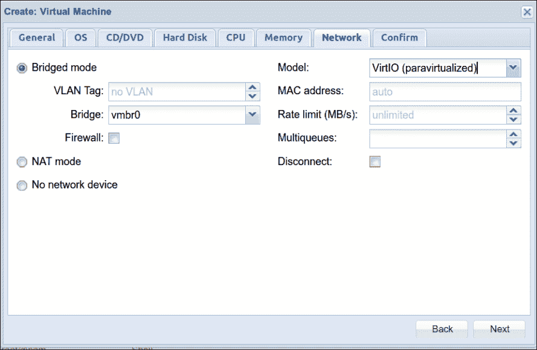

    在网络选项卡中配置桥接模式网络

    进入**确认**选项卡并提交虚拟机配置；在构建虚拟机之前，这是一个对配置进行自定义更改的好机会。

    ### 提示

    请记住，在整个过程中，除了虚拟硬盘的情况，其他所有分配的资源都可以稍后轻松更改。

1.  点击**完成**来创建虚拟机并关闭**创建：虚拟机**对话框。

    我们在上一节配置的 Windows Server 机器中使用了默认的显示选项。这是一个与 PVE 的 noVNC 控制台底层技术兼容的绝佳选项。

    但是，通过在 Windows Server 上安装额外的软件，我们本可以依赖 SPICE 来完成。

    ### 提示

    **SPICE**

    此选项在菜单中显示为**SPICE**（简单协议用于独立计算环境），但它指的是所依赖的 SPICE 协议，或者是依赖于一组 SPICE 组件的组合，包括安装在虚拟机上的客户工具以及安装在工作站上的 SPICE 客户端。我们可以从中推断出，使用 SPICE 需要一些安装后的工作。SPICE 是唯一一个明确使命是提供远程访问虚拟机的解决方案。此外，SPICE 客户端可用于移动设备和多个操作系统，并且该协议提供了许多实现和使用的选项。红帽是这一开源解决方案的当前开发者，并且它在其 KVM-QEMU 虚拟化平台中大力推广该解决方案。然而，spice-module 也集成到 Proxmox VE 中，用于与其自己的 KVM-QEMU 虚拟机一起使用。由于 Fedora Server 包含支持 SPICE 显示的相关软件，接下来我们来看看为此做准备的步骤。

1.  当 Fedora Server 虚拟机仍然处于停止状态时，选择它的**硬件**选项卡。

1.  双击**显示**配置；**编辑：显示**对话框会打开，显示一个名为**显卡**的下拉菜单。将选择从**默认**更改为**SPICE**，然后点击**确定**按钮：

    配置虚拟机以便使用 SPICE 控制台

    当你准备好安装 Fedora 23 Server 时，选择浏览器窗口左侧窗格中的虚拟机。

1.  选择后，启动虚拟机。点击控制台按钮旁边的箭头，以显示在 noVNC 和 SPICE 控制台之间的选择。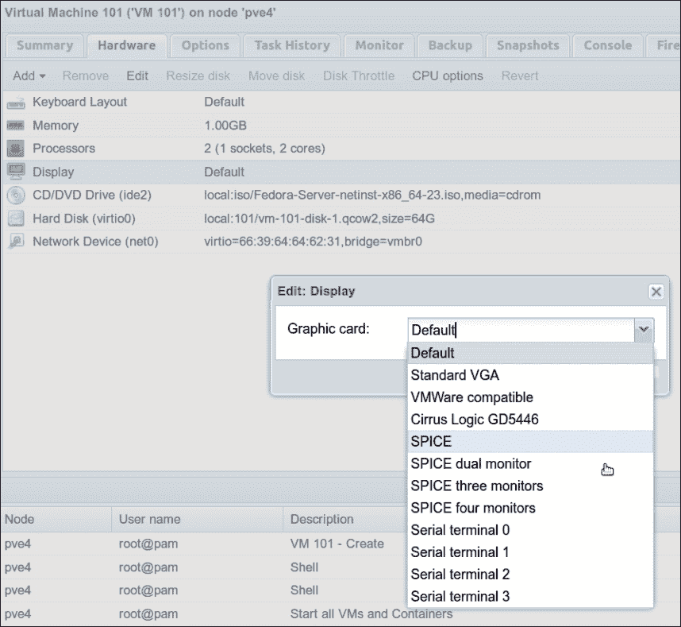

    选择 SPICE 控制台以访问正在运行的虚拟机

1.  选择**SPICE**以启动弹出控制台浏览器窗口。

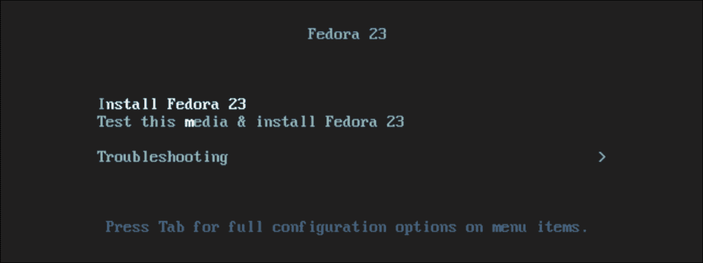

启动 Fedora 23 安装程序，使用 SPICE 控制台在虚拟机上进行安装

通过按 *i* 键或使用键盘上的上下光标键导航到**安装 Fedora 23**来继续安装。

大约 20 秒后，Fedora 23 的图形安装程序将开始询问配置问题，从选择安装语言开始，然后进入网络配置和主机名设置。最终，系统还会要求你设置 root 用户的密码并创建其他账户。

### 提示

如果你对新 Fedora 23 虚拟机的网络配置有疑问，请参阅*Fedora 23 网络指南*，[`docs.fedoraproject.org/en-US/Fedora/23/pdf/Networking_Guide/Fedora-23-Networking_Guide-en-US.pdf`](https://docs.fedoraproject.org/en-US/Fedora/23/pdf/Networking_Guide/Fedora-23-Networking_Guide-en-US.pdf)。

按照屏幕上的指示完成 Fedora 23 的安装。安装所需的时间取决于你分配的资源、网络连接的速度，以及你在初始 Fedora 23 配置过程中选择安装的包。

### 小贴士

**Fedora 23 Server 安装的支持**

可以在[`getfedora.org/en/server/`](https://getfedora.org/en/server/)找到 Fedora 23 Server 的功能。

官方 Fedora 23 Server 安装指南请访问[`docs.fedoraproject.org/en-US/Fedora/23/html/Installation_Guide/`](https://docs.fedoraproject.org/en-US/Fedora/23/html/Installation_Guide/)。

有关安装后的建议，请访问[`www.tecmint.com/things-to-do-after-fedora-23-installation/`](http://www.tecmint.com/things-to-do-after-fedora-23-installation/)。

## 命令行虚拟机创建

我们可以使用`qm`创建命令通过命令行创建 Proxmox VE 虚拟机。这对于命令行用户和寻求编写自动化解决方案的用户来说是一个福音。

以下 bash 脚本创建了一个虚拟机来运行 Fedora 23 Server：

```
    #!/bin/bash -ex
    # Creates a VM intended for Fedora 23 Server
     qm create 103 \
         -balloon 512 \
         -bootdisk virtio0 \
         -cores 2 \
         -ide2 local:iso/Fedora-Server-netinst-x86_64-23.iso,media=cdrom \
         -memory 1024 \
         -name fedora-server-ch4 \
         -net0 virtio,bridge=vmbr0 \
         -numa 0 \
         -ostype l26 \
         -sockets 1 \
         -virtio0 local:101/vm-101-disk-1.qcow2,size=32G \
         -vga qxl
```

### 小贴士

请参阅[`pve.proxmox.com/wiki/Manual:_qm`](https://pve.proxmox.com/wiki/Manual:_qm)了解更多关于如何通过 Proxmox VE 命令行界面创建虚拟机的信息。

# 概述

对于精明的管理员而言，在生产环境中将容器与虚拟机结合使用的能力提供了灵活性，并增加了职业判断和明智选择的机会。系统虚拟化在数据中心仍然具有很大的价值。

因此，我们以 Proxmox VE 的虚拟机创建和配置过程的高级概述开始了本章内容——从获取安装介质，到配置虚拟机，再到安装操作系统。

此后，我们将该抽象大纲应用于两个具体案例：创建 Microsoft Windows Server 2012r2 和 Fedora 23 Server 虚拟机。

在第五章《使用虚拟驱动器》中，你将学习到所有必要的知识，以便在确定最适合我们虚拟硬盘的格式时做出明智的选择。

我们将特别关注如何在新的 Proxmox 虚拟环境中使用 Oracle 的 VirtualBox、VMware Player 和 VMware Workstation 创建的虚拟机。

在将某些本不为我们的场景设计的东西重新利用时，总会有一种满足感。

让我们接下来体验一下这种兴奋感。
