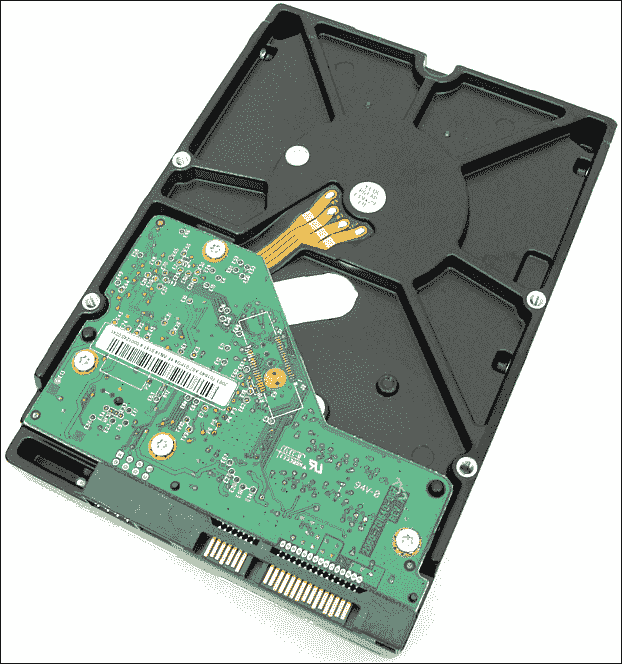
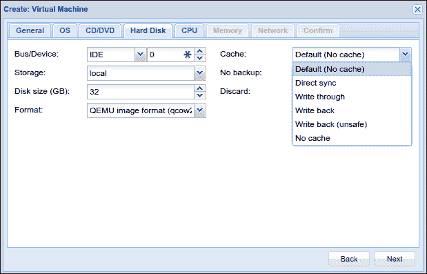

# 第五章：使用虚拟磁盘

第四章，*创建虚拟机*，介绍了使用 Proxmox VE 管理界面和命令行创建虚拟机的方法。在概述了常见的操作步骤后，我们迅速浏览了如何创建两台运行不同网络操作系统的虚拟机：**Windows Server 2012r2** 和 **Fedora 23 Server**。

本章的最基本目标是使我们能够根据虚拟机的具体使用案例，做出更多信息充分且经过深思熟虑的决策，从而影响 Proxmox VE 虚拟机客户机的效率和可靠性。

我们将通过实现以下具体目标来完成这一任务：

+   从 Proxmox VE 界面中可用的虚拟磁盘映像格式中，故意选择合适的格式

+   选择虚拟磁盘连接到来宾的合适总线/接口

+   根据我们的使用案例选择合适的缓存设置

在本章中，我们将详细介绍一个关键的虚拟机组件，它可能是最有价值的：提供**二级存储**的**虚拟磁盘**。

然后，我们将回顾虚拟机创建过程，详细阐述在第四章，*创建虚拟机*中略过的具体选项：

+   选择虚拟磁盘格式

+   选择接口

+   选择缓存选项

# 理解虚拟磁盘

本节首先关注我们应该熟悉的术语，以便进一步理解虚拟磁盘。

在我们达成术语共识后，将探讨在第四章，*创建虚拟机* 中看到但没有深入探讨的虚拟磁盘配置选项：虚拟磁盘映像格式、总线/接口选项和磁盘**缓存**选项。

## 理解术语

二级存储对虚拟机的作用与对物理计算机的重要性一样。虽然**硬盘驱动器**（**HDDs**）在个人电脑中并不是最昂贵的硬件，但我们可以有力地论证，硬盘是最有价值的硬件，因为我们依赖它们来存储和提供对我们数据的访问，而这些数据往往是我们辛勤工作所收获的独特成果。

本章中，“虚拟磁盘”一词将指代一个文件或一组文件，这些文件对虚拟机来说代表一个硬盘驱动器，并且行为方式与物理计算机上的硬盘驱动器或**固态硬盘**（**SSD**）相同。

物理硬盘驱动器和虚拟磁盘之间的相似性如下，正如你可能预料的那样：

+   相同的文件系统选项

+   管理员需要对分区和分区表有相同的深入理解，并能熟练使用与物理机器上相同的分区编辑工具

+   相同的格式化程序和选项

+   支持 LVM

然而，必须明确指出显著的差异。物理硬盘驱动器单元不仅仅包括存储数据的介质。

HDD 的介质部分由一叠双面物理盘片组成，这些盘片围绕一个公共主轴在真空密封结构内旋转。

真空密封内还包含读取和写入盘片数据的物理机械装置。它包括一个机械臂，用于将读/写头移动到盘片的特定位置。

虚拟磁盘具有存储容量，并且可以像硬盘一样进行读写；然而，介质仅仅是主机上的一个文件或一系列文件，这些文件使用与 Proxmox VE 兼容的三种磁盘映像格式之一：**QCOW2**、**RAW**和**VMDK**。

### 提示

当使用 iSCSI 共享存储时，提供了第四种选择：作为 LVM 分区的 RAW 格式。在本节中，我们仅讨论 RAW、qcow2 和 VMDK 映像。

如你稍后将学到的那样，Proxmox VE 管理界面明确支持的三种虚拟磁盘映像格式各自提供了略有不同的优缺点。对我们而言，这提供了更大的灵活性。

例如，除了管理员用于确保主机和客户数据安全完整性的备份方法外，备份或快照一个或多个虚拟机的状态也可以是一个简单的操作。将映像恢复到先前的状态也同样简单。

虚拟磁盘和硬盘驱动器之间的另一个区别在于总线，即主板与磁盘之间的接口，它是物理地集成在硬盘单元中的。

在 Proxmox VE 虚拟机上，这一过程处理得非常不同，你可以根据对特定虚拟机的偏好选择用于与虚拟磁盘通信的总线类型。

因此，总线根本不属于虚拟磁盘映像的一部分；它是虚拟机配置的一部分。在 Proxmox VE 中，可以通过一个简单的下拉框选择总线类型。

物理硬盘驱动器的另一个子组件——缓存子系统（或更准确地说，*磁盘缓冲区*）在虚拟磁盘中没有表现出来。缓存旨在加速数据的检索，它与总线接口一样，构成了虚拟机配置的一部分，而不是虚拟磁盘的一部分。

可视化带有 SATA 接口和磁盘缓冲区的硬盘控制板

在这一节中，我们确定了*虚拟磁盘*将用于描述作为虚拟机二级存储设备的文件或文件组。此外，我们阐明了物理硬盘和虚拟硬盘之间的相似性。然后，我们对比了硬盘驱动器的物理组件以及 Proxmox VE 如何通过虚拟化抽象这些组件。

Proxmox VE 的配置过程完全将存储介质与总线和磁盘缓存或磁盘缓冲区分离，这让我们可以更慎重地选择虚拟磁盘镜像格式、总线和缓存的组合。

剩下的子部分阐明了我们通过 Proxmox VE 可以选择的每种镜像格式、总线选项和磁盘缓存选项的特点。

## 理解虚拟磁盘配置

回顾一下第四章，*创建虚拟机*中提到，我们通过点击页面顶部的 **创建虚拟机** 按钮，并逐步完成新虚拟机的配置选项，从 Proxmox VE 界面创建了新虚拟机。

关于配置对话框中的第四个标签，**硬盘**，第四章，*创建虚拟机*将其关注点限制为定义虚拟磁盘的大小。

创建虚拟机对话框中的硬盘标签

在本节中，我们详细说明了可以通过 **硬盘** 标签定义的三个额外特性：

+   虚拟磁盘格式

+   总线/设备（接口）

+   缓存（磁盘缓冲区）

每种配置选项至少有三个可用的选择，让我们来探讨一下你的选择如何影响性能和功能。

### 选择虚拟磁盘格式

根据《*精通 Proxmox*》，Proxmox VE 优选的虚拟磁盘镜像格式是 RAW。然而，它也支持 KVM 的 `qcow2` 格式以及与 VMware 产品常见的 VMDK 镜像。

### 提示

要了解更多关于镜像格式及其操作的信息，请访问 [`en.wikibooks.org/wiki/QEMU/Images`](https://en.wikibooks.org/wiki/QEMU/Images)。

#### QCOW2

QCOW2 是 QEMU 写时复制（copy-on-write）镜像格式的第二个版本。由于 Proxmox VE 依赖 KVM-QEMU 提供虚拟机功能，QCOW2 是其原生和默认格式。

正如其名称所示，这种格式支持 **写时复制**。这一特性允许虚拟机将对基础镜像所做的更改存储在一个单独的 QCOW2 文件中。新 QCOW2 文件的元数据（关于数据的数据）包括例如指向基础镜像的路径。

当虚拟机试图检索数据时，它首先检查新镜像中是否能够找到特定的数据；如果新镜像中没有该数据，它将从元数据所指向的基础镜像中检索该数据。

### 注意

要了解更多关于 QCOW2 镜像结构的信息，请访问 [`people.gnome.org/~markmc/qcow-image-format.html`](https://people.gnome.org/~markmc/qcow-image-format.html)。

QCOW2 镜像还会根据需要增长（**精简配置**），这一特点使其与 RAW 镜像区分开来，后者在创建时会立即为所请求的所有空间分配文件（**厚配置**）。

因此，尽管主机的文件系统不支持稀疏文件，QCOW2 图像在几乎所有情况下都会比 RAW 图像小。然而，由于 RAW 图像不需要随着数据写入而增长，并且不依赖于中介软件层，它将具有更好的吞吐量。

然而，我们应该注意到，如果 PVE 拥有大量高速内存，并且运行在最新的 SSD 驱动器上而不是传统硬盘上，那么 RAW 图像与 QCOW2 图像之间的吞吐量差异将不太明显。在我们继续探索图像类型时，请记住，随着硬件价格的不断下降，新硬件可能对性能产生的影响。

### 注意

稀疏文件是指当文件大部分为空时，尝试更高效地利用文件系统空间的文件。通过将表示空块的元数据写入磁盘，而不是写入实际空白空间来实现这一点，从而减少了磁盘空间的使用。只有当块包含实际数据时，才会以其实际大小将完整的块大小写入磁盘（[`en.wikipedia.org/wiki/Sparse_file`](https://en.wikipedia.org/wiki/Sparse_file)）。要查看支持稀疏文件的文件系统列表，请访问 [`en.wikipedia.org/wiki/Comparison_of_file_systems#Allocation_and_layout_policies`](https://en.wikipedia.org/wiki/Comparison_of_file_systems#Allocation_and_layout_policies)。

QCOW2 的快照和临时快照支持允许图像包含来自图像历史中多个时刻的多个快照。

临时快照会存储更改，直到虚拟机关闭，此时快照将被丢弃。与此相比，标准快照允许我们返回图像历史中的先前状态。

### 注意

要了解更多关于 Proxmox VE 中 QCOW2 快照的内容，请访问他们的 Wiki 页面：[`pve.proxmox.com/wiki/Live_Snapshots`](https://pve.proxmox.com/wiki/Live_Snapshots)。有关 QCOW2 快照支持背后的机制的更多信息，请访问 [`kashyapc.fedorapeople.org/virt/lc-2012/snapshots-handout.html`](https://kashyapc.fedorapeople.org/virt/lc-2012/snapshots-handout.html)。

#### RAW

RAW 和 QCOW2 是在 Proxmox VE 论坛中讨论的最受支持的两种格式。

与 QCOW2 和 VMDK 图像相比，RAW 虚拟磁盘相对简单；并且与 Proxmox VE 支持的其他格式不同，RAW 不依赖于中介软件层。

因此，RAW 是一个更高效的选项，特别是在虚拟机性能至关重要时，应该给予充分考虑——特别是在 LVM 上使用 RAW。

此外，RAW 图像可以直接并简便地挂载到 Proxmox VE 主机上进行直接操作，而无需通过来宾访问。

### 提示

**挂载 RAW 文件**为了完成此过程，建议访问[`equivocation.org/node/107`](http://equivocation.org/node/107)或[`forensicswiki.org/wiki/Mounting_Disk_Images#To_mount_a_disk_image_on_Linux`](http://forensicswiki.org/wiki/Mounting_Disk_Images#To_mount_a_disk_image_on_Linux)；这两个页面都建议使用`kpartx`工具，该工具在 Debian 默认仓库中可用。

然而，与 QCOW2 映像不同，RAW 映像的功能较为简单；没有固有的快照支持，没有薄配置，等等。它们由原始数据组成，逐扇区构建，直到达到其固定容量。

*性能*，因此，RAW 映像作为虚拟磁盘的真正优势；如果你依赖的是机械硬盘而非固态硬盘，并且可靠、迅捷的性能至关重要，例如在数据库服务器中，那么请选择 RAW，并放弃 QCOW2 提供的丰富功能集。

尽管为积累虚拟机客户预分配存储可能对资源造成不必要的压力，但请记住，RAW 虚拟磁盘也可以调整大小。

与 QCOW2 类似，只有部分调整大小过程可以通过 Proxmox VE 管理界面完成。

### 注意

调整 RAW 和 QCOW2 映像大小的过程已在 Proxmox VE wiki 页面上记录，网址为[`pve.proxmox.com/wiki/Resizing_disks#Enlarge_the_virtual_disk.28s.29_in_Proxmox`](https://pve.proxmox.com/wiki/Resizing_disks#Enlarge_the_virtual_disk.28s.29_in_Proxmox)。

#### VMDK

**虚拟机磁盘**（**VMDK**）是 VMware 虚拟化产品首选的虚拟磁盘格式。尽管如此，该格式随后被开放给其他开发者和供应商，并且已成为一个广泛支持的流行虚拟磁盘格式。

尽管 KVM-QEMU 目前支持该格式的 3、4 和 6 版本，并且 Proxmox VE 可以创建带有 VMDK 映像的虚拟机，但建议 PVE 用户在条件允许的情况下依赖 QEMU 原生格式——QCOW2 和 RAW。

然而，实际上，情况并不总是理想的；所以在我们讨论总线类型之前，让我们先触及几个与 VMDK 虚拟磁盘相关的要点。

与 QCOW2 一样，VMDK 是一种复杂的格式，具有丰富的功能集（事实上，它有四种子格式）。

例如，VMDK 格式支持薄配置和厚配置。薄 VMDK 映像，与其 QCOW2 对应物一样，比预分配的或厚配置的 VMDK 映像更慢。正如我们所料，它们显著更小。

同样，VMDK 和 QCOW2 格式都支持多个快照，使管理员能够将虚拟机恢复到先前的状态。

尽管该格式功能丰富，但 Proxmox VE 界面并未支持其所有功能，即使底层虚拟化层能够处理它们。

例如，VMDK 格式包括一个子格式，将虚拟磁盘分割成 2GB 的块，本质上是为了支持移动性。Proxmox VE 不支持该子格式。

尽管 Proxmox VE 确实邀请我们使用 VMDK 镜像创建虚拟机，但尽可能依赖于 QCOW2 和 RAW 虚拟磁盘格式：

+   假设你的 PVE 是基于传统硬盘驱动器构建的，RAW 格式对于数据库应用程序来说是理想的选择，因为它具有性能优势。

+   QCOW2 提供了一个非常强大的功能集，但如果不依赖于 SSD 存储，它可能会以牺牲性能为代价。此外，QCOW2 在使用硬件资源方面更加保守。

如果你继承了一个 VMDK 格式的虚拟磁盘，可以使用 `qemu-img` 命令将其转换为 QCOW2 或 RAW 格式。

另一方面，如果你正在创建一个 Proxmox VE，VMDK 格式的使用应仅限于非常特定和有目的的边缘情况。

### 提示

`qemu-img` 命令的完整文档可以在网上查阅，网址为 [`www.suse.com/documentation/sles11/book_kvm/data/cha_qemu_guest_inst_qemu-img.html`](https://www.suse.com/documentation/sles11/book_kvm/data/cha_qemu_guest_inst_qemu-img.html)（SUSE）和 [`docs.fedoraproject.org/en-US/Fedora/18/html/Virtualization_Administration_Guide/sect-Virtualization-Tips_and_tricks-Using_qemu_img.html`](https://docs.fedoraproject.org/en-US/Fedora/18/html/Virtualization_Administration_Guide/sect-Virtualization-Tips_and_tricks-Using_qemu_img.html)（Fedora）。简洁但全面的 GNU/Linux 主页面可以在 [`linux.die.net/man/1/qemu-img`](http://linux.die.net/man/1/qemu-img) 查阅。

### 选择一个总线

除了 **格式** 选项外，**创建虚拟机** 对话框的 **硬盘** 标签还提供了一个下拉菜单，供你选择与虚拟磁盘接口的 **总线/设备**。

如图所示，提供了四个选项：

+   **IDE**

+   **SATA**

+   **VIRTIO**

+   **SCSI**

总线/设备选项

### 注意

请注意，除了 I/O 性能外，虚拟的 SATA、IDE 和 SCSI 总线的特性将与它们的物理对应物相同。有关每个总线的详细信息，请访问 Wikipedia：**SATA**：[`en.wikipedia.org/wiki/Serial_ATA`](https://en.wikipedia.org/wiki/Serial_ATA) **IDE/PATA**：[`en.wikipedia.org/wiki/Parallel_ATA`](https://en.wikipedia.org/wiki/Parallel_ATA) **SCSI**：[`en.wikipedia.org/wiki/SCSI`](https://en.wikipedia.org/wiki/SCSI)

在四个选项中，有两个是作为对遗留系统兼容性的便利支持：**IDE** 和 **SCSI**。（因此，IDE 是对话框的默认选项。）

**SATA** 选项更为常用，其行为符合 SATA 接口的预期——但有一个重要的例外：**SATA** 选项并不会提供比 **IDE** 更高的性能。

在这种情况下，I/O 性能几乎完全取决于主机的硬件配置。虚拟机的读写速度将无法超出物理硬件允许的范围。

由于无法克服主机硬件 I/O 性能的限制，KVM-QEMU 解决的是虚拟化过程中的开销，这是影响性能的另一个因素。

KVM-QEMU 提供了一种名为 **virtio** 的 paravirtualization 解决方案，使客户机和虚拟机监控器能够在没有虚拟化开销的情况下更加协同和高效地工作。

### 注意

**Paravirtualization** 是指那些知道自己运行在虚拟机中的软件组件。在我们的案例中，KVM-QEMU 虚拟机的 virtio 驱动程序会直接与 Proxmox VE 主机通信。

典型的 paravirtualized 驱动程序，virtio 驱动程序经过优化，能够与 Proxmox VE 共享队列、缓冲区和其他数据，从而提高吞吐量并减少延迟（vTerminology: 关键虚拟化术语指南可参见 [`www.globalknowledge.com`](http://www.globalknowledge.com)）。

我们将在 第六章，*与 Proxmox VE 的网络* 章节中再次讨论 virtio 驱动程序在网络接口中的应用。

这个解决方案，**VIRTIO**，是唯一会影响虚拟机 I/O 性能的 **总线/设备** 选项。

要利用客户机的 virtio 设备，必须为客户机操作系统提供驱动程序。正如 Proxmox VE 的 Wiki 页面所指出的那样，最近的 Linux 内核已经包含了 virtio 驱动程序；因此，任何运行在 Proxmox VE 虚拟机上的现代 GNU/Linux 发行版“应该能够识别由 KVM 虚拟机监控器暴露的 virtio 设备”（[`pve.proxmox.com/wiki/Windows_VirtIO_Drivers`](https://pve.proxmox.com/wiki/Windows_VirtIO_Drivers)）。

因此，运行 GNU/Linux 的虚拟机客户机无需任何额外的显式配置步骤。

运行微软 Windows 操作系统的虚拟机客户机需要安装签名驱动程序，才能识别 virtio 设备。如你所料，这里有个问题，因为操作系统安装过程需要设备驱动程序才能识别并安装到虚拟磁盘。

我们可以采用多种策略来克服这个问题。

### 提示

有关微软操作系统和 virtio 设备的更多信息，请访问 [`pve.proxmox.com/wiki/Windows_VirtIO_Drivers`](https://pve.proxmox.com/wiki/Windows_VirtIO_Drivers)。

本小节重点强调了由 KVM-QEMU 提供的 virtio paravirtualization 所带来的性能提升。

总结来说，我们唯一不应该使用 virtio paravirtualization 的情况是当目标操作系统没有相应的驱动程序时。由于 virtio 可以显著提高 I/O 吞吐量，并减轻与完全虚拟化相关的一些开销，因此只要现实可行，我们应该在任何时候依赖 virtio。

然而，我们需要记住，IDE 和 SCSI 也是可行的总线替代方案，但主要是为了兼容性和灵活性，提供给旧设备使用。SATA 目前已经具有显著的流通性，因此如果环境不允许你利用 virtio 解决方案，它仍然是一个可行的替代方案。

### 提示

还有一种情况是 virtio 准虚拟化不可行：当虚拟机从物理机器转换过来，需要安装驱动程序后才能重启并依赖 virtio。

下一小节将重点介绍可用于 Proxmox VE 虚拟机的五种磁盘缓存/缓冲选项。

### 理解缓存选项

**硬盘**选项卡中的**创建：虚拟机**对话框包含一个标有**缓存**的字段，该字段接受五个不同的值：

+   **默认（无缓存）**

+   **直接同步**

+   **写穿**

+   **回写**

+   **回写（不安全）**

本质上，所选设置决定了如何处理硬盘缓冲区的抽象。使用 Proxmox VE 时，缓存的选择已被证明对 I/O 性能有显著影响。

Proxmox VE 缓存选项

在阐明磁盘缓冲区功能的基础上，本节将简要探讨优化虚拟机性能的建议。

在物理硬盘上，磁盘缓冲区是位于真空密封硬盘外壳之外、控制板上的一种内存。现代硬盘驱动器的磁盘缓冲区在 16MB 到 128MB 之间。（以目前市场上的硬盘为例，Western Digital 的 Black 系列硬盘具有 32MB 或 64MB 的缓存，具体取决于型号。）

这个缓存的作用主要是按顺序执行磁盘写入，以达到最佳性能，并以战略性的方式管理和执行来自客户端（如 CPU 或操作系统）的读请求。

换句话说，当我们记住将物理硬盘连接到主板的总线速度与硬盘盘片的旋转速度以及读/写磁头的机械运动速度通常不同的时候，缓冲区会在数据从磁盘读取后先将其存储，再发送到客户端；它同样将待写入磁盘的数据存储起来，直到实际的磁盘写入操作能够执行。数据的组织工作由缓冲区和硬盘的处理器负责，以便数据能够尽可能高效地到达目标。

尽管这个解释可能是准确的，但它缺乏具体性。《Linux 系统管理员指南》提供了更具体的解释（[`www.tldp.org/LDP/sag/html/buffer-cache.html`](http://www.tldp.org/LDP/sag/html/buffer-cache.html)）：

> *从磁盘读取非常缓慢，相较于访问（真实）内存。此外，通常在相对较短的时间内多次读取磁盘的同一部分。例如，一个人可能首先读取一封电子邮件，然后在回复时将信件读取到编辑器中，再在将其复制到文件夹时让邮件程序再次读取它。或者，考虑到在有多个用户的系统上，命令 ls 可能会被频繁运行。通过只从磁盘读取信息一次，然后将其保存在内存中直到不再需要，就可以加速除了第一次读取之外的所有操作。这被称为磁盘缓冲，所使用的内存称为缓冲缓存。*

我们必须从五种缓存选项中选择，以定义 Proxmox VE 虚拟机：默认选项是**无缓存**。以下是可用的替代选项：

+   直接同步

+   写透

+   回写

+   回写（不安全）

### 注意

在[`simple.wikipedia.org/wiki/Cache#Caches_for_writing`](https://simple.wikipedia.org/wiki/Cache#Caches_for_writing)提供了关于写入缓存（write-through）和回写缓存（write-back）之间非常清晰、简洁的一般性区分。

### 提示

**回写**是 KVM-QEMU 的默认模式；注意，Proxmox VE 的默认模式则是**无缓存**。

尽管这些资源按相关性从最到最不相关的顺序排列，但每个资源都提供了有帮助的视角，并且正是因为我们依赖这三者中的所有内容，才能开始构思每种模式的使用案例。以下列表提供了描述这些模式的资源。

+   [`access.redhat.com/documentation/en-US/Red_Hat_Enterprise_Linux/7/html/Virtualization_Tuning_and_Optimization_Guide/sect-Virtualization_Tuning_Optimization_Guide-BlockIO-Caching.html`](https://access.redhat.com/documentation/en-US/Red_Hat_Enterprise_Linux/7/html/Virtualization_Tuning_and_Optimization_Guide/sect-Virtualization_Tuning_Optimization_Guide-BlockIO-Caching.html)：来自*Red Hat 的虚拟化调优与优化指南*。

+   [`www.suse.com/documentation/sles11/book_kvm/data/sect1_1_chapter_book_kvm.html`](https://www.suse.com/documentation/sles11/book_kvm/data/sect1_1_chapter_book_kvm.html)：来自*SUSE 的虚拟化与 KVM*。

+   [`www-01.ibm.com/support/knowledgecenter/linuxonibm/liaat/liaatbpkvmguestcache.htm`](https://www-01.ibm.com/support/knowledgecenter/linuxonibm/liaat/liaatbpkvmguestcache.htm)：来自*IBM 系统上的 Linux*。

为了评估性能，我们需要一致的案例或对每种缓存模式、总线和虚拟磁盘格式组合的结构化性能比较。

网上发布的最全面且视觉效果最强的结果可以在[`jrs-s.net/2013/05/17/kvm-io-benchmarking/`](http://jrs-s.net/2013/05/17/kvm-io-benchmarking/)（由 Jim Salter，2013 年）和[`www.ilsistemista.net/index.php/virtualization/11-kvm-io-slowness-on-rhel-6.html`](http://www.ilsistemista.net/index.php/virtualization/11-kvm-io-slowness-on-rhel-6.html)（由 Ginatan Dante，2011 年）中找到。

### 提示

具体针对 Proxmox VE 的额外基准测试结果发布在[`i51.tinypic.com/158bcl4.gif`](http://i51.tinypic.com/158bcl4.gif)；然而，结果发布时没有提供方法论、版本、日期或来源信息。

这些 2011 年和 2013 年的研究中提供的基准测试结果是一个有益的起点，但与 KVM 最佳实践声明有显著冲突。

这些研究结果有时会产生共鸣，但也可能与 Proxmox VE 或 KVM 的最佳 I/O 性能建议和网络上的推荐相冲突。

+   前述研究支持在有可能的情况下，选择 virtio 虚拟化总线作为首选总线，只要为客户操作系统提供了驱动程序。

+   通常，缓存会增加冗余数据和总线流量，最终会对性能产生负面影响。为了获得最佳效果，对于 RAW 镜像请选择**无缓存**，并避免使用**Directsync**和**Write Through**缓存选项，尤其是在使用 ZFS 文件系统和 RAID 阵列作为主要存储时，除非在特殊情况下。

+   RAW 格式在 Proxmox VE 中的三种格式中被广泛认为提供最佳性能；然而，这要以 QCOW2 镜像所提供的丰富功能为代价。应当权衡功能集的优势与 RAW 性能之间的关系，特别是在选择**无缓存**并结合**VIRTIO**的情况下。如果你依赖于固态存储，RAW 和 QCOW2 之间的性能差异大部分将变得不可察觉。

+   来自 Proxmox VE 用户社区的共识是，在 Proxmox VE 中使用 VMDK 磁盘镜像创建虚拟机没有实际的好处。

### 小贴士

Proxmox VE 和 KVM-QEMU 最佳实践资源

[`pve.proxmox.com/wiki/Performance_Tweaks`](https://pve.proxmox.com/wiki/Performance_Tweaks)

[`www.ilsistemista.net/index.php/virtualization/23-kvm-storage-performance-and-cache-settings-on-red-hat-enterprise-linux-62.html?start=2`](http://www.ilsistemista.net/index.php/virtualization/23-kvm-storage-performance-and-cache-settings-on-red-hat-enterprise-linux-62.html?start=2)

[`www.linux-kvm.org/page/Tuning_KVM`](http://www.linux-kvm.org/page/Tuning_KVM)

本节的结束标志着我们达成了几个目标，这些目标是章节开头提出的：

+   我们有资源做出关于 Proxmox VE 虚拟机客户机的适当总线/接口选择。

+   我们现在可以通过 Proxmox VE 界面从可用的虚拟磁盘镜像格式中有意识地选择，并在需要时进一步寻求支持。

# 了解更多

如果本章传达了任何明确的信息，那就是：优化 Proxmox VE 中虚拟机的 I/O 性能需要仔细考虑并组合三大组件，每个组件都有丰富的选项——将虚拟机调整为最佳性能，并具备你需要的功能是一个复杂的平衡工作。

因此，这里提供了一些有用的资源列表，以便我们每个人都可以根据具体需求获取更多的信息。前两本资源书籍有丰富的虚拟磁盘章节。第三本书籍是正在进行中的工作，专门致力于虚拟磁盘文档：

+   *动手虚拟计算*，Ted Simpson，Cengage

+   *从桌面到企业的虚拟化*，Chris Wolf，Apress

+   *Linux 系统管理员虚拟磁盘指南：从基础到高级*，Tim Bielawa，[`lnx.cx/docs/vdg/output/Virtual-Disk-Operations.pdf`](http://lnx.cx/docs/vdg/output/Virtual-Disk-Operations.pdf)。

# 总结

本章的目的是在 Proxmox VE 虚拟机客户机的背景下理解虚拟磁盘（本章没有涉及与容器客户机相关的内容）。

通过专注于 Proxmox VE 及其底层虚拟化技术如何处理物理硬盘驱动器组件的抽象：存储介质、总线接口和磁盘缓冲区，我们完成了一项艰难的任务。

在我们的工作过程中，我们努力理解并能够清晰表达出，在确定磁盘格式、总线和磁盘缓冲区偏好时，我们所做的选择如何显著影响特性和 I/O 性能。

从最基本的层面来看，我们认识到，虚拟机的 I/O 能力不会超过物理主机硬件所允许的能力。然而，你也学到了，通过依赖半虚拟化驱动程序，你可以最小化虚拟化对 I/O 性能的开销。

总结来说，你了解到我们关于虚拟磁盘配置的决策，取决于我们如何回答一些基本问题：

+   你目前已有的哪些硬件会影响 I/O 性能？

+   虚拟机所服务的应用程序和/或数据库的性能需求是什么？

+   你应该利用虚拟磁盘格式的哪些特性？哪些冗余特性可以通过你数据中心的其他技术来提供？

+   操作系统和应用程序和/或数据库的容量需求是什么？

+   管理员已经熟悉并愿意支持哪些方面的文件系统、虚拟化一般知识和虚拟磁盘特别知识？

+   关于文件系统和总线驱动程序，操作系统有哪些关注点和要求？

在下一章，我们将继续基于你在第四章，*创建虚拟机* 中学到的内容，重点讲解 Proxmox VE 网络模型的创建。为此，我们将依赖之前学到的 TCP/IP 局域网网络、交换机和子网的知识。

它将是我们向理解 Proxmox VE 和虚拟化安全过渡的一个重要章节。

让我们连接节点，搭建桥梁吧！
