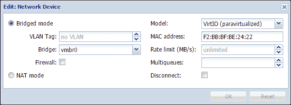
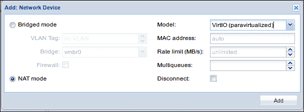

# 第六章：与 Proxmox VE 的网络配置

在第五章《管理虚拟磁盘》中，我们讨论了虚拟化中最灵活、也是最复杂的组件之一：二级存储。它的灵活性和相应的复杂性来自于我们对性能的关注，并调整 I/O 吞吐量，以便在这种虚拟化方式带来的开销面前尽可能做到最好。

本章同样关注优化 I/O 吞吐量的另一个机会：*虚拟机的 vNIC 配置*。

由于 vNIC 优化涉及协调较少的活动部件，我们将利用这个机会在更广泛的背景下讨论 Proxmox VE 的网络配置——不仅限于虚拟机的优化，还包括包含 Proxmox VE 来宾和主机的网络设计。

在整个过程中，我们将（努力）保持一致的焦点，集中讨论 Proxmox VE 的网络模型以及该模型为我们打开的各种可能性。我们将详细讨论这一主题，以激发企业网络部署的可能性。同时，我们将演示一些在小型办公室环境中更符合我们硬件的配置。

我们将按以下方式进行：

+   Proxmox VE 网络模型

+   配置虚拟机来宾

# Proxmox VE 网络模型

本节提供 Proxmox VE 网络模型的高级概述。它涵盖了与 Proxmox VE 来宾和主机相关的主题。

在 Proxmox VE 4.0 中，支持两种基本的来宾网络配置：

+   桥接

+   使用 NAT 进行伪装

以下小节对比了这两种配置模型，并为每种模型建立了有效、合理的使用案例。

剩余的小节将讨论 Proxmox VE 主机配置相关的问题：

+   路由配置

+   VLAN 支持

+   NIC 绑定

## 桥接配置

桥接网络将 Proxmox VE 来宾与主机的以太网适配器连接到网络。


可视化桥接配置

配备桥接连接的虚拟机和容器表现得就像它们连接到物理网络一样。事实上，每个虚拟服务器都有一个虚拟 NIC（或 vNIC），它以独特的 MAC 地址（媒体访问控制地址）和与物理网络一致的 IP 地址出现在网络中。

这是 Proxmox VE 虚拟服务器的默认网络配置。

如前所述，思考桥接连接时，可以将其类比为将物理机器连接到简单的网络交换机。

在《Mastering Proxmox》中，两个对比图帮助说明桥接网络如何提供一种替代传统基础设施（没有虚拟化）的方式。首先，让我们看一下传统的校园基础设施：


可视化传统校园基础设施

下一个图示，同样来自 *Mastering Proxmox*，展示了一个带有虚拟化网络基础设施的校园：


使用 Proxmox VE 虚拟化网络基础设施可视化相同的校园场景

## NAT 配置

在某些情况下，您可能希望隐藏虚拟服务器，将其置于 PVE 主机的真实 IP 地址后，并使用**网络地址转换**（**NAT**）来伪装流量。

在这种情况下，虚拟机或容器可以完全访问网络资源，但不能直接从外部节点访问。如果将桥接连接视为一种交换机，那么 NAT 虚拟服务器可以视为位于路由器后面，将公共网络与私有网络进行分区。

对于工作站的虚拟化解决方案和应用程序，例如 Oracle 的 VirtualBox 或 VMware Workstation，NAT 虚拟机非常合适；它们非常适合创建开发和测试环境。它们可以完全访问 LAN，但除非转发端口，否则无法被 LAN 上的其他节点访问。这正是我们在开发和测试环境中所需的。

然而，一开始可能很难找到 Proxmox VE 托管的虚拟服务器的使用案例，因为这些服务对物理网络上的用户不可用。

以下是一个 NAT 虚拟服务器是理想解决方案的示例：几台 Web 服务器共同工作，以提供最佳的服务可用性。每台服务器在端口 80 和 443 上监听（分别对应 HTTP 和 HTTPS）。为了效率和功效，流量通过负载均衡器进行代理。

如图所示，先前描述的情景中同时使用了桥接和 NAT：


使用 NAT 和桥接配置与虚拟服务器和 Proxmox VE 的常见解决方案

## 路由配置

如果您的 Proxmox VE 实例托管在云服务上，则先前描述的桥接配置可能无法正常工作。出于安全考虑，大多数托管提供商在检测到单个接口上存在多个 MAC 地址时会禁用网络功能 ([`pve.proxmox.com/wiki/Network_Model`](https://pve.proxmox.com/wiki/Network_Model))。

因此，此处提供的桥接配置可能无法正常工作：

```
auto lo
iface lo inet loopback
iface eth0 inet manual
auto vmbr0
iface vmbr0 inet static
address 192.168.10.2
netmask 255.255.255.0
gateway 192.168.10.1
bridge_ports eth0
bridge_stp off
bridge_fd 0
```

一种常见的解决方案是使用单个接口配置公共静态 IP（本例中为 `192.168.10.2`）。通过桥接，为 Proxmox VE 客户端提供额外的 IP 地址块（假定为本例中的 `10.10.10.1`，子网掩码为 `255.255.255.0`）。

路由解决方案场景的配置可能如下所示：

```
auto lo
iface lo inet loopback
auto eth0
iface eth0 inet static
address 192.168.10.2
netmask 255.255.255.0
gateway 192.168.10.1
post-up echo 1 > /proc/sys/net/ipv4/conf/eth0/proxy_arp
auto vmbr0
iface vmbr0 inet static
address 10.10.10.1
netmask 255.255.255.0
bridge_ports none
bridge_stp off
bridge_fd 0
```

所提供的配置已发布在 Proxmox VE 维基页面上，网址为 [`pve.proxmox.com/wiki/Network_Model#Routed_Configuration`](https://pve.proxmox.com/wiki/Network_Model#Routed_Configuration)。

此外，Proxmox 论坛中的帖子也提供了一些有用的信息，链接请见 [`forum.proxmox.com/threads/2034-Routed-setup`](http://forum.proxmox.com/threads/2034-Routed-setup)。

## VLAN 支持

Proxmox VE 在网络基础设施中支持 VLAN。

### 注意

VLAN（或虚拟局域网）现在被理解为一组被配置为可以像连接在同一物理网络上的设备一样进行通信的网络设备，尽管它们实际上位于不同的局域网段中。换句话说，在一个物理介质原本为单一局域网设计的校园网络中，VLAN 逻辑地将这个单一的物理网络划分为多个逻辑或虚拟局域网。因此，基于逻辑连接而非物理连接，VLAN 提供了巨大的灵活性。

加入 Proxmox VE 主机的步骤在此处有说明；此过程需要编辑 `/etc/network/interfaces` 中的文本文件。请确保在您的基础设施中已经设置好 VLAN：

1.  为每个 VLAN 创建绑定接口。

1.  编辑您的 `bridge_ports` 接口，以匹配您用于管理的 VLAN。

1.  重命名您的 `vmbr` 设备，使其反映您的 VLAN。

1.  确保已使用 dot1q 封装将接入 PVE 机器的交换机端口设置为 trunk 后，重启接口：`/etc/init.d/networking restart`。

1.  使用 `ifconfig` 命令检查您的工作。

这些细节极大地依赖于网络的逻辑组织；然而，Proxmox VE 的维基提供了一个包含详细示例的指南，链接请见 [`pve.proxmox.com/wiki/Vlans`](https://pve.proxmox.com/wiki/Vlans)。

## 网卡绑定

Proxmox VE 原生支持网卡绑定（或网卡团队），配置方式与任何基于 Debian 的主机相似。

网卡绑定是一种主要用于提高 PVE 服务器容错能力的策略。绑定后的网卡，尽管看似使用相同的物理设备，其 MAC 地址也是相同的。Linux 包含一个名为 bonding 的内核模块，允许用户将多个网络接口绑定成一个通道。

### 小贴士

要了解更多关于 GNU/Linux 中的网卡绑定以及需要避免的陷阱，请访问 Charlie Schulting 的文章 *Understanding NIC Bonding with Linux*，链接：[`www.enterprisenetworkingplanet.com/linux_unix/article.php/3850636/Understanding-NIC-Bonding-with-Linux.htm`](http://www.enterprisenetworkingplanet.com/linux_unix/article.php/3850636/Understanding-NIC-Bonding-with-Linux.htm)（发布于 2009 年 11 月 2 日）。《Linux Journal》在 2011 年发布了另一篇非常有用的资源，标题为 "Bond, Ethernet Bond"：[`www.linuxjournal.com/article/10931`](http://www.linuxjournal.com/article/10931)。

要了解更多关于与 Debian（Proxmox VE 构建的 GNU/Linux 发行版）相关的网卡绑定信息，请访问 Debian 维基：[`wiki.debian.org/Bonding`](https://wiki.debian.org/Bonding)。

Proxmox VE 的维基有一篇关于如何最好地利用绑定的文章，链接地址为[`pve.proxmox.com/wiki/Bonding`](https://pve.proxmox.com/wiki/Bonding)。

配置 Proxmox VE 主机以利用绑定的最简单资源是 Proxmox 官方在 YouTube 上的教程，链接为[`www.youtube.com/watch?v=-8SwpgaxFuk`](https://www.youtube.com/watch?v=-8SwpgaxFuk)。你会发现，与 VLAN 配置不同，绑定可以仅通过管理界面进行配置；不需要立即通过命令行编辑文件。

# 虚拟服务器的网络配置

为虚拟机或容器配置 vNIC 可以是一个简单的任务，可以完全通过管理界面在初始配置时或根据需要后续进行处理。

然而，这也可能是一个相当复杂的问题，可能需要在主机、虚拟机或容器中，或者两者都需要修改配置文件。

在本节中，我们将探讨最简单的场景：通过基于 Web 的管理界面为虚拟机提供连接。

## 提供基本连接

在这里，我们将重点提供虚拟机的基本连接，并将它们纳入一个扁平网络。我们将首先处理虚拟机，然后处理容器。

### 虚拟机与 vNIC

在第四章《创建虚拟机》中，我们为了提高效率，简略了虚拟网络接口的配置。在这里，我们将讨论管理员界面中由虚拟机创建向导提供的选项。

#### 桥接配置

首先，我们配置一个计划与 Debian 8 一起使用的虚拟机，该虚拟机使用桥接连接。如前所述，桥接配置将虚拟机集成到局域网中，使其完全对其他节点可用，可以通过唯一的 IP 地址进行访问，并通过其 MAC 地址进行识别。这类似于将一台新的物理机器插入到物理网络中的交换机。

回想一下第四章《创建虚拟机》中的内容，**创建：虚拟机**对话框总共有八个标签，**网络**标签是第七个——在查看和提交新虚拟机配置之前的最后一个标签。

以下是步骤：

1.  下载 Debian 8 的 netinst 镜像，并使用在第四章《创建虚拟机》中描述的任何方法将其上传到 Proxmox VE 主机。

1.  访问 Proxmox VE 管理界面，网址为`https://<my-ip-addr>:8006`，并创建一个新虚拟机，在**创建：虚拟机**向导的 CD/DVD 标签中指定 netinst 镜像。

1.  对于这个虚拟机，绝大多数选项卡上的默认设置已经足够。在**操作系统（OS）**选项卡中，选择右上角的**Linux 3.x/2.6 内核**选项；在**CPU**选项卡中，确保**类型（Type）**设置为**默认（kvm64）**。如前一章所述，我们将在**硬盘（Hard Disk）**选项卡中选择**VIRTIO**作为我们的**总线/设备（Bus/Device）**，并将**缓存（Cache）**选项设置为**无缓存（No cache）**。

    配置硬盘

1.  在**网络（Network）**选项卡中，我们将在左列中选择**桥接模式（Bridged mode）**。virtio 准虚拟化驱动程序不仅提升了存储 IO 的性能，还提高了网络 IO 的性能。由于 virtio 驱动已经集成到 GNU/Linux 中，我们将在**网络（Network）**选项卡右列选择 virtio（准虚拟化）作为 NIC 模型，利用这种支持。

1.  配置完成后，查看**确认（Confirm）**选项卡中的配置，点击**完成（Finish）**以确认虚拟机的创建。

1.  请记住，你并不局限于通过**控制台（Console）**选项卡使用 VNC 选项。选择虚拟机，选择**硬件（Hardware）**选项卡，然后双击**显示（Display）**，选择**SPICE**。


配置用于 SPICE 控制台选项的显示

注意，**硬件（Hardware）**选项卡还显示已经为虚拟机配置的 vNIC 分配了 MAC 地址。如果你选择**网络设备（Network Device）**并点击**编辑（Edit）**按钮，你应该会看到一个类似下面的对话框：



配置网络设备

现在，准备开始安装，选择虚拟机，点击**启动（Start）**，并将**控制台（Console）**菜单下拉，选择**SPICE**。

到此为止，根据屏幕上的提示完成 Debian 8 的安装，按个人需求进行选择。你可以选择使用图形安装模式——本节中分享的截图来自于该安装模式。


网络工作正常

到此为止，你已确认虚拟机已经连接网络：如果你查看管理界面，你还会看到网络活动：


网络确认已连接

继续安装，直到系统要求选择要安装的软件包。此时，选择足够的组件来验证桥接配置的概念。选择**Web 服务器**、**SSH 服务器**和**标准系统实用程序**；点击**继续（Continue）**完成安装。


选择要安装的软件包

当所有虚拟组件就绪后，点击**继续（Continue）**，你应该能够看到进度，系统会从互联网下载软件包并进行默认安装和配置：


在桥接配置的情况下，当安装完成并且机器重启后，它将通过动态分配的 IP 地址可用。你应该能通过 SSH 访问该机器，或者使用浏览器访问 Apache 的默认网页，并指向该机器的 80 端口来确认这一点。

另一方面，IP 地址没有确认，什么都无法确定。

不幸的是，动态分配的 IP 地址无法立即通过管理界面访问；我们可以通过扫描找到它，或者直接使用控制台并在终端会话中查询。


使用 ifconfig 发现客户机动态分配的 IP 地址

上面的插图显示了新虚拟机中 `ifconfig` 的结果：`inet addr`，IPv4 地址为 192.168.1.50。现在，用户可以使用任何带有浏览器或 SSH 客户端的计算机来控制新的网页服务器，例如，`ssh rik@192.168.1.50`，或在此例中使用 `http://192.168.1.50`：


成功通过局域网访问 Apache2

我们成功创建了一个在整个平面局域网上都可用的虚拟网页服务器。

只要我们继续使用动态 IP 地址，地址就不可靠。配置虚拟机的静态 IP 地址与配置物理机器的静态 IP 地址没有区别。它取决于特权访问、熟悉常规操作和你的网络配置；你需要有一个可用的 IP 地址，并知道你的子网掩码、首选 DNS 服务器和网关。同时，你还需要准备好根账户的凭证。

在你进行更改之前，`/etc/network/interfaces` 看起来像这样：


从命令行界面配置接口

有了我的目标配置，我可以使用 `nano /etc/network/interfaces` 编辑配置文件以使其匹配，如下所示：


在客户端编辑 /etc/network/interfaces

写入并重启后，网页应该能在指定的地址上访问，在本例中为 `http://192.168.1.250`：


Apache 2 默认页面

使用 `ifconfig` 命令查看网络接口的配置：


在家庭或小型办公室环境中，我们只需将广域网侧的端口转发到虚拟机的 80 端口，它就能对全世界开放。

在本小节中，我们通过创建一个临时的 Debian 网页和 SSH 服务器，演示了桥接配置的例子。我们看到，使用桥接配置后，我们的虚拟服务器对局域网中的任何节点可用，并且可能对全球开放。

在接下来的小节中，我们将快速演示具有较窄使用案例的 NAT 配置。

#### 使用 NAT 配置

让我们调整我们的 Debian 8 来宾系统。我们不再把它作为虚拟服务器，而是将其转变为桌面机器，隐藏于局域网之外，但可通过 PVE 的网页管理控制台由有访问权限的用户访问。

1.  登录到管理界面，选择前一节中创建的 Debian 虚拟机，关闭它，并选择其**硬件**标签。

1.  选择**网络设备**行，点击**删除**按钮以移除该接口。

1.  点击**添加**按钮，然后选择**网络设备**，如图所示。

1.  在**添加：网络设备**对话框中，左侧列选择**NAT 模式**，并从**模型**下拉菜单中选择**VirtIO（虚拟化）**。

    配置带有 NAT 配置的网络设备

1.  进入虚拟机控制台，并通过输入`nano /etc/network/interfaces`将接口配置恢复为先前状态，按如下方式编辑文件：

    配置带有 NAT 配置的网络设备

1.  通过`/etc/init.d/networking restart`重启网络。

1.  通过输入`ifconfig`来确认您的新地址，您应该看到类似于此处所示的结果：


ifconfig 的结果

此时，虚拟机仅对 Proxmox VE 主机可访问，并巧妙地隐藏在其 IP 地址后面。

让我们访问它，并通过**SPICE**配置虚拟桌面访问。

1.  确保选择了 Debian 8 虚拟机。

1.  从**控制台**菜单中下拉并选择**SPICE**。您应该会被提示登录到终端会话。使用 root 凭据登录。

1.  在提示符下，输入`tasksel`并按**Enter**启动包配置工具。

1.  在菜单中，选择您想尝试的**GNU/Linux 桌面**；在下图中，特意选择了**LXDE**，因为它是轻量级的，而且我们的磁盘空间有限。

    添加桌面环境前的包配置

    

    选择 LXDE 桌面环境后的包配置

1.  包安装完成后，使用`reboot`或`shutdown -r now`重启虚拟机。

欢迎进入 LXDE 桌面环境；使用您在本章安装 Debian 时为第一个用户创建的凭据登录。

立即打开浏览器，我们可以确定已经可以访问局域网和互联网的服务：


从虚拟机访问局域网，配置为 NAT 模式


从 NAT 配置的虚拟机访问互联网

然而，返回物理工作站时，我们发现如果不先通过 Proxmox 主机，我们无法访问虚拟机。

相反，我们可以通过控制台访问新的桌面，并利用 Proxmox VE 提供的功能丰富的权限管理系统来管理权限，以限制或允许特定用户或组访问虚拟机（请参见[`pve.proxmox.com/wiki/User_Management`](https://pve.proxmox.com/wiki/User_Management)以深入了解 PVE 中的丰富权限管理系统）。

# 总结

我们在探索了 Proxmox VE 网络模型并完成了一些虚拟机配置后，得出了结论。

在此过程中，我们再次将注意力转向 virtio 半虚拟化驱动程序——这次不是用于存储（如上一章所述），而是用于网络 IO。简单重述一下，KVM-QEMU 虚拟机的 virtio 半虚拟化驱动程序通过减轻与虚拟化相关的资源开销，帮助优化效率。然而，Proxmox VE 默认并不使用 virtio，而是选择了兼容性最好的选项。在 vNIC 的情况下，这个默认选项是英特尔的 E1000 网卡。

在下一章中，我们将对虚拟机、容器及其主机的安全威胁和对策进行一些抽象的探讨。我们将首次了解 Proxmox VE 管理界面内置的防火墙功能，并将致力于实施一些建议的对策。

话虽如此，让我们加强 Proxmox VE 主机和客户机的安全性！
