# 第七章：确保 Proxmox VE 安全

|   | "抽象可以被发现或产生，可以是物质的也可以是非物质的，但每一个黑客行为都会产生并确认抽象……黑客行为是将抽象应用到信息上，从而开启新世界的可能性。" |   |
| --- | --- | --- |
|   | -- *黑客宣言，麦肯齐·沃克* |
|   | *“直白地说，虚拟化就是欺骗。”* |   |
|   | -- *数据中心虚拟化要点，古斯塔沃·亚历山德罗·安德拉德·桑塔纳* |
|   | *“敌人了解正在使用的系统……”* |   |
|   | -- *香农法则* |
|   | *“通过模糊性实现的安全并不是解决方案。”* |   |
|   | -- *信息安全：原则与实践，Merkow 和 Breithaupt* |
|   | *“容器已经迅速成为企业云优化战略中的一个热门选择，但我们对其安全影响究竟了解多少？”* |   |
|   | -- *Kowsik Guruswamy* |

本章的最终目标是帮助你减轻 Proxmox VE 基础设施的安全威胁。

我们首先列举并阐明虚拟化对基础设施安全可能带来的好处。

然而，这些好处不能无条件地依赖或无批判地讨论；我们必须在此加以限定。

此外，我们必须揭示虚拟化可能给基础设施带来的潜在安全风险。

最终，本章致力于提供减轻 Proxmox VE 主机和客户机安全威胁的策略。

安全保证当然是一个广泛的领域，通常不仅包括威胁缓解，还涉及政策制定、监控、事件响应和取证。我们在这里的重点是专注于减轻特定于 Proxmox VE 主机的漏洞。

为此，安全的目标在这里按照传统进行定义：

+   维护系统的*保密性*

+   确保其*完整性*

+   提供服务的一致*可用性*

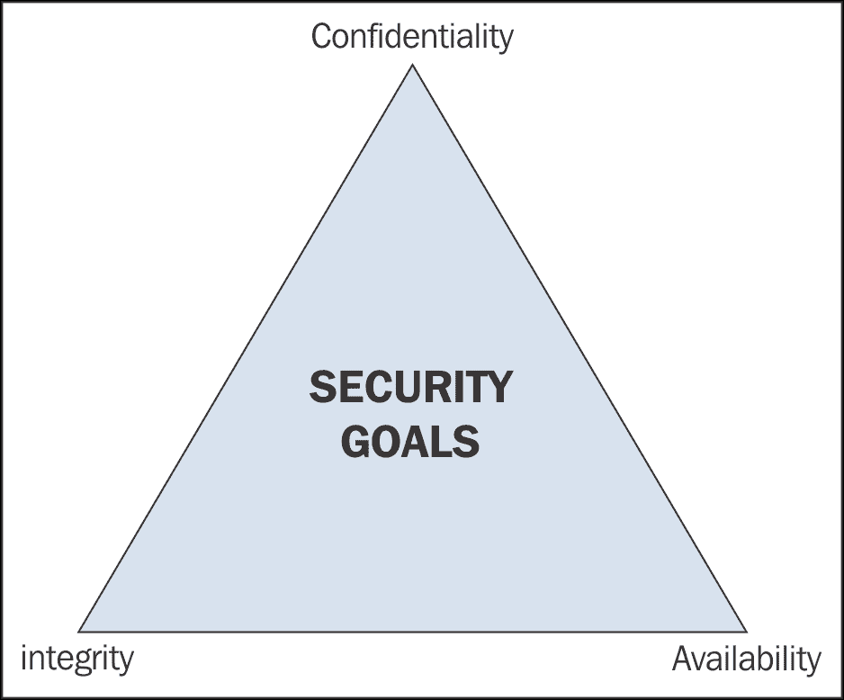

安全三要素

上面的插图表明，这三点并不是孤立的：整个图景由三个相互关系组成：保密性与完整性之间的关系；保密性与可用性之间的关系；最后是完整性与可用性之间的关系。对某一点的过度或不足的强调会扭曲我们的柏拉图三角形，这是一种我们不可能实现的理想的象征。

鉴于我们的最终目标——减轻威胁——本章沿着以下方向进行：

+   审视虚拟化可能带来的安全回报

+   审视这些回报，并探索虚拟化可能引入的潜在漏洞

+   直接采取行动以减轻威胁

# 虚拟化的安全好处

在基础设施中引入经过精心规划、深思熟虑和执行良好的虚拟化，会带来一些非常有力的安全好处。

### 注

|   | "IT 资源的抽象掩盖了这些资源的物理性质和边界……" |   |
| --- | --- | --- |
|   | -- *根据 Gartner 的 IT 词汇表定义的虚拟化（[`www.gartner.com/it-glossary/virtualization`](http://www.gartner.com/it-glossary/virtualization))。* |

关于将虚拟化表现为一种欺骗性伪装的常见说法，我们需要明确一点：安全性通过模糊化的方式是行不通的。为了提供安全性而设计或实施系统的秘密性是一种失败的方案。

在枚举虚拟化的安全优势时，本节有意避免暗示抽象化及其所允许的模糊化是一种有效的安全策略。

随着章节的发展，我们将看到，没有对网络、系统管理、二型虚拟机监控器、虚拟机和容器的良好理解，虚拟化倡导者所承诺的任何安全回报都是无法实现的。还需要以下内容：

+   部分基于深度防御的严格规划

+   完美实现这些计划

+   在所有虚拟机的生命周期中进行卓越的管理。

鉴于前述所有内容，虚拟化使用 Proxmox VE 确实带来了非常明确的安全好处：

+   减少物理攻击面

+   虚拟机隔离

+   恢复到先前状态的能力

+   硬件抽象

+   网络分段支持

+   封装和可移植性

+   物理安全

+   精细的权限控制

+   集成防火墙

## 攻击面缩减

转向虚拟化基础设施会根据虚拟机的密度减少物理攻击面。我们将更多的物理服务器转为 Proxmox VE 虚拟机，并根据我们将虚拟机密集地放置在 Proxmox VE 主机上的方式，物理服务器的数量减少，进而减少了遭受潜在致命物理攻击的风险。

虚拟化本身有潜力以多种方式减少基础设施的攻击面；我们将重点讨论它如何减少提供服务的物理主机数量。

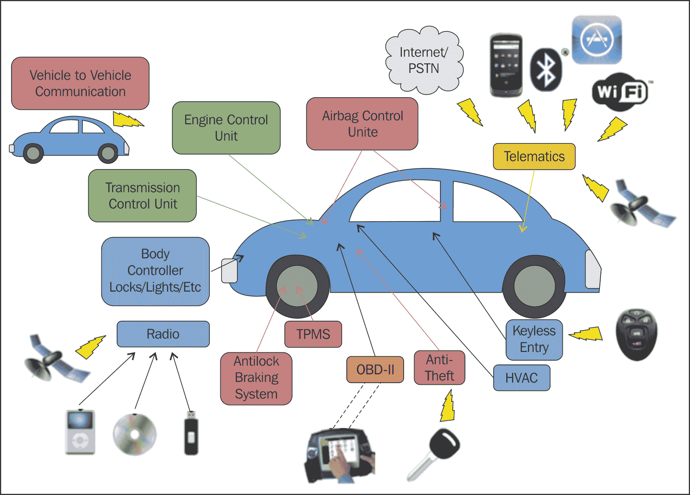

可视化攻击向量和攻击面

曾经我们可能在保护 15 台机器免受物理攻击，现在可能只需要保护一两台物理 Proxmox VE 主机。

我们必须保持批判性思维，意识到这可能会带来新的漏洞和令人沮丧的解决问题。

Proxmox VE 主机变得更加单一，因此：

+   如果 Debian 8、PVE 或 KVM 与 QEMU 存在未修补的漏洞，那么该实例托管的所有虚拟机的机密性、完整性和可用性也会受到威胁。

+   如果攻击者获得了对 PVE 主机或主机的物理访问权限，那么所有虚拟机和容器的安全性和完整性肯定会受到怀疑。如果这令人担忧，还要考虑到你的快照和备份可能已经丢失。

毫无疑问，虚拟化减少了基础设施的整体攻击面，并且在多个方面如此；然而，如前所述，这并不会减轻我们的任何负担，它只是让这些负担具有更高的风险，同时使其变得不那么复杂。

## 隔离

虚拟化鼓励隔离。即使在同一主机上，一个虚拟机也不会自然地影响另一个虚拟机。

这种隔离的趋势表明，破坏性的恶意软件感染虚拟服务器时，不一定会逃逸并传播到其他虚拟服务器，即使它们共享同一主机。

然而，如果出现疏忽，比如天真地在两个来宾之间共享数据，或更糟糕的是在来宾和主机之间共享数据，攻击可能会造成灾难性后果。因此，要抵制在 PVE 上创建虚拟机共享文件的诱惑；为了安全起见，不要在 Proxmox VE 主机和其任何来宾之间共享文件。

这里，文档化你的基础设施并编写经过深思熟虑且严格执行的安全政策的重要性显而易见。

## 先前状态的可用性

如果攻击成功针对 Proxmox VE 来宾，来宾可以通过备份或快照回滚到先前状态，从而有效地缩短从攻击中恢复的时间。然而需要注意的是，任何在选定备份时间与恢复时刻之间发生的更改，都会在回滚时丢失。

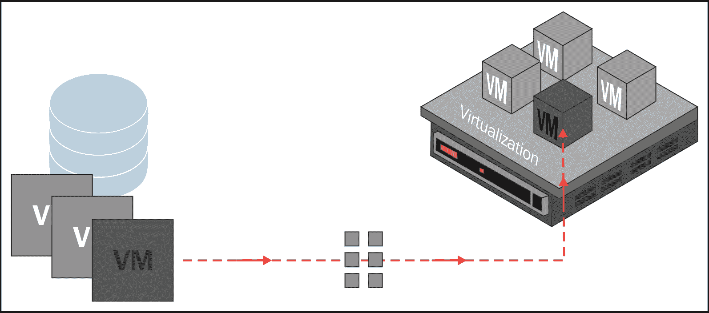

回滚涉及将先前版本的来宾存储文件应用到虚拟机或容器中

因此，恢复到先前状态的能力并不是虚拟化的无条件优势，尽管它是 Proxmox VE 的集成功能；快照和备份必须是精心规划和执行的 PVE 来宾生命周期的组成部分，并且是一个明确且强制执行的政策的一部分。

## 硬件抽象

完全虚拟化的一个根本性吸引人的特点是将计算机从物理硬件中抽象出来。

想象一下，一个 Proxmox VE 来宾在几个月内收集的资料经过精心组织，在一次攻击中被破坏，硬盘被摧毁，这种攻击本来会使物理存储无法恢复——在虚拟磁盘上的存储破坏不会对其所托管的物理存储造成任何损害。当有可恢复的先前状态时，快照或备份可以恢复到相同的硬件上。

无条件地，虚拟组件所遭受的损坏不会对物理主机产生任何影响。这是抽象化的固有奖励。

## 分段

如果要使用 Proxmox VE 虚拟化基础设施，请利用它支持的网络分段技术，例如 VLAN 标签、桥接、NAT 伪装的 IP 和每个来宾的防火墙。使用这些技术使虚拟机或容器仅对有合法业务需求并需要有限访问权限的用户群体可用。

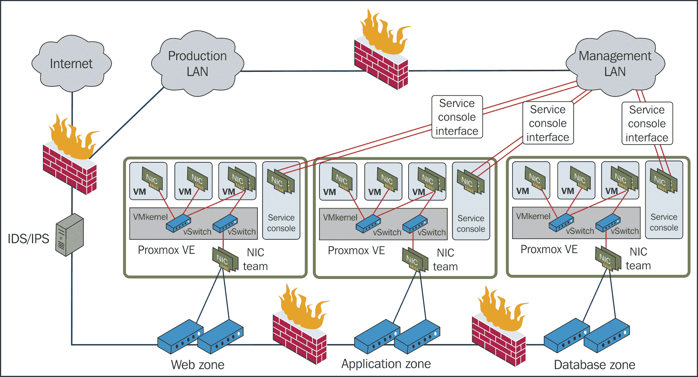

使用 Proxmox VE 可视化分段和信任区

为了最大限度地发挥这一宝贵潜力，在规划您的基础设施时，请严格思考足够的信任区。

### 注意

信任区是一个网络段，数据在其中流动时相对不受限制，而流入和流出信任区的数据则受到更严格的限制。

### 提示

**Open vSwitch**

作为 Linux 原生的桥接、绑定和 VLAN 接口的替代方案，Proxmox VE 支持 Open vSwitch。

Open vSwitch 是一种开源的软件实现，提供了一个分布式的多层交换机。它已经具备生产就绪能力，专为虚拟化设计。

要了解更多关于 Open vSwitch 的信息，包括其功能和潜在的缺点，请访问其官网：[`openvswitch.org`](http://openvswitch.org)。要了解 Proxmox VE 对 Open vSwitch 的支持，请访问 Proxmox 维基：[`pve.proxmox.com/wiki/Open_vSwitch`](https://pve.proxmox.com/wiki/Open_vSwitch)。

## 封装性和可移植性

如第五章《虚拟磁盘操作》所述，在完全虚拟化环境下，虚拟服务器上的所有信息，包括启动磁盘，都会作为文件保存；这是封装性的一个例子。

封装性极大地服务于虚拟机的可移植性；即使攻击者试图攻破 PVE 主机，其虚拟机也可以在不中断的情况下移动到集群中的另一台主机。实时迁移——将活跃的虚拟机从一个 PVE 主机迁移到同一集群中的另一个主机——有助于确保即便在主机遭受攻击时，也能保持可用性。

### 提示

**关于集群和高可用性**

有关这些主题的更多信息，请参见 Packt 出版的《Mastering Proxmox》、《Proxmox High Availability》和《Proxmox Cookbook》。

## 物理安全

当攻击者获得物理服务器的访问权限时，其应展示的可用性、保密性和完整性将绝对受到怀疑。

简单来说（借用 Scott Culp 的说法），如果攻击者获得了对 Proxmox VE 主机的物理访问权限，那么它就不再是您的主机了。

如前所述，虚拟化的一个非常强大的好处是，随着服务向虚拟机或容器迁移，物理主机数量减少，从而有效地减少了攻击面，因为需要为的机器越少，就能获得非法访问的机器也越少。

尽管如此，请在您的策略中包括 PVE 主机、存储和中间配线架（即配线室）在物理上如何防止非法访问的程序，并始终如一地严格执行该策略；这意味着您已经降低了一个潜在的灾难性威胁。

## 精细的权限控制

本着深度防御和最小权限原则的考虑，考虑将每个服务移至单独的虚拟机或容器时，如何实现对用户访问和限制的精细控制——与将多个服务运行在单一物理服务器上的做法相对比。

在虚拟基础设施中，获得访问某个服务权限的用户，并不意味着自动获得访问其他服务的权限——就像我们如果服务共享在一台硬件服务器上，通常会认为它们是共享的那样。我们可以限制对 Debian 的访问，通过 PVE Web 界面精确定义每个用户在与每个虚拟机和容器相关的角色，进一步细化在来宾操作系统和应用层的权限。

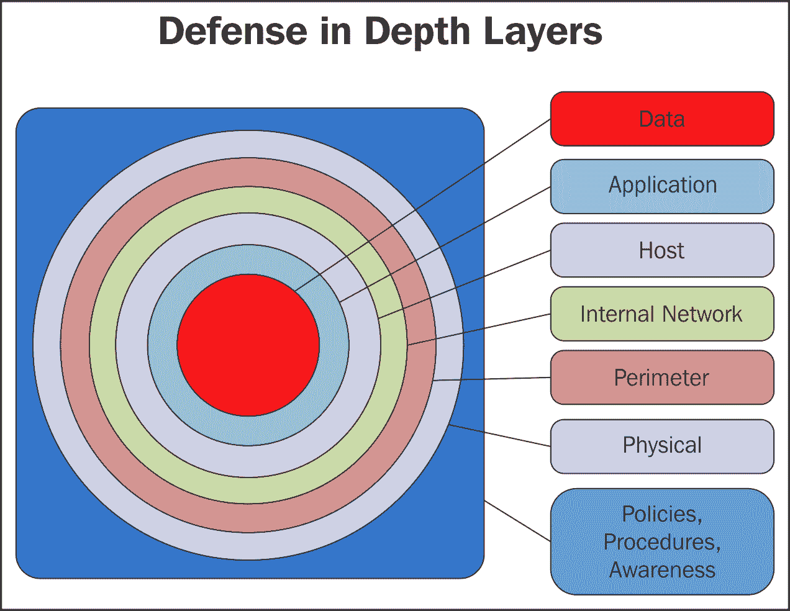

在“深度防御”实践中需要考虑的一些层次

默认情况下，Proxmox VE 管理界面通过 GNU/Linux 的默认认证系统（**PAM**）进行授权，且 root 是唯一的用户。然而，Web 界面的认证系统可以从 PAM 更改为 PVE 系统、Active Directory 或 LDAP。

无论认证机制如何，特定用户可以为每个独立的虚拟机或容器分配不同的角色或权限。

### 提示

**PVE 用户管理**

要了解更多关于 PVE 用户管理功能的信息，请访问 Proxmox wiki 的用户管理页面：[`pve.proxmox.com/wiki/User_Management`](https://pve.proxmox.com/wiki/User_Management)。

PVE 提供了许多预定义的角色，适用于用户或组；我们还可以根据需要创建具有不同权限和限制的新角色。

## PVE 防火墙功能

Proxmox VE 提供基于 iptables 的灵活防火墙功能。

这些功能可以通过管理界面或命令行进行配置，提供多层保护，因为这允许规则集根据每个来宾服务器、每个 PVE 主机和整个集群的情况来接受和拒绝流量。

### 注意

要了解更多关于 Proxmox VE 防火墙的信息，请访问官方文档：[`pve.proxmox.com/wiki/Proxmox_VE_Firewall`](https://pve.proxmox.com/wiki/Proxmox_VE_Firewall)，详细的配置示例可在此处找到。

PVE 必须通过防火墙保护，这一点非常关键。

Proxmox VE 3.4 依赖以下端口：

+   8006（Web 界面）

+   85（pvedaemon—配置为仅监听 127.0.0.1）

+   5900-5999（VNC Web 控制台）

+   22（sshd；用于集群操作以及访问远程 Shell）

+   5404, 5405 UDP（CMAN 多播—如果你运行集群的话）

Proxmox VE 4.0 对 Proxmox VE 的端口使用进行了若干改动：

+   8006（Web 界面）

+   85（pvedaemon—配置为仅监听 127.0.0.1）

+   5900-5999（VNC Web 控制台）

+   3128（SPICE 控制台）

+   22（SSH 访问—现在是可选的）

+   111（rpcbind）

+   5404, 5405 UDP（corosync 多播，如果你运行集群的话）

利用你在防火墙方面的经验，限制来自没有合法访问需求的子网和 IP 范围对这些端口的访问。

# 严重的漏洞

虚拟化的潜在安全优势无疑令人信服，但其中许多都是有条件的，总体而言，它们绝不是万能的解决方案。

此外，虚拟化为基础设施带来了新的威胁——这些威胁在虚拟化之前可能根本不会成为问题，或者在虚拟化的影响下变得更加严重。

本节重点关注虚拟基础设施历史上存在的问题性漏洞：

+   拒绝服务攻击

+   虚拟机逃逸和超跳

+   服务器扩展

+   日益复杂

## 拒绝服务攻击

**拒绝服务**（**DoS**）攻击有多种形式。然而，其直接目的都是一样的：通过产生大量非法流量来压垮网络及其管理员。

**分布式拒绝服务**（**DDoS**）和 DoS 攻击成本低、有效且日益普遍。从表面上看，它们似乎最有效的方式是让服务无法使用或不可用。更为阴险的是，通过让管理员应对非法流量忙得不可开交，其他攻击可以在不引起他们注意的情况下发起。

不幸的是，DoS 攻击在虚拟化基础设施中尤其强大，其中被压垮的虚拟主机会威胁到虚拟客户机及其提供的服务的可用性。

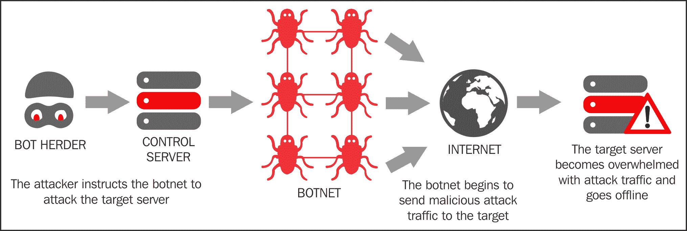

可视化 DDoS 攻击

此外，2013 年发布的研究发现，虚拟机涉及的 DoS 攻击要强大得多：

|   | *"[在] DoS 攻击下，虚拟机托管的 Web 服务器性能可能下降最多达 23%，而在同一硬件上托管的非虚拟化服务器性能仅下降 8%。即使在相对轻微的攻击下，基于虚拟机监控程序的虚拟化系统的文件系统和内存访问性能也会比其非虚拟化对等物下降得更快。"* |   |
| --- | --- | --- |
|   | -- *《网络拒绝服务攻击下虚拟机性能：实验与分析》，Shea 和 Liu， [`www.cs.sfu.ca/~jcliu/Papers/PerformanceofVirtualMachines.pdf`](http://www.cs.sfu.ca/~jcliu/Papers/PerformanceofVirtualMachines.pdf)* |

显然，在某些领域，我们可能会对虚拟化带来的某些安全优势感到安慰；然而，DoS 和 DDoS 攻击是我们无法忽视的威胁。

在将服务从物理机器迁移到 Proxmox VE 虚拟机时，工作不仅要定义和部署预防措施，还要制定快速响应协议。这要求实施监控和警报系统，并配置防火墙，以便有意识地考虑到这些攻击。

每种类型的 DoS 攻击都有各自的检测和缓解策略。例如，要缓解 SYN 洪水攻击，请参见[`tools.ietf.org/html/rfc4987`](http://tools.ietf.org/html/rfc4987)的第三部分。

## 虚拟机逃逸和超跳

**虚拟机逃逸**发生在攻击者成功“突破”虚拟机并与主机操作系统交互时。

同样地，**虚拟机跳跃**，有时也称为超跳，是通过另一个虚拟机非法访问虚拟机的过程。

可以推测，封装和隔离的环境中，虚拟机运行的操作系统不应该知道它们是虚拟化的；不应该有任何方式能让虚拟机突破虚拟化，与父级虚拟机监控程序直接交互。出于相同的原因，通过另一个虚拟机非法访问虚拟机应该是不可能的。

虚拟机逃逸漏洞特别具有毁灭性，因为虚拟机监控程序控制着主机上所有虚拟机和容器的执行。因此，能够访问虚拟机监控程序的攻击者将能够控制在 PVE 主机上运行的所有虚拟机；由于虚拟机监控程序位于物理硬件和虚拟机操作系统之间，成功的虚拟机逃逸将使攻击者能够简单地绕过在虚拟机上实施的安全控制。

虚拟机逃逸和虚拟机跳跃本应是一个智力练习，是一个迷人的理论性问题。不幸的是，事实并非如此。

例如，在本书的制作过程中，已经出现了几种虚拟机逃逸漏洞。或许最引人注目的漏洞是被研究人员称为*VENOM*的漏洞（[`venom.crowdstrike.com/`](http://venom.crowdstrike.com/)）：

> *“VENOM，CVE-2015-3456，是一个存在于许多计算机虚拟化平台使用的虚拟软盘驱动程序中的安全漏洞。该漏洞可能允许攻击者突破受影响虚拟机（VM）的限制，进而可能获得对主机的代码执行访问权限。如果没有采取缓解措施，这种虚拟机逃逸可能会打开对主机系统及该主机上运行的所有其他虚拟机的访问权限，从而可能使攻击者获得对主机本地网络及相邻系统的显著权限。”*
> 
> *“VENOM 漏洞的利用可能暴露企业知识产权（IP）的访问权限，除此之外，还可能泄露敏感的个人身份信息（PII），并可能影响成千上万的组织和依赖受影响虚拟机（VM）分配共享计算资源的数百万终端用户，此外还可能影响连接性、存储、安全性和隐私。”*

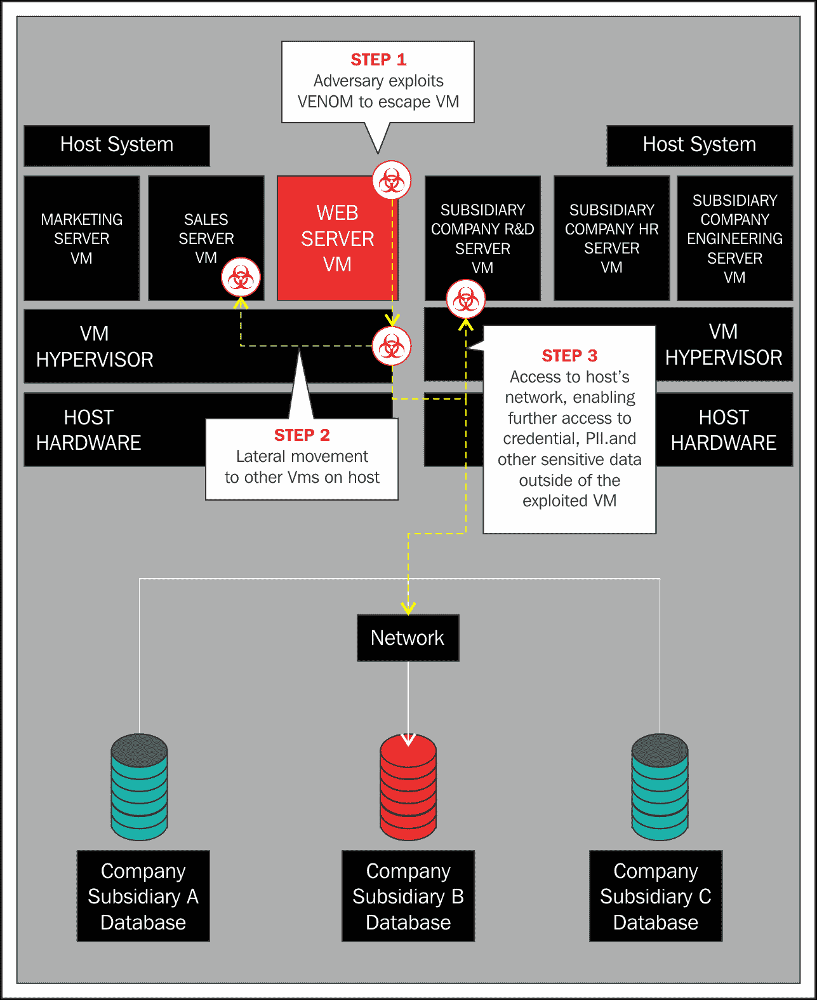

Venom 攻击场景

不幸的是，披露中提到的许多“计算机虚拟化平台”包括了所有基于 QEMU 的虚拟化平台；这也包括 Proxmox VE。

对于 VENOM 漏洞，Debian 在漏洞披露当天就发布了补丁。PVE 管理员只需要按照 Debian 的方式升级，然后重启虚拟机：

```
apt-get clean
apt-get update

```

在 Proxmox VE 主机上关闭并重启所有虚拟机后，漏洞问题消失了。甚至无需重新启动 PVE 主机。

### 注意

该漏洞在 QEMU 源代码中无意中引入，当 QEMU 软盘驱动控制器在 2004 年被引入时。

所以看起来虚拟化的隔离并不是绝对的。

从 VENOM 中，我们可以学习到一些直接的预防措施，以缓解新出现的虚拟机逃逸漏洞：

+   定期对 Proxmox VE 和 Debian 进行修补。有多种方法可以自动化修补过程；我们将在下一节中介绍其中一种方法。由于 Proxmox VE 通过与 Debian 相同的机制进行修补，两个系统的补丁将同时应用。

+   对虚拟机和容器上运行的操作系统和应用程序进行修补。在 Debian 和 Ubuntu 客户机上，使用 apt 工具；在 Microsoft Windows 和 Server 客户机上，设置合理的 Windows 更新策略，以确保紧急更新被应用。

+   *不要* 安装你不需要的虚拟机功能。这样做会不必要地增加你的攻击面。特别要注意虚拟设备是否附加到虚拟机上；如果你不需要虚拟光驱或软盘驱动器，可以在虚拟机上安装时避免它们，或者当你不再需要时将其从虚拟机中移除。

+   避免运行那些对客户机的主要角色不必要的软件和服务。

+   然而，运行终端安全软件在虚拟机上的好处值得权衡；在他 2015 年 9 月的文章《逃脱的虚拟机的奇怪案例》中，Bunmi Sowandi 建议，这种软件将在恶意代码有机会“逃脱”之前，检测出它试图在虚拟机中运行的行为。([`vmturbo.com/about-virtualization/the-curious-case-of-the-escaping-virtual-machine/`](http://vmturbo.com/about-virtualization/the-curious-case-of-the-escaping-virtual-machine/))

正如我们从 VENOM 中了解到的，防止虚拟机逃逸和超级跳跃漏洞的最佳保护措施是常规的、经过深思熟虑的补丁管理。

## 虚拟化蔓延

在虚拟基础设施的背景下，蔓延指的是虚拟服务器的扩展速度超过管理员能够妥善管理的速度。蔓延促使了不良管理决策、草率的未经过深思熟虑的行动、马虎的配置错误以及错失缓解威胁的机会。

因此，从安全的角度来看，虚拟化蔓延带来了严重的问题，因为管理员会错过安全补丁，未能加固服务，甚至可能不必要地暴露网络、虚拟化程序和存储节点。

惠普网站上的一篇有帮助的文章建议了一些最佳实践，有效地减少蔓延的影响。像本章中探讨的许多安全问题一样，建议的解决方案是优秀的规划、深思熟虑的部署，以及编写和执行包含虚拟机生命周期管理的安全政策。文章（[`h30499.www3.hp.com/t5/Grounded-in-the-Cloud/5-ways-to-get-control-of-virtualization-sprawl/ba-p/6170959`](http://h30499.www3.hp.com/t5/Grounded-in-the-Cloud/5-ways-to-get-control-of-virtualization-sprawl/ba-p/6170959)）特别强调以下内容：

+   在可能的情况下，从包含补丁、补丁策略、审计政策、软件及软件政策的“黄金镜像”创建虚拟机和容器

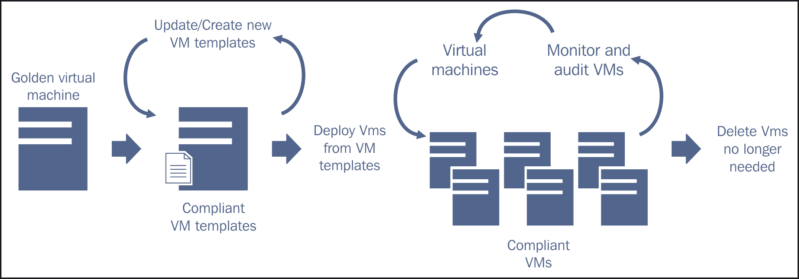

虚拟机及虚拟机模板的端到端生命周期和策略管理

+   主动更新虚拟机以及虚拟机模板（包括容器及容器模板）的基于政策的执行

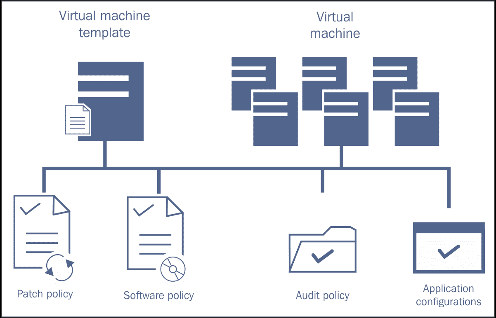

+   系统化地管理虚拟服务器的生命周期和合规性，贯穿始终（例如，包括定期快照或备份，以及应用补丁和升级）

本文坚持传达两个成功的信息：

+   一项精心设计的安全政策，对管理员而言是完全可遵守的，对于控制虚拟化蔓延至关重要

+   可以自动化的任务必须自动化

虚拟化蔓延会促使混乱；通过自动化以及精心设计并在日常管理实践中遵循的政策来加以控制。

## 与复杂性作斗争

|   | *“网络架构应尽可能简单易懂，应该能够简要地画出几个简单的图示来说明该设计……”**“清楚理解网络流量的流动，使你能掌控网络。不理解网络，则会受其变化的摆布。”* |   |
| --- | --- | --- |
|   | -- *《系统与网络管理实务，第 2 版 2007》* |

考虑到虚拟化促使蔓延，同时安全的虚拟化基础设施要求分段，虚拟化鼓励问题网络复杂性的现象也就不足为奇。

随着网络复杂性的增加，管理员所承受的痛苦也在增加，因为他们必须保持准确的文档，随时排查连接问题，有时还需要为第三方支持提供可操作的信息。

基础设施虚拟化所倡导的“混乱方法”并不是在每个组件的可用性都至关重要的网络中可以依赖的模型（《系统与网络管理实务》）。

为了限制网络复杂性，考虑到校园的网络架构师、工程师和管理员都应该能够在不借助任何辅助工具的情况下，简要勾画出网络拓扑的关键特征和基本结构。

根据 Limoncelli、Hogan 和 Chalup 的说法，如果网络图不能相对容易地呈现，那么网络架构既不够干净、也不够易懂、也不够简单。物理和逻辑网络的地图应该绝对成为系统文档的一部分，并且应当修订以反映前一个拓扑结构的任何修改。

冒着显得重复的风险，最好的方式来驾驭网络的复杂性是确保网络能够在没有额外资源支持的情况下，逻辑上和物理上清晰地被解释和绘制。如果不能做到这一点，重新评估架构，看看在哪些方面可以简化，而不牺牲安全性。

# 采取行动

如果你还没有虚拟化基础设施，或者你暂时无法制定战略安全政策，仍然有一些策略可以采取，以减轻一些对你的 Proxmox 虚拟环境的威胁：

+   保护引导加载程序

+   如果可能，锁定 BIOS/UEFI

+   绝对禁止远程访问 Proxmox VE 的用户界面

+   禁用通过 SSH 的 root 访问；也可以考虑禁止 sudo 权限

+   使用 Fail2ban 防止暴力破解攻击

+   依赖基于密钥的 SSH 认证

+   维护 Proxmox VE 及其虚拟机的安全补丁

+   考虑企业支持订阅

接下来的实际操作是对之前提到的更抽象策略的有力（且立即可用的）补充。

本节总结了这些即时的战术性缓解目标，以提供即时支持，帮助你熟悉 Proxmox VE。

## 保护引导过程

在本节中，我们致力于确保操作系统和应用级认证不会因物理访问攻击者而被绕过，确保这些机制不被彻底破坏。

我们可以将引导过程视为四个阶段：

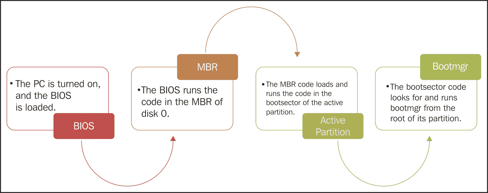

通用引导过程

在这个过程中，系统可能会存在漏洞：

+   一个没有安全保护的 BIOS 可以被指示从攻击者的存储设备引导，这使得攻击者能够破坏存储在 Proxmox VE 主机上的数据的机密性和完整性，并干扰主机旨在提供的服务和虚拟服务器的可用性。

+   通过操控未加固的引导加载程序，攻击者可以获得机器的 root 权限，并危害其机密性、完整性和可用性。

使用任一方法，攻击者实际上已经控制了这台机器。让我们尽最大努力锁定主机的 BIOS/UEFI 以及 GRUB 2.0，这是 Proxmox VE 3.4 和 4.1 的引导加载程序。

### 提示

要了解更多关于 Debian 启动过程的信息，请访问 [`www.debian.org/doc/manuals/debian-reference/ch03.en.html#_an_overview_of_the_boot_strap_process`](https://www.debian.org/doc/manuals/debian-reference/ch03.en.html#_an_overview_of_the_boot_strap_process)。

### 锁定引导加载程序

操作系统级的身份验证限制可以通过操作 GRUB 2（Proxmox VE 的引导加载程序）非常简单地被破解，尽管 Proxmox VE 机器本身是安全的。例如，参见 [`linuxconfig.org/ubuntu-14-04-lost-password-recovery`](http://linuxconfig.org/ubuntu-14-04-lost-password-recovery)，该过程中详细描述了这一过程。攻击的要点大致如下：

1.  重启并在启动后立即进入 GRUB 2 菜单。

1.  修改引导选项。

1.  根据您的修改启动系统。

1.  更改系统的 root 密码。

1.  关闭并重启。

1.  使用新密码登录。

对于有经验的 GNU/Linux 管理员来说，这个过程应该很熟悉；它与我们重置丢失的 root 密码的方式完全相同。

GRUB 2 提供了广泛的自定义功能，通过它，您可以禁用一般的 GRUB 2 选项访问，以及特定菜单选项的访问。

我们将介绍 GRUB 2 菜单条目的通用保护措施，以允许通过一个未加密密码的超级用户访问。这将禁止攻击者以及疏忽或不满的同事编辑 GRUB 条目或访问 GRUB 命令行。

要执行此过程，您必须：

+   拥有 root 权限。

+   确定将使用的超级用户名称和密码（我们将使用名称 `admin` 和密码 `pve`）。

+   从命令行编辑 GRUB 配置文件。

+   使用 update-grub 命令更新 GRUB 2 配置。

让我们开始吧：

1.  登录到 Proxmox VE 主机的 shell；如果 PVE 配置了 192.168.1.200 的 IP 地址，可以通过同一网络上的工作站通过 SSH 访问 shell：

    ```
        ssh root@192.168.1.200

    ```

1.  使用纯文本编辑器打开 `/etc/grub.d/00_header`；此示例使用 `nano` 作为编辑器：

    ```
        nano /etc/grub.d/00_header

    ```

1.  将以下行附加到文本的底部：

    ```
        cat << EOF
        set superusers="admin"
        password admin pve
        EOF

    ```

1.  保存文档并退出编辑器；在 `nano` 中，使用 *Ctrl* + *X*，然后 *Y*，接着 *Enter* 返回到 shell 提示符。

1.  在 `nano` 中打开 `/etc/grub.d/10_linux`：

    ```
        nano /etc/grub.d/10_linux

    ```

1.  在 `/etc/grub.d/10_linux` 中查找以下一组行：

    ```
        echo "menuentry '$(echo "$title" | grub_quote)' ${CLASS} \$menuentry_id_option 'gnulinux-$version-$type-$boot_device_id' {" | sed "s/^/$submenu_indentation/"

        else

        echo "menuentry '$(echo "$os" | grub_quote)' ${CLASS}  \$menuentry_id_option 'gnulinux-simple-$boot_device_id' {" | sed "s/^/$submenu_indentation/"

    ```

1.  在最后一行，在 `${CLASS}` 和 `\$menuentry;` 之间插入 `--unrestricted`，最终的行如下所示：

    ```
        echo "menuentry '$(echo "$os" | grub_quote)' ${CLASS} --unrestricted \$menuentry_id_option 'gnulinux-simple-$boot_device_id' {" | sed "s/^/$submenu_indentation/"

    ```

1.  保存修改后的文档并退出编辑器；在 `nano` 中，使用 **Ctrl** + **X** 退出，按 **Y** 确认，然后按 **Enter** 返回到 shell 提示符。

1.  最后，提示 GRUB 2 根据更改重新配置自身：

```
    update-grub
```

当您重启时，如果不被打断，您应该发现 PVE 会正常启动。但是，如果您尝试编辑菜单项、从子菜单启动或访问 GRUB 命令行，您应该会发现需要进行身份验证。

### 提示

有关 GRUB 安全性的更多信息，请访问以下链接：[`help.ubuntu.com/community/Grub2/Passwords`](https://help.ubuntu.com/community/Grub2/Passwords)

[`www.gnu.org/software/grub/manual/grub.html#Security`](http://www.gnu.org/software/grub/manual/grub.html#Security)

正如 [`opensourceforu.efytimes.com/2013/03/playing-hide-and-seek-with-passwords/`](http://opensourceforu.efytimes.com/2013/03/playing-hide-and-seek-with-passwords/) 文章中指出的那样，这个密码仍然可以通过将 BIOS/UEFI 配置为从攻击者的启动设备启动来绕过。如果你的硬件允许，你可能需要先保护启动过程的这一阶段，这样潜在的恶意分子就无法操控 Proxmox VE 主机从他们自己的设备启动。

### 锁定 BIOS/UEFI

通过保护引导加载程序 GRUB 2，我们可以防止用户绕过操作系统安全性并获得 Proxmox VE 主机上的 root 权限。

然而，攻击者仍然可以通过从他们自己的媒体启动来轻松绕过引导加载程序的安全性。从那里，他们可以挂载计算机的次级存储，并立即为你做出关于其机密性和完整性的决定。如果攻击者特别有计划，他/她可以安装一种巧妙的方式，稍后远程访问这台计算机。

为了减轻这一威胁，我们可以根据固件的不同，密码保护 BIOS 或 UEFI 中的启动设备设置。

由于有各种各样的 BIOS 和 UEFI 固件供应商，我们将阐明我们想要做的目标，然后希望我们的系统能够合作。

目标是调整 BIOS/UEFI 使其按以下方式运行：

+   允许系统在没有任何中断的情况下冷启动

+   更改启动设备需要身份验证

+   禁止在未身份验证的情况下进入设置管理器

这个配置可能有些棘手，很大程度上取决于 BIOS/UEFI 供应商。

理想情况下，带有 BIOS 的计算机将允许你执行以下操作：

1.  在启动 PC 时进入 BIOS 配置。开机后，按提示键进入**BIOS 设置实用程序**；有时是 F 键、**Delete** 或 **ESC**。在某些联想机器上，是 **Enter**。在 VMware 的 PhoenixBIOS 中，**F2** 用于访问设置实用程序（访问此界面是我们希望对攻击者来说不可行或令人沮丧的）：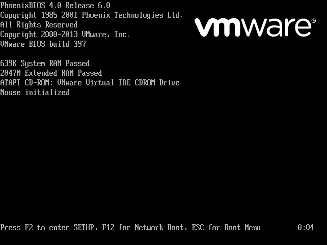

    VMware Workstation 附带的 PhoenixBIOS 使用 F2 进入设置，F12 用于网络启动，ESC 用于启动菜单。

1.  一旦进入 **SETUP**，导航到安全选项卡。在我访问过的计算机上，设置管理员密码将要求任何尝试进入设置实用程序的人提供相同的凭据。在 VMware Workstation 虚拟机的 PhoenixBios 中，我仍然可以在未进行身份验证的情况下启动。到目前为止，一切正常。

1.  然而，当前面的截图提示用户按 *F12* 进行网络启动或按 *Esc* 进入启动菜单时，他们会发现这些选项没有限制。在这种情况下，任何试图锁定 BIOS 以增强安全性的行为都将被彻底破坏。

1.  如果可用，进入 SETUP 工具中的启动设置。如果启动菜单中有该选项，请禁用不使用的设备，如网络启动、光驱启动或 USB 启动设备。

1.  再次，根据可用性，进入启动优先级并设置剩余设备的启动优先级。某些系统允许你使用 **D** 键禁用设备。

理想情况下，你的 BIOS 设置工具允许你禁用启动设备或为启动设备菜单和 SETUP 工具本身设置密码保护。此外，它应该允许你设置主管密码，而无需在启动时进行身份验证。如果启动过程被中断以要求身份验证，可能会导致服务用户依赖的系统出现不必要的、甚至是未计划的停机时间。

在我为本章调查的物理机器中，大约一半的机器可以实现之前推荐的设置。

如果你的机器支持这种理想场景，请意识到，最糟糕的情况是丢失 BIOS 密码意味着你失去了重新配置或故障排除物理机器的许可。如果密码丢失，你需要研究如何绕过你曾认为能防止坏人入侵的安全措施。重置过程繁琐、不一致、耗时且可能不起作用。

因此，保持任何用于限制 BIOS 或 UEFI 访问的凭据的安全副本是至关重要的。

要了解如何保护你的 Proxmox VE 主机的具体 BIOS/UEFI 系统，请查阅计算机或 BIOS 制造商的文档，或者在网上查找社区用户的相关资料。

如果无法通过你所使用的 BIOS 或 UEFI 完全保护启动过程，可以通过确保物理主机的访问绝对安全来弥补，如带警报的门锁、记录进出日志的钥匙通行证等。

### 提示

**Secure Boot 和 Proxmox**

Proxmox VE 不支持 UEFI 的 Secure Boot 功能。

## 强化操作系统和虚拟化管理程序

这里的目标是确保 Proxmox VE（3.4 和 4.0）以及其底层操作系统 Debian 的安全性。由于 Proxmox VE 和 Debian 紧密相连，因此将它们一起讨论是合适的。

### 禁止远程访问虚拟化管理程序

专注于安全虚拟化基础设施的专家坚决主张这一点：必须禁止远程访问虚拟化管理程序。

这个指令必须得到明确说明：在没有显示器的情况下运行 Proxmox VE 主机并通过 SSH 和基于 Web 的管理界面从同一局域网的另一台工作站访问它是完全合适的。

你需要避免的一件事是将 PVE 端口，特别是 22 和 8006，暴露到互联网。如果没有配置 VPN，Proxmox VE 绝对不应该从局域网外部访问。

### 提示

OpenVPN 是一个开源包，用于提供 VPN 服务；如果你正在考虑 VPN 解决方案，可以在 [`/wiki.debian.org/OpenVPN`](https://wiki.debian.org/OpenVPN) 了解更多关于 OpenVPN 的信息。

### 加固 SSH 安全

Proxmox VE 设计时有两种访问方式：

+   通过 SSH 访问命令行界面

+   通过基于 Web 的管理界面进行访问

必须启用 SSH 选项，以便管理员能够对底层操作系统进行配置更改。此外，正如我们在第三章中所见，*创建容器* 和第四章，*创建虚拟机*，我们可能选择通过命令行处理大量的 Proxmox VE 管理任务。

因此，不能仅凭安全理由禁用 SSH。然而，为了确保安全性，我们必须微调 SSH 的配置，以缓解潜在的威胁，无论是来自不满的或疏忽的同事，还是外部的攻击。

我们的目标如下：

+   禁用直接通过 SSH 访问 root 账户

+   缓解针对 SSH 的暴力破解密码攻击

+   限制按 IP 访问

+   使用加密密钥而非密码进行 SSH 身份验证

#### 禁用 root 账户通过 SSH 登录

这个过程至关重要且绝对必要。首先，我们需要创建自己的账户以用于登录。接着，我们将使用新账户登录，使用 `su -` 命令提升权限，然后按照简单的步骤禁用 root 用户通过 SSH 登录。

一旦完成此过程，我们将在可预见的未来使用新账户登录；要执行需要 root 权限的操作时，我们只需使用 `su -` 命令临时提升该用户账户的权限，具体步骤如下：

1.  选择一个用户名和密码，用于通过 SSH 管理 Proxmox VE。

1.  通过 SSH，使用在安装 Proxmox VE 时创建的凭据以 root 用户身份登录。

1.  使用 adduser 命令，后跟你选择的用户名，创建新账户：

    ```
        adduser rgoldman

    ```

1.  按照提示创建并确认新账户的密码。

1.  输入你希望与新账户关联的全名。

1.  你可以选择忽略其余的提示信息，如办公室号码、地址和电话号码等。

1.  按 *Y* 然后按 *Enter* 键确认创建新用户。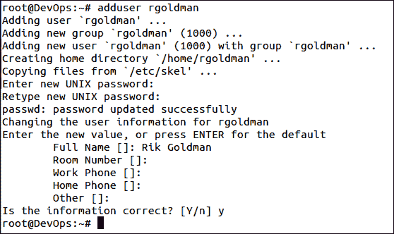

    在命令行提示符下创建新用户

1.  使用 `exit` 命令关闭 SSH 会话。

1.  使用新账户名重新连接到 Proxmox VE：

    ```
        ssh rgoldman@192.168.1.200

    ```

1.  使用 `su -` 命令提升权限，并输入 root 密码以继续。

1.  使用 `nano` 编辑 `/etc/ssh/sshd_config`：

    ```
        nano /etc/ssh/sshd_config

    ```

1.  使用箭头键或 **PageDown** 键找到以下部分：

    ```
        #LoginGraceTime 2m
        #PermitRootLogin no
        #StrictModes yes
        #MaxAuthTries 6
    ```

1.  在此文件中，`#` 符号表示该行是注释，不应视为 SSH 守护进程配置的一部分。让我们从第二行删除 `#` 符号以启用该指令：

    ```
        PermitRootLogin no

    ```

1.  保存并退出修订后的配置文件： *Ctrl* + *X*，*Y*，*Enter*。

1.  我们可以在不影响会话的情况下重启 SSH 守护进程：

    ```
        /etc/init.d/ssh restart

    ```

1.  现在，进行测试，确保 root 用户无法再登录。首先输入 `exit` 退出 `su` 模式，再次输入 `exit` 关闭 SSH。

1.  以 root 用户身份启动新的 SSH 会话：

    ```
        ssh root@192.168.1.200

    ```

访问应被拒绝，且没有输入密码的机会。

#### 防止针对 SSH 的暴力破解攻击

只要 SSH 守护进程配置为使用密码认证，它就容易受到暴力破解密码攻击。一种缓解策略是安装并配置 Fail2ban，这是一个强大的工具，旨在检测服务上的攻击，并将攻击来源的 IP 地址在预定义的时间段内禁止访问。Fail2ban 有效地提高了攻击者进行暴力破解攻击所需的资源和时间成本。

若要使用 Fail2ban，请按以下步骤操作：

1.  通过 SSH 和新用户账户登录。

1.  提升权限：

    ```
        su -

    ```

1.  安装 Fail2ban：

    ```
        apt-get update && apt-get install -y fail2ban

    ```

1.  将默认配置文件 `jail.conf` 复制到新文件 `jail.local`：

    ```
        cp /etc/fail2ban/jail.conf /etc/fail2ban/jain.local
    ```

1.  使用编辑器（如 `nano`）打开新文件：

    ```
        nano /etc/fail2ban/jail.local

    ```

1.  在以下节中确认 Fail2ban 的 SSH 配置：

    ```
        [ssh]
        enabled   = true
        port      = ssh
        filter    = sshd
        logpath   = /var/log/auth.log
        maxretry  = 6

    ```

1.  保存文件并使用 *Ctrl* + *X*，*Y*，*Enter* 退出 `nano`。

1.  如果需要任何更改，请重启 Fail2ban：

```
    /etc/init.d/fail2ban restart
```

### 注意

Fail2ban 还可以配置为保护 PVE 的基于 Web 的管理界面免受暴力破解攻击。

首先，将以下内容添加到 `/etc/fail2ban/jail.local`：

```
[proxmox]
enabled = true
port = 8006, https
filter = proxmox
logpath = /var/log/daemon.log
maxretry = 3
bantime = 3600 # 1 hour
```

### 注意

然后，输入命令 `nano /etc/fail2ban/filter.d/proxmox.conf` 来创建过滤器。

输入以下内容：

```
[Definition]
failregex = pvedaemon\.*authentication
failure;
rhost= <host> user=.* msg=.* ignoreregex =
```

### 注意

保存文件并使用 *Ctrl* + *X*，*Y*，*Enter* 退出 `nano`。*重启* Fail2ban 以激活新配置：

```
    /etc/init.d/fail2ban restart
```

### 注意

按照之前描述的 Fail2ban 配置，如果在 Web 界面中连续三次验证失败，客户端将被禁止连接一小时：

。

要了解更多有关 Fail2ban 和 Proxmox VE 的信息，请访问 Proxmox Wiki：[`pve.proxmox.com/wiki/Fail2ban`](https://pve.proxmox.com/wiki/Fail2ban)。

#### 依赖基于密钥的认证

另一种保护 Proxmox VE 服务器 SSH 访问的方法是依赖于基于密钥的身份验证，而非密码认证。这种身份验证方法的优点在于你可以完全禁用密码认证，避免担心合法用户密码的强度。另一个好处是，你可以使用相同的密钥来对任何数量的 SSH 服务器进行身份验证。

为了使用此功能，我们将首先生成一对 SSH 密钥。一旦你拥有了可以用来进行身份验证的公钥和私钥，我们将把公钥放置到 PVE 主机上，以便使用 SSH 密钥认证进行登录。一旦完成这两个步骤，你将检查是否能够登录到 PVE 主机。

### 提示

在接下来的示例中，`rgoldman`作为用户名的占位符，而`192.168.1.200`作为 PVE 的 IP 地址占位符。请根据实际情况替换它们。

1.  在与 PVE 主机处于同一局域网的工作站上，生成一对 SSH 密钥：

    ```
        ssh-keygen

    ```

1.  在第一个提示中，按**Enter**确认密钥位置：

    ```
        Generating public/private rsa key pair.
        Enter file in which to save the key (/home/rgoldman/.ssh/id_rsa):

    ```

1.  在接下来的提示中，你可以选择创建并确认一个可选的密码短语；使用密码短语将防止攻击者从你的工作站访问 PVE 主机。另一方面，每次你希望使用密钥进行身份验证时，都需要输入密码短语：

    ```
        Created directory '/home/rgoldman/.ssh'.
        Enter passphrase (empty for no passphrase):
        Enter same passphrase again:
    ```

1.  查看是否有确认信息显示密钥已创建，你应该会看到类似以下的终端输出：

    ```
        Your identification has been saved in /home/rgoldman/.ssh/id_rsa.
        Your public key has been saved in /home/rgoldman/.ssh/id_rsa.pub.
        The key fingerprint is:
        a9:49:2e:2a:5e:33:3e:a9:de:4e:77:11:58:b6:90:26 username@remote_host
        The key's randomart image is:
        +--[ RSA 2048]----+
        |     ..o         |
        |   E o= .        |
        |    o. o         |
        |        ..       |
        |      ..S        |
        |     o o.        |
        |   =o.+.         |
        |. =++..          |
        |o=++.            |
        +-----------------+

    ```

    类似于前面示例的输出确认了你已经拥有公钥和私钥，可以用来进行身份验证。

    接下来，让我们将公钥放置到 PVE 主机上，这样你就可以使用 SSH 密钥认证登录。

1.  通过列出`~/.ssh/`的内容来确认密钥是否存在；确保`id_rsa`和`id_rsa.pub`都出现在结果中：

    ```
        ls ~/.ssh/

    ```

1.  接下来，使用`ssh-copy-id`工具将新的公钥推送到 PVE 主机，语法如下（假设用户名为`rgoldman`，PVE 主机的 IP 地址为`192.168.1.200`）：

    ```
        ssh-copy-id rgoldman@192.168.1.200

    ```

1.  就这样。现在确认你能在没有密码的情况下登录：

    ```
        ssh rgoldman@192.168.1.200

    ```

如果你能够在不输入密码的情况下通过 SSH 登录到 PVE 帐户，那么你已经成功为你的帐户配置了基于 SSH 密钥的身份验证。

以下的图片展示了该交易过程：

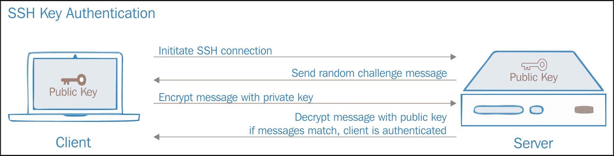

SSH 密钥认证

但请注意，你的基于密码的身份验证机制仍然处于活动状态；SSH 服务器仍然暴露在暴力破解或社交工程攻击下。

以下步骤将禁用服务器上的基于密码的身份验证。如果你计划从其他主机访问 PVE，但尚未复制密钥（或者你还不确定基于密钥的身份验证是否有效），那么请勿继续此步骤：

1.  使用 SSH 从本地工作站登录到 PVE 主机。

1.  提升权限：

    ```
        su -

    ```

1.  使用`nano`或其他纯文本编辑器打开 SSH 守护进程配置文件：

    ```
        nano /etc/ssh/sshd_config

    ```

1.  浏览文件内容，查找以下指令：

    ```
        PasswordAuthentication yes

    ```

1.  将指令更改为如下所示：

    ```
        PasswordAuthentication no

    ```

1.  使用 *Ctrl* + *X*，*Y*，*Enter* 保存文件并关闭编辑器。

1.  重启 SSH 守护进程：

    ```
        /etc/init.d/ssh restart

    ```

现在，我们可以通过 SSH 访问 Proxmox VE，而无需担心密码强度或受到暴力破解攻击或社会工程学攻击的风险。

然而需要注意的是，当我们依赖基于密钥的认证时，确保密钥的安全至关重要。这意味着，我们需要始终记得锁定工作站，并用强密码保护我们的工作站账户。

### 提示

**了解更多关于 SSH 的信息**

要了解更多关于 SSH 和认证的信息，可以访问以下资源：

[`www.debian-administration.org/article/530/SSH_with_authentication_key_instead_of_password`](https://www.debian-administration.org/article/530/SSH_with_authentication_key_instead_of_password)

[`www.digitalocean.com/community/tutorials/how-to-configure-ssh-key-based-authentication-on-a-linux-server`](https://www.digitalocean.com/community/tutorials/how-to-configure-ssh-key-based-authentication-on-a-linux-server)

[`debian-handbook.info/browse/stable/sect.remote-login.html`](https://debian-handbook.info/browse/stable/sect.remote-login.html)

若要了解更多关于 SSH 的强化策略，请访问 [`howto.biapy.com/en/debian-gnu-linux/system/security/harden-the-ssh-access-security-on-debian`](http://howto.biapy.com/en/debian-gnu-linux/system/security/harden-the-ssh-access-security-on-debian)。

### 管理补丁

正如我们所发现的，针对 VENOM 漏洞的补丁在漏洞公开的同一天就已提供给 Debian；PVE 管理员只需要更新和升级并重启 PVE 来宾，就能消除这一威胁。这应当让我们更加重视为 Proxmox VE 主机及其来宾（无论是容器还是虚拟机）应用安全补丁的重要性。

然而，无论它提供多少保障，定期为多台机器应用补丁仍然是件繁琐的事情。

对于 PVE 主机和 Ubuntu 或 Debian 来宾，有几种工具可以减轻单调的工作。找到全自动升级与最小交互之间的最佳平衡，同时确保补丁不会干扰操作，是其中的关键所在。

在本节中，我们将配置一个名为**unattended-upgrades**的工具，定期只应用安全升级。其他补丁则留给我们凭借最佳判断来处理。

使用 APT 工具安装 unattended-upgrades：

```
su -
apt-get update
apt-get install -y unattended-upgrades
```

然后，配置自动化的安全升级：

1.  unattended-upgrades 软件包的默认配置文件位于`/etc/apt/apt.conf.d/50unattended-upgrades`；我们来看看它：

    ```
        nano /etc/apt/apt.conf.d/50unattended-upgrades

    ```

1.  查找以下配置段落（`//`符号前置于某些行前，这样会将指令注释掉，忽略这些指令）：

    ```
        // Automatically upgrade packages from these (origin:archive) pairs
        Unattended-Upgrade::Allowed-Origins {
                "${distro_id}:${distro_codename}-security";
        //      "${distro_id}:${distro_codename}-updates";
        //      "${distro_id}:${distro_codename}-proposed";
        //      "${distro_id}:${distro_codename}-backports";
        };

    ```

1.  确保包含 "`${distro_id}:${distro_codename}-security`"; 的行没有被注释掉。此指令指示该工具允许从安全仓库进行 unattended-upgrades，仅限于安全仓库。

1.  通过按下 *Ctrl* + *X*、*Y* 和 *Enter* 键退出配置文件，以保存你所做的任何更改。

1.  接下来，让我们检查 ` /etc/apt/apt.conf.d/20auto-upgrade` 的配置，以确保 Debian 配置为定期更新包列表，并启用了 unattended-upgrades：

    ```
        nano /etc/apt/apt.conf.d/20auto-upgrade

    ```

1.  确保文件中出现以下几行，和这里一样：

    ```
        APT::Periodic::Update-Package-Lists "1";
        APT::Periodic::Unattended-Upgrade "1";

    ```

1.  配置了 unattended-upgrades 后，通过在终端输入 `exit` 来降低权限。

### 提示

unattended-upgrades 工具所做的更改会记录在 `/var/log/unattended-upgrades/unattended-upgrades.log` 中。

相同的包可以用于自动化为运行 Ubuntu、Debian 或 LinuxMint 的 Proxmox VE 客户机应用安全补丁。

### 提示

要了解更多关于 unattended-upgrades 包的信息，请参阅以下文档：[`wiki.debian.org/UnattendedUpgrades`](https://wiki.debian.org/UnattendedUpgrades)

[`debian-handbook.info/browse/stable/sect.regular-upgrades.html`](https://debian-handbook.info/browse/stable/sect.regular-upgrades.html)

#### 企业订阅

虽然 PVE 可能是开源的，但 Proxmox Server Solutions（Proxmox VE 背后的公司）强烈鼓励用户为 Proxmox VE 购买订阅（[`www.proxmox.com/en/proxmox-ve/support`](https://www.proxmox.com/en/proxmox-ve/support)）：

> *"Proxmox VE 订阅是一个简单且实惠的解决方案，可让你访问 Proxmox VE 企业仓库，获得稳定的软件更新和安全增强功能，以及技术支持服务。订阅帮助你在公司内自信地运行 Proxmox VE。"*
> 
> *"通过将优秀的开源软件与经过质量保证的服务和支持相结合，Proxmox VE 订阅帮助你部署和维护最稳定、安全的开源虚拟化环境。"*

从安全角度来看，获得订阅具有很大的优势：Proxmox Server Solutions 为订阅者提供企业仓库的访问权限，企业仓库提供稳定的“增强版”安全更新。

相反，使用 `pve-no-subscription` 仓库的用户可以访问更前沿的补丁，但也可能不太稳定。

### 提示

Proxmox 订阅的另一个好处是可以获得专门的、专业的支持。这并不是在评论社区支持，在我的经验中，社区支持一直非常出色。然而，订阅支持会跟踪工单并承诺提供迅速的解决方案。在生产环境中，这无疑会产生至关重要的影响。

提供四种订阅计划：高级版、标准版、基础版和社区版（最后一种计划不提供支持服务，但可以访问企业仓库）。各计划按 CPU 插槽每月收费 ([`www.proxmox.com/en/proxmox-ve/pricing`](https://www.proxmox.com/en/proxmox-ve/pricing))。

> *“订阅按物理服务器和 CPU 插槽授权。在 Proxmox VE 集群中，所有服务器需要具有相同的订阅级别。订阅期为购买日起的一年。”*

技术支持通过基于网络和电子邮件的客户门户提供给订阅用户（支持英语或德语）。

相比之下，社区支持可以通过公共支持论坛 ([`forum.proxmox.com`](https://forum.proxmox.com)) 或通过 IRC（Freenode 网络上的 `##proxmox` 频道）获得。

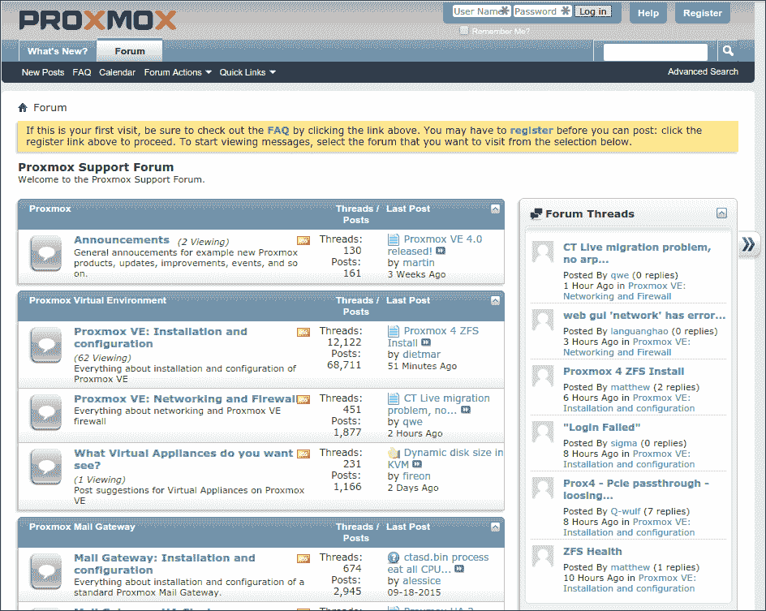

Proxmox 社区支持论坛

提供了一段视频教程，指导订阅用户上传订阅密钥到 Proxmox VE 并安装新更新，网址为 [`www.proxmox.com/en/training/video-tutorials/item/install-updates`](https://www.proxmox.com/en/training/video-tutorials/item/install-updates)。

从安全角度来看，`pve-no-subscription` 仓库在网站上被描述为提供的补丁不够稳定，不适合生产环境，而企业仓库承诺提供增强的安全补丁。你需要为你的使用案例做出有意识的选择。

如果你将非关键业务服务迁移到 Proxmox VE 虚拟基础架构中，或许社区支持和 `pve-no-subscription` 选项对你来说就足够了。否则，请充分考虑合适的订阅选项。

# 总结

保证管理员可以提供的安全性和信息显然永远不如它所消耗的精力那样全面。

在本章的第一部分，你了解了硬件虚拟化具有固有的安全优势。

然而，你也了解到，如果没有充分规划虚拟基础架构、事先明确的政策制定、无懈可击的部署，并且随后的政策执行和持续的虚拟服务器生命周期管理，许多有前景的好处将会被削弱。

接着我们概述了那些对虚拟化基础架构独有的，或在虚拟化环境中被加剧的威胁。每个要点后面都跟着具体的应对措施或更多资源的链接，帮助你解决潜在问题。

我们以具体的逐步措施总结，提出可以立即执行的补救方案，即使你继续探索和评估 Proxmox VE。
