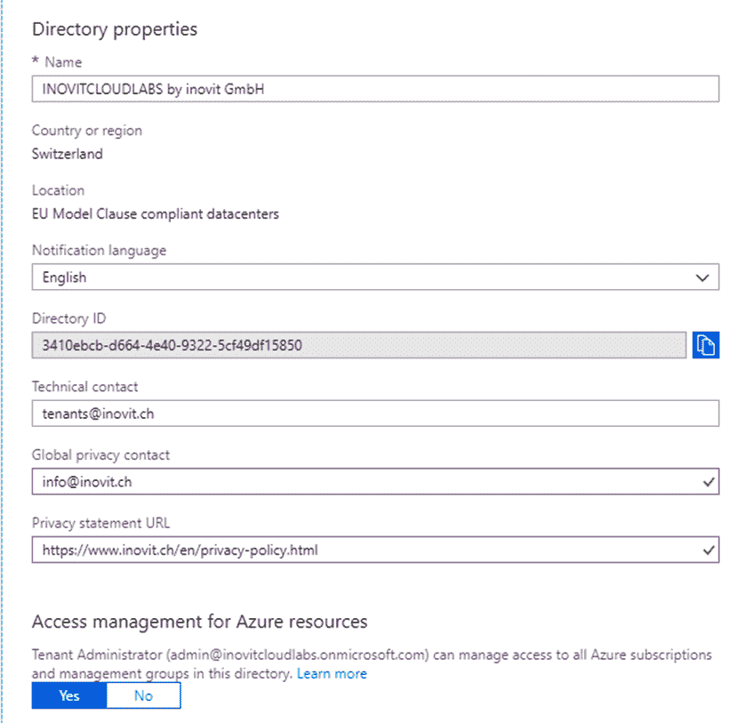
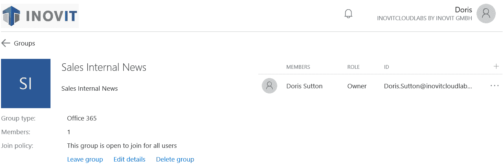
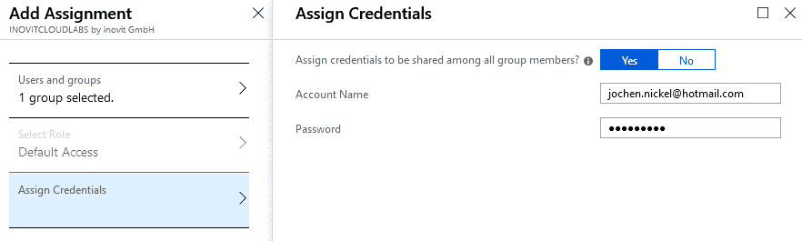
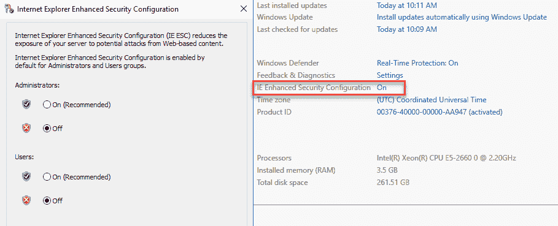

# 构建和管理 Azure Active Directory

使用多个 **软件即服务**（**SaaS**）产品，如 Office 365、Dynamics CRM 或 Visual Studio Online，要求在 Azure **Active Directory**（**AD**）中构建良好的身份和访问管理基础结构，这些产品是这些解决方案的核心。作为管理员，您需要提供一个稳定的身份和访问管理平台，以便管理这些服务。

本章解释了如何配置一个合适的 Azure AD 租户，我们将在全书中使用该租户来探索、理解并配置 Microsoft Azure 中身份和访问管理领域的不同功能和特性。我们从仅云组件开始，在后续章节中介绍混合身份和访问管理方法。

本章将直接进入配置，学习如何配置和管理用户、组、角色和管理单元，以提供基于用户和组的应用程序以及自助服务访问，包括审计功能。本章的重点如下：

+   实施场景概览

+   实施一个稳固的 Azure Active Directory

+   创建和管理用户及组

+   分配角色和管理单元

+   保护您的管理账户

+   提供基于用户和组的应用程序访问

+   启用密码重置

+   使用标准安全监控

+   集成 Azure AD 加入 Windows 10 客户端

+   配置自定义域

+   配置 Azure AD 域服务

现在，我们可以介绍实施场景。

# 实施场景概览

完成接下来的配置任务后，您将看到 Microsoft Azure 在身份和访问管理领域的丰富功能，从云身份开始。您可以在自己的 Microsoft Azure 环境中演示不同的功能。指导将集中在最关键的功能集上，帮助您了解它们的能力。我们将开始使用默认目录，目前我们称之为 `domain.onmicrosoft.com`，稍后将其更改为自定义域名。域名代表您希望使用的名称，比如 `example.com`，这也会用于本章中的用户 `userPrincipalName`，例如 don.hall@doamin.onmicrosoft.com，本章中代表的是我的示例域名 inovitcloudlabs。请注意，这个名称将在不同的应用程序中显示给最终用户，如 SharePoint Online 和 Skype for Business。我们建议使用公司名称而不带公司形式，例如，inovit GmbH 应为 `inovit.onmicrosoft.com`。为您的测试使用不同的名称，以确保生产环境的域名保持可用。此配置将成为本书所有后续场景的基础。因此，我们使用 **Azure**、**Enterprise Mobility Suite** 和 **Office 365** 订阅，以使用所有可用功能。

下图展示了本章节中我们将重点关注的不同主要领域：


章节场景概览

在下一部分中，我们将开始配置这些场景。

# 实施稳固的 Azure Active Directory

我们需要采取的第一步是获取一个 Azure AD 租户。有很多方法可以实现这一点。您可以从 Azure 订阅开始，或者使用 Microsoft SaaS 产品组合中的任何其他服务。让您的解决方案处于工作状态的最简单方法是从 Office 365 试用订阅开始。

打开浏览器并访问 [`bit.ly/1RVpFXe`](http://bit.ly/1RVpFXe)[.](http://bit.ly/1aZa9Xk) 订阅免费的 Office 365 企业 E5 计划：


Office 365 E5 试用请求

按照注册流程并定义您的用户 ID，例如 `admin@domain.onmicrosoft.com`。我们建议使用非个人 ID，如下截图所示。输入您的新用户 ID 和密码。您的默认目录名称将在 `@` 后面定义：


创建第一个全球管理员

接下来，您需要通过短信或电话验证身份并输入收到的验证码。然后，您需要点击“创建我的账户”。请记住，配置过程需要几分钟，并应以成功消息结束。

在成功创建了全新的 Azure AD 并关联了 Office 365 E5 计划后，您应该能够使用管理员凭据登录，并看到以下界面：


Office 365 管理门户

在下一步中，我们将为新创建的 Azure AD 租户分配 **Enterprise Mobility Suite** (**EMS**) E5 计划。

点击右侧的管理员图标，您应该会在“账单”标签下看到当前分配的订阅：


Office 365 订阅管理

点击“添加订阅”将 EMS E5 试用计划添加到您的 Azure AD 租户：


EM+S E5 试用请求

选择 EMS E5 计划并点击“开始免费试用”，然后按照订阅流程进行操作。订阅成功后，您可以在您的 Azure AD 租户中看到已分配的 Office 365 E5 和 EMS E5 计划。

现在我们已经创建了 Azure AD 租户，接下来需要订阅 Azure 免费试用订阅。此步骤对于使用 Azure 资源（如 Azure AD 域服务或我们将在后续章节中讨论的其他功能）是必要的。

您还可以使用以下方式获取 Azure 订阅：

+   使用全新的 Azure 订阅 ([`account.azure.com/organization`](https://account.azure.com/organization))

+   使用基于协议的 Azure 订阅

+   使用 MSDN Azure 订阅，如下图所示：


Visual Studio 订阅福利

请记住，你只能注册一个 Azure AD 免费试用订阅。

现在让我们配置你的管理工作站和个人 Azure AD 租户。

# 配置你的管理工作站

首先，我们需要设置一个功能齐全的管理工作站来完成本指南。你需要一台配置为工作组的 Windows 10 企业版客户端机器。我们推荐使用一台新安装的 Windows 10 企业版虚拟机。我们需要一台 Windows 10 设备来在本书稍后使用 Azure AD 加入功能。如果你无法访问批量授权版或 MSDN 版本，你可以使用企业评估版，下载链接是[`www.microsoft.com/en-gb/evalcenter/evaluate-windows-10-enterprise`](https://www.microsoft.com/en-gb/evalcenter/evaluate-windows-10-enterprise)[。](http://bit.ly/1P6o8Yc)

在本章的代码部分，你将找到以下 cmdlet，用于在你的客户端机器上安装所需的管理工具，基本上包括 Azure AD、MSOnline 和 Azure 资源管理器 PowerShell 模块：

1.  安装 Azure Active Directory PowerShell 模块：

```
Install-Module -Name AzureADPreview
```

1.  安装`MSOnline` PowerShell 模块：

```
Install-Module -Name MSOnline
```

1.  安装 Azure 资源管理器 PowerShell 模块：

```
Install-Module AzureRM
```

1.  使用 PowerShell 连接到`MSOnline`接口：

```
Connect-MsolService
# Provide your global administrator credentials
# View your assigned subscriptions
Get-MsolAccountSku
# View all actual users
Get-MsolUser
```

1.  创建你的第一个测试用户以验证 Azure AD 管理连接：

```
New-MsolUser -UserPrincipalName "jochen.nickel@inovitcloudlabs.onmicrosoft.com" -DisplayName "Jochen Nickel" -FirstName "Jochen" -LastName "Nickel" -UsageLocation "CH" -LicenseAssignment "inovitlabs:ENTERPRISEPREMIUM","inovitcloudlabs:EMSPREMIUM"

Get-MsolUser -UserPrincipalName jochen.nickel@inovitcloudlabs.onmicrosoft.com | fl
```

1.  直接连接到 Azure AD 接口，以比较与`MSOnline` PowerShell 模块的输出和功能：

```
Connect-AzureAD
Get-AzureADUser -all $true | where userprincipalname -eq jochen.nickel@inovitcloudlabs.onmicrosoft.com | fl
```

1.  从代码包中解压部署包。`C:\Configuration\HRExports`目录包含所需的人力资源导入和组创建脚本，用于用一些测试数据配置你的 Azure AD 租户：


示例脚本集

在`HRImportToAAD.ps1`脚本中，将使用以下重要变量：

```
$domain = Get-MsolDomain | where {$_.Name -notlike "*mail*"}
$dir = "C:\Configuration\HRExports"

# Also configure your PowerShell Execution Policy to RemoteSigned with the following cmdlet
# More information about this topic can be found under http://bit.ly/1EWLG03
Set-ExecutionPolicy -ExecutionPolicy RemoteSigned
```

域变量将包含`domain.onmicrosoft.com`，这是你 Azure AD 默认目录的名称。我们使用这个目录而不是注册的域名来执行不同的步骤。在本章末，我们将切换到自定义域，以便你可以探索所需的任务。如你所见，`dir` 变量包含脚本路径以及名为`NewHire.csv`的简单人力资源导出文件。文件中的`contoso.com`域名将被替换为存储在域变量中的你的域名。

`NewHire.csv` 文件包含以下示例用户集，将在未来的配置中使用，以演示不同的功能：

```
userPrincipalName,DisplayName,FirstName,LastName,password
Don.Hall@contoso.com,Don Hall,Don,Hall,Pass@word1
Ellen.Adams@contoso.com,Ellen Adams,Ellen,Adams,Pass@word1
Jeff.Simpson@contoso.com,Jeff Simpson,Jeff,Simpson,Pass@word1
Brian.Cox@contoso.com,Brian Cox,Brian,Cox,Pass@word1
Doris.Sutton@contoso.com,Doris Sutton,Doris,Sutton,Pass@word1
Petro.Mitchell@contoso.com,Petro Mitchell,Petro,Mitchell,Pass@word1
```

在接下来的步骤中，我们将为我们的全局管理员 `admin@domain.onmicrosoft.com` 分配 EMS E5 计划许可证。Office 365 E5 许可证已经通过创建过程分配。稍后在本章中，我们将通过动态组成员资格分配许可证，这是一项 Azure AD Premium P2 许可证功能：


许可证分配操作

点击“分配”并将 EMS E5 计划许可证添加到您的全局管理员账户。预期的结果如下：


分配的许可证概述

我们将获得正确的信息，表明该用户 ID 没有分配有效的订阅。接下来，注册一个 Microsoft Azure 订阅。

# 自定义公司品牌

大多数公司都希望看到如何将企业身份应用到 Azure 服务中。通过几个简单的步骤，您可以展示最重要的功能。要添加自定义品牌，您需要使用 Azure Active Directory Premium 1、Premium 2、Basic 或 Office 365 许可证。通过以下简单的示例，您可以看到可以自定义的内容。您可以用不同的语言提供定制内容，以满足您或您客户的需求。这些配置任务通常是演示或概念验证的良好起点。您可以自由使用自己的图片和设计来进行此设置：


自定义门户示例

我们将要更改的第一项是目录名称，位于属性部分。只需输入您希望的名称。我们使用了 `INOVITCLOUDLABS by inovit GmbH`。您还可以在登录页面提供您自己的技术和隐私联系人以及相关链接：



Azure AD 租户属性

点击“自定义品牌”，您将看到以下选项。为了帮助您准备图片和品牌，我们总结了 Microsoft TechNet 提供的帮助信息：


Azure AD 门户自定义选项

接下来，您将看到一个配置摘要。

# 帮助信息的总结和推荐

以下部分为您提供了多个功能，并总结了最重要的企业身份特性，以帮助您定制环境：

+   **横幅徽标**：从以下选项中选择：

    +   显示在 Azure AD 登录页面和 `myapps.microsoft.com` 上

    +   PNG 或 JPEG

    +   不能高于 36 像素或宽于 245 像素

    +   推荐—图片周围无边距

+   **登录页面正文文本**：从以下选项中选择：

    +   出现在 Azure AD 登录页面的底部

    +   仅支持 Unicode 文本，最大长度为 256 个字符

    +   用来传达您的帮助台电话号码或包含法律声明

    +   推荐—不要添加链接或 HTML 标签

+   **登录页面背景图像**：从以下选项中选择：

    +   显示在 Azure AD 登录页面的侧边

    +   PNG 或 JPEG

    +   推荐尺寸为 1420 x 1200，支持的文件大小为 300 KB（最大 500 KB）

    +   保持图像的精彩部分在左上角（图像会被调整大小和裁剪）

+   **用户名提示**：当用户忘记用户名时，显示的提示文本：

    +   Unicode，无链接或代码

    +   最多 64 个字符

+   **显示保持登录选项**：让您的用户在明确退出之前保持登录 Azure AD：


登录体验

你也可以通过以下文章进行一些广泛的自定义：[`docs.microsoft.com/en-us/azure/active-directory/fundamentals/customize-branding`](https://docs.microsoft.com/en-us/azure/active-directory/fundamentals/customize-branding)。

你的预期结果应该是这样：


门户自定义效果

现在我们已经提供了基本的公司品牌形象，我们可以开始创建和管理用户和群组。

# 创建和管理用户及群组

在接下来的步骤中，我们将连接到 Azure AD 并生成测试用户和群组。

启动 Azure AD PowerShell 控制台，并通过执行以下 cmdlet 和脚本连接到 Azure AD：

```
$msolcred = get-credential
# Enter your global administrator credentials
connect-msolservice -credential $msolcred
C:\Configuration\HRExports\HRImportToAAD.ps1
```

或者，你也可以直接使用`connect-msolservice`来连接，而无需使用变量。

启动脚本后，直接使用`admin@domain.onmicrosoft.com`凭证登录到[`portal.azure.com`](https://portal.azure.com)。在你的 Azure AD 下选择用户部分。你应该在“所有用户”标签页中找到来自`HireUsers.csv`文件的用户：


Azure AD 门户用户管理

打开[`portal.office.com`](https://portal.office.com) | 管理员 | 活跃用户，你可以看到在 Office 365 中具有有效许可证的用户：


Office 365 用户管理

让我们创建三个示例群组，代表公司组织，使用以下脚本：

```
C:\Configuration\HRExports\AddOrgGroups.ps1
```

现在，你将看到创建的群组：


Azure AD 群组管理

测试你的配置，打开[`myapps.microsoft.com`](https://myapps.microsoft.com)，使用用户`Don.Hall@domain.onmicrosoft.com`登录，你应该可以在访问面板 UI 中看到 Office 365 SharePoint、Outlook 和许多应用程序。点击 Outlook，你应该能够在无需额外登录信息的情况下打开应用程序并访问你的邮箱：


用户收件箱对话框

在接下来的步骤中，我们将为我们的组织群组提供一个所有者。

# 为组织群组设置群组所有者

为了提供由部门经理管理的群组管理，我们将以下用户分配为其部门群组的所有者：

+   会计部门：`Brian.Cox@domain.onmicrosoft.com`


群组 - 用户分配

对以下内容做同样的操作：

+   人力资源：`Don.Hall@domain.onmicrosoft.com`

+   销售部门：`Doris.Sutton@domain.onmicrosoft.com`

现在我们已经配置了所有者，接下来我们将开始委派管理权限。

# 组织群组的委派群组管理

Azure AD 的默认配置允许安全性或 Office 365 群组的所有者根据 Azure AD 访问面板和 Azure 门户中的数据所有者概念来管理群组成员。

此外，你还可以根据需求限制此功能：


Azure AD 中的群组选项

以 `Don.Hall@domain.onmicrosoft.com` 登录 [`myapps.microsoft.com`](https://myapps.microsoft.com)。点击 HR 群组并将 `Ellen.Adams@domain.onmicrosoft.com` 添加到 HR 群组：


Azure AD 访问面板 UI 中的群组视图

查看编辑详细信息下的加入策略。

在接下来的部分中，我们将配置群组自助服务选项。

# 配置自助服务群组管理

另一个需求可能是用户需要能够创建基于请求的安全组或 Office 365 群组，例如用于项目或分发群组。为此，他们需要具备审批流程的能力。你可以通过在群组管理的一般设置中启用该选项来提供此功能。此功能集需要 Azure Active Directory Premium：


自助服务群组管理选项

Office 365 群组包括分发列表，但也包含以下共享工具：

+   用于群组邮件通讯的收件箱

+   用于安排群组会议和事件的日历

+   用于存储和处理群组文件及文件夹的库

+   用于记录项目和会议笔记的 OneNote 笔记本

+   用于组织和分配任务，以及获取项目进展更新的计划工具

+   嘉宾访问（由管理员设置）

实际提示：使用不同的浏览器或隐身浏览选项来处理不同的用户会话：一个会话在 [`portal.azure.com`](https://portal.azure.com) 作为 `admin@domain.onmicrosoft.com`（管理员），另一个会话作为明确的用户（用户）在 [`myapps.microsoft.com`](https://myapps.microsoft.com)。

# 将销售内部新闻群组创建为 Office 365（分发群组）

以 `Doris.Sutton@domain.onmicrosoft.com` 登录 [`myapps.microsoft.com`](https://myapps.microsoft.com) 并将 `Sales Internal News` 群组创建为 Office 365 群组。检查群组策略，确保显示“此群组对所有用户开放加入”：


Azure AD 访问面板 UI - 群组创建

查看新创建群组的加入策略：



群组对话框 - Azure AD 访问面板 UI

在你的 Azure AD 中，群组下也会找到新创建的群组：


群组概览 - Azure AD 访问面板 UI

现在，作为群组所有者，我们更改群组设置，要求通过群组策略设置请求经理的审批：


群组编辑对话框

测试新配置，并以 `Don.Hall@domain.onmicrosoft.com` 登录 [`myapps.microsoft.com`](https://myapps.microsoft.com)。导航到群组。选择销售内部新闻：


加入群组对话框

加入“销售内部新闻”组并输入`业务理由`，点击“请求”，然后流程将开始。

以`Doris.Sutton@domain.onmicrosoft.com`身份登录到[`myapps.microsoft.com`](https://myapps.microsoft.com)。

检查您的收件箱。您应该已收到加入请求邮件和通知，并显示在访问面板 UI 中。

点击此请求并批准它：


组加入 - 通知

**注意**：接下来，您将看到“销售内部新闻”组的成员。

以`Don.Hall@domain.onmicrosoft.com`身份登录到[`myapps.microsoft.com`](https://myapps.microsoft.com)。

检查您的收件箱，您应该已经收到一条成功审批的消息：


批准消息 - 组成员身份

检查您的组成员身份，您应该是“销售内部新闻”组的成员：


Azure AD 访问面板 UI 中的组管理

接下来，我们将配置动态组成员身份。

# 配置动态组成员身份

在接下来的部分，我们将配置简单的动态组成员身份，使用部门属性将用户添加到其部门组，并建立动态许可证分配。目前，基于组的许可证不支持包含其他组（嵌套组）的组。

动态组中的每个用户都需要 Azure AD Premium P1 许可证。

启用动态组时，当前的成员身份将丢失。

用户的使用位置需要设置才能分配许可证。

作为`admin@domain.onmicrosoft.com`，选择会计组，导航到属性，并将成员类型更改为动态用户。

创建一个简单的规则，部门等于（-eq）`会计`：


动态组成员身份规则配置

将会计用户`Brian Cox`和`Jeff Simpson`的部门属性（个人资料部分）设置为会计：


填写动态组使用的用户属性

该成员应自动添加。检查组成员身份并验证两个新成员：


刚计算出的动态组成员身份

接下来，我们将提供自动化的许可证解决方案。

创建以下安全组：

+   Office 365 完全功能许可证

+   组描述：自动化 Office 365 完全功能许可证

+   成员类型：动态用户

+   动态查询：`userType -eq Member`：


组属性对话框

在许可证 | 产品下，分配 Office 365 E5 计划。此时不要选择任何分配选项：


组分配选项

**注意**：使用分配选项，您可以根据需要启用/禁用功能。

等待直到成员资格已更新，并检查 `Don.Hall@domain.onmicrosoft.com` 的许可证分配。

您将看到该用户通过直接分配和基于组的分配同时获得许可证：


许可证分配概览

该许可证解决方案为您提供了一个起点。您应当从所有通过组成员资格获取许可证的用户中移除直接分配的许可证。

在下一部分中，我们将配置角色分配给管理单元。

# 为管理单元分配角色

为了委派任务，我们使用创建 **管理单元**（**AUs**）并为特定任务分配角色。在这个配置中，我们创建一个 `HR [AU]`，并将 HR 部门的经理分配为在此作用域内管理用户账户的角色。

# 创建管理单元

首先，我们需要通过 PowerShell cmdlet Connect-AzureAD 连接到我们的 Azure AD，使用 `admin@domain.onmicrosoft.com` 用户。

使用以下 cmdlet 创建 `HR [AU]`：

```
New-AzureADAdministrativeUnit -Description "Human Resources Users" -DisplayName "HR"
```

查看预期输出：


新创建的管理单元

接下来，我们将添加相关用户。

# 向管理单元添加用户

接下来，我们将 HR 部门的用户添加到 `HR [AU]`。使用以下 cmdlet 执行此操作：

```
$HRAU = Get-AzureADAdministrativeUnit -Filter "displayname eq 'HR'"
$initialDomain = (Get-AzureADDomain)[0].Name
$HRUser1 = Get-AzureADUser -Filter "UserPrincipalName eq 'don.hall@$InitialDomain'"
$HRUser2 = Get-AzureADUser -Filter "UserPrincipalName eq 'ellen.adams@$InitialDomain'"
Add-AzureADAdministrativeUnitMember -ObjectId $HRAU.ObjectId -RefObjectId $HRUser1.ObjectId
Add-AzureADAdministrativeUnitMember -ObjectId $HRAU.ObjectId -RefObjectId $HRUser2.ObjectId
Get-AzureADAdministrativeUnitMember -ObjectId $HRAU.ObjectId | Get-AzureADUser 
```

上述命令的输出如下：


新增用户概览

接下来，我们将使用作用域选项。

# 限定管理角色的作用域

在下一步中，我们分配用户账户管理员角色。通过以下 cmdlet 验证可用角色：

```
Get-AzureADDirectoryRoleTemplate
```

现在，我们使用以下 cmdlet 启用用户账户管理员角色：

```
Enable-AzureADDirectoryRole -RoleTemplateId fe930be7-5e62-47db-91af-98c3a49a38b1
```

设置变量并将用户分配给角色：

```
$admins = Get-AzureADDirectoryRole
foreach($i in $admins) {
 if($i.DisplayName -eq "User Account Administrator") {
 $uaAdmin = $i
 }
 }

$HRUA = Get-AzureADUser -Filter "UserPrincipalName eq 'Don.Hall@$InitialDomain'"
$uaRoleMemberInfo = New-Object -TypeName Microsoft.Open.AzureAD.Model.RoleMemberInfo -Property @{ ObjectId = $HRUA.ObjectId }
Add-AzureADScopedRoleMembership -RoleObjectId $uaAdmin.ObjectId -ObjectId $HRAU.ObjectId -RoleMemberInfo $uaRoleMemberInfo
```

上述命令的输出如下：


用户账户管理员分配

接下来，我们将测试我们的配置。

# 测试您的配置

打开新的 PowerShell 并使用 `Connect-MsolService` 命令连接到 Azure AD，并使用 `Don.Hall@domain.onmicrosoft.com` 的凭据登录。

修改分配给 HR 管理单元的用户账户：

```
Set-MsolUser -UserPrincipalName ellen.adams@domain.onmicrosoft.com -Department HR
```

验证您的修改：

```
Get-MsolUser -UserPrincipalName ellen.adams@domain.onmicrosoft.com | select Department
```

接下来，我们将使用 Azure AD Premium P2 的 **特权身份管理**（**PIM**）功能来保护管理账户。如果您不想投资 Azure AD Premium P2，我们建议使用 Azure MFA 来保护您的管理账户。

# 保护您的管理账户

在这一部分中，我们将使用 Azure AD Premium P2 PIM 来保护管理账户，进行简要介绍。

以 `admin@domain.onmicrosoft.com` 打开 [`portal.azure.com`](https://portal.azure.com) 开始配置。

单击“所有服务”，然后选择 Azure AD 特权身份管理。

现在，我们需要同意使用 PIM 服务：


特权身份管理 - 启用

您需要验证您的身份并提供您首选的安全验证选项，正如以下截图所示：


Azure MFA 入职

如果您已经在移动设备上使用 Microsoft 身份验证器应用程序，您也可以注册该移动应用程序。

完成验证过程并点击同意—继续：


同意以完成初始化

接下来，我们将在 Azure AD 角色下进行注册，以便用户可以启用 Azure AD 角色。点击“为 Azure AD 角色注册 PIM”以激活该功能：


Azure AD 角色 - PIM 注册

现在功能已启用，我们可以将角色分配给用户。

点击“分配资格”以开始任务：


角色分配程序

点击全局管理员角色，查看实际成员，并将您的测试帐户添加到该角色中：


用户角色分配

查看预期结果：


新的符合条件的用户已分配到角色

让我们通过打开一个 `InPrivate` 浏览器会话来测试我们的配置；打开 [`portal.azure.com`](https://portal.azure.com) 并使用您的测试帐户登录。点击“所有服务”并选择 Azure AD 特权身份管理。选择“我的角色”并为您的帐户激活全局管理员角色：


角色激活程序

接下来，您需要验证您的身份。按照流程注册并验证您的帐户。您只需完成注册过程一次：


启动验证过程

注册和验证过程完成后，您可以激活您的角色：


角色激活

提供您角色激活的理由。您会注意到该角色仅限于 `1` 小时，并且您可以定义自定义的激活时间。稍后在本书中，我们将配置不同的角色和功能：


激活选项，如自定义激活开始时间和激活原因

验证您的角色是否已激活。您已成功请求通过 Azure AD PIM 获取全局管理员角色。这非常有用，因为高权限不会永久分配给您的帐户：


活跃角色概览

我们始终建议您保留一个全局管理员角色，并且不要求使用 Azure MFA 来使用该帐户。如果 Azure AD PIM 或 MFA 服务不可用，请将此帐户用作“Breaking Glass”帐户。

接下来，我们将在 Azure AD 中配置基于用户和组的应用访问权限。

# 提供基于用户和组的应用访问权限

在这个部分，我们配置一个典型的工作场所，用户可以在访问面板 UI ([`myapps.microsoft.com`](https://myapps.microsoft.com)) 下访问。我们将应用程序分配给用户和群组，以查看不同的功能。这些步骤不包含所有的单一登录或配置选项。我们将在后续章节中详细讨论这些功能集。

使用全局管理员凭据登录到 [`portal.azure.com`](https://portal.azure.com)，并在企业应用程序部分的应用程序库中添加若干应用程序。添加应用程序后，我们分配账户，这些账户将获得访问权限。

构建一个如下所示的应用程序列表，并分配所有群组以访问这些应用程序，除了用户配置的群组：


Azure AD 应用程序管理

您将注意到具有和没有用户配置的格式差异。

测试您新配置的工作场所，并作为 `don.hall@domain.onmicrosoft.com` 登录到 [`myapps.microsoft.com`](https://myapps.microsoft.com)：


Azure AD 访问面板 UI - 应用程序访问

同时，测试在 Office 365 上的用户体验，并登录为 `don.hall@domain.onmicrosoft.com` 到 [`portal.office.com`](https://portal.office.com)。

接下来，我们将为用户分配应用程序。

# 将应用程序分配给用户并定义登录信息

在下一步中，我们将为 Don Hall 分配 LinkedIn 应用程序，并使用公司凭据。Don Hall 将无法看到凭据。因此，如果他离开公司，凭据仍然受到保护。

从应用程序库中添加 LinkedIn 应用程序并分配给 Don Hall 访问此应用程序：


应用程序 - 用户和群组分配

接下来，我们提供有效的 LinkedIn 凭据。如果您没有 LinkedIn 账户，请注册一个演示账户：


Azure AD 凭据存储

如果您将应用程序分配给一个群组，您可以决定是否共享凭据：

可用的凭据集工作选项如下：

+   **使用共享凭据查看**：用户仅需点击应用程序几秒钟后即可查看。请使用 Twitter 应用程序进行测试。

+   **无共享凭据查看**：用户需要首次添加所需凭据。请使用 Twitter 应用程序进行测试。

如果作为管理员不提供凭据，您将获得相同的行为。

使用用户账户测试此行为，将应用程序分配给群组，并定义登录信息。

# 将应用程序分配给群组，并定义登录信息。

在接下来的步骤中，我们为 HR 群组等群组执行相同操作，这些群组用于从个人 Twitter 频道获取新闻：



填写 Azure AD 凭据存储以访问应用程序。

从应用程序库中添加 Twitter 应用。分配 HR 组并配置凭证。使用 HR 组的用户在 [`myapps.microsoft.com`](https://myapps.microsoft.com) 检查应用。

现在，我们可以配置自助服务应用管理。

# 自助服务应用管理

在这一部分，我们允许用户将应用程序添加到他们的工作场所，访问 [`myapps.microsoft.com`](https://myapps.microsoft.com)，以享受单点登录功能。在 Azure AD 的配置部分，导航到企业应用。激活此处显示的功能：


企业应用管理选项

作为 `Ellen.Adams@domain.onmicrosoft.com` 登录 [`myapps.microsoft.com`](https://myapps.microsoft.com)，点击获取更多应用并添加 MailChimp。添加 MailChimp 后，点击管理应用并选择 MailChimp。

作为 `admin@domain.onmicrosoft.com` 登录 [`manage.windowsazure.com`](https://manage.windowsazure.com)，您可以在 Azure AD 的企业应用部分看到新添加的应用。

配置应用，添加一些用户，并进行测试！

# 密码重置自助服务功能

在这一部分，我们配置 Azure AD 的密码重置功能，以减少支持成本并确保 24/7 可用性。我们对服务没有任何限制，只需要一个验证选项来重置密码：


密码重置 - 属性对话框选择激活选项

为了验证重置，我们使用了几种方法：


密码重置 - 身份验证选项

我们激活的下一个选项将强制用户进行注册：


密码重置 - 注册要求及确认选择

接下来，我们配置相关的通知。

# 配置通知

在这一部分，我们配置通知选项，以便管理员能够在发生异常登录或管理员密码重置时收到通知：

1.  配置如下所示的通知：


密码重置 - 通知选项

1.  用户将被强制注册进行密码重置，如下图所示：


注册强制

现在，我们将测试新配置的功能，并查看所需的注册场景以及验证选项。接下来，我们将检查密码重置。

测试新配置的设置，并以 `Don.Hall@domain.onmicrosoft.com` 登录 [`myapps.microsoft.com`](https://myapps.microsoft.com)。

您将收到一条消息，提醒您需要注册进行密码重置：


验证器应用 - 设置过程

为 Don Hall 添加您首选的方法。您将收到一条短信、电子邮件或其他您定义的响应方式。

管理员用户默认需要两种验证选项。

以`admin@domain.onmicrosoft.com`身份登录到[`myapps.microsoft.com`](https://myapps.microsoft.com)，您将看到要求提供两种验证选项。

在接下来的步骤中，我们将验证功能。

# 测试密码重置过程

在您喜欢的浏览器中打开`https://myapps.microsoft.com`，并输入`Don.Hall@domain.onmicrosoft.com`。点击“无法访问您的帐户？”选项，或使用以下链接[`passwordreset.microsoftonline.com`](https://passwordreset.microsoftonline.com)开始密码重置过程。您将进入验证过程，并需要按照任务完成。完成过程后，使用新密码登录。

# 使用标准的安全监控

在本节中，我们将配置并模拟一些在 Azure AD 监控部分报告的典型事件。

首先，我们配置一个密码保护功能，自定义智能锁定。我们将值设置为`10`次错误登录：


Azure AD 密码保护功能

如果您错误输入密码 10 次，您应该会收到以下消息：


锁定消息对话框

您可以在监控 | 登录部分查看活动：


Azure AD 监控功能

您还可以使用**CyberGhost**（[`www.cyberghostvpn.com/en_us`](http://www.cyberghostvpn.com/en_us)）等模拟软件测试来自不同地理位置的登录。另一种选择是使用 Azure 虚拟机。

使用跨地区的账户登录，比如欧洲和亚洲之间的地区。这需要远程机器，位于不同的时区，并且尽可能紧密地进行登录：

+   从您的本地 PC 登录到[`myapps.microsoft.com`](https://myapps.microsoft.com)，以`Don.Hall@domain.onmicrosoft.com`身份登录

+   在不同于原始 PC 时区的机器上，以`Don.Hall@domain.onmicrosoft.com`身份登录到[`myapps.microsoft.com`](https://myapps.microsoft.com)。

要配置具有异常登录活动的用户，您可以使用 Tor 浏览器：

+   使用像 Tor 这样的匿名浏览工具

+   从[`www.torproject.org/download/download-easy.html.en`](https://www.torproject.org/download/download-easy.html.en)下载安全的 Tor 浏览器

打开 Tor 浏览器，访问[`myapps.microsoft.com`](https://myapps.microsoft.com)，并以`Don.Hall@domain.onmicrosoft.com`身份登录。您的用户帐户将被锁定。

在安全监控中，预期会看到以下结果：


安全监控概览 - Azure AD

现在我们已经简要浏览了安全监控选项，我们将把 Windows 10 客户端集成到 Azure AD 中。

# 为 Windows 10 客户端集成 Azure AD 加入功能

在本章节中，我们将配置 Azure AD 加入功能，并将我们的第一台 Windows 10 客户端加入到 Azure AD。

我们为每个用户配置最多五个设备，并保持其他默认值：


Azure AD - 设备设置

在接下来的章节中，我们将把我们的客户端加入到 Azure AD。

# 将您的 Windows 10 客户端加入 Azure AD

登录到您刚安装的 Windows 10 客户端机器并进入设置。选择“连接”进入工作或学校访问部分：


Azure AD 加入过程对话框

我们使用 `don.hall@domain.onmicrosoft.com` 登录，并将 Windows 10 客户端加入 Azure AD：


加入操作概述

按照接下来的步骤点击完成客户端的加入。之后，我们将检查新的状态。预期的结果是连接到您的 Azure AD 名称：


Azure AD 加入客户端消息

接下来，我们将验证 Azure AD 加入过程。

# 验证新加入的 Windows 10 客户端

使用 `don.hall@domain.onmicrosoft.com` 的凭据登录 Windows 10 客户端，并点击完成安全策略配置。点击执行这些策略。点击完成 PIN 设置并完成流程，然后测试用户体验：

+   打开邮件应用，您将看到系统识别了您的用户 ID，并提供单点登录功能。

+   此外，如果您打开 [`myapps.microsoft.com`](https://myapps.microsoft.com)，您将直接登录到访问面板界面：


不同的邮件账户选项

在验证 Azure AD 加入后，我们将配置一个自定义域名。请注意，如果您想测试相关功能，您需要注册一个域名。

# 配置自定义域名

在 Azure Active Directory | 自定义域名部分，点击“添加自定义域名”，并完成验证过程以证明您是该域名的所有者：


实际配置的域名

将显示的 TXT 记录添加到您的 DNS 区域以验证域名：


域名验证选项

在 Azure 门户中点击验证按钮，验证成功后，新的 `DOMAIN NAME` 将出现在域名列表中。选择设置为主域名选项：


自定义域名概述与配置选项（设置为主域名或下载 Azure AD Connect 工具）

打开 [`portal.office.com`](https://portal.office.com)，在管理员部分完成域名设置过程：


Office 365 设置向导

选择要用于电子邮件地址的自定义域：


登录和邮件选项

我们需要采取的最后一步是将新的 `UserPrincipalNames` 设置为现有用户。我们使用一个小的示例脚本解决方案来实现：

1.  使用全局管理员凭据连接到你的 Azure AD：

```
Connect-AzureAD
```

1.  使用以下 cmdlet 将现有用户导出为 CSV 文件：

```
Get-AzureADUser -All $True | Where { $_.UserPrincipalName.ToLower().EndsWith("onmicrosoft.com")} | Export-Csv C:\Office365Users.csv
```

1.  删除所有不需要修改的账户，并使用以下 cmdlet 进行更改：

```
$domain = "inovitlabs.ch"
Import-Csv 'C:\Office365Users.csv' | ForEach-Object {
$newupn = $_.UserPrincipalName.Split("@")[0] + "@" + $domain
 Write-Host "Changing UPN value from: "$_.UserPrincipalName" to: " $newupn -ForegroundColor Green
 Set-AzureADUser -ObjectId $_.UserPrincipalName -UserPrincipalName $newupn
}
```

1.  你应该得到类似以下的结果：


活跃用户概览

主电子邮件也将更改为自定义域。

接下来，我们将配置 Azure AD 域服务，以提供一个基于 Kerberos 的应用程序过渡场景，这通常是在本地基础设施中提供的。

# 配置 Azure AD 域服务

为了将基于 Kerberos 身份验证的传统应用程序集成到 Azure **基础设施即服务**（**IaaS**）场景中，我们配置 Azure AD 域服务。在本节中，我们配置基础服务并集成一个活动示例应用程序：


Azure AD 域服务创建

要开始配置，我们需要指定 DNS 域名、要使用的 Azure 订阅以及资源组的名称：


Azure AD 域服务配置

启用 Azure AD 域服务时，你需要指定使用哪个 Azure 虚拟网络。我们使用 `192.168.x.x/20` 范围来配置网络：


虚拟网络配置

将管理员账户和测试用户添加为 Azure AD 域服务管理员组成员：


Azure AD 域服务管理员组成员

总结应如下所示：


配置总结

接下来，你将被要求更新 DNS 配置为 Azure AD 域服务提供的 DNS 服务器地址。在我的案例中，这些地址是 `192.168.0.4` 和 `192.168.0.5`：


DNS 配置

要使用刚创建的域，你需要完成的最后一个重要步骤是启用密码同步：


同步用户的说明

默认情况下，Azure AD 不会存储 Kerberos 认证所需的凭证哈希。你需要将这些凭证哈希填充到 Azure AD 中，以便用户可以使用它们对域进行身份验证。该过程可以通过更改用户的密码来完成。你可以在 Azure AD 域服务中等待 20 分钟后使用这些账户。

你有两个选择：让所有用户的密码过期，或者指示这些终端用户更改其密码。

用户可以通过 Azure AD 访问面板页面使用 Azure AD 的自助密码更改机制更改密码。

# 测试并验证您的新 Azure AD 域服务

为了测试域服务，我们完成以下任务：

1.  在您的 Azure IaaS 环境中通过使用部署模板安装虚拟 Windows Server（[`docs.microsoft.com/en-us/azure/active-directory-domain-services/active-directory-ds-join-windows-vm-template`](https://docs.microsoft.com/en-us/azure/active-directory-domain-services/active-directory-ds-join-windows-vm-template)）：


虚拟机部署配置

1.  在新加入的服务器上安装 Active Directory 和 DNS 管理工具：

```
Install-WindowsFeature RSAT-ADDS,DNS-Server-Tools
```

1.  连接到 Active Directory 用户和计算机（`dsa.msc`）以及组策略管理控制台，验证您的配置：


Azure AD 域服务结构，包括同步对象

1.  接下来，我们需要为我们的测试应用创建 DNS 主机（A）记录：


1.  现在，我们可以安装基本的 IIS 配置，用于处理 Kerberos 部分。为此，您需要安装 IIS 组件，选择 Kerberos 身份验证功能，并在默认网站上激活它。只需激活 Windows 身份验证即可：


IIS 身份验证配置用于 Kerberos 示例应用

1.  接下来，我们将安装并配置 Azure AD 应用代理连接器，为用户提供应用。我们使用以下 cmdlet 配置所需的基于资源的 KCD 功能：

```
# inovitcloudlabs represents the computer name
$ConnectorComputerAccount = Get-ADComputer -Identity inovitcloudlabs
Set-ADComputer inovitcloudlabs -PrincipalsAllowedToDelegateToAccount $ConnectorComputerAccount
setspn -S HTTP/kerb.inovitlabs.ch inovitlabs\inovitcloudlabs
```

1.  接下来，我们将激活并配置 Azure AD 应用代理。为了简化操作，我们禁用 IE 增强型安全配置，这样就无需提供任何 IE 安全区配置，仅限实验室使用：



服务器管理器 IE 增强型安全配置

1.  接下来，我们需要下载连接器并将其安装到服务器上：


应用代理代理下载与配置

要在服务器上配置连接器，您需要为用户提供全局管理员权限。

1.  安装并配置连接器后，我们将添加我们的示例应用：


Azure AD 应用代理连接器组配置选项

1.  接下来，我们按照以下方式配置我们的示例应用：


Kerberos 示例配置

1.  接下来，我们配置**集成 Windows 身份验证**（**IWA**）选项：


应用 IWA 配置

最后，我们分配一些用户或组，并在[`myapps.microsoft.com`](https://myapps.microsoft.com)上测试应用程序。结果，您应该看到 IIS 测试页面。我们提供了一个基于 Kerberos 的应用程序到 Azure AD 域服务，并使用了 Azure AD 应用代理功能。

# 总结

完成此实施场景后，您将能够配置和管理一个适合的 Azure AD 租户，处理最重要的任务。您还将能够将 Windows 10 和 Office 365 集成，以便为用户建立一个高效的工作团队，而无需本地基础设施。如果您错过了某些功能，不用担心，这只是热身。

在下一章，我们将讨论启动混合集成所需的身份同步，并为您的需求提供正确的身份同步场景。
