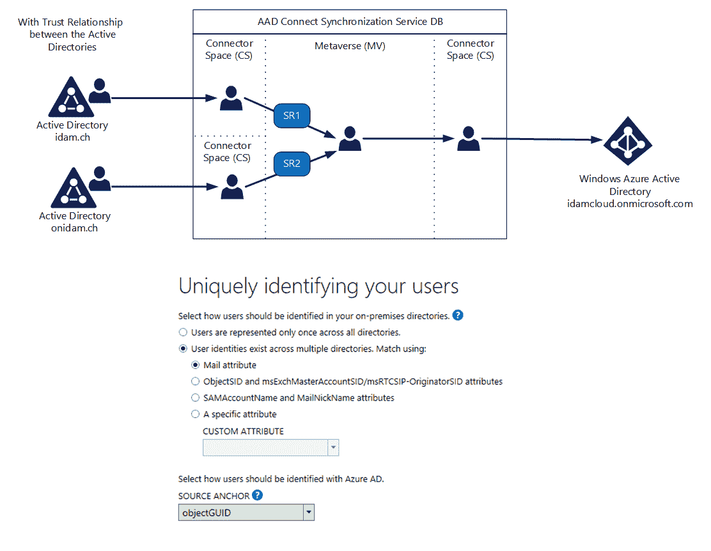
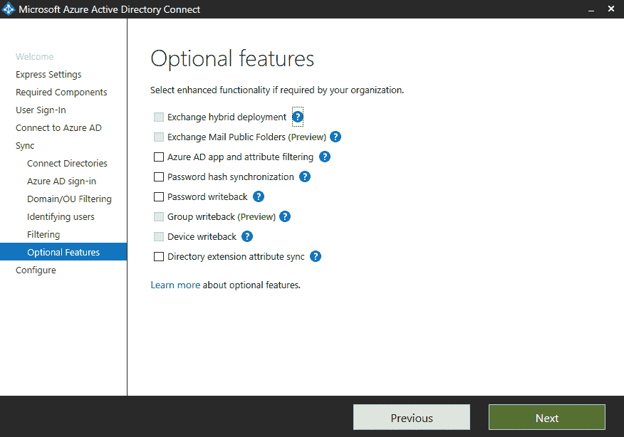
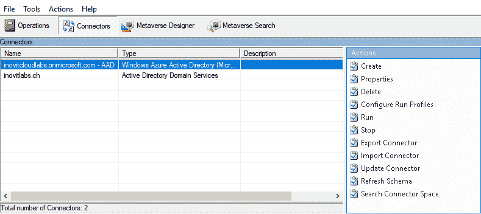
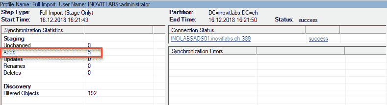

# 理解身份同步

混合身份和访问管理解决方案的主要组成部分是本地 **Active Directory**（**AD**）与 **Azure** **Active Directory**（**AAD**）之间的连接，包括对象和属性的相关同步。微软力图使同步过程简化，管理员无需了解系统内部的所有细节。

在本章中，我们将讨论实现完整的混合身份生命周期管理所需的基本身份同步场景和工具。我们将从**Microsoft Identity Manager**（**MIM**）和 Azure AD Connect 工具的概述开始，然后深入探讨身份同步场景。接下来，我们将介绍混合环境中 AD 用户账户清理的不同流程，以及 Azure AD Connect 中身份同步的所有关键部分和步骤。本章最后将提供许多实用提示和使用案例。

我们将涵盖以下基本主题：

+   技术概述

+   同步场景

+   同步术语和流程

在第一部分中，我们将从技术概述开始。

# 技术概述

**Microsoft Identity Manager**（**MIM**）2016 或其他身份管理产品通常用于为云同步准备存储在本地 Active Directory 中的身份。Azure AD Connect 工具通常用于将 AD 身份同步到 Azure AD，以便在连接的**软件即服务**（**SaaS**）应用程序或其他功能中使用。MIM 2016 为该解决方案提供的主要优势是，通过工作流支持业务流程，帮助进行域/林整合、属性标准化，以及完整的本地身份管理。

如下图所示，MIM 2016 同样能够与 Azure AD 同步身份。因此，你可能在想，应该使用哪个工具来同步 Azure AD 的身份。

对于常见场景，简短而实际的答案是 Azure AD Connect 工具，因为它支持 Microsoft Azure AD 提供的所有同步功能。

下图展示了两种工具的使用场景示意图：


身份同步架构

Azure AD Connect 不提供活动用户回写。您会发现此选项在 Azure AD Connect 配置中被禁用。要添加此功能，您可以像在 Azure B2B 用户管理中一样，使用 MIM Graph API 连接器，将来宾用户回写到您的 AD 中。要查看工具之间的比较，请访问[Hybrid Identity 目录集成工具比较](https://docs.microsoft.com/en-us/azure/active-directory/hybrid/plan-hybrid-identity-design-considerations-tools-comparison)[.](https://bit.ly/2zXq9Ir)，并参考*混合身份目录集成工具比较*。

# 微软身份管理器（MIM）2016

MIM 2016 是微软的主要身份与访问管理产品，提供了在这一领域所需的所有不同服务器角色和组件。MIM 2016 主要用于在本地环境中提供一个清洁的、集中的身份。在混合架构的上下文中，它在连接任何存储库以管理不同存储库中的身份方面发挥着至关重要的作用。此外，该组件还提供复杂的身份管理场景。这也包括今天市场中 Azure AD 和许多 SaaS 应用程序的管理，您可以在以下图表中看到：


身份管理器功能和对象

以下部分简要概述了 MIM 2016 的关键组件，帮助解决方案架构师/工程师识别设计蓝图中可能的交互或需要包含的元素。我们也在书中提供的实施指南中使用了一些组件，例如在第八章，*使用 Azure AD 应用程序代理和 Web 应用程序代理*，在其中我们实现了 Azure AD 的**企业对企业**（**B2B**）场景。

MIM 2016 提供的主要功能集如下：

+   身份同步，包括提供/撤销权限

+   访问请求和访问策略管理

+   委派管理

+   自助密码重置和账户解锁

+   自助组管理

+   角色管理（RBAC，ABAC，SoD）

+   手动管理的组

+   基于管理者的组

+   基于条件的组（基于属性的访问控制）

+   限时组成员资格

+   证书管理

+   报告与合规性以及访问认证

如果您希望将 MIM 2016 作为您的中央身份管理系统，我们强烈建议您查看**工作流活动库**（**WAL**）[`microsoft.github.io/MIMWAL/`](http://microsoft.github.io/MIMWAL/)。此外，Windows Server 2016 中新集成的特权访问管理解决方案与 MIM 2016 结合使用，为管理和限制行政账户的安全问题提供了一种非常有效的方法。

# MIM 同步服务

MIM 同步服务是该产品的核心。您可以在一个中心身份存储中导入和聚合数据，该存储被称为**元宇宙**（**MV**）。该服务提供了一个暂存区，用于将连接的目录与元宇宙进行比较。此暂存区称为**连接器空间**（**CS**）。与任何存储库的连接是通过特定的连接器进行的，这些连接器也称为**管理代理**（**MAs**）。同步服务还负责所有连接存储库的数据完整性，包括对象的配置和撤销配置，以及它们的属性。您可以在 [`docs.microsoft.com/en-us/microsoft-identity-manager/supported-management-agents`](https://docs.microsoft.com/en-us/microsoft-identity-manager/supported-management-agents) 查找可用连接器的概述。如果您需要自定义连接器，MIM 提供了一个开发框架以满足您的需求。

以下截图显示了可以连接的不同目录和系统的示例：


Microsoft 身份管理器同步服务管理器

请参考以下实用的注意事项：

+   默认情况下，MIM 同步服务是基于状态的系统：

    +   导入的数据将与之前导入的数据进行比较；差异表示源数据已被修改

    +   导入的数据将与之前导出的数据进行比较；如果没有差异，表示导出成功

+   MIM 不是实时的；它使用可以配置的运行周期

MIM 同步可以通过同步服务扩展实现基于事件的工作方式，详情请参见以下章节。

# MIM 同步服务扩展

要扩展 MIM 同步服务的功能，您可以使用 Lithnet AutoSync。Lithnet AutoSync 作为 Windows 服务运行，并与 MIM 同步服务一起工作。该服务使您能够自动执行 MIM 管理代理的运行配置文件。此外，Lithnet AutoSync 使您能够在 MIM 同步引擎检测到更改时自动执行导出和增量同步。现在，您拥有一个基于事件和支持运行周期的同步引擎。以下截图显示了在前面截图中看到的同步引擎配置：


Lithnet Autosync 管理控制台

若要了解更多关于 Lithnet AutoSync 工具的信息，请访问 [`github.com/lithnet/miis-autosync`](https://github.com/lithnet/miis-autosync)[.](https://bit.ly/2UMTgXM)

# MIM 服务和门户

MIM 服务提供所有必要的策略和工作流功能。所有对象，如组、用户、工作流、请求和 MIM 中使用的其他资源，都存储为 MIM 服务数据库中的对象。这些对象可以通过典型的 CRUD（**创建**、**读取**、**更新**、**删除**）操作请求来修改，访问 MIM 服务 **身份管理**（**IdM**）平台。

使用 MIM 门户，用户通过网页浏览器与系统进行交互。使用方式取决于权限；用户可以被授予执行请求、响应审批请求、取消现有的待处理请求或管理 IdM 系统中的对象的权限：


Microsoft Identity Manager 标准门户

默认的 MIM 门户基于 SharePoint 解决方案，可以高度自定义。你可以在[`docs.microsoft.com/en-us/microsoft-identity-manager/reference/mim-portal-customizations`](https://docs.microsoft.com/en-us/microsoft-identity-manager/reference/mim-portal-customizations)找到一些示例配置。

# MIM 服务扩展

Lithnet **Forefront Identity Manager**（**FIM**）/MIM 服务 REST API 是 FIM/MIM 服务的 **简单对象访问协议**（**SOAP**）/**Windows 通信基础**（**WCF**）端点的包装器，通过一系列标准的 HTTP 调用暴露创建、更新、删除和搜索功能。API 返回 JSON 格式的数据，兼容各种平台和服务。默认情况下，MIM 不提供 REST API 给 MIM 服务。通过这个扩展，你可以为 MIM 2016 添加自己的功能，例如我们所做的自定义门户，或者与 Power BI 和其他技术进行交互以提供定制解决方案。有关 Lithnet REST API for FIM/MIM 服务的更多信息，请访问 [`github.com/lithnet/resourcemanagement-webservice`](https://bit.ly/1PsgEjp)。

# MIM 密码重置与用户账户解锁

MIM 提供两项与密码相关的功能，可以帮助你在本地环境中提供解决方案：

+   **密码同步**：基于 AD 密码更改或重置，将密码同步到其他存储库

+   **密码与账户自助服务**：独立门户提供自助密码重置和账户解锁功能

以下截图展示了基于网页的密码重置和账户解锁功能：


Microsoft Identity Manager 自助密码重置对话框

特别是，如果你的环境中有较旧的 Windows 客户端，如 Windows 7 或 Windows 8/8.1，你可以在 Windows 登录界面提供密码重置功能。Azure 中的密码重置功能仅支持 Windows 10 客户端，但提供比 MIM 解决方案更多的验证选项。

请注意，MIM 2016 无法提供类似 Azure AD Connect 在混合场景中的密码哈希同步。

# MIM 特权访问管理

MIM 2016 提供了一种**特权访问管理**（**PAM**）解决方案，限制现有 AD 环境中的特权访问。

PAM 解决以下两个目标：

+   如果提供一个与恶意攻击隔离的单独堡垒环境，您可以恢复对受损 AD 环境的控制权

+   通过隔离特权账户，您可以限制丧失敏感凭据的风险

PAM 有助于解决以下问题：

+   Pass-the-hash 和 Pass-the-ticket 攻击

+   Kerberos 妥协或鱼叉式网络钓鱼

+   未经授权的权限提升

+   其他漏洞和攻击

以下截图展示了 MIM PAM 示例门户中的角色激活和用户验证过程，您可以根据需要自定义：


MIM 特权访问管理示例门户

现在您已经了解了 MIM 的标准功能，我们将为您提供我们与合作伙伴公司共同开发的额外解决方案概述。希望它能给您提供一些关于 MIM 的扩展可能性的想法。

# 额外的解决方案

基于我们多年在身份和访问管理领域的经验以及成功实施的项目，我们决定在我们的解决方案中映射出那些常见需求，以填补我们无法通过 MIM 标准功能满足的空白。

以下五个关键支柱将由我们的解决方案提供，使我们能够实现高度标准化、灵活且可定制的身份和访问管理流程：


Inovit 身份解决方案——构建模块

**组织管理**及前端的主要功能如下：

+   支持多种云场景和传统 IT 基础设施

+   组织结构的表示（参数化和继承）

+   组织结构管理（手动或同步）

+   允许您构建高效的基于角色的访问控制

+   使您能够提供有利的成本管理

+   用户友好且高度响应的前端

+   **单页应用**（**SPA**）架构

+   集成的治理功能

+   不需要安装 SharePoint

+   高度可定制

+   用于本地或仅云部署的单一前端

+   明确的未来投资策略

+   云管理

以下截图示意性地展示了前端：


身份目录 SPA 门户

**用户管理**的主要功能如下：

+   标准流程（入职、变更、离职）

+   有时间限制的用户账户

+   标准和管理员用户账户管理

+   Azure B2B 账户管理

+   自动生成`samAccountName`和用户

+   为云使用对齐 UPN、电子邮件和 SIP

+   密码重置和账户解锁

以下截图简要显示了前端中的位置和角色分配：


身份管理服务基于职位的访问管理

**访问管理**的主要特点如下：

+   基于职位、角色和属性的访问管理

+   权限直接分配给用户（如有需要）

+   审批和通知工作流支持

+   特权账户的管理

+   授权的直接视图和报告

+   与 SharePoint 和 Microsoft Teams 等服务的双向接口

**服务管理**的主要特点如下：

+   系统和服务的自动化和简便适配

+   服务目录的表示

+   基于同步的订单单元

+   基于工作流的订单单元（通知和审批）

+   Office 365 和其他云服务的管理

# 基于身份管理服务的云部署

通过我们的基于 Azure 的下一代 SaaS 集成，您将能够选择从哪里开始实施，无论是基于 MIM 的本地部署还是直接在云端。也将有一个完全支持的云过渡路径。在 Azure 上，我们使用身份管理服务和 Cosmos DB 后端，它提供与您现有的本地 MIM 平台相同的功能和额外的功能。高度响应的前端对用户没有任何变化。

# 基于 MIM 2016 的本地部署

MIM 2016 代表了微软的本地身份和访问管理解决方案。MIM 2016 为我们的本地部署方法构建了基础平台。借助强大的同步框架和众多接口，如 REST、SOAP、LDAP、SQL、PowerShell 和基于文件的接口，您可以协调 AD 身份与 Azure AD 的同步。MIM 2016 服务提供了一个主导的工作流组件，它基于状态和事件工作，以解决您的业务的身份和访问管理需求。通过 MIM 2016，您可以受益于云就绪身份、强大的用户自助服务和增强的安全性。

现在我们已经快速了解了 MIM，以及用于准备和管理 AD 对象的其他可用扩展和解决方案，我们将继续连接到 Azure AD。

# Azure Active Directory Connect

Azure AD Connect 是构建混合云身份和访问管理的身份桥梁的一部分。此工具的主要目的是将本地身份同步到云，并限制回 AD。Azure AD Connect 还能够安装和配置整个身份桥梁。这意味着你还可以使用此工具安装和配置**Active Directory 联邦服务**（**ADFS**）基础设施，以进行联邦操作，或者结合无缝的**单点登录**（**SSO**）使用通行身份验证，从而提供现代且舒适的身份验证场景。这些工具还能够集成外部联邦工具，如 PingFederate。

以下截图为你提供了 Azure AD Connect 组件的示意图，我们将在本章中解释其实际使用：


Azure AD Connect 同步架构概览，包括管理功能

以下术语在前图中使用：

+   **连接的数据源（CD）**：可以通过存储库、目录、数据库或包含在平面文件中的数据来表示的数据源。

+   **管理代理或称为连接器（MA）**：**管理代理**（**MA**）是连接到 CD 的连接器，并管理与连接数据源相关的数据。目前，AD 和 Azure AD 是支持的 MAs，如你在这里看到的：[`docs.microsoft.com/en-us/microsoft-identity-manager/reference/microsoft-identity-manager-2016-connector-version-history`](https://docs.microsoft.com/en-us/microsoft-identity-manager/reference/microsoft-identity-manager-2016-connector-version-history)。

+   **连接器空间** (**CS**)：表示存储和暂存区。它存储指示 CD 中某一信息是否已更改的状态。每个 CD 在 CS 中都有其逻辑区域。

+   **元宇宙：** 中央数据存储，包含来自所有连接数据源的已导入和汇总的身份信息。它提供了所有对象和属性的全局视图。

+   **暂存：** 如果你在 MA 上运行暂存导入操作，如完全/增量导入（仅暂存），数据将从**连接目录**（**CD**）导入到 CS 中，但不会应用任何同步规则。因此，暂存导入不会影响元宇宙。

+   **导入：** 将来自连接数据源的对象和属性移动到连接器空间的过程，包括相关操作，如创建、修改、删除或验证。导入过程可以是完全导入或增量导入。

+   **同步：** 将所有配置的规则应用于连接器空间中的暂存对象的过程。同步可以分为入站和出站过程。

+   **导出：** 将同步过程中发生的更改从 CS 写回到连接数据源的过程。

# 同步场景

在创建新的 Azure AD 租户时，默认情况下，目录信息与本地 AD 林的管理是独立的。因此，基本上，必须在两个目录中创建一个新用户：Azure AD 和本地 AD。除非你经营一个纯云公司，否则你总是需要将本地 AD 的身份同步到你拥有的 Azure AD 租户，以提供单一身份。在同步过程完成后，Azure AD 和 AD 可以视为一个独特的身份服务。接下来的部分为你提供了几种集成场景，包括用户登录选项。我们将这个部分分为以下几种情况：

+   单森林集成

+   多森林集成

+   多 Azure Active Directory 集成

+   Azure Active Directory 域服务集成

+   扩展的 Active Directory 到 Azure IaaS

+   Azure Active Directory B2B 集成

+   Azure Active Directory 和 Microsoft Office 365 同步

+   包括 SSO 选项的身份和密码哈希同步

+   包括 PingFederate 集成的身份同步

+   包括 ADFS 集成的身份和密码哈希同步

+   Azure Active Directory Connect 高可用性

让我们从单森林集成开始。

# 单森林集成

单森林场景是最常用的场景。单一森林可以包含一个或多个域，并且只需一个 **Azure AD** 实例。**Azure AD Connect** 的快速设置支持这种场景。我们建议过滤对象，以便服务账户、计算机或其他对象不会同步到云：


Azure AD Connect 单森林集成场景

额外的 **Azure AD Connect** 服务器连接到相同的 **Azure AD** 不被支持。排除的是使用 **Azure AD Connect** 阶段模式的高可用性选项，这将在*Azure Active Directory Connect 高可用性*一节中解释。

# 多森林集成

较大的组织或分布式组织通常会有多个本地 AD 环境。它们通常用于账户/资源林，或者通过并购而来。这些规则需要遵循：

+   用户在所有本地 **Active Directory Forests** 中仅有一个启用的账户

+   `UserPrincipalName` 和源锚点将由森林提供

+   用户只有一个邮箱

+   拥有关联邮箱的用户在不同的森林中也有账户

+   不需要在加入域的服务器上使用 **Azure AD Connect**

下图展示了账户/资源林场景：


Azure AD Connect 多森林集成场景

记住：一个 Azure AD 上不支持多个林和多个**Azure AD Connect**工具。唯一的例外是使用暂存服务器。暂存服务器可以为高可用场景（主动/被动）进行配置。在此场景中，暂存服务器不会将信息导出到目标系统。

如果你有多个林，只有一个同步服务器，并且用户仅在一个目录中表示，并且你选择了“用户在所有目录中只表示一次”选项，那么每个林中的每个对象在元宇宙中只表示一次，并且会在目标 Azure AD 租户中聚合：


包括同步映射的 Azure AD Connect 多林集成场景。

如果你有多个林，并且有可选的 GALSync，则应使用“用户身份在多个目录中存在”选项。

如果你使用邮件属性作为匹配标准，身份对象将与邮件属性连接。这将导致以下行为——在一个林中的邮箱用户与其他林中的联系人进行连接：



多林集成场景（邮件属性映射）。

确保对象在 AD 林中是唯一的非常重要。如果每个林中的对象都是唯一的，你就处于一个良好的位置。通过对象匹配和连接，当使用云服务时，你可以提供一个良好的状态。通过连接，优先级的同步规则也会发挥作用。如果你基于邮件地址和特定属性值连接两个对象，其中对象 1 没有填写而对象 2 已填充，则将使用对象 2 的属性值。但如果两个对象都用不同的值填充了该属性呢？这时优先级规则就会生效。

优先级较高的规则会晚于优先级较低的规则执行。

优先级会在将林添加到 Azure AD Connect 时设置。因此，如果对象 1 的林在对象 2 的林之前添加，则对象 1 的值将胜出。前面的图示展示了这个场景。

其他对象是联系人，你会在实现了两个林之间的**全局地址列表**（**GAL**）同步的场景中找到这些联系人。Azure AD Connect 提供了以下默认行为：

+   如果 Azure AD 联系人发现联系人与用户匹配，将会进行连接。

+   如果没有用户对象可用，将会创建一个联系人对象。

+   如果找到了一个后续的用户对象与联系人匹配，则会在 AAD 中创建一个用户对象。

+   如果你有一个帐户/资源林场景，并且使用了“用户身份在多个目录中存在”选项。

如果使用 **ObjectSID** 和 **msExchangeMasterAccountSID** 属性的匹配标准，预期结果是用户将在此林中被禁用。此外，邮箱将与账户林关联。用户将在 Azure AD 中唯一展示：


账户/资源林集成场景

上图还显示了 Azure AD Connect 在检查 AD 对象是否为链接邮箱之前的行为。它将尝试匹配 **msExchMasterAccountSID**。这将通过 **recipientTypeDetails** 属性完成。`2` 的值表示它是一个链接邮箱。请记住，禁用的用户账户默认也会同步到 Azure AD。停用的账户通常用于 Exchange-资源林部署。账户林持有活动用户账户，资源林持有禁用的用户账户。我们将在 第三章《探索高级同步概念》中讨论规则优先级。

# 多 Azure Active Directory 集成

有时您需要多个 Azure Active Directory，例如，如果您的组织部分位于中国，或者您需要遵守政府法规。对于每个 Azure AD 目录，您需要进行一次 Azure AD Connect 安装。

在单林过滤场景下，若要连接多个 Azure AD，需要执行以下操作：

+   必须为 Azure AD Connect 配置过滤

+   DNS 域注册只能在单个 Azure AD 中进行

+   本地用户的 UPN 必须使用不同的命名空间

+   联邦配置需要自定义

+   一个 Azure AD 目录可以启用与本地 AD 的 Exchange 混合

+   全局地址列表同步需要通过 MIM 2016 执行

+   Windows 10 设备只能与一个 Azure AD 租户关联

+   启用密码哈希同步和直通身份验证的 SSO 选项只能与一个 Azure AD 租户一起工作

+   可以实现组和设备的写回场景

下图显示了多个 Azure AD 的情况：


将多个 Azure AD 连接到一个 AD 林

不支持将同一用户同步到多个 Azure AD。

# Azure Active Directory 域服务集成

此服务提供在 Azure 中将 AD 域服务作为服务使用的功能。它提供两个域控制器，并具有较小的管理选项。它与您的 Azure AD 直接集成。它是完全迁移到云端的一个优秀选项，适用于您所有的本地使用场景。这为小型公司提供了一个没有本地基础设施的机会。试想一下，主遗留的 **LOB** 现在可以在 Azure AD 集成场景中使用，并且一切都将在服务条件下管理：


Azure AD 域服务集成场景

该解决方案提供了支持 NTLM/Kerberos 和 LDAP 应用程序的功能。您还可以在打印解决方案的示例中安全地暴露 LDAP。我们在第一章《构建和管理 Azure Active Directory》中使用了这个选项。请注意，您需要在 Azure AD Connect 中启用密码哈希同步选项，以便用户可以在 Azure AD 和 Azure AD 域服务之间成功同步。此外，您还可以享受以下附加功能：

+   **AD 账户锁定保护**—如果在 2 分钟内输入 5 次无效密码，用户将被锁定 30 分钟。账户将在 30 分钟后自动解锁。

+   **自定义** **组织** **单位**（**OUs**）—您可以创建多个 OUs。

+   **组策略支持**—您可以使用组策略来管理服务器。

# 将扩展的 Active Directory 迁移到 Azure IaaS

将本地 AD 域服务扩展到 Azure IaaS 为您提供了一个非常灵活的场景，可以在云端使用您的业务应用程序。要使用此集成，您需要建立到 Azure 的 VPN 或 Express Route 连接。

域控制器是非常敏感的角色，关于服务的信任问题是最需要关注的方面。许多替代方案不支持像这种一样无缝的迁移到 Azure：


将您的 Active Directory 扩展到云端

请参考以下注意事项：

+   **域控制器 (RW)**：这是 IaaS 工作负载的最佳选择，并且会考虑到您的复制要求

+   **域控制器 (RO)**：通常用于安全性较差的场景，并且不适合 IaaS 工作负载

+   **资源林场景**：不建议在 IaaS 中使用

在下一节中，我们将详细介绍 Azure AD B2B 集成场景。

# Azure Active Directory B2B 集成

Azure AD B2B 允许任何合作伙伴在协作场景中使用他们自己的身份和凭据。关于认证流程和功能，我们将在第八章《使用 Azure AD 应用程序代理和 Web 应用程序代理》和第十章《探索 Azure AD 身份服务》中进行更深入的探讨。现在，我们先简要概述一下同步部分：


Azure AD B2B 本地应用程序访问场景

对于**Azure AD B2B** 用户使用本地 Kerberos 应用程序，我们需要将来宾用户账户同步回**本地 Active Directory**。为此，您需要在本地 AD 中提供您的默认 Azure AD 域后缀。在我们的案例中，它是`inovitcloudlabs.onmicrosoft.com`。您可以在 AD 域和信任控制台中找到该选项：


将你的 Azure AD 租户后缀添加到本地 UPN 后缀

注册新的 UPN 后缀是必要的，因为 Azure AD 应用程序代理会检查本地 AD 是否存在来宾用户 `UserPrincipalName`，例如 `jochen.nickel_inovit.ch#EXT#@inovitcloudlabs.onmicrosoft.com`。

微软提供了一个默认的解决方案，用于将来宾用户同步回本地 AD；可以查看[`bit.ly/2Bor7xy`](https://bit.ly/2Bor7xy)。该解决方案包含了所需的 MIM 2016 配置或脚本来成功部署该解决方案。别担心，稍后我们将在本书中完成默认配置和扩展。

# Azure Active Directory 和 Microsoft Office 365 同步

以下场景适用于大多数 Office 365 服务，因为每个服务都会在 Azure AD 内部使用自己的目录来存储和管理身份。特别是对于 SharePoint，我们在**用户资料应用程序**中需要许多额外的属性，但无法配置 Azure AD 与 SharePoint Online 之间的同步。你可以在[`support.office.com/zh-cn/article/information-about-user-profile-synchronization-in-sharepoint-online-177eb196-5887-43c9-84c3-b98a43d35129`](https://support.office.com/zh-cn/article/information-about-user-profile-synchronization-in-sharepoint-online-177eb196-5887-43c9-84c3-b98a43d35129)找到所有默认属性。以下图示展示了 SharePoint Online 同步的场景：


Azure AD 到用户资料应用程序同步扩展

其中一个选项是使用微软 Azure AD Graph API 扩展同步部分。在我们的案例中，我们使用了基于 Azure Functions 和 Logic Apps 的完整无服务器解决方案。

# 身份和密码哈希同步，包括 SSO 选项

通过将身份和关联的密码哈希从本地 AD 同步到 Azure AD，我们可以为不想投资 ADFS 基础设施的小型公司构建一个基本场景。此外，无需 SSO。使用此场景时，可以使用相同的密码来验证用户，无论是在云端还是本地，具体取决于访问的是哪个资源。此外，密码重置和账户解锁功能在拥有 Azure AD Premium 许可证的情况下可用。要求是启用密码哈希同步的 Azure AD Connect。可选的密码写回功能已启用。

对于此过程，存在重新哈希功能，它允许用户在本地 AD 和 Azure AD 中具有两个不同的哈希值。此外，还支持多林同步。

以下图示展示了身份和密码哈希同步场景：


Azure AD Connect 密码哈希同步场景

若要将 SSO 添加到解决方案中，可以在 Azure AD Connect 工具中启用透传认证和无缝 SSO 功能。这是微软最常推荐的选项，用于减少复杂性，并将 Azure AD 作为提供身份验证的中央系统，支持您的 SaaS 和本地 Kerberos/基于声明的应用程序：


启用 PTA 和无缝 SSO

强烈建议启用密码哈希同步，这样在本地服务中断时，用户仍然可以使用云服务。现在，您可以通过[`docs.microsoft.com/en-us/azure/active-directory/hybrid/how-to-connect-pta`](https://docs.microsoft.com/en-us/azure/active-directory/hybrid/how-to-connect-pta)了解此功能。[](https://bit.ly/2SOVtAk)

# 包括 PingFederate 集成的身份同步

微软现在直接将非微软产品集成到 Azure AD Connect 中。第一个集成的产品是 PingFederate，市场上非常流行。目录同步没有变化——您启用 PingFederate 作为您的联合提供商，而不是 ADFS：


集成 PingIdentity 进行联合身份认证和基于标头的认证

微软在这次合作中做出的主要决策是，逐步向混合身份管理方式转变，以帮助您快速启用 Microsoft 和其他云服务。

# 包括 ADFS 集成的身份和密码哈希同步

在实现联合身份认证后，所有认证都保留在本地，所有密码仅存储在本地。所有认证流量都会从 Azure AD 重定向到本地 ADFS，后者将用户认证到受信任的 AD 域。此场景通常适用于不同规模的公司，如果需要 SSO 且出于安全原因禁止密码哈希同步时。

要求是在高度可用的部署中，除了 Azure AD Connect 外，还使用联合服务提供商，如 ADFS。

下图显示了与 ADFS 场景下的身份和密码哈希同步：


将联合身份认证与密码哈希同步结合

您还可以将 ADFS 集成与密码哈希同步结合，以便在本地基础设施出现故障时，用户仍然可以通过已知密码访问云服务。

# Azure Active Directory Connect 高可用性

出于高可用性考虑，新的 Azure AD Connect 服务器可以在几个小时内重建并重新同步，适用于小型或中型企业。

请记住，`sourceAnchor` 属性用于连接本地和云端的对象。同步引擎在重新安装时会再次将这些对象匹配起来。

记录你的配置更改（如特殊过滤或同步规则）非常重要。在开始同步过程之前，你需要重新应用这些设置。你可以使用 Azure AD Connect 文档工具（[`github.com/Microsoft/AADConnectConfigDocumenter`](https://github.com/Microsoft/AADConnectConfigDocumenter)）来保存你的更改。

对于拥有超过 100,000 个用户、组和其他对象的大型组织，重新构建同步会花费更多时间。如果需要更快的恢复时间，可以将 Azure Active Directory Connect 配置为使用专用的 SQL 服务器部署并启用 SQL 高可用性。此选项可以直接提供所需数据。超过 100,000 个用户时，必须使用 SQL 服务器，因为大型组织希望同步服务的恢复时间较短。

提供高冗余系统的另一种方式是使用另一台安装并配置为暂存模式的 Azure Active Directory Connect 服务器。此功能还可以缩短恢复时间。

以下图示显示了暂存模式配置：


启用 HA 的暂存模式

在 Azure AD Connect 版本 1.1.524.0 中，微软添加了 SQL **始终在线可用性**（**AOA**）组支持。SQL 群集在早期版本中已被加入。请注意，在安装 Azure AD Connect 之前需要启用 SQL AOA。

# 同步术语和过程

在本节中，我们将讨论并实现同步术语和流程的实际应用。我们将理论与实践直接结合。因此，我们将立即在 Azure AD Connect 工具中安装、配置并运行这些流程。为了使用这些指导，你应该部署一台启用域控制器角色的虚拟机。

在 Azure 或本地虚拟化平台上构建虚拟机。一个很好的选择是按照[`docs.microsoft.com/en-us/office365/enterprise/base-configuration-dev-test-environment`](https://docs.microsoft.com/en-us/office365/enterprise/base-configuration-dev-test-environment)上的指南进行操作，使用你免费的 Azure 或 MSDN 订阅。我们为你提供了本书代码包中的完整脚本解决方案，或者你可以按照第七章，*在 Azure AD 和 ADFS 上部署解决方案*中的说明操作。

我们使用了你在第一章中使用的相同域名，*构建和管理 Azure Active Directory*。在我们的案例中，我们使用的是域名`inovitlabs.ch`。因此，你需要根据自己的环境更改脚本。

现在我们已经建立了主要的测试环境，可以开始在域控制器上准备和安装 Azure AD Connect。我们使用这个场景来降低测试环境的成本。请注意，在接下来的章节中，我们将扩展测试环境，以展示本书中讨论的功能。

你准备好了吗？让我们准备域：

1.  使用域管理员凭据登录，并运行以下脚本来创建演示的组织单位结构：

```
New-ADOrganizationalUnit -Name "Managed Business Objects" -Path "DC=INOVITLABS,DC=CH"

New-ADOrganizationalUnit -Name "Users" -Path "OU=Managed Business Objects,DC=INOVITLABS,DC=CH"

New-ADOrganizationalUnit -Name "Groups" -Path "OU=Managed Business Objects,DC=INOVITLABS,DC=CH"

New-ADOrganizationalUnit -Name "Devices" -Path "OU=Managed Business Objects,DC=INOVITLABS,DC=CH"

New-ADOrganizationalUnit -Name "Managed Service Objects" -Path "DC=INOVITLABS,DC=CH"

New-ADOrganizationalUnit -Name "AAD" -Path "OU=Managed Service Objects,DC=INOVITLABS,DC=CH"

New-ADOrganizationalUnit -Name "Users" -Path "OU=AAD,OU=Managed Service Objects,DC=INOVITLABS,DC=CH"
```

以下图示显示了预期的结果：


Azure AD 服务组织单位

1.  启用活动目录回收站功能：

```
Enable-ADOptionalFeature –Identity 'CN=Recycle Bin Feature,CN=Optional Features,CN=Directory Service,CN=Windows NT,CN=Services,CN=Configuration,DC=inovitlabs,DC=ch' –Scope ForestOrConfigurationSet –Target 'inovitlabs.ch'
```

1.  创建**组管理服务账户**（**gMSA**）来运行 Azure AD Connect 服务。将计算机名称替换为你为测试环境选择的名称：

```
Add-KdsRootKey -EffectiveTime (Get-Date).AddHours(-10) 
New-ADServiceAccount -Name svcaadconnect -DNSHostname INOLABSADS01 -PrincipalsAllowedToRetrieveManagedPassword INOLABSADS01$
```

1.  创建活动目录管理代理的服务账户，用于连接并执行同步操作：

```
New-ADUser -Name "svcaadcadma" -SamAccountName svcaadcadma -UserPrincipalName svcaadcadma@inovitlabs.ch -path "OU=Users,OU=AAD,OU=Managed Service Objects,DC=inovitlabs,DC=ch" -AccountPassword (ConvertTo-SecureString "Pass@word1" -AsPlainText -Force) -Enabled $True 
```

活动目录管理代理账户需要在域级别配置正确的权限。

1.  配置权限以配置`svcaadcadma` Azure AD Connect 与活动目录用户和计算机控制台（`dsa.msc`）。不要忘记在查看选项下启用高级功能，这样你就能看到安全选项卡：

    +   复制目录更改

    +   复制目录更改全部

以下截图显示了预期的结果：


为 Azure AD Connect 活动目录管理代理服务账户分配正确的权限

现在我们已经完成了测试环境中的准备工作，让我们逐步通过以下部分进行理论解释和实际操作。在每个任务中，我们将使用相同的凭据在评估过的 PowerShell 会话中执行。

# 用户主体名称后缀决策

`UserPrincipalName`是本地 AD 与**Azure AD**连接中最相关的用户属性之一。Azure AD Connect 遵循以下规则：


用户主体名称决策路径

如前面的图示所示，AAD Connect 默认使用以下逻辑：

+   如果有 UPN 可用，它将被使用

+   如果 UPN 不可用，它将使用用户的**sAMAccountName**和连接 AD 域的**完全限定域名**（**FQDN**）

+   如果要导出到 Azure AD 的 UPN 未被验证，后缀将被替换为**<tenant>.onmicrosoft.com**

记住，用户可以存在于任何已同步的林中，且它们包含`UserPrincipalName`和`sourceAnchor`。如果使用了联机邮箱，则会被忽略，因为同步引擎会找到用户的活动和停用账户表示。

# 活动目录准备

为了准备你的 AD 环境，你可以使用 IdFix 工具，可以从[`bit.ly/1VnsvVn`](http://bit.ly/1VnsvVn)下载。它会执行身份对象及其属性的发现和修复，准备同步到 Azure AD。IdFix 提供给计划使用 Azure AD Connect 与 Azure AD/Office 365 服务的 AD 管理员。你可以在每种同步场景中使用该工具：


IdFix 工具发现的错误用户账户

为了测试 IdFix 工具，我们将使用以下脚本创建一些错误的测试用户：

```
New-ADUser -Name "James Meyers" -GivenName J. -Surname Meyers -SamAccountName jmeyers -UserPrincipalName james.meyers@local -path "OU=Users,OU=Managed Business Objects,DC=inovitlabs,DC=ch" -AccountPassword (ConvertTo-SecureString "Pass@word1" -AsPlainText -Force) -Enabled $True

New-ADUser -Name "Adrian Gilbert" -GivenName Adrian -Surname Gilbert -SamAccountName adrian.gilbert -UserPrincipalName "adrian.gilbert @inovitlabs.ch" -path "OU=Users,OU=Managed Business Objects,DC=inovitlabs,DC=ch" -AccountPassword (ConvertTo-SecureString "Pass@word1" -AsPlainText -Force) -Enabled $True

New-ADUser -Name "Wilma Chavez" -GivenName Wilma -Surname Chavez -SamAccountName wilma.chavez -UserPrincipalName "wilma.chavez°@inovitlabs.ch" -path "OU=Users,OU=Managed Business Objects,DC=inovitlabs,DC=ch" -AccountPassword (ConvertTo-SecureString "Pass@word1" -AsPlainText -Force) -Enabled $True
```

以下截图显示了预期的结果：


损坏用户账户的创建结果

现在我们可以运行 IdFix 工具，检查本地 AD 中是否有用户会在同步过程中出现错误：


在损坏的用户账户中发现的错误

测试完 IdFix 工具后，请删除创建的测试用户账户。

在接下来的步骤中，我们将开始安装 Azure AD Connect 工具：

1.  运行 Azure AD Connect 安装程序。请从[`www.microsoft.com/en-us/download/details.aspx?id=47594`](https://www.microsoft.com/en-us/download/details.aspx?id=47594)下载实际版本的工具[并使用域管理员凭据启动安装。](https://bit.ly/1JPD3qY)

1.  选择自定义安装选项，以便查看所有必要的配置步骤。我总是使用自定义选项，而不是快速安装选项。

1.  使用在之前步骤中创建的 gMSA 来配置 Azure AD Connect 服务：


服务账户配置

1.  此时，我们未设置任何用户登录选项：


用户登录配置

在下一部分，我们将讨论 Source Anchor 决策过程，所以点击下一步并等待下一部分实验。

# Source Anchor 决策

理解 Source Anchor 至关重要，因为它为 AD 域服务用户与 Azure AD 用户之间的关系奠定基础。`sourceAnchor`属性是不可更改的。请确保你的配置符合预期场景。

该属性为你提供以下功能：

+   支持更快的重建场景

+   支持从云端独立场景迁移到与硬匹配的同步场景

+   在联合身份验证场景中，它使用`UserPrincipalName`构建声明，以唯一标识用户

选择`sourceAnchor`属性时需要遵循以下规则：

+   少于 60 个字符

+   不允许使用特殊字符，如{, }, |, ~, <, >, (, ), ' ; : , [, ], ", @, _,\, !, #, $, %, &, *, +, /, =, ?, ^, 或 `

+   全球唯一

+   字符串、整数或二进制

+   不应基于用户的名字，且区分大小写

+   在对象创建时分配

Azure AD Connect 使用以下默认设置作为 `sourceAnchor` 属性：

+   Azure AD Connect（版本 1.1.486.0 及之前版本）使用 objectGUID 作为 `sourceAnchor` 属性

+   Azure AD Connect（版本 1.1.524.0 及之后版本）使用 ms-DS-ConsistencyGuid 作为 `sourceAnchor` 属性

以下截图展示了 Azure AD Connect 安装向导中的配置：


Azure AD Connect 的 sourceAnchor 定义

管理代理用户账户必须被授予对本地 AD 中 ms-DS-ConsistencyGuid 属性的写权限。请记住，只有更新版本的 Azure AD Connect（1.1.552.0 及之后版本）支持将 `sourceAnchor` 属性从 ObjectGuid 切换到 ms-DS-ConsistencyGuid。

# 连接目录

来自 Azure AD Connect 的 **同步引擎**处理来自 AD 和 Azure AD 的身份。每个目录或数据源以其方式组织数据并提供不同的访问方法。与 Azure AD Connect 同步的数据存储库称为连接数据源或 **连接目录**（**CDs**）。Azure AD Connect 支持的两个 CD 是 AD 和 Azure AD。您可以连接任何其他存储库，但这在微软不支持的方式下进行。以下图示展示了同步的基本概念：


连接器和连接目录的基本概念

现在，让我们回到 Azure AD Connect 配置并重新登录到您的域控制器。

我们将配置这两个数据源：

1.  提供您的全球管理员凭据来自您的 Azure AD，并点击“下一步”：


将 Azure AD Connect 连接到 Azure AD

1.  连接本地 Active Directory：


连接本地 AD

1.  使用创建的 AD 管理代理账户进行此任务：


配置 AD 管理代理服务账户

1.  找到您的已验证自定义域，在我的例子中是 inovitlabs.ch：


定义登录选项

1.  在域和 OU 筛选页面，选择创建的“管理业务对象”OU。使用以下设置，任何新建的 OU 都不会包含在同步过程中：


OU 筛选选项

1.  使用以下选项，所有在“管理业务对象”下新建的 OU 都将包含在同步过程中：


OU 筛选选项的第二部分

1.  配置我们在 *Source Anchor decisions* 部分讨论过的 `sourceAnchor` ms-DS-ConsistencyGuid：


sourceAnchor 定义对话框

1.  在“筛选用户和设备”部分，选择默认选项。您也可以使用组选项进行概念验证：


过滤用户和设备对话框

1.  在可选功能部分，您会看到可用的同步选项，这些选项我们在集成方案中已经讨论过。请记住，您需要正确的权限来让活动目录管理代理帐户回写到本地 AD：



Azure AD Connect 可选功能部分

1.  点击下一步以完成配置。确保不要启用同步过程，因为我们是按步骤进行的。

在完成 Azure AD Connect 安装向导后，这些目录将会被连接，并且可以在连接器下的同步服务管理器中查看：



Azure AD Connect - 连接的目录

安装和配置 Azure AD Connect 工具后，我们可以深入研究同步的详细部分。在即将到来的第三章《探索高级同步概念》中，我们将启用可用的回写、扩展和过滤选项。

# 导入流程

内部同步引擎包含两个命名空间，用于存储身份信息：CS 和**元目录**（**MV**）。CS 用于检测连接数据源中的更改。连接器空间还用于导出过程中对外部更改的处理，以更新连接数据源。

数据可以单向流动，但不能同时双向流动。

简单回顾一下：MV 是一个存储区域，其中包含来自多个连接数据的聚合身份信息。非常重要的是要理解每个同步引擎对象必须具有数据集成的**全局唯一标识符**（**GUID**）以及对象之间的关系。

导入过程是在连接的数据源和连接器空间之间完成的。因此，我们提供了有关连接器空间的一些信息。

连接器空间对象具有两个属性：

+   **全局唯一标识符**（**GUID**）

+   **区分名称**（**DN**）

CS 对象可以是以下之一：

+   一个 CS 对象

+   一个占位符

下图显示了**同步引擎**的示意图：


同步引擎概述

现在让我们看看导入流程的实际操作。请记住，我们已经在我们的 Azure AD 中有来自第一章《构建和管理 Azure AD》的用户：

1.  登录您的域控制器并打开 Azure AD Connect 同步服务管理器。

1.  在连接的活动目录上运行完整导入：


完整导入配置文件运行

1.  同步引擎将组织结构（占位符）导入 CS：



完成完整导入后的统计信息

1.  您可以看到导入的组织结构：


导入的对象

1.  对连接的 Azure Active Directory 执行完全导入：


Azure AD 完全导入

1.  在 CS 中不会创建对象。请记住，我们已经在 Azure AD 中拥有用户—不支持用户回写：


完全导入 Azure AD 统计信息

此外，在导入流程中与 MV 不会有任何交互。在下一部分，您将进一步了解占位符对象。

# 占位符对象

占位符对象的一个示例是验证 AD 对象路径的容器。我们还可以谈论一个占位符对象，它是经理属性所引用的对象。通常，我们可以说占位符对象不包含值，并且与 MV 不关联。

运行配置文件—每个森林一个，每个域一个步骤：

+   我们将所有对象导入（暂存）到 CS 中（即使通过连接器筛选器进行过滤）

+   完全导入—所有对象

+   增量导入—仅更改的对象

接下来，我们将进入同步流程部分。

# 同步流程

同步流程是特定于 CS 和 MV 对象之间的处理流程。通常，我们可以说多个 CS 对象可以链接到一个 MV 对象。这是典型的，因为 MV 代表所有连接系统中的唯一身份对象。另一方面，CS 对象不能与多个 MV 对象链接，如下图所示：


同步流程概览

同步流程是通过同步规则配置的，您可以在 Azure AD Connect 同步规则编辑器中查看这些规则：


同步规则编辑器概览

在第三章，*深入探讨高级同步概念*，我们将详细讨论同步规则。现在，我们将专注于主要功能和解释。

# 入站同步

入站同步由一组同步规则定义，并包含以下图示中的术语。如果我们使用入站同步，同步引擎将根据 MV 和 CS 之间的变化进行更新。入站同步发生在使用 CS 中的数据更新 MV 内容时：


入站同步概览

预配的另一个术语是**投影**，它是出站同步的一部分。我们还可以说，预配是一个对象级操作，因为同步引擎根据 CS 中的对象在 MV 中创建一个新对象，并在它们之间创建链接。加入是一个特殊过程，创建该链接。因此，加入也是一个对象级操作。导入属性流用于同步引擎更新 MV 对象的属性值。我们可以说导入流是基于属性级别的，并且需要 CS 和 MV 对象之间的链接。

让我们来看看我们的 Azure AD Connect：

1.  登录到你的域控制器并打开 Azure AD Connect 同步服务管理器。

1.  在本地 AD 上运行完整同步：


本地 AD 的完整同步运行

1.  MV 上没有发生任何变化。你只会找到组织结构的 5 个断开连接的项（占位符）：


完整同步统计信息

让我们创建一个与 Azure AD 中现有用户具有相同`UserPrincipalName`的测试用户。在我的例子中，我使用的是`jochen.nickel@inovitlabs.ch`：

```
New-ADUser -Name "Jochen Nickel" -GivenName Jochen -Surname Nickel -SamAccountName jochen.nickel -UserPrincipalName jochen.nickel@inovitlabs.ch -path "OU=Users,OU=Managed Business Objects,DC=inovitlabs,DC=ch" -AccountPassword (ConvertTo-SecureString "Pass@word1" -AsPlainText -Force) -Enabled $True
```

1.  在本地 AD 上运行 Delta 导入：


本地 AD 的 Delta 导入统计信息

1.  在本地 AD 上运行 Delta 同步：


本地 AD 上的 Delta 同步统计信息

在实际状态下，我们将在 Azure AD 中对用户进行预配。因此，我们需要在 Azure AD 上运行完整同步，以获取所有更改。此过程可以避免错误的预配，因为我们希望基于`UserPrincipalName`来加入用户。

1.  在 Azure AD 上运行完整同步：


完整同步统计信息

1.  点击“没有流更新的连接器”并检查更改。

1.  在 Azure AD 上运行导出，这将识别用户将通过`UserPrincipalName`进行加入。我们通过 Metaverse 搜索来证明这一点：


Metaverse 搜索选项

你已经同步了第一个用户，包括一个加入操作！你可以继续将所有帐户映射。这就是如何将现有的本地帐户与 Azure AD 帐户进行映射。

如果你在 AD 上运行导出，你将收到一个权限问题错误：


导出 AD 统计信息

修改 cmdlet 以适应你的环境，并执行它们以授予 AD 管理帐户写入`ms-ds-consistencyGuid`的权限：

```
$accountName = "INOVITLABS\svcaadcadma"
$ForestDN = "OU=Managed Business Objects,DC=inovitlabs,DC=ch"
$cmd = "dsacls '$ForestDN' /I:S /G '`"$accountName`":WP;ms-ds-consistencyGuid;user'"
Invoke-Expression $cmd
```

再次在 AD 上运行导出，错误将消失。

你也可以使用电子邮件地址或将`ImmutableId`写入 PowerShell 脚本。你可以使用以下脚本：[`gallery.technet.microsoft.com/scriptcenter/Convert-between-Immutable-e1e96aa9`](https://gallery.technet.microsoft.com/scriptcenter/Convert-between-Immutable-e1e96aa9)，或者使用以下过程：

```
$guid = (Get-ADUser -Identity jochen.nickel).ObjectGUID
$immutableid=[System.Convert]::ToBase64String($guid.tobytearray())
Set-MsolUser -UserPrincipalName jochen.nickel@inovitlabs.ch -ImmutableId $immutableid

```

在你成功连接所有用户后，可以使用以下 PowerShell 命令运行完整的默认同步周期：

```
Start-ADSyncSyncCycle -PolicyType Initial
```

如果你在 Azure AD Connect 的安装和配置向导中启用了同步，那么这种情况将会发生。

默认情况下，Azure AD Connect 同步引擎调度程序在首次运行时会运行以下操作：

+   AD—完全导入

+   AAD—完全导入

+   AD—完全同步

+   AAD—完全同步

+   AAD—导出

+   AD—导出

现在我们完成了实际任务，接下来看一下其余的理论信息。

# 出站同步

使用出站同步时，当 MV 对象发生更改但未被删除时，你会更新导出的对象。出站同步的主要目的是检查 MV 对象的更改，这些更改需要在 CS 中进行更新。

使用出站同步时，我们使用以下三种过程。如果对 MV 中的对象应用更改，你将获得一个配置过程。去配置过程始终取决于配置过程本身，因为只有配置过程才能启动导出属性流。在导出时，CS 中的对象会被标记为待导出标志，使它们成为导出对象。你可以在下图中看到这个过程：


出站同步概览

如果 MV 对象发生更改，同步引擎可以在配置过程中创建已连接对象。此外，同步引擎还可以重命名已连接对象并解除连接对象。

# 连接

连接是一个非常好的功能。我们称在 CS 中与 MV 中的对象连接的对象为已连接对象。否则，它就是一个解除连接对象。下图展示了连接的概念：


连接概览

通过同步过程，来自 CS 的对象将成为已连接对象。在这种情况下，相关属性可以流动，属性流是双向的。

解除连接对象的使用方式使得关于对象的必要信息已经被存储，并且它们可以双向转换。通过导入，你总是会创建一个解除连接的对象，同时也会有导出操作。

# 连接器对象

现在我们已经讨论了连接操作，接下来我们将解释不同的连接器对象，它们被系统用来在连接器空间和元宇宙对象之间建立连接。

有两种类型的连接器对象：

+   连接器

+   显式连接器

连接器是 CS 中的一个对象。该对象与 MV 中的一个对象相连接，因此每个规则都适用于该对象。此外，还存在显式连接器。通过这种类型的连接器，对象与 MV 中的对象相连接。此类型的连接器只能通过 Joiner 功能创建，而该功能在 Azure AD Connect 中不可用。

# 断开器对象

断开器对象有三种类型：

+   断开器

+   显式断开器

+   过滤断开器

当 CS 中的对象没有与 MV 中的对象链接时，我们称之为断开器。显式断开器也是 MV 中没有链接的对象，只能通过同步引擎的 Joiner 工具集进行连接。此功能在 Azure AD Connect 中不可用。过滤断开器的含义是 CS 中的一个对象，该对象被阻止与 MV 中的对象进行连接或投影。

# 导出流程

在导出过程中，同步引擎会检查所有在 CS 中标记为**待导出**的导出对象，并将更新发送到数据源：


导出流程概览

此时，同步引擎只能验证导出是否成功。它需要一个导入来证明导出的值已正确传输到存储库：


导入流程以证明导出

现在，您已经掌握了关于 Azure AD Connect 和同步任务的基本信息，我们将深入探讨同步规则编辑器的详细内容，参见第三章，*探索高级同步概念*。

# 总结

本章中，我们讨论了最重要的身份同步工具：Microsoft Identity Manager 和 Azure Active Directory Connect。我们走过了典型的同步场景。现在你能够根据你的需求选择最合适的场景。在*同步术语和流程*部分，我们深入探讨了同步服务，这样你就能准确了解幕后发生的事情，这将帮助你避免错误并提供更好的同步故障排除。

在下一章中，我们将探索更多的过滤、连接属性、声明式配置选项以及通用连接器的使用。
