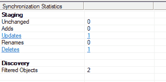
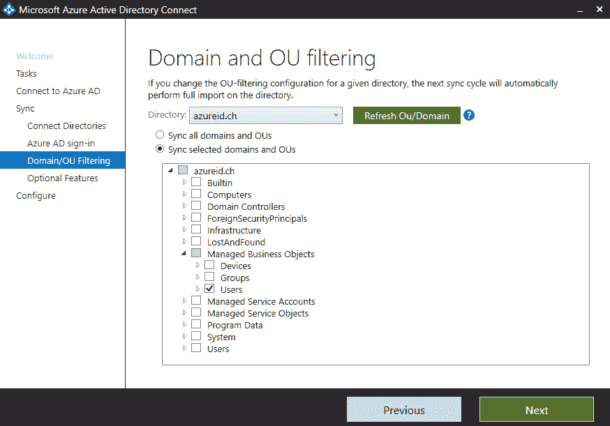

# 第三章：探索高级同步概念

在当前的项目和工作坊中，我们经常看到管理员或顾问发现处理 Azure AD Connect 同步引擎非常困难，特别是当向导配置的开箱即用功能在他们的场景中无法按预期工作时。本章将为你提供所需的所有知识，以便你能够处理基本和高级的同步需求。

本章我们将讨论高级同步概念。我们将研究同步规则，并结合实际情况提供信息和实践经验，帮助你解决项目或解决方案中的常见需求。此外，我们将解释声明式配置和表达式的概念，并在实际示例中直接使用它们。本章的另一个主题是连接到额外的不受信任的 Active Directory 林。最后，我们还会向你介绍需要处理的特殊注意事项。

本章的结构包括以下主题：

+   理解声明式配置和表达式

+   同步规则说明

+   高级同步概念中的特殊注意事项

我们将从准备实验环境的步骤开始。

# 准备实验环境

要按照本章提供的指导进行操作，我们需要安排一些准备工作。你需要提供一个额外的公共 DNS 后缀（在我的案例中是`azureid.ch`），代表`YOURDOMAIN2.COM`。我们需要将这个域名作为自定义域添加到第一个 Azure AD 租户（`YOURDOMAIN1.ONMICROSOFT.COM`）中，这个租户我们在第二章《理解身份同步》中使用过，*理解身份同步**：*

使用以下步骤开始配置：

1.  打开 Azure 门户：[`portal.azure.com.`](https://portal.azure.com)

1.  导航到 Azure AD 面板。

1.  点击“自定义域”。

1.  点击“添加自定义域”。

1.  使用你的额外域名：


添加自定义域

1.  配置你的公共 DNS，以代表以下验证条目：


自定义域验证

1.  点击“验证”。

1.  预计的结果如下：


验证域概述

以下图表显示了我们在本书中使用的完整实验环境：


实验环境概述

此外，我们需要配置一个新的 Active Directory 森林，使用新的域名。使用上述规范创建虚拟机以托管域控制器。创建与我们在第二章，*理解身份同步*中使用的第一个 Active Directory 森林相同的组织结构和用户。您将在本书的代码包中找到所有脚本。别担心——我们将在本章中进行配置，以避免实验室中的错误。在准备好实验环境后，我们可以开始处理本章内容。

本章重点讲解同步过程，以便您可以采用身份验证部分，您可以使用来自第六章，*身份验证协议管理*，第七章，*在 Azure AD 和 ADFS 上部署解决方案*，以及第八章，*使用 Azure AD 应用程序代理和 Web 应用程序代理*的资源。

# 理解声明式配置和表达式

解释声明式配置的最简单方式如下：对象通过评估如何转换对象及其相关属性，从源连接目录处理到目标源。这由从连接器空间到元宇宙的入站规则以及从元宇宙到连接器空间的出站规则控制。以下图表为您概述了所有组件：


声明式配置选项和组件概览

声明式配置提供以下功能：

+   配置同步引擎的唯一方式

+   配置属性流的函数

+   优先级在 SRs（而不是在连接器）上

+   MV—删除规则现在使用声明式配置

+   引入参数，如`%Domain.Netbios%`

+   通过 PowerShell 配置

属性流表达式语言可以解释如下：

+   编写于**Visual Basic for Applications**（**VBA**）

+   更严格的语法：

    +   有助于故障排除的有用错误信息

    +   强类型支持不同的数据类型

+   进化的表达式：

    +   `[attributename]`，`%parametername%`

    +   `&H`（十六进制值）

    +   常量—`CRLF`，`True`，`False`，`NULL`

它引入了以下属性流操作符：

+   **字符串连接**：`&`

+   **数学运算**：`+`，`-`，`*`，`/`

+   **比较**：`=`，`<`，`>`，`<>`，`<=`，`>=`

+   **评估顺序**：`( )`

+   **逻辑运算符**：`&&`（与）`||`（或）

它还为属性流提供了许多功能，如下所示：

| **转换** | `CBool``CDate``CGuid``ConvertFromBase64``ConvertToBase64``CNum``CRef``CStr``StringFromGuid``StringFromSid` | **数学** | `BitAnd``BitOr``RandomNum` |
| --- | --- | --- | --- |
| **日期/时间** | `DateAdd``DateFromNum``FormatDateTime``Now``NumFromDate` | **多值** | `Contains` `Count``Item``Join``RemoveDuplicates``Split` |
| **目录** | `DNComponent``DNComponentRev``EscapeDNComponent` | **程序流程** | `Error``IIF``Switch` |
| **检查** | `IsBitSet``IsDate``IsEmpty``IsGuid``IsNull``IsNullOrEmpty``IsNumeric``IsPresent``IsString` | **文本** | `GUID``InStr``InStrRev``LCase ``Left``Len``LTrim``Mid``PadLeft ``PadRight ``PCase ``Replace ``ReplaceChars``Right``RTrim``Trim``UCase ``Word` |

在接下来的部分中，我们将详细解释这些组件，以帮助你更好地理解。

# 同步规则说明

Azure AD Connect 在同步规则编辑器中使用额外的用户界面来管理同步逻辑。在下方的截图中，你可以看到所有的同步规则已经为你的基础配置创建。每一项都是一个同步规则。在“方向”下拉框中，你可以选择两种不同的类型：入站和出站。从实际角度来说，入站和出站同步总是从元宇宙（metaverse）角度来看待。在我的解释中，我将使用入站同步规则，因为我们将在其中找到相关信息。

在下方的截图中，我们可以看到已连接的 Active Directory 林（`inovitdemos.ch`），并且它没有任何服务，例如 Exchange 或 Skype for Business，并且没有为这些服务创建同步规则：


同步规则概述—入站

通过以下步骤，我们将收集有关工具实际使用的更多信息：

1.  在你的 YD1ADS01 上查看此配置。

1.  点击“开始”，然后导航到 Azure AD Connect。

1.  点击“同步规则编辑器”：


开始菜单—同步规则编辑器

AAD Connect 根据你的配置提供了多个默认同步规则。这些规则的模板可以在`C:\Program Files\Microsoft Azure AD Connect\SynchronizationRulesTemplates`目录下找到，并且它们是基于 XML 格式的：


同步规则模板概述

同步规则编辑器的截图展示了不同的规则及其优先级。

微软始终生成编号为`100`的第一个规则，并遍历所有连接器。它们读取该文件中的第一项（按优先级排序）。它有一个规则名称和添加的标准。然后，它们生成编号为`100`的第一个规则，并遍历所有连接器。如果有多个连接器，则使用`whenCreated`日期/时间作为裁定标准。

在下方的截图中，我们将深入了解一个同步规则：


入站同步规则详细信息

在这里，我们将找到关于适用规则的**连接系统**的详细信息。进一步的细节包括元宇宙中的对象类型以及同步引擎的连接空间。如前面示例所示，连接空间中的对象类型称为用户，代表一个活动目录中的用户账户。例如，用户的元宇宙对象类型始终是**人**。在**链接类型**下，您可以选择**加入**、**粘性加入**和**预配**。我们已经在第二章中讨论了加入和预配选项，*理解身份同步*。如果禁止将新对象预配到元宇宙，则可以使用**粘性加入**选项。此外，规则启用了密码同步。

在下图中，我们探讨了作用范围过滤器的功能。该规则仅在用户在活动目录中启用时应用。我们使用`userAccountControl`属性来识别用户的状态。该截图显示，值不需要将位`2`未设置。活动目录中启用用户的值为`512`，禁用用户为`514`：


作用范围过滤器选项

在作用范围过滤器中，我们可以看到有组和可以嵌套的子句。要应用规则，必须满足组内所有子句的条件。规则有两种逻辑运算符：逻辑“或”运算符用于组之间，逻辑“与”运算符用于组内。

我们将仔细查看`向 AAD 导出—组加入`规则，如下图所示。在这里我们可以找到不同组类型的示例，以及它们如何被处理。

以下截图中显示的规则规定了如何以及哪些组会被分配到 Azure AD。此外，还会检查规则中的其他属性：


更多作用范围过滤器选项

在以下示例中，我们查看了`从 AD 导入—用户加入规则`，在其中我们发现了 ms-DS-ConsistencyGuid 和 objectGuid 处理，涉及将用户从连接空间加入到元宇宙。请记住，加入规则只会检查一次。连接空间与元宇宙对象之间的链接存在，直到同步规则中的条件未被满足。重要的是要知道，当多个加入规则想要应用时，同步引擎会显示错误：


加入规则示例

对于转换类型，可以使用常量、直接流或表达式。如果我们使用常量流，我们可以直接将值写入选定的属性中。使用直接流时，源系统中的属性将用于目标属性。通过**Visual Basic for Applications**（**VBA**），我们可以开发扩展配置。属性的语法是方括号，例如公司或部门，如下图所示。请记住，你需要处理区分大小写的函数和属性名称。你还可以在规则中使用嵌套选项。

以下截图显示了`In from AD—User common`规则的转换：


转换规则示例

我们已经处理了各个同步规则。有时，多个同步规则会应用于一个目标属性。下图中的`sourceAnchor`可以作为示例。在那里，你可以看到两个规则已应用于该属性。现在，优先级就发挥作用，决定哪个规则将被使用。请查看以下截图以跟随说明：

+   `In from AD—User AccountEnabled`：


AccountEnabled 的表达式示例

+   `In from AD—User Common`：


表达式示例 sourceAnchor

对于`sourceAnchor`，来自连接的 Active Directory 的启用账户将被填充到 Azure AD 中。如果在任何连接的 Active Directory 中没有启用的账户，则应用`In from AD—User Common`规则。对于多个连接的 Active Directory，默认行为是`In from AD—User Join`规则具有最高优先级。因此，系统会遍历所有连接的 Active Directory。

现在我们已经介绍了声明性配置和同步规则的概念，接下来我们将配置一些示例。

# 高级同步概念中的特别注意事项

在本节中，我们将开始在实际示例中使用我们的知识。首先，我们将探讨一些可以开箱即用的基本功能。在某些环境中，你可能需要一个组织的**组织单位**（**OU**）过滤器，其中所有用户都包含在这个 OU 中。但现在你需要将其过滤掉，这些用户不应该同步到 Azure AD。此外，我们还将集成第二个 AD 林，并使用 PowerShell 来配置同步规则。

# 使用标准过滤器排除用户和组

在本节中，我们将使用标准过滤选项排除不需要同步到元宇宙的用户和组：

1.  以域管理员身份登录到你的 YD1ADS01。

1.  打开 Active Directory 用户和计算机控制台（`dsa.msc`）。

1.  请确保你处于高级功能视图中：


Active Directory 用户和计算机——高级功能选项

1.  选择你的一个用户并转到属性编辑器标签。

1.  编辑 adminDescription 属性并输入 `User_NoSync`，其中 `User_` 是关键部分：


adminDescription 过滤选项

1.  保存你的设置并最小化控制台。

1.  打开同步规则编辑器。

1.  编辑规则 `In from AD - User Common`。

1.  点击范围过滤器。

1.  你将看到具有以下条件的范围过滤器：

```
adminDescription NOTSTARTSWITH User_
```

以下截图展示了通过填写 `adminDescription` 属性来配置过滤要同步到 Azure AD 的用户：


规则配置以过滤特定用户

1.  点击取消并最小化同步规则编辑器。

1.  打开同步服务管理器。

1.  点击“连接器”，并开始在你的 Active Directory 连接器上进行增量导入。

1.  你将在同步统计中看到更新：



增量导入同步统计信息

1.  点击更新。

1.  你会注意到你修改的用户账户中添加了内容：


adminDescription 属性流

1.  点击预览。

1.  选择增量同步。

1.  点击生成预览：


同步预览选项

1.  你将在结果中看到对象删除规则已满足：


对象删除规则预览

1.  点击连接器停用：


连接器停用预览

1.  对象将被断开连接。

1.  点击关闭。

1.  点击预览。

1.  选择增量同步。

1.  点击提交预览：


提交预览选项

1.  打开元宇宙搜索：


元宇宙搜索选项

1.  点击搜索。

1.  Aaron Painter 在元宇宙中已不存在。

1.  在 Azure AD 连接器上执行导出操作：


在 Azure AD 上执行导出运行配置文件

1.  你将在同步统计中看到删除信息。

1.  点击删除：


Azure AD 上的导出统计信息

1.  点击对象 GUID：


连接器空间验证

1.  你的用户将从 Azure AD 中删除。

1.  你将看到“等待导出确认”。

1.  在 Azure AD 连接器上运行增量导入。

1.  对象将在 Azure AD 连接器的连接器空间中被删除：


在连接器空间中删除对象

1.  在 Azure AD 连接器上运行增量同步以完成更改。

1.  打开 Azure AD 连接器的连接器空间，你将找不到前面的 `CN=`：


连接器空间搜索和验证选项

使用此选项，你已看到可以通过填充 adminDescription 属性为 User_NoSync 来过滤 OU 中的对象。相同的过程也可以用于筛选具有`Group_NoSync`的组。例如，你可以找到特定的`In from AD—Group Common`入站规则，如下图所示：


使用 adminDescription 为组配置

在下一个示例中，我们将构建一个自定义规则。

# 构建自定义筛选规则

在本示例中，我们将构建自己的规则以按特定部门进行筛选。你可以在同步规则编辑器中使用以下过程：

1.  打开同步规则编辑器。

1.  单击添加新规则并选择入站。

1.  配置描述部分：


入站规则创建过程

1.  构建作用域筛选器：

```
department EQUAL Human Resources
```

1.  配置应如下所示：


按部门属性进行范围筛选

1.  保留加入规则。

1.  转到转换并创建转换：

```
Constant cloudFiltered True
```

1.  如下图所示：


云筛选选项

1.  保存规则并按照同步管理器中的运行配置步骤执行：

    +   **增量导入**：AD 连接器

    +   **增量同步**：AD 连接器

    +   **导出**：AAD 连接器

    +   **增量导入**：AAD 连接器

    +   **增量同步**：AAD 连接器

1.  验证人力资源用户是否已从你的 Azure AD 中删除。

使用以下示例，你可以阻止同步`thumbnailPhoto`与 Azure AD。此外，配置还将删除其他上传的`thumbnailPhotos`。

你可以使用以下 PowerShell 脚本配置场景：

```
$ThumbnailRules = (Get-ADSyncRule | Where-Object {($_.AttributeFlowMappings.Source -eq "thumbnailPhoto") -and ($_.Direction -eq "Inbound")})

foreach($syncrule in $ThumbnailRules) { 

 Write-Host -ForegroundColor Green "Processing Rule $($syncrule.Name)"
 $mapping = $syncrule.AttributeFlowMappings | Where-Object {$_.Source -eq "thumbnailPhoto"}

 Remove-ADSyncAttributeFlowMapping -SynchronizationRule $syncrule -AttributeFlowMappings $mapping -OutVariable rule

 Add-ADSyncAttributeFlowMapping -SynchronizationRule $syncrule -Source @('thumbnailPhoto') -Destination 'thumbnailPhoto' -FlowType 'Expression' -Expression 'AuthoritativeNull' -ValueMergeType 'Update' -OutVariable rule

 Add-ADSyncRule -SynchronizationRule $rule[0]
}
```

# 将 Azure AD Connect 连接到第二个森林

现在我们已经了解同步规则如何工作，我们可以将另一个 Active Directory 森林集成到我们的配置中。

执行以下步骤并使用提到的脚本配置你的环境：

1.  创建示例组织结构：

```
New-ADOrganizationalUnit -Name "Managed Business Objects" -Path "DC=AZUREID,DC=CH"
New-ADOrganizationalUnit -Name "Users" -Path "OU=Managed Business Objects,DC=AZUREID,DC=CH"
New-ADOrganizationalUnit -Name "Groups" -Path "OU=Managed Business Objects,DC=AZUREID,DC=CH"
New-ADOrganizationalUnit -Name "Devices" -Path "OU=Managed Business Objects,DC=AZUREID,DC=CH"
New-ADOrganizationalUnit -Name "Managed Service Objects" -Path "DC=AZUREID,DC=CH"
New-ADOrganizationalUnit -Name "AAD" -Path "OU=Managed Service Objects,DC=AZUREID,DC=CH"
New-ADOrganizationalUnit -Name "Users" -Path "OU=AAD,OU=Managed Service Objects,DC=AZUREID,DC=CH"
```

1.  创建 Azure AD Connect AD 管理代理服务账户：

```
New-ADUser -Name "svcaadcadma" -SamAccountName svcaadcadma -UserPrincipalName svcaadcadma@azureid.ch -path "OU=Users,OU=AAD,OU=Managed Service Objects,DC=azureid,DC=ch" -AccountPassword (ConvertTo-SecureString "YOURPASSWORD" -AsPlainText -Force) -Enabled $True
```

1.  创建**组管理服务账户**（**gMSA**）以运行 AAD Connect：

```
Add-KdsRootKey -EffectiveTime (Get-Date).AddHours(-10)
New-ADServiceAccount -Name svcaadconnect -DNSHostname INOAZUREIDADS01 -PrincipalsAllowedToRetrieveManagedPassword INOAZUREIDADS01$
```

1.  为 AD 管理代理账户在域级别设置以下权限。

1.  配置 AAD Connect `svcaadcadma`的权限：

    +   复制目录更改

    +   复制目录更改所有：


Active Directory MA 服务账户权限

1.  启用 AD `回收站功能`：

```
Enable-ADOptionalFeature –Identity 'CN=Recycle Bin Feature,CN=Optional Features,CN=Directory Service,CN=Windows NT,CN=Services,CN=Configuration,DC=azureid,DC=ch' –Scope ForestOrConfigurationSet –Target 'azureid.ch'
```

使用以下详细视图脚本创建你的测试用户：

1.  导入 Active Directory 模块：

```
Import-module activedirectory
```

1.  脚本部分会自动填充当前使用的域：

```
$dnsDomain =gc env:USERDNSDOMAIN
 $split = $dnsDomain.split(".")
 if ($split[2] -ne $null) {
 $domain = "DC=$($split[0]),DC=$($split[1]),DC=$($split[2])"
 } else {
 $domain = "DC=$($split[0]),DC=$($split[1])"
 }
```

1.  声明任何变量：

```
$dirpath = $pwd.path
 $orgUnit = "OU=Managed Business Objects"
 $dummyPassword = ConvertTo-SecureString -AsPlainText "OnBo@rdInoDemos19!" -Force
 $counter = 0
```

1.  导入 CSV 文件：

```
$ImportFile = Import-csv "$dirpath\ADUsers.csv"
 $TotalImports = $importFile.Count
```

1.  创建用户：

```
$ImportFile | foreach {
 $counter++
 $progress = int
 $upn = "$($_.GivenName).$($_.Sn)@azureid.ch"
 Write-Progress -Activity "Provisioning User Accounts" -status "Provisioning account $counter of $TotalImports" -perc $progress
 if ($_.Manager -eq "") {
 New-ADUser -SamAccountName $_.SamAccountName -Name $_.Name -Surname $_.Sn -GivenName $_.GivenName -Path "$orgUnit,$domain" -AccountPassword $dummyPassword -Enabled $true -title $_.title -officePhone $_.officePhone -department $_.department -UserPrincipalName $upn -PasswordNeverExpires $false
 } else {
 New-ADUser -SamAccountName $_.SamAccountName -Name $_.Name -Surname $_.Sn -GivenName $_.GivenName -Path "$orgUnit,$domain" -AccountPassword $dummyPassword -Enabled $true -title $_.title -officePhone $_.officePhone -department $_.department -manager "$($_.Manager),$orgUnit,$domain" -UserPrincipalName $upn -PasswordNeverExpires $false
 }
 If (gci "$dirpath\userimages\$($_.name).jpg") {
 $photo = [System.IO.File]::ReadAllBytes("$dirpath\userImages\$($_.name).jpg")
 Set-ADUSER $_.samAccountName -Replace @{thumbnailPhoto=$photo}
 }
 }
```

使用以下脚本从`userPrincipalName`创建电子邮件地址：

```
 Import-Module ActiveDirectory 
 Get-ADUser -LDAPFilter '(userPrincipalName=*)' `
-Properties userPrincipalName,mail | Select-Object * | `
ForEach-Object { Set-ADObject -Identity `
$_.DistinguishedName -Replace `
@{mail=$($_.userPrincipalName)} }
```

创建指向其他域的 DNS 转发器，因为已建立 Active Directory 信任：


附加林的 DNS 配置

配置 `ms-ds-consistencyGuid` 权限给 `svcaadcadma` 服务帐户：

```
$accountName = "AZUREID\svcaadcadma"
$ForestDN = "DC=AZUREID,DC=CH"
$cmd = "dsacls '$ForestDN' /I:S /G '`"$accountName`":WP;ms-ds-consistencyGuid;user'"
Invoke-Expression $cmd
```

现在我们已经准备好第二个 Active Directory 林，可以将其添加到 Azure AD Connect 中：

1.  在 YD1ADS01 服务器上打开 Azure AD 配置向导：


开始菜单–Azure AD Connect

1.  点击配置：


Azure AD Connect 配置

1.  点击自定义同步选项：


同步选项自定义

1.  使用全局管理员权限连接到 Azure AD：


提供 Azure AD 连接的全局管理员凭证

1.  连接第二个林：


连接附加的 AD 林

1.  使用另一个林中的服务帐户进行连接：


使用附加林的 AD 管理代理服务帐户

1.  您的列表中应该出现第二个有效的 AD：


有效连接概述

1.  由于我们已经验证了域后缀，因此我们的域后缀可以同步：


登录配置选项

1.  过滤您希望同步的 OU：



过滤相关对象

1.  启用以下功能以查看扩展的同步选项：


可选功能配置——应用和属性过滤、密码哈希同步以及扩展属性

1.  使用此配置，您可以限制同步到 Azure AD 的属性，以适应特定工作负载：


应用过滤选项

1.  选择要导出的属性：


extensionAttribute 限制

1.  选择一些附加属性，但请记住，并非所有服务都会获取这些属性：


目录扩展实现

永远不要直接启动同步——初始加载始终是手动逐步过程，用于避免错误。

1.  我们准备好开始配置，点击配置：


最终配置步骤

1.  关闭配置助手。

1.  让我们开始处理新 Active Directory 林的初始加载，打开同步服务管理器：


已连接目录概述

1.  按照以下步骤启动初始加载——并控制每个步骤：

    1.  对所有 AD 林进行完全导入

    1.  对 AAD 进行完全导入

    1.  对所有 AD 林进行完全同步

    1.  对 Azure AD 进行完全同步

    1.  对 AAD 进行导出

    1.  对所有 AD 林进行导出

太棒了！我们已完全控制并连接了新的林，恭喜！

认证部分将在第七章，*在 Azure AD 和 ADFS 上部署解决方案*，第八章，*使用 Azure AD 应用代理和 Web 应用代理*，以及第十章，*探索 Azure AD 身份服务*中描述。

请留意在第十章中，*探索 Azure AD 身份服务*的 ADFS B2B 配置与声明提供者信任。

# 总结

在本章中，你了解了声明式配置和同步规则的工作原理。我们通过实际示例探讨了如何使用标准同步规则以及如何创建我们自己的规则。你还学会了如何使用 PowerShell 配置同步规则和阻止/删除 Azure AD 中的属性。通过集成另一个不受信任的 Active Directory，你看到了执行此操作的标准程序，并且如何定制你的同步选项，以精确定义在你的环境中应该发生的情况。

在下一章，我们将展示如何监控你的同步解决方案。
