# 监控您的身份桥接

监控您的身份同步流程、Active Directory 健康状态以及 ADFS 和 Web 应用代理身份验证平台的功能对您的组织至关重要。此外，收集性能数据是提供合适基础设施的必要步骤。

在本实践章节中，我们将探索通过 Azure AD Connect 构建的身份桥接的各种监控能力，包括 Active Directory 本身，以及如果使用，还会涉及 ADFS 和 Web 应用代理。我们将研究 Azure AD 监控和日志功能、Azure AD Connect Health 服务，以及 Azure 安全中心，以便深入了解几种使用场景，从而提供高效准确的监控，为连接到 Azure AD 提供稳定合适的身份基础设施。

本章将涵盖以下主题：

+   Azure AD Connect Health 的工作原理

+   Azure AD 监控和日志

+   Azure 安全中心用于监控和分析

# Azure AD Connect Health 的工作原理

Azure AD Connect Health 为您提供了监控并深入了解用于将本地身份扩展到 Azure Active Directory 和 Office 365 的身份基础设施的能力。您可以查看警报、性能信息、使用模式和配置设置；它使您能够保持与 Office 365 的可靠连接，以及更多功能。这是通过在目标服务器上安装代理来实现的。

以下图示展示了 Azure AD Connect Health 的通信方式。它还显示了当前支持的组件：

+   **Active Directory 域服务**（**ADDS**）2008R2 到 2016

+   Azure AD Connect 版本 1.0.9125 或更高版本

+   **Active Directory 联合身份验证服务**（**ADFS**）和 **Windows Azure Pack**（**WAP**）2008R2 到 2016

您可以在[`docs.microsoft.com/en-us/azure/active-directory/hybrid/reference-connect-health-faq`](https://docs.microsoft.com/en-us/azure/active-directory/hybrid/reference-connect-health-faq)找到实际的支持和许可要求。

以下图示展示了解决方案的架构：

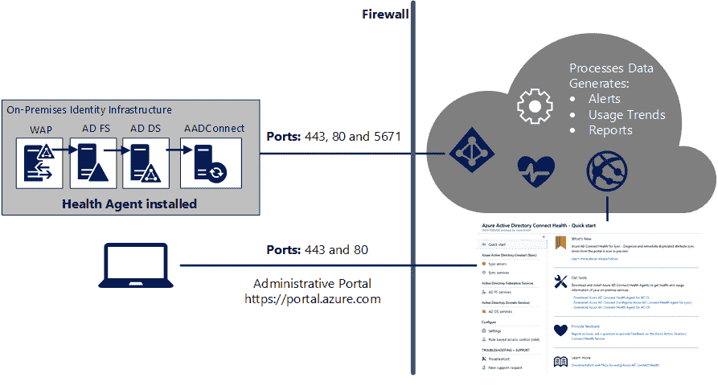

若要部署所有 Azure AD Connect Health 代理，您需要完成第八章中的实验任务，*在 Azure AD 和 ADFS 上开发解决方案*，因为在该实验中，您将安装 ADFS 和 Web 应用代理。

安装是一个非常简单的任务，始终遵循相同的例程。在以下截图中，在“获取工具”下，您将找到所有实际的代理二进制文件。

Azure AD Connect 的健康代理将始终与工具本身一起安装。Azure AD Connect Health 需要 Azure AD Premium P1 许可证。

以下步骤可以用于安装和配置该功能：

1.  下载并在特定服务器上安装二进制文件。

1.  点击配置。

1.  提供全局管理员凭据，以便成功将代理注册到服务。

以下截图显示了起始页面，您可以在此页面下载代理：

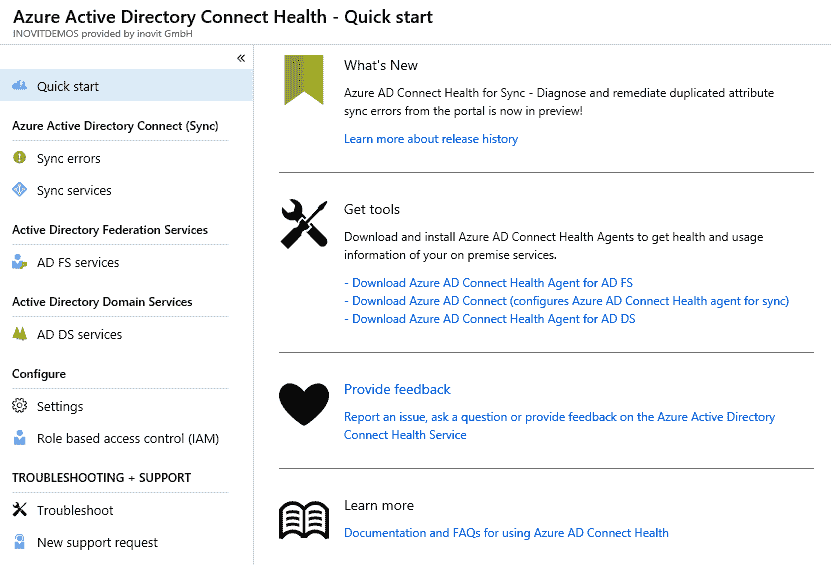

使用 Azure AD Connect Health Agent，您将获得有关同步过程的所有洞察，正如我们在 第二章《理解身份同步》中讨论的那样。您将看到来自同步引擎的当前配置信息和警报，包括同步错误。此外，如果您的 Azure AD Connect 管理着数千个用户、组和其他对象，您还将获得与运行配置文件延迟相关的信息。该服务帮助您收集实际性能和数值，为未来规划提供支持，正如以下截图所示：

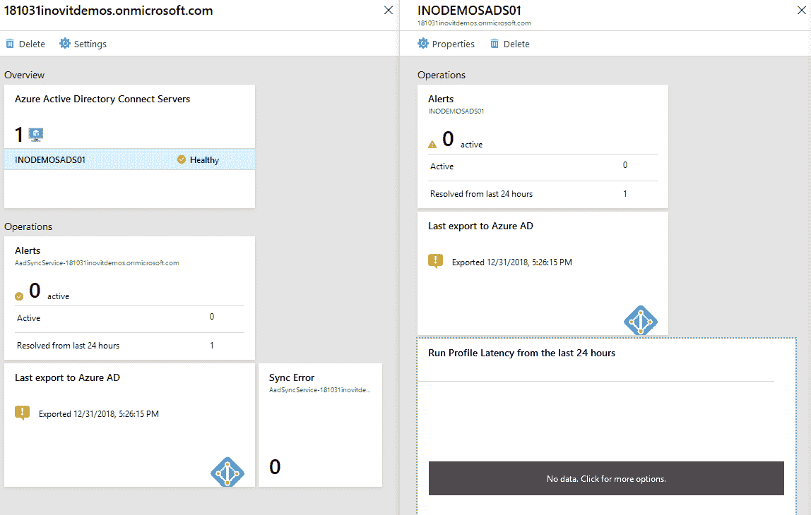

ADFS 健康代理由 ADFS 和 Web 应用代理角色使用。该代理需要安装在具有这些特定角色的服务器上。该代理提供以下基本功能：

+   对于有错误用户名/密码尝试的前 50 名用户的安全报告

+   ADFS 登录的高失败 IP 报告

+   使用带有警报电子邮件通知的监控

+   使用分析，用于 ADFS 登录，带有切换（应用程序、网络位置及其他信息）

+   最近 24 小时内的令牌请求/秒

+   用于容量规划的性能数据趋势

+   证书信息

您可以在以下截图的图表配置中看到指标值：

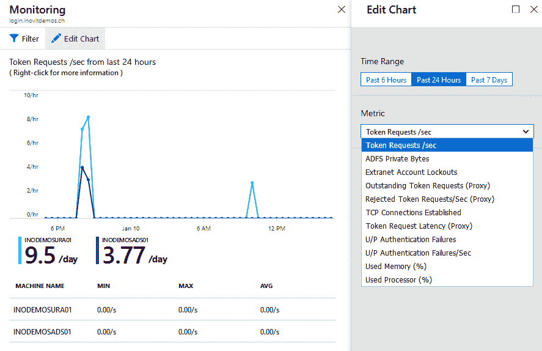

您可以在 [`docs.microsoft.com/en-us/azure/active-directory/hybrid/how-to-connect-health-adfs`](https://docs.microsoft.com/en-us/azure/active-directory/hybrid/how-to-connect-health-adfs) 找到实际的功能。

代理安装向导为您提供一个非常快速的设置体验，您只需提供全局管理员凭据即可注册代理。

如果启用了 IE 增强安全性，则必须允许以下网站在要安装代理的服务器上：

+   [`login.microsoftonline.com`](https://login.microsoftonline.com)

+   [`secure.aadcdn.microsoftonline-p.com`](https://secure.aadcdn.microsoftonline-p.com)

+   [`login.windows.net`](https://login.windows.net)

+   IE 本地 Intranet 区域需要包含您的 ADFS 服务器，例如 [`login.inovitdemos.ch`](https://login.inovitdemos.ch)

以下截图显示了代理的安装对话框：

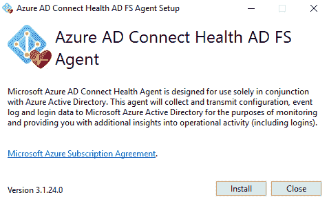

要使用 ADFS 健康代理，您需要在服务器上配置审计设置，使用以下命令：

```
auditpol.exe /set /subcategory:"Application Generated" /failure:enable /success:enable
Set-AdfsProperties -AuditLevel Verbose
```

ADFS 服务帐户需要能够生成安全审计，例如，在本地安全策略配置中的 安全设置|本地策略|用户权限分配。

安装 ADFS 健康代理后，你应该能看到以下三个新服务：

+   Azure AD Connect Health AD FS 诊断服务

+   Azure AD Connect Health AD FS 洞察服务

+   Azure AD Connect Health AD FS 监控服务

我们还将获得关于 ADFS 和 Web 应用程序代理基础设施的大量信息。在测试环境中完成配置后，我们期望得到类似于以下截图的结果：

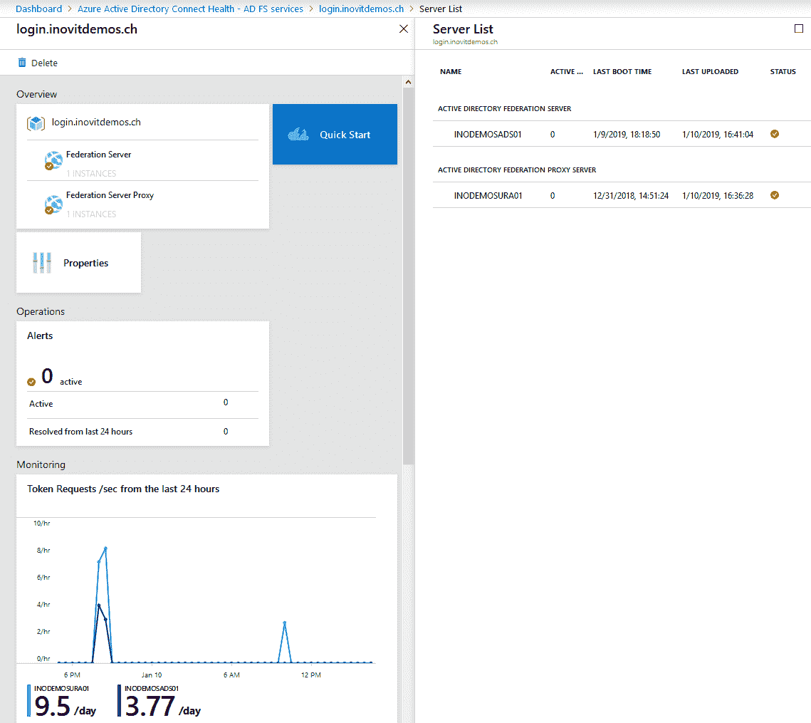

在撰写本文时，有两个新特性是坏密码尝试和风险 IP 特性，它们帮助你保护你的身份验证基础设施免受攻击。在第七章，*在 Azure AD 和 ADFS 上部署解决方案*中，我们将讨论更多通过 ADFS 在 Windows Server 2019 上提供的安全功能以及即将到来的身份保护领域的新功能：

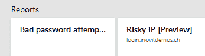

你可以在[`docs.microsoft.com/en-us/azure/active-directory/authentication/howto-password-ban-bad-on-premises-troubleshoot`](https://docs.microsoft.com/en-us/azure/active-directory/authentication/howto-password-ban-bad-on-premises-troubleshoot)和[`docs.microsoft.com/en-us/azure/active-directory/reports-monitoring/concept-risky-sign-ins`](https://docs.microsoft.com/en-us/azure/active-directory/reports-monitoring/concept-risky-sign-ins)找到更多关于 Azure AD 密码保护和风险登录报告的功能信息。

用于 Active Directory 的 Azure AD Connect Health 代理帮助你识别目录服务基础设施中的问题。你可以收集信息，如域控制器的数量、域和站点以及当前持有**灵活单主操作**（**FSMO**）角色的人员。一个非常有用的功能是监控部分，允许你获取关于 LDAP 绑定和 Kerberos/NTLM 身份验证的洞察。此外，复制信息也通过该代理提供。代理安装与 ADFS 相同，具体如下图所示：

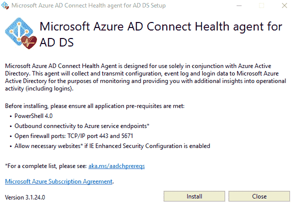

安装后，你应该能看到两个新的服务，如下图所示。截图中列出的最后两个服务显示了 Azure AD Connect Health 同步服务：

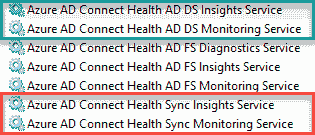

以下截图展示了关于 Active Directory 健康状态的洞察，包括身份验证性能数据：

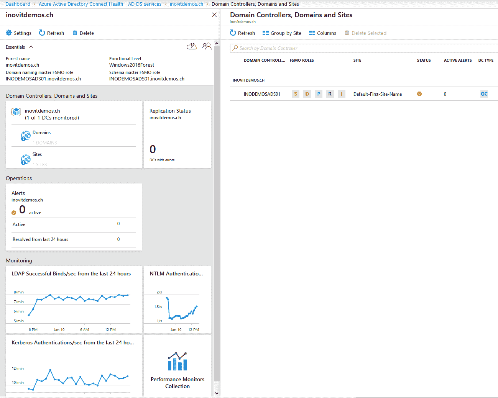

总结一下，我们来看看在项目中始终需要的一些实用技巧。以下步骤对于根据不同需求配置环境非常有用：

+   **代理服务器**：

    +   你可以使用以下 cmdlet 导入 IE 设置：

```
Set-AzureAdConnectHealthProxySettings -ImportFromInternetSettings
```

1.  +   或者你也可以从 WinHTTP 配置中导入代理设置：

```
Set-AzureAdConnectHealthProxySettings -ImportFromWinHttp
```

1.  +   或者您可以完全手动设置代理：

```
Set-AzureAdConnectHealthProxySettings -HttpsProxyAddress address:port
```

+   **测试健康代理连接性**：

    +   可以使用以下 cmdlet 进行测试：

```
Test-AzureADConnectHealthConnectivity -Role ADFS
```

工作配置的输出如下所示：

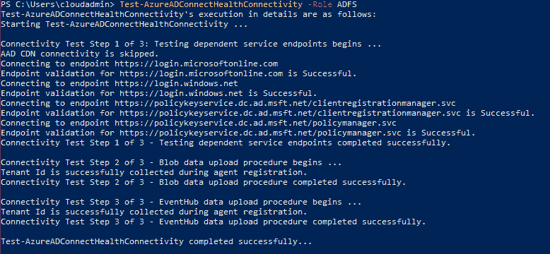

现在我们已经完成了 Azure AD Connect 健康服务的工作，接下来我们将继续了解 Azure AD 监控和日志功能。

# Azure AD 监控和日志

在 Azure 门户中，在 Azure AD 面板和监控部分下，我们还可以获得有关 Azure 平台及其关联的本地身份基础架构的见解。

我们可以查看对多个服务的完整登录情况，以及审核日志、附加日志和诊断信息。以下截图显示了我们环境中的实际登录情况，包括时间、用户、应用程序和状态。此外，您还将看到访问是否受到条件访问规则或 Azure MFA 本身的保护：

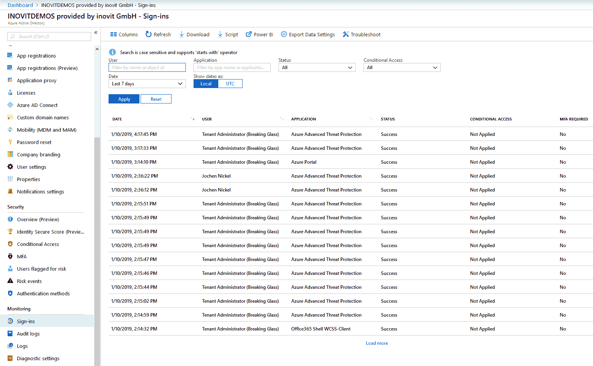

通过点击某个条目，您将获得更多详细信息：

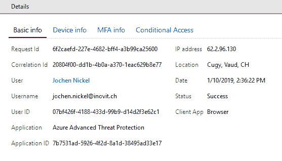

若要通过基于 REST 的 API 提供对 Azure Active Directory 数据的编程访问，您可以参考此指南：[`docs.microsoft.com/zh-cn/azure/active-directory/reports-monitoring/tutorial-access-api-with-certificates`](https://docs.microsoft.com/en-us/azure/active-directory/reports-monitoring/tutorial-access-api-with-certificates)[。](https://bit.ly/2QDUMbp)

您还可以通过点击 Power BI 图标来扩展您的报告功能。如果这样做，以下屏幕将出现：

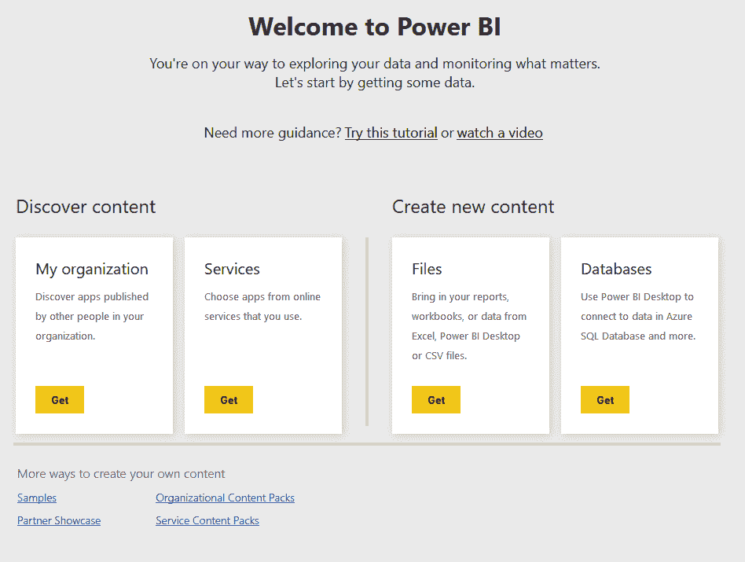

1.  点击“我的组织”，我们将开始通过 Power BI 扩展我们的解决方案。我们可以使用预定义的应用程序来创建一个良好的起点。选择 Azure Active Directory 活动日志应用程序——只需按下“立即获取”。您可以在此处找到有关该包的更多信息：[`docs.microsoft.com/zh-cn/azure/active-directory/reports-monitoring/howto-power-bi-content-pack`](https://docs.microsoft.com/en-us/azure/active-directory/reports-monitoring/howto-power-bi-content-pack)。

1.  提供您希望为报告拉取的天数以及您的租户名称。点击“下一步”：

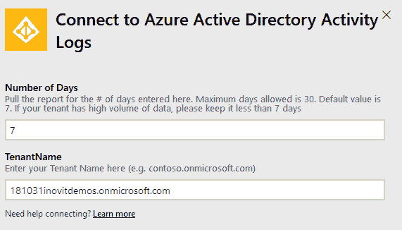

1.  向导将引导您进行连接，然后您需要登录以同意 `OAuth2`。

我们将在第六章中详细讨论此过程的安全问题，*管理身份验证协议*。

1.  点击“接受”：

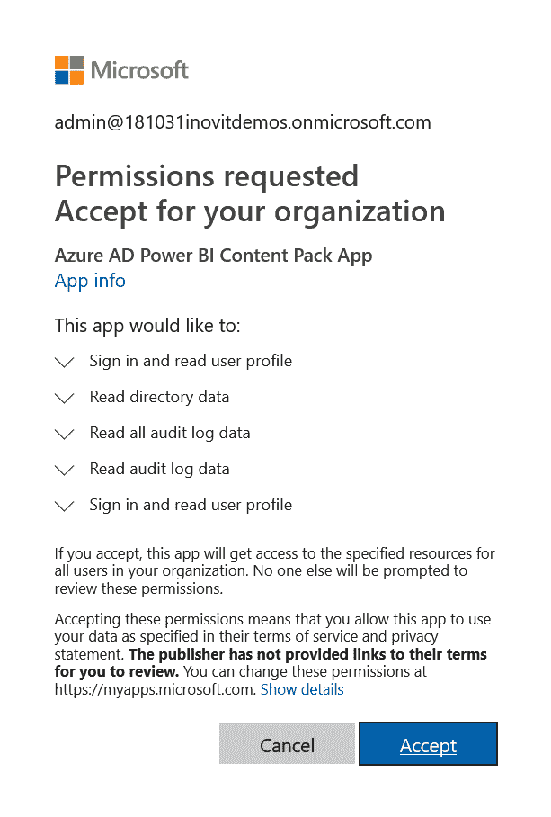

这很简单，对吧？从现在开始，您可以通过精美的报告收集有关整个身份基础架构的详细信息：

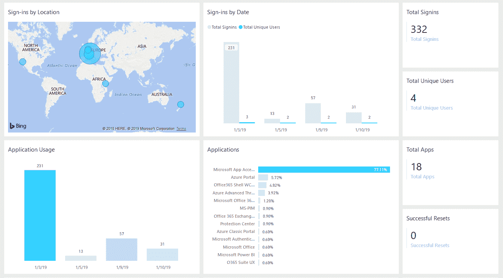

请记住，所有信息都以深入钻取的格式构建：

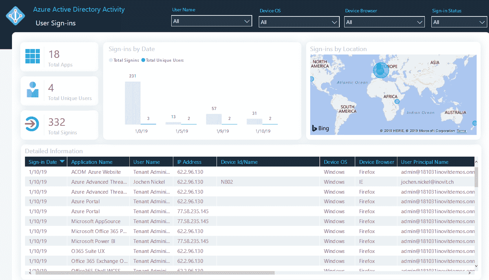

接下来，我们将深入了解审计日志（Audit Logs），在其中可以找到我们的管理任务，举例来说，我们给 Azure AD Power BI 包授权的操作：

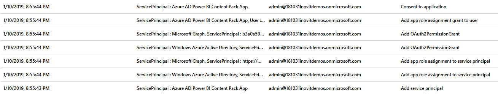

请注意，您可以将信息下载为 CSV 格式。此选项要求您启用诊断设置。只需点击“启用诊断”即可：

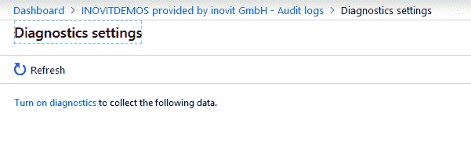

启用诊断功能后，您将获得三个选项来传输信息：

+   将日志存档到存储帐户，存储帐户需要创建，或者将使用现有的帐户，并会产生额外费用。将日志路由到 Azure 存储帐户使您能够更长时间保留日志。

+   将日志流式传输到事件中心（event hub），您可以从中创建所需的活动。将日志路由到 Azure 事件中心允许您与第三方 SIEM 工具（如 splunk）进行集成。这使您能够将不同的数据（例如，Azure AD 活动和其他安全信息）结合到您的 SIEM 中，从而提供更深入的环境洞察。

+   发送到 Log Analytics，将日志集中收集到您的 SOC 中。Log Analytics 汇总来自各种来源的监控数据，并提供查询语言和分析引擎，为您提供有关应用程序和资源操作的深入见解。

可用的类型如下：

+   审计日志（AuditLogs），包括用户或服务执行的操作和活动信息

+   登录日志（SignInLogs），包括使用的应用程序信息，包含条件访问信息、登录时间和风险等级

若要导出登录数据，您的组织需要 Azure AD P1 或 P2 许可证。

我们将使用以下信息启用 Log Analytics 功能：

+   您可以添加名称为`inodemosloganalytics`

+   选择“发送到 Log Analytics”，并勾选审计日志（AuditLogs）和登录日志（SignInLogs）：

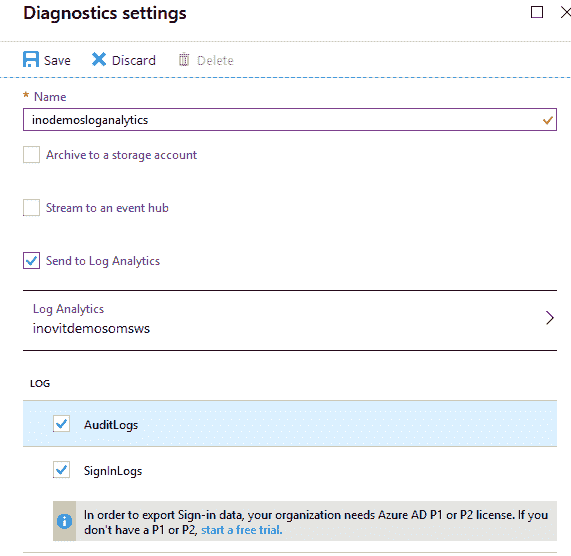

接下来，跳转到您新创建的 Log Analytics 功能，开始查询您的 Azure AD 中的信息：

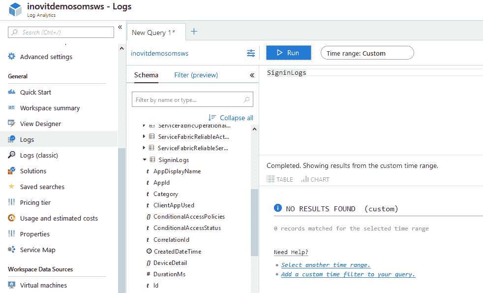

如果您想获取有关此主题的更多信息，请查看视频“*使用 Azure Monitor 将 Azure AD 日志与 Log Analytics 集成*”，视频链接：[`docs.microsoft.com/en-us/azure/active-directory/reports-monitoring/howto-integrate-activity-logs-with-log-analytics`](https://docs.microsoft.com/en-us/azure/active-directory/reports-monitoring/howto-integrate-activity-logs-with-log-analytics)[.](https://bit.ly/2CiMkt0)

此外，我们将在本书的第十六章《Azure 信息保护》中，进一步使用 Log Analytics。

如果您使用的是 Azure AD 部分的日志，激活该服务后，您将看到第一个结果：

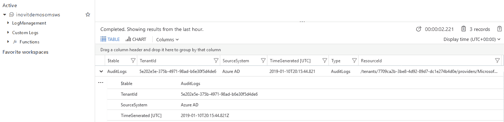

现在您对 Azure AD 的功能有所了解，可以开始尝试不同的功能，全面了解您的基础设施。

# 用于监控和分析的 Azure 安全中心

在本节中，我们将探索 Azure 安全中心在监控身份和访问管理基础设施方面的功能。通过 Azure 安全中心，您能够了解本地环境和云工作负载的安全状态。新的 Azure 资源将自动被发现并加入，您可以在完整的混合环境中应用安全策略，确保符合实际的安全标准。该服务还提供了多个来源的收集、搜索和分析，包括第三方解决方案和防火墙。此外，我们可以通过高级分析机制发现威胁，并能够根据提供的实时安全警报响应和恢复事件。安全事件的导出可以导入到 SIEM 解决方案中进行进一步分析。该服务集成了许多新的威胁检测部分，如行为分析、机器学习和全球智能威胁。

Azure 安全中心可以发现许多不同的攻击，例如以下几种：

+   被攻破的机器

+   利用失败的尝试

+   高级恶意软件

+   Web 应用漏洞

+   暴力破解攻击

+   数据外泄

身份和访问监控功能集处于预览阶段。您需要使用 Azure 安全中心的标准层计划来使用此功能。实际上，身份建议功能最多支持 600 个账户。

通过对身份活动的监控，您可以为组织提供更高层次的安全性，因为您可以在事件发生之前采取主动措施。此外，您还可以阻止正在进行的攻击。身份和访问仪表板为您提供了有关订阅的洞察和建议，例如以下内容：

+   为特权账户启用 MFA

+   删除具有写权限的外部账户

+   删除特权外部账户

如果我们从门户开始，我们将看到以下消息：您有尚未完全保护的订阅。升级到标准层以获得更多建议：

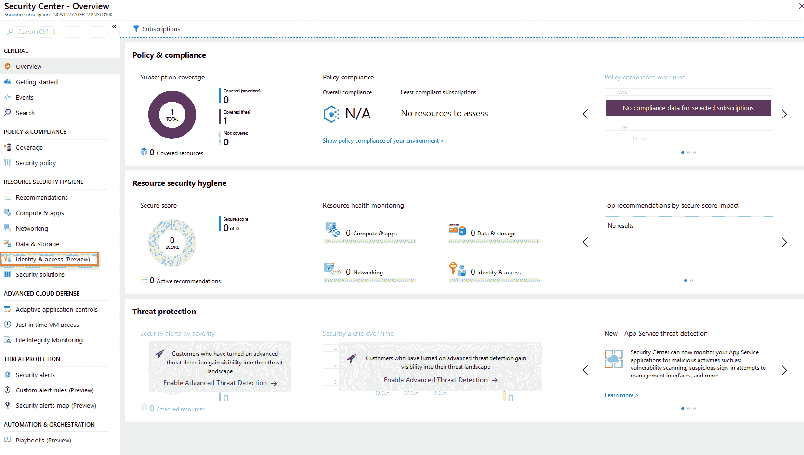

通过以下步骤，我们将启用功能集：

1.  升级到 Azure 安全中心标准实例：

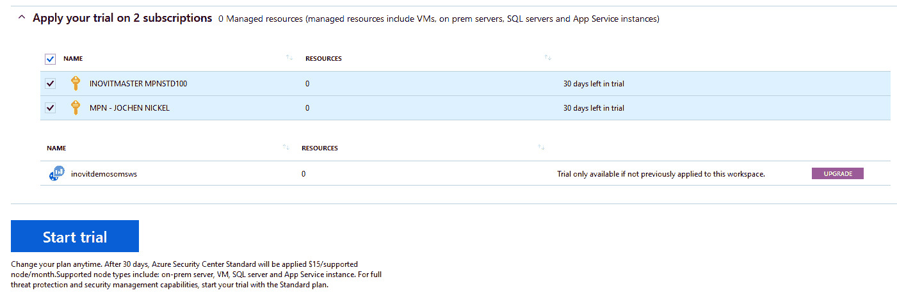

1.  启动试用并升级现有的日志分析工作区，预计结果如下：

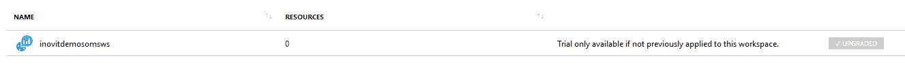

1.  您可以查看身份基础设施的洞察，并定义不同的时间范围进行分析：

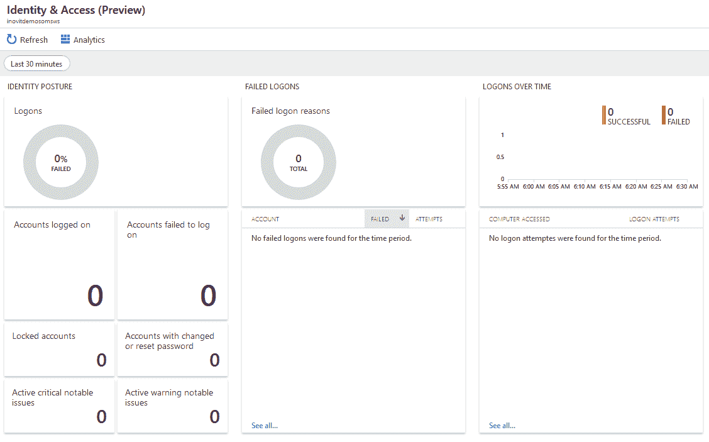

我们还发现，通过日志分析集成，我们能够直接深入探讨监控和日志信息，这可以在门户的顶部使用。我们强烈建议您在本书提供的所有实验室工作期间返回监控门户，查看各个组件的实际操作。

# 总结

本章中，我们讨论了保持身份基础设施稳定和适当状态的关键监控和日志功能。我们了解了 Azure 门户中 Azure AD 部分提供的功能。此外，我们还看到了 Azure AD Connect Health 的工作原理，以及如何轻松安装和配置环境。我们扩展了我们的解决方案，现在通过 Azure 安全中心，我们能够更广泛地查看整个混合环境的安全状态。您应该能够回答有关身份基础设施监控功能的问题，并为您自己或客户配置合适的监控和日志解决方案。

在下一章中，我们将学习如何使用 Azure 身份保护功能来保护您的云端和本地环境。我们将讨论并配置 Azure AD 特权身份管理功能。
