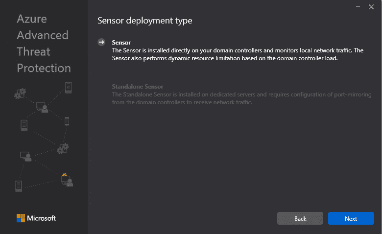
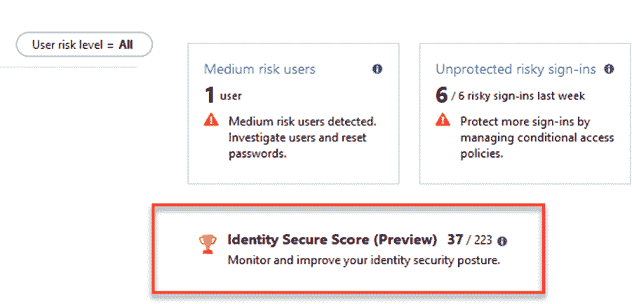

# 配置和管理身份保护

在上一章学习了如何配置监控身份管理基础设施后，我们将进入身份保护的讨论。今天，保护身份是安全领域的主要关注点之一，因此你应该能够采取合适的措施来保护组织免受任何攻击。

在我们的身份保护之旅开始时，我们将从微软云服务概述开始，了解哪些服务能在这一领域帮助你。接下来，我们将深入研究多个不同的服务，从理论讲解开始，再通过示例配置来应用这些理论。完成本章学习后，你应该能够识别出符合你现有或未来需求的正确解决方案组件。总结来说，本章涵盖以下内容：

+   微软身份保护解决方案

+   Azure ATP 及其使用方法

+   Azure AD 身份保护

+   使用 Azure AD **特权身份管理**（**PIM**）来保护管理员权限

让我们从微软身份保护解决方案的介绍开始，以便在不同的攻击阶段最大化问题检测。

# 微软身份保护解决方案

微软已经在 Azure 和本地环境上开发并建立了大量身份保护功能，帮助组织保护身份并防止敏感数据泄露。虽然有许多独立的服务可用，但预计在不久的将来会推出统一的身份保护解决方案。我们已经看到了许多身份保护服务之间的集成，这些服务能够检测、调查并防止高级攻击、身份泄露和内部威胁——包括数据泄露——从而形成一个广泛而深入的身份调查解决方案，既能在本地环境中使用，也能在云端使用。组织面临的常见攻击包括密码喷洒攻击、泄露或重复使用的凭据、欺骗域名、恶意链接或附件等。下图展示了在不同阶段检测攻击时常用的各类服务：


攻击向量和保护产品概述

正如上图所示，攻击者首先通过后门恶意软件成功地攻击零号病人，目的是建立命令和控制。然后，攻击者通过网络横向移动，获得特权凭证并访问敏感系统。在此阶段，Office 365 **高级电子邮件威胁保护**、**Windows Defender ATP**、**Azure ATP**和**Azure AD 身份保护**应该都已到位，以保护相关身份。随后，攻击者会尝试通过从本地计算机到域控制器的远程代码执行，获取域管理员账户的访问权限。

在此阶段，**Azure ATP** 和 **Azure AD Privileged Identity Management** 至关重要，用于建立正确的控制措施。成功完成此步骤后，攻击者将能够访问敏感数据并将其提取。为了保护您的敏感数据，**Microsoft Cloud App Security Broker**（**MSCASB**）和 **Cloud App Security** 服务可以帮助您扩展敏感数据的保护。  

现在我们已经看过了一个潜在的攻击场景和相关的技术，我们可以深入探讨每个相关服务。我们将使用 **爬行**-**行走**-**运行** 的策略开始，如下所示：  

+   **爬行**：首先，通过以下方式保护您的特权用户和主要环境：  

    +   为您的管理员帐户启用 Azure MFA，或者更好地，使用 Azure AD PIM  

    +   监控您的风险报告并使用身份安全存储功能  

    +   启用并配置 Azure ATP 以保护您的主要用户域  

+   **行走**：然后，通过以下方式保护所有用户和域控制器：  

    +   阻止传统身份验证并使用条件访问（有关更多信息，请访问：[`bit.ly/2M3NXzw`](https://bit.ly/2M3NXzw)）  

    +   在 Azure AD Connect 中启用密码哈希同步和禁止密码检查（有关更多信息，请访问：[`docs.microsoft.com/en-us/azure/active-directory/authentication/concept-password-ban-bad`](https://docs.microsoft.com/en-us/azure/active-directory/authentication/concept-password-ban-bad)）  

    +   使用 Azure ATP 保护所有域和森林  

    +   监控所有 Azure ATP 警报并调查任何横向移动或域控制主导警报  

+   **运行**：最后，通过以下方式保护所有用户，并将警报集成到您的安全操作流程中：  

    +   使用 Azure MFA 为您的最终用户启用登录和用户风险策略

在本章中，我们将重点讨论前述策略中提到的身份保护技术。其他过程将在第十三章，《识别和检测敏感数据》和第八章，《使用 Azure AD 应用代理和 Web 应用代理》中详细讨论。然而，现在，让我们从 Azure ATP 服务开始。  

# Azure ATP 及其使用方法  

Azure ATP 用于检测和调查高级攻击、受损身份和内部威胁。得益于后台的行为分析，它提供了非常快速的威胁检测，并减少了误报的疲劳感。此外，它通过 Azure ATP 攻击时间轴提供集中且重要的信息。Azure ATP 使用简便，其架构也非常容易理解，因为每个服务只有两个组件和一个可下载的传感器，后者直接安装在您的域控制器上，监控本地流量。传感器根据域控制器的负载使用动态资源限制。  

另外，还有一种更复杂的部署方式，它使用独立的传感器在专用服务器上，并要求从域控制器配置端口镜像，以接收网络流量。该服务与 Microsoft Intelligent Security Graph 直接集成。你可以在[`www.microsoft.com/en-us/security/operations/intelligence`](https://www.microsoft.com/en-us/security/operations/intelligence)找到更多关于此功能的信息。

Azure ATP 帮助你检测以下高级攻击：

+   侦察攻击，例如：

    +   账户枚举

    +   用户组成员身份枚举

    +   用户和 IP 枚举

    +   主机和服务器名称枚举（DNS）

+   被泄露的凭证，例如：

    +   暴力破解尝试

    +   可疑的 VPN 连接

    +   可疑的组成员身份修改

    +   Honey Token 账户可疑活动

+   横向移动，例如：

    +   Pass-the-Ticket

    +   Pass-the-Hash

    +   Overpass-the-Hash

+   域控制， 如：

    +   黄金票证攻击

    +   DC 影像攻击

    +   骨架钥匙攻击

    +   域控制器上的远程代码执行

    +   在域控制器上创建服务

拥有最基本功能的本地产品是 Microsoft **高级威胁分析**（**ATA**），它仍在开发和支持中。而云服务则提供了保护你环境的功能，因此我们推荐使用 Azure ATP 而不是 ATA。

现在我们将看看如何在你的环境中配置 Azure ATP。

你需要完成第一章，**构建和管理 Azure Active Directory**以及第二章，*了解身份同步*，才能完成接下来的配置。

那么，让我们开始吧！要配置 Azure ATP，你需要按照以下步骤进行：

1.  在浏览器中打开链接[`portal.atp.azure.com/`](https://portal.atp.azure.com/)，并以全局管理员身份登录。

1.  接下来，创建你的 Azure 高级威胁保护实例，如下图所示：


Azure ATP 创建对话框

1.  在配置 Azure ATP 之前，你需要在本地活动目录中创建一个服务帐户。登录到你的域控制器，打开提升权限的 PowerShell 并执行以下 cmdlet：

```
New-ADUser -Name "Azure ATP Service Account" -SamAccountName svcaatp -UserPrincipalName svcaatp@inovitdemos.ch -path "OU=Users,OU=AAD,OU=Managed Service Objects,DC=inovitdemos,DC=ch" -AccountPassword (ConvertTo-SecureString "YourPassword" -AsPlainText -Force) -Enabled $True
```

1.  返回到 Azure AD 门户并按照配置说明进行操作。

1.  现在，使用新创建的服务帐户，如下图所示：


连接目录服务

1.  之后，直接在你的域控制器上部署第一个 Azure ATP 传感器，如下图所示：


部署 Azure ATP 代理

1.  将安装程序下载到你的域控制器并开始安装。

1.  选择你偏好的语言并选择仅传感器部署方式，如下图所示：



选择传感器类型

1.  点击“下一步”，并使用门户的访问密钥配置传感器，如下图所示：


获取传感器代理共享密钥和安装路径

1.  完成安装后，打开 `services.msc` 管理控制台，查看新安装的服务，应该包括以下两个服务：


新安装的 Azure ATP 服务

1.  接下来，启用传感器作为域同步器，以收集与 Active Directory 相关的信息，如下图所示：


启用同步器角色

1.  下一个配置任务是启用可疑金票使用检测，该任务位于预览部分，如下图所示：


启用金票保护

1.  配置所有相关的计划报告和通知设置，以测试其功能，如下图所示：


报告部分概览

1.  通知设置页面如下图所示：


配置通知

现在您已配置好 Azure ATP 服务，可以使用以下链接提供的指南来创建攻击并在现实场景中测试您的环境：[`gallery.technet.microsoft.com/ATA-Playbook-ef0a8e38`](https://gallery.technet.microsoft.com/ATA-Playbook-ef0a8e38)。该文档是为 Microsoft ATA 编写的，但您仍然可以将其用于测试目的。您还可以使用以下 Azure ATP 安全警报指南来验证您的结果：[`docs.microsoft.com/en-us/azure-advanced-threat-protection/suspicious-activity-guide`](https://docs.microsoft.com/en-us/azure-advanced-threat-protection/suspicious-activity-guide)。在下一部分中，我们将深入探讨 Azure AD 身份保护的功能。

# Azure AD 身份保护

Azure AD 身份保护引入了基于风险的自动条件访问，以帮助保护用户免受可疑登录和凭证被盗的威胁。Azure AD 身份保护还提供了基于机器学习的威胁检测的洞察和整合视图。此外，该服务还提供了重要的修复建议，以及对用户及其会话进行的妥协风险计算。该服务需要 Azure AD Premium P2 或等效的许可证。

您将从此服务中获得以下功能：

+   **检测**：漏洞和风险账户通过以下方式被检测：

    +   突出显示漏洞并提供自定义建议

    +   计算登录和用户风险等级

+   **调查**：风险事件通过以下方式进行调查和解决：

    +   通知

    +   提供相关且具有上下文的信息

    +   用于跟踪的基本工作流

    +   轻松访问修复操作（例如，密码重置）

+   **基于风险的条件访问**：包括：

    +   风险缓解措施，如阻止登录或请求多因素认证

    +   阻止或保护有风险的用户账户

    +   要求用户注册 Azure MFA

为了更好地了解此服务，我们需要开始配置它。请作为全局管理员登录 [`portal.azure.com`](https://portal.azure.com)，并完成以下步骤：

1.  转到 Azure AD 身份保护选项卡，或使用搜索选项查找该服务

1.  通过访问设置中的入职菜单并点击页面底部的“创建”开始入职流程，如下图所示。按照流程完成入职：


Azure AD 身份保护向导

1.  现在直接跳到概览部分，如下图所示：


Azure AD 身份保护门户概览

1.  门户会向你展示面临的相关风险，例如：

    +   未注册 Azure MFA 的用户

    +   不需要 Azure MFA 的 Azure AD 或 Azure 资源角色

    +   分配过多的全局管理员角色

1.  现在，通过使用以下源配置你的第一个场景：[`docs.microsoft.com/en-us/azure/active-directory/identity-protection/quickstart-sign-in-risk-policy`](https://docs.microsoft.com/en-us/azure/active-directory/identity-protection/quickstart-sign-in-risk-policy)，并使用你的一名用户

1.  接下来，配置警报和每周摘要设置，以获取有关你环境内外活动的信息

1.  服务启用后，你可以使用现有的操作手册来测试 Azure AD 身份保护的功能，操作手册可以在此找到：[`docs.microsoft.com/en-us/azure/active-directory/identity-protection/playbook`](https://docs.microsoft.com/en-us/azure/active-directory/identity-protection/playbook)。

如你所见，运行 Azure AD 身份保护不需要一些复杂的配置任务。然而，我们建议你基于提供的操作手册进行测试，并尽可能多地积累经验：



身份安全评分信息

如前述截图所示，身份安全评分为你提供了身份安全位置的信息，以及如何改善的建议。该服务会推荐启用某些安全功能，并遵循具体的建议，例如：

+   +   启用 Azure MFA 以保护 Azure AD 特权角色

    +   启用自助密码重置

    +   启用登录和用户风险策略

    +   不允许密码过期，或者在混合配置下启用密码哈希同步

    +   确保所有用户都注册了 Azure MFA

    +   不使用超过五个全球管理员

    +   禁用在过去 30 天内未使用的帐户

    +   阻止传统认证方式

    +   不允许用户授权未管理的应用程序

我们将在第六章“*管理认证协议*”和第十三章“*识别和检测敏感数据*”中详细讨论身份保护的某些方面。我们还将深入探讨 Cloud App Security 服务，它提供了以下保护能力：

+   **恶意内部人员**：防范不满的员工

+   **恶意软件**：一旦恶意软件上传到云存储，即刻进行检测

+   **流氓应用程序**：识别能够访问敏感数据的流氓应用程序

+   **受损帐户**：应对利用受损用户凭据的高级攻击者

+   **数据泄露**：检测组织内外异常的数据流

+   **勒索软件**：识别使用复杂行为分析技术的勒索软件

现在我们已经讨论了 Azure AD 身份保护，接下来将讨论 Azure AD PIM 服务。

# 使用 Azure AD PIM 保护管理员权限

Azure Active Directory **特权身份管理**（**PIM**）提供与 Microsoft Identity Manager 类似的功能，包括本地基础设施中的**特权访问管理**（**PAM**）。

如果你需要了解更多关于本地 PAM 解决方案的信息，请访问[`docs.microsoft.com/en-us/microsoft-identity-manager/pam/privileged-identity-management-for-active-directory-domain-services`](https://docs.microsoft.com/en-us/microsoft-identity-manager/pam/privileged-identity-management-for-active-directory-domain-services)。

使用 Azure AD PIM，你可以管理、控制和监视特权身份和对目录信息及资源的访问。使用 Azure AD PIM 的主要原因是减少攻击面，并启用按需授予管理员访问权限。特权访问通常配置为永久性且未经监控，但使用 Azure AD PIM 可以避免安全漏洞和风险。

该服务允许你通过设置开始和结束日期来分配资源的时间限制访问，并且激活特权角色需要批准。为了保护角色的激活过程，该服务使用 Azure 多重身份验证。例如，在激活过程中，用户可能会被强制说明为什么需要激活该角色。此外，你还可以启用通知，提醒你特权角色被激活。为了审计和合规性要求，你还可以配置并启用访问审查，以确保用户需要特定的角色。你还可以下载内部和外部审计的审计历史记录。

要使用 Azure AD 特权身份管理，你需要拥有 Azure AD Premium P2 许可证，这也是 EMS E5 或 Microsoft 365 E5 计划的一部分，用于保护你想要保护的每个特权账户。如果你没有 Azure AD Premium P2 许可证的访问权限，可以通过多重身份认证保护你的永久特权账户。要这样做，你需要满足许可要求，详细说明请参见[`docs.microsoft.com/en-us/azure/active-directory/authentication/concept-mfa-licensing`](https://docs.microsoft.com/en-us/azure/active-directory/authentication/concept-mfa-licensing)。

现在我们已经了解了 Azure AD PIM 的基本功能，让我们从一个示例配置开始。

要完成本实验室，你必须已完成前几章中的实验任务，或者已经创建了自己的用户。

下表展示了许多公司在开始使用云时常见的配置示例：

| **目录角色** | **用户** |
| --- | --- |
| 全局管理员 | `Don.Hall@inovitdemos.ch` |
| 全局管理员 | `Dan.Jump@inovitdemos.ch` |
| 全局管理员 | `Chris.Gray@inovitdemos.ch` |

请记住，未管理的特权账户会产生一个漏洞，攻击者可以利用该漏洞访问包含敏感数据的关键系统。为每个账户不断随机化凭据—无论是预定的还是针对攻击的直接反应—是第一步。

首先，让我们在测试租户上启用 Azure AD PIM，并使用默认的角色配置。我们需要确保它能够正常工作，并记得实施一个**突破玻璃账户**。之后，我们将能够收集反馈并根据需要调整配置。

现在，我们将通过启用 PIM 的快速入门向导来开始配置。

1.  首先，用你的全局管理员账户登录到[`portal.azure.com`](https://portal.azure.com)，并导航到 Azure AD PIM。


Azure AD PIM - 快速入门选项

在我们的案例中，我们使用账户`admin@inovitdemos.onmicrosoft.com`，它将作为我们的**突破玻璃账户**：

**突破玻璃账户**允许你在 Azure AD PIM、多重身份认证服务或联邦服务不可用的情况下修改配置。确保保护该账户，并使用由 Azure AD PIM 管理的账户来管理你的环境。

1.  现在，使用同意 PIM 启用服务，如上图所示。

1.  现在验证你的身份，如下图所示：


身份验证过程

如果之前没有启用 Azure MFA，则会出现需要更多信息的对话框。

1.  填写并完成额外的安全验证对话框。

1.  点击同意继续，如下图所示：


同意激活该功能

1.  接下来，在“管理 | Azure AD 角色”部分下选择“为 Azure AD 角色注册 PIM”，如下图所示：


注册 PIM 过程

1.  点击“注册”以开始行政角色的发现过程。

1.  在门户中查看你自己的活动角色，如下图所示，包括它们的状态：


活动角色的详情

在接下来的任务中，我们将向角色添加用户并测试配置。

1.  现在，返回到 Azure AD 角色页面，并手动将三个全局管理员分配为特定 Azure AD 的合格管理员，如下图所示。请注意，你也可以使用“管理 | 向导”选项修改角色分配：


角色分配的修改

1.  点击“管理 | 角色”，并选择全局管理员角色，如下图所示：


配置全局管理员角色

1.  你应该看到所有成员的存在，包括他们的分配类型，如下图所示：


分配角色概览

1.  现在编辑你的三个测试用户，通过点击用户行末的三个点使他们符合资格，如下图所示：


选择分配类型以使他符合资格

1.  你应该得到如下结果：


变更结果

实用备注：检查角色的描述，了解你可以做什么。

1.  点击“访问审查”以为某个角色创建访问审查。

1.  点击“新建”。

1.  选择并填写以下值，因为最好从月度审查开始：

    +   **审查名称**：全局管理员角色月度审查

    +   **描述**：全局管理员角色月度审查

    +   **频率**：每月

    +   **审核角色成员资格**：全局管理员

    +   **审核人**：已选择的用户

    +   **选择审核人**：使用你的 `admin@tenantname.onmicrosoft.com`（PIM 角色管理员）

    +   **完成设置**：

        +   **自动应用**：启用

        +   **审核人未响应**：移除访问权限

1.  保留其余默认设置，然后点击“开始”。你应该会得到如下结果：


访问审查概览

1.  现在我们已经将账户从永久性转换为合格，并为全局管理员角色创建了我们的第一个访问审查，我们将使用 Don Hall 来测试我们的配置。

1.  打开一个新的私密浏览器会话，并导航到 [`portal.azure.com`](https://portal.azure.com)。

1.  使用 `don.hall@yourdomain.com` 登录。

1.  导航到 Azure AD PIM，或使用搜索选项查找它。

1.  点击“我的角色”。你应该会看到你符合全局管理员角色的资格，如下图所示：


查看你自己的角色

1.  点击激活以使用你的角色。在继续之前，你需要验证你的账户。

1.  点击验证我的身份以完成 Azure MFA 注册。

1.  响应验证过程并点击激活，如下图所示：


激活全局管理员角色

1.  注意，你可以自定义激活时间；默认情况下，角色激活 1 小时。现在，提供激活理由并点击激活。然后，退出账户并尝试首次作为全局管理员登录：


激活证明

1.  就是这样！你已经成功获得了 Azure AD PIM 的特权访问权限。

1.  现在，退出 Don Hall 账户，并使用你的永久管理员账户重新登录，该账户也分配了特权管理员角色。

1.  点击活动 | 目录角色审计历史，找到 Don Hall 的角色激活，如下图所示：


角色审计历史

在 Azure AD 角色部分检查以下功能，获取更多关于如何配置 Azure AD PIM 的体验：

+   前往任务 | 应用访问，验证你的角色分配。

+   前往审核访问，完成审核。

+   如果你已配置角色审批，前往批准请求；你可以在管理 | 设置 | 角色下完成此操作：


邀请者角色分配

现在，我们已经成功启用了 Azure AD PIM 并配置了 Azure AD 角色，分配并测试了我们的第一个角色，创建了角色访问审核，并查看了审计历史，我们离理解 Azure AD 特权身份管理更近了。（请注意，书中本章代码部分还有 Azure 资源和其他功能的附加实验。）

总结来说，你应该为你的 Azure 资源完成以下 Azure AD PIM 任务：

+   启用即时访问到 Azure

+   自动过期访问权限

+   为快速任务或待命日程分配临时访问权限

+   当新用户或新组被分配资源访问权限，或者当符合条件的分配被激活时，获取提醒。

+   使用 Azure AD 登录 Azure 虚拟机

在我们结束关于 PIM 的部分之前，我们需要告诉你，Azure AD PIM 和 Office 365 E5 提供了特权访问管理功能，用于特权任务和工作负载角色：


Office 365 特权身份管理门户

现在我们已经配置了特权身份管理和保护，给我们的组织提供了良好的安全状态。

# 总结

完成本章后，你应该能够解释保护身份时的主要要求，以及为什么这些要求是你安全解决方案的一部分。在本章中，我们探讨了核心身份保护组件的关键问题，以及如何根据你的需求启用和配置相关服务。如果你想了解更多关于 Windows Defender ATP 服务的信息，可以查看第十三章，*识别和检测敏感数据*。

在接下来的第六章，*管理认证协议*中，我们将讨论至关重要的现代协议，包括 OAuth 2.0、OpenID Connect 和 SAML 2.0，它们帮助你为你的组织和客户建立合适的认证设计。
