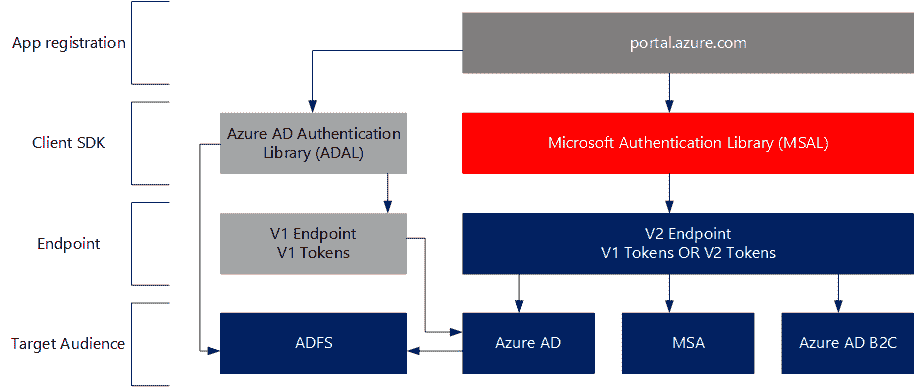
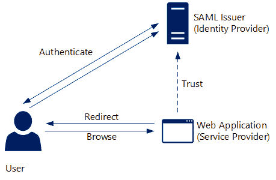
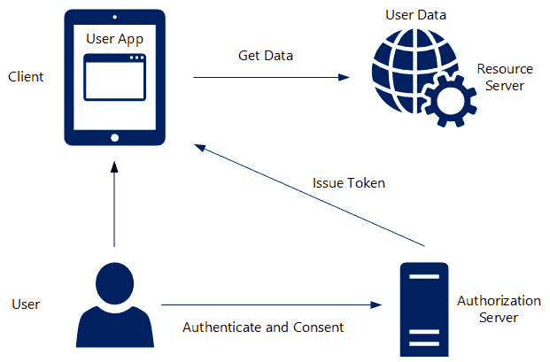
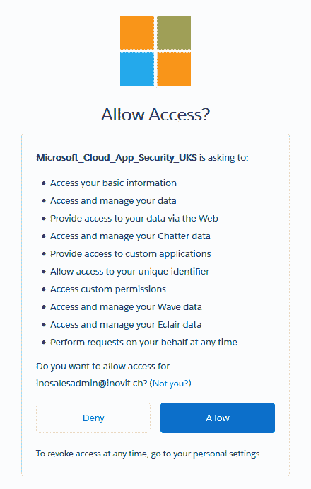
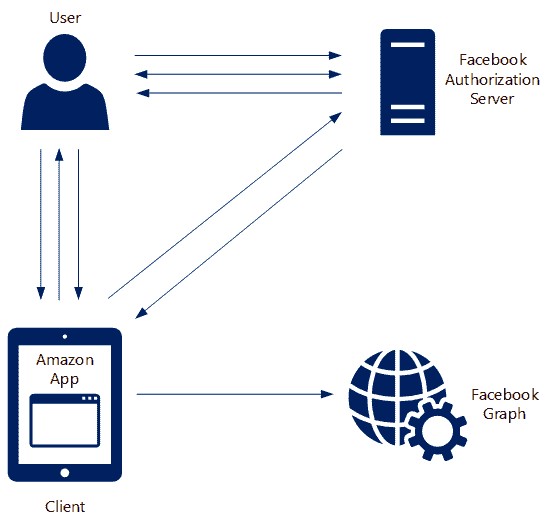
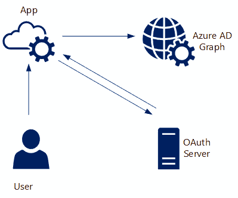
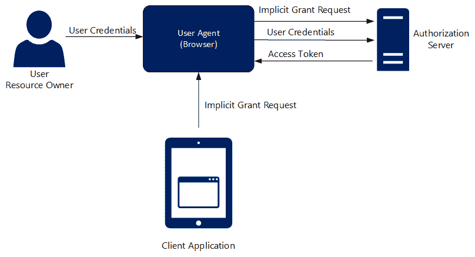
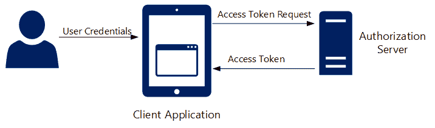
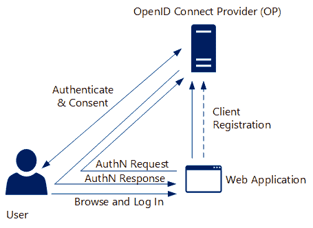
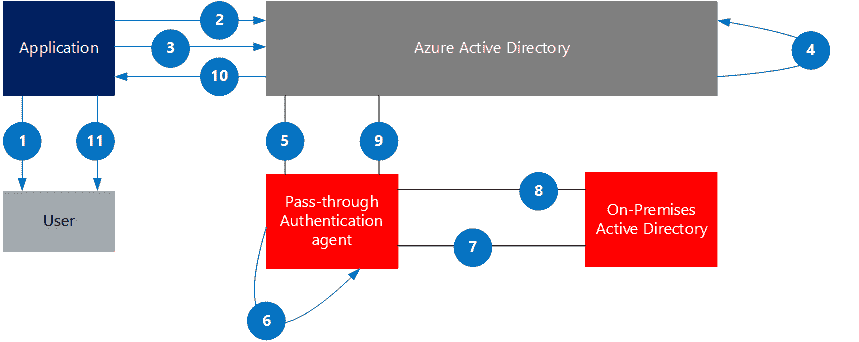

# 管理身份验证协议

在本章中，我们将为你提供一个关于你需要了解的重要身份验证协议的概述，以帮助你处理在该领域的配置和项目。

我们在项目中看到很多关于身份验证协议的混淆。理解不同的协议非常重要，这样你就可以与应用程序提供商讨论正确的实现任务和要求。我们经常看到，讨论身份验证方法和解决方案耗费了大量时间。显然，不可能将所有关于不同身份验证方法的材料都放在一个章节中，因为那样会填满一本书。在实际情况中，我们决定提供给你一些必要的总结，并附上大量有效的外部示例。我们将在本书的实验中部署多种不同的身份验证方法。你将在接下来的章节中找到一些特定的实验，帮助你适应技术配置的知识：

+   第七章，*在 Azure AD 和 ADFS 上部署解决方案*

+   第八章，*使用 Azure AD 应用程序代理和 Web 应用程序代理*

+   第九章，*在 Azure AD 上部署额外应用程序*

+   第十章，*探索 Azure AD 身份服务*

本章的重点将是帮助你熟悉一些体验和决策路径，这些内容可以帮助你理解身份验证协议。我们将本章分为以下几个部分：

+   Microsoft 身份平台

+   联邦世界中的常见令牌标准

+   **安全断言标记语言**（**SAML**）2.0

+   WS-Federation

+   OAuth 2.0

+   **OpenID Connect**（**OIDC**）

+   传递式身份验证和无缝的**单点登录**（**SSO**）

+   **多因素身份验证**（**MFA**）

让我们开始通过这个身份验证参考文献，开启你的学习旅程。

我们强烈建议你完整阅读本章中的所有参考文献。

我们将从 Microsoft 身份平台的概述开始。

# Microsoft 身份平台

Microsoft 提供了一个身份平台，包含两个端点 V1.0 和 V2.0，并为这两个端点提供了两套客户端库。这些库包括：Azure **AD 身份验证库**（**ADAL**）SDK 和**Microsoft 身份验证库**（**MSAL**）。在 Azure AD 门户中，我们将看到如何通过应用注册（预览）将使用 ADAL 或 MSAL 构建的应用程序包含在内，如下图所示：

Microsoft 身份平台概述

以下列表描述了两个端点的主要使用案例：

+   V1.0 端点仅允许工作和学校账户登录

+   V2.0 端点允许来自 Azure AD 和**Microsoft 账户**（**MSA**）的工作和学校账户登录

+   v2.0 端点不支持 SAML 或 WS-Federation——仅支持 OIDC 和 OAuth 2.0

+   v2.0 端点不支持 SAML 断言授权

+   这两个端点都接受来自来宾用户的登录请求，适用于单租户或多租户应用程序

现在我们已经对可用的端点有了一个概览，接下来我们将讨论令牌格式。

# 联邦世界中的常见令牌标准

当数字身份在网络中传输时，它仅仅是一组字节。通常将包含身份信息的一组字节称为安全令牌或简称令牌。在基于声明的世界中，令牌包含一个或多个声明，每个声明承载着关于它所识别的用户的一些信息。

如今，令牌有多种不同的格式，包括以下令牌格式：

+   **安全断言标记语言**（**SAML**）：

    +   基于 XML

    +   非常具描述性的元数据

+   **JSON Web Token**（**JWT**）：

    +   易于人类阅读

    +   更小的令牌大小

+   **简单网页令牌**（**SWT**）：

    +   表单编码的属性/值对

    +   不太常见

+   **Kerberos**

对于以下协议规范，我们建议具备良好的基于声明的身份验证基础知识。你可以下载《微软基于声明的身份验证手册》来为自己做好准备。使用以下下载链接获取该书：[`www.microsoft.com/en-us/download/details.aspx?id=28362`](https://www.microsoft.com/en-us/download/details.aspx?id=28362)。

我们将在下一部分讨论 SAML 2.0。

# 安全断言标记语言（SAML）2.0

SAML 是当前大多数身份联合活动的基础。SAML 2.0 的前身是 SAML 1.0 和 1.1。SAML 1.1 于 2003 年发布，并且只有两种场景（也称为配置文件），这两种都是由 IdP 发起的。Shibboleth 1.3 和 Liberty Alliance—WS-FF 1.2 扩展了 SAML 1.1，SAML 2.0 于 2005 年由 OASIS 发布。

以下表格显示了 SAML 的核心原则：

| **断言** | **协议** | **绑定** |
| --- | --- | --- |

| **身份信息包** | 基于请求/响应 | 将消息（协议）与传输（通信机制）关联

机制） |

| **同义令牌** | 定义消息传递要求 | 示例：

+   HTTP 重定向

+   HTTP POST

+   HTTP 工件

+   SOAP

|

| **基于 XML** | 示例：

+   身份验证请求

+   单点注销

+   工件解析

|  |
| --- |

在下一部分中，我们将讨论 SAML 2.0 协议的关键事实。

# SAML 的关键事实

SAML 标准提供了准确的消息，用于请求和断言（声明）的传输。SAML 提供了多种信息传输方式，例如使用 SOAP。SAML 标准将身份信息定义为断言。标准的大部分内容涉及断言和属性配置文件的定义。会话超时不被考虑。在注销时，会尝试达到一个大范围的接收者。SAML 2.0 使用配置文件，描述了断言、协议和绑定如何结合形成一个联合场景。

例如，Web SSO 配置文件将按以下方式使用：

+   身份验证请求协议

+   在 IdP 处的 HTTP 重定向绑定

+   SP 处的 HTTP POST 绑定

有许多不同的 SSO 配置文件可以使用，这些配置文件在规范中有定义：

+   Web 浏览器 SSO 配置文件

+   **增强客户端或代理**（**ECP**）配置文件

+   身份提供者发现配置文件

+   单点注销配置文件

+   名称标识符管理配置文件

+   文档解析配置文件

+   断言查询/请求配置文件

+   名称标识符映射配置文件

对于 Shibboleth 管理员，我们强烈推荐以下资源：[`bit.ly/2DnG5pQ`](https://bit.ly/2DnG5pQ)[。](https://bit.ly/2DnG5pQ)

还有一些 SAML 属性配置文件可供使用，如下所示：

+   基本属性配置文件

+   X.500/LDAP 属性配置文件

+   UUID 属性配置文件

+   DCE PAC 属性配置文件

+   XACML 属性配置文件

举个例子，我们在以下图示中使用典型的 SAML Web SSO 配置文件：

SAML Web SSO 配置文件

以下描述解释了身份验证过程中的不同步骤：

+   **Web 应用程序**和**SAML 发行者**之间建立信任

+   用户浏览到 **Web 应用程序**

+   **Web 应用程序**检测到用户未通过身份验证，并将其重定向到 **SAML 发行者**

+   用户自动浏览到 **SAML 发行者**

+   用户向 **SAML 发行者**进行身份验证

+   **SAML 发行者**构建令牌并将其返回给用户

+   用户将令牌通过 POST 提交到 **Web 应用程序**

我们强烈推荐你阅读以下 Azure AD SAML 2.0 文章：[`docs.microsoft.com/en-us/azure/active-directory/develop/single-sign-on-saml-protocol`](https://docs.microsoft.com/en-us/azure/active-directory/develop/single-sign-on-saml-protocol)[。](https://bit.ly/2VYK2Z8)

对于调试基于 SAML 的 SSO，请按照以下文章进行操作：

+   [`social.technet.microsoft.com/wiki/contents/articles/31247.azure-active-directory-how-to-debug-saml-based-single-sign-on-to-applications.aspx`](https://bit.ly/2MpiDLK) - 如何调试基于 SAML 的应用单点登录

+   [`docs.microsoft.com/en-us/azure/active-directory/develop/howto-v1-debug-saml-sso-issues`](https://bit.ly/2U45UR8) - 在 Azure Active Directory 中调试基于 SAML 的应用单点登录

总结来说，我们可以说，2005 年由 OASIS 发布的 SAML 2.0 现在在 Web 登录场景中被广泛使用，特别是对于具有 XML 令牌格式的 Web 应用程序。

# WS-Federation

WS-Federation 是由一个行业联盟开发的，并于 2006 年 12 月发布，微软是主要贡献者之一。WS-Federation 也是一个更大框架 WS-Security 的一部分，并基于 2005 年 2 月的 WS-Trust 工作，定义了以下两个关键原则：

+   请求/接收安全令牌的协议

+   如何在使用 **安全令牌服务**（**STS**）的各方之间建立信任

它还定义了两个配置文件：

+   主动请求者配置文件

+   被动请求者配置文件

WS-* 联邦套件包括：

+   WS-Trust

+   WS-Federation

+   WS-Policy

在下一部分，我们将描述 WS-Federation 规范的关键元素。

# 关于 WS-Federation 的关键信息

在 **WS-Federation** 中，与 SAML 相比，令牌可以是任何东西。基本上没有定义的消息被使用。另一方面，建议使用 Web 服务。WS-Federation 标准使用 SOAP，并通过 Web 浏览器使 SOAP 隧道化。该标准的令牌不受任何具体规范的约束。WS-Federation 可以使用作为 SAML 声明的安全令牌。这意味着 WS-Federation 也可以使用来自 SAML 标准的组件。与 SAML 一样，没有会话超时，应用程序必须显式注册以接收注销信息。

也有一些关于 SAML-P 与 WS-Federation 以及被动请求者配置文件的关系，例如：

+   类似于 **SAML WebSSO** 配置文件

+   以下部分不兼容：

    +   不同的请求和响应消息

    +   没有 IdP 启动的用例

    +   无声明查询配置文件

使用以下来源收集更多关于该主题的信息：

[`docs.microsoft.com/en-us/azure/active-directory/develop/azure-ad-federation-metadata`](https://bit.ly/2AOnwcD)

通过以下示例，您可以测试并分析与 Azure AD 结合使用的 WS-Federation：

[`github.com/Azure-Samples/active-directory-dotnet-webapp-wsfederation`](https://bit.ly/2TYiyRu)

总结来说，我们可以说，WS-Federation 于 2006 年建立，现在常用于 Web 登录场景和 .NET Web 应用程序。令牌格式是通用的，像 SAML、JWT 等都可以使用。

# OAuth 2.0

简单来说，身份验证是证明你是谁的行为，而授权是确定你可以做什么的行为。OAuth 2.0 关注的是委托授权，而不是身份验证。它不是一个协议，而是在 RFC 6749 中定义的授权框架，*OAuth 2.0 授权框架*。这可能会让人困惑，因为有很多情况下你使用 OAuth 2.0 登录客户端 web 应用程序。

身份验证过程必须通过识别和验证最终用户的身份来结束，但 OAuth 并没有做到这一点。OAuth 提供基于时间的令牌，可以代表最终用户访问资源，而无需提供任何关于最终用户的身份信息。

OAuth 2.0 是现有的 API 安全标准，是身份委托领域的一项重大突破。

# 关于 OAuth 2.0 的关键信息

以下是有关 OAuth 2.0 的主要事实：

+   它是一个用于创建和管理应用程序身份的互联网协议/规范

+   它是一个跨平台机制

+   它具有对 API 的委托授权

+   它的主要目的是为客户端获取访问令牌

+   它不是一个身份验证协议

+   它的前身是 OAuth 1.0 和 OAuth **Web 资源授权配置文件** (**WRAP**)

+   这是 Facebook、Google 和 Twitter 使用的互联网标准

OAuth 框架区分两种客户端（应用程序）类型，当代表用户访问服务时。这两种类型的应用程序可以描述如下：

+   **公共**：在设备上本地运行。无法信任其存储秘密。

+   **私有**：在防火墙后运行。可以信任其存储秘密。

以下图示展示了 OAuth 框架中的角色示例：

OAuth 框架中的角色

提供的角色列表如下：

+   **授权服务器**：发放访问令牌

+   **资源服务器**：验证并接受访问令牌

+   **客户端**：请求访问令牌的应用程序

+   **用户（资源所有者）**：是最终用户，授予使用访问令牌访问资源服务器的权限

在以下截图中，你将看到一个同意示例，它与 Cloud App Security 一起使用，要求访问 Salesforce：

典型的 OAuth 2.0 同意页面

你可以在以下链接找到有关 Azure AD 同意框架的更多信息：[`docs.microsoft.com/en-us/azure/active-directory/develop/consent-framework`](https://docs.microsoft.com/en-us/azure/active-directory/develop/consent-framework)。

了解 OAuth 2.0 中的流非常重要，这些流定义了获取访问令牌的过程。

# OAuth 2.0 流的主要事实

规范中定义了四种流：

+   **授权码** **流**：

    +   为客户端发放一次性代码

    +   客户端兑换代码以获取访问令牌

    +   访问令牌和 ID 令牌

    +   用于服务器端应用程序

    +   **带有代码交换证明密钥的授权码流** (**PKCE**) 用于原生/移动应用程序

+   **客户端凭证** **流**：

    +   认证客户端，而非用户

    +   客户端为自己接收访问令牌

    +   不支持刷新令牌

    +   推荐用于没有最终用户的客户端应用程序（机器对机器通信）

+   **资源所有者密码** **流**：

    +   客户端收集用户的用户名/密码

    +   使用用户名/密码交换访问令牌

    +   如果你控制客户端应用程序和资源，则使用此流

    +   通常用于在线服务，其中在线服务客户端应用程序与自身服务进行通信

+   **隐式** **流**：

    +   客户端不可信（公共）

    +   不发放刷新令牌

    +   推荐用于**单页应用程序**（**SPA**）

你可以使用以下资源，在你的本地 ADFS 基础设施中部署多个 OAuth 2.0 示例：

[`docs.microsoft.com/en-us/windows-server/identity/ad-fs/development/enabling-oauth-confidential-clients-with-ad-fs`](https://bit.ly/2S3gxqc)

[`docs.microsoft.com/en-us/windows-server/identity/ad-fs/development/native-client-with-ad-fs`](https://bit.ly/2HnAlAt)

通过以下示例使用 Azure AD，深入了解不同的流类型：

+   **OAuth 2.0 隐式授权流程**：[`docs.microsoft.com/en-us/azure/active-directory/develop/v1-oauth2-implicit-grant-flow`](https://docs.microsoft.com/en-us/azure/active-directory/develop/v1-oauth2-implicit-grant-flow)

+   **OAuth 2.0 授权码授权流程**：[`docs.microsoft.com/en-us/azure/active-directory/develop/v1-protocols-oauth-code`](https://docs.microsoft.com/en-us/azure/active-directory/develop/v1-protocols-oauth-code)

+   **OAuth 2.0 代表授权流程**：[`docs.microsoft.com/en-us/azure/active-directory/develop/v1-oauth2-on-behalf-of-flow`](https://docs.microsoft.com/en-us/azure/active-directory/develop/v1-oauth2-on-behalf-of-flow)

+   **OAuth 2.0 客户端凭证授权流程**：[`docs.microsoft.com/en-us/azure/active-directory/develop/v1-oauth2-client-creds-grant-flow`](https://docs.microsoft.com/en-us/azure/active-directory/develop/v1-oauth2-client-creds-grant-flow)

下一部分将为您提供关于授权码流程的信息。

# 授权码流程

此流程的主要概念是客户端首先获得一个授权码，然后使用该授权码兑换访问令牌。推荐用于具有启动浏览器能力的私人客户端（如 Web 应用或原生移动应用）。在这种情况下，私人客户端会与 OAuth 服务器建立一个密钥。该密钥将用于在访问令牌兑换过程中验证客户端。

访问令牌会过期，并需要通过刷新令牌进行更新，每个令牌都有自己的生命周期，可以长期存储。刷新令牌也可以用于稍后兑换新的访问令牌。

下图展示了授权码授权类型的示例：

授权码授权类型流程

流程按照以下顺序进行：

1.  **用户**点击按钮以提交此购买

1.  **客户端**将用户重定向到 OAuth 服务器

1.  **用户**进行认证并授予许可

1.  OAuth 服务器将**用户**重定向到**客户端**，并携带授权码

1.  **客户端**向**授权服务器**请求访问令牌

1.  OAuth 服务器将访问令牌返回给**客户端**

1.  **客户端**使用访问令牌授权访问资源

# 客户端凭证流程

此流程的主要概念是应用程序认证，而非用户授权，应用程序会建立一个密钥，应用程序通过该密钥进行身份验证并获得访问令牌。用户不会参与此流程，客户端可以在不涉及用户的情况下执行此流程。

下图展示了客户端凭证授权类型：

客户端凭证授权流程

流程按照以下顺序运行：

1.  **用户**通过客户端（通过通讯录应用）进行操作

1.  客户端向 OAuth 服务器（**Azure AD**）进行认证

1.  OAuth 服务器向客户端提供访问令牌

1.  客户端将带有访问令牌的请求发送到资源（Web 服务）头部

# 隐式授权流

在获取访问令牌时，此流程主要由在 Web 浏览器中运行的 JavaScript 客户端使用。还需注意的是，JavaScript 客户端无需进行身份验证。与授权码流的区别在于，访问令牌将直接在授权请求中接收。

下图展示了隐式授权类型的示例。

隐式授权流

主要流程步骤如下：

1.  **客户端** **应用** 打开浏览器将用户发送到 **授权服务器**

1.  授权提示出现在用户面前，用户批准应用请求

1.  用户的重定向返回到应用，并附带 **访问令牌**

# 资源所有者密码凭证流

此流程中的主要概念是资源所有者必须信任客户端应用。这意味着资源所有者必须将其凭据直接提供给客户端应用。

下图展示了资源所有者密码凭证授权类型：

资源所有者密码凭证流

总结来说，我们可以说，OAuth 2.0 规范自 2012 年 10 月发布以来，现已广泛应用于富客户端和现代应用场景中，特别是 **RESTful Web API** 访问。令牌格式是无关的，但主要使用 **JWT**。

# OpenID Connect（OIDC）

OIDC 作为一个标准，于 2014 年 2 月通过其成员身份建立。OIDC 提供了一个轻量级的框架，以 RESTful 方式进行身份交互。该规范是在 OpenID 基金会下开发的，根植于 OpenID；它深受 OAuth 2.0 的影响，因为 OAuth 2.0 规范本意并不用于身份验证。微软也是 OIDC 规范的共同作者。

# 关于 OIDC 的关键事实

它在 OAuth 2.0 的基础上定义了以下身份层：

+   它使用两个 OAuth 2.0 流程：

    +   授权码流

    +   隐式授权流

+   向 OAuth 2.0 交换中添加一个 ID 令牌

+   添加通过 OAuth 2.0 访问令牌请求声明的功能

使用了以下角色：

+   **OpenID Connect 提供者**（**OP**）：授权服务器发放 ID 令牌

+   **依赖方**：请求 ID 令牌的客户端应用

+   **ID 令牌**：由 OP 发放

+   **声明**：有关用户的信息

下图展示了 OpenID Connect 流程：

OpenID Connect 流程

流程步骤如下：

1.  客户端在 OP 注册

1.  用户浏览到 Web 应用并启动登录

1.  Web 应用将用户重定向到 OP

1.  用户向 OP 进行身份验证，并同意 Web 应用使用他的身份

1.  OP 构建授权码

1.  OP 将用户重定向回 Web 应用，并附带授权码

1.  Web 应用将授权码发送给 OP

1.  OP 创建 ID 令牌和访问令牌，并发送回 Web 应用程序

1.  Web 应用程序验证 ID 令牌

该规范还使用一个 UserInfo 端点，具有以下特点：

+   返回关于用户的附加声明

+   基于 REST 的端点

+   使用从 OPx 接收到的访问令牌进行身份验证

+   返回的响应为 JSON 格式

关于 OIDC 和 Azure AD 的更多信息，请访问：[`docs.microsoft.com/en-us/azure/active-directory/develop/v2-protocols-oidc`](https://docs.microsoft.com/en-us/azure/active-directory/develop/v2-protocols-oidc)。

使用本地 ADFS 基础设施构建以下示例应用程序：

+   **启用 OIDC**：[`docs.microsoft.com/en-us/windows-server/identity/ad-fs/development/enabling-openid-connect-with-ad-fs`](https://docs.microsoft.com/en-us/windows-server/identity/ad-fs/development/enabling-openid-connect-with-ad-fs)

+   **OIDC 单点注销**：[`docs.microsoft.com/en-us/windows-server/identity/ad-fs/development/ad-fs-logout-openid-connect`](https://docs.microsoft.com/en-us/windows-server/identity/ad-fs/development/ad-fs-logout-openid-connect)

使用 Azure AD 的示例进一步深入了解 OIDC 实现。相关内容可以在此查看：[`docs.microsoft.com/en-us/azure/active-directory/develop/sample-v2-code`](https://docs.microsoft.com/en-us/azure/active-directory/develop/sample-v2-code)

总结来说，可以说该规范于 2014 年 2 月发布，由微软共同编写，并在需要同意时用于 Web 登录。令牌格式为 JWT。

# 透传身份验证和无缝 SSO

Azure AD 透传身份验证提供了一种替代 Azure AD 密码哈希同步和本地 ADFS 基础设施的方式，如果所有基于声明的应用程序都连接到 Azure AD。微软通过该服务提供减少 ADFS 本地复杂性和操作的能力。此外，结合密码哈希同步，客户可以获得冗余且灵活的身份验证环境。您还可以为本地 Active Directory 添加密码保护功能。

透传身份验证支持 Azure AD 条件访问策略、Azure MFA 和阻止遗留身份验证，以保护您组织或客户环境的安全。 本地代理与 Azure AD 服务之间的通信通过证书身份验证进行保护。 如果启用了林信任并正确配置了 UPN 后缀路由，该功能可以支持多林基础设施。 结合无缝 SSO，用户获得原生 SSO 体验，并自动登录本地和基于云的应用程序。

用户登录过程中涉及到以下组件：

+   **Azure AD STS**：**无状态安全令牌服务**（**STS**）用于处理登录请求和安全令牌颁发

+   **Azure 服务总线**：云与本地之间的通信组件

+   **Azure AD Connect 身份验证代理**：密码验证请求的监听者和响应者

+   **Azure SQL 数据库**：存储与租户相关的身份验证代理

+   **Active Directory**：本地用户帐户和密码的存储库

让我们看一下以下图表，理解如何访问 Outlook Web 应用的功能：

透传身份验证流程

关于该服务的深入信息可以在以下资源中找到：[`docs.microsoft.com/en-us/azure/active-directory/hybrid/how-to-connect-pta-security-deep-dive`](https://docs.microsoft.com/en-us/azure/active-directory/hybrid/how-to-connect-pta-security-deep-dive)

流程包括以下步骤：

1.  用户尝试访问 Outlook Web 应用

1.  当用户未登录时，他将被重定向到 Azure AD 登录页面

1.  用户输入用户名，并选择“下一步”

1.  用户输入密码，并选择“登录”

1.  Azure AD 接收登录请求，并将使用身份验证代理公钥加密的用户名/密码放入队列中

1.  本地身份验证代理从队列中检索加密的凭证

代理通过预先建立的持久连接检索请求

1.  代理使用私钥解密密码

1.  代理将用户名和凭证与本地 Active Directory 进行验证，例如 ADFS

1.  域控制器评估请求并向代理返回结果

1.  代理响应回 Azure AD

1.  Azure AD 验证答案——用户将成功登录，或执行 Azure MFA

1.  如果一切正常，用户将成功登录

要为您的混合身份验证解决方案选择最佳选项，您可以使用以下资源帮助您做出决策 [`docs.microsoft.com/en-us/azure/security/azure-ad-choose-authn`](https://docs.microsoft.com/en-us/azure/security/azure-ad-choose-authn)。

# 多因素身份验证

使用额外身份验证来保护敏感信息或应用程序访问是一个重要任务，不仅仅在本地环境中。在云服务中，这一点尤为重要，尤其是它需要扩展到每个使用的敏感云服务。为提供这种安全性和额外身份验证，有很多变化，例如证书、智能卡或生物识别选项。例如，智能卡依赖于专用硬件来读取智能卡，并且不能在没有限制访问特殊设备或硬件的情况下用于所有场景。以下表格为您提供不同攻击的概述，以及如何通过设计良好且实施的安全解决方案来缓解这些攻击：

| **攻击者** | **可能的安全解决方案** |
| --- | --- |
| 密码暴力破解 | 强密码策略 |
| 肩膀窥视键盘或屏幕记录 | 一次性密码解决方案 |
| 钓鱼或植入攻击 | 服务器身份验证（HTTPS） |
| 中间人攻击 诱饵攻击（社交工程） | 双重身份验证 证书或一次性密码解决方案 |
| 证书授权机构篡改 跨通道攻击（CSRF） | 交易签名与验证 不可否认性 |

| 浏览器中的中间人键盘记录器 | 安全的 PIN 输入 安全消息传递

浏览器（只读）

推送按钮（令牌）

三重身份验证 |

微软提供的 Azure MFA 功能正是为了应对前表中描述的攻击。通过一次性密码解决方案，你可以构建一个非常强大的安全解决方案，来访问无法使用智能卡作为额外身份验证方法的设备上的信息或应用程序。否则，对于中小型企业组织来说，智能卡部署及其相关管理解决方案将过于昂贵，而 Azure MFA 解决方案可以成为达到预期更高安全级别的良好替代方案。

# Azure MFA

Azure MFA 提供了两步验证的安全性。用户可以选择多种方式验证身份，例如电话、短信、带通知的移动应用程序以及生成的代码。此外，OATH 硬件令牌的集成正在实际预览中。要推出此功能，你可以使用以下来源：

[`docs.microsoft.com/en-us/azure/active-directory/authentication/tutorial-mfa-applications`](https://bit.ly/2Mjdbdj)

[`docs.microsoft.com/en-us/azure/active-directory/authentication/howto-mfa-getstarted`](https://bit.ly/2McMo1B)

Azure MFA 包括将本地组件与以下两个代理集成的功能：

+   **Active Directory 联邦服务** (**ADFS**) 2016 及更高版本

+   **网络策略服务器** (**NPS**)

如果你需要集成旧版本的 ADFS 或第三方 RADIUS 服务器，唯一的选择是部署本地 Azure MFA 服务器。通过此集成，会有一些限制，例如：

+   无法同步注册信息

+   使用两个注册和用户门户

+   需要管理额外的 MFA 基础设施

在接下来的部分，我们将讨论证书认证选项。

# 证书认证

Azure AD 支持使用基于证书的认证。设备可以使用客户端证书进行连接。此功能消除了在移动设备上访问邮件和 Microsoft 应用程序时输入用户名/密码组合的需要。你可以使用以下两个来源获取更多关于特定平台的信息：

+   **Android**: [`docs.microsoft.com/en-us/azure/active-directory/authentication/active-directory-certificate-based-authentication-android`](https://docs.microsoft.com/en-us/azure/active-directory/authentication/active-directory-certificate-based-authentication-android)

+   **iOS**：[`docs.microsoft.com/en-us/azure/active-directory/authentication/active-directory-certificate-based-authentication-ios`](https://docs.microsoft.com/en-us/azure/active-directory/authentication/active-directory-certificate-based-authentication-ios)

否则，你可以使用设备认证作为替代方法。我们将在下一节中描述设备认证。

# 设备认证

微软在多因素解决方案框架中包含的另一种方法是设备认证。设备认证可以通过以下设备注册或加入方法使用：

+   Azure AD 注册

+   Workplace Join

+   Azure AD 加入

+   混合 Azure AD 加入

你可以在以下来源找到有关所有不同选项的更多信息：[`docs.microsoft.com/en-us/azure/active-directory/devices/overview`](https://docs.microsoft.com/en-us/azure/active-directory/devices/overview)。你可以在本地 ADFS 或 Azure AD 中使用这些状态进行条件访问。

要在你的 ADFS 基础设施上部署本地条件访问，可以参考以下来源：[`docs.microsoft.com/en-us/windows-server/identity/ad-fs/operations/configure-device-based-conditional-access-on-premises`](https://docs.microsoft.com/en-us/windows-server/identity/ad-fs/operations/configure-device-based-conditional-access-on-premises)。对于云环境，我们建议以下来源作为开始条件访问之旅的起点：[`docs.microsoft.com/en-us/azure/active-directory/conditional-access/overview`](https://docs.microsoft.com/en-us/azure/active-directory/conditional-access/overview)[.](https://bit.ly/2W2nV4h)

# 生物识别认证

Windows Hello 是另一种使用生物识别用户信息（如指纹、人脸或虹膜识别）的认证解决方案。此功能适用于个人或企业级安全，提供认证服务。你还可以将此功能应用于本地 ADFS 和 Azure AD。使用以下来源规划并在组织中部署**Windows Hello**：[`docs.microsoft.com/en-us/windows/security/identity-protection/hello-for-business/hello-planning-guide`](https://docs.microsoft.com/en-us/windows/security/identity-protection/hello-for-business/hello-planning-guide)[.](https://bit.ly/2ELPBoL)

# 总结

通过学习本章及给定的参考资料，你已经深入了解了许多最重要的认证协议的各个方面和实际示例。我们尽力为你提供了一张简洁的参考卡片，包含了有关此主题的许多有效附加信息。你应该能够在为客户或自己组织的设计或配置工作中使用 WS-Federation、SAML、OAuth 2.0 和 OIDC。正如本章开头所提到的，我们将在接下来的章节中使用这些知识。

在接下来的第七章，*在 Azure AD 和 ADFS 上部署解决方案*，我们将直接开始工作！
