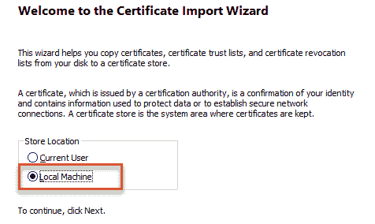
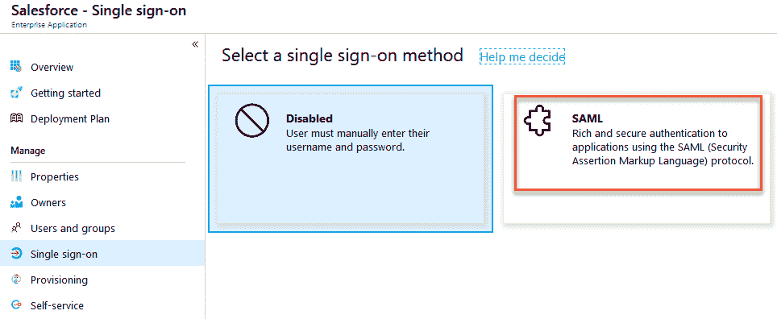

# 在 Azure AD 和 ADFS 上部署解决方案

有什么比直接将理论应用于实践实验活动更好的方法吗？在我们看来，没有。通过学习第六章，*管理身份验证协议*，你了解了当前环境中使用的不同身份验证方法。现在，我们将开始使用这些知识将多个场景部署到我们的**Azure AD**和**Active Directory Federation Services**（**ADFS**）中。我们将帮助你理解所有配置步骤，以便为你提供一个合适的身份验证环境。

在本章中，你将扩展你当前的实验环境，安装并配置我们要连接的服务，并配置你的身份验证解决方案以处理不同的方法。我们使用这种方法是为了让你从零开始理解所有内容。我们强烈建议在运行本章之前先阅读第六章，*管理身份验证协议*，它将涵盖以下主题：

+   基本环境安装与配置

+   Azure AD 身份验证部署

+   ADFS 身份验证部署

+   将 Azure MFA 集成到 ADFS 中

你准备好开始了吗？是的！我们将从准备我们的环境开始。

# 基本环境安装与配置

在本章中，我们开始扩展我们当前的模拟本地基础设施，添加所需的额外服务器，以展示和配置不同的功能。在下图中，我们展示了在完成书中所有实验后，我们将配置的完整环境：


实验环境概述

在本章中，我们将向环境中添加`YD1APP01`和`YD1URA01`。`YourDomain1`（`YD1`）用于标识机器所在的正确域。在我们的例子中，我们使用了`INODEMOAPP01`。你需要根据之前的值来配置这些机器。

你已经在第二章，*理解身份同步*中部署了`YDADS01`域控制器。对于所有未来的虚拟服务器，请使用相同的**Azure 订阅**、相同的**资源组**以及相同的**虚拟网络**。将虚拟机加入到现有的 Active Directory 中。对于域控制器的安装，我们使用了`inovitlabs.ch`作为示例。在接下来的章节中，我们将使用类似的 DNS 后缀。为了明确起见，我们使用`inovitdemos.ch`作为`inovitlabs.ch`的延续表示，并将为不同场景添加`azureid.ch`和`leano.ch`。

`azureid.ch`将用于我们使用的第二个域，且不进行任何云集成。

`leano.ch`将作为一个仅云环境，用于企业对企业的通信。

你可以使用你喜欢的名称。

为了更好地理解，我们展示了一个额外虚拟机的例子，如果你在书的结尾时已经配置了所有虚拟机，你应该得到以下结果：


虚拟机概述

对于 INODEMOSAPP01（`YDAPP01`），我们使用的是一台标准 B4ms（4 VCPUs，16 GB 内存）虚拟机，运行 Windows Server 2019。这台虚拟机会作为 SQL Server 实例的宿主，承载我们大多数的演示应用程序和 Visual Studio。因此，我们使用这样一台较大的机器：

+   始终使用相同的资源组

+   始终使用相同的订阅

+   使用之前截图中的大小（推荐）

+   始终使用相同的虚拟网络

+   始终为虚拟机配置 DNS 名称

你可以使用“连接”按钮下载 RDP 连接文件：


虚拟机配置选项

为了让实验尽可能简便，我们为每台虚拟机在创建时定义了 RDP 入站规则，并为虚拟机配置了静态内部 IP 地址：


防火墙配置

如果你点击网络接口，你可以配置静态 IP：


静态 IP 配置

接下来，我们需要点击虚拟网络，配置我们的`YDADS01`域控制器为主要 DNS 服务器：


自定义 DNS 配置

现在我们已经准备好，你可以按照相同的步骤为任何额外的虚拟机进行配置。我们还在书中的代码包中提供了脚本解决方案。

此配置仅用于实验和演示目的，不适用于生产环境。我们强烈建议你在已配置的域控制器上进行相同的配置。

对于本章，特别是 `YD1URA01` 虚拟机，我们需要配置两个额外的入站端口规则，以便提供外部访问我们的 `Web 应用程序代理`。我们需要打开端口 80 TCP（HTTP）和端口 443 TCP（HTTPS）。预期的配置应如下所示：


防火墙配置

现在我们已经讨论了虚拟机的设置，你应该部署`YD1APP01`和`YD1URA01`服务器，以运行本章中的以下实验。

# 使用 Let's Encrypt 为你的环境创建证书

为了为我们的任务提供有效的证书，我们需要安装`Posh-ACME` PowerShell 模块，使用 Let's Encrypt 作为我们的证书提供商。证书有效期为三个月，且无任何费用。如果你想在更长的时间内使用你的环境，只需续期证书即可。

在以下来源中查找模块描述和更多信息：[`docs.microsoft.com/en-us/office365/enterprise/base-configuration-dev-test-environment`](https://docs.microsoft.com/en-us/office365/enterprise/base-configuration-dev-test-environment)

1.  使用以下命令安装模块：

```
# Install for all users (requires an elevated PowerShell)
Install-Module -Name Posh-ACME

# Install for current user
Install-Module -Name Posh-ACME -Scope CurrentUser
```

1.  安装 PowerShell 模块后，我们可以请求证书（将 DNS 后缀替换为您的值）：

```
New-PACertificate '*.inovitdemos.ch','certauth.login.inovitdemos.ch' -AcceptTOS -Contact jochen.nickel@inovit.ch
```

1.  您将收到一条消息，提示您需要在公共 DNS 服务器中创建`TXT`条目，以便完成域验证过程：


Let's Encrypt 验证条目

1.  按照以下示例，在您的公共 DNS 中创建值：

```
_acme-challenge.inovitdemos.ch   TXT   15MIN TTL   OtORHpZ1CruSu2Tb-iZ1oSnU7oMOsiT0fMPq8pDDeVM
_acme-challenge.certauth.login.inovitdemos.ch  TXT  15MIN TTL  5je--CO7tiMYFXdclcFQKu9UwxnbQTVuzV4U8xpIBQs
```

请记住，激活这些值需要一些时间。创建条目后，您可以按任意键继续。

1.  验证成功后，您将收到一条消息，提示您可以从公共 DNS 中删除这些值：


Let's Encrypt 验证选项的移除说明

1.  您的新证书已创建：


新创建的证书信息

1.  现在，我们需要在环境中的每台服务器上查找并导入证书。使用以下 cmdlet：

```
Get-PACertificate | fl
```

上述命令的输出如下：


证书信息

1.  只需键入`.\cert.pfx`并按*Enter*，然后按照导入向导进行操作。

1.  选择“本地计算机”作为存储位置：



证书导入向导

1.  PowerShell 模块默认使用的密码来保护`PFX`文件是`poshacme`。仅当您希望导出文件并使用自己的密码在其他服务器上使用时，才选择将密钥标记为可导出：


证书导入选项

1.  现在，使用`certlm.msc`命令打开本地计算机存储的证书管理控制台，您可以验证已安装的证书：


证书存储和主题备用名称

我们不会在接下来的每一章中展示此过程，因此请注意，每次在您的环境中新服务器上安装证书时都需要执行此步骤。

现在我们已经完成了所有准备工作，可以为我们的演示应用程序安装`ADFS`和`Web Application Proxy`。

# 在 YDADS01 上安装`ADFS`农场

在我们的环境中，我们将在域控制器上安装`ADFS`农场。在生产环境中，这通常不是推荐的选项，但为了节省成本，我们将选择这个选项。让我们开始吧！

1.  为`ADFS`农场创建内部 DNS 条目：

```
Add-DnsServerResourceRecord -ZoneName "inovitdemos.ch" -A -Name "login" -IPv4Address "10.0.0.4"
```

1.  为演示应用程序创建内部 DNS 条目：

```
Add-DnsServerResourceRecord -ZoneName "inovitdemos.ch" -A -Name "claims" -IPv4Address "10.0.0.6"
Add-DnsServerResourceRecord -ZoneName "inovitdemos.ch" -A -Name "kerb" -IPv4Address "10.0.0.6"
Add-DnsServerResourceRecord -ZoneName "inovitdemos.ch" -A -Name "basic" -IPv4Address "10.0.0.6"
Add-DnsServerResourceRecord -ZoneName "inovitdemos.ch" -A -Name "ntlm" -IPv4Address "10.0.0.6"
```

1.  创建`ADFS` **组托管服务账户**（**gMSA**）：

```
Add-KdsRootKey -EffectiveTime (Get-Date).AddHours(-10)
New-ADServiceAccount svcadfs -DNSHostName login.inovitdemos.ch -ServicePrincipalNames http/login.inovitdemos.ch
```

1.  安装`ADFS`农场：

```
# Get the certificate thumbprint
gci Cert:\LocalMachine\My\ | fl
# Install the ADFS Farm with WID
Install-WindowsFeature ADFS-Federation -IncludeManagementTools
Install-AdfsFarm -CertificateThumbprint 66F1BF8CCD904DF74154A5D24769DE155E874257 -FederationServiceName login.inovitdemos.ch -GroupServiceAccountIdentifier inovitdemos\svcadfs$ -FederationServiceDisplayName "INOVITDEMOS Login"
# Server restart
Restart-Computer
```

1.  启用`IdP Initiated Signon Page`：

```
Set-AdfsProperties -EnableIdPInitiatedSignonPage $true
```

1.  检查您的`ADFS`基础架构安装，通过在浏览器中打开提供的链接：

```
# Check ADFS Metadata
https://login.inovitdemos.ch/adfs/fs/federationserverservice.asmx
# Check IDP Sign In
# Add "login.inovitdemos.ch" to the "Local Intranet" settings in IE
https://login.inovitdemos.ch/adfs/ls/IdpInitiatedSignon.aspx
```

1.  现在，我们将`ADFS`连接到我们的 Azure AD 并切换到联合环境。我们使用`SupportMultipleDomain`选项，为后续演示做准备，其中我们将集成第二个域后缀和额外的 Active Directory 林：

```
Connect-MsolService
Convert-MsolDomainToFederated -DomainName inovitdemos.ch -SupportMultipleDomain:$true
```

1.  接下来，我们安装并配置`Web 应用程序代理`。

# 在 YD1URA01 上安装 Web 应用程序代理

我们将在`YD1URA01`上安装`Web 应用程序代理`，通过以下步骤为我们的`ADFS`基础架构提供外部访问：

1.  打开一个评估版 PowerShell 实例，并使用以下命令：

```
# Get the certificate thumbprint
gci Cert:\LocalMachine\My\ | fl

# Install Web Application Proxy
Install-WindowsFeature Web-Application-Proxy -IncludeManagementTools

# Configure Web Application Proxy
$creds = Get-Credential
Install-WebApplicationProxy -FederationServiceName "login.inovitdemos.ch" -FederationServiceTrustCredential $creds -CertificateThumbprint "66F1BF8CCD904DF74154A5D24769DE155E874257"

# Server restart
Restart-Computer
```

1.  接下来，我们将通过`Web 应用程序代理`发布 Active Directory `Federation Services`：

```
Add-WebApplicationProxyApplication -Name "Federation Services" -BackendServerUrl "https://login.inovitdemos.ch/" -ExternalUrl "https://login.inovitdemos.ch/" -ExternalPreauthentication "PassThrough" -ExternalCertificateThumbprint "66F1BF8CCD904DF74154A5D24769DE155E874257"
```

1.  现在，我们需要在公共 DNS 中为`ADFS`和演示应用程序创建条目，在此过程中需要使用您的 DNS 服务器名称：

```
login.inovitdemos.ch. CNAME 15 MIN inodemosura01.westeurope.cloudapp.azure.com
basic.inovitdemos.ch. CNAME 15 MIN inodemosura01.westeurope.cloudapp.azure.com
kerb.inovitdemos.ch. CNAME 15 MIN inodemosura01.westeurope.cloudapp.azure.com
ntlm.inovitdemos.ch. CNAME 15 MIN inodemosura01.westeurope.cloudapp.azure.com
claims.inovitdemos.ch. CNAME 15 MIN inodemosura01.westeurope.cloudapp.azure.com
```

1.  接下来，我们将测试外部`ADFS`功能。

1.  使用您的管理虚拟机或任何其他外部客户端，在浏览器中打开[`login.inovitdemos.ch/adfs/ls/idpinitiatedsignon.aspx`](https://login.inovitdemos.ch/adfs/ls/idpinitiatedsignon.aspx)，并使用您的测试用户之一登录。

现在，我们有一个正常运行的`ADFS`和`Web 应用程序代理`基础架构。唯一缺少的角色是我们将在`YD1APP01`服务器上实现的演示应用程序，并订阅多个云服务。

# 在(YD1APP01)上为 ADFS 安装演示应用程序

对于本章及后续章节中的任务，我们需要在服务器上安装 SQL Server 和管理工具实例。

服务器上还需要安装以下软件：

+   Visual Studio ([`bit.ly/2NzB14g`](https://bit.ly/2NzB14g))，并选择以下选项：


Visual Studio 包安装选项

+   Visual Studio Code ([`code.visualstudio.com/`](https://code.visualstudio.com/))

接下来，我们从**Internet 信息服务**（**IIS**）的基本安装开始：

1.  安装 IIS：

```
Install-WindowsFeature NET-Framework-Core,NET-Framework-45-Features,Web-Mgmt-Console,Web-Asp-Net,Web-Asp-Net45,Web-Basic-Auth,Web-Client-Auth,Web-Digest-Auth,Web-Dir-Browsing,Web-Dyn-Compression,Web-Http-Errors,Web-Http-Logging,Web-Http-Redirect,Web-Http-Tracing,Web-ISAPI-Ext,Web-ISAPI-Filter,Web-Lgcy-Mgmt-Console,Web-Metabase,Web-Mgmt-Console,Web-Mgmt-Service,Web-Net-Ext,Web-Net-Ext45,Web-Request-Monitor,Web-Server,Web-Stat-Compression,Web-Static-Content,Web-Windows-Auth,Web-WMI,Windows-Identity-Foundation
```

1.  现在，我们安装 SQL 实例。在您的 Active Directory 中创建 SQL 组织单位：

```
New-ADOrganizationalUnit -Name "SQL" -Path "OU=Managed Service Objects,DC=INOVITDEMOS,DC=CH"
New-ADOrganizationalUnit -Name "Users" -Path "OU=SQL,OU=Managed Service Objects,DC=INOVITDEMOS,DC=CH"
```

1.  创建服务账户：

```
# SQL Database engine service account
New-ADUser -Name "svcsqldb" -SamAccountName svcsqldb -UserPrincipalName svcsqldb@inovitdemos.ch -path "OU=Users,OU=SQL,OU=Managed Service Objects,DC=inovitdemos,DC=ch" -AccountPassword (ConvertTo-SecureString "YourPassword" -AsPlainText -Force) -Description "SQL Database Engine" -Enabled $True

# SQL Agent service account
New-ADUser -Name "svcsqldbagent" -SamAccountName svcsqldbagent -UserPrincipalName svcsqldbagent@inovitdemos.ch -path "OU=Users,OU=SQL,OU=Managed Service Objects,DC=inovitdemos,DC=ch" -AccountPassword (ConvertTo-SecureString "YourPassword" -AsPlainText -Force) -Description "SQL Database Engine Agent" -Enabled $True
```

1.  接下来，我们可以进行 SQL Server 2017（试用版：[`bit.ly/2FoSE6z`](https://bit.ly/2FoSE6z) ）的标准安装，使用默认实例。您可以根据[`bit.ly/2lKJ9mi`](https://bit.ly/2FoSE6z)的指南进行安装。

1.  只需使用以下参数进行安装：

    +   一般情况下，使用默认设置

    +   只添加数据库引擎和全文索引作为功能

    +   将当前用户添加为管理员

    +   使用服务账户来管理数据库引擎和 SQL 代理；选择启动类型为自动

    +   下载并安装 SQL 管理工作室

1.  安装完成后，您应该能够使用 SQL 管理工作室连接到新的 SQL 实例：


使用 SQL 管理工作室连接到 SQL 实例

我们使用来自微软博客的测试网站[`bit.ly/2QDIqQN`](https://bit.ly/2QDIqQN)（致谢：Emmanuel Boersma）来演示不同的身份验证方法。

1.  配置认证演示应用。

    你需要更改加粗的值，以便使用以下值创建所有演示应用：

    +   `basic`

    +   `kerberos`

    +   `ntlm`

1.  使用以下脚本：

```
New-Item C:\inetpub\basicroot -type Directory
Import-Module Webadministration
cd IIS:
New-Item 'IIS:\Sites\Basic Web Site' -bindings @{protocol="http";bindingInformation=":80:basic.inovitdemos.ch"} -physicalPath 'c:\inetpub\basicroot'
```

1.  接下来，为每个演示应用添加 HTTPS 绑定：


IIS 演示应用配置概览

1.  为每个应用执行此操作！


配置 IIS 绑定

现在，我们需要处理一些额外的任务。

我们从 Claims 应用开始：

1.  使用代码包中的 claims 演示应用程序包，并执行脚本（执行前请修改为你的值）：

```
.\deploy-testsite.ps1 -SourcePath
"C:\inovit\deploy" -SiteName "claims Web Site" -SitePhysicalPath C:\inetpub\claimsroot -ADFSServer inodemosads01 -AppFQDN claims.inovitdemos.ch
```

1.  将 claims 演示应用的 HTTPS 绑定到你的证书。

接下来，我们来处理`kerberos`应用的任务：

1.  在`YD1ADS01`上创建并配置一个服务账户来运行名为`svckrbapp`的应用程序池，并选择“密码永不过期”选项。记下密码，以便在接下来的配置中使用：

```
New-ADUser -Name "svckrbapp" -SamAccountName svckrbapp -UserPrincipalName svckrbapp@inovitdemos.ch -path "OU=Users,OU=AAD,OU=Managed Service Objects,DC=inovitdemos,DC=ch" -AccountPassword (ConvertTo-SecureString "YourPassword" -AsPlainText -Force) -Description "Kerberos App Pool Account" -Enabled $True
```

1.  接下来，我们需要为 Kerberos 委派场景配置正确的服务主体名称（SPN）：

```
setspn -S http/kerb.inovitdemos.ch inovitdemos\svckrbapp
```

1.  配置`YD1APP01`和`YD1URA01`计算机账户的 Kerberos 委派（用于外部访问），使用`svckrbapp`用户账户：


在 AD 中配置 Kerberos 委派

1.  接下来，我们需要跳转到`YD1APP01`服务器，配置 Kerberos 应用。

1.  在应用程序池下，点击添加一个新的应用程序池。

1.  将池命名为 Kerberos 网站，并保留其他默认值。

1.  点击高级设置并将身份更改为`svckrbapp`账户。

1.  点击 Kerberos 网站并点击高级设置。

1.  将应用程序池更改为新创建的池：Kerberos 网站。

1.  在 IIS 认证下，启用 Windows 身份验证并禁用匿名身份验证。

1.  进入 Windows 身份验证 | 高级设置 | 清除启用内核模式。

1.  将`authpage`文件夹的内容从代码包复制到 Kerberos 根目录`C:\inetpub\kerbroot`。

接下来，我们将配置`ntlm`应用：

1.  点击 NTLM 网站并点击高级设置

1.  将应用程序池更改为 Kerberos 网站

1.  在 IIS 认证下，启用 Windows 身份验证并禁用匿名身份验证

1.  进入 Windows 身份验证 | 高级设置 | 清除启用内核模式

1.  进入 Windows 身份验证 | 高级设置 | 提供程序，只保留 NTLM

1.  将`authpage`文件夹的内容从代码包复制到 NTLM 根目录`C:\inetpub\ntlmroot`

接下来，我们将配置`basic`应用：

1.  将`authpage`文件夹的内容从代码包复制到基本根目录`C:\inetpub\basicroot`

1.  在 IIS 管理器中，进入`basic`应用并配置认证，使其仅启用基本身份验证

在继续执行下一步之前，重启你的`YD1ADS01`、`YD1APP01`和`YD1URA01`服务器。

现在我们已经完成了本地演示应用程序的配置，接下来需要注册一些云端演示应用程序。

# 订阅演示应用程序（Azure AD）

为了完成所有认证和信息保护实验，我们需要注册以下云应用程序：

+   注册*Salesforce 开发者账户：[`developer.salesforce.com/signup`](https://developer.salesforce.com/signup)

+   注册 ServiceNow 开发者账户：[`bit.ly/2FniUOC`](https://bit.ly/2FniUOC)

+   注册 Dropbox 商务版试用账号：[`bit.ly/1KYht6o`](https://bit.ly/1KYht6o)

+   注册 LinkedIn 账号：[`bit.ly/1k7JbKB`](https://bit.ly/1k7JbKB)

+   注册一个*Twitter 账号：[`bit.ly/1k7JbKB`](https://bit.ly/2Ji2Ta9)

+   注册 Google 账号：[**https://bit.ly/2reCBP3**](https://bit.ly/2reCBP3)

+   注册 Okta 开发者账户：[`bit.ly/2IOw3ix`](https://bit.ly/2IOw3ix)

+   注册 Proxyclick 试用账号：[`bit.ly/2D5BKqV`](https://bit.ly/2D5BKqV)

标记为*的应用程序将在本章中使用，另一些将在第八章中使用，*使用 Azure AD 应用程序代理和 Web 应用程序代理*以及以下内容。

成功试用或开发者账户后，我们可以开始探索 Azure AD 和 ADFS 的功能。

# Azure AD 认证部署

在本节中，我们将为用户构建应用程序，并演示 Azure AD 提供的不同认证机制。我们在本节中进行的所有配置将使用全局管理员权限，并在 Azure 门户[`portal.azure.com`](https://portal.azure.com)上完成。我们将从 Salesforce 配置开始：

1.  启动 Azure Active Directory 面板并点击企业应用程序。

1.  在所有应用程序下，点击新建应用程序：


新建应用程序上下文

1.  在搜索框中输入`Salesforce`：


启用 Salesforce

1.  在单点登录下，切换到 SAML 认证：



选择 SAML 作为认证方法

1.  转到 SAML 签名证书部分并点击下载证书（原始）：


下载签名证书

1.  现在，登录到你的 Salesforce 账户并导航到身份 | 单点登录设置。

1.  编辑 SAML 设置并点击启用 SAML：


在 Salesforce 中配置 SAML

1.  接下来，我们将创建新的**SAML 单点登录设置**；点击新建：


新设置对话框

1.  要收集配置所需的值，你需要返回 Azure 门户并将三个链接复制到记事本：


Salesforce 配置信息关于 Azure AD 端点

1.  在 Salesforce 配置页面上填写以下信息：


Salesforce SAML 配置页面

1.  接下来，我们需要在设置 | 公司设置 | 我的域下配置我们的 Salesforce 域名。

1.  使用你的租户名称并点击“检查可用性”和“注册域名”：


Salesforce 域名注册过程

注册过程大约需要 5-10 分钟。

1.  刷新页面并编辑身份验证配置：


身份验证配置对话框

1.  点击“打开”并从第一章中上传一个 logo，*构建和管理 Azure Active Directory*。

1.  勾选 AzureADSSO 并保存：


选择身份验证服务 AzureADSSO

1.  点击登录，如果系统提示注册你的手机，点击**我不想...**。

1.  如果系统提示，使用你的 Salesforce 管理员账户登录。

1.  接下来，在“我的域”部分，点击“部署到用户”并点击确定。

1.  现在，我们切换回 **Azure AD** 配置。

1.  将“单点登录 URL”和“标识符（实体 ID）”文本框的值设置为你的值，`https://<TENANT>-dev-ed.my.salesforce.com`：


Azure AD Salesforce SAML 配置

现在我们已经配置了 SAML 身份验证，可以通过以下步骤激活 Salesforce 的用户供应：

1.  在“管理”部分，点击“供应”。

1.  在“供应模式”下拉列表中，设置为**自动**。

1.  在管理员凭据下，输入用于访问 Salesforce 的管理员用户名和密码。

1.  通过切换到 Salesforce 管理界面获取一个密钥令牌：


供应的密钥令牌创建

1.  点击“重置安全令牌”，你将通过邮件收到新的安全令牌：


获取新的密钥令牌

1.  接下来，我们在 Azure 门户中配置供应设置。使用你邮箱中的令牌并配置通知邮箱地址：


配置供应服务

预期会出现以下消息：


测试连接到 Salesforce 供应端点

1.  要使用新部署的应用程序，我们需要创建并分配一个组到 Salesforce 应用程序。

1.  创建以下组并分配一个来自销售部门的授权用户：


Salesforce 应用程序访问的组分配

1.  使用以下值分配该组：


角色选择

1.  在“管理 | 供应 | 设置”中，将供应状态设置为“开启”，并保留默认范围。

1.  点击“清除当前状态并重新启动同步”复选框，然后点击“保存”。

1.  在重新启动同步窗口中，点击“是”：


同步和配置状态信息

1.  使用你分配的测试用户测试该应用程序，网址为[`myapps.microsoft.com`](https://myapps.microsoft.com)。

1.  以下结果是预期的，即成功登录：


成功以测试用户身份登录 Salesforce

我们成功将 Salesforce 部署到我们的 Azure AD，包括 SAML 和配置功能。

现在，我们将使用 Azure AD 的另一个功能与 Twitter 配合使用。为此，我们使用基于密码的登录选项：

1.  首先，我们需要从应用程序库中添加 Twitter 应用程序。你已经了解了从 Salesforce 中添加应用程序的过程：


将 Twitter 添加到应用程序目录

1.  接下来，我们在单点登录部分选择基于密码的单点登录模式。

1.  向导会自动将正确的 URL 设置为 Twitter：


选择基于密码的身份验证选项

1.  我们将销售和营销应用程序访问组分配给该应用程序，提供我们要使用的凭据并将其隐藏：


将 Twitter 凭据分配给组

1.  你还可以在分配的组上更新凭据：


更新凭据选项

1.  现在我们已经为销售和营销用户配置了 Twitter 应用程序，你可以通过[`myapps.microsoft.com`](https://myapps.microsoft.com)与该用户一起测试功能。

1.  你应该拥有单点登录体验。

一些应用程序需要访问应用程序的访问面板（[`myapps.microsoft.com`](https://myapps.microsoft.com)）。在这种情况下，网站需要一个浏览器扩展：

1.  要为访问面板扩展配置 Microsoft Edge，启动浏览器并导航到[`myapps.microsoft.com`](https://myapps.microsoft.com)

1.  以测试用户身份登录

1.  点击 Twitter

1.  点击立即安装

1.  完成安装向导以安装“我的应用程序安全登录扩展”

1.  你会收到一个新的扩展通知；点击开启

1.  重新启动浏览器并导航到[`myapps.microsoft.com`](https://myapps.microsoft.com)

1.  以测试用户身份登录

这是我们对 Azure AD 功能的第一印象。在下一章第八章，*使用 Azure AD 应用代理和 Web 应用代理*中，我们将深入探讨，并开始在我们的 ADFS 基础设施中配置第一个应用程序。

# ADFS 身份验证部署

要使用 **WS-Federation** 配置基于声明的应用程序，我们可以使用我们的声明演示应用程序。通过这个应用程序，你可以测试 ADFS 在声明身份验证中的许多功能，并以更实际的方式学习。在你的 **YD1ADS01** 上运行以下配置，稍后我们将配置应用程序以获得更多经验：

1.  转到“服务器管理器”，点击“工具”，并打开 ADFS 管理。

1.  展开“信任关系”，并选择“依赖方信任”。

1.  选择“操作”，添加“依赖方信任”，然后点击“开始”。

1.  在框中输入 `https://claims.inovitdemos.ch`：


ADFS 依赖方信任配置

1.  点击“下一步”。

1.  输入显示名称为 `claims 演示网站`，然后点击“下一步”。

1.  选择“我目前不想为此依赖方信任配置多因素身份验证设置”，然后点击“下一步”。

1.  选择“允许所有用户访问此依赖方”，然后点击“下一步 | 下一步”。

1.  清除“当向导关闭时打开此依赖方信任的编辑声明规则对话框”并点击“关闭”。

1.  使用 Internet Explorer 验证新应用，通过输入 `https://claims.inovitdemos.ch`：


Claims 演示网站

安装脚本会自动将 `Token-Signing` 证书的指纹放入 Claims Web 应用的 `web.config` 文件中。如果你更新了 `Token-Signing` 证书，则需要在应用程序配置中更新指纹。

你可以使用以下命令从我们的 ADFS 实例中获取 `Token-Signing` 证书：

```
Invoke-Command -ComputerName INODEMOSADS01 -ScriptBlock {Get-ADFSCertificate}
```

上述命令的输出将如下所示：


获取 Token-Signing 证书信息

另一个在多个测试场景中非常有用的工具，如 SAML、WS-Federation、OAuth2 和强身份验证方法，是来自微软的**Claims X-Ray 工具**，你可以在[`bit.ly/2EqoPOi`](https://bit.ly/2EqoPOi)找到它，并且按照以下步骤进行配置非常简单：

1.  在你的 **YD1ADS01** 上打开一个评估版 PowerShell 实例，并运行以下脚本：

```
$authzRules = "=>issue(Type = `"http://schemas.microsoft.com/authorization/claims/permit`", Value = `"true`"); "
$issuanceRules = "@RuleName = `"Issue all claims`"`nx:[]=>issue(claim = x); "
$redirectUrl = "https://adfshelp.microsoft.com/ClaimsXray/TokenResponse"
$samlEndpoint = New-AdfsSamlEndpoint -Binding POST -Protocol SAMLAssertionConsumer -Uri $redirectUrl

Add-ADFSRelyingPartyTrust -Name "ClaimsXray" -Identifier "urn:microsoft:adfs:claimsxray" -IssuanceAuthorizationRules $authzRules -IssuanceTransformRules $issuanceRules -WSFedEndpoint $redirectUrl -SamlEndpoint $samlEndpoint
```

1.  要使用 OAuth2，我们需要创建所需的 OAuth 客户端：

```
Add-AdfsClient -Name "ClaimsXrayClient" -ClientId "claimsxrayclient" -RedirectUri https://adfshelp.microsoft.com/ClaimsXray/TokenResponse

if ([System.Environment]::OSVersion.Version.major -gt 6) { Grant-AdfsApplicationPermission -ServerRoleIdentifier urn:microsoft:adfs:claimsxray -AllowAllRegisteredClients -ScopeNames "openid","profile" }
```

1.  你将获得配置好的 WS-Federation 被动端点、SAML 断言消费者端点和 OAuth2 配置：


1.  打开浏览器并在以下页面上测试基本功能，使用其中一个测试用户：[`login.inovitdemos.ch/adfs/ls/IdpInitiatedSignon.aspx`](https://login.inovitdemos.ch/adfs/ls/IdpInitiatedSignon.aspx)。

1.  选择 ClaimsXRay，登录，并查看你的令牌响应：


获取你的声明信息

现在我们已经配置了第一个帮助应用程序，我们可以开始试用它们了。你已经能够查看两个使用 WS-Federation、SAML 和 OAuth 的示例实现。

使用 Claims X-Ray 应用程序，我们可以针对我们的 ADFS 实例运行多个测试。为此，我们使用来自 [`bit.ly/2EqoPOi`](https://bit.ly/2EqoPOi) 的源：

1.  让我们使用以下设置测试我们的 OAuth 配置：


使用 Claims X-Ray 工具测试 OAuth 配置

1.  现在，你可以分析你的响应，你将看到你已经在使用 OAuth2：


查看响应

如果你想将 **SAML Token** 转换为 **Kerberos** Token，怎么办：

1.  在 `ADFS` 中，你可以使用 Non claims aware 选项，该选项会在你添加新的依赖方时出现：


添加 Kerberos 示例应用程序

1.  让我们使用 Kerberos 示例应用程序尝试一下：


提供显示名称

1.  点击 Next 并在依赖方信任标识符中输入 [`kerb.inovitdemos.ch`](https://kerb.inovitdemos.ch)：


配置标识符

1.  在访问控制策略部分点击 Next，再次点击 Next，直到添加了依赖方。

1.  要测试应用程序，我们需要配置 Web 应用程序代理以将应用程序发布到外部。

1.  登录到 **YD1URA01** 并在远程访问管理控制台发布 **Kerberos 应用程序**：


使用 Web 应用程序代理发布 Kerberos 应用程序

1.  点击 Next 并选择 Web 和 MSOFBA 选项。

1.  接下来，选择 `Kerberos Demo Web Site` 并配置以下设置：


提供外部/后台服务器的 URL 和 SPN

1.  完成配置后，跳转到外部管理员虚拟机或任何其他外部客户端

1.  打开浏览器并访问 Kerberos 网站，[`kerb.inovitdemos.ch`](https://kerb.inovitdemos.ch)，并成功登录

在我们开始测试更多应用程序之前，我们将从 [`bit.ly/2eBzw4C`](https://bit.ly/2eBzw4C) 安装 Fiddler 调试工具来分析我们的流量：

1.  启动 Fiddler 调试工具：


使用 Fiddler 进行身份验证分析

1.  配置 HTTPS 捕获选项：


使用 Fiddler 捕获 HTTPS 流量

1.  按 *F12* 开始调试并打开浏览器，你将看到产生的流量。

# 集成 Azure MFA（YD1ADS01）

在本节中，我们只是将 Azure MFA 集成到我们的 ADFS 集群中。我们将在 第八章中自定义并使用此选项，*使用 Azure AD 应用程序代理和 Web 应用程序代理*：

1.  首先，我们需要在每台服务器上使用以下 cmdlet 为 Azure MFA 生成证书：

```
# Replace the tenant ID to your value
$certbase64 = New-AdfsAzureMfaTenantCertificate -TenantID 181031inovitdemos.onmicrosoft.com
```

1.  接下来，我们将证书设置为针对 Azure 多因素身份验证客户端的新凭证：

```
# Connect to the MsolService with your global administrator rights
Connect-MsolService

# Create a new Service Principal Credential the AppPrincipalId is the hardcoded one for Azure MFA
New-MsolServicePrincipalCredential -AppPrincipalId 981f26a1-7f43-403b-a875-f8b09b8cd720 -Type asymmetric -Usage verify -Value $certBase64
```

1.  现在，我们可以配置 ADFS 集群：

```
Set-AdfsAzureMfaTenant -TenantId 181031inovitdemos.onmicrosoft.com -ClientId 981f26a1-7f43-403b-a875-f8b09b8cd720

Restart-Service adfssrv
```

1.  后来，我们可以看到 Azure MFA 作为内部/外部网络使用的主要认证方法：


ADFS 主要认证配置

ADFS 2019 允许您使用其他第三方认证提供商作为主要方法。

通过这种配置，我们已经在我们的 ADFS 环境中成功实现了 Azure MFA。

# 总结

很多实际工作，希望你喜欢！从我们的角度来看，直接使用你刚学到的认证方法和能力总是最好的。通过这一章节的学习，你将接触 Azure AD 和 ADFS，以提供多种认证方法。我们知道有许多预配置任务，但这有助于你了解应用程序配置并应用正确的认证配置。你将接触到 WS-Federation、SAML 和 OAuth2 方法，包括 Azure AD 的用户配置能力。

在接下来的章节中，我们将进一步深入探讨不同的认证场景，并且还将实现应用程序代理功能。我们很高兴能在第八章中见到你，*使用 Azure AD 应用程序代理和 Web 应用程序代理*。
