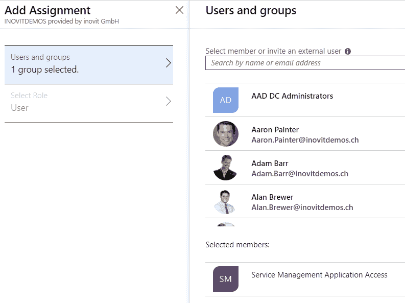
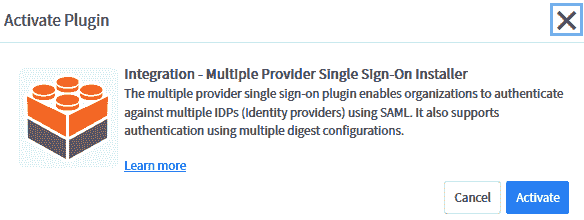
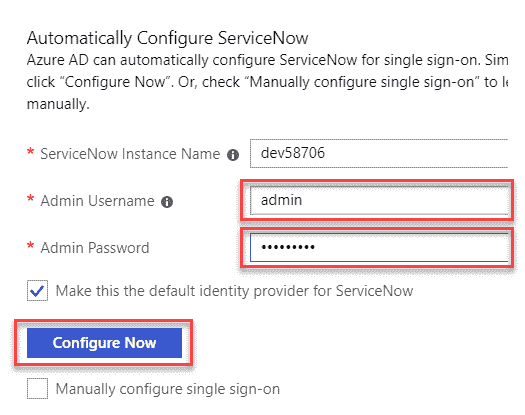
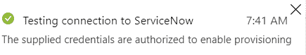
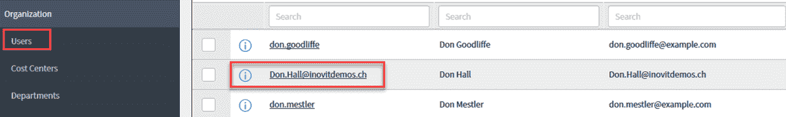
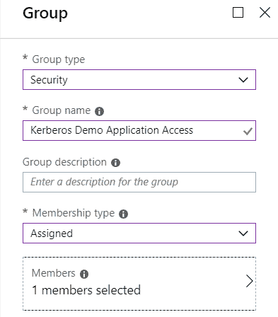
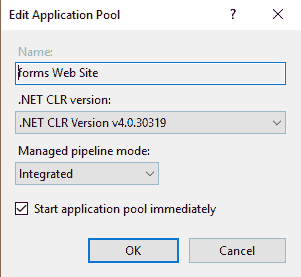
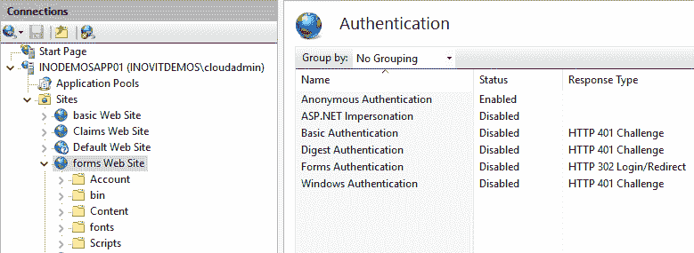

# 使用 Azure AD 应用代理和 Web 应用代理

作为第七章的继任者，*在 Azure AD 和 ADFS 上部署解决方案*，我们深入探讨了 Azure AD 和 ADFS 的不同功能。我们已经将 Kerberos 本地应用发布给外部用户。本章我们将使用另一个应用程序来做这个。此外，我们将深入了解 Azure AD 应用代理的功能。本章还将展示条件访问的初步使用示例及其基本功能。我们将在第十章，*探索 Azure AD 身份服务*，进行更多声明操作和任务自定义，并提供代码包中的示例。通过本章，您将获得所有有关将应用程序集成到 Azure AD 和 ADFS 中的信息。您还将学会使用 Azure AD 或 Web 应用代理发布应用程序。此外，您将能够使用条件访问来保护应用程序访问。

本章分为以下几个部分：

+   配置 Azure AD 和 ADFS 的附加应用

+   使用 Windows 服务器和 Azure AD Web 应用代理进行发布

+   使用条件访问

准备好了吗？我们将从配置 Azure AD 和 ADFS 的附加应用程序开始。

# 配置 Azure AD 和 ADFS 的附加应用程序

我们将继续部署和配置更多的业务应用程序，以便您测试不同的身份验证机制。为了支持我们，我们将配置 ServiceNow 与 SAML 并启用 Azure AD 到 ServiceNow 的活动用户预配：

1.  转到 Azure Active Directory | 企业应用并添加新应用：


添加新的企业应用

1.  选择 ServiceNow 并从图库中添加该应用：


添加 ServiceNow

1.  添加应用后，我们将配置 SAML 以验证我们的用户：


使用 SAML 作为身份验证方法

1.  在基本 SAML 配置中，我们添加了我们的 ServiceNow 实例信息，如下图所示：


配置 SAML 选项

需要使用以下 URI：

```
https://.service-now.com/navpage.do
https://.service-now.com
```

本章我们将使用自动配置方法。

1.  对于手动配置任务，您可以使用 Base64 选项下载证书：


下载签名证书

1.  此外，对于手动配置任务，您可以将以下链接复制到记事本中：


Azure AD 端点概述

1.  接下来，我们将把我们的服务管理应用访问组分配给该应用：



将用户分配到应用

1.  现在，我们可以开始为 ServiceNow 实例配置单点登录。

1.  首先，我们需要激活 Multi-Provider Single Sign-On 安装程序插件：


ServiceNow 中的 Multi-Provider SSO 功能

1.  您将在左侧导航窗格中找到此选项：系统定义 | 插件。

1.  激活以下插件：


在 ServiceNow 中激活 Multi-Provider SSO 功能

1.  点击对话框中的激活按钮：



激活对话框

1.  接下来，我们将在 Multi-Provider SSO | 管理 | 属性下配置插件：


配置新安装的插件

1.  需要激活以下功能：


激活提供程序的自定义属性

1.  如果您想使用手动配置方法，您需要使用记事本中的信息。

1.  我们使用自动配置选项；这是一个稍微隐藏的选项！

1.  您将在以下截图中找到它，位于 SAML 配置部分下的“查看逐步说明”：


ServiceNow SSO 提供程序的自动配置选项

1.  点击该选项，出现以下对话框；输入您的 ServiceNow 管理员凭据：



配置 SAML 连接

1.  点击 **立即配置**。

1.  接下来，我们可以在 ServiceNow 部分进行其他配置任务。

1.  导航到 Multi-Provider SSO | 身份提供者：


身份提供者配置

1.  您将找到自动生成的身份提供者：


开始配置在 ServiceNow 中新创建的 Azure AD 连接

1.  我们需要移除填充的身份提供者的 `SingleLogoutRequest` URL。

1.  所有其他字段可以保留其默认设置：


配置 IdP，包括自动重定向选项

1.  非常重要！设置自动重定向 IdP 选项，预期结果如下：


自动重定向 IdP 选项

1.  接下来，我们需要通过导航到 X.509 部分选择正确的证书：


配置正确的证书

1.  保存配置。

现在，我们已经完成了 ServiceNow 的 SAML 配置，接下来将进行用户配置：

1.  导航到 ServiceNow 应用程序的配置部分，并将配置模式更改为自动。

1.  输入以下值：

+   +   实例名称

    +   管理员用户名

    +   管理员密码

    +   通知电子邮件（并勾选“发生故障时发送电子邮件通知”）：


配置 SCIM 预配功能

1.  点击“测试连接”，您应该会收到如下示例的通知。测试连接是保存之前的必需步骤：



连接测试

1.  接下来，我们将查看用户和组的**同步配置**。

1.  点击“同步 Azure Active Directory 用户到 ServiceNow”规则：


配置同步规则

1.  您将找到活动的属性映射。如果您需要处理特殊考虑事项，例如连接到已填充的 ServiceNow 实例，您可以修改映射以满足您的需求：


同步规则设置

1.  您还将获得**同步详细信息**的实际概览：


用于监控和审计的同步详细信息

1.  通过点击查看“帐户预配”类别，您可以在审计日志中看到完整详细信息，并获得如下截图：


测试用户的实际状态

1.  接下来，我们将切换到您的 ServiceNow 实例中的“组织 | 用户”部分。

1.  搜索您的测试用户，例如`Don.Hall@inovitdemos.ch`，您将看到自动预配的结果：



验证在 ServiceNow 中同步的测试用户

初始同步所需的时间较长，而后续同步大约每**40 分钟**进行一次，只要服务在运行。

接下来的场景是使用**OpenID Connect**和您的本地 ADFS 基础设施。要跟随认证流程，请参考第六章，*管理认证协议*。

要在您的**YD1APP01**服务器上配置此场景，我们需要将`active-directory-dotnet-webapp-openidconnect`文件夹从代码包复制到桌面。

我们在您的域控制器上配置 ADFS 服务器（**YD1ADS01**），最终将得到以下预期结果——一个完整的 OpenID 认证应用程序：


以下配置步骤的结果

在接下来的步骤中，我们将配置该场景：

1.  我们从创建一个新的应用程序组开始，其中包括一个服务器应用程序（独立应用程序）：


配置新的应用程序组

1.  接下来，生成一个客户端 ID；将该 ID 复制到记事本中。

1.  输入应用程序将运行的重定向 URI，`https://localhost:44320/`：


提供应用程序属性

1.  点击“下一步”，并勾选**生成共享密钥框**；将密钥复制到记事本中：


生成共享密钥

1.  完成向导。

1.  接下来，我们通过双击新应用程序组来创建 Web API 配置。

1.  选择添加应用程序：


Web API 配置

1.  使用 Web API 选项：


选择 Web API 选项

1.  接下来，为 API 添加标识符：`https://inovitdemos.ch/OpenIDDemo`[.](https://inovitdemos.ch/OpenIDDemo)

1.  在访问控制策略部分点击下一步，然后完成向导的其他部分。

1.  现在，我们切换到 **YD1APP01** 服务器并打开 Visual Studio。

1.  打开示例代码的解决方案文件：`WebApp-OpenIDConnect-DotNet.sln`。

1.  在解决方案资源管理器中导航到 `web.config` 文件：`WebApp-OpenIDConnect-DotNet.sln`。

1.  修改代码，使其看起来像下面的示例：

    +   从记事本中复制您的客户端 ID。

    +   配置 `ida:ADFSDiscoveryDoc` 的值，使其包含您的 ADFS FQDN：`https://login.inovitdemos.ch`。

    +   验证 `ida:PostLogoutRedirectUri` 的值是否包含 `https://localhost:44320/`：

```
 <appSettings>
 <add key="webpages:Version" value="3.0.0.0" />
 <add key="webpages:Enabled" value="false" />
 <add key="ClientValidationEnabled" value="true" />
 <add key="UnobtrusiveJavaScriptEnabled" value="true" /> 
 <add key="ida:ClientId" value="40ef7c28-2172-4e4d-84b5-e9a284b94f75" />
 <add key="ida:ADFSDiscoveryDoc" value="https://login.inovitdemos.ch/adfs/.well-known/openid- configuration" />
 <add key="ida:PostLogoutRedirectUri" value="https://localhost:44320/" />
</appSettings>
```

1.  接下来，导航到 *App_Start* 部分和 `Startup.Auth.cs` 文件。

1.  在 `public partial class Startup` 下面，代码需要像下面这样调整 OpenID Connect 中间件初始化逻辑：

```
private static string clientId = ConfigurationManager.AppSettings["ida:ClientId"];
 //private static string aadInstance = ConfigurationManager.AppSettings["ida:AADInstance"];
 //private static string tenant = ConfigurationManager.AppSettings["ida:Tenant"];
private static string metadataAddress = ConfigurationManager.AppSettings["ida:ADFSDiscoveryDoc"];
private static string postLogoutRedirectUri = ConfigurationManager.AppSettings["ida:PostLogoutRedirectUri"];
 //string authority = String.Format(CultureInfo.InvariantCulture, aadInstance, tenant);
```

我们不需要 Azure AD 配置，所以我们将这一部分注释掉！

1.  接下来，我们需要修改 OpenID Connect 中间件选项：

```
app.UseOpenIdConnectAuthentication(
new OpenIdConnectAuthenticationOptions 
 { 
 ClientId = clientId, 
 //Authority = authority, 
 MetadataAddress = metadataAddress, 
 RedirectUri = postLogoutRedirectUri, 
 PostLogoutRedirectUri = postLogoutRedirectUri
```

ADFS 会强制执行请求中的 `redirect_uri`，而 Azure AD 不会这样做。

1.  现在，我们可以验证应用程序；在 Visual Studio 中按下 *F5*。要分析流量，您可以使用 Fiddler。请注意，您会在身份验证部分遇到 Fiddler 的问题：


Fiddler 认证结果

1.  做得好，您已经配置了一个使用 OpenID Connect 的应用程序！

# 使用 Windows 服务器和 Azure AD Web 应用程序代理发布

Azure AD 应用程序代理类似于 Windows Server 2012 R2 开始的本地 Web 应用程序代理角色。通过此服务，您可以启用本地应用程序的外部访问。Azure AD 应用程序代理需要 Azure AD Basic 或 Azure AD Premium 订阅。连接直接与 Azure 建立，并通过代理进入私有网络，在本地 Web 应用程序服务器上安装应用程序代理代理。

让我们运行一个非常常见的用例，将 Kerberos 本地应用程序添加到我们的 Azure AD 访问 UI，[`myapps.microsoft.com`](https://myapps.microsoft.com)。我们使用现有应用程序来配置这个场景：

1.  登录到 [`portal.azure.com`](https://portal.azure.com) 并选择 Azure Active Directory 面板。

1.  在应用程序代理下，我们首先需要在 **YD1APP01** 服务器上下载并安装应用程序代理代理。

您无需直接在应用程序服务器上安装代理。也可以使用任何其他服务器，或者出于冗余要求使用额外的代理。代理需要安装在与应用程序在同一域/森林中或正确信任的域/森林中的服务器上，以支持 Kerberos 受限委派，应用程序的 SPN 需要在每个代理实例上完成。域功能级别至少需要为 Windows Server 2012。同时，其他服务器必须能够访问正确的端口。

1.  将代理下载到服务器并启动安装：


配置 Azure AD 应用程序代理

1.  同意许可条款并点击下一步。

1.  接下来，您需要提供全局管理员凭证以将代理注册到 Azure AD。

1.  识别用于外部代理的通知：


安装应用程序代理连接器

1.  预期结果是激活的代理：


激活代理概览

1.  现在，我们可以开始配置基于 Kerberos 的本地应用程序。

1.  首先，我们创建一个可以分配以授权访问门户的组：



分配所需的测试组

1.  将一个测试用户分配给您的组。

在此示例中，我们使用的是不通过官方公共 FQDN 发布应用程序的选项。在这种情况下，我们不需要打开任何防火墙端口，应用程序的流量通过连接器工作。

1.  接下来，我们将配置应用程序代理配置：


配置本地应用程序属性

1.  如您所见，您可以提供多个附加设置以满足您的需求。

您可以在以下参考文献中找到关于不同选项的更多信息：[`docs.microsoft.com/en-us/azure/active-directory/manage-apps/application-proxy-add-on-premises-application`](https://docs.microsoft.com/en-us/azure/active-directory/manage-apps/application-proxy-add-on-premises-application)。

1.  在下一步中，我们将配置应用程序的单点登录选项。

1.  选择 Windows 集成认证选项：


选择 Windows 集成认证选项

如果您需要使用基于头部的认证，与 PingAccess 的集成将是您的好伙伴。您可以在以下来源找到有关此集成的更多信息：[`docs.microsoft.com/en-us/azure/active-directory/manage-apps/application-proxy-configure-single-sign-on-with-ping-access`](https://docs.microsoft.com/en-us/azure/active-directory/manage-apps/application-proxy-configure-single-sign-on-with-ping-access)。

1.  输入您的内部应用程序 SPN 以配置 Kerberos 部分。

1.  请记住，只有 Kerberos 受限委派才有效：


配置应用的 SPN

1.  完成此配置后，我们可以使用已分配的用户来测试应用，并且你应该得到类似于此的结果：


示例应用上成功的 Kerberos 身份验证结果

这种发布方式还允许我们使用公共 FQDN。如果你的应用程序发送带有链接的通知邮件，这个选项会很有用。要实现这种使用场景，你需要更改外部 URL 并提供公共 SSL 证书。你可以使用通配符证书，或使用 Let's Encrypt 颁发一个独立的 SSL 证书。

1.  你将在基本设置下找到该设置：


定义基本应用程序设置

对于证书，你需要使用以下部分。别忘了在你的公共 DNS 中创建 CNAME：


查看 DNS 配置选项

我们可以为云或本地应用（通过 Azure AD Web 应用代理）使用的下一个身份验证方法是基于密码的选项。我们将其用于启用了表单身份验证的应用，这些应用使用自己的身份提供者。

你的凭证将被安全地存储在用户或组对象下。

在接下来的步骤中，我们将添加一个基于密码的应用访问：

1.  添加一个新应用并选择非画廊应用选项。

1.  在单点登录方法下选择基于密码的选项：


选择非画廊应用

1.  为你的应用提供名称，并导航到单点登录配置：


使用基于密码的身份验证方法

1.  提供单点登录 URL 并检测你的应用的登录字段。

1.  有三种方式可以进行此配置：

    +   自动

    +   手动

    +   在高级视图中的自定义配置：


检测应用程序的登录字段

1.  在这个例子中，我们使用了我们公共 DNS 提供商的登录页面。

1.  如果 Azure AD 机制未能获取正确的值，你可以使用任何浏览器和开发者工具查看字段标签，并提供值：


分析代码以查找登录字段/标签

1.  接下来，你需要将用户或组分配给应用：


更新用户/组上的凭证

你可以选择将凭证隐藏给用户或组，或选择凭证在首次访问时保存。

1.  现在，通过更新凭证按钮提供凭证：


更新凭证对话框

1.  现在，你可以使用你的测试用户来测试这个应用。

请记住，用户需要安装访问面板 UI 扩展，否则他将被要求安装。你还可以使用组策略或任何其他软件部署工具将此扩展部署到所有计算机。有关此的更多信息，请访问 [`docs.microsoft.com/en-us/azure/active-directory/manage-apps/access-panel-extension-problem-installing`](https://docs.microsoft.com/en-us/azure/active-directory/manage-apps/access-panel-extension-problem-installing)

1.  为了在本地基础设施中测试相同的功能，我们为你提供了一个小挑战。如果你未能成功运行，请发送电子邮件到 `support@inovit.ch`，我们将很高兴为你提供答案。

1.  你需要在 **YD1APP01 服务器** 上按照以下步骤部署测试应用程序。

1.  在你的域控制器（**YD1ADS01**）上为应用程序创建 DNS 条目 `forms.inovitdemos.ch`：

```
Add-DnsServerResourceRecord -ZoneName "inovitdemos.ch" -A -Name "forms" -IPv4Address "10.0.0.6"
```

1.  在应用服务器上创建应用程序运行所需的服务账户：

```
New-ADUser -Name "svcformsapp" -SamAccountName svcformsapp -UserPrincipalName svcformsapp@inovitdemos.ch -path "OU=Users,OU=AAD,OU=Managed Service Objects,DC=inovitdemos,DC=ch" -AccountPassword (ConvertTo-SecureString "MIA@me1976ch" -AsPlainText -Force) -Description "Forms App Pool Account" -Enabled $True
```

1.  在 SQL 管理工作室中连接到你的 SQL Server，位于 **YD1APP01**：


使用 SQL 管理工作室进行 SQL 连接

1.  在安全性 | **登录** 下为你的服务账户创建一个登录：


配置应用程序服务账户的登录

1.  为用户分配 dbcreator 服务器角色：


为服务账户分配 dbcreator 角色

1.  接下来，我们需要在服务器上创建网站：

```
New-Item C:\inetpub\formsroot -type Directory
Import-Module Webadministration
cd IIS:
New-Item 'IIS:\Sites\forms Web Site' -bindings @{protocol="http";bindingInformation=":80:forms.inovitdemos.ch"} -physicalPath 'c:\inetpub\formsroot'
```

1.  与其他本地演示应用程序一样，我们将创建 HTTPS 绑定并分配我们的 SSL 证书：


配置应用程序的 IIS 绑定

1.  我们还需要为网站创建一个新的应用程序池，并使用服务账户来运行应用程序：



创建应用程序池

1.  接下来，我们将在高级设置中将新创建的应用程序池分配给我们的网站：


分配新创建的应用程序池

1.  页面身份验证应该按照以下截图进行配置：



IIS 身份验证配置

1.  下一步是将代码包中的 `formsapp` 文件夹内容复制到 `C:\inetpub\formsroot`：


应用程序代码

1.  在运行应用程序之前，你需要配置 `web.config` 文件，以便连接到 SQL Server 实例：

```
<add name="DefaultConnection" connectionString="Data Source=YD1APP01;Initial Catalog=FormsBasedAuthentication;Integrated Security=True" providerName="System.Data.SqlClient" />
```

1.  现在，你可以通过注册一个用户并成功登录来测试你的应用程序：


应用程序测试成功

1.  从你的发布场景开始并登录此网站——祝你好运！

在下一个示例中，我们将使用 **Windows Server Web 应用程序代理** 将基于基本身份验证的应用程序发布到外部用户：

1.  首先，你需要登录到**YD1ADS01**来配置基础演示应用程序的依赖方。

1.  导航到依赖方信任并添加依赖方信任。

1.  选择非声明感知选项。

1.  填写以下显示名称：`Basic Demo Web Site`。

1.  使用`https://basic.inovitdemos.ch`（替换为你的域名）作为依赖方信任标识符，然后点击添加。

别忘了在你的公共 DNS 中配置 FQDN。

1.  一直点击下一步直到向导完成。

1.  登录到你的**YD1URA01**服务器并打开远程访问管理控制台。

1.  在右侧任务窗格中点击发布：


Web 应用程序代理中的发布向导

1.  指定 ADFS 预身份验证方法：


使用 ADFS 预身份验证方法

1.  选择 HTTP Basic 作为预身份验证类型：


使用 HTTP Basic

1.  选择基础演示网站作为依赖方。

1.  填写以下发布值：


设置应用程序属性

1.  点击下一步，发布，然后关闭：


最终发布设置

1.  现在，你可以测试你刚刚发布的基本身份验证应用程序。

你可以在以下来源找到更多针对多个服务的实际场景，例如 Exchange 和远程桌面服务：[`docs.microsoft.com/en-us/windows-server/remote/remote-access/web-application-proxy/publishing-applications-using-ad-fs-preauthentication`](https://docs.microsoft.com/en-us/windows-server/remote/remote-access/web-application-proxy/publishing-applications-using-ad-fs-preauthentication) 和 [`docs.microsoft.com/en-us/windows-server/remote/remote-access/web-application-proxy/publishing-applications-using-ad-fs-preauthentication`](https://docs.microsoft.com/en-us/windows-server/remote/remote-access/web-application-proxy/publishing-applications-using-ad-fs-preauthentication)。

在下一部分中，我们将包括第一个条件访问选项。

# 使用条件访问

在我们的第一个条件访问场景中，我们将使用 Azure AD 功能，通过 Azure MFA 来保护 Salesforce 的访问：

1.  导航到 [`portal.azure.com`](https://portal.azure.com) 和 Azure AD 窗格 | 条件访问。

1.  点击新建策略：


创建条件访问策略

1.  将新策略命名为 `Salesforce Protection`。

1.  在分配下，进入包含 | 所有用户：


用户分配选项

1.  在云应用 | 选择应用中，选择 Salesforce：


选择 Salesforce 应用

1.  在条件 | 选择位置 | 是和任何位置：


选择位置属性

如您所见，当您需要满足附加身份验证或访问控制机制的安全要求时，您可以设置许多条件。您可以在以下来源找到更多信息：[`docs.microsoft.com/en-us/azure/active-directory/conditional-access/`](https://docs.microsoft.com/en-us/azure/active-directory/conditional-access/)。

1.  在访问控制下，转到授予。

1.  选择授予访问权限 | 需要多因素认证（MFA）：


使用 MFA 来授予访问权限

1.  启用策略并点击创建：


启用策略

1.  现在，您可以使用 Salesforce 分配的用户进行测试，并且 Azure MFA 将是必需的。

在第二个示例中，我们将沿用相同的场景，使用我们的本地 ADFS 基础设施：

1.  登录到您的 ADFS 服务器（**YD1ADS01**），并打开 ADFS 管理控制台。

1.  我们将为我们的**Kerberos 演示网站**启用**Azure MFA**。

1.  右键单击应用程序并选择编辑访问控制策略：


为应用程序配置访问控制策略

1.  接下来，选择允许所有人并要求 MFA：


启用 MFA 选项

1.  应用设置并转到身份验证方法。

1.  选择编辑多因素认证方法。

1.  转到“附加”并选择 Azure MFA：


选择 Azure MFA 方法

1.  应用设置后，您现在可以开始测试应用程序。

您需要使用已注册的 Azure MFA 用户来访问应用程序。在本章的代码包中，您将找到其他用例，包括修改登录网页与用户交互所需的自定义内容。

我们将在接下来的章节中涵盖更多的条件访问用例以及有关 Azure MFA 服务的更多信息：

+   探索 Azure AD 身份服务

+   开发单租户和多租户应用程序

+   配置 Azure 信息保护解决方案

这是为了显示它与特定需求的相关性。

# 摘要

在本章中，您已经学会了如何使用 Azure AD 和 ADFS 功能配置不同的身份验证场景。有许多可能的组合，我们无法在一章中提供所有的组合。我们为您提供了一个入门介绍，并分享了一些实用的小贴士，帮助您开始并指引您在未来的技术旅程中前进。别担心；在本书的下一章节中，我们将深入探讨更多不同的场景，为您提供尽可能多的帮助。同时，查看本书的代码包，您将找到来自我们项目的额外实践示例。

在下一章节中，我们将探讨更多的 Azure AD 身份服务，例如 Azure AD B2B 和 B2C。
