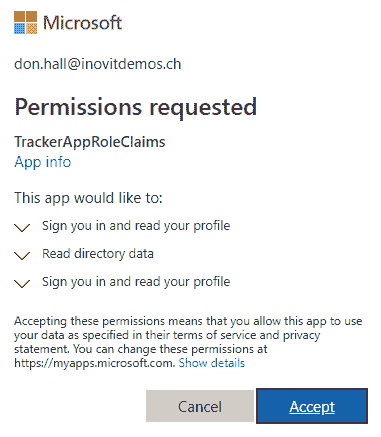
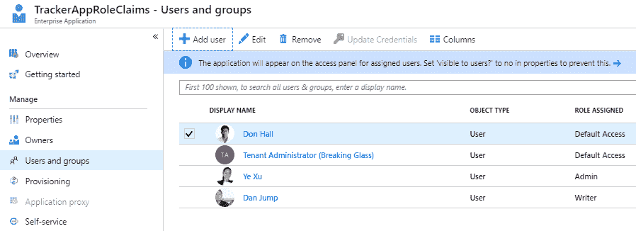
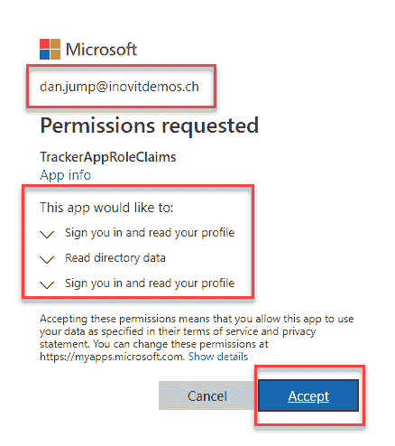
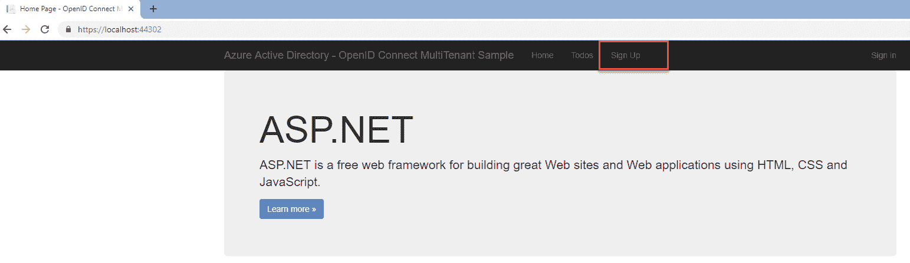

# 在 Azure AD 上部署其他应用程序

为你的应用程序提供正确的身份验证至关重要，尤其是当你只希望允许来自**Azure Active Directory**（**Azure AD**）的用户或任何其他 Azure AD 的用户进行身份验证时。Azure AD 提供了两个概念来为你的用户提供所需的身份验证。

在本章中，我们将向你介绍单租户和多租户应用程序的概念以及它们之间的不同之处。此外，我们将讨论在将单租户应用程序迁移到多租户应用程序时，角色和声明的不同，你可以测试这两种模型之间的过渡。我们还将部署一个使用 OpenID Connect 的多租户应用程序。在所有不同的实验中，你将学习到你需要的知识，以便从应用程序供应商那里获取信息，将应用程序集成到你的环境中。你将能够提出正确的问题，并将部署引导到正确的方向。

我们将把本章分为以下几个部分：

+   准备你的实验环境

+   定义单租户和多租户应用程序的标准

+   部署单租户应用程序，包括角色和声明

+   将单租户应用程序迁移到多租户场景

+   使用 OpenID Connect 部署多租户应用程序

和往常一样，我们将做很多实际操作。让我们整理一下在演示环境中处理实验所需的前置条件。

# 准备你的实验环境

在本章中，你可以使用任何安装了 Visual Studio 的机器。在我们的案例中，我们将其安装在**YD1APP01**服务器上。这应该是你的完美开发环境。在本实验中，你将使用**Azure AD1: yourdomain1.onmicrosoft.com**，并使用来自另一个租户的一个测试来宾用户和来自任何其他 Azure AD 的测试用户来测试多租户应用程序。此外，你还需要使用代码包中的代码示例，并将其用于 Visual Studio 中配置和运行应用程序：

实验环境概览

在准备好我们的实验环境后，我们可以直接进入本章的第一部分，该部分描述了单租户和多租户应用程序。

# 定义单租户和多租户应用程序的标准

表面上看，单租户和多租户应用程序有一个简单的解释。我们可以说，单租户应用程序仅在它们注册的租户中可用。另一方面，多租户应用程序可以在你的本地租户以及其他租户的用户中使用：

+   单租户应用程序主要用于当你希望将应用程序与外部隔离，并仅向内部用户提供访问权限时。

+   多租户应用程序用于当你希望将应用程序提供给内部员工、来宾用户以及在协作场景下的微软个人账户用户时，例如。

我们强烈建议查看 [`docs.microsoft.com/en-us/azure/active-directory/develop/howto-convert-app-to-be-multi-tenant`](https://docs.microsoft.com/en-us/azure/active-directory/develop/howto-convert-app-to-be-multi-tenant) 以了解在两种场景中使用的端点之间的差异。

# 部署包含角色和声明的单租户应用程序

在本节中，我们将以单租户配置部署 Microsoft 的示例，`WebApp-RoleClaims-DotNet.sln`。我们从这个设置开始，然后在下一部分将应用程序迁移到多租户应用程序。该追踪应用程序提供了以下应用角色，我们可以用来测试角色/声明主题。首先，我们可以使用管理员角色执行所有操作。使用编写者角色，你可以在应用程序中创建任务。要更改任务的状态，可以分配批准者角色。要查看任务及其相关状态，我们可以映射观察者角色。

通过以下步骤，我们将为我们的应用程序配置 Azure AD：

1.  打开 Azure 门户：[`portal.azure.com`](https://portal.azure.com)。

1.  导航到 Azure AD 切换板。

1.  点击应用注册。

1.  创建 + 新应用注册：

新应用程序注册

1.  提供名称。

1.  添加登录 URL，`https://localhost:44322/`：

应用设置对话框

1.  提供应用程序 ID URI，格式为 `https://181031inovitdemos.onmicrosoft.com/trackerapp`：

额外应用设置对话框

1.  提供登出 URL，`https://localhost:44322/Account/EndSession`。

1.  将其他设置保持为默认：

登出 URL 配置

1.  检查回复 URL；它们应该像下图一样：

回复 URL 配置

1.  在所需权限下，点击添加：

权限配置

1.  选择 Microsoft Graph API：

选择 Microsoft Graph API

1.  选择以下权限：

    +   登录并读取用户资料

    +   阅读目录数据

你可以使用 Microsoft Graph 权限参考文档 [`docs.microsoft.com/en-us/graph/permissions-reference`](https://docs.microsoft.com/en-us/graph/permissions-reference) 来了解更多关于此主题的信息。

1.  选中的权限应如下所示：

分配所需的两个范围

1.  保存并点击授予权限。

1.  打开应用程序的清单：

配置清单

1.  在 `appRoles` 部分配置下图中的角色，并使用代码包的配置代码。

1.  清单中的结果应如下所示：

添加应用角色

1.  保存清单。

1.  将应用程序 ID 复制到记事本中。

1.  转到 Azure AD 租户的属性页面。

1.  将目录 ID 复制到记事本：

获取目录 ID

1.  打开 Visual Studio 并加载名为 `WebApp-RoleClaims-DotNet.sln` 的解决方案文件。

1.  打开解决方案的 `web.config` 文件并进行以下操作：

    +   在 `ida:ClientId` 值中输入应用程序 ID

    +   在 `ida:TenantId` 值中输入目录 ID

1.  预期的结果如下：

修改 `web.config` 文件

1.  在 Visual Studio 中按 *F5* 来构建并运行应用程序。

1.  以 Don Hall 用户登录：

测试登录功能

1.  同意应用程序授权。

1.  点击接受：

OAuth 授权

1.  返回 Visual Studio 并检查 `TaskController.cs` 文件中的角色实现：

审查代码中的角色实现

1.  Don Hall 将成功登录。

1.  点击“关于”以查看实际的角色；没有角色被分配：

查看实际的应用程序角色

1.  返回到应用程序并为多个测试用户分配角色。

1.  点击添加用户：

分配用户和组

1.  分配你想要测试的角色：

选择合适的角色

1.  在我的例子中，我使用了两个帐户，如下图所示：

角色分配结果

1.  尝试用你的用户登录；我从 Ye Xu（分配了管理员角色）开始：

测试登录功能

1.  接受用户授权：

检查并批准 OAuth 授权

1.  点击“关于”以查看分配的角色。我们可以看到 Ye Xu 已分配了管理员角色：

检查当前角色

1.  尝试一个不同角色的用户，在我的例子中是 Dan Jump（已分配 Writer 角色）：

使用第二个测试用户进行测试

1.  接受授权：

检查并批准 OAuth 授权

1.  你将看到`Writer`角色已正确分配：

查看当前角色

1.  尝试用一个不在组织中的用户登录（来自另一个 Azure AD 的用户）：

使用访客用户帐户进行测试

1.  请记住，我们当前使用的是单租户配置。用户会收到错误信息，无法登录：

查看错误信息

我们的演示应用程序正在运行，并且为我们自己 Azure AD 租户的用户分配了角色。来自其他 Azure AD 租户的用户目前无法访问该应用程序。

我们强烈建议按照以下指导，定制 Azure AD 中的声明，以支持其他协议，如 SAML：

+   企业角色应用程序管理：[`docs.microsoft.com/en-us/azure/active-directory/develop/active-directory-enterprise-app-role-management`](https://docs.microsoft.com/en-us/azure/active-directory/develop/active-directory-enterprise-app-role-management)

+   SAML 声明自定义：[`docs.microsoft.com/en-us/azure/active-directory/develop/active-directory-saml-claims-customization`](https://docs.microsoft.com/en-us/azure/active-directory/develop/active-directory-saml-claims-customization)

+   声明映射：[`docs.microsoft.com/en-us/azure/active-directory/develop/active-directory-claims-mapping`](https://docs.microsoft.com/en-us/azure/active-directory/develop/active-directory-claims-mapping)

+   配置可选声明：[`docs.microsoft.com/en-us/azure/active-directory/develop/active-directory-optional-claims`](https://docs.microsoft.com/en-us/azure/active-directory/develop/active-directory-optional-claims)

接下来，我们将把应用程序迁移到多租户配置。

# 将单租户应用程序迁移到多租户场景

在本节中，我们将重新配置应用程序，使其作为多租户应用程序，您可以从其他 Azure AD 租户或 Microsoft 个人账户中使用。通过以下配置，我们将应用程序迁移：

1.  打开解决方案中的 `Startup.cs` 文件：

    +   注释掉 `ConfigureAuth(app)` 这一行

    +   取消注释 `ConfigureMultitenantAuth(app)` 这一行：

修改代码以支持多租户使用

1.  将 `ida:TenantId` 值更改为我们的 Azure AD 域名：

更改租户 ID

1.  在 Visual Studio 中按 *F5* 以构建并运行应用程序。

1.  在 Azure AD 中将会有一个新应用程序，但用户尚未分配角色：

检查新创建应用程序的角色分配

1.  将角色重新分配给用户：

重新分配角色

1.  测试使用您的用户登录并检查应用程序。

1.  测试使用来自另一个 Azure AD 或 Microsoft 个人账户的用户进行登录。

1.  您应该能够登录：

检查使用访客用户账户进行登录

您可以在 [`docs.microsoft.com/en-us/azure/active-directory/develop/howto-convert-app-to-be-multi-tenant`](https://docs.microsoft.com/en-us/azure/active-directory/develop/howto-convert-app-to-be-multi-tenant)[.]（https://bit.ly/2zuyOT6）获取有关此过程的更多信息。

在这一部分，我们重新配置了应用程序，使其作为多租户应用程序正常工作，并且取得了成功！只需注意，你需要邀请 Microsoft 个人帐户作为访客用户，才能与你的应用程序一起使用。接下来，我们将部署另一个使用 OpenID Connect 的多租户应用程序，向你展示另一种实现方式。

# 使用 OpenID Connect 部署另一个多租户应用程序

在这一部分，我们将安装一个使用 OpenID Connect 作为认证协议的多租户应用程序。通过这个示例，你将学习如何在 Azure AD 内部署正确的应用程序注册，并了解需要在应用程序中配置哪些内容，以使用 Azure AD 作为认证提供者：

1.  打开 Azure 门户：[`portal.azure.com`](https://portal.azure.com)。

1.  导航到 Azure AD 面板。

1.  点击“应用注册”。

1.  点击 + 新建应用程序注册：

创建一个新的应用程序注册

1.  提供应用程序名称和登录 URL，`https://localhost:44302/`：

提供应用程序属性

1.  将应用程序 ID 复制到记事本中。

1.  点击“设置”：

获取应用程序配置数据

1.  提供格式为 `https://181031inovitdemos.onmicrosoft.com/MTTodoWebApp` 的应用程序 ID URI：

添加应用程序 ID URI

1.  提供注销 URL。首页 URL 应该已经填写完毕。

1.  提供格式为 `https://localhost:44302/Account/EndSession` 的 URL。

1.  点击“多租户：是”，以将应用程序作为多租户应用程序使用：

使用多租户选项

1.  配置应用程序的正确权限。点击“添加”在所需权限部分：

授予所需的权限

1.  选择 Microsoft Graph API：

使用 Microsoft Graph API

1.  分配“登录并读取用户资料”权限：

范围分配

1.  点击“授予权限”以授予权限：

授权权限对话框

1.  生成一个密钥并命名为 `Key1`，有效期为 2 年。

1.  点击“保存”，并将生成的密钥值复制到记事本中：

秘钥生成

1.  提供回复 URL。

1.  需要配置以下值：

    +   `https://localhost:44302/`

    +   `https://localhost:44302/Onboarding/ProcessCode`

1.  这是配置：

配置回复 URL

1.  打开 Visual Studio 和 `WebApp-MultiTenant-OpenIDConnect-DotNet.sln` 解决方案文件。

1.  打开解决方案的 `web.config` 文件。

1.  将 `Key1` 的值复制到 `ida:Password` 部分。

1.  将应用程序 ID 复制到 `ida:ClientID` 部分。

1.  修改后的代码应如下所示：

代码修改结果

1.  测试多租户功能。在 Visual Studio 中按 *F5* 来构建解决方案。

1.  应用程序应该已启动。

1.  点击注册：

应用程序注册过程

1.  使用用户 Don Hall 注册以查看预期的行为。

1.  您已成功登录，如您所见：

成功登录到应用程序

1.  创建一个测试项以测试应用程序的功能。这里不是关键部分；我们关注的是身份验证：

任务创建对话框

1.  尝试使用 Azure B2B 客户用户注册；您需要作为用户对应用程序进行同意。

1.  在注册过程中使用管理员同意：

检查并接受 OAuth 同意

1.  接受同意，您应该已成功登录：

成功登录到应用程序

1.  使用来自任何 Azure AD 租户的另一个用户测试应用程序，您将获得相同的体验。

做得好！我们也看到在这个多租户应用程序和 OpenID Connect 实现中。

最后的提示：配置 Graph Explorer 以便与您的租户一起使用 Microsoft Graph API，并收集更多关于该主题的信息。访问 [`developer.microsoft.com/en-us/graph/graph-explorer`](https://developer.microsoft.com/en-us/graph/graph-explorer) 并以全局管理员身份登录您的 Azure AD：

Microsoft Graph Explorer 应用程序

凭借这些经验，您现在可以开始分析和扩展解决方案。

# 摘要

在本章中，您了解了单租户和多租户应用程序及其之间的区别。您已在您的环境中处理了这两种应用程序类型。此外，您还发现了这两种应用程序类型中的角色和声明，因此您现在可以提供**基于角色的访问控制**（**RBAC**）场景。通过您部署的所有其他应用程序，您现在了解了不同协议之间的区别，如 SAML2.0、不同流类型的 OAuth2 和 OpenID Connect。您还学习了**跨域身份管理系统**（**SCIM**）如何帮助您将用户（同步）从 Azure AD 提供给应用程序。

在下一章中，您将学习如何提供基于云的身份管理生命周期。我们将重点讲解如何为您的用户提供安全且易用的身份验证和身份管理。
