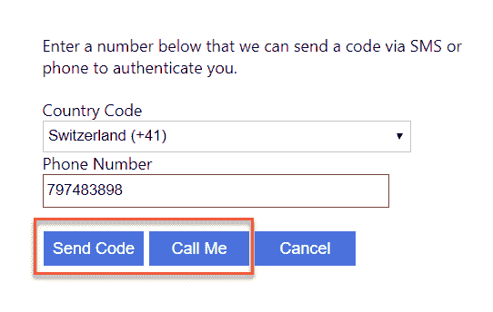
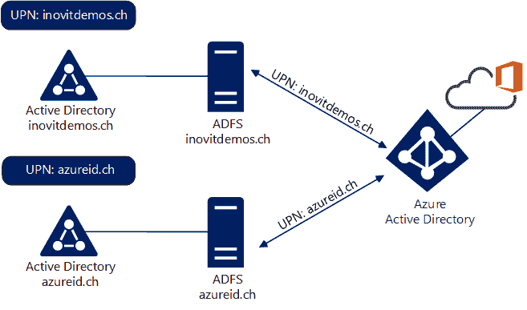

# 探索 Azure AD 身份服务

在本章中，我们将探索不同的 Azure AD 身份服务以及作为本地身份服务的 AD FS。我们将研究 Azure AD B2B 和 B2C 功能，并解释这些技术背后的主要概念。此外，我们还将查看并扩展在第一章中配置的 Azure AD 域服务，*构建和管理 Azure Active Directory*。为了获得完整的视图，我们还将查看 Active Directory 联邦服务的不同功能，以及它们如何支持不同的身份验证场景。您将学习如何在您的项目中使用 Azure AD B2B 和 B2C 服务，以便为客户、合作伙伴和内部员工提供适当的访问权限。特别是，您可以将 Azure AD B2C 作为您开发应用程序的完整身份平台。

本章将分为以下几个部分：

+   准备您的实验室环境

+   了解 Azure AD **面向企业**（**B2B**）

+   探索 Azure AD **面向客户**（**B2C**）

+   使用 Azure AD 域服务扩展 Active Directory 解决方案

+   AD FS 作为云端的本地身份服务

在第一部分中，我们开始准备我们的实验室环境。

# 准备您的实验室环境

在本章中，我们将需要一个额外的 Azure AD，并配置 Office 365，以测试不同的功能。您已经知道如何通过第一章中的方法创建此配置，*构建和管理 Azure Active Directory*。创建此额外租户时只需要最小的配置集。基本上，您只需要验证并注册一个自定义域名，其他没有要求。此外，您还需要在您的管理工作站上安装 Visual Studio 2017 Community，并安装 ASP.NET 和 Web 开发工作负载：


实验室环境概览

若要配置 Azure AD 域服务 LDAPS 使用场景，您需要提供一个公共 SSL 证书。您可以使用第七章中的程序，*在 Azure AD 和 AD FS 上部署解决方案*，利用 Let's Encrypt 解决方案生成适合您需求的证书。我们将从 Azure AD B2B 功能开始。

# 了解 Azure AD B2B

Azure AD B2B 解决了业务合作伙伴之间的协作问题。它允许用户在合作伙伴之间共享业务应用程序，而无需通过公司间的联合关系和内部管理的合作伙伴身份。通过 Azure AD B2B，您可以通过邀请和授权来自合作伙伴公司的用户访问您的资源，创建跨公司关系。通过此过程，每个公司与 Azure AD 联合一次，然后每个用户都由一个 Azure AD 账户表示。这个选项还提供了更高的安全性，因为如果用户离开合作伙伴组织，访问权限将被自动禁用。在 Azure AD 内，用户将作为来宾处理，且不能在目录中遍历其他用户。邀请用户的权限将通过正确关联的组成员身份提供。

下图展示了使业务合作伙伴能够访问您的应用程序的过程：


Azure AD B2B 邀请流程

在**FLOW 1**的情况下，用户接受邀请后，将能够登录到合作伙伴组织。

在**FLOW 2**的情况下，用户将注册自己的 Azure Active Directory，并将被添加到启动邀请过程的 Azure AD 中。

您可以在[`docs.microsoft.com/en-us/azure/active-directory/b2b/what-is-b2b`](https://docs.microsoft.com/en-us/azure/active-directory/b2b/what-is-b2b)找到更多关于该服务的信息。在第十一章中，*在 Azure 上创建身份生命周期管理*，我们将提供完整的来宾管理生命周期配置任务，包括使用 Azure MFA、条件访问和访问审查的 Azure AD B2B 门户。

# 为外部合作伙伴提供资源访问（本地部署）

通过以下本地配置，我们可以为外部合作伙伴提供资源访问。您可以使用 AD FS 来执行此任务，以允许员工和客户或合作伙伴访问您的声明感知应用程序。我们可以通过配置联合合作伙伴来实现提供联合 B2B 访问的目标。

设计和流量流程如下面的图所示：


ADFS B2B 配置

Active Directory 联合服务的另一个功能是支持使用**WS-Trust**规范的活动客户端。这使得您的客户端软件能够与不同的参与者进行交互，而无需依赖浏览器重定向来查找声明提供者、资源提供者或其他相关组件。

流程按以下步骤进行：

1.  **请求服务**（客户端上的软件）查询**目标服务**并请求政策要求列表。这包括所需声明的列表和 STS。

1.  Requesting Service 查询**Relying Party STS**的策略。这包括 STS 信任的声明提供程序列表。

1.  Requesting Service 查询**Claims Provider STS**以获取策略列表。这包括所需的身份验证方法和其他信息。

1.  Requesting Service 接收所有的策略信息；客户端将向**Claims Provider**（**CP**）请求令牌。这是通过**SOAP over HTTPS**与 CP 的直接连接。

1.  **CP** 进行用户身份验证并返回令牌。

1.  Requesting Service 接收令牌；令牌将通过 HTTPS 上的 SOAP 直接向**Relying Party**（**RP**）请求。

1.  **Relying Party Federation** 服务器签署令牌并将其发送回用户。

1.  **Requesting Service 接收**由**Relying Party STS**签发并签名的令牌。它将令牌提交到目标服务并接收响应：


WS-trust 流程

请记住，这个本地扩展始终可以与 Azure 身份和访问管理服务一起支持和使用。

# 探索 Azure AD B2C

Azure AD B2C 为开发人员构建了一个完整的身份管理框架，并支持通过社交网络（如 Facebook、Google 或 LinkedIn）登录应用程序，还可以为专门为公司应用程序创建使用用户名和密码的账户。同时，还提供自助密码管理和个人资料管理。此外，Azure MFA 通过引入更高等级的安全性，进一步增强了解决方案的安全性。原则上，这项功能允许小型、中型和大型公司将其客户存储在单独的 Azure Active Directory 中，并拥有与企业管理的 Azure Active Directory 相似的所有功能，甚至更多。通过不同的验证选项，您还能够为更敏感的交易提供必要的身份验证保证。Azure AD B2C 为您的开发活动处理所有 IAM 任务。

基本上，使用 Azure AD B2C 的最小架构如下所示。如前所述，Azure AD B2C 为您的应用程序提供身份管理框架：


Azure AD B2C 基本概念

为了更好地理解 Azure AD B2C，我们将构建一个来自 Microsoft 的示例应用程序，它提供一个小型 Web 应用程序，包括一个 Web API。这个应用程序是深入了解 Azure AD B2C 的良好起点。我们强烈建议在您的实验环境中构建该应用程序。该应用程序也可以运行在预定义的演示环境中。您可以在[`github.com/Azure-Samples/active-directory-b2c-dotnet-webapp-and-webapi#Using-the-demo-environment`](https://github.com/Azure-Samples/active-directory-b2c-dotnet-webapp-and-webapi#Using-the-demo-environment)找到源代码。

在开始实验活动之前，我们建议先学习以下 Azure AD B2C 介绍：[`docs.microsoft.com/zh-cn/azure/active-directory-b2c/active-directory-b2c-overview`](https://docs.microsoft.com/zh-cn/azure/active-directory-b2c/active-directory-b2c-overview)

让我们开始旅程，并登录到我们的管理工作站。

我们将在我们创建的第一个完整 Azure AD 上执行所有 Azure AD B2C 任务。

在下一部分中，我们将创建 Azure AD B2C 租户。

# Azure AD B2C 租户创建

现在我们了解了 Azure AD B2C 的基本概念，我们将开始为使用 Azure AD B2C 提供身份平台的测试应用程序进行配置：

1.  在 Visual Studio 项目文件夹中打开一个命令行窗口，我的路径是 `C:\Users\jochen.nickel\Documents\Visual Studio 2017\Projects`，并执行以下命令：

```
git clone https://github.com/Azure-Samples/active-directory-b2c-dotnet-webapp-and-webapi.git
```

1.  创建 **Azure AD B2C 目录**。

1.  使用全局管理员凭据打开 Azure 门户 ([`portal.azure.com`](https://portal.azure.com))。

1.  使用搜索选项查找 Azure AD B2C 窗格，以查看我们将要创建的服务：


Azure AD B2C 创建过程

1.  单击 Azure 门户左上角的“创建资源”。

1.  单击“身份”并选择 Azure Active Directory B2C：


选择 Azure AD B2C

1.  单击“创建新的 Azure AD B2C 租户”：


创建新的 Azure AD B2C 租户

1.  使用 `YOURDOMAIN1` 和 `YOURDOMAINB2C` 值作为您的演示环境：


Azure AD B2C 属性

1.  将新的 Azure AD B2C 与我们的 Azure 订阅关联：


关联 Azure AD B2C 租户

1.  切换目录以使用新的 Azure AD B2C 租户：


Azure AD 目录切换

1.  使用 Azure AD B2C 目录：


选择新创建的 Azure AD B2C 租户

1.  导航到 Azure AD B2C 窗格：


Azure AD B2C 概述页面

在下一部分中，我们将配置 Azure AD 中的演示应用程序。

# 演示应用注册

接下来，我们将在应用程序下注册新的 `Demo Web App` 和 Web AppAPI：

1.  按照以下截图所示添加 Web 应用：


提供应用程序属性

1.  创建应用密钥：


应用密钥生成过程

1.  将密钥值复制到记事本。

1.  将应用 ID 从属性部分复制到记事本。

1.  为 Web App API 注册第二个应用程序。

1.  填写如下截图所示的值：


注册具有属性的第二个应用程序

1.  将应用 ID URI（可选）复制到记事本。

1.  配置 Web API 的发布作用域：

    +   Hello.Write | 对 hello 的写访问

    +   Hello.Read | 对 hello 的读取访问：


定义作用域

1.  切换到 Web 应用和 API 访问部分。

1.  点击“添加”，选择演示 Web API：


定义应用访问权限

1.  你应该看到以下内容：


API 访问结果

1.  你应该有一个记事本，其中包含以下值：

```
Web App 
ID d92c671f-c576-45b1-9d53-0510f306bccc
Key WdLrw#+DZ6L#vW7,3(ryS.uP

Web App API
ID 2f73f192-e9c5-4fa8-8429-9aa3fd13293e
```

现在，我们可以开始在 Azure AD B2C 中创建用户流程。

# 用户流程创建

在接下来的部分中，我们将配置 Azure AD B2C 中的第一个用户流程，获取用户注册流程并将其引导到演示应用程序。

接下来，我们将创建我们的第一个用户流程：

1.  导航到用户流程（策略），并创建你的第一个流程：


新用户流程创建

1.  使用注册和登录选项：


选择注册和登录选项

1.  对于流程，使用以下值：


定义流程属性

1.  以及以下属性：


选择将被收集并返回声明的属性

1.  点击“创建”。

现在我们已经准备好了注册和登录选项，可以开始修改演示应用程序的代码。

# Visual Studio 代码修改

要使用新创建的用户流程，我们需要修改演示应用程序的代码。

修改`TaskWebApp`项目，内容如下：

1.  打开`TaskWebApp`中的`web.config`文件。

1.  找到以下密钥并替换它们：

    +   `ida:Tenant`，使用你的租户名称`yourdomainb2c.onmicrosoft.com`

    +   `ida:ClientId`，使用记事本中的应用 ID

    +   `ida:ClientSecret`，使用记事本中的密钥

    +   `ida:SignUpSignInPolicyId`，值为`b2c_1_SiUpIn`

1.  注释掉以下条目：

```
<!--<add key="api:TaskServiceUrl" value="https://aadb2cplayground.azurewebsites.net/" />-->
```

1.  取消注释以下条目：

```
<add key="api:TaskServiceUrl" value="https://localhost:44332/"/> 
```

1.  将`api:ApiIdentifier`的键值更改为 API 的应用 ID URI：

```
<!--<add key="api:ApiIdentifier" value="https://fabrikamb2c.onmicrosoft.com/api/" />—>
<add key="api:ApiIdentifier" value="https://yourdomainb2c.onmicrosoft.com/myAPISample/" />
```

1.  你的代码应该如下所示：


修改后的代码引用

修改`TaskService`项目，内容如下：

1.  打开`TaskService`项目中的`Web.config`文件。

1.  找到以下密钥并替换它们：

    +   `ida:Tenant`，值为`yourdomainb2c.onmicrosoft.com`

    +   `ida:ClientId`，使用来自你的 Web API 的应用程序 ID

    +   `ida:SignUpSignInPolicyId`，值为`b2c_1_SiUpIn`

    +   `api:ReadScope`，使用`Hello.Read`

    +   `api:WriteScope`，值为`Hello.Write`

1.  你的代码应该是这样的：


修改后的代码引用

Visual Studio 启动项目修改如下：

1.  转到解决方案资源管理器，右键点击“属性”。

1.  在常规属性下，转到启动项目。

1.  使用以下配置：


配置项目启动选项

1.  在 Visual Studio 中按*F5*，启动 Web 应用和 Web 应用 API：


启动应用程序视图

1.  点击 Web 应用上的 注册/登录，Azure AD B2C 就会参与进来：


测试用户流程

1.  点击 立即注册。

1.  输入您的信息并点击 发送验证代码：


提供所需的资料

1.  您将收到一封包含验证代码的电子邮件，内容如下：


获取您的验证代码

1.  验证并创建帐户。

1.  现在，Azure MFA 将参与进来；请选择您首选的验证选项：



提供您的验证

1.  您已成功登录，可以查看您的声明：


演示应用程序登录成功，包括提供的声明

好极了！做得好。您可以在 [`docs.microsoft.com/zh-cn/azure/active-directory-b2c/`](https://docs.microsoft.com/en-us/azure/active-directory-b2c/) 上深入了解 Azure AD B2C[。](https://bit.ly/2AVqifY)

# 比较 Azure AD B2B 和 B2C

基本上，这两个 Azure AD 服务都允许您与外部用户协作。Azure AD B2B 专注于简化与合作伙伴的协作流程，通过安全共享信息和资源来实现。它处理组织之间的联合，并允许不同帐户类型（如学校帐户、工作帐户，或仅仅是电子邮件帐户）进行简单的邀请和兑换过程。

Azure AD B2C 专注于创建面向客户的应用程序的开发人员。开发人员为其应用程序提供全功能的身份系统。Azure AD B2C 提供本地存储库和与其他多个身份提供商的登录体验：

| **Azure AD B2B** | **Azure AD B2C** |
| --- | --- |
| 来自合作伙伴组织的用户身份验证 | 移动和 Web 应用程序的客户访问 |
| 合作伙伴生命周期 = 主机和邀请组织，包括访问审查 | 客户生命周期 = 自助服务或应用程序管理 |
| 支持工作或学校帐户，或任何电子邮件地址 | 支持本地用户应用帐户或受支持的身份提供商 |
| 支持对所有 Azure AD 连接应用程序的单点登录（SSO） | 支持对 Azure AD B2C 租户内客户自有应用程序的单点登录（SSO） |
| 双方组织共同管理安全策略 | 应用程序管理安全策略 |
| 双方组织共同管理品牌 | 应用程序管理品牌 |
| 合作伙伴用户默认包含在同一个 Azure AD 中，用户类型为来宾 | 与组织或合作伙伴的 Azure AD 分开管理 |

在接下来的章节中，我们将比较 AD FS 与这两项服务，以为您提供一个全面的视角。

# 比较 AD FS 与 Azure B2B 和 B2C

在本节中，我们将提供一些有用的信息，以帮助您区分 AD FS 和 Azure AD B2B 以及 B2C 的功能。

我们将从 AD FS 和 Azure B2B 场景之间的主要差异开始。使用 Azure AD B2B，可以邀请来自合作伙伴组织的用户访问你自己 Azure AD 实例中的应用程序。使用 AD FS，你可以通过 CP 信任为任何基于 AD FS 的合作伙伴组织提供相同的功能。

然而，你将遇到以下差异：

+   使用 AD FS，你具有很大的灵活性，可以运行任何自定义的场景。

+   以下要求需要满足：

    +   合作伙伴需要联合服务

    +   证书处理

    +   管理开销

使用**Azure AD B2B**，有一个简单的邀请流程。该功能免费提供，或者如果使用基本或高级功能，则按**5.1 比例**计费，合作伙伴无需满足任何要求——可以向 Azure AD 和本地目录用户（包括社交身份）发送邀请。

管理员通过 Azure AD 目录控制对公司应用程序的所有访问。当合作关系终止时，合作伙伴用户可以从你的 Azure AD 中删除，且他们对你应用程序的访问将立即被撤销。可以使用访问审查来管理来宾用户的生命周期。此外，当合作伙伴用户离开合作伙伴组织时，如果该合作伙伴组织使用本地 Azure AD 而非 AdHoc（非托管的 Azure AD 租户），他们的访问权限将自动丧失。

请记住，如果你仍然希望使用 AD FS 进行 B2B，你将需要管理来宾用户账户的整个生命周期。

接下来我们将讨论 AD FS 和 Azure AD B2C 之间的差异。你可以运行两种主要场景。首先，你可以处理客户账户和本地身份存储，身份验证可以由 AD FS 管理。如果你希望在自己的环境中拥有完全的控制权，这个场景会很有用。但你还需要提供多种流程和技术来支持这种场景——这适用于整年。

另一种选择是客户可以使用 Azure AD B2C 注册或带来自己的消费者身份，这样你将获得一个完全可管理的解决方案，具有高可用性，并且大多数常见的流程和支持功能已经实现。

AD FS 提供了一个非常灵活且可定制的解决方案，适用于你自己的环境，但你需要集成社交媒体提供商并建立信任关系，以便用户能够使用他们自己的身份。如前所述，用户管理和自助服务必须构建并提供高可用性。

使用 Azure AD B2C，你将获得一个完整的解决方案，它允许业务应用程序的开发者使用 Azure AD 的整个身份框架和 B2C 扩展。注册页面已准备好使用，或者用户可以使用他们自己的身份（如 Google、Live、Facebook 等），并且你可以启用自助服务选项。

# 使用 Azure AD 域服务扩展 Active Directory 解决方案

Azure AD 域服务帮助您将依赖于传统身份验证方法（如 Kerberos 和 NTLM）的本地应用程序迁移到云中。此基于云的服务使您能够将 IaaS 虚拟机加入到托管域，而无需在虚拟机上提供域控制器。通过此解决方案，您可以将应用程序直接集成到 Azure Active Directory 服务中，并享受丰富的功能集。随着 Azure AD 用户同步到 Azure AD DS，您可以使用身份进行身份验证和授权。您还可以通过 **轻量级目录访问协议** (**LDAP/S**) 连接到目录服务。

以下图示展示了从安装在 IaaS 虚拟机上的应用程序角度看集成场景：


Azure AD 域服务概述

该服务为您提供一个扁平的组织单位结构和默认的组策略，用于管理加入域的服务器系统。通常来说，将客户端计算机加入此目录并不是一个好主意。

该服务用于帮助您集成以下系统：

+   NAS 系统

+   打印解决方案

如果您的本地服务没有启用声明，它也可以将您的本地服务迁移到 Azure。

以下配置展示了如何从 第一章，*构建和管理 Azure Active Directory*，扩展解决方案，在该章节中我们首次启用了该服务。要配置此解决方案，您需要拥有证书。请参阅 第八章，*使用 Azure AD 应用程序代理和 Web 应用程序代理*，查找为此目的创建证书的说明。执行以下步骤：

1.  在 Azure AD 域服务面板中导航到 [`portal.azure.com`](https://portal.azure.com)。

1.  选择“安全 LDAP”并启用该服务：


安全 LDAP 激活程序

1.  启用“允许通过互联网进行安全 LDAP 访问”，并上传证书，包括私钥：


提供证书

1.  在网络安全组中创建一个新的 LDAPS 安全规则。

1.  添加一个规则，包含您的源 IP 和 Azure AD DS 目标网络：


更改防火墙规则以允许 LDAPS

1.  使用您偏好的 LDAP 浏览器连接到 LDAPS 服务：


测试 LDAPS 连接

您可以在 [`docs.microsoft.com/en-us/azure/active-directory-domain-services/active-directory-ds-admin-guide-configure-secure-ldap`](https://docs.microsoft.com/en-us/azure/active-directory-domain-services/active-directory-ds-admin-guide-configure-secure-ldap) 上找到有关 LDAPS 配置的更多信息。

在下一节中，我们将讨论如何将 AD FS 作为云端的本地身份服务使用。

# AD FS 作为云端的本地身份服务

在多森林环境中验证用户比在典型的单森林部署中稍微复杂一些。由于前几章节的基础知识，您应该已经了解到不同的身份验证协议和 AD FS。与 Office 365 的集成配置是一个简单的过程；使用`Convert-MsolDomainToFederated`命令，您可以在 AD FS 配置中创建所需的一切。通过`SupportMultipleDomain`开关，您可以定义是否使用多森林场景。

接下来，我们将讨论在使用多个森林和 Office 365 的情况下支持的和可能的场景。我们将重点介绍 AD FS 服务器的部署。此外，您始终可以将 AD FS 代理/WAP 附加到这些场景中。

本节将涵盖以下场景：

+   典型的单森林部署

+   两个或更多个运行分开 AD FS 实例的 Active Directory 森林

+   运行单个 AD FS 实例以支持多个受信任的森林

+   支持多个 Active Directory 森林的单个 AD FS 实例，无需 AD 信任关系

+   使用本地 CP 信任支持多个 Active Directory 森林

+   使用共享的 Active Directory 环境

+   Microsoft 云解决方案提供商总结

# 典型的单森林部署

这种情况在中小型组织中非常常见；这是一个单森林场景，使用 AD FS 认证到 Office 365。您可以使用一个或多个与验证过的 UPN 域相关的 UPN：


单森林部署

我们将在下一节详细讨论多个 AD 森林场景。

# 两个或更多个运行分开 AD FS 实例的 Active Directory 森林

如果没有 Active Directory 信任关系且存在 CP 信任，则通常会使用此场景。每个 Active Directory 森林都拥有自己的 AD FS 服务器，并响应其自己的 UPN。管理员只需配置唯一的 UPN 后缀。Azure AD Connect 将为不同森林进行相关的身份同步：



两个或更多个运行分开 AD FS 实例的 Active Directory 森林

在下一节中，我们将讨论多森林的单实例 ADFS 场景。

# 运行单个 AD FS 实例以支持多个受信任的森林

许多组织运行多个 Active Directory 森林。如果提供单一的身份验证点，一个选项是使用 Active Directory **信任关系**。通过这种设计解决方案，每个森林可以使用一个 AD FS 环境，所有 UPN 都运行在这个环境中：


单个 AD FS 实例以支持多个受信任的森林

接下来，我们将讨论没有信任关系的多个林使用一个 ADFS 实例的方式。

# 一个 AD FS 实例支持多个 Active Directory 林，且没有 AD 信任

支持多个林的另一个选项是使用 CP 信任，如果无法使用 Active Directory 信任关系。在此场景中，AD FS 服务器默认情况下会与其自己的 Active Directory 林一起工作。AD FS 服务器还将被配置为向另一个 AD FS 请求特定的 UPN：


一个 AD FS 实例支持多个 Active Directory 林，且没有 AD 信任

在接下来的步骤中，我们将讨论如何使用本地声明提供程序信任连接多个 AD 林。

# 使用本地 CP 信任来支持多个 Active Directory 林

从 AD FS 2016 开始，您可以选择使用本地 CP 信任来集成额外的林。唯一需要知道的是，您将失去对内部用户的自动主域发现功能。您只能提供自定义解决方案来为您完成此操作：


使用本地 CP 信任来支持多个 Active Directory 林

您可以按照以下步骤配置该场景：

1.  设置服务账户的凭据：

```
$credential = Get-Credential
```

1.  将`HostName`更改为您的域控制器，并且如果已配置安全连接，则使用端口`636`：

```
# Example: $vendorDirectory = New-AdfsLdapServerConnection -
HostName leanads01.leano.ch -Port 636 -SslMode None -
AuthenticationMethod basic -Credential $credential
$vendorDirectory = New-AdfsLdapServerConnection -HostName 
yourhostname-Port 636 -SslMode None -AuthenticationMethod basic -
Credential $credential
$Name = New-AdfsLdapAttributeToClaimMapping -LdapAttribute 
sAMAccountName -ClaimType "http://schemas.microsoft.com/ws/2008/06/identity/claims/windowsaccountname"
$Mail = New-AdfsLdapAttributeToClaimMapping -LdapAttribute mail -ClaimType "http://schemas.xmlsoap.org/ws/2005/05/identity/claims/emailaddress"
# Example: $AdditionalAttribute = New-AdfsLdapAttributeToClaimMapping -LdapAttribute mail -ClaimType "http://schemas.xmlsoap.org/ws/2005/05/identity/claims/emailaddress" 
```

1.  配置您自己的标识符，例如`urn:example`，并定义您的根用户容器，例如`DC=EXAMPLE,DC=COM`：

```
# Choose your preferred display name in the Forms-Based Authentication with the -Name parameter
# Example: Add-AdfsLocalClaimsProviderTrust -Name "Partners" -Identifier "urn:leano" -Type Ldap -LdapServerConnection $vendorDirectory -UserObjectClass user -UserContainer "DC=leano,DC=CH" -LdapAuthenticationMethod basic -AnchorClaimLdapAttribute //userPrincipalName -AnchorClaimType "http://schemas.xmlsoap.org/ws/2005/05/identity/claims/upn" -LdapAttributeToClaimMapping @($Name, $Mail) -AcceptanceTransformRules "c:[] => issue(claim=c);" -Enabled $true

Add-AdfsLocalClaimsProviderTrust -Name "External" -Identifier "urn:dev" -Type Ldap -LdapServerConnection $vendorDirectory -UserObjectClass user -UserContainer "DC=EXAMPLE,DC=COM" -LdapAuthenticationMethod basic -AnchorClaimLdapAttribute userPrincipalName -AnchorClaimType "http://schemas.xmlsoap.org/ws/2005/05/identity/claims/upn" -LdapAttributeToClaimMapping @($Name, $Mail) -AcceptanceTransformRules "c:[] => issue(claim=c);" -Enabled $true 
```

1.  配置额外的声明规则：

```
# Build a .txt file with the specific Claim rules - in my case 
ruleset.txt
# Change the samAccountName - Domain Suffix to your needs
@RuleName = "Pass through UPN"
c:[Type == "http://schemas.xmlsoap.org/ws/2005/05/identity/claims/upn"]
=> issue(claim = c);
@RuleName = "Pass through Mail"
c:[Type == "http://schemas.xmlsoap.org/ws/2005/05/identity/claims/emailaddress"]
=> issue(claim = c);
@RuleName = "Pass through sAMAccountName"
c:[Type == "http://schemas.microsoft.com/ws/2008/06/identity/claims/windowsaccountname"]
=> issue(Type = "http://schemas.microsoft.com/ws/2008/06/identity/claims/windowsaccountname", Value = "Partners\" + c.Value);
```

1.  设置新定义的声明规则：

```
# Be aware to use the same name as you have chosen under Add-AdfsLocalClaimsProviderTrust -Name "Partners" $ruleset = New-AdfsClaimRuleSet -ClaimRuleFile .\ruleset.txt
Set-AdfsLocalClaimsProviderTrust -TargetName "Partners" -AcceptanceTransformRules $ruleset.ClaimRulesString 

Configure the HRD Cookie Lifetime to save the chosen IDP and to avoid further clicks for the user # In your case we would recommend a Lifetime of 1825 days = 5 years
Set-AdfsWebConfig -HRDCookieLifetime 90 -HRDCookieEnabled:$true 

Add the additional IDP to your Relying Party Trust configuration 
# TargetName = your RP you want to configure; and the ClaimsProviderName = Your defined name 

Set-AdfsRelyingPartyTrust -TargetName "ClaimsXRay" -ClaimsProviderName @("Active Directory","Partners") 
```

1.  修改 Active Directory 身份提供者的显示名称：

```
// Insert the following code to the end of your onload.js script and define your own display name // Update your custom theme with the provided Theme Customization Scripts 
if ( document.getElementById("hrdArea") ) { 
 var strADCPName = "Partners" ; 
 //Create an array of all claim provider trust section in the page 
 var listAllSpanForIdp = document.getElementsByClassName("idpDescription float") ; 
 var inc; 
 for (inc = 0; inc < listAllSpanForIdp.length; inc++) { 
 if ( listAllSpanForIdp[ inc ].innerHTML == "<span class=\"largeTextNoWrap indentNonCollapsible\">Active Directory</span>" ) { 
 //Change the HTML content of the matching section to the value specified in the strADCPName variable 
 listAllSpanForIdp[ inc ].innerHTML = "<span class=\"largeTextNoWrap indentNonCollapsible\">"+ strADCPName +"</span>" ; 
 } 
 } 
} 
```

1.  配置依赖方声明发布策略：

```
# Sends all configured claim definitions from the local AD and the additional IDP (urn:example) 
Claim Issuance Rule 1 
c:[Issuer =~ "^(SELF AUTHORITY|LOCAL AUTHORITY|urn:dev)$"]
 => issue(claim = c); 
# Removes the domain suffix in the NameID claim 
Claim Issuance Rule 2 
c:[Type == "http://schemas.microsoft.com/ws/2008/06/identity/claims/windowsaccountname"]
 => issue(Type = "http://schemas.xmlsoap.org/ws/2005/05/identity/claims/nameidentifier", Issuer = c.Issuer, OriginalIssuer = c.OriginalIssuer, Value = RegExReplace(c.Value, ".+?\\", ""), ValueType = c.ValueType, Properties["http://schemas.xmlsoap.org/ws/2005/05/identity/claimproperties/format"] = "urn:oasis:names:tc:SAML:1.1:nameid-format:unspecified"); 
# Restart ADFS Service 
Restart-service ADFSsrv
```

在接下来的部分，我们将讨论如何使用共享的 AD 环境。

# 使用共享的 Active Directory 环境

最近几个月，我们讨论了如何使用单一林环境来支持两个 Azure Active Directory 租户，包括 Office 365 服务以及 AD FS 和 Web 应用代理的组合。如果组织希望使用由 21Vianet 或服务提供商运营的独立 Office 365 租户，或者服务提供商希望为小型客户使用共享的 Active Directory 基础设施，我们经常收到这些问题。

以下解决方案设计基于以下支持的 AAD Connect 拓扑结构：


使用共享的 Active Directory 环境

您只能在 AD FS 或等效产品中使用此选项。通行身份验证在此用例中无法使用。

在此拓扑结构中，AAD Connect 实例配置为一组互斥的对象；例如，一个组织单位或域。此外，需要为此场景使用不同的域和用户主体名称，如下所示：

+   一个 DNS 名称只能在一个 Azure Active Directory 中注册（自定义域）

+   一个 Azure AD Connect 同步服务器与一个 Azure Active Directory 之间的一对一关系

+   Azure Active Directory 实例在设计上是隔离的。

对于互斥对象集的要求同样适用于写回。一些写回功能在此拓扑结构下不受支持，包括以下内容：

+   使用默认配置的组写回

+   设备写回

该解决方案的设计基于以下关键特性：

+   一个单一的 Active Directory 森林，组织单元根据地区或客户进行划分。

+   组织单元中的用户已配置相关的用户主体名称（UPN）；例如，**OU APAC**使用`@apac.inovitdemos.ch` UPN 后缀，或者**特定客户后缀**，如`@azureid.ch`。

+   配置了基于组织单元的容器筛选器的两个 Azure AD Connect 实例。

+   一个 AD FS 和 Web 应用程序代理的组合，使用`login.inovit.ch`的 STS 名称。

+   一个 Azure Active Directory 租户，配备 Office 365 服务，称为**客户租户 1**，并注册了以下自定义域名：`inovitdemos.ch`。

+   一个 Azure Active Directory 租户，配备 Office 365 服务，称为**客户租户 2**，并且注册了`apac.inovitdemos.ch`或`azureid.ch`自定义域名：


联合配置概述

以下描述提供了在您的环境中实现此场景的主要配置步骤：

+   **客户租户 1 的联合信任配置**：此任务非常常见，因为只需在 AD FS 服务器上打开一个已评估的 PowerShell 并输入以下命令：

```
Connect-MsolService #Enter your global administrator credentials
Convert-MsolDomainToFederated -DomainName inovit.ch -SupportMultipleDomain
```

+   **客户租户 2 的联合信任配置**：您不能使用相同的 PowerShell 命令来配置第二个租户。如果尝试这样做，您将完全更改配置为第二个租户。在这种情况下，我们需要使用`Set-MsolDomainAuthentication`命令来配置信任到第二个租户。

`Set-MsolDomainAuthentication`通常用于配置与其他身份提供者的联合信任。

要配置第二个联合信任，您需要从 AD FS 农场配置中导出 AD FS 令牌签名证书。您可以使用 AD FS 管理控制台或以下 PowerShell 命令来完成此操作：

```
$certTS=Get-AdfsCertificate -CertificateType Token-Signing
$certInf=$certTS[0].Certificate.Export([System.Security.Cryptography.X509Certificates.X509ContentType]::Cert)
[System.IO.File]::WriteAllBytes("c:\temp\inovit-ts.cer", $certBytes)
```

现在我们已导出令牌签名证书，可以开始配置**客户租户 2**的联合信任：

```
$crt = New-Object System.Security.Cryptography.X509Certificates.X509Certificate2("c:\temp\inovit-ts.cer ")
$certData = [system.convert]::tobase64string($cert.rawdata)
$customdomain="azureid.ch"
#customdomain="apac.inovitdemos.ch"
$url="https://login.inovitdemos.ch/adfs/ls/"
$uri="http://login.inovitdemos.ch /adfs/services/trust/"
$ura="https://login.inovitdemos.ch/adfs/services/trust/2005/usernamemixed"
$logouturl="https://login.inovitdemos.ch/adfs/ls/"
$metadata="https://login.inovitdemos.ch/adfs/services/trust/mex"

Set-MsolDomainAuthentication -DomainName $customdomain -Authentication Federated -ActiveLogOnUri $ura -PassiveLogOnUri $url -MetadataExchangeUri $metadata -SigningCertificate $certData -IssuerUri $uri -LogOffUri $logouturl -PreferredAuthenticationProtocol WsFed
```

通过此解决方案，您还可以解决其他具有相同要求的场景。

# 微软云解决方案提供商总结

下图提供了集成和连接微软云服务提供商云服务的最佳方式概览。最受支持的方式是为客户使用一个 Active Directory，并连接一个 Azure AD 租户，或者将小型客户迁移到完全基于云的场景。Azure AD DS 在这种场景下可以非常有帮助：


微软云解决方案提供商概述

共享本地 Active Directory 场景仍然可以使用，但需要付出很大努力。

# 总结

在本章中，你已经了解了不同的 Azure AD 身份服务，例如 Azure AD B2B/B2C 和域服务。你还探索了将 AD FS 作为身份服务的不同选项，以便全面了解混合身份和访问管理的世界。

在下一章，我们将深入探讨不同的应用类型和部署方法，包括更多关于条件访问和我们可以使用的其他功能的详细信息。
