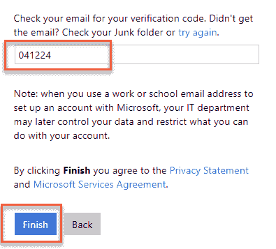
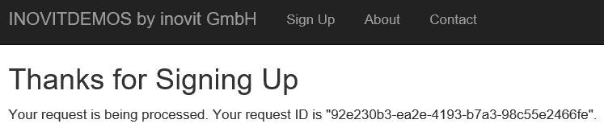

# 第十一章：在 Azure 中创建身份生命周期管理

在云服务中处理身份生命周期是一个高度需求的话题；尤其是我们关注的是如何处理 Azure Active Directory 中的来宾用户，如何为云端和本地应用程序提供访问权限，包括在典型协作场景中共享信息。正因为如此，我们将讨论如何在环境中安全地处理来宾用户的多种用例，并为用户提供良好的应用程序和数据访问体验。我们还将考虑一些有用的工具和服务，以自动化身份生命周期管理。我们只能在本章中提供一些小范围的想法和参考，因为这个领域涉及许多任务和解决方案。

本章将按以下章节组织：

+   实验环境准备情况

+   处理来宾用户生命周期

+   自动化的 Azure 服务

我们将在不同的主题上进行实际操作，因此我们需要在测试环境中准备一些前提条件。

# 实验环境准备情况

对于本章，我们需要配置一个第二个 Azure AD，并在其中添加一些测试用户。这些用户需要具有 Office 365 E3 或 E5 许可证。租户和关联的公共 DNS 配置需要完成，以便用户可以发送和接收电子邮件。第一章，*构建和管理 Azure Active Directory*，为您提供了本章所需的技术参考，以准备好使用实验配置。使用 Azure AD 应用程序代理测试功能需要您完成第一章，*构建和管理 Azure Active Directory*，或第九章，*在 Azure AD 上部署附加应用程序*，特别是 Kerberos 应用程序发布。我们将进行配置，以为来宾用户提供对 **YD1APP01** 虚拟机上的本地应用程序的外部访问，如下图所示：


实验环境概述

除了基础设施要求之外，我们还将介绍不同邀请流程的测试用户集，以更好地理解所有相关的身份生命周期任务。为了明确哪些用户基于哪些基础设施，我们为以下内容提供了简要说明：

+   **Marie Lee**：在混合云 Office 365 合作伙伴基础设施/租户中创建（`inovit.ch`）

+   **Jochen Nickel**：在 Google 中测试用户；如果没有，创建一个供测试使用（Google）

+   **Jenny Green**：在仅云 Office 365 合作伙伴环境中创建（`yourdomain3.onmicrosoft.com/leano.ch`）

+   **Don Hall**：内部用户和 `yourdomain1.onmicrosoft.com` 租户的邀请人（`inovitdemos.ch`）

+   **Susi Delgado**：创建一个外部电子邮件账户（`identityplus.ch`），不进行 Azure AD 集成

这在下图中进行了总结：


针对不同 Azure B2B 场景的测试用户

现在我们已经准备好了基础设施和测试用户设置，可以开始处理外部用户的生命周期。

# 处理外部用户生命周期

在接下来的部分，我们将处理外部用户的不同身份生命周期任务。我们将按以下用例组织该部分：

+   **用例 1**：探索不同用户类型的邀请流程

+   **用例 2**：使用 Azure AD B2B 门户

+   **用例 3**：为外部用户提供访问本地应用的权限

现在，我们将从第一个用例开始。

# 用例 1 – 探索不同用户类型的邀请流程

在接下来的用例中，我们将探索不同用户类型的邀请流程。我们将使用全局管理员邀请以下用户：

+   Maria Lee

+   Jochen Nickel

+   Jenny Green

+   Susi Delgado

用户名需要替换为你的名字。

在接下来的步骤中，我们将开始配置：

1.  打开 Azure 门户，[`portal.azure.com`](https://portal.azure.com)，以全局管理员身份登录，然后导航至 Azure AD 面板。

1.  导航到 用户 | 所有用户，如下所示：


Azure AD 门户中的外部用户创建过程

1.  点击“新建外部用户”，并邀请所有四个测试外部用户，并提供一条简短的个人消息，如 `欢迎加入团队！`

1.  你也可以通过 CSV 文件进行批量导入。

1.  文件的基本结构应该如下所示：

| **姓名** | **被邀请用户邮箱地址** |
| --- | --- |
| Maria Lee | maria.lee@inovit.ch |
| Jochen Nickel | jochen.nickel@gmail.com |
| Jenny Green | jenny.green@leano.ch |
| Susi Delgado | susi.delgado@identityplus.ch |

1.  之后，你可以运行以下命令。

1.  连接到你的 Azure AD 租户，如下所示：

```
Connect-AzureAD -TenantDomain "YOURDOMAIN1.onmicrosoft.com"
```

1.  执行邀请，如下所示：

```
$invitations = import-csv <Path to your invitation CSV file>
$messageInfo = New-Object Microsoft.Open.MSGraph.Model.InvitedUserMessageInfo
$messageInfo.customizedMessageBody = "Welcome to the team!"
foreach ($email in $invitations) 
 {New-AzureADMSInvitation `
 -InvitedUserEmailAddress $email.InvitedUserEmailAddress `
 -InvitedUserDisplayName $email.Name `
 -InviteRedirectUrl https://myapps.azure.com `
 -InvitedUserMessageInfo $messageInfo `
 -SendInvitationMessage $true
 }
```

1.  检查新创建的外部用户，如下所示：

```
Get-AzureADUser -Filter "UserType eq 'Guest'"
```

1.  接下来，我们将按以下顺序接受所有邀请：

    +   Marie Lee

    +   Jenny Green

    +   Jochen Nickel

    +   Susi Delgado

1.  登录每个邮箱以接受邀请（使用不同的浏览器或 InPrivate 会话）。

1.  你应该在每个账户上收到如下消息：


Azure AD 外部用户邀请消息

1.  点击“以 Maria 身份开始”，你将被重定向到 `YOURDOMAIN1.ONMICROSOFT.COM` 的同意页面，如下所示：


权限同意

这是 Azure AD 基于用户的默认行为，并且与 **Jenny Green** 相同。

1.  接受权限后，你将自动登录到 `YOURDOMAIN1` 的访问面板 UI，如下所示：


Azure AD 访问面板界面

通过此过程，你将没有预先分配的应用程序和组。

1.  注销并对 Jenny Green 执行相同操作，你将体验到相同的行为。

1.  接下来，你需要用你的 Gmail 账户进行相同的操作；在我的例子中是`jochen.nickel@gmail.com`。

1.  你会注意到你被重定向到 [`login.live.com`](https://login.live.com)，并且需要使用你的 Gmail 账户凭证登录，如下所示：


Gmail 账户登录 live.com 的体验

这是 Gmail 和其他联合身份提供者向 Azure AD 验证的典型行为。

1.  其他步骤与现有 Azure AD 用户相同。

1.  注销并对外部非 Azure AD 电子邮件账户（在我的例子中是 Susi Delgado）执行此过程，如下所示：


访客邀请的电子邮件账户行为

1.  你会注意到需要创建一个微软账户，如下所示：


微软账户设置

如果用户在任何 Azure AD 中不存在，这是默认行为。

你会在地址栏看到以下链接：[`invitations.microsoft.com/signup?tenant=7709ca2b-3be8-4d92-89d7-dc1e274b4d0e`](https://invitations.microsoft.com/signup?tenant=7709ca2b-3be8-4d92-89d7-dc1e274b4d0e)

1.  你将收到一封发送到你账户的验证邮件。

1.  输入验证码并点击“完成”，如下所示：



验证过程

1.  接受出现的同意条款。从技术上讲，你现在是你自己 Azure AD 租户的所有者。

1.  你可以通过打开 Azure 门户 [`portal.azure.com`](https://portal.azure.com)，并以 Susi Delgado 的身份登录来验证这一点。

1.  导航到 Azure AD 切片并检查现有用户，如下所示：


Azure AD 用户管理

1.  检查自定义域名，你会发现你的后缀被标记为已验证，如下所示：


自定义域概览

按照以下程序，你可以接管 Azure AD 租户 [`docs.microsoft.com/en-us/azure/active-directory/users-groups-roles/domains-admin-takeover`](https://docs.microsoft.com/en-us/azure/active-directory/users-groups-roles/domains-admin-takeover)[.](https://bit.ly/2R5wkQr)

你会看到所有访客用户，源类型各不相同，如下截图所示：


Azure AD 用户管理——仅限访客用户筛选

总结目前的邀请过程：如果用户已经在合作伙伴的 Azure AD 中管理，则没有特殊行为，除了接受邀请和权限同意。来自 Gmail 或任何其他联合身份提供商的用户将被视为特殊的 `live.com` 目录中的用户。此外，任何未在任何 Azure AD 中存在的用户，将在非管理的 Azure AD 中创建。请注意，没有自动撤销过程，用户将需要使用额外的凭据集。

使用以下配置切换，您可以限制用户访问 Azure 门户。如果您运行 Azure AD 特权身份管理场景，以下选项将不是最佳选择：


限制访问 Azure AD 门户的选项

此外，您应该重新配置外部协作的默认设置，以确保访客无法邀请其他访客，如下所示：


Azure AD 访客用户处理选项

另一个有用的提示是如何将访客用户转换为内部成员。可以通过以下 cmdlets 实现：

1.  提供全局管理员凭据，如下所示：

```
Connect-AzureAD
```

1.  按照以下步骤转换用户：

```
Get-AzureADUser -SearchString UserPrincipalName@YOURDOMAIN1.COM | Set-AzureADUser -UserType member
```

接下来要注意的重点是加强“所有用户”组（如果启用了该选项）。为此，请执行以下步骤：

1.  您可以在 Azure AD 切片 | 组 | 常规下找到该设置，如下图所示：


所有用户选项

1.  对“所有用户”组执行以下强化配置：


会员用户类型的动态组成员资格规则

1.  创建另一个动态组成员资格的组，如“所有访客用户”，如下所示：


访客用户的动态组成员资格规则

1.  您还可以为所有访客用户启用 Azure **多重身份验证**（**MFA**），以访问 Azure 门户，[`portal.microsoft.com`](https://portal.microsoft.com)。

1.  导航到条件访问（Azure AD Premium P2）。

1.  单击“新建策略”，如下所示：


Salesforce 的条件访问管理策略

1.  定义名称并选择“所有访客用户”，如下所示：


访客用户选择

1.  选择 Microsoft Azure 管理应用程序，如下所示：


保护 Azure 门户访问

1.  在访问控制下，选择“要求多重身份验证”，如下所示：


MFA 要求

1.  启用该策略。

1.  使用其中一个访客用户测试该功能。

在完成前面的过程后，我们可以通过 Azure AD B2B 门户扩展解决方案，以提供更多功能。

# 使用 Azure AD B2B 门户和使用案例

邀请 API 提供了许多功能，可以自定义来宾用户的入职工作流。你可以包含诸如自我注册、为来宾用户分配经理、更新用户个人资料以及自动为来宾用户分配群组或应用等流程。我们将使用 Microsoft 示例项目来展示你在环境中的不同功能。你可以在[`github.com/Azure/active-directory-dotnet-graphapi-b2bportal-web`](https://github.com/Azure/active-directory-dotnet-graphapi-b2bportal-web)找到示例项目。

# 安装和配置

最开始，我们需要提供两个 Azure Active Directory 应用，这些应用将用于授权正确的权限给 Azure B2B 示例门户。为此，请执行以下步骤：

1.  访问你的 Azure 门户，[`portal.azure.com`](https://portal.azure.com)，以及 Azure AD 窗格。

1.  点击“属性”并将目录 ID 复制到记事本中，如下所示：


获取目录 ID

1.  点击“应用注册”并添加一个新的应用，如下所示：


配置应用属性

1.  点击新创建应用的“设置”。

1.  进入“所需权限”。

1.  点击“添加”并选择 Microsoft Graph。

1.  点击“选择权限”，并启用以下权限：

    +   应用程序权限：

        +   读取和写入目录数据

        +   读取和写入所有用户的完整个人资料

    +   委托权限：

        +   登录并读取用户个人资料，如下所示：


配置所需权限

1.  在你添加 Microsoft Graph API 并配置权限后，点击“授予权限”，如下所示：


权限授予过程

1.  进入“密钥”部分。

1.  提供密钥描述并选择 2 年后过期。

1.  点击“保存”并将密钥值复制到记事本中，如下所示：


密钥生成

1.  接下来，将应用程序 ID 复制到记事本中，如下所示：


应用程序 ID 收集

1.  现在，我们可以为预认证创建第二个应用。

1.  使用以下值：


预认证应用配置

1.  在设置 | 属性下，选择“多租户”为“是”，如下所示：


启用多租户选项

1.  点击“所需权限”并添加 Microsoft Graph API。

1.  分配以下权限：

    +   **委托权限**：登录并读取用户个人资料

1.  不要忘记点击“授予权限”按钮。

1.  接下来，我们需要为第二个应用生成一个应用密钥，就像我们为第一个应用做的那样。

1.  将密钥值复制到记事本中。

1.  将应用程序 ID 复制到记事本中。

1.  点击“清单”，如下所示：


高级主题的应用清单配置选项

1.  我们需要将 `oauth2AllowImplicitFlow` 值更改为 `true`，如下所示：


OAuth 流程选项

1.  现在，我们可以开始将我们的 web 应用部署到 Azure。

1.  点击“部署到 Azure”，如下所示：


Azure 门户部署示例

1.  使用记事本中的值并按如下方式填写：


Azure AD B2B 门户部署选项

1.  等待部署过程完成。

1.  在 Azure 门户中导航到应用服务部分。

1.  复制 B2B 门户应用的 URL，如下所示：


应用部署结果

1.  编辑每个 Azure AD 应用并更改首页和回复 URL。

完成了。现在我们可以开始使用门户并构建一些示例流程。

# 门户使用

Azure AD B2B 门户提供了许多流程来展示邀请 API 的强大功能。首次访问你全新的站点时，你需要登录并配置基本参数。为此，请按照以下步骤操作：

1.  打开你的门户链接，并使用全局管理员凭据登录到 Azure AD B2B 门户，如下所示：


Azure AD B2B 门户基础配置

1.  在接下来的配置步骤中，你可以配置网页的企业身份，包括通信模板，如下所示：


Azure AD B2B 示例门户站点配置

1.  输入站点名称和邀请组织，包括简短的欢迎信息。

1.  输入邀请者电子邮件地址并点击保存。

1.  接下来，我们将在你的合作伙伴 Azure AD 租户中创建另外三个用户帐户，`yourdomain3.onmicrosoft.com`（`leano.ch`）。

1.  为用户分配 **Office 365 E3/E5** 许可证，以提供邮箱。

1.  只需按如下所示命名它们：

    +   `guest.user1@leano.ch`

    +   `guest.user2@leano.ch`

    +   `guest.user3@leano.ch`

1.  现在，我们可以看到提供自定义邮件模板以用于邀请过程的功能。

1.  点击管理员 | 管理邮件模板，如下所示：


管理选项

1.  已经有一个默认模板，以下截图演示了这一点：


邀请模板配置

1.  点击 + 新建 创建一个额外的模板，如下所示：


自定义邮件模板配置

1.  如果你想使用 SMTP，你的 web 应用需要配置一个 SMTP 服务器。

1.  点击保存。

1.  接下来，我们将看到域管理。

1.  在此部分，你可以配置主要流程部分，具体如下：

    +   定义预批准的组织。

    +   定义用户类型，**访客**或**成员**。

    +   你可以根据组织使用预定义的邮件模板。

    +   你可以将被邀请的用户直接加入所需的组，如下所示：


自动组分配和访问管理选项

1.  输入 `yourdomain3.onmicrosoft` (`leano.ch`) 组织域。

1.  将 Kerberos 演示应用程序访问组分配给该用户。

1.  您会注意到，应用程序可以直接检查组织是否基于 Azure AD，如下所示：


后缀验证与 Azure AD 列表对比

1.  点击保存：


预批准域配置

1.  现在，我们可以使用我们的第一个访客用户来测试功能。

1.  打开 B2B 门户，如下所示：


Azure AD B2B 示例应用程序注册页面

1.  使用 `guest.user1@leano.ch` 注册，并点击请求访问。

1.  您将收到以下消息以识别您的请求：



注册，包括请求 ID

1.  接下来，请以管理员身份登录 B2B 门户。

1.  您将看到来自该用户的请求，如下所示：


访客批准流程

1.  访客用户尚未在组织中创建。

1.  批准请求并保存，如下所示：


请求审批

1.  以访客用户 1 身份登录 [`myapps.microsoft.com`](https://myapps.microsoft.com)。

1.  您应该会收到关于邀请的通知，您可以执行入职流程。

1.  如果邀请了用户，但他未接受邀请，访客用户将处于以下状态：


用户类型和状态

1.  用户接受后，状态将会改变。

1.  以下应为预期结果。

1.  用户已分配至应用组，如下所示：


组分配

1.  用户是组织的成员。点击他的用户图标，在 [`myapps.microsoft.com`](https://myapps.microsoft.com)，如下所示：


组织关联

1.  如果您点击齿轮图标，您将能够退出组织（与通用数据保护条例 GDPR 相关的功能），如下图所示：


离开组织选项

1.  如果您更改了组织，Kerberos 演示网站应用程序应当会显示，如下所示：


分配的应用程序在 Azure AD 访问面板 UI 上显示

1.  目前，如果您点击应用程序，您将收到错误信息；我们将在本章后面处理这个问题。

1.  当您点击“组”时，您将成为以下组的成员，如下所示：


组分配自助服务和概览

1.  B2B 门户支持的下一个流程是对您已知的组织进行自动批准。

1.  如果你决定将邀请流程委派给 Azure AD 门户或 B2B 门户上的内部或外部员工，你可以使用 Azure AD PIM AD 客户邀请者角色，如下所示：


客户邀请者角色的委派

在这个使用案例中，你已经看到了邀请 API 的强大功能。你可以绕过它并构建你自己的场景。

# 特别注意事项

在这一小节中，我们将查看 B2B 流程中的一些特殊部分。让我们从用户结婚并更改姓名的情景开始，包括电子邮件地址和 `userPrincipalName`。按照以下步骤操作：

1.  为了查看结果，我们将对 `guest.user1@leano.ch` 执行此操作。

1.  打开 [`portal.office.com`](https://portal.office.com) 并在 `yourdomain3.onmicrosoft.com` 租户中选择该用户，如下所示：


客户用户修改选项和结果

1.  点击 管理用户 并将其称为 `jeff.barnes@leano.ch`。

1.  导航到 Exchange 管理中心，如下所示：


Exchange 管理中心访问

1.  导航到 收件人 | 邮箱。

1.  编辑客户用户 1 为新的 Jeff Barnes，预期结果如下：


客户用户的电子邮件地址更改

1.  转到电子邮件地址。

1.  将以下所有内容更改为 Jeff Barnes，如下所示：


更改用户属性

1.  你的用户现在应该在 Azure AD 中显示如下：


更改结果

1.  接下来，我们将在 [`myapps.microsoft.com`](https://myapps.microsoft.com) 上测试 Jeff Barnes（客户用户 1）的行为。

1.  你的用户应该看起来像这样：


在 Azure AD 访问面板 UI 中查看更改

1.  现在，将其更改为 `INOVITDEMOS` 组织。

1.  你应该和以前有相同的体验，因为后台的映射是通过 GUID 完成的。

1.  然而，你应该注意到，如下所示，用户仍然被称为客户用户 1：


在 Azure AD 访问面板 UI 中查看更改（外部组织）

1.  两个组织之间没有同步工作。

1.  你可以通过更改用户信息来改变其体验，如下所示：


属性更改选项

1.  你还需要注意有关客户用户的更多事项，如下所示：

    +   他们不能获得 Exchange Online 许可证

    +   他们不能更改 Office 365 中的租户（例如对于启用 PIM 的外部支持者）

    +   如果你的登录被阻止，你将无法离开组织

你可以在[`docs.microsoft.com/en-us/azure/active-directory/b2b/user-properties`](https://docs.microsoft.com/en-us/azure/active-directory/b2b/user-properties)阅读更多关于特殊考虑事项的信息，包括如何使用访问审查来管理 Azure AD B2B 访客用户。

# 访客用户的本地应用程序访问

在本节中，我们将说明如何为访客用户提供本地应用程序访问权限。我们已经通过 Azure AD 应用程序代理发布了 Kerberos 演示 Web 应用程序，并且你已作为访客用户在 Azure AD 访问面板 UI 中看到该应用程序。

通过 Web 应用程序代理和 Azure AD 应用程序代理的集成，你将获得以下功能和能力：

1.  终端用户门户：[`myapps.microsoft.com`](https://myapps.microsoft.com)上的 Azure 访问面板。

1.  Azure AD 认证功能如下：

    +   从本地 AD DS 同步的用户名和密码

    +   联合登录到本地或其他联合服务器

    +   多因素认证（MFA）

    +   定制的登录页面

    +   基于用户或组的授权

    +   单点登录到 Office 365、成千上万的 SaaS 应用程序以及所有与 Azure AD 集成的应用程序。

1.  报告、审计和安全监控基于大数据和机器学习。

1.  所有 HTTPS 流量都在云端终止，阻止了大多数 HTTP 级别的攻击。

1.  未经身份验证的流量在云端被过滤，不会到达本地。

1.  企业网络没有传入连接——只有到 Azure AD 应用程序代理服务的传出连接。

1.  面向互联网的服务始终保持最新的安全补丁和服务器升级。

1.  Azure AD 提供登录异常检测、报告和审计功能。

1.  从 Azure AD 到本地应用程序提供单点登录体验。

1.  连接器使用 Azure AD 令牌数据通过**Kerberos 受限委托**（**KCD**）以用户身份冒充访问后端应用程序。

1.  支持任何使用**集成 Windows 认证**（**IWA**）的应用程序，如 SharePoint、Outlook Web Access 和 Microsoft Dynamics CRM。

1.  无需更改后端应用程序。

1.  无需在后端应用程序上安装代理。

1.  无需直接将本地应用程序暴露到互联网。

以下图表显示了架构：


Azure AD 应用程序代理架构

在访客用户访问的情况下，Azure AD 应用程序代理仅检查`userPrincipalName`是否存在于本地 Active Directory 中。

要配置访客用户的访问权限，我们将使用以下步骤：

1.  以域管理员身份登录到你的域控制器**YD1ADS01**。

1.  打开 PowerShell 并连接到你的`Azure AD`，如下所示：

```
Connect-AzureAD
```

1.  获取所有访客用户，如下所示：

```
Get-AzureADUser -Filter "UserType eq 'Guest'"
```

1.  以下截图显示了输出：


租户的所有访客用户

1.  现在，我们需要将 `UPN-suffix @yourdomain1.onmicrosoft.onmicrosoft.com` 添加到你的 Active Directory 环境的 UPN 后缀中。

1.  使用 `domain.msc` 控制台；右键单击“Active Directory 域和信任”，选择“属性”。

1.  添加你的后缀，如下所示：


Azure AD 后缀到 UPN 后缀的分配

1.  接下来，我们需要在本地 Active Directory 中创建我们的访客用户。

1.  打开 `dsa.msc` 控制台中的 Active Directory 用户和计算机。

1.  创建一个名为“Managed External Business Objects”的组织单位，如下所示：


Active Directory 中的外部对象 OU

1.  创建用户，如下所示：

    +   `jenny.green_leano.ch#EXT#`

    +   `@181031inovitdemos.onmicrosoft.com`

    +   `BG00001`：


用户属性

1.  你无需记住密码，因为它不需要。

1.  Azure AD 将验证用户身份。

1.  现在，将用户分配到 Azure AD 中的 **Kerberos Demo Web App Access** 组，如下所示：


应用访问组成员

1.  现在，你可以在 [`myapps.microsoft.com`](https://myapps.microsoft.com) 测试该解决方案。

1.  将组织更改为 `INOVITDEMOS`。

1.  点击 Kerberos 应用。

1.  你应该会看到成功的登录，如下所示：


Kerberos 示例网页供访客用户使用

为了自动化并扩展此解决方案，你可以使用 Microsoft Identity Manager 2016 或提供的 PowerShell 解决方案。你可以通过以下来源了解有关 Azure AD B2B 协作与 **Microsoft Identity Manager**（**MIM**）2016 SP1 和 Azure 应用代理的更多信息：

+   [`docs.microsoft.com/en-us/microsoft-identity-manager/microsoft-identity-manager-2016-graph-b2b-scenario#b2b-end-to-end-deployment-example-scenarios`](https://docs.microsoft.com/en-us/microsoft-identity-manager/microsoft-identity-manager-2016-graph-b2b-scenario#b2b-end-to-end-deployment-example-scenarios)

+   [`www.microsoft.com/en-us/download/details.aspx?id=51495`](https://bit.ly/2Cz0yWW)

在这一部分中，我们处理了多种用例，以为访客用户提供身份生命周期管理。在接下来的部分中，我们将提供一些提示，帮助你更轻松地适应你的环境。

# 自动化的 Azure 服务

今年，在 Microsoft Ignite 大会上，Mark Wahl 展示了一组新特性。这组特性被称为 Azure AD 身份治理，目前处于私有预览阶段。我将向你介绍一些公开的信息。

身份是控制面板，它将用户体验、业务需求和安全需求结合在一起。您需要确保正确的用户在任何时候都能获得正确的访问权限，访问正确且所需的资源。Azure AD 身份治理提供了一套功能，帮助您定义访问策略并监控您的身份。微软正在为 Azure AD 开发一整套治理功能，包括两个强大的新功能：权限管理和我的访问。

管理员将能够为资源（例如组、应用程序和站点）创建策略，借助即将推出的权限管理功能。这将提供一个自动化的过程，以便为员工和合作伙伴授予访问权限。我的访问门户使员工和合作伙伴能够请求访问这些权限，包括请求审批，正如下图所示：


Azure 身份治理权限管理选项

首先，必须指定资源并将其与权限关联。在这个例子中，您可以看到两个应用程序，一个用户组和一个 SharePoint 站点。您可以添加更多的资源。正如下图所示，角色也包含在这个概念中：


权限的资源分配

如下图所示，通过新的功能，您可以定义权限策略以推动您的安全需求：


权限策略选项

另一个您需要注意的事实是，Azure 提供了许多不同的功能，您可以利用这些功能来管理基于云的身份和访问管理。我们建议您阅读关于以下技术的文章：[`bit.ly/2u3LcZG`](https://bit.ly/2u3LcZG)：

+   Microsoft Flow

+   Azure 逻辑应用

+   Azure 函数

+   Azure 应用服务 WebJobs

社区中已经有很多示例展示了这些功能的强大，其中一些如下：

+   Martina Grom，关于使用 Azure 函数配置 Office 365 组：[`blog.atwork.at/post/2017/10/01/Provisioning-an-Office-365-group-with-an-approval-flow-and-Azure-functions-part-2`](https://blog.atwork.at/post/2017/10/01/Provisioning-an-Office-365-group-with-an-approval-flow-and-Azure-functions-part-2)

+   Asish Padhy，关于相同主题：[`asishpadhy.com/2018/05/01/automation-and-creation-of-office-365-groups-using-flow-microsoft-graph-and-azure-function-part-1/`](https://asishpadhy.com/2018/05/01/automation-and-creation-of-office-365-groups-using-flow-microsoft-graph-and-azure-function-part-1/)

+   Microsoft Docs，关于 Azure 函数的 Microsoft Graph 绑定：[`docs.microsoft.com/en-us/azure/azure-functions/functions-bindings-microsoft-graph`](https://docs.microsoft.com/en-us/azure/azure-functions/functions-bindings-microsoft-graph)

+   微软，介绍 Azure Functions：[`docs.microsoft.com/en-us/azure/azure-functions/functions-overview`](https://docs.microsoft.com/en-us/azure/azure-functions/functions-overview)

我们强烈推荐尝试使用这些技术，因为它们将是未来为客户提供实施解决方案的关键。

# 总结

通过本章的学习，你了解了如何构建一个包含身份生命周期的丰富 Azure B2B 解决方案，包括为访客提供的本地应用程序访问权限。此外，你还得到了对可能的使用案例和存在的漏洞的精彩介绍。我们还提供了微软正在开发的即将推出的身份治理功能的概述，以及它们将在这个领域带来的强大功能；例如，基于角色和相关策略的资源分配。

在下一章中，我们将把单租户和多租户应用程序部署到你的环境中，并介绍这些概念。
