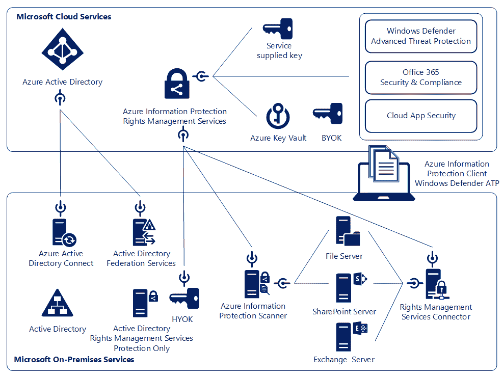
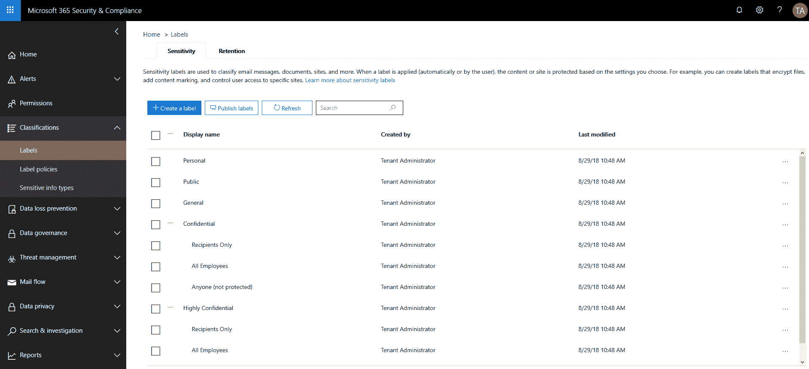
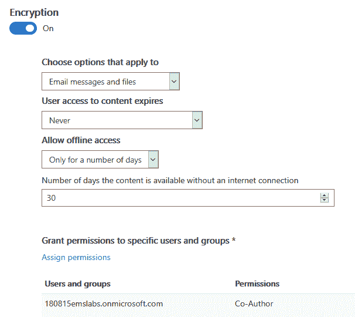
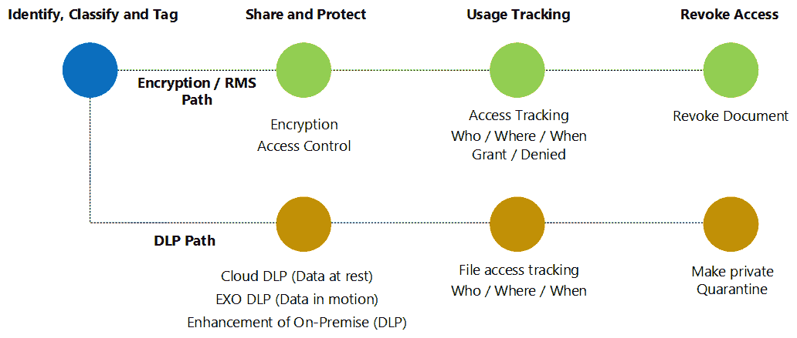

# 第十二章：建立安全文化

组织需要建立安全文化，以提供合适的信息保护解决方案。在本章中，您将概述安全文化的四个主要支柱，它们分别是领导支持、有效培训、持续测试以及与整个组织及其合作伙伴的持续沟通。如果没有建立安全文化，您将很难在信息保护战略的各个环节中取得成功，因为每个员工都需要知道哪些信息需要被保护。此外，如果安全措施的引入没有得到充分规划且未获得管理层的支持，可能会导致高昂的成本。

本章的另一个重点是数据分类，因为信息的分类为大多数安全机制提供了基础。信息分类为触发安全政策并实施适当保护级别的因素提供了背景。同时，我们还将解释如何通过应用安全文化的四个主要部分来支持数据分类的引入。最后，我们将首次接触微软的分类和保护解决方案，为接下来章节中的实际应用做介绍。

本章涵盖以下内容：

+   为什么我们需要安全文化？

+   良好安全文化的四个主要支柱

+   数据分类概述

+   **Azure 信息保护** (**AIP**) 概述

# 为什么我们需要安全文化？

一群人的思想、责任和行为会影响他们的安全，可能将他们置于风险之中，因此需要安全文化。在专业领域，安全文化用来描述组织希望在员工中看到的行为类型，涵盖网络安全、物理安全和个人安全等方面。安全培训和同事行为的改变，以适应企业的安全指南是必要的。安全文化的主要关注点是防止入侵者或其他潜在危害方的渗透。在我们的案例中，我们将重点关注数据安全相关性，因为处理完整的安全领域超出了本书的范围和重点。那么，让我们看看这对我们意味着什么。

数字化转型已经重塑了我们的工作方式。数据已成为商业的新货币。诸如开发成果、拟定的公司收购、销售账户信息、个人或财务数据以及安全信息等信息在组织中具有非常高的价值。大量由系统创建或导出的信息和数据流入并通过组织，进入云端，穿越物联网。越来越多的数据在流动，这也带来了越来越多的风险。这个事实促使组织在数据安全上进行大量投资，以保护其知识产权和客户的信任。

单靠技术并不能解决数据安全领域的问题。此外，如果你认为数据安全仅仅是 IT 的任务，那么你将继续受到用户行为引发的安全漏洞的威胁。许多安全专家仍然过于专注于流程和技术，或者仅仅关注技术。这种情况使得组织处于一种不平衡且脆弱的状态。我们需要将所有员工纳入我们的战略之中，因为如果不这样做，我们将使组织面临当前网络安全世界中近一半的安全漏洞的攻击因素。在企业中，元素、人员、流程和技术必须保持和谐，才能为正确的安全文化、成功的数据安全战略和数字化转型奠定坚实的基础。

在拥有正确安全文化的组织中，员工清楚地了解什么是对的，什么是错的，他们应该报告什么类型的活动，以及如何联系正确的团队。另一方面，在安全文化薄弱的组织中，安全责任往往推给别人。有效安全文化的一个重要特点是拥有共同的责任感。

因此，理解需要让员工参与并教育他们做出更好的信息处理决策是至关重要的。通过促使用户停下来，考虑他们所拥有和控制的业务信息的价值，你可以赋予他们以一种不会将公司数据置于风险中的方式来使用这些信息的能力。数据分类的使用使员工能够正确地处理敏感内容。

在信息创建过程中，或者在保存时，员工应该正确地分类信息并触发适当的保护措施。此外，员工还会学会更好地评估安全需求及信息对公司未来的价值，并根据组织的指导方针调整对敏感内容的处理方式。数据分类还提供了安全报告所需的关键因素，并会在合适的时机触发安全功能的执行，确保业务保持在安全状态。

你可以投入大量资金和精力来改善你的安全流程和技术控制。如果不将组织中的最终用户纳入其中，数据泄露的风险仍然很高。你需要处理的最重要任务是教育和赋能你的用户，使他们能够在处理日常工作中的信息时做出合格的决策。为了提供适当的安全解决方案，你需要在用户的日常工作中为他们提供自然的流程，并应用和执行政策，以避免违反安全规则。

通过帮助用户分类和评估他们创建的信息的价值，他们将成为数据保护和安全的积极参与者。

在下一节中，我们将讨论安全文化的四大支柱。

# 良好安全文化的支柱

现在我们已经强调了安全文化的必要性，接下来我们将探讨其四个主要组成部分。正如我们在引言中提到的，我们将讨论以下四个领域，它们是健康和可持续安全文化的基石：

+   领导支持

+   培训

+   测试

+   持续沟通

你将获得一个概述和一些建议，帮助你在组织中建立一个高质量的安全文化。请记住，组织的安全文化是任何安全控制的基础，应该得到信息保护战略的支持。在本节的下一部分，我们将首先讨论你需要的领导支持，以支持信息保护战略。

# 领导支持

信息保护战略及其相关的安全文化必须从高层管理人员和董事会成员开始。这将为开发、实施和维护信息保护战略提供必要的资源资金，其中包括安全文化。

让安全成为每个人职责的一部分是建立活跃的安全文化和可靠数据安全的关键。例如，如果一个数据分类项目在没有管理支持的情况下启动，那么该项目失败的可能性很高。原因通常是缺乏必要的资源，或者是流程和业务对接发生了变化。

你的高层赞助人应该不断了解进展情况，因为他们将准备好解决任何重大阻碍。解决方案和倡议应始终与业务目标和组织流程对齐。此外，你应该吸引并建立部门/团队冠军，使他们理解并支持你的战略，并在非常早期的阶段实施它。他们还将是反馈的优秀资源，帮助改善你的解决方案。

我们常看到，制定和实施信息保护战略及安全文化的努力常常落入 IT 部门的手中。正如我们所知，这并非纯粹的技术解决方案。成功的关键在于组织中的用户及其活动。最后，不要忘记，高管应该以身作则，因为其他员工会以他们为榜样。这意味着高管应积极参与试点项目，并遵守新的战略和文化。在实施过程中，注意他们需要特别的支持。

# 培训

正如我们在*为什么我们需要安全文化？*部分中提到的那样，教育员工做出更好的信息处理决策至关重要。适当的数据分类软件可以帮助您推动员工的参与和教育。以下是一些有效的培训策略，以解决关键问题：

+   教育用户并沟通您要分类和保护的内容。

+   提供帮助用户更好理解正确与错误的信息。

+   使用辅导方法而不是惩罚方法。

+   使用简洁自然的语言。

+   确保您的反馈循环到位。

+   根据用户的角色和相关风险来决定培训需求，例如员工离职或错误处理信息时可能导致的公司数据或图像丢失。

+   您的信息收集不必完美，但尽量做到接近 100%。

+   在改进过程中采用迭代方法。

此外，您需要将培训需求与相关风险对齐，例如特定用户组的数据丢失。例如，数据分类是每个人都应接受培训的典型通用主题。假设我们谈论一名工程师，他们应接受中级培训，了解如何处理自己的工作成果。管理整个工程师成果的管理员应该接受深入的培训，因为他们在维护组织的所有重要资产。因此，他们需要确切了解如何确保信息安全。

本质上，数据分类将显著帮助您的组织提高信息安全意识文化。因此，投资于支持和培训您的用户。收集用户反馈，倾听他们的意见，并不断改进您的培训材料。

以下培训方法可以使用：

+   提供参考海报或备忘单，用户可以将其放在桌面上。

+   将培训视频放在用户经常使用的内部门户上。

+   与高管共同制作一部关于信息保护战略和安全文化重要性的企业视频，展示以身作则的方法

+   企业内部使用的在线论坛或知识系统。

请记住，用户根据他们在组织中的角色，可能以不同的方式消化和使用培训材料。在下一部分，我们将描述安全文化中的测试需求以及信息保护解决方案的实施。

# 测试

对信息保护战略进行积极测试和监控对于保持安全文化的活力至关重要。在数据分类的情况下，主要目标是实现用户对你定义的数据分类标签和政策的接受，以确保用户不会作弊。为了确保你朝着正确的方向前进，你需要定义与关键成功因素对齐的具体测试场景，以验证并满足数据分类和政策的重大业务与功能需求。

还应注意，通常你传达给接收者的信息中，只有一小部分会被清晰理解。基于此，至关重要的是在小范围的测试小组中检查全球沟通，如果有必要，可以进行调整。此外，要建立信息保护活动的积极监控，并将其与信息的背景参考起来，这样你就可以测试数据的准确分类和应用保护。你的技术解决方案应该为你提供一个有用的工具包，以实现这一目标。

# 持续沟通

转变用户行为的一个关键工具是持续沟通，这从你开始改变组织文化时就应当开始。一开始，有必要将你的使命传达给所有用户。通过清晰的沟通，一切都能与组织的核心价值观和企业承诺对齐，并且信息保护战略与安全文化如何坚持这些承诺—用户可以看到安全投资的更大图景，并且能将自己视为整个解决方案中的重要部分。

我们还需要讨论“这对我有什么好处？”这一因素。例如，员工需要确保自己的工作与他们在入职第一天签署的信息安全政策保持一致。为了实现积极而蓬勃的沟通过程，确保你是平易近人的，并且分享你从用户反馈中得到的改进是至关重要的。

# 数据分类概述

在我们描述安全文化的必要性及其四个核心要素之后，我们将讨论数据分类，以为信息保护领域的成功解决方案奠定基础。正如前面所提到的，数据分类提供了正确使用保护措施所需的信息和工具。让我们从数据分类的基本定义开始。数据分类是一个持续的过程，基于特定的预定义标准对信息进行一致的分类，以便数据可以高效地验证、有效地识别并得到保护。这就是为什么数据分类是数据安全的基础。

成功的数据分类需要广泛的组织需求意识，并深入理解数据资产的存储位置以及数据或信息的生成方式。因此，查找和识别各种终端上的现有数据（例如网络共享、数据库或云服务）与分类密切相关。即使是在创建新数据时，分类也始终会进行。

除了数据通常存在的不同终端外，数据可以处于三种基本状态：空闲状态、处理状态和传输状态。这三种状态都需要数据分类的技术解决方案。然而，使用的原则对于这三种状态是相同的。不幸的是，数据分类必须在创建过程中进行。例如，关于所有三种状态的机密数据必须以机密方式处理。此外，还需要区分结构化数据和非结构化数据。在典型的分类过程中，数据库或表格中的结构化数据比文档、源代码或电子邮件等非结构化数据更为简单。

总的来说，根据数据的敏感级别管理结构化和非结构化数据至关重要。正确实施数据分类解决方案有助于在适当的前瞻性下创建敏感和机密数据。这样可以决定是否可以将信息公开发布。

在与客户的讨论中，我们常常听到他们对于采用数据分类解决方案的抵触情绪。然而，这类评论往往能够很快被反驳。以下三个例子展示了数据分类的关键方面：

+   **数据分类太复杂**：事实上，许多数据分类项目失败或停滞不前，是因为分类方案过于复杂。数据分类架构为信息提供不同的标签，用以应用分类。例如，“机密”标签用于标记那些不应被未授权用户访问的敏感信息。我们常常会遇到一些使用用户无法理解的标签，或者标签之间存在冲突。因此，建议从一个迭代过程开始，并仅选择必要的选项。

+   **数据分类只是我需要采取的另一个步骤，它让我变得更慢**：数据分类可以简化数据保护。了解哪些信息是机密的，可以让你选择合适的位置存储数据或采取保护措施。了解数据为何以及如何被保护是很重要的。此外，数据分类的一个优点是，数据可以更容易找到，员工也可以通过正确分类信息并应用适当的保护措施来保护自己。

+   **数据分类只有在长时间后才能见效**：自动化分类可以从第一天开始提供洞察。上下文和内容两个领域的自动化可以按一定顺序快速且轻松地创建，并且可以获得额外的信息以推动安全性改进。你将在*数据分类方法*部分了解更多关于不同分类方法的信息。

现在我们已经建立了数据分类的基本定义，接下来让我们讨论不同的数据分类方法。

# 数据分类方法

在本节中，我们将介绍不同的数据分类方法，解释每个过程，并提供方法的基本论据，包括对分类信息的获取内容。为了理解这些方法，至关重要的是你能够定义正确且最有效的分类系统方法。数据分类有两种基本方法：通过与用户的交互手动进行，和通过基于一组规则的分类软件自动进行。

对于数据分类，通常使用以下四种方法：

+   **基于用户选择（手动）**：

    +   专注于用户的手动选择

    +   应该与基于内容和上下文的自动化过程结合，推荐适当的分类

    +   重新分类应该受到控制和监控

    +   基于用户在创建、编辑或审查敏感信息时的知识

**获取的信息**：文档的内容和上下文是什么？

+   **基于内容（手动/自动）**：

    +   专注于使用正则表达式、元数据或其他选项检查和解释敏感内容

**获取的信息**：文档的内容是什么？

+   **根据上下文（手动/自动）**：

    +   重点放在应用程序、位置或创建者以及敏感信息的其他变量和指标

**获得的信息**：谁访问？数据何时访问？数据移动到何处？数据如何使用？

+   **基于机器学习的支持（手动/自动）**：

    +   重点放在通过与比较集和训练进行比较来自动分类的文档类别周围

**获得的信息**：系统学习将进一步选项集成到分类中或增加对某些信息的识别。

不同分类方法的结合结合了各个方法的不同正面特性，如下：

+   基于元数据的分类允许异常高的速度

+   对于可以使用正则表达式识别的分类标准，模式匹配快速且安全。

+   使用语言统计方法进行机器学习通常是适用的，并且在模糊标准下提供非常好的结果。

+   特殊的分类器，如图像识别，可以是另一种方法

这些方法的结合和持续使用会导致成功。

现在我们了解了不同的分类方法，我们可以解决组织面临的挑战，数据分类可以支持信息管理和安全技术有效使用的根本改善。

# 数据分类和非结构化数据

数据分类之所以必要的一个关键方面是公司内部产生的信息量。信息量通常是难以管理和使用的。非结构化数据的管理仍然是存储技术中较大的未解决问题之一。然而，大约 80%的存储数据可能是非结构化的，这超出了经济和可持续信息管理过程的能力。然而，过程感知分配的关键挑战存在于结构化和非结构化数据中。

此外，当前的数据量不会显示任何有关内容和预期用途的外部可见信息。如果我们使用几个简单的关键词进行分类扫描或分析元数据，可以更透明地显示不同类型数据的结果。这些结果是公司信息管理中的缺口，应通过以下特征进行识别：

+   需要特殊保护的敏感信息

+   需要归档的重要和/或受管制信息

+   很少需要的被动信息

+   可能可以删除的多余信息

+   具有特殊处理的技术日志信息

因此，创建分类的推荐方式是创建关于公司相关信息内容的必要透明度。

此外，数据分类还带来以下优势：

+   **分类**：允许公司在其各个业务职能之间一致地对数据进行分组，无论数据的格式或交付系统如何。

+   **存储优化**：介绍了一种存储分类概念（分层存储模型）。

+   **数据价值**：这使得数据可以根据其对公司的价值进行区分。

+   **归档**：为更好的信息检索引入归档。

+   **透明性**：信息类型和相关属性从外部是可见的。

+   **协同效应**：用户和应用可以使用这些信息。

+   **安全性**：可以控制有效且可持续的保护机制。

+   **效率**：处理过程和组中的信息证明。

+   **统一性**：通过遵循相同的原则，在公司或组织内实现一致性。

现在我们已经看到了数据分类在非结构化数据领域的优势，我们可以查看数据泄露和丢失预防的用例。

# 数据分类与数据泄露/丢失预防

**数据泄露/丢失预防**（**DLP**）是用于指代旨在防止公司信息不受控制泄露的解决方案的术语。DLP 是风险管理中的一种 IT 措施。如今的 DLP 解决方案仅能发挥其潜力的一部分，因为基于文件结构和其他技术属性定义权限和访问防止规则十分复杂。由于当前的解决方案通常缺乏集成专业页面的适当方法，专业部门往往不感到有责任。因此，DLP 在许多情况下仍然是打击未经授权信息泄漏的钝剑。

随着所有文件的手动和自动分类的引入，DLP 可以基于分类进行操作，而不需要通过文件结构进行繁琐的管理。关于不同分类方法的信息可以在*数据分类方法*部分找到。这在频繁变化的文件系统结构中是可见的。规则定义本质上对整个企业都有用，且管理开销大幅下降。分类和文档类别的概念使得集成专业页面变得更加容易。

在风险管理中，已经建立的解决方案（例如 DLP 领域的解决方案）通过使用分类可以大幅提升效率。

接下来，我们将重点关注数据分类和合规性方面。

# 数据分类与合规性

档案管理是满足许多合规要求的关键。如今，许多从合规角度需要归档的重要信息依然没有被归档，因为系统或流程没有将其识别为需要归档。例如，许多与合同相关的文件最终存储在文件系统中。特别是文件服务器上大量的数据存储对于许多公司来说是一个“黑匣子”，其中对于特定合规问题的相关性仅部分被了解。通过对公司内所有文件的自动化分类，可以识别出相关信息并通过分类进行归档。通过跨公司方法和自动化，能够显著提高完成度。

接下来，我们将讨论数据分类如何帮助优化您的存储使用。

# 存储优化

层级存储管理或分层存储是通过使用不同的性能等级来减少高成本存储系统的使用，从而优化存储成本。文件根据不同的选择标准，从成本高昂的系统迁移到成本较低的系统，而用户或应用程序不会察觉到这一变化。

传统的解决方案通常仅依赖技术属性，如文件类型或文件的年龄，来决定文件是否可以迁移到更便宜的存储系统。它们通常提供的选择标准过于粗略，在实际应用中效率不高。此外，缺乏一种合适的方法来获取文件库存的交换能力信息。

专业的文件分类和文档类别的分配，如发票、雇佣合同或建筑计划，提供了一种更好的制定外包规则的方式。此外，这些规则完全独立于文件服务器上的实际结构，因此更易于管理。

分类使得存储管理更加高效，通过根据文件对业务的价值来管理文件。

以往的访问保护机制是基于文件结构，如文件夹和共享，来实现的。因此，不能显示不同的视图。在一方面有着高管理工作量，另一方面又有着明确的保护需求之间存在冲突。此外，这种方法完全依赖用户的正确操作；如果他们错放信息，信息就会暴露给未授权的人。因此，现如今文件的保护仍然不足。

现在，我们已经通过几个数据分类有帮助的使用案例，接下来我们将讨论有关数据分类与访问控制机制之间关系的相关信息。

# 数据访问控制

在数据分类及后续信息保护方面，用户认证是上游过程。用户认证通常由两部分组成——用户名或 ID 用于识别用户，密码用于确认用户的凭证有效性。认证并不授予用户访问信息或服务的权限，它仅仅是验证用户是否为其所声明的人。  

用户认证完成后，授权是指赋予已认证的用户访问应用程序或信息的权限。将已认证用户访问信息的权限分配给他们时，需要关注数据分类。由于认证是上游过程，因此在信息泄露的情况下，必须更好地了解哪些敏感数据可能受到影响。以下是一些可能受到影响的关键数据示例：  

+   用户凭证和密码  

+   特权用户的凭证和密码  

+   客户的可识别个人信息  

+   客户的财务数据  

+   知识产权  

+   人事/员工数据  

+   公司的财务数据  

+   医疗信息  

+   **物联网** (**IoT**) 或传感器相关数据及元数据  

+   **工业控制系统** (**ICS**) 命令与控制数据  

攻击一个组织的最重大影响在于企业信任、法律问题以及品牌声誉。以下列表提供了可能受到影响的组织关键领域：  

+   企业客户信任  

+   品牌声誉

+   销售直接损失  

+   法律  

+   保护控制的改进（成本）  

+   财务损失  

+   监管罚款（合规性）  

数据分类可能由多种因素要求，如特定的法规，**通用数据保护条例** (**GDPR**), 《联邦数据保护法》 DSG，**健康保险流动性与问责法** (**HIPAA**), 以及**支付卡行业数据安全标准** (**PCI DSS**)，或知识产权保护。  

以下是更多的示例及其相关领域：  

| **领域** | **法规** |   |
| --- | --- | --- |
| 合规性 | PCI DSS, HIPAA/ **健康信息技术促进经济与临床健康法** (**HITECH**), **格雷姆-利奇-布莱利法案** (**GLBA**), **国际标准化组织** (**ISO**) 27001, **个人信息保护与电子文档法** (**PIPEDA**), GDPR |   |
| 数据保护 | **个人可识别信息** (**PII**), **受保护健康信息** (**PHI**) |   |
| 知识产权 | 版权、商业机密、专利申请文件、专利附带文件，非知识产权 |   |
| 出口合规性 | **国际武器贸易条例** (**ITAR**), **出口管理条例** (**EAR**) |   |
| 部门 | 法务、人力资源、财务、工程、销售 |   |
| 项目 | 新产品及其他项目的代号 |   |
| 法律/可追溯性 | 特权、保留 |   |
| 维护 | 保留时间 |

现在我们已经讨论了与访问控制和常规相关的数据分类信息，接下来我们将查看一个示例分类方案和政策。

# 分类方案和政策示例

以下部分描述了一个示例分类方案及相关指南，以澄清数据分类中涉及的活动和流程。以下分类方案代表了根据敏感性进行分级，并提供了有关期望影响和任何必要加密的信息。

要成功实现信息保护部署的目标，基本要求是选择标准化良好的标签，并使用一个通用语言与数据安全特定术语进行连接。

以下表格展示了示例分类方案，左侧为数据的敏感性等级，随后是分类标签以及示例描述，附带对公司影响和标签使用场景：

|  | **分类** | **描述和使用** |
| --- | --- | --- |
| **低敏感性** | 非机密 | 没有组织价值或敏感性的资料。 |
|  | 个人 | 非业务数据，仅限个人使用。公司不进行监控。如果用户被允许创建/发送个人和业务信息，特别需要此标签。 |

| **低敏感性** | 公开 | 不会在组织外部暴露时对组织造成威胁的信息。已批准公开使用：

+   **影响**：无关

+   **关键性**：无关

+   **加密**：无

|

| **低敏感性** | 一般 | 不打算公开发布的业务数据。然而，根据需要，可以与外部合作伙伴共享：

+   **影响**：低，最高$25,000

+   **关键性**：低

+   **加密**：如有需要

|

| **中等敏感性** | 内部 | 可以在组织内部自由分发的敏感信息，但不得离开组织边界：

+   **影响**：低，最高$100,000

+   **关键性**：低

+   **加密**：如有需要

标签应与**一般**标签一起使用，或者被其替代，因为现代组织通常与外包部门合作。 |

| **中等敏感性** | 机密 | 必须保持在组织边界内的敏感信息，只有在必要时才应与有限的内部人员共享：

+   **影响**：高且重要，最高$1,000,000

+   **关键性**：中等和高

+   **加密**：强烈推荐

|

| **高敏感性** | 机密 | 高度敏感的信息，如果在组织外部或不小心对内部员工透露，可能会对组织造成重大风险：

+   **影响**：非常高，> $10,000,000

+   **关键性**：非常高

+   **加密**：是

高机密或受限信息有时也用作“机密”的替代词。有时“受限”一词并不完全清晰，容易混淆标签的顺序：机密和受限或反之亦然。

现在我们已经概览了分类方案，让我们通过分类标签来查看更多细节与受影响信息的示例。

# 分类方案描述

以下分类标签及相关指南解释了前一节中的示例分类方案，*分类方案与政策示例*：

+   **公开—一般信息**：公司明确批准公开的信息。

    +   **示例**：营销材料、发布的季度结果。

    +   根据公司沟通政策，分类应在授权之前进行。直到获得批准，信息将被分类为机密、机密或内部。公开信息没有其他信息安全限制。

+   **内部—内部信息**：可以在企业内部共享，但不能在公司外部发布的信息。通常是公司信息的标准分类。

    +   **示例**：部门公告、项目报告、员工联系方式。

    +   内部信息只能与员工、承包商或商业伙伴共享。访问应通过专有的 IT 系统，使用企业批准的应用程序和服务进行。

+   **普通—一般商业信息**：不打算公开的商业数据。

    +   **示例**：公司的内部电话簿、组织结构图、内部标准以及大部分内部通信。

    +   然而，这些信息可以在需要时与外部合作伙伴共享。

+   **机密—机密信息**：如果泄露，可能会损害公司的利益或对公司及其员工造成重大干扰或尴尬的信息。因此，访问仅限于授权人员或小组。

    +   **示例**：个人数据、合同谈判、交易策略、上游技术数据。

    +   以下限制适用于机密信息：

        +   必须在每页或每个幻灯片的页眉或页脚清楚地标明分类。

        +   在有保密协议的情况下，承包商和商业伙伴必须知道并实施“知情需求”实践。

        +   将信息存储在公司 IT 系统中，并且只能通过企业批准的应用程序和服务访问该信息。

        +   便携设备或可移动介质上的存储仅在启用加密的情况下进行。

        +   在发送电子邮件或外部交换时加密信息，因为加密电子邮件是一个良好的安全实践。

        +   机密信息只能在业务协作应用程序中共享或存储，该应用程序的访问权限仅限于授权人员或小组。

请记住，每个人应该有一套通用的标签。不要使其过于复杂。如果您有特殊需求，例如绝密项目、收购或并购，可以将标签的范围限定在正确的用户组中。

+   **机密—机密信息**：具有高价值或敏感性的资讯，泄露可能对公司造成严重损害。因此，访问权限仅限于少数高信任度的个人。

    +   **示例**：收购计划、未公开的公司结果、经济敏感的勘探机会的初步评估。

    +   以下限制适用于机密信息：

        +   在每个页面或幻灯片的页眉或页脚，或在电子邮件的第一行显示分类信息（但不在主题行中）。在第一页或幻灯片上显示信息所有者的姓名和职位，以及“机密”免责声明。

        +   仅在存在“知情需要”时共享信息，最重要的是仅与信息所有者管理的“知情人员”名单上的受信任人员共享。

        +   仅在企业 IT 系统中存储信息，并通过使用允许处理机密信息的应用程序进行访问。例如，这些应用程序具有多因素认证和加密功能。

        +   应该避免在发送给外部人员的电子邮件中包含机密信息，除非该信息已得到适当加密。相反，应该发送包含保存文件链接的电子邮件，链接指向一个授权系统中的文件。

        +   机密信息只能通过链接共享给内部人员，链接指向授权 IT 系统中存储的文件。如果无法共享，可以使用加密邮件在内部进行传输。

现在我们已经讨论了不同的分类标签及其使用，我们可以根据示例分类方案进行一些视觉标记示例的操作。

# 基于分类标签的视觉标记和规则

以下表格展示了根据分类方案和安全信息应用的信息指南。文件和消息被细分为不同的类别。

在这里，您可以看到基于分类方案的文件和消息中的不同视觉标记和规则：

| **受影响标签** | **视觉标记** | **视觉标记和规则详细信息** |
| --- | --- | --- |
| *所有* | 应用分类元数据。 | 应用分类元数据。消息不能包含敏感度高于消息本身的分类附件。 |
| 未分类 | 无视觉标记。 | 无视觉标记。消息或附件不得包含敏感文本。 |
| 个人 | 无视觉标记。 | 无视觉标记。消息或附件不得包含敏感文本。 |
| 公共 | 无视觉标记。 | 无视觉标记。消息或附件不得包含敏感文本。 |
| 一般 | 页眉/页脚中用 Arial 12 号字、加粗、居中、浅灰色显示**一般**字样。 | 页眉中显示**分类：一般**，并以蓝色显示。消息包含敏感信息或文本。 |
| 内部 | 标头/页脚包含**Internal**字样，字体为 Arial 12 号，粗体，居中，浅灰色。 | 标头包含**Classification: Internal**字样，字体为绿色。接收者只能位于`@inovit.ch`域。消息或附件不得包含敏感文本。 |
| 机密 | 标头/页脚包含**Confidential**字样，字体为 Arial 12 号，粗体，居中，浅灰色。 | 标头包含**Classification: Confidential**字样，字体为橙色。消息必须使用 Microsoft Azure RMS 进行加密。页脚包含以下文本：此信息被视为 inovit 的机密信息。必须进行适当处理并限制分发。有关更多信息，请参见公司网站的政策[.](http://policies.inovit.ch/informationprotection) |
| 秘密 | 标头/页脚包含**Secret**字样，字体为 Arial 12 号，粗体，居中，红色。禁止降低分类。 | 标头包含**Classification: Secret**字样，字体为粗体和红色。页脚包含以下文本：此信息被视为 inovit 的秘密信息。必须进行适当处理并限制分发。有关更多信息，请参见公司网站的政策。接收者只能属于 Active Directory 组 inovit Executives。消息必须使用 Microsoft Azure RMS 进行加密。禁止降低分类。 |

现在我们已经看过视觉标记和规则示例，让我们继续跟进一个通用的期望行为示例。

# 通用期望行为示例

本节展示了在文档和消息子部分中的一些示例通用行为：

| **文档** | **消息** |
| --- | --- |
| 文档具有与用户组相关的标准分类。对于大多数用户，这可以是“General”，而对于特殊组（如 HR、法律或财务），则可以是“Confidential”。 | 所有消息都有与相关用户组对应的标准分类。对于大多数用户，这可以是“General”，而对于特殊组（如 HR、法律或财务），则可以是“Confidential”。 |
| 用户在保存或打印文档之前必须显式选择分类。 | 在发送消息之前，应该要求用户确认分类。 |
| 应通知用户，他们需要将分类更改为通过自动分类方法推荐的标签，该方法会检查文档中的特定模式或关键字。 | 用户可以在发送消息之前更改分类。 |

现在我们已经处理了一个示例分类方案，包括标签、规则和视觉标记，我们可以讨论处理和管理数据的不同角色。

# 定义数据处理角色

设置必要的管理角色和权限非常重要。下表列出了不同的数据拥有者角色及其相应的权限：

| **角色** | **创建** | **修改/删除** | **委托** | **读取** | **归档/恢复** |
| --- | --- | --- | --- | --- | --- |
| 拥有者 | X | X | X | X | X |
| 管理员 |  |  | X |  |  |
| 管理员 |  |  |  |  | X |
| 用户 |  | X |  | X |  |

以下任务可以由每个角色执行：

+   **数据所有者**：信息的所有者是数据的原始创建者，可以将所有权委托或将管理工作委托给数据管理员。当文件创建时，所有者应该能够分配一个分类。因此，他们必须理解分类方案和相关的指南，或者在分类过程中得到支持，以便能够设置正确的分类。最后，数据所有者决定信息的访问权限。

+   **数据管理员**：数据管理员根据数据所有者的指示管理信息。他们根据数据所有者的指示，并考虑适用的指南和要求来管理信息。

+   **管理员**：管理员代表的是负责确保和维护数据完整性的用户。管理员不是数据所有者。管理员角色包括备份和恢复数据以及管理记录。

+   **用户**：包括任何被授予访问数据或文件权限的人。用户只有用户权限，其他权限没有。

最后，在讨论处理和管理数据所需的不同角色后，我们将在接下来的部分中简要介绍数据分类标签的变化。

# 分类变更

对信息项进行重新分类或更改其分类状态，必须由用户执行，或者系统判断对象的重要性或风险级别发生了变化。这项工作对于确保分类状态保持当前和有效至关重要。未手动分类的内容可以自动调整，或者根据数据所有者或数据管理员的使用情况进行调整。

在本节中，我们已概述了数据分类的一般情况，接下来我们将在第十三章，*识别和检测敏感数据*，以及第十五章，*配置 Azure 信息保护解决方案*中使用该概述。为了提供我们将使用的关键技术概览，我们将在下一节中介绍**Azure 信息保护**（**AIP**）。

# Azure 信息保护（AIP）概述

微软开发了一个完整的数据分类和数据保护解决方案，以满足客户和合作伙伴当前及未来的需求。AIP 的设计基于以下形式因素：

+   根据敏感性对数据进行分类

+   始终保护您的数据

+   为用户和管理员提供可见性和控制

+   支持更安全的协作方式

+   易于使用的工具集

+   高部署和管理能力

下图展示了 AIP 的高级架构及相关安全服务。在接下来的章节中，我们将深入探讨每个组件，并构建一个示例解决方案配置：



AIP 提供以下好处：

+   **策略设置**：AIP 的管理员提供了一组最常见的默认标签，这些标签可以根据您的要求和需求进行修改。

以下示例展示了通过 **Microsoft 365 安全与合规中心** 实现的新统一标签功能，该功能融合了 Office 365 和 Azure 信息保护标签系统：



+   **分类**：数据可以根据内容、上下文和来源进行分类，用户可以自动或手动分类，或者结合使用。

    +   **示例**：推荐结合手动和自动分类。它将如下所示呈现给用户：


+   **标签**：标签将作为元数据添加到文档中。这些标签以清晰的文本形式包含，以便其他系统能够读取其值，例如 Microsoft 的云访问安全代理——自己的云应用安全解决方案。

以下示例展示了已分类文档的元数据：

```
MSIP_Label_193d509a-931b-427b-bd10-45fa5a9ba362_Enabled True
 MSIP_Label_193d509a-931b-427b-bd10-45fa5a9ba362_SiteId 44b1e89f-e859-4a9b-8168-3438aea2529a
 MSIP_Label_193d509a-931b-427b-bd10-45fa5a9ba362_Owner jochen.nickel@emslabs.ch
 MSIP_Label_193d509a-931b-427b-bd10-45fa5a9ba362_SetDate 2018-11-12T14:53:49.6671922Z
 MSIP_Label_193d509a-931b-427b-bd10-45fa5a9ba362_Name General
 MSIP_Label_193d509a-931b-427b-bd10-45fa5a9ba362_Application Microsoft Azure Information Protection
 MSIP_Label_193d509a-931b-427b-bd10-45fa5a9ba362_Extended_MSFT_Method Manual
 Sensitivity General
```

+   **保护**：文档的加密和身份验证要求由现有的 Azure 权限管理服务或 Active Directory 权限管理服务解决，这些服务允许您在受保护的信息上定义细粒度的权限。

    +   **示例**：在这里，您可以看到 Microsoft 365 安全与合规中心中的自定义保护设置：



+   **监控、追踪和日志记录**：用户可以跟踪共享信息上的活动，并可以立即撤销访问权限。管理员还能够监控和记录有关管理任务、分类和保护事件的信息。

    +   **示例**：撤销文档访问：


以下图表展示了在信息生命周期的主要路径上保护信息的主要交互：



我们还可以看到，AIP 解决方案是 Microsoft 网络安全架构（信息保护）的一部分。您可以通过 [`bit.ly/2Sh1zN2`](https://bit.ly/2Sh1zN2) 了解更多关于 Microsoft 网络安全架构的信息。

AIP 提供了一个适合数据分类的框架。该产品仍有许多限制。通过其他供应商（如 TITUS），您可以填补这些空白并提供合适的解决方案。您可以在 [`bit.ly/2Gbu0Wq`](https://bit.ly/2Gbu0Wq) 获取更多信息。

现在我们已经简要了解了 AIP，在接下来的章节中，我们将深入探讨这项技术。

# 概述

在这一章中，我们了解了为什么组织需要建立安全文化，以及它如何与信息保护战略相互关联并得到支持。接着，我们讨论了数据分类的含义以及为什么它是每个数据安全解决方案的基础。在对数据分类的总体概述中，我们考察了数据分类方案及相关政策的相关性。最后，我们看到了 Microsoft AIP 解决方案概述，它为我们将在接下来的章节中创建的信息保护解决方案构建了技术基础。运用你在本章中获得的知识，你将能够定义自己的分类方案、规则和政策。此外，你还会了解哪些领域在安全文化中至关重要，并能够将适当的任务纳入你的项目中。

在下一章中，我们将深入探讨我们与 AIP 的第一次实践经验：识别和检测敏感数据。
