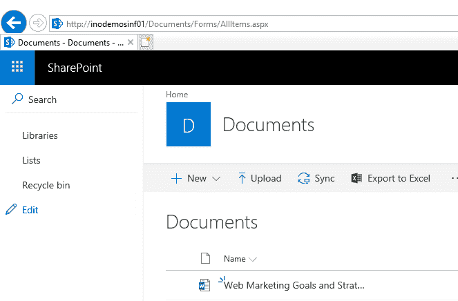
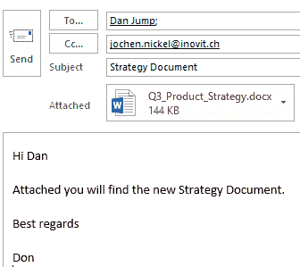

# 识别并检测敏感数据

识别和检测敏感数据是信息保护解决方案中的一个非常重要的过程。你需要能够使用适当的匹配标准来识别环境中的敏感信息，并提供相关的分类和保护控制结果。这对确保正确的访问权限和提升安全标准非常重要。微软在这个领域进行了大量投资，提供了多种本地集成的解决方案。这些解决方案为静态数据、传输中的数据以及动态数据提供了不同的保护功能。在本章中，我们将提供一个实际的概述，帮助你了解这些信息，供你组织或客户使用：

+   扩展你的实验室环境

+   理解并使用 AIP 功能来保护动态数据

+   理解并使用 AIP 功能来保护静态数据

在本章的第一部分，我们将扩展你的实验室环境。

# 扩展你的实验室环境

首先，我们需要扩展你的实验室环境，以测试不同的功能，并在你阅读本书中的各章节时，给你机会扩展场景。

我们将添加两台 Windows 10 测试客户端和**YD1INF01**服务器。使用以下图表来获取正确的虚拟机配置、尺寸以及虚拟机的域成员资格：


实验室环境概述

Windows 10 客户端需要加入到**YOURDOMAIN1.COM**域，并且你需要将示例数据文件从代码包复制到两台客户端的任意目录中：

1.  将**域用户**添加到本地**管理员**组，以便轻松访问虚拟机：


用户对虚拟机的访问

1.  若要使用单点登录，请将`*.yourdomain1.com`添加到 Internet Explorer 配置中的本地 Intranet 区域：


IE 本地 Intranet 区域配置

1.  在两台虚拟机上安装**Office 套件**和**Azure 信息保护**客户端。

1.  使用你的**Office 365 授权管理员用户**打开 [`portal.office.com`](https://portal.office.com)：


安装 Office 64 位版本

1.  在客户端安装 Office 64 位版本。

1.  在客户端下载并安装 Azure 信息保护客户端。你可以在[`aka.ms/aipclient`](https://aka.ms/aipclient)找到安装程序。

1.  选择`AzInfoProtection_PREVIEW_1.45.32.0.exe`二进制文件并在没有演示策略的情况下安装它。

此外，我们将在**YD1INF01**服务器上安装一个 SharePoint 单一农场，用于测试本地的发现功能：

1.  访问 [`bit.ly/2QFfBZ0`](https://bit.ly/2QFfBZ0) 来安装 SharePoint。

1.  预期结果是我们拥有一个演示的 SharePoint 基础架构，其中包含一个简单的文档库：



用于测试文件的 SharePoint 库

我们在**YD1INF01**服务器上配置了一个示例文件结构，用于在传统文件服务器解决方案中发现敏感数据：

```
New-Item -ItemType directory -Path 'C:\Shares\Marketing'
New-Item -ItemType directory -Path 'C:\Shares\Finance'
New-Item -ItemType directory -Path 'C:\Shares\Production'
New-Item -ItemType directory -Path 'C:\Shares\Sales'
New-Item -ItemType directory -Path 'C:\Shares\Executives'
New-Item -ItemType directory -Path 'C:\Shares\HumanResources'
New-Item -ItemType directory -Path 'C:\Shares\ResearchDevelopment'
New-SmbShare -Name Marketing -Path 'C:\Shares\Marketing' -FullAccess Everyone
New-SmbShare -Name Production -Path 'C:\Shares\Production' -FullAccess Everyone
New-SmbShare -Name Sales -Path 'C:\Shares\Sales' -FullAccess Everyone
New-SmbShare -Name HumanResources -Path 'C:\Shares\HumanResources' -FullAccess Everyone
New-SmbShare -Name ResearchDevelopment -Path 'C:\Shares\ResearchDevelopment' -FullAccess Everyone
New-SmbShare -Name Finance -Path 'C:\Shares\Finance' -FullAccess Everyone
New-SmbShare -Name Executives -Path 'C:\Shares\Executives' -FullAccess Everyone
```

在“*理解和使用 AIP 数据流动功能*”部分的相关配置步骤中，我们将复制数据。完成实验环境的扩展后，让我们识别和检测数据流动。

# 理解和使用 AIP 数据流动功能

数据流动或传输的含义是信息正在从环境中的一个位置主动移动到另一个位置，或通过互联网移动到外部。通常，过程始于创建文档、演示文稿或电子表格，或从源系统（如 HR、CRM 或其他系统）导出信息。最佳的做法是在这些过程中直接包含分类和保护过程。否则，您需要能够从客户端计算机和服务器上检测和识别敏感数据。另一个重要的事情是，您需要了解敏感、受保护或未受保护的信息在何处交换和存储。假设您需要一种能够监控客户端计算机、本地服务器和云端敏感数据的解决方案。微软遵循这一战略，并提供以下技术来满足这些要求，主动监控数据流动中的敏感数据：

+   **Azure 信息保护**：包括文档跟踪的分类和保护监控。

+   **Windows Defender ATP**：在客户端计算机上监控分类和保护活动。

+   **云应用安全**：对您启用的云生态系统进行主动监控，包括数据泄露防护、分类和保护功能。

+   **Office 365**：在 Office 365 服务中进行监控、数据泄露防护、分类和保护功能。

让我们更深入地探讨这些技术的不同功能。

# 场景 1 - 使用 Azure 信息保护

Azure 信息保护客户端为您提供了对多种格式信息进行分类和保护的功能。在我们的示例中，我们将使用手动分类，并对文档应用保护。我们将使用来自代码包的`Q3_Product_Strategy.docx`文档作为示例：

1.  使用`don.hall@yourdomain1.com`登录到其中一台测试客户端。Don Hall 是一名战略顾问。

1.  打开`Q3_Product_Strategy.docx`文档。

1.  由于内容敏感，Don 将该文档分类为机密|所有员工，以对其组织外的人员进行分类和保护，具体如下图所示：


所有员工 AIP 标签

1.  保存文件并将其发送到你任何个人电子邮件地址，以及发送给我们的示例公司 CEO `dan.jump@yourdomain1.com`（确保他已经分配了 Microsoft 365 E5 许可证）：



包括外部联系人的测试邮件

1.  尝试在你的私人账户中打开邮件附件——你将无法访问！

1.  使用`dan.jump@yourdomain1.com`用户登录到第二台 Windows 10 客户端。

1.  打开 Outlook，打开附件，然后点击“查看权限...”：


具有相关权限的受保护文档

现在我们已经对文档进行了处理，并进行了分类和保护，包括与内部员工和外部账户交换信息，我们可以通过以下步骤查看 Azure 信息保护的监控功能：

1.  返回到 Don Hall 客户端，重新打开受保护的文档`Q3_Product_Strategy.docx`。

1.  单击 Azure 信息保护的“保护”按钮，然后选择“跟踪和撤销”，如下图所示：


RMS 跟踪和撤销功能

1.  你将被重定向到 Azure RMS 跟踪网站：[`track.azurerms.com/`](https://track.azurerms.com/)。

1.  使用`don.hall@yourdomain1.com`进行登录。

1.  你将获得关于你的受保护文档的所有信息，如下图所示：


受保护文档的跟踪报告

1.  查看你作为用户在“概览 | 列表 | 时间轴 | 地图”和“设置”下拥有的所有功能。

接下来，我们将查看 Azure 信息保护的管理门户面板：

1.  在“活动日志”部分，你将能够查看所有关于`Q3_Product_Strategy.docx`的活动：


AIP 操作的活动日志

正如我们在第五章中已经配置了**Azure 日志分析**，*配置和管理身份保护*，我们可以在“配置分析（预览）”部分使用相同的日志分析工作区来查看我们的 Azure 信息保护数据。确保启用了“启用文档内容匹配功能...”复选框：


日志分析存储

1.  在“活动日志（预览）”下，你会找到“日志分析”按钮——点击它！

1.  我们将看到关于我们的分类和保护任务的更多详细信息，涉及`don.hall@yourdomain1.com`：


在 Azure 日志分析中的详细日志

1.  你还可以直接在“使用情况报告（预览）”部分进行深入查看，以下图演示：


标签使用概述

1.  点击“日志分析”图标查看生成的查询和结果：


文档的具体日志结果

为了识别和分类更多信息，我们将使用几种方法，如关键字，或者在第十五章，*配置 Azure 信息保护解决方案*中准备的敏感信息集。您可以返回监控部分并查看结果。

现在我们已经看到 Azure 信息保护为用户和管理员发现敏感信息提供的标准功能，我们可以查看 Windows Defender ATP 的功能。

# 场景 2 – 使用 Windows Defender ATP 进行监控

Windows Defender 高级威胁防护基本上是为了防止、检测、调查并响应高级威胁。我们还可以使用它来检测和识别敏感信息，特别是在客户端系统上。

要使用此功能，我们需要进行配置并将两个测试客户端加入：

1.  访问 [`securitycenter.windows.com/`](https://securitycenter.windows.com/) 并以**全局管理员**身份登录，开始按照此处图片中的配置：

    +   点击下一步：


Windows 安全中心门户

+   +   根据您的需求选择存储位置：


数据存储配置

+   +   选择数据保留策略。


保留时间配置

1.  选择您的组织规模、行业和预览体验。

1.  将两个测试客户端加入：

    +   下载包并安装它。

    +   在两个客户端上运行检测测试脚本：


加入测试脚本

1.  在设置 | 常规 | 高级功能下，激活包括 Azure 信息保护和 Microsoft Cloud App Security 在内的高级功能：


已连接的服务配置

1.  两个演示客户端将出现在机器列表下：


机器列表

在成功激活并将两个客户端机器加入**Windows Defender ATP**之后，我们可以开始测试敏感数据发现功能：

1.  使用`dan.jump@yourdomain1.com`登录到其中一个测试客户端。Dan Jump 是 CEO。

1.  打开`Employee Details.xlsx`电子表格。

1.  将文档分类为“高度机密 | 所有员工”。

在第十五章，*配置 Azure 信息保护解决方案*中，我们将提供与特定用例相关的分类和标签。目前，重要的是生成、修改并使用敏感数据。

1.  等待几分钟，以便在 Azure 信息保护的“数据发现（预览）”部分接收结果：


来自客户端的标签报告

1.  点击客户端端点：


客户端端点信息

太棒了！不同服务之间的集成将让您发现您环境中的敏感数据处理。通过 Windows Defender ATP、Azure ATP 和 Azure 信息保护，您可以将三个最重要的元素关联起来：

+   身份，包括认证信息

+   与身份本身相关的数据处理

+   针对计算机、服务器、身份提供商以及最终的敏感信息的攻击

在下一部分，我们将深入探讨云应用安全功能集，以识别您云生态系统中的敏感数据。

# 场景 3 – 在您的云生态系统中识别敏感信息

Microsoft Cloud App Security 是一个**云访问安全代理**（**CASB**），它为您提供所需的洞察力，以了解您的云应用和服务生态系统。通过此服务，您可以控制数据的流动方式，并能够识别和防范网络威胁。在本节中，我们将更详细地了解如何在我们的演示环境中发现敏感信息。

首先，我们需要启用云应用安全并将我们的云应用连接到监控我们的云生态系统。我们还需要配置 Azure 信息保护集成，以结合这些服务。

访问[`portal.cloudappsecurity.com`](https://portal.cloudappsecurity.com)并使用全局管理员凭据登录。

如果您正在按照本书中的所有实验进行操作，您的总览仪表板将如下所示：


云应用安全仪表板

通过以下步骤，我们开始配置：

1.  将我们在前几章中配置的应用程序连接到云应用安全框架：

    +   Office 365

    +   Salesforce

    +   Dropbox

    +   Microsoft Azure

1.  这可以通过启动向导完成—点击“连接应用”：


将其他应用连接到云应用安全

1.  使用 + 下拉菜单连接这些应用。

1.  提供**相关的管理员凭据**以连接应用：


云应用连接器

为了给您一个例子，我们将使用 Salesforce 演示此过程：

1.  提供您的 Salesforce 实例名称：


连接 Salesforce

1.  请点击链接以连接应用并授权所需权限：


权限分配

1.  提供您的管理员凭据：


提供管理员凭据

1.  您将被要求同意—点击允许：


检查并接受 OAuth 同意

1.  云应用安全将开始扫描用户、数据和活动：


云应用安全启动发现过程

1.  您将收到“已连接”状态：


Salesforce 连接状态

使用向导为每个连接到 Cloud App Security 的应用程序。

1.  在设置部分激活 Azure 信息保护集成：


配置 AIP 集成

1.  导航到信息保护 | Azure 信息保护并激活以下两个设置：


Cloud App Security 中的 AIP 设置

1.  授予 Cloud App Security 检查受保护文件的权限：


授权 OAuth 以分配权限

1.  点击接受。

现在，我们已经将应用连接到 Cloud App Security 并配置了 Azure 信息保护，我们可以开始处理下一个任务。通过以下步骤，我们开始配置：

1.  使用`ye.xu@yourdomain1.com`登录到其中一台测试客户端。Ye Xu 在 Sales 部门工作。

1.  登录到您的访问面板 UI：[`myapps.microsoft.com.`](https://myapps.microsoft.com)

1.  点击 Salesforce。

1.  发布代码包中的以下文件：

    +   Q3 销售和市场费用报告审计

    +   员工详情

    +   de-drv

    +   超市销售

    +   客户账户：


Salesforce 用户视图和数据使用行为

1.  作为全局管理员，跳回到 Cloud App Security 门户（[`portal.cloudappsecurity.com`](https://portal.cloudappsecurity.com)）。

1.  导航到 Investigate | 文件：


Cloud App Security 文件使用概览

1.  将 APP 更改为 Salesforce——您的已发布文件现在可以查看：


Salesforce 的数据使用报告

一些敏感数据未加密传输到 Salesforce，从这一点起，我们可以定义规则，阻止将此信息上传到此类应用程序。如果我们将过滤器更改为 Microsoft OneDrive for Business，并将文档上传到这些位置，**Cloud App Security**已经能够手动或自动为信息设置正确的分类标签：


使用 Cloud App Security 应用分类标签

现在我们已经看到了 Cloud App Security 的一些强大功能，接下来让我们查看最后一个场景：使用 Office 365 进行数据泄露防护。

# 场景 4 - Office 365 中的数据泄露防护

在本节中，我们将使用 Exchange Online 邮件流规则来检测敏感信息。我们将自动加密邮件以保护内容。这是一个典型的用例。

我们创建 Exchange Online 邮件流规则：

+   **规则 1**：加密包含信用卡号码的任何电子邮件，如果该邮件离开组织：

```
# Open an evaluated PowerShell
# Provide your global administrator credentials
$Creds = Get-Credential
$Session = New-PSSession -ConfigurationName Microsoft.Exchange -ConnectionUri https://outlook.office365.com/powershell-liveid/ -Credential $Creds -Authentication Basic -AllowRedirection
Import-PSSession $Session
New-TransportRule -Name "Protect external mails (Contains Credit Card)" -SentToScope NotInOrganization -ApplyRightsProtectionTemplate "Encrypt" -MessageContainsDataClassifications @(@{Name="Credit Card Number"; minCount="1"})
```

+   **规则 2**：防止已分类为`Confidential / All Employees`的邮件外发：

```
# Label ID of Confidential / All Employees gathered on the Azure Information Protection blade
$labelid = "6eae6a7b-f321-4fc4-8049-1ef7cc9575b2"
$label = "MSIP_Label_"+$labelid+"_enabled=true"
New-TransportRule -name "Protect External User Access" -SentToScope notinorganization -HeaderContainsMessageHeader "msip_labels" -HeaderContainsWord $label -RejectMessageReasonText "Internal Protected Message"
```

1.  使用`ye.xu@yourdomain1.com`登录到其中一台测试客户端。Ye Xu 在 Sales 部门工作。

1.  将以下内容的邮件发送至 `Karim.Manar@yourdomain1.com` 和您的私人邮箱地址。Karim 是一名控制员。

你好，Karim

我的 AMEX 卡号是 344047014854133。有效期是 09/28，CVV 是 4368

最好的祝愿

叶

1.  以 `Karim.Manar@yourdomain1.com` 的身份登录第二个客户端并查看该电子邮件。

1.  登录到您的私人账户。

1.  点击“阅读消息”，您可以阅读该消息：


OMEv2 用户体验

1.  使用 `Dan.Jump@yourdomain1.com` 登录到其中一台测试客户端。Dan 是首席执行官。

1.  将以下内容的电子邮件分类为“机密 | 所有员工”，然后发送到您的私人电子邮件账户以及 Ye Xu：


1.  您应该收到类似以下的消息：


Office 365 DLP 消息

在这个场景中，我们看到了一些 Office 365 服务的功能，帮助我们发现并识别敏感内容。在接下来的部分，我们将探讨 Azure 信息保护功能在静态数据上的应用。

# 理解并使用 AIP 功能来保护静态数据

对于未被主动移动的敏感信息的识别和检测，是信息保护解决方案中非常重要的组成部分。为此，Microsoft 提供了 Azure 信息保护扫描器，它允许您扫描两个典型的文件位置：文件共享和 SharePoint 文档库，您可以在以下图表中看到：


Azure 信息保护扫描器架构和组件

为了探索 **AIP 扫描器** 的功能，我们需要将一些示例文档分发到以下文件位置：

1.  将代码包中的示例内容移动到我们在 **YD1INF01** 服务器上创建的以下测试共享位置：


示例文件结构

1.  将一些测试文件上传到您的 SharePoint 文档库：


SharePoint 上的示例数据

我们需要在 **YD1APP01** 服务器上安装并配置 **AIP 扫描器**，该服务器在第七章中已安装 SQL 服务器，章节名为 *在 Azure AD 和 ADFS 上部署解决方案*：

1.  使用以下命令创建运行和扫描 AIP 扫描器服务的服务账户：

```
New-ADUser -Name "svcaipscanner" -SamAccountName svcaipscanner -UserPrincipalName svcaipscanner@inovitdemos.ch -path "OU=Users,OU=AIP,OU=Managed Service Objects,DC=inovitdemos,DC=ch" -AccountPassword (ConvertTo-SecureString "YourPassword" -AsPlainText -Force) -Enabled $True
```

如果您想使用仅限云的账户，可以使用以下命令：

```
Connect-AzureAD
$PasswordProfile = New-Object -TypeName Microsoft.Open.AzureAD.Model.PasswordProfile $PasswordProfile.ForceChangePasswordNextLogin = $false $Password = Read-Host -assecurestring "Please enter password for cloud service account" $Password = [System.Runtime.InteropServices.Marshal]::PtrToStringAuto([System.Runtime.InteropServices.Marshal]::SecureStringToBSTR($Password)) $PasswordProfile.Password = $Password
$Tenant = Read-Host "Please enter tenant name for UserPrincipalName (e.g. inovitdemos.ch)" New-AzureADUser -AccountEnabled $True -DisplayName "AIP Scanner Cloud Service" -PasswordProfile $PasswordProfile -MailNickName "AIPScannerCloud" -UserPrincipalName "AIPScannerCloud@$Tenant"
```

1.  将服务账户同步到您的 Azure AD：


在 Azure AD 中同步的 AIP 扫描器服务账户

1.  服务账户需要在不同的服务上拥有以下权限：

    +   本地登录（需要分配）和作为服务登录权限（通过安装完成）：


本地登录权限分配

+   +   对文档库具有读取（发现）或贡献权限，以便进行分类/保护：


AIP 扫描器服务帐户的 SharePoint 访问权限

以下列表显示所需的权限：

+   +   对每个文件共享库的读取权限用于发现，并且对分类/保护具有读/写权限

    +   服务器的本地管理员权限和对 SQL Server 主数据库的写权限，**SQL 特定权限**，如果你无法授予安装的 Sysadmin 权限

    +   AzInfoProtectionScanner 数据库需要手动创建

以下帐户需要具有`db_owner`权限：

+   +   扫描器的服务帐户

    +   扫描器安装的用户帐户

    +   扫描器配置的用户帐户

    +   对于重新保护或移除保护的标签，帐户需要成为超级用户组的一部分

1.  使用以下命令安装**Azure RMS PowerShell**模块：

```
Install-Module AADRM
```

1.  使用以下 cmdlet 和全局管理员凭据连接到 Azure RMS：

```
Connect-AadrmService
```

1.  启用**Azure RMS 超级用户**功能，默认情况下该功能是禁用的：

```
Enable-AadrmSuperUserFeature
```

1.  在你的 Azure AD 中创建一个**邮件启用的组**并将该组分配为`SuperUserGroup`：

```
Set-AadrmSuperUserGroup -GroupEmailAddress "AzureRMSSuperUsers@yourdomain1.com"
```

我们将在第十五章中更深入地讨论**超级用户组**，*配置 Azure 信息保护解决方案*。

1.  从[`bit.ly/2ccqSu0`](https://bit.ly/2ccqSu0)下载**AzInfoProtection.exe**二进制文件[.](https://bit.ly/2ccqSu0)

1.  在**YD1APP01**服务器上运行二进制文件安装。

1.  在服务器上安装 AIP 扫描器：

```
$cred = Get-Credential
Install-AIPScanner -SqlServerInstance YD1APP01 -ServiceUserCredentials $cred
```

1.  要运行配置任务，请安装`AzureADPreview` PowerShell 模块：

```
Install-Module AzureADPreview
```

1.  运行以下命令**连接到你的 Azure AD**并提供全局管理员凭据：

```
Connect-AzureAD
```

1.  创建`WebApp`及相关的`Service Principle`：

```
New-AzureADApplication -DisplayName AIPOnBehalfOf -ReplyUrls 'http://localhost'
$WebApp = Get-AzureADApplication -Filter "DisplayName eq 'AIPOnBehalfOf'"
New-AzureADServicePrincipal -AppId $WebApp.AppId
$WebAppKey = New-Guid
$Date = Get-Date
New-AzureADApplicationPasswordCredential -ObjectId $WebApp.ObjectID -startDate $Date -endDate $Date.AddYears(1) -Value $WebAppKey.Guid -CustomKeyIdentifier "AIPClient"
```

1.  构建需要的`RequiredResourceAccess`对象，以**自动化权限委派**给本地应用程序：

```
$AIPServicePrincipal = Get-AzureADServicePrincipal -All $true | ? {$_.DisplayName -eq 'AIPOnBehalfOf'}
 $AIPPermissions = $AIPServicePrincipal | select -expand Oauth2Permissions
 $Scope = New-Object -TypeName "Microsoft.Open.AzureAD.Model.ResourceAccess" -ArgumentList $AIPPermissions.Id,"Scope"
 $Access = New-Object -TypeName "Microsoft.Open.AzureAD.Model.RequiredResourceAccess"
 $Access.ResourceAppId = $WebApp.AppId
 $Access.ResourceAccess = $Scope
```

1.  运行以下命令创建`Native App`及相关的 Service Principle：

```
New-AzureADApplication -DisplayName AIPClient -ReplyURLs http://localhost -RequiredResourceAccess $Access -PublicClient $true
 $NativeApp = Get-AzureADApplication -Filter "DisplayName eq 'AIPClient'"
 New-AzureADServicePrincipal -AppId $NativeApp.AppId
```

1.  构建`Set-AIPAuthentication`命令，以便在 AIP 扫描器服务帐户下运行：

```
"Set-AIPAuthentication -WebAppID " + $WebApp.AppId + " -WebAppKey " + $WebAppKey.Guid + " -NativeAppID " + $NativeApp.AppId | Out-File ~\Desktop\Set-AIPAuthentication.txt
 Start ~\Desktop\Set-AIPAuthentication.txt
```

1.  打开 PowerShell（以不同用户身份运行），并提供本地 AIP 扫描器服务帐户的凭据。

1.  从`Set-AIPAuthentication.txt`文件中运行命令，如下所示：

```
Set-AIPAuthentication -WebAppID 10fea33d-a6c0-44cb-88ea-eca3cf673d4d -WebAppKey f84ec310-cb36-44f9-ab7f-4edeecf099d0 -NativeAppID 4f478966-0930-4fc3-b1e4-a3acb92d4932
```

1.  接受获取**身份验证令牌**。

1.  重启 AIP 扫描器。

在接下来的步骤中，我们将提供**升级**AIP 扫描器的方法，从 GA 版本升级到最新的预览版本`AzInfoProtection_PREVIEW_1.45.32.0.exe`：

1.  从[`bit.ly/2ccqSu0`](https://bit.ly/2ccqSu0)下载最新的预览版本并安装二进制文件。

1.  使用`Profile`参数更新扫描器：

```
Update-AIPScanner -Profile WestEurope
```

1.  要检查扫描器是否成功重启，**在 Azure 信息保护面板中创建配置文件**：


AIP 配置文件，用于位置处理

1.  数据库也将重命名为配置文件名：


在 SQL 管理工作室查看的 AIP 扫描器数据库

1.  打开新创建的个人资料并配置 AIP 扫描器设置

1.  配置以下仓库（替换服务器名称）：


配置好的 AIP 扫描器仓库

1.  对所有文件共享仓库和 SharePoint 文档库使用以下配置：


仓库策略设置选项

1.  对于个人资料，请使用以下设置：


AIP 扫描器的个人资料设置部分

1.  导航至“分类”部分下的策略设置。

1.  点击“全局策略”，并将默认标签更改为“常规”：


AIP 全局策略中的默认标签配置

1.  导航至扫描器 | 节点部分，标记扫描器服务器并点击立即扫描：


启用仓库扫描

1.  导航至 Dashboards | 数据发现（预览）以查看第一次结果：


扫描器的发现结果

阅读以下文章以获取有关根据需要自定义配置的信息：[`bit.ly/2T9CPn6`](https://bit.ly/2T9CPn6) 和 [`bit.ly/2Dk2YdK`](https://bit.ly/2Dk2YdK)。

你也可以使用所有已讨论的技术收集静态数据的信息。但非常重要的一点是，所有的工作都依赖于你从运动数据和相关流程中获得的检测规则的质量。我们将在第十五章，*配置 Azure 信息保护解决方案*中继续探讨此规则。

# 摘要

本章节中，我们讨论并配置了用于发现运动中、传输中和静态数据的关键技术。你了解到这些任务的重要性，以及它们为你的环境提供的数据控制和优势。它们赋予你构建高效检测和数据泄露防护规则的能力。我们将在第十五章，*配置 Azure 信息保护解决方案*中利用这些知识，构建 Azure 信息保护解决方案。但首先，我们将学习更多关于 Azure RMS 密钥的信息，这是你理解保护过程并找到适当工具排查错误所必需的。

在下一章节中，你将学习 Azure RMS 密钥的使用方式以及针对不同合规性要求可用的部署模型。
