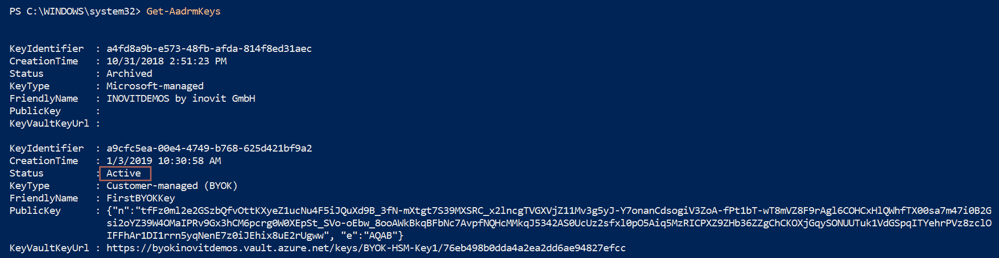
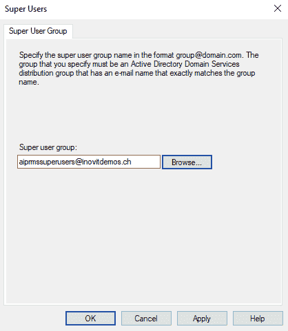
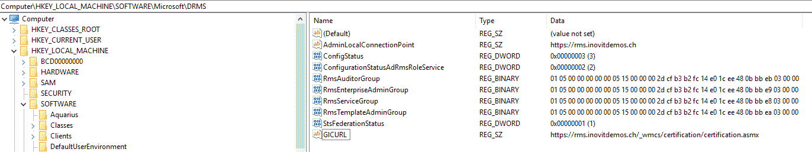

# 第十四章：理解加密密钥管理策略

在本章中，您将学习使用三种不同的密钥部署模型来满足不同的合规性要求，并了解 Azure 密钥保管库服务在其中扮演的角色。我们将讨论三种 Azure 权利管理服务流程，以便更好地理解密钥在完整的 **Azure 信息保护** (**AIP**) 解决方案中如何使用，从而确保正确实施，并帮助您排查解决方案中的问题。本章将分为以下几个部分：

+   Azure 信息保护密钥基础知识：

    +   密钥部署模型

    +   什么是 **硬件安全模块** (**HSM**)？

    +   什么是 Azure 密钥保管库？

+   Azure RMS 的工作原理：

    +   算法和密钥长度

    +   用户环境初始化流程

    +   内容保护流程

    +   内容消费流程

让我们从 AIP 密钥基础知识开始！

# Azure 信息保护 密钥基础知识

Azure **权利管理服务** (**RMS**) 是微软 AIP 解决方案的一部分。权利管理网页服务提供保护功能，包括管理、账户认证和许可。认证是指由 Azure RMS 执行的账户认证和激活活动。每个用户必须获取一组证书和相关密钥才能参与。许可是指 Azure RMS 通过一系列操作，授予授权用户访问受保护内容的权限。Azure RMS 服务为每个文档授予使用许可证（使用权限）给授权用户。

Azure RMS 服务公开了 **简单对象访问协议** (**SOAP**) 接口，供客户端与 Azure RMS 交互。

Azure 权利管理网页服务还使用权利管理模板，这些模板指定了一组预定义的权限和条件，可以应用于保护内容。在 AIP 中，权利管理模板与标签相关联。为了支持其他分类解决方案，权利管理模板也可以在没有标签关联的情况下进行配置。我们已经在第十三章，*识别和检测敏感数据*中深入探讨了这些主题。

该网页服务默认提供所需的高可用性，并具有 **服务水平协议** (**SLA**) 99.9% 的正常运行时间。

Azure RMS 是一个 Azure 服务，通过加密提供信息保护，帮助保护文档、文件、电子邮件和其他内容。

默认情况下，AIP 和权利管理部分会生成租户密钥并管理租户密钥生命周期的大部分方面。这是最简单的选项，具有最低的管理开销。在大多数情况下，没有额外或特殊安全需求的组织会使用此部署模型。他们只需注册 AIP，密钥管理过程由微软处理。

另外，出于安全性或合规要求，组织可能希望完全控制其租户密钥。为此，微软提供了一个名为**自带密钥**（**BYOK**）的单独部署模型。典型客户通常来自保险或医疗行业。在此部署模型中，客户可以创建硬件或软件密钥。基于硬件的密钥将创建在 HSM（硬件安全模块）上，这是推荐的选项，并将安全地传输并存储在 Azure 密钥库中。AIP 将配置为使用客户密钥。许多大型组织已经有了管理密钥材料的硬件、软件和流程——这通常发生在 HSM 上。大多数组织更倾向于将 HSM 基础设施扩展到云端。

第三种部署模型被称为**自持密钥**（**HYOK**）。此模型需要在 Windows Server 上安装一个孤立的本地**活动目录权限管理服务**（**AD RMS**）实例。AD RMS 实例将使用不同的私钥来保护敏感数据。基于此 AD RMS 实例的保护是基于标签的。默认情况下，AD RMS 不提供任何标签功能。

在不同模型之间的选择取决于贵组织的合规要求，具体如下：

+   与您的客户签订的具有特定加密和审计要求的合同

+   行业、企业和监管要求

+   数据主权法律，涉及规定和密钥位置

+   数据分类，定义了哪些敏感数据不能存储在云中

以下图表展示了三种部署模型：


Azure RMS 部署模型

在以下许可证中，您可以使用三种部署模型：

| **场景** | **Office 365 E3 或更高版本** | **AIP P1 或 EMS E3/M365 E3** | **AIP P2 或 EMS E5/M365 E3** |
| --- | --- | --- | --- |
| 微软管理 | X | X | X |
| BYOK | X | X | X |
| HYOK |  |  | X |

也可以选择在 Office 365 中使用服务加密与客户密钥，提供并控制应用层上存储在 Office 365 中的加密密钥。

以下租户密钥操作可用：

| **操作** | **微软管理** | **客户管理** |
| --- | --- | --- |
| 撤销 |  | X |
| Rekey | X | X |
| 备份与恢复 |  | X |
| 导出 | X |  |
| 违约响应 | X | X |

若要了解有关使用客户密钥进行 Office 365 服务加密的更多信息，请访问[`bit.ly/2SxCJW5`](https://bit.ly/2SxCJW5)。

上述图表中还显示了在主要保护流程中重要的三个密钥：

+   **红色**：租户私钥（非对称），用于解密发布许可证

+   **橙色**：租户公钥（非对称），用于发布许可证的加密

+   **绿色**：文档特定密钥（对称），用于加密/解密内容

要更好地理解这一点，请查看以下图示中的**权限管理服务**的主要功能：


Azure RMS 基本功能。

该过程从保护信息开始，最终通过数据所有者或分类级别应用的权限进行使用：

1.  文档将被创建、标记并使用 RMS 保护—为此，我们需要通过身份验证与权限管理服务进行认证。

1.  与标签相关的权限和关键材料将透明地从用户那里请求。

1.  关键材料将由用户透明地接收。

1.  文档将使用所选权限进行保护。

1.  文档将分发给需要的接收者。

1.  文档将由接收者接收，因此接收者需要通过单一登录（SSO）或单一登录方式认证身份，以访问权限管理服务。

1.  关键材料和使用权将对接收者透明地请求。

1.  关键材料将被接收，接收者可以在适当的权限下访问信息，否则用户将收到访问拒绝消息。

确保仔细规划你的密钥部署。

接下来，我们将讨论微软托管密钥部署模型。

# 微软托管的密钥。

如果激活 AIP，将生成一个新的租户密钥，并由 Azure 信息保护服务存储和管理。在这种默认情况下，密钥类型被称为微软托管密钥。以下图示展示了该部署模型：


微软服务密钥模型。

如果微软的安全性和控制措施足够满足你的组织需求，你应该使用这种部署模型。该模型默认可用，不需要额外的订阅或配置。对于容量、性能或规模，也无需特别的计划。对大多数组织来说，这是最佳选择。该部署模型具有以下特点：

+   完全托管的租户私钥。

+   租户私钥在静态状态下加密并作为客户数据处理。

+   默认的密钥长度是 2,048 位 RSA。

现在，我们将使用以下命令验证我们租户使用的`Microsoft-managed`密钥：

```
# Installing the AADRM module to administer Azure RMS
Install-Module -Name AADRM
# Connecting to Azure RMS with global administrator rights
Connect-AadrmService
# Listing the Azure RMS keys
Get-AadrmKeys
```

以下截图显示了一个新激活租户的预期结果：


实际的 RMS 密钥信息。

另一个重要因素是你部署的 Azure RMS 服务所在的位置，这有助于选择在 BYOK 部署中的 Azure 密钥库位置，以减少延迟。我们可以通过以下命令收集此信息：

```
Get-AadrmConfiguration
```

在我们的案例中，Azure RMS 租户部署在欧洲，我们可以从以下截图中看到：


Azure RMS 实际配置概述。

接下来，我们将深入了解 BYOK 部署模型。

# 自带密钥（BYOK）。

如果你使用 Azure 密钥保管库存储密钥，表示你使用的是 BYOK 部署，你可以从本地 HSM 导入密钥或在**Azure 密钥保管库**内生成密钥，并将其存储在 HSM 中。密钥永远不会离开 HSM 的边界。

在撰写时，Microsoft 提供了使用专用 HSM 的公共预览版。你可以在 [`bit.ly/2KFnJT7`](https://bit.ly/2KFnJT7) 找到更多信息。

如果你需要满足额外的合规性要求，如数据驻留或特定的加密法规，应使用 **BYOK** 部署模型。下图展示了该部署的架构：


自带密钥模型

以下是与 BYOK 相关的关键事实：

+   Azure 信息保护无法查看私钥；通过使用**Azure 密钥保管库**，职责得到了明确分离。

+   加密操作完全在 Azure 密钥保管库内完成

+   租户私钥存储在 Azure 密钥保管库中

在配置部分，我们将更深入地了解 HSM 和 Azure 密钥保管库。我们将配置基于 Azure 密钥保管库的密钥，并切换到 BYOK 部署。

# 什么是 HSM？

HSM 是提供加固、抗篡改环境的物理设备，用于管理和安全存储在 Azure RMS 及其他应用程序中使用的数字密钥。HSM 使组织能够在本地安全地管理其私钥。以下由 Thales 提供的图示展示了 BYOK 集成场景：


Thales HSM 集成

以下表格总结了在 Azure RMS 部署中实现**Thales** HSM 的好处：

| **安全密钥存储** | HSM 提供了一个抗篡改的环境，用于存储私钥。所有 Thales HSM 都已获得认证，符合最高的安全标准。 |
| --- | --- |
| **合规性** | HSM 符合 FIPS 140-2 Level 3 标准，这是企业和政府环境中广泛接受的硬件安全基准。 |
| **可扩展性** | 使用 Thales HSM 存储密钥可以使 Azure RMS 环境具有可扩展性，支持未来向本地迁移。 |

你还可以使用 Gemalto HSM 进行此场景。你可以在 [`bit.ly/2GW3t1d`](https://bit.ly/2GW3t1d) 找到一个示例。

# 什么是 Azure 密钥保管库？

Azure 密钥保管库可以最好地描述为基于 FIPS 140-2 验证的 HSM 的密钥管理服务，它还提供秘密和证书管理服务。Azure 密钥保管库用于 Azure RMS 的 BYOK 部署。该服务本身提供以下功能：

+   集中化的秘密管理

+   通过软件/硬件 HSM 保护实现合规性

+   通过 REST API/SDK/PowerShell 和 CLI 进行读/写管理

+   访问和使用监控

+   自动化分发、日志检查和部署

+   节流与版本控制

+   SLA 99.9%和 6 个持久副本（3 个副本在同一区域/3 个副本在其他区域）

对于 Azure RMS 和 BYOK，您需要使用 P1 Premium 选项从本地导入密钥或直接在 Azure Key Vault 中创建密钥。此术语 BYOK 在两种情况下都使用。对于生产环境，我们建议使用本地 HSM，您可以通过以下资源配置您的环境：[`bit.ly/2wma4Yl`](https://bit.ly/2wma4Yl)。

出于演示目的，我们使用在 Azure Key Vault 中生成的密钥，因为我们认为您不想为您的个人 HSM 投入成千上万的美元。

执行以下步骤以测试您的演示环境中的 BYOK 部署：

1.  作为全局管理员打开[`portal.azure.com`](https://portal.azure.com)，选择 Key Vaults，点击“创建密钥保险库”：


创建 Key Vault

1.  填写以下信息：

    +   使用高级定价层

    +   使用靠近您服务的区域，以避免网络延迟问题

    +   目前暂时保留访问策略和虚拟网络访问的默认设置：


Key Vault 属性

1.  使用“生成/导入”选项生成密钥：


密钥创建过程

1.  使用以下选项：

    +   密钥类型：RSA-HSM，密钥大小为 2048 位

    +   将密钥标识符复制到记事本中以备后用：


密钥属性

1.  将 Microsoft Rights Management Services 主体添加到您的访问策略中：


服务主体分配

1.  分配以下最小权限：

    +   密钥管理操作：获取和列出

    +   加密操作：解密和签名：


权限分配

1.  可选地，您可以通过使用一个新功能集（即前置的防火墙）来限制对您的保险库的访问：


Key Vault 防火墙选项

1.  配置`Azure RMS`服务以使用我们新创建的密钥：

```
# Connecting to Azure RMS with global administrator rights
Connect-AadrmService

# Configure Azure RMS to use the key from our key vault
Use-AadrmKeyVaultKey -KeyVaultKeyUrl "<Your Key Identifier from the notepad>" -FriendlyName FirstBYOKKey -Verbose
```

前面的命令输出将如下所示：


将密钥使用更改为新创建的密钥

将密钥设置为`Active`状态：

```
# View the new key with the "Archived state"
Get-AadrmKeys

# Next we set the key to the "Active" state
Set-AAdrmKeyProperties -KeyIdentifier "<Your Key Identifier>" -Active $true
```

前面的命令输出将如下所示：


激活密钥

1.  您的 Azure Key Vault 存储密钥正在使用中：



实际使用的密钥概览

1.  您可以使用以下命令切换回`Microsoft-managed key`：

```
# Next we set the Microsoft-managed key to the "Active" state
Set-AAdrmKeyProperties -KeyIdentifier "<Your Microsoft-managed Key Identifier>" -Active $true
```

现在我们了解了 HSM、Azure Key Vault 以及如何配置 BYOK 部署，接下来我们将进入 HYOK 部署模型部分。

# 持有自己的密钥

HYOK 使用一个隔离的本地 AD RMS 实例，基于由 AIP 标签驱动的第二个不同私钥提供 RMS 模板。此部署模型应选择用于高安全性和合规性要求。

大多数时候，这用于不能存储在公共云上的数据。这些敏感数据需要存储并保护在本地。请记住，HYOK 保护的数据通常占组织受保护数据的 3% 到 5%。以下图表显示了部署模型：


持有您自己的密钥模型

以下限制/优势是按设计提供的：

+   通过 Azure 信息保护服务无法进行外部共享配置

+   外部共享仅在受控方式下与已知且命名的合作伙伴进行

+   Office 365 服务无法提供索引或搜索功能；Exchange Online 传输规则和 Office 365 DLP 无法解密内容并检查它

+   共享和访问日志不会透露给任何人

+   数据始终保持加密，甚至 Microsoft 服务也无法访问

要在 AIP 标签中使用本地 AD RMS 基础设施，您需要在保护选项中选择 HYOK（AD RMS）选项。您可以选择两个选项：

+   设置 AD RMS 模板详情（模板 GUID 和授权 URL）

+   设置用户定义的权限（预览）

以下截图显示了基于模板的方法：


在标签中配置 HYOK 模板

为了在您的演示环境中配置 HYOK 部署，我们需要向现有域添加一个额外的虚拟机以安装和配置 AD RMS。

请记住，以下配置仅用于概念验证或演示目的：

+   对于生产环境，我们建议使用 SQL Server 作为 AD RMS

+   如果需要，使用身份联合选项来支持外部共享

+   使用专用的管理员帐户

+   通过防火墙或反向代理发布服务端点

按照以下步骤，我们开始配置本地 AD RMS 基础设施：

1.  创建一个 Windows Server 2016/2019 服务器虚拟机，如下所示：


创建虚拟机以承载 AD RMS 服务

1.  在您的公共 DNS 配置中创建一个 CNAME 条目——在我们的示例中，`rms.inovitdemos.ch CNAME inodemosrms01.westeurope.cloudapp.azure.com`。

1.  直接打开虚拟机以进行 HTTPS（概念验证/演示）：


防火墙配置以接受虚拟机上的 HTTPS 流量

1.  您需要一个至少包含 RMS 集群 URL 的公共 SSL 证书：

    +   我们使用通配符证书—`*.inovitdemos.ch`

确保将您的虚拟机加入域并将证书安装到本地计算机存储！为了演示目的，您也可以使用 HTTP 配置运行。

1.  作为域管理员，在域控制器上准备活动目录对象进行配置。

1.  创建 RMS 集群服务帐户：

```
New-ADUser -Name "svcrmscluster" -SamAccountName svcrmscluster -UserPrincipalName svcrmscluster@inovitdemos.ch -path "OU=Users,OU=AIP,OU=Managed Service Objects,DC=inovitdemos,DC=ch" -AccountPassword (ConvertTo-SecureString "MIA@me1976ch" -AsPlainText -Force) -EmailAddress "svcrmscluster@inovitdemos.ch" -Enabled $True
```

1.  创建 RMS 超级用户组并应用电子邮件地址以恢复受保护的数据：

```
New-ADGroup -Name "AIP RMS Super Users" -SamAccountName "AIP RMS Super Users" -GroupCategory Security -GroupScope Global -DisplayName "AIP RMS Super Users" -Path "OU=Groups,OU=AIP,OU=Managed Service Objects,DC=inovitdemos,DC=ch" -Description "AIP RMS Super Users"
```

1.  创建一个测试组，例如 `Executives`，用于 RMS 模板，并配置一个电子邮件地址——将需要测试的用户添加到该组：

```
New-ADGroup -Name "Executives" -SamAccountName "Executives" -GroupCategory Security -GroupScope Global -DisplayName "Executives" -Path "OU=Groups,OU=Managed Business Objects,DC=inovitdemos,DC=ch" -Description "Executives"
```

1.  为 RMS 端点创建一个内部 DNS 条目：

```
Add-DnsServerResourceRecord -ZoneName "inovitdemos.ch" -A -Name "rms" -IPv4Address "10.0.0.11"
```

1.  以域管理员身份登录到托管 AD RMS 服务器的新服务器。

1.  打开服务器管理器，添加活动目录 Rights Management 服务：

    +   点击“添加功能”：


AD RMS 角色安装

1.  保持所有默认设置不变，点击“下一步”：


角色服务安装

1.  通过在欢迎屏幕上点击“下一步”配置 AD RMS。

1.  创建 RMS 集群（“集群”是 AD RMS 中的特定术语，表示你可以有多个 RMS 服务器——这并不意味着 Windows 服务器集群）：


RMS 集群创建过程

1.  选择数据库部署——对于生产环境，使用专用 SQL 服务器：


AD RMS 集群的数据库配置

1.  配置我们之前创建的服务帐户，即 `svcrmscluster@inovitdemos.ch`：


AD RMS 的服务帐户使用

1.  配置以下选项，如下所示：

    +   加密模式：模式 2

    +   集群密钥存储：使用 AD RMS

    +   集群密钥密码：选择你的集群密钥词，例如 `455A#aasdd+!`

    +   集群网站：使用默认网站

1.  配置集群地址：


AD RMS 集群地址配置

如果你不想使用 HTTPS，可以改为 HTTP 用于 PoC/Demo 目的。

1.  如果你在上一步配置了 HTTPS，选择你的证书。

1.  给你的许可证书命名。我们建议使用组织名称，例如 `INOVITDEMOS`。

1.  不注册 SCP。如果你已经在现有的基础架构上，必须更改选项以不使用 SCP。

1.  我们已经完成了 AD RMS 实例的配置。我们需要注销并重新登录以完成配置：


AD RMS 安装结果概览

1.  打开 AD RMS 管理控制台配置最后的选项。

1.  打开“属性”并像配置内部网络 URL 一样配置外部网络 URL：


配置 AD RMS 外部网络 URL

1.  配置 AD RMS 超级用户组：



提供 AD RMS 超级用户组

1.  打开注册表编辑器，设置 GICURL REG_SZ 项——`http 或 https rms 集群名称 /_wmcs/certification/certification.asmx`：



设置 HYOK 注册表项

1.  配置 HYOK 的 RMS 模板：


HYOK RMS 模板设置

1.  定义一些示例权限和你之前创建的组来测试其功能：


执行人员组的分配

1.  完成配置后，打开 PowerShell 以收集相关信息，这样你就可以配置 Azure 信息保护标签。

1.  运行以下命令以获取 RMS 模板 GUID：

```
Import-Module AdRmsAdmin
New-PSDrive -Name AdrmsCluster -PSProvider AdRmsAdmin -Root https://localhost
Get-ChildItem -Path AdRmsCluster:\RightsPolicyTemplate
```

1.  登录到 [`portal.azure.com`](https://portal.azure.com) 配置新的子标签以测试 HYOK 配置——在“高度机密”下添加一个新的子标签：


AIP 全局策略概览

1.  配置标签如下：


配置 HYOK 标签

1.  为全局策略启用新的子标签，测试用户将能够选择该标签：


将标签添加到全局策略

1.  从 第十三章 *识别和检测敏感数据* 中打开一台启用了 Azure 信息保护的内部域加入测试客户端。

1.  创建一个新文档并选择 HYOK 标签。保存文档后，首次使用新标签时，你应该会看到以下消息：


本地 RMS 模板的首次使用消息

1.  文档应使用 HYOK RMS 模板权限进行保护：


HYOK 受保护文档

你已成功在测试环境中实施 HYOK 部署。现在，我们已经全面走完了所有三种部署方法的流程，接下来我们将更详细地查看 Azure RMS 的功能。

# Azure RMS 背后的工作原理

了解 RMS 的工作原理非常重要，它提供了完整的 Azure 信息保护解决方案的数据保护服务。首先，受保护的数据永远不会被传输到 Azure 信息保护或权限管理服务本身。基本上，数据在应用程序级别被加密，并包括一个定义谁有权限以及为这些用户应用哪些使用权限的策略。请记住，组成员资格会缓存三小时。因此，如果你更改了权限，请记得这一点，以免产生误解的结果。为了更好地理解三种典型的流程，让我们在本节中深入探讨这些流程。但首先，我们将看看 Azure RMS 使用的算法和密钥长度。

# 算法和密钥长度

Azure RMS 在不同的使用场景中使用以下加密控制。以下表格为你提供了在项目或研讨会上可能被问到的必要信息：

| **加密控制** | **Azure RMS 使用情况** |
| --- | --- |

| **算法**：AES **密钥长度**：128/256 位 | 文档保护**使用者**：

+   Azure 信息保护客户端

+   权限管理共享应用程序

|

| **算法**: RSA **密钥长度**: 2,048 位 / *1,024 位* | 密钥保护

+   从 AD RMS 加密模式 1 迁移

+   使用 AD RMS 和 Exchange Online 的迁移

+   迁移前的归档密钥（本地）

+   BYOK 支持 1024/2048 位 - 推荐: 2,048 位

|

| SHA-256 | 证书签名 |
| --- | --- |

现在我们已经对加密控制有了清晰的了解，可以进一步探讨第一次使用流程，或用户环境初始化。

# 用户环境初始化流程

用户环境初始化也称为引导过程。该过程从安装 Azure 信息保护客户端并且用户打开 Office 应用程序（例如）时开始。如果用户访问受保护内容或保护新创建的文档时，它将会运行。

请记住，如果用户换到另一台机器，或者另一位用户使用同一台机器，过程总是会在首次使用时运行。

在此过程中，后台发生了许多事情，如果用户在联合环境中通过单点登录提供认证，他们并不会识别出整体步骤。成功认证到 RMS 服务后，三张主要证书将会被接收：

+   安全处理器证书（SPC）

+   客户端许可证书（CLC）

+   权限账户证书 (**RAC**)，前身为组身份证书（GIC）

这些证书有效期为 31 天，并验证用户到 Azure Active Directory。

同时，组织的权限管理模板也将被接收。

以下图表展示了此过程中的主要组件：


启动过程中的主要组件和参与者

在此过程中还会发生许多其他事情。如果你需要更多关于引导过程的详细信息，可以参考 [`bit.ly/2FbcxNt`](https://bit.ly/2FbcxNt) 和 [`bit.ly/2RxtcRR`](https://bit.ly/2RxtcRR)。

以下是一些其他有用的资源：

+   **AIP 客户端管理员指南**: [`bit.ly/2Txpoxr`](https://bit.ly/2Txpoxr)

+   ***AD RMS 到 Azure 信息保护的演变 第六部分，作者：Matt Felton**: [`bit.ly/2AwGR1Q`](https://bit.ly/2AwGR1Q)

+   **记录和分析使用情况**：[`bit.ly/2RdJ3Wf`](https://bit.ly/2RdJ3Wf)

接下来，我们将探讨内容保护流程。

# 内容保护流程

接下来是内容保护流程，即当用户保护文档或电子邮件时发生的情况。RMS 客户端创建一个随机内容密钥，并使用 AES 对称加密算法对文档进行加密。流程在以下图中完整展示。我们仅强调几点：

+   识别用户或组的主要属性是 `ProxyAddresses` 属性；始终保留旧的电子邮件地址，以便能够使用较旧的受保护内容

+   如果 `ProxyAddresses` 为空，则会使用 `UserPrincipalName`。

+   RMS 客户端使用组织的密钥来加密策略和内容密钥

+   RMS 客户端使用用户证书签署策略

+   保护级别始终与内容一起存在

在下图中，你可以看到内容保护流程：


内容保护流程

接下来，我们将深入探讨内容消费流程。

# 内容消费流程

当用户尝试打开一个 RMS 保护的文档或电子邮件时，就会发生内容消费。这个过程始终从请求访问 Azure 权限管理服务开始。让我们重点突出几个关键点：

+   认证用户将文档策略和用户的证书发送到 Azure 权限管理服务

+   策略将由服务解密并评估

+   服务通过 `ProxyAddresses` 或 `UserPrincipalName` 属性为每个用户身份构建权限

+   内容密钥从解密后的策略中提取；密钥将使用用户的公钥进行加密

+   加密的使用许可证包含重新加密的内容密钥

+   RMS 客户端使用自己的私钥解密加密的使用许可证

+   RMS 客户端解密文档正文，应用程序将执行权限列表

以下视图展示了内容消费流程：


内容消费流程

通过这个流程，我们已经完成了 Azure RMS 流程的讲解。做得好！

# 总结

在本章中，你已获得了所有必要的信息，将你的需求映射到正确的密钥部署模型。我们探讨了使用 HYOK 的优缺点。通过提供的配置示例，我们积累了实践经验，现可以在你的下一个项目或研讨会中分享或使用这些经验。我们了解了主要的 Azure RMS 流程，这有助于理解 Azure RMS 如何在后台工作。你可以利用这些知识支持部署或排查常见问题，因为许多错误发生在环境初始化（引导）过程或部署过程中。

在下一章，我们将完成示例 Azure 信息保护解决方案的配置，之后你就可以为这项技术的应用之旅做好充分准备。
