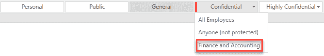

# 配置 Azure 信息保护解决方案

在学习了理论知识、敏感信息的检测与识别后，我们将通过一些项目中的实用技巧帮助您更好地理解技术及相关流程。始终尝试在没有保护措施的情况下开始项目，并进行分类，以避免数据丢失和不良的项目营销，因为当用户无法访问他们常用的信息时，业务流程将无法顺利运作。此外，始终将培训对准最终用户。本章将扩展您的实验环境，并为您提供重要的 PowerShell cmdlet，以便管理您的解决方案。最后，我们将通过一些实际示例配置**Azure 信息保护**（**AIP**）。

本章分为以下几个部分：

+   准备配置和管理 AIP

+   使用 PowerShell 管理 Azure RMS

+   配置 AIP

好的！让我们从准备任务开始。

# 准备配置和管理 AIP

要配置和管理我们的 AIP 解决方案，我们需要准备好具有必要工具的 Windows 10 管理工作站。我们需要在工作站上安装以下 PowerShell 模块：

+   Azure AD 预览版: `Install-Module -Name AzureADPreview`

+   Azure RMS: `Install-Module -Name AADRM`

此外，我们从以下来源安装 AIP 客户端到机器上：[`bit.ly/2ccqSu0`](https://bit.ly/2ccqSu0)。

对于我们的用例和实验室挑战，我们需要创建所需的邮件启用组。我们选择使用 Office 365 动态组。您可以使用以下 PowerShell cmdlet 创建所需的组。

第一组组是必需的，第二组是可选的：

```
# Connect to Azure AD and provide global administrator credentials
Connect-AzureAD New-AzureADMSGroup -Description "Finance and Accounting Department Users" -DisplayName "Finance and Accounting" -MailEnabled $true -SecurityEnabled $true -MailNickname "financeandaccounting" -GroupTypes "DynamicMembership","Unified" -MembershipRule "(user.department -contains ""Accounting"")" -MembershipRuleProcessingState "On" New-AzureADMSGroup -Description "Sales Department Users" -DisplayName "Sales" -MailEnabled $true -SecurityEnabled $true -MailNickname "sales" -GroupTypes "DynamicMembership","Unified" -MembershipRule "(user.department -eq ""Sales"") -or (user.department -eq ""Sales Engagement Management"")" -MembershipRuleProcessingState "On" 
New-AzureADMSGroup -Description "Project Management Department Users" -DisplayName "Project Management" -MailEnabled $true -SecurityEnabled $true -MailNickname "projectmanagement" -GroupTypes "DynamicMembership","Unified" -MembershipRule "(user.department -contains ""Project Management"")" -MembershipRuleProcessingState "On" New-AzureADMSGroup -Description "Senior Management Department Users" -DisplayName "Senior Management" -MailEnabled $true -SecurityEnabled $true -MailNickname "seniormanagement" -GroupTypes "DynamicMembership","Unified" -MembershipRule "(user.department -contains ""Senior Management"")" -MembershipRuleProcessingState "On"

New-AzureADMSGroup -Description "Sales Department Users" -DisplayName "Sales" -MailEnabled $true -SecurityEnabled $true -MailNickname "sales" -GroupTypes "DynamicMembership","Unified" -MembershipRule "(user.department -eq ""Sales"") -or (user.department -eq ""Sales Engagement Management"")" -MembershipRuleProcessingState "On" New-AzureADMSGroup -Description "Strategy Consulting Department Users" -DisplayName "Strategy Consulting" -MailEnabled $true -SecurityEnabled $true -MailNickname "strategyconsulting" -GroupTypes "DynamicMembership","Unified" -MembershipRule "(user.department -contains ""Strategy Consulting"")" -MembershipRuleProcessingState "On" New-AzureADMSGroup -Description "Human Resources Department Users" -DisplayName "Human Resources" -MailEnabled $true -SecurityEnabled $true -MailNickname "humanresources" -GroupTypes "DynamicMembership","Unified" -MembershipRule "(user.department -contains ""Human Resources"")" -MembershipRuleProcessingState "On"

New-AzureADMSGroup -Description "Executives Department Users" -DisplayName "Executives" -MailEnabled $true -SecurityEnabled $true -MailNickname "executives" -GroupTypes "DynamicMembership","Unified" -MembershipRule "(user.department -contains ""Executive"")" -MembershipRuleProcessingState "On"
```

以下一组组是可选的：

```
New-AzureADMSGroup -Description "Project Management Department Users" -DisplayName "Project Management" -MailEnabled $true -SecurityEnabled $true -MailNickname "projectmanagement" -GroupTypes "DynamicMembership","Unified" -MembershipRule "(user.department -contains ""Project Management"")" -MembershipRuleProcessingState "On" 
New-AzureADMSGroup -Description "Operations Department Users" -DisplayName "Operations" -MailEnabled $true -SecurityEnabled $true -MailNickname "operations" -GroupTypes "DynamicMembership","Unified" -MembershipRule "(user.department -eq ""Operations"") -or (user.department -eq ""Engineering Operations"")" -MembershipRuleProcessingState "On"

New-AzureADMSGroup -Description "Marketing Department Users" -DisplayName "Marketing" -MailEnabled $true -SecurityEnabled $true -MailNickname "marketing" -GroupTypes "DynamicMembership","Unified" -MembershipRule "(user.department -contains ""Marketing"")" -MembershipRuleProcessingState "On"

New-AzureADMSGroup -Description "Engineering Department Users" -DisplayName "Engineering" -MailEnabled $true -SecurityEnabled $true -MailNickname "engineering" -GroupTypes "DynamicMembership","Unified" -MembershipRule "(user.department -contains ""Engineering"")" -MembershipRuleProcessingState "On" 
New-AzureADMSGroup -Description "Contractors" -DisplayName "Contractor" -MailEnabled $true -SecurityEnabled $true -MailNickname "contractor" -GroupTypes "DynamicMembership","Unified" -MembershipRule "(user.department -contains ""1099 Contractor"")" -MembershipRuleProcessingState "On" 
New-AzureADMSGroup -Description "Content Management Consulting Department Users" -DisplayName "Content Management Consulting" -MailEnabled $true -SecurityEnabled $true -MailNickname "contentmanagementconsulting" -GroupTypes "DynamicMembership","Unified" -MembershipRule "(user.department -eq "" Content Management Consulting"")" -MembershipRuleProcessingState "On" 
New-AzureADMSGroup -Description "Customer Relationship Management Department Users" -DisplayName "Customer Relationship Management" -MailEnabled $true -SecurityEnabled $true -MailNickname "customerrelationshipmanagement" -GroupTypes "DynamicMembership","Unified" -MembershipRule "(user.department -contains ""Customer Relationship Management"")" -MembershipRuleProcessingState "On"
```

此外，我们需要设置 Office 365 组的正确邮件后缀。您可以使用以下命令来设置地址：

```
# Set your preferred PowerShell execution policy
Set-ExecutionPolicy Unrestricted
# Provide global administrator rights
$UserCredential = Get-Credential
$Session = New-PSSession -ConfigurationName Microsoft.Exchange -ConnectionUri https://outlook.office365.com/powershell-liveid/ -Credential $UserCredential -Authentication Basic -AllowRedirection
Import-PSSession $Session
# Set the correct suffix
set-UnifiedGroup -Identity Sales -PrimarySmtpAddress "sales@inovitdemos.ch"
set-UnifiedGroup -Identity Marketing -PrimarySmtpAddress "marketing@inovitdemos.ch"
set-UnifiedGroup -Identity "Strategy Consulting" -PrimarySmtpAddress "strategyconsulting@inovitdemos.ch"
set-UnifiedGroup -Identity "Project Management" -PrimarySmtpAddress "projectmanagement@inovitdemos.ch"
set-UnifiedGroup -Identity Operations -PrimarySmtpAddress "operations@inovitdemos.ch"
set-UnifiedGroup -Identity "Human Resources" -PrimarySmtpAddress "humanresources@inovitdemos.ch"
set-UnifiedGroup -Identity Executives -PrimarySmtpAddress "executives@inovitdemos.ch"
set-UnifiedGroup -Identity Engineering -PrimarySmtpAddress "engineering@inovitdemos.ch"
set-UnifiedGroup -Identity Contractor -PrimarySmtpAddress "contractor@inovitdemos.ch"
set-UnifiedGroup -Identity "Finance and Accounting" -PrimarySmtpAddress "financeandaccounting@inovitdemos.ch"
set-UnifiedGroup -Identity "Customer Relationship Management" -PrimarySmtpAddress "customerrelationshipmanagement@inovitdemos.ch"
set-UnifiedGroup -Identity "Content Management Consulting" -PrimarySmtpAddress "contentmanagementconsulting@inovitdemos.ch"
set-UnifiedGroup -Identity "Senior Management" -PrimarySmtpAddress "seniormanagement@inovitdemos.ch"
```

请注意，这是一个完全配备 Microsoft 365 E5 许可证的用户列表：


我们已准备好工作站并创建了相关的用例资源。接下来，我们将讨论用于配置和管理 Azure RMS 服务的最重要的 PowerShell cmdlet。

# 使用 PowerShell 管理 Azure RMS

在接下来的部分中，我们将讨论并使用最重要的 PowerShell 命令来配置和管理 Azure RMS。您将获得对功能的全面了解，并学习如何开始配置。

# Azure RMS 超级用户

我们将从连接 Azure RMS 服务和管理超级用户功能开始。此功能默认是禁用的。要使用此功能，我们需要启用该功能并为其分配一个邮件启用的组。我们强烈建议将 AIP 扫描器帐户永久添加到该组，并根据需要添加其他所需用户。无论何时将用户添加到组中，都不影响解密过去的信息。

Azure RMS 超级用户功能在 Azure RMS 中提供以下功能：

+   对所有由权限管理管理的受保护内容拥有完全控制权

+   对所有由订阅者组织发放的用户许可证，超级用户拥有完全的所有者权限

+   解密任何受权限保护的内容文件，并将其从之前在该组织内保护的内容中移除保护

超级用户功能的典型用例包括：

+   阅读离职员工的受保护信息

+   替换当前分配的保护策略

+   在 Exchange Online 中使用搜索操作（eDiscovery）

+   支持需要检查受保护信息的安全解决方案

按照以下步骤，你可以配置超级用户功能：

1.  使用全局管理员权限连接到 Azure RMS 服务，如下所示：

```
Connect-AadrmService
```

1.  获取所有超级用户命令，如下所示：

```
Get-Command "*SuperUser*"
```

1.  检查超级用户功能，如下所示：

```
Get-AadrmSuperUserFeature
```

1.  启用超级用户功能，如下所示：

```
Enable-AadrmSuperUserFeature
```

1.  获取所有超级用户，如下所示：

```
Get-AadrmSuperUser
Get-AadrmSuperUserGroup
```

1.  接下来，我们将在 Exchange Online 管理中心创建一个启用邮件功能的安全组。

1.  导航到“收件人”|“组”，并创建一个新的启用邮件功能的安全组，如下所示：


创建启用邮件功能的安全组

1.  在我们创建该组后，我们还将使用访问审查每季度审查该组的成员资格，因为该组权限非常强大，不应充满旧用户。

1.  打开 Azure 门户 [`portal.azure.com`](https://portal.azure.com) 并导航到 Azure AD 切片。

1.  选择“组织关系”|“访问审查”。

1.  点击“入驻”并为实际的 Azure AD 创建。

1.  使用默认程序并在“管理”|“控制”下进行设置。

1.  点击“新建访问审查”，如下所示：


创建访问审查

1.  选择以下设置进行审查，并将你的个人测试帐户指定为审查员：


访问审查属性

1.  接下来，我们将分配该组作为超级用户组。设置一个超级用户组，如下所示：

```
Set-AadrmSuperUserGroup -GroupEmailAddress "azurermssuperusers@inovitdemos.ch"
```

现在，如果组织开始加密信息，我们是安全的。所有受保护的内容都可以被超级用户组中的用户解保护并恢复。

为了管理 Azure RMS 服务，我们可以通过以下 cmdlet 委派管理员权限：

```
Get-AadrmRoleBasedAdministrator
Add-AadrmRoleBasedAdministrator
```

如果你使用一个组进行此委派，该组不需要启用邮件功能。

另一方面，你应该在 Azure AD **特权身份管理** (**PIM**) 切片中分配 AIP 管理权限，如下所示：


信息保护管理员 - Azure AD 中的描述

在下一部分，我们将讨论入驻控制。

# 入驻控制

推荐在组织中计划性地推出 AIP，包括 RMS 保护功能。为此，微软实现了入职控制功能。你可以使用以下命令检查默认配置：

```
Get-AadrmOnboardingControlPolicy 
```

在你通过以下命令建立与 Azure RMS 服务的连接后，打开一个提升权限的 PowerShell：

```
Connect-AadrmService
```

该功能默认情况下是禁用的。

要启用入职控制，你可以使用以下命令：

```
Set-AadrmOnboardingControlPolicy
```

通过入职控制，你可以启用基于组的推出。确保用户和关联的计算机已经准备好使用 AIP。你可以使用以下资源来准备你的用户：[`bit.ly/2CvBfF7`](https://bit.ly/2CvBfF7)。

# Azure RMS 模板

Azure RMS 模板主要用于 AIP 中的标签。如果一个组织没有使用 AIP 进行分类和标记信息，他们仍然可以使用基本的 Azure RMS 服务来保护内容。Azure RMS 模板可以通过 AIP 刀片下的标签或通过 PowerShell 创建。实际的 Azure RMS 使用权限文档可以在[`bit.ly/2HkDK2F`](https://bit.ly/2HkDK2F)查看。要管理 Azure RMS 模板，我们可以使用以下程序：

1.  获取所有模板命令，如下所示：

```
Get-Command -Module AADRM Template
```

1.  获取所有模板，如下所示：

```
Get-AadrmTemplate
```

上述命令的输出如下所示：


获取所有实际的 RMS 模板

1.  删除模板，如下所示：

```
Remove-AadrmTemplate -TemplateId "template ID"
```

1.  创建一个新模板，如下所示：

```
$names = @{}
 $names[1033] = "Template Name"
 $descriptions = @{}
 $descriptions[1033] = "Template description"
 $r1 = New-AadrmRightsDefinition -DomainName "yourdomain1.com" -Rights "VIEW","EXPORT"
 $r2 = New-AadrmRightsDefinition -EmailAddress "Email address of group or user" -Rights "OWNER"
 Add-AadrmTemplate -Names $names -Descriptions $Descriptions -LicenseValidityDuration 7 -RightsDefinitions $r1, $r2 -Status Published
```

在下一部分，我们将提供一些关于 Azure RMS 日志功能的重要信息。

# Azure RMS 日志

在本节中，我们将验证默认启用的 Azure RMS 日志功能。请执行以下步骤来分析 Azure RMS 服务的使用情况：

1.  获取实际的 Azure RMS 配置，如下所示：

```
Get-AadrmConfiguration
```

1.  获取所有日志命令，如下所示：

```
Get-Command "*Log*" -Module AADRM
```

创建 AIP 日志目录并设置变量，如下所示：

```
New-Item -ItemType directory -Path C:\AIPLogs\User
New-Item -ItemType directory -Path C:\AIPLogs\Admin
$UserLogs = "C:\AIPLogs\User"
$AdminLogs = "C:\AIPLogs\Admin"
```

1.  获取用户日志，如下所示：

```
Get-AadrmUserLog -Path $UserLogs -FromDate (Get-Date).AddDays(-45)
```

1.  获取管理员日志，如下所示：

```
Get-AadrmAdminLog -Path $AdminLogs\admin.log
```

1.  获取文档追踪功能的状态，如下所示：

```
Get-AadrmDocumentTrackingFeature
```

下一部分将向你介绍 AIP PowerShell 功能。

# AIP 客户端 PowerShell

安装了 AIP 客户端后，你可以收集关于配置的信息，并执行分类和保护活动。你可以使用 AIP cmdlets 的以下命令：

```
Get-Command -Module AzureInformationProtection
```

使用以下 cmdlet，你可以获取客户端上实际可用的 RMS 模板：

```
Get-RMSTemplate
```

你可以使用以下 cmdlet 获取文件的实际状态：

```
Get-AIPFileStatus .\Q3_Product_Strategy.docx 
```


AIP 文件状态信息

你可以使用以下 cmdlet 设置标签：

```
Set-AIPFileLabel -LabelId de82bccd-c50f-4162-b113-8aa9e98ed45f -Path .\Testfile.docx
```

在这个管理介绍部分之后，我们将继续介绍不同的用例，以配置和使用 AIP。

# 配置 AIP

配置和管理 AIP 应该始终从全球用户的整体方法开始。在开始接触技术之前，最重要的任务是制定清晰的分类架构和相关政策。在分类和信息项目中，配置只是最小的一部分。你应该根据分类架构考虑默认标签，并且一开始不要使用加密和大量自动分类规则。从理解并使用新技术的全球用户开始。请记住使用逐步推进的方法，并从最敏感的部门（如人力资源、法律或财务）开始，逐步解决具体要求。不要让用户感到不堪重负，也不要让他们违背你的概念和分类系统。

以下是一些数据分类的额外提示：

+   获得管理层和将使用该系统的员工的支持

+   对所有内容进行标签化和分类几乎是不可能的

+   使用有效的元数据策略

+   使用数据清理技术来去除冗余或过时的数据

+   提供可用性

+   考虑要分类的数据的机密性和安全性

微软已对应用于数据的分类标签进行了深入的研究和可用性测试。尽量从 AIP 的默认标签开始，例如：


AIP 默认标签集

你还可以自定义 AIP 中的每个标签，以满足你的需求。

# 创建分类架构

配置 AIP 解决方案的第一步是从创建分类架构开始。让我们按照以下步骤为我们的演示组织创建分类架构：

1.  打开 AIP 控制面板，网址为 [`portal.azure.com`](https://portal.azure.com)。

来自 第十四章， *理解加密密钥管理策略*，我们启用了 HYOK 标签。现在我们将移除此标签，因为我们不想将本地部分包括在我们的解决方案中。

1.  默认架构应如下所示：


AIP 的默认分类/标签架构

一个好的起点是，你可以开始为你的信息添加默认标签，并禁用“机密”和“高度机密”标签的加密功能。

1.  你可以在“策略 | 全局”下找到该配置。

1.  使用“General”作为默认标签，并确保所有信息对于全球用户都需要分类，例如：


默认标签激活和其他全局设置

我们强烈建议你为用户提供更多有关数据分类的信息来源。在我们的项目中，我们使用一个用户经常访问的网站作为额外的信息来源。

1.  将启用保护的标签设置为“未配置”，如下所示：


禁用保护选项

1.  在其中一台测试客户端上测试结果，用户名为 Don Hall。

1.  新文档或电子邮件会自动分类为一般，具体如下：


默认标签结果

通常标签下的业务数据不打算供公众使用，但可以根据需要与外部合作伙伴共享。例如，包括公司内部电话目录、组织结构图、内部标准以及大多数内部通信。

# 创建子标签和作用域策略

现在我们已经为用户提供了第一组配置，我们可以开始为我们的敏感部门提供基本配置。我们可以通过作用域策略来仅向特定部门用户提供更改。作用域策略需要 AIP P2 许可证。

通过以下步骤，我们将创建所需的子标签：

1.  在分类 | 标签下。在机密标签下创建一个新的子标签，具体如下：


添加子标签

+   +   名称：`财务和会计`

    +   描述：`财务和会计` 敏感数据，不打算在部门外部使用。

    +   添加以下条件：信用卡号码和 **国际银行账户名称**（**IBAN**）。

    +   保持推荐应用标签。

1.  接下来，我们将为财务和会计部门配置自定义策略。

1.  在分类 | 策略下，为 `财务和会计` 创建一个策略。

1.  将 `财务和会计` 组分配给策略。

1.  点击添加或删除标签。

1.  添加财务和会计标签。

AIP 目前仅限于提供一个子级标签。

1.  保留其他设置为默认设置，具体如下：


为财务和会计用户设置作用域

1.  以 `Karim Manar` 身份登录第二个测试客户端上的财务和会计组，并打开 Word。

1.  您应该会看到如下的新标签：



财务和会计标签结果

所有其他用户将收到默认标签设置。

1.  我们已启用的下一个功能是，如果特定条件匹配，将自动推荐标签。

1.  以 `Karim Manar` 身份登录。

1.  打开 Word 并创建包含内容 `我的 AMEX 卡号是 344047014854133` 的文档。

1.  保存文档后，标签推荐将显示如下：


AIP 标签推荐功能示例

记住，我们从不加密信息开始，以便教会用户并避免影响最终用户体验和加密信息的使用。我们还希望收集更多关于规则的信息，以便在开始自动加密之前拥有明确的标识符。

使用此选项，你还可以为每个策略定义特定的默认标签。这是一个非常有用的功能，能够支持特定部门用户的可用性，因为财务和会计部门大多处理机密内容。定义默认标签，如下所示：


在自定义策略中限定默认标签

为以下部门创建更多子标签，以便了解如何设计你的标签。在实际项目中，测试并监控标签的使用，并保持最低限度，例如：

+   战略咨询

+   高级管理

+   人力资源

+   高层管理人员

如果你使用多个策略，最后一个策略在冲突设置中胜出。

下一张截图显示了分类架构：


修改后的分类架构

你可以为其他部门的敏感项目使用相同的策略。始终思考、讨论新的标签的实际需求，并将其分配给相关用户组。明确使用目的并正确处理，对于用户提供成功的解决方案至关重要。

# 使用视觉标记

接下来的选项是标记选项，使得分类在邮件或文档的内容中也能作为页眉、页脚或水印可见。默认情况下，标记选项应用于机密和高度机密标签下。

在本节的下一步中，我们将达到并查看以下结果：

+   查看机密标签的默认行为

+   以 Don Hall 的身份打开 Word，并应用“机密 | 所有员工”标签

+   你会注意到页脚包含“分类为机密”

如果你使用已经包含页眉/页脚部分的模板，你需要测试这些模板，以确保分类不会导致模板设计崩溃。默认情况下，不会应用水印。

使用以下来源自定义视觉标记：[`bit.ly/2Cu8BnU`](https://bit.ly/2Cu8BnU)。

一个典型的例子可以是`Classified as ${Item.Label} from ${User.Name} at ${Event.DateTime}`。

如果你使用新的自动保存选项，我们建议在高级设置中启用连续分类功能，使用以下字符串：NAME: RunPolicyInBackground，VALUE: True，例如：


AIP 策略高级设置

你将在此区域找到其他功能，如下所示：


在策略中配置的高级设置

接下来，我们将探索自动分类功能。

# 配置自动分类和保护

AIP 还提供自动分类功能。此功能需要**Azure 信息保护 P2**许可。此功能包含在**EMS E5**和**Microsoft 365 E5**计划中。

从清晰的规则和标识符开始自动分类。例如，如果公司在文档中使用某个标识符，如“公开消费批准”，你可以像我们在以下步骤中所做的那样构建一个简单的条件：

1.  编辑“高度机密 | 所有员工”标签并添加以下条件：


自动分类的关键词定义

1.  将“选择此标签的应用方式：自动或推荐给用户”更改为“自动”，如下所示：


激活自动分类

1.  与 Don Hall 一起测试配置。

1.  创建一个新的 Word 文档，并在文档中输入 `My password is Pass@word1`。

1.  该文档将自动分类为“高度机密 | 所有员工”。

我们还可以通过以下步骤使用云应用安全自动分类并保护内容：

1.  以全局管理员身份打开[`portal.cloudappsecurity.com`](https://portal.cloudappsecurity.com)。

1.  在“开始”部分点击“创建策略”。

1.  使用以下模板进行我们的示例（确保将一些个人身份信息（PII）文件从代码包上传到你的测试用户 OneDrive）：


云应用安全个人身份信息（PII）扫描结果

1.  在新策略中使用以下设置：


在 Cloud App Security 中创建策略以捕获 PII 信息

1.  选择 Microsoft OneDrive for Business，并选择“机密-所有员工”标签，如下所示：


云应用安全自动分类选项

1.  你会注意到，如果点击其他应用，如 Dropbox 或 Salesforce，选项不可用。

1.  接下来，返回到仪表板，你将收到与我们刚创建的文件策略匹配的警报，如下所示：


扫描后的规则结果

1.  点击 OneDrive 警报并查看结果；该文件包含 PII 信息并已分类：


自动分类的文档

在 Office 365 中找到另一种自动分类和保护敏感信息的选项，按以下步骤操作：

1.  访问 Office 365 门户 [`portal.office.com`](https://portal.office.com) 并以全局管理员身份登录。

1.  你将看到以下“保护敏感信息的推荐”。这是因为系统已经检测到你从代码包上传到 OneDrive 的一些文件：


Office 365 中的 DLP 选项

1.  点击“查看推荐”，系统将为你提供以下选项，以创建一个保护信息的策略：


扫描敏感信息，例如信用卡详细信息

1.  点击消息底部的“创建政策”。

1.  你将在 [`bit.ly/2FMYBJS`](https://bit.ly/2FMYBJS)中找到新创建的政策，它将被称为 默认数据丢失保护策略：


使用规则的政策创建向导

1.  编辑政策并查看设置，如下所示：


政策总结

1.  编辑位置下的规则；移除 SharePoint 网站和 OneDrive 账户：


政策的位置定义

1.  编辑操作下的规则；选择加密邮件：


如果检测到敏感内容，则启用加密

1.  让我们与 Don Hall 一起在我们的一个测试客户端上测试此政策。

1.  打开 Outlook，并向 Ye Xu 和你的私人邮件账户发送以下内容的邮件。

1.  你可以在以下源创建信用卡号码（[`bit.ly/2KeZHR1`](https://bit.ly/2KeZHR1)）：

    +   **卡片类型**: `MasterCard`

    +   **卡号**: `5131493203693245`

    +   **到期日期**: `06/2027`

    +   **CVV**: `225`

以下截图显示了带有敏感内容的邮件：


测试带有敏感内容的邮件

1.  打开你的私人邮件账户：


预期结果为私人邮件账户

1.  点击阅读邮件：


阅读加密邮件的对话框

1.  你将获得两种访问受保护内容的选项：


登录或一次性密码认证选项

1.  选择一次性密码选项查看密码行为。

1.  你将收到一封带有密码的邮件：


收到验证代码

1.  输入密码并点击继续：


代码验证

1.  然后你可以阅读邮件：


纯文本消息

在处理完一些自动选项后，我们将开始使用说明选项。

# 使用说明

说明功能是一个很好的选择，可以更改推荐标签或修改现有标签，以应对修改文档的敏感性。你可以在政策设置中启用此功能：


启用说明

为了测试功能，打开一个文档并将其降级为个人标签：


提供说明

稍等片刻，你将能在活动日志中看到以下修改：


说明的日志信息

我们建议使用活动日志来提供你的分类生命周期信息。你尤其需要这些信息来改进你的自动规则。可能是你的条件已经不再有效或不够清晰，导致数据被推荐到错误的分类标签。

# 配置保护选项

一旦你的分类标签适当，并且用户已接受新方法的培训，我们可以增强保护选项，达到更高的保护状态。

对于电子邮件消息，我们可以使用该选项基于最高的附件分类来提高邮件的分类级别。我们强烈建议将其作为推荐选项，只有在你有明确的自动选项使用案例时才使用。通过以下步骤，你可以配置这个使用案例：

1.  你可以在策略配置中找到此选项：


推荐的分类选项

1.  以 Don Hall 身份登录到测试客户端，并创建两个 Word 文档，一个分类为`公开`，另一个分类为`机密`。

1.  接下来，创建一封带有两个附件的测试电子邮件，并将其发送给`叶旭`，如下所示：


实施中的推荐

以下两种选项适用于使用自定义保护：


Office 用户的附加保护功能

我们将在以下步骤中与 Don Hall 一起测试这些选项：

1.  以 Don Hall 身份登录并创建一个新的 Word 文档。

1.  点击保护图标并使用自定义权限：


自定义权限对话框

1.  将协作者权限分配给叶旭和一名外部用户，如下所示：


使用自定义权限选项，包括外部账户

1.  将邮件和文档附件发送给两个收件人。

1.  在外部用户的计算机上打开邮件和附件：


外部用户，受保护信息的查看

请注意，Azure RMS 保护内容的行为稍有不同，取决于收件人的配置和 RMS 启用情况。如果另一方也使用 Office 365，收件人应能无缝使用，无需登录提示。当用户没有使用任何 Microsoft 云服务且没有 Azure AD 时，收件人将自动处理，创建一个临时的 Azure AD 账户以使用 Azure RMS 功能。准备好你的外部收件人，并将其纳入你为内部用户进行的培训中：

如果你想管理所有 Azure RMS 保护内容，你应为此流程创建一个标签并隐藏按钮。

1.  使用 Outlook 中的“不要转发”按钮对邮件进行加密：


Outlook 中的“不要转发”按钮（其他 Office 产品中没有）

提供详细解释的 B2B 和 B2C 保护场景。

1.  您可以在标签内提供此功能。

1.  我们可以创建一个名为`Partners`的自定义标签，放在“机密”类别下，并将其分配到全局策略中，如下所示：


在标签中使用自定义保护选项

1.  使用自定义页脚，内容为“分类为合作伙伴机密”。

1.  以 Don Hall 身份登录测试客户端。

1.  创建一个 Word 文档并测试新功能，如下所示：


测试 Word 中的自定义权限选项

1.  在 Outlook 中创建一封新邮件并测试新功能，如下所示：


测试 Outlook 中的“禁止转发”按钮

请记住，在线 Office 组件无法使用受保护的信息。

实际上，微软支持许多不同的应用程序和文件格式进行分类和保护；您可以在以下截图中查看这些应用程序：


Azure RMS 支持的文档类型

微软还提供了一个通用解决方案，我们可以通过它来分类和保护敏感数据。以下步骤展示了该过程：

1.  以 Don Hall 身份登录并打开您的`OneDrive`文件夹，如下所示：


使用桌面分类选项

1.  右键点击`Finance`文件夹并选择“分类与保护”。

1.  使用“机密 | 所有员工”标签来基本分类文档，如下所示：


选择“所有员工”标签来对信息进行分类

1.  稍后，如果您已完成整个流程，您可以提供一个特定标签并保护信息。

1.  您将能够看到所有操作的报告：


特定标签报告

通过此选项，您可以基于自动规则或手动选择的标签对多个不同的文件进行分类和保护。

# 启用统一标签

随着微软构建完整信息保护解决方案的战略，Office 365 和 AIP 标签将合并在一起。通过此选项，您将能够与最重要的服务进行完全集成。

在接下来的步骤中，我们将激活统一标签功能：

1.  您可以通过使用全局管理员凭据打开[`bit.ly/2RHzZZZ`](https://bit.ly/2RHzZZZ)来激活统一标签。

1.  点击“激活”按钮并发布您的标签，如下所示：


启用统一标签

1.  访问[`protection.office.com/`](https://protection.office.com/)，点击分类和标签，查看已迁移的标签。

接下来，我们将让您进行一个实验室挑战，以发现更多 AIP 功能。

# 实验室挑战

构建一个完整的分类架构，利用实际创建的组并测试所有不同的功能。尝试实施以下流程：

+   合作伙伴和客户流程

+   敏感项目内容管理

+   部门之间的内部协作流程

+   外部用户的电子邮件保护

+   保护你的 SharePoint/OneDrive 信息/数据共享

+   防止在其他平台（如 Dropbox 和 Salesforce）中的数据泄露

祝你好运！

# 总结

完成本章后，你将能够开始优化你在组织内部或客户中的信息保护解决方案。我们提供了一个起始实验环境，用于测试 AIP 所需的所有功能和流程。使用关键的 PowerShell 命令，你应该可以顺利启动并准备好开始配置任务。此外，我们还提供了典型配置任务的概述，并分享了我们在多个项目中获得的经验。

在本书的最后一章，我们将通过一个启用了 AIP 的示例应用程序，带给你更多关于 AIP 技术的深入了解。
