# 第十六章：Azure 信息保护开发

本章是任何想深入了解 Azure 信息保护技术的人的良好起点，能够帮助您获取更多的故障排除信息或支持解决方案的信息。本章还将帮助您编写应用程序，帮助您的客户满足您组织的需求。使用 Azure 信息保护的开发资源将让您对这项技术有更深入的了解。

在本章中，我们将为您提供不同开发资源的概述，帮助您开始探索不同的 Azure 信息保护开发选项。我们将为您提供启动工具，准备开发环境，并提供一些示例，以便您开始分析这一出色的服务。您将获得有关 Microsoft 信息保护 SDK、PowerShell 使用以及其他可用 SDK 的信息，以帮助您开启您的开发之旅。

本章分为以下几个部分：

+   Microsoft 信息保护解决方案

+   了解 Microsoft 信息保护 SDK

+   为测试准备您的 Azure AD 环境

+   使用 MIP 二进制文件探索功能

+   使用 PowerShell 与 Azure 信息保护

+   RMS 2.1 和 4.2 SDK 概述

让我们来看看在我们的实验环境中开始开发所需的技术要求。

# 技术要求

在本章中，您可以使用已经安装 Visual Studio 2017 的 **YD1APP01** 服务器，详情请见 第七章，*在 Azure AD 和 ADFS 上部署解决方案*。此外，您需要从 [`bit.ly/298QzMn`](https://bit.ly/298QzMn) 安装 Information Protection SDK 2.1 以进行开发。同时，您还需要从 [`bit.ly/2CBVvoE`](https://bit.ly/2RHCjjO)、[`bit.ly/2RHCjjO`](https://bit.ly/2RHCjjO) 和 [`bit.ly/2HtYKEj`](https://bit.ly/2HtYKEj) 下载示例，放到您的 Visual Studio 项目目录中的服务器上，例如 `C:\Users\cloudadmin.INOVITDEMOS\Documents\Visual Studio 2017\Projects>`，以便您在框架中进行实验。

在下一节中，我们将深入探讨 Microsoft 信息保护解决方案，了解所有相关技术。

# Microsoft 信息保护解决方案

Azure 信息保护本身旨在对 Office 365 和许多其他应用中的文件进行分类、标记和保护。以下列表展示了不同的解决方案组件及其与 Azure 信息保护的关系：

+   **Microsoft 云应用安全**：通过直接集成 Azure 信息保护来保护云应用。

+   **条件访问**：控制对敏感信息的访问，无需直接集成到 Azure 信息保护中。

+   **SharePoint**：提供 RMS 保护的库和组，以实现访问控制。

+   **Office 365 邮件加密**：在组织内部或外部发送加密电子邮件，并与 Azure 信息保护直接集成。

+   **Office 365 数据丢失防护**：旨在防止通过 Exchange 和 SharePoint Online 丢失数据，包括 OneDrive for Business，并与 Azure 信息保护直接集成。

+   **Office 365 高级数据治理**：为敏感信息提供保留和删除策略，并与 Azure 信息保护直接集成。

+   **Azure 安全中心信息保护**：为结构化数据分配分类，例如 Azure SQL 或 SQL 服务器，以及其他与 Azure 信息保护无直接集成的 Azure 仓库。

+   **Windows 信息保护**：旨在将手机或 PC 上的私人和业务环境分开。

+   **Office 应用程序**：用于通过间接集成到 Azure 信息保护中保护 Excel、PowerPoint、Word 和 Outlook 中的敏感信息。

+   **Adobe PDF**：Azure 信息保护提供本机支持，以便为 Adobe PDF 添加标签并进行保护。

总体而言，Microsoft 提供了 Microsoft SDK，帮助开发人员为传统的本地基础设施、云平台和移动设备上的现代应用程序开发解决方案。让我们更深入地了解它。

# 了解 Microsoft 信息保护 SDK

Microsoft 信息保护 SDK 扩展了标签和保护功能，因此您可以在跨平台场景中提供一致的体验，并且它提供了全面的功能集。使用该 SDK，您可以将分类、标签和保护扩展到任何其他应用程序和服务。一般来说，Microsoft 信息保护解决方案与传统的 Active Directory RMS 基础设施兼容。您在使用**持有自有密钥**（**HYOK**）功能时已经体验过这一点。

Microsoft 信息保护 SDK 可在以下平台上使用：

+   macOS、Linux 和 Windows

+   Android、iOS 和其他平台的预览版

SDK 支持用户和服务应用程序，包括支持多租户。用户应用程序包括常见的创作工具，如 Office 和 Adobe。也支持为结构化数据加标签。服务应用程序大多在后台运行，如 DLP、**云访问安全代理**（**CASBs**）和电子发现功能。这些应用程序使用 OAuth 进行身份验证。

详细来说，API 提供以下功能：

| **API** | **功能** | **使用案例** |
| --- | --- | --- |
| **保护** |

+   接受明文内容并返回发布许可

+   允许密文和发布许可

+   返回明文

+   如有需要，执行权限强制

|

+   对任何数据进行加密

+   不需要密钥交换管理

+   例如，需要检查数据传输中的安全软件

|

| **策略** |
| --- |

+   计算策略应采取的操作

+   审计流程中事件的提交启用

+   如有需要，应用标签元数据

|

+   用于分类零件或组件的 CAD 和 CAM 应用程序

+   用于读取标签和监控服务或网络的 DLP 平台

|

| **文件** |
| --- |

+   支持常见文件类型

+   允许读取、写入或删除标签

+   启用保护移除

+   应用程序提供的元数据

|

+   Word、Excel、PowerPoint 或其他

+   需要标记文件的扫描仪

|

在下一节中，我们将提供一个来自 Microsoft 的示例应用程序`MipSdk-FileApi-Cpp-Sample-Basic`，并帮助您开始使用 SDK 并探索不同的功能。

# 准备您的 Azure AD 环境进行测试

在本节中，我们将调整 Azure AD 环境，以便运行来自 Microsoft 信息保护 SDK 的代码，针对我们的 Azure 信息保护基础设施。像往常一样，这从创建 Azure AD 应用程序开始：

1.  使用全局管理员凭据登录到 Azure 门户：[`portal.azure.com`](https://portal.azure.com)。

1.  导航到 Azure AD 页面。

1.  点击“应用程序注册”以创建一个新应用程序。

1.  点击“新建应用程序注册”。

1.  使用以下设置：

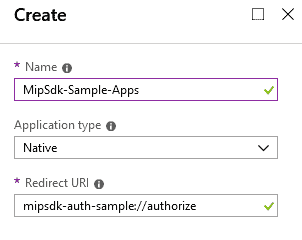

示例应用程序属性

1.  点击注册应用程序上的设置按钮：

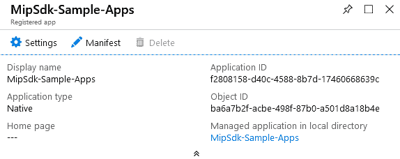

应用程序设置选项

1.  点击 API 访问的“所需权限”部分。

1.  点击“添加”：

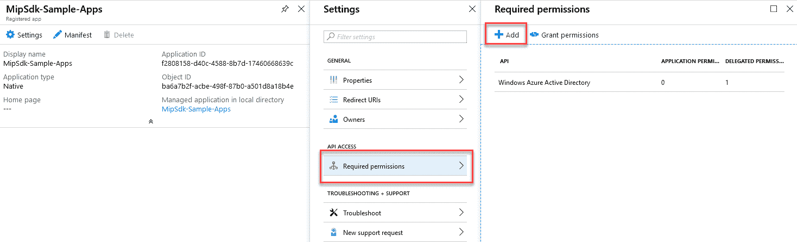

所需权限配置

1.  点击“选择一个 API”。如有需要，可以使用搜索字段查找 Microsoft 版权管理服务。

1.  选择 Microsoft 版权管理服务 API：

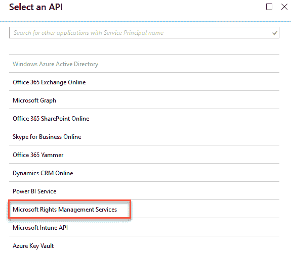

选择 Microsoft RMS API

1.  在“选择权限”部分，使用“为用户创建和访问受保护内容”的权限，属于“委托权限”选项。

1.  点击“选择”并完成：

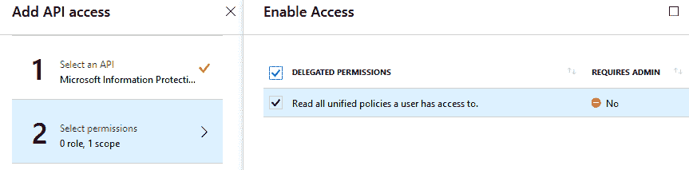

权限范围

1.  点击“添加”按钮。

1.  点击“选择一个 API”选项以选择正确的 API。

1.  搜索 Microsoft 信息保护同步服务并选择该服务：

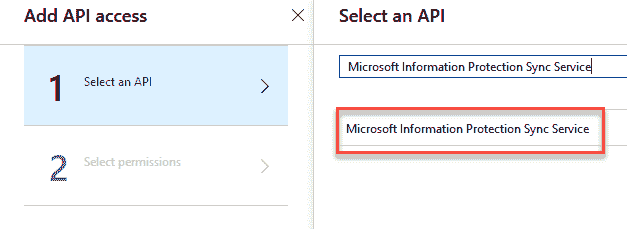

选择 Microsoft 信息保护同步服务 API

1.  在“选择权限”选项下，选择“读取用户可以访问的所有统一策略”。在“委托权限”下。

1.  点击“选择”然后按“完成”：

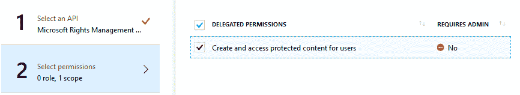

委托权限配置

1.  在所需权限页面，点击“授予权限”按钮并确认对话框：

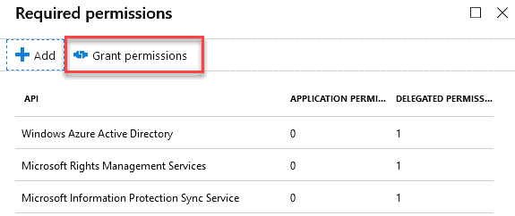

权限授予程序

1.  复制`main.cpp`文件第`57`行中的应用程序 ID，并将您的测试用户信息添加到第`64`行，以配置应用程序：

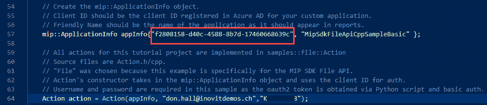

示例应用程序的修改

现在我们已经准备好了 Azure AD 环境，您可以开始探索代码示例。

使用 Visual Studio 打开`MipSdk-FileApi-Cpp-Sample-Basic.vcxproj`文件，并按照以下步骤操作：

1.  将标签 ID 复制到剪贴板或记事本。

1.  将标签粘贴到输入提示中。

1.  应用程序会询问文件路径。输入您特定 Office 文档的路径。

1.  应用程序将显示当前应用标签的名称。

1.  在支持标签或保护功能的查看器中打开文件。

接下来，我们将探索 Microsoft 信息保护（MIP）二进制文件的功能，看看您可以在开发解决方案时纳入的广泛功能。

# 使用 MIP 二进制文件探索功能

使用来自 SDK 的 Microsoft 信息保护二进制文件，我们可以探索 Microsoft 统一信息保护解决方案的新功能。二进制文件提供了所有必要的示例，用于开始使用不同的功能，如获取文件的实际状态、对文件进行分类和保护以及批量解密文件。在接下来的部分中，我们将重点介绍提供所有基本功能的 file_example.exe 二进制文件。这个示例将为您开发自己的应用程序提供灵感，应用程序将使用 SDK 和信息保护功能。

我们下载了 MIP 二进制文件以探索功能。您可以使用以下步骤更深入地了解功能：

1.  打开 PowerShell 并导航到示例文件。

1.  执行`.\file_sample.exe`二进制文件以查看您可以测试的功能：

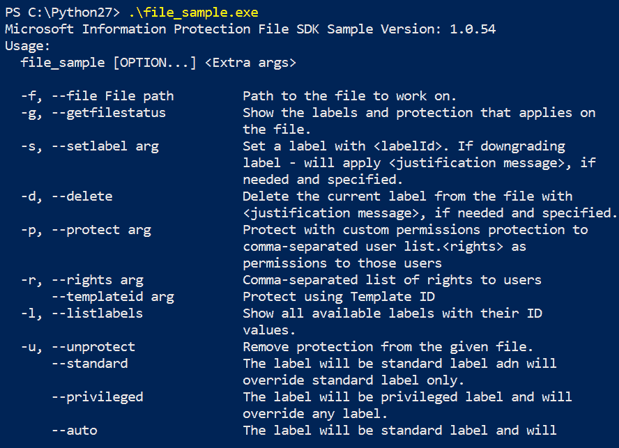

应用程序命令行选项

使用此二进制文件，您可以使用以下命令：

+   获取标签列表：

```
./file_sample --username jenny.green@leano.ch --password "YOURPASSWORD " --file "PATH" --listlabels
```

+   设置标签：

```
./file_sample --username jenny.green@leano.ch --password "YOURPASSWORD" --file "PATH" --setlabel <GUID>
```

+   读取标签：

```
./file_sample --username jenny.green@leano.ch --password "YOURPASSWORD" --file "PATH" --getfilestatus
```

在使用 MIP file_sample.exe 示例后，我们将向您介绍 PowerShell 的多种功能，帮助您管理和开发自己的解决方案。功能类似于二进制文件，但对于管理员或具有 PowerShell 经验的人来说，可能更容易理解。

# 使用 PowerShell 配合 Azure 信息保护

PowerShell 提供了管理 Azure 信息保护的功能。特别是，为了处理自定义分类和保护解决方案，您需要能够使用 PowerShell 来解决您的挑战，例如，在文件共享或单个计算机上标记和保护文件。通过以下 cmdlet，您可以获得执行大多数管理任务的基本工具集。我们通过示例使用这些 cmdlet 提供了单个文件夹的监控解决方案，并根据关键词标记和加密文件。通过以下命令，您可以开始探索更多有关 Azure 信息保护的功能和技术：

+   `Import-Module AzureInformationProtection`

+   `Get-AIPFileStatus`：用于识别所有具有特定标签的文件

+   `Set-AIPFileClassification:` 用于检查文件内容并自动标记未标记的文件

+   `Set-AIPFileLabel`：用于应用指定标签

+   `Set-AIPAuthentication`：用于非交互方式标记文件（脚本/调度器）

接下来，我们将展示一些有用的 PowerShell cmdlet 来管理 Azure RMS。

# 有用的 Azure RMS cmdlet

在接下来的部分中，我们将提供用于管理 Azure RMS 的服务主体。以下命令用于创建一个新的服务主体：

```
$ServicePrincipalName="RMSPowerShell"
Connect-AadrmService
$bposTenantID=(Get-AadrmConfiguration).BPOSId
Disconnect-AadrmService
Connect-MsolService
New-MsolServicePrincipal -DisplayName $ServicePrincipalName
```

预期的输出如下：

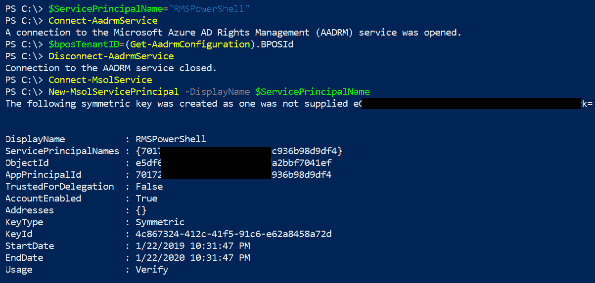

新服务主体的创建结果

复制生成的对称密钥值：

```
$symmetricKey="<value from the display of the New-MsolServicePrincipal command>"
 $appPrincipalID=(Get-MsolServicePrincipal | Where { $_.DisplayName -eq $ServicePrincipalName }).AppPrincipalId
 Set-RMSServerAuthentication -Key $symmetricKey -AppPrincipalId $appPrincipalID -BposTenantId $bposTenantID
```

预期的输出如下：

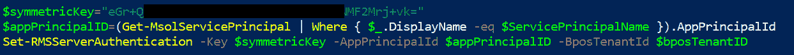

关键信息

现在，你可以开始使用服务主体账户执行以下命令：

+   枚举所有 `RMSTemplate`：

```
Get-RMSTemplate
```

+   保护一个文件：

```
Protect-RMSFile -File C:\Test.docx -InPlace -TemplateId <yourtemplateid>
```

+   获取文件的状态：

```
Get-RMSFileStatus -File C:\Test1.docx
```

+   解除保护文件：

```
Unprotect-RMSFile C:\test.docx -InPlace
```

现在我们已经开始使用 PowerShell 来与 Azure 信息保护和 Azure 权限管理服务合作，我们将向你提供一些有用的信息，关于其他可用的 SDK，用于开发与这些服务的对接，提升你的知识。

# RMS 2.1 和 4.2 SDK 概述

有两个活跃的 RMS SDK 版本可供开发者使用，用于以下开发：

+   Microsoft Rights Management SDK 4.2 for Android, iOS/macOS, Windows 设备和 Linux

+   Microsoft Rights Management SDK 2.1 for Windows Desktop Client

+   AD RMS SDK 已被取代

4.2 版本中包括了以下改进：

+   混合支持 AD RMS 和 Azure RMS（需要 AD RMS 的移动设备扩展才能在移动设备上使用 AD RMS，并提供所需的认证方法）

+   离线访问受保护的内容

+   带上你的认证库

+   带上你的用户界面

+   重新设计的 API

你可以使用以下示例设计来开发你的应用程序：

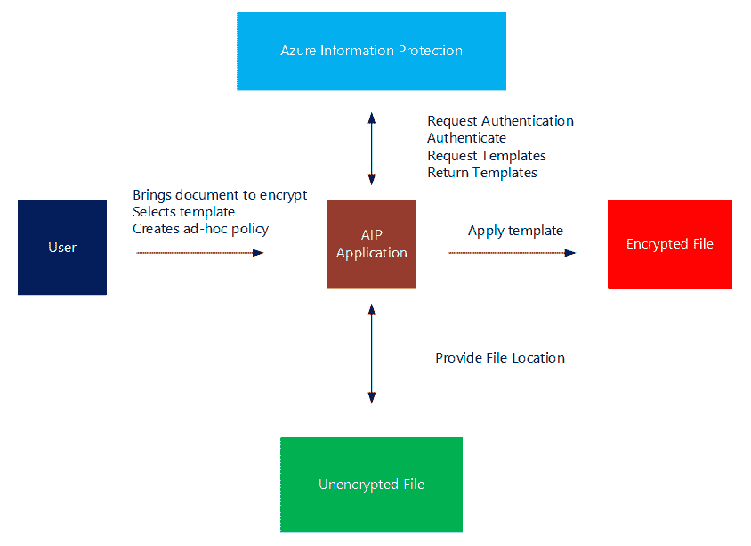

带有功能规格的应用程序设计示例

上面的示例演示了用户如何加密文档。为此任务，他需要选择一个 Azure RMS 模板，或者使用 Azure RMS AdHoc-Protection。为了从 Azure 信息保护获取模板信息，用户需要进行身份验证。在成功认证后，用户可以请求模板和服务并返回它们。如果之前的所有步骤成功，所需的模板可以应用，并且文档将被加密。此外，设计和开发中必须包括解密文档的功能，以存储未加密的敏感信息。加密和解密功能对于完整解决方案非常重要。

如果我们查看你在本章开头下载的 Azure IP 测试应用程序，在*技术要求*部分，你可以借助这个示例开始构建这样的应用程序，因为它提供了 SDK 的许多主要功能。

否则，微软提供了其他示例，帮助你开始收集更多知识。一个完美的起步方式是通过与文本文件的简单交互，你可以使用 `IpcNoteapp` 应用程序来实现。这个应用程序展示了如何保护一个简单的文本文件。我的首选方式是直接从一个具体的用例入手，例如保护 Azure Blob 存储中的数据。如果你和我一样，开始使用 `IpcAzureApp`，因为它会自动引导你使用 `IpcManagedAPI`，为你提供许多帮助类。否则，如果你想深入了解 DLP 功能，可以使用 `IpcDlpApp`，它通过文件 API 与数据交互，进行保护或解保护。你可以监控文件系统中的目录，并使用 `RMSFileWatcher` 应用保护策略。如果你还想在简单的 PowerShell 脚本中看到此类功能，你可以使用以下示例：

1.  设置你要监控的文件夹，包括子文件夹：

```
$watcher = New-Object System.IO.FileSystemWatcher
 $w.Path = "C:\Users\jochen.nickel\Desktop\Monitored"
 $w.Filter = "*.*"
 $w.IncludeSubdirectories = $true
 $w.EnableRaisingEvents = $true
```

1.  定义在检测到事件时的操作：

```
$action = { 
 $fname = $Event.SourceEventArgs.Name
 if ($fname -like "*.tmp" -or $fname -like "*~$*"){}
 else {
 $path = $Event.SourceEventArgs.FullPath

 $changeType = $Event.SourceEventArgs.ChangeType
 $logline = "$(Get-Date), $changeType, $path"
 #write-host $logline
 Add-content "C:\Users\jochen.nickel\Desktop\log.txt" -value $logline
 }
 }
$action1 = { 
 $fname = $Event.SourceEventArgs.Name
 if ($fname -like "*.tmp" -or $fname -like "*~$*" -or $fname -like "*.TMP" ){}
 else {
 $path = $Event.SourceEventArgs.FullPath

 $changeType = $Event.SourceEventArgs.ChangeType
 $logline = "$(Get-Date), $changeType, $path"
 write-host $logline
 Add-content "C:\Users\jochen.nickel\Desktop\log.txt" -value $logline
 Set-AIPFileLabel $path -LabelId '6523069d-6f4a-4486-8dc3-71de23457c71'
 $logline = "$(Get-Date), APPLIED: Set-AIPFileLabel $path -LabelId '6523069d-6f4a-4486-8dc3-71de23457c71'"
 write-host $logline
 Add-content "C:\Users\jochen.nickel\Desktop\log.txt" -value $logline
 }
 } 
```

1.  决定应监控哪些事件：

```
$created = Register-ObjectEvent $w "Created" -Action $action
 $changed = Register-ObjectEvent $w "Changed" -Action $action
 $deleted = Register-ObjectEvent $w "Deleted" -Action $action
 $renamed = Register-ObjectEvent $w "Renamed" -Action $action
 while ($true) {sleep 2}
```

为了扩展你的知识，借助 Azure **Active Directory Authentication Library** (**ADAL**)，你可以使用 `FormFileEncrypt` 应用程序加密文件。如果你需要支持 HYOK 场景，我推荐你使用 `DualSererTestApp`。有了你的实验室基础设施，你就能运行所有的场景。

更多信息，请参阅微软开发者参考资料（Azure 信息保护开发者指南）：[`bit.ly/2HIDjQ2`](https://bit.ly/2HIDjQ2)。

# 总结

在本章的最后，我们首先向你介绍了几种 PowerShell 脚本以及 SDK 相关代码，帮助你了解整个微软信息保护解决方案框架，或者开始开发你的扩展或应用程序。我们的目标从来不是在一章中让你成为一名开发者，但利用这些资源对于故障排除或管理此类解决方案是一个很好的知识来源。你现在应该能够描述有哪些 SDK 可用以及它们的用途。此外，你有足够的代码示例可以开始工作。我们希望为你提供一个功能完善且现成的工作环境，帮助你轻松入门。

希望本书中的信息能帮助你当前的组织或项目。非常感谢你坚持看到本书的最后。如果你有任何问题，欢迎通过我的博客 jochennickel.ch 或电子邮件 info@inovit.ch 向我咨询。
