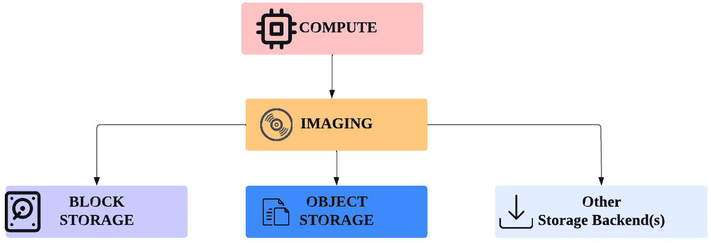
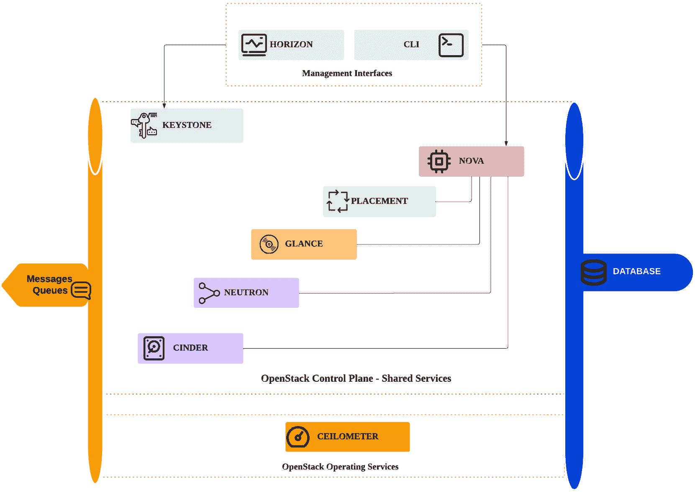
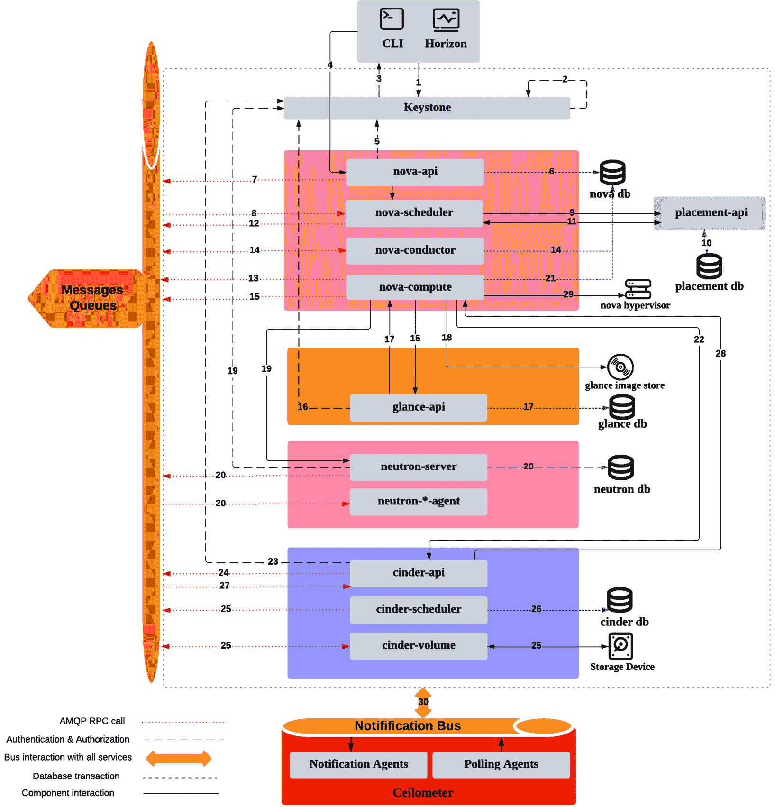
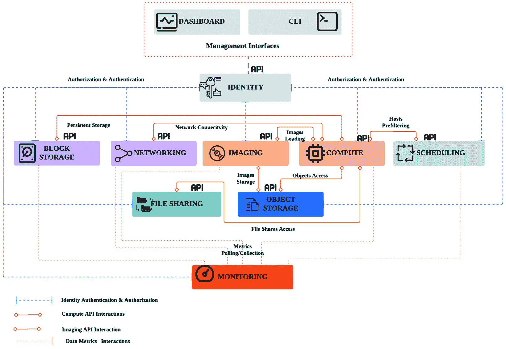
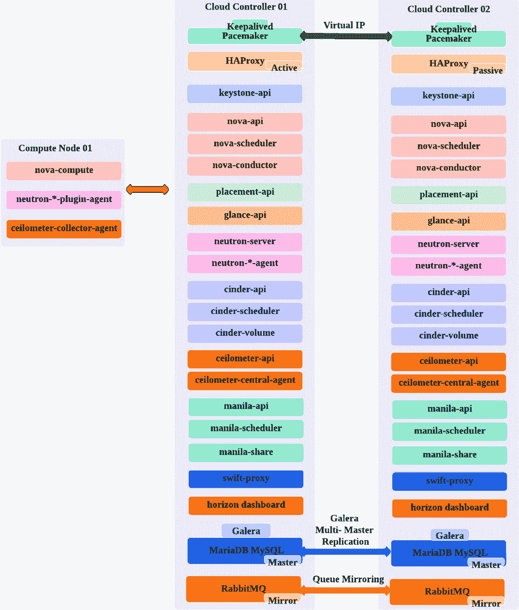
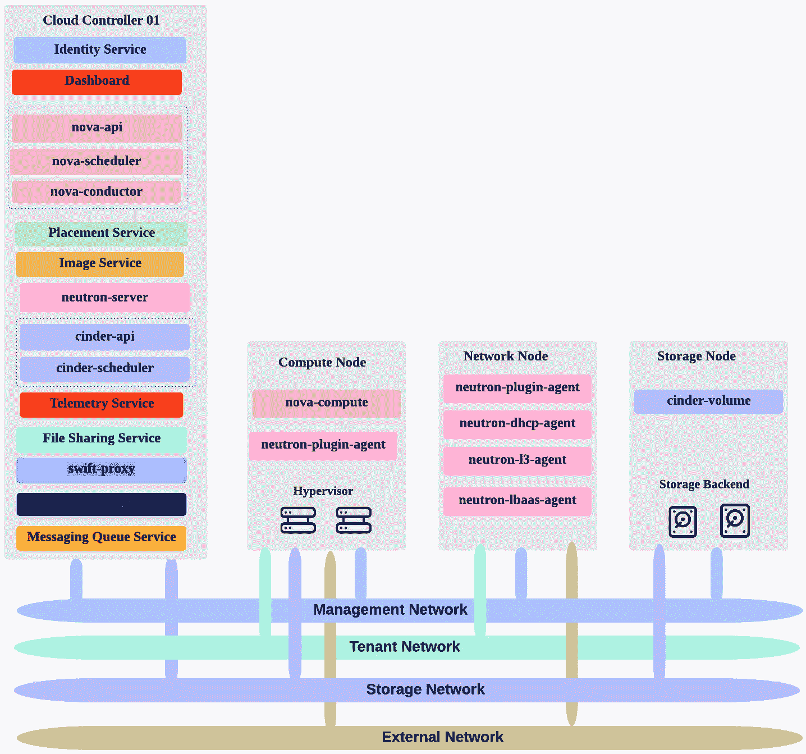
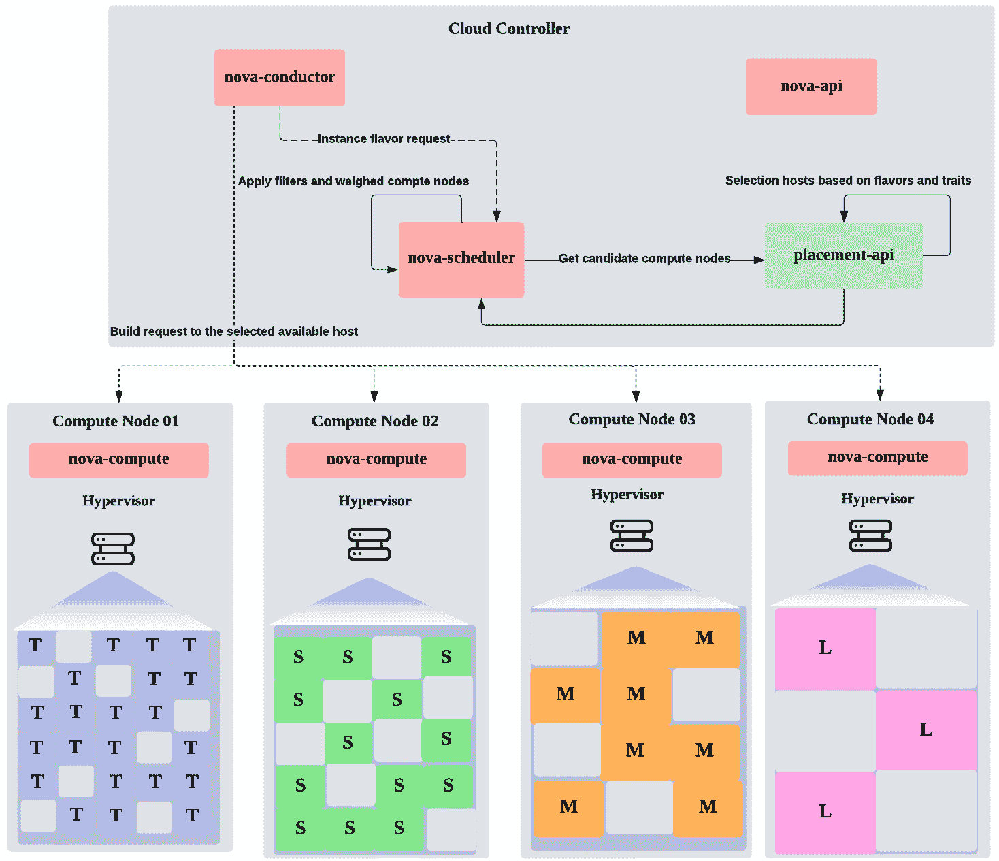

# 第一章：1

# 重访 OpenStack – 设计考虑因素

“我发现你必须回顾过去的事物，并从新的角度看待它们。”

- 约翰·科尔特兰

自从*精通 OpenStack*系列的上一个版本发布以来，OpenStack 社区一直保持着势头，围绕其生态系统不断增长和创新。在撰写本版本时，OpenStack 设计经历了不同周期的改进，通过引入新项目并与现有系统提供无缝集成，以应对组织需求和定制功能。自 2010 年首次发布的*Austin*版本以来，创新不断为公司开辟了新的机会，并迅速采用稳定的私有云设置，以在市场中保持领先地位。大公司和中型企业在加入 OpenStack 的演变过程中，感受到了处理可扩展基础设施的挑战。如今，在本版的第一页正在书写之际，14 年和 28 个版本已经穿越了不同的 OpenStack 发布，从最初的*Austin*版本到最新的*Dalmatian*版本。这是一个回到字母表开头的完整循环。许多经验和见解已经揭示出来，推动了 OpenStack 社区的发展，使其成为全球领先的开源云平台。

数据显示 OpenStack 已经成功地被中型和大型企业广泛采用。根据 2022 年 11 月在 OpenStack 博客上发布的年度*OpenStack 用户调查*结果，报告称，超过 4000 万个核心正在生产环境中运行，支持 OpenStack 的 300 个部署。

OpenInfra 社区在加强 OpenStack 软件最稳定版本方面做出了巨大贡献。从 2023 年 3 月发布的*Antelope*版本开始，到最近的 2024 年 10 月发布的*Dalmatian*版本，组织们迅速完成了升级，值得庆幸的是，这是一个比以往任何时候都更稳定可靠的版本。这一巨大成就的秘诀在于，社区已经改变了稳定 OpenStack 基础服务（包括计算、存储和网络服务）的工作方式，极大地提高了每个服务发布测试的频率，从而避免了可能的漏洞和潜在的安全问题，这些问题可能会在生产环境部署时引发故障。从故事的另一面来看，通过分析每个 OpenStack 版本的图谱，你可能会注意到一些扩展项目的出现和消失。社区贡献者做得对，摒弃了那些不稳定的特性，以免影响 OpenStack 私有部署的成熟度。今天，发布的版本暴露了基本服务，并在稳定的上游增加了更多的项目和功能。这个故事的另一个亮点是，OpenStack 生态系统始终领先一步，及时采用市场技术的新趋势，包括容器化、无服务器架构、大数据分析等。

今天，无论是开始新的 OpenStack 探险，还是翻开新的一页来进行更新，都能带来巨大的成本节约，相比传统的虚拟化替代方案，提供更高的 IT 灵活性，并在最小的担忧下实现高效的超大规模解决方案。

OpenStack 最先进的文档和资源现在比以往任何时候都更容易在互联网上找到。设计和部署一个完整的 OpenStack 环境有许多不同的选择。另一方面，关于不同设计和运行完整生态系统的选择之间的矛盾，即便对于有经验的管理员、架构师和开发者来说，也是一个挑战。这可以用*选择太多反而太少*来形容！OpenStack 的采用一直是一个挑战，从设计阶段到部署和运维阶段。正如前面所说，你可以想到很多原因，但最主要的原因是，这款软件功能如此多样，容易让人感到不知所措！

本书将通过逐步的方式，带你了解 OpenStack 生态系统的更新部分，并通过分步实施的方式，设计、部署和运营一个可扩展的 OpenStack 环境，满足你的需求和要求。

为了解决 OpenStack 生态系统复杂性带来的挑战，并让新手能够享受这一云计算旅程，我们将在第一章中定义一个私有云采用策略的愿景。如果没有一个精心设计的基础知识框架，将很难在生产阶段开始时做出有关如何支持生产集群的决策。正如商业管理实践专家罗伯特·沃特曼所说，*“战略是必要的，因为未来* *是不可预测的。”*

对于像 OpenStack 生态系统这样的复杂系统，设置正确的资源是必要的，因为我们无法做到 100% 准确预测。OpenStack 设计时具有更大的灵活性和松耦合架构。这样，关键在于我们如何利用这些元素做出容量决策，考虑短期和长期的增长及可用性目标，并根据我们在短期和长期内打算应用的现有资源来响应新的工作负载。

我们的 OpenStack 之旅将在本版本中继续，涵盖以下主题：

+   回顾并突出展示 OpenStack 核心生态系统的最新更新

+   解密基于最新发布版本的逻辑架构，特别是从 *Antelope* 发布版开始引入的内容

+   起草初步的物理设计，以确保后续阶段的无缝部署

+   通过容量规划为大规模 OpenStack 环境做准备，作为我们云策略的一部分

# OpenStack – 无数创新

当谈到 OpenStack 软件产品时，理解创新的最新状态可能会让人感到困惑。自 14 年前诞生以来，这个开源项目的崛起具有独特性。通过不同的版本，OpenStack 社区一直在根据持续的技术趋势不断开发私有云解决方案可以提供的功能。当 Kubernetes（容器编排技术）首次公开发布时，随后的 OpenStack 版本迅速 dedicating 了一个周期，加入了 OpenStack 生态系统中的服务，以便开箱即用地支持容器管理。OpenStack 成功的故事之一无疑是它始终保持领先一步的愿景。OpenStack 仍然是全球第四大开源社区的原因非常明确：对其主要核心服务的信任。自 OpenStack 诞生之日起，中大型企业便不断投资并持续贡献代码，以增强其核心服务。正如我们稍后会看到的，计算、网络、身份、镜像和存储服务被视为 OpenStack 生态系统中最基础和核心的组件。在每一个新版本中，都会对这些服务进行更多的增强和广泛的开发，使它们更加生动。这样做吸引了更多的贡献者，使得这些服务更加活跃，能够承载更多的工作负载，满足更多的需求，并且帮助企业解锁更具敏捷性和灵活性的基础设施。早期，更多的大型企业如 IBM、Red Hat、HP、Rackspace、eBay 等加入了云计算时代，他们的目标和项目各不相同，包括引入新功能、插件、修复 Bug 等等。一些贡献者基于 OpenStack 构建了自己的专用私有云平台，并继续为开源世界贡献代码，形成了双赢局面。

OpenStack 新颖性的另一个关键方面是其快速扩展能力，涵盖了与公共大型云服务提供商（如 **Amazon Web Services** (**AWS**)、**Microsoft** **Azure**、**Google Cloud Platform** (**GCP**)）类似的更广泛的服务。OpenStack 生态系统从传统的 **基础设施即服务** (**IaaS**) 开始，逐步推出了托管服务，并提供 **平台即服务** (**PaaS**) 以及 **软件即服务** (**SaaS**) 模型。通过快速浏览 OpenStack 的增长速度，我们可能会发现其核心服务已经达到了成熟的水平，可以解锁大量创新功能和解决方案的门扉。在这些服务的基础上，可以提供更多的 PaaS 环境，如数据库、大数据、容器服务等。

OpenStack 增长成功的另一面是软件本身的特性。自开发初期以来，OpenStack 软件大部分是用 Python 编写的，旨在提供丰富的**应用程序编程接口**（**API**）。这是一项改变游戏规则的创新，几乎在任何地方都能够实现自动化。因此，每个贡献者可以利用自己的专业领域，利用 API 设计的特性，顺利地将新功能集成到软件生态系统中。

OpenStack 的 API 在采用混合云方法中具有重要意义。正如我们在*第十一章*《混合云超大规模用例——扩展 Kubernetes 工作负载》中所看到的，OpenStack 提供了**弹性计算云**（**EC2**）API，这是与 AWS 世界兼容的 API。

OpenStack 生态系统的创新和持续增长无疑是一个成功的故事，这得益于社区的一致性，最重要的是，OpenStack 凭借模块化设计自然发展。如今，构建一个 OpenStack 私有云已经可以用于一个或多个目的，它可以为公共托管工作负载、托管数据库、大数据、高性能计算（HPC），甚至多个优化的容器化环境提供 Web 应用程序，满足快速应用开发的需求。最重要的是，了解核心和最新服务的更新是开启云计算之旅的必备钥匙。

# OpenStack 的构建模块——控制平面

OpenStack 项目的启动是为了解决 IaaS 范式问题。通过采用按需付费模式，底层资源，包括计算、网络和存储，作为池子被按需安全地暴露并根据用户需求进行预留。在 OpenStack 生态系统的发展过程中（在其他文献中被称为*云操作系统*），更多的开源项目加入了新兴的云软件生命周期，扩展了其功能。正如前面所提到的，这种项目开发的秘诀在于自然的 API 设计，它始终促进了服务之间的通信。大量的服务可能会让新手困惑，不知道生态系统中的基本部分如何工作，从而启用为定制需求和要求设计的良好架构。接下来的章节将逐步介绍 OpenStack 的*核心服务*，作为开始。了解这些服务中的每一个至关重要，因为每个 OpenStack 版本都会引入新的项目或服务，并依赖于它们。战略性地掌握核心组件及其功能，将使您更容易部署未来的私有云设置，从而以更少的时间和精力扩展其能力。下表展示了接下来章节将要讨论的核心服务：

| **服务** | **代号** | **描述** |
| --- | --- | --- |
| 计算 | Nova | 管理 **虚拟机**（**VM**）生命周期 |
| 网络 | Neutron | 管理每个项目的网络环境 |
| 身份 | Keystone | 提供身份验证与授权信息服务 |
| 块存储 | Cinder | 管理 VM 磁盘和快照生命周期 |
| 对象存储 | Swift | 可访问的 REST API 存储，用于存储图像、媒体文件等对象数据类型 |
| 镜像 | Glance | 管理 VM 镜像生命周期 |
| 仪表盘 | Horizon | OpenStack 前端 Web 界面 |
| 文件共享 | Manila | 管理跨共享文件系统的项目 |
| 调度 | 放置 | 帮助跟踪提供商的资源库存和使用情况 |
| 遥测 | Ceilometer | 提供资源跟踪和计费的数据收集服务 |
| 报警 | Aodh | 基于收集的指标和配置的规则触发动作和报警 |

表格 1.1 – OpenStack 核心服务

重要说明

仍然可以在没有对象存储和仪表盘的情况下部署 OpenStack 环境。某些发行版默认启用了这两项服务。例如，启动一个虚拟机不一定需要对象存储。此外，OpenStack **命令行界面**（**CLI**）支持每个安装的所有操作，并且可以无需 OpenStack 仪表盘进行指令。

## Keystone – 身份验证与授权服务

关键字 *身份验证* 和 *授权* 是此身份服务的主要功能。**Keystone** 是 OpenStack 生态系统控制平面的一部分。

安全性从最早的版本开始被引入，并且深入研究 OpenStack 中的 **AAA**（**身份验证、授权、计费**）服务成为了必需。每一个联系 OpenStack 服务的请求都必须由 Keystone 验证（通过身份 API）。API 响应将返回一个身份验证令牌，用于访问请求的服务（API 调用）。

在这个阶段，Keystone 工作流可能看起来比我们想象的简单。另一方面，当我们扩展数百个主机以在短时间内处理成千上万的请求时，我们应考虑如何确保 Keystone 作为关键服务能够完全正常运行。这将在后面的章节中讨论。

从旧版 OpenStack 版本到最新稳定版，在身份服务中的主要变化是 API 的版本。以前，在安装身份服务时，可以继续使用版本 2；从 *Grizzly* 版本开始，推出了版本 3，并且可以安装。今天，身份 API 版本 2 已被弃用，取而代之的是更新的版本。我们将考虑版本 3 及以上（截至本书撰写时，版本 3.14 是 *Ussuri* OpenStack 版本中的最新版本）。

那么身份 API 能提供什么呢？如前所述，所有 OpenStack 服务之间的通信设计都是通过 API 实现的（稍后，我们将简单介绍如何通过 API 与非 OpenStack 服务进行交互）。考虑到一个失败的简单身份验证请求可能会从最终用户的角度反映出服务故障。一个好的做法是，在首次排查故障时，确保 Keystone 请求没有问题，特别是在服务请求失败时。尽管本书的前几个版本没有深入探讨 Keystone 工作流，但我们将在 *第三章* 中以更详细的方式重新审视它，*OpenStack 控制平面 - * *共享服务*。

## Nova – 计算服务

*Austin*，OpenStack 的第一个版本，推出了 **Nova** 项目的第一个版本，用于启动实例，并开始通过丰富的 API 处理计算管理。与前述的身份服务不同，Nova 在不同版本中不断发展，增加了更多惊人的功能，但相较于其他核心服务，它的复杂性也有所提高。Nova 服务的设计自 *Grizzly* 版本以来变化不大。另一方面，仍然需要反复讨论构成 OpenStack 生态系统中计算服务引擎的不同 Nova 组件。

重要提示

在最新的 OpenStack 版本中，Nova 带来了许多新功能，详细内容请参见 *第四章*，*OpenStack 计算 - 计算能力* *与规格*。

**nova-api** 服务与用户 API 调用进行交互，管理计算实例。它通过消息总线与计算服务的其他组件进行通信。

**nova-scheduler** 服务监听来自消息总线的新实例请求。该服务的任务是为新实例选择最佳计算节点。

**nova-compute** 服务是负责启动和终止虚拟机的进程。该服务运行在计算节点上，并通过消息总线监听新的请求。

**nova-conductor** 服务处理计算节点的数据库访问请求，以限制攻击者通过被妥协的主机对数据库的访问风险。

## Placement – 调度服务

每当涉及到新的系统改进或逻辑添加时，OpenStack 社区会创建、移动或部署不同的服务或组件来实现这一目标。自 *Newton* 版本以来，OpenStack 生态系统的一个重要更新是引入了 **Placement** API 服务。在此版本之前，用户在识别不同资源提供者（如计算、网络和存储分配池）上的计数器时遇到困难。正是在这里，专门为此创建一个独立的服务，进而通过与其他服务（如 Nova）的良好连接的 API 来跟踪这些资源提供者并监控其使用情况，就显得尤为重要。Placement 服务主要作为资源清单进行工作。不仅如此，最重要的改进还使得过滤过程（通过 **nova-scheduler** ）更加精细。在一些其他术语中，你可能会看到 *预过滤* 这个词作为对新 Placement 服务的引用。此步骤是在处理调度器之前，根据一些可配置的规格和特性，启动过滤过程以准备可用的计算节点。Placement 服务将在 *第四章* ，*OpenStack 计算 – 计算容量* *与规格* 中演示。

## Glance – 镜像服务

要通过 Nova 服务在 OpenStack 中启动一个实例，成功完成虚拟机配置需要一个实例镜像。**Glance** 是一个核心服务，它不仅处理实例镜像（作为模板源镜像），还处理可以从实例创建的快照。当涉及到 Glance 存储镜像和快照的位置问题时，答案可以在其最新支持的驱动配置中找到。与许多其他 OpenStack 服务一样，可以使用多种存储选项来支持 Glance 的镜像存储。再次提醒，如果我们从短期和长期来看待 OpenStack 基础设施扩展，我们必须考虑 Glance 应该使用哪种后端存储。OpenStack 社区已经开发了最常用的存储后端，无论是在适当的 OpenStack 支持的存储服务中，如 *Swift 对象存储* 和 *Cinder 块存储*，还是基于 **RADOS 块设备**（**RBD**）的第三方扩展，如 *Ceph* 存储、VMware 存储，甚至是 AWS **简单存储服务**（**S3**）存储。

这种多样化的存储后端选项可能增加架构选择的矛盾，但它提出了一个问题：我们从业务和容量角度应该解决哪些需求。例如，Glance 配置允许在相同的配置布局中启用多个存储后端，可以定制指示映像服务使用现有的块存储池来直接附加图像，减少从头开始下载的等待时间。如果 Ceph 基础设施庞大，并且拥有数十个对象存储节点，可以通过将一个 Ceph 存储池专用于生产图像，利用 Glance 与 Ceph 后端之间稳定的驱动程序集成所提供的现有资源来提高其使用效率。

重要提示

在选择任何类型的后端之前，理解您的需求非常重要，因为并非所有后端都支持相同的功能。例如，在 *Antelope* 版本中，OpenStack Glance 团队在块存储后端 *Cinder* 中加入了一个新特性——允许扩展运行中的附加卷。Ceph 存储扩展将在 *第五章* 中详细讨论， *OpenStack 存储 – 块存储、对象存储和* *文件共享*。

相反，更多有趣的使用案例将利用 Swift 作为 Glance 快照和模板的存储后端。这可以被认为是一种安全的内部备份场景。进一步说，增加您的 **容错能力**（**FT**）领域可以跨越公共云服务，比如 AWS S3 后端。

Glance 服务中最令人印象深刻的进展之一是支持的图像格式列表的扩展。*Antelope* 版本支持至少 11 种格式，包括 RAW、QCOW2、VDI、VHD、ISO、OVA、PLOOP 和 Docker，另外还增加了处理亚马逊公共云兼容性的格式，分别是 AKI、AMI 和 ARI：

图 1.1 – Glance 支持的后端

Swift 一直是大型部署中存储 Glance 图像的最优选项之一，下一节将重点介绍这一点。

## Swift – 对象存储服务

与 Nova 一起，**Swift** 在 2010 年推出了首个 OpenStack 版本 *Austin*。对象存储为解决多个存储挑战的企业提供了巨大价值，区别于传统的持久化存储设计。Swift 本身是一个革命性的服务，尤其在云技术刚刚起步的时期。根据对象存储模型的特点，对象以平面层级结构存储。在特定的 OpenStack 部署中，Swift 的主要用途是进行归档和备份。许多与 OpenStack 生态系统中存储相关的服务，都与 Swift 存储后端兼容，无论是直接存储、备份目的，还是两者兼有。

正如我们将在*第五章*《*OpenStack 存储——块、对象和文件共享*》中展示的那样，以下是对象存储常见规格的简要回顾：

+   通过设计避免**单点故障**（**SPOF**）

+   提供用于常见对象管理的 HTTP REST API

+   高度可扩展，适用于要求提升性能的工作负载

+   设计时考虑最终一致性

+   通过设计实现高可用性，并且可以通过廉价硬件轻松实现水平扩展

现在，让我们来看看下一个存储选项：Cinder 服务。

## Cinder —— 块存储服务

OpenStack 生态系统中的另一项存储服务，并被视为核心服务的是名为**Cinder**的块存储服务。Cinder 被开发用于保持实例卷（虚拟磁盘）的独立生命周期操作。Cinder API 提供了完整的不同卷和快照操作列表，包括创建、删除、附加、分离、扩展、克隆、从卷创建镜像、从镜像创建卷以及从快照创建卷。随着最近的 OpenStack 版本发布，更多的操作功能已经被开发出来，以支持备份、恢复和卷迁移。

## Manila —— 共享文件系统服务

文件共享解决方案已经成为企业日益增长的存储选择。在过去十年中，IT 基础设施中无论是本地部署还是云环境，对一个可以提供便捷访问和简单管理的协作中央存储大脑的需求不断增加。自*Liberty*版本以来，OpenStack 社区抓住了这一机会，推出了**Manila 分布式和共享文件系统**解决方案。Manila 与 Cinder 有着相同的逻辑工作流，但由于功能有限，它没有被纳入核心 OpenStack 项目。从*Kilo*版本到*最新版本*，Manila 已经证明自己是 OpenStack 基础设施中的一个稳定组件，使企业能够访问自助文件共享服务，满足不同资源和客户端的需求。

再次提到，多个存储供应商通过开发更多的驱动程序来支持其存储后端硬件，从而持续推动 Manila 服务的发展。沿用 Cinder 的做法，我们可能会发现 Manila 支持的完整文件共享驱动程序列表，包括 CephFS、LVM、Hadoop HDFS、EMC、IBM 等。完整的支持驱动程序列表可以在 Manila 的 OpenStack 网页上找到：[`docs.openstack.org/manila/latest/configuration/shared-file-systems/drivers.html`](https://docs.openstack.org/manila/latest/configuration/shared-file-systems/drivers.html)。在 Manila 服务的最新版本中，还包括了一些更有趣的更新，如安全性、备份共享集成以及更高的可访问性，这些将在*第五章* *OpenStack 存储——块存储、对象存储和文件共享*中详细讨论。

## Neutron——网络服务

如果我们考虑到**nova-network**仍在使用中，前面的引用可能会有争议！另一方面，自*Grizzly*版本以来，**Neutron**项目已经成为 OpenStack 生态系统中的一个更重要的**网络即服务**（**NaaS**）支柱。这是有道理的，因为社区采取了提供独立网络服务而非嵌入式服务的方法（Nova 计算服务就是一个例子）。从传统的**nova-network**到 Neutron 的过渡，对于那些希望从旧时代迁移到由 Neutron 主导的新网络时代的公司来说，过程更为艰难。尽管我们将在本书的后续部分继续关注 Neutron，*第六章* *OpenStack 网络——连接性与托管服务选项*中将专门讨论 Neutron 的更多高级功能。

采用 Neutron 的动机非常明显，因为该项目的崛起解决了许多**nova-network**的局限性，并开放了新的网络能力。与仅提供基础网络功能的**nova-network**（主要限于与计算服务的交互）相比，Neutron 带来了几个方面和功能，可以总结如下：

+   项目简化自助服务，用于配置端口、子网、网络和路由器对象

+   高级网络功能可以在短时间内部署，例如防火墙、**虚拟私人网络**（**VPN**）和负载均衡器

+   对复杂网络拓扑的更多支持

+   第三方网络解决方案集成的多种方式

+   一个独立的服务使架构支持**高可用性**（**HA**）变得更简单

+   针对各种规模部署的高效服务

随着基于 **软件定义网络** (**SDN**) 解决方案的硬件和软件的出现，OpenStack Neutron 团队率先在 SDN 部分提供更多支持，从而开发了 Neutron 驱动程序，以集成一些著名的 SDN 实现，如 OpenContrail 和 VMware NSX。

自 2013 年以来，在每个 OpenStack 版本中，Neutron 项目一直被认为是提交次数和功能开发最多的服务之一。*第六章*，*OpenStack 网络 – 连接性和托管服务选项*，将深入探讨更多 Neutron 功能，并将这些功能与最新 OpenStack 版本中的 SDN 连接起来。

## Ceilometer – 遥测服务

遥测服务是在 OpenStack 生态系统中引入的，出现在 *Havana* 版本中。代号为 **Ceilometer** 的遥测服务带着一个明确的使命：记录、收集和监控 OpenStack 基础设施中的资源利用度度量数据。与旧版本的 OpenStack 不同，最新的 Ceilometer 版本仅包含度量数据收集功能，将报警和通知功能交给了另一个名为 Aodh 的专用项目。

## Aodh – 警报服务

作为监控服务链的一部分，允许用户根据遥测事件触发自定义通知，已成为监控部署项目资源的必备功能。如 *Ceilometer – 遥测服务* 部分所述，报警功能已从 Ceilometer 中分离出来，**Aodh** 专门用于根据配置的规则和设定的阈值触发警报。

重要提示

Ceilometer 旨在将收集到的度量数据发送到其他目的地，包括一个名为 *Gnocchi* 的非 OpenStack 开源项目。Gnocchi 项目提出了时间序列 **数据库即服务** (**DBaaS**) 这一术语。在这种情况下，不再需要专用的数据库接口来存储和查询度量数据。

## Horizon – 仪表盘服务

拥有一个**图形用户界面**（**GUI**）来操作您的 OpenStack 环境，肯定会让您的管理任务变得更加简便。令人惊讶的是，OpenStack 的首次发布并未带来图形界面支持，无法通过仪表板的几次点击来帮助管理基础设施资源。直到*Essex*版本，**Horizon**才诞生，用于支持第一个核心项目的操作，如创建对象容器、操作实例生命周期、管理镜像，以及基本的项目用户管理布局，之前这些用户被称为租户用户。随着更多服务的广泛集成，仪表板需要包含更多控制功能，这一需求逐渐显现。在最新的版本中，我们可能会注意到 Horizon 的使用体验变得更加复杂。Horizon 是基于 Django 框架构建的，支持大多数 OpenStack API，核心服务的大部分资源都可以通过 Horizon 进行操作。另一方面，像自定义网络配置这样的高级操作只能通过 OpenStack CLI 来执行。此外，不要指望 Horizon 会自动包含核心服务之外的其他服务。这并不是限制，而是出于模块化设计的考虑，安装新服务需要增加与之关联的 Horizon 模块，并将其定义为*面板*。对于运行小型环境的云管理而言，Horizon 配合 CLI 的良好参考足以胜任。谈到更大规模的基础设施，拥有数十个项目和数百个资源的管理，使用 Horizon 可能并不是理想的选择。敏捷思维在大规模环境下要求更多的自动化和脚本支持。在*第二章*，*正确启动 OpenStack 设置 - DevSecOps 方法*中，我们将详细讨论 OpenStack 设置的自动化，以及如何使用相同的方法管理项目资源中的资源。

## 非 OpenStack 服务

作为 OpenStack 控制平面的一部分，我们可能会发现，与任何软件架构一样，所有 OpenStack 服务依赖的其他核心组件：**高级消息队列协议**（**AMQP**）和数据库服务。

### 传递消息 – AMQP

AMQP，消息队列服务，是构建 OpenStack 生态系统模块化架构设计的另一种重要组件。

对于每个请求命中特定的 OpenStack 服务 API，消息队列服务器将确保在所有参与的组件（进程）之间异步地传递消息，以完成该请求。如果你偏向于使用某一款开源 AMQP 软件，那么在 OpenStack 部署过程中，你可以在设置时简单地指定它进行运行，并与不同的组件进行通信。RabbitMQ、Qpid 和 ZeroMQ 是支持的消息队列解决方案，其中 RabbitMQ 是最常用的。虽然成为 AMQP 操作的专家并不是成功运营 OpenStack 的必备条件，但在处理 OpenStack 中的消息队列时，有几个关键点是需要考虑的。我们将在后续章节中从架构角度了解 OpenStack 服务如何依赖于消息队列，并强调这些服务运行在尽可能高的可用性上的重要性。另一个方面是，对于消息概念的基本了解，对于排查问题将是非常有帮助的。*第三章*，*OpenStack 控制平面 – 共享服务*，以及 *第七章*，*运行高可用云 – 满足 SLA*，将依次介绍 AMQP 在 OpenStack 中的内部工作流程，并阐述如何最大化其可用性。

### 存储状态 – 数据库

另一个基础的 OpenStack 控制平面服务是数据库。与 AMQP 服务类似，每个 OpenStack 服务都需要数据库连接来存储其不同的状态。OpenStack 生态系统中的数据库定义了持久存储，所有服务在每个请求时都可以查询和更新它。数据库这一话题从架构角度来看一直是一个*热点*话题，主要是由于安全问题。如前所述，在*Nova – 计算服务*部分，由于学习曲线的影响，存在减少对数据库或在不同主机上运行的服务的不安全访问的趋势，这些服务可能会带来安全风险。数据库敏感性话题的另一面，类似于 AMQP 服务，是可用性困境。除了故障的风险，OpenStack 架构师和管理员还需要在数据库开始增长时重新审视传统数据库异常问题：性能。*第三章*，*OpenStack 控制平面 – 共享服务*，以及 *第七章*，*运行高可用云 – 满足 SLA*，将介绍如何确保大型 OpenStack 部署中数据库的健康启动。*第九章*，*基准测试基础设施 – 评估资源容量和优化*，将揭示数据库基准测试例行程序背后的动机，以提升性能状态。

### 其他服务

最新的 OpenStack 发布版展示了 OpenStack 对用户的良好意图，不仅提供了非常稳定的核心服务，还增加了其他服务，帮助用户部署和运营 OpenStack 私有云基础设施。与较旧的版本相比，一些孵化项目处于间歇模式，决定是否采用其中一些项目来集成到现有部署中会存在不安全因素。来自不同项目倡议的不同见解在最新的 OpenStack 发布版中塑造了更自信的软件，这些软件已准备好在您的云环境中支持更多功能和服务。一些额外的稳定服务按不同 OpenStack 周期发布的集成顺序列出在下表中：

| **服务** | **发布** | **描述** |
| --- | --- | --- |
| Heat | Havana | 基于 OpenStack 提供的 IaaS 扩展的编排 PaaS。Heat 将云资源抽象成代码——也称为**领域特定语言**（**DSL**）。当云操作员利用代码模板的力量来自动化任务、减少人为错误并提高资源管理的敏捷性时，Heat 便发挥作用。Heat 使用**Heat 编排模板**（**HOTs**），支持 YAML 或 JSON 格式，允许用户通过代码定义运行工作负载所需的整个基础设施。 |
| Trove | Icehouse | DBaaS 允许用户自动化提供关系型和非关系型可扩展数据库，且数据库任务（如打补丁、维护和备份）通过提供的自动化进行最小化管理。 |
| Sahara | Juno（在 Icehouse 中孵化） | **弹性数据处理即服务**（**EDPaaS**）提供了一种在 OpenStack 上编排结构化和非结构化数据处理与分析软件及基础设施的方式，如 Hadoop 和 Spark 集群。 |
| Ironic | Kilo | **裸金属即服务**（**BMaaS**）允许用户直接在物理机上提供基础设施，因此不涉及虚拟化层。 |
| Murano | Kilo | **应用即服务**（**AaaS**）使开发人员能够加速应用程序的部署，并将其发布到一个可以浏览并准备以自动化方式部署的应用程序目录中。 |
| Designate | Liberty | **DNS 即服务**（**DNSaaS**）处理**域名服务**（**DNS**）条目，如 DNS 记录和区域。 |
| Barbican | Liberty | **秘密管理即服务**（**SMaaS**）旨在集中存储不同类型的秘密，如密码、密钥和证书，以便其他 OpenStack 服务能够以安全的方式使用。 |
| Zaqar | Liberty | **消息即服务**（**MSaaS**）允许用户提供和管理多租户消息和通知队列。 |
| Magnum | Liberty | **容器即服务**（**CaaS**）通过支持的**容器编排引擎**（**COE**）如 Docker Swarm、Kubernetes 和 Mesos 来编排一组容器。 |
| Octavia | Liberty | **作为服务的负载均衡器**（**LBaaS**）提供了负载均衡功能。Octavia 可被视为一个企业级负载均衡解决方案。与 Neutron LBaaS 驱动程序相比，这项服务已经变得更加易于使用，成为了一个吸引人的功能。 |

表 1.2 – 其他 OpenStack 服务

在回顾了核心和孵化中的 OpenStack 服务后，我们现在可以逐一浏览不同的功能需求，这些需求将构建出私有云可以提供的服务。

# 构建动机

在构建未来的 OpenStack 环境之前，必须确保商业目标与 OpenStack 解决方案的结果相一致。正如我们在前面章节中简要提到的，随着 OpenStack 词汇表的最新更新，你可能会感到新开发的服务和功能令人应接不暇。显然，OpenStack 的新形象比以往更加稳健，拥有众多**服务即一切**（**XaaS**）的机会。众多选择可能会阻碍架构师和运维人员，如果从设计草图的第一天起，商业目标没有明确，便无法启动一个合适的 OpenStack 基础设施建设。像 AWS、Azure 或 GCP 等现有的大型公有云提供商一样，OpenStack 部署应被视为一种长期投资。期望在运营和成本节约方面的效果，只能在后期阶段显现出来。如果从一开始就正确使用 OpenStack，具备战略眼光至关重要。成百上千的企业已转向在其环境中使用 OpenStack，但并非所有企业都取得了成功，许多企业很快就放弃了它。因此，理解你的业务将适用于哪个使用案例，能够确保 OpenStack 之旅的安全起步。

自 2010 年以来，OpenStack 的使用呈现出多样化的面貌，企业们投资于 OpenStack 生态系统，跟随其里程碑的演进并采纳它。14 年后，我们可以看到大量的部署案例，OpenStack 以其辉煌的成功历史闪耀着光辉。接下来的章节将广泛列出一些常见的实施使用案例。

## 应用开发加速器

现代**软件开发生命周期**（**SDLC**）通过增强发布阶段并自动化整个链条，从简单的代码提交到不同类型的测试，朝着更加成熟的方向发展。尽管**持续集成/持续交付**（**CI/CD**）方法和工具在云时代兴起之前就出现了，但交付一个经过充分测试的软件产品面临着一个新挑战：*资源限制*。尽管*限制*这一措辞并不完全描述这个挑战，但从开发者的角度来看，这意味着没有可用的资源来继续或执行特定的单元、冒烟或集成测试。如果企业不允许产品在没有为测试提供与生产环境完全相同的环境的情况下上线，那么预生产环境在所有阶段的验证将更加具有挑战性。资源仪表化和虚拟化解决了这一问题，但仅仅是部分解决。由于缺乏自动化和操作引擎，整个链条仍然无法节省成本并减少**市场时间**（**TTM**）。这就是 OpenStack 为几百家企业所做的工作：通过在多租户的 OpenStack 环境中运行他们的 CI/CD 流水线，加速产品发布。

## 云应用启用器

如果你计划提供大多数开发者梦寐以求的功能（从零开始开发！），那么你来对地方了。无论开发的应用程序是一个网页宠物商店、在线预订助手，还是航班预订引擎，都可以通过例如 Heat 这样的工具，在合适的基础设施中快速、干净地封装应用程序。由于应用程序将在 HOT 文件中定义为*代码*，你无需担心应用程序配置的一致性以及如果模板中声明了自动扩展的话，它的可扩展性问题。由于 OpenStack 服务将处理所有的自动化开销，应用程序所有者可以专注于应用程序业务的下一个层级，寻找更多改进的空间，而不是浪费精力在资源管理和运营开销上。

使用 OpenStack 的另一个特点，特别是在*Kilo*版本的调查中，是云就绪应用的趋势。OpenStack 通过多种方式加速应用程序的发布过程。随着容器技术的采用增加，OpenStack 已经包括了容器服务，以通过 OpenStack Magnum 服务支持一些著名的容器编排引擎，如 Docker Swarm 和 Kubernetes。在*Kilo*版本的*用户调查*中，76%的用户表示对 OpenStack 和容器化结合的兴趣。一个广为人知的 OpenStack 大规模环境示例是 CERN。基于 OpenStack，CERN 运行着超过 300,000 个核心，其中很大一部分是 Kubernetes 工作负载（超过 500 个集群），这些都在 Magnum 空间内运行。

重要提示

有关 OpenStack 调查的更多详细信息，请参见[`www.openstack.org/user-survey/2022-user-survey-report`](https://www.openstack.org/user-survey/2022-user-survey-report)。

Murano 应用目录服务是另一个 OpenStack 服务，它可以快速基于容器发布应用。

## HPC 支持者

在 OpenStack 的背景下混合使用*HPC*术语可能会让人感到困惑。最终，OpenStack 并不直接访问硬件以配置计算能力和提升硬件性能。另一方面，它使得你可以设计商品化硬件，以便在遇到更多计算、存储和网络需求时实现横向扩展。在 HPC 的背景下，主要关注的是增强底层硬件容量，而云计算将确保多租户能够以最优化的方式访问资源。

令人惊讶的是，在 OpenStack 的早期阶段，当时只有 Nova 和 Swift 存在时，**美国国家航空航天局**（**NASA**）和 Rackspace 是首批启动 HPC 运行的 OpenStack 生产环境的发起者。此后，更多的研究机构开始采用 OpenStack 生态系统，为研究人员和科学家大规模提供计算和存储，但同样，选择硬件布局并进行提前规划仍然是必需的，才能真正感受到 OpenStack 通过虚拟化基础设施、裸金属或两者结合所带来的附加价值。OpenStack 支持 HPC 环境部署的所有编排方法。

## 网络功能虚拟化协调者

在电信行业，只有少数企业在早期意识到虚拟化网络服务的机会。按照服务器虚拟化经验的相同步骤，企业开始投资于将其边缘网络服务运行在标准机器上的新趋势，并以虚拟机的形式向消费者提供路由器、代理、负载均衡器和防火墙等功能。这成为了快速响应网络变化和功能需求的重要资产。**网络功能虚拟化**（**NFV**）在很大程度上依赖于可以在商品化硬件和虚拟环境中运行的计算能力，而在传统方式中，每个网络功能必须依赖物理设备来运行。在 OpenStack 的背景下，NFV 只需要一个计算服务来暴露不同的功能。根据*Kilo 用户调查*，超过 12%的组织在网络和电信行业中使用 OpenStack。随着电信行业采用 OpenStack 来实现这一目的，Nova 将成为你的助手，但它会从计算资源和部署位置的战略角度来帮助实现这一目标。

## 大数据促进者

大众汽车（Volkswagen AG）和宝马（BMW）分享了他们使用 OpenStack 进行大数据和分析的反馈，结果是生态系统的宝贵支持，协同所有不同的服务和资源来完成一些大数据分析任务。在 *Juno* 版本发布之前以及 Sahara – EDPaaS – 项目的发布之前，大数据资源可以通过 HOTs 快速编排来配置一个集群。Sahara 的发布旨在简化以更细粒度、更即插即用的方式部署此类资源，考虑到数据处理框架的类型、版本、集群的规模、所需拓扑等。通过使用 OpenStack 服务的一些高级功能（例如存储和网络），思考大数据的范围可以更广阔。公司们继续表现出对通过利用 OpenStack 大数据服务自动化他们 **提取-转换-加载**（**ETL**）管道的兴趣。如果你认为你的业务依赖于某个 Hadoop 提供商，例如，确保性能是底层硬件的关键规格，Nova 会使用这些硬件。

## 私有云服务提供商

私有云环境可能是你第一次阅读旧版本 OpenStack 文档时理解其定义的主要动机。作为私有云将限制在你组织的边界内提供给最终用户的服务，或者从技术角度讲，*在防火墙* *后面*。

*私有云* 这个术语可能涵盖了之前提到的所有使用案例。唯一的区别是，之前的 OpenStack 实现可以保持在你的边界内隔离，或者根据需求提供服务。

## 公有云服务提供商

上市！为什么不呢？早在 2000 年代初期，亚马逊内部推出了一个私有弹性计算云，以便为开发者和用户提供基础设施敏捷性，支持运行巨大的在线电子商务网站和其他销售全球数百万商品的服务。**简单队列服务**（**SQS**）作为第一个云服务发布并对外开放，随后是 S3，紧接着是 EC2 服务。这个想法最初源于名为 S3 的对象存储和 EC2 服务。最初，NASA 和 Rackspace 启动并大力贡献了软件代码，创建了一个最初用于弹性计算和对象存储能力的私有云软件。这就是 Nova 和 Swift 诞生的背景。第一次发布吸引了寻求创新的先行公司，这些公司开始为新的开源项目做出贡献，并很快在 XaaS 产品的市场模型上积累了更多经验。Rackspace 最初推出了其*公共云*版本，提供计算和对象存储服务。随后，许多其他公司采用了由 OpenStack 支持的公共云，如 Open Telekom Cloud、Cleura、VEXXHOST 等。最近，感觉全世界都在使用 OpenStack，伴随着**#RunOnOpenStack**的标签。随着 OpenStack 在全球大品牌中的广泛应用，OpenStack 社区提出了*OpenStack 公共云护照*的概念。其背后的理念是，通过在全球不同地区和位置提供 OpenStack 服务，作为一个主要的公共云提供商。该计划确保了不同 OpenStack 公共云提供商之间的大规模合作枢纽，使用户能够在全球超过 60 个**可用区**（**AZs**）之间自由漫游。[openstack.org](http://openstack.org)网站不断更新可以通过 OpenStack 公共云市场页面筛选的公共云位置：[`www.openstack.org/marketpla ce/public-clouds/`](https://www.openstack.org/marketplace/public-clouds/)。

# 拼凑碎片

无论未来的 OpenStack 部署从哪个用例开始，掌握其生态系统的艺术是进一步研究任何设计和架构选项之前至关重要的一步。OpenStack 包含超过 100 万行 Python 代码！此时不需要担心如何学习代码的工作原理：更重要的是采取逆向工程的方法：理解生态系统的相互作用。仅仅理解核心服务之间的相互关系，就能为你打开设计艺术的大门。基础知识掌握得当，基础组件将为进一步的学习打开更多的门。所以，到目前为止，我们回顾了 OpenStack 每个版本中存在的核心服务，并简要扫描了孵化项目，特别是在最新的版本中。接下来，我们将选择一个常见的工作流程，展示生成虚拟机的不同步骤和部分。这个工作流程将展示不同的 OpenStack 核心服务如何交互，并涉及几乎所有组件。

重要提示

不同的资源和文档中，列出哪些服务算作核心服务可能有所不同。遥测、调度和仪表盘服务可能被视为可选服务。目前的假设是基于现实世界中的部署，从旅程开始就利用这些服务。

第一轮演示展示了不同 OpenStack 核心服务的构建模块，包括计算、镜像、身份验证、块存储、监控、调度、仪表盘和网络服务：

图 1.2 – 高级服务交互生成实例工作流程

在跳入生成过程的详细展示之前，注意了解主要模块是非常重要的，正如前面的图所示。通过提供 Horizon 仪表盘或通过 CLI（同样通过 API），首先会触发身份验证过程，通过登录凭证挑战用户请求，该过程由身份服务 Keystone 处理。一旦验证通过（将为整个会话和后续请求提供身份验证令牌），请求将到达 Nova API，继续下一步。Nova 将与以下服务进行交互，这些服务被视为*必需*，以成功生成实例：

+   镜像服务 Glance 查询启动实例所需的镜像。

+   网络服务 Neutron 获取网络资源。

+   块存储服务 Cinder 分配存储卷。

+   调度服务 Placement 分配可用的计算提供者资源。

请注意，整个交互链通过每个组件的 API 进行传递。对于每个组件间的请求，核心数据库将被查询以进行读取和对象更新。根据实例的创建，一个新的虚拟机实例记录将在实例中创建，并在后续步骤中与其他服务进行参考。根据实例请求，Nova 还将与队列消息服务进行交互——例如，请求启动实例（对于 Nova 计算进程）。

在此工作流中，任何 API 端点、调度、影像、身份验证以及共享组件，如数据库和队列服务，都视为 OpenStack 控制平面的一部分。

重要提示

控制平面和数据平面是复杂系统架构中概念性分离的方式。术语将在 *第三章* 中更详细地定义，*OpenStack 控制平面 –* *共享服务*。

现在，让我们放大并以更细致的视角来探讨工作流，以便构建完整的生成实例的图景。如本章前部分所示，每个 OpenStack 服务包括多个子组件，它们共同工作以服务特定的请求。显然，每个服务中都存在 API 部分。记住，它是 OpenStack 生态系统中每个模块的*门户*。每个暴露的 API 服务（提供基于 HTTP 的 RESTful API）通过队列消息服务总线与其他组件以及随后与子组件进行通信，如下方工作流图所示：

图 1.3 – 低级服务交互生成实例工作流

从身份服务开始，Keystone 应该知道架构中可用的服务，以授权任何进一步的交互。Keystone 持有一个服务目录，包含所有不同服务的 API 端点。

前面的图表通过包括不同的组件及其各自的子组件来说明每一步：

1.  通过使用 Horizon 或 CLI 发起一个 REST API 调用，达到身份服务 Keystone 端点。

1.  Keystone 挑战请求，获取用户凭证（用户名和密码的形式），并通过其 API 验证身份。

1.  验证后的身份认证会生成一个身份认证令牌（**auth** 令牌）并返回给请求的用户。该 **auth** 令牌将被缓存，以供特定用户在后续的 API REST 调用中使用，涉及其他服务之间的交互。

1.  由于我们的请求是一个*计算*请求，接下来将达到的站点是计算服务 API，**nova-api**。同样，请求的形式是一个 REST API，由 Keystone 从其目录中转发。你可以将目录视为一个*服务地图*，在该地图上，Keystone 通过已注册的端点定位每个服务。在这种情况下，包含 **auth** 令牌的 REST API 将发送到计算服务端点。

1.  计算 API，即**nova-api**子组件，会检查随请求一起到达计算端点的**auth**令牌。在这一阶段，**auth**令牌将通过身份服务 Keystone 进行验证。与 Keystone 的这一次二次交互的目的是告知计算 API 请求中的用户拥有哪些权限和角色，以及**auth**令牌将在多长时间内有效，直到生成新的令牌（此过程被标记为令牌过期时间）。

1.  一旦验证通过，**nova-api**将进行第一次数据库交互，创建一个新的虚拟机对象，指定请求中的不同参数。请记住，每个服务都会有自己独立的逻辑数据库来更新不同资源的状态。在当前场景中，Nova 服务拥有自己的数据库模式，用于不同状态更新以及读写操作。

1.  现在，我们进入 Nova 服务的另一个子组件**nova-scheduler**的下一次交互，用于指定哪个计算节点将承载新的实例。**nova-api**子组件将通过通信枢纽——消息队列服务，向调度器发出此类请求。这项操作通过**远程过程调用**（**RPC**）进行处理，标记为**rpc.call**，该请求会发布到消息队列中并保持在那里，直到**nova-scheduler**将其取出。

1.  **nova-scheduler**子组件负责获取最合适的计算节点来承载新的实例。在我们突出的基础核心设计中，Placement 服务将参与选择最佳计算节点的过程。

1.  **nova-scheduler**子组件通过查询其计算资源提供者来联系**placement-api**。请注意，Placement 服务仍被视为一个新服务，作为其他服务的扩展，用于跟踪它们的资源，如计算、IP 池和存储，表现为资源提供者。自*Stein*版本发布以来，它已从 Nova 生态系统中提取并独立运行。在我们的工作流中，我们可以将 Placement 用作最终选择之前的*预过滤*阶段。Placement 服务还在 Keystone 目录中公开了自己的端点。因此，它将通过身份服务验证**auth**令牌，更新令牌头并将其返回给**placement-api**进程。

1.  主机的选择是通过 Placement 服务来确定的，该服务查询其自身的库存数据库，在第一次迭代时返回一组计算节点及其相关的特性。

1.  通过在返回结果中应用**placement-api**组件的过滤和加权参数，**nova-scheduler**进程将选出合适的计算节点，并在第二次迭代时通过**placement-api**获取资源，以供实例使用。

1.  **placement-api** 组件调整其数据库中的状态记录，**nova-scheduler** 更新其数据库中虚拟机对象的状态，并添加计算节点 ID 及其主机名，然后以 **rpc.cast** 形式将消息提交到消息中枢。此消息将被 **nova-compute** 获取，用于在指定的虚拟化主机 ID 上启动实例。

1.  为了与下一个子组件 **nova-conductor** 进行通信，**nova-compute** 将在消息队列中发布下一个 **rpc.call** 调用，以启动实例的启动过程，并包括准备细节，如 CPU、磁盘和内存规格。请注意，**nova-compute** 可以在不同的计算节点中的不同进程实例中运行。只有一个特定的 **nova-compute** 实例会根据 *第 8 步* 选择的计算节点发布 **rpc.call** 到 **nova-conductor**。

1.  如果我们回顾 **nova-conductor** 在 Nova 服务架构中的作用，其主要目的是充当 **nova-compute** 进程和数据库之间的 *网关角色*，以最小化数据库暴露，从而减少其攻击范围。由于我们的目标是大规模部署 OpenStack，**nova-compute** 组件将与控制节点（托管主要控制平面服务）分离，并将专门部署在不同的物理虚拟化节点上。如果某个计算节点被攻陷，通过逻辑和物理的分离，当进程与数据库交互时，会使得将安全问题传播到数据库变得更加困难。**nova-conductor** 组件将直接与 Nova 数据库进行交互，读取实例详细信息，例如计算节点 ID、请求的规格、内存、CPU 和磁盘需求。状态将通过 RPC 发布调用返回到消息队列服务。

1.  **nova-compute** 组件获取已发布的消息，并随后通过向镜像服务 Glance 发送 RESTful API 请求来访问下一个服务组件：**glance-api** 进程。该请求包含一个 **GET API** 请求，用于获取请求的镜像 ID 信息。

1.  Glance 将通过其注册的镜像 URL 提供请求的镜像 ID。但首先，由于我们正在访问生态系统中的另一个服务，Glance 将联系身份服务 Keystone，重新验证 **auth** 令牌。如果令牌会话尚未过期，Keystone 将验证令牌，并且像 *第 5 步* 中的 Nova 一样，身份服务将在更新令牌头并将其返回给镜像 API 之前检查用户角色和权限。

1.  Glance 组件被认为比 Nova 简单，因为在此步骤中没有与消息队列的交互。**glance-api** 组件仅检查 Glance 数据库（运行其专用的数据库模式），获取请求的镜像 ID 的元数据，并以镜像 URL 格式反馈给 **nova-compute**。

1.  **nova-compute** 组件访问镜像存储，并通过返回的 URL 开始加载提供的镜像。

1.  接下来，我们需要与之交互的服务是网络服务。**nova-compute** 组件通过 **neutron-server** 向 Neutron 服务发送一个 RESTful API 请求。如前所述，Neutron（根据其架构的命名惯例）并不涉及带有 **api** 后缀的明确子组件名称。**neutron-server** 子组件是处理所有 API 请求的 *API 网关*。在执行相同的身份验证周期并假设令牌尚未过期的情况下，**neutron-server** 会将 API 请求转发给 Keystone，经过验证后更新令牌头部的不同角色和权限，并将其返回给 **neutron-server** 进程。

1.  **neutron-server** 组件检查网络项的状态，并根据网络参数的 API 调用分别创建请求的资源。请注意，Neutron 服务会根据请求的不同类型有所不同，因此会根据请求的复杂性暴露不同的工作流。我们将在*第六章*《OpenStack 网络 – 连接性与管理服务选项》中讨论涉及其他网络控制器、代理和插件的其他工作流场景，例如 **Open vSwitch** (**OVS**)。例如，一旦为实例创建了端口，**neutron-server** 会在消息队列中发布一个 RPC 调用，联系 **动态主机配置协议** (**DHCP**) 代理。**neutron-dhcp-agent** 进程将调用其相关的 DHCP 驱动程序，通过 **dnsmasq** 进程重新加载主机的文件条目。一旦实例启动，**dnsmasq** 就准备好接收实例请求并发送 DHCP 提供以进行最终的实例网络配置。此场景还假定已创建网络和子网，实例将在其中连接，这一点在实例创建请求中已指定。

1.  一旦获取到新实例请求的网络参数，**nova-compute** 会访问数据库并更新虚拟机对象的网络状态记录。

1.  完成实例创建的最后一个服务是与块存储服务进行交互。与之前的服务类似，**nova-compute** 向 Cinder API 的 **cinder-api** 子组件发送 RESTful API 请求。

1.  接着，Cinder API 进程会进入身份服务，Keystone 验证 **auth** 令牌。如果令牌未过期，Keystone 会返回经验证后的更新令牌头，并附带请求者的角色和权限。

1.  与 Nova 和 Neutron 一样，Cinder 还拥有更多的子组件，它们会在最终将请求提交给 **nova-compute** 进程之前，再执行一些额外的步骤。Cinder 通过向消息队列服务发布 RPC 调用，也涉及到自己的调度程序。

1.  **cinder-scheduler** 子组件会接收请求，并根据请求的卷规格（卷大小和类型）为新卷候选项列出可用资源。请注意，Cinder 还提供了另一个进程 **cinder-volume**，该进程会在特定存储提供商内启动新的读写请求时与 **cinder-scheduler** 进行交互。在这种情况下，**cinder-volume** 会与后端驱动程序方法接口，生成一个候选列表，并将其发布到消息队列，稍后由 **cinder-scheduler** 子组件取回。

1.  **cinder-scheduler** 子组件会更新 Cinder 数据库中与其关联的返回元数据的卷 ID 状态。

1.  **cinder-api** 组件会从 **cinder-volume** 获取发布的消息，并通过 RESTful 调用响应 **nova-compute**。

1.  **nova-compute** 组件接收到 API 请求中的已创建卷的元数据。默认情况下，如果未配置其他特定的虚拟化驱动程序，Nova 将执行 **libvirt** 守护进程，并继续在指定的计算节点上创建实例。

1.  在实例创建工作流的最后阶段，创建的卷应由 **cinder-volume** 进程映射。这时，虚拟化驱动程序（在此情况下是 **libvirt**）会通过触发 **mount** 操作将卷提供给实例。执行的方式取决于存储提供商和协议，但常见的做法是将卷路径传递给虚拟机监控程序（hypervisor），它会将其挂载为虚拟块设备。

1.  我们初步工作流的最后一步是将实例指标传输到 Ceilometer 服务。监控已创建实例的状态至关重要。Ceilometer 提供了两种收集实例数据指标的方式：*轮询代理* 或 *通知代理*。收集的指标将通过 Ceilometer 流水线转换以进行进一步操作，并准备发布这些数据。最新的版本提供了多种存储发布数据的选择，可以存储在 Ceilometer 数据库中，也可以通过 Ceilometer API、Gnocchi，甚至是简单的文件存储访问。

在为您的私有云草拟首个设计布局之前，深入了解不同核心组件之间的通信至关重要，这将在下一节详细说明。

# 架构云计算

确定 OpenStack 环境的初始使用案例是云计算旅程成功启动的关键之一。随着功能的广泛增加，尤其是在最新发布中，云管理平台比以往任何时候都更加成熟，但这也可能让人感到压倒。偏离 OpenStack 实现的目的会增加管理复杂性，并可能在缺乏清晰愿景的情况下使业务面临风险。为此，将设计分为不同的迭代将有助于避免被*选择的悖论*所困扰，并释放出清晰的短期愿景，朝着更长远的目标迈进。作为第一次设计迭代，我们将简单地识别我们的概念性 OpenStack 模型，然后是逻辑架构。一旦草拟完成，我们将进行实际的实施，并汇总一些数据，以反映我们第一次部署的硬件图景。

## 草拟概念设计

根据最新的启动实例工作流程，我们已经确定了在第一次 OpenStack 实现中应该包含的核心服务。自然地，任何后续扩展我们基础设置的服务，如 PaaS 服务，都将依赖于当前正在建设的、主要构建我们 IaaS 层的服务。在接下来的设计阶段，我们将考虑一个通用的 OpenStack 使用案例，适用于作为私有云的内部使用，支持组织弹性的 IaaS 资源，促进云应用开发，支持数据分析，并帮助处理公共托管工作负载。除了核心服务外，其他成熟的服务也将被纳入本次设计迭代，如下表所示：

| **云服务** | **服务角色** |
| --- | --- |
| 计算 – Nova | 管理虚拟机生命周期 UI 启用 |
| 镜像 – Glance | 管理虚拟机镜像文件 UI 启用 |
| 对象存储 – Swift | 管理持久化存储的对象 UI 启用 |
| 块存储 – Cinder | 管理虚拟机卷的持久存储 UI 启用 |
| 网络 – Neutron | 管理 L2 和 L3 网络资源 UI 启用 |
| 数据度量 – Ceilometer | 收集资源数据度量以供监控 UI 启用 |
| 文件共享 – Manila | 管理可扩展文件共享系统 UI 启用 |
| 身份验证 – Keystone | 身份认证与授权 |
| 仪表板 – Horizon | GUI |
| 调度 – Placement | 资源提供者及其特征的预过滤 |

表 1.3 – 初始 OpenStack 服务

将这些服务总结成一个概念图，将引导我们下一次逻辑设计迭代，并缩小服务在 OpenStack 实现中不同集群角色之间的分布：

图 1.4 – OpenStack 服务交互工作流程

上述图示展示了我们第一个 OpenStack 架构草图的高层次呈现，包含多个服务，以托管为最终用户提供各种工作负载。我们可以在下一节中通过开发逻辑布局继续进行设计。

## 草拟逻辑设计

逻辑设计的迭代是一个至关重要的步骤，需要更加关注。在设计的每一层级和每个服务中都会提出更多的头脑风暴点，以制定一个更有信心能够实施的初步草稿。另一个关键考虑是为控制平面和数据平面运行我们的服务时，最小化 HA 设置。这可以通过在后续的迭代中集群控制节点和计算节点来实现。在进行云路线图规划时，必须考虑到增长方面。当你的业务需求被明确后，第一个逻辑设计应与首次探索的需求相匹配。即使是最小化安装的 OpenStack，也能帮助你熟悉其基本的生态系统组件。另一方面，第一个部署时一个重要的考虑因素是考虑*增长*。正如前面提到的，OpenStack 是以模块化软件架构开发的；在逻辑设计中体现相同的思路，然后在物理设计中遵循这一方法，绝对会让你的云架构大放异彩。请参考以下指南开始：

+   为 OpenStack 系统在控制平面和数据平面中定义角色

+   从最小节点数和足够的硬件开始，隔离角色

+   提前考虑组件服务失败的可能性

+   使用云运维团队最熟悉的软件，如消息排队和数据库常见服务

在第一次逻辑设计迭代过程中，我们将采取增量方法，首先从以下角色开始：

+   一对控制节点运行控制平面，包括数据库和消息排队。

+   一台计算节点运行基于**内核虚拟机**（**KVM**）的虚拟化层。

+   将选择使用 MariaDB 引擎的 MySQL 和 RabbitMQ 作为数据库和消息队列服务。大多数 OpenStack 的文档化实现几乎把 MySQL 和 RabbitMQ 当做“宗教”一样使用。

+   HAProxy 和 Pacemaker 将在每个控制节点上运行，用于 HA、负载均衡和集群。数据库 HA 将通过 Galera 多主复制实现。RabbitMQ 实例将以其原生的集群模式运行，基于跨两个云控制主机的队列镜像。

重要说明

第一个逻辑设计不应过于复杂，因为它还不是准备投入生产的最终草稿。*第七章*，*高可用云架构 – 满足 SLA 要求*，专门详细介绍了未来实施的控制平面和数据平面每一层的内容。

第一个逻辑设计提案可以通过使用先前列出的软件工具以及云控制器和计算角色来起草，如下所示：

图 1.5 – OpenStack 组件部署的高级逻辑设计

一旦完成了不同组件和角色的逻辑设置草案，我们将需要确定 OpenStack 节点的连接方式。

### 连接点

在逻辑设计阶段的另一个重要方面是在每个 OpenStack 实体的不同角色之间提供一致的网络布局。在 OpenStack 生态系统中连接不同部分的方式多种多样；以下布局演示了一种网络分割方法：

图 1.6 – OpenStack 节点的网络分割

通过网络分割不同类型的网络，将增加安全访问。这种折衷是额外的复杂性，但安全性放在首位。对于这种选择的另一个观点也是性能问题，因为为每种类型的流量专用一个单独的段将显著节省带宽。

前述图表说明了四种网络类型，使用以下约定标记：

+   **外部网络** ：连接到外部世界。OpenStack 的 API 可以从公共以及全球组织网络内的私有骨干部分中访问。外部网络将提供路由 IP 地址。这种类型的网络将作为数据平面的一部分，因为它将公开或指示基础设施内实例的流量。通过在此级别前端化网络以负载均衡设备或设备来保持与安全配置相关是至关重要的。

+   **管理网络** ：作为控制平面的一部分，这提供了在 OpenStack 环境中所有不同节点之间的互连性。诸如数据库和排队消息服务将被插入到此网络中，以供计算节点访问。管理网络不向外部世界公开任何内容，应视为私有或内部网络（您可能会在其他来源中找到*API 网络*的命名约定）。

+   **租户网络** ：由于用户将需要其虚拟网络，租户网络（在其他来源中称为*客户*或*覆盖网络*）将专门处理实例流量。这种类型的网络可以附加到网络节点中的 SDN 能力中。*第六章*，*OpenStack 网络 – 连接和托管服务选项*，将更详细地介绍虚拟覆盖网络的范围。租户网络可以视为数据平面的一部分。

+   **存储网络** ：作为数据平面的一部分，存储网络将连接计算和存储集群节点。

重要提示

实例可以使用直接的物理网络，而不是通过 SDN 由 Neutron 提供的虚拟网络，后者会分配浮动 IP 来访问外部世界。这种模型被称为 *提供商网络*，它将网络和计算连接起来。更多细节将在 *第六章* 中详细说明， *OpenStack 网络 - 连接性与托管服务选项*。

之前列举不同类型的网络将有助于在长期设置中选择并预留每个主机角色所需的不同端口和网卡。尽管仍然可以将多个网络合并到同一个物理连接中，但底层基础设施的持续扩展将达到物理容量的极限，从而带来瓶颈和网络性能异常等各种问题。提前规划和准备将节省大量的时间和精力，尤其是当网络性能开始出现问题时。如果在下一个迭代中某个网络节点是专用的，例如，控制节点就不需要连接到租户和外部网络。

## 起草物理设计

下一部分将为我们在前面的逻辑设计中定义的参数赋值。然而，提前理解一些关键概念和实践将节省大量的精力和成本。让我们从容量规划的演示开始。

### 准备容量规划

容量规划出现在新基础设施项目的每个阶段，无论是在内部托管中还是用于开发简单应用程序。容量规划实践的核心是预测和预测 IT 基础设施在响应业务需求时需要多少资源。在 OpenStack 的背景下，一旦定义了业务需求，容量分析的过程就会缩小到应该存在的特定资源集合。如果你计划托管混合的通用网站托管应用和数据分析工作负载，在硬件规格和运行工作负载的技术方面需要进行一定的规划。选择硬件时，NFV 需要更多的关注，因为它可能会消耗大量性能。

为 OpenStack 案例建立容量规划可以总结如下：

+   **灵活操作**：能够在出现故障或负载增加时，通过自动化响应并拉取更多的普遍计算资源。

+   **预计失败**：底层资源应该随时准备好被替换，而无需在事件发生时浪费时间进行修复和重新配置。

+   **跟踪增长**：在生产过程中，实际可用容量可能会变化。由于我们处于按需模型中，预期的增长不一定是线性的。定期跟踪底层基础设施的使用情况，以绘制云使用情况并更新容量路线图。

另一个被大规模基础设施管理高度认可的关键基础是采纳**信息技术基础设施库**（**ITIL**）实践。通过反思将运行 OpenStack 云环境的 IT 基础设施，ITIL 方法论无疑会完善一个战略流程，以识别在 ITIL 服务设计框架下的容量管理完整周期。如果您的组织已经实施了 ITIL 实践，可以随时在云旅程中重复使用并应用它们。从**云服务提供商**（**CSP**）的角度来看，采取一种战术方法来管理底层 IT 基础设施，以满足业务需求和用户需求，并全面控制财务方面，是一个*必须具备*的能力。

重要提示

ITIL 是一个框架，提供了一套实践和方法论，用于标准化、管理和优化在特定业务中提供的 IT 服务。ITIL 已发展为四个不同版本。所有版本都强调围绕业务服务的共同核心概念，如服务设计支柱，专注于容量管理。

### 映射土地

作为第一次迭代，理想的做法是深入分析一些参数，以生成一些数据来开始旅程。为了估算我们的硬件和配置，我们可以考虑采用反向方法。与其考虑第一次部署能容纳多少实例，不如从最终用户的角度来看待这个问题：*哪些实例规格可以提供用于运行哪些特定工作负载？* 实例规格是一组在计算服务中定义的特性模板，包括 vCPU 核心数量、RAM 容量（包括交换空间）和根磁盘（包括临时磁盘大小）。

重要提示

在 OpenStack 中，可以自定义和创建更高级的规格，以部署需要特定工作负载的实例，通过调度 Nova 服务使用一组计算节点，比如支持特定的 CPU 架构或用于高性能计算（HPC）的密集型工作负载。

一种简单的方法是将计算资源分布到一个平均规格模型中，该模型可以运行通用工作负载。作为起点，一个实例规格可能适合测试租户环境，具有几个 vCPU 和 1024 MB 的 RAM 容量。定义基线规格模型将使我们能够通过在下一次迭代中将容量大小加倍，来确定下一个规格。请记住，有无数种方法可以定义规格集，但最重要的是确定起始规格，它将帮助我们在系列中对下一个尺寸进行分类。

根据您的商业需求和工作负载类型，您将更清楚地了解在每个计划投资的计算节点中所需的硬件容量。对于每种实例类型的组合，将资源密度放入计算节点中有助于衡量是否存在任何浪费空间，以便可以在新的实例类型中使用。例如，如果一个计算节点支持 40 个中型和 10 个小型实例，并且仍然有一些空间，可以创建一个新的实例类型，将 1 个 vCPU 和 512MB 的 RAM 添加到计算节点的实例类型目录中。

以下使用案例将考虑一个商业计划，运行具有多种类型通用工作负载的实例，包括实例类型：

| **实例类型** | **vCPU** | **内存 (MB)** | **磁盘 (GB)** |
| --- | --- | --- | --- |
| Tiny | 1 | 512 | 10 |
| Small | 1 | 1024 | 20 |
| Medium | 2 | 2048 | 40 |
| Large | 4 | 4096 | 80 |

表 1.4 – 实例类型列表

第一个容量规划路线图将假设以 200 个虚拟机作为起点，并且是第一组计算节点。接下来的章节将对不同硬件规格进行估算，包括每个计算节点的 CPU、RAM、存储和网络。

#### CPU 估算

计算能力的正确计算将显著依赖于硬件所支持的技术和模型。因此，我们将定义一份硬件假设清单，以支持我们的使用案例，内容如下：

+   每个物理核心的 GHz = 2.6 GHz

+   物理核心超线程支持 = 使用系数 2

+   每个虚拟机的 GHz（平均计算单位）= 2 GHz

+   每个虚拟机的 GHz（最大计算单位）= 16 GHz

+   英特尔 Xeon E5-2648L v2 核心 CPU = 10

+   每个服务器的 CPU 插槽数 = 2

+   CPU 过度承诺比率 = 16:1

+   超额订阅：禁用

+   超线程：禁用

+   操作系统开销：20%

重要说明

OpenStack 计算允许对 CPU 和 RAM 资源进行过度承诺。过度承诺的技术旨在通过利用在同一虚拟化宿主机上运行的虚拟机之间共享资源，最大化资源的使用。例如，在虚拟化宿主机中，每 1 个物理 CPU 运行 16 个 vCPU，被称为 16:1 的 CPU 过度承诺。

让我们从虚拟核心数开始：

*(虚拟机数量 x 每个虚拟机的 GHz) / 每个核心的 GHz* 

**(200 * 2) / 2.6 =** **153.8 46**

四舍五入后的估算结果为 154 个 vCPU 核心。

现在，我们来考虑在计算节点上运行操作系统的开销为 20%，如下所示：

**154 + ((154 * 20)/100) =** **184.4**

四舍五入后的估算结果为 185 个 vCPU。

通过将 16:1 的过度承诺比率参数添加到计算节点中，估算实际的物理 CPU 可以按以下方式计算：

**185/16 =** **11.5625**

四舍五入后的估算结果为 12 个 CPU 核心。

作为起点，一个具有 12 个 CPU 核心的计算节点将托管 200 个*小型*模型实例。

#### 内存估算

为了与前面的 CPU 估算对齐，需要以下假设：

+   每个实例 1024 MB 的 RAM 用于小规格实例

+   每个虚拟机最大动态分配 8 GB 的 RAM

+   支持 2、4、8 和 16 GB 内存条的计算节点

+   1:1 的内存超额承诺比例

+   操作系统开销 20%

对于 200 个小规格实例的虚拟机，RAM 估算如下：

**200 * 1024 MB =** **200 GB**

增加 20% 操作系统开销后，我们得到以下结果：

**200 + ((200 * 20)/100) =** **240 GB**

1:1 的超额承诺比例将决定每个计算节点所需的实际 RAM 大小：

**240/1 =** **240 GB**

这将要求我们的计算节点配备 240 GB 的 RAM 来容纳 200 个小规格实例。

重要提示

默认 Nova 计算配置的超额承诺值为 1:1.5。需要注意的是，与 CPU 超额承诺行为不同，如果没有提前规划足够的交换内存空间，内存超额承诺可能会影响实例性能。作为良好的实践，使用 1:1.5 时，交换内存应至少配置为提供的内存的两倍。

#### 存储估算

如同存储一样，物理计算节点应提供足够的存储容量，提供多种选择，例如通过计算节点的物理磁盘或通过附加存储设备为实例提供根磁盘。

考虑到 200 个虚拟机和每个虚拟机 20 GB 根磁盘的小规格实例，一个计算节点应该获得 *200 * 40 =* *800 GB* 的存储。

根据操作系统对磁盘空间的需求以及缓存和交换配置的其他因素，估算大约需要 900 GB 至 1 TB 的存储空间，以为所有实例提供安全的磁盘分配（考虑交换和额外的缓存磁盘操作开销）。

另一个可以考虑的用于更多规格定制的方面是存储类型规格。这个内容在之前的规格目录表中没有提及，但作为容量管理的一部分，当业务更改工作负载的性质范围时，可以添加额外的规格类以扩展该列表，比如高性能存储和 **每秒输入/输出操作**（**IOPS**）规格。存储设备有各种规格以应对特定的用例和模式；对于需要快速读写的高强度工作负载，应该考虑将**固态硬盘**（**SSD**）列入硬件清单，并提供一个新定制规格的硬盘，显示 SSD 规格。

#### 网络估算

网络容量规划分为两类：

+   网络拓扑结构，以及切换和路由层以提供足够的 IP 地址支持基础云层

+   在基础设施之上运行的实例和覆盖网络功能

第一个支柱要求一个一致的网络布局，能够反映哪个节点将获得私有 IP、公有 IP 或两者。显然，根据网络设计，将节点放在一起的第一步是从给定的私有 IP 池中为每个主机分配私有 IP。根据逻辑草案定义，需要访问外部世界的组件将使用公有 IP。可以通过前端设备或设备（如负载均衡器或路由器）通过 **源网络地址转换**（**SNAT**）和 **目标网络地址转换**（**DNAT**）机制授予这些 IP。

第二个支柱捕获了针对 *undercloud* 资源的网络容量估算的几个因素，主要包括以下假设：

+   每个实例每个虚拟接口的最低带宽为 50 Mbits/sec

+   每个实例的浮动 IP 关联

+   每个 NFV 覆盖功能的浮动 IP 关联——虚拟路由器

+   10% 的浮动 IP 保留供未来使用

在规划网络时，另一个需要考虑的重要方面是将要在每个计算节点中配置的网络接口。如我们在逻辑架构草案中所讨论的那样，将创建并分配几个网络到每个主机中的每个接口。此架构将涉及 L2 配置切换，通常通过 **虚拟局域网**（**VLAN**）聚合。一旦基本配置就绪，运行一些基准测试工具是必要的，以收集每个交换机端口和计算主机接口上的带宽容量的几个指标。这将帮助快速获取计算主机与主物理交换机端口之间跳数的网络性能信息。由于物理带宽将在不同的虚拟网络实例接口之间共享，交换机端口和计算节点物理接口的第一个值应是可接受的。

下一个考虑因素是考虑到三条网络接口线缆连接到每个计算节点。连接到租户网络（与专用交换机端口中的 VLAN 关联）的网络接口将通过 10 GB 物理链路连接，服务 200 台虚拟机，每台虚拟机提供 50 MBits/sec 的带宽。

重要提示

L2 特定厂商的网络性能因设备而异。在设计网络分段和 VLAN 配置时，确保测量网络流量和支持的 **最大传输单元**（**MTU**）大小。

物理网络故障和性能问题应该尽早发现，而不是等到被警报通知。包括完整配置、重置布线和接口在生产环境中运行时听起来并不是最聪明的方法。一个节省成本和提高性能的流行网络技术是**网络绑定**。绑定支持两种不同模式：*主动-备份*和*主动-主动*。第一种模式将只保持一个网络接口为活动状态，而其他接口处于备份状态；第二种则涉及*链路聚合*概念——**链路聚合控制协议**（**LACP**）——其中流量将在不同接口之间进行负载均衡。

为了避免网络性能瓶颈的意外发生，相同的方法也可以应用于物理交换机。一种常见且知名的技术是**多底盘链路聚合**（**MLAG**），它可以将多个物理交换机转化为一个逻辑交换机，从而允许冗余并将最佳努力带宽暴露给连接节点的端口。

在没有考虑物理交换所能提供的能力的情况下提升网络节点性能，是无法保证优良体验的。收集各个层次的物理网络容量指标，对于避免遭遇意外性能瓶颈至关重要。

我们初步网络容量规划的第二个支柱是浮动 IP 池。由于 Neutron 将在 OpenStack 生态系统中担任我们的网络主控，我们预计网络节点将与不同的网络资源进行交互，例如实例、虚拟路由器和负载均衡器，而不涉及可能会超出我们初步估算的高级 SDN 配置。浮动 IP 是公开可路由的（公共 IP 通常是从**互联网服务提供商**（**ISP**）获得的）。来自实例或网络功能资源（如路由器或负载均衡器）的浮动 IP 请求不应失败。因此，我们将按以下方式估算浮动 IP 池：

+   每个计算节点 200 个实例：200 个浮动 IP

+   20 个租户

+   每个租户 10 个路由器：200 个浮动 IP

+   每个租户 10 个负载均衡器：200 个浮动 IP

为了未来的使用增加 10%，将生成一个 660 个浮动 IP 的池。

### 混合局域网

之前的容量规划练习考虑了一个针对*小型*口味的单一计算密度原型。容量规划研究可能涉及多个分布计算密度的原型，这取决于您的战略业务需求。目标布局可以扩展，以支持更多口味，并且可以是异构或同构计算密度形式。**nova-scheduler** 组件可以进行配置，正如我们在前面一节中强调的那样，使用先进的调度功能，与放置服务协同工作，找到最优的计算节点。相同的 vCPU、RAM 和根磁盘的资源估算可以用于迭代下一个口味，以确定下一组计算节点。我们将在*第四章*中讨论响应计算请求的过滤机制，*OpenStack Compute – 计算容量* *和口味*。

如下图所示，设置未来计算节点最可预测的一种方式是为每个可用计算节点分配一个同质化的口味：

图 1.7 – 按口味和工作负载特征排列的计算节点

根据调度配置和放置服务中定义的特征，Nova 请求将到达合适的可用计算节点，以容纳特定的工作负载。此模型布局将根据您的业务需求中定义的工作负载类型对计算节点进行分类，因此计算节点的容量将提前准备，以应对最初预测的需求。

# 总结

战略思维是做出正确决策的关键，特别是在如何设计像 OpenStack 这样复杂的生态系统时。本章旨在降低入门门槛，帮助您制定符合组织需求的有效计划。采取的方法应该帮助您识别启动云计算之旅的不同阶段。设计一个操作性的 OpenStack 环境没有确切的经验法则，但为每个核心服务制定设计模板并遵循最初收集的需求，肯定能增强您的云计算之旅。本章回顾了在 *Antelope* 及之后版本中 OpenStack 生态系统的核心服务的最新更新，并考虑了在私有云上线后可以提供的其他项目。从架构角度来看，本章应在下一个阶段重新审视，以便在每个步骤中调整和更新您的设计草稿。由于我们为未来的 OpenStack 云环境采用了迭代和增量的方法，下一章将带您进入从草稿到部署阶段的下一步，并结合最佳实践进行设置过程的优化。
