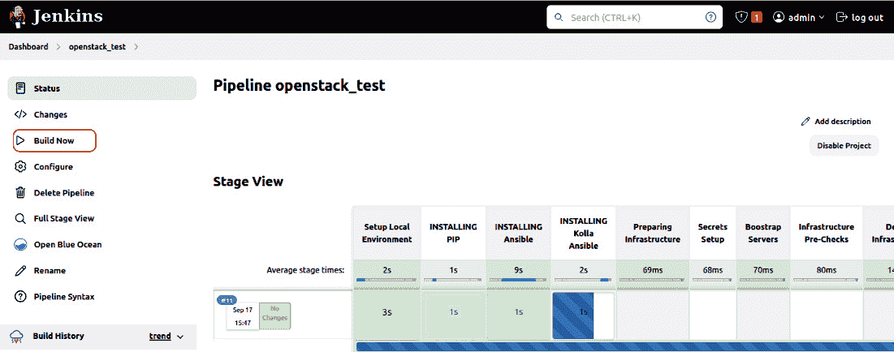
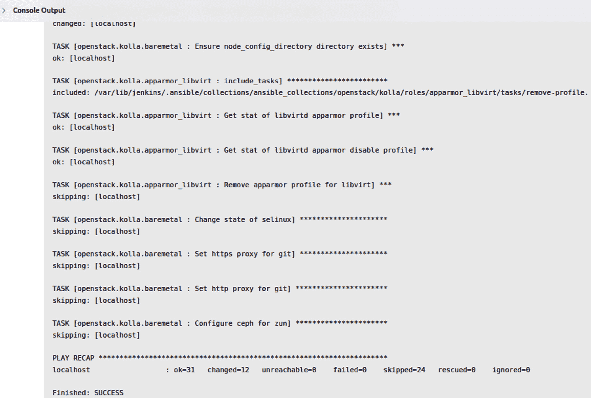

# 2

# 启动 OpenStack 设置 – 正确的方式（DevSecOps）

“困难中蕴藏着机遇。”

——阿尔伯特·爱因斯坦

如前一章节所述，OpenStack 生态系统呈现了各种设计模式，并提供了硬件和工具的选择，用于部署强大的私有云设置。随着 Antelope 版本的发布，核心架构系统没有发生重大变化，但一些部分进行了更新，并增加了一些新功能。这也带来了部署和操作阶段复杂度的增加。好消息是，自 OpenStack 最早的版本以来，社区已经创建了不同的方法，以避免繁琐的 OpenStack 操作体验。这个任务的关键机制是*自动化*。毫无疑问，如果忽视了自动化的实现，会面临无休止的故障排除风险。像 Puppet、Ansible、Chef 等供应商维护了多个工具，这些工具已在成千上万的生产环境中使用。搭建一个 OpenStack 系统并不是旅程的最终目标，而是部署过程本身。我们将利用自动化和敏捷工具，通过采用 DevOps 路径，将 OpenStack 的运维提升到一个新水平。虽然这听起来是朝着强大部署过程迈出的惊人一步，但如果从部署初期就没有将安全性纳入考虑，这个过程仍然是不完整的。开发和运维基础设施的流程应当重新构思，从 DevOps 的视角转变为 DevSecOps 的视角。

本章介绍了 OpenStack 私有云设置未来部署和运维流程的骨干，涵盖以下主题：

+   重新审视 OpenStack 部署生命周期背后的 DevOps 哲学

+   重新思考 DevOps，并引入 DevSecOps 以查看它如何适应我们的旅程

+   探索将 OpenStack 部署到容器中的现代方法

+   迭代自动化工具并为部署做好准备

+   通过持续集成/持续交付（CI/CD）工具运行 OpenStack 部署的第一次迭代

+   通过代码和持续集成/持续交付（CI/CD）管道为大规模部署做准备

+   在每个部署步骤中以自动化方式集成安全检查

# 打破壁垒 – DevOps

**DevOps** 这个词汇已经出现了将近十年，推动了组织重新思考如何构建内部团队，以实现 DevOps 所承诺的目标。关于 *DevOps* 的定义随处可见，但它可以简单地总结为一个 *打破孤岛* 的方法。DevOps 提出了将软件产品的主要贡献者——包括运维人员、测试人员和开发人员——聚集在同一张桌子旁的理念。该运动的目标基于几个原则，激励组织在实践中实施它们——知识和责任共享、尊重、自动化一切、持续监控、接纳失败和设计可重用性。然而，DevOps 从来不是一个工具或软件，而是一组定义过程和工作流的原则，旨在提高公司的生产力。这个运动的亮点可以追溯到最简单的定义—— *打破孤岛*。由于运维人员和开发人员不再受隔阂的限制，更多的协作和知识在朝着同一个目标——以最高的质量和效率减少市场上市时间——共享。没有许多工具的存在，将这个理念付诸实践将会更加困难。**持续集成**（**CI**）和**持续交付**或**部署**（**CD**）工具就是体现这一理念的重要例子。另一类将更多信任交给机器而非人类的工具是 *自动化* 的概念。CI/CD 工具将所有手动和常规的构建、测试和部署阶段交给服务器上运行的几个流水线来处理。与此同时，团队可以专注于更有趣、更具商业价值的任务。云时代的崛起带来了另一套巨大的机会，通过自动化加速软件开发周期——**基础设施自动化**。这是 OpenStack 一些服务（如 **Heat**）关注的领域之一。将 **基础设施即代码**（**IaC**）的理念付诸实践，激励 Dev 和 Ops 团队将传统软件开发生命周期中的知识应用到基础设施层面。

不再是 *那不是我的事*，而是 *这也是我的事*。真正重要的是专注于在合理的时间内交付商业产品，更快地进入市场，并在与竞争对手的赛跑中不落后。这可以通过以下图示中展示的 DevOps 工具链来总结，用于跨 Dev 和 Ops 阶段的不同软件部署：


图 2.1 – DevOps 工具链

通过采纳相同的理念，我们将部署我们的 OpenStack 私有云。但在达到这一阶段之前，我们需要承认一个重要的事实——在应用 DevOps 的要求时，并没有放之四海而皆准的法则。组织中的团队结构可能会有所不同，IT 领域可以根据职能分布在多个专门的工作小组中，或者合并为一个团队。在没有重新分配和重构团队结构、寻找主题专家、基于专业知识配备跨职能团队成员等情况下，追求*DevOps 幸福*可能会让人感到困惑。由于在安全性和合规性方面的空白，一些问题暴露了出障碍。接下来的部分我们将揭示这些问题，然后将 OpenStack 的各个部分拼接起来。

# 向左转——DevSecOps

DevOps 哲学的**十亿美金**理念就是将人们聚集在一起——包括运营（Ops）、开发（Devs）以及**质量保证**（**QA**）等各个领域。组织应该明确指出在所有产品贡献者之间出现的各个“孤岛”。这应该包括安全领域，确保他们能够在敏捷工作方式中得到体现。*2021 年 DevSecOps 现状*研究（[`www.securitycompass.com/reports/2021-state-of-devsecops/`](https://www.securitycompass.com/reports/2021-state-of-devsecops/)）由网络安全咨询服务公司*Security Compass*发布，研究表明，75%的受访者（IT 专业人员和 DevOps 从业者）同意安全性会延缓产品发布流程，从而导致上市时间的增加。这与 DevOps 的初衷背道而驰。过分注重市场速度可能会忽视安全性。这样的*牺牲*在一些大型企业中引发了一些可怕的统计数据，这些企业在数据泄露或网络安全攻击的数量上出现了增加。将安全性视为反应性而非主动性的问题来处理，每一次安全事件的处理都会带来预算和时间的成本。造成网络安全和 DevOps 处于两个不同“孤岛”的主要原因有几个——开发过程中需要更多的手动安全干预和对工具的了解不足。投资安全是为了遵守标准并获得信任。为了追求市场速度而牺牲安全，最终肯定会导致后续的重大损失。这就引出了下一个需要在 DevOps 与安全之间建立的桥梁，形成一个 DevSecOps 联盟。正如开发和运营已经融合一样，安全性不应再被视为事后的考虑。DevOps 的原则可以被继承，以使安全融合成为可能。这就是为什么 DevSecOps 成为了一种新趋势。想象一下，整个安全压力在各个领域得到缓解，所有部门都指向相同的产品目标，并配备了自动化和更快速的反馈。

我们可以总结出未来 OpenStack 部署的正确方法——在流程的不同阶段加入安全性的 DevOps，如下所示的工具链。


图 2.2 – 将安全性整合到 DevOps 工具链中

部署像 OpenStack 私有云这样复杂环境的实现需要采用 DevSecOps 方法，下一节将介绍一些最佳实践。

## 云安全 – 与 DevSecOps 一起前进

采用 DevOps 实践无疑是保持市场竞争力、提高生产力并带来创新新可能的重要举措。相反，缺乏安全性将使任何产品面临失去信任和失败的风险。因此，必须加强 DevOps 链条，确保安全性和合规性。DevOps 的一个基本方面是自动化和可重用性。在基础设施的背景下，我们面对的不是 *宠物* 而是 *牲畜*。*宠物和牲畜* 类比是一种著名的比喻，指的是将本地服务器称为 *宠物*。如果该宠物服务器发生任何变化、更新或故障，就会引发问题。它们是基础设施中长期存在、不可或缺的部分，需要更多的关怀。另一方面，*牲畜* 指的是云等大规模按需环境中的服务器。牲畜的故障不应妨碍业务的运行，牲畜可以 *立即* 被替换。如果我们采用 *牲畜* 类比，云中的服务器应该被设计成不可更改的。这就是基础设施即代码（IaC）发挥作用的地方。通过一个单一的真实来源和共享管道，*安全* 部分更容易与 *DevOps* 流程融合。拥有这一能力后，将安全性从右侧移到左侧变得更加可行。

## DevSecOps 与 OpenStack

部署复杂的 OpenStack 生态系统的挑战通过 DevOps 变得更加简易，但作为云服务提供商，不能忽视的是保护运行用户工作负载的第一层。正如我们将在本节的下一部分探讨的那样，从代码部署完整的 OpenStack 环境有多种方法。在开始考虑代码结构之前，强调安全性是至关重要的，以免错失 DevSecOps 的机会。一般来说，任何为应用基础设施设计的代码都有可能存在漏洞。尽管 OpenStack 服务的不同模块在开发时已经考虑到了安全性，但在特定网络架构中配置和参数化的无数种方式都应在每个阶段进行安全性异常测试。在任何工作负载部署到 OpenStack 基础设施上之前，云本身必须做好安全控制，并符合主要标准。

# 编写云代码

处理 OpenStack 环境时，最大的挑战之一就是如何处理其部署和日常运维。如果你考虑手动部署，即使是一个小型环境，那么很可能你的 OpenStack 管理流程，包括更新，都将面临不可避免的困难。这时，DevSecOps 实践就派上用场了，其基本口号是 IaC。一个一致的方法是将 OpenStack 生态系统视为代码。好消息是，OpenStack 代码会随着每个稳定版本发布，并且一旦配置和定制好，就可以准备好部署了。但在我们掌握技术部署之前，我们应该考虑一些常见的注意事项来开始构建我们的工具链：

+   将每个 OpenStack 服务映射为每个模块的代码。

+   定义目标系统来运行具有一个特定角色或多个角色的 OpenStack 服务。例如，定义一个计算角色，并部署 Nova 服务。

+   草拟每个服务（角色）的初始配置。

+   将角色视为可重用的代码，可以在不同的目标环境中部署。

+   确保在角色设置之间集成功能测试阶段。

+   从一开始就考虑安全规则和工具的集成。将每个指定的工具映射到管道的每个阶段，从编码到发布阶段。

+   避免 *Big Bang* 编码实践，并以自动化持续部署的方式实现更小的变更。

+   准备持续监控以下部署指标：

    +   **部署频率**：IaC 部署的频率（每日/每周/每月）

    +   **变更交付时间**：从代码提交时开始到成功部署的时间窗口

    +   **变更失败率**：导致系统损坏或停机的提交 IaC 变更的总百分比（包括热修复和回滚）

    +   **修复平均时间**（**MTTR**）：从服务中断开始到恢复服务所需的时间

+   使用基于 trunk 的开发方法来促进代码监控变更，并增加安全性可视化集成。

重要提示

基于 trunk 的软件开发是一种编码实践，允许开发人员定期将变更合并到公共的 trunk 代码库中。基于 trunk 的实践要求更频繁的代码发布，并进行较小的变更。

接下来的部分将介绍用于以 DevSecOps 风格部署 OpenStack 环境的不同工具。

# 在云端部署

自从 OpenStack 首次发布以来，已经开发了多种部署工具和包装器，帮助 OpenStack 操作员以更增强、更简便的方式设置完全运行的 OpenStack 环境。随着 Chef、Puppet、SaltStack 和 Ansible 等系统管理工具的兴起，OpenStack 社区已经为每个系统管理工具设立了不同的渠道，通过 OpenStack 生态系统的演变开发不同的类和模块。我们选择这些工具中的哪一个，取决于熟悉程度或云操作员的技术要求。在本节中，我们将使用 Ansible 作为系统管理工具。

## Ansible 简介

与其他任何系统管理工具一样，Ansible 使用自己的词汇和术语来定义基础设施组件、模块、关系和参数。相反，与其他工具不同，Ansible 拥有简单的架构设置，这使得它成为一种流行的选择，可以总结如下：

+   它具有处理相互依赖的复杂服务模块的灵活性。

+   它使用无代理传输机制连接和更新目标系统，无需安装额外的软件包。它仅暴露运行 Ansible 软件的 *主* 服务器。

+   在目标系统上执行的模块安装后会自动清理。

+   它拥有丰富的核心自动化模块，以扩展更多功能。

+   用 YAML 编写的基础设施代码被组织在 Ansible playbooks 中。YAML 比其他语言（如 Chef 的 Ruby）更容易学习和掌握。

+   由于 Ansible 架构的简单性，扩展性比其他需要运行代理的工具更容易实现。

+   作为一种声明式编程方法，它专注于描述期望状态的输出，而不是深入探讨如何实现这一目标以及必须采取哪些步骤才能达到预期的输出。

在处理复杂的 OpenStack 生态系统时，考虑到其中的所有组件、子组件和参数类型，了解 Ansible 术语的基本概念至关重要：

+   **Playbooks**：这些由描述在一个或一组主机上运行一系列操作的主要配置文件组成。任务以 YAML 编写，并按照从上到下的顺序执行，以完成全面部署或配置更改。

+   **角色**：这些通过收集不同的 Ansible 资源（如任务、变量和模块）来呈现 playbooks 的组织结构，以便在一个或一组主机上部署服务。

+   **模块**：这些是特定代码功能单元的抽象表示。模块可以编写和定制，以控制系统资源、文件和服务。Ansible 附带了一些模块，称为模块库（核心模块），可以通过定制的 playbooks 执行。

+   **变量**：这些是用于角色和 playbook 中的动态值，用来反映所需的配置。类似于编程语言中的变量，Ansible 变量通过相同的角色或 playbook 使不同的状态在不同环境中传播。

+   **库存**：这是目标环境中已管理主机的列表。Ansible 使用 **INI** 格式的配置文件，定义了已管理目标主机的名称和 IP。可以通过不同的模式在库存文件中声明主机，或通过角色嵌套主机，或通过组合和数字模式指定一系列主机。

CI/CD 系统触发 Ansible 安装并在其库存中定义的目标 OpenStack 节点上运行 playbook，如下图所示：


图 2.3 – 通过 Ansible 管理 OpenStack 环境

在 OpenStack 生态系统生命周期管理中集成 Ansible 等系统管理工具，带来了对如此复杂生态系统管理和操作方式的重大变革。毫不奇怪，快速迁移到采用私有云设置并最大化其部署灵活性的需求，带来了其他挑战。这引出了 OpenStack 服务之间依赖关系的根本原因。从长远来看，开发新的 OpenStack 版本和将新功能集成到现有环境中，成为私有云操作任务的终极挑战之一。推动大规模升级一直是顺利迁移到新 OpenStack 版本时的障碍，尤其是在生产环境中运行时。这使得升级操作变得非常谨慎，并且如果其中一个或多个依赖项因版本兼容性问题崩溃，可能会让你的**服务级别协议**（**SLA**）面临风险。尽管测试可以帮助识别此类异常，但每个组件需要提前进行大量的测试，这在资源和人工互动上会非常昂贵。另一个方面的挑战是缺乏回滚机制。回滚一个导致问题的更改必然会导致系统的某些部分或整个系统崩溃，因为你需要等待管理工具重新部署、重启受影响的服务、测试并等待其他依赖服务之间的完全同步，才能重新运行它们。最常见的 OpenStack 部署选项包括裸金属机器或虚拟机，使得此类操作任务更加复杂，需要全面管理机器镜像，并且在隔离环境中进行测试时会增加成本。例如，升级或更新 OpenStack 组件版本时，需要在不同的测试环境中部署所有相互依赖的服务，然后再在生产环境中传播更改。在最新的 OpenStack 版本中，一些组织已经开始尝试使用容器化的方式构建完全容器化的 OpenStack 云。让我们在下一节解锁容器难题，探索 OpenStack 部署和管理的潜在机会。

## 容器化云计算

容器技术已经存在超过十年，企业开始将工作负载部署到容器中，以便利用资源优化、环境隔离和可移植性。将软件的不同部分运行在轻量级、自包含和独立的容器中，为管理复杂的软件系统带来了更大的灵活性。在隔离模式下运行时，像升级和回滚这样的操作变得更加容易，并且可以更有信心地执行。

通过参考我们的基础设施代码，我们可以看到 OpenStack 软件架构的模块化设计的优势，利用容器技术，每个模块可以在一个独立、无状态的环境中运行。通过查看当前容器趋势，可以找到一系列容器和编排引擎，如 LXC、Docker 和 Kubernetes。OpenStack 社区没有错过容器化技术的早期采用机会，尤其是在容器开始成为现代软件开发标准时。在 Antelope 及后续版本中，我们可以找到多种基于容器的部署方法，这些方法结合了配置管理工具，具体总结如下表：

| **部署项目** | **容器** | **项目** | **来源** |
| --- | --- | --- | --- |
| OpenStack-Ansible | LXC | Ansible | [`docs.openstack.org/openstack-ansible/latest/`](https://docs.openstack.org/openstack-ansible/latest/) |
| Kolla-Ansible | Docker | Ansible | [`docs.openstack.org/kolla-ansible/latest/`](https://docs.openstack.org/kolla-ansible/latest/) |
| OpenStack-Helm | Docker | Kubernetes 和 Helm | [`docs.openstack.org/openstack-helm/latest/`](https://docs.openstack.org/openstack-helm/latest/) |
| Triple-O（目前不再支持） | Docker | Ansible | [`docs.openstack.org/tripleo-ansible/latest/`](https://docs.openstack.org/tripleo-ansible/latest/) |

表 2.1 – 运行容器的 OpenStack 部署工具列表

**OpenStack-Ansible** (**OSA**) 项目是基于 LXC 容器最广泛使用的部署之一。运行 OpenStack 服务的 LXC 容器的部署由 Ansible 进行编排。

在我们的下一个部署中，我们将采用另一个新兴的 OpenStack 项目，名为**Kolla-Ansible**。与 OSA 类似，Kolla 项目使用 Docker 作为容器化工具，为每个 OpenStack 服务构建一个 Docker 容器。除了 LXC 和 Docker 之间的设计差异外，Kolla 扩展了参数化布局，使其容器更加可配置，提供了基础操作系统和模板引擎之间的一系列选择。更不用说 Docker 作为容器技术的设计优势，其镜像的分层特性、版本控制和便于共享的可移植性。

重要说明

Kolla 自 Liberty 版本以来正式集成进 OpenStack 子项目。根据 OpenStack 官方对 Kolla 项目的定义，*“Kolla 的使命是提供用于操作* *OpenStack 云的生产就绪容器和部署工具。”*

这些额外的优势使得 Docker 更适合我们的部署管道，在这个管道中，我们将处理作为工件的容器服务，该工件可以通过不同的环境轻松部署，然后再推广到生产环境。如以下高层次架构图所示，对于每次合并的代码库变更，CI/CD 工具会构建一个由封装在 Docker 镜像中的软件包组成的工件。生成的镜像将被提交到私有 Docker 注册表，Ansible 会下载该镜像并在指定的 OpenStack 节点中进行部署。


图 2.4 – 高层次 CI/CD 管道 OpenStack 部署

部署工具栈的另一个组件是**Jinja2**模板工具。它主要由 Docker 用于基于 Ansible 生成的定义参数动态分配变量。Jinja2 主要设计用于 Dockerfile，以支持 RPM 和 DEB 容器分发版的完整系统调用接口兼容性。

重要提示

在 Kolla 环境中使用 Jinja2 模板提供了多种构建不同源分发的 Docker 镜像的方法，包括 CentOS、Debian、Fedora、Ubuntu 和 RHEL 容器操作系统，这些镜像可以按 OpenStack 服务代码进行参数化配置。

由于我们的主要目标是解决依赖关系的复杂性，并提供更简单、更具可扩展性的开发体验，Kolla 是最佳选择。事实上，自从 Kolla 正式发布第一个稳定版本以来，已经有多个生产环境的部署按照 Kolla 方式进行。

## 构建图像

将 OpenStack 部署视为 IaC 将帮助我们继承并使用大多数软件工具和流程，以更有信心地交付准备好的代码工件以进行部署。拥有强大的集成和部署管道对于确保我们的软件定义数据中心在生产日不发生故障至关重要。现代软件开发技术涉及多个工具，这些工具提高了自动化和敏捷性，从而加快了每次部署之间的反馈。

以下工具将用于我们的 OpenStack 基础设施代码开发：

+   **版本控制系统**：GitHub 将作为我们 OpenStack 基础设施代码的代码库。

+   **CI/CD 工具**：Jenkins 将安装在部署机上，并提供额外的插件来构建和运行部署管道。

+   **系统管理工具**：Ansible 包将安装在部署机上，并提供要在容器内部署的 OpenStack 剧本，与 Kolla 一起使用。

+   **镜像构建器**：专门用于 OpenStack 容器，Kolla 构建运行不同 OpenStack 服务的容器镜像。

Kolla-Ansible 项目的代码库将作为我们首次 OpenStack 部署的起点，最小化定制以便最初拥有一个滚动部署管道。该项目代码的最新稳定主分支可以在此找到：[`github.com/openstack/kolla-ansible`](https://github.com/openstack/kolla-ansible)。

Kolla-Ansible 支持一体化和多节点的 OpenStack 设置。由于我们目标是生产设置，如 *第一章*《重新审视 OpenStack - 设计考虑》中的初步设计草案所讨论的，我们将确保我们的初步草案准备好进行首次部署迭代。

# 设置开发环境

设置一个模拟生产环境的开发环境是强烈推荐的，以确保在开发阶段更快速地反馈，并在将代码推向生产设置之前修复任何异常。虽然将服务运行在容器中增加了在生产环境中检测到问题后回滚的灵活性，但最佳实践是通过不同的部署和测试阶段在隔离环境中运行服务容器，采取主动措施。在测试环境中成功部署后，服务容器将被提升并标记为可用于生产部署。

根据开发环境将投入多少台物理机器，DevSecOps 团队将要求为每个成员提供一个隔离的环境，以便在将其更改提交到主要开发分支之前进行测试，该分支目标是在开发环境中进行部署。

## 准备本地环境

Vagrant 是由 HashiCorp 创建的一种革命性工具，可以通过简单的 Vagrant 命令行创建、修改和管理可视化环境。Vagrant 的另一个令人兴奋的部分是通过它来管理本地开发环境。Vagrant 配置高度可定制，支持多种本地虚拟化软件运行虚拟机，如 VirtualBox、HyperV 和 VMware。

我们的下一个设置将考虑本地 VirtualBox 环境，具体取决于你的开发操作系统机器；大多数 Linux、Mac 和 Windows 发行版都被支持，可以在这里找到：[`www.virtualbox.org/wiki/Downloads`](https://www.virtualbox.org/wiki/Downloads)。

安装 VirtualBox 后，下载 OpenStack 环境将运行的基础镜像。对于 Vagrant 中的 VirtualBox 开发，最佳实践是开发环境和生产环境使用相同的操作系统发行版。在接下来的设置中，选择的操作系统是 Ubuntu **22.04 LTS**。在以下的向导中，我们将逐步准备 Vagrant 文件，准备开始部署本地 OpenStack 环境：

1.  通过执行以下命令行生成 Vagrant 文件：

    ```
    # vagrant init
    ```

1.  修改 **box** 配置段，通过提供操作系统镜像来进行配置：

    ```
    Vagrant.configure("2") do |config|
      config.vm.box = "generic/ubuntu2204"
    end
    ```

重要提示

可以通过备份任何操作系统的镜像来在本地创建 Vagrant box，使用的工具如 **Packer**。Vagrant box 可以在 Vagrant 云库中共享，并标记版本，详细信息请参见：[`developer.hashicorp.com/vagrant/vagrant-cloud/boxes/create`](https://developer.hashicorp.com/vagrant/vagrant-cloud/boxes/create)。

1.  本地开发机器应具备最低硬件规格，如 RAM 和 CPU，以支持 OpenStack 环境的最小配置，具体配置请参见以下 Vagrant 配置段：

    ```
    config.vm.provider :virtualbox do |vb|
       vb.memory = 8096
       vb.cpus  = 4
    end
    ```

1.  在新的 **box** 配置段行中，将虚拟磁盘空间设置为至少 50 GB：

    ```
    Vagrant.configure("2") do |config|
     ….
       config.disksize.size = "55GB"
    ```

重要提示

确保已安装 **vagrant-disksize** 插件，可以通过运行以下命令行来安装：**vagrant plugin** **install vagrant-disksize**。

1.  可选地，添加一个同步文件夹，将开发机器上的 OpenStack 基础设施代码同步：

    ```
    Vagrant.configure("2") do |config|
      ….
        config.vm.synced_folder(
           "openstack_deploy/", "/openstack_deploy/"
        )
    ```

重要提示

确保本地机器中的同步文件夹存在，可以通过创建 **openstack_deploy** 文件夹来实现。

1.  可以配置网络以转发端口访问，允许从开发机器到来宾 box 特定服务的访问。例如，访问 OpenStack Horizon 需要将端口 **80** 从来宾机器进行端口转发，可以按以下方式调整：

    ```
    Vagrant.configure("2") do |config|
    ...
       config.vm.network :forwarded_port, guest: 80, host: 80
    ```

1.  通过执行以下命令行来启动 Vagrant box：

    ```
    # vagrant up --provider virtualbox
    ```

1.  一旦启动且没有错误，Vagrant box 就可以访问了。默认的登录使用的是 Vagrant 用户，可以提升为 root 以继续进行下一步设置：

    ```
    # vagrant ssh
    # sudo -i
    ```

一旦 Vagrant box 启动并运行，您应该能够开始安装部署一体机 OpenStack 环境所需的软件包。

## 运行本地云

Kolla-Ansible 项目代码包含了多种在一体机或多节点上安装 OpenStack 的方式。作为基础设施代码的一部分，我们将调整一些设置，以便在开发机器上运行一体机模式。但首先，我们需要在本地开发主机上安装 Git 包：

```
$ apt-get install git
```

将 OpenStack-Kolla 仓库克隆到先前设置的本地文件夹中。Vagrant 配置文件将使对本地文件夹 **openstack_deploy/** 的任何更改对来宾 box 可见。理想情况下，克隆仓库应从您选择的本地 Git 服务器进行。在此示例中，使用了一个私有 Git 仓库（**ci.os**）。以下命令克隆运行在 CI/CD 实例上的本地仓库：

```
$ git clone https://git@ci.os/git/openstack_deploy/openstack_deploy
```

重要提示

这里有一个简单的指南，可选地设置一个本地 Git 服务器，运行 NGINX，并使用最新版本的 Ubuntu：[`www.howtoforge.com/tutorial/ubuntu-git-server-installation/`](https://www.howtoforge.com/tutorial/ubuntu-git-server-installation/)。本地 Git 服务器使用从 Kolla-Ansible 仓库克隆的最新稳定主分支：[`github.com/openstack/kolla-ansible.git`](https://github.com/openstack/kolla-ansible.git)。

可选地，从主分支创建你的开发分支，以便在将本地更改推送到下一个开发分支之前进行追踪：

```
$ git checkout -b local_dev_branch
```

重要提示

理想情况下，应在你选择的专用开发分支中进行更改，然后再将更改合并到主分支中。

登录到你的 Vagrant box，并继续安装环境依赖项并创建虚拟环境。确保更改来宾主机上环境的路径：

```
# apt-get update
# apt-get install python3-dev libffi-dev gcc libssl-dev
# apt install python3-pip
# apt install python3-virtualenv
# python3 -m venv local
# source local/bin/activate
(local)# pip install -U pip
```

安装 Ansible。确保安装至少 2.16 版本：

```
# pip install  'ansible-core>=2.16,<2.17.99'
```

安装 **kolla-ansible** 运行时：

```
#  pip install git+https://opendev.org/openstack/kolla-ansible@master
```

从 OpenStack Yoga 开始，需要安装一些额外的依赖项，可以通过运行以下命令行来解决：

```
# kolla-ansible install-deps
```

Kolla-Ansible 仓库包含两个我们需要编辑的关键文件来运行本地部署——**globals.yml** 和 **passwords.yml**。将这些文件复制到你选择的目录中（该目录可以新建），并确保运行中的来宾用户拥有这些文件：

```
# mkdir -p /etc/kolla
# chown $USER:$USER /etc/kolla
# cp -r /local/share/kolla-ansible/etc_examples/kolla/* /etc/kolla
```

**globals.yml** 文件包含了多个设置和可调配置，适用于不同的 OpenStack 控制平面服务以及共享服务。作为我们最小化测试环境的一部分，我们将在 **/** **etc/** **kolla/** 文件夹下的复制 **globals.yml** 文件中编辑以下设置：

+   使用 Ubuntu 作为容器的基础 Linux 发行版：

    ```
    kolla_base_distro: "ubuntu"
    ```

+   确保 HAProxy 不在我们初始设置的测试环境范围内：

    ```
    enable_haproxy : "no"
    ```

+   选择要分配给所有类型 OpenStack 网络的网络接口名称：

    ```
    network_interface: "eth0"
    ```

+   为 Neutron 外部网络分配一个专用接口：

    ```
    neutron_external_interface: "eth1"
    ```

+   分配一个 Keepalived 浮动 IP，这应该保留作为 HA 的虚拟 IP：

    ```
    kolla_internal_vip_address: 172.28.128.47
    ```

+   **passwords.yml** 文件集中存储所有 OpenStack 相关用途及其他服务的密码。为了通过一条命令生成随机密码集，而不是手动为每个密码生成，Kolla 提供了一个简单的命令工具来生成密码，这些密码将在部署过程中使用，如下所示：

    ```
    # kolla-genpwd  -p /etc/kolla/passwords.yml
    ```

    确保将生成的密码保存在你自定义目录下的 **passwords.yml** 文件中。

另一个关键文件位于**inventory**文件夹中，描述并指示 Kolla-Ansible 哪些主机将是应用配置的目标。库存文件使用 Ansible 主机组格式定义，可以根据可用主机和分配的角色进行自定义。默认的可用文件设计用于运行所有-in-one 和多主机的库存。要运行干净的主机目标设置，请复制**inventory**目录下的文件：

```
# cp -r  /local/share/kolla-ansible/ansible/inventory/*  /etc/kolla/
```

对于我们的开发设置目的，all-in-one Ansible 库存文件不需要任何更改。该文件的格式非常简单，每个主机角色部分描述主机的名称或 IP 地址。对于本地测试环境，所有主机角色将配置为**localhost**，如以下片段所示：

```
[control]
localhost       ansible_connection=local
[network]
localhost       ansible_connection=local
[compute]
localhost       ansible_connection=local
[storage]
localhost       ansible_connection=local
….
```

执行**kolla-ansible**命令行以安装引导服务器。该命令将对库存文件中分配给每个主机角色的主机运行 Ansible playbook。到目前为止，所有角色都汇集在同一个 localhost 上：

```
# kolla-ansible -i /etc/kolla/all-in-one bootstrap-servers
```

以下是输出结果：


图 2.5 – kolla-ansible 引导服务器输出

可选地，运行一些部署检查，以密切监控引导过程并检测可能的失败：

```
# kolla-ansible -i /etc/kolla/all-in-one prechecks
```

这是输出结果：


图 2.6 – kolla-ansible 预检查输出

一旦引导过程完成且没有检测到任何失败，即可执行 OpenStack 环境的部署，这将需要较长时间来创建所有容器服务并将其链在一起：

```
# kolla-ansible -i  /etc/kolla/all-in-one deploy
```

这是输出结果：


图 2.7 – kolla-ansible 部署输出

重要说明

Ansible 部署将应用 playbook 和 OpenStack 角色，使用来自默认 OpenStack Docker 仓库的容器镜像。对于下一个开发阶段，请确保构建并推送更多镜像到本地仓库。接下来的章节将讨论如何为不同服务构建本地容器镜像并进行本地管理。

OpenStack 容器的最小部署设置应在**kolla-ansible deploy**命令行结束时没有任何失败。以下的 Docker 命令行列出了在前一步部署中所有正在运行的容器，这些容器应被视为健康。某些容器仍在与其他系统服务进行通信，这将需要几分钟时间，才能开始评估 OpenStack 服务：

```
# docker ps
```

这是输出结果：


图 2.8 – 正在运行的 OpenStack 服务容器列表

让我们通过运行客户端测试命令来查看 OpenStack 是否在容器中运行。要进行快速测试，请安装 OpenStack 客户端包：

```
 # pip install python openstackclient
```

要与 OpenStack API 服务交互，必须使用管理员凭据，这些凭据可以通过 **kolla-ansible 后部署** 命令生成，如下所示：

```
# kolla-ansible post-deploy
```

以下是结果：


图 2.9 – kolla-ansible OpenStack 部署后的输出

上述命令将生成 **cloud.yaml** 文件，该文件包含与 OpenStack 服务交互的不同 OpenStack 管理员凭据。文件变量的内容可以通过导出生成的 **cloud.yaml** 文件的路径来填充，如下所示：

```
# export OS_CLIENT_CONFIG_FILE=/etc/kolla/cloud.yaml
```

通过列出正在运行的 OpenStack 环境，例如 **nova** 主机，来验证环境：

```
# openstack hypervisor list
```

以下是输出结果：


图 2.10 – OpenStack 主机列表输出

可以通过 Docker 容器命令行接口轻松管理 OpenStack 服务。例如，可以通过运行以下命令查看 Keystone 容器服务日志：

```
# docker logs keystone
```

另一种检查 OpenStack 服务容器并返回容器信息（例如 IP 地址和网络设置）的方法，可以通过使用通用的 **docker inspect** 命令行来执行，如下所示：

```
# docker inspect keystone
```

尽管容器的使用灵活性和几乎可以在短时间内销毁并重建新容器的简便性，但在某些情况下，您可能需要通过 shell 访问调查特定的 OpenStack 服务问题或配置，如下所示：

```
# docker exec --it nova /bin/bash
```

一体化设置有助于在本地开发和测试代码。更大的环境，包括预发布和生产环境，将需要扩展设置，具体内容将在下一节中详细说明。

## 扩展部署

扩展我们在*第一章*中讨论的初步物理设计，*重访 OpenStack – 设计考虑因素*，将需要评估不同的硬件规格和为所选设计提供的选项。随着我们逐步确定部署方式和构建首个生产版本所需的不同工具集，我们将开始将 OpenStack 组件的角色划分到不同的物理系统上。与测试环境不同，生产环境应遵循良好的架构设计模式，基于服务隔离、容错性、可扩展性和每层的冗余性。我们将在*第三章*中深入探讨这些架构方面的扩展，*OpenStack 控制平面 – 共享服务*，以及*第七章*中，*运行高可用云 – 满足* *SLA*。

如果考虑通过最小化的全一体测试环境到仿真生产环境的所有阶段，我们的部署流水线将是部署任何环境的真相源，如果管道测试的所有阶段（包括安全阶段）都以 0 个错误执行，则将其提升为生产环境。

重要提示

在 OpenStack 环境的每个控制平面和数据平面至少达到最低冗余级别之前，请确保不要引入任何用户生产工作负载。有关扩展到高可用设置的详细信息将在*第七章*讨论，*运行高可用云 - 满足 SLA*。

环境的部署扩展应采用增量方法，在可行时分割角色，并应考虑某些服务可以选择在其自己的物理服务器上分离。一个良好的实践是在核心服务滚动后并在每次迭代中获取更多操作经验后开始分割附加角色的物理布局。随着部署流水线反馈每个新部署的状态，将需要做出更多技术决策以引入对物理基础架构布局的改进，并且您可以选择在下一次迭代中将哪些服务移动到它们自己的服务器上。为了安全地开始部署旅程，我们将需要在继续进行基础设施部署之前安装和配置我们的部署程序。

## 安装部署程序

我们的部署程序主机将安装以下软件和硬件设置：

+   **软件**：

    +   Jenkins 版本 2.414.1

    +   Docker 版本 1.12.6 或更高版本

    +   Ansible 2.3.1 或更高版本

    +   Docker Python 1.10.0 或更高版本

    +   Kolla-Ansible 16.1.0-16 - OpenStack Antelope 版本或更高版本

    +   Git 版本控制

    +   **操作系统**：Ubuntu 22.04 LTS

    +   pip 和 Python 依赖项，包括**python-dev**

+   **硬件**：

    +   **CPU**：至少 4 个 CPU 核心和 64 位 x86

    +   **内存**：至少 4 GB 的 RAM

    +   **磁盘空间**：至少 50 GB 的可用磁盘空间

    +   **网络**：至少两个网络接口

首先通过更新本地系统和 Java 运行时来安装 Jenkins：

```
$ sudo apt-get update
$ sudo apt install openjdk-11-jdk
```

为 Jenkins 存储库文件添加所需的 GPG 密钥：

```
$ curl -fsSL https://pkg.jenkins.io/debian-stable/jenkins.io-2023.key | sudo tee /usr/share/keyrings/jenkins-keyring.asc > /dev/null
```

以下命令将定位本地系统存储库以下载 Jenkins 的最新版本：

```
$ echo deb [signed-by=/usr/share/keyrings/jenkins-keyring.asc]
https://pkg.jenkins.io/debian-stable binary/ | sudo tee 
/etc/apt/sources.list.d/jenkins.list > /dev/null
```

运行更新**apt**软件包列表并安装 Jenkins：

```
$ sudo apt update
$ sudo apt install jenkins
```

确保 Jenkins 正在运行，通过执行以下命令：

```
$ sudo systemctl status jenkins
```

如果 Jenkins 守护程序未运行，请发出**start**命令启动其进程：

```
$ sudo systemctl start jenkins
```

一旦 Jenkins 服务启动运行，通过默认**8080**端口在浏览器中指向 CI/CD 服务器地址以访问用户界面，然后继续进行服务器的初步设置：


图 2.11 – Jenkins 首页

首先，我们需要在构建流水线之前添加一些插件，从**Git SCM** 插件开始。为此，点击左上角的**管理 Jenkins**选项卡。在**可用插件**标签页的搜索框中输入**git**，然后点击**安装** **（无需重启）**：


图 2.12 – Jenkins Git SCM 插件设置

一旦安装了 Jenkins 和其所需的插件，我们就可以继续配置 CI/CD 流水线和不同的阶段，以便进行未来的部署。

## 执行部署操作

我们的 Jenkins 文件可以提交到仓库中。SCM 流水线将使用配置的路径运行作业定义。Jenkins 流水线定义可以在高层次上总结为以下步骤：

1.  在目标测试主机上创建本地测试环境。

1.  从定义的分支中检查仓库。

1.  安装所需的测试包，包括**kolla-** **ansible** 和 Docker 运行时。

1.  初始化引导服务器脚本。

1.  在引导的测试环境上运行 Kolla 预检查。

1.  部署 OpenStack 测试环境。

重要提示

根据您计划通过 CI/CD 流水线运行的目标环境，请确保在每个环境中分别调整主**globals.yml**和**inventory.yml**文件的配置布局。每个环境都应该使用专门的 Jenkins 流水线文件运行。

下一步是为测试环境创建我们的第一个流水线。Jenkins 提供了多种选项来创建作业流水线定义，可以通过用户界面向导，或直接创建一个 Jenkins 文件，将其放在 OpenStack 基础设施的代码仓库主目录中。为此，我们的第一个作业定义将采用 SCM 方法。以下代码片段定义了 Jenkins 部署流水线，从第一阶段开始，在该阶段，将创建一个虚拟的 Python 环境来运行每个构建在其各自的本地环境中：

```
pipeline {
  agent any
  stages {
    stage('Setup Local Environment') {
      steps {
        echo '--RUNNING LOCAL ENVIORNMENT --'
        sh ''' #!/bin/bash 
        sudo apt-get update
        sudo apt-get install \ 
        python3-dev libffi-dev gcc libssl-dev docker.io -y
        sudo apt install python3-pip -y
        sudo apt install python3.10-venv -y
        sudo python3 -m venv local
        source local/bin/activate
        ''' 
      }
    }
```

下一阶段将安装所有必需的依赖项，包括**pip**、Ansible 运行时和**kolla-ansible**包：

```
    stage('INSTALLING PIP') {
      steps {
        echo '--INSTALLING PIP --'
        sh ''' #!/bin/bash 
        pip install -U pip
        ''' 
      }
    }
    stage('INSTALLING Ansible') {
      steps {
        echo '--INSTALLING Ansible --'
        sh ''' #!/bin/bash 
        pip install 'ansible-core>=2.16,<2.17.99'
        ''' 
      }
    }
    stage('INSTALLING Kolla Ansible') {
      steps {
        echo '--INSTALLING Kolla Ansible --'
        sh '''#!/bin/bash 
        pip install \
        git+https://opendev.org/openstack/kolla-ansible@master
        kolla-ansible install-deps
        ''' 
      }
    }
```

一旦所有必需的包都在本地安装完成，下一阶段将定义基础设施代码在**/etc/kolla**目录下的文件结构，并在**globals.yml**文件中设置一些参数，如网络接口和 Kolla 将使用的发行版类型：

```
    stage('Preparing Infrastructure') {
      steps {
        echo '--Preparing Infrastructure Files Structure --'
        sh ''' #!/bin/bash 
        sudo mkdir -p /etc/kolla
        sudo chown $USER:$USER /etc/kolla
        cp -r /usr/local/share/kolla-ansible/etc_examples/kolla/* \
        /etc/kolla/
        cp -r /usr/local/share/kolla-ansible/ansible/inventory/* \
        /etc/kolla/
        sed -i 's/^#kolla_base_distro:.ls*/kolla_base_distro: \
        "ubuntu"/g' /etc/kolla/globals.yml
        sed -i 's/^#enable_haproxy:.*/enable_haproxy: \
        "no"/g' /etc/ kolla/globals.yml
        sed -i 's/^#network_interface:.*/network_interface: \
        "eth0"/g' /etc/kolla/globals.yml
        sed -i 's/^#neutron_external_interface:.*/neutron_external\
        _interface: "eth1"/g' /etc/kolla/globals.yml
        sed -i 's/^#kolla_internal_vip_address:.*/kolla_internal\
        _vip_address: "10.0.2.15"/g' /etc/kolla/globals.yml
        '''
      }
    }
```

下一步将为所有 OpenStack 服务生成不同的密钥，注入每个服务的密钥到 OpenStack 服务安装过程中：

```
    stage('Secrets Setup') {
      steps {
        echo '--Generating OpenStack Services Secrets --'
        sh '''#!/bin/bash 
            kolla-genpwd -p /etc/kolla/passwords.yml
           ''' 
      }
    }
```

接下来，流水线将指示 Jenkins 准备启动容器脚本，包括系统配置：

```
    stage('Boostrap Servers') {
      steps {
        echo '--Running Ansible Kolla Boostrap Server Script --'
        sh '''#!/bin/bash 
             kolla-ansible -i /etc/kolla/all-in-one bootstrap-servers
           ''' 
      }
    }
```

下一阶段将运行预检查任务，以确保引导步骤没有问题：

```
    stage('Infrastructure Pre-Checks') {
      steps {
        echo '--Running Ansible Kolla Prechecks Script --'
        sh '''#!/bin/bash 
            kolla-ansible -i /etc/kolla/all-in-one prechecks
           ''' 
      }
    }
```

最后一阶段是部署服务，拉取镜像，并在容器中运行服务：

```
    stage('Deploy Infrastructure') {
      steps {
        echo '--Running Ansible Kolla Prechecks Script --'
        sh '''#!/bin/bash 
        kolla-ansible -i /etc/kolla/all-in-one deploy
        ''' 
      }
    }
  }
}
```

确保创建一个新的测试分支：

```
$ git branch test
```

提交并推送创建的文件到源代码库的新分支：

```
$ git add Jenkinsfile
$ git commit -m 'Initial Test Environment Pipeline'
$ git push --set-upstream origin test
```

重要提示

使用 Jenkins 文件的 SCM 方式使我们能够将流水线定义视为代码。确保所有作业定义的更改和更新都通过流水线代码进行。流水线文件使用 Groovy 语法编写。建议使用 IDE 来突出显示 Jenkins 文件代码格式，就像对 YAML 文件一样。如果您的 IDE 不突出显示 Groovy 语法，请在流水线 Jenkins 文件顶部添加 **#!/usr/bin/env groovy**。

从 Jenkins 用户界面中，从左上角菜单选择 **新建项目**。选择作业类型为 **Pipeline**，并为要运行测试流水线的名称选择 **openstack-dev**。下一个向导会创建一个名为 **openstack-dev** 的流水线项目：


图 2.13 – Jenkins 流水线创建

在 **配置** 选项卡中从 SCM 选择 Jenkins 文件的流水线脚本，并通过指定存储库 URL 来使用 Git。确保在存储库目录路径中配置 Jenkins 文件的脚本： 


图 2.14 – Jenkins 流水线 SCM 作业定义

我们为测试环境准备的第一个部署设置已经准备就绪。剩下的就是按按钮。在 Jenkins 中新创建的作业定义的左侧，点击 **立即构建**，可以看到在流水线代码中声明的不同阶段：



图 2.15 – Jenkins OpenStack 测试部署流水线

运行中的 Jenkins 作业可以通过点击 **控制台输出** 选项卡进行监控，在这里，流水线文件中定义的每个阶段都会报告以支持进一步调试和故障排除，以应对可能发生的错误：



图 2.16 – Jenkins OpenStack 测试部署输出

Jenkins 控制台输出在排除 Ansible 运行期间可能出现的任何问题时非常方便。确保 **失败** 状态为 **0**。当部署状态以 **SUCCESS** 值结束时，我们可以通过额外的安全检查来强化流水线。

## 带安全性部署

正如我们在本章开头强调的那样，安全性应该在构建和部署项目的早期步骤中考虑进去。这就是被定义为*向左转移*的内容。自动化安全检查的技艺应该在测试环境中学习，以便在将基础架构推广到生产环境之前报告任何潜在的漏洞。

我们的第一个安全执行将通过安装额外的 Jenkins 插件来完成，这将成为我们 DevSecOps 管道中的一个有趣资产。由于我们主要处理容器作为构建产物，因此我们将安装一个容器检查插件，用于在后续阶段对构建的容器进行安全扫描。**Anchore**是最广泛使用的容器漏洞扫描平台之一，能够无缝集成 CI/CD 工具、源代码，甚至 Docker 和 Kubernetes 的容器注册表。Anchore 插件适用于 Jenkins，并且可以像安装 Git 插件一样直接安装。在**可用插件**选项卡中，搜索**anchore**：


图 2.17 – 搜索 Jenkins Anchore 插件

选择**Anchore Container Image Scanner**插件并点击**安装（不重启）**：


图 2.18 – Jenkins Anchore 插件设置

重要提示

你可以在这里找到更多关于 Anchore 平台的详细信息：[`anchore.com/container-vulnerability-scanning/`](https://anchore.com/container-vulnerability-scanning/)。

插件安装完成后，我们需要调整设置，指示我们的部署工具使用特定地址和端口的 Docker 仓库。以此示例，镜像注册表将在部署主机上以**master_registry**命名，通过运行以下命令部署：

```
$ sudo python3 -m pip install kolla
$  docker run -d \
   --network host \
   --name master_registry \
   --restart=always \
   -e REGISTRY_HTTP_ADDR=0.0.0.0:4000 \
   -v registry:/var/lib/registry \
   registry:2
```

确保更新**globals.yml**文件，使用本地 Docker 注册表，方法是编辑以下配置行：

```
…
docker_registry: 10.0.2.15:4000
docker_registry_insecure: yes
...
```

将你的更改提交并推送到主基础设施代码仓库，以便我们的 CI/CD 可以在后续的镜像构建步骤中指向本地注册表：

```
$ git commit -m 'Docker registry global setting'
$ git push
```

在启动镜像构建管道之前，我们将安装 Anchore 引擎，以便稍后运行容器检查。Anchore 开源版本作为 Docker 镜像提供，可以独立运行。接下来，请下载 Anchore 引擎的**docker-compose**文件，如下所示：

```
$ curl https://engine.anchore.io/docs/quickstart/docker-compose.yaml > docker-compose.yaml
```

可选地，重置**docker-compose.yaml**文件中通过**ANCHORE_ADMIN_PASSWORD**配置行定义的管理员密码。该密码将在后续步骤中使用。

重要提示

为了长期访问 Anchore 引擎接口，将 Anchore 端点、用户名和密码分别导出为**ANCHORE_CLI_URL**、**ANCHORE_CLI_USER**和**ANCHORE_CLI_PASS**环境变量。如果这些变量未在操作系统中填充，你需要在每次运行 CI/CD 管道执行时导出它们。

现在，让我们创建并运行 Anchore 引擎的 Docker 容器：

```
$ sudo apt install docker-compose
$ docker-compose up –d
```

Anchore CLI 非常方便与引擎进行交互，可以通过以下方式安装：

```
$ git clone https://github.com/anchore/anchore-cli
$ cd anchore-cli
$ pip install --user --upgrade .
```

在 Jenkins 仪表板上，配置已安装的 Anchore 插件，方法是指向**管理 Jenkins**并点击**系统**。提供**admin**的引擎用户名、密码和在**docker-compose.yaml**文件中定义的 Anchore 引擎 URL：


图 2.19 – Jenkins Anchore 引擎配置

重要提示

Anchore 引擎开源项目不再维护，但仍可在 GitHub 和 Docker Hub 上供评估使用，以及其 Jenkins 插件。企业版已取代了开源版本。有关开源 Anchore 引擎的更多信息，请参见：[`github.com/anchore/anchore-engine`](https://github.com/anchore/anchore-engine)。其他类似的容器安全检查解决方案可以在 [`github.com/anchore/syft`](https://github.com/anchore/syft) 和 [`github.com/anchore/grype`](https://github.com/anchore/grype) 中找到。

构建镜像并将其推送到本地注册表，可以通过可选的专用管道自动化，步骤如下：

1.  使用 Kolla 构建 OpenStack 服务 Docker 镜像。

1.  对推送的镜像运行 Anchore 安全检查。

1.  如果 Anchore 没有检测到特定漏洞，则使用 Kolla 推送已创建的 OpenStack 服务 Docker 镜像。

我们的镜像管道脚本分为三个阶段 – 构建镜像、Anchore 安全扫描和推送镜像 – 如果漏洞扫描成功。这可以如下表示：

```
 pipeline {
    agent any
    stages {
        stage('Build Images') {
            steps {
                echo '-- KOLLA BUILD OPENSTACK SERVICES IMAGES --'
                sh '''#!/bin/bash
                kolla-build -b ubuntu
                '''
            }
        }
        stage('Anchore Security Scan') {
            steps {
                echo '--RUNNING LOCAL ENVIRONMENT --'
                sh '''#!/bin/bash
                anchore-cli registry add 10.0.2.15:4000
                anchore-cli image add master_registry:latest
                '''
            }
        }
        stage('Push Images') {
            steps {
                echo '--RUNNING LOCAL ENVIRONMENT --'
                sh '''#!/bin/bash
                kolla-build --registry 10.0.2.15:4000 --push
                '''
            }
        }
    }
}
```

将管道脚本保存在 Jenkins 中，并从新的作业定义中运行管道：


图 2.20 – 运行 OpenStack 检查镜像管道

运行 OpenStack 安全扫描镜像管道将生成有用的漏洞评估，并触发**停止**操作，导致管道失败。Anchore 会报告先前运行失败的原因，该失败未符合引擎策略。

通过从开发环境开始自动化部署 OpenStack，可以交付更高质量的代码，并提供安全防护。云运维人员将在云基础设施部署过程中了解可能的问题，并能更早掌握解决方法。这与安全性和异常检测实践密切相关，能够在更有信心的情况下支持生产环境的迁移。

# 总结

本章在定义以 DevSecOps 风格运行完整 OpenStack 部署的正确方式和最佳实践方面是一个重要的里程碑。将现代敏捷软件开发实践应用于基础设施管理被认为是云操作人员的一个巨大机遇，因此也是 DevSecOps 的一个机遇，使其能够专注于基础设施的改进和扩展，而不是被传统的手动操作任务所阻碍。OpenStack 生态系统，随着最新的附加服务和功能，如果从一开始就没有考虑到适当的敏捷方法，可能会变得繁琐难以管理。本章强调了从第一天起就融合安全性。基础设施和安全职责之间不应再有孤岛。毫无疑问，这是朝着成功部署经验迈进的关键因素，借助安全性和自动化武装自己。随着我们与正确的工具和流程共同构建了一个坚实的草案，我们将带着这一势头进入下一章，扩展我们的生产设计和部署，涵盖 OpenStack 集群，定义其各种服务的角色，并以 DevSecOps 方式进行部署。
