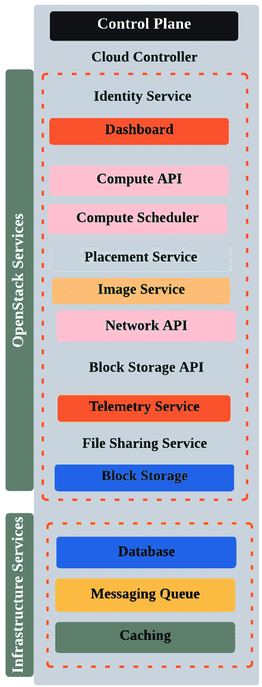
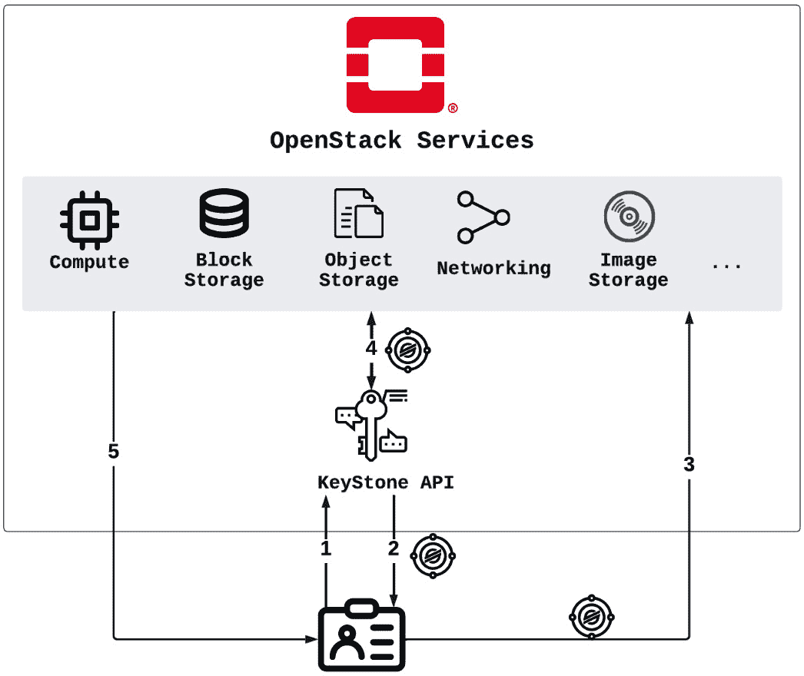
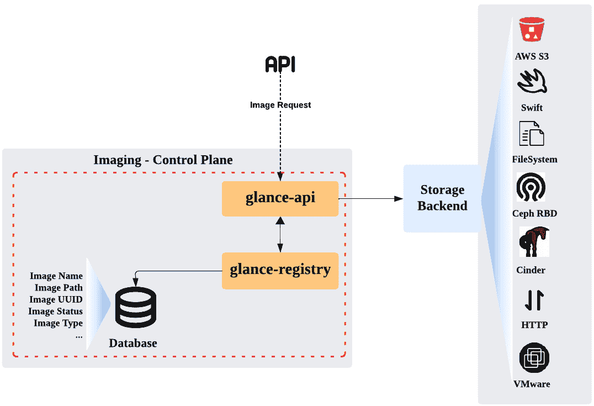
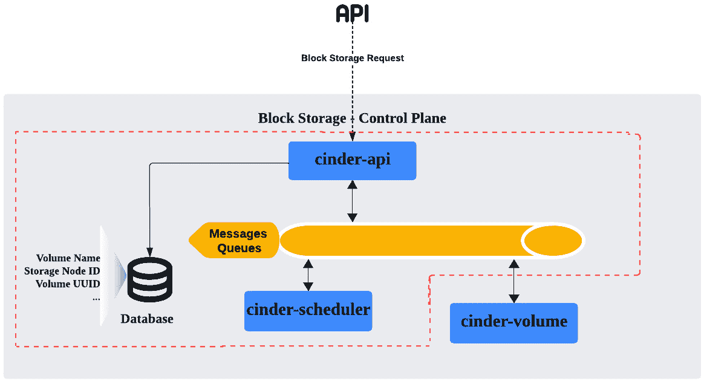
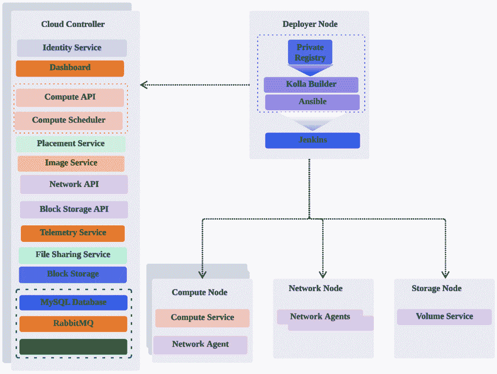
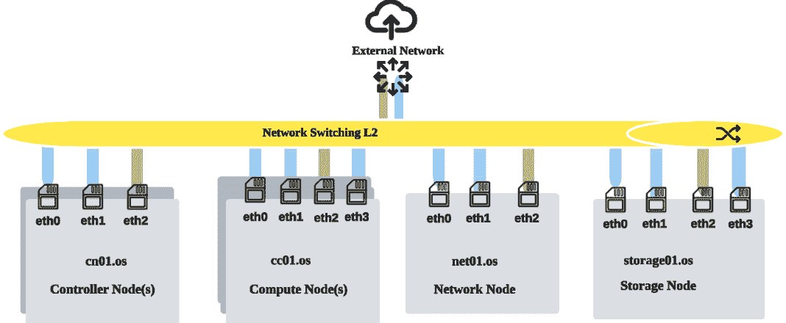
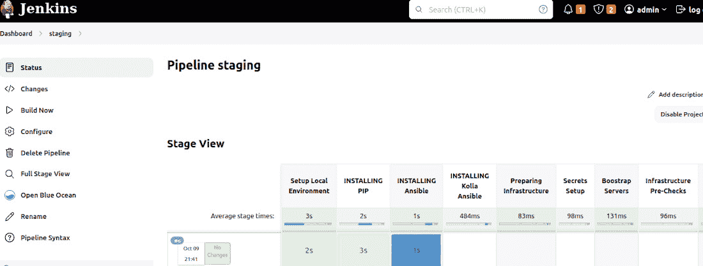

# 第三章：3

# OpenStack 控制平面 – 共享服务

“一个想法的价值在于它的应用。”

– 托马斯·爱迪生

解决 OpenStack 私有云中的业务连续性挑战归结为其控制平面的特性和能力。如第一章所述，多个核心服务，包括计算、镜像、存储、网络和身份，应在早期阶段设计以适应可扩展性和安全性。此类需求的另一个方面是将非原生 OpenStack 服务与核心服务同等对待，设计时考虑故障和可扩展性。此类服务包括消息队列和数据库。在我们考虑生产环境部署的最佳实践时，必须逐一迭代每个将成为 OpenStack 控制平面一部分的服务。部署过程中出现的另一个挑战是 OpenStack 服务的构建和部署方式。正如我们在*第二章*《启动 OpenStack 设置 – 正确的方式（DevSecOps）》中看到的，容器用于运行 OpenStack 服务，将控制平面服务拆分成更小的单元，将提高每个运行服务的可靠性和可扩展性。在本章中，我们将通过以下主题将设计的布局扩展到生产就绪环境：

+   定义 OpenStack 控制平面的边界

+   识别占用部分控制平面的不同 OpenStack 服务

+   准备首次生产部署

+   使用 kolla-ansible 部署下一个 OpenStack 环境

+   揭示 OpenStack 控制平面部署的其他自定义选项

# OpenStack 控制平面

当我们开始设计首次迭代布局时，遇到了各种 OpenStack 服务，每个服务由多个组件组成。一个或多个组件可以设计成在不同的物理机器上运行，这些机器被分配了用于逻辑操作和管理的角色。正如*第一章*《重新审视 OpenStack – 设计考虑》所强调的，逻辑上分离角色将支持 OpenStack 部署和操作的编排。术语 *控制平面* 在网络词汇中广泛使用，它决定了如何处理和运行请求。作为一个抽象概念，控制平面可以由一个或多个系统组件组成，这些组件集中管理和描述如何满足请求。在 OpenStack 逻辑布局中，云控制器被指定为运行控制平面的大部分组件。

## 运行控制平面 – 云控制器

OpenStack API、调度服务（包括计算、存储和文件共享调度器）、API 端点、数据库和消息队列都被视为 OpenStack 控制平面的一部分。本节将逐一讲解作为云控制器设置一部分的每个服务，并将其总结为两大类：OpenStack 服务和基础设施服务，如下所示：



图 3.1 – OpenStack 控制平面概览

我们将在以下小节中逐步讲解控制平面，并检查每个服务、其子组件和最新的更新。

### 身份服务

如在*第一章*《重温 OpenStack – 设计考虑》中所探讨的，身份服务是一个重要组件，用于授权和验证服务通信，以完成特定请求，如存储创建或实例配置。作为控制平面的一部分，Keystone 整合了所有现有 OpenStack 服务的目录，用户可以通过其 API 访问这些服务。

在运行控制平面服务时，提供 Keystone 的关键术语词汇表非常重要。这是为了确保在处理不同域、项目和用户时符合合规性和治理政策，如下所示：

+   **项目**：在身份 API 的版本 3 中，*项目*的概念取代了*租户*的概念。概念并没有变化，项目是资源集合的逻辑构建，用于隔离用户和组。

+   **域**：上移一层，域包含一组用户、组和项目。这种抽象的隔离对于拥有不同部门的大型企业非常有帮助。例如，每个部门可以分配一个由不同项目和用户组成的域。

+   **角色**：自 Keystone 服务初期以来，*角色*的概念一直是其关键机制之一。可以将一个用户或一组用户分配到不同的项目，并使用不同的授权布局，而无需创建多个具有不同分配的用户，也不需要手动切换到不同的环境来通过不同的项目访问特定资源。

+   **目录**：Keystone 通过其发现服务授予访问不同服务的权限。从 Keystone 的角度来看，这些服务作为 OpenStack 服务端点公开，并注册在服务目录中。

+   **令牌**：访问特定服务必须通过获取令牌来完成。它可以被视为验证用户的身份证明卡，包括过期日期和时间。它还检查令牌与哪些项目关联，并指向哪些端点。令牌概念本身经历了不同的版本和工作方式。当扩展生产环境中的 OpenStack 时，了解 Keystone 令牌的作用范围机制是非常必要的。由于大量用户会竞争访问服务和资源，作用范围将有助于更好地组织 Keystone 请求中的访问边界，通常可以分为两类：

    +   **有范围令牌**：一旦创建令牌请求，身份 API 将指定请求者将使用哪些 OpenStack 服务（端点）及其关联的角色。它主要包含诸如项目和域 ID 的引用信息。

    +   **无范围令牌**：与有范围令牌不同，创建的令牌请求不会包含任何特定的授权范围来访问服务。当用户首次提交凭证时，使用无范围令牌可以避免过度的身份验证循环。稍后，無範圍令牌可以转化为有范围令牌，以将授权限制在特定的服务组件上。

+   **用户**：这是一个 API 请求者，用于消耗 OpenStack 服务和资源。

+   **组**：这是属于同一域的用户或 API 请求者的集合，如前所述。

Keystone API 已通过提供更多认证机制选项得到改进，除了传统的密码方式，还支持基于 OAuth 的 SAML2 和 OpenID Connect。身份联合支持是 Keystone 实现的重要里程碑，它通过不同的后端启用了可插拔的**身份提供者**（**IdP**），包括 SQL、LDAP，甚至是联合的 IdP。在最新的 OpenStack 版本中，包括 Antelope 和 Bobcat，已经支持了多个后端，允许企业利用现有的认证/授权系统，实现更为集中化的管理。

当前支持的认证后端的简要总结如下：

+   **LDAP**：许多组织可能已经有现有的 LDAP 实例，并要求遵循一套安全策略以满足不同的合规要求。在这种配置下，Keystone 需要授予访问 LDAP 服务器的权限，以进行读写操作，并且不会在内部处理身份提供者（IdP）角色。

+   **SQL**：大多数默认的 OpenStack 部署都配置了 SQL，以将用户信息存储在 SQL 数据库中，并提供与 Keystone 服务的直接交互。

+   **联合身份提供者（IdP）**：这是最常见的设置之一，允许组织利用一个完整的整合身份点，Keystone 将在其中建立信任关系，并充当服务提供者。OpenStack 社区围绕这种布局开发了更稳定的发布版本，提供了通过 SAML 断言对多个后端（如 SQL、LDAP 和 Active Directory）进行身份验证的更多方法。最近，在 OpenID Connect 和 OAuth 第二版方面也有了更多的工作。这甚至允许使用 Google 和 Facebook 等公共社交登录平台进行身份验证。

重要说明

Keystone 身份 API 支持完整的**创建、读取、更新和删除**（**CRUD**）RESTful 操作 API。命令通过 OpenStack CLI 发出，而非 Keystone CLI，因为后者在 Antelope 及后续版本中不再支持，并且最新的 OpenStack 版本已采用身份 API 版本 3。

根据您采用的身份验证和授权策略，当处理纯 OpenStack 生态系统工作流时，Keystone 的机制是相同的。在处理大型基础设施布局时，身份 API 与其他服务的交互可能会让人感到难以应对。此时，在我们梳理完 Keystone 的最新技术状态后，简要概述交互如何工作将有助于在列出下一个服务之前理解。我们应当记住，Keystone 将成为 OpenStack 生态系统中 AA 的安全中心，默认配置不理想，应避免可能的安全漏洞，并进一步提升合规性和治理。

重要说明

Keystone 配置可以通过位于**/kolla-ansible/ansible/roles/keystone**的 Keystone **kolla-ansible**剧本进行自定义。编写本书时，Antelope 及后续版本中的默认**kolla-ansible**配置使用 Keystone fernet 令牌进行身份验证，而非传统的基于**公钥基础设施**（**PKI**）的令牌。

以下工作流简要演示了 API 请求者（用户或系统）与身份服务之间的典型 Keystone 请求和响应交互，以访问特定的 OpenStack 服务：

1.  用户或 API 请求者使用凭证通过 Keystone 服务进行身份验证。身份 API 接收请求，并在验证成功后向请求者授予一个令牌。

1.  用户或 API 请求者使用接收到的令牌提出请求，以访问所需的服务。

1.  所需的服务通过身份服务验证所提供令牌的有效性。

1.  一旦验证成功，请求的服务将向 API 请求者回复响应。

该工作流如下图所示：



图 3.2 – Keystone API 请求处理

如前所述，任何请求访问特定服务或资源将涉及身份验证服务，后续的交互将通过 API 请求处理。以更复杂的场景为例，例如虚拟机创建，将涉及更多的交互。这将触发更多服务的调用，如镜像、网络和存储，构成运行实例的基本资源。因此，Keystone 将使用原始认证令牌验证每个请求。新的服务请求将需要使用首次认证令牌生成新的经过认证的请求。

重要提示

Keystone 现在支持 OAuth 2.0 双向 TLS。Keystone Auth 具有一个新的插件，用于 OAuth 2.0 设备授权授予。

### 计算服务

我们的控制平面包括所有计算服务组件，除了**nova-compute**，它将在专用主机上运行。如*第一章*《重访 OpenStack - 设计考虑》中所述，不同计算守护进程的组成构建了 OpenStack 生态系统的主要能力。以下 Nova 服务将作为云控制器堆栈的一部分运行：

+   **nova-api**：这是处理计算请求的主要接口，包括计算资源的创建、列出、删除和管理。

+   **nova-scheduler**：这是一个过滤器和加权集合，用于根据自定义或默认特征（如主机位置、内存或 CPU 架构）来确定最适合运行实例的计算主机。

+   **nova-conductor**：这被认为是 Nova 架构中的一项新颖补充，在最新的 OpenStack 版本之前，**nova-conductor**将计算过程与直接联系数据库（从安全角度看，被认为是不受信的）隔离开来，转而直接连接数据库。

+   **nova-novncproxy**：此服务为实例提供 VNC 控制台访问。

重要提示

Nova 剧本位于 **/kolla-ansible/ansible/roles/nova** 目录下，位于 **kolla-ansible** 仓库中。请注意，剧本没有单独区分每个计算组件。

### 调度服务

如*第一章*《重访 OpenStack - 设计考虑》中所强调的，Placement 服务被认为是对计算服务的极大补充，通过检查计算资源、网络和存储池，不仅实现精细化的预筛选，还实现了先进的实例调度。Placement 服务作为 Nova 架构的一部分被引入，并随着其发展，已成为一个独立的项目。使用此服务的一些重要构件如下：

+   **资源提供者**：Placement 服务以抽象数据模型对象的形式跟踪底层资源（类型和实例），例如计算、存储池和网络。

+   **资源类别**：跟踪的资源按类型分类，分为两大类资源类别：

    +   **标准**：**MEMORY_MB**、**VCPU**、**DISK_GB**、**IPV4_ADDRESS**、**PCI_DEVICE**、**SRIOV_NET_VF**、**NUMA_CORE**、**NUMA_SOCKET**、**VGPU**等。

    +   **自定义**：以**CUSTOM_**前缀开始，可以创建并将自定义资源添加到放置服务的资源类别中。

+   **库存**：由特定资源提供者提供的一组资源类别集合。例如，一个资源提供者**RP01**，与四个资源类别相关联：**16 VCPU**、**4096 MEMORY_MB**、**200 DISK_GB** 和 **50 IPV4_ADDRESS**。

+   **特性**：这些表示资源提供者的特征。例如，资源提供者**RP01**提供的 vCPU 可以是**HW_CPU_X86_SVM**（SVM x86 硬件架构），**DISK_GB**可以是**固态硬盘**（**SSD**）。分配给**RP01**的这两个特性将分别记为**is_X86_SVM**和**is_SSD**，适用于**VCPU**和**DISK_GB**资源。

重要说明

放置服务提供标准特性；然而，操作员仍然可以通过放置 API CLI 创建自定义特性。特性可以在 Glance 镜像特征中指定，或在实例启动时使用的实例规格的额外规格中指定。

+   **分配**：占用计算节点资源的实例被视为资源提供者的消费者。这种资源的占用表示为*分配*，存储在数据模型记录中。

+   **分配候选**：在处理每个请求后，放置服务会重新排列现有的资源提供者，并返回最新的可用资源组，以便为下一个合适的请求提供资源。

通过放置服务，可以实现更高级的筛选选项。以下工作流展示了网络服务如何通过放置与计算服务进行交互。期望的场景是基于网络带宽在计算节点中调度实例配置：

1.  通过计算服务创建一个库存。

1.  资源提供者由计算节点创建。

1.  在计算资源提供者下，网络服务创建一个网络资源提供者。

1.  网络服务报告带宽库存。

1.  网络服务提供一个端口的资源请求。

1.  计算服务从端口接收资源请求，并将其添加到**GET /** **allocation_candidates**请求的 API 请求中。

1.  曝露的候选项将通过放置服务进行筛选，计算服务将选择最合适的一个。

1.  计算服务在放置服务中申请资源。

1.  计算服务与网络服务交换分配更新。

1.  放置服务更新其下一次请求的分配候选。

部署 API 提供了额外的功能，通过帮助 Nova 调度过程。Newton 版本之前，仅跟踪和管理计算资源的使用情况（如 CPU 和 RAM）。随着多个资源提供者（存储和网络服务）的加入，部署 API 通过统一的管理方法简化了资源的记录和调度。

### 镜像服务

Glance API 是控制平面的一部分。然而，正如在*第一章*中强调的，*重访 OpenStack – 设计考虑*，存储镜像可以通过不同的数据存储类型来处理，例如 Swift 对象存储、AWS S3、Ceph 存储系统、VMware、文件系统以及最近的 Cinder 块存储服务。Glance 服务的发展主要体现在支持最新 OpenStack 版本中存储镜像后端的灵活性。在 Antelope 版本及之后的版本中，Glance API 服务可以配置为同时支持多个后端列表，Glance API 将使用默认的数据存储来处理磁盘镜像操作；否则，它将使用定义的后端列表。

重要提示

默认情况下，影像服务剧本支持文件、HTTP、VMware、Cinder、Swift 和 Ceph 后端，这些后端位于**/kolla-ansible/ansible/roles/glance/defaults/main.yml**文件中。启用或禁用额外的镜像存储后端可以通过在**/kolla-ansible/etc/kolla/globals.yml**文件中设置**glance_backend_ceph**、**glance_backend_file**、**glance_backend_swift**和**glance_backend_vmware**的值为**yes**或**no**来实现，分别对应 Ceph、文件、Swift 和 VMware 存储后端。

在控制平面中运行的**glance-registry**进程将处理数据库中每个关联镜像的元数据更新，包括存储后端路径中定义的镜像位置，如下图所示：



图 3.3 – Glance 控制平面组件

另一个值得注意的增强功能是，控制平面可以定制为支持多个块存储后端。如果创建了两个 Cinder 存储卷，可以将一个属性分配给某个卷，例如 SSD 或 HDD，在这种情况下，Glance API 将根据云操作员的配置指示使用所需的 Cinder 卷。

### 网络服务

与许多其他 OpenStack 服务不同，Neutron 服务被认为更为复杂，原因在于其通过 OpenStack 版本的演变及其先进的虚拟网络功能和扩展。如*第一章*《重新审视 OpenStack – 设计考虑》所示，网络容量和分段应提前规划，不仅要容纳更多的流量，还要利用虚拟网络的可扩展性。为此，设计上专门设置了网络节点来处理不同类型的租户和提供商。同时，主要的 Neutron API 将作为控制平面的一部分运行在控制节点上。随着每个 OpenStack 版本的发布，Neutron 驱动程序和插件的数量也在增加；在 Antelope 版本中，支持大多数知名的 SDN 驱动机制，包括**openvswitch**、**OVN**、**linux bridge**、**l2population**和**baremetal**。提供虚拟网络功能的高级服务插件，如 VPN、防火墙和路由，将在单独的网络节点上运行。强烈建议考虑对云控制器和网络节点进行硬件网络绑定，以提高性能和可靠性。

重要提示

通过**kolla-ansible**基础设施代码库进行的网络配置，形式会根据要添加的网络功能而有所不同。所有机制、驱动程序和服务插件都列在 Neutron 文件中（**/kolla-ansible/ansible/roles/neutron/defaults/main.yml**）。如 Open vSwitch 和 OVN 等 Neutron 驱动程序运行在它们自己的 playbook 中，位于相同的文件夹路径下，分别是**/kolla-ansible/ansible/roles/openvswitch**和**/kolla-ansible/ansible/roles/ovn-controller**。

### 块存储服务

Cinder 自从在 OpenStack 生态系统中孵化以来，主要使命就是为实例提供持久化存储。与临时存储不同，块存储概念自 Bexar 版本早期发布以来就已包含在 OpenStack 中，并作为 Nova 项目的一部分持续存在。然而，自 Folsom 版本起，它已被独立为一个服务。造成这种分离的原因有很多，主要原因是 Cinder 架构的发展。一些块存储的子组件被视为控制平面的一部分，包括**cinder-api**和**cinder-scheduler**，如以下图所示：



图 3.4 – Cinder 控制平面组件

我们将在*第五章*《OpenStack 存储 – 块存储、对象存储与文件共享》中更深入地介绍块存储扩展。

重要提示

当前 **kolla-ansible** 基础架构代码库中默认未启用块存储。通过在 **/kolla-ansible/etc/kolla/globals.yml** 文件中将 **enable_cinder** 设置为 **'yes'**，可以启用已创建的实例将其磁盘存储在关联的卷中。支持的 Cinder 存储后端在 **/kolla-ansible/ansible/roles/cinder/default/main.yml** 文件中定义的 Cinder 剧本中列出，并通过 **cinder_backend** 配置段代码引用。确保准备一个名为 **cinder-volumes** 的初始 LVM 卷，因为 **kolla-ansible** 包装器将期望存在一个具有该名称的卷组，如 **globals.yml** 文件中所述。

### 对象存储服务

Swift 由多个子组件组成，用于管理对象，包括账户、容器和对象。在最高层级，与其他对象存储环交互的主要接口是 **swift-proxy-server** 守护进程，它将在云控制实例上运行。

重要提示

当前 **kolla-ansible** 基础架构代码库中默认禁用 Swift。可以通过在 **/kolla-ansible/etc/kolla/globals.yml** 文件中将 **enable_swift** 设置为 **yes** 来启用它。

### 文件共享服务

由于我们旨在提供一种托管的共享文件服务，在我们的初始生产草案中，Manila 服务的几个组件将成为控制平面的一部分，包括 **manila-api** 和 **manila-scheduler**。与 Cinder 类似，文件共享服务的后端存储类型可能会有所不同。我们将在*第五章*《OpenStack 存储 – 块、对象和文件共享》中讨论更多关于文件共享服务的配置细节。

重要提示

当前 **kolla-ansible** 基础架构代码库中默认禁用文件共享服务。通过调整 **/kolla-ansible/etc/kolla/globals.yml** 文件中的 **enable_manila** 设置为 **yes**，可以启用 Manila 服务。

### 监控

如在*第一章*《重新审视 OpenStack – 设计考虑》中所述，Ceilometer 已被更改为仅作为运行在 OpenStack 命令下的资源的度量收集器。**ceilometer-api** 组件是控制平面的一部分。考虑到 Ceilometer 的功能，它基于代理的架构涉及数据收集代理的存在，这些代理通过 REST API 收集度量数据并轮询资源。除了**ceilometer-api**，一个 ceilometer 轮询代理还在控制节点上运行，并且有一个中央代理用于轮询由不同租户在 OpenStack 基础设施下创建的所有资源。一个监听消息总线以消费代理发出的通知数据的通知代理可以选择性地在云控制节点上运行。

重要提示

当前 **kolla-ansible** 基础设施代码仓库默认禁用 Ceilometer 服务。在 **/kolla-ansible/etc/kolla/globals.yml** 文件中将 **enable_ceilometer** 设置为 **yes**。Ceilometer 的默认 playbook 配置位于 **/** **kolla-ansible/ansible/roles/ceilometer** 目录下。

### 报警

报警最初作为 Ceilometer 功能的一部分设计，后来被解耦并独立运行，代号为 **Aodh**。报警组件可以存在于云控制节点内，包含用于报警评估、通知以及状态数据库的附加组件。

重要提示

当前 **kolla-ansible** 基础设施代码仓库默认禁用 Aodh 服务。在 **/kolla-ansible/etc/kolla/globals.yml** 文件中将 **enable_aodh** 设置为 **yes**。Aodh 的默认 playbook 配置位于 **/** **kolla-ansible/ansible/roles/aodh** 目录下。

### 仪表盘服务

Horizon 在一个 Apache Web 服务器实例后端运行，作为前端暴露 OpenStack 服务的仪表盘，但默认情况下并不是所有非核心服务都会反映在仪表盘中。Horizon 需要通过启用特定服务和功能的指令来进行配置，例如 VPN 服务。Horizon 基于 Python Django 框架，如果终端用户数量不断增加且请求过多，可能会出现过度利用的情况。特别是当启用并将大多数附加服务的指令暴露给更多用户时，仪表盘的扩展性是一个必须考虑的问题。

重要提示

默认情况下，Horizon 被视为 **kolla-ansible** 基础设施代码仓库中的核心服务。**enable_openstack_core** 配置项默认设置为 **yes**，这意味着 Horizon 服务会被包含在 **/kolla-ansible/etc/kolla/globals.yml** 文件中。在同一个文件中，你可以通过注释掉 **enable_horizon_service** 配置行，来启用额外的 Horizon 指令，从而通过仪表盘管理该服务，该服务指向附加的 OpenStack 服务。默认情况下，仪表盘支持的所有附加服务都已启用，并在 Horizon playbook 中反映，具体内容见 **/** **kolla-ansible/ansible/roles/horizon/default/main.yml** 文件。

由于我们已经涵盖了大部分将作为控制平面一部分的 OpenStack 服务，接下来的部分将介绍那些被视为共享服务的非 OpenStack 服务。

## 共享服务 – 基础设施服务

在 *第一章*《重新审视 OpenStack - 云设计考虑》中，我们将共享服务定义为非 OpenStack 服务。共享服务，例如消息队列、数据库和（可选的）缓存层，除了其他核心服务外，是最关键的服务之一。

### 消息队列

作为控制平面的一部分，RabbitMQ 是 OpenStack 中最常用的消息服务。强烈建议为队列专门分配单独的节点，但这不是必须的。基于多区域 OpenStack 环境的广泛部署是运行专用 RabbitMQ 集群的合适案例，因为它需要处理不同服务（包括计算、存储和网络）的网状请求。

队列消息的另一个被忽视的方面是安全需求。RabbitMQ 作为大多数 OpenStack 服务之间的通信中心存在。保持消息交换的安全性至关重要。RabbitMQ 支持 TLS，可以保护订阅者和客户端免受篡改的消息，并强制在传输中进行加密。

重要提示

RabbitMQ TLS 选项在 **kolla-ansible** 基础设施代码库中默认为禁用状态。可以通过在 **/kolla-ansible/etc/kolla/globals.yml** 文件中将 **rabbitmq_enable_tls** 设置为 **yes** 来启用它。其他 RabbitMQ 配置可以在其关联的 playbook 中进行调整，例如消息和队列过期时间，在 **kolla-ansible/ansible/roles/rabbitmq/default/main.yml** 文件中设置。

### 数据库

OpenStack 拼图生态系统的另一个重要组成部分是存储所有服务状态和用户跟踪信息更新的数据库。作为控制平面的一部分，MariaDB 被视为数据库引擎，并通过 Galera 包装器在多主集群模式下提供更好的性能。

重要提示

MariaDB 集群依赖于 HAProxy 进行数据库实例切换。更多细节将在 *第七章*，*运行高可用云 – 满足 SLA* 中讨论。默认数据库引擎配置为 MariaDB 在 **kolla-ansible** 基础设施代码库中。

### 缓存

缓存作为我们控制平面的可选部分。然而，由于其在云控制器利用率中的轻量级足迹，强烈建议从缓存开始。Memcached 正在成为提供身份验证令牌验证服务间 API 交互信息等 OpenStack 服务之间的临时数据的标准。

重要提示

Memcached 在 **kolla-ansible** 基础设施代码库中默认启用。可以在位于 **kolla-ansible/ansible/roles/memcached/default/main.yml** 文件中的 Memcached playbook 中设置最大缓存内存大小和连接数。

在开始部署私有云之前，识别 OpenStack 的控制平面是一个重要的步骤。这将有助于确定哪种设计布局适合您的环境，以确保高可用性作为最高优先级。接下来的部分将围绕 OpenStack 控制平面的设计草案进行迭代。

## 武装控制平面 – 为故障做准备

OpenStack 控制平面周围不同组件的组合需要更多的努力以保持它们正常运行并具有最大韧性。有多种方法可以实现控制平面的最大可用性，但这些方法应提前准备并测试。在 OpenStack 的最新版本中，已采用多个工具以确保控制平面的可扩展性和高可用性。另一种方法是简单地重用一些已存在的模式，例如高可用的数据库布局或消息总线集群。在*第七章*，《运行高可用云——满足 SLA》中，我们将更深入地讨论 OpenStack 各个层级的高可用性。在这一层次，定义一种策略来从可扩展性和可用性角度增强控制平面是至关重要的。

这两个术语应该从设计计划的第一阶段开始考虑，通过回答以下问题：

+   控制平面如何应对大量的 API 请求？

+   如何以最短的时间面对和解决硬件故障？

+   哪些设计模式可以确保控制平面的稳定性和韧性？

+   我们如何处理基础设施服务（如数据库和消息总线）的增长？

OpenStack 生态系统已经设计成可以大规模扩展。凭借其模块化架构，设计具有韧性的控制平面为不同实现方式提供了一个开放的门。为成功部署控制平面做好准备的已知设计选项总结如下：

+   **主动/主动**：所有集群节点参与处理请求。这个模式主要与*非对称集群*布局相关，其中一个入口点（例如负载均衡器）将请求分发到活动的控制平面服务。主动/主动配置通过将负载分配到多个节点上，增加了云基础设施的性能和可扩展性。通过负载均衡器自动化订阅或丢弃节点的操作可以通过负载均衡器进行编排，根据负载均衡器的能力，可能不需要资源管理器。

+   **主动/被动**：与之前的模式不同，活动节点处理请求，而备用节点仅在一个或多个活动节点失败时接管。被动控制平面节点被称为*懒惰观察者*，不像主动/主动模式中那样需要额外的前端点（如负载均衡器）。这种设计主要与*对称集群*相关，在这种模式下，资源管理器软件评估并确保在任何时候只有一个活动的控制平面组件在处理请求。

重要提示

**kolla-ansible** 基础设施代码库带有预定义的角色，用于高可用控制平面的配置，这些角色定义在 **globals.yml** 文件中的 **'hacluster'** 配置段落中。大多数采用的 OpenStack 控制平面服务集群软件工具，包括 Antelope 版本，都使用若干 **HAProxy** 实例进行负载均衡，并基于 **虚拟 IP**（**VIP**）地址的概念使用 Keepalived 进行动态集群节点健康检查。HAProxy 的剧本带有最新的可自定义配置设置，位于 **/kolla-ansible/ansible/roles/loadbalancer/** 目录下。*第七章*《运行高可用云–满足 SLA》将更详细地介绍 HAProxy 和 Keepalived 的设置，以部署高可用的 OpenStack 控制平面。

控制平面故障设计将依赖于目标**服务级别协议**（**SLA**）以及在您的基础设施内可用的选项。主动/主动模式可能是一种*尽力而为*的可扩展和高可用性实现，但通过专用硬件或软件设备来分配集群的负载均衡角色会产生额外成本。数据库的选择是另一个大多数云架构师和运维人员特别关注的难题，因为其复杂性和性能问题。例如，某组织的政策要求使用 Oracle 数据库引擎。设置主动-主动数据库配置可能无法直接解决控制平面高可用性要求，因为这可能需要更多的特定工具和额外的集成，而使用其他引擎如 MySQL Galera 则可能会更简单。

## 更多的规划

依赖于 CI/CD 工具作为真实来源是一种最佳实践，可以保持控制平面服务集群的一致性。正如我们在*第七章*《运行高可用云–满足 SLA》中所述，添加新的云控制器节点应该是透明进行的，不会打扰到正在运行的 API 服务。这也是在独立环境中开发更多服务一致性集成测试的有效理由，以确保新控制平面节点部署的顺利进行。监控系统应反馈容量、服务可用性和资源使用情况，以确保如果一切如预期那样，生产环境的成功运行。

部署额外的云控制器节点以增强控制平面的过程可以在加入额外控制平面服务时以相同方式应用。部署更多的 OpenStack 服务将暴露更多的 API 以与其他节点交互，并处理更多的用户或服务请求。这可能会导致每分钟数百个 API 请求的负载增加，毫无疑问，更多的 CPU、内存、网络和磁盘将被消耗。在这种情况下，关于性能和可扩展性的担忧不应限制 OpenStack 云服务组合的增长，因为有多种方式可以解决这一挑战。只要在所有操作任务中保持自动化，作为新控制平面服务的 OpenStack 组件部署应通过 CI/CD 阶段。新组件应通过测试和开发环境，并在提升到生产环境之前发送包含容量和使用限制等一些指标的反馈。之后可以做出设计决策，例如，将新组件运行在同一个云控制器集群中，或将其分配给一个单独的物理或虚拟节点运行。

作为控制平面一部分的新 API 服务的添加应在运行特定服务角色的节点上反映出来。CI/CD 系统在此时发挥作用，确保在节点和服务的基础设施呈指数级增长时保持一致性。

重要提示

在接下来的章节中，将涵盖并集成一些其他的 OpenStack 服务，作为控制平面的一部分，例如 *第四章*中的 **Magnum** 和 **Zun**，*OpenStack 计算 – 计算能力与规格*；*第六章*中的 LBaaSv2，*OpenStack 网络 – 连接性与托管服务选项*；以及 *第九章*中的 Watcher，*基础设施基准测试 – 评估资源容量* *和优化*。

# 扩展部署

一旦识别出构成控制平面的不同服务，便是更新初始设计草稿的好时机。为了在即将到来的生产阶段中理想地开始部署，最佳方式是为每个物理节点分配一组角色来运行不同的 OpenStack 服务。这将引导我们进入以下配置：

+   **云控制器节点**：该节点运行包括 OpenStack API、身份认证、镜像、文件共享、遥测和仪表盘服务在内的控制平面服务。共享服务，包括 MySQL Galera 集群数据库、RabbitMQ 消息服务和 Memcached，将成为分配给云控制器节点角色的一部分。

+   **计算节点**：该节点将 KVM 作为主要的虚拟化平台，运行 Nova 计算和网络代理服务。

+   **网络节点**：该节点运行 Neutron 代理服务，包括**Layer3**、**LBaaS**、**DHCP** 和插件代理。

+   **存储节点** : 运行 Cinder 卷服务，与 Cinder 调度器交互，提供块存储资源。

+   **部署节点** : 运行编排部署工具链，包括 Ansible、Kolla 构建器和 CI 服务器。部署节点还可以选择托管本地私有 Docker 注册表。

更新后的设计草案展示了一个多节点 OpenStack 环境，如下图所示：



图 3.5 – 多节点 OpenStack 部署布局

重要说明

根据硬件的可用性，网络和存储角色可以分配给云控制器节点。使用监控指标数据提前决定在何时将这些服务安装到独立的物理节点上。当处理 OpenStack 基础设施使用量的指数增长时，建议分离存储和网络服务。如果计划在虚拟环境中运行节点，使用 VMware ESXi 或 VirtualBox 等工具时，确保安装硬件虚拟化扩展，并配置虚拟网络。

## 初始化网络

如在*第一章*中所示，*重新审视 OpenStack – 设计考虑*，应该提前准备一些网络。提前准备物理网络是必需的，作为下一个迭代中生产布局扩展的一部分。我们初步草案中提出的标准网络包括管理、租户、存储和外部网络，连接我们初始集群布局中的不同节点。

以下接口将被考虑：

+   **eth0** : 管理接口

+   **eth1** : 覆盖和租户接口

+   **eth2** : 外部接口

+   **eth3** : 存储接口

如下图所示，OpenStack 网络设置考虑了四种不同类型的流量，包括管理、租户和覆盖、存储以及外部网络。请注意，一个网络节点专门用于管理各种 OpenStack 网络服务，这样可以提高性能，并减少云控制器节点层级的网络饱和风险。



图 3.6 – 物理网络分段布局

在交换层，网络通过 VLAN 进行逻辑组织，每个网络都分配了一个 VLAN ID，并与分配的网络 IP 子网地址池关联。下表提供了给定保留 IP 池 **10.0.0.0/8** 的初始网络映射示例：

| **网络名称** | **IP 池** | **VLAN ID** |
| --- | --- | --- |
| 管理 | **10.0.0.0/24** | **100** |
| 覆盖和租户 | **10.10.0.0/24** | **200** |
| 外部 | **10.20.0.0/24** | **300** |
| 存储 | **10.30.0.0/24** | **400** |

表 3.1 – OpenStack 网络 IP 地址

重要说明

在内部管理 OpenStack 包时，管理界面不需要外部网络的出站访问来下载包。部署实例可以连接到相同 VLAN 内的管理网络，以便直接安装所需的包。外部网络访问可以限制为部署实例和租户网络，以便未来需要外部访问的实例。  

由于我们处理的是在 Docker 容器中运行的 OpenStack 服务，因此必须考虑底层创建的虚拟网络组件。一旦部署了 OpenStack 环境，Kolla 将使用 Neutron 网络模型在集群中的每个节点上创建一些桥接、端口和命名空间。正如我们将在下一部分配置中看到的，Kolla 会将每个网络接口映射到一个 Neutron 物理网络，称为 **physnet**。Neutron 创建的每个容器桥接在 **neutron_bridge_name** 配置段中定义，以设置默认的 Kolla 命名约定，命名为 **br_ex**。如前所述，**kolla-ansible** 部署模式高度可定制，因此我们可以为每个桥接分配有意义的名称，分别映射到每个网络接口。  

重要提示  

分配的网络接口将由 Neutron 用于访问公共网络，以便允许租户创建路由器并为需要互联网访问的工作负载分配浮动 IP，配置文件 **/etc/kolla/globals.yml** 中定义的 **neutron_external_interface** 设置将被分配到计算节点的专用接口 **eth2** 上。  

强烈建议为每个主机预先配置网络绑定布局。如前所述，绑定配置取决于工具和运行软件，当使用 Linux 操作系统时，不同的发行版有所不同。常用的绑定配置包括本地 Linux 绑定和 Open vSwitch。  

重要提示  

本书不涉及绑定配置。关于使用内核模块在 Ubuntu 上进行绑定配置的良好参考资料可以在此找到：[`help.ubuntu.com/community/UbuntuBonding`](https://help.ubuntu.com/community/UbuntuBonding)  

## 列出集群规格  

*第一章*《重新审视 OpenStack——设计考虑》中的物理布局初稿可以作为我们为每个主机选择硬件规格的起点。尽管主机角色之间存在细微差异，以下表格总结了每个主机的典型生产硬件和软件设置：

| **主机名** | **CPU** **核心数** | **内存** | **磁盘** | **网络** | **软件** | **角色** |   |
| --- | --- | --- | --- | --- | --- | --- | --- |
| **cc01.os** | 8 | 128 GB | 250 GB | 4 x 10 GB | Ubuntu 22 LTS, OpenSSH, Python 2.7 或更高版本, NTP 客户端 | 云控制器 |   |
| **cn01.os** | 12 | 240 GB | 500 GB | 4 x 10 GB | Ubuntu 22 LTS, OpenSSH, Python 2.7 或更高版本, NTP 客户端 | 计算节点 |   |
| **net01.os** | 4 | 32 GB | 250 GB | 4 x 10 GB | Ubuntu 22 LTS, OpenSSH, Python2.7 或更高版本, NTP 客户端 | 网络节点 |
| **storage01.os** | 4 | 32 GB | 1 TB | 4x10 GB | Ubuntu 22 LTS, OpenSSH, python2.7 或更高版本, NTP 客户端 | 存储节点 |

表 3.2 – OpenStack 主机配置

请注意，OpenStack 是设计用于运行在普通硬件上的。表格中没有提到任何具体的硬件型号，这取决于启动第一个配置时的预算和资源。如我们所计划，在第一章中，为了容纳 200 个实例，我们在首次部署时将使用 *小型* 配置，生产环境的设置应该能够通过增加更多硬件来扩展，并且每一层 OpenStack 生态系统都能水平扩展。**undercloud** 监控工具应定期收集每个节点的性能和使用情况数据，以帮助决定所需的正确配置和需要添加的资源。首次主机和硬件列表在为集群添加冗余层之前不应承担任何生产负载，冗余层将在 *第七章* 中详细讨论，*构建高可用云 – 满足 SLA*。

## 准备基础设施代码

使用相同的 **kolla-ansible** 仓库，我们可以像 *第二章* 中所述，*启动 OpenStack 配置 – 正确的方法（DevSecOps）* 一样，自定义不同 OpenStack 服务（包括控制平面服务）的设置。

作为最佳实践，在合并到主分支之前使用一个独立的分支，然后开始部署到生产环境。

## 配置主机组

**kolla-ansible** 基础设施代码定义了目标主机和相关参数，如主机名和网络 IP 地址，这些信息存储在 **/ansible/inventory** 目录下。主机组的列出可以根据与初步草稿相关的角色进行定制。清单文件的格式简单明了，如 *第二章* 中所述，*启动 OpenStack 配置 – 正确的方法（DevSecOps）*。下表定义了我们在下一次部署迭代中使用的不同主机组：

| **OpenStack Kolla – Ansible** **主机组** | **OpenStack** **节点角色** |
| --- | --- |
| **control** | 运行大部分 OpenStack 控制平面服务，包括核心服务 API、数据库和消息队列服务 |
| **compute** | 运行 **nova-compute** 服务的主机 |
| **network** | 专用于运行 Neutron 插件和代理的网络节点 |
| **haproxy** | 运行 HAProxy 的目标主机 |
| **storage** | 运行 Cinder 卷服务 |
| **monitoring** | 专用主机，用于监控运行 Prometheus 和 Grafana 的 OpenStack 服务器 |
| **logging** | 运行并处理不同 OpenStack 服务的日志 |
| **deployment** | 使用 Ansible 和 Kolla 运行基础设施代码的部署 |
| **对象** | 运行 Swift 对象存储服务器的实例 |

表 3.3 – OpenStack Ansible 主机组

库存文件高度可定制，可以根据需要适应不同的服务，既可以为新角色容纳不同服务，也可以将更多的核心服务分配到专用主机上。我们的下一步将考虑多节点设置的部署，包括分别为每个云控制器、计算、存储和网络角色部署一个专用主机。此部署不应被视为生产就绪，因为每个角色将部署在单个节点上，该节点尚未满足高可用性的要求。我们将在*第七章*中介绍 OpenStack 部署的高可用性和容错，*运行高可用云 – 满足* *SLA*。

从真相源开始，在 CI/CD 链所在的部署节点上，创建一个新的分支，专用于暂存环境：

```
$ git branch staging
```

在克隆的仓库中创建一个名为**multi_packtpub_prod**的新文件，路径为**/ansible/inventory**。可以在同一目录**/ansible/inventory**中找到一个简单的方法，用于从默认的多节点配置文件中分配不同的主机组，文件名为**multinode**。

每个主机组的配置格式如下所示：

```
[role_name1]
Hostname01
Hostname02
…
[role_name2]
Hostname03
Hostname04
…
```

库存文件可以通过明确分配一个或多个 OpenStack 服务在特定主机上运行的方式进行不同的定制。这可以通过添加以下配置段来实现：

```
[service_name:children]
Hostname
```

例如，以下配置指示**kolla-ansible**在分配为控制的云控制节点组上安装 Swift 服务：

```
[swift:children]
control
```

之前的配置段将安装并运行所有 Swift 组件在控制主机组中。通过更细粒度的配置，可以指示哪些组件将在哪些主机上安装。如果没有特别提到，服务将安装在控制主机组中。下一个示例指示**kolla-ansible**在引用为**object_storage**的主机组中安装除**swift-proxy-server**之外的其他组件：

```
[swift-proxy-server:children]
swift
[swift-account-server:children]
object_storage
[swift-container-server:children]
object_storage
[swift-object-server:children]
object_storage
```

对于我们的下一次迭代，指向共享服务（如数据库缓存层和消息队列）的库存部分如下所示：

```
[control]
cc01.os.packtpub
[mariadb:children]
control
[rabbitmq:children]
control
[outward-rabbitmq:children]
control
[memcached:children]
control
```

核心控制平面服务将在云控制器主机组上运行，如下所示：

```
…
[keystone:children]
control
[glance:children]
control
[nova:children]
control
[placement:children]
control
[cinder:children]
control
[neutron-server:children]
control
[horizon:children]
control
[swift:children]
control
[manila:children]
control
[ceilometer:children]
control
```

更细粒度的共享和控制平面服务配置可以按服务进行定制，如下所示：

+   对于镜像服务，Glance 可以按如下方式配置：

    ```
    ..
    [glance-api:children]
    glance
    ```

+   除**nova-compute**外，所有计算组件可以按如下方式配置：

    ```
    [nova-api:children]
    nova
    [nova-conductor:children]
    nova
    [nova-super-conductor:children]
    nova
    [nova-novncproxy:children]
    nova
    [nova-scheduler:children]
    nova
    [nova-spicehtml5proxy:children]
    nova
    [nova-compute-ironic:children]
    nova
    [nova-serialproxy:children]
    nova
    ```

+   Placement 服务 API 可以按如下方式配置：

    ```
    [placement-api:children]
    placement
    ```

+   块存储 API 和卷调度器服务可以按如下方式配置：

    ```
    [cinder-api:children]
    cinder
    [cinder-scheduler:children]
    cinder
    ```

+   对象存储代理组件可以按如下方式配置：

    ```
    [swift-proxy-server:children]
    swift
    ```

+   遥测核心和通知组件可以按如下方式配置：

    ```
    [ceilometer-central:children]
    ceilometer
    [ceilometer-notification:children]
    ceilometer
    ```

共享服务和控制平面部分可以以不同方式定义。一旦新项目的设计草案已完成并准备在云控制节点上运行，更多的服务和组件将继承相同的配置。由于本章没有涵盖所有服务，我们将坚持前面定义的第二次迭代，并将在本书的后续章节中添加更多的控制平面服务。清单文件将作为确立环境中运行服务最新版本的真实来源。

清单部分的下一个类别定义了计算目标节点及其将运行的相应组件：

```
…
[compute]
cn01.os.packtpub
```

可选地，由于每个计算节点都需要收集指标以供进一步监控，**collectd** 将在计算主机组上运行，此外还有 **ceilometer-compute** 和 **ipmi** 组件：

```
[collectd:children]
compute
[ceilometer-compute:children]
compute
[ceilometer-ipmi:children]
compute
```

由于每个计算节点都将与其他节点互联以服务租户网络，设计在前一部分中的一些 Neutron 代理将运行在计算主机组上：

```
[ovn-controller-compute:children]
compute
[neutron-ovn-agent:children]
compute
```

重要提示

OVN 将在 *第五章* 中详细讨论，*OpenStack 网络 – 连接性和管理服务选项*，作为 OpenStack 中最新版本（包括 Antelope）中最常用的网络服务。

OpenStack 网络服务设计为在其自己的主机上运行，除了其 API 作为云控制平面的一部分。以下代码在清单文件中定义了网络节点及相关组件：

```
[network]
net01.os.packtpub
[neutron:children]
network
```

除其 API 外，所有 Neutron 服务和代理将在网络节点上运行，如下所示：

```
[neutron-dhcp-agent:children]
neutron
[neutron-l3-agent:children]
neutron
[neutron-metadata-agent:children]
neutron
[neutron-ovn-metadata-agent:children]
network
[neutron-bgp-dragent:children]
neutron
[neutron-infoblox-ipam-agent:children]
neutron
[neutron-metering-agent:children]
neutron
[ironic-neutron-agent:children]
neutron
[neutron-ovn-agent:children]
network
```

此外，**manila-share** 组件将运行在使用 Neutron 插件来提供文件共享资源网络访问的网络主机组上：

```
[manila-share:children]
network
```

OVN 控制器已配置为在计算节点和网络主机组中运行，如下所示：

```
[ovn-controller:children]
ovn-controller-compute
ovn-controller-network
```

**ovn-controller-network** 继承与网络主机组的关联：

```
[ovn-controller-network:children]
network
```

请注意，OVN 机制使用其自己的数据库，该数据库可以运行在云控制器主机组上。OVN 数据库本身支持三种不同的架构，可以在同一云控制器主机组上运行，如下所示：

```
[ovn-database:children]
control
[ovn-northd:children]
ovn-database
[ovn-nb-db:children]
ovn-database
[ovn-sb-db:children]
ovn-database
```

清单的下一部分是存储层，最初将定义一个存储节点：

```
[storage]
storage01.os.packtpub
```

存储节点将运行 Cinder 卷：

```
[cinder-volume:children]
storage
```

清单文件的最后一部分包括部署主机本身，定义为 localhost：

```
[deployment]
localhost       ansible_connection=local
```

其他服务可以算作额外的安装服务，例如，如果你在所有节点或特定扫描工具上运行自定义**Zabbix 代理**并报告给中央集线器。实现这一目标的简单方法是创建一个新的段落，引用清单中定义的所有主机组。例如，以下代码部分指示 Ansible 安装一些工具，如**cron**，以及使用**fluentd**来管理和收集日志的服务，适用于运行 OpenStack 服务的 Kolla 容器。可选地，**kolla-ansible**附带了**kolla-toolbox**，可以在安装后快速在 Docker 容器中运行特定的命令行：

```
[common:children]
control
network
compute
storage
[cron:children]
common
[fluentd:children]
common
[kolla-logs:children]
common
[kolla-toolbox:children]
common
```

重要提示

在多节点配置中，确保部署机器能够访问所有其他主机以运行 Ansible playbook。可以在清单文件中指定 Ansible 如何与每个目标主机交互。在当前配置中，已经生成并推送了 SSH 密钥到每个目标主机，以便在部署过程中使用 Ansible。请注意，如果清单文件中未使用 IP 地址，则主机名应在每个节点的**/etc/hosts**中进行传播。

保存文件，提交并推送到创建的分支：

```
$ git add multi_packtpub_stg
$ git commit -m 'Multi Node Inventory - Staging'
$ git push --set-upstream origin staging
```

一旦主机映射和分支配置完成，便可以深入研究**kolla-ansible**代码，并为不同服务自定义未来的 OpenStack 参数。

## 参数化环境

下一个关键文件是**globals.yml**配置文件，该文件位于**/etc/kolla/**目录中。这个文件充当所有 OpenStack 环境的中央配置中心。社区版**kolla-ansible**仓库附带的默认文件定义了每个服务选项的 OpenStack 服务配置。你可以复制并注释掉所需的配置行，或者生成一个新的配置行来持有 OpenStack 配置设置。

当前迭代中的**globals.yml**文件包括以下配置：

+   使用 Ubuntu 作为 Kolla 基础容器发行版：

    ```
    kolla_base_distro: "ubuntu"
    ```

+   安装最新的稳定版 OpenStack 发行版：

    ```
    openstack_release: "master"
    ```

+   为一个控制器接口分配一个未使用的默认 VIP：

    ```
    kolla_internal_vip_address: "10.0.0.47"
    ```

+   使用 KVM 作为默认的虚拟化驱动程序：

    ```
    nova_compute_virt_type: "kvm"
    ```

+   使用 Neutron Open vSwitch 插件：

    ```
    neutron_plugin_agent: "openvswitch"
    ```

+   启用 Neutron 提供者网络：

    ```
    enable_neutron_provider_networks: "yes"
    ```

+   为 API 服务分配一个网络接口：

    ```
    network_interface: "eth0"
    ```

+   为 Neutron 外部端口分配一个网络接口：

    ```
    neutron_external_interface: "eth1"
    ```

+   使用在*第二章*中创建的本地 Docker 镜像库，*启动 OpenStack 设置——正确的* *方式（DevSecOps）*：

    ```
    docker_registry: "docker-registry:4000"
    ```

+   保存文件，提交并推送到创建的分支：

    ```
    $ git add multi_packtpub_stg
    $ git commit -m 'Multi Node Global Configuration - Staging'
    $ git push staging
    ```

重要提示

**kolla-ansible** 社区仓库中的一些配置参数可能会随着 OpenStack 版本的不同而更新，例如 **globals.yml** 文件中的新配置参数或仓库结构本身。强烈建议在部署特定版本之前查看仓库文档。本文使用的是最新的稳定版本。请确保在首次拉取时检查分支名称及其相关标签。

## 高级配置

**globals.yml** 文件默认不提供所有详细的配置设置。例如，HAProxy 的最大连接数和 Memcached 实例的最大内存量是更具体的设置，无法直接在 **globals.yml** 文件中调整。

在 OpenStack 生产环境中进行更高级配置的一种方式是通过查看 Ansible playbooks。请记住，**globals.yml** 文件是从一个单独的中心文件部署 OpenStack 环境的高级表示。

使用 **kolla-ansible** 配置 OpenStack 部署有三个不同的级别，按照以下顺序：

+   **/etc/kolla/globals.yml** ：这是通用和自定义 OpenStack 的第一个中心，包含共享服务设置。

+   **/kolla-ansible/ansible/group_vars/all.yml** ：该文件反映了 OpenStack 服务的全局和特定设置。一旦它们被编辑并运行，**all.yml** 文件中的设置将与 **globals.yml** 文件合并。在 **globals.yml** 文件中未显式声明的设置将使用 **all.yml** 中的默认值。

+   **Ansible playbooks** ：少数情况下，可能需要为特定服务引入高级配置。每个 Ansible playbook 应包含给定服务或组件的所有可用选项。Ansible playbook 位于 **/kolla-ansible/ansible/roles** 目录下，其中列出了 Antelope 版本及更高版本中所有可用的 OpenStack 组件和共享服务。正如在 *第二章* *启动 OpenStack 设置 – 正确的方式（DevSecOps）* 中强调的那样，在讨论如何构建 Ansible playbook 时，调整特定服务的设置非常简单。例如，通过简单更新位于 **/** **roles/memcached/defaults/** 文件夹中的 **main.yml** 文件中的 **memcached_max_memory** 配置项，可以更改 Memcached 的最大内存量。

自定义控制平面配置相当简单，只需查看给定 OpenStack 核心服务的 Ansible 角色和 playbook 即可。**/kolla-ansible/ansible/roles/** 包括所有 OpenStack 核心服务集和其他在最新稳定版本中官方孵化的项目。请注意，有一种直接的方法可以将 playbook 设置反映到 **globals.yml** 或 **all.yml** 文件中。

## 部署环境

将一个 staging 环境专门用于在生产环境之前进行部署，是在关于代码和工件发布稳定性的讨论中，最常被提及的开发支柱之一。在部署代码时，总是有跳过 staging 环境的诱惑，尤其是对于资源密集型的环境（如 OpenStack）。Staging 环境可能很昂贵，但考虑到最终结果，它能为在将代码合并到主分支之前模拟生产环境提供信心。如果你无法负担与生产环境完全相同的复制品，解决成本问题的常见方法是使用生产环境的较小版本，但保持相同的设计布局。

在下面的代码片段中，所有必需的步骤将通过一个针对**multi_packtpub_stg**分支的 Jenkins 流水线自动化实现。为此，创建一个新的 Jenkins 文件，目标是 staging 分支：

```
pipeline {
  agent any
  stages {
    stage('Setup Local Environment') {
      steps {
        echo '--RUNNING LOCAL ENVIORNMENT --'
        sh ''' #!/bin/bash 
        sudo apt-get update
        sudo apt-get install \
        python3-dev libffi-dev gcc libssl-dev docker.io -y
        sudo apt install python3-pip -y
        sudo apt install python3.10-venv -y
        sudo python3 -m venv local
        source local/bin/activate
        ''' 
      }
    }
    stage('INSTALLING PIP') {
      steps {
        echo '--INSTALLING PIP --'
        sh ''' #!/bin/bash 
        pip install -U pip
        ''' 
      }
    }
    stage('INSTALLING Ansible') {
      steps {
        echo '--INSTALLING Ansible --'
        sh ''' #!/bin/bash 
        pip install 'ansible-core>=2.16,<2.17.99'
        ''' 
      }
    }  

    stage('INSTALLING Kolla Ansible') {
      steps {
        echo '--INSTALLING Kolla Ansible --'
        sh '''#!/bin/bash 
        pip install \
        git+https://git@ci.os/git/openstack_deploy/openstack_deploy
        kolla-ansible install-deps
        ''' 
      }
    } 
    stage('Preparing Infrastructure') {
      steps {
        echo '--Preparing Infrastructure Files Structure --'
        sh ''' #!/bin/bash 
        sudo mkdir -p /etc/kolla
        sudo chown $USER:$USER /etc/kolla
        cp -r /usrlocal/share/kolla-ansible/etc/kolla/* /etc/kolla/ 
        cp -r /usr/local/share/kolla-ansible/ansible/inventory/* \
        /etc/kolla/
        ''' 
      }
    }
    stage('Secrets Setup') {
      steps {
        echo '--Generating OpenStack Services Secrets --'
        sh '''#!/bin/bash 
            kolla-genpwd -p /etc/kolla/passwords.yml
           ''' 
      }
    }
    stage('Boostrap Servers') {
      steps {
        echo '--Running Ansible Kolla Boostrap Server Script --'
        sh '''#!/bin/bash 
             kolla-ansible -i /etc/kolla/multi_packtpub_prod \
             bootstrap-servers
           ''' 
      }
    }
    stage('Infrastructure Pre-Checks') {
      steps {
        echo '--Running Ansible Kolla Prechecks Script --'
        sh '''#!/bin/bash 
            kolla-ansible -i /etc/kolla/multi_packtpub_prod prechecks
           ''' 
      }
    }
    stage('Deploy Infrastructure') {
      steps {
        echo '--Running Ansible Kolla Prechecks Script --'
        sh '''#!/bin/bash 
        kolla-ansible -i /etc/kolla/multi_packtpub_prod deploy
        ''' 
      }
    }
  }
}
```

提交并推送创建的文件到源代码仓库，并创建新分支：

```
$ git add Jenkinsfile
$ git commit -m 'Jenkins Staging Environment Pipeline'
$ git push staging
```

如*第二章*所示，*启动 OpenStack 设置 – 正确的方法（DevSecOps）*，通过选择 Jenkins 用户界面左上角的**新建项目**，创建一个新作业。选择**流水线**作为我们作业的类型，并为运行 staging 流水线指定一个所需的名称。通过指定 Jenkins 文件在仓库中的路径，按照相同的步骤设置 staging 流水线。流水线中不同的构建阶段可见，如下图所示：



图 3.7 – 一个 OpenStack staging 环境部署

第一次构建运行可能需要更长时间来安装 Jenkins 服务器上所需的软件包和依赖项。自动化部署流水线非常方便，因为通过一个单一的流水线文件来协调所有步骤，减少了在流水线某个阶段出现错误时手动执行特定步骤的时间。可以配置 Jenkins 构建定期拉取源代码（例如**cron**），或者在有新的代码推送并合并到开发分支时触发构建。请注意，通过集成更多的单元测试，有多种方法可以实现更强大的部署流水线。到目前为止，我们已经构建了一个初步的部署流水线。从中，可以从一个地方并且更有控制地安装额外的服务或进行更改。在接下来的章节中，我们将继续坚持这种部署方法，结合最佳实践，将部署保持为小批量、持续进行并且以测试驱动。

# 总结

本章我们回顾了 OpenStack 部署的基石：控制平面。识别控制平面层中每个组件的角色有助于为高度可用且可扩展的编排层做准备，我们将在*第七章* *运行高可用云 - 满足 SLA* 中详细讨论。一些核心服务，如 Keystone、Glance 和 Placement，已被更详细地探讨，以突出您的下一次生产迭代可以支持的不同选项，例如通过身份合并或映像后端。请注意，控制平面不仅限于我们在本章中探讨的已部署服务。OpenStack 生态系统仍在增长，随着更多服务的加入，更多的 API 可以成为控制平面的一部分。从架构的角度来看，Designate API 可以是控制平面的一部分，并与其他管理组件一起运行在相同的云控制器中，而其他管理组件则可以在专用主机上运行，以提高大规模环境中 DNS 请求的性能。

最重要的是，无论您选择哪种选项，控制平面必须为故障做好准备，并且经过验证可以扩展，正如我们在本章中所学到的那样。向控制平面集群中添加或移除服务单元不应是破坏性的操作。这也是我们选择基于容器的部署方法来构建 OpenStack 生产环境的合理原因。本章通过深入探讨各种控制平面 playbook 和附加的高级设置，扩展了使用 **kolla-ansible** 的首次部署。虽然本章没有详细讨论控制平面高可用性的方面，但设计草案应能够在将云环境开放供使用之前，通过容错来加强控制平面。

下一章将通过计算层扩展我们的部署。由于我们已经将控制平面分离，并设计了只有计算 API 和调度器作为云控制器的一部分，下一步是深入探讨 OpenStack 计算服务，揭示各种部署选项以及最新 OpenStack 版本中的功能，包括容器化选项。
