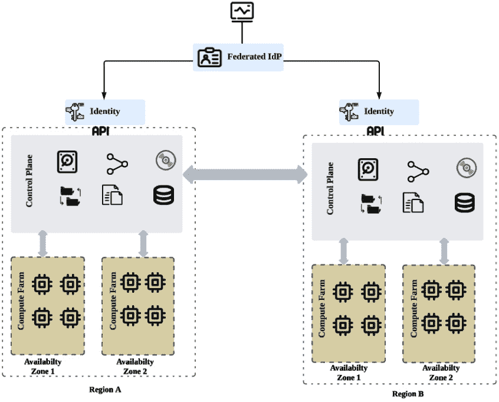

# 第四章：4

# OpenStack 计算 – 计算能力和规格

“魔法就是相信自己。如果你能做到，你可以让任何事情发生。”

– 约翰·沃尔夫冈·冯·歌德

作为私有云提供商，典型的 OpenStack IaaS 服务是其向最终用户提供的构建块。在 IaaS 服务的核心是计算服务，它在不同方面运行和管理工作负载的生命周期。OpenStack 基金会致力于通过定制 Nova 服务以不同方式扩展 OpenStack 生态系统的范围，并推出新服务。管理弹性数据处理（代号为**Sahara**）、管理数据库（代号为**Trove**）以及容器应用目录（代号为**Murano**）等新的流行项目，都是在 Nova 服务之上提供的服务的例子。

作为云操作员，在 OpenStack 环境中具备对计算资源和不同隔离方法的扎实理解，是成功运行私有云旅程和提供所需服务的基础要求。在撰写本版时，Nova 服务已有一些更新，除了周围更多相关特性和服务的出现。为了确保基于第一章详述的草案进行安全计算设计更新，有必要详细了解从 Antelope 版本开始发布的最新 OpenStack 版本中推出的新计算服务。在本章中，我们将讨论以下主题：

+   从架构角度重新审视 Nova 计算服务。

+   检查计算服务支持的最新的虚拟化程序。

+   探索大规模 OpenStack 计算部署的计算隔离概念。

+   揭秘过滤艺术，构建基于一系列策略的高级计算资源分配和托管工作负载的先进方法

+   讨论**容器编排引擎**（**COEs**）及其与 Magnum 集成的情况

+   学习如何以最灵活的方式使用新的流行 Zun OpenStack 容器服务来管理和操作容器。

+   使用 Kolla-Ansible 基础设施即代码范式，在运行中的 OpenStack 环境中配置和部署新的计算节点

# 计算服务组件

计算服务由多个组件组成，负责处理传入的计算请求，然后启动和管理实例，如下图所示展示的 Nova 架构：


图 4.1 – Nova 组件架构

让我们在以下章节中探索每个计算组件。

## API

**nova-api**组件通过排队消息服务处理不同（基于 HTTP 的）请求。请记住，在将计算请求转发到下一个 Nova 组件并建立完整工作流之前，API 是接受计算请求的第一个接口。

## 调度器

Nova 工作流抽象层中的下一个站点是 **nova-scheduler** 组件。它是工作流中的一个重要部分，决定每个传入的实例创建请求将在哪个计算节点上运行。

调度器组件使用多种过滤器和偏好设置，可以根据不同的需求和资源可用性进行定制。**过滤** 和 **加权** 是 Nova 调度器用来定制底层物理资源分配的主要机制。本章将详细拆解在 Antelope 版本及以后的版本中新增加的过滤器和加权参考。

## Conductor

一旦请求通过 **nova-scheduler** 进程处理，**nova-conductor** 组件将确保在物理主机上所做的预定保存在共享数据库中。**nova-scheduler** 进程需要事先检查数据库并验证可用容量，然后才能做出调度决策。与 OpenStack 生态系统中 Nova 项目的早期版本相比，conductor 组件是 Nova 工作流中的一项重要新增功能。作为上版的简要提醒，conductor 带来了安全性提升，防止计算节点直接访问数据库。在早期版本中，计算节点会直接更新它们在共享数据库中的状态。如果其中一台物理机器被攻破，这样可以减少数据库层面可能的安全漏洞带来的影响范围。如今，conductor 负责这一任务。conductor 组件的另一个重要新增功能是专门处理计算节点的操作，如调整大小、构建和迁移。

通过将这些能力集成到 **nova-conductor** 中，计算节点将作为简单的工作节点，只需将协调和数据库操作交给 conductor 进程处理。

## 计算

来到 Nova 工作流的末尾，**nova-compute** 组件将处理剩余的请求，通过与虚拟化管理程序（hypervisor）的交互来完成。OpenStack 计算核心为不同支持的虚拟化管理程序添加了各种新特性，使得每个新版本都比前一个版本更具吸引力。Nova 服务支持的虚拟化管理程序包括 Libvirt KVM、VMware vSphere、XenServer、XenAPI、Microsoft HyperV、**Linux 容器**（**LXC**）、快速模拟器（Quick Emulator）等。最令人兴奋的部分是，每个虚拟化管理程序的功能都在不断发展和集成，由拥有该虚拟化项目的供应商进行更新。本章将详细说明这些虚拟化管理程序，并突出一些常见的架构计算布局。

## 控制台访问

通过 OpenStack Horizon（仪表盘）或 **命令行接口**（**CLI**）访问虚拟机，在 OpenStack 社区的不同版本中得到了很好的开发。控制台访问不是运行完全工作 Nova 服务的必需组件，但它是与已分配来宾进行交互的附加方面。直到 *Liberty* 发布，**nova-console**、**nova-novncproxy** 和 **nova-consoleauth** 主要被认为是最稳定的控制台类型。现在，随着 Antelope 及之后的发布，更多的控制台类型已加入列表，如 SPICE 控制台和串行控制台，作为图形控制台的替代扩展。微软还通过 **远程桌面协议**（**RDP**）为控制台服务做出了贡献。然而，后者有一个限制，即仅支持 Hyper-V 并需要与 OpenStack 中尚未开发的控制台代理进行集成。因此，应提供第三方工具与控制台配置一起使用，例如可以在 GitHub 上找到的 FreeRDP-WebConnect 应用程序。与微软的 RDP 类似，VMware 也通过另一种控制台类型 **鼠标、键盘、鼠标**（**MKM**）做出了贡献。它绑定到基于 VMware vSphere 超级管理程序的虚拟机访问控制台，但与 OpenStack 中现有的控制台代理服务无关。在最新发布的版本中，随着控制台支持服务列表的不断增长，自 Train 发布以来，一个控制台支持服务已被弃用，即 **nova-consoleauth**。

相关的 Nova API 服务，包括 **nova-scheduler**、**nova-conductor** 和 **nova-api**，作为控制节点的一部分运行，**nova-compute** 服务则在每个计算节点上运行。Nova 计算服务的运行基于硬件平台和所选的超级管理程序，相关内容将在下一节中介绍。

# 超级管理程序的推理

通过浏览不同的 OpenStack 版本，Nova 支持多种 **虚拟机监控器**（**VMM**），也称为虚拟化管理程序。虚拟化管理程序软件允许访问物理机器硬件资源，并提供不同的功能来创建和管理计算节点中的虚拟机。在编写本书时，包括 Dalmatian 版本在内的最新 OpenStack 版本支持 **内核虚拟机**（**KVM**）、**LXC**、**QEMU**、**VMware vSphere**（5.1.0 及更高版本）、**zVM**、**Ironic**（原生 OpenStack 裸机）、**Hyper-V** 和 **Virtuozzo**（7.0.0 及更高版本）。不同的功能和虚拟机管理能力因虚拟化管理程序而异。每个虚拟化管理程序所支持的完整功能列表可以在官方的虚拟化管理程序支持矩阵中找到，网址为 [`docs.openstack.org/nova/latest/user/support-matrix.html`](https://docs.openstack.org/nova/latest/user/support-matrix.html)。请根据您的需求解析每个提供的功能。KVM 是 OpenStack **nova-compute** 设置中最常用的虚拟化管理程序，因其早期采用并且具有最大的一组支持功能。

重要提示

其他著名的虚拟化管理程序，如 **Xen**、**XCP**、**UML** 和 **Docker** 驱动程序，并未在最新的 OpenStack 版本中列出，包括 Antelope 和 Bobcat（2023 年 10 月发布）。Docker 驱动程序自 Havana 版本以来已被支持，并迁移到其独立的项目中，代号为 **Zun** 项目，后续将在本章中详细介绍。

Nova 计算服务使用 **Virt Driver** 通过 API 调用与 **Libvirt** 库进行交互，并通过虚拟化管理程序管理虚拟机，如下图所示：


图 4.2 – Nova 支持的计算型虚拟机监控器

Nova 中的虚拟化管理程序后端配置可以通过调整 **compute_driver** 选项来完成，配置文件位于 **/etc/nova/nova.conf** 中。

KVM 实现要求 **nova-compute** 部署在安装了 KVM 虚拟化模块的 Linux 服务器上。对于每个计算节点，请确保通过以下命令行正确加载 KVM 模块：

```
# lsmod | grep kvm
kvm_intel or kvm_amd
```

根据节点中支持的 KVM 模块（Intel 或 AMD），可选择性地将列出的模块添加到 **/etc/modules** 文件中，以便在重启时保存更改。

下一节将 KVM 作为我们生产计算节点中采用的主要虚拟化管理程序进行讨论。

# 计算隔离

OpenStack 设计上能够大规模扩展，以应对基础设施规模和用户需求的增长。由于计算服务是云基础设施的主力，设计计算层的可扩展性和业务连续性至关重要。定义计算隔离策略将帮助你了解私有云基础设施的限制，并预测用户的计算需求——这将在下一节中进行探讨。

## 基础设施隔离

根据可用计算集群资源、库存规格以及所使用的虚拟化管理程序，OpenStack 提供了多种可以利用的计算隔离机制，包括**可用区**、**区域**、**单元**和**主机聚合**。以下各个概念将在下一节中详细说明。

### 区域

OpenStack 术语表中的一个区域表示一个完全独立的 OpenStack 部署。从运营和管理的角度来看，每个区域可以暴露其自己的 OpenStack API 服务，包括计算资源。如果你计划进行 Nova 多区域部署，则应在每个区域创建一个 Nova API 端点，并将其添加到身份服务目录中。用户可以通过可用的计算 API 在可用的区域之间启动实例并分配工作负载。在多区域配置中运行工作负载为最终用户提供了诸多优势，但也给运营商带来了挑战，如维护 OpenStack 控制平面和共享服务层的一致性。这主要是因为计算资源在多个区域之间运行时可能会出现**脑裂**的风险。在多个区域运行的计算节点群集上托管用户工作负载需要采取一定方法来确保共享资源的一致性，如虚拟机镜像、数据库或文件共享。多区域一致性的另一个重要方面是处理请求计算资源的授权方式。常见的设计方法之一是通过联合的**身份提供者**（**IdP**）将所有身份验证调用集中到 Keystone，如下图所示：


图 4.3 – OpenStack 多区域部署

每个区域可以托管一个或多个定义为 *可用区* 的离散计算结构，这将在下一节中详细介绍。

### 可用区

一个区域可以逻辑上由一个或多个可用区组成。与区域设置不同，无需部署完整的独立 OpenStack 部署并在控制平面服务之间提供一致性。从物理实现的角度来看，计算节点将被拆分成称为 **故障域** 的逻辑组树。每个故障域将是给定机架内一个 **电源分配单元**（**PDU**）的一部分，且不同的虚拟化管理程序将在不同的机架上运行。这样，在失去与 **机架顶端交换机**（**ToR**）的连接或发生 PDU 故障时，用户工作负载不会完全崩溃，尤其是在多可用区配置中，如下图所示：



图 4.4 – 扩展的 OpenStack 多区域和可用区部署

Nova 可用区选项为用户工作负载提供高可用性，这可以视为对需要最高 SLA 的关键工作负载的高级选项。计算节点只能属于一个可用区，因为它绑定于机架的物理设计，如机架 ID、位置和 PDU。

重要提示

可用区的逻辑抽象除了覆盖计算服务外，还包括网络和块存储服务。

用户可以选择在哪个可用区启动实例。因此，监控每个可用区的计算资源使用情况至关重要。这将确保在需要时，每个可用区能够容纳更多的计算资源分配，同时确保用户可以在不同的区域间跨多个计算节点启动工作负载。

### 主机聚合

与可用区（Availability Zones）概念不同，主机聚合策略将计算节点基于更精细的硬件配置类别（定义为元数据）进行分组。这种分组可以基于特性定义，例如虚拟化管理程序（hypervisor）、存储类型、CPU 架构、网络速度等。云运营商应通过将一组元数据附加到选定的计算节点，提前创建不同的主机聚合。这样，用户可以通过选择响应工作负载需求的主机聚合来启动实例。元数据可以根据大量硬件规格创建，这取决于私有云运营商购买的硬件。例如，聚合可以为优化的磁盘主机组进行配置，基于 SSD、GPU 架构、高性能网络能力，甚至通过为单个租户聚合计算节点进行配置。一个计算节点可以属于一个或多个主机聚合。作为最佳实践，一旦计算节点到位，列出所有不同的硬件能力并将它们按照预期的工作负载进行分组，按树状结构进行排序是非常重要的。例如，如果 HPC 工作负载被包含在云业务案例中，面向最终用户，你可能会考虑提前基于 GPU 能力创建一个主机聚合，并将其暴露给最终用户。下图展示了提供四个主机聚合的使用案例，其中一些计算节点可以是多个主机聚合的组成部分：


图 4.5 – 在多个可用区的部署中进行主机聚合

之前的多区域隔离计算布局涉及四个不同的主机聚合，这些聚合可以跨不同的可用区进行分布，具体如下：

+   **主机聚合 1**（**HA_1**）：这涉及将一组计算节点在同一地区和可用区内进行分组，以适应需要低网络延迟性能的工作负载，如在大网络带宽和 GPU 架构下运行的 HPC 应用程序。该主机聚合中的工作负载没有高可用性作为主要要求。

+   **主机聚合 2**（**HA_2**）：该聚合涉及将一组计算节点分布在两个可用区内，并且位于同一地区，以适应需要大规模分布式工作负载的工作负载，例如运行 Hadoop 或 Cassandra 的大数据处理。主机聚合的元数据包括大网络带宽、基于 SSD 的优化磁盘和内存容量。

+   **主机聚合 3**（**HA_3**）：这涉及将一组计算节点分布在三个可用区内，并跨越两个区域，以适应需要最高级别可用性和可扩展性的关键工作负载，例如 Web 应用程序和电子商务网站。元数据描述了适中的网络带宽、磁盘、内存和 CPU 标准能力。

+   **主机聚合 4**（**HA_4**）：这涉及将一组计算节点组合在同一区域和可用性区域内，以容纳在 VSphere 环境中需要增强网络能力的工作负载。主机聚合的元数据包括配置为超虚拟化平台的 VMware，用以扩展现有的 VCenter 环境，并在 VMware 主机（运行 **nova-compute** 服务）之间分配应用负载。

本章稍后我们将演示，如何通过主机聚合方法、Placement 服务和 Nova 调度的结合，揭示出多种方式以最有效的方式为云用户托管不同类型的工作负载。

### 单元

OpenStack 中的单元概念主要是为了解决在单一 OpenStack 区域内大规模 Nova 部署的性能瓶颈。大量计算节点会增加主控制平面服务的负载，包括消息队列和数据库，导致性能下降，从而限制整个系统的扩展性。通过使用单元方法，可以解决 Nova 计算资源大规模部署的性能下降问题：计算节点可以在逻辑边界内进行分组，每个组都运行自己的数据库和消息队列服务。单元架构已经经历了不同的阶段，最终形成了两个版本：**CellV1** 和 **CellV2**。CellV1 是第一个版本，由于存在一些问题，未被广泛实施。自 OpenStack Ocata 发布以来，推出了 CellV2 版本，对前一版本进行了增强，并成为 **Pike** 版本中的正式版本。接下来我们将讨论这两个版本之间的主要区别。

#### CellV1

形成每个单元的计算节点的逻辑分组以树形结构安排，其中顶层单元称为**根单元**，它运行**nova-api**服务。第二层单元运行 Nova 计算服务，称为子单元，如下图所示：


图 4.6 – OpenStack 计算 CellV1 部署

运行 Nova API 和 Nova 计算的单元之间的交互通过专用消息队列进行，使用由一个单独的 Nova 服务 **nova-cell** 处理的 RPC 调用（这是 CellV1 在 Juno 发布中引入的一项重大增强）。每个单元都运行自己的消息队列进行交互同步，并由 **nova-cell** 用来选择在哪个单元中启动实例。这提供了更高层次的实例调度，但仅限于单元级别。一旦选择了单元，那个单元中的 **nova-scheduler** 服务将处理请求工作流的其余部分，以选择一个计算节点。

#### CellV2

初始的单元格版本经历了实验阶段，并未在大多数大型计算部署中成功采用。这主要是由于从单元格选择到所选单元格中的计算调度服务的多层次调度，以创建实例的复杂性。*图 4* *.6* 展示了一个由根单元格和子单元格组成的简单树形结构，但其他更广泛的部署可能会采用更多的子单元格，称为 **孙子** 单元格。第一个版本的另一个主要缺点是需要在单元格之间映射和同步的数据量（实例和计算节点信息），导致单元格之间发生繁重的数据复制过程。新的版本，称为 CellV2，已经在 Ocata 版本中被开发并正式采纳，通过解决先前版本的缺陷，引入了重大变化，例如删除了 **nova-cell** 组件和整体单元格架构，这不再是类似于 CellV1 的树状结构。以下图示展示了这一变化：


图 4.7 – OpenStack 计算 CellV2 部署

通过 Nova 的第二版单元格（CellV2）对超融合虚拟化节点进行分片涉及到在多单元格部署中调度工作流的重大变化，如前图所示。一个单元格 API 运行 **nova-api** 服务、**nova-scheduler**，以及最近的 Placement 服务（Placement 服务在 Cellv1 开发中没有被引入到 OpenStack 生态系统中），以统一调度所有定义的单元格中的资源。单元格 API 暴露一个名为 **nova_api** 的独立数据库，包含所有全局资源的元数据，如实例规格、配额、密钥对等。在多单元格部署中，API 单元格中的指挥器（conductor）称为 **nova-super-conductor**，它处理所有数据库的隔离。此外，从 API 层级来看，一个特殊的单元格称为 **Cell0**，它不运行任何服务，仅包含名为 **nova_cell0** 的数据库，里面存储有关由于调度器故障而无法启动的失败实例的信息。

每个单元格（cell）管理自己的计算节点资源，并且它们之间没有任何关联。每个单元格都有自己的数据库来存储实例信息，并使用自己专用的消息队列来协调本地单元格中的 **nova-conductor** 和 **nova-compute** 服务。新的 CellV2 方法涉及以下工作流程步骤来在多单元格部署中创建新实例：

1.  **nova-api**（在 API 单元格中）接收 API REST 调用，并将其转发到 **nova-scheduler** 服务（在 API 单元格中）。

1.  **nova-scheduler** 联系 Placement 服务，应用其筛选器，并确定将分配给哪个计算节点。

1.  **nova-api** 将映射实例信息存储在其 **nova_api** 数据库中（**instance_mappings** 表）。

1.  **nova-api** 将选定的计算节点记录存储在目标 cell 的数据库中（例如，如果选定的计算节点位于 **Cell01**，则为 **nova_cell01**）。

1.  **nova-api** 向 **nova-super-conductor** 发送 RPC 调用以构建实例。

1.  **nova-super-conductor** 向目标 cell 中的 **nova-conductor** 发起 RPC 调用，通过计算服务启动实例。

CellV2 架构与最初的 CellV1 架构发生了显著变化，去除了额外的调度层，并将数据划分到多个数据库中，而不是为每个请求进行复制过程。这样，扩展一个 cell 范围以迎接更多计算主机变得更加容易，而无需像 CellV1 中那样每个 cell 都经历整个同步过程。此外，新的 cell 架构简单，因为所有的 cell 都是平等的，使得整个多 cell 部署呈现平面结构（仅有两层），与之前基于树状结构的版本不同。一旦 cell 的逻辑布局设计完成并准备好部署，操作员只需选择将哪些虚拟机监控节点与哪些 cell 关联。与主机聚合、区域和可用区不同，用户并不需要了解 cell 的概念，因为 cell 策略主要是为了帮助云操作员在扩展大规模计算环境时提供最佳的管理和性能提升。

# 工作负载隔离

Nova 服务的最新功能通过区域、可用区、主机聚合和 cell 概念提供了不同的策略，以解锁一个完全可扩展的 OpenStack 计算基础设施。要全面了解大型部署，采用这些方法中的一种或多种将需要定义一个调度器元素来调度特定集的虚拟机监控主机上的实例。在实例启动过程中，**nova-scheduler** 服务发挥着核心作用，决定一个实例将被放置在哪个主机上。如 *第一章* 和 *第三章* 中所强调，最新的 OpenStack 版本都带有 Placement 服务，该服务在 Newton 版本中首次引入。Placement 服务与 Nova 调度器协同工作，为更先进、更精细的主机预过滤选择过程提供支持。为了充分利用上一节中定义的隔离方法，必须快速了解不同的计算调度方法，这些方法需要考虑到你在 OpenStack 部署中的整体计算隔离策略。

## 预过滤

设置一个专门的 Placement 服务，与 Nova 调度器一起运行，主要目的是解决大规模计算部署中的困境。在引入 Placement 服务之前，Nova 调度器必须遍历整个大规模部署中的所有计算农场，包括启用的过滤器，导致效率低下和性能问题。此外，由于 Nova 在计算资源的详细数量和库存使用方面的基本功能，计算节点报告的资源总和缺乏准确性。

随着 Placement 服务的出现，资源报告的逻辑发生了变化，通过在计算节点中添加 **resource_tracker** 组件，计算节点将其库存和可用资源报告给 Placement 服务，后者定期存储报告资源的完整同步。正如在 *第三章* 中详细描述的那样，*OpenStack 控制平面 – 共享服务*，Placement 服务通过定义 **资源提供者** 和 **traits** 来应用预过滤器，以便在 **nova-scheduler** 联系时对计算节点列表进行处理。在后台，**nova-scheduler** 通过传递不同的调度参数（如 **VCPU**，**DISK_GB**，**MEMORY_MB** 和 **VGPU**）通过 **GET API** 请求调用 **placement-api** 服务。这些请求将在 **placement-api** 层转化为 **trait** 请求。

## 资源提供者分配

如在*第一章*和*第三章*中回顾的那样，Placement 服务由 **nova-scheduler** 使用，用于在评估候选节点之前，根据特定属性列出一组经过预过滤的计算节点，如下图所示：


图 4.8 – OpenStack 计算资源分配工作流

当 **nova-api** 服务接收到用户请求创建新实例时，**nova-scheduler** 将向 **placement-api** 服务发出 **GET /allocation_candidates()** 请求。**allocation_candidates** 方法是一个资源提供者集合，根据请求中封装的属性分配资源。一个示例 API GET 请求使用以下格式作为筛选条件，以嵌入启动实例所需的资源：

```
GET/placement/allocation_candidates?resources=DISK_GB:500,MEMORY_MB:2048,VCPU:4
```

根据先前的请求，**placement-api** 服务将获取符合要求的主机，这些主机将容纳实例规格：500 GB 磁盘容量、2048 MB 内存和 4 个 vCPU。

前面的请求可以通过在请求字符串的末尾添加 **&required** 查询参数，扩展为根据资源特征进行筛选，因此分配查询将如下所示：

```
GET/placement/allocation_candidates?resources=DISK_GB:500,MEMORY_MB:2048,VCPU:4 &required=HW_CPU_X86_SVM
```

这样，**placement-api** 服务将结合所需的资源属性和额外的特征，筛选出支持 X86_SVM 架构 CPU 的主机。

通常，云运营商可以使用 OpenStack CLI 通过**allocation candidate**命令行来处理定位配置，如以下示例所示：

```
# openstack allocation candidate list --resource VCPU=4, 
MEMORY_ MB=2048,DISK_GB=500GB --required   HW_CPU_X86_SVM
```

这是输出：


图 4.9 – 注册分配的定位详情

影响后续调度器预过滤过程逻辑的主要参数是**allocation_requests**和**provider_summaries**。这些对象由**placement-api**服务返回给**nova-scheduler**服务，以两种类型的对象以 JSON 格式列出，数据结构如下：

+   **allocation_requests**：一个资源提供者列表，用于满足分配请求：

    ```
    "allocation_requests": [
            {
                "allocations": {
                    "ad54422c-b345-5v44-ba23-00cad76e376a": {
                        "resources": {
                            "DISK_GB": 500
                        }
                    },
                    "652f6729-cd55-4747-91a1-543adfeea2a": {
                        "resources": {
                            "VCPU": 4,
                            "MEMORY_MB": 2048
                        }
                    }
                }
            },
    ...
    ```

+   **provider_summaries**：满足分配请求的所有资源提供者的总资源和信息使用情况：

    ```
    ...
    "provider_summaries": {
            "ad54422c-b345-5v44-ba23-00cad76e376a": {
                "resources": {
                    "DISK_GB": {
                        "used": 0,
                        "capacity": 2000
                    }
                },
                "traits": ["SRG_SHARES_STORE"],
                "parent_provider_uuid": null,
                "root_provider_uuid": 
                  "ad54422c-b345-5v44-ba23- 00cad76e376a"
            },
            "652f6729-cd55-4747-91a1-543adfeea2a ": {
                "resources": {
                    "VCPU": {
                        "used": 0,
                        "capacity": 244
                    },
                    "MEMORY_MB": {
                        "used": 0,
                        "capacity": 192604
                    }
                },
                "traits": ["HW_CPU_X86_SVM", "HW_CPU_X86_SSE2"],
                "parent_provider_uuid": null,
                "root_provider_uuid": 
                  "652f6729-cd55-4747-91a1-543adfeea2a"
            },
    ...
    ```

JSON 格式的**provider_summaries**对象输出包括与资源提供者关联的特性。前面的输出示例显示了一个计算节点 UUID 为**52f6729-cd55-4747-91a1-543adfeea2a**的资源提供者，并标注了支持**HW_CPU_X86_SVM**和**HW_CPU_X86_SSE2** CPU 架构的特性类。

## 过滤

一旦**placement-api**服务将候选主机列表返回给**nova-scheduler**服务，后者会根据 Nova 服务中预配置的过滤器执行多种过滤操作。可以通过调整**enabled_filters**选项配置**/etc/nova/nova.conf**文件，以运行一个或多个调度器。

重要说明

**kolla-ansible**仓库中的调度器过滤器可以在**filter_scheduler**部分进行配置，位于**/kolla-ansible/ansible/roles/nova/templates/nova.conf.j2**文件中。

一些在调度器中默认配置和支持的常见过滤器如下：

+   **ComputeFilter**：返回一个完全可操作的超管主机列表，默认情况下应启用。

+   **ComputeCapabilitiesFilter**：返回能够启动具有请求规格实例的超管主机列表。例如，额外的规格可能包括验证运行 KVM 超管的计算主机。

+   **ImagePropertiesFilter**：返回符合实例镜像中定义的期望镜像属性的超管主机列表。镜像属性可以根据硬件架构或超管类型添加。例如，启动一个实例需要一个可以在支持 KVM 作为超管的主机上运行的镜像：

    ```
    # openstack image set --property img_hv_type=kvm img-uuid
    ```

重要说明

Liberty 版本的一个主要更新是图像属性被传递到筛选器进行检查。新的支持属性包括 **hw_architecture**（之前称为 **architecture**），它定义了硬件架构；**img_hv_type**（之前称为 **hypervisor_type**），它描述了超算类型；**img_hv_requested_version**（之前称为 **hypervisor_version_requires**），它定义了所需的超算版本；以及 **hw_vm_mode**（之前称为 **vm_mode**），它指的是超算应用二进制接口。

+   **ServerGroupAntiAffinityFilter**：该筛选器将同一组的实例调度到不同的超算主机。一个常见的使用场景是启动运行相同工作负载且需要额外高可用性的实例。要使用反亲和力策略创建服务器组，请在 Nova 命令行工具中使用 **--hint** 标志，如下所示：

    ```
    # openstack server group create --policy anti-affinity 
    pp_webgroup
    # openstack server create --image "Ubuntu 22.04" --hint group=122ee342-3345-2234-bac4-1515321e1ebb --flavor 5 "instance 01"
    # openstack server create --image "Ubuntu 22.04" --hint group=122ee342-3345-2234-bac4-1515321e1ebb --flavor 5 "instance 02"
    ```

    上述命令的结果将确保 **instance 01** 和 **instance 02** 是同一个应用服务器组 **pp_webgroup** 的一部分，并且具有 **122ee342-3345-2234-bac4-1515321e1ebb** UUID，并将在不同的计算节点上运行。

    +   **ServerGroupAffinityFilter**：该筛选器将实例调度到已经运行某个亲和力服务器组的相同超算主机。建议使用亲和力调度器筛选器来运行需要最高性能和低延迟的工作负载。要使用亲和力策略创建服务器组，请在 Nova 命令行工具中使用 **--hint** 标志，如下所示：

        ```
        # nova server-group-create --policy affinity pp_perfgroup
        # nova boot --image "Ubuntu 22.04" –hint group=44ee217-5543-9871-cda3-1e57522ecde1 --flavor 5 "instance 01"
        # nova boot --image "Ubuntu 22.04" –hint group=4ee217-5543-9871-cda3-1e57522ecde1 --flavor 5 "instance 02"
        ```

    上述命令的结果将确保 **instance 01** 和 **instance 02**，它们是同一个应用服务器组 **pp_perfgroup** 的一部分，并且具有 **144ee217-5543-9871-cda3-1e57522ecde1** UUID，将运行在同一计算节点上。

OpenStack 调度支持其他筛选器，并且在 OpenStack 的最新版本中包含了更多细粒度和自定义的选项。在撰写本版本时，最新的筛选器和配置的完整列表可以在[`docs.openstack.org/nova/latest/admin/scheduling.html#filters`](https://docs.openstack.org/nova/latest/admin/scheduling.html#filters)找到。

## 加权

加权是调度过程的最后阶段，在此阶段，**nova-scheduler** 服务会对从通过所有分配过滤器的放置中选择的每个候选主机进行评分。调度器将在最后阶段选择具有最高权重的计算节点。表面上看，加权逻辑似乎不复杂，但实际上需要考虑额外的因素。计算节点的度量值会定期监控并输入到数据库中，以跟踪主机的使用情况和资源声明。加权过程使用这些信息作为因素，并通过将每个计算节点的值标准化到 **0.0** 到 **1.0** 之间来计算权重。具有最多可用资源的计算节点（如监控所报告的）将被赋予最大值 **1** ，而具有最少可用资源的计算节点将被赋予最小值 **0** 。

标准化因子是根据可用资源使用以下公式计算的：

**(host_availability_resource - min_value_all)/(max_value_all –** **min_value_all)**

这里，适用以下规则：

+   **host_availability_resource** 是计算节点中可用资源的值

+   **min_value_all** 是所有计算节点中资源的最小值

+   **max_value_all** 是所有计算节点中资源的最大值

函数的第二步是将每个可用资源的每个计算节点的标准化值与相关的加权乘数相乘。在加权过程结束时，调度器将汇总所有标准化的权重，并选择得分最高的计算节点，概括如下：

**Σ** **(weight(i)*norm_factor)**

这里，适用以下规则：

+   **weight(i)** 是资源 **i** 的相关权重乘数

+   **norm_factor** 是为每个计算节点分配的标准化权重因子

以下示例通过计算五个计算节点中可用的 RAM 容量和 CPU 的标准化因子和权重来说明加权过程。该图展示了第一个节点子集大小（**子集 1**）– 这是 Nova 调度器通过过滤器评估的第一个主机列表，具体如下：


图 4.10 – OpenStack 计算加权机制

然后，调度器运行加权机制，并根据加权评分生成最合适的虚拟化主机，具体如下：

+   节点 A 和 D 容纳了最高的 RAM 容量，并被赋予最大权重，标准化为 **1** 。权重成本表示为 **100** （1 乘以 100）。

+   节点 B 和 C 拥有最小的 RAM 容量，且其标准化后的权重为 **0** 。权重成本表示为 **0** （0 乘以 100）。

+   节点 E 通过将先前的公式应用于计算归一化因子来分配归一化权重为 0.4，计算如下：(350 - 250) / (500 - 250)。权重成本表示为 40（0.4 乘以 100）。

+   主机 A 和 D 容纳最多的 CPU 数量，并分配了最大的权重，归一化为 **1** 。权重成本表示为 **100**（1 乘以 100）。

+   节点 C 具有最少的 CPU 容量，并分配了最小的权重，归一化为 **0** 。权重成本表示为 **0**（0 乘以 100）。

+   节点 B 和 E 通过将先前的公式应用于计算归一化因子来分配归一化权重为 0.5，计算如下：(10 - 5) / (20 - 10)。权重成本表示为 50（0.5 乘以 100）。

+   每个主机的最终权重计算方式是将每个 CPU 和 RAM 资源的权重成本相加，如下所示：主机 A（100 + 100），主机 B（0 + 50），主机 C（0 + 0），主机 D（100 + 100）和主机 E（40 + 50）。

在本例中，主机 A 和 D 均赢得了权重投标，调度程序将从第二个节点子集中随机选择一个来启动实例。资源可用性将反映在数据库中，并且调度程序将在每个新实例创建请求上相应地更新权重。

计算服务中引入的附加选项可以在管理和分发计算农场中的工作负载需求时非常方便。默认情况下，调度程序通过在可用主机之间分配实例来分散资源。在其他一些情况下，分派具有不同规格和大小的多个实例会在分配资源时创建并发问题，并因此阻止启动一部分实例。调度权重策略可以调整为使用 **堆叠** 方法。在这种情况下，实例将分配给第一个经过过滤的主机，直到其所有资源完全耗尽，然后再移动到下一个主机。堆叠方法的一个良好示例是服务器关联配置和权重机制的结合。

要在部署中自定义权重机制，请确保在 **/** **etc/nova/nova.conf** 文件中应用以下配置：

1.  通过设置 **compute_monitors** 参数在计算节点上启用监控以收集 CPU 指标：

    ```
    compute_monitors = cpu.virt_driver
    ```

1.  启用 **weights.all_weighers** 类：

    ```
    weight_classes = nova.scheduler.weights.all_weighers
    ```

1.  将主机子集大小设置为 **1** 。通过将主机子集大小设置为 **1** 来调整调度程序以选择具有最高权重的主机：

    ```
    host_subset_size = 1
    ```

1.  调整权重乘数为 **1** 。这样，新实例的启动将在计算节点之间均匀分布：

    ```
    weight_multiplier = 1.0
    ```

1.  调整 RAM 权重乘数为 **1** 。这样，将在具有空闲内存的计算节点之间均匀分布新实例的启动：

    ```
    ram_weight_multiplier = 1.0
    ```

重要说明

将加权乘数设置为**1.0**将使资源分配均匀分布在所有可用的筛选主机上。如果首选堆叠选项，则将权重乘数的关联值设置为**-1**。

1.  添加一个新的乘数来计算加权主机 I/O 操作。通过将权重乘数设置为**1.0**，指示 Nova 以最少 I/O CPU 指标均匀使用活动主机，如下所示：

    ```
    io_ops_weight_multiplier = 1.0
    ```

1.  在控制节点和每个计算节点上重新启动**nova-scheduler**和**nova-compute**服务，以应用更改：

    ```
    # service nova-compute restart
    # service nova-scheduler restart
    ```

重要提示

**kolla-ansible** 仓库默认情况下不提供 Nova 加权策略的低级配置。可以通过添加前述配置行，调整位于**/kolla-ansible/ansible/roles/nova/templates/nova.conf.j2**的**nova.conf**模板文件。还建议查看最新支持的**nova.conf** 设置，具体内容请参见此处的最新版本：[`docs.openstack.org/nova/latest/configuration/sample-config.html`](https://docs.openstack.org/nova/latest/configuration/sample-config.html)。

OpenStack Bobcat 版本引入了一个新的调度器权重计算器，**NumInstancesWeigher**，该计算器有助于根据每个计算节点托管的活动实例数量来调度实例。如前面的示例所示，将乘数值设置为**1**将启用**打包**策略，优先选择具有最多活动实例的主机。将值设置为**-1**则会优先选择**分布**策略，选择活动实例最少的主机。有关不同权重计算器的完整列表，请参见 [`docs.openstack.org/nova/latest/admin/scheduling.html#weights`](https://docs.openstack.org/nova/latest/admin/scheduling.html#weights)。

# 为容器扩展计算能力

自 2014 年以来，OpenStack 社区一直在围绕容器化技术开发其他项目，允许云用户利用不同的服务集在计算服务之上运行应用程序。最成熟且正在生产环境中使用的服务是**Magnum** 和 **Zun**，我们接下来将介绍这两个服务。

## Magnum

运行容器化环境的主要动机是以最小的配置复杂度运行和部署应用程序，这些应用程序便于移植且维护成本最低。运行由多个容器组成的工作负载需要一层编排来管理不同组件生命周期的逻辑，以及自动化的组件间通信。这被称为容器集群管理平台，例如**Mesos**、**Kubernetes**和**Docker Swarm**等。还有一些知名的公共云服务，如 AWS **Elastic Container Service**（**ECS**）、AWS **Elastic Kubernetes Service**（**EKS**）、GCP **Google Kubernetes Engine**（**GKE**）和**Azure Kubernetes Service**（**AKS**）。在 OpenStack 世界中，Magnum 是一个已集成到 OpenStack 生态系统中的项目代号，被称为 COE。像其他 OpenStack 服务一样，Magnum 暴露一个 API 与 COE（如 Kubernetes 和 Docker Swarm）作为一等资源进行交互。容器将部署并运行在虚拟化节点上。对不同容器引擎的支持让云运维人员能够为用户提供一系列可供选择的选项，如下图所示：


图 4.11 – OpenStack Magnum 多 COE 架构

Magnum 使用以下术语来表示每个 COE 节点集合及其关联的容器：

+   **Bay**：这是一组运行 COE 的节点。在 bay 的核心运行时，Magnum 调用 Heat 服务来部署 bay。Bays 只是通过 Heat 创建并编排的 Nova 实例集合，使用的镜像针对虚拟机和裸金属节点。

+   **BayModel**：这是一个资源集合，用于构建在简单模板中定义的 bay。一个 bay 可以使用相同的**BayModel**模板在不同的 COE 上运行。

+   **Pod**：这是在同一个 COE 节点上运行的一组容器。

+   **Service**：这是一个抽象，表示一组 bay 和访问策略的配置。

+   **Replication controller**：这是一个专门的进程，用于监控、复制、重启失败的容器，并在 COE 节点之间扩展 pods。

+   **Magnum client**：这是一个原生客户端，用于查询 COE，并且自带原生**Docker CLI**（用于 Docker COE）和**kubectl**（用于 Kubernetes COE）。

Magnum 成功的另一个关键因素是与其他 OpenStack 服务的良好集成，以下是相关功能：

+   **Identity**：这是与 Keystone 的集成，用于管理容器集群平台的身份认证和授权——例如，通过 Keystone 为用户创建 Kubernetes 角色以便在集群上执行操作任务。

+   **网络**：通过支持的网络驱动程序利用 Neutron 服务——例如，**Flannel**覆盖网络是 Kubernetes 和 Swarm COE 的默认网络，允许多主机通信并管理每个容器池中容器的 IP 地址。

+   **镜像**：为 Kubernetes 和 Swarm COE 提供了一个预构建的 Glance 镜像，可以配置并用于启动集群中的节点。

+   **存储**：官方支持的存储由 Cinder 提供，作为块存储有两种形式：临时存储和持久存储选项。除了 Docker 存储驱动外，Cinder 还提供了额外的后端存储，如**Rexray**作为卷驱动程序。在撰写本文时，Cinder 仅支持 Swarm 的 Rexray 驱动和 Kubernetes 的默认 Cinder 驱动。

Magnum 的其他主要亮点，已启动或正在进行中的部分，概述如下：

+   **安全性**：Magnum 架构是从设计上就考虑到安全性的。每个容器池（bay）都是相互隔离的，确保它们所承载的工作负载的安全性。此外，Magnum 通过防止容器池在 OpenStack 租户之间共享，实现了多租户布局。

+   **可扩展性**：集群节点的扩展是通过自动调整 Heat 模板属性或通过 OpenStack COE CLI 手动完成的。请注意，容器扩展将根据 COE 的集群容器配置来决定。

+   **高可用性**：在撰写本文时，Magnum 高可用性标准仅支持一个默认的可用区。计算节点组将会在同一个逻辑可用区中启动。OpenStack 社区正在考虑在未来版本中将 Magnum 集群节点的范围扩展到更多的多可用区。

自 Liberty 版本以来，Magnum 服务因其支持多种 COE（容器编排引擎）和逐步成熟而获得了许多赞誉，这些可以在数十个生产工作负载中看到。该服务使得工程和架构团队能够迁移到基于微服务的架构，而无需重新设计和重新集成现有的容器工具集。其他增强功能已被捕获，用户可以通过查看[`docs.openstack.org/magnum/latest/`](https://docs.openstack.org/magnum/latest/)上的发布更新来了解。

在当前的**kolla-ansible**基础设施代码库中，Magnum 服务默认未启用。通过在**/kolla-ansible/etc/kolla/globals.yml**文件中将**enable_magnum**设置为**yes**，可以启用 Magnum API 服务。请确保更新上一章节中创建的库存文件**/ansible/inventory/multi_packtpub**，通过在控制节点中添加 Magnum 服务，包括**magnum-api**和**magnum-conductor**服务，如以下配置代码所示：

```
…
[magnum:children]
control
[magnum-api:children]
magnum
[magnum-conductor:children]
magnum
…
```

重要说明

更多 Magnum 配置选项列在 Ansible 剧本中，位于 **/kolla-ansible/ansible/roles/magnum/default/main.yml** 文件下。此外，Horizon 支持 Magnum 面板，但默认情况下是禁用的，可以通过在 **/kolla-ansible/etc/kolla/globals.yml** 文件中将 **enable_horizon_magnum** 设置为 **yes** 来启用。

更新两个文件后，运行 CI/CD 流水线以推出 Magnum Ansible 剧本，并将 Magnum 服务容器作为 OpenStack 环境中的控制平面一部分提供。

## Zun

除了 Magnum 服务及其多种容器编排支持选项外，还有 Zun 服务——这是一个非常简单的服务，可以快速在 OpenStack 中运行容器，无需管理或部署基于 Kubernetes Pods 或 Docker Swarm 集群的容器编排环境。你只需运行一个 Zun 命令行来创建任何类型的容器，针对任何 Docker 仓库运行工作负载。为了消除 Magnum 和 Zun 用例之间的混淆，Zun 专注于通过 OpenStack 直接管理和操作容器，而无需与额外的编排工具层（如 Kubernetes 或 Swarm）交互，这与 Magnum 服务不同。另一个可能的混淆源是 Zun 与前 OpenStack 容器发起者 **nova-docker** 服务之间的区别。虽然 **nova-docker** 依赖 Nova API 服务来管理容器，但 Zun 独立于 Nova API，并利用其功能齐全的 API 接口来创建和操作容器。Zun 服务与多个灵活的 OpenStack 服务紧密集成，包括 Nova、Glance、Keystone、Neutron、Cinder、Ceilometer 和 Magnum，如下图所示：


图 4.12 – OpenStack Zun 计算集成

*图 4* *.12* 展示了 Zun 计算与 Neutron 和 Cinder 并行运行的另外两个服务，分别总结如下：

+   **Kuryr**：它与 Neutron 集成，通过 **libnetwork** 提供容器的高级网络功能。

+   **Fuxi**：它利用 Docker API 来管理由 Cinder 和 Manila 存储服务支持的卷。

当前 **kolla-ansible** 基础设施代码库中默认未启用 Zun 服务。要启用该服务，需在 **/kolla-ansible/etc/kolla/globals.yml** 文件中调整以下设置：

```
...
enable_zun: "yes"
enable_kuryr: "yes"
enable_etcd: "yes"
docker_configure_for_zun: "yes"
containerd_configure_for_zun: "yes"
...
```

确保通过在前一章节中创建的清单文件 **/ansible/inventory/multi_packtpub** 中添加 Zun 服务，包括 **zun-api** 和可选的 **zun-wsproxy**，将其作为控制平面的一部分更新，如下所示：

```
…
[zun:children]
control
[zun-api:children]
zun
[zun-wsproxy:children]
zun
```

**zun-compute** 和可选的 **zun-cni-daemon** 服务可以作为计算节点的一部分添加，如下所示：

```
...
[zun-compute:children]
compute
[zun-cni-daemon:children]
compute
…
```

重要提示

更多 Zun 配置选项列在 Ansible 剧本中的 **/kolla-ansible/ansible/roles/zun/default/main.yml** 文件中。此外，Horizon 支持仪表板中的 Magnum 面板，默认情况下该面板被禁用，可以通过在 **/kolla-ansible/etc/kolla/globals.yml** 文件中将 **enable_horizon_zun** 设置为 **yes** 来启用它。

一旦更新了这两个文件，运行 CI/CD 管道来部署 Magnum Ansible 剧本。Zun 服务及其相关进程将作为 OpenStack 环境控制平面的一部分在容器中启动。

重要说明

确保**etcd**守护进程在控制节点上运行。同样，确保 Docker 运行时和**kuryr-libnetwork**在计算节点上正确安装。

检查 Zun 服务是否可以通过 Zun 服务列表命令行执行：

```
$ openstack appcontainer service list
```

Zun 容器应在计算节点上创建。要列出已注册的 Zun 计算节点，请使用以下命令行：

```
$ openstack appcontainer create --name container_pp_zun cirros
```

使用 Zun CLI 创建容器是直接的。默认情况下，可以使用**Docker Hub**来拉取镜像并快速在指定的计算节点上运行容器。以下示例命令行使用 CirrOS 镜像创建一个 Zun 容器：

```
$ zun create --name container_pp_zun cirros
```

Zun 带来的一个令人惊叹的实操特性是通过使用原生 Docker API 或 Zun API 本身来灵活管理容器生命周期。例如，附加终端到正在运行的容器，可以通过运行 **openstack appcontainer attach <container_name>** 来执行，类似于执行 **docker attach** 命令行。

# 扩展计算农场

通过**kolla-ansible**管理计算集群 hypervisors 以生成实例或容器非常简单。在收集计算需求、硬件容量、工作负载类型和调度策略后，可以在不产生复杂操作开销的情况下即时执行计算节点的添加。应考虑的主要要求是列出计算服务，主要是**nova-compute**和网络插件代理，以提供与控制平面的连接性，并与**nova-scheduler**同步以进行每个资源分配。前一节展示了其他组件可以作为计算节点的一部分，包括 Zun 计算服务，如果您计划为最终用户提供一个简单快速的容器游乐场。通过**kolla-ansible**从代码管理计算节点的另一个方面是列出计算服务的可用配置选项，例如*第一章*，*重新访问 OpenStack - 设计考虑*中涵盖的 CPU 和内存超额配额。由于可能部署具有不同配置的多个计算节点，**kolla-ansible**提供了定制计算服务配置并使用**/etc/kolla/globals.yml**文件中定义的全局配置覆盖配置的方法。以下示例将指导 Kolla 添加名为**cn02.os.packtpub**的新计算主机（24 个 CPU 和 255 GB 的 RAM），具有支持 QEMU 作为 hypervisor 的自定义配置，并分别具有 CPU 和 RAM 超额配额比例为**8.0**和**4.0**：

1.  首先，在清单文件中填写主机名：

    ```
    …
    [compute]
    …
    cn02.os.packtpub
    ```

1.  在**/etc/kolla/config/nova/cn02.os.packtpub/**下创建一个新的**nova.conf**文件。Kolla 会查找**/etc/kolla/**下的任何可能的配置文件。如果找到一个配置文件，Kolla 将使用单独文件中提供的自定义设置覆盖和合并全局配置。请注意，您需要在**kolla-ansible**存储库中创建路径目录，包括计算节点的主机名，遵循**/etc/kolla/config/nova/COMPUTE_HOSTNAME/nova.conf**格式，其中**COMPUTE_HOSTNAME**是计算节点的主机名。

1.  编辑新创建的**nova.conf**文件，通过在新的部分中分别添加**8.0**和**4.0**的 CPU 和 RAM 分配比例值：

    ```
    [DEFAULT]
    cpu_allocation_ratio = 8.0
    ram_allocation_ratio = 4.0
    ```

1.  将所需的**qemu** hypervisor 添加到同一文件以在新的计算节点上运行：

    ```
    ...
    [libvirt]
    virt_type=qemu
    cpu_mode = none
    ```

1.  可以通过强制一组过滤器来覆盖默认调度程序，并使用**ComputeCapabilitiesFilter**过滤器来使用具有超过 250,000 MB 总可用 RAM 的任何主机：

    ```
    ...
    [filter_scheduler]
    enabled_filters = ComputeFilter,ComputeCapabilitiesFilter,
    ImagePropertiesFilter,ServerGroupAntiAffinityFilter,
    ServerGroupAffinityFilter
    ```

1.  可选地，您可以通过在同一主机上堆叠具有定义规格的实例来使用 RAM 筛选策略。这样，您可以确保计算节点恰好容纳一个定义数量的实例和特定规格，这样您就能提前预测。通过这种方式，250 GB 的内存可以被充分利用，不会留下任何小的空闲区域，否则这些空闲区域将无法使用。此时，采用的策略是堆叠策略，通过在同一个**custom nova.conf**文件中定义负权重乘数，如下所示：

    ```
    ...
    weight_classes nova.scheduler.weights.all_weighers
    ram_weight_multiplier -1.0
    ```

1.  使用您的 CI/CD 管道，在将代码合并到生产分支之前，触发运行作业以在暂存环境中部署代码，正如前几章所展示的那样。部署阶段应该在新的计算节点中配置新的额外 Kolla 容器，并开始与控制平面同步。

1.  一个受到本章所述筛选策略启发的资源分配示例，以及*第一章*，《重新审视 OpenStack – 设计考虑因素》，是将特定规格的实例分派到专用的计算节点。例如，云操作员会使用*步骤 5* 中描述的调度器过滤器，只为中等大小的分配请求配置实例。为了使该策略生效，请在控制节点中运行以下命令行：

    ```
    $ openstack flavor set m1.medium --property total_usable_ram_mb=">= 250000"
    ```

    启用的**ComputeCapabilitiesFilter**过滤器应匹配任何计算节点的属性与规格，依据其可用的内存属性为特定实例规格进行定义。如果第一个计算节点的可用内存低于 250 GB，则调度器很可能会将**m1.medium**规格的新实例请求分派到刚刚加入计算节点集群的新的计算节点。

在完成前述步骤后，一个新的计算节点应加入 OpenStack 计算集群，并基于过滤和加权机制配置了高级调度。任何新的计算请求，只要**m1.medium**规格的内存至少为 250 GB，就会在新的计算节点上启动。

# 摘要

在本章中，我们探讨了 Nova 服务带来的一些强大功能和附加特性。你应该已经了解了计算服务中最新更新所提供的广泛选择——从支持的虚拟化技术种类，到计算和工作负载隔离，再到过滤的艺术。调度是 OpenStack 中的一个关键要素，云操作员在处理日益增长的基础设施和高资源需求时，应该特别关注这一点。尽管我们没有涵盖所有可能的场景，但过滤机制是在 Nova 项目的早期就被引入的，本章展示了超出有限范围部署计算能力的扩展功能如今已经成为可能。感谢新版本的成熟 Nova CellV2，主机聚合和可用区概念使得大规模部署成为可能，前提是规划和设计得当，正如我们所学的那样。在本章的最后，我们讨论了作为 OpenStack 生态系统中流行容器项目的 Magnum 和 Zun。我们了解到，云用户可以使用 Magnum 作为 COE，运行原生容器应用程序，并且 Zun 作为与 OpenStack 生态系统周围不同核心服务高度集成的简单容器 API。此外，我们还学到，采用微服务原型和运行原生云应用程序不再是 OpenStack 用户的挑战。随着这些服务的不断发展，企业可以在私有云和公有云之间采用混合环境，这不仅得益于容器的可移植性和灵活性，还因为 OpenStack 已经证明了它能够在容器竞赛中与其他公有云厂商竞争。我们在本章中讨论了这一点。

Nova 并不是唯一一个经历更新的服务。包括文件共享、块存储和对象存储在内的存储服务也通过附加功能得到了增强，我们将在下一章中进行讲解。
