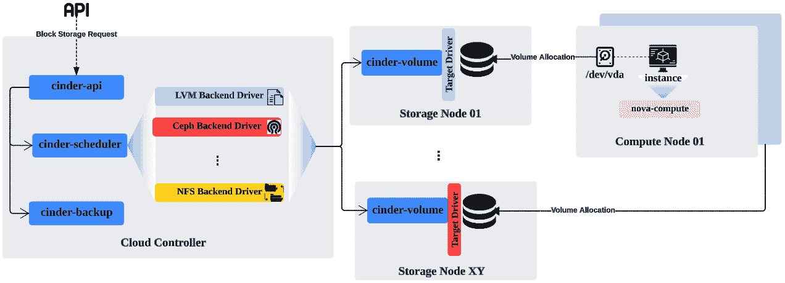

# 5

# OpenStack 存储 – 块存储、对象存储和文件共享

“毅力是所有胜利的秘诀。”

– 维克多·雨果

OpenStack 服务的广泛采用增加了用户需求，从而也扩展了其功能，正如上一章中对计算服务的展示那样。这种功能的变化也扩展了 OpenStack 的存储服务。运行工作负载的用户除了需要一个强大可靠的开箱即用的存储解决方案外，还需要多种存储类型。**软件定义存储**（**SDS**）方法的推广使得 OpenStack 社区能够采纳更多的存储项目，其中数据存储已从物理存储中抽象出来。存储系统可以建立在通用硬件之上，但这需要对每个存储项目的目的和背后的架构有充分的了解，然后才能将该服务暴露给云用户，以便他们运行工作负载。

本章将讨论并启用在现有 OpenStack 环境中的大量存储服务。在本章中，我们将涵盖以下主题：

+   回顾 OpenStack 中的 Cinder 块存储服务

+   通过配置三个最常用的驱动后端，使用 Kolla-Ansible 来扩展块存储设置，包括 LVM、NFS 和 Ceph

+   揭示 Cinder 中的调度状态并在现有集群中启用加权机制

+   讨论 OpenStack 中的 Swift 对象存储服务

+   使用 kolla-ansible 部署对象存储集群

+   探索最新的文件共享服务 Manila 更新

+   集成 Manila 服务并使用 **kolla-ansible** 部署它

# 定义块存储 – Cinder

Cinder 为实例提供持久存储。块存储服务通过每个 OpenStack 版本的更新得到了广泛发展，以支持更多的功能和厂商的后端驱动程序，从而支持多种存储设备的使用。常用的存储后端包括 **逻辑卷管理**（**LVM**）、IBM 存储驱动程序、NetApp 和 Dell 存储。在最新的 OpenStack 版本中，支持了新的后端驱动程序，如 Yadro、TOYOU 和 Pure Storage FlashArray。

存储设备通过 Cinder 的管理访问 API 访问，并提供对实例的直接访问，以便访问和附加卷。附加到实例的卷显示为一个额外的硬盘，可以分区并挂载到虚拟机的文件系统上。卷通常通过定义的存储路径进行访问，可以使用 iSCSI、NFS 和光纤通道等方式。需要记住的是，块存储是持久化的，这意味着当实例终止时不会丢失数据，这与临时磁盘不同。

在我们的多节点环境布局中，Cinder 服务的最新新颖性可以如下所示：



图 5.1 – 块存储核心架构。

核心 Cinder 组件可以总结如下：

+   **cinder-api**：处理块存储 REST API 请求和响应。

+   **cinder-scheduler**：像计算服务中的**nova-scheduler**一样，它在过滤步骤后将请求重定向到适当的**cinder-volume** 服务器，该服务器将处理并配置请求的卷。

+   **cinder-volume**：作为一个卷管理器，并在每个存储节点上运行。

+   **cinder-backup**：启用将卷备份到不同存储系统的功能。

默认的 OpenStack 部署将配备基于 LVM 的块存储后端。另一个非常常见的后端使用场景是**网络文件系统**（**NFS**），它利用现有的共享存储。在这种情况下，唯一需要做的就是配置 Cinder 服务，使其能够使用 NFS 驱动程序。通过查看 Cinder 驱动程序功能矩阵，确保了解最新支持的后端驱动程序，具体内容请参见：[`docs.openstack.org/cinder/latest/reference/support-matrix.html`](https://docs.openstack.org/cinder/latest/reference/support-matrix.html)。

驱动程序的存储后端应支持最基本的卷功能，如卷附加、分离、创建、删除、扩展、迁移以及从卷创建镜像。驱动程序还应提供快照管理功能，如创建、删除以及从快照或克隆卷创建卷。在最新的 OpenStack 版本中，可以根据每个后端驱动程序考虑更广泛的功能，这些功能在最新版本中被视为可选，如精简卷配置、实时迁移、多附加支持和**服务质量**（**QoS**）。在进行完整块存储部署之前，请确保扫描现有存储后端并在矩阵中反映支持的功能。

除了前述驱动程序的功能外，Cinder 还支持各种可配置的驱动程序，适用于不同的存储厂商，如 NetApp、IBM、VMware、Dell 和 Synology。请记住，并非所有后端产品都支持所有 Cinder 驱动程序功能。另一方面，前述的 Cinder 操作被视为在将新驱动存储后端包括到 Cinder 代码中时的*必备项*。

块存储的安全性也通过更详细的关于传输中和静态加密的内容进行了调整。Antelope 版本支持大多数 Cinder 驱动程序的 TLS，这是旧版本中安全团队处理来自不同服务端点以及终端用户发起的流量时的一个障碍。静态加密也达到了一个里程碑，允许使用 Cinder API 对卷中的数据进行加密。

另一个最近的 Cinder 增强功能是块存储备份功能。只需发出一个命令行，指示 Cinder 执行卷的完全备份或增量备份（如果备份已存在），变得更加简单。

## 使用多个后端扩展存储

我们的初始部署突出了使用专用节点来处理 OpenStack 环境中的存储和卷管理。在接下来的部分中，我们将扩展初始部署，详细介绍 *第二章* ，*以正确的方式启动 OpenStack 设置 – DevSecOps*。根据使用的存储后端，可能会有额外的节点专门用于托管 Cinder 卷，作为数据平面的一部分。云控制器节点托管 Cinder API 和调度服务。

### 使用 LVM 部署

OpenStack 的默认块存储后端是 LVM。**cinder-volume** 服务使用 iSCSI 目标来操作和管理存储节点中逻辑卷的访问。

在存储节点上，我们将创建一个 LVM 物理卷组。在本示例中，我们假设 **/dev/sdb** 是目标存储节点上可用的块设备：

```
$ pvcreate /dev/sdb
```

重要说明

根据操作系统的不同，磁盘分区的名称可能会有所不同。你可以通过使用 **fdisk** 命令行工具检查这些名称。

接下来，创建一个名为 **cinder-volumes** 的新卷组：

```
$ vgcreate –f cinder-volumes /dev/sdb
```

在 **kolla-ansible** 代码库中，将新存储主机名添加到位于 **/ansible/inventory** 中的库存文件 **multi_packtpub_prod**。在此示例中，我们将使用 **storage02.os** 存储节点：

```
…
[storage]
storage02.os.packtpub
[cinder-volume:children]
storage
…
```

在 **/** **etc/kolla/globals.yml** 文件中启用 LVM 后端：

```
…
enable_cinder_backend_lvm: "yes"
…
```

重要说明

启用 LVM 后端后，**kolla-ansible** 激活了 Ubuntu 操作系统自带的 iSCSI 模块，并且在 Cinder 角色中默认配置，该角色位于 **/kolla-ansible/ansible/roles/cinder/defaults/main.yml** 文件中。对于 CentOS 发行版，确保提前安装了 **LioAdm iSCSI** 目标助手。

在 **/** **etc/kolla/globals.yml** 文件中配置之前创建的 Cinder 卷组的名称：

```
…
cinder_volume_group: "cinder-volumes"
…
```

在将额外的节点提升为生产节点之前，首先在你的暂存环境中运行 CI/CD 流水线。一旦部署，目标存储节点应运行一个新的 kolla 容器，容器内运行 **cinder-volume** 服务。

### 使用 NFS 部署

NFS 是另一个常用的存储后端。在现有的 NFS 存储中，云操作员可以通过 NFS 协议平稳地管理卷。创建的共享将可用并由 **cinder-volume** 服务挂载到计算节点上。Cinder NFS 驱动程序使得访问共享 NFS 服务器上的文件镜像成为可能，并将文件映射为块存储提供给实例。

在以下示例中，可用的 NFS 服务器名为 **nfs-host-pp**，共享文件路径为 **nfs-host-pp:/nfs/share/cinder**。

通过运行以下命令，在目标存储节点上创建共享文件：

```
 $ echo "nfs-host-pp:/nfs/share/cinder" > /etc/cinder/nfs_share
```

确保在计算节点和存储节点上都安装了 NFS 客户端。你可以使用 Ansible 或以下命令行工具来完成此操作：

```
 $ apt-get install nfs-common
```

在块存储节点中启用**cinder-volume**，通过调整文件权限访问共享文件：

```
$ chown root:cinder /etc/cinder/nfs_share
$ chmod 640 /etc/cinder/nfs_share
```

在 NFS 后端中，确保在**/etc/exports**文件中指定存储节点上的共享目录路径、存储网络和访问模式，包括共享、读写和非 root 远程用户访问：

```
/nfs/share/cinder 10.30.0.0/24(rw,sync,no_root_squash)
```

对于自定义 NFS 部署设置，您可以在**/etc/kolla/config**下创建一个新的配置文件，在运行**kolla-ansible**时会优先使用该文件。以下示例配置文件，名为**nfs_shares**，将包含一个目标存储节点**storage02.os**，并带有自定义的 NFS 挂载文件共享：

```
…
storage02.os:/nfs/share/cinder
…
```

在**/etc/kolla/globals.yml**文件中启用 NFS 后端：

```
…
enable_cinder_backend_nfs: "yes"
…
```

在通过新的 NFS 共享配置运行作业 CI/CD 流水线时，将会重启目标存储节点中的**cinder-volume**服务。部署并运行后，新的 NFS 共享目录应已挂载并在存储节点中可见。在存储节点上，运行以下命令行验证已映射的 NFS 挂载：

```
 # mount | grep nfs
nfs-host-pp:/nfs/share/cinder on /etc/cinder/nfs_share 223af296419e436d9142928374d8e57e
type nfs4
(rw,relatime,vers=4.1,rsize=81921,wsize=81921,namlen=255,hard,proto
=tcp,port=0,clientaddr=10.30.255.1,local_lock=none,addr=10.30.255.1
)
```

每个 NFS 共享使用**/etc/cinder/nfs_share**下的一个挂载点，并带有哈希目录**223af296419e436d9142928374d8e57e**，该目录将托管任何新创建的卷。您可以通过运行以下命令行来检查：

```
# openstack volume create --size 10 nfs-volume
```

新卷应位于 NFS 挂载点的哈希目录下：

```
# ls /etc/cinder/nfs_share/223af296419e436d9142928374d8e57e
volume-b2be4de1-6e42-e3de-15e8-a72b60ca91ef
```

NFS 存储在 OpenStack 中是一种非常流行的存储后端。另一种类型的后端基于 SDS，下一节将会介绍该内容。

### 使用 Ceph 部署

自 Ceph 的早期以来，其 SDS 系统取得了显著的成功。Ceph 旨在大规模扩展至可运行在普通 x86 硬件架构上的 exabyte 存储池。此外，Ceph 接口支持大多数存储类型，包括对象存储、块存储和文件共享。

OpenStack 基金会承诺确保 Ceph 的集成，并且可以将其纳入现有的 OpenStack 环境中。其核心是**可靠的自适应分布式对象存储**（**RADOS**），用于处理 Ceph 存储集群中对象的分发、复制和管理。基于 Ceph 的 RADOS 设计，操作员可以定义 Ceph 存储池，作为块存储并为 OpenStack 实例提供卷。这可以通过另一种成熟的 Cinder 后端驱动程序实现，称为**RADOS 块** **设备**（**RBD**）。

重要提示

Ceph 的官方文档提供了使用 cephadm 设置 Ceph 集群的完整说明，地址为[`docs.ceph.com/en/latest/cephadm/install/`](https://docs.ceph.com/en/latest/cephadm/install/)。

Ceph 定义了一组核心逻辑组件：

+   **对象存储设备**（**OSDs**）：这些对应于文件系统中的物理磁盘，如**XFS**或**Btrfs**。

+   **监视守护进程服务器**（**MON**）：监控每个 OSD 节点的数据一致性状态和其他度量指标。

+   **池**: 提供存储在 OSD 中的对象映射。

+   **放置组** (**PGs**): 存储的每个对象和 OSD 的映射。将对象复制到池内多个 OSD 中。

如果你有一个现有的 Ceph 集群或愿意部署一个新的集群，下面的操作指南将引导你完成在 OpenStack 中进行基本 Ceph 集成所需的步骤。在以下示例中，三个 Ceph 节点组成的专用集群运行 **ceph-osd**。可选地，**ceph-mon** 会在云控制节点上运行，如下图所示：


图 5.2 – OpenStack 中的 Ceph 存储集成

确保你在每个控制节点、计算节点和存储节点上安装了 Ceph 客户端和 Python **rbd** 库包。如果 Ceph 客户端尚未安装，可以运行以下命令行：

```
$ apt-get install ceph-common python-rbd
```

在 Ceph 节点上创建一个 Cinder 使用的存储池：

```
$ ceph osd pool create cinder-volumes 256
```

使用 **rbd** 命令行界面初始化创建的池：

```
$ rbd pool init cinder-volumes
```

创建 Ceph 用户和密钥环，以便 Cinder 访问创建的 **cinder-volumes** 池：

```
$ ceph auth get-or-create client.cinder mon 'profile rbd' osd 'profile rbd pool=cinder-volumes' mgr 'profile rbd pool=volumes' > ceph.client.cinder.keyring
[client.cinder]
key = QA7sduw73dx83ks02210dj9Lmfj00sdju3ndoy==
```

将创建的密钥环复制到 OpenStack 部署者、存储节点和计算节点：

```
# ceph auth get-or-create client.cinder | ssh storage02.os sudo tee /etc/kolla/config/cinder/cinder-volume/ceph.client.cinder.keyring
# ceph auth get-or-create client.cinder | ssh cc01.os sudo tee /etc/ceph/ceph.client.cinder.keyring
# ceph auth get-or-create client.cinder | ssh cn01.os sudo tee /etc/ceph/ceph.client.cinder.keyring
```

通过运行以下命令行，验证 Cinder 客户端是否能够访问 Ceph 集群：

```
# ceph –s --name client.cinder --keyring /etc/ceph/ceph.client.cinder.keyring
```

在 **/** **etc/kolla/globals.yml** 文件中启用 Ceph 后端：

```
…
cinder_backend_ceph: "yes"
…
```

此外，确保在 **globals.yml** 文件中指定 Ceph cinder 用户、池的名称和密钥环：

```
…
ceph_cinder_keyring: "ceph.client.cinder.keyring"
ceph_cinder_user: "cinder"
ceph_cinder_pool_name: "cinder-volumes"
…
```

从 **/** **etc/kolla/passwords.yml** 文件中设置 RBD Cinder UUID 密钥：

```
# cat /etc/kolla/passwords.yml |grep cinder_rbd_secret_uuid cinder_rbd_secret_uuid: 612271b2-4537-3e21-65fa-a2e2523d3e421
```

从 Ceph 节点复制 **ceph.conf** 文件到自定义的 **/etc/kolla/config/cinder** 目录。这里展示了一个 Ceph 配置摘录示例：

```
[DEFAULT]
enabled_backends=rbd-1
[rbd-1]
rbd_ceph_conf=/etc/ceph/ceph.conf
rbd_user=cinder
backend_host=rbd:volumes
rbd_pool=cinder-volumes
volume_backend_name=rbd-1
volume_driver=cinder.volume.drivers.rbd.RBDDriver
rbd_secret_uuid = 612271b2-4537-3e21-65fa-a2e2523d3e421
[client]
rbd_cache = True
rbd_cache_size = 335544320
auth_cluster_required = cephx
auth_service_required = cephx
auth_client_required = cephx
...
fsid = 83baa63b-c421-480a-be24-0e2c59a70e17
mon_host = 10.30.0.22
mon_initial_members = ceph-1
cluster_network = 10.30.0.0/24
...
```

通过运行作业 CI/CD 流水线来滚动更新新更改。**kolla-ansible** 剧本将重新启动 **cinder-volume** 容器，并应用新的配置。存储节点应启用 Ceph RBD 驱动程序，并且能够正常访问 Ceph 集群。新的卷请求应触发 **cinder-volume** 在 **cinder-volume** Ceph 池中创建该卷。

OpenStack 运维人员可以同时利用多个存储后端。为了有效地启用这种能力，Cinder 支持一种特殊的调度机制。我们将在下一节中探讨此功能。

## 存储过滤和调度

如前一节所示，Cinder 支持多种存储后端。块存储请求及其相关的存储后端类型由**cinder-scheduler**处理。与计算调度服务类似，块存储调度服务负责将每个要创建的卷分配到存储池中可用的特定后端。Cinder 调度器使用过滤策略来选择最适合新卷创建请求的后端。根据存储信息的能力，将评估几个过滤标准，例如状态、可用空间和磁盘状态。之后，**cinder-scheduler** 使用加权机制，为每个过滤后的后端分配权重并进行排序，如下图所示：


图 5.3 – Cinder 的调度和过滤机制

调度器定期检查列出后端的状态，并持续更新存储后端候选列表。

默认情况下，Cinder 使用 **CapacityFilter** 进行过滤，并使用 **CapacityWeigher** 进行加权，基于存储容量利用率对卷后端进行过滤。最新的 Cinder 调度器过滤器和加权器，至少在 Bobcat 版本之前，可以在 [`docs.openstack.org/cinder/latest/configuration/block-storage/scheduler-filters.html`](https://docs.openstack.org/cinder/latest/configuration/block-storage/scheduler-filters.html) 和 [`docs.openstack.org/cinder/latest/configuration/block-storage/scheduler-weights.html`](https://docs.openstack.org/cinder/latest/configuration/block-storage/scheduler-weights.html) 中找到。以下 Cinder 调度器加权器列表在 OpenStack 版本更新中发生了变化，列出了在大规模部署中最常用的加权器：

+   **CapacityWeigher**：根据最可用和空闲的存储容量，为存储后端分配最高权重。

+   **VolumeNumberWeigher**：在调度器过滤的不同存储后端之间平衡卷分配。这是将多个卷创建请求均匀分配到共享相同名称的不同后端的最佳选择。

+   **GoodnessWeigher**：一种更精细的加权器，基于特定的存储属性分配卷。它使用一个公式评估存储后端，使用评分函数，表示为 **goodness_function**，格式为 **"(property_rule )?challengeVal1 : challengeVal2"**。根据对 **property_rule** 的评估，权重的分配在 **0**（最低）和 **100**（最高）之间变化，具体如下：

    +   如果 **property_rule** 返回 **true**，则存储后端将分配 **challengeVal1** 值的权重

    +   如果 **property_rule** 返回 **false**，则存储后端将分配 **challengeVal2** 值的权重

以下的逐步配置将演示如何使用 Cinder 调度，通过启用默认的过滤器并使用**GoodWeigher**为每个卷请求选择理想的存储后端。在此配置中，我们在前面的章节中配置的两个存储后端将分别用于 LVM 和 Ceph。我们可以继续通过创建一个新文件**/etc/kolla/config/cinder/cinder.conf**来添加自定义调度配置。运行**kolla-ansible**将会把**/etc/kolla/config/cinder**目录下的任何配置文件与**/kolla-ansible/ansible/roles/cinder/templates/cinder.conf.j2**文件中的主模板配置合并。新文件将按以下设置进行配置：

1.  在新部分中启用调度器列表：

    ```
    [default]
    scheduler_default_filters = DriverFilter,CapacityFilter,CapabilitiesFilter
    ```

1.  将**GoodnessWeigher**作为主要的加权机制添加，具体如下：

    ```
    scheduler_default_weighers = GoodnessWeigher
    ```

1.  对于每个后端部分，添加**goodness_function**来根据存储提供商的能力定义评分。下一个简单配置评估卷的大小，并检查两个后端**lvm-1**和**rbd**的利用率是否都低于 50%。如果是，分别将分配**50**和**80**的权重。在这种情况下，**rbd**是放置卷的最佳候选者。如果**lvm-1**的后端利用率大于 50%，而**rbd**小于 50%，加权器将会为**rbd**分配**80**的权重，为**lvm-1**分配**30**的权重。最后一种加权逻辑是当两个后端的利用率都大于 50%时——在这种情况下，将选择**lvm-1**，赋予其**30**的权重，相比之下**rbd**被赋予**20**的权重：

    ```
    [lvm-1]
    ...
    goodness_function = "(capabilities.utilization < 50.0)?50:30"
    ...
    [rbd]
    ...
    goodness _function = "(capabilities.utilization < 50.0)?80:20"
    ```

1.  运行相同作业的 CI/CD 流水线，并确保**kolla-ansible**会使用新配置重新启动**cinder-volume**容器。**cinder.conf**文件应具有配置的调度器和加权器的扩展配置列表。

Cinder 提供了构造来请求具有特定存储后端的卷，使用卷类型。以下示例显示了如何为 LVM 和 Ceph 定义两个卷类型，基于每个后端名称在创建卷时使用：

```
$ openstack volume type create lvm_standard
$ openstack volume type set lvm_standard --property volume_backend_name=lvm-1
$ openstack volume type create rbd_large
$ openstack volume type set rbd_large --property volume_backend_name=rbd-1
```

用户应该能够根据前面命令行中定义的存储类型透明地创建卷。存储池可以分为具有复制功能的大型块存储，定义为**rbd_large**，以及第二个用于一般用途的标准存储功能，定义为**lvm_standard**：

```
$ openstack volume create --size 10 --type lvm_standard general_volume
$ openstack volume create --size 50 --type rbd_large large_volume
```

在此场景中，Cinder 调度器将分别为每个卷请求分配指定的后端存储——**lvm-1**和**rbd**。在其他情况下，两个或多个存储后端可以共享相同的卷后端名称**volume_backend_name**——在这种情况下，调度器将根据其调度和加权过滤器推广存储后端类型。

通过集成各种存储解决方案和先进的调度机制，云运营商可以利用每个存储解决方案中的一系列功能，通过单一的 Cinder 界面进行管理。除了块存储选项外，OpenStack 还提供了一个专注于对象的存储服务，代号为 Swift。我们将在下一节中讨论此内容。

# 回顾对象存储 – Swift

**Swift** 是一种专门用于存储大规模非结构化对象数据（如文本或二进制数据）的服务。它使 OpenStack 操作员能够通过使用普通存储构建分布式对象存储系统。Swift 服务的标志性特点在于它的设计方式，确保数据的可用性和持久性。可以在 OpenStack 云环境中运行的多个工作负载（如 Web 应用程序）可以通过享受这种简单服务的使用和管理优势，以及其透明的数据复制和水平扩展功能，从而利用对象存储。

## 回顾 Swift

Swift 的逻辑核心组件主要包括以下内容：

+   **账户服务器**：表示与 Swift 账户关联的容器列表的命名空间。

+   **容器服务器**：指的是在 Swift 账户中用户定义的存储区域，用于存储对象列表。

+   **对象服务器**：管理容器中的实际对象。对象存储定义了实际数据及其元数据的存储位置。每个对象必须属于一个容器。

+   **代理服务器**：处理不同类型的传入对象 API 或 HTTP 请求，如容器创建、对象上传和删除。

+   **分区**：管理对象、容器和账户数据库的位置。

+   **区域**：在物理区域隔离内分隔对象，以防止在集群中发生区域性故障时导致更广泛的数据丢失。

+   **环**：定义对象、账户和容器的逻辑映射，并将其映射到 Swift 集群中的物理位置。Swift 对每个存储构造使用一个环。它还使用 **swift-ring-builder** 来创建集群的清单并创建分区。

如下图所示，每个分区将有三个副本，反映同一个对象、容器或账户的三个副本，以保持数据的高可用性：


图 5.4 – 三区域布局中的 Swift 环和复制

与之前的核心组件一样，Swift 使用额外的后台守护进程来管理对象的索引、更新和复制。

## 构建 Swift 集群

在将对象存储集群与现有的 OpenStack 环境集成之前，应该考虑多种参数。重点应放在硬件需求上，以实现高可用、独立且可扩展的集群。以下是部署 Swift 集群的起点：

+   **对象存储容量**：100 TB

+   **每个** **机箱的硬盘插槽数量** ：50

+   **硬盘存储容量** ：3 TB

+   **推荐的集群** **副本** ：3

+   **支持的** **文件系统** ：XFS

根据推荐的三副本策略，总存储容量应为推荐大小的三倍，即 **3 * 100 =** **300 TB**。

使用 XFS 作为文件系统需要在存储中增加 1.0526 倍的元数据开销。所需存储空间的四舍五入计算方式如下：

**300 * 1.0526 =** **316 TB**

使用所需的总空间将帮助您计算所需的硬盘数量，如下所示：

**316 / 3 =** **106 个硬盘**

存储节点的数量将根据以下方式确定：

**106 / 50 =** **3 节点**

我们的初始集群将由三个存储节点组成，这些节点将承载容器、账户和对象。为了管理 Swift 请求，在我们的初步草图中，我们将 **swift-proxy** 服务器分配到控制节点上。将 **swift-proxy** 角色保持在控制节点上的一个问题是可能会导致云控制器资源的过载。作为云运营商，建议监控到达 **swift-proxy** 服务的对象 API 请求，并在存储集群继续扩展时，根据大小和使用情况，开始将其迁移到专用硬件。

处理扩展的 Swift 存储系统时，另一个关键的考虑因素是网络布局。在我们的初步设计草图中，网络接口专门用于处理存储。根据 Swift 架构，还可以分配更多接口用于不同的网络用途。具体列举如下：

+   **存储接口** ：一个代理服务器，用于接口存储节点，运行对象、容器和账户服务器。相关配置在 **kolla-ansible** 中定义，位于 **globals.yml** 文件中，配置项为 **swift_storage_interface**。

+   **复制接口** ：可选地，每个存储节点可以为处理存储节点之间的 Swift 存储复制而专门配置一个附加接口。相关配置在 **kolla-ansible** 中定义，位于 **globals.yml** 文件中，配置项为 **swift_replication_interface**。在当前设置中，此选项未被考虑，复制流量将使用存储接口进行处理。

+   **内部 API 接口** ：可以定义此接口以允许用户在内部访问代理服务器。相同的接口可以被 HAProxy 用来在两个或更多的 swift-proxy 服务之间建立负载均衡，确保高可用性。相关配置在 **kolla-ansible** 中定义，位于 **globals.yml** 文件中，配置项为 **api_interface**。在当前设置中，此选项未被考虑。

+   **外部 API 接口** ：可选地，当工作负载需要公共 API 访问时，Swift 可以在外部访问。相关的配置在 **kolla-ansible** 中定义，在 **globals.yml** 文件中作为 **kolla_external_vip_interface** 。在当前设置中，此选项未考虑。

由于其常见的使用案例，Swift 可以轻松地呈指数级扩展；因此，云运维人员应预期基础设施可能会增长。一个常见的痛点是被限制在有限的硬件配置中，而事先未为此做好准备。当运维人员发现网络性能下降时，拥有额外的网络接口将是一个巨大的优势。将不同类型的流量分配到专用接口将避免操作过载和应急处理的负担。

## 运行 Swift

在使用 **kolla-ansible** 部署 Swift 集群之前，我们需要准备存储节点文件系统。以下 shell 脚本将会在每个可用磁盘上创建分区——**sdc** 、**sdd** 和 **sde** ——这些分区应在每个存储节点中运行：

```
for i in sdc sdd sde; do
     parted /dev/${i} -s -- mklabel gpt mkpart KOLLA_SWIFT_DATA 1 -1
done
```

对于每个创建的分区，使用以下 shell 脚本创建一个 XFS 文件系统：

```
loop=0
for i in sdc sdd sde; do
     sudo mkfs.xfs -f -L i${loop} /dev/${i}1
    (( loop++ ))
done
```

重要提示

文件系统标签被称为 **KOLLA_SWIFT_DATA** ，应在存储节点中可见。设备名称应与 **globals.yml** 文件中的配置设置相匹配，由 **swift_devices_name** 设置定义。

接下来，生成环以准备 Swift 集群中的映射对象。撰写时，Object Storage 操作手册尚未自动化环生成过程。从生成对象环开始，然后从部署节点运行以下脚本。脚本的第一部分分别定义了集群存储 IP 地址、Swift Kolla 镜像以及自定义 Swift Kolla 配置路径的新目录：

```
$ STORAGE_NODES=(10.30.0.81 10.30.0.82 10.30.0.83) 
$ KOLLA_SWIFT_BASE_IMAGE="kolla/ubuntu-source-swift-base:8.0.5" 
$ sudo mkdir -p /etc/kolla/config/swift
```

Swift 使用 **swift-ring-builder** 工具来生成对象环。环构建命令的通用格式如下：

```
swift-ring-builder <builder_file> create <part_power> <replicas> <min_part_hours>
```

在这里，我们有以下内容：

+   **<builder_file>** ：这可以是 **account.builder** 、**container.builder** 或 **object.builder** 中的一个。

+   **<part_power>** ：分区数近似为 2 的最接近幂次，以获得集群的 part power。例如，对于 50 个硬盘，推荐的 part power 为 11，这使得所有分区的平均值为 2,048。建议将近似值向上舍入。

+   **<replicas>** ：推荐值是选择三个副本。

+   **<min_part_hours>** ：这决定了在一个小时内只能移动一个分区副本的时间。

Rackspace Lab 提供了一个在线工具来计算 Swift 环。该工具可以在 [`rackerlabs.github.io/swift-ppc/`](https://rackerlabs.github.io/swift-ppc/) 找到。

脚本的下一部分将为对象构建环，并通过向端口 **6000** 上的环添加可用设备来迭代每个存储节点：

```
docker run \
  --rm \
  -v /etc/kolla/config/swift/:/etc/kolla/config/swift/ \
  $KOLLA_SWIFT_BASE_IMAGE \
  swift-ring-builder \
    /etc/kolla/config/swift/object.builder create 11 3 1
for node in ${STORAGE_NODES[@]}; do
    for i in {0..2}; do
      docker run \
        --rm \
        -v /etc/kolla/config/swift/:/etc/kolla/config/swift/ \
        $KOLLA_SWIFT_BASE_IMAGE \
        swift-ring-builder \
          /etc/kolla/config/swift/object.builder add \
          r1z1-${node}:6000/d${i} 1;
    done
done
```

脚本的以下部分将为账户生成一个 ring 文件，并为每个存储节点在端口**6001**上将可用设备添加到 ring 中：

```
docker run \
  --rm \
  -v /etc/kolla/config/swift/:/etc/kolla/config/swift/ \
  $KOLLA_SWIFT_BASE_IMAGE \
  swift-ring-builder \
    /etc/kolla/config/swift/account.builder create 11 3 1
for node in ${STORAGE_NODES[@]}; do
    for i in {0..2}; do
      docker run \
        --rm \
        -v /etc/kolla/config/swift/:/etc/kolla/config/swift/ \
        $KOLLA_SWIFT_BASE_IMAGE \
        swift-ring-builder \
          /etc/kolla/config/swift/account.builder add \
          r1z1-${node}:6001/d${i} 1;
    done
done
```

脚本的下一部分为容器生成一个 ring，并为每个存储节点在端口**6002**上将可用设备添加到 ring 中：

```
docker run \
  --rm \
  -v /etc/kolla/config/swift/:/etc/kolla/config/swift/ \
  $KOLLA_SWIFT_BASE_IMAGE \
  swift-ring-builder \
    /etc/kolla/config/swift/container.builder create 11 3 1
for node in ${STORAGE_NODES[@]}; do
    for i in {0..2}; do
      docker run \
        --rm \
        -v /etc/kolla/config/swift/:/etc/kolla/config/swift/ \
        $KOLLA_SWIFT_BASE_IMAGE \
        swift-ring-builder \
          /etc/kolla/config/swift/container.builder add \
          r1z1-${node}:6002/d${i} 1;
    done
done
```

可选地，为了在 ring 内分配可用驱动器的分区，添加脚本中的最后一部分，通过触发 rebalance 选项，使用相同的**swift-ring-builder** **rebalance**命令行工具：

```
for ring in object account container; do
  docker run \
    --rm \
    -v /etc/kolla/config/swift/:/etc/kolla/config/swift/ \
    $KOLLA_SWIFT_BASE_IMAGE \
    swift-ring-builder \
      /etc/kolla/config/swift/${ring}.builder rebalance;
done
```

这将遍历每个生成的 ring 文件，并确保在每次分区移动后每个 ring 都保持平衡。运行 ring 准备脚本后，确保没有错误生成，且所有三个 ring 文件都位于**/etc/kolla/config/swift/**目录下。下一步是确保对象存储主机名已添加到清单文件中，该文件位于**/ansible/inventory**，如下所示：

```
…
[storage]
storage03.os.packtpub
storage04.os.packtpub
storage05.os.packtpub
[swift-account-server:children]
storage
[swift-container-server:children]
storage
[swift-object-server:children]
storage
```

我们将在云控制节点上保持**swift-proxy**角色：

```
…
[swift:children]
control
[swift-proxy-server:children]
swift
```

通过启用 Swift 服务编辑**globals.yml**文件，如下所示：

```
enable_swift : "yes"
```

如果存储分区标签使用与先前在磁盘分区准备中定义的默认**KOLLA_SWIFT_DATA**不同的名称，请确保通过在**globals.yml**文件中设置以下配置行进行调整：

```
swift_devices_name: "KOLLA_SWIFT_DATA"
```

触发管道作业应运行每个目标节点中的 Kolla Swift 容器。在集群节点之一中创建一个容器，如下所示：

```
$ openstack container create pp_container
```

在创建的容器中创建一个简单的对象：

```
$ openstack object create pp_container obj1.txt obj2.txt
```

您可以显示容器的详细信息，包括对象数量和关联的账户：

```
$ openstack container show mycontainer
+--------------+---------------------------------------+
| Field        | Value                                 |
+--------------+---------------------------------------+
| account      | AUTH_4c32445a3d2e431f3ab3347e522556a9 |
| bytes_used   | 6778                                  |
| container    | pp_container                          |
| object_count | 2                                     |
+--------------+---------------------------------------+
```

正如本节所示，Swift 架构具有简单的 API，使得将非结构化数据存储在冗余集群中变得容易，且运维负担较轻。Swift 还经常用于备份、归档和灾难恢复。OpenStack 中的最后一种存储选项是文件共享存储，称为 Manila，将在下一节中介绍。

# 探索文件共享服务 – Manila

OpenStack 中的下一个存储服务是文件共享，代号为 Manila。该服务为各种客户端和存储后端提供对存储基础文件共享的同时访问。Manila 支持多种共享协议，至少在 Bobcat 版本之前，包括 NFS、GlusterFS、CephFS、CIFS、HDFS，以及最近的 MapRFS。请注意，存储后端使用的驱动程序必须支持其中一个先前列出的协议。

## Manila 的底层实现

如下图所示，在 Manila 中协调文件共享并管理其生命周期的核心组件如下：

+   **Manila 共享服务器** : 托管共享文件的存储单元

+   **API 服务器** : 为客户端请求处理暴露 REST API 接口

+   **调度器** : 选择最合适的共享服务器以满足文件共享请求

+   **数据服务** : 处理数据备份、恢复和迁移

Manila 与几个 OpenStack 核心服务交互，包括以下服务：

+   **Nova**：创建运行共享服务器的实例

+   **Neutron**：通过租户实例网络提供文件共享访问

+   **Cinder**：在块存储池中创建文件共享作为卷：


图 5.5 – 文件共享服务核心架构

重要提示

在写作时，Manila 支持超过 25 种共享驱动程序的后端，包括 CephFS、GlusterFS、LVM 以及其他厂商，如 EMC 和 Hitachi NAS。完整更新的列表可以在 [`docs.openstack.org/manila/latest/configuration/shared-file-systems/drivers.html`](https://docs.openstack.org/manila/latest/configuration/shared-file-systems/drivers.html) 找到。

Manila 新增的扩展功能和驱动程序列表使其能够同时使用多个存储后端并管理它们。类似于块存储多后端设置，Manila 的最新版本引入了筛选和加权机制，以根据特定属性选择共享后端。默认情况下，**manila-scheduler** 使用 **DriverFilter** 进行筛选，使用 **GoodnessWeigher** 作为加权机制。

重要提示

筛选器和功能加权器应在 **manila.conf** 文件中配置，类似于 Cinder 的筛选功能语法。筛选功能在共享和主机级别定义能力检查。可以通过在命令行运行 **manila extra-specs-list** 来列出可用的共享类型属性。有关筛选功能支持的最新属性的完整列表（直到 Antelope 和 Bobcat 版本），请参见 [`docs.openstack.org/manila/latest/contributor/driver_filter_goodness_weigher.html`](https://docs.openstack.org/manila/latest/contributor/driver_filter_goodness_weigher.html)。

对于下一个部署，将使用默认调度配置，该配置基于空闲可用容量筛选最佳后端。

## 运行 Manila

在现有的 OpenStack 环境中部署 Manila 服务是直接的。以下设置中，我们将使用一个通用后端，利用 Cinder 创建共享作为卷。实例附加的卷可以存在于在 *使用多个后端扩展存储* 部分为 LVM 或 Ceph 配置的 Cinder 池存储后端中。

在 **kolla-ansible** 代码中启用 Cinder 服务是运行 Manila 与通用存储后端的必要条件。在 **globals.yml** 文件中启用 Manila 服务，如下所示：

```
enable_manila: "yes"
```

**globals.yml** 文件暴露了另一个后端给 Manila，包括 Ceph 中的 NFS 和 HNAS。对于通用后端，请记住将使用 NFS 和 CIFS 共享。继续启用通用共享：

```
enable_manila_backend_generic: "yes"
```

重要提示

在撰写时，启用 Manila 服务将自动添加 Manila 的 Horizon 面板，通过仪表板管理文件共享。如果部署后在仪表板中看不到 Manila 服务，请确保**enable_horizon_manila**设置为**true**。

可以在自定义 Manila 配置文件中配置更多 Manila 设置，该文件不通过**globals.yml**文件直接控制。创建一个新的配置文件，命名为**/etc/kolla/config/manila-share.conf**，用于自定义 Manila 共享设置。一个重要的设置是实例共享所需的大小。你可以提前在 Nova 中创建实例口味，或者使用默认的口味，可以通过以下命令行列出：

```
$ openstack flavor list
```

例如，我们可以指示文件共享实例使用**m1.medium**口味，引用的 ID 为**3**，来自列表中：

```
[generic]
service_instance_flavor_id = 3
```

可以自定义其他设置，例如 Manila 共享后端名称，如果打算有多个后端。为了反映通用后端的名称，请添加以下配置设置：

```
[generic]
…
share_backend_name = GENERIC_SHARE
```

由于它是一个 Nova 实例，文件共享服务器需要一个 Glance 镜像。默认情况下，Manila 剧本使用**manila-service-image**作为参考名称。如果打算更改它，请确保它与文件中配置的名称相同。

准备 Manila 部署的下一部分是确保 Manila 服务被分配到集群角色。设置主机名，并确保 Manila 服务已添加到位于**/ansible/inventory/multi_packtpub_prod**中的清单文件，如下所示：

```
…
[manila]
control
[manila-api:children]
manila
[manila-scheduler:children]
manila
[manila-data:children]
manila
```

如*第三章*中所强调，*OpenStack 控制平面 – 共享服务*，**manila-share**服务使用 Neutron 插件提供文件共享资源的网络访问：

```
…
[manila-share:children]
network
```

启动管道作业，以便在跨目标节点中部署 Manila 服务。Manila 服务容器应该在云控制器和网络节点中运行。确保 Manila 任务无误地完成，如下所示：


图 5.6 – kolla-ansible Manila 部署的服务输出

验证云控制器节点中的 Manila 服务：

```
$ openstack share service list
```

上一命令行的输出显示，**manila-scheduler**服务已在云控制器主机上启用，且**manila-share**作为网络节点的一部分正在运行：


图 5.7 – OpenStack Manila 服务列表

在最新的 OpenStack 版本（包括 Bobcat）中，文件共享服务得到了极大改进，例如引入了文件共享控制访问。这样，文件共享可以被锁定，以防止意外删除。

重要提示

从 Antelope 版本开始，计划弃用 Manila CLI，强烈建议使用 OpenStack CLI 与 Manila REST API 进行交互。

# 总结

本章探讨了最流行的 OpenStack 存储服务。每项存储服务功能和能力的扩展，包括 Swift、Cinder 和 Manila，几乎是*不可阻挡*的。这一点得到了广泛支持的后端驱动程序的验证，无论是开源世界中的 Ceph，还是特定存储供应商的驱动程序。最新的 OpenStack 版本，包括 Antelope 和 Bobcat，也通过调度和过滤机制引入了更稳定的高级功能，主要针对 Cinder 和 Manila。请记住，理解每个存储用例及其相应架构是根据需求在 OpenStack 环境中舒适运行存储解决方案的关键。选择满足特定需求的正确选项的挑战不仅限于存储问题，还适用于 OpenStack 中的网络范式。计算和存储服务的不同元素的连接将在我们 OpenStack 旅程的下一章中讨论。
