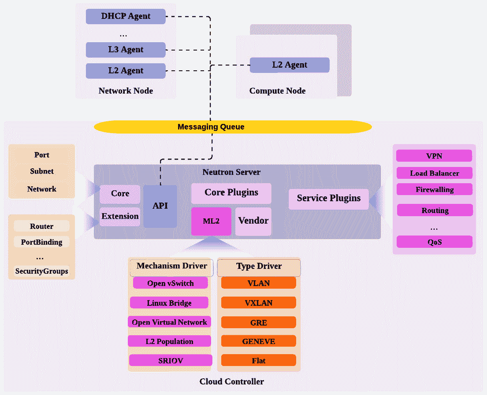

# 6

# OpenStack 网络 – 连接性和托管服务选项

“事情总是看起来不可能，直到它完成。”

– 纳尔逊·曼德拉

Neutron 是 OpenStack 的网络服务，随着不同版本的发布不断发展，提供了更多的功能和特性。云架构师可以根据现有的网络资源和需求，设计多种拓扑结构的 OpenStack 网络堆栈。与之前仅提供基础网络服务的 Nova 网络服务不同，OpenStack 租户可以在 Neutron 中获得更细粒度的网络控制和灵活性。云和网络管理员可以为租户提供更高级的网络功能，如路由、防火墙、负载均衡和私有网络。

在本章中，我们将介绍 OpenStack 网络的丰富更新，涵盖以下主题：

+   OpenStack 中 Neutron 架构及其核心服务交互

+   Neutron 插件和支持的驱动程序

+   现有的 Neutron 代理和所需的网络类型

+   使用**Open vSwitch**（**OVS**）和**Open Virtual Network**（**OVN**）机制设计并实现 OpenStack 虚拟交换布局，作为**软件定义网络**（**SDN**）的实现

+   了解并实现路由，使用虚拟路由器互联租户网络并提供外部连接

+   使用新兴的 Octavia 项目将负载均衡作为服务功能进行集成

# 探索 Neutron 的核心组件

OpenStack 网络通过不同版本的发布不断发展，构建了一个先进且功能完善的云网络堆栈。像许多其他 OpenStack 服务一样，Neutron 由多个服务组成，可以跨多个主机进行扩展，正如以下图所示：


图 6.1 – OpenStack Neutron 核心架构

这些组件可以简要地分解如下：

+   **Neutron 服务器**：它充当一个 API 门户，接收由服务或最终用户生成的 API 请求，并将其转发到下一个处理环节——在这种情况下，通过消息队列服务将请求传递给 Neutron 代理。OpenStack 生态系统中服务器交互的另一个部分是访问数据库，以便更新每个 API 请求的网络对象。

+   **Neutron 代理**：Neutron 架构在很大程度上依赖于安装在其他主机上的不同类型的代理，以处理不同的网络功能。插件代理，标记为 **neutron-*-agent**，是处理每个计算节点中虚拟交换功能的进程。这种类型可以被描述为 **第二层**（**L2**）代理。一种非常常见的 L2 代理是 OVS，它通过 ML2 机制驱动程序提供 L2 连通性。第二种 Neutron 代理是 **第三层**（**L3**）代理，标记为 **neutron-l3-agent**，安装在网络节点上，处理 L3 网络访问的实例，如 NAT、防火墙和 **虚拟私人网络**（**VPN**）功能。DHCP 代理，标记为 **neutron-dhcp-agent**，管理每个租户网络的 DHCP 配置实例（**dnsmasq** 配置）。

根据网络功能请求的性质，Neutron 服务将与部署在网络节点和/或计算节点上的代理进行交互。云运营商应列出基础设施支持的网络功能，这将决定可以安装的插件和代理的选择。

## 揭示 Neutron 代理的秘密

Neutron 依赖与 **neutron-server** 通过排队消息服务交互的代理服务，以实现 L2 和 L3 连通性、DHCP 和路由服务的虚拟网络。不同的代理将在网络和计算节点上部署：

+   **L2 代理**：部署在网络节点和计算节点上，为实例和虚拟网络（如路由器）实现 L2 网络连通性。

+   **L3 代理**：部署在网络节点上，并可选地部署在计算节点上，用于在不同类型的网络之间执行 L3 路由，例如租户网络和外部网络。L3 还可以实现更高级的网络功能，如防火墙和 VPN。

+   **DHCP 代理**：部署在网络节点上，为租户网络运行 DHCP 服务。

+   **插件代理**：部署在网络节点上，处理依赖于已实现 Neutron 插件的虚拟网络中的数据包。

+   **元数据代理**：部署在网络节点上。Nova 提供的元数据服务使得可以通过元数据 HTTP 请求（**169.254.169.254**）检索实例信息，如主机名和 IP 地址。Neutron 元数据代理通过其内部代理组件将元数据转发到 Nova 元数据服务，并附加额外的信息，如实例和租户 ID。

部署的 Neutron 代理的正常功能将根据 OpenStack 环境中设计的网络类型而有所不同。下一节将简要介绍我们初步设计草稿中应存在的不同网络类别。

## 网络类别

必须了解不同的网络类型以启用流量流动，具体取决于它们的使用方式。以下术语表涵盖了主要与 OpenStack 最新版本一起使用的网络类别：

+   **提供商网络**：由云操作员创建和管理，操作员定义一组网络属性，例如网络类型——例如，**VXLAN**、**通用路由封装**（**GRE**）或**平面**。云操作员提供并配置底层基础设施，例如指定用于流量流动的物理网络接口。

+   **自服务网络**：也称为 **租户网络**，这些网络由云用户创建。自服务网络是独立的，完全与由 Neutron 管理的多租户环境中的其他网络隔离。租户只能根据云操作员预定义的网络类型来创建虚拟网络。例如，如果云操作员未提供该选项，则云用户无法实现 GRE 网络。云用户无法访问底层的 Neutron 配置。

+   **外部提供商网络**：指特定外部网络连接的提供商网络。云操作员配置外部路由设备以访问互联网。

下一部分将通过探讨插件的概念及其最新使用模式，涵盖 Neutron 最具吸引力的功能。

# 网络核心 – Neutron 插件

Neutron 支持使用插件和驱动程序，这些插件和驱动程序使用由开源社区或供应商解决方案提供的不同软件和硬件技术。Neutron 插件有两种类型：

+   **核心插件**：启用 L2 连接功能和网络元素的编排，包括虚拟网络、子网和端口。

+   **服务插件**：启用额外的网络功能，包括路由、私有网络、防火墙和负载均衡。

重要提示

插件的代码在 Neutron 服务器上运行，该服务器可以配置为云控制节点的一部分。

以下部分将深入探讨最常用的核心插件。

## 核心插件 – 模块化二层

Neutron 中最广泛采用的核心插件是 **模块化二层**（**ML2**）。ML2 引入 OpenStack 网络服务，增加了设计网络架构的灵活性。ML2 的“秘诀”在于它支持同时使用来自不同供应商的多种技术。因此，云架构师和操作员不会局限于特定的功能集，可以轻松扩展或更改他们的网络架构。

由于在 **Havana** 发布之前的历史限制，开发了这个插件。在那个时候，操作员只能使用一个核心插件，称为单体插件组件。最常用的两个核心插件是 **Linux Bridge** 和 **OVS**，在 OpenStack 的最新版本中，它们已经被 ML2 替代。替代并不意味着直接删除它们，而是将它们作为 **机制驱动程序** 打包到核心 ML2 插件中。ML2 不仅限于 Linux Bridge 和 OVS，还支持其他厂商的驱动程序，如 VMware、Cisco 和 OpenDayLight。在 OpenStack 社区网站上可以找到一个很棒的过滤列表：[`www.openstack.org/marketplace/drivers/#project=neutron%20(networking)`](https://www.openstack.org/marketplace/drivers/#project=neutron%20(networking))。

Neutron 中支持的模块化插件和驱动程序的概览如下所示：



图 6.2 – OpenStack Neutron 核心和服务插件架构概览

如前图所示，Neutron 依赖于插件机制，这些插件提供一组特定的网络服务。API 请求将由 Neutron 服务器转发给控制节点中配置的相关插件。ML2 插件将两个主要元素结合到同一个框架中，如下所示：

+   **类型驱动程序**：这些暴露了 L2 功能，用于创建更多分段的网络，包括以下内容：

    +   **VLAN**：使用 **802.1Q** 标签隔离网络流量。属于同一 VLAN 的虚拟机是同一广播 L2 域的一部分

    +   **VXLAN**：使用 **虚拟网络标识符**（**VNI**）来分隔和区分不同网络之间的流量

    +   **Flat**：不支持 VLAN 标签和网络隔离，其中实例连接在同一网络中

    +   **GRE**：使用 GRE 隧道协议封装流量

    +   **GENEVE**：类似于 VXLAN 覆盖技术，但具有更优化的封装方法

    +   **Local**：仅连接同一网络中托管在相同计算节点中的实例，而不连接不同节点中的实例

+   **机制驱动程序**：通过网络软件方法（如 OVS、Linux Bridge 和 OVN）以及基于硬件的方法实现类型驱动技术

最新的 ML2 驱动支持矩阵列表可以在 [`docs.openstack.org/neutron/latest/admin/config-ml2.html`](https://docs.openstack.org/neutron/latest/admin/config-ml2.html) 找到。每个机制驱动程序都支持一组网络类型（类型驱动程序）。例如，OVS 支持大多数网络类型，包括 VLAN、VXLAN、GRE、flat 和 local。如果在生产环境中提出了支持 GENEVE 类型驱动的需求，可以通过仅安装驱动并重新配置 Neutron 驱动程序列表来集成新的机制驱动程序。

## 构建虚拟交换

本节将讨论两种机制驱动程序，用于在虚拟网络端口与物理网络之间建立连接。OVS 是功能最丰富的机制驱动程序之一，具有高级网络功能，如 **OpenFlow**。我们将讨论的第二个驱动程序是 **OVN**，这是一种 SDN 实现，通过控制数据包流动来编程网络。Linux Bridge 和 **L2 Population** 也是经过充分测试和成熟的机制。由于 ML2 是一个支持驱动程序的无关插件，介绍新的机制驱动程序不会对现有的 OpenStack 环境带来太多复杂性。

### 在 OpenStack 中启用 vSwitch

大多数 OpenStack 网络实现至少需要使用基于隧道的虚拟网络技术，提供极高程度的网络分段，如 VXLAN 和 GRE。基于隧道的网络能够支持多达 1600 万个网络。OVS 支持大多数在大型复杂 OpenStack 网络环境中使用的驱动程序，如 VLAN、VXLAN、GRE 和扁平网络。作为云操作员，了解 OVS 在 OpenStack 环境中如何运作是至关重要的。OVS 提供了完整的核心架构，并通过不同组件在主机内核空间中作为软件交换机运行。OVS 实现中包含多个服务，当它安装在 OpenStack 环境中时，具体如下：

+   **openvswitch**：一个内核模块，处理数据平面，负责处理网络数据包。

+   **ovs-switchd**：一个运行在物理主机上的 Linux 进程，用于控制和管理虚拟交换机。

+   **ovsdb-server**：一个本地数据库，用于存储本地运行的虚拟交换机。

+   **neutron-openvswitch-agent**：配置在使用 OVS 机制驱动的计算节点中。

+   **neutron-server**：处理 API 请求，ML2 插件加载 OVS 机制驱动程序。neutron-server 进程通过 RPC 广播消息将网络请求传递给 OVS 驱动程序，后者通过 **neutron-openvswitch-agent** 配置计算节点上的 OVS 交换机，并设置本地实例所需的资源。

一旦 OVS 被实现，一套虚拟网络设备将被安装，云操作员在部署或故障排除任务中应当牢记这一点。一个以太网帧将通过以下接口从实例传输：

+   **tapXXXX**：一个 tap 接口，其中 **XXXX** 是分配的 tap 接口 ID。

+   **br-int**：一个桥接接口，称为集成桥接，它将所有虚拟设备（如虚拟机、路由器、防火墙）整合在一起。

+   **int-br-ethX**：一个虚拟补丁端口，将不同接口连接到 OVS 集成桥接接口（**br-int**）。

+   **phy-br-ethX**：一个虚拟补丁端口，将不同接口连接到 OVS 提供者桥接（**br-ethX**）。

+   **br-ethX**：一个桥接接口，其中*X*是分配的桥接接口 ID，用于连接物理网络。它也被称为提供程序桥接，通过虚拟补丁电缆与**br-int**集成桥接连接，由补丁端口（**int-br-ethX**和**phy-br-ethX**补丁端口分别用于**int-br**和**br-ethX**）提供。

+   **qbrXXXX**：一个 Linux 桥接接口，其中**XXXX**是分配的桥接接口 ID，专门用于 IP 表。

+   **br-tun**：一个桥接隧道接口，用于处理数据包的封装和解封装。

+   **br-ex**：一个提供与外部网络连接的桥接接口。

每个启动的实例通过其 tap 接口连接，表示为**tapXXXX**，该接口在虚拟化主机中创建。相关的 Linux 桥接，表示为**qbrXXXX**，连接到 OVS 的**br-int**集成桥接，流量将根据编程的 OpenFlow 规则进行路由，然后通过虚拟交换机转发。

集成桥接和提供程序桥接之间的连接通过补丁电缆处理。数据包通过 OVS 提供程序桥接（**br-ethX**）离开物理网络，连接到主机的物理网络接口。在我们的现有 OpenStack 环境中配置 OVS 时，每个节点将运行自己的集成桥接和提供程序桥接。OpenStack 节点之间的连接，包括云控制器、网络节点和计算节点，通过物理网络建立，正如下图所示：


图 6.3 – 使用 OVS 通过不同接口的流量流动

现在我们已经理解了 OpenStack 设置中 OVS 的基本核心组件，可以继续配置我们的基础设施代码，将 OVS 部署为 Neutron 中的主要机制驱动程序。

### 使用 OVS 进行部署

OVS 机制驱动程序实现 L2 隔离，提供基于 VXLAN、GRE 和 VLAN 的网络。接下来的配置将实现 ML2 插件，以使用基于 VXLAN 的网络。这将允许实例通过 VLAN 分段和 VXLAN 隧道连接。租户的虚拟网络将不会暴露到计算或网络节点之外。**kolla-ansible**默认启用 ML2 插件。在部署**OVS**配置之前，必须满足一些先决条件。为了通过路由器和提供程序网络访问外部网络，请在**/etc/kolla/globals.yml**文件中调整**neutron_external_interface**设置，指向专门用于此目的的网络接口。**eth2**接口已被分配用于连接外部网络，正如在*第三章*中设计的那样，*OpenStack 控制平面 – 共享服务*。您可以按如下方式调整设置：

```
...
neutron_external_interface: "eth2"
...
```

重要说明

如果计划使用多个提供者桥接，则需要考虑使用带有 OVS 提供者桥接（**br-ethX**）的物理接口。在这种情况下，**neutron_external_interface**可以分配一个以逗号分隔的列表——例如，**neutron_external_interface: "eth2,eth3"**。

另一个检查是验证**kolla-ansible**是否配置了带有 ML2 插件的 OVS 驱动机制。请检查并调整**globals.yml**文件中的以下配置设置：

```
...
neutron_plugin_agent: "openvswitch"
...
```

下一个检查是验证我们的 Neutron 服务是否分配给**/ansible/inventory/multi_packtpub_prod**文件中的相应 OpenStack 节点。如*第三章*所示，*OpenStack 控制平面——共享服务*，**neutron-server**将在控制节点中作为一部分运行，如下所示：

```
...
[control]
cc01.os.packtpub
...
[neutron-server:children]
control
...
```

Neutron 代理，包括 DHCP、L3 和元数据代理，将在专用网络节点上运行，如下所示：

```
...
[network]
net01.os.packtpub
[neutron:children]
network
[neutron-dhcp-agent:children]
neutron
[neutron-l3-agent:children]
neutron
[neutron-metadata-agent:children]
neutron
...
```

OVS 将在网络和计算节点中安装。

重要提示

如*第五章*所示，*OpenStack 存储——块存储、对象存储和文件共享*，**manila-share**服务通过使用 Neutron 插件提供文件共享访问。

在清单文件中列出的 OVS 设置如下：

```
...
[openvswitch:children]
network
compute
manila-share
...
```

启动管道任务以在目标节点上安装 OVS。请注意，VXLAN 在**kolla-ansible**代码中未显式配置。默认情况下，Neutron 租户网络使用 VXLAN 类型。默认的 VNI 范围定义为从 1 到 1000 个 ID，当租户网络创建时将为其保留。此设置在控制节点的**ml2_config.ini**文件中的**vni_ranges**行中表示。可以扩展 ML2 配置，并且我们可以通过创建**/** **etc/kolla/config/neutron/ml2_config.ini**文件来采用配置重写。

以下命令行列出了来自云控制器节点的不同网络代理，包括 OVS 代理：

```
$ openstack network agent list
```

以下是输出：


图 6.4 – Neutron 代理列表输出

如图所示，OVS 代理应该在各自的网络和计算节点中正常运行。在接下来的部分中，我们将跟踪使用 OVS 机制的网络流。

### OVS 的流量流向

OVS 驱动程序的设置将决定以太网帧的传输跳数，从实例一直到物理网络。将使用多个接口，包括虚拟交换机端口和集成桥接。**openvswitch**剧本在计算节点的部署应该在主机上创建 OVS 逻辑桥接，可以通过运行以下命令行来检查：

```
$ ovs-vsctl list-br
```

输出将如下所示：


图 6.5 – OVS 桥接列表

在计算节点中启动的实例通过相同的本地 VLAN 连接。采用 VXLAN 布局时，实例端口连接到集成桥，该桥将分配一个本地 VLAN ID。从实例发起的流量将由集成桥（**br-int**）转发到隧道桥（**br-tun**）。通过运行以下命令行，可以查看连接桥及其各自端口的整体布局：

```
$ ovs-vsctl show
```

这里是输出：


图 6.6 – OVS 接口列表

如虚拟交换机接口所示，集成桥（**br-int**）标记为**VLAN 1**。当流量到达不同节点中的实例时，数据包将通过隧道桥（**br-tun**）封装在 VXLAN 数据包中传输。在背后，本地 VLAN ID **1** 将与 VXLAN 隧道 ID 交换，如**vxlan-476984a0**所示。否则，如果实例连接到另一个位于同一计算节点的实例，数据包将通过集成桥（**br-int**）本地传输到目标端口，该端口通过**qrXXXX**和**tapYYYY**端口接口表示。

接下来的部分介绍了更复杂的机制驱动程序 OVN，并展示了其在 OpenStack 环境中的部署。

### OVN 在 OpenStack 中的应用

OpenStack 环境中另一个主要且首选的网络虚拟化是 OVN。OVN 被认为是 SDN 理念的成熟实现，提供了更大的网络流编程灵活性。操作员可以集中定义一组转发规则，来定义数据包流量的控制方式。OVN 使用网络控制器中的抽象软件层来编程交换机，应用于数据包流的条件和规则。与 OVS 相比，OVN 的最显著功能是其更丰富的能力和先进特性，如可编程的流量路由和访问控制。与 OVS 方法不同，OVN 通过流规则将网络设备的控制功能与实际的数据包转发功能解耦。OVN 支持大多数网络类型，包括 VLAN、VXLAN（版本 20.09 及以上）、平面网络和 Geneve。

如下图所示，OVN 建立在 OVS 之上，利用其交换能力并增加一个抽象层，该抽象层由控制器管理，这些控制器存储在一组**OVS** **数据库**（**OVSDBs**）中：


图 6.7 – OVN 集成架构

OVN 架构与 OpenStack 环境集成的主要构件在此进行解释：

+   **南向数据库**：引用为 **ovsdb-server**（**ovnsb.db**），它存储逻辑和物理网络流的数据。该数据库托管逻辑与物理网络之间的所有绑定信息，如与 **Port_Binding** 和 **Logical_Flow** 表分别关联的端口和逻辑网络绑定。

+   **北向数据库**：引用为 **ovsdb-server**（**ovnnb.db**），它在虚拟网络的高层存储数据，这些虚拟网络代表一个 **云管理系统**（**CMS**），在本例中即 OpenStack 环境。该数据库通过表格数据集反映 CMS 的网络资源，如与 **Logical_Router** 和 **Logical_Switch_Port** 表分别关联的路由器和交换机端口。

+   **OVN 控制器**：引用为 **ovn-controller**，它在 Hypervisor 节点上运行并连接到南向数据库。它充当 OVS 控制器，通过在每个 OVS 交换机实例上定义 OpenFlow 规则，将逻辑流转换为物理流，并将配置推送到本地 OVSDB。

+   **OVN 北向服务**：引用为 **ovn-northd**，它作为控制平面的一部分在云控制器上运行。**ovn-northd** 守护进程通过将来自 **ovn-nb** 数据的逻辑配置转换为逻辑数据路径流，将北向数据库连接到南向数据库。转换后的数据将被填充到 **ovn-sb** 数据库中，并为 **ovn-controller** 实例准备好使用。

+   **OVS 数据平面服务**：引用为 **ovs-vswitchd**，它作为数据平面的一部分在 Hypervisor 节点上运行。**ovs-vswitchd** 应用由 **ovn-controller** 提供的包转发规则。

+   **本地 OVSDB**：引用为 **ovsdb-server**，它在每个 Hypervisor 节点上本地运行。OVN 参考架构通过使用数据库的一致快照来利用数据库扩展优势，以从可能的连接中断中恢复。

+   **元数据代理**：引用为 **ovn-metadata-agent**，它在每个 Hypervisor 节点上运行。OVN 元数据代理，例如 Neutron 元数据代理，用于在每个计算节点上代理元数据 API 请求。这样，每个 Hypervisor 节点上运行的 OVS 交换机实例将把请求路由到本地元数据代理，然后查询 Nova 元数据服务以运行实例。

在以下部分，我们将使用 **kolla-ansible** 将 OVN 项目集成到 OpenStack 环境中。

### 使用 OVN 部署

OVN 扩展了 OVS 实现，以为实例提供网络服务。ML2 机制驱动程序帮助与 OpenStack 作为 CMS 集成。**kolla-ansible** 剧本包含了大部分 OVN 配置和所需的安装包。与 OVS 配置类似，通过配置 **neutron_external_interface** 设置，调整 **/etc/kolla/globals.yml**，以使用指定的接口连接外部网络，具体如下：

```
...
neutron_external_interface: "eth2"
...
```

配置 ML2 机制驱动程序以使用 OVN，如下所示：

```
...
neutron_plugin_agent: "ovn"
...
```

OVN 内置支持 L3 网络功能，使实例能够连接到外部网络。在 OVN 中提供此类连接性有两种方式——通过不使用分布式浮动 IP 设计的集中式布局，或者通过**分布式虚拟路由**（**DVR**），这需要浮动 IP 配置。为了让两个实例通过 L3 到达外部网络或彼此之间的通信，流量必须通过网络节点。使用 DVR 方法时，通过在每个计算节点上部署 L3 代理，流量将得到优化，使得**北南向**（进出外部网络）的浮动 IP 流量可以从计算节点路由并返回，并额外跳转到达网络节点。类似地，**东西向**（实例间的流量）流量直接路由到计算节点。后者选项对于获得更优化的性能更为推荐。分布式浮动 IP 选项可以在**globals.yml**文件中启用，如下所示：

```
...
 neutron_ovn_distributed_fip: "yes"
...
```

启用 Neutron OVN 代理，通过配置以下设置，提供可扩展的网络监控和**服务质量**（**QoS**）功能：

```
...
 neutron_enable_ovn_agent: "yes"
...
```

接下来，确保调整**/ansible/inventory/multi_packtpub_prod**库存文件，在指定的节点上安装 OVN 服务。类似于 OVS 配置，确保在控制节点和网络节点上分别运行 Neutron 服务器及相应代理，具体如下：

```
...
[control]
cc01.os.packtpub
...
[neutron-server:children]
control
[network]
net01.os.packtpub
[neutron:children]
network
[neutron-dhcp-agent:children]
neutron
[neutron-l3-agent:children]
neutron
[neutron-metadata-agent:children]
neutron
...
```

如*OVN 在 OpenStack 中*部分所讨论，OVS 北向和南向数据库，以及 OVN **northd** 守护进程，将在控制节点上运行，具体如下：

```
...
[ovn-database:children]
control
[ovn-northd:children]
ovn-database
[ovn-nb-db:children]
ovn-database
[ovn-sb-db:children]
ovn-database
```

OVN 控制器实例和 OVN 元数据代理将在计算节点上运行，具体如下：

```
...
[neutron-ovn-agent:children]
compute
[ovn-controller:children]
ovn-controller-compute
[ovn-controller-compute:children]
compute
[neutron-ovn-metadata-agent:children]
compute
...
```

重要提示

从 Antelope 版本及以后的版本开始，已经创建了一个专用的 OVN 代理来实现缺失的**ovn-controller**功能。

启动管道作业应部署 OVN 服务并创建一个 ML2 文件，**/etc/neutron/plugins/ml2/ml2_conf.ini**，其中包含以下默认配置：

```
...
[ml2]
tenant_network_types = geneve
type_drivers = local,flat,vlan,geneve
mechanism_drivers = ovn
[ml2_type_geneve]
max_header_size = 38
vni_ranges = 1001:2000
...
```

默认的网络租户类型配置为使用 GENEVE 作为隧道协议。GENEVE 与 VXLAN（在前述部分中为 OVS 配置的协议）之间的主要区别在于两种协议之间如何封装和编码网络元数据。VXLAN 仅在封装头中编码 VNI。而 GENEVE 协议使用可扩展的 TLV 来承载有关封装头中的数据包的更多信息（其头部长度为 38 字节，而 VXLAN 帧可以承载 8 字节），例如**入口**和**出口**端口。与 VXLAN 相比，GENEVE 提供了更强大的功能，例如传输安全、服务链和带内遥测。

另一个结果是默认的北向和南向数据库地址。每个计算节点中运行的 OVN 控制器应该能够访问这两个数据库。此配置可以在同一个文件 **ml2_conf.ini** 中找到，通过检查以下设置：

```
...
[ovn]
ovn_nb_connection = tcp:10.0.0.24:6642
ovn_sb_connection = tcp:10.0.0.24:6642
ovn_metadata_enabled = True
enable_distributed_floating_ip = True
```

一旦配置了 OVN，进一步的网络资源创建和管理将由 OVN 处理，它将每个 OpenStack 资源抽象映射到 OVN 南向和北向数据库中的条目对象。

OVS 和 OVN 提供不同的能力来将实例连接到网络。在接下来的章节中，我们将探讨 Neutron 中的路由是如何执行的，并展示 OpenStack 中不同的路由流量选项。

# 配置云路由

同一虚拟租户网络中的实例可以互相访问，但默认情况下，每个租户网络不能访问其他租户或外部网络。部署虚拟路由器是启用 L3 网络通信的方式，从而通过将子网与路由器关联，连接租户虚拟网络。

## 路由租户流量

在后台，与租户虚拟网络相关联的端口将与子网网关的 IP 地址相关联。不同虚拟网络中的实例通过虚拟路由器进行通信，使用网关 IP 地址和它们的私有 IP 地址封装在数据包中，从而互相访问。这称为 **NAT** （**网络地址转换**）机制。在 OpenStack 网络中，Neutron L3 代理管理虚拟路由器。IP 数据包通过虚拟路由器转发到不同的自服务和外部网络，经过以下路由器接口：

+   **qr** : 包含租户网络网关 IP 地址，专门用于将流量路由到所有自服务流量网络

+   **qg** : 包含外部网络网关 IP 地址，专门用于将流量路由到外部提供商网络

当虚拟路由器实例启动时，将在 Neutron 节点中创建一个网络命名空间，该命名空间通过路由表、数据包转发和 **iptables** 规则定义与自服务网络或外部提供商网络的连接。如以下图所示，路由器命名空间指的是附加到多个桥接端口的虚拟路由器（**qr** 和 **qg**）。托管在同一或不同计算节点中的实例之间的流量将通过虚拟路由器路由。


图 6.8 – 基于 OVS 实现的 Neutron 路由器命名空间连接

在之前的 OVS 实现中，L3 代理应该已经启动并运行，以开始创建和管理虚拟路由器。

重要提示

一旦部署了 Neutron 代理 L3，路由器服务插件应默认启用，使用**kolla-ansible**。可以通过检查 Neutron 云控制器节点的**/etc/neutron/neutron.conf**文件中的**service_plugin = router**行来验证该服务插件。

可选地，虚拟路由器可以通过 Horizon 进行管理。Neutron 部署的**kolla-ansible**运行应在仪表板中启用路由器模块。可以通过在云控制器节点的**/etc/openstack-dashboard/local_settings.py**文件中检查以下设置来验证：

```
...
OPENSTACK_NEUTRON_NETWORK = {
    'enable_router': True,
...
```

在下一个练习中，我们将使用在 OVS 中配置的 ML2 插件创建一个租户虚拟网络。将使用 OpenStack CLI 将虚拟路由器附加到租户网络，如下所示：

1.  使用 OpenStack 网络 CLI 创建一个租户虚拟网络：

    ```
    $ openstack network create network_pp
    ```

1.  创建一个 IP 范围为**10.10.0.10/24**的子网，自动分配 DHCP，默认 DNS 名称服务器为**8.8.8.8**：

    ```
    $ openstack subnet create --subnet-range 10.10.0.0/24 --network network_pp --dns-server 8.8.8.8 priv_subnet
    ```

1.  创建一个路由器并将其附加到创建的租户网络：

    ```
    $ openstack router create router_pp
    $ openstack router add subnet router_pp priv_subnet
    ```

1.  路由器附加到租户网络将为路由器的内部接口分配一个私有 IP 地址。默认情况下，如果在附加命令行中没有指定 IP 地址，内部接口将分配子网的默认网关。以下命令行验证路由器内部接口分配的 IP 地址：

    ```
    $ openstack port list --router router_pp
    ```

    它给出的输出如下：


图 6.9 – 虚拟路由器端口列表

1.  可以通过运行以下命令检查带有**qr-**前缀的路由器命名空间中的路由器接口：

    ```
    $ ip netns
    ```

    输出如下所示：


图 6.10 – 网络命名空间列表

1.  从先前的输出中复制**qrouter** ID，然后运行以下命令行显示路由器创建的接口以及从内部网络分配的 IP 地址：

    ```
    $ ip netns exec qrouter-3a211622-11da-9687-bda1-acae3d74ad12 ip addr show
    ```

    我们将获得如下输出：


图 6.11 – 虚拟路由器命名空间内部接口列表

为使实例能够访问外部网络，应创建虚拟路由器的第二个接口，并将其附加到提供商的外部网络。应将一个常见的网络设置，如外部网络设备或与防火墙设备集成的设备，放置在 OpenStack 端点（如负载均衡器）之前。启用互联网访问可以使用 OpenStack CLI 配置，如下所示：

1.  创建一个外部网络提供者。如在 OVS 的 ML2 插件中配置的那样，我们可以将网络创建为 VLAN 类型，并定义分段 ID 和**physnet1**作为物理网络属性：

    ```
    $ openstack network create --external -–provider-network-type vlan --provider-segment 40 --provider-physical-network physnet1 external_pp
    ```

1.  创建外部网络的子网部分，网络范围为**10.20.0.0/24**，默认网关为**10.20.0.1**，禁用 DHCP，并设置分配池为**10.20.0.10-10.20.0.100**：

    ```
    $ openstack subnet create --subnet-range 10.20.0.0/24 --no-dhcp
    --network external_pp --allocation-pool start=10.20.0.10,end=10.20.0.100 pub_subnet
    ```

1.  通过运行以下命令行，将路由器附加到外部提供商网络：

    ```
    $ openstack router set --external-gateway external_pp router_pp
    ```

1.  附加操作将从外部 IP 池中分配一个外部 IP 到路由器，可以通过运行以下命令行进行检查：

    ```
    $ openstack port list --router router_pp
    ```

    这是输出结果：


图 6.12 – 创建的虚拟路由器外部端口

1.  最后的附加操作在路由器命名空间中创建一个以**qg-**为前缀的第二个接口，可以通过以下命令行进行验证：

    ```
    $ ip netns exec qrouter-3a211622-11da-9687-bda1-acae3d74ad12 ip addr show
    ```

    这是输出结果：


图 6.13 – 虚拟路由器命名空间外部接口列表

我们的连接性演示的下一部分涉及创建安全组和规则，以允许在网络端口级别的入站和出站流量。为了连接到互联网并访问实例，我们将创建一个新的安全组，并添加**ICMP**和**SSH**访问：

1.  使用 OpenStack CLI，创建一个新的安全组并将其应用到你的实例：

    ```
    $ openstack security group create SG_pp
    ```

1.  创建与已创建安全组相关的规则，用于 SSH 和 ICMP，分别为：

    ```
    $ openstack security group rule create SG_pp --protocol tcp --dst-port 22
    $ openstack security group rule create SG_pp --protocol icmp
    ```

1.  使用 OpenStack CLI，创建一个新的测试实例，选择**tiny**规格和**cirros**镜像，并连接到私有租户网络：

    ```
    $ openstack server create --flavor tiny --image cirros-0.5.2 --nic net-id=network_pp --security-group SG_pp instance_pp
    ```

重要说明

确保根据现有资源调整你的可用 Glance 镜像名称和规格列表。如果任何指定的参数不存在，**openstack server create**命令将会失败。Cirros 是一个最小化的 Linux 发行版，适用于快速测试和概念验证。默认的会话用户名是**cirros**，密码是**gocubsgo**。

1.  为了测试实例是否能连接到互联网，请确保实例的状态是**ACTIVE**，如下所示：

    ```
    $ openstack server list
    ```

    这是输出结果：


图 6.14 – 实例列表

1.  可以通过不同的方式访问创建的实例，使用计算节点上的**virsh console**命令行，或直接通过路由器命名空间的 SSH 进行访问。确保使用默认的**cirros**镜像凭证——即用户名**cirros**和密码**gocubsgo**——并运行一个简单的 ping 命令以连接到**8.8.8.8**：

    ```
    $ ip netns exec qrouter-3a211622-11da-9687-bda1-acae3d74ad12 ssh cirros@10.10.0.12
    ```

    这是输出结果：


图 6.15 – 测试外部连接性

1.  实例使用内部虚拟路由器 IP 地址作为默认网关来路由流量到达外部网络。通过路由器执行 SNAT，互联网可以访问。通过在实例中快速运行**ip route**命令，可以查看与网络路由表相关联的默认网关：


图 6.16 – 列出默认网关

我们接下来的演示将展示托管在外部网络中的资源如何访问 OpenStack 环境中的实例。默认情况下，启动的实例将被分配一个在租户网络外不可见的 IP 地址。Neutron 提供了浮动 IP 地址来实现**DNAT**（**目标 NAT**）。路由器通过检查其配置的 DNAT 规则，将到达其外部接口的传入数据包转发到目标实例。实例向外部资源发送的流量响应使用已翻译为浮动 IP 的源 IP 地址，演示如下：

1.  提取创建的实例的端口 ID，并创建一个浮动 IP 地址与其关联：

    ```
    $ openstack port list --server instance_pp
    ```

    以下是输出结果：


图 6.17 – 列出实例端口

1.  复制端口 ID，并在**--** **port**选项后粘贴外部端口 ID，然后运行以下命令：

    ```
    $ openstack floating ip create --port 524ead12-33da-dc11-e3a1-dc34e6da1c81 external_pp
    ```

    以下是输出结果：


图 6.18 – 将浮动 IP 地址分配给外部端口

1.  在背后，路由器命名空间配置了一个与外部接口关联的辅助地址，前缀为**'qg'**：

    ```
    $ ip netns exec qrouter-3a211622-11da-9687-bda1-acae3d74ad12 ip addr show
    ```

    以下是输出结果：


图 6.19 – 将 IP 地址与虚拟路由器外部接口关联

通过外部网络提供商路由的流量可以通过分配的浮动 IP 到达实例。

到目前为止，我们已经探讨了在 OpenStack 中实现标准路由的方式。接下来的部分将介绍通过动态路由在 Neutron 中执行路由的另一种方式。

## Neutron 动态路由

OpenStack 网络中的动态路由基于**BGP**（**边界网关协议**），使租户网络能够与支持 BGP 的物理或虚拟路由器和网络设备广告其网络前缀。Neutron 中新增加的 BGP 功能消除了对于不依赖网络管理员来将网络前缀向上游广告的租户网络而言，使用浮动 IP 的需求。Neutron 中的*动态路由*概念是在**Mitaka**版本中引入的。BGP 路由机制的采纳因云环境的不同而有所变化，主要取决于网络设置，尤其是要求网络节点与物理网络网关设备之间具有直接连接（如 LAN 或 WAN 对等连接）。为了避免广告 IP 前缀时的 IP 重叠，动态路由依赖于**地址范围**和**子网池**，这是 Neutron 机制，用来控制子网地址的分配并防止重叠地址的使用。

在 BGP 实现的核心部分，Neutron 引入了 **BGP speaker**，它使租户网络与外部路由器设备之间能够建立对等连接。BGP speaker 将租户网络广告到租户路由器，最初作为第一跳。Neutron 中的 BGP speaker 不是路由器实例，也不会操作 BGP 路由。它主要负责协调租户路由器与外部路由器之间的 BGP 对等信息。BGP speaker 需要网络或云操作员配置对等端点。如以下图所示，要在 OpenStack 中成功实现 BGP 动态路由，Neutron 虚拟路由器必须同时连接到租户子网和外部提供商设备接口。


图 6.20 – Neutron BGP 对等连接与路由器的动态路由连接

BGP speaker 和外部提供商设备必须建立对等连接（连接到 Neutron 虚拟路由器）。最后，租户网络和外部网络必须在相同的地址范围内。使用 **kolla-ansible** 添加 BGP 动态路由非常简单。我们将基于 OVS 实现配置动态路由。

重要说明

自 Antelope 版本以来，Neutron 支持使用 OVN 机制驱动程序进行动态路由。

由于 Neutron 提供了默认配置的 BGP 代理，我们只需要通过将以下行添加到 **/ansible/inventory/multi_packtpub_prod** 清单文件中，启用网络节点中的代理安装：

```
...
[neutron-bgp-dragent:children]
neutron
```

在 **globals** **.yml** 文件中启用代理安装，如下所示：

```
enable_neutron_bgp_dragent: "yes"
```

启动管道以在网络节点中部署 BGP 代理安装。在网络节点中，可以通过运行以下命令检查已安装的 BGP 代理：

```
$ openstack network agent list --agent-type bgp
```

以下是输出：


图 6.21 – 列出 BGP 网络代理

可以通过以下链接找到用于管理 BGP speakers 的 Neutron BGP CLI：[`docs.openstack.org/python-openstackclient/latest/cli/plugin-commands/neutron.html`](https://docs.openstack.org/python-openstackclient/latest/cli/plugin-commands/neutron.html)。

虚拟路由器是 OpenStack 网络构建模块的一部分，为租户提供多种连接选项。需要注意的是，使用独立路由器运行会存在单点故障的问题。*第七章*，*运行高可用云 – 满足 SLA* 将讨论 Neutron 高可用路由器的实现。通过 BGP 在 Neutron 中的动态路由被认为是 OpenStack 中的一项出色的路由补充。Neutron 在 OpenStack 版本中不断得到丰富和修改。其中一项重大修改是 OpenStack 中新网络服务的开发，下一节将讨论这些服务。

# 加入更多网络服务

除了 Neutron 在最新 OpenStack 版本中提供的强大路由和交换能力外，Neutron 还使云操作员能够提供额外的网络服务。诸如负载均衡、防火墙和私有网络等服务，支持租户网络构建适用于多种用例的良好架构的应用堆栈。在接下来的章节中，我们将介绍最常用和最稳定的额外 Neutron 服务，并使用**kolla-ansible**进行部署。

## 负载均衡即服务

自**Liberty**版本发布以来，Neutron **负载均衡即服务**（**LBaaS**）插件已从版本 1 升级至版本 2，代号为**Octavia**。希望通过托管负载均衡器平衡工作负载的云用户，将会欣赏 Octavia 的功能。Octavia 的设计旨在水平扩展，因为它创建并管理作为负载均衡器实例的虚拟机，这些虚拟机被称为**amphorae**。

Octavia 实现了与流行的**HAProxy**相同的负载均衡术语，具体如下：

+   **虚拟 IP（VIP）**：一个四层对象，用于暴露服务，供外部或内部访问，并与 Neutron 端口关联。负载均衡器被分配一个 VIP，所有到达 VIP 的请求都会在后端服务器或池成员之间分发。

+   **池**：提供相同内容或服务的一组实例，例如 Web 服务器。

+   **池成员**：通过 IP 地址和监听端口表示的池实例，暴露服务。

+   **监听器**：与 VIP 相关的端口，用于监听传入的请求。

+   **健康监控器**：基于对每个成员进行健康检查来协调池成员的管理。健康检查失败时，将从池中丢弃相应成员，流量将由健康成员处理。

+   **负载均衡算法**：**轮询**、**最少连接数**和**源 IP**是 Octavia 中支持的算法，可以在创建池时分配。

+   **会话持久性**：强制客户端请求由同一后端服务器处理的机制。自 LBaaS v1 版本废弃以来，Neutron 中的负载均衡服务可以通过驱动程序进行配置。最常见的驱动程序是 HAProxy 和 Octavia。还可以集成其他第三方供应商的驱动程序，如 F5 和 Citrix，Neutron 将管理 OpenStack 环境中的 API 调用编排。Octavia 中不同组件的术语表如下：

    +   **Amphora**：作为负载均衡器的虚拟机，运行在计算节点上，并预配置负载均衡参数，如池、后端成员和健康监控器。

    +   **控制器工作节点**：更新负载均衡实例（Amphora 实例）并配置其设置。

    +   **API 控制器**：与控制器工作节点交互，用于负载均衡器（Amphora 实例）的配置、操作和部署、删除及监控。

    +   **健康管理器**：监控每个负载均衡器（Amphora 实例）的状态，并在负载均衡器意外故障时触发故障转移事件。

    +   **清理管理器**：删除过时的数据库记录并处理备用池。

使用**kolla-ansible**部署 Octavia 需要的步骤比仅安装代理多。要使用 Octavia 驱动程序在 OpenStack 中安装负载均衡服务，首先将核心 Octavia 组件分配为云控制器的一部分：

```
...
[octavia:children]
control
[octavia-api:children]
octavia
[octavia-driver-agent:children]
octavia
[octavia-health-manager:children]
octavia
[octavia-housekeeping:children]
octavia
[octavia-worker:children]
octavia
```

在**globals** **.yml**文件中启用 Octavia 服务，如下所示：

```
...
enable_octavia: "yes"
```

确保在**globals** **.yml**文件中，**enable_neutron_provider_networks**设置为**true**。这是因为我们需要 Octavia 节点通过管理网络进行通信。分配云控制器节点的**eth0**管理网络接口：

```
octavia_network_interface: eth0
```

**kolla-ansible**自动化了 Octavia 的绝大部分部署过程，并在 OpenStack 环境中注册相关资源。Octavia 与多个 OpenStack 服务交互，包括 Nova 和 Neutron。相关资源可以在**globals** **.yml**文件中自定义，例如 amphorae 的 Nova flavor、安全组、Octavia 网络和子网，可以通过更新**octavia_amp_flavor**、**octavia_amp_security_groups**和**Octavia 管理网络**来设置。默认情况下，**kolla-ansible**被配置为自动注册所有依赖的 Octavia 资源。如果你想自定义 Octavia 注册服务，确保在**globals** **.yml**文件中为每个 Octavia 设置提供所有必需的值。可以在将以下设置从**no**更改为**yes**后进行此操作：

```
octavia_auto_configure: "yes"
```

运行部署管道以发布 Octavia 服务。部署过程应该创建必要的 Octavia 资源，包括证书、Octavia 网络、flavor、安全组和 SSH 密钥。确保**kolla-ansible post-deploy**运行成功，通过生成一个**octavia-openrc.sh**文件，并按以下方式加载：

```
$ kolla-ansible post-deploy
$ . /etc/kolla/octavia-openrc.sh
```

Octavia 使用镜像来启动 amphora 实例。运行以下命令下载 Bobcat 发布的最新 amphora 镜像，然后将其添加到 Glance 中：

```
$ wget https://swift.services.a.regiocloud.tech/swift/v1/AUTH_b182637428444b9aa302bb8d5a5a418c/openstack-octavia-amphora-image/octavia-amphora-haproxy-2023.2.qcow2
$ openstack image create amphora-haproxy --container-format bare --disk-format qcow2 --private --tag amphora --file octavia-amphora-haproxy-2023.2.qcow2 --property hw_architecture='x86_64' --property hw_rng_model=virtio
```

以下步骤假设已部署名为**instance1**和**instance2**的两个 Web 服务器实例，并且它们已连接到之前演示中使用的租户网络**10.10.0.0/24**：

1.  请注意创建的两个实例：

    ```
    $ openstack server list
    ```

    以下是输出：


图 6.22 – 列出创建的实例

1.  为了快速模拟负载均衡练习，在每个实例中运行**SimpleHTTPServer** Python 模块。创建一个简单的**index.html**文件来跟踪负载均衡器成员池的使用情况。在**instance1**上运行以下命令：

    ```
    $ echo "Reaching instance 1" > ~/index.html
    $ python -m SimpleHTTPServer
    ```

1.  通过在**index.html**文件中指定第二个实例，运行相同的命令：

    ```
    $ echo "Reaching instance 2" > ~/index.html
    $ python -m SimpleHTTPServer
    ```

1.  确保通过创建并添加以下安全组和规则来允许实例的入口端口**80**，如果尚未附加的话：

    ```
    $ openstack security group create lb-web-sg
    $ openstack security group rule create --ingress --protocol http --dst-port 80 --ethertype IPv4 lb-web-sg
    $ openstack server add security group instance1 lb-web-sg
    $ openstack server add security group instance2 lb-web-sg
    ```

1.  创建一个附加到私有子网**priv_subnet**的负载均衡器。请注意，负载均衡器将被分配一个 VIP，用于暴露后端服务并允许客户端访问：

    ```
    $ openstack loadbalancer create --name lb --vip-subnet-id 
    priv-subnet
    ```

    这是输出结果：


图 6.23 – 创建负载均衡器

1.  一旦负载均衡器将其**PROVISIONING_STATUS**状态从**PENDING_CREATE**更新为**ACTIVE**，并且**OPERATING_STATUS**更新为**ONLINE**，则在端口**80**上创建一个名为**listener80**的 TCP 监听器端口：

    ```
    $ openstack loadbalancer listener create --name listener80 --protocol TCP --protocol-port 80 lb
    ```

1.  创建一个名为**poolweb**的负载均衡池，并使用**ROUND_ROBIN**指定负载均衡算法：

    ```
    $ openstack loadbalancer pool create --name poolweb --lb-algorithm ROUND_ROBIN --listener listener1 --protocol TCP
    ```

1.  为创建的**poolweb**添加健康监视器，并探测 HTTP 服务端口：

    ```
    $ openstack loadbalancer healthmonitor create --name http-check --delay 15 --max-retries 4 --timeout 30 --type HTTP poolweb
    ```

1.  将后端实例（**instance1** 和 **instance2**）加入到**poolweb**：

    ```
    $ openstack loadbalancer member create --subnet-id private-subnet --address 10.10.0.114 --protocol-port 80 poolweb
    $ openstack loadbalancer member create --subnet-id private-subnet --address 10.10.0.125 --protocol-port 80 poolweb
    ```

1.  可选地，检查已添加的后端成员和创建的池的状态：

    ```
    $ openstack loadbalancer member list poolweb
    ```

    这是输出结果：


图 6.24 – 列出负载均衡池的实例成员

1.  通过连接到负载均衡器的 VIP 来测试负载均衡器。请注意，负载均衡使用的算法是轮询法（round robin），请求将被连续服务于两个实例：

    ```
    $ for ((i=1;i<=10;i++)); do curl http://10.10.0.14; sleep 1; done
    ```

    这是输出结果：


图 6.25 – 测试负载均衡池的后端

重要提示

从互联网访问池的 Web 后端有多种方式。一种方式是将负载均衡器直接连接到公共网络，而无需运行在虚拟路由器后面，负载均衡器 VIP 将被分配一个公共可路由 IP。另一种方式是创建一个浮动 IP，然后将其与负载均衡器的 VIP 关联，该 VIP 位于虚拟路由器后面的子网中。没有路由器应用 IP 转换并使用分配的浮动 IP 映射到公共 IP，浮动 IP 是无法通过互联网路由的，无法访问外部网络。

在 Neutron 中创建负载均衡器时，一个良好的做法是首先考虑安全性。OpenStack 中最新的 LBaaS 版本支持 TLS 证书部署。更好的是，OpenStack 拥有一个专门的项目来处理密钥和证书，代号为*Barbican*。要了解有关 Barbican 的更多信息，请参考 OpenStack 官方文档：[`docs.openstack.org/barbican/latest/`](https://docs.openstack.org/barbican/latest/)。负载均衡器可以与 Barbican 服务配合使用，以最安全的方式处理其 TLS 证书。

# 摘要

OpenStack 网络提供了一个丰富的功能列表，使云运营商和架构师能够实现先进的网络拓扑，并为云用户和租户提供更多的托管网络服务。如本章所述，ML2 插件通过解锁一些在旧版本 OpenStack 中缺失的相关功能，扩展了 Neutron 的能力。OVS 作为机制驱动程序，基于流规则带来了更多的流量控制。对于需要常见 VLAN 和 VXLAN 拓扑的扩展网络，本章展示了在最新 OpenStack 版本中，Neutron 对 OVS 和 OVN 驱动程序的支持，以及它们使用**kolla-ansible**的部署。值得注意的是，基于机制驱动程序的未来网络方向几乎肯定会朝着采用 OVN 机制驱动程序发展，因为它在更大规模的生产级别和混合云环境中的性能表现突出。另一个大话题是 OpenStack 网络中的路由问题，本章还探讨了使用 OVS 的路由实现，并覆盖了 BGP 动态路由。OVN 正成为实现 BGP 的流行方式，未来的版本可能会在这一方向上提供更稳定的集成。然而，本章并未涉及所有其他额外的 Neutron 服务和代理，如**VPN 即服务**、**防火墙即服务**和**Designate**（DNS 管理）。Neutron 中的 LBaaS 在最新的 OpenStack 版本中有了更多的更新。通过新的 LBaaS v2，云运营商可以使用开源驱动程序，如 HAProxy 或 Octavia，配置他们的负载均衡服务。最后，本章展示了使用 Octavia 部署负载均衡器设置的过程，Octavia 已成为一种广泛采用的 LBaaS 解决方案，适用于大规模生产环境。

在下一章中，我们将通过解决 OpenStack 控制平面和数据平面的弹性与高可用性问题，来增强我们部署的 OpenStack 环境。

# 第二部分：运营 OpenStack 云环境

本部分将重点关注云运营商将云环境提升到下一个阶段的运营任务。将涵盖基本的运营卓越支柱，包括高可用性、监控与日志记录，以确保业务连续性，并关注云健康的常见最佳实践。本部分将以关于建立持续的基础设施评估和资源优化布局的独家内容作为结束。

本部分包括以下章节：

+   *第七章*，*运行高可用的云——满足 SLA 要求*

+   *第八章*，*监控与日志记录——主动修复*

+   *第九章*，*基础设施基准测试——评估资源容量与优化*
