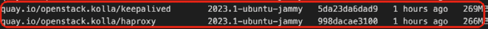
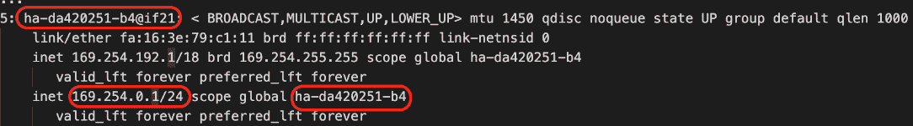
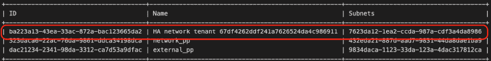

# 7

# 运行高可用云 – 满足 SLA

“过去比未来更像，就像一滴水不像另一滴水一样。”

– 伊本·赫尔敦

成功的云操作经验的一个主要方面是防止停机以及云资源和工作负载的故障。在*第一章*，*重新审视 OpenStack – 设计考虑*中，我们草拟了一个初步的准备设计，以支持 OpenStack 服务的冗余。*第三章*，*OpenStack 控制平面 – 共享服务*，和*第四章*，*OpenStack 计算 – 计算能力与规格*，探讨了 OpenStack 控制平面部署的逻辑设计模式以及分离计算的一些方式，例如单元和可用性区域。OpenStack 被设计为大规模扩展，并且为专用的 OpenStack 服务提供硬件可以帮助隔离故障，但这需要机制来确保在事故发生时服务能够继续运行。

在 OpenStack 世界中，确保**高可用性**（**HA**）与任何其他复杂的 IT 系统并没有太大区别。一项必不可少的做法是通过逻辑的 OpenStack 配置，找出并消除任何可能的**单点故障**（**SPOFs**），这些故障点在不同设计中有所不同。本章的目标是在私有云基础设施的每一层实现 HA。

本章将涵盖以下主题：

+   回顾 HA 和故障切换策略，以确保业务连续性

+   反复探讨 OpenStack 控制平面 HA 设计模式

+   使用 **kolla-ansible** 部署具有额外云控制器的 OpenStack 环境，以实现容错和冗余

+   探索使用最新 OpenStack 更新实现 Neutron 网络 HA 的不同方式，包括路由和分布式虚拟路由器机制

+   揭示本地 OpenStack 解决方案，通过 Masakari OpenStack 项目确保实例故障切换

# 探索 HA 策略

一个稳健的 OpenStack 云平台包括每个层级的容错能力。如果提前规划得当，这种设计可以非常成功。从小规模集群开始很容易并且可以实现，但扩展它是一个挑战。基本的 OpenStack 组件特点是能够在普通硬件上运行。OpenStack 设计之初就是为了大规模扩展，并通过在基础设施的每个层次上运用更先进的 HA 技术来提供 HA。这可能包括**自动故障切换**和**地理冗余**。*第四章*，*OpenStack 计算 – 计算能力与规格*，介绍了单元、区域和可用性区域的概念，这些概念为大规模 OpenStack 部署提供了更强大和先进的容错和可用性能力。

## 衡量 HA

服务可用性应该通过标准的度量来衡量和定义。这可以用以下公式来总结：

*可用性 = MTTF / (MTTF +* *MTTR)*

在前述的方程中，我们可以看到以下内容：

+   **平均故障时间（MTTF）**：估计系统在故障前的平均运行时间

+   **平均修复时间（MTTR）**：估计修复系统部件或组件的平均时间

在像 OpenStack 这样的复杂环境中衡量高可用性，需要对部署的云环境能力有良好的理解，这些能力可以通过性能指标和关键绩效指标（KPI）进行跟踪，例如响应时间、系统正常运行时间和停机时间，用于**修复时间目标**（**RTO**）和**修复点目标**（**RPO**）。对于最终用户而言，更为关键的是从收集到的指标和 KPI 中揭示**服务级别协议**（**SLA**），并基于此进行改进。SLA 根据常规收集的指标确定改进的领域，并将促进您的业务连续性策略。可用性管理是 IT 最佳实践的核心支柱，特别是在运行包括 OpenStack 在内的多个服务的云环境中，不能被忽视。为每项服务创建这些 SLA 的详细内容将占据整本书。为了简化，确保您参与可用性管理实践，并通过为每项服务分配可用性级别以及可用性和停机百分比来更新 SLA，如下表所示：

| **服务** | **可用性级别** | **可用性** | **停机时间/天** |
| --- | --- | --- | --- |
| 计算 | 一个 9 | 90 | ~ 2.4 小时 |
| 网络 | 两个 9 | 99 | ~ 14 分钟 |
| 计算 | 三个 9 | 99.9 | ~ 86 秒 |
| 块存储 | 四个 9 | 99.99 | ~ 8.6 秒 |
| 对象存储 | 五个 9 | 99.999 | ~ 0.86 秒 |
| 镜像 | 六个 9 | 99.9999 | ~ 0.0086 秒 |

表 7.1 – OpenStack 环境服务的 x-9s 示例 SLA

在设计 HA OpenStack 设置的架构时，应为云架构的每一层都规划好故障应对。这可以通过先进的 HA 模型和技术来实现。最新的 OpenStack 版本甚至更加丰富，内置了不仅为核心组件，还为用户工作负载提供高可用性的功能。例如，如果一台主机故障，运行在其上的应用将无法再访问。Nova 支持通过将来宾实例迁移到新的健康主机来恢复故障实例。对于扩展的 OpenStack 设置，云环境可以通过重新调用 Nova 服务下的可用区来扩展更多的域故障。HA 设计模式的核心可以总结为以下几点：

+   消除控制平面和数据平面中的任何单点故障（SPOF）

+   在可能的情况下采用地理复制设计

+   自动化监控和异常检测

+   规划并自动化快速灾难恢复

+   尽可能地解耦并隔离 OpenStack 组件

在 OpenStack 的世界中，可以识别不同级别的高可用性（HA）：

+   **L1**：这包括物理主机、网络和存储设备以及虚拟机管理程序（Hypervisors）。

+   **L2**：这包括 OpenStack 服务，包括计算、网络和存储控制器，以及数据库和消息队列系统。

+   **L3**：这包括在主机上运行并由 OpenStack 服务管理的虚拟机。

+   **L4**：这包括在虚拟机中运行的应用程序。

支持 OpenStack 高可用性（HA）的主要关注点是 L1、L2 和 L3。

## 设计高可用性（HA）

设计系统时的一个关键方面是考虑系统中每个元素可能发生故障的所有情况。每个元素都有一定的限制，在至少短时间内无法恢复，这会影响系统的其他部分，导致整个系统变得无响应。在考察旨在最大化可扩展性和可用性的常见设计模式时，重要的是要识别出两类主要服务：

+   **有状态服务**：一种依赖于先前请求数据并进行同步交互以保持一致性的服务。由于这类服务依赖于状态，因此服务故障可能会影响整个系统，并且需要更多的备份和恢复机制来维持状态信息。

+   **无状态服务**：一种不需要从先前请求或事件中保存数据或信息（状态）的服务。由于这类服务不在请求之间存储状态，因此突发故障不会影响系统的其余部分，系统可以在不同的处理器实例中继续运行。

如在 *第三章* 中讨论的，*OpenStack 控制平面 – 共享服务*，OpenStack 控制平面主要由无状态服务构成，包括 API、调度器、代理和处理器组件，涵盖所有计算、网络、镜像、监控和存储服务。数据库和消息队列系统属于有状态服务。这样，将 HA 引入我们初步的设置中，就需要验证每个服务和组件的正确模式，以确保在突发故障期间服务的连续性。有多种方式可以实现 OpenStack 控制平面的 HA，这些方式可以通过以下设计模式来总结，这些模式都在 *第三章* 中介绍过，*OpenStack 控制平面 –* *共享服务*：

+   **主动/被动**：在 OpenStack 控制平面中，故障服务会在第二个云控制器节点上重新启动。对于像数据库这样的有状态服务，主节点处理所有的读写操作，第二个节点充当监听者，直到发生故障转移，此时数据入口点会切换到第二个节点。此模式适用于一些有状态服务，但不适用于其他无状态的 OpenStack 服务。此外，它不完全符合 OpenStack 中的横向扩展要求。

+   **主动/主动**：在这种模式下，进入 OpenStack 控制平面的请求负载被分配到多个活动节点，这些节点并行处理。此模式在 OpenStack 部署中为控制平面和数据平面服务提供了最高级别的容错性。如果某个云控制器发生故障，剩余的负载将分配给第二个运行中的节点，从而保持服务不中断。该模式也适用于横向扩展，因为它可以添加新节点以适应增加的负载，而不影响集群的功能。由于 OpenStack 核心组件基于 API 调用和 RPC 通过队列消息系统处理消息，因此性能至关重要。在主动/主动模式下，服务恢复的平均修复时间（MTTR）比主动/被动模式短，后者可能出现较长的故障转移延迟，导致某些 OpenStack 服务超时。

大多数 OpenStack 参考架构采用主动/主动的基础架构设置，以实现容错和故障转移，主要是由于 OpenStack 服务的特性，这些服务可以轻松地横向扩展，并且不需要额外的机制。另一方面，某些服务可以根据服务的性质配置为主动/被动模式。在下一节中，我们将探讨可用于启用高可用性的不同服务。

# 为高可用性做好准备

每个 OpenStack 控制平面层都需要单独分析，以确定确保其可用性的最佳方法。在为生产环境设计容错时，还需要考虑其他技术因素。需要注意的是，不同选择的一个主要因素来自于给定云服务提供商在工具或硬件解决方案方面的经验。在本节中，我们将介绍一些主要采用的工具和设计模式，以实现高度可用且可扩展的 OpenStack 控制平面。

## 负载均衡设计

负载均衡解决方案服务无处不在，可以高效地分配并服务来自服务器池的传入请求。HAProxy 已被广泛采用，在数十个大型 OpenStack 生产部署中得到了应用。

HAProxy 设置涉及以下两种类型的服务器：

+   **前端服务器**：此服务器监听来自特定 IP 和端口的请求，并决定将连接或请求转发到何处。

+   **后端服务器**：集群中接收转发请求的服务器池

同时也需要注意在 HAProxy 负载均衡中涉及的功能层：

+   **第 4 层**：负载均衡在 OSI 模型的传输层执行。所有用户流量将根据特定的 IP 地址和端口转发到后台服务器。例如，负载均衡器可能会将内部 OpenStack 系统的请求转发到 Horizon Web 后台服务器组。为此，无论选择哪个后台 Horizon 服务器，都应该在其范围内响应请求。在所有 Web 后台服务器提供相同内容的情况下，这一规则适用。

+   **第 7 层**：将使用应用层进行负载均衡。这是一种非常有效的网络流量负载均衡方法。简而言之，这种模式允许你根据请求内容将请求转发到不同的后台服务器。

HAProxy 支持多种负载均衡算法，以将请求调度到后台池中的服务器：

+   **轮询**：每个服务器依次使用。作为一种简单的 HAProxy 配置，轮询是一种动态算法，它定义了服务器的权重，并在被调用的实例挂起或启动较慢时动态调整该权重。

+   **最少连接数**：选择服务器基于拥有最低连接数的节点。

+   **源**：该算法确保基于源 IP 的哈希值将请求转发到相同的服务器，只要服务器仍然在线。

+   **统一资源标识符**（**URI**）：这确保请求会基于 URI 转发到相同的服务器。它在代理缓存实现的情况下，理想用于提高缓存命中率。

HAProxy 通过对特定 IP 地址和端口执行健康检查，监控节点的后台可用性。它会禁用任何未通过健康检查的后台节点，并将其从后台池中移除，直到它恢复健康，能够重新处理请求。

配备负载均衡器后，部署在两个或更多节点上的 OpenStack 服务将通过**虚拟 IP**（**VIP**）暴露。在活动/活动模式下，VIP 由负载均衡器管理，负载均衡器会确保在转发请求之前，节点的可用性足够。

重要说明

如果考虑将 HAProxy 部署分离到独立的物理环境中，请确保 VIP 可以通过公共网络访问。

由于将 VIP 与 HAProxy 结合使用增加了保护 OpenStack 服务免受故障的额外层，因此负载均衡层不应出现单点故障。根据您采用的软件或硬件负载均衡解决方案，确保增加其冗余级别。这应作为一个关键的网络设置进行审查，因为它定义了 OpenStack 环境的第一个接口。可以通过使用诸如 **Keepalived** 或 **Pacemaker** 之类的 VIP 软件管理工具来实现这一目标，从而确保负载均衡层的高可用性。Keepalived 是一款免费软件，使用 **虚拟路由冗余协议**（**VRRP**）通过使 IP 高可用来消除单点故障（SPOF）。如下图所示，VRRP 实现了虚拟路由，在静态的默认路由环境中执行两个或多个服务器之间的故障转移任务：


图 7.1 – 使用 HAProxy 和 Keepalived 进行负载均衡和故障转移

重要说明

为了确保 Keepalived 能轻松判断仲裁，我们将通过由 Keepalived 管理的三个云控制节点为我们的控制平面提供高可用性（HA）。

## 数据库的高可用性

数据库一直是处理数据存储增长、性能和弹性时的关键课题。这是因为数据库并不是一个简单的服务，且其扩展速度远不如简单的 API。任何到达 OpenStack API 服务的请求都会导致数据库的大小逐渐增加。在我们的部署过程中，使用 CI/CD 流水线的每次运行都会在多个表中生成一些额外的条目。如果没有设计成可扩展且进行紧密监控，数据库可能会面临故障，迅速成为瓶颈。多个开源和数据库供应商提供了可能的拓扑结构，以实现水平或垂直扩展，或两者兼具。另一个因素是 OpenStack 支持的数据库引擎类型，以及云运维团队在 OpenStack 中构建和架构高可用、可扩展的数据库解决方案所需的经验。

由于我们已经开始使用基于 MySQL 的单一数据库的初始生产草案，我们可以突出最常见的集群拓扑：

+   **主从复制**：当主节点失败时，VIP 将切换到从节点。在故障切换时，主节点健康检查的延迟以及将 VIP 分配给从节点的延迟，可能导致数据不一致，如下所示：


图 7.2 – 数据库主从复制

+   **多主复制管理器** (**MMM**) : 通过设置两个服务器，它们都会成为主服务器，只在给定时间保持一个可接受的写入查询。这仍然不是一个非常可靠的 OpenStack 数据库高可用性（HA）解决方案，因为在主服务器发生故障时，可能会丢失一定数量的事务，如下所示：


图 7.3 – 数据库 MMM 复制

+   **MySQL 共享存储** : 在此拓扑结构中，两个服务器依赖于冗余的共享存储。如下面的图所示，数据处理的服务器和存储设备之间需要分离。请注意，任何时候都可能存在一个活动节点。如果它失败，另一节点会在检查到故障节点的不活动后接管 VIP，并将其关闭。此解决方案在正常运行时间方面非常优秀，但可能需要强大的存储/硬件系统，这可能非常昂贵。服务将在另一个节点上恢复，通过挂载共享存储到已接管的 VIP：


图 7.4 – 使用共享存储的数据库 MySQL

+   **块级复制** : 最常采用的高可用性实现之一是 **分布式复制块设备** (**DRBD**) 复制。简而言之，它在块设备中复制数据，块设备即在 OpenStack MySQL 节点之间共享的物理硬盘。DRBD 可以是一个无成本的解决方案，但从性能上讲，当依赖于数百个节点时，它并不足够。它也可能影响复制集群的可扩展性：


图 7.5 – 数据库块级复制

+   **MySQL 多主复制与 Galera** : 基于 **多主复制**，**Galera** 方案在 MySQL/InnoDB 数据库集群的 MMM 架构中存在一些性能挑战。Galera 配置正常运行的要求是至少有三个节点。如下面的图所示，同步复制由 Galera 管理，数据在整个集群中进行复制：


图 7.6 – 使用 Galera 复制的数据库多主

关于这些拓扑，任何 MySQL 复制设置都可以简单地设置并使其具有高可用性，但在故障切换过程中可能会丢失数据。Galera 提供的 MySQL 多主复制系统被精心设计来解决这种多主数据库环境中的冲突。你在典型的多主设置中可能会遇到的问题是，所有节点都试图用不同的数据更新相同的数据库，尤其是在主节点故障期间发生同步问题时。这就是为什么 Galera 使用**基于认证的复制**（**CBR**）。CBR 的主要机制是假设数据库可以回滚未提交的更改，并且是事务性的，此外，所有实例上的复制事件将以相同的顺序应用。复制是真正的并行化；每个都需要进行 ID 检查。Galera 给我们的 MySQL（OpenStack 中的 MariaDB）高可用性带来的附加值是可扩展性，诸如在生产环境中自动将节点加入 Galera。最终的设计带来了最小延迟和事务丢失的主动/主动多主拓扑。在 OpenStack 中为 MariaDB 实现 Galera 时，确保数据一致性的最佳实践是将写操作仅提交到三台节点中的一个。

## 消息总线的高可用性

RabbitMQ 主要负责不同 OpenStack 服务之间的通信。问题很简单：没有队列，就没有 OpenStack 服务的相互通信。RabbitMQ 应被视为另一个关键服务，需要保持可用并能够承受故障。

重要说明

各种队列消息系统，如 Qpid 或 ZeroMQ，已经足够成熟，可以支持自身的集群设置，无需与其他资源管理器或集群软件一起运行。

RabbitMQ 是一个强大的消息系统，可以通过以下模式之一以主动/主动方式实现可扩展性：

+   **集群**：RabbitMQ 经纪人所需的任何数据或状态都会在所有节点之间复制。

+   **镜像队列**：由于消息队列无法在其所在的节点中生存，因此 RabbitMQ 可以作为主动/主动高可用消息队列。简而言之，队列会在同一 RabbitMQ 集群中的其他节点上进行镜像。因此，任何节点故障都会自动切换到其中一个队列镜像。

+   **法定队列**：这是一种现代版的队列，使用**Raft**协议的变体（使分布式系统的成员能够在发生故障时就一组值达成一致并共享数据），通过分布式共识算法并实现复制的 FIFO。每个法定队列都有一个领导者和多个追随者，复制队列托管在不同的主机上。

由于镜像队列存在的同步失败和性能问题，RabbitMQ 已弃用镜像队列的实现，转而采用 quorum 队列。这解决了前者的一些问题。在 OpenStack 中，随着大量消息总线流量的传输，quorum 队列不仅能够提高可用性，还能增强消息的一致性，如下图所示：


图 7.7 – RabbitMQ 经纪人 quorum 模式

在下一节中，我们将通过引入上述元素，扩展我们的部署，启用 OpenStack 环境中的高可用性（HA）和冗余。

# 部署高可用性（HA）

本节中，我们将通过扩展我们的 OpenStack 控制平面，采用由以下节点组成的高可用配置，来扩展最初的生产部署：

+   **虚拟** **IP**：**10.0.0.47**

+   **HAProxy 01**（**hap1.os.packtpub**）：**10.0.0.20**

+   **HAProxy 02**（**hap2.os.packtpub**）：**10.0.0.21**

+   **Cloud Controller 01**（**cc01.os.packtpub**）：**10.0.0.100**

+   **Cloud Controller 02**（**cc02.os.packtpub**）：**10.0.0.101**

+   **Cloud Controller 03**（**cc03.os.packtpub**）：**10.0.0.102**

我们的 OpenStack 环境的 HA 版本要求我们在 **globals.yml** 文件中应用以下配置：

+   启用 HAProxy，默认情况下将使用 Keepalived 来设置 HA：

    ```
    enable_haproxy: "yes"
    ```

+   为 VIP 分配一个不用于管理网络的地址，HAProxy 主机连接并运行 Keepalived 的网络可以使用此地址。可选地，可以将外部和内部 VIP 分开。以下设置将使用相同的内部 VIP 地址：

    ```
    kolla_external_vip_address: "10.0.0.47"
    ```

+   RabbitMQ quorum 是 OpenStack 中消息队列高可用性的默认实现。在某些旧版本的 **kolla-ansible** 中，使用镜像队列，并通过 **om_enable_rabbitmq_high_availability** 设置引用它们。请确保禁用此设置，改用 quorum 队列，可以通过检查 **ansible/group_vars/all.yml** 文件来确认，或者如果在 **globals.yml** 文件中不存在该变量集，则添加以下变量集：

    ```
    om_enable_rabbitmq_quorum_queues: true
    ```

重要提示

在运行环境中填充 quorum 队列需要使用 **kolla-ansible stop --tags <service-tags>** 和 **kolla-ansible deploy --tags <service-tags>** 命令手动重启所有 OpenStack 服务，其中 **<service-tags>** 是指定 OpenStack 服务的名称。建议通过管道自动化服务重启，以保证配置的一致性和队列的持久性。

下一个配置更新是调整 **multi_packtpub_prod** 文件。以下布局建议部署三个云控制器节点：

```
...
[control]
cc01.os.packtpub
cc02.os.packtpub
cc03.os.packtpub
```

将添加一个新的主机组，包含两台负载均衡器，分别运行 HAProxy 和 Keepalived：

```
...
[haproxy]
hap1.os.packtpub
hap2.os.packtpub
[loadbalancer:children]
haproxy
```

如*第三章*所述，*OpenStack 控制平面 – 共享服务*，关于生产环境的最佳实践之一是，只有在核心服务至少配置了 HA（高可用性）后，才开始在云环境中托管工作负载。由于尚未运行生产工作负载，因此建议通过执行以下命令行来清理运行环境：

```
$ kolla-ansible -i ./multi_packtpub_prod destroy --yes-ireally-really-mean-it
```

这将清理 OpenStack 服务容器及相关卷。新的流水线运行将从相同的镜像部署所有容器。

Galera InnoDB 的数据库部署将在三个控制节点上运行**wsrep**服务。在运行环境中部署额外节点时，常见问题之一是一个或两个节点无法读取二进制日志并更新复制状态。RabbitMQ 仲裁也需要额外的手动调整，以清理现有的交换并在不同的云控制器节点之间使用仲裁时迁移到持久队列。

在运行流水线之前，先提交更改。由于将同时部署新的云控制器节点和负载均衡器，并在不同节点上部署多主数据库仲裁队列，滚动更新新的多节点基础设施将比第一次运行花费更多时间。

一旦流水线完成多节点部署，在任何控制节点上运行以下命令行，观察为 HAProxy 和 Keepalived 加载的 Docker 镜像：

```
$ sudo docker images
```

我们将得到以下输出：



图 7.8 – 列出 HAProxy 和 Keepalived Kolla 镜像

除了 OpenStack 服务的不同容器外，还应注意运行 HAProxy 和 Keepalived 的容器：

```
$ sudo docker ps
```

以下是输出内容：


图 7.9 – 列出 HAProxy 和 Keepalived Kolla 容器

可选地，验证所有计算节点是否可以作为 OpenStack 环境的一部分列出，并检查服务状态，方法如下：

```
$ openstack availability zone list --compute --long
```

输出如下：


图 7.10 – 列出所有 OpenStack 环境中启用的 Nova 服务

每个在云控制器节点上部署的 HAProxy 实例都分配了一个优先级 ID，Keepalived 使用这个 ID 来引用选举出的主节点。每个控制节点中生成的文件可以在**/etc/kolla/keepalived/keepalived.conf**文件中找到。以下是其中一个云控制器节点上生成的 Keepalived 配置片段：

```
vrrp_instance kolla_internal_vip_51 {
    state BACKUP
    nopreempt
    interface br0
    virtual_router_id 51
    priority 40
    advert_int 1
    virtual_ipaddress {
        10.0.0.47 dev br0
    }
}
...
```

**kolla_internal_vip_51** 配置块定义了一个随机唯一的 VIP ID，可以通过更改 **globals.yml** 文件中的 **keepalived_virtual_router_id** 变量来设置。显示的默认值是 **51**，它指的是 Keepalived 配置中的 **virtual_router_id** 值。一旦由 Keepalived 管理的集群启动，每个节点将分配一个优先级，优先级越高，越优先获得 VIP，从而被选为主节点。在这个例子中，当前云控制器节点的优先级为 **40**。可以通过快速检查 Kolla Keepalived 容器日志来验证每个云控制器的状态。在以下示例中，当前云控制器被分配了主节点状态：

```
$ docker logs -f keepalived
```

我们得到以下输出：


图 7.11 – 验证 Keepalived 主节点分配

在被选为主节点后，Keepalived 将 **10.0.0.47** 的 VIP 分配给云控制器节点。在这个例子中，云控制器 02（**10.0.0.101**）被分配了该 VIP。可以通过在主机中执行以下命令来检查：

```
$ ip a
```

它给出了以下输出：


图 7.12 – 检查 Keepalived VIP

在我们的 OpenStack 部署中启用 HAProxy 和 Keepalived 可确保大多数 OpenStack 服务的高可用性。另一方面，OpenStack 网络可能需要额外的加固才能启用故障容错能力，具体内容将在下一个子部分中描述。

## 网络的高可用性（HA）

OpenStack 网络服务涉及不同的组件，包括 Neutron 服务器 L2、L3、元数据和 DHCP 代理。L2 代理安装在每个计算节点上，无需维护其 HA 配置。DHCP 和元数据代理在多个节点上运行，默认支持高可用性配置。

另一方面，L3 代理需要更多的调整才能实现高可用性（HA），因为它们负责以下几个方面：

+   每个租户管理虚拟路由器

+   为实例提供外部连接

+   为实例管理浮动 IP 以访问外部网络

在 **Icehouse** 版本之前，没有内置的解决方案来解决 L3 代理的 HA 问题。一些解决方法是利用外部集群方案，例如使用 Pacemaker 和 **Corosync**。自 **Juno** 版本以来，OpenStack 为 Neutron 引入了新的 HA 模式，包括以下选项：

+   **虚拟路由冗余** **协议**（**VRRP**）

+   **分布式虚拟** **路由**（**DVR**）

接下来的几个部分将讨论如何使用 VRRP 和 Keepalived 实现冗余的 Neutron 路由器配置。

### 使用 VRRP 实现路由冗余

本章中我们简要介绍了 VRRP 的概念。在网络上下文中，VRRP 和 Keepalived 在 Neutron 中配置，以在路由器命名空间之间实现短时间的故障转移。如下面的图示所示，路由器可以按组的形式呈现，每个组中的活动路由器正在将流量转发到实例：


图 7.13 – 使用 VRRP 的路由冗余

此外，实例流量会根据主路由器及其余备份路由器的调度分布在所有网络节点之间。基于 Keepalived 机制的相同概念，主路由器会在内部配置其 VIP，并持续向路由器组通告其状态和优先级。

每个 VRRP 组根据分配的优先级选举一个主路由器，ID 值最高的路由器将被选为主路由器，其余的作为备份路由器。只有当主路由器停止向指定组发送 VRRP 广告时，才会进行新的选举投票，此时主路由器将被标记为失败。

每个新创建的 HA 路由器将添加一个新的路由器命名空间，在该命名空间中其 L3 代理启动 Keepalived。在背后，配置为 HA 模式的路由器将能够通过特定的 HA 网络进行通信，该网络对用户不可见。HA 网络接口表示为**ha**。

重要说明

活跃路由器需要定期向备份路由器通告其状态，这一状态由**广告间隔计时器**决定。如果备份路由器未收到此类信息，它将基于最后一次广告的 VRRP 开始新的主路由器选举过程。该选举基于优先级，优先级值最高的路由器将被选为主路由器。优先级范围从**0**到**255**，其中**255**为最高优先级。

默认情况下，Neutron 会自动创建一个 HA 池范围网络**169.254.192.0/18**，该网络由启用 HA 模式的租户路由器使用。以下配置展示了在 Neutron 中使用 VRRP 和 Keepalived 进行路由器容错的设置。根据我们的初始设计，将会添加一个运行 L3 代理并配置了 Open vSwitch 机制驱动的 Neutron 节点，该驱动支持 HA 路由器。

在清单文件中添加第二个网络节点，该节点运行 L3 代理，并可选地运行 DHCP 和元数据代理，如下所示：

```
...
[network]
net02.os.packtpub
...
```

运行流水线，并通过在控制节点上运行以下命令，确保 L3 代理正在正常运行：

```
$ openstack network agent list --agent-type l3
```

输出将如下所示：


图 7.14 – 列出已安装的 Neutron L3 代理

重要说明

确保新网络节点连接到与第一个网络节点相同的网络段，如 *第一章* *重温 OpenStack – 设计考虑* 中所示。第二个节点将使用与 **globals.yml** 文件中配置的 Open vSwitch 相同的 Neutron 机制驱动程序。

在 **globals.yml** 文件中将以下配置设置为 **yes** 以启用 Neutron L3 代理的 HA 状态：

```
enable_neutron_agent_ha: "yes"
```

运行管道以应用 Neutron 配置文件中的新更改。应该重启 Neutron 服务，并在 **/etc/neutron/neutron.conf** 文件中将 **l3_ha** 设置为 **True**。虚拟路由器上最多可调度的 L3 代理数量默认为 **3**，用于构建 VRRP 虚拟路由器。可以通过设置 **roles/neutron/defaults/main.yml** 文件中的 **max_l3_agents_per_router** 的值来修改此设置。

使用这些新设置，任何新创建的路由器都被视为 HA 路由器，而不是传统路由器。通过设置 **–** **ha** 标志来创建新路由器：

```
$ openstack router create --ha haRouter
```

在运行 L3 代理的不同网络节点中，可以通过其在第一个网络节点中创建的命名空间观察到新创建的路由器：

```
@net01.os:~#ip netns | grep router
qrouter-ba14211-22ae-3422-cda1-aeb623dacd11
And on the second network node:
@net02.os:~#ip netns | grep router
qrouter-ba14211-22ae-3422-cda1-aeb623dacd11
```

一旦创建了 HA 路由器，主路由器将在任何给定时间分配一个虚拟 IP 地址 **169.254.0.1**：

```
$ ip netns exec qrouter-ba14211-22ae-3422-cda1-aeb623dacd11 ip addr show
```

输出结果如下：



图 7.15 – 列出主路由器的路由器命名空间和 HA 范围

让我们检查在第二个节点上运行备份路由器的输出：

```
$ ip netns exec qrouter-ba14211-22ae-3422-cda1-aeb623dacd11 ip addr show
```

我们得到以下结果：


图 7.16 – 列出备份路由器的路由器命名空间和 HA 范围

Neutron 在创建 HA 路由器时，会自动保留一个新的专用 HA 网络，该网络仅对管理员可见，并且不属于任何 OpenStack 项目：

```
$ openstack network list
```

输出如下所示：



图 7.17 – 列出保留的 HA 网络

Keepalived 被配置为在每个命名空间中运行，通过使用位于 **/var/lib/neutron/ha_confs/ROUTER_NETNS/keepalived.conf** 的持久配置文件，其中 **ROUTER_NETNS** 是 HA 路由器的路由器命名空间。故障切换事件也会记录在同一目录下的 **neutron-keepalived-state-change.log** 中。以下是日志中的一个提取，显示了在第一个网络节点发生故障切换事件时的路由器切换：


图 7.18 – 验证路由器故障切换日志条目

中子路由容错是处理 OpenStack 网络可用性的关键要求。OpenStack Neutron 设计不仅仅局限于使用 VRRP 进行路由器冗余。后来，Neutron 引入了 DVR 实现。我们将在下一小节中探讨这个问题。

### 使用 DVR 进行路由冗余

像 HA 路由器一样，DVR 在多个计算节点上运行。使用 DVR，网络负载分配到各个操作中的路由器上，从而减少了网络节点的流量负担。L3 代理在计算节点中运行，东西向（实例到实例）和南北向（从实例到外部网络，使用浮动 IP 或反向流动）的流量都通过这些节点路由，而不是单一的集中式网络节点。

在 Neutron 中配置 DVR 需要使用 Open vSwitch 机制驱动程序，并且 L3 代理必须安装在计算节点上。通过以下方式更新库存文件，将 L3 代理添加到所需的计算节点：

```
...
[compute]
cn01.os.packtpub
cn02.os.packtpub
...
[neutron-l3-agent:children]
compute
```

运行管道并通过在控制节点上运行以下命令，验证 L3 代理是否在计算节点中正常运行：

```
$ openstack network agent list --agent-type l3
```

我们得到以下输出：


图 7.19 – 列出已安装的 Neutron L3 代理

通过设置以下配置行，在 **globals.yml** 文件中启用 DVR 路由：

```
enable_neutron_dvr: "yes"
```

运行管道并观察 **/etc/neutron/neutron.conf** Neutron 配置文件中的配置更新，如下所示：

```
...
router_distributed = True
```

每个安装了 L3 代理的计算节点应该包含 **/etc/neutron/plugins/ml2/openvswitch_agent.ini** Open vSwitch 代理配置文件，配置文件应包含以下设置：

```
...
[agent]
l2_population = True
enable_distributed_routing = True
```

运行管道，在代理和 Neutron 服务器配置设置中填充 DVR 配置。

作为管理员，通过指定 **--distributed** 参数创建新路由器，如下所示：

```
$ openstack router create --distributed router_dvr
```

在每个计算节点中，验证相同 **qrouter** 命名空间 ID 的存在：

```
root@cc01.os:~#ip netns | grep router
qrouter-a312143-ea11-3417-adc1-1eb513daeeda
root@cc02.os:~#ip netns | grep router
qrouter-a312143-ea11-3417-adc1-1eb513daeeda
```

连接两个网络到不同计算节点的路由器是相同的路由器实例，在每个计算节点中都创建了相同的命名空间。通常，属于相同命名空间的 **qr** 接口会在计算节点中具有相同的接口名称和 IP 地址。对于 **东西向** 连接，**instance01** 所在的 **cn01.os** 与在 **cn02.os** 中启动的 **instance02** 之间的流量流动可以如下图所示：


图 7.20 – DVR 模式下的东西向流量

如前图所示，从 **instance01** 和 **instance02**（东西向）流动的流量将经过以下路径：

1.  来自 **instance01** 的流量从其本地网关通过路由器命名空间进行转发。

1.  **cn01.os** 中的路由器将源 MAC 地址替换为其接口 MAC 地址。

1.  路由器将流量转发到 **cn01.os** 中的集成桥接。

1.  数据包随后被转发到 **cn01.os** 中的提供者桥接。

1.  数据包中路由器接口的源 MAC 地址被计算节点**cn01.os**的 MAC 地址替换。

1.  流量通过物理网络转发到目标计算节点**cn02.os**。

1.  流量通过提供者桥接器到达**cn02.os**主机。

1.  流量被转发到**cn02.os**主机中的集成桥接器。

1.  在集成桥接器层面，源 MAC 地址被替换为**cn02.os**中的路由器 MAC 接口地址，按照路由器命名空间的规定。

1.  流量被转发到目标**instance02**。

1.  从**instance02**返回的流量遵循从**cn02.os**到其各自的桥接器和路由器的路由路径。

DVR 实现类似于使用 VRRP，其简便性在于它包含了 Neutron 的内建功能。

本节概述了在 OpenStack 基础架构和控制平面服务中启用 HA 的构建模块。在接下来的章节中，我们将深入探讨为在 OpenStack 中运行的工作负载实现容错的不同选项。

# 管理实例故障转移

为云资源提供 HA 是 OpenStack 开发者自 OpenStack 早期版本以来一直面临的一个关键话题。工作负载用户寻求通过手动工具和脚本增加虚拟机的可用性，如果没有有效管理，这些方法可能会被忽视。随着**Masakari**项目在 OpenStack 中的引入，云运营商可以为工作负载用户提供一个自动化服务，确保 KVM 基础的实例具备 HA，从而减少了手动脚本编写的需求，并能够无缝集成到 OpenStack 生态系统中。

Masakari 还使用 Corosync 和 Pacemaker。作为 Linux 平台的原生 HA 负载均衡堆栈解决方案，Pacemaker 是一个集群资源管理器，它依赖 Corosync 来控制并组织 OpenStack 中主机间的 HA。Corosync 确保集群通信基于消息传递层，并将 VIP 分配给某个节点。一旦创建了工作负载实例的集群，Masakari 就可以提供对运行实例的主机的故障检测，此时 Corosync 发挥作用，确保将虚拟 IP 分配给一个正常运行的主机。Masakari 由一个处理 REST 请求的 API 和一个执行恢复请求到 Nova 服务的引擎组件组成。如下图所示，Masakari 主要通过三种监控形式提供实例 HA：


图 7.21 – 使用 Masakari 的实例 HA 监控

Masakari 的主要组件可以总结如下：

+   **实例重启**：由计算节点中运行的代理检测到的实例故障将会重启。实例重启由**masakari-instancemonitor** Masakari 监控进程进行管理。

+   **实例疏散**：当检测到虚拟化服务器故障时，实例将被疏散到另一个健康的计算节点。Masakari 术语中定义的 **故障切换段** 是指一组计算节点，在同一段中的计算节点出现故障时，负责承载疏散的实例。实例疏散由 **masakari-hostmonitor** Masakari 进程监控管理。

+   **进程监控**：由 **masakari-processmonitor** 服务管理，该服务运行在计算节点上，收集虚拟化服务器机器上不同进程的状态，包括 libvirtd 和 Nova 计算服务。该监控确保在一个进程发生故障时，受影响的计算节点不会再调度更多实例，而是由其他节点处理。

下一部分描述了如何使用 **kolla-ansible** 在 OpenStack 中部署 Masakari 服务。

## 部署 Masakari

Masakari 由其 API、监控器和引擎组成，这些组件被安装在云控制器和计算节点上。从 **globals.yml** 文件开始，通过编辑以下变量启用 Masakari 服务：

```
enable_masakari: "yes"
```

要通过实例疏散选项控制实例的 HA，请在 **globals.yml** 文件中启用以下设置：

```
enable_hacluster: "yes"
```

在 **multi_packtpub_prod** 清单文件中，将 Masakari 服务分配到云控制器节点上，运行 API 和引擎服务：

```
...
[masakari-api:children]
control
[masakari-engine:children]
control
```

在云控制器级别，实例疏散监控要求对将要部署 Peacemaker 和 Corosync 的计算节点进行监控：

```
[masakari-hostmonitor:children]
control
```

这里，**hacluster** 是一个额外的 Ansible 角色，提供对 Masakari 的支持，用于计算节点故障监控和在健康的虚拟化服务器节点上恢复实例，符合 Pacemaker 和 Corosync 的要求：

```
[hacluster:children]
control
[hacluster-remote:children]
compute
```

实例重启监控要求计算节点本身对实例状态进行监控：

```
[masakari-instancemonitor:children]
compute
```

运行流水线，确保 Masakari 容器正在正常运行，可以通过检查新的 Masakari 容器来确认。为此，请在云控制器节点上运行以下命令行：

```
$ sudo docker ps
```

我们将获得以下输出：


图 7.22 – 列出 Masakari Kolla 容器

为了模拟虚拟机 HA 场景，我们将在一个计算节点中启动实例，并使用 Masakari 实例重启监控模式：

```
$ openstack server create --image cirros-5.1 --flavor m1.tiny --network priv_net vm-ha
```

将创建实例的 **HA_Enabled** 标志属性设置为 **True**：

```
$ openstack server set --property HA_Enabled=True vm-ha
```

检查实例运行的计算节点，并杀死实例的进程 ID 来模拟实例故障：

```
$ openstack server show vm-ha
```

这是输出：


图 7.23 – 列出 HA 测试的虚拟机

登录到计算节点并杀死实例的 PID：

```
$ pgrep -f guest=instance-00000003
12652
$ kill –9 12652
```

通过查看 **/var/log/kolla/masakari** 中的 Masakari 日志文件输出，观察同一虚拟化服务器主机上实例重启的状态：


图 7.24 – 验证日志条目中 Masakari 实例重生过程

几秒钟内，被终止的实例将会在同一计算节点上重新创建。可以通过新创建的实例 PID 来检查这一点：

```
$ pgrep -f guest=instance-00000003
13442
```

正如我们所见，Masakari 可以很好地帮助确保工作负载的容错性，而无需为每个实例单独操作 HA 功能，从而避免了繁重的手动工作。Masakari 正在变得越来越流行，多个生产环境的部署已经证明了它在帮助工作负载管理员和云开发者解决实例级故障转移挑战方面的优势。

# 小结

在本章中，我们通过覆盖控制平面和数据平面的 HA 支柱，启用了 OpenStack 环境中的一个关键架构安全设计。现在，我们有多种方法可以构建一个高度可用的 OpenStack 环境，具体取决于首选的 HA 策略。在本章中，我们使用 HAProxy 和 Keepalived 强化了控制平面服务。其他部署可以采用 Corosync、Pacemaker 和一些厂商的负载均衡解决方案。正如本章所示，多个设计模式可以应用于常见的基础设施服务，如数据库和消息队列，以实现最佳的故障转移。OpenStack 中的网络 HA 已经达到了一个新的成熟水平，云运营商可以选择两种方式，以最小化租户网络连接丢失的潜在风险：通过 VRRP 和 DVR 路由。

本章还探讨了一个对云用户来说非常有吸引力的能力，通过使用 Masakari 和原生 OpenStack 服务实现工作负载的故障转移，帮助他们管理运行在实例中的工作负载。我们还展示了一些额外的代码片段，用于通过**kolla-ansible** 管理 OpenStack 层的 HA。目前，利用 Kolla 自动化 OpenStack 中计算服务的单元和区域部署的基础设施代码仍在不断改进，这在本章中没有涉及。HA 和冗余是你开始在 OpenStack 环境中迎接生产工作负载所需的关键要素，通过本章的学习，你应该已经准备好开始了。除了确保服务的 HA 外，我们还需要时刻关注它们，并在问题发生时主动采取措施。

下一章将讨论 OpenStack 之旅中的下一个运营卓越支柱。它将探讨如何监控你的云环境，以便早期检测异常，并深入研究更细粒度的自省选项以及收集的 OpenStack 服务日志分析。
