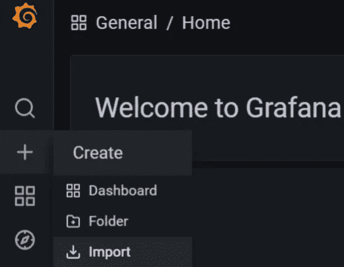
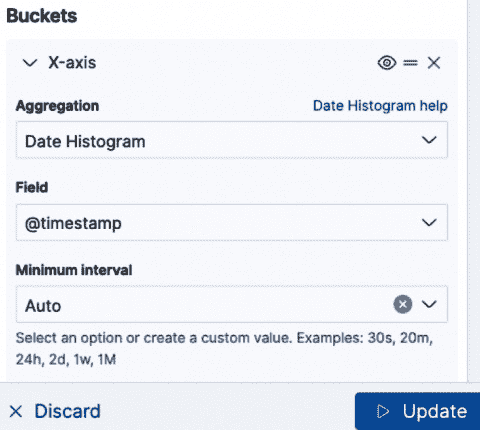

# 8

# 监控与日志记录 – 主动修复

“仅仅接受某事物的假设，或者同样地，未加调查地忽视它，可能会掩盖事实、让人盲目，并误导他人。”

– 阿布·纳萨尔·法拉比

监控私有云的底层基础设施是一个至关重要的操作活动，要求使用一致的工具和自动化方式来实现实时的指标收集和告警机制。在不同的 OpenStack 版本中，存在多种开源和商业工具来支持监控 OpenStack 生态系统中的不同组件。在最新版本中，我们可以找到更多成功的监控工具，它们提供了更简便的操作方式，且更容易集成到 OpenStack 生态系统中。收集指标数据是 OpenStack 操作任务的一部分；另外一部分是日志数据。每个 OpenStack 和共享服务都会生成大量具有不同日志级别的日志数据，所有这些数据加起来会变得非常复杂，在发生问题时，手动解析和查找异常会变得非常困难。拥有一个强大的日志管道是满足 OpenStack 操作旅程其中一项需求的关键。本章将结合监控和日志记录的实践，并介绍能够集成到运行中的 OpenStack 环境中的最新工具。

我们将讨论以下主题：

+   引入 Prometheus 作为 OpenStack 基础设施和工作负载监控的解决方案

+   在当前的 OpenStack 部署中部署和集成 Prometheus，并开始使用单独的监控堆栈来暴露 OpenStack 的指标

+   使用 Grafana 作为中央可观测性工具来构建、部署并探索仪表板，以便进行数据展示

+   使用 OpenSearch 构建高效且集中的日志解决方案，通过该解决方案传输、解析并构建自定义搜索查询，以便收集的日志进行进一步分析

# OpenStack 基础设施监控

除了运行在 OpenStack 租户中的工作负载外，云操作员还必须确保他们具备必要的指标来确保 OpenStack 服务的可用性、性能和使用状态。监控数据主要涉及 OpenStack 基础设施服务的两大类，如下所示：

+   **云软件**：包括 OpenStack API、调度程序、数据库、消息总线和负载均衡服务。

+   **云下**：包括运行的操作系统、存储和网络硬件。

在接下来的部分中，我们将探讨 Prometheus，这是一款已广泛集成和采用的监控与告警工具，适用于大规模部署。

## Prometheus 简介

**Prometheus**允许你收集并存储作为时间序列数据的度量值。Prometheus 被认为非常适合大规模部署，因为它提供了导出器和组件，将各种度量数据发送到 Prometheus 服务器。此外，该工具包括一个警报机制，用于根据配置的阈值管理警报和通知。与 Zabbix 或 Nagios 等其他工具不同，Prometheus 提供了灵活的方式来传输其格式收集的度量值和数据。这是通过第三方导出器来完成的，第三方导出器提供了与 Prometheus 兼容的度量值，减少了为每个软件框架的系统开发单独转换器的工作量。一些官方导出器托管在 Prometheus 的 GitHub 仓库中，可以在[`github.com/prometheus`](https://github.com/prometheus)找到。在 OpenStack 世界中，可以通过 OpenStack Prometheus 导出器将大量度量数据导出到 Prometheus，完整列表请见[`github.com/openstack-exporter/openstack-exporter`](https://github.com/openstack-exporter/openstack-exporter)。如下面的图示所示，Prometheus 还具有一个发现服务，OpenStack API 可以使用该服务来探索和生成 Prometheus 服务器的数据度量。这主要用于报告虚拟机的度量数据——例如，在 Nova API 服务中利用服务发现时。当 Prometheus 收集并存储度量数据后，应该有一个统一的视图来整合和组织所有数据，并展示在易于理解的仪表板上。Grafana 是一个出色的开源工具，用于度量数据的可视化，可以配置为使用 Prometheus 作为数据源。


图 8.1 – OpenStack 中的 Prometheus 集成和监控堆栈

在接下来的部分中，Prometheus 将作为主要监控工具在 OpenStack 环境中进行部署和集成。

## 部署基础设施监控

将 Prometheus 和 Grafana 组合作为 OpenStack 基础设施的中央监控和可观察性解决方案，对于云操作员来说是一个快速的胜利，因为在最新的 OpenStack 版本中，这种监控解决方案经过了良好的测试和集成。Kolla Ansible 在最新的代码发布中推动并支持 Prometheus 和 Grafana 的集成。可以专门设置一个额外的监控主机来运行 Prometheus 服务器，并可选地运行 Grafana。这可以通过以下配置在基础设施代码设置中实现：

1.  通过添加新的监控主机来更新**multi_packtpub_prod**清单文件，如下所示：

    ```
    ...
    [monitoring]
    mon01.os.packtpub
    ```

1.  将 Prometheus 服务添加到监控主机组：

    ```
    ...
    [prometheus:children]
    monitoring
    ```

1.  将内置的 Prometheus 警报管理服务添加到监控主机组：

    ```
    ...
    [prometheus-alertmanager:children]
    monitoring
    ```

1.  将 OpenStack Prometheus 导出器包括在监控主机组中。这将创建一个专用的服务容器，自动从 OpenStack 服务的指标中拉取格式化的 Prometheus 数据：

    ```
    ...
    [prometheus-openstack-exporter:children]
    monitoring
    ```

1.  将 Prometheus Node Exporter 角色添加到每个主机中运行。Node Exporter 提供了广泛的 Linux 操作系统和硬件指标：

    ```
    ...
    [prometheus-node-exporter:children]
    monitoring
    control
    compute
    network
    storage
    ```

1.  Prometheus 提供了一个专门的导出器用于**MariaDB 数据库**。通过导出器暴露的 MySQL 服务器指标提供了一个可供抓取的扩展数据指标列表。Prometheus MySQL 导出器可以添加到运行在云控制节点中的**mariadb**角色：

    ```
    ...
    [prometheus-mysqld-exporter:children]
    mariadb
    ```

1.  类似地，Prometheus 可以配置为通过其在负载均衡器节点中运行的专用导出器抓取 HAProxy 的负载均衡指标和统计信息：

    ```
    ...
    [prometheus-haproxy-exporter:children]
    loadbalancer
    ```

1.  另一个可用的导出器是**Prometheus Libvirt 导出器**，它暴露了主机和实例的指标。该导出器从**Libvirt API**收集数据，并暴露计算节点和运行中的实例的有用指标。**libvirt**导出器可以在计算节点中安装，如下所示：

    ```
    ...
    [prometheus-libvirt-exporter:children]
    compute
    ```

1.  对于 OpenStack 基础设施的更广泛监控设置，建议关注每个节点上运行的容器状态。Prometheus **cAdvisor**（即**Container Advisor**）导出器旨在收集、分析、汇总和导出容器性能和指标数据。**cAdvisor**导出器将跨所有 OpenStack 节点运行，如下所示：

    ```
    ...
    [prometheus-cadvisor:children]
    monitoring
    control
    compute
    network
    storage
    ```

1.  下一步是使用**kolla-ansible**启用并安装 Prometheus 服务。在撰写本版本时，**kolla-ansible**将通过将以下变量添加到**globals.yml**文件中，安装 Prometheus 服务器的 2.0 之后的最新版本：

    ```
    ...
    enable_prometheus: "yes"
    ```

1.  要启用数据暴露和可视化，请在**globals.yml**文件中启用 Grafana：

    ```
    ...
    enable_grafana: "yes"
    ```

1.  **kolla-ansible**允许为 Prometheus 和 Grafana 服务的监控层设置自定义配置。一旦安装了这两个服务，您将需要提供一个用户名和密码以进行访问。默认情况下，**kolla-ansible**通过 HTTP 使用基本认证安装 Prometheus，并使用**admin**用户和 Grafana 用户**grafana**。这两个默认变量分配到**/kolla-ansible/ansible/group_vars/all.yml**文件中，如下所示：

    ```
    ...
    prometheus_alertmanager_user: "admin"
    prometheus_grafana_user: "grafana"
    ```

    对于自定义用户访问设置，您可以通过直接调整**all.yml**文件中的变量或在**/kolla-ansible/ansible/roles/prometheus/defaults/main.yml**文件中的**prometheus_basic_auth_users**配置部分覆盖默认的用户名，如下所示：

    ```
    ...
    prometheus_basic_auth_users_default:
      - username: admin
        password: "{{ prometheus_password }}"
        enabled: true
      - username: "{{ prometheus_grafana_user }}"
        password: "{{ prometheus_grafana_password }}"
        enabled: "{{ enable_grafana }}"
    ```

    Prometheus 和 Grafana 的用户密码可以在**/etc/kolla/passwords.yml**文件中重新配置，该文件定义了所有服务的密钥。两个密码都使用以下变量定义：

    ```
    prometheus_password:
    prometheus_grafana_password:
    ```

    另一个选项是通过扩展**prometheus_basic_auth_users_extra**变量，在**/kolla-ansible/ansible/roles/prometheus/defaults/main.yml**文件中，使用自定义密码或默认密码创建新用户，而不覆盖现有用户，如下所示：

    ```
    prometheus_basic_auth_users_extra:
       - username: prometheus_pp_admin2
         password: "{{ prometheus_password }}"
         enabled: true
       - username: prometheus_pp_2
         password: prometheus_pp_password
         enabled: true
    ```

1.  另一种很好的度量抓取方式是通过在**globals.yml**文件中的**prometheus_cmdline_extras**变量中列出一组启动参数来配置自定义 Prometheus 运行。例如，可以配置 Prometheus 通过**--storage.tsdb.retention.size**参数将度量数据保持到特定的大小。在以下列出的配置中，定义了一个自定义配置，用于将 Prometheus 仪表板上最大同时连接数限制为**30**个连接，调整日志严重性级别以包含**error**（默认严重性级别为**info**），每**30**秒将警报重新发送到 Prometheus 警报管理器，并将度量数据在存储中保留**30**天：

    ```
    prometheus_cmdline_extras: " --web.max-connections 30 --log.level error  --rules.alert.resend-delay 30s  --storage.tsdb.retention.time 30d "
    ```

重要提示

可以在[`prometheus.io/docs/prometheus/latest/command-line/prometheus/`](https://prometheus.io/docs/prometheus/latest/command-line/prometheus/) 找到 Prometheus 启动参数的完整列表。

1.  运行管道来部署 Prometheus 服务器、Grafana、Prometheus cAdvisor 和相关的导出器组件。一旦部署管道完成，通过在其中一个控制节点运行以下命令行来验证新部署的容器：

    ```
    $ docker ps -a | grep -e prometheus -e grafana
    ```

    我们获得了如下输出：


图 8.2 – 列出 Prometheus 和 Grafana 的 Kolla 容器

在接下来的部分中，我们将查看 Prometheus 收集的度量标准，并使用 Grafana 构建有洞察力的仪表板。

## 探索监控数据

最新的**kolla-ansible**部署使得 Prometheus 服务器开始收集可以在 Prometheus 仪表板上检查的不同度量标准。主 Prometheus 仪表板可以通过指向监控主机的 IP 地址访问：**http://host_monitoring_ip/prometheus**，其中**host_monitoring_ip**是运行 Prometheus 服务器的监控主机的 IP 地址。


图 8.3 – Prometheus 仪表板界面

Prometheus 从清单中定义的所有主机的每个已安装导出器收集详尽的度量标准。它使用**labels**来定义每个度量的目标端点。例如，一旦安装了 OpenStack 导出器，Prometheus 就开始收集与 OpenStack 相关的度量标准，可以通过指向**http://host_monitoring_ip:9090/targets**来检查，**host_monitoring_ip**是运行 Prometheus 服务器的监控主机的 IP 地址。

一旦每个节点的导出服务发送指标数据进行抓取，收集的指标将在 Prometheus 仪表板中显示。可能需要一些时间才能在 Prometheus 仪表板中可视化所有指标。例如，以下列表显示了初始 OpenStack 服务通过 **http://host_monitoring_ip:9100/metrics** 导出了指标，其中 **host_monitoring_ip** 是运行 Prometheus 服务器的监控主机的 IP 地址：


图 8.4 – Prometheus 中收集的 OpenStack 服务指标列表

安装在每台 OpenStack 物理机器上的 Node Exporter 服务，用于收集主机指标，如内存使用情况和统计信息，可以通过在同一 Prometheus 仪表板 URL 上查看指标列表来检查，如以下示例所示：


图 8.5 – Prometheus 中收集的内存指标和统计信息列表

随着更多节点加入 OpenStack 基础设施，收集的指标数量可能会增加一倍，这将影响监控主机的性能和磁盘容量。因此，强烈建议使用多个 Prometheus 服务器实例来处理更多的指标导出和抓取任务。Prometheus 被设计为在大规模部署中具有良好的可扩展性，能够支持成千上万的资源类型和指标。

在 Prometheus 仪表板上浏览数百个指标，以跟踪数百个服务状态和相关的使用信息可能会很麻烦。Prometheus 在大多数关键操作任务中都能发挥很大作用，包括以下任务：

+   指标数据收集配置

+   告警的管理与配置

+   故障排除指标导出问题

Prometheus 是一个高度可配置的工具，提供本地命令行接口，以自定义指标收集和抓取设置，这超出了本书的范围。我们将使用 Prometheus 导出的指标数据，并在简单的 Grafana 仪表板中可视化它。

最新的 **kolla-ansible** 运行应启用 Grafana 服务，并使用默认仪表板配置 Prometheus 作为数据源。要验证 Prometheus 数据源，请访问 **http://host_monitoring_ip:3000**，其中 **host_monitoring_ip** 是运行 Grafana 实例的监控主机的 IP 地址。提供用户名和密码以访问前面步骤中配置的 Grafana 仪表板。如果你没有自定义 Grafana 访问凭据，请使用默认的用户名和密码组合 **admin** / **admin**。

登录后，在仪表盘中导航至设置图标 | **配置** | **数据源**，并确保已添加 Prometheus 数据源。验证数据源是否正常工作，并且没有报告错误。点击 **保存并测试** 按钮，应该显示数据源配置正常，如下图所示：


图 8.6 – 在 Grafana 仪表盘中添加 Prometheus 数据源

一旦数据源检查完毕，在 Grafana 中构建仪表盘就变得非常简单，可以通过创建自由格式的仪表盘或从 Grafana 网站目录导入仪表盘来完成。[`grafana.com/`](https://grafana.com/) 提供了每个 Prometheus 导出器的不同仪表盘，按仪表盘 ID 标识，可以轻松地将其添加到本地 Grafana 服务器中。你也可以导入 JSON 格式的仪表盘，并将其复制并粘贴到 Grafana 导入部分。在下一个向导中，我们将使用 **仪表盘导入 ID** 选项导入 OpenStack 和 Node Exporters 的 Grafana 仪表盘。为此，只需导航到 Grafana 首页，然后点击 **+** 图标并选择 **导入**：



图 8.7 – 在 Grafana 中添加仪表盘

从 OpenStack 指标导出器开始，导航到 OpenStack Grafana 仪表盘 [`grafana.com/grafana/dashboards/9701-openstack-dashboard/`](https://grafana.com/grafana/dashboards/9701-openstack-dashboard/)，并复制仪表盘的 ID，如下所示：


图 8.8 – 获取仪表盘 ID

将复制的仪表盘 ID 粘贴到 Grafana 仪表盘 **导入** 页面。仪表盘 ID 应为 **9701**：


图 8.9 – 将仪表盘 ID 导入到 Grafana 中

导入向导的下一页将引导你完成导入仪表盘的设置。输入你选择的仪表盘名称，并确保选择了**Prometheus**数据源，如下图所示：


图 8.10 – 配置仪表盘，使用 Prometheus 作为数据源

一旦导入向导完成，导入的 OpenStack 导出指标的 Grafana 仪表盘将显示各种图表和指标，例如每个 OpenStack 服务资源使用情况的概览。服务指标的一些亮点如下：

+   当前存在的 Keystone 用户、用户组和项目

+   Neutron 资源，如部署的浮动 IP、虚拟网络和安全组

+   Nova 服务运行的实例数量

+   当前 Glance 镜像的数量

+   Cinder 服务管理的卷和快照

+   CPU、RAM 和磁盘资源的总体使用情况

可以显示多个仪表板，如下所示的截图所示：


图 8.11 – 以 Prometheus 为数据源的通用导入仪表板

导入的仪表板提供了对每个服务及其相关子组件（如 API 服务和代理）的更多洞察。


图 8.12 – 每个 OpenStack API 服务状态的导入仪表板

另一个有用的仪表板应存在，用于监控运行云环境的主机，通过 Prometheus Node Exporter。Grafana 模板仪表板可以在 [`grafana.com/grafana/dashboards/1860-node-exporter-full/`](https://grafana.com/grafana/dashboards/1860-node-exporter-full/) 上找到，仪表板 ID 为 **1860**。请按照与 OpenStack 导出仪表板相同的导入说明操作，确保选定的数据源为 Prometheus。

导入后，将创建一个新的 Grafana 命名空间，数据源为 Prometheus。收集的数据反映了来自每个 OpenStack 主机的操作系统和硬件指标的详细和深刻信息，使用已安装的 Node Exporter 服务：


图 8.13 – OpenStack 的整合仪表板

同样，你可以为每个安装的 Prometheus 导出器导入现成的 Grafana 仪表板。数据库指标仪表板可以在 [`grafana.com/grafana/dashboards/14057-mysql/`](https://grafana.com/grafana/dashboards/14057-mysql/) 上找到，HAProxy 仪表板则可以在 [`grafana.com/grafana/dashboards/2428-haproxy/`](https://grafana.com/grafana/dashboards/2428-haproxy/) 上找到。

关于从运行 OpenStack 服务的主机收集的数据，Prometheus Node Exporter 服务支持主动识别可能的系统异常。导入的仪表板将所有主机的指标整合在一个界面中，可以通过单个或一组主机进行过滤，提供更自定义的可视化体验。

接下来，我们将跟踪运行在 OpenStack 私有云上的工作负载。

# OpenStack 工作负载监控

云运营商的下一项操作任务是为 OpenStack 租户的运行工作负载提供监控支持。运营商还应监控租户所提供资源的一些通用指标，以预测配额限制并深入分析基础设施的使用情况。可以使用上一节中提到的相同工具集来实现这一目标。工作负载监控更多关注每个租户所部署的资源——更准确地说，是 Nova 实例。Prometheus 能够查询 Nova API，并通过其标签配置设置，你应该能够将数千个实例筛选并组织成一组抓取目标。在上一节中，Prometheus Libvirt 导出器已经在每个计算节点上部署（见 *部署基础设施监控* 部分的 *步骤 8*）。因此，无需重新配置任何基础设施主机部分。实例指标应可在 Prometheus 服务器中使用，但是否为任何报告的实例提供附加信息是可选的。Prometheus 可以通过应用导出器配置和 **relabel_configs** 设置来配置发现 OpenStack 实例，以下是一个示例：

```
- job_name: 'openstack_pp'
openstack_sd_configs:
  - role: 'instance'
...
relabel_configs:
  - source_labels: [__meta_openstack_public_ip]
    target_label: __address__
    replacement: '$1:9100'
  - source_labels: [__meta_openstack_tag_prometheus]
    regex: true.*
    action: keep
- source_labels: [__meta_openstack_tag_node_exporter]
 regex: true.*
    action: keep
 - action: labelmap
   regex: __meta_openstack_(.+)
```

标签重新标记配置有助于提取与 Prometheus 中的正则表达式匹配的已发现实例的元数据。在前面的示例中，**__meta_openstack_(.+)** 正则表达式被应用并添加到所有不同源标签接收的每个指标中。这有助于通过更具体的信息（例如实例名称、IP 地址和实例状态）来可视化租户资源，如下所示的 Prometheus 服务器端点仪表板示例：


图 8.14 – Prometheus 仪表板中的实例指标列表

**kolla-ansible** 的默认 Prometheus 配置不包括每个导出器类型的完整标签集。所有导出器的 Prometheus 主要配置可以在 **kolla-ansible/ansible/roles/prometheus/templates/prometheus.yml.j2** 文件中找到。包含自定义重新标签配置的一种方法是编辑该文件并修改每个导出器部分的设置。推荐的方式是创建一个新的自定义配置文件，例如在新配置目录下创建一个名为 **custom.yml** 的文件，如 **/etc/kolla/config/prometheus/prometheus.yml.d/**，并通过运行管道应用新的附加设置。**kolla-ansible** 会将附加配置合并到正在运行的 Prometheus 服务器中，但请注意，这将需要短暂重启服务器以加载新的配置。

在 Grafana 中可视化实例指标只需构建相应的仪表盘。类似于主机指标的可观察性操作，Node Exporter 和 Libvirt 模板仪表盘结合实例特定的指标，为每个计算节点的实例资源使用构建自定义选项卡。这包括总资源消耗概览，如 CPU、RAM 和分配的磁盘。撰写本版本时，通过 Prometheus 探测服务导入虚拟机指标的 Grafana 仪表盘尚不可用。

可以在 [`grafana.com/grafana/dashboards/15330-openstack-instance-metrics/`](https://grafana.com/grafana/dashboards/15330-openstack-instance-metrics/) 找到来自 [grafana.com](http://grafana.com) 的实例指标 Grafana 仪表盘，仪表盘 ID 为 **15330**。在没有完全运行的 **telemetry OpenStack** 服务（包括 **Ceilometer** 和 **Gnocchi**）的情况下，无法使用此仪表盘，后续章节将详细介绍该服务。

# 遥测与计费

OpenStack 为租户环境提供遥测服务，Ceilometer 服务为其中的一部分。Ceilometer 项目的目标是帮助云操作员收集指标，进一步协助理解资源的利用情况。这使我们能够在资源达到限制之前，解决基础设施的可扩展性问题，并更新资源规划以支持扩展和增长。从 Queens OpenStack 版本开始，遥测模块已扩展为包含与 Ceilometer 协同工作的其他组件，包括以下内容：

+   **Aodh** ：一个基于收集的指标数据进行处理的告警服务

+   **Gnocchi** ：时间序列数据的存储和收集

+   **Panko** ：Ceilometer 生成的事件数据存储

重要提示

在撰写本版本时，**Panko** 模块已被弃用，且不再由 OpenStack 社区维护。

下一节将更详细地介绍遥测堆栈。

## Ceilometer 架构

Ceilometer 项目最初的目标（直到 Folsom 版本）是从云租户处收集资源使用指标，并将其转化为可开具账单的项目。Ceilometer 项目的持续发展使其具备了更多的监控和告警功能。从 Liberty 版本开始，这些功能被分离到独立的模块中。

如下图所示，Ceilometer 依赖代理来收集、处理、存储和检索数据。


图 8.15 – Ceilometer 架构的总体概述

每个数据工作流由一个专用代理执行，代理清单如下：

+   **Polling agents** : 这些代理定期轮询每个 OpenStack 基础设施服务，通过 API 调用来生成度量。计算轮询代理从计算节点中运行的实例收集统计数据，并将其轮询到消息队列。中央代理运行在 OpenStack 中的中央管理服务器上，如云控制器。它轮询除实例之外的资源统计信息。

+   **Notification agents** : 这些代理定期监听消息队列总线，收集由不同 OpenStack 服务设置的新通知消息，并将其转换为度量，然后将其推送回相应的消息队列总线。

+   **Collector agents** : 这些代理监控消息队列，收集样本，并收集由轮询或通知代理生成的度量消息。因此，新的度量消息将被记录到后端存储中。

+   **API service** : 如果启用，它将公开一个标准 API，提供对内部 Ceilometer 数据库的访问，以查询相应的计量数据。

数据收集主要通过代理使用管道机制执行。它们定期发送请求以获取反映某个度量的样本对象。每个样本请求都将转发到管道。一旦传递到管道，度量可以由多个转换器类型进行处理：

+   **Accumulator** : 这是累积多个值并将其批量发送的功能。

+   **Aggregator** : 这将多个值汇聚为一个算术结果。包括用于计算百分比的算术函数。

+   **Rate of change** : 通过从先前的数据推导出另一个度量来识别趋势。

+   **Unit conversion** : 这是用于单位转换的类型。

一旦经过处理和转换，度量可能通过多种发布器类型之一继续其路径：

+   **Notifier** : 这是通过可靠的消息队列推送的度量数据。

+   **rpc** : 这是同步的 RPC 度量数据发布器。

+   **udp** : 这是通过 UDP 发送的度量数据。

+   **file** : 这是将度量数据发送到文件中的功能。

上述组件的说明如下：


图 8.16 – 通过度量管道进行度量数据转换和发布

收集到的数据可以存储在 Ceilometer 支持的不同类型的数据库中。最初，MongoDB 是一个广泛采用的数据存储用于遥测度量存储。由于 MongoDB 在可扩展性和性能方面的问题，Gnocchi 被评估为一个适合 Ceilometer 的时间序列数据库，相关内容将在下一节中介绍。

## Gnocchi 数据存储

自从 Train 版本的 OpenStack 发布以来，**Gnocchi**被认为是 Ceilometer 的默认和官方支持的存储服务。考虑到之前的指标数据存储选项在性能和可扩展性方面的问题，引入 Gnocchi 作为时间序列数据库，解决了在大规模环境中处理和存储指标数据时的主要瓶颈问题。数据样本不再直接写入数据库，而是转换为 Gnocchi 元素，并随后通过其原生 API 提交。聚合数据以时间序列的形式记录。每个转换后的样本表示一个数据点，具有时间戳和度量值。

使用 Gnocchi 进行数据优化的特点是为资源及其相关属性建立索引。因此，数据搜索速度更快。如前所述，Gnocchi 通过利用可扩展存储系统（如**Swift**和**Ceph**）中的指标数据存储，提供了可扩展的指标存储设计。如下一图所示，Gnocchi 可以配置为在 Swift 或 Ceph 中聚合和存储度量数据，作为存储后端，使用其内置的存储驱动程序：


图 8.17 – Gnocchi 数据存储多后端支持

数据通过**metricd**进行聚合和存储处理。**metricd**负责刷新标记为删除的指标。Gnocchi 提供了兼容的**statsd**协议（**gnocchi-statsd**），用于监听传入的指标。**statsd**将在后续的 Gnocchi 部署中使用。

## 使用 Aodh 进行警报设置

自 Liberty 版本以来，Ceilometer 警报模块被分叉并重命名为**Aodh**，它负责根据自定义规则触发警报。

如下图所示，将当前的警报服务与 Ceilometer 之前的服务进行比较时，可以明显看到一个区别——当负载增加时，能够进行水平扩展。使用相同的消息队列，Aodh 提供了一个事件监听器，捕捉新的通知并提供即时响应，零延迟。Aodh 监听器依赖于预定义的警报，根据事件和配置的度量值立即触发。在使用编排服务（例如**Heat**）时，反应自动扩展条件变得非常有用：


图 8.18 – OpenStack 中的 Aodh 警报概述

Aodh 主要由一个 API 服务器（**aodh-api**）构成，提供对数据存储的访问。Aodh 警报评估器（**aodh-evaluator**）基于收集到的统计趋势，在一定时间内超过阈值时触发警报。警报由 Aodh 通知监听器（**aodh-listener**）触发，基于通知代理报告的事件与规则匹配。Aodh 警报通知器（**aodh-notifier**）根据一组样本的阈值启用警报设置。

Aodh 通知支持基于事件和阈值的告警。在最新的 OpenStack 版本中，Aodh 默认从 Gnocchi 数据存储查询度量数据。

## 部署遥测服务

当前的**kolla-ansible**仓库支持在 OpenStack 中完全部署遥测服务。这包括 Ceilometer、Aodh 和 Gnocchi 服务。由于我们已经在*第三章*《OpenStack 控制平面 - 共享服务》中部署了 Ceilometer 服务，接下来我们将详细介绍遥测栈的 Ansible 角色配置：

1.  如果 Ceilometer 服务尚未启用，则确保将其添加到云控制节点组中，可以通过将其添加到**multi_packtpub_prod**库存文件来实现，如下所示：

    ```
    ...
    [ceilometer:children]
    control
    ```

1.  将 Ceilometer 中央轮询和通知代理添加到云控制节点组：

    ```
    ...
    [ceilometer-central:children]
    ceilometer
    [ceilometer-notification:children]
    ceilometer
    ```

1.  将 Ceilometer 轮询代理添加到计算节点组：

    ```
    ...
    [ceilometer-compute:children]
    compute
    ```

1.  作为云控制节点组的一部分运行 Gnocchi 服务：

    ```
    ...
    [gnocchi:children]
    control
    ```

1.  将 Gnocchi 组件，包括 API、**statsd**（**gnocchi-statsd**守护进程）和**metricd**（**gnocchi-metricd**守护进程）服务，分配给作为云控制节点组中 Gnocchi 实例的一部分运行：

    ```
    ...
    [gnocchi-api:children]
    gnocchi
    [gnocchi-statsd:children]
    gnocchi
    [gnocchi-metricd:children]
    gnocchi
    ```

1.  作为云控制节点组的一部分运行 Aodh 告警服务：

    ```
    ...
    [aodh:children]
    control
    ```

1.  将 Aodh 组件，包括 API、评估器、监听器和**通知器**服务，分配给作为云控制节点组中 Aodh 实例的一部分运行：

    ```
    ...
    [aodh-api:children]
    aodh
    [aodh-evaluator:children]
    aodh
    [aodh-listener:children]
    aodh
    [aodh-notifier:children]
    aodh
    ```

1.  接下来，确保在**globals.yml**文件中启用 Ceilometer 服务：

    ```
    ...
    enable_ceilometer: "yes"
    ```

1.  在**globals.yml**文件中启用 Gnocchi 服务，并可选择启用**statsd**协议支持，该支持将安装并运行**gnocchi-statsd**守护进程：

    ```
    ...
    enable_gnocchi: "yes"
    enable_gnocchi_statsd: "yes"
    ```

1.  **globals.yml**文件中的最后一个配置是通过将相应的变量设置为**yes**来启用 Aodh 告警服务：

    ```
    ...
    enable_aodh: "yes"
    ```

1.  运行部署管道，并确保在安装遥测服务时没有报告错误。使用以下命令行验证遥测服务容器是否在某个云控制节点中正常运行：

    ```
    $ docker ps -a | grep -e ceilometer -e gnocchi -e aodh
    ```

    这是我们得到的输出：


图 8.19 – 部署的遥测 Kolla 容器列表

一旦 Ceilometer、Gnocchi 和 Aodh 三者加入到 OpenStack 部署中，你应该拥有一个完全功能的遥测服务。浏览 Ceilometer 指标非常简单，并且可以通过 Aodh 配置告警。指标和告警是应对日常监控操作的关键元素。然而，即使有了这些，也不足以应对问题，必须加入服务日志，我们将在下一节进行介绍。

# 掌握集中式日志记录

操作 OpenStack 云环境的第二个关键部分是通过日志信息来检查基础设施中的事件。由于 OpenStack 配置中涉及数十个部署的服务，云操作员应该在每个服务中启用日志记录，至少在控制平面内启用日志，以便进行故障排除、分析，甚至创建自定义度量标准以供警报使用。根据所使用的 OpenStack 部署工具和配置设置，Linux/Unix 系统中的标准服务将其日志写入**/var/log/** 目录及其子目录中。

随着大量日志数据的生成，解析和处理所有日志数据成了提取有意义信息或排查意外问题的障碍，这些问题可能需要更长时间才能解决。为了克服这一挑战，你的日志环境必须发展为集中式。一个好的选择是开始将日志流入专用的**rsyslog** 服务器。你可能会输入如此多的数据，以至于日志服务器开始缺乏更大的存储容量。此外，当你需要为特定上下文提取信息时，归档上述数据将没有用处。此外，将具有不同格式的日志数据（考虑到 RabbitMQ 和 MySQL 日志）与生成的事件进行关联甚至可能变得不可能。所以，在这个阶段，我们需要一套质量要求来提供良好的 OpenStack 日志体验，如下所示：

+   日志元数据的解析能力

+   快速的日志数据索引

+   易于理解的数据展示

+   基于自定义日志数据聚合构建的度量标准

在 OpenStack 中生成的日志是结构化的，适合处理，并且可以通过多种工具解析，包括开源的**ELK** 堆栈，ELK 由**Elasticsearch**、**Logstash** 和 **Kibana** 组成，甚至可以通过商业第三方工具，如 Datadog 和 Splunk 来解析。ELK 是在大型 OpenStack 部署中最常用的日志处理工具。除 **kolla-ansible** 外，大多数 OpenStack 部署工具开箱即用地支持 ELK 堆栈。尽管 ELK 堆栈仍然是管理 OpenStack 日志的有效选择，但最新的 OpenStack 版本已转向采用分叉的开源 Elasticsearch 解决方案，并宣布**OpenSearch**将成为未来 OpenStack 操作中处理日志的新方式。

## OpenSearch 引擎

OpenSearch 是一个开源软件，采用 Apache 2.0 版本许可。由于其庞大的社区和活跃的提交，它已经成为一个非常流行的搜索引擎和日志分析套件，并且源自 Elasticsearch 项目。OpenSearch 套件包括一个搜索引擎、数据存储和用于可视化的仪表板，这些都源自 Kibana。OpenSearch 架构基于分布式设计，不同的组件可以在不同的集群节点上运行。下图展示了基于 OpenSearch 的 OpenStack 日志解决方案概览：


图 8.20 – OpenStack 环境中 OpenSearch 日志集群概览

如前图所示，适用于中到大规模部署的典型 OpenSearch 环境包括多种集群节点角色，例如以下几种：

+   **集群管理节点**：此节点跟踪 OpenSearch 集群状态，包括节点状态变化（如加入和离开）及健康状态、索引管理和分片分配。为了高可用性，建议在生产环境中至少运行两个管理节点。

+   **协调节点**：此节点接收来自仪表板或客户端库发起的请求，并将它们委派给数据节点上的正确分片，然后获取、聚合并将数据结果返回给客户端。

+   **数据源节点**：此节点代表 OpenSearch 集群的工作马，存储数据并执行不同的数据相关操作，包括索引、聚合和搜索。

重要提示

其他类型的节点，包括 **主节点候选** 和 **摄取节点**，也可以成为 OpenSearch 集群的一部分。任何未被标记为主节点的节点都被指定为主节点候选角色。摄取节点适用于大规模数据摄取管道，并将索引工作负载从数据节点中卸载。

OpenSearch 是高度可扩展的，可以安装多种类型的插件，以增强搜索体验、安全功能、机器学习和性能分析。可用的插件列表请参见 [`opensearch.org/docs/latest/install-and-configure/plugins/#available-plugins`](https://opensearch.org/docs/latest/install-and-configure/plugins/#available-plugins)。

OpenSearch 解决方案采用分布式架构，使您能够为大规模搜索和分析操作进行扩展。OpenSearch 核心搜索服务支持多种独特功能，使得日志分析、数据摄取和可观察性功能的运行变得更加容易。此外，由于提供了在多个节点上处理分片的额外方式，从而加速了搜索操作，性能也成为了采用 OpenSearch 的有效理由。不同的 OpenStack 和常见基础设施服务生成的数据量可能巨大，可以输入到 OpenSearch 集群中。通过提供 OpenSearch 集群的最小规模，云操作员可以开始探索丰富的搜索和可视化体验。这使得您能够创建可视化图表，发现复杂且大型系统中难以通过基本指标检测到的故障部件。

## 部署 OpenSearch

在编写本版时，**kolla-ansible** 支持 OpenSearch 安装。社区推荐采用 OpenSearch 选项，它可以通过几个步骤进行部署。强烈建议专门配置一个日志集群，该集群运行不同类型的 OpenSearch 节点，正如前面一节所述。对于每个 OpenSearch 节点的需求，还应做其他考虑，以便您可以根据所需的性能量身定制日志集群。例如，数据节点需要更多的磁盘空间，并可以通过配备更高 IOPS 的快速磁盘（如 **固态硬盘**（**SSDs**））进行升级。主节点和协调节点是更高要求的计算机，可以配备更强大的 CPU。对于下一个设置，我们将在控制节点中运行一个简单的 OpenSearch 服务实例：

1.  将 OpenSearch 引擎和 **dashboards** 角色分配给控制节点：

    ```
    ...
    [opensearch:children]
    control
    [opensearch-dashboards:children]
    opensearch
    ```

1.  在 **globals.yml** 文件中更改以下变量，以将 OpenSearch 安装为中央日志服务：

    ```
    ...
    enable_central_logging: "yes"
    ```

1.  默认情况下，Kolla 会部署 OpenSearch 服务，并使其监听 **9200** 端口。当部署在控制节点上时，OpenSearch Dashboards 应该能够通过分配给 Keepalived 的预留 VIP 访问，以运行云控制器集群。您还可以选择为其分配一个 FQDN，并在所有 OpenStack 节点内部填充主机名。仪表盘可以通过浏览器在内部的 **5601** 端口访问，且在 **globals.yml** 文件中设置的 **kolla_internal_fqdn** 变量指向 **kolla_internal_vip_address** 变量。请确保至少设置 **kolla_internal_vip_address** 变量为 VIP 地址或映射的 DNS 端点名称：

    ```
    kolla_internal_vip_address: "10.0.0.47"
    ```

1.  OpenStack 仪表盘使用默认的 **'opensearch'** 用户名创建，密码可以通过设置以下变量，在 **kolla-ansible/etc/kolla/passwords.yml** 文件中进行编辑：

    ```
    opensearch_dashboards_password: 'openstestpass'
    ```

1.  其他可以提前执行的高级且有用的配置，以解决常见的 OpenSearch 操作设置包括日志保留策略，这对于处理磁盘空间管理、数据轮换和生命周期至关重要。OpenSearch 配备了**索引状态管理**插件，通过定义日志保留策略来管理数据轮换。确保在 **ansible/roles/opensearch/defaults/main.yml** 文件中定义的 Ansible OpenSearch 角色中启用此功能，方法是检查以下变量：

    ```
    opensearch_apply_log_retention_policy: true
    ```

1.  启用后，OpenSearch 通过定义软保留期和硬保留期提供索引数据生命周期。软保留期由**opensearch_soft_retention_period_days**变量在 **ansible/roles/opensearch/defaults/main.yml** 文件中定义，其中索引被关闭，不再活跃，并处于删除阶段，但它们仍然占用磁盘空间并且可以重新打开。硬保留期是索引被永久删除并不再占用磁盘空间的持续时间。它们由**opensearch_hard_retention_period_days**变量在 **ansible/roles/opensearch/defaults/main.yml** 文件中定义。默认的软保留期和硬保留期分别设置为**30**和**60**天。可以通过在 **globals.yml** 文件中创建新变量并在 OpenSearch playbook 中引用它们，或者直接在 **ansible/roles/opensearch/defaults/main.yml** 文件中修改软保留期为**45**天，硬保留期为**90**天来编辑这些值：

    ```
    opensearch_soft_retention_period_days: "{{ elasticsearch_curator_soft_retention_period_days | default(45) }}"
    opensearch_hard_retention_period_days: "{{ elasticsearch_curator_hard_retention_period_days | default(90) }}"
    ```

1.  运行管道并确保输出不包含作业配置中的错误。完成后，运行以下命令行以验证额外的 Kolla 容器：

    ```
    $ docker ps –a | grep –e opensearch
    ```

    这是输出：


图 8.21 – 列出 OpenSearch Kolla 容器

1.  在浏览器中访问 OpenSearch Dashboards 的 URL **http://10.0.0.47:5601**。输入**'opensearch'**用户名和配置的密码以开始日志搜索：


图 8.22 – OpenSearch 登录页面

1.  要在首次登录后开始搜索日志，必须创建索引模式以从日志源提取数据。索引模式指向一个特定的索引，可以从指定日期提取日志数据，例如。从**OpenSearch Dashboards**面板中，点击**索引模式**按钮，如下所示：


图 8.23 – 在 OpenSearch 仪表板中创建索引模式

1.  接下来，通过应用过滤器来指定索引模式设置，以提取并聚合数据。在当前示例中，将应用**时间戳**过滤器。默认情况下，OpenSearch 会为每个索引模式关联一个唯一标识符，如下所示：


图 8.24 – 为索引模式应用过滤器

1.  创建后，索引模式将把过滤器应用于源数据，并可视化 OpenSearch 保存的字段映射核心类型。例如，创建的索引模式引用了一组字段，这些字段在仪表板上方的 **发现** 标签中可见：


图 8.25 – 列出索引模式的字段选择

1.  可以使用 **发现** 面板中的搜索栏对日志进行过滤，搜索栏列出所有带有时间框架的相关事件，如下图所示：


图 8.26 – 为日志过滤应用时间框架

1.  可以使用搜索过滤器栏进一步应用过滤。在下例中，添加的过滤器用于拉取 **log_level** 字段中值为 **ERROR** 的所有数据：


图 8.27 – 为日志过滤应用 log_level 过滤器

为了快速监控使用特定过滤器拉取的数据趋势，利用 OpenSearch 的可视化能力至关重要。通过丰富多样的仪表板对象，操作员可以为每个搜索过滤后的查询构建不同类型的可视化图表。要创建可视化图表，指向 **可视化** 标签并点击 **创建可视化图表** 按钮。从返回的列表中选择 **垂直条形图** 可视化类型，以展示从最后保存的查询中收集的过去一小时内的错误发生次数。创建后，会生成一个新的图表，可以将其细分为更具体的字段，称为 **桶**。通过在创建的图表设置中添加一个桶并选择 **X 轴** 选项，可以执行数据图表聚合。如下例所示，数据聚合已固定为 **日期直方图** 类型，默认使用 **@** **时间戳** 字段：



图 8.28 – 使用 OpenSearch 桶进行数据聚合

1.  更新后，可以在单一视图中可视化所有拉取日志数据的错误率概览：


图 8.29 – 基于已应用过滤器的日志可视化仪表板

OpenSearch 仪表板具有高度可定制性，可以执行更多数据聚合，以便呈现更精细的数据。例如，之前的图形表示可以保存在专用的服务状态仪表板中，然后你可以通过暴露每个服务的错误信息，从相同的图表添加新的可视化。

# 总结

本章涵盖了操作 OpenStack 环境的两个基本实践，探讨了可能的监控和日志记录方式。部署的监控和日志堆栈可能因操作环境而异，这取决于操作员的经验、对特定工具的熟悉程度或其他第三方解决方案。最佳实践之一是始终监控云平台下方和上方发生的事情，提供捕获指标和收集数据的必要方式，以便在问题达到更高严重性等级之前进行处理，而不是等到必须开始应对事件时再采取行动。正如本章所展示的，Prometheus 提供了多种配置方式，并通过简单集成导出器，云操作员可以轻松实现自动化方式收集指标。单一面板工具 Grafana 将所有指标集中在综合仪表板中，操作员可以密切观察不同系统元素的趋势。OpenStack 的遥测服务，通常称为 Ceilometer、Aodh 和 Gnocchi 三重奏，已被涵盖并部署，以开始为租户计费和跟踪资源使用情况。在本章结尾，探讨了日志记录管道的挑战，以及一个广泛采用的解决方案 OpenSearch，它能够整合 OpenStack 各个角落生成的大量日志，操作员可以在其中探索可疑事件，并积极进行修复。日志提供了有价值的信息，如果结合在一个强大的管道中进行分析，云操作员可以发现那些通过简单指标难以检测的异常情况。故障迹象的早期检测有助于评估云基础设施性能并提供反馈，从而改善环境服务，确保服务水平协议（SLA）的兑现。

除了设置日志记录管道，下一章将介绍如何进行基准测试，以深入了解 OpenStack 基础设施，并评估私有云的容量。
